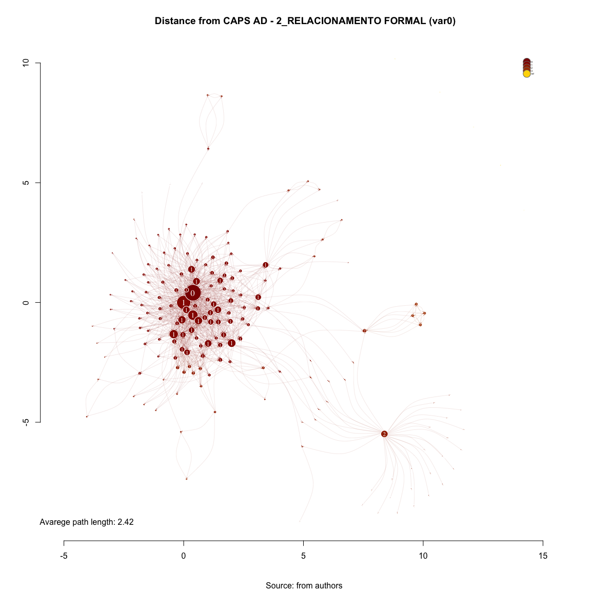

# SNA Reciprocity Distance Path 2_RELACIONAMENTO FORMAL (var0)
Leonardo Martins  
17 de julho de 2016  
SNA Descritive Analysis from "Projeto Redes de Atenção às pessoas que consomem álcool e outras Drogas em Juiz de Fora-MG   Brazil"  - SNArRDJF

Here you can find a basic script to analysis data from SNArRDJF - this script was elaborated considering its use for orther matrix adjacency data from SNArRDJF - Here we are going to analyse:

# 2_RELACIONAMENTO FORMAL (var0)

`#########################
`# Basic Preparation #####
`#########################

#Loading objects generated with previous script 

```r
rm(list = ls()) # removing previous objects to be sure that we don't have objects conflicts name
load("~/SNArRDJF/Robject/9_dyad_triad_var0.RData")
```
##Reload packages

```r
suppressMessages(library(RColorBrewer))
suppressMessages(library(car))
suppressMessages(library(xtable))
suppressMessages(library(igraph))
suppressMessages(library(miniCRAN))
suppressMessages(library(magrittr))
suppressMessages(library(keyplayer))
suppressMessages(library(dplyr))
suppressMessages(library(feather))
suppressMessages(library(visNetwork))
suppressMessages(library(knitr))
suppressMessages(library(DT))
```
##Adding phantom tools

```r
#In order to get dinamic javascript object install those ones. If you get problems installing go to Stackoverflow.com and type your error to discover what to do. In some cases the libraries need to be intalled in outside R libs.
#devtools::install_github("wch/webshot")
#webshot::install_phantomjs()
```
##Setting a random seed - this is a good strategy to keep the same graph pattern layout in a new report generation

```r
set.seed(123)
```

##Simplify Graph - removing loops and duble edges 

```r
#var0<-simplify(var0) #Simplify
```

#Distances and paths

Defined as the shortest distance between each pair of nodes in the network (in both directions for directed graphs).

##Average path length between any two given nodes

Calculates the average path length in a graph, by calculating the shortest paths between all pairs of vertices (both ways for directed graphs). 

This function does not consider edge weights currently and uses a breadth-first search.

```r
mean_distance(var0, directed=T, unconnected = T)
```

```
## [1] 2.416184
```
##Shortest Paths

```r
#Shortest Paths
var0_sp_in <- shortest.paths(var0, mode='in', weights=E(var0)$var0) #in

var0_sp_out <- shortest.paths(var0, mode='out', weights=E(var0)$var0) # out

var0_sp_all <- shortest.paths(var0, mode='all', weights=E(var0)$var0) # all
```
##Descriptive Shortest Paths - IN

```r
summary(var0_sp_in[which(var0_sp_in != Inf)])
```

```
##    Min. 1st Qu.  Median    Mean 3rd Qu.    Max. 
##   0.000   2.000   2.000   2.391   3.000   6.000
```

```r
sd(var0_sp_in[which(var0_sp_in != Inf)])
```

```
## [1] 0.8200629
```
##Descriptive  Shortest Paths - OUT

```r
summary(var0_sp_out[which(var0_sp_out != Inf)])
```

```
##    Min. 1st Qu.  Median    Mean 3rd Qu.    Max. 
##   0.000   2.000   2.000   2.391   3.000   6.000
```

```r
sd(var0_sp_out[which(var0_sp_out != Inf)])
```

```
## [1] 0.8200629
```

##Descriptive  Shortest Paths - ALL

```r
summary(var0_sp_all[which(var0_sp_all != Inf)])
```

```
##    Min. 1st Qu.  Median    Mean 3rd Qu.    Max. 
##   0.000   2.000   2.000   2.653   3.000   6.000
```

```r
sd(var0_sp_all[which(var0_sp_all != Inf)])
```

```
## [1] 0.9723083
```

#Length of all shortest paths in the graph:

```r
#All shortest paths 
distances_dist_all_var0<-distances(var0, mode="all", weights=E(var0)$var0)
#distances_sp_all_var0

distances_dist_all_var0[distances_dist_all_var0=="Inf"]<-NA

#Mean Reachbility by Vertex
distances_sp_all_var0_vec <- vector()
for (i in 1:vcount(var0)) {
    distances_sp_all_var0_vec[i] <- 
    mean(distances_dist_all_var0[i,],na.rm=T)
}
#Adding to igraph object
V(var0)$sp_all<-distances_sp_all_var0_vec
```

#In shortest paths 

```r
distances_dist_in_var0<-distances(var0, mode="in",weights=E(var0)$var0)
#distances_sp_in_var0

distances_dist_in_var0[distances_dist_in_var0=="Inf"]<-NA

#Mean Reachbility by Vertex
distances_sp_in_var0_vec <- vector()
for (i in 1:vcount(var0)) {
    distances_sp_in_var0_vec[i] <- mean(distances_dist_in_var0[i,], na.rm=T)
}

#Adding to igraph object
V(var0)$sp_in<-distances_sp_in_var0_vec
```

#Out shortest paths 

```r
distances_dist_out_var0<-distances(var0, mode="out", weights=E(var0)$var0)

distances_dist_out_var0[distances_dist_out_var0=="Inf"]<-NA

#Mean Reachbility by Vertex
distances_sp_out_var0_vec <- vector()
for (i in 1:vcount(var0)) {
    distances_sp_out_var0_vec[i] <- 
    mean(distances_dist_out_var0[i,], na.rm = T)
}

#Adding to igraph object
V(var0)$sp_out<-distances_sp_out_var0_vec
```

#Reachbility Measures Dinamic Table

```r
#Creating a datagrame of measures
var0_shortpath_df <- data.frame(distances_sp_in_var0_vec, distances_sp_out_var0_vec, distances_sp_all_var0_vec) %>% round(3)

#Adding type
var0_shortpath_df <-cbind(var0_shortpath_df, V(var0)$LABEL_COR)

#Adding names
names(var0_shortpath_df) <- c("Short Path IN", "Short Path OUT","Short Path ALL","Type") 

#Ordering Variables
var0_shortpath_df<-var0_shortpath_df[c("Type", "Short Path IN", "Short Path OUT","Short Path ALL")]
```
## General tabel - DT 

```r
datatable(var0_shortpath_df, filter = 'top')
```

<!--html_preserve--><div id="htmlwidget-d2075ddebbef3de9917d" style="width:100%;height:auto;" class="datatables html-widget"></div>
<script type="application/json" data-for="htmlwidget-d2075ddebbef3de9917d">{"x":{"filter":"top","filterHTML":"<tr>\n  <td>\u003c/td>\n  <td data-type=\"factor\" style=\"vertical-align: top;\">\n    <div class=\"form-group has-feedback\" style=\"margin-bottom: auto;\">\n      <input type=\"search\" placeholder=\"All\" class=\"form-control\" style=\"width: 100%;\"/>\n      <span class=\"glyphicon glyphicon-remove-circle form-control-feedback\">\u003c/span>\n    \u003c/div>\n    <div style=\"width: 100%; display: none;\">\n      <select multiple=\"multiple\" style=\"width: 100%;\" data-options=\"[&quot;Acolhimento Institucional&quot;,&quot;Ajuda Mútua&quot;,&quot;Ambulatório de Saúde Mental&quot;,&quot;Assistência Hospitalar&quot;,&quot;CAPS&quot;,&quot;CAPSAD&quot;,&quot;Consultório na Rua&quot;,&quot;CRAS/CREAS&quot;,&quot;Entidades Assistênciais e Dependencia Química e CT&quot;,&quot;Entidades Socioassistenciais&quot;,&quot;Residência Terapeutica&quot;,&quot;UAPS&quot;,&quot;Urgência/Emergência&quot;]\">\u003c/select>\n    \u003c/div>\n  \u003c/td>\n  <td data-type=\"number\" style=\"vertical-align: top;\">\n    <div class=\"form-group has-feedback\" style=\"margin-bottom: auto;\">\n      <input type=\"search\" placeholder=\"All\" class=\"form-control\" style=\"width: 100%;\"/>\n      <span class=\"glyphicon glyphicon-remove-circle form-control-feedback\">\u003c/span>\n    \u003c/div>\n    <div style=\"display: none; position: absolute; width: 200px;\">\n      <div data-min=\"0\" data-max=\"4.067\" data-scale=\"3\">\u003c/div>\n      <span style=\"float: left;\">\u003c/span>\n      <span style=\"float: right;\">\u003c/span>\n    \u003c/div>\n  \u003c/td>\n  <td data-type=\"number\" style=\"vertical-align: top;\">\n    <div class=\"form-group has-feedback\" style=\"margin-bottom: auto;\">\n      <input type=\"search\" placeholder=\"All\" class=\"form-control\" style=\"width: 100%;\"/>\n      <span class=\"glyphicon glyphicon-remove-circle form-control-feedback\">\u003c/span>\n    \u003c/div>\n    <div style=\"display: none; position: absolute; width: 200px;\">\n      <div data-min=\"0\" data-max=\"3.49\" data-scale=\"3\">\u003c/div>\n      <span style=\"float: left;\">\u003c/span>\n      <span style=\"float: right;\">\u003c/span>\n    \u003c/div>\n  \u003c/td>\n  <td data-type=\"number\" style=\"vertical-align: top;\">\n    <div class=\"form-group has-feedback\" style=\"margin-bottom: auto;\">\n      <input type=\"search\" placeholder=\"All\" class=\"form-control\" style=\"width: 100%;\"/>\n      <span class=\"glyphicon glyphicon-remove-circle form-control-feedback\">\u003c/span>\n    \u003c/div>\n    <div style=\"display: none; position: absolute; width: 200px;\">\n      <div data-min=\"0\" data-max=\"3.626\" data-scale=\"3\">\u003c/div>\n      <span style=\"float: left;\">\u003c/span>\n      <span style=\"float: right;\">\u003c/span>\n    \u003c/div>\n  \u003c/td>\n\u003c/tr>","data":[["1","2","3","4","5","6","7","8","9","10","11","12","13","14","15","16","17","18","19","20","21","22","23","24","25","26","27","28","29","30","31","32","33","34","35","36","37","38","39","40","41","42","43","44","45","46","47","48","49","50","51","52","53","54","55","56","57","58","59","60","61","62","63","64","65","66","67","68","69","70","71","72","73","74","75","76","77","78","79","80","81","82","83","84","85","86","87","88","89","90","91","92","93","94","95","96","97","98","99","100","101","102","103","104","105","106","107","108","109","110","111","112","113","114","115","116","117","118","119","120","121","122","123","124","125","126","127","128","129","130","131","132","133","134","135","136","137","138","139","140","141","142","143","144","145","146","147","148","149","150","151","152","153","154","155","156","157","158","159","160","161","162","163","164","165","166","167","168","169","170","171","172","173","174","175","176","177","178","179","180","181","182","183","184","185","186","187"],["Assistência Hospitalar","Ambulatório de Saúde Mental","CAPSAD","CRAS/CREAS","CRAS/CREAS","CRAS/CREAS","Assistência Hospitalar","Entidades Assistênciais e Dependencia Química e CT","Entidades Assistênciais e Dependencia Química e CT","Entidades Assistênciais e Dependencia Química e CT","CRAS/CREAS","CRAS/CREAS","Entidades Assistênciais e Dependencia Química e CT","Entidades Assistênciais e Dependencia Química e CT","UAPS","Residência Terapeutica","CRAS/CREAS","Urgência/Emergência","Entidades Socioassistenciais","Assistência Hospitalar","CAPS","Entidades Assistênciais e Dependencia Química e CT","CAPS","Ajuda Mútua","Entidades Socioassistenciais","Ajuda Mútua","Ajuda Mútua","CAPS","CRAS/CREAS","CRAS/CREAS","CRAS/CREAS","UAPS","Acolhimento Institucional","Ajuda Mútua","CRAS/CREAS","Entidades Assistênciais e Dependencia Química e CT","Entidades Assistênciais e Dependencia Química e CT","Residência Terapeutica","Residência Terapeutica","Entidades Socioassistenciais","Acolhimento Institucional","Consultório na Rua","Consultório na Rua","Entidades Assistênciais e Dependencia Química e CT","Entidades Socioassistenciais","CRAS/CREAS","Ajuda Mútua","Residência Terapeutica","Residência Terapeutica","Residência Terapeutica","Residência Terapeutica","Residência Terapeutica","Entidades Assistênciais e Dependencia Química e CT","UAPS","Ajuda Mútua","CRAS/CREAS","UAPS","Ajuda Mútua","Ajuda Mútua","Assistência Hospitalar","Ajuda Mútua","Entidades Assistênciais e Dependencia Química e CT","UAPS","UAPS","Entidades Assistênciais e Dependencia Química e CT","Entidades Assistênciais e Dependencia Química e CT","Ajuda Mútua","Entidades Socioassistenciais","Entidades Socioassistenciais","UAPS","UAPS","UAPS","UAPS","UAPS","UAPS","UAPS","UAPS","CRAS/CREAS","Ajuda Mútua","Ajuda Mútua","Ajuda Mútua","Ajuda Mútua","UAPS","Ajuda Mútua","Ajuda Mútua","UAPS","Entidades Assistênciais e Dependencia Química e CT","Entidades Assistênciais e Dependencia Química e CT","UAPS","UAPS","UAPS","Ajuda Mútua","Entidades Assistênciais e Dependencia Química e CT","Assistência Hospitalar","UAPS","Entidades Assistênciais e Dependencia Química e CT","Entidades Assistênciais e Dependencia Química e CT","Entidades Assistênciais e Dependencia Química e CT","UAPS","Assistência Hospitalar","Entidades Socioassistenciais","Entidades Socioassistenciais","Residência Terapeutica","Residência Terapeutica","UAPS","UAPS","UAPS","Residência Terapeutica","Residência Terapeutica","UAPS","UAPS","UAPS","UAPS","UAPS","UAPS","UAPS","UAPS","UAPS","UAPS","UAPS","UAPS","Entidades Socioassistenciais","UAPS","UAPS","UAPS","UAPS","UAPS","UAPS","UAPS","UAPS","UAPS","UAPS","UAPS","UAPS","UAPS","UAPS","UAPS","UAPS","UAPS","UAPS","UAPS","UAPS","UAPS","UAPS","Entidades Socioassistenciais","CAPS","Entidades Socioassistenciais","UAPS","Acolhimento Institucional","UAPS","UAPS","UAPS","UAPS","UAPS","Ajuda Mútua","Ajuda Mútua","UAPS","UAPS","UAPS","Ajuda Mútua","Ajuda Mútua","Ajuda Mútua","Ajuda Mútua","Ajuda Mútua","Ajuda Mútua","Ajuda Mútua","Ajuda Mútua","Ajuda Mútua","Ajuda Mútua","Ajuda Mútua","Ajuda Mútua","Ajuda Mútua","Ajuda Mútua","Ajuda Mútua","Ajuda Mútua","Ajuda Mútua","Ajuda Mútua","Ajuda Mútua","Ajuda Mútua","Ajuda Mútua","Ajuda Mútua","Ajuda Mútua","Ajuda Mútua","Ajuda Mútua","Ajuda Mútua","Ajuda Mútua","Assistência Hospitalar"],[1.632,1.825,1.289,2.026,1.974,2.018,2.149,2.167,3.149,2.211,1.991,1.922,0,2.921,2.123,2.123,1.965,1.833,2.886,2.158,2.009,2.991,1.948,3.931,3.842,2.27,3.009,1.921,2.035,2.061,2.009,2.088,1.982,3.043,2.052,3.094,2.104,2.614,2.693,2.035,1.983,2.088,2.132,2.193,2.27,1.965,0.5,2.605,2.605,2.605,2.605,2.605,0,2.412,0,2.035,2.07,0.5,2.896,1.956,2.243,3.222,2.088,2.096,3.139,0,0.5,2.211,2.886,2.158,2.14,2.14,2.123,2.114,2.096,2.114,2.096,1.871,4.067,4.067,4.067,4.067,2.105,2.965,3.109,2.132,3.095,0.667,2.114,2.132,2.114,3.887,3.222,2.248,2.096,3.121,0.667,3.112,2.132,2,3.868,2.544,2.687,2.687,2.096,2.105,2.096,2.687,2.609,2.088,2.088,2.096,2.079,2.105,2.132,2.079,2.096,2.096,2.105,2.053,2.105,2.105,2.123,2.158,2.123,2.123,2.14,2.132,2.123,2.53,2.167,2.132,2.14,2.14,2.132,2.132,2.105,2.114,2.079,2.114,2.079,2.096,2.114,2.105,2.246,1.912,2.026,2.096,3.852,2.605,2.158,2.605,2.158,2.605,2.202,3.833,2.548,2.139,2.165,0,0,0.5,2.965,2.965,0.5,0.5,0.5,0.5,0.5,0.5,0.5,0.5,0.5,0.5,0.5,0.5,0.5,0.5,0.5,0.5,0.5,0.5,3.339,2.965,0.5,0,2.27],[1.529,2.045,1.413,1.839,2.11,2.232,2.09,2.084,3.045,2.877,2.219,0,3.038,1.955,2.297,2.374,1.742,2.11,2.342,2.432,2.187,0.667,0,0,2.503,0,0,2.058,2.045,2.303,0,3.284,2.187,0,0,0,0,2.852,2.219,2.11,0,2.265,2.265,2.4,0,2.826,0,2.361,2.361,2.361,2.361,2.361,0,2.232,3.464,2.252,2.148,0,0,2.303,0,0.667,2.174,2.297,0,0,0,2.923,2.606,2.4,2.4,2.316,2.2,2.232,2.284,2.374,2.297,0,0.8,0.8,0.8,0.8,2.297,0.5,0.8,2.239,0.5,2.503,2.11,2.329,2.394,0,0.667,0.667,2.258,0.5,3.49,0.667,2.374,2.11,3.239,2.09,0,0,2.316,2.168,0,0,0,2.297,2.29,2.265,2.303,2.316,2.303,2.284,2.245,2.245,2.29,2.29,2.219,2.09,2.348,2.348,2.348,2.316,2.4,2.335,2.4,0,2.323,2.323,2.271,2.4,2.4,2.232,2.381,2.4,2.4,3.026,2.394,2.4,2.387,2.4,2.4,2.4,2.323,3.381,0.667,3.026,3.026,3.026,3.026,3.026,3.303,3.29,0,0,0,0,0,0,0,0,0,0,0,0,0,0,0,0,0,0,0,0,0,0,0,0,0,0,0,0,0,0,0],[1.709,2.11,1.544,1.984,2.214,2.225,2.275,2.203,3.159,2.434,2.253,2.275,3,2.055,2.412,2.357,2.011,2.126,2.473,2.374,2.236,3.165,2.319,3.599,2.665,2.533,2.753,2.242,2.231,2.324,2.346,2.423,2.247,2.846,2.374,3.176,2.396,2.747,2.39,2.198,2.242,2.379,2.33,2.396,2.533,2.302,3.626,2.429,2.429,2.429,2.429,2.429,0,2.187,2.637,2.264,2.192,3.626,2.731,2.137,2.187,3.495,2.357,2.258,3.192,0,3.626,2.39,2.473,2.451,2.451,2.412,2.363,2.352,2.368,2.429,2.412,2.22,3.511,3.511,3.511,3.511,2.286,2.61,2.538,2.412,2.923,2.67,2.308,2.423,2.434,3.044,3.495,2.511,2.396,3.187,3.604,3.176,2.423,2.253,3.39,2.297,3.022,3.022,2.429,2.363,2.429,3.022,2.923,2.374,2.379,2.39,2.412,2.363,2.44,2.407,2.412,2.401,2.423,2.396,2.396,2.297,2.445,2.451,2.445,2.374,2.451,2.44,2.401,2.495,2.423,2.412,2.412,2.451,2.445,2.39,2.429,2.434,2.396,2.379,2.418,2.423,2.44,2.429,2.516,2.297,2.264,2.423,2.956,2.643,2.423,2.643,2.423,2.643,2.132,2.615,2.687,2.451,2.456,0,0,3.626,2.621,2.621,3.626,3.626,3.626,3.626,3.626,3.626,3.626,3.626,3.626,3.626,3.626,3.626,3.626,3.626,3.626,3.626,3.626,3.626,2.802,2.621,3.626,0,2.533]],"container":"<table class=\"display\">\n  <thead>\n    <tr>\n      <th> \u003c/th>\n      <th>Type\u003c/th>\n      <th>Short Path IN\u003c/th>\n      <th>Short Path OUT\u003c/th>\n      <th>Short Path ALL\u003c/th>\n    \u003c/tr>\n  \u003c/thead>\n\u003c/table>","options":{"columnDefs":[{"className":"dt-right","targets":[2,3,4]},{"orderable":false,"targets":0}],"order":[],"autoWidth":false,"orderClasses":false,"orderCellsTop":true}},"evals":[],"jsHooks":[]}</script><!--/html_preserve-->

##Aggregating data from previous table - mean

```r
aggdata_mean <-aggregate(var0_shortpath_df, by=list(var0_shortpath_df$Type), FUN=mean, na.rm=TRUE)

names(aggdata_mean) <- c("Group","Type","Short Path IN(M)", "Short Path OUT(M)","Short Path ALL(M)")
  
#Removing Type variable
aggdata_mean<-aggdata_mean[,-c(2)]
```
##Aggregating data from previous table - sd

```r
aggdata_sd <-aggregate(var0_shortpath_df, by=list(var0_shortpath_df$Type), FUN=sd, na.rm=TRUE) 

names(aggdata_sd) <- c("Group","Type", "Short Path IN(SD)", "Short Path OUT(SD)","Short Path ALL(SD)")

#Removing Type variable
aggdata_sd<-aggdata_sd[,-c(2)]
```
##Merging mean and standart deviation

```r
total_table <- merge(aggdata_mean,aggdata_sd,by="Group")

#Rounding
Group<-total_table[,c(1)] #Keeping group
total_table<-total_table[,-c(1)] %>% round(3) #Rouding
total_table<-cbind(Group,total_table) #Binding toghter

#Organizing Variabels
total_table<-total_table[,c("Group","Short Path IN(M)","Short Path IN(SD)","Short Path OUT(M)","Short Path OUT(SD)","Short Path ALL(M)","Short Path ALL(SD)")]
```
##Final table with round - Short Path

```r
datatable(total_table, filter = 'top')
```

<!--html_preserve--><div id="htmlwidget-806e7d6519d76f443532" style="width:100%;height:auto;" class="datatables html-widget"></div>
<script type="application/json" data-for="htmlwidget-806e7d6519d76f443532">{"x":{"filter":"top","filterHTML":"<tr>\n  <td>\u003c/td>\n  <td data-type=\"factor\" style=\"vertical-align: top;\">\n    <div class=\"form-group has-feedback\" style=\"margin-bottom: auto;\">\n      <input type=\"search\" placeholder=\"All\" class=\"form-control\" style=\"width: 100%;\"/>\n      <span class=\"glyphicon glyphicon-remove-circle form-control-feedback\">\u003c/span>\n    \u003c/div>\n    <div style=\"width: 100%; display: none;\">\n      <select multiple=\"multiple\" style=\"width: 100%;\" data-options=\"[&quot;Acolhimento Institucional&quot;,&quot;Ajuda Mútua&quot;,&quot;Ambulatório de Saúde Mental&quot;,&quot;Assistência Hospitalar&quot;,&quot;CAPS&quot;,&quot;CAPSAD&quot;,&quot;Consultório na Rua&quot;,&quot;CRAS/CREAS&quot;,&quot;Entidades Assistênciais e Dependencia Química e CT&quot;,&quot;Entidades Socioassistenciais&quot;,&quot;Residência Terapeutica&quot;,&quot;UAPS&quot;,&quot;Urgência/Emergência&quot;]\">\u003c/select>\n    \u003c/div>\n  \u003c/td>\n  <td data-type=\"number\" style=\"vertical-align: top;\">\n    <div class=\"form-group has-feedback\" style=\"margin-bottom: auto;\">\n      <input type=\"search\" placeholder=\"All\" class=\"form-control\" style=\"width: 100%;\"/>\n      <span class=\"glyphicon glyphicon-remove-circle form-control-feedback\">\u003c/span>\n    \u003c/div>\n    <div style=\"display: none; position: absolute; width: 200px;\">\n      <div data-min=\"1.289\" data-max=\"2.629\" data-scale=\"3\">\u003c/div>\n      <span style=\"float: left;\">\u003c/span>\n      <span style=\"float: right;\">\u003c/span>\n    \u003c/div>\n  \u003c/td>\n  <td data-type=\"number\" style=\"vertical-align: top;\">\n    <div class=\"form-group has-feedback\" style=\"margin-bottom: auto;\">\n      <input type=\"search\" placeholder=\"All\" class=\"form-control\" style=\"width: 100%;\"/>\n      <span class=\"glyphicon glyphicon-remove-circle form-control-feedback\">\u003c/span>\n    \u003c/div>\n    <div style=\"display: none; position: absolute; width: 200px;\">\n      <div data-min=\"0.031\" data-max=\"1.474\" data-scale=\"3\">\u003c/div>\n      <span style=\"float: left;\">\u003c/span>\n      <span style=\"float: right;\">\u003c/span>\n    \u003c/div>\n  \u003c/td>\n  <td data-type=\"number\" style=\"vertical-align: top;\">\n    <div class=\"form-group has-feedback\" style=\"margin-bottom: auto;\">\n      <input type=\"search\" placeholder=\"All\" class=\"form-control\" style=\"width: 100%;\"/>\n      <span class=\"glyphicon glyphicon-remove-circle form-control-feedback\">\u003c/span>\n    \u003c/div>\n    <div style=\"display: none; position: absolute; width: 200px;\">\n      <div data-min=\"0.316\" data-max=\"2.265\" data-scale=\"3\">\u003c/div>\n      <span style=\"float: left;\">\u003c/span>\n      <span style=\"float: right;\">\u003c/span>\n    \u003c/div>\n  \u003c/td>\n  <td data-type=\"number\" style=\"vertical-align: top;\">\n    <div class=\"form-group has-feedback\" style=\"margin-bottom: auto;\">\n      <input type=\"search\" placeholder=\"All\" class=\"form-control\" style=\"width: 100%;\"/>\n      <span class=\"glyphicon glyphicon-remove-circle form-control-feedback\">\u003c/span>\n    \u003c/div>\n    <div style=\"display: none; position: absolute; width: 200px;\">\n      <div data-min=\"0\" data-max=\"1.256\" data-scale=\"3\">\u003c/div>\n      <span style=\"float: left;\">\u003c/span>\n      <span style=\"float: right;\">\u003c/span>\n    \u003c/div>\n  \u003c/td>\n  <td data-type=\"number\" style=\"vertical-align: top;\">\n    <div class=\"form-group has-feedback\" style=\"margin-bottom: auto;\">\n      <input type=\"search\" placeholder=\"All\" class=\"form-control\" style=\"width: 100%;\"/>\n      <span class=\"glyphicon glyphicon-remove-circle form-control-feedback\">\u003c/span>\n    \u003c/div>\n    <div style=\"display: none; position: absolute; width: 200px;\">\n      <div data-min=\"1.544\" data-max=\"3.051\" data-scale=\"3\">\u003c/div>\n      <span style=\"float: left;\">\u003c/span>\n      <span style=\"float: right;\">\u003c/span>\n    \u003c/div>\n  \u003c/td>\n  <td data-type=\"number\" style=\"vertical-align: top;\">\n    <div class=\"form-group has-feedback\" style=\"margin-bottom: auto;\">\n      <input type=\"search\" placeholder=\"All\" class=\"form-control\" style=\"width: 100%;\"/>\n      <span class=\"glyphicon glyphicon-remove-circle form-control-feedback\">\u003c/span>\n    \u003c/div>\n    <div style=\"display: none; position: absolute; width: 200px;\">\n      <div data-min=\"0.035\" data-max=\"1.026\" data-scale=\"3\">\u003c/div>\n      <span style=\"float: left;\">\u003c/span>\n      <span style=\"float: right;\">\u003c/span>\n    \u003c/div>\n  \u003c/td>\n\u003c/tr>","data":[["1","2","3","4","5","6","7","8","9","10","11","12","13"],["Acolhimento Institucional","Ajuda Mútua","Ambulatório de Saúde Mental","Assistência Hospitalar","CAPS","CAPSAD","Consultório na Rua","CRAS/CREAS","Entidades Assistênciais e Dependencia Química e CT","Entidades Socioassistenciais","Residência Terapeutica","UAPS","Urgência/Emergência"],[2.606,1.595,1.825,2.059,1.948,1.289,2.11,1.994,2.162,2.629,2.594,2.153,1.833],[1.079,1.474,null,0.222,0.044,null,0.031,0.054,1.236,0.677,0.153,0.129,null],[0.951,0.316,2.045,1.59,1.661,1.413,2.265,1.505,1.319,2.239,1.604,2.231,2.11],[1.121,0.851,null,0.924,1.116,null,0,1.075,1.256,0.824,1.194,0.693,null],[2.482,3.051,2.11,2.256,2.274,1.544,2.354,2.233,2.617,2.5,2.636,2.417,2.126],[0.411,0.945,null,0.28,0.041,null,0.035,0.116,1.026,0.326,0.285,0.081,null]],"container":"<table class=\"display\">\n  <thead>\n    <tr>\n      <th> \u003c/th>\n      <th>Group\u003c/th>\n      <th>Short Path IN(M)\u003c/th>\n      <th>Short Path IN(SD)\u003c/th>\n      <th>Short Path OUT(M)\u003c/th>\n      <th>Short Path OUT(SD)\u003c/th>\n      <th>Short Path ALL(M)\u003c/th>\n      <th>Short Path ALL(SD)\u003c/th>\n    \u003c/tr>\n  \u003c/thead>\n\u003c/table>","options":{"columnDefs":[{"className":"dt-right","targets":[2,3,4,5,6,7]},{"orderable":false,"targets":0}],"order":[],"autoWidth":false,"orderClasses":false,"orderCellsTop":true}},"evals":[],"jsHooks":[]}</script><!--/html_preserve-->

##Histogram from shortest path length between each pair of vertices. 

```r
sp<-distance_table(var0, directed = TRUE)
short_paths<-c(sp$unconnected, sp$res)
labels<-c("unconnected", "one", "two","three", "four", "five", "six")
sphist<-as.data.frame(cbind(labels, short_paths))
names(sphist)<-c("Short Paths Length - Vertex Pairs","Count")
datatable(sphist)
```

<!--html_preserve--><div id="htmlwidget-5caad832496e7cc18af7" style="width:100%;height:auto;" class="datatables html-widget"></div>
<script type="application/json" data-for="htmlwidget-5caad832496e7cc18af7">{"x":{"filter":"none","data":[["1","2","3","4","5","6","7"],["unconnected","one","two","three","four","five","six"],["17160","1047","10148","4763","1390","258","16"]],"container":"<table class=\"display\">\n  <thead>\n    <tr>\n      <th> \u003c/th>\n      <th>Short Paths Length - Vertex Pairs\u003c/th>\n      <th>Count\u003c/th>\n    \u003c/tr>\n  \u003c/thead>\n\u003c/table>","options":{"order":[],"autoWidth":false,"orderClasses":false,"columnDefs":[{"orderable":false,"targets":0}]}},"evals":[],"jsHooks":[]}</script><!--/html_preserve-->

#Distance from CAPSAD - just as an example for futher explortion

```r
#Setting distance from an vertex

var0_dist.from.CAPSAD <- distances(var0, v=V(var0)[V2_LABEL_ID=="q170_CAPS...CAPS.AD"], to=V(var0), weights=E(var0)$var0)

#Saving distance on igraph object 
V(var0)$var0_dist.from.CAPSAD<-var0_dist.from.CAPSAD

var0_dist.from.CAPSAD[var0_dist.from.CAPSAD=="Inf"]<-10

set.seed(123)
# Set colors to plot distances:
oranges <- colorRampPalette(c("dark red", "gold"))
col <- oranges(max(var0_dist.from.CAPSAD)+1)
col <- col[var0_dist.from.CAPSAD+1]

#Saving as Vertex properties
V(var0)$col<-col

#Plotting based only on degree measures 
edge.start <- ends(var0, es=E(var0), names=F)[,1]

# Fixing ego
minC <- rep(-Inf, vcount(var0))
maxC <- rep(Inf, vcount(var0))
minC[1] <- maxC[1] <- 0
co <- layout_with_fr(var0, niter=10^4, minx=minC, maxx=maxC,miny=minC, maxy=maxC, weights = E(var0)$var0)

#Plotting distance from CAPSAD 
plot(var0, 
     layout=co,
     edge.color=V(var0)$col[edge.start],
     edge.arrow.size=(betweenness(var0, weights = E(var0)$var0)+1)/100000,
     edge.width=E(var0)$var0/10*mean(E(var0)$var0),
     edge.curved = TRUE,
     vertex.color=col,
     vertex.size=sqrt(degree(var0))*5,
     vertex.label=var0_dist.from.CAPSAD,
     vertex.label.color="white",
     vertex.frame.color="#ffffff",
     vertex.label.cex=log(degree(var0))/5,
     vertex.label.dist=0,
     rescale=F,
     xlim=range(co[,1]), 
     ylim=range(co[,2])
     )
axis(1)
axis(2)

#Solving Problems with legend rendering 
a<-V(var0)$var0_dist.from.CAPSAD
b<-V(var0)$col
c<-table(a,b)
d<-as.data.frame(c)
e<-subset(d, d$Freq>0)
f<-t(e$a)
g<-t(e$b)

#Adding Legend
legend(x=range(co[,1])[2], 
       y=range(co[,2])[2],
       legend=as.character(f),
       pch=21,
       col = "#777777", 
       pt.bg=as.character(g),
       pt.cex=2,
       bty="n", 
       ncol=1,
       lty=1,
       cex = .3)

#Adding Title
  title("Distance from CAPS AD - 2_RELACIONAMENTO FORMAL (var0)", sub = "Source: from authors ")
  text( 
    x=range(co[,1])[1],
    y=range(co[,2])[1], 
      labels = sprintf("Avarege path length: %.2f",
     mean_distance(var0, directed=T, unconnected = T)
     )
             )
```

<!-- -->

#Saving objects with new variables and changes

```r
save.image("~/SNArRDJF/Robject/10_distance_paths_var0.RData") 
```

