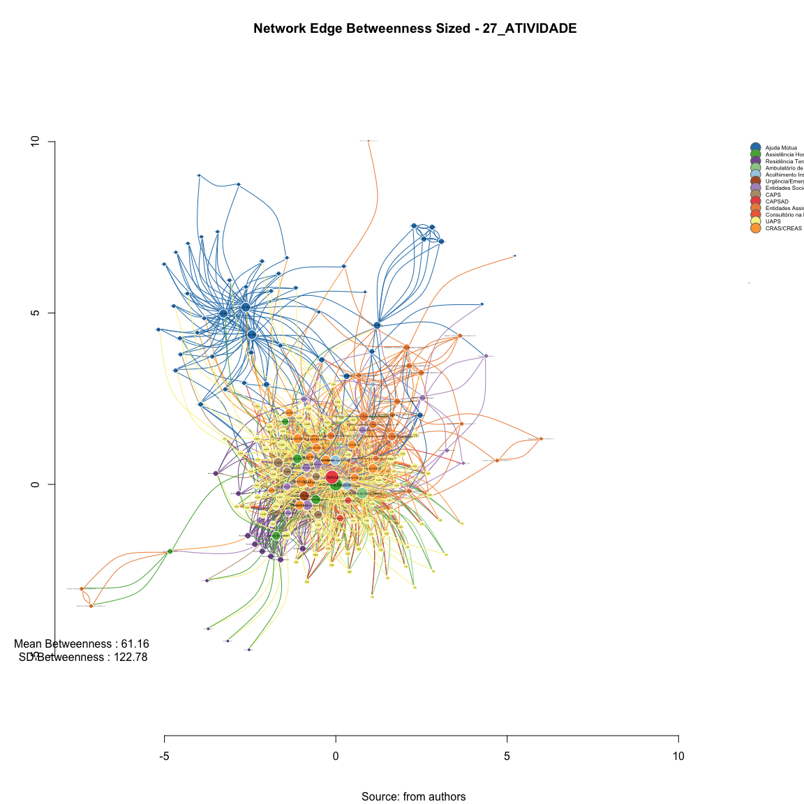

# SNA Edge Betwenness 27_ATIVIDADE
Leonardo Martins  
17 de julho de 2016  
SNA Descritive Analysis from "Projeto Redes de Atenção às pessoas que consomem álcool e outras Drogas em Juiz de Fora-MG   Brazil"  - SNArRDJF

Here you can find a basic script to analysis data from SNArRDJF - this script was elaborated considering its use for orther matrix adjacency data from SNArRDJF - Here we are going to analyse:

# 27_ATIVIDADE

`#########################
`# Basic Preparation #####
`#########################

#Loading objects generated with previous script 

```r
rm(list = ls()) # removing previous objects to be sure that we don't have objects conflicts name
load("~/SNArRDJF/Robject/10_distance_paths_atividade.RData")
```
##Reload packages

```r
suppressMessages(library(RColorBrewer))
suppressMessages(library(car))
suppressMessages(library(xtable))
suppressMessages(library(igraph))
suppressMessages(library(miniCRAN))
suppressMessages(library(magrittr))
suppressMessages(library(keyplayer))
suppressMessages(library(dplyr))
suppressMessages(library(feather))
suppressMessages(library(visNetwork))
suppressMessages(library(knitr))
suppressMessages(library(DT))
```
##Adding phantom tools

```r
#In order to get dinamic javascript object install those ones. If you get problems installing go to Stackoverflow.com and type your error to discover what to do. In some cases the libraries need to be intalled in outside R libs.
#devtools::install_github("wch/webshot")
#webshot::install_phantomjs()
```
##Setting a random seed - this is a good strategy to keep the same graph pattern layout in a new report generation

```r
set.seed(123)
```

##Simplify Graph - removing loops and duble edges 

```r
#atividade<-simplify(atividade) #Simplify
```

#Edges Newman-Girvan Edge-Betweenness - Non-Weighted
Edge betweenness Edge betweenness is equal to the number of shortest paths σst(e) from all vertices to all others that pass through that edge e

```r
#Edge Betweenness
E(atividade)$edge.betweenness_n<-edge.betweenness(atividade, weights =E(atividade)$equalone)
atividade_edge.betweenness_n <-edge.betweenness(atividade, weights =E(atividade)$equalone)
```
#Edge Betweenness Descriptive

```r
summary(atividade_edge.betweenness_n)
```

```
##    Min. 1st Qu.  Median    Mean 3rd Qu.    Max. 
##   1.000   7.864  22.750  50.920  69.650 884.700
```

```r
sd(atividade_edge.betweenness_n)
```

```
## [1] 74.9959
```

#Edges Newman-Girvan Edge-Betweenness - Weighted
Edge betweenness Edge betweenness is equal to the number of shortest paths σst(e) from all vertices to all others that pass through that edge e

```r
#Edge Betweenness
E(atividade)$edge.betweenness<-edge.betweenness(atividade, weights =E(atividade)$atividade)
atividade_edge.betweenness <-edge.betweenness(atividade, weights =E(atividade)$atividade)
```
#Edge Betweenness Descriptive

```r
summary(atividade_edge.betweenness)
```

```
##    Min. 1st Qu.  Median    Mean 3rd Qu.    Max. 
##    0.00    2.00   19.19   61.16   82.43 2129.00
```

```r
sd(atividade_edge.betweenness)
```

```
## [1] 122.7769
```

#Betweenness Edge Dinamic Table

```r
#Betweenness Measures Dinamic Table
#Getting  Measures
atividade_edge.betweenness_n <-edge.betweenness(atividade, weights =E(atividade)$equalone)
atividade_edge.betweenness <-edge.betweenness(atividade, weights =E(atividade)$atividade)

#Creating a dataframe of measures
atividade_df_betweenness <- data.frame(atividade_edge.betweenness_n ,
atividade_edge.betweenness) %>% round(1)

labels<-attr(E(atividade), "vnames")
#edgebt<-cbind(round(atividade_edge.betweenness,2),labels)

#Adding type
atividade_df_betweenness <-cbind(atividade_df_betweenness, labels)

#Adding names
names(atividade_df_betweenness) <- c("Edge Betweenness", "Edge Betweenness Weighted", "Type")

#Ordering Variables
atividade_df_betweenness<-atividade_df_betweenness[c("Type","Edge Betweenness", "Edge Betweenness Weighted")]
```
## General tabel for Betweenness

```r
datatable(atividade_df_betweenness, filter = 'top')
```

<!--html_preserve--><div id="htmlwidget-d78db5bbf567bba3a0a3" style="width:100%;height:auto;" class="datatables html-widget"></div>
<script type="application/json" data-for="htmlwidget-d78db5bbf567bba3a0a3">{"x":{"filter":"top","filterHTML":"<tr>\n  <td>\u003c/td>\n  <td data-type=\"factor\" style=\"vertical-align: top;\">\n    <div class=\"form-group has-feedback\" style=\"margin-bottom: auto;\">\n      <input type=\"search\" placeholder=\"All\" class=\"form-control\" style=\"width: 100%;\"/>\n      <span class=\"glyphicon glyphicon-remove-circle form-control-feedback\">\u003c/span>\n    \u003c/div>\n    <div style=\"width: 100%; display: none;\">\n      <select multiple=\"multiple\" style=\"width: 100%;\" data-options=\"[&quot;ACO_INS_ Casa da Cidadania|ACO_INS_ Núcleo Cidadão de Rua Hebert de Souza&quot;,&quot;ACO_INS_ Casa da Cidadania|AMB_SAM_ Centro de Atenção à Saúde Mental (CASM)&quot;,&quot;ACO_INS_ Casa da Cidadania|ASS_HOS_ Hospital de Pronto Socorro – HPS&quot;,&quot;ACO_INS_ Casa da Cidadania|CAPS_AD&quot;,&quot;ACO_INS_ Casa da Cidadania|CAPS_CO_ CAPS Casa Viva&quot;,&quot;ACO_INS_ Casa da Cidadania|CON_RUA_ Equipe de Consultório na Rua (Associação Casa Viva)&quot;,&quot;ACO_INS_ Casa da Cidadania|CON_RUA_ Equipe de Consultório na Rua (UAPS de referência Vila Ideal)&quot;,&quot;ACO_INS_ Casa da Cidadania|CRAS_AS_ CRAS Sudeste Costa Carvalho&quot;,&quot;ACO_INS_ Casa da Cidadania|CRE_SOC_ CREAS População de Rua (CentroPop)&quot;,&quot;ACO_INS_ Casa da Cidadania|ENT_SOC_ Associação Casa Viva&quot;,&quot;ACO_INS_ Casa da Cidadania|UAP_URB_ Jardim Esperança&quot;,&quot;ACO_INS_ Núcleo Cidadão de Rua Hebert de Souza|ACO_INS_ Casa da Cidadania&quot;,&quot;ACO_INS_ Núcleo Cidadão de Rua Hebert de Souza|ACO_INS_ Sociedade São Vicente de Paulo&quot;,&quot;ACO_INS_ Núcleo Cidadão de Rua Hebert de Souza|AMB_SAM_ Centro de Atenção à Saúde Mental (CASM)&quot;,&quot;ACO_INS_ Núcleo Cidadão de Rua Hebert de Souza|ASS_HOS_ Hospital Ana Nery&quot;,&quot;ACO_INS_ Núcleo Cidadão de Rua Hebert de Souza|ASS_HOS_ Hospital de Pronto Socorro – HPS&quot;,&quot;ACO_INS_ Núcleo Cidadão de Rua Hebert de Souza|CAPS_AD&quot;,&quot;ACO_INS_ Núcleo Cidadão de Rua Hebert de Souza|CAPS_CO_ CAPS Casa Viva&quot;,&quot;ACO_INS_ Núcleo Cidadão de Rua Hebert de Souza|CAPS_CO_ CAPS HU&quot;,&quot;ACO_INS_ Núcleo Cidadão de Rua Hebert de Souza|CAPS_CO_ CAPS Leste&quot;,&quot;ACO_INS_ Núcleo Cidadão de Rua Hebert de Souza|CON_RUA_ Equipe de Consultório na Rua (Associação Casa Viva)&quot;,&quot;ACO_INS_ Núcleo Cidadão de Rua Hebert de Souza|CON_RUA_ Equipe de Consultório na Rua (UAPS de referência Vila Ideal)&quot;,&quot;ACO_INS_ Núcleo Cidadão de Rua Hebert de Souza|CRA_SOC_ CRAS Sul Ipiranga&quot;,&quot;ACO_INS_ Núcleo Cidadão de Rua Hebert de Souza|CRAS_AS_ CRAS Centro&quot;,&quot;ACO_INS_ Núcleo Cidadão de Rua Hebert de Souza|CRAS_AS_ CRAS Leste Linhares&quot;,&quot;ACO_INS_ Núcleo Cidadão de Rua Hebert de Souza|CRAS_AS_ CRAS Leste São Benedito&quot;,&quot;ACO_INS_ Núcleo Cidadão de Rua Hebert de Souza|CRAS_AS_ CRAS Nordeste Grama&quot;,&quot;ACO_INS_ Núcleo Cidadão de Rua Hebert de Souza|CRAS_AS_ CRAS Norte Benfica&quot;,&quot;ACO_INS_ Núcleo Cidadão de Rua Hebert de Souza|CRAS_AS_ CRAS Oeste São Pedro&quot;,&quot;ACO_INS_ Núcleo Cidadão de Rua Hebert de Souza|CRAS_AS_ CRAS Sudeste Costa Carvalho&quot;,&quot;ACO_INS_ Núcleo Cidadão de Rua Hebert de Souza|CRAS_AS_ CRAS Sudeste Olavo Costa&quot;,&quot;ACO_INS_ Núcleo Cidadão de Rua Hebert de Souza|CRE_SOC_ CREAS Idoso e Mulher&quot;,&quot;ACO_INS_ Núcleo Cidadão de Rua Hebert de Souza|CRE_SOC_ CREAS Infância e Juventude&quot;,&quot;ACO_INS_ Núcleo Cidadão de Rua Hebert de Souza|CRE_SOC_ CREAS Norte&quot;,&quot;ACO_INS_ Núcleo Cidadão de Rua Hebert de Souza|CRE_SOC_ CREAS População de Rua (CentroPop)&quot;,&quot;ACO_INS_ Núcleo Cidadão de Rua Hebert de Souza|ENT_SOC_ Associação Casa Viva&quot;,&quot;ACO_INS_ Núcleo Cidadão de Rua Hebert de Souza|ENT_SOC_ Casa São Camilo de Lelis&quot;,&quot;ACO_INS_ Núcleo Cidadão de Rua Hebert de Souza|ENT_SOC_ Fundação Maria Mãe&quot;,&quot;ACO_INS_ Núcleo Cidadão de Rua Hebert de Souza|URG_EME_ Serviço de Atendimento Móvel de Urgência (SAMU)&quot;,&quot;ACO_INS_ Sociedade São Vicente de Paulo|ACO_INS_ Núcleo Cidadão de Rua Hebert de Souza&quot;,&quot;ACO_INS_ Sociedade São Vicente de Paulo|CRE_SOC_ CREAS População de Rua (CentroPop)&quot;,&quot;AJU_MUT_ ALANON Grupo Harmonia|AJU_MUT_ Grupo A.A. Libertação&quot;,&quot;AJU_MUT_ ALANON Grupo Harmonia|CRAS_AS_ CRAS Norte Benfica&quot;,&quot;AJU_MUT_ ALANON Grupo Harmonia|UAP_URB_ Alto Grajaú&quot;,&quot;AJU_MUT_ ALANON Grupo Só Por Hoje|ASS_HOS_ Hospital de Pronto Socorro – HPS&quot;,&quot;AJU_MUT_ ALANON Grupo Só Por Hoje|UAP_URB_ Alto Grajaú&quot;,&quot;AJU_MUT_ Escritório de Serviços Locais dos Álcoólicos Anônimos de Juiz de Fora|AJU_MUT_ ALANON Grupo Harmonia&quot;,&quot;AJU_MUT_ Escritório de Serviços Locais dos Álcoólicos Anônimos de Juiz de Fora|AJU_MUT_ ALANON Grupo Libertação&quot;,&quot;AJU_MUT_ Escritório de Serviços Locais dos Álcoólicos Anônimos de Juiz de Fora|AJU_MUT_ ALANON Grupo Só Por Hoje&quot;,&quot;AJU_MUT_ Escritório de Serviços Locais dos Álcoólicos Anônimos de Juiz de Fora|AJU_MUT_ Grupo A.A Duas Vidas&quot;,&quot;AJU_MUT_ Escritório de Serviços Locais dos Álcoólicos Anônimos de Juiz de Fora|AJU_MUT_ Grupo A.A Juiz de Fora (Sala de abordagem)&quot;,&quot;AJU_MUT_ Escritório de Serviços Locais dos Álcoólicos Anônimos de Juiz de Fora|AJU_MUT_ Grupo A.A Primeiro Passo&quot;,&quot;AJU_MUT_ Escritório de Serviços Locais dos Álcoólicos Anônimos de Juiz de Fora|AJU_MUT_ Grupo A.A Redenção Abolição&quot;,&quot;AJU_MUT_ Escritório de Serviços Locais dos Álcoólicos Anônimos de Juiz de Fora|AJU_MUT_ Grupo A.A União&quot;,&quot;AJU_MUT_ Escritório de Serviços Locais dos Álcoólicos Anônimos de Juiz de Fora|AJU_MUT_ Grupo A.A. 29 de Junho&quot;,&quot;AJU_MUT_ Escritório de Serviços Locais dos Álcoólicos Anônimos de Juiz de Fora|AJU_MUT_ Grupo A.A. Azul e Branco&quot;,&quot;AJU_MUT_ Escritório de Serviços Locais dos Álcoólicos Anônimos de Juiz de Fora|AJU_MUT_ Grupo A.A. Bairu&quot;,&quot;AJU_MUT_ Escritório de Serviços Locais dos Álcoólicos Anônimos de Juiz de Fora|AJU_MUT_ Grupo A.A. Bonfim&quot;,&quot;AJU_MUT_ Escritório de Serviços Locais dos Álcoólicos Anônimos de Juiz de Fora|AJU_MUT_ Grupo A.A. Caminho Da Salvação&quot;,&quot;AJU_MUT_ Escritório de Serviços Locais dos Álcoólicos Anônimos de Juiz de Fora|AJU_MUT_ Grupo A.A. Central&quot;,&quot;AJU_MUT_ Escritório de Serviços Locais dos Álcoólicos Anônimos de Juiz de Fora|AJU_MUT_ Grupo A.A. Cidade do Sol&quot;,&quot;AJU_MUT_ Escritório de Serviços Locais dos Álcoólicos Anônimos de Juiz de Fora|AJU_MUT_ Grupo A.A. Corrente da Sobriedade&quot;,&quot;AJU_MUT_ Escritório de Serviços Locais dos Álcoólicos Anônimos de Juiz de Fora|AJU_MUT_ Grupo A.A. Dois de Março&quot;,&quot;AJU_MUT_ Escritório de Serviços Locais dos Álcoólicos Anônimos de Juiz de Fora|AJU_MUT_ Grupo A.A. Estrela D´Alva&quot;,&quot;AJU_MUT_ Escritório de Serviços Locais dos Álcoólicos Anônimos de Juiz de Fora|AJU_MUT_ Grupo A.A. Estrela do Oriente&quot;,&quot;AJU_MUT_ Escritório de Serviços Locais dos Álcoólicos Anônimos de Juiz de Fora|AJU_MUT_ Grupo A.A. Ipiranga&quot;,&quot;AJU_MUT_ Escritório de Serviços Locais dos Álcoólicos Anônimos de Juiz de Fora|AJU_MUT_ Grupo A.A. Liberdade&quot;,&quot;AJU_MUT_ Escritório de Serviços Locais dos Álcoólicos Anônimos de Juiz de Fora|AJU_MUT_ Grupo A.A. Libertação&quot;,&quot;AJU_MUT_ Escritório de Serviços Locais dos Álcoólicos Anônimos de Juiz de Fora|AJU_MUT_ Grupo A.A. Linhares&quot;,&quot;AJU_MUT_ Escritório de Serviços Locais dos Álcoólicos Anônimos de Juiz de Fora|AJU_MUT_ Grupo A.A. Luz Divina&quot;,&quot;AJU_MUT_ Escritório de Serviços Locais dos Álcoólicos Anônimos de Juiz de Fora|AJU_MUT_ Grupo A.A. Milho Branco&quot;,&quot;AJU_MUT_ Escritório de Serviços Locais dos Álcoólicos Anônimos de Juiz de Fora|AJU_MUT_ Grupo A.A. Nova Era&quot;,&quot;AJU_MUT_ Escritório de Serviços Locais dos Álcoólicos Anônimos de Juiz de Fora|AJU_MUT_ Grupo A.A. Primeira Tradição&quot;,&quot;AJU_MUT_ Escritório de Serviços Locais dos Álcoólicos Anônimos de Juiz de Fora|AJU_MUT_ Grupo A.A. Progresso&quot;,&quot;AJU_MUT_ Escritório de Serviços Locais dos Álcoólicos Anônimos de Juiz de Fora|AJU_MUT_ Grupo A.A. Reunidos&quot;,&quot;AJU_MUT_ Escritório de Serviços Locais dos Álcoólicos Anônimos de Juiz de Fora|AJU_MUT_ Grupo A.A. Vinte e Cinco de Abril&quot;,&quot;AJU_MUT_ Escritório de Serviços Locais dos Álcoólicos Anônimos de Juiz de Fora|ASS_HOS_ Hospital Ana Nery&quot;,&quot;AJU_MUT_ Escritório de Serviços Locais dos Álcoólicos Anônimos de Juiz de Fora|CAPS_AD&quot;,&quot;AJU_MUT_ Escritório de Serviços Locais dos Álcoólicos Anônimos de Juiz de Fora|EA_DQCT_ Centro de Recuperação Resgatando Vidas (Escritório)&quot;,&quot;AJU_MUT_ Escritório de Serviços Locais dos Álcoólicos Anônimos de Juiz de Fora|EA_DQCT_ Centro Metodista de Assistência aos Toxicômanos – CEMAT (Escritório)&quot;,&quot;AJU_MUT_ Escritório de Serviços Locais dos Álcoólicos Anônimos de Juiz de Fora|UAP_URB_ Nova Era&quot;,&quot;AJU_MUT_ Escritório de Serviços Locais dos Álcoólicos Anônimos de Juiz de Fora|UAP_URB_ Progresso&quot;,&quot;AJU_MUT_ Escritório de Serviços Locais dos Álcoólicos Anônimos de Juiz de Fora|UAP_URB_ Santa Cruz&quot;,&quot;AJU_MUT_ Grupo A.A Juiz de Fora (Sala de abordagem)|AJU_MUT_ Grupo A.A Duas Vidas&quot;,&quot;AJU_MUT_ Grupo A.A Juiz de Fora (Sala de abordagem)|AJU_MUT_ Grupo A.A Primeiro Passo&quot;,&quot;AJU_MUT_ Grupo A.A Juiz de Fora (Sala de abordagem)|AJU_MUT_ Grupo A.A Redenção Abolição&quot;,&quot;AJU_MUT_ Grupo A.A Juiz de Fora (Sala de abordagem)|AJU_MUT_ Grupo A.A União&quot;,&quot;AJU_MUT_ Grupo A.A Juiz de Fora (Sala de abordagem)|AJU_MUT_ Grupo A.A. 29 de Junho&quot;,&quot;AJU_MUT_ Grupo A.A Juiz de Fora (Sala de abordagem)|AJU_MUT_ Grupo A.A. Azul e Branco&quot;,&quot;AJU_MUT_ Grupo A.A Juiz de Fora (Sala de abordagem)|AJU_MUT_ Grupo A.A. Bairu&quot;,&quot;AJU_MUT_ Grupo A.A Juiz de Fora (Sala de abordagem)|AJU_MUT_ Grupo A.A. Bonfim&quot;,&quot;AJU_MUT_ Grupo A.A Juiz de Fora (Sala de abordagem)|AJU_MUT_ Grupo A.A. Caminho Da Salvação&quot;,&quot;AJU_MUT_ Grupo A.A Juiz de Fora (Sala de abordagem)|AJU_MUT_ Grupo A.A. Central&quot;,&quot;AJU_MUT_ Grupo A.A Juiz de Fora (Sala de abordagem)|AJU_MUT_ Grupo A.A. Cidade do Sol&quot;,&quot;AJU_MUT_ Grupo A.A Juiz de Fora (Sala de abordagem)|AJU_MUT_ Grupo A.A. Corrente da Sobriedade&quot;,&quot;AJU_MUT_ Grupo A.A Juiz de Fora (Sala de abordagem)|AJU_MUT_ Grupo A.A. Dois de Março&quot;,&quot;AJU_MUT_ Grupo A.A Juiz de Fora (Sala de abordagem)|AJU_MUT_ Grupo A.A. Estrela D´Alva&quot;,&quot;AJU_MUT_ Grupo A.A Juiz de Fora (Sala de abordagem)|AJU_MUT_ Grupo A.A. Estrela do Oriente&quot;,&quot;AJU_MUT_ Grupo A.A Juiz de Fora (Sala de abordagem)|AJU_MUT_ Grupo A.A. Ipiranga&quot;,&quot;AJU_MUT_ Grupo A.A Juiz de Fora (Sala de abordagem)|AJU_MUT_ Grupo A.A. Liberdade&quot;,&quot;AJU_MUT_ Grupo A.A Juiz de Fora (Sala de abordagem)|AJU_MUT_ Grupo A.A. Libertação&quot;,&quot;AJU_MUT_ Grupo A.A Juiz de Fora (Sala de abordagem)|AJU_MUT_ Grupo A.A. Linhares&quot;,&quot;AJU_MUT_ Grupo A.A Juiz de Fora (Sala de abordagem)|AJU_MUT_ Grupo A.A. Luz Divina&quot;,&quot;AJU_MUT_ Grupo A.A Juiz de Fora (Sala de abordagem)|AJU_MUT_ Grupo A.A. Milho Branco&quot;,&quot;AJU_MUT_ Grupo A.A Juiz de Fora (Sala de abordagem)|AJU_MUT_ Grupo A.A. Nova Era&quot;,&quot;AJU_MUT_ Grupo A.A Juiz de Fora (Sala de abordagem)|AJU_MUT_ Grupo A.A. Primeira Tradição&quot;,&quot;AJU_MUT_ Grupo A.A Juiz de Fora (Sala de abordagem)|AJU_MUT_ Grupo A.A. Progresso&quot;,&quot;AJU_MUT_ Grupo A.A Juiz de Fora (Sala de abordagem)|AJU_MUT_ Grupo A.A. Reunidos&quot;,&quot;AJU_MUT_ Grupo A.A Juiz de Fora (Sala de abordagem)|AJU_MUT_ Grupo A.A. Vinte e Cinco de Abril&quot;,&quot;AJU_MUT_ Grupo A.A Primeiro Passo|AJU_MUT_ ALANON Grupo Só Por Hoje&quot;,&quot;AJU_MUT_ Grupo A.A Primeiro Passo|AJU_MUT_ Grupo A.A Duas Vidas&quot;,&quot;AJU_MUT_ Grupo A.A Primeiro Passo|AJU_MUT_ Grupo A.A Juiz de Fora (Sala de abordagem)&quot;,&quot;AJU_MUT_ Grupo A.A Primeiro Passo|AJU_MUT_ Grupo A.A Redenção Abolição&quot;,&quot;AJU_MUT_ Grupo A.A Primeiro Passo|AJU_MUT_ Grupo A.A União&quot;,&quot;AJU_MUT_ Grupo A.A Primeiro Passo|AJU_MUT_ Grupo A.A. 29 de Junho&quot;,&quot;AJU_MUT_ Grupo A.A Primeiro Passo|AJU_MUT_ Grupo A.A. Azul e Branco&quot;,&quot;AJU_MUT_ Grupo A.A Primeiro Passo|AJU_MUT_ Grupo A.A. Bairu&quot;,&quot;AJU_MUT_ Grupo A.A Primeiro Passo|AJU_MUT_ Grupo A.A. Bonfim&quot;,&quot;AJU_MUT_ Grupo A.A Primeiro Passo|AJU_MUT_ Grupo A.A. Caminho Da Salvação&quot;,&quot;AJU_MUT_ Grupo A.A Primeiro Passo|AJU_MUT_ Grupo A.A. Central&quot;,&quot;AJU_MUT_ Grupo A.A Primeiro Passo|AJU_MUT_ Grupo A.A. Cidade do Sol&quot;,&quot;AJU_MUT_ Grupo A.A Primeiro Passo|AJU_MUT_ Grupo A.A. Corrente da Sobriedade&quot;,&quot;AJU_MUT_ Grupo A.A Primeiro Passo|AJU_MUT_ Grupo A.A. Dois de Março&quot;,&quot;AJU_MUT_ Grupo A.A Primeiro Passo|AJU_MUT_ Grupo A.A. Estrela D´Alva&quot;,&quot;AJU_MUT_ Grupo A.A Primeiro Passo|AJU_MUT_ Grupo A.A. Estrela do Oriente&quot;,&quot;AJU_MUT_ Grupo A.A Primeiro Passo|AJU_MUT_ Grupo A.A. Ipiranga&quot;,&quot;AJU_MUT_ Grupo A.A Primeiro Passo|AJU_MUT_ Grupo A.A. Liberdade&quot;,&quot;AJU_MUT_ Grupo A.A Primeiro Passo|AJU_MUT_ Grupo A.A. Libertação&quot;,&quot;AJU_MUT_ Grupo A.A Primeiro Passo|AJU_MUT_ Grupo A.A. Linhares&quot;,&quot;AJU_MUT_ Grupo A.A Primeiro Passo|AJU_MUT_ Grupo A.A. Luz Divina&quot;,&quot;AJU_MUT_ Grupo A.A Primeiro Passo|AJU_MUT_ Grupo A.A. Milho Branco&quot;,&quot;AJU_MUT_ Grupo A.A Primeiro Passo|AJU_MUT_ Grupo A.A. Nova Era&quot;,&quot;AJU_MUT_ Grupo A.A Primeiro Passo|AJU_MUT_ Grupo A.A. Primeira Tradição&quot;,&quot;AJU_MUT_ Grupo A.A Primeiro Passo|AJU_MUT_ Grupo A.A. Progresso&quot;,&quot;AJU_MUT_ Grupo A.A Primeiro Passo|AJU_MUT_ Grupo A.A. Reunidos&quot;,&quot;AJU_MUT_ Grupo A.A Primeiro Passo|AJU_MUT_ Grupo A.A. Vinte e Cinco de Abril&quot;,&quot;AJU_MUT_ Grupo A.A Primeiro Passo|AJU_MUT_ Grupo de Apoio São Pedro do Amor Exigente (GASPAE)&quot;,&quot;AJU_MUT_ Grupo A.A Primeiro Passo|AJU_MUT_ Grupo N.A. Caminho Verdade&quot;,&quot;AJU_MUT_ Grupo A.A Primeiro Passo|AJU_MUT_ Grupo N.A. Glória&quot;,&quot;AJU_MUT_ Grupo A.A Primeiro Passo|AJU_MUT_ Grupo N.A. Libertação&quot;,&quot;AJU_MUT_ Grupo A.A Primeiro Passo|AJU_MUT_ NARANON Grupo Glória&quot;,&quot;AJU_MUT_ Grupo A.A Primeiro Passo|AJU_MUT_ NARANON Grupo Parque Halfeld&quot;,&quot;AJU_MUT_ Grupo A.A Primeiro Passo|AJU_MUT_ NARANON Grupo Renascer&quot;,&quot;AJU_MUT_ Grupo A.A Primeiro Passo|AJU_MUT_ Pastoral da Sobriedade&quot;,&quot;AJU_MUT_ Grupo A.A Primeiro Passo|UAP_URB_ Borboleta&quot;,&quot;AJU_MUT_ Grupo A.A. 29 de Junho|CEN_CON_ Associação TRABALHARTE&quot;,&quot;AJU_MUT_ Grupo A.A. Ipiranga|UAP_URB_ Ipiranga&quot;,&quot;AJU_MUT_ Grupo A.A. Ipiranga|UAP_URB_ Santa Efigênia&quot;,&quot;AJU_MUT_ Grupo A.A. Ipiranga|UAP_URB_ Santa Luzia&quot;,&quot;AJU_MUT_ Grupo A.A. Reunidos|AJU_MUT_ Escritório de Serviços Locais dos Álcoólicos Anônimos de Juiz de Fora&quot;,&quot;AJU_MUT_ Grupo A.A. Vinte e Cinco de Abril|UAP_URB_ Furtado de Menezes&quot;,&quot;AJU_MUT_ Grupo de Amor Exigente Linhares|AJU_MUT_ Grupo de Amor Exigente Santa Terezinha&quot;,&quot;AJU_MUT_ Grupo de Amor Exigente Linhares|AJU_MUT_ Grupo de Apoio Benfica de Amor Exigente (GABENAE)&quot;,&quot;AJU_MUT_ Grupo de Amor Exigente Linhares|AJU_MUT_ Grupo de Apoio São Mateus de Amor Exigente (GASMAE)&quot;,&quot;AJU_MUT_ Grupo de Amor Exigente Linhares|AJU_MUT_ Grupo de Apoio São Pedro do Amor Exigente (GASPAE)&quot;,&quot;AJU_MUT_ Grupo de Amor Exigente Santa Terezinha|AJU_MUT_ Grupo de Amor Exigente Linhares&quot;,&quot;AJU_MUT_ Grupo de Amor Exigente Santa Terezinha|AJU_MUT_ Grupo de Apoio Benfica de Amor Exigente (GABENAE)&quot;,&quot;AJU_MUT_ Grupo de Amor Exigente Santa Terezinha|AJU_MUT_ Grupo de Apoio São Mateus de Amor Exigente (GASMAE)&quot;,&quot;AJU_MUT_ Grupo de Amor Exigente Santa Terezinha|AJU_MUT_ Grupo de Apoio São Pedro do Amor Exigente (GASPAE)&quot;,&quot;AJU_MUT_ Grupo de Apoio Benfica de Amor Exigente (GABENAE)|AJU_MUT_ Grupo de Amor Exigente Linhares&quot;,&quot;AJU_MUT_ Grupo de Apoio Benfica de Amor Exigente (GABENAE)|AJU_MUT_ Grupo de Amor Exigente Santa Terezinha&quot;,&quot;AJU_MUT_ Grupo de Apoio Benfica de Amor Exigente (GABENAE)|AJU_MUT_ Grupo de Apoio São Mateus de Amor Exigente (GASMAE)&quot;,&quot;AJU_MUT_ Grupo de Apoio Benfica de Amor Exigente (GABENAE)|AJU_MUT_ Grupo de Apoio São Pedro do Amor Exigente (GASPAE)&quot;,&quot;AJU_MUT_ Grupo de Apoio São Mateus de Amor Exigente (GASMAE)|AJU_MUT_ Grupo de Amor Exigente Linhares&quot;,&quot;AJU_MUT_ Grupo de Apoio São Mateus de Amor Exigente (GASMAE)|AJU_MUT_ Grupo de Amor Exigente Santa Terezinha&quot;,&quot;AJU_MUT_ Grupo de Apoio São Mateus de Amor Exigente (GASMAE)|AJU_MUT_ Grupo de Apoio Benfica de Amor Exigente (GABENAE)&quot;,&quot;AJU_MUT_ Grupo de Apoio São Mateus de Amor Exigente (GASMAE)|AJU_MUT_ Grupo de Apoio São Pedro do Amor Exigente (GASPAE)&quot;,&quot;AJU_MUT_ Grupo de Apoio São Pedro do Amor Exigente (GASPAE)|AJU_MUT_ Grupo de Amor Exigente Linhares&quot;,&quot;AJU_MUT_ Grupo de Apoio São Pedro do Amor Exigente (GASPAE)|AJU_MUT_ Grupo de Amor Exigente Santa Terezinha&quot;,&quot;AJU_MUT_ Grupo de Apoio São Pedro do Amor Exigente (GASPAE)|AJU_MUT_ Grupo de Apoio Benfica de Amor Exigente (GABENAE)&quot;,&quot;AJU_MUT_ Grupo de Apoio São Pedro do Amor Exigente (GASPAE)|AJU_MUT_ Grupo de Apoio São Mateus de Amor Exigente (GASMAE)&quot;,&quot;AJU_MUT_ Grupo de Apoio São Pedro do Amor Exigente (GASPAE)|ASS_HOS_ Hospital Ana Nery&quot;,&quot;AJU_MUT_ Grupo de Apoio São Pedro do Amor Exigente (GASPAE)|CAPS_AD&quot;,&quot;AJU_MUT_ Grupo de Apoio São Pedro do Amor Exigente (GASPAE)|ENT_SOC_ Associação Beneficente e Cultural Amigos do Noivo (ABAN)&quot;,&quot;AJU_MUT_ Grupo N.A. Glória|CEN_CON_ Associação TRABALHARTE&quot;,&quot;AJU_MUT_ Igreja Batista Resplandecente Estrela do Amanhã  IBREM|ASS_HOS_ Hospital Ana Nery&quot;,&quot;AJU_MUT_ Igreja Batista Resplandecente Estrela do Amanhã  IBREM|ASS_HOS_ Hospital de Pronto Socorro – HPS&quot;,&quot;AJU_MUT_ Igreja Batista Resplandecente Estrela do Amanhã  IBREM|EA_DQCT_ Associação Projeto Amor e Restauração – APAR&quot;,&quot;AJU_MUT_ Igreja Batista Resplandecente Estrela do Amanhã  IBREM|EA_DQCT_ Centro de Recuperação Resgatando Vidas&quot;,&quot;AJU_MUT_ Igreja Batista Resplandecente Estrela do Amanhã  IBREM|EA_DQCT_ Centro de Recuperação SOS Vida&quot;,&quot;AJU_MUT_ Igreja Batista Resplandecente Estrela do Amanhã  IBREM|EA_DQCT_ Centro Metodista de Assistência aos Toxicômanos – CEMAT&quot;,&quot;AJU_MUT_ Igreja Batista Resplandecente Estrela do Amanhã  IBREM|EA_DQCT_ Comunidade Terapêutica Geração de Adoradores – CTGA&quot;,&quot;AJU_MUT_ Igreja Batista Resplandecente Estrela do Amanhã  IBREM|EA_DQCT_ Grupo de Apoio à Família e aos Dependentes Químicos – GAFADEQUI&quot;,&quot;AJU_MUT_ NARANON Grupo Parque Halfeld|AJU_MUT_ NARANON Grupo Glória&quot;,&quot;AJU_MUT_ NARANON Grupo Parque Halfeld|AJU_MUT_ NARANON Grupo Renascer&quot;,&quot;AJU_MUT_ Pastoral da Sobriedade|AJU_MUT_ GEVE&quot;,&quot;AJU_MUT_ Pastoral da Sobriedade|CAPS_AD&quot;,&quot;AJU_MUT_ Pastoral da Sobriedade|EA_DQCT_ Associação Projeto Amor e Restauração – APAR&quot;,&quot;AJU_MUT_ Pastoral da Sobriedade|EA_DQCT_ Centro Metodista de Assistência aos Toxicômanos – CEMAT&quot;,&quot;AMB_SAM_ Centro de Atenção à Saúde Mental (CASM)|ACO_INS_ Casa da Cidadania&quot;,&quot;AMB_SAM_ Centro de Atenção à Saúde Mental (CASM)|ACO_INS_ Núcleo Cidadão de Rua Hebert de Souza&quot;,&quot;AMB_SAM_ Centro de Atenção à Saúde Mental (CASM)|AJU_MUT_ Grupo A.A. Central&quot;,&quot;AMB_SAM_ Centro de Atenção à Saúde Mental (CASM)|AJU_MUT_ Grupo A.A. Reunidos&quot;,&quot;AMB_SAM_ Centro de Atenção à Saúde Mental (CASM)|ASS_HOS_ Casa de Saúde Esperança&quot;,&quot;AMB_SAM_ Centro de Atenção à Saúde Mental (CASM)|ASS_HOS_ Hospital Ana Nery&quot;,&quot;AMB_SAM_ Centro de Atenção à Saúde Mental (CASM)|ASS_HOS_ Hospital de Pronto Socorro – HPS&quot;,&quot;AMB_SAM_ Centro de Atenção à Saúde Mental (CASM)|CAPS_AD&quot;,&quot;AMB_SAM_ Centro de Atenção à Saúde Mental (CASM)|CEN_CON_ Associação TRABALHARTE&quot;,&quot;AMB_SAM_ Centro de Atenção à Saúde Mental (CASM)|CON_RUA_ Equipe de Consultório na Rua (UAPS de referência Vila Ideal)&quot;,&quot;AMB_SAM_ Centro de Atenção à Saúde Mental (CASM)|CRAS_AS_ CRAS Centro&quot;,&quot;AMB_SAM_ Centro de Atenção à Saúde Mental (CASM)|CRE_SOC_ CREAS Idoso e Mulher&quot;,&quot;AMB_SAM_ Centro de Atenção à Saúde Mental (CASM)|CRE_SOC_ CREAS População de Rua (CentroPop)&quot;,&quot;AMB_SAM_ Centro de Atenção à Saúde Mental (CASM)|EA_DQCT_ Associação Projeto Amor e Restauração – APAR&quot;,&quot;AMB_SAM_ Centro de Atenção à Saúde Mental (CASM)|EA_DQCT_ Centro Metodista de Assistência aos Toxicômanos – CEMAT&quot;,&quot;AMB_SAM_ Centro de Atenção à Saúde Mental (CASM)|UAP_RUR_ Buiéié&quot;,&quot;AMB_SAM_ Centro de Atenção à Saúde Mental (CASM)|UAP_RUR_ Caeté&quot;,&quot;AMB_SAM_ Centro de Atenção à Saúde Mental (CASM)|UAP_RUR_ Chapéu D&#39;Uvas&quot;,&quot;AMB_SAM_ Centro de Atenção à Saúde Mental (CASM)|UAP_RUR_ Dias Tavares&quot;,&quot;AMB_SAM_ Centro de Atenção à Saúde Mental (CASM)|UAP_RUR_ Humaitá&quot;,&quot;AMB_SAM_ Centro de Atenção à Saúde Mental (CASM)|UAP_RUR_ Igrejinha&quot;,&quot;AMB_SAM_ Centro de Atenção à Saúde Mental (CASM)|UAP_RUR_ Jacutinga&quot;,&quot;AMB_SAM_ Centro de Atenção à Saúde Mental (CASM)|UAP_RUR_ Monte Verde&quot;,&quot;AMB_SAM_ Centro de Atenção à Saúde Mental (CASM)|UAP_RUR_ Palmital&quot;,&quot;AMB_SAM_ Centro de Atenção à Saúde Mental (CASM)|UAP_RUR_ Paula Lima&quot;,&quot;AMB_SAM_ Centro de Atenção à Saúde Mental (CASM)|UAP_RUR_ Penido&quot;,&quot;AMB_SAM_ Centro de Atenção à Saúde Mental (CASM)|UAP_RUR_ Pirapetinga&quot;,&quot;AMB_SAM_ Centro de Atenção à Saúde Mental (CASM)|UAP_RUR_ Pires&quot;,&quot;AMB_SAM_ Centro de Atenção à Saúde Mental (CASM)|UAP_RUR_ Privilégio&quot;,&quot;AMB_SAM_ Centro de Atenção à Saúde Mental (CASM)|UAP_RUR_ Rosário de Minas&quot;,&quot;AMB_SAM_ Centro de Atenção à Saúde Mental (CASM)|UAP_RUR_ Sarandira&quot;,&quot;AMB_SAM_ Centro de Atenção à Saúde Mental (CASM)|UAP_RUR_ Toledos&quot;,&quot;AMB_SAM_ Centro de Atenção à Saúde Mental (CASM)|UAP_RUR_ Torreões&quot;,&quot;AMB_SAM_ Centro de Atenção à Saúde Mental (CASM)|UAP_RUR_ Valadares&quot;,&quot;AMB_SAM_ Centro de Atenção à Saúde Mental (CASM)|UAP_URB_ Bairro Industrial&quot;,&quot;AMB_SAM_ Centro de Atenção à Saúde Mental (CASM)|UAP_URB_ Barreira do Triunfo&quot;,&quot;AMB_SAM_ Centro de Atenção à Saúde Mental (CASM)|UAP_URB_ Benfica&quot;,&quot;AMB_SAM_ Centro de Atenção à Saúde Mental (CASM)|UAP_URB_ Esplanada&quot;,&quot;AMB_SAM_ Centro de Atenção à Saúde Mental (CASM)|UAP_URB_ Jardim Natal&quot;,&quot;AMB_SAM_ Centro de Atenção à Saúde Mental (CASM)|UAP_URB_ Jóquei Clube I&quot;,&quot;AMB_SAM_ Centro de Atenção à Saúde Mental (CASM)|UAP_URB_ Jóquei Clube II&quot;,&quot;AMB_SAM_ Centro de Atenção à Saúde Mental (CASM)|UAP_URB_ Milho Branco&quot;,&quot;AMB_SAM_ Centro de Atenção à Saúde Mental (CASM)|UAP_URB_ Monte Castelo&quot;,&quot;AMB_SAM_ Centro de Atenção à Saúde Mental (CASM)|UAP_URB_ Nova Era&quot;,&quot;AMB_SAM_ Centro de Atenção à Saúde Mental (CASM)|UAP_URB_ Santa Cruz&quot;,&quot;AMB_SAM_ Centro de Atenção à Saúde Mental (CASM)|UAP_URB_ São Judas Tadeu&quot;,&quot;AMB_SAM_ Centro de Atenção à Saúde Mental (CASM)|UAP_URB_ Vila Esperança&quot;,&quot;AMB_SAM_ Centro de Atenção à Saúde Mental (CASM)|URG_EME_ Serviço de Atendimento Móvel de Urgência (SAMU)&quot;,&quot;ASS_HOS_ Casa de Saúde Esperança|AMB_SAM_ Centro de Atenção à Saúde Mental (CASM)&quot;,&quot;ASS_HOS_ Casa de Saúde Esperança|ASS_HOS_ Hospital Ana Nery&quot;,&quot;ASS_HOS_ Casa de Saúde Esperança|ASS_HOS_ Hospital de Pronto Socorro – HPS&quot;,&quot;ASS_HOS_ Casa de Saúde Esperança|CAPS_AD&quot;,&quot;ASS_HOS_ Casa de Saúde Esperança|CAPS_CO_ CAPS Casa Viva&quot;,&quot;ASS_HOS_ Casa de Saúde Esperança|CAPS_CO_ CAPS HU&quot;,&quot;ASS_HOS_ Casa de Saúde Esperança|CAPS_CO_ CAPS IJ&quot;,&quot;ASS_HOS_ Casa de Saúde Esperança|CAPS_CO_ CAPS Leste&quot;,&quot;ASS_HOS_ Casa de Saúde Esperança|RES_TER_ Casa 1&quot;,&quot;ASS_HOS_ Casa de Saúde Esperança|RES_TER_ Casa 3&quot;,&quot;ASS_HOS_ Casa de Saúde Esperança|RES_TER_ Casa 4&quot;,&quot;ASS_HOS_ Casa de Saúde Esperança|RES_TER_ Casa 5&quot;,&quot;ASS_HOS_ Casa de Saúde Esperança|RES_TER_ Casa 6&quot;,&quot;ASS_HOS_ Casa de Saúde Esperança|RES_TER_ Casa 7&quot;,&quot;ASS_HOS_ Casa de Saúde Esperança|RES_TER_ Casa V1&quot;,&quot;ASS_HOS_ Casa de Saúde Esperança|RES_TER_ Casa V2&quot;,&quot;ASS_HOS_ Casa de Saúde Esperança|RES_TER_ Casa V3&quot;,&quot;ASS_HOS_ Casa de Saúde Esperança|RES_TER_ Casa V4&quot;,&quot;ASS_HOS_ Casa de Saúde Esperança|RES_TER_ Casa V5&quot;,&quot;ASS_HOS_ Casa de Saúde Esperança|RES_TER_ Casa V6&quot;,&quot;ASS_HOS_ Casa de Saúde Esperança|URG_EME_ Serviço de Atendimento Móvel de Urgência (SAMU)&quot;,&quot;ASS_HOS_ Centro de Referência em Álcool e Drogas (RADCAS)  Hospital Universitário|AJU_MUT_ Grupo A.A. Reunidos&quot;,&quot;ASS_HOS_ Centro de Referência em Álcool e Drogas (RADCAS)  Hospital Universitário|AJU_MUT_ Grupo de Apoio São Pedro do Amor Exigente (GASPAE)&quot;,&quot;ASS_HOS_ Centro de Referência em Álcool e Drogas (RADCAS)  Hospital Universitário|ASS_HOS_ Hospital de Pronto Socorro – HPS&quot;,&quot;ASS_HOS_ Centro de Referência em Álcool e Drogas (RADCAS)  Hospital Universitário|UAP_URB_ Borboleta&quot;,&quot;ASS_HOS_ Centro de Referência em Álcool e Drogas (RADCAS)  Hospital Universitário|UAP_URB_ Dom Bosco&quot;,&quot;ASS_HOS_ Centro de Referência em Álcool e Drogas (RADCAS)  Hospital Universitário|UAP_URB_ Santos Dumont&quot;,&quot;ASS_HOS_ Centro de Referência em Álcool e Drogas (RADCAS)  Hospital Universitário|UAP_URB_ São Pedro&quot;,&quot;ASS_HOS_ Centro de Referência em Álcool e Drogas (RADCAS)  Hospital Universitário|UAP_URB_ Teixeiras&quot;,&quot;ASS_HOS_ Clínica Vila Verde (Hospital Dia)|ASS_HOS_ Hospital Ana Nery&quot;,&quot;ASS_HOS_ Clínica Vila Verde (Hospital Dia)|EA_DQCT_ Vila Verde (Unidade Borboleta)&quot;,&quot;ASS_HOS_ Clínica Vila Verde (Hospital Dia)|EA_DQCT_ Vila Verde (Unidade Bromélias)&quot;,&quot;ASS_HOS_ Hospital Ana Nery|AJU_MUT_ Grupo A.A Juiz de Fora (Sala de abordagem)&quot;,&quot;ASS_HOS_ Hospital Ana Nery|ASS_HOS_ Hospital de Pronto Socorro – HPS&quot;,&quot;ASS_HOS_ Hospital Ana Nery|CAPS_AD&quot;,&quot;ASS_HOS_ Hospital Ana Nery|CRA_SOC_ CRAS Sul Ipiranga&quot;,&quot;ASS_HOS_ Hospital Ana Nery|CRAS_AS_ CRAS Centro&quot;,&quot;ASS_HOS_ Hospital Ana Nery|CRAS_AS_ CRAS Leste Linhares&quot;,&quot;ASS_HOS_ Hospital Ana Nery|CRAS_AS_ CRAS Leste São Benedito&quot;,&quot;ASS_HOS_ Hospital Ana Nery|CRAS_AS_ CRAS Nordeste Grama&quot;,&quot;ASS_HOS_ Hospital Ana Nery|CRAS_AS_ CRAS Norte Benfica&quot;,&quot;ASS_HOS_ Hospital Ana Nery|CRAS_AS_ CRAS Oeste São Pedro&quot;,&quot;ASS_HOS_ Hospital Ana Nery|CRAS_AS_ CRAS Sudeste Costa Carvalho&quot;,&quot;ASS_HOS_ Hospital Ana Nery|CRAS_AS_ CRAS Sudeste Olavo Costa&quot;,&quot;ASS_HOS_ Hospital Ana Nery|CRE_SOC_ CREAS Idoso e Mulher&quot;,&quot;ASS_HOS_ Hospital Ana Nery|CRE_SOC_ CREAS Infância e Juventude&quot;,&quot;ASS_HOS_ Hospital Ana Nery|CRE_SOC_ CREAS Norte&quot;,&quot;ASS_HOS_ Hospital Ana Nery|CRE_SOC_ CREAS População de Rua (CentroPop)&quot;,&quot;ASS_HOS_ Hospital Ana Nery|EA_DQCT_ Centro de Recuperação Resgatando Vidas&quot;,&quot;ASS_HOS_ Hospital Ana Nery|EA_DQCT_ Centro de Recuperação Resgatando Vidas (Escritório)&quot;,&quot;ASS_HOS_ Hospital de Pronto Socorro – HPS|ACO_INS_ Casa da Cidadania&quot;,&quot;ASS_HOS_ Hospital de Pronto Socorro – HPS|ASS_HOS_ Casa de Saúde Esperança&quot;,&quot;ASS_HOS_ Hospital de Pronto Socorro – HPS|ASS_HOS_ Hospital Ana Nery&quot;,&quot;ASS_HOS_ Hospital de Pronto Socorro – HPS|CAPS_AD&quot;,&quot;ASS_HOS_ Hospital de Pronto Socorro – HPS|CAPS_CO_ CAPS Casa Viva&quot;,&quot;ASS_HOS_ Hospital de Pronto Socorro – HPS|CAPS_CO_ CAPS HU&quot;,&quot;ASS_HOS_ Hospital de Pronto Socorro – HPS|CAPS_CO_ CAPS IJ&quot;,&quot;ASS_HOS_ Hospital de Pronto Socorro – HPS|CAPS_CO_ CAPS Leste&quot;,&quot;ASS_HOS_ Hospital de Pronto Socorro – HPS|CRA_SOC_ CRAS Sul Ipiranga&quot;,&quot;ASS_HOS_ Hospital de Pronto Socorro – HPS|CRAS_AS_ CRAS Centro&quot;,&quot;ASS_HOS_ Hospital de Pronto Socorro – HPS|CRAS_AS_ CRAS Leste Linhares&quot;,&quot;ASS_HOS_ Hospital de Pronto Socorro – HPS|CRAS_AS_ CRAS Leste São Benedito&quot;,&quot;ASS_HOS_ Hospital de Pronto Socorro – HPS|CRAS_AS_ CRAS Nordeste Grama&quot;,&quot;ASS_HOS_ Hospital de Pronto Socorro – HPS|CRAS_AS_ CRAS Norte Benfica&quot;,&quot;ASS_HOS_ Hospital de Pronto Socorro – HPS|CRAS_AS_ CRAS Oeste São Pedro&quot;,&quot;ASS_HOS_ Hospital de Pronto Socorro – HPS|CRAS_AS_ CRAS Sudeste Costa Carvalho&quot;,&quot;ASS_HOS_ Hospital de Pronto Socorro – HPS|CRAS_AS_ CRAS Sudeste Olavo Costa&quot;,&quot;ASS_HOS_ Hospital de Pronto Socorro – HPS|CRE_SOC_ CREAS Idoso e Mulher&quot;,&quot;ASS_HOS_ Hospital de Pronto Socorro – HPS|CRE_SOC_ CREAS Infância e Juventude&quot;,&quot;ASS_HOS_ Hospital de Pronto Socorro – HPS|CRE_SOC_ CREAS Norte&quot;,&quot;ASS_HOS_ Hospital de Pronto Socorro – HPS|CRE_SOC_ CREAS População de Rua (CentroPop)&quot;,&quot;ASS_HOS_ Hospital de Pronto Socorro – HPS|UAP_RUR_ Buiéié&quot;,&quot;ASS_HOS_ Hospital de Pronto Socorro – HPS|UAP_RUR_ Caeté&quot;,&quot;ASS_HOS_ Hospital de Pronto Socorro – HPS|UAP_RUR_ Chapéu D&#39;Uvas&quot;,&quot;ASS_HOS_ Hospital de Pronto Socorro – HPS|UAP_RUR_ Dias Tavares&quot;,&quot;ASS_HOS_ Hospital de Pronto Socorro – HPS|UAP_RUR_ Humaitá&quot;,&quot;ASS_HOS_ Hospital de Pronto Socorro – HPS|UAP_RUR_ Igrejinha&quot;,&quot;ASS_HOS_ Hospital de Pronto Socorro – HPS|UAP_RUR_ Jacutinga&quot;,&quot;ASS_HOS_ Hospital de Pronto Socorro – HPS|UAP_RUR_ Monte Verde&quot;,&quot;ASS_HOS_ Hospital de Pronto Socorro – HPS|UAP_RUR_ Palmital&quot;,&quot;ASS_HOS_ Hospital de Pronto Socorro – HPS|UAP_RUR_ Paula Lima&quot;,&quot;ASS_HOS_ Hospital de Pronto Socorro – HPS|UAP_RUR_ Penido&quot;,&quot;ASS_HOS_ Hospital de Pronto Socorro – HPS|UAP_RUR_ Pirapetinga&quot;,&quot;ASS_HOS_ Hospital de Pronto Socorro – HPS|UAP_RUR_ Pires&quot;,&quot;ASS_HOS_ Hospital de Pronto Socorro – HPS|UAP_RUR_ Privilégio&quot;,&quot;ASS_HOS_ Hospital de Pronto Socorro – HPS|UAP_RUR_ Rosário de Minas&quot;,&quot;ASS_HOS_ Hospital de Pronto Socorro – HPS|UAP_RUR_ Sarandira&quot;,&quot;ASS_HOS_ Hospital de Pronto Socorro – HPS|UAP_RUR_ Toledos&quot;,&quot;ASS_HOS_ Hospital de Pronto Socorro – HPS|UAP_RUR_ Torreões&quot;,&quot;ASS_HOS_ Hospital de Pronto Socorro – HPS|UAP_RUR_ Valadares&quot;,&quot;ASS_HOS_ Hospital de Pronto Socorro – HPS|UAP_URB_ Alto Grajaú&quot;,&quot;ASS_HOS_ Hospital de Pronto Socorro – HPS|UAP_URB_ Bairro de Lourdes&quot;,&quot;ASS_HOS_ Hospital de Pronto Socorro – HPS|UAP_URB_ Bairro Industrial&quot;,&quot;ASS_HOS_ Hospital de Pronto Socorro – HPS|UAP_URB_ Bandeirantes&quot;,&quot;ASS_HOS_ Hospital de Pronto Socorro – HPS|UAP_URB_ Barreira do Triunfo&quot;,&quot;ASS_HOS_ Hospital de Pronto Socorro – HPS|UAP_URB_ Benfica&quot;,&quot;ASS_HOS_ Hospital de Pronto Socorro – HPS|UAP_URB_ Borboleta&quot;,&quot;ASS_HOS_ Hospital de Pronto Socorro – HPS|UAP_URB_ Centro Sul&quot;,&quot;ASS_HOS_ Hospital de Pronto Socorro – HPS|UAP_URB_ Cidade do Sol&quot;,&quot;ASS_HOS_ Hospital de Pronto Socorro – HPS|UAP_URB_ Cruzeiro do Sul&quot;,&quot;ASS_HOS_ Hospital de Pronto Socorro – HPS|UAP_URB_ Dom Bosco&quot;,&quot;ASS_HOS_ Hospital de Pronto Socorro – HPS|UAP_URB_ Esplanada&quot;,&quot;ASS_HOS_ Hospital de Pronto Socorro – HPS|UAP_URB_ Filgueiras&quot;,&quot;ASS_HOS_ Hospital de Pronto Socorro – HPS|UAP_URB_ Furtado de Menezes&quot;,&quot;ASS_HOS_ Hospital de Pronto Socorro – HPS|UAP_URB_ Grama&quot;,&quot;ASS_HOS_ Hospital de Pronto Socorro – HPS|UAP_URB_ Granjas Betânea&quot;,&quot;ASS_HOS_ Hospital de Pronto Socorro – HPS|UAP_URB_ Ipiranga&quot;,&quot;ASS_HOS_ Hospital de Pronto Socorro – HPS|UAP_URB_ Jardim da Lua&quot;,&quot;ASS_HOS_ Hospital de Pronto Socorro – HPS|UAP_URB_ Jardim Esperança&quot;,&quot;ASS_HOS_ Hospital de Pronto Socorro – HPS|UAP_URB_ Jardim Natal&quot;,&quot;ASS_HOS_ Hospital de Pronto Socorro – HPS|UAP_URB_ Jóquei Clube I&quot;,&quot;ASS_HOS_ Hospital de Pronto Socorro – HPS|UAP_URB_ Jóquei Clube II&quot;,&quot;ASS_HOS_ Hospital de Pronto Socorro – HPS|UAP_URB_ Linhares&quot;,&quot;ASS_HOS_ Hospital de Pronto Socorro – HPS|UAP_URB_ Marumbí&quot;,&quot;ASS_HOS_ Hospital de Pronto Socorro – HPS|UAP_URB_ Milho Branco&quot;,&quot;ASS_HOS_ Hospital de Pronto Socorro – HPS|UAP_URB_ Monte Castelo&quot;,&quot;ASS_HOS_ Hospital de Pronto Socorro – HPS|UAP_URB_ Nossa Senhora Aparecida&quot;,&quot;ASS_HOS_ Hospital de Pronto Socorro – HPS|UAP_URB_ Nossa Senhora das Graças&quot;,&quot;ASS_HOS_ Hospital de Pronto Socorro – HPS|UAP_URB_ Nova Era&quot;,&quot;ASS_HOS_ Hospital de Pronto Socorro – HPS|UAP_URB_ Parque Guarani&quot;,&quot;ASS_HOS_ Hospital de Pronto Socorro – HPS|UAP_URB_ Progresso&quot;,&quot;ASS_HOS_ Hospital de Pronto Socorro – HPS|UAP_URB_ Retiro&quot;,&quot;ASS_HOS_ Hospital de Pronto Socorro – HPS|UAP_URB_ Santa Cândida/São Sebastião&quot;,&quot;ASS_HOS_ Hospital de Pronto Socorro – HPS|UAP_URB_ Santa Cecília&quot;,&quot;ASS_HOS_ Hospital de Pronto Socorro – HPS|UAP_URB_ Santa Cruz&quot;,&quot;ASS_HOS_ Hospital de Pronto Socorro – HPS|UAP_URB_ Santa Efigênia&quot;,&quot;ASS_HOS_ Hospital de Pronto Socorro – HPS|UAP_URB_ Santa Luzia&quot;,&quot;ASS_HOS_ Hospital de Pronto Socorro – HPS|UAP_URB_ Santa Rita&quot;,&quot;ASS_HOS_ Hospital de Pronto Socorro – HPS|UAP_URB_ Santo Antônio&quot;,&quot;ASS_HOS_ Hospital de Pronto Socorro – HPS|UAP_URB_ Santos Dumont&quot;,&quot;ASS_HOS_ Hospital de Pronto Socorro – HPS|UAP_URB_ São Benedito&quot;,&quot;ASS_HOS_ Hospital de Pronto Socorro – HPS|UAP_URB_ São Judas Tadeu&quot;,&quot;ASS_HOS_ Hospital de Pronto Socorro – HPS|UAP_URB_ São Pedro&quot;,&quot;ASS_HOS_ Hospital de Pronto Socorro – HPS|UAP_URB_ Teixeiras&quot;,&quot;ASS_HOS_ Hospital de Pronto Socorro – HPS|UAP_URB_ Vale Verde&quot;,&quot;ASS_HOS_ Hospital de Pronto Socorro – HPS|UAP_URB_ Vila Esperança&quot;,&quot;ASS_HOS_ Hospital de Pronto Socorro – HPS|UAP_URB_ Vila Ideal&quot;,&quot;ASS_HOS_ Hospital de Pronto Socorro – HPS|UAP_URB_ Vila Olavo Costa&quot;,&quot;ASS_HOS_ Hospital de Pronto Socorro – HPS|URG_EME_ Serviço de Atendimento Móvel de Urgência (SAMU)&quot;,&quot;ASS_HOS_ Serviço de Controle e Prevenção e Tratamento do Tabagismo (SECOPTT)|ASS_HOS_ Centro de Referência em Álcool e Drogas (RADCAS)  Hospital Universitário&quot;,&quot;ASS_HOS_ Serviço de Controle e Prevenção e Tratamento do Tabagismo (SECOPTT)|CAPS_AD&quot;,&quot;ASS_HOS_ Serviço de Controle e Prevenção e Tratamento do Tabagismo (SECOPTT)|UAP_RUR_ Humaitá&quot;,&quot;ASS_HOS_ Serviço de Controle e Prevenção e Tratamento do Tabagismo (SECOPTT)|UAP_RUR_ Igrejinha&quot;,&quot;ASS_HOS_ Serviço de Controle e Prevenção e Tratamento do Tabagismo (SECOPTT)|UAP_RUR_ Monte Verde&quot;,&quot;ASS_HOS_ Serviço de Controle e Prevenção e Tratamento do Tabagismo (SECOPTT)|UAP_RUR_ Pirapetinga&quot;,&quot;ASS_HOS_ Serviço de Controle e Prevenção e Tratamento do Tabagismo (SECOPTT)|UAP_RUR_ Torreões&quot;,&quot;ASS_HOS_ Serviço de Controle e Prevenção e Tratamento do Tabagismo (SECOPTT)|UAP_RUR_ Valadares&quot;,&quot;ASS_HOS_ Serviço de Controle e Prevenção e Tratamento do Tabagismo (SECOPTT)|UAP_URB_ Alto Grajaú&quot;,&quot;ASS_HOS_ Serviço de Controle e Prevenção e Tratamento do Tabagismo (SECOPTT)|UAP_URB_ Bairro de Lourdes&quot;,&quot;ASS_HOS_ Serviço de Controle e Prevenção e Tratamento do Tabagismo (SECOPTT)|UAP_URB_ Borboleta&quot;,&quot;ASS_HOS_ Serviço de Controle e Prevenção e Tratamento do Tabagismo (SECOPTT)|UAP_URB_ Cidade do Sol&quot;,&quot;ASS_HOS_ Serviço de Controle e Prevenção e Tratamento do Tabagismo (SECOPTT)|UAP_URB_ Dom Bosco&quot;,&quot;ASS_HOS_ Serviço de Controle e Prevenção e Tratamento do Tabagismo (SECOPTT)|UAP_URB_ Furtado de Menezes&quot;,&quot;ASS_HOS_ Serviço de Controle e Prevenção e Tratamento do Tabagismo (SECOPTT)|UAP_URB_ Jardim Esperança&quot;,&quot;ASS_HOS_ Serviço de Controle e Prevenção e Tratamento do Tabagismo (SECOPTT)|UAP_URB_ Monte Castelo&quot;,&quot;ASS_HOS_ Serviço de Controle e Prevenção e Tratamento do Tabagismo (SECOPTT)|UAP_URB_ Nossa Senhora Aparecida&quot;,&quot;ASS_HOS_ Serviço de Controle e Prevenção e Tratamento do Tabagismo (SECOPTT)|UAP_URB_ Nossa Senhora das Graças&quot;,&quot;ASS_HOS_ Serviço de Controle e Prevenção e Tratamento do Tabagismo (SECOPTT)|UAP_URB_ Santa Cândida/São Sebastião&quot;,&quot;ASS_HOS_ Serviço de Controle e Prevenção e Tratamento do Tabagismo (SECOPTT)|UAP_URB_ Santa Cecília&quot;,&quot;ASS_HOS_ Serviço de Controle e Prevenção e Tratamento do Tabagismo (SECOPTT)|UAP_URB_ Santa Efigênia&quot;,&quot;ASS_HOS_ Serviço de Controle e Prevenção e Tratamento do Tabagismo (SECOPTT)|UAP_URB_ Santa Luzia&quot;,&quot;ASS_HOS_ Serviço de Controle e Prevenção e Tratamento do Tabagismo (SECOPTT)|UAP_URB_ Santos Dumont&quot;,&quot;ASS_HOS_ Serviço de Controle e Prevenção e Tratamento do Tabagismo (SECOPTT)|UAP_URB_ São Benedito&quot;,&quot;ASS_HOS_ Serviço de Controle e Prevenção e Tratamento do Tabagismo (SECOPTT)|UAP_URB_ São Judas Tadeu&quot;,&quot;ASS_HOS_ Serviço de Controle e Prevenção e Tratamento do Tabagismo (SECOPTT)|UAP_URB_ São Pedro&quot;,&quot;ASS_HOS_ Serviço de Controle e Prevenção e Tratamento do Tabagismo (SECOPTT)|UAP_URB_ Vila Ideal&quot;,&quot;CAPS_AD|ACO_INS_ Casa da Cidadania&quot;,&quot;CAPS_AD|ACO_INS_ Núcleo Cidadão de Rua Hebert de Souza&quot;,&quot;CAPS_AD|AJU_MUT_ ALANON Grupo Harmonia&quot;,&quot;CAPS_AD|AJU_MUT_ Grupo A.A. Central&quot;,&quot;CAPS_AD|AJU_MUT_ Grupo N.A. Glória&quot;,&quot;CAPS_AD|AMB_SAM_ Centro de Atenção à Saúde Mental (CASM)&quot;,&quot;CAPS_AD|ASS_HOS_ Casa de Saúde Esperança&quot;,&quot;CAPS_AD|ASS_HOS_ Centro de Referência em Álcool e Drogas (RADCAS)  Hospital Universitário&quot;,&quot;CAPS_AD|ASS_HOS_ Hospital Ana Nery&quot;,&quot;CAPS_AD|ASS_HOS_ Hospital de Pronto Socorro – HPS&quot;,&quot;CAPS_AD|ASS_HOS_ Serviço de Controle e Prevenção e Tratamento do Tabagismo (SECOPTT)&quot;,&quot;CAPS_AD|CAPS_CO_ CAPS Casa Viva&quot;,&quot;CAPS_AD|CAPS_CO_ CAPS HU&quot;,&quot;CAPS_AD|CAPS_CO_ CAPS IJ&quot;,&quot;CAPS_AD|CAPS_CO_ CAPS Leste&quot;,&quot;CAPS_AD|CEN_CON_ Associação TRABALHARTE&quot;,&quot;CAPS_AD|CON_RUA_ Equipe de Consultório na Rua (Associação Casa Viva)&quot;,&quot;CAPS_AD|CON_RUA_ Equipe de Consultório na Rua (UAPS de referência Vila Ideal)&quot;,&quot;CAPS_AD|CRA_SOC_ CRAS Sul Ipiranga&quot;,&quot;CAPS_AD|CRAS_AS_ CRAS Centro&quot;,&quot;CAPS_AD|CRAS_AS_ CRAS Leste Linhares&quot;,&quot;CAPS_AD|CRAS_AS_ CRAS Leste São Benedito&quot;,&quot;CAPS_AD|CRAS_AS_ CRAS Nordeste Grama&quot;,&quot;CAPS_AD|CRAS_AS_ CRAS Norte Benfica&quot;,&quot;CAPS_AD|CRAS_AS_ CRAS Oeste São Pedro&quot;,&quot;CAPS_AD|CRAS_AS_ CRAS Sudeste Costa Carvalho&quot;,&quot;CAPS_AD|CRAS_AS_ CRAS Sudeste Olavo Costa&quot;,&quot;CAPS_AD|CRE_SOC_ CREAS Idoso e Mulher&quot;,&quot;CAPS_AD|CRE_SOC_ CREAS Infância e Juventude&quot;,&quot;CAPS_AD|CRE_SOC_ CREAS Norte&quot;,&quot;CAPS_AD|CRE_SOC_ CREAS População de Rua (CentroPop)&quot;,&quot;CAPS_AD|ENT_SOC_ Associação Casa Viva&quot;,&quot;CAPS_AD|ENT_SOC_ Fundação Maria Mãe&quot;,&quot;CAPS_AD|ENT_SOC_ Instituto Veredas (Projeto, Assessoria e Prática em Saúde Mental) // Serviço de Referência para Adolescentes do Instituto Veredas&quot;,&quot;CAPS_AD|ENT_SOC_ ONG Saída&quot;,&quot;CAPS_AD|RES_TER_ Casa V1&quot;,&quot;CAPS_AD|UAP_RUR_ Caeté&quot;,&quot;CAPS_AD|UAP_RUR_ Chapéu D&#39;Uvas&quot;,&quot;CAPS_AD|UAP_RUR_ Humaitá&quot;,&quot;CAPS_AD|UAP_RUR_ Igrejinha&quot;,&quot;CAPS_AD|UAP_RUR_ Jacutinga&quot;,&quot;CAPS_AD|UAP_RUR_ Monte Verde&quot;,&quot;CAPS_AD|UAP_RUR_ Paula Lima&quot;,&quot;CAPS_AD|UAP_RUR_ Penido&quot;,&quot;CAPS_AD|UAP_RUR_ Pirapetinga&quot;,&quot;CAPS_AD|UAP_RUR_ Pires&quot;,&quot;CAPS_AD|UAP_RUR_ Rosário de Minas&quot;,&quot;CAPS_AD|UAP_RUR_ Toledos&quot;,&quot;CAPS_AD|UAP_RUR_ Torreões&quot;,&quot;CAPS_AD|UAP_RUR_ Valadares&quot;,&quot;CAPS_AD|UAP_URB_ Alto Grajaú&quot;,&quot;CAPS_AD|UAP_URB_ Bairro de Lourdes&quot;,&quot;CAPS_AD|UAP_URB_ Bairro Industrial&quot;,&quot;CAPS_AD|UAP_URB_ Bandeirantes&quot;,&quot;CAPS_AD|UAP_URB_ Barreira do Triunfo&quot;,&quot;CAPS_AD|UAP_URB_ Benfica&quot;,&quot;CAPS_AD|UAP_URB_ Borboleta&quot;,&quot;CAPS_AD|UAP_URB_ Centro Sul&quot;,&quot;CAPS_AD|UAP_URB_ Cidade do Sol&quot;,&quot;CAPS_AD|UAP_URB_ Cruzeiro do Sul&quot;,&quot;CAPS_AD|UAP_URB_ Dom Bosco&quot;,&quot;CAPS_AD|UAP_URB_ Esplanada&quot;,&quot;CAPS_AD|UAP_URB_ Filgueiras&quot;,&quot;CAPS_AD|UAP_URB_ Furtado de Menezes&quot;,&quot;CAPS_AD|UAP_URB_ Grama&quot;,&quot;CAPS_AD|UAP_URB_ Granjas Betânea&quot;,&quot;CAPS_AD|UAP_URB_ Ipiranga&quot;,&quot;CAPS_AD|UAP_URB_ Jardim da Lua&quot;,&quot;CAPS_AD|UAP_URB_ Jardim Esperança&quot;,&quot;CAPS_AD|UAP_URB_ Jardim Natal&quot;,&quot;CAPS_AD|UAP_URB_ Jóquei Clube I&quot;,&quot;CAPS_AD|UAP_URB_ Jóquei Clube II&quot;,&quot;CAPS_AD|UAP_URB_ Linhares&quot;,&quot;CAPS_AD|UAP_URB_ Marumbí&quot;,&quot;CAPS_AD|UAP_URB_ Milho Branco&quot;,&quot;CAPS_AD|UAP_URB_ Monte Castelo&quot;,&quot;CAPS_AD|UAP_URB_ Nossa Senhora Aparecida&quot;,&quot;CAPS_AD|UAP_URB_ Nossa Senhora das Graças&quot;,&quot;CAPS_AD|UAP_URB_ Nova Era&quot;,&quot;CAPS_AD|UAP_URB_ Parque Guarani&quot;,&quot;CAPS_AD|UAP_URB_ Progresso&quot;,&quot;CAPS_AD|UAP_URB_ Retiro&quot;,&quot;CAPS_AD|UAP_URB_ Santa Cândida/São Sebastião&quot;,&quot;CAPS_AD|UAP_URB_ Santa Cecília&quot;,&quot;CAPS_AD|UAP_URB_ Santa Cruz&quot;,&quot;CAPS_AD|UAP_URB_ Santa Efigênia&quot;,&quot;CAPS_AD|UAP_URB_ Santa Luzia&quot;,&quot;CAPS_AD|UAP_URB_ Santa Rita&quot;,&quot;CAPS_AD|UAP_URB_ Santo Antônio&quot;,&quot;CAPS_AD|UAP_URB_ Santos Dumont&quot;,&quot;CAPS_AD|UAP_URB_ São Benedito&quot;,&quot;CAPS_AD|UAP_URB_ São Judas Tadeu&quot;,&quot;CAPS_AD|UAP_URB_ Teixeiras&quot;,&quot;CAPS_AD|UAP_URB_ Vale Verde&quot;,&quot;CAPS_AD|UAP_URB_ Vila Esperança&quot;,&quot;CAPS_AD|UAP_URB_ Vila Ideal&quot;,&quot;CAPS_AD|UAP_URB_ Vila Olavo Costa&quot;,&quot;CAPS_AD|URG_EME_ Serviço de Atendimento Móvel de Urgência (SAMU)&quot;,&quot;CAPS_CO_ CAPS Casa Viva|CAPS_AD&quot;,&quot;CAPS_CO_ CAPS HU|ACO_INS_ Casa da Cidadania&quot;,&quot;CAPS_CO_ CAPS HU|ASS_HOS_ Centro de Referência em Álcool e Drogas (RADCAS)  Hospital Universitário&quot;,&quot;CAPS_CO_ CAPS HU|ASS_HOS_ Hospital de Pronto Socorro – HPS&quot;,&quot;CAPS_CO_ CAPS HU|CAPS_AD&quot;,&quot;CAPS_CO_ CAPS HU|CEN_CON_ Associação TRABALHARTE&quot;,&quot;CAPS_CO_ CAPS HU|CRAS_AS_ CRAS Oeste São Pedro&quot;,&quot;CAPS_CO_ CAPS HU|RES_TER_ Casa 6&quot;,&quot;CAPS_CO_ CAPS HU|UAP_URB_ Bandeirantes&quot;,&quot;CAPS_CO_ CAPS HU|UAP_URB_ Borboleta&quot;,&quot;CAPS_CO_ CAPS HU|UAP_URB_ Dom Bosco&quot;,&quot;CAPS_CO_ CAPS HU|UAP_URB_ Santo Antônio&quot;,&quot;CAPS_CO_ CAPS HU|UAP_URB_ Santos Dumont&quot;,&quot;CAPS_CO_ CAPS HU|UAP_URB_ São Judas Tadeu&quot;,&quot;CAPS_CO_ CAPS HU|UAP_URB_ São Pedro&quot;,&quot;CAPS_CO_ CAPS HU|UAP_URB_ Teixeiras&quot;,&quot;CAPS_CO_ CAPS IJ|AMB_SAM_ Centro de Atenção à Saúde Mental (CASM)&quot;,&quot;CAPS_CO_ CAPS IJ|ASS_HOS_ Hospital de Pronto Socorro – HPS&quot;,&quot;CAPS_CO_ CAPS IJ|CAPS_AD&quot;,&quot;CAPS_CO_ CAPS IJ|UAP_URB_ Ipiranga&quot;,&quot;CAPS_CO_ CAPS IJ|UAP_URB_ Jardim da Lua&quot;,&quot;CAPS_CO_ CAPS IJ|UAP_URB_ Milho Branco&quot;,&quot;CAPS_CO_ CAPS IJ|UAP_URB_ Santa Efigênia&quot;,&quot;CAPS_CO_ CAPS IJ|UAP_URB_ Santa Luzia&quot;,&quot;CAPS_CO_ CAPS IJ|UAP_URB_ Vila Esperança&quot;,&quot;CAPS_CO_ CAPS Leste|AJU_MUT_ Grupo A.A. Bairu&quot;,&quot;CAPS_CO_ CAPS Leste|AJU_MUT_ Grupo N.A. Caminho Verdade&quot;,&quot;CAPS_CO_ CAPS Leste|AMB_SAM_ Centro de Atenção à Saúde Mental (CASM)&quot;,&quot;CAPS_CO_ CAPS Leste|ASS_HOS_ Casa de Saúde Esperança&quot;,&quot;CAPS_CO_ CAPS Leste|ASS_HOS_ Hospital Ana Nery&quot;,&quot;CAPS_CO_ CAPS Leste|ASS_HOS_ Serviço de Controle e Prevenção e Tratamento do Tabagismo (SECOPTT)&quot;,&quot;CAPS_CO_ CAPS Leste|CAPS_AD&quot;,&quot;CAPS_CO_ CAPS Leste|CEN_CON_ Associação TRABALHARTE&quot;,&quot;CAPS_CO_ CAPS Leste|CON_RUA_ Equipe de Consultório na Rua (UAPS de referência Vila Ideal)&quot;,&quot;CAPS_CO_ CAPS Leste|CRAS_AS_ CRAS Leste Linhares&quot;,&quot;CAPS_CO_ CAPS Leste|CRAS_AS_ CRAS Leste São Benedito&quot;,&quot;CAPS_CO_ CAPS Leste|CRE_SOC_ CREAS Idoso e Mulher&quot;,&quot;CAPS_CO_ CAPS Leste|CRE_SOC_ CREAS População de Rua (CentroPop)&quot;,&quot;CAPS_CO_ CAPS Leste|ENT_SOC_ Casa de Acolhimento à Infância e Adolescente (CAIA)&quot;,&quot;CAPS_CO_ CAPS Leste|RES_TER_ Casa 1&quot;,&quot;CAPS_CO_ CAPS Leste|UAP_URB_ Alto Grajaú&quot;,&quot;CAPS_CO_ CAPS Leste|UAP_URB_ Bandeirantes&quot;,&quot;CAPS_CO_ CAPS Leste|UAP_URB_ Filgueiras&quot;,&quot;CAPS_CO_ CAPS Leste|UAP_URB_ Grama&quot;,&quot;CAPS_CO_ CAPS Leste|UAP_URB_ Granjas Betânea&quot;,&quot;CAPS_CO_ CAPS Leste|UAP_URB_ Linhares&quot;,&quot;CAPS_CO_ CAPS Leste|UAP_URB_ Marumbí&quot;,&quot;CAPS_CO_ CAPS Leste|UAP_URB_ Nossa Senhora Aparecida&quot;,&quot;CAPS_CO_ CAPS Leste|UAP_URB_ Nossa Senhora das Graças&quot;,&quot;CAPS_CO_ CAPS Leste|UAP_URB_ Parque Guarani&quot;,&quot;CAPS_CO_ CAPS Leste|UAP_URB_ Progresso&quot;,&quot;CAPS_CO_ CAPS Leste|UAP_URB_ Santa Cândida/São Sebastião&quot;,&quot;CAPS_CO_ CAPS Leste|UAP_URB_ Santa Rita&quot;,&quot;CAPS_CO_ CAPS Leste|UAP_URB_ São Benedito&quot;,&quot;CAPS_CO_ CAPS Leste|URG_EME_ Serviço de Atendimento Móvel de Urgência (SAMU)&quot;,&quot;CEN_CON_ Associação TRABALHARTE|AMB_SAM_ Centro de Atenção à Saúde Mental (CASM)&quot;,&quot;CEN_CON_ Associação TRABALHARTE|CAPS_AD&quot;,&quot;CON_RUA_ Equipe de Consultório na Rua (Associação Casa Viva)|ASS_HOS_ Hospital de Pronto Socorro – HPS&quot;,&quot;CON_RUA_ Equipe de Consultório na Rua (Associação Casa Viva)|CAPS_AD&quot;,&quot;CON_RUA_ Equipe de Consultório na Rua (Associação Casa Viva)|CRE_SOC_ CREAS População de Rua (CentroPop)&quot;,&quot;CON_RUA_ Equipe de Consultório na Rua (Associação Casa Viva)|ENT_SOC_ Associação Casa Viva&quot;,&quot;CON_RUA_ Equipe de Consultório na Rua (Associação Casa Viva)|UAP_URB_ Vila Ideal&quot;,&quot;CON_RUA_ Equipe de Consultório na Rua (UAPS de referência Vila Ideal)|ASS_HOS_ Hospital de Pronto Socorro – HPS&quot;,&quot;CON_RUA_ Equipe de Consultório na Rua (UAPS de referência Vila Ideal)|CAPS_AD&quot;,&quot;CON_RUA_ Equipe de Consultório na Rua (UAPS de referência Vila Ideal)|CRE_SOC_ CREAS População de Rua (CentroPop)&quot;,&quot;CON_RUA_ Equipe de Consultório na Rua (UAPS de referência Vila Ideal)|ENT_SOC_ Associação Casa Viva&quot;,&quot;CON_RUA_ Equipe de Consultório na Rua (UAPS de referência Vila Ideal)|UAP_URB_ Vila Ideal&quot;,&quot;CRA_SOC_ CRAS Sul Ipiranga|ASS_HOS_ Hospital de Pronto Socorro – HPS&quot;,&quot;CRA_SOC_ CRAS Sul Ipiranga|CAPS_AD&quot;,&quot;CRA_SOC_ CRAS Sul Ipiranga|CON_RUA_ Equipe de Consultório na Rua (Associação Casa Viva)&quot;,&quot;CRA_SOC_ CRAS Sul Ipiranga|CRE_SOC_ CREAS Infância e Juventude&quot;,&quot;CRA_SOC_ CRAS Sul Ipiranga|EA_DQCT_ Centro de Recuperação Juiz de Fora Contra as Drogas&quot;,&quot;CRA_SOC_ CRAS Sul Ipiranga|ENT_SOC_ Casa de Acolhimento à Infância e Adolescente (CAIA)&quot;,&quot;CRA_SOC_ CRAS Sul Ipiranga|ENT_SOC_ Instituto Veredas (Projeto, Assessoria e Prática em Saúde Mental) // Serviço de Referência para Adolescentes do Instituto Veredas&quot;,&quot;CRA_SOC_ CRAS Sul Ipiranga|UAP_URB_ Ipiranga&quot;,&quot;CRA_SOC_ CRAS Sul Ipiranga|UAP_URB_ Santa Efigênia&quot;,&quot;CRA_SOC_ CRAS Sul Ipiranga|UAP_URB_ Santa Luzia&quot;,&quot;CRA_SOC_ CRAS Sul Ipiranga|UAP_URB_ Teixeiras&quot;,&quot;CRA_SOC_ CRAS Sul Ipiranga|UAP_URB_ Vale Verde&quot;,&quot;CRA_SOC_ CRAS Sul Ipiranga|URG_EME_ Serviço de Atendimento Móvel de Urgência (SAMU)&quot;,&quot;CRAS_AS_ CRAS Centro|CAPS_AD&quot;,&quot;CRAS_AS_ CRAS Centro|UAP_RUR_ Monte Verde&quot;,&quot;CRAS_AS_ CRAS Centro|UAP_RUR_ Torreões&quot;,&quot;CRAS_AS_ CRAS Centro|UAP_URB_ Dom Bosco&quot;,&quot;CRAS_AS_ CRAS Centro|UAP_URB_ Esplanada&quot;,&quot;CRAS_AS_ CRAS Centro|UAP_URB_ Milho Branco&quot;,&quot;CRAS_AS_ CRAS Centro|UAP_URB_ Monte Castelo&quot;,&quot;CRAS_AS_ CRAS Centro|UAP_URB_ Santa Cecília&quot;,&quot;CRAS_AS_ CRAS Leste Linhares|ASS_HOS_ Hospital de Pronto Socorro – HPS&quot;,&quot;CRAS_AS_ CRAS Leste Linhares|CAPS_AD&quot;,&quot;CRAS_AS_ CRAS Leste Linhares|CAPS_CO_ CAPS IJ&quot;,&quot;CRAS_AS_ CRAS Leste Linhares|CRE_SOC_ CREAS Idoso e Mulher&quot;,&quot;CRAS_AS_ CRAS Leste Linhares|CRE_SOC_ CREAS Infância e Juventude&quot;,&quot;CRAS_AS_ CRAS Leste Linhares|CRE_SOC_ CREAS População de Rua (CentroPop)&quot;,&quot;CRAS_AS_ CRAS Leste Linhares|EA_DQCT_ Centro de Recuperação Resgatando Vidas (Escritório)&quot;,&quot;CRAS_AS_ CRAS Leste Linhares|UAP_URB_ Linhares&quot;,&quot;CRAS_AS_ CRAS Leste Linhares|UAP_URB_ Marumbí&quot;,&quot;CRAS_AS_ CRAS Leste Linhares|UAP_URB_ Progresso&quot;,&quot;CRAS_AS_ CRAS Leste Linhares|UAP_URB_ Santa Rita&quot;,&quot;CRAS_AS_ CRAS Leste São Benedito|ACO_INS_ Casa da Cidadania&quot;,&quot;CRAS_AS_ CRAS Leste São Benedito|ACO_INS_ Núcleo Cidadão de Rua Hebert de Souza&quot;,&quot;CRAS_AS_ CRAS Leste São Benedito|AJU_MUT_ Grupo A.A. Estrela D´Alva&quot;,&quot;CRAS_AS_ CRAS Leste São Benedito|AJU_MUT_ Grupo A.A. Primeira Tradição&quot;,&quot;CRAS_AS_ CRAS Leste São Benedito|AJU_MUT_ Grupo A.A. Reunidos&quot;,&quot;CRAS_AS_ CRAS Leste São Benedito|AMB_SAM_ Centro de Atenção à Saúde Mental (CASM)&quot;,&quot;CRAS_AS_ CRAS Leste São Benedito|ASS_HOS_ Centro de Referência em Álcool e Drogas (RADCAS)  Hospital Universitário&quot;,&quot;CRAS_AS_ CRAS Leste São Benedito|ASS_HOS_ Hospital de Pronto Socorro – HPS&quot;,&quot;CRAS_AS_ CRAS Leste São Benedito|CAPS_AD&quot;,&quot;CRAS_AS_ CRAS Leste São Benedito|CAPS_CO_ CAPS IJ&quot;,&quot;CRAS_AS_ CRAS Leste São Benedito|CAPS_CO_ CAPS Leste&quot;,&quot;CRAS_AS_ CRAS Leste São Benedito|CRA_SOC_ CRAS Sul Ipiranga&quot;,&quot;CRAS_AS_ CRAS Leste São Benedito|CRAS_AS_ CRAS Centro&quot;,&quot;CRAS_AS_ CRAS Leste São Benedito|CRAS_AS_ CRAS Leste Linhares&quot;,&quot;CRAS_AS_ CRAS Leste São Benedito|CRAS_AS_ CRAS Nordeste Grama&quot;,&quot;CRAS_AS_ CRAS Leste São Benedito|CRAS_AS_ CRAS Norte Benfica&quot;,&quot;CRAS_AS_ CRAS Leste São Benedito|CRAS_AS_ CRAS Oeste São Pedro&quot;,&quot;CRAS_AS_ CRAS Leste São Benedito|CRAS_AS_ CRAS Sudeste Costa Carvalho&quot;,&quot;CRAS_AS_ CRAS Leste São Benedito|CRAS_AS_ CRAS Sudeste Olavo Costa&quot;,&quot;CRAS_AS_ CRAS Leste São Benedito|CRE_SOC_ CREAS Idoso e Mulher&quot;,&quot;CRAS_AS_ CRAS Leste São Benedito|CRE_SOC_ CREAS Infância e Juventude&quot;,&quot;CRAS_AS_ CRAS Leste São Benedito|CRE_SOC_ CREAS População de Rua (CentroPop)&quot;,&quot;CRAS_AS_ CRAS Leste São Benedito|EA_DQCT_ Centro de Recuperação Resgatando Vidas&quot;,&quot;CRAS_AS_ CRAS Leste São Benedito|EA_DQCT_ Centro de Recuperação Resgatando Vidas (Escritório)&quot;,&quot;CRAS_AS_ CRAS Leste São Benedito|EA_DQCT_ Centro Metodista de Assistência aos Toxicômanos – CEMAT (Escritório)&quot;,&quot;CRAS_AS_ CRAS Leste São Benedito|ENT_SOC_ Casa de Acolhimento à Infância e Adolescente (CAIA)&quot;,&quot;CRAS_AS_ CRAS Leste São Benedito|ENT_SOC_ Fundação Maria Mãe&quot;,&quot;CRAS_AS_ CRAS Leste São Benedito|ENT_SOC_ Instituto Veredas (Projeto, Assessoria e Prática em Saúde Mental) // Serviço de Referência para Adolescentes do Instituto Veredas&quot;,&quot;CRAS_AS_ CRAS Leste São Benedito|UAP_URB_ Alto Grajaú&quot;,&quot;CRAS_AS_ CRAS Leste São Benedito|UAP_URB_ Nossa Senhora Aparecida&quot;,&quot;CRAS_AS_ CRAS Leste São Benedito|UAP_URB_ Santa Cândida/São Sebastião&quot;,&quot;CRAS_AS_ CRAS Leste São Benedito|UAP_URB_ São Benedito&quot;,&quot;CRAS_AS_ CRAS Nordeste Grama|CAPS_AD&quot;,&quot;CRAS_AS_ CRAS Nordeste Grama|CAPS_CO_ CAPS Leste&quot;,&quot;CRAS_AS_ CRAS Nordeste Grama|CRA_SOC_ CRAS Sul Ipiranga&quot;,&quot;CRAS_AS_ CRAS Nordeste Grama|CRAS_AS_ CRAS Centro&quot;,&quot;CRAS_AS_ CRAS Nordeste Grama|CRAS_AS_ CRAS Leste Linhares&quot;,&quot;CRAS_AS_ CRAS Nordeste Grama|CRAS_AS_ CRAS Leste São Benedito&quot;,&quot;CRAS_AS_ CRAS Nordeste Grama|CRAS_AS_ CRAS Norte Benfica&quot;,&quot;CRAS_AS_ CRAS Nordeste Grama|CRAS_AS_ CRAS Oeste São Pedro&quot;,&quot;CRAS_AS_ CRAS Nordeste Grama|CRAS_AS_ CRAS Sudeste Costa Carvalho&quot;,&quot;CRAS_AS_ CRAS Nordeste Grama|CRAS_AS_ CRAS Sudeste Olavo Costa&quot;,&quot;CRAS_AS_ CRAS Nordeste Grama|CRE_SOC_ CREAS Idoso e Mulher&quot;,&quot;CRAS_AS_ CRAS Nordeste Grama|CRE_SOC_ CREAS Infância e Juventude&quot;,&quot;CRAS_AS_ CRAS Nordeste Grama|CRE_SOC_ CREAS População de Rua (CentroPop)&quot;,&quot;CRAS_AS_ CRAS Nordeste Grama|EA_DQCT_ Centro de Recuperação SOS Vida&quot;,&quot;CRAS_AS_ CRAS Nordeste Grama|UAP_URB_ Bandeirantes&quot;,&quot;CRAS_AS_ CRAS Nordeste Grama|UAP_URB_ Filgueiras&quot;,&quot;CRAS_AS_ CRAS Nordeste Grama|UAP_URB_ Grama&quot;,&quot;CRAS_AS_ CRAS Nordeste Grama|UAP_URB_ Granjas Betânea&quot;,&quot;CRAS_AS_ CRAS Nordeste Grama|UAP_URB_ Parque Guarani&quot;,&quot;CRAS_AS_ CRAS Norte Benfica|CAPS_AD&quot;,&quot;CRAS_AS_ CRAS Norte Benfica|ENT_SOC_ Casa de Acolhimento à Infância e Adolescente (CAIA)&quot;,&quot;CRAS_AS_ CRAS Norte Benfica|ENT_SOC_ Instituto Veredas (Projeto, Assessoria e Prática em Saúde Mental) // Serviço de Referência para Adolescentes do Instituto Veredas&quot;,&quot;CRAS_AS_ CRAS Norte Benfica|ENT_SOC_ Território Aliança pela Vida  Zona Norte&quot;,&quot;CRAS_AS_ CRAS Norte Benfica|UAP_RUR_ Igrejinha&quot;,&quot;CRAS_AS_ CRAS Norte Benfica|UAP_URB_ Barreira do Triunfo&quot;,&quot;CRAS_AS_ CRAS Norte Benfica|UAP_URB_ Jóquei Clube I&quot;,&quot;CRAS_AS_ CRAS Norte Benfica|UAP_URB_ Jóquei Clube II&quot;,&quot;CRAS_AS_ CRAS Norte Benfica|UAP_URB_ Santa Cruz&quot;,&quot;CRAS_AS_ CRAS Norte Benfica|UAP_URB_ São Judas Tadeu&quot;,&quot;CRAS_AS_ CRAS Norte Benfica|UAP_URB_ Vila Esperança&quot;,&quot;CRAS_AS_ CRAS Oeste São Pedro|AJU_MUT_ Grupo A.A Primeiro Passo&quot;,&quot;CRAS_AS_ CRAS Oeste São Pedro|AJU_MUT_ Grupo A.A. Central&quot;,&quot;CRAS_AS_ CRAS Oeste São Pedro|AJU_MUT_ Grupo A.A. Estrela do Oriente&quot;,&quot;CRAS_AS_ CRAS Oeste São Pedro|CRE_SOC_ CREAS Idoso e Mulher&quot;,&quot;CRAS_AS_ CRAS Oeste São Pedro|CRE_SOC_ CREAS Infância e Juventude&quot;,&quot;CRAS_AS_ CRAS Oeste São Pedro|CRE_SOC_ CREAS População de Rua (CentroPop)&quot;,&quot;CRAS_AS_ CRAS Oeste São Pedro|EA_DQCT_ Centro de Recuperação Resgatando Vidas (Escritório)&quot;,&quot;CRAS_AS_ CRAS Oeste São Pedro|UAP_URB_ Borboleta&quot;,&quot;CRAS_AS_ CRAS Oeste São Pedro|UAP_URB_ Santos Dumont&quot;,&quot;CRAS_AS_ CRAS Oeste São Pedro|UAP_URB_ São Pedro&quot;,&quot;CRAS_AS_ CRAS Sudeste Costa Carvalho|ACO_INS_ Núcleo Cidadão de Rua Hebert de Souza&quot;,&quot;CRAS_AS_ CRAS Sudeste Costa Carvalho|AJU_MUT_ Grupo A.A Duas Vidas&quot;,&quot;CRAS_AS_ CRAS Sudeste Costa Carvalho|AJU_MUT_ Grupo A.A. Reunidos&quot;,&quot;CRAS_AS_ CRAS Sudeste Costa Carvalho|AJU_MUT_ Grupo N.A. Glória&quot;,&quot;CRAS_AS_ CRAS Sudeste Costa Carvalho|AJU_MUT_ Grupo N.A. Libertação&quot;,&quot;CRAS_AS_ CRAS Sudeste Costa Carvalho|AJU_MUT_ NARANON Grupo Glória&quot;,&quot;CRAS_AS_ CRAS Sudeste Costa Carvalho|AMB_SAM_ Centro de Atenção à Saúde Mental (CASM)&quot;,&quot;CRAS_AS_ CRAS Sudeste Costa Carvalho|ASS_HOS_ Hospital de Pronto Socorro – HPS&quot;,&quot;CRAS_AS_ CRAS Sudeste Costa Carvalho|CAPS_AD&quot;,&quot;CRAS_AS_ CRAS Sudeste Costa Carvalho|CAPS_CO_ CAPS IJ&quot;,&quot;CRAS_AS_ CRAS Sudeste Costa Carvalho|CON_RUA_ Equipe de Consultório na Rua (Associação Casa Viva)&quot;,&quot;CRAS_AS_ CRAS Sudeste Costa Carvalho|CRA_SOC_ CRAS Sul Ipiranga&quot;,&quot;CRAS_AS_ CRAS Sudeste Costa Carvalho|CRAS_AS_ CRAS Centro&quot;,&quot;CRAS_AS_ CRAS Sudeste Costa Carvalho|CRAS_AS_ CRAS Leste Linhares&quot;,&quot;CRAS_AS_ CRAS Sudeste Costa Carvalho|CRAS_AS_ CRAS Leste São Benedito&quot;,&quot;CRAS_AS_ CRAS Sudeste Costa Carvalho|CRAS_AS_ CRAS Nordeste Grama&quot;,&quot;CRAS_AS_ CRAS Sudeste Costa Carvalho|CRAS_AS_ CRAS Norte Benfica&quot;,&quot;CRAS_AS_ CRAS Sudeste Costa Carvalho|CRAS_AS_ CRAS Oeste São Pedro&quot;,&quot;CRAS_AS_ CRAS Sudeste Costa Carvalho|CRAS_AS_ CRAS Sudeste Olavo Costa&quot;,&quot;CRAS_AS_ CRAS Sudeste Costa Carvalho|CRE_SOC_ CREAS Idoso e Mulher&quot;,&quot;CRAS_AS_ CRAS Sudeste Costa Carvalho|CRE_SOC_ CREAS Infância e Juventude&quot;,&quot;CRAS_AS_ CRAS Sudeste Costa Carvalho|CRE_SOC_ CREAS População de Rua (CentroPop)&quot;,&quot;CRAS_AS_ CRAS Sudeste Costa Carvalho|EA_DQCT_ Associação Projeto Amor e Restauração – APAR&quot;,&quot;CRAS_AS_ CRAS Sudeste Costa Carvalho|EA_DQCT_ Centro de Recuperação Juiz de Fora Contra as Drogas&quot;,&quot;CRAS_AS_ CRAS Sudeste Costa Carvalho|EA_DQCT_ Centro de Recuperação Resgatando Vidas (Escritório)&quot;,&quot;CRAS_AS_ CRAS Sudeste Costa Carvalho|ENT_SOC_ Associação Casa Viva&quot;,&quot;CRAS_AS_ CRAS Sudeste Costa Carvalho|ENT_SOC_ Casa de Acolhimento à Infância e Adolescente (CAIA)&quot;,&quot;CRAS_AS_ CRAS Sudeste Costa Carvalho|ENT_SOC_ Grupo Espírita de Ajuda aos Enfermos (GEDAE)&quot;,&quot;CRAS_AS_ CRAS Sudeste Costa Carvalho|ENT_SOC_ Instituto Veredas (Projeto, Assessoria e Prática em Saúde Mental) // Serviço de Referência para Adolescentes do Instituto Veredas&quot;,&quot;CRAS_AS_ CRAS Sudeste Costa Carvalho|UAP_RUR_ Caeté&quot;,&quot;CRAS_AS_ CRAS Sudeste Costa Carvalho|UAP_RUR_ Sarandira&quot;,&quot;CRAS_AS_ CRAS Sudeste Costa Carvalho|UAP_URB_ Bairro de Lourdes&quot;,&quot;CRAS_AS_ CRAS Sudeste Costa Carvalho|UAP_URB_ Jardim da Lua&quot;,&quot;CRAS_AS_ CRAS Sudeste Costa Carvalho|UAP_URB_ Jardim Esperança&quot;,&quot;CRAS_AS_ CRAS Sudeste Costa Carvalho|UAP_URB_ Retiro&quot;,&quot;CRAS_AS_ CRAS Sudeste Costa Carvalho|UAP_URB_ Santo Antônio&quot;,&quot;CRAS_AS_ CRAS Sudeste Olavo Costa|UAP_URB_ Furtado de Menezes&quot;,&quot;CRAS_AS_ CRAS Sudeste Olavo Costa|UAP_URB_ Vila Ideal&quot;,&quot;CRE_SOC_ CREAS Idoso e Mulher|ACO_INS_ Casa da Cidadania&quot;,&quot;CRE_SOC_ CREAS Idoso e Mulher|ACO_INS_ Núcleo Cidadão de Rua Hebert de Souza&quot;,&quot;CRE_SOC_ CREAS Idoso e Mulher|ASS_HOS_ Casa de Saúde Esperança&quot;,&quot;CRE_SOC_ CREAS Idoso e Mulher|ASS_HOS_ Clínica Vila Verde (Hospital Dia)&quot;,&quot;CRE_SOC_ CREAS Idoso e Mulher|ASS_HOS_ Hospital Ana Nery&quot;,&quot;CRE_SOC_ CREAS Idoso e Mulher|ASS_HOS_ Hospital de Pronto Socorro – HPS&quot;,&quot;CRE_SOC_ CREAS Idoso e Mulher|CAPS_AD&quot;,&quot;CRE_SOC_ CREAS Idoso e Mulher|CAPS_CO_ CAPS Casa Viva&quot;,&quot;CRE_SOC_ CREAS Idoso e Mulher|CAPS_CO_ CAPS HU&quot;,&quot;CRE_SOC_ CREAS Idoso e Mulher|CAPS_CO_ CAPS IJ&quot;,&quot;CRE_SOC_ CREAS Idoso e Mulher|CAPS_CO_ CAPS Leste&quot;,&quot;CRE_SOC_ CREAS Idoso e Mulher|CRA_SOC_ CRAS Sul Ipiranga&quot;,&quot;CRE_SOC_ CREAS Idoso e Mulher|CRAS_AS_ CRAS Centro&quot;,&quot;CRE_SOC_ CREAS Idoso e Mulher|CRAS_AS_ CRAS Leste Linhares&quot;,&quot;CRE_SOC_ CREAS Idoso e Mulher|CRAS_AS_ CRAS Leste São Benedito&quot;,&quot;CRE_SOC_ CREAS Idoso e Mulher|CRAS_AS_ CRAS Nordeste Grama&quot;,&quot;CRE_SOC_ CREAS Idoso e Mulher|CRAS_AS_ CRAS Oeste São Pedro&quot;,&quot;CRE_SOC_ CREAS Idoso e Mulher|CRAS_AS_ CRAS Sudeste Costa Carvalho&quot;,&quot;CRE_SOC_ CREAS Idoso e Mulher|CRAS_AS_ CRAS Sudeste Olavo Costa&quot;,&quot;CRE_SOC_ CREAS Idoso e Mulher|CRE_SOC_ CREAS Infância e Juventude&quot;,&quot;CRE_SOC_ CREAS Idoso e Mulher|CRE_SOC_ CREAS Norte&quot;,&quot;CRE_SOC_ CREAS Idoso e Mulher|CRE_SOC_ CREAS População de Rua (CentroPop)&quot;,&quot;CRE_SOC_ CREAS Idoso e Mulher|ENT_SOC_ Associação Beneficente e Cultural Amigos do Noivo (ABAN) (Matriz)&quot;,&quot;CRE_SOC_ CREAS Idoso e Mulher|ENT_SOC_ Casa de Acolhimento à Infância e Adolescente (CAIA)&quot;,&quot;CRE_SOC_ CREAS Idoso e Mulher|ENT_SOC_ Instituto Veredas (Projeto, Assessoria e Prática em Saúde Mental) // Serviço de Referência para Adolescentes do Instituto Veredas&quot;,&quot;CRE_SOC_ CREAS Idoso e Mulher|UAP_URB_ Alto Grajaú&quot;,&quot;CRE_SOC_ CREAS Idoso e Mulher|UAP_URB_ Bairro de Lourdes&quot;,&quot;CRE_SOC_ CREAS Idoso e Mulher|UAP_URB_ Bandeirantes&quot;,&quot;CRE_SOC_ CREAS Idoso e Mulher|UAP_URB_ Borboleta&quot;,&quot;CRE_SOC_ CREAS Idoso e Mulher|UAP_URB_ Centro Sul&quot;,&quot;CRE_SOC_ CREAS Idoso e Mulher|UAP_URB_ Cruzeiro do Sul&quot;,&quot;CRE_SOC_ CREAS Idoso e Mulher|UAP_URB_ Dom Bosco&quot;,&quot;CRE_SOC_ CREAS Idoso e Mulher|UAP_URB_ Filgueiras&quot;,&quot;CRE_SOC_ CREAS Idoso e Mulher|UAP_URB_ Furtado de Menezes&quot;,&quot;CRE_SOC_ CREAS Idoso e Mulher|UAP_URB_ Grama&quot;,&quot;CRE_SOC_ CREAS Idoso e Mulher|UAP_URB_ Granjas Betânea&quot;,&quot;CRE_SOC_ CREAS Idoso e Mulher|UAP_URB_ Ipiranga&quot;,&quot;CRE_SOC_ CREAS Idoso e Mulher|UAP_URB_ Jardim da Lua&quot;,&quot;CRE_SOC_ CREAS Idoso e Mulher|UAP_URB_ Jardim Esperança&quot;,&quot;CRE_SOC_ CREAS Idoso e Mulher|UAP_URB_ Linhares&quot;,&quot;CRE_SOC_ CREAS Idoso e Mulher|UAP_URB_ Marumbí&quot;,&quot;CRE_SOC_ CREAS Idoso e Mulher|UAP_URB_ Nossa Senhora Aparecida&quot;,&quot;CRE_SOC_ CREAS Idoso e Mulher|UAP_URB_ Nossa Senhora das Graças&quot;,&quot;CRE_SOC_ CREAS Idoso e Mulher|UAP_URB_ Parque Guarani&quot;,&quot;CRE_SOC_ CREAS Idoso e Mulher|UAP_URB_ Progresso&quot;,&quot;CRE_SOC_ CREAS Idoso e Mulher|UAP_URB_ Retiro&quot;,&quot;CRE_SOC_ CREAS Idoso e Mulher|UAP_URB_ Santa Cândida/São Sebastião&quot;,&quot;CRE_SOC_ CREAS Idoso e Mulher|UAP_URB_ Santa Cecília&quot;,&quot;CRE_SOC_ CREAS Idoso e Mulher|UAP_URB_ Santa Efigênia&quot;,&quot;CRE_SOC_ CREAS Idoso e Mulher|UAP_URB_ Santa Luzia&quot;,&quot;CRE_SOC_ CREAS Idoso e Mulher|UAP_URB_ Santa Rita&quot;,&quot;CRE_SOC_ CREAS Idoso e Mulher|UAP_URB_ Santo Antônio&quot;,&quot;CRE_SOC_ CREAS Idoso e Mulher|UAP_URB_ Santos Dumont&quot;,&quot;CRE_SOC_ CREAS Idoso e Mulher|UAP_URB_ São Benedito&quot;,&quot;CRE_SOC_ CREAS Idoso e Mulher|UAP_URB_ São Pedro&quot;,&quot;CRE_SOC_ CREAS Idoso e Mulher|UAP_URB_ Teixeiras&quot;,&quot;CRE_SOC_ CREAS Idoso e Mulher|UAP_URB_ Vale Verde&quot;,&quot;CRE_SOC_ CREAS Idoso e Mulher|UAP_URB_ Vila Ideal&quot;,&quot;CRE_SOC_ CREAS Idoso e Mulher|UAP_URB_ Vila Olavo Costa&quot;,&quot;CRE_SOC_ CREAS Infância e Juventude|AMB_SAM_ Centro de Atenção à Saúde Mental (CASM)&quot;,&quot;CRE_SOC_ CREAS Infância e Juventude|ASS_HOS_ Hospital de Pronto Socorro – HPS&quot;,&quot;CRE_SOC_ CREAS Infância e Juventude|CAPS_AD&quot;,&quot;CRE_SOC_ CREAS Infância e Juventude|ENT_SOC_ Instituto Veredas (Projeto, Assessoria e Prática em Saúde Mental) // Serviço de Referência para Adolescentes do Instituto Veredas&quot;,&quot;CRE_SOC_ CREAS Infância e Juventude|UAP_RUR_ Caeté&quot;,&quot;CRE_SOC_ CREAS Infância e Juventude|UAP_RUR_ Monte Verde&quot;,&quot;CRE_SOC_ CREAS Infância e Juventude|UAP_RUR_ Sarandira&quot;,&quot;CRE_SOC_ CREAS Infância e Juventude|UAP_RUR_ Torreões&quot;,&quot;CRE_SOC_ CREAS Infância e Juventude|UAP_URB_ Alto Grajaú&quot;,&quot;CRE_SOC_ CREAS Infância e Juventude|UAP_URB_ Dom Bosco&quot;,&quot;CRE_SOC_ CREAS Infância e Juventude|UAP_URB_ Filgueiras&quot;,&quot;CRE_SOC_ CREAS Infância e Juventude|UAP_URB_ Furtado de Menezes&quot;,&quot;CRE_SOC_ CREAS Infância e Juventude|UAP_URB_ Grama&quot;,&quot;CRE_SOC_ CREAS Infância e Juventude|UAP_URB_ Granjas Betânea&quot;,&quot;CRE_SOC_ CREAS Infância e Juventude|UAP_URB_ Ipiranga&quot;,&quot;CRE_SOC_ CREAS Infância e Juventude|UAP_URB_ Jardim da Lua&quot;,&quot;CRE_SOC_ CREAS Infância e Juventude|UAP_URB_ Jardim Esperança&quot;,&quot;CRE_SOC_ CREAS Infância e Juventude|UAP_URB_ Nossa Senhora Aparecida&quot;,&quot;CRE_SOC_ CREAS Infância e Juventude|UAP_URB_ Parque Guarani&quot;,&quot;CRE_SOC_ CREAS Infância e Juventude|UAP_URB_ Progresso&quot;,&quot;CRE_SOC_ CREAS Norte|ACO_INS_ Casa da Cidadania&quot;,&quot;CRE_SOC_ CREAS Norte|CAPS_AD&quot;,&quot;CRE_SOC_ CREAS Norte|CAPS_CO_ CAPS Casa Viva&quot;,&quot;CRE_SOC_ CREAS Norte|CAPS_CO_ CAPS IJ&quot;,&quot;CRE_SOC_ CREAS Norte|CRE_SOC_ CREAS População de Rua (CentroPop)&quot;,&quot;CRE_SOC_ CREAS Norte|UAP_RUR_ Chapéu D&#39;Uvas&quot;,&quot;CRE_SOC_ CREAS Norte|UAP_RUR_ Dias Tavares&quot;,&quot;CRE_SOC_ CREAS Norte|UAP_RUR_ Humaitá&quot;,&quot;CRE_SOC_ CREAS Norte|UAP_RUR_ Igrejinha&quot;,&quot;CRE_SOC_ CREAS Norte|UAP_RUR_ Paula Lima&quot;,&quot;CRE_SOC_ CREAS Norte|UAP_RUR_ Rosário de Minas&quot;,&quot;CRE_SOC_ CREAS Norte|UAP_RUR_ Valadares&quot;,&quot;CRE_SOC_ CREAS Norte|UAP_URB_ Bairro Industrial&quot;,&quot;CRE_SOC_ CREAS Norte|UAP_URB_ Barreira do Triunfo&quot;,&quot;CRE_SOC_ CREAS Norte|UAP_URB_ Benfica&quot;,&quot;CRE_SOC_ CREAS Norte|UAP_URB_ Esplanada&quot;,&quot;CRE_SOC_ CREAS Norte|UAP_URB_ Jardim Natal&quot;,&quot;CRE_SOC_ CREAS Norte|UAP_URB_ Jóquei Clube I&quot;,&quot;CRE_SOC_ CREAS Norte|UAP_URB_ Jóquei Clube II&quot;,&quot;CRE_SOC_ CREAS Norte|UAP_URB_ Milho Branco&quot;,&quot;CRE_SOC_ CREAS Norte|UAP_URB_ Monte Castelo&quot;,&quot;CRE_SOC_ CREAS Norte|UAP_URB_ Nova Era&quot;,&quot;CRE_SOC_ CREAS Norte|UAP_URB_ Santa Cruz&quot;,&quot;CRE_SOC_ CREAS Norte|UAP_URB_ São Judas Tadeu&quot;,&quot;CRE_SOC_ CREAS Norte|UAP_URB_ Vila Esperança&quot;,&quot;CRE_SOC_ CREAS População de Rua (CentroPop)|ACO_INS_ Casa da Cidadania&quot;,&quot;CRE_SOC_ CREAS População de Rua (CentroPop)|ACO_INS_ Núcleo Cidadão de Rua Hebert de Souza&quot;,&quot;CRE_SOC_ CREAS População de Rua (CentroPop)|AJU_MUT_ Grupo A.A. Estrela do Oriente&quot;,&quot;CRE_SOC_ CREAS População de Rua (CentroPop)|AMB_SAM_ Centro de Atenção à Saúde Mental (CASM)&quot;,&quot;CRE_SOC_ CREAS População de Rua (CentroPop)|ASS_HOS_ Casa de Saúde Esperança&quot;,&quot;CRE_SOC_ CREAS População de Rua (CentroPop)|ASS_HOS_ Hospital Ana Nery&quot;,&quot;CRE_SOC_ CREAS População de Rua (CentroPop)|ASS_HOS_ Hospital de Pronto Socorro – HPS&quot;,&quot;CRE_SOC_ CREAS População de Rua (CentroPop)|CAPS_AD&quot;,&quot;CRE_SOC_ CREAS População de Rua (CentroPop)|CAPS_CO_ CAPS Casa Viva&quot;,&quot;CRE_SOC_ CREAS População de Rua (CentroPop)|CAPS_CO_ CAPS HU&quot;,&quot;CRE_SOC_ CREAS População de Rua (CentroPop)|CON_RUA_ Equipe de Consultório na Rua (UAPS de referência Vila Ideal)&quot;,&quot;CRE_SOC_ CREAS População de Rua (CentroPop)|EA_DQCT_ Centro de Recuperação Juiz de Fora Contra as Drogas&quot;,&quot;CRE_SOC_ CREAS População de Rua (CentroPop)|EA_DQCT_ Centro de Recuperação Resgatando Vidas (Escritório)&quot;,&quot;CRE_SOC_ CREAS População de Rua (CentroPop)|ENT_SOC_ Associação Casa Viva&quot;,&quot;CRE_SOC_ CREAS População de Rua (CentroPop)|ENT_SOC_ Casa São Camilo de Lelis&quot;,&quot;CRE_SOC_ CREAS População de Rua (CentroPop)|URG_EME_ Serviço de Atendimento Móvel de Urgência (SAMU)&quot;,&quot;EA_DQCT_ Associação Beneficente Cristã Restituir|ACO_INS_ Casa da Cidadania&quot;,&quot;EA_DQCT_ Associação Beneficente Cristã Restituir|ACO_INS_ Núcleo Cidadão de Rua Hebert de Souza&quot;,&quot;EA_DQCT_ Associação Beneficente Cristã Restituir|ACO_INS_ Sociedade São Vicente de Paulo&quot;,&quot;EA_DQCT_ Associação Beneficente Cristã Restituir|AJU_MUT_ ALANON Grupo Libertação&quot;,&quot;EA_DQCT_ Associação Beneficente Cristã Restituir|AJU_MUT_ Grupo N.A. Glória&quot;,&quot;EA_DQCT_ Associação Beneficente Cristã Restituir|AMB_SAM_ Centro de Atenção à Saúde Mental (CASM)&quot;,&quot;EA_DQCT_ Associação Beneficente Cristã Restituir|ASS_HOS_ Hospital de Pronto Socorro – HPS&quot;,&quot;EA_DQCT_ Associação Beneficente Cristã Restituir|CON_RUA_ Equipe de Consultório na Rua (Associação Casa Viva)&quot;,&quot;EA_DQCT_ Associação Beneficente Cristã Restituir|CON_RUA_ Equipe de Consultório na Rua (UAPS de referência Vila Ideal)&quot;,&quot;EA_DQCT_ Associação Beneficente Cristã Restituir|CRAS_AS_ CRAS Centro&quot;,&quot;EA_DQCT_ Associação Beneficente Cristã Restituir|CRAS_AS_ CRAS Nordeste Grama&quot;,&quot;EA_DQCT_ Associação Beneficente Cristã Restituir|CRE_SOC_ CREAS População de Rua (CentroPop)&quot;,&quot;EA_DQCT_ Associação Beneficente Cristã Restituir|EA_DQCT_ Associação Projeto Amor e Restauração – APAR&quot;,&quot;EA_DQCT_ Associação Beneficente Cristã Restituir|EA_DQCT_ Centro de Recuperação Resgatando Vidas&quot;,&quot;EA_DQCT_ Associação Beneficente Cristã Restituir|EA_DQCT_ Centro de Recuperação Resgatando Vidas (Escritório)&quot;,&quot;EA_DQCT_ Associação Beneficente Cristã Restituir|EA_DQCT_ Centro Metodista de Assistência aos Toxicômanos – CEMAT&quot;,&quot;EA_DQCT_ Associação Beneficente Cristã Restituir|EA_DQCT_ Centro Metodista de Assistência aos Toxicômanos – CEMAT (Escritório)&quot;,&quot;EA_DQCT_ Associação Beneficente Cristã Restituir|EA_DQCT_ Centro Terapêutico Reconstruir (escritório)&quot;,&quot;EA_DQCT_ Associação Beneficente Cristã Restituir|EA_DQCT_ Centro Terapêutico Reconstruir (fazenda)&quot;,&quot;EA_DQCT_ Associação Beneficente Cristã Restituir|ENT_SOC_ Associação Casa Viva&quot;,&quot;EA_DQCT_ Associação Beneficente Cristã Restituir|ENT_SOC_ Fundação Maria Mãe&quot;,&quot;EA_DQCT_ Associação Beneficente Cristã Restituir|UAP_RUR_ Rosário de Minas&quot;,&quot;EA_DQCT_ Associação Beneficente Cristã Restituir|UAP_URB_ Jardim Esperança&quot;,&quot;EA_DQCT_ Associação Beneficente Cristã Restituir|UAP_URB_ Jardim Natal&quot;,&quot;EA_DQCT_ Associação Beneficente Cristã Restituir|UAP_URB_ Progresso&quot;,&quot;EA_DQCT_ Associação Beneficente Cristã Restituir|UAP_URB_ Santa Rita&quot;,&quot;EA_DQCT_ Associação Projeto Amor e Restauração – APAR|CAPS_AD&quot;,&quot;EA_DQCT_ Centro de Recuperação Juiz de Fora Contra as Drogas|AJU_MUT_ Grupo A.A. Central&quot;,&quot;EA_DQCT_ Centro de Recuperação Juiz de Fora Contra as Drogas|AJU_MUT_ Grupo de Apoio São Pedro do Amor Exigente (GASPAE)&quot;,&quot;EA_DQCT_ Centro de Recuperação Juiz de Fora Contra as Drogas|AJU_MUT_ Grupo N.A. Glória&quot;,&quot;EA_DQCT_ Centro de Recuperação Juiz de Fora Contra as Drogas|ASS_HOS_ Hospital de Pronto Socorro – HPS&quot;,&quot;EA_DQCT_ Centro de Recuperação Juiz de Fora Contra as Drogas|CAPS_AD&quot;,&quot;EA_DQCT_ Centro de Recuperação Juiz de Fora Contra as Drogas|CAPS_CO_ CAPS Casa Viva&quot;,&quot;EA_DQCT_ Centro de Recuperação Juiz de Fora Contra as Drogas|CON_RUA_ Equipe de Consultório na Rua (Associação Casa Viva)&quot;,&quot;EA_DQCT_ Centro de Recuperação Juiz de Fora Contra as Drogas|CRA_SOC_ CRAS Sul Ipiranga&quot;,&quot;EA_DQCT_ Centro de Recuperação Juiz de Fora Contra as Drogas|CRAS_AS_ CRAS Sudeste Costa Carvalho&quot;,&quot;EA_DQCT_ Centro de Recuperação Juiz de Fora Contra as Drogas|ENT_SOC_ Associação Casa Viva&quot;,&quot;EA_DQCT_ Centro de Recuperação Juiz de Fora Contra as Drogas|ENT_SOC_ Fundação Maria Mãe&quot;,&quot;EA_DQCT_ Centro de Recuperação Juiz de Fora Contra as Drogas|UAP_URB_ Ipiranga&quot;,&quot;EA_DQCT_ Centro de Recuperação Juiz de Fora Contra as Drogas|UAP_URB_ Retiro&quot;,&quot;EA_DQCT_ Centro de Recuperação Juiz de Fora Contra as Drogas|URG_EME_ Serviço de Atendimento Móvel de Urgência (SAMU)&quot;,&quot;EA_DQCT_ Centro de Recuperação Resgatando Vidas (Escritório)|ACO_INS_ Núcleo Cidadão de Rua Hebert de Souza&quot;,&quot;EA_DQCT_ Centro de Recuperação Resgatando Vidas (Escritório)|ASS_HOS_ Hospital Ana Nery&quot;,&quot;EA_DQCT_ Centro de Recuperação Resgatando Vidas (Escritório)|ASS_HOS_ Hospital de Pronto Socorro – HPS&quot;,&quot;EA_DQCT_ Centro de Recuperação Resgatando Vidas (Escritório)|CAPS_AD&quot;,&quot;EA_DQCT_ Centro de Recuperação Resgatando Vidas (Escritório)|CAPS_CO_ CAPS HU&quot;,&quot;EA_DQCT_ Centro de Recuperação Resgatando Vidas (Escritório)|CRAS_AS_ CRAS Norte Benfica&quot;,&quot;EA_DQCT_ Centro de Recuperação Resgatando Vidas (Escritório)|CRE_SOC_ CREAS Norte&quot;,&quot;EA_DQCT_ Centro de Recuperação Resgatando Vidas (Escritório)|CRE_SOC_ CREAS População de Rua (CentroPop)&quot;,&quot;EA_DQCT_ Centro de Recuperação Resgatando Vidas (Escritório)|EA_DQCT_ Associação Projeto Amor e Restauração – APAR&quot;,&quot;EA_DQCT_ Centro de Recuperação Resgatando Vidas (Escritório)|EA_DQCT_ Centro de Recuperação Juiz de Fora Contra as Drogas&quot;,&quot;EA_DQCT_ Centro de Recuperação Resgatando Vidas (Escritório)|EA_DQCT_ Centro de Recuperação Resgatando Vidas&quot;,&quot;EA_DQCT_ Centro de Recuperação Resgatando Vidas (Escritório)|EA_DQCT_ Centro de Recuperação SOS Vida&quot;,&quot;EA_DQCT_ Centro de Recuperação Resgatando Vidas (Escritório)|EA_DQCT_ Centro Metodista de Assistência aos Toxicômanos – CEMAT&quot;,&quot;EA_DQCT_ Centro de Recuperação Resgatando Vidas (Escritório)|EA_DQCT_ Centro Metodista de Assistência aos Toxicômanos – CEMAT (Escritório)&quot;,&quot;EA_DQCT_ Centro de Recuperação Resgatando Vidas (Escritório)|EA_DQCT_ Comunidade Terapêutica Geração de Adoradores – CTGA&quot;,&quot;EA_DQCT_ Centro de Recuperação Resgatando Vidas (Escritório)|EA_DQCT_ Grupo de Apoio à Família e aos Dependentes Químicos – GAFADEQUI&quot;,&quot;EA_DQCT_ Centro de Recuperação Resgatando Vidas (Escritório)|EA_DQCT_ Grupo de Apoio à Família e aos Dependentes Químicos – GAFADEQUI (Administração, triagem e apoio aos familiares)&quot;,&quot;EA_DQCT_ Centro de Recuperação Resgatando Vidas (Escritório)|EA_DQCT_ Grupo de Apoio à Família e aos Dependentes Químicos – GAFADEQUI.1&quot;,&quot;EA_DQCT_ Centro de Recuperação Resgatando Vidas (Escritório)|ENT_SOC_ Território Aliança pela Vida  Zona Norte&quot;,&quot;EA_DQCT_ Centro de Recuperação Resgatando Vidas (Escritório)|UAP_RUR_ Igrejinha&quot;,&quot;EA_DQCT_ Centro de Recuperação Resgatando Vidas (Escritório)|UAP_URB_ Bairro Industrial&quot;,&quot;EA_DQCT_ Centro de Recuperação Resgatando Vidas (Escritório)|UAP_URB_ Barreira do Triunfo&quot;,&quot;EA_DQCT_ Centro de Recuperação Resgatando Vidas (Escritório)|UAP_URB_ Benfica&quot;,&quot;EA_DQCT_ Centro de Recuperação Resgatando Vidas (Escritório)|UAP_URB_ Jóquei Clube I&quot;,&quot;EA_DQCT_ Centro de Recuperação Resgatando Vidas (Escritório)|UAP_URB_ Jóquei Clube II&quot;,&quot;EA_DQCT_ Centro de Recuperação Resgatando Vidas (Escritório)|UAP_URB_ São Judas Tadeu&quot;,&quot;EA_DQCT_ Centro de Recuperação Resgatando Vidas (Escritório)|UAP_URB_ Vila Esperança&quot;,&quot;EA_DQCT_ Centro de Recuperação Resgatando Vidas|ASS_HOS_ Hospital de Pronto Socorro – HPS&quot;,&quot;EA_DQCT_ Centro de Recuperação Resgatando Vidas|EA_DQCT_ Centro de Recuperação Resgatando Vidas (Escritório)&quot;,&quot;EA_DQCT_ Centro de Recuperação Resgatando Vidas|ENT_SOC_ Território Aliança pela Vida  Zona Norte&quot;,&quot;EA_DQCT_ Centro de Recuperação Resgatando Vidas|UAP_RUR_ Igrejinha&quot;,&quot;EA_DQCT_ Centro de Recuperação SOS Vida|AJU_MUT_ Grupo N.A Rendição&quot;,&quot;EA_DQCT_ Centro de Recuperação SOS Vida|AJU_MUT_ Grupo N.A. Caminho Verdade&quot;,&quot;EA_DQCT_ Centro de Recuperação SOS Vida|AJU_MUT_ Grupo N.A. Glória&quot;,&quot;EA_DQCT_ Centro de Recuperação SOS Vida|AJU_MUT_ Grupo N.A. Libertação&quot;,&quot;EA_DQCT_ Centro de Recuperação SOS Vida|EA_DQCT_ Associação Beneficente Cristã Restituir&quot;,&quot;EA_DQCT_ Centro de Recuperação SOS Vida|EA_DQCT_ Centro de Recuperação Resgatando Vidas (Escritório)&quot;,&quot;EA_DQCT_ Centro de Recuperação SOS Vida|EA_DQCT_ Centro Metodista de Assistência aos Toxicômanos – CEMAT (Escritório)&quot;,&quot;EA_DQCT_ Centro de Recuperação SOS Vida|EA_DQCT_ Comunidade Terapêutica Família em Cristo&quot;,&quot;EA_DQCT_ Centro de Tratamento Deville|AJU_MUT_ Grupo N.A. Libertação&quot;,&quot;EA_DQCT_ Centro Metodista de Assistência aos Toxicômanos – CEMAT (Escritório)|ASS_HOS_ Hospital de Pronto Socorro – HPS&quot;,&quot;EA_DQCT_ Centro Metodista de Assistência aos Toxicômanos – CEMAT (Escritório)|CAPS_AD&quot;,&quot;EA_DQCT_ Centro Metodista de Assistência aos Toxicômanos – CEMAT (Escritório)|EA_DQCT_ Centro Metodista de Assistência aos Toxicômanos – CEMAT&quot;,&quot;EA_DQCT_ Centro Metodista de Assistência aos Toxicômanos – CEMAT|ASS_HOS_ Hospital de Pronto Socorro – HPS&quot;,&quot;EA_DQCT_ Centro Metodista de Assistência aos Toxicômanos – CEMAT|CAPS_AD&quot;,&quot;EA_DQCT_ Centro Metodista de Assistência aos Toxicômanos – CEMAT|EA_DQCT_ Centro de Recuperação SOS Vida&quot;,&quot;EA_DQCT_ Centro Metodista de Assistência aos Toxicômanos – CEMAT|EA_DQCT_ Centro Metodista de Assistência aos Toxicômanos – CEMAT (Escritório)&quot;,&quot;EA_DQCT_ Centro Terapêutico Reconstruir (escritório)|EA_DQCT_ Centro Terapêutico Reconstruir (fazenda)&quot;,&quot;EA_DQCT_ Centro Terapêutico Reconstruir (fazenda)|ASS_HOS_ Hospital de Pronto Socorro – HPS&quot;,&quot;EA_DQCT_ Centro Terapêutico Reconstruir (fazenda)|EA_DQCT_ Centro Terapêutico Reconstruir (escritório)&quot;,&quot;EA_DQCT_ Comunidade Terapêutica Família em Cristo|ASS_HOS_ Hospital de Pronto Socorro – HPS&quot;,&quot;EA_DQCT_ Comunidade Terapêutica Família em Cristo|EA_DQCT_ Centro Metodista de Assistência aos Toxicômanos – CEMAT&quot;,&quot;EA_DQCT_ Comunidade Terapêutica Família em Cristo|UAP_URB_ Vale Verde&quot;,&quot;EA_DQCT_ Comunidade Terapêutica Geração de Adoradores – CTGA|ACO_INS_ Casa da Cidadania&quot;,&quot;EA_DQCT_ Comunidade Terapêutica Geração de Adoradores – CTGA|ASS_HOS_ Hospital de Pronto Socorro – HPS&quot;,&quot;EA_DQCT_ Comunidade Terapêutica Geração de Adoradores – CTGA|CAPS_AD&quot;,&quot;EA_DQCT_ Comunidade Terapêutica Geração de Adoradores – CTGA|CAPS_CO_ CAPS Casa Viva&quot;,&quot;EA_DQCT_ Comunidade Terapêutica Geração de Adoradores – CTGA|ENT_SOC_ Associação Casa Viva&quot;,&quot;EA_DQCT_ Comunidade Terapêutica Geração de Adoradores – CTGA|UAP_URB_ Benfica&quot;,&quot;EA_DQCT_ Grupo de Apoio à Família e aos Dependentes Químicos – GAFADEQUI (Administração, triagem e apoio aos familiares)|EA_DQCT_ Grupo de Apoio à Família e aos Dependentes Químicos – GAFADEQUI&quot;,&quot;EA_DQCT_ Grupo de Apoio à Família e aos Dependentes Químicos – GAFADEQUI (Administração, triagem e apoio aos familiares)|EA_DQCT_ Grupo de Apoio à Família e aos Dependentes Químicos – GAFADEQUI.1&quot;,&quot;EA_DQCT_ Grupo de Apoio à Família e aos Dependentes Químicos – GAFADEQUI.1|AJU_MUT_ Grupo A.A. Central&quot;,&quot;EA_DQCT_ Grupo de Apoio à Família e aos Dependentes Químicos – GAFADEQUI.1|AJU_MUT_ Grupo N.A. Glória&quot;,&quot;EA_DQCT_ Grupo de Apoio à Família e aos Dependentes Químicos – GAFADEQUI.1|ASS_HOS_ Hospital de Pronto Socorro – HPS&quot;,&quot;EA_DQCT_ Grupo de Apoio à Família e aos Dependentes Químicos – GAFADEQUI.1|EA_DQCT_ Centro de Recuperação SOS Vida&quot;,&quot;EA_DQCT_ Grupo de Apoio à Família e aos Dependentes Químicos – GAFADEQUI.1|EA_DQCT_ Grupo de Apoio à Família e aos Dependentes Químicos – GAFADEQUI&quot;,&quot;EA_DQCT_ Grupo de Apoio à Família e aos Dependentes Químicos – GAFADEQUI.1|EA_DQCT_ Grupo de Apoio à Família e aos Dependentes Químicos – GAFADEQUI (Administração, triagem e apoio aos familiares)&quot;,&quot;EA_DQCT_ Grupo de Apoio à Família e aos Dependentes Químicos – GAFADEQUI.1|UAP_URB_ Barreira do Triunfo&quot;,&quot;EA_DQCT_ Grupo de Apoio à Família e aos Dependentes Químicos – GAFADEQUI|AJU_MUT_ Grupo A.A. Central&quot;,&quot;EA_DQCT_ Grupo de Apoio à Família e aos Dependentes Químicos – GAFADEQUI|AJU_MUT_ Grupo N.A. Glória&quot;,&quot;EA_DQCT_ Grupo de Apoio à Família e aos Dependentes Químicos – GAFADEQUI|ASS_HOS_ Hospital de Pronto Socorro – HPS&quot;,&quot;EA_DQCT_ Grupo de Apoio à Família e aos Dependentes Químicos – GAFADEQUI|EA_DQCT_ Centro de Recuperação SOS Vida&quot;,&quot;EA_DQCT_ Grupo de Apoio à Família e aos Dependentes Químicos – GAFADEQUI|EA_DQCT_ Grupo de Apoio à Família e aos Dependentes Químicos – GAFADEQUI (Administração, triagem e apoio aos familiares)&quot;,&quot;EA_DQCT_ Grupo de Apoio à Família e aos Dependentes Químicos – GAFADEQUI|EA_DQCT_ Grupo de Apoio à Família e aos Dependentes Químicos – GAFADEQUI.1&quot;,&quot;EA_DQCT_ Vila Verde (Unidade Borboleta)|ASS_HOS_ Clínica Vila Verde (Hospital Dia)&quot;,&quot;EA_DQCT_ Vila Verde (Unidade Borboleta)|EA_DQCT_ Vila Verde (Unidade Bromélias)&quot;,&quot;EA_DQCT_ Vila Verde (Unidade Bromélias)|ASS_HOS_ Clínica Vila Verde (Hospital Dia)&quot;,&quot;EA_DQCT_ Vila Verde (Unidade Bromélias)|EA_DQCT_ Vila Verde (Unidade Borboleta)&quot;,&quot;ENT_SOC_ Associação Beneficente e Cultural Amigos do Noivo (ABAN) (Matriz)|AJU_MUT_ GEVE&quot;,&quot;ENT_SOC_ Associação Beneficente e Cultural Amigos do Noivo (ABAN) (Matriz)|AJU_MUT_ Grupo de Apoio São Pedro do Amor Exigente (GASPAE)&quot;,&quot;ENT_SOC_ Associação Beneficente e Cultural Amigos do Noivo (ABAN) (Matriz)|AJU_MUT_ Grupo N.A. Glória&quot;,&quot;ENT_SOC_ Associação Beneficente e Cultural Amigos do Noivo (ABAN) (Matriz)|CAPS_AD&quot;,&quot;ENT_SOC_ Associação Beneficente e Cultural Amigos do Noivo (ABAN) (Matriz)|CRAS_AS_ CRAS Centro&quot;,&quot;ENT_SOC_ Associação Beneficente e Cultural Amigos do Noivo (ABAN) (Matriz)|ENT_SOC_ Associação Beneficente e Cultural Amigos do Noivo (ABAN)&quot;,&quot;ENT_SOC_ Associação Beneficente e Cultural Amigos do Noivo (ABAN) (Matriz)|ENT_SOC_ Associação Beneficente e Cultural Amigos do Noivo (ABAN) Dom Bosco&quot;,&quot;ENT_SOC_ Associação Beneficente e Cultural Amigos do Noivo (ABAN) (Matriz)|ENT_SOC_ ONG Saída&quot;,&quot;ENT_SOC_ Associação Beneficente e Cultural Amigos do Noivo (ABAN) (Matriz)|UAP_URB_ Dom Bosco&quot;,&quot;ENT_SOC_ Associação Beneficente e Cultural Amigos do Noivo (ABAN) Dom Bosco|AMB_SAM_ Centro de Atenção à Saúde Mental (CASM)&quot;,&quot;ENT_SOC_ Associação Beneficente e Cultural Amigos do Noivo (ABAN) Dom Bosco|ASS_HOS_ Hospital de Pronto Socorro – HPS&quot;,&quot;ENT_SOC_ Associação Beneficente e Cultural Amigos do Noivo (ABAN) Dom Bosco|CAPS_CO_ CAPS Casa Viva&quot;,&quot;ENT_SOC_ Associação Beneficente e Cultural Amigos do Noivo (ABAN)|ENT_SOC_ Associação Beneficente e Cultural Amigos do Noivo (ABAN) (Matriz)&quot;,&quot;ENT_SOC_ Associação Beneficente e Cultural Amigos do Noivo (ABAN)|ENT_SOC_ Associação Beneficente e Cultural Amigos do Noivo (ABAN) Dom Bosco&quot;,&quot;ENT_SOC_ Associação Casa Viva|ACO_INS_ Casa da Cidadania&quot;,&quot;ENT_SOC_ Associação Casa Viva|ACO_INS_ Núcleo Cidadão de Rua Hebert de Souza&quot;,&quot;ENT_SOC_ Associação Casa Viva|AMB_SAM_ Centro de Atenção à Saúde Mental (CASM)&quot;,&quot;ENT_SOC_ Associação Casa Viva|ASS_HOS_ Casa de Saúde Esperança&quot;,&quot;ENT_SOC_ Associação Casa Viva|ASS_HOS_ Centro de Referência em Álcool e Drogas (RADCAS)  Hospital Universitário&quot;,&quot;ENT_SOC_ Associação Casa Viva|ASS_HOS_ Clínica Vila Verde (Hospital Dia)&quot;,&quot;ENT_SOC_ Associação Casa Viva|ASS_HOS_ Hospital de Pronto Socorro – HPS&quot;,&quot;ENT_SOC_ Associação Casa Viva|CAPS_AD&quot;,&quot;ENT_SOC_ Associação Casa Viva|CAPS_CO_ CAPS Casa Viva&quot;,&quot;ENT_SOC_ Associação Casa Viva|CAPS_CO_ CAPS HU&quot;,&quot;ENT_SOC_ Associação Casa Viva|CAPS_CO_ CAPS IJ&quot;,&quot;ENT_SOC_ Associação Casa Viva|CAPS_CO_ CAPS Leste&quot;,&quot;ENT_SOC_ Associação Casa Viva|CEN_CON_ Associação TRABALHARTE&quot;,&quot;ENT_SOC_ Associação Casa Viva|CON_RUA_ Equipe de Consultório na Rua (Associação Casa Viva)&quot;,&quot;ENT_SOC_ Associação Casa Viva|CON_RUA_ Equipe de Consultório na Rua (UAPS de referência Vila Ideal)&quot;,&quot;ENT_SOC_ Associação Casa Viva|CRA_SOC_ CRAS Sul Ipiranga&quot;,&quot;ENT_SOC_ Associação Casa Viva|CRAS_AS_ CRAS Centro&quot;,&quot;ENT_SOC_ Associação Casa Viva|CRAS_AS_ CRAS Nordeste Grama&quot;,&quot;ENT_SOC_ Associação Casa Viva|CRE_SOC_ CREAS Infância e Juventude&quot;,&quot;ENT_SOC_ Associação Casa Viva|CRE_SOC_ CREAS População de Rua (CentroPop)&quot;,&quot;ENT_SOC_ Associação Casa Viva|ENT_SOC_ Casa de Acolhimento à Infância e Adolescente (CAIA)&quot;,&quot;ENT_SOC_ Associação Casa Viva|ENT_SOC_ Fundação Maria Mãe&quot;,&quot;ENT_SOC_ Associação Casa Viva|ENT_SOC_ Instituto Veredas (Projeto, Assessoria e Prática em Saúde Mental) // Serviço de Referência para Adolescentes do Instituto Veredas&quot;,&quot;ENT_SOC_ Associação Casa Viva|RES_TER_ Casa V1&quot;,&quot;ENT_SOC_ Associação Casa Viva|RES_TER_ Casa V2&quot;,&quot;ENT_SOC_ Associação Casa Viva|RES_TER_ Casa V3&quot;,&quot;ENT_SOC_ Associação Casa Viva|RES_TER_ Casa V4&quot;,&quot;ENT_SOC_ Associação Casa Viva|RES_TER_ Casa V5&quot;,&quot;ENT_SOC_ Associação Casa Viva|RES_TER_ Casa V6&quot;,&quot;ENT_SOC_ Associação Casa Viva|UAP_URB_ Vila Ideal&quot;,&quot;ENT_SOC_ Associação Casa Viva|URG_EME_ Serviço de Atendimento Móvel de Urgência (SAMU)&quot;,&quot;ENT_SOC_ Casa de Acolhimento à Infância e Adolescente (CAIA)|AMB_SAM_ Centro de Atenção à Saúde Mental (CASM)&quot;,&quot;ENT_SOC_ Casa de Acolhimento à Infância e Adolescente (CAIA)|CAPS_AD&quot;,&quot;ENT_SOC_ Casa de Acolhimento à Infância e Adolescente (CAIA)|CAPS_CO_ CAPS Casa Viva&quot;,&quot;ENT_SOC_ Casa de Acolhimento à Infância e Adolescente (CAIA)|CAPS_CO_ CAPS HU&quot;,&quot;ENT_SOC_ Casa de Acolhimento à Infância e Adolescente (CAIA)|CAPS_CO_ CAPS IJ&quot;,&quot;ENT_SOC_ Casa de Acolhimento à Infância e Adolescente (CAIA)|CAPS_CO_ CAPS Leste&quot;,&quot;ENT_SOC_ Casa de Acolhimento à Infância e Adolescente (CAIA)|CRA_SOC_ CRAS Sul Ipiranga&quot;,&quot;ENT_SOC_ Casa de Acolhimento à Infância e Adolescente (CAIA)|CRAS_AS_ CRAS Centro&quot;,&quot;ENT_SOC_ Casa de Acolhimento à Infância e Adolescente (CAIA)|CRAS_AS_ CRAS Leste Linhares&quot;,&quot;ENT_SOC_ Casa de Acolhimento à Infância e Adolescente (CAIA)|CRAS_AS_ CRAS Leste São Benedito&quot;,&quot;ENT_SOC_ Casa de Acolhimento à Infância e Adolescente (CAIA)|CRAS_AS_ CRAS Nordeste Grama&quot;,&quot;ENT_SOC_ Casa de Acolhimento à Infância e Adolescente (CAIA)|CRAS_AS_ CRAS Norte Benfica&quot;,&quot;ENT_SOC_ Casa de Acolhimento à Infância e Adolescente (CAIA)|CRAS_AS_ CRAS Oeste São Pedro&quot;,&quot;ENT_SOC_ Casa de Acolhimento à Infância e Adolescente (CAIA)|CRAS_AS_ CRAS Sudeste Costa Carvalho&quot;,&quot;ENT_SOC_ Casa de Acolhimento à Infância e Adolescente (CAIA)|CRAS_AS_ CRAS Sudeste Olavo Costa&quot;,&quot;ENT_SOC_ Casa de Acolhimento à Infância e Adolescente (CAIA)|CRE_SOC_ CREAS Infância e Juventude&quot;,&quot;ENT_SOC_ Casa de Acolhimento à Infância e Adolescente (CAIA)|CRE_SOC_ CREAS Norte&quot;,&quot;ENT_SOC_ Casa de Acolhimento à Infância e Adolescente (CAIA)|ENT_SOC_ Associação Casa Viva&quot;,&quot;ENT_SOC_ Casa São Camilo de Lelis|ACO_INS_ Casa da Cidadania&quot;,&quot;ENT_SOC_ Casa São Camilo de Lelis|AJU_MUT_ Grupo A.A. Reunidos&quot;,&quot;ENT_SOC_ Casa São Camilo de Lelis|ASS_HOS_ Hospital de Pronto Socorro – HPS&quot;,&quot;ENT_SOC_ Casa São Camilo de Lelis|CAPS_CO_ CAPS HU&quot;,&quot;ENT_SOC_ Casa São Camilo de Lelis|CON_RUA_ Equipe de Consultório na Rua (Associação Casa Viva)&quot;,&quot;ENT_SOC_ Casa São Camilo de Lelis|CRA_SOC_ CRAS Sul Ipiranga&quot;,&quot;ENT_SOC_ Casa São Camilo de Lelis|UAP_URB_ Cruzeiro do Sul&quot;,&quot;ENT_SOC_ Casa São Camilo de Lelis|UAP_URB_ Santa Luzia&quot;,&quot;ENT_SOC_ Casa São Camilo de Lelis|URG_EME_ Serviço de Atendimento Móvel de Urgência (SAMU)&quot;,&quot;ENT_SOC_ Fundação Maria Mãe|ACO_INS_ Casa da Cidadania&quot;,&quot;ENT_SOC_ Fundação Maria Mãe|ACO_INS_ Núcleo Cidadão de Rua Hebert de Souza&quot;,&quot;ENT_SOC_ Fundação Maria Mãe|AJU_MUT_ Pastoral da Sobriedade&quot;,&quot;ENT_SOC_ Fundação Maria Mãe|ASS_HOS_ Hospital de Pronto Socorro – HPS&quot;,&quot;ENT_SOC_ Fundação Maria Mãe|CAPS_AD&quot;,&quot;ENT_SOC_ Fundação Maria Mãe|CRAS_AS_ CRAS Centro&quot;,&quot;ENT_SOC_ Fundação Maria Mãe|CRE_SOC_ CREAS População de Rua (CentroPop)&quot;,&quot;ENT_SOC_ Fundação Maria Mãe|EA_DQCT_ Associação Beneficente Cristã Restituir&quot;,&quot;ENT_SOC_ Fundação Maria Mãe|EA_DQCT_ Centro de Recuperação Juiz de Fora Contra as Drogas&quot;,&quot;ENT_SOC_ Fundação Maria Mãe|EA_DQCT_ Grupo de Apoio à Família e aos Dependentes Químicos – GAFADEQUI&quot;,&quot;ENT_SOC_ Grupo Espírita de Ajuda aos Enfermos (GEDAE)|ACO_INS_ Sociedade São Vicente de Paulo&quot;,&quot;ENT_SOC_ Grupo Espírita de Ajuda aos Enfermos (GEDAE)|AJU_MUT_ Grupo de Apoio São Pedro do Amor Exigente (GASPAE)&quot;,&quot;ENT_SOC_ Grupo Espírita de Ajuda aos Enfermos (GEDAE)|AJU_MUT_ Pastoral da Sobriedade&quot;,&quot;ENT_SOC_ Grupo Espírita de Ajuda aos Enfermos (GEDAE)|CAPS_AD&quot;,&quot;ENT_SOC_ Grupo Espírita de Ajuda aos Enfermos (GEDAE)|CRAS_AS_ CRAS Centro&quot;,&quot;ENT_SOC_ Grupo Espírita de Ajuda aos Enfermos (GEDAE)|CRE_SOC_ CREAS Idoso e Mulher&quot;,&quot;ENT_SOC_ Grupo Espírita de Ajuda aos Enfermos (GEDAE)|ENT_SOC_ Fundação Maria Mãe&quot;,&quot;ENT_SOC_ Instituto Veredas (Projeto, Assessoria e Prática em Saúde Mental) // Serviço de Referência para Adolescentes do Instituto Veredas|AMB_SAM_ Centro de Atenção à Saúde Mental (CASM)&quot;,&quot;ENT_SOC_ Instituto Veredas (Projeto, Assessoria e Prática em Saúde Mental) // Serviço de Referência para Adolescentes do Instituto Veredas|CAPS_AD&quot;,&quot;ENT_SOC_ Instituto Veredas (Projeto, Assessoria e Prática em Saúde Mental) // Serviço de Referência para Adolescentes do Instituto Veredas|CAPS_CO_ CAPS IJ&quot;,&quot;ENT_SOC_ Instituto Veredas (Projeto, Assessoria e Prática em Saúde Mental) // Serviço de Referência para Adolescentes do Instituto Veredas|CRA_SOC_ CRAS Sul Ipiranga&quot;,&quot;ENT_SOC_ Instituto Veredas (Projeto, Assessoria e Prática em Saúde Mental) // Serviço de Referência para Adolescentes do Instituto Veredas|CRAS_AS_ CRAS Centro&quot;,&quot;ENT_SOC_ Instituto Veredas (Projeto, Assessoria e Prática em Saúde Mental) // Serviço de Referência para Adolescentes do Instituto Veredas|CRAS_AS_ CRAS Leste Linhares&quot;,&quot;ENT_SOC_ Instituto Veredas (Projeto, Assessoria e Prática em Saúde Mental) // Serviço de Referência para Adolescentes do Instituto Veredas|CRAS_AS_ CRAS Leste São Benedito&quot;,&quot;ENT_SOC_ Instituto Veredas (Projeto, Assessoria e Prática em Saúde Mental) // Serviço de Referência para Adolescentes do Instituto Veredas|CRAS_AS_ CRAS Nordeste Grama&quot;,&quot;ENT_SOC_ Instituto Veredas (Projeto, Assessoria e Prática em Saúde Mental) // Serviço de Referência para Adolescentes do Instituto Veredas|CRAS_AS_ CRAS Norte Benfica&quot;,&quot;ENT_SOC_ Instituto Veredas (Projeto, Assessoria e Prática em Saúde Mental) // Serviço de Referência para Adolescentes do Instituto Veredas|CRAS_AS_ CRAS Oeste São Pedro&quot;,&quot;ENT_SOC_ Instituto Veredas (Projeto, Assessoria e Prática em Saúde Mental) // Serviço de Referência para Adolescentes do Instituto Veredas|CRAS_AS_ CRAS Sudeste Costa Carvalho&quot;,&quot;ENT_SOC_ Instituto Veredas (Projeto, Assessoria e Prática em Saúde Mental) // Serviço de Referência para Adolescentes do Instituto Veredas|CRAS_AS_ CRAS Sudeste Olavo Costa&quot;,&quot;ENT_SOC_ Instituto Veredas (Projeto, Assessoria e Prática em Saúde Mental) // Serviço de Referência para Adolescentes do Instituto Veredas|CRE_SOC_ CREAS Infância e Juventude&quot;,&quot;ENT_SOC_ Instituto Veredas (Projeto, Assessoria e Prática em Saúde Mental) // Serviço de Referência para Adolescentes do Instituto Veredas|CRE_SOC_ CREAS Norte&quot;,&quot;ENT_SOC_ ONG Saída|CAPS_AD&quot;,&quot;ENT_SOC_ Território Aliança pela Vida  Zona Norte|ACO_INS_ Casa da Cidadania&quot;,&quot;ENT_SOC_ Território Aliança pela Vida  Zona Norte|ACO_INS_ Núcleo Cidadão de Rua Hebert de Souza&quot;,&quot;ENT_SOC_ Território Aliança pela Vida  Zona Norte|AJU_MUT_ Grupo A.A. 29 de Junho&quot;,&quot;ENT_SOC_ Território Aliança pela Vida  Zona Norte|AJU_MUT_ Grupo de Apoio São Pedro do Amor Exigente (GASPAE)&quot;,&quot;ENT_SOC_ Território Aliança pela Vida  Zona Norte|AJU_MUT_ Igreja Batista Resplandecente Estrela do Amanhã  IBREM&quot;,&quot;ENT_SOC_ Território Aliança pela Vida  Zona Norte|ASS_HOS_ Hospital de Pronto Socorro – HPS&quot;,&quot;ENT_SOC_ Território Aliança pela Vida  Zona Norte|CAPS_AD&quot;,&quot;ENT_SOC_ Território Aliança pela Vida  Zona Norte|CON_RUA_ Equipe de Consultório na Rua (Associação Casa Viva)&quot;,&quot;ENT_SOC_ Território Aliança pela Vida  Zona Norte|CRAS_AS_ CRAS Norte Benfica&quot;,&quot;ENT_SOC_ Território Aliança pela Vida  Zona Norte|CRE_SOC_ CREAS Norte&quot;,&quot;ENT_SOC_ Território Aliança pela Vida  Zona Norte|CRE_SOC_ CREAS População de Rua (CentroPop)&quot;,&quot;ENT_SOC_ Território Aliança pela Vida  Zona Norte|EA_DQCT_ Associação Projeto Amor e Restauração – APAR&quot;,&quot;ENT_SOC_ Território Aliança pela Vida  Zona Norte|EA_DQCT_ Centro de Recuperação Resgatando Vidas&quot;,&quot;ENT_SOC_ Território Aliança pela Vida  Zona Norte|EA_DQCT_ Centro de Recuperação Resgatando Vidas (Escritório)&quot;,&quot;ENT_SOC_ Território Aliança pela Vida  Zona Norte|EA_DQCT_ Centro Metodista de Assistência aos Toxicômanos – CEMAT&quot;,&quot;ENT_SOC_ Território Aliança pela Vida  Zona Norte|ENT_SOC_ Associação Casa Viva&quot;,&quot;ENT_SOC_ Território Aliança pela Vida  Zona Norte|UAP_RUR_ Rosário de Minas&quot;,&quot;ENT_SOC_ Território Aliança pela Vida  Zona Norte|UAP_URB_ Benfica&quot;,&quot;ENT_SOC_ Território Aliança pela Vida  Zona Norte|UAP_URB_ Nova Era&quot;,&quot;ENT_SOC_ Território Aliança pela Vida  Zona Norte|UAP_URB_ Santa Cruz&quot;,&quot;ENT_SOC_ Território Aliança pela Vida  Zona Norte|UAP_URB_ São Judas Tadeu&quot;,&quot;RES_TER_ Casa 1|CAPS_CO_ CAPS Leste&quot;,&quot;RES_TER_ Casa 1|CRAS_AS_ CRAS Sudeste Costa Carvalho&quot;,&quot;RES_TER_ Casa 1|ENT_SOC_ Grupo Espírita de Ajuda aos Enfermos (GEDAE)&quot;,&quot;RES_TER_ Casa 1|UAP_URB_ Santo Antônio&quot;,&quot;RES_TER_ Casa 7|AMB_SAM_ Centro de Atenção à Saúde Mental (CASM)&quot;,&quot;RES_TER_ Casa 7|CAPS_AD&quot;,&quot;RES_TER_ Casa 7|CAPS_CO_ CAPS Casa Viva&quot;,&quot;RES_TER_ Casa 7|ENT_SOC_ Grupo Espírita de Ajuda aos Enfermos (GEDAE)&quot;,&quot;RES_TER_ Casa 7|UAP_URB_ Santo Antônio&quot;,&quot;RES_TER_ Casa V1|ASS_HOS_ Hospital Ana Nery&quot;,&quot;RES_TER_ Casa V1|ASS_HOS_ Hospital de Pronto Socorro – HPS&quot;,&quot;RES_TER_ Casa V1|CAPS_CO_ CAPS Casa Viva&quot;,&quot;RES_TER_ Casa V1|CEN_CON_ Associação TRABALHARTE&quot;,&quot;RES_TER_ Casa V1|CRAS_AS_ CRAS Centro&quot;,&quot;RES_TER_ Casa V1|ENT_SOC_ Associação Casa Viva&quot;,&quot;RES_TER_ Casa V1|UAP_URB_ Centro Sul&quot;,&quot;RES_TER_ Casa V1|URG_EME_ Serviço de Atendimento Móvel de Urgência (SAMU)&quot;,&quot;RES_TER_ Casa V2|ASS_HOS_ Hospital Ana Nery&quot;,&quot;RES_TER_ Casa V2|ASS_HOS_ Hospital de Pronto Socorro – HPS&quot;,&quot;RES_TER_ Casa V2|CAPS_CO_ CAPS Casa Viva&quot;,&quot;RES_TER_ Casa V2|CEN_CON_ Associação TRABALHARTE&quot;,&quot;RES_TER_ Casa V2|CRA_SOC_ CRAS Sul Ipiranga&quot;,&quot;RES_TER_ Casa V2|ENT_SOC_ Associação Casa Viva&quot;,&quot;RES_TER_ Casa V2|UAP_URB_ Santa Luzia&quot;,&quot;RES_TER_ Casa V2|URG_EME_ Serviço de Atendimento Móvel de Urgência (SAMU)&quot;,&quot;RES_TER_ Casa V3|ASS_HOS_ Hospital Ana Nery&quot;,&quot;RES_TER_ Casa V3|ASS_HOS_ Hospital de Pronto Socorro – HPS&quot;,&quot;RES_TER_ Casa V3|CAPS_CO_ CAPS Casa Viva&quot;,&quot;RES_TER_ Casa V3|CEN_CON_ Associação TRABALHARTE&quot;,&quot;RES_TER_ Casa V3|CRA_SOC_ CRAS Sul Ipiranga&quot;,&quot;RES_TER_ Casa V3|ENT_SOC_ Associação Casa Viva&quot;,&quot;RES_TER_ Casa V3|UAP_URB_ Santa Luzia&quot;,&quot;RES_TER_ Casa V3|URG_EME_ Serviço de Atendimento Móvel de Urgência (SAMU)&quot;,&quot;RES_TER_ Casa V4|ASS_HOS_ Hospital Ana Nery&quot;,&quot;RES_TER_ Casa V4|ASS_HOS_ Hospital de Pronto Socorro – HPS&quot;,&quot;RES_TER_ Casa V4|CAPS_CO_ CAPS Casa Viva&quot;,&quot;RES_TER_ Casa V4|CEN_CON_ Associação TRABALHARTE&quot;,&quot;RES_TER_ Casa V4|CRA_SOC_ CRAS Sul Ipiranga&quot;,&quot;RES_TER_ Casa V4|ENT_SOC_ Associação Casa Viva&quot;,&quot;RES_TER_ Casa V4|UAP_URB_ Santa Luzia&quot;,&quot;RES_TER_ Casa V4|URG_EME_ Serviço de Atendimento Móvel de Urgência (SAMU)&quot;,&quot;RES_TER_ Casa V5|ASS_HOS_ Hospital Ana Nery&quot;,&quot;RES_TER_ Casa V5|ASS_HOS_ Hospital de Pronto Socorro – HPS&quot;,&quot;RES_TER_ Casa V5|CAPS_CO_ CAPS Casa Viva&quot;,&quot;RES_TER_ Casa V5|CEN_CON_ Associação TRABALHARTE&quot;,&quot;RES_TER_ Casa V5|CRA_SOC_ CRAS Sul Ipiranga&quot;,&quot;RES_TER_ Casa V5|ENT_SOC_ Associação Casa Viva&quot;,&quot;RES_TER_ Casa V5|UAP_URB_ Santa Luzia&quot;,&quot;RES_TER_ Casa V5|URG_EME_ Serviço de Atendimento Móvel de Urgência (SAMU)&quot;,&quot;RES_TER_ Casa V6|ASS_HOS_ Hospital Ana Nery&quot;,&quot;RES_TER_ Casa V6|ASS_HOS_ Hospital de Pronto Socorro – HPS&quot;,&quot;RES_TER_ Casa V6|CAPS_CO_ CAPS Casa Viva&quot;,&quot;RES_TER_ Casa V6|CEN_CON_ Associação TRABALHARTE&quot;,&quot;RES_TER_ Casa V6|CRA_SOC_ CRAS Sul Ipiranga&quot;,&quot;RES_TER_ Casa V6|ENT_SOC_ Associação Casa Viva&quot;,&quot;RES_TER_ Casa V6|UAP_URB_ Santa Luzia&quot;,&quot;RES_TER_ Casa V6|URG_EME_ Serviço de Atendimento Móvel de Urgência (SAMU)&quot;,&quot;UAP_RUR_ Buiéié|AMB_SAM_ Centro de Atenção à Saúde Mental (CASM)&quot;,&quot;UAP_RUR_ Caeté|AMB_SAM_ Centro de Atenção à Saúde Mental (CASM)&quot;,&quot;UAP_RUR_ Caeté|CAPS_AD&quot;,&quot;UAP_RUR_ Caeté|CRAS_AS_ CRAS Leste Linhares&quot;,&quot;UAP_RUR_ Chapéu D&#39;Uvas|CAPS_AD&quot;,&quot;UAP_RUR_ Humaitá|CAPS_AD&quot;,&quot;UAP_RUR_ Humaitá|CRAS_AS_ CRAS Norte Benfica&quot;,&quot;UAP_RUR_ Humaitá|URG_EME_ Serviço de Atendimento Móvel de Urgência (SAMU)&quot;,&quot;UAP_RUR_ Igrejinha|ASS_HOS_ Hospital de Pronto Socorro – HPS&quot;,&quot;UAP_RUR_ Igrejinha|ASS_HOS_ Serviço de Controle e Prevenção e Tratamento do Tabagismo (SECOPTT)&quot;,&quot;UAP_RUR_ Igrejinha|CAPS_AD&quot;,&quot;UAP_RUR_ Igrejinha|CRAS_AS_ CRAS Norte Benfica&quot;,&quot;UAP_RUR_ Igrejinha|CRE_SOC_ CREAS Norte&quot;,&quot;UAP_RUR_ Igrejinha|URG_EME_ Serviço de Atendimento Móvel de Urgência (SAMU)&quot;,&quot;UAP_RUR_ Jacutinga|AMB_SAM_ Centro de Atenção à Saúde Mental (CASM)&quot;,&quot;UAP_RUR_ Monte Verde|ASS_HOS_ Serviço de Controle e Prevenção e Tratamento do Tabagismo (SECOPTT)&quot;,&quot;UAP_RUR_ Monte Verde|CAPS_AD&quot;,&quot;UAP_RUR_ Palmital|AMB_SAM_ Centro de Atenção à Saúde Mental (CASM)&quot;,&quot;UAP_RUR_ Pirapetinga|ASS_HOS_ Serviço de Controle e Prevenção e Tratamento do Tabagismo (SECOPTT)&quot;,&quot;UAP_RUR_ Pirapetinga|CAPS_AD&quot;,&quot;UAP_RUR_ Pires|AMB_SAM_ Centro de Atenção à Saúde Mental (CASM)&quot;,&quot;UAP_RUR_ Privilégio|AMB_SAM_ Centro de Atenção à Saúde Mental (CASM)&quot;,&quot;UAP_RUR_ Rosário de Minas|CAPS_AD&quot;,&quot;UAP_RUR_ Sarandira|AMB_SAM_ Centro de Atenção à Saúde Mental (CASM)&quot;,&quot;UAP_RUR_ Sarandira|CAPS_AD&quot;,&quot;UAP_RUR_ Sarandira|CRAS_AS_ CRAS Leste Linhares&quot;,&quot;UAP_RUR_ Toledos|AMB_SAM_ Centro de Atenção à Saúde Mental (CASM)&quot;,&quot;UAP_RUR_ Toledos|CAPS_AD&quot;,&quot;UAP_RUR_ Torreões|ASS_HOS_ Serviço de Controle e Prevenção e Tratamento do Tabagismo (SECOPTT)&quot;,&quot;UAP_RUR_ Torreões|CAPS_AD&quot;,&quot;UAP_RUR_ Valadares|AMB_SAM_ Centro de Atenção à Saúde Mental (CASM)&quot;,&quot;UAP_RUR_ Valadares|CAPS_AD&quot;,&quot;UAP_URB_ Alto Grajaú|ACO_INS_ Núcleo Cidadão de Rua Hebert de Souza&quot;,&quot;UAP_URB_ Alto Grajaú|AJU_MUT_ ALANON Grupo Só Por Hoje&quot;,&quot;UAP_URB_ Alto Grajaú|ASS_HOS_ Hospital de Pronto Socorro – HPS&quot;,&quot;UAP_URB_ Alto Grajaú|CAPS_AD&quot;,&quot;UAP_URB_ Alto Grajaú|CAPS_CO_ CAPS Leste&quot;,&quot;UAP_URB_ Alto Grajaú|CRAS_AS_ CRAS Leste Linhares&quot;,&quot;UAP_URB_ Alto Grajaú|CRAS_AS_ CRAS Leste São Benedito&quot;,&quot;UAP_URB_ Alto Grajaú|CRE_SOC_ CREAS Idoso e Mulher&quot;,&quot;UAP_URB_ Alto Grajaú|EA_DQCT_ Centro de Recuperação Resgatando Vidas (Escritório)&quot;,&quot;UAP_URB_ Alto Grajaú|ENT_SOC_ Casa de Acolhimento à Infância e Adolescente (CAIA)&quot;,&quot;UAP_URB_ Alto Grajaú|ENT_SOC_ Instituto Veredas (Projeto, Assessoria e Prática em Saúde Mental) // Serviço de Referência para Adolescentes do Instituto Veredas&quot;,&quot;UAP_URB_ Alto Grajaú|URG_EME_ Serviço de Atendimento Móvel de Urgência (SAMU)&quot;,&quot;UAP_URB_ Bairro de Lourdes|ACO_INS_ Casa da Cidadania&quot;,&quot;UAP_URB_ Bairro de Lourdes|AMB_SAM_ Centro de Atenção à Saúde Mental (CASM)&quot;,&quot;UAP_URB_ Bairro de Lourdes|ASS_HOS_ Hospital de Pronto Socorro – HPS&quot;,&quot;UAP_URB_ Bairro de Lourdes|ASS_HOS_ Serviço de Controle e Prevenção e Tratamento do Tabagismo (SECOPTT)&quot;,&quot;UAP_URB_ Bairro de Lourdes|CAPS_AD&quot;,&quot;UAP_URB_ Bairro de Lourdes|CAPS_CO_ CAPS Casa Viva&quot;,&quot;UAP_URB_ Bairro de Lourdes|CRAS_AS_ CRAS Sudeste Costa Carvalho&quot;,&quot;UAP_URB_ Bairro de Lourdes|CRE_SOC_ CREAS População de Rua (CentroPop)&quot;,&quot;UAP_URB_ Bairro de Lourdes|EA_DQCT_ Associação Projeto Amor e Restauração – APAR&quot;,&quot;UAP_URB_ Bairro de Lourdes|RES_TER_ Casa 1&quot;,&quot;UAP_URB_ Bairro de Lourdes|RES_TER_ Casa 3&quot;,&quot;UAP_URB_ Bairro de Lourdes|RES_TER_ Casa 4&quot;,&quot;UAP_URB_ Bairro de Lourdes|RES_TER_ Casa 5&quot;,&quot;UAP_URB_ Bairro de Lourdes|RES_TER_ Casa 6&quot;,&quot;UAP_URB_ Bairro de Lourdes|RES_TER_ Casa 7&quot;,&quot;UAP_URB_ Bairro de Lourdes|URG_EME_ Serviço de Atendimento Móvel de Urgência (SAMU)&quot;,&quot;UAP_URB_ Bairro Industrial|AJU_MUT_ Grupo A.A. Corrente da Sobriedade&quot;,&quot;UAP_URB_ Bairro Industrial|CAPS_AD&quot;,&quot;UAP_URB_ Bandeirantes|ASS_HOS_ Hospital de Pronto Socorro – HPS&quot;,&quot;UAP_URB_ Bandeirantes|CAPS_AD&quot;,&quot;UAP_URB_ Barreira do Triunfo|CAPS_AD&quot;,&quot;UAP_URB_ Barreira do Triunfo|EA_DQCT_ Grupo de Apoio à Família e aos Dependentes Químicos – GAFADEQUI.1&quot;,&quot;UAP_URB_ Benfica|ASS_HOS_ Hospital de Pronto Socorro – HPS&quot;,&quot;UAP_URB_ Benfica|CAPS_AD&quot;,&quot;UAP_URB_ Borboleta|ASS_HOS_ Centro de Referência em Álcool e Drogas (RADCAS)  Hospital Universitário&quot;,&quot;UAP_URB_ Borboleta|ASS_HOS_ Hospital de Pronto Socorro – HPS&quot;,&quot;UAP_URB_ Borboleta|CAPS_AD&quot;,&quot;UAP_URB_ Borboleta|CRAS_AS_ CRAS Oeste São Pedro&quot;,&quot;UAP_URB_ Borboleta|URG_EME_ Serviço de Atendimento Móvel de Urgência (SAMU)&quot;,&quot;UAP_URB_ Centro Sul|CAPS_CO_ CAPS Casa Viva&quot;,&quot;UAP_URB_ Cidade do Sol|AJU_MUT_ Grupo A.A. Cidade do Sol&quot;,&quot;UAP_URB_ Cidade do Sol|CAPS_AD&quot;,&quot;UAP_URB_ Cruzeiro do Sul|ASS_HOS_ Hospital de Pronto Socorro – HPS&quot;,&quot;UAP_URB_ Cruzeiro do Sul|ASS_HOS_ Serviço de Controle e Prevenção e Tratamento do Tabagismo (SECOPTT)&quot;,&quot;UAP_URB_ Cruzeiro do Sul|CAPS_AD&quot;,&quot;UAP_URB_ Cruzeiro do Sul|CAPS_CO_ CAPS Casa Viva&quot;,&quot;UAP_URB_ Cruzeiro do Sul|CRA_SOC_ CRAS Sul Ipiranga&quot;,&quot;UAP_URB_ Cruzeiro do Sul|EA_DQCT_ Associação Projeto Amor e Restauração – APAR&quot;,&quot;UAP_URB_ Dom Bosco|ASS_HOS_ Hospital de Pronto Socorro – HPS&quot;,&quot;UAP_URB_ Dom Bosco|CAPS_AD&quot;,&quot;UAP_URB_ Dom Bosco|CAPS_CO_ CAPS HU&quot;,&quot;UAP_URB_ Dom Bosco|CEN_CON_ Associação TRABALHARTE&quot;,&quot;UAP_URB_ Esplanada|AMB_SAM_ Centro de Atenção à Saúde Mental (CASM)&quot;,&quot;UAP_URB_ Esplanada|CAPS_AD&quot;,&quot;UAP_URB_ Esplanada|URG_EME_ Serviço de Atendimento Móvel de Urgência (SAMU)&quot;,&quot;UAP_URB_ Filgueiras|ASS_HOS_ Hospital de Pronto Socorro – HPS&quot;,&quot;UAP_URB_ Filgueiras|CAPS_AD&quot;,&quot;UAP_URB_ Filgueiras|ENT_SOC_ Grupo Espírita de Ajuda aos Enfermos (GEDAE)&quot;,&quot;UAP_URB_ Furtado de Menezes|AJU_MUT_ Grupo A.A. Vinte e Cinco de Abril&quot;,&quot;UAP_URB_ Furtado de Menezes|ASS_HOS_ Hospital de Pronto Socorro – HPS&quot;,&quot;UAP_URB_ Furtado de Menezes|CAPS_AD&quot;,&quot;UAP_URB_ Furtado de Menezes|CRAS_AS_ CRAS Sudeste Olavo Costa&quot;,&quot;UAP_URB_ Grama|AJU_MUT_ Grupo N.A. Glória&quot;,&quot;UAP_URB_ Grama|CAPS_AD&quot;,&quot;UAP_URB_ Grama|CAPS_CO_ CAPS IJ&quot;,&quot;UAP_URB_ Grama|CAPS_CO_ CAPS Leste&quot;,&quot;UAP_URB_ Granjas Betânea|CAPS_AD&quot;,&quot;UAP_URB_ Granjas Betânea|CAPS_CO_ CAPS IJ&quot;,&quot;UAP_URB_ Granjas Betânea|CAPS_CO_ CAPS Leste&quot;,&quot;UAP_URB_ Ipiranga|ASS_HOS_ Hospital de Pronto Socorro – HPS&quot;,&quot;UAP_URB_ Ipiranga|CAPS_AD&quot;,&quot;UAP_URB_ Ipiranga|CAPS_CO_ CAPS Casa Viva&quot;,&quot;UAP_URB_ Ipiranga|CAPS_CO_ CAPS HU&quot;,&quot;UAP_URB_ Ipiranga|CAPS_CO_ CAPS IJ&quot;,&quot;UAP_URB_ Ipiranga|CRA_SOC_ CRAS Sul Ipiranga&quot;,&quot;UAP_URB_ Ipiranga|CRE_SOC_ CREAS Infância e Juventude&quot;,&quot;UAP_URB_ Ipiranga|EA_DQCT_ Centro de Recuperação Juiz de Fora Contra as Drogas&quot;,&quot;UAP_URB_ Ipiranga|URG_EME_ Serviço de Atendimento Móvel de Urgência (SAMU)&quot;,&quot;UAP_URB_ Jardim da Lua|AMB_SAM_ Centro de Atenção à Saúde Mental (CASM)&quot;,&quot;UAP_URB_ Jardim da Lua|CAPS_AD&quot;,&quot;UAP_URB_ Jardim da Lua|CAPS_CO_ CAPS Casa Viva&quot;,&quot;UAP_URB_ Jardim da Lua|CRAS_AS_ CRAS Sudeste Costa Carvalho&quot;,&quot;UAP_URB_ Jardim da Lua|CRE_SOC_ CREAS Idoso e Mulher&quot;,&quot;UAP_URB_ Jardim da Lua|CRE_SOC_ CREAS Infância e Juventude&quot;,&quot;UAP_URB_ Jardim da Lua|URG_EME_ Serviço de Atendimento Móvel de Urgência (SAMU)&quot;,&quot;UAP_URB_ Jardim Esperança|CAPS_AD&quot;,&quot;UAP_URB_ Jardim Natal|CAPS_AD&quot;,&quot;UAP_URB_ Jóquei Clube I|ASS_HOS_ Hospital de Pronto Socorro – HPS&quot;,&quot;UAP_URB_ Jóquei Clube I|CAPS_AD&quot;,&quot;UAP_URB_ Jóquei Clube I|CRE_SOC_ CREAS Norte&quot;,&quot;UAP_URB_ Jóquei Clube I|URG_EME_ Serviço de Atendimento Móvel de Urgência (SAMU)&quot;,&quot;UAP_URB_ Jóquei Clube II|AMB_SAM_ Centro de Atenção à Saúde Mental (CASM)&quot;,&quot;UAP_URB_ Jóquei Clube II|ASS_HOS_ Hospital de Pronto Socorro – HPS&quot;,&quot;UAP_URB_ Jóquei Clube II|CAPS_AD&quot;,&quot;UAP_URB_ Jóquei Clube II|CRAS_AS_ CRAS Norte Benfica&quot;,&quot;UAP_URB_ Jóquei Clube II|EA_DQCT_ Centro de Recuperação Resgatando Vidas (Escritório)&quot;,&quot;UAP_URB_ Linhares|CAPS_AD&quot;,&quot;UAP_URB_ Linhares|CAPS_CO_ CAPS Leste&quot;,&quot;UAP_URB_ Marumbí|AJU_MUT_ Grupo A.A Redenção Abolição&quot;,&quot;UAP_URB_ Marumbí|AJU_MUT_ Grupo A.A. Bonfim&quot;,&quot;UAP_URB_ Marumbí|CAPS_AD&quot;,&quot;UAP_URB_ Marumbí|CAPS_CO_ CAPS Leste&quot;,&quot;UAP_URB_ Marumbí|CRAS_AS_ CRAS Leste Linhares&quot;,&quot;UAP_URB_ Marumbí|EA_DQCT_ Centro de Recuperação Juiz de Fora Contra as Drogas&quot;,&quot;UAP_URB_ Milho Branco|AJU_MUT_ Grupo A.A. Milho Branco&quot;,&quot;UAP_URB_ Milho Branco|AMB_SAM_ Centro de Atenção à Saúde Mental (CASM)&quot;,&quot;UAP_URB_ Milho Branco|CAPS_AD&quot;,&quot;UAP_URB_ Milho Branco|CAPS_CO_ CAPS IJ&quot;,&quot;UAP_URB_ Milho Branco|CRAS_AS_ CRAS Centro&quot;,&quot;UAP_URB_ Milho Branco|CRE_SOC_ CREAS Norte&quot;,&quot;UAP_URB_ Monte Castelo|CAPS_AD&quot;,&quot;UAP_URB_ Nossa Senhora Aparecida|ASS_HOS_ Hospital Ana Nery&quot;,&quot;UAP_URB_ Nossa Senhora Aparecida|ASS_HOS_ Hospital de Pronto Socorro – HPS&quot;,&quot;UAP_URB_ Nossa Senhora Aparecida|CAPS_AD&quot;,&quot;UAP_URB_ Nossa Senhora Aparecida|CAPS_CO_ CAPS Leste&quot;,&quot;UAP_URB_ Nossa Senhora das Graças|CAPS_AD&quot;,&quot;UAP_URB_ Nova Era|AJU_MUT_ Grupo A.A. Nova Era&quot;,&quot;UAP_URB_ Nova Era|AMB_SAM_ Centro de Atenção à Saúde Mental (CASM)&quot;,&quot;UAP_URB_ Nova Era|ASS_HOS_ Hospital de Pronto Socorro – HPS&quot;,&quot;UAP_URB_ Nova Era|CAPS_AD&quot;,&quot;UAP_URB_ Nova Era|CRAS_AS_ CRAS Norte Benfica&quot;,&quot;UAP_URB_ Nova Era|CRE_SOC_ CREAS Norte&quot;,&quot;UAP_URB_ Parque Guarani|ACO_INS_ Sociedade São Vicente de Paulo&quot;,&quot;UAP_URB_ Parque Guarani|AJU_MUT_ Grupo A.A. Liberdade&quot;,&quot;UAP_URB_ Parque Guarani|ASS_HOS_ Hospital de Pronto Socorro – HPS&quot;,&quot;UAP_URB_ Parque Guarani|ASS_HOS_ Serviço de Controle e Prevenção e Tratamento do Tabagismo (SECOPTT)&quot;,&quot;UAP_URB_ Parque Guarani|CAPS_AD&quot;,&quot;UAP_URB_ Parque Guarani|CRAS_AS_ CRAS Nordeste Grama&quot;,&quot;UAP_URB_ Parque Guarani|CRE_SOC_ CREAS Idoso e Mulher&quot;,&quot;UAP_URB_ Parque Guarani|CRE_SOC_ CREAS Infância e Juventude&quot;,&quot;UAP_URB_ Parque Guarani|EA_DQCT_ Centro Metodista de Assistência aos Toxicômanos – CEMAT&quot;,&quot;UAP_URB_ Parque Guarani|ENT_SOC_ Casa de Acolhimento à Infância e Adolescente (CAIA)&quot;,&quot;UAP_URB_ Parque Guarani|ENT_SOC_ Instituto Veredas (Projeto, Assessoria e Prática em Saúde Mental) // Serviço de Referência para Adolescentes do Instituto Veredas&quot;,&quot;UAP_URB_ Parque Guarani|UAP_URB_ Granjas Betânea&quot;,&quot;UAP_URB_ Parque Guarani|UAP_URB_ Marumbí&quot;,&quot;UAP_URB_ Parque Guarani|URG_EME_ Serviço de Atendimento Móvel de Urgência (SAMU)&quot;,&quot;UAP_URB_ Progresso|AJU_MUT_ Grupo A.A. Progresso&quot;,&quot;UAP_URB_ Progresso|ASS_HOS_ Hospital de Pronto Socorro – HPS&quot;,&quot;UAP_URB_ Progresso|ASS_HOS_ Serviço de Controle e Prevenção e Tratamento do Tabagismo (SECOPTT)&quot;,&quot;UAP_URB_ Progresso|CAPS_AD&quot;,&quot;UAP_URB_ Progresso|CRAS_AS_ CRAS Leste Linhares&quot;,&quot;UAP_URB_ Progresso|CRE_SOC_ CREAS Norte&quot;,&quot;UAP_URB_ Retiro|AMB_SAM_ Centro de Atenção à Saúde Mental (CASM)&quot;,&quot;UAP_URB_ Retiro|CAPS_AD&quot;,&quot;UAP_URB_ Santa Cândida/São Sebastião|ASS_HOS_ Hospital de Pronto Socorro – HPS&quot;,&quot;UAP_URB_ Santa Cândida/São Sebastião|ASS_HOS_ Serviço de Controle e Prevenção e Tratamento do Tabagismo (SECOPTT)&quot;,&quot;UAP_URB_ Santa Cândida/São Sebastião|CAPS_AD&quot;,&quot;UAP_URB_ Santa Cândida/São Sebastião|CAPS_CO_ CAPS Leste&quot;,&quot;UAP_URB_ Santa Cândida/São Sebastião|CRAS_AS_ CRAS Leste São Benedito&quot;,&quot;UAP_URB_ Santa Cândida/São Sebastião|CRE_SOC_ CREAS Idoso e Mulher&quot;,&quot;UAP_URB_ Santa Cândida/São Sebastião|CRE_SOC_ CREAS Infância e Juventude&quot;,&quot;UAP_URB_ Santa Cândida/São Sebastião|URG_EME_ Serviço de Atendimento Móvel de Urgência (SAMU)&quot;,&quot;UAP_URB_ Santa Cecília|CAPS_AD&quot;,&quot;UAP_URB_ Santa Cecília|CAPS_CO_ CAPS Casa Viva&quot;,&quot;UAP_URB_ Santa Cruz|AMB_SAM_ Centro de Atenção à Saúde Mental (CASM)&quot;,&quot;UAP_URB_ Santa Cruz|CAPS_AD&quot;,&quot;UAP_URB_ Santa Cruz|CRAS_AS_ CRAS Norte Benfica&quot;,&quot;UAP_URB_ Santa Cruz|URG_EME_ Serviço de Atendimento Móvel de Urgência (SAMU)&quot;,&quot;UAP_URB_ Santa Efigênia|ASS_HOS_ Hospital de Pronto Socorro – HPS&quot;,&quot;UAP_URB_ Santa Efigênia|CAPS_AD&quot;,&quot;UAP_URB_ Santa Efigênia|CAPS_CO_ CAPS Casa Viva&quot;,&quot;UAP_URB_ Santa Efigênia|CRA_SOC_ CRAS Sul Ipiranga&quot;,&quot;UAP_URB_ Santa Efigênia|URG_EME_ Serviço de Atendimento Móvel de Urgência (SAMU)&quot;,&quot;UAP_URB_ Santa Luzia|ASS_HOS_ Hospital de Pronto Socorro – HPS&quot;,&quot;UAP_URB_ Santa Luzia|CAPS_AD&quot;,&quot;UAP_URB_ Santa Luzia|CAPS_CO_ CAPS Casa Viva&quot;,&quot;UAP_URB_ Santa Luzia|CRA_SOC_ CRAS Sul Ipiranga&quot;,&quot;UAP_URB_ Santa Luzia|URG_EME_ Serviço de Atendimento Móvel de Urgência (SAMU)&quot;,&quot;UAP_URB_ Santa Rita|CAPS_AD&quot;,&quot;UAP_URB_ Santo Antônio|AJU_MUT_ Grupo A.A Duas Vidas&quot;,&quot;UAP_URB_ Santo Antônio|AJU_MUT_ Grupo A.A. Libertação&quot;,&quot;UAP_URB_ Santo Antônio|AMB_SAM_ Centro de Atenção à Saúde Mental (CASM)&quot;,&quot;UAP_URB_ Santo Antônio|ASS_HOS_ Hospital de Pronto Socorro – HPS&quot;,&quot;UAP_URB_ Santo Antônio|CAPS_AD&quot;,&quot;UAP_URB_ Santo Antônio|CRAS_AS_ CRAS Sudeste Costa Carvalho&quot;,&quot;UAP_URB_ Santo Antônio|URG_EME_ Serviço de Atendimento Móvel de Urgência (SAMU)&quot;,&quot;UAP_URB_ Santos Dumont|ASS_HOS_ Centro de Referência em Álcool e Drogas (RADCAS)  Hospital Universitário&quot;,&quot;UAP_URB_ Santos Dumont|ASS_HOS_ Hospital de Pronto Socorro – HPS&quot;,&quot;UAP_URB_ Santos Dumont|CAPS_AD&quot;,&quot;UAP_URB_ Santos Dumont|CAPS_CO_ CAPS HU&quot;,&quot;UAP_URB_ Santos Dumont|CRAS_AS_ CRAS Oeste São Pedro&quot;,&quot;UAP_URB_ São Benedito|ASS_HOS_ Hospital de Pronto Socorro – HPS&quot;,&quot;UAP_URB_ São Benedito|ASS_HOS_ Serviço de Controle e Prevenção e Tratamento do Tabagismo (SECOPTT)&quot;,&quot;UAP_URB_ São Benedito|CAPS_AD&quot;,&quot;UAP_URB_ São Benedito|CAPS_CO_ CAPS Leste&quot;,&quot;UAP_URB_ São Benedito|CRAS_AS_ CRAS Leste São Benedito&quot;,&quot;UAP_URB_ São Benedito|CRE_SOC_ CREAS Idoso e Mulher&quot;,&quot;UAP_URB_ São Benedito|CRE_SOC_ CREAS Infância e Juventude&quot;,&quot;UAP_URB_ São Benedito|CRE_SOC_ CREAS População de Rua (CentroPop)&quot;,&quot;UAP_URB_ São Judas Tadeu|AJU_MUT_ Grupo A.A União&quot;,&quot;UAP_URB_ São Judas Tadeu|CAPS_AD&quot;,&quot;UAP_URB_ São Judas Tadeu|CAPS_CO_ CAPS Casa Viva&quot;,&quot;UAP_URB_ São Judas Tadeu|CAPS_CO_ CAPS HU&quot;,&quot;UAP_URB_ São Judas Tadeu|CAPS_CO_ CAPS IJ&quot;,&quot;UAP_URB_ São Judas Tadeu|CRAS_AS_ CRAS Norte Benfica&quot;,&quot;UAP_URB_ São Pedro|AJU_MUT_ Grupo A.A. Estrela do Oriente&quot;,&quot;UAP_URB_ São Pedro|AJU_MUT_ Grupo de Apoio São Pedro do Amor Exigente (GASPAE)&quot;,&quot;UAP_URB_ São Pedro|ASS_HOS_ Serviço de Controle e Prevenção e Tratamento do Tabagismo (SECOPTT)&quot;,&quot;UAP_URB_ São Pedro|CAPS_AD&quot;,&quot;UAP_URB_ São Pedro|CAPS_CO_ CAPS HU&quot;,&quot;UAP_URB_ São Pedro|CRAS_AS_ CRAS Oeste São Pedro&quot;,&quot;UAP_URB_ São Pedro|CRE_SOC_ CREAS População de Rua (CentroPop)&quot;,&quot;UAP_URB_ São Pedro|UAP_URB_ Borboleta&quot;,&quot;UAP_URB_ São Pedro|UAP_URB_ Santos Dumont&quot;,&quot;UAP_URB_ Teixeiras|CAPS_AD&quot;,&quot;UAP_URB_ Vale Verde|CAPS_AD&quot;,&quot;UAP_URB_ Vale Verde|CRA_SOC_ CRAS Sul Ipiranga&quot;,&quot;UAP_URB_ Vila Esperança|ACO_INS_ Casa da Cidadania&quot;,&quot;UAP_URB_ Vila Esperança|ACO_INS_ Núcleo Cidadão de Rua Hebert de Souza&quot;,&quot;UAP_URB_ Vila Esperança|AMB_SAM_ Centro de Atenção à Saúde Mental (CASM)&quot;,&quot;UAP_URB_ Vila Esperança|CAPS_AD&quot;,&quot;UAP_URB_ Vila Esperança|CRAS_AS_ CRAS Norte Benfica&quot;,&quot;UAP_URB_ Vila Esperança|CRE_SOC_ CREAS Norte&quot;,&quot;UAP_URB_ Vila Ideal|CAPS_AD&quot;,&quot;UAP_URB_ Vila Ideal|CON_RUA_ Equipe de Consultório na Rua (UAPS de referência Vila Ideal)&quot;,&quot;UAP_URB_ Vila Olavo Costa|ASS_HOS_ Serviço de Controle e Prevenção e Tratamento do Tabagismo (SECOPTT)&quot;,&quot;UAP_URB_ Vila Olavo Costa|CAPS_AD&quot;,&quot;UAP_URB_ Vila Olavo Costa|CON_RUA_ Equipe de Consultório na Rua (UAPS de referência Vila Ideal)&quot;,&quot;UAP_URB_ Vila Olavo Costa|CRAS_AS_ CRAS Sudeste Olavo Costa&quot;,&quot;UAP_URB_ Vila Olavo Costa|EA_DQCT_ Associação Projeto Amor e Restauração – APAR&quot;,&quot;URG_EME_ Serviço de Atendimento Móvel de Urgência (SAMU)|ACO_INS_ Casa da Cidadania&quot;,&quot;URG_EME_ Serviço de Atendimento Móvel de Urgência (SAMU)|ACO_INS_ Núcleo Cidadão de Rua Hebert de Souza&quot;,&quot;URG_EME_ Serviço de Atendimento Móvel de Urgência (SAMU)|ASS_HOS_ Casa de Saúde Esperança&quot;,&quot;URG_EME_ Serviço de Atendimento Móvel de Urgência (SAMU)|ASS_HOS_ Hospital Ana Nery&quot;,&quot;URG_EME_ Serviço de Atendimento Móvel de Urgência (SAMU)|ASS_HOS_ Hospital de Pronto Socorro – HPS&quot;,&quot;URG_EME_ Serviço de Atendimento Móvel de Urgência (SAMU)|CAPS_AD&quot;,&quot;URG_EME_ Serviço de Atendimento Móvel de Urgência (SAMU)|CRAS_AS_ CRAS Leste Linhares&quot;,&quot;URG_EME_ Serviço de Atendimento Móvel de Urgência (SAMU)|CRAS_AS_ CRAS Nordeste Grama&quot;,&quot;URG_EME_ Serviço de Atendimento Móvel de Urgência (SAMU)|CRAS_AS_ CRAS Norte Benfica&quot;,&quot;URG_EME_ Serviço de Atendimento Móvel de Urgência (SAMU)|CRE_SOC_ CREAS Infância e Juventude&quot;,&quot;URG_EME_ Serviço de Atendimento Móvel de Urgência (SAMU)|ENT_SOC_ Associação Casa Viva&quot;,&quot;URG_EME_ Serviço de Atendimento Móvel de Urgência (SAMU)|ENT_SOC_ Instituto Veredas (Projeto, Assessoria e Prática em Saúde Mental) // Serviço de Referência para Adolescentes do Instituto Veredas&quot;,&quot;URG_EME_ Serviço de Atendimento Móvel de Urgência (SAMU)|UAP_URB_ Alto Grajaú&quot;,&quot;URG_EME_ Serviço de Atendimento Móvel de Urgência (SAMU)|UAP_URB_ Centro Sul&quot;,&quot;URG_EME_ Serviço de Atendimento Móvel de Urgência (SAMU)|UAP_URB_ Ipiranga&quot;,&quot;URG_EME_ Serviço de Atendimento Móvel de Urgência (SAMU)|UAP_URB_ Linhares&quot;,&quot;URG_EME_ Serviço de Atendimento Móvel de Urgência (SAMU)|UAP_URB_ Santa Luzia&quot;,&quot;URG_EME_ Serviço de Atendimento Móvel de Urgência (SAMU)|UAP_URB_ São Pedro&quot;]\">\u003c/select>\n    \u003c/div>\n  \u003c/td>\n  <td data-type=\"number\" style=\"vertical-align: top;\">\n    <div class=\"form-group has-feedback\" style=\"margin-bottom: auto;\">\n      <input type=\"search\" placeholder=\"All\" class=\"form-control\" style=\"width: 100%;\"/>\n      <span class=\"glyphicon glyphicon-remove-circle form-control-feedback\">\u003c/span>\n    \u003c/div>\n    <div style=\"display: none; position: absolute; width: 200px;\">\n      <div data-min=\"1\" data-max=\"884.7\" data-scale=\"1\">\u003c/div>\n      <span style=\"float: left;\">\u003c/span>\n      <span style=\"float: right;\">\u003c/span>\n    \u003c/div>\n  \u003c/td>\n  <td data-type=\"number\" style=\"vertical-align: top;\">\n    <div class=\"form-group has-feedback\" style=\"margin-bottom: auto;\">\n      <input type=\"search\" placeholder=\"All\" class=\"form-control\" style=\"width: 100%;\"/>\n      <span class=\"glyphicon glyphicon-remove-circle form-control-feedback\">\u003c/span>\n    \u003c/div>\n    <div style=\"display: none; position: absolute; width: 200px;\">\n      <div data-min=\"0\" data-max=\"2129\" data-scale=\"1\">\u003c/div>\n      <span style=\"float: left;\">\u003c/span>\n      <span style=\"float: right;\">\u003c/span>\n    \u003c/div>\n  \u003c/td>\n\u003c/tr>","data":[["1","2","3","4","5","6","7","8","9","10","11","12","13","14","15","16","17","18","19","20","21","22","23","24","25","26","27","28","29","30","31","32","33","34","35","36","37","38","39","40","41","42","43","44","45","46","47","48","49","50","51","52","53","54","55","56","57","58","59","60","61","62","63","64","65","66","67","68","69","70","71","72","73","74","75","76","77","78","79","80","81","82","83","84","85","86","87","88","89","90","91","92","93","94","95","96","97","98","99","100","101","102","103","104","105","106","107","108","109","110","111","112","113","114","115","116","117","118","119","120","121","122","123","124","125","126","127","128","129","130","131","132","133","134","135","136","137","138","139","140","141","142","143","144","145","146","147","148","149","150","151","152","153","154","155","156","157","158","159","160","161","162","163","164","165","166","167","168","169","170","171","172","173","174","175","176","177","178","179","180","181","182","183","184","185","186","187","188","189","190","191","192","193","194","195","196","197","198","199","200","201","202","203","204","205","206","207","208","209","210","211","212","213","214","215","216","217","218","219","220","221","222","223","224","225","226","227","228","229","230","231","232","233","234","235","236","237","238","239","240","241","242","243","244","245","246","247","248","249","250","251","252","253","254","255","256","257","258","259","260","261","262","263","264","265","266","267","268","269","270","271","272","273","274","275","276","277","278","279","280","281","282","283","284","285","286","287","288","289","290","291","292","293","294","295","296","297","298","299","300","301","302","303","304","305","306","307","308","309","310","311","312","313","314","315","316","317","318","319","320","321","322","323","324","325","326","327","328","329","330","331","332","333","334","335","336","337","338","339","340","341","342","343","344","345","346","347","348","349","350","351","352","353","354","355","356","357","358","359","360","361","362","363","364","365","366","367","368","369","370","371","372","373","374","375","376","377","378","379","380","381","382","383","384","385","386","387","388","389","390","391","392","393","394","395","396","397","398","399","400","401","402","403","404","405","406","407","408","409","410","411","412","413","414","415","416","417","418","419","420","421","422","423","424","425","426","427","428","429","430","431","432","433","434","435","436","437","438","439","440","441","442","443","444","445","446","447","448","449","450","451","452","453","454","455","456","457","458","459","460","461","462","463","464","465","466","467","468","469","470","471","472","473","474","475","476","477","478","479","480","481","482","483","484","485","486","487","488","489","490","491","492","493","494","495","496","497","498","499","500","501","502","503","504","505","506","507","508","509","510","511","512","513","514","515","516","517","518","519","520","521","522","523","524","525","526","527","528","529","530","531","532","533","534","535","536","537","538","539","540","541","542","543","544","545","546","547","548","549","550","551","552","553","554","555","556","557","558","559","560","561","562","563","564","565","566","567","568","569","570","571","572","573","574","575","576","577","578","579","580","581","582","583","584","585","586","587","588","589","590","591","592","593","594","595","596","597","598","599","600","601","602","603","604","605","606","607","608","609","610","611","612","613","614","615","616","617","618","619","620","621","622","623","624","625","626","627","628","629","630","631","632","633","634","635","636","637","638","639","640","641","642","643","644","645","646","647","648","649","650","651","652","653","654","655","656","657","658","659","660","661","662","663","664","665","666","667","668","669","670","671","672","673","674","675","676","677","678","679","680","681","682","683","684","685","686","687","688","689","690","691","692","693","694","695","696","697","698","699","700","701","702","703","704","705","706","707","708","709","710","711","712","713","714","715","716","717","718","719","720","721","722","723","724","725","726","727","728","729","730","731","732","733","734","735","736","737","738","739","740","741","742","743","744","745","746","747","748","749","750","751","752","753","754","755","756","757","758","759","760","761","762","763","764","765","766","767","768","769","770","771","772","773","774","775","776","777","778","779","780","781","782","783","784","785","786","787","788","789","790","791","792","793","794","795","796","797","798","799","800","801","802","803","804","805","806","807","808","809","810","811","812","813","814","815","816","817","818","819","820","821","822","823","824","825","826","827","828","829","830","831","832","833","834","835","836","837","838","839","840","841","842","843","844","845","846","847","848","849","850","851","852","853","854","855","856","857","858","859","860","861","862","863","864","865","866","867","868","869","870","871","872","873","874","875","876","877","878","879","880","881","882","883","884","885","886","887","888","889","890","891","892","893","894","895","896","897","898","899","900","901","902","903","904","905","906","907","908","909","910","911","912","913","914","915","916","917","918","919","920","921","922","923","924","925","926","927","928","929","930","931","932","933","934","935","936","937","938","939","940","941","942","943","944","945","946","947","948","949","950","951","952","953","954","955","956","957","958","959","960","961","962","963","964","965","966","967","968","969","970","971","972","973","974","975","976","977","978","979","980","981","982","983","984","985","986","987","988","989","990","991","992","993","994","995","996","997","998","999","1000","1001","1002","1003","1004","1005","1006","1007","1008","1009","1010","1011","1012","1013","1014","1015","1016","1017","1018","1019","1020","1021","1022","1023","1024","1025","1026","1027","1028","1029","1030","1031","1032","1033","1034","1035","1036","1037","1038","1039","1040","1041","1042","1043","1044","1045","1046","1047","1048","1049","1050","1051","1052","1053","1054","1055","1056","1057","1058","1059","1060","1061","1062","1063","1064","1065","1066","1067","1068","1069","1070","1071","1072","1073","1074","1075","1076","1077","1078","1079","1080","1081","1082","1083","1084","1085","1086","1087","1088","1089","1090","1091","1092","1093","1094","1095","1096","1097","1098","1099","1100","1101","1102","1103","1104","1105","1106","1107","1108","1109","1110","1111","1112","1113","1114","1115","1116","1117","1118","1119","1120","1121","1122","1123","1124","1125","1126","1127","1128","1129","1130","1131","1132","1133","1134","1135","1136","1137","1138","1139","1140","1141","1142","1143","1144","1145","1146","1147","1148","1149","1150","1151","1152","1153","1154","1155","1156","1157","1158","1159","1160","1161","1162","1163","1164","1165","1166","1167","1168","1169","1170","1171","1172","1173","1174","1175","1176","1177","1178","1179","1180","1181","1182","1183","1184","1185","1186","1187","1188","1189","1190","1191","1192","1193","1194","1195","1196","1197","1198","1199","1200","1201","1202","1203","1204","1205","1206","1207","1208","1209","1210","1211","1212","1213","1214","1215","1216","1217","1218","1219","1220","1221","1222","1223","1224","1225","1226","1227","1228","1229","1230","1231","1232","1233","1234","1235","1236","1237","1238","1239","1240","1241","1242","1243","1244","1245","1246","1247","1248","1249","1250","1251","1252","1253","1254","1255","1256","1257","1258","1259","1260","1261","1262","1263","1264","1265","1266","1267","1268","1269","1270","1271","1272","1273","1274","1275","1276","1277","1278","1279","1280","1281","1282","1283","1284","1285","1286","1287","1288","1289","1290","1291","1292","1293","1294","1295","1296","1297","1298","1299","1300","1301","1302","1303","1304","1305","1306","1307","1308","1309","1310","1311","1312","1313","1314","1315","1316","1317","1318","1319","1320","1321","1322","1323","1324","1325","1326","1327","1328","1329","1330","1331","1332","1333","1334","1335","1336","1337","1338","1339","1340","1341","1342","1343","1344","1345","1346","1347","1348","1349","1350","1351","1352","1353","1354","1355","1356","1357","1358","1359","1360","1361","1362","1363","1364","1365","1366","1367","1368","1369","1370","1371","1372","1373","1374","1375","1376","1377","1378","1379","1380","1381","1382","1383","1384","1385","1386","1387","1388","1389","1390","1391","1392","1393","1394","1395","1396","1397","1398","1399","1400","1401","1402","1403"],["ASS_HOS_ Hospital de Pronto Socorro – HPS|CAPS_AD","ASS_HOS_ Hospital de Pronto Socorro – HPS|CRAS_AS_ CRAS Sudeste Costa Carvalho","ASS_HOS_ Hospital de Pronto Socorro – HPS|CRE_SOC_ CREAS Infância e Juventude","ASS_HOS_ Hospital de Pronto Socorro – HPS|CRE_SOC_ CREAS Norte","ASS_HOS_ Hospital de Pronto Socorro – HPS|CRAS_AS_ CRAS Norte Benfica","ASS_HOS_ Hospital de Pronto Socorro – HPS|CRAS_AS_ CRAS Centro","ASS_HOS_ Hospital de Pronto Socorro – HPS|UAP_URB_ Santa Cecília","ASS_HOS_ Hospital de Pronto Socorro – HPS|CRE_SOC_ CREAS Idoso e Mulher","ASS_HOS_ Hospital de Pronto Socorro – HPS|URG_EME_ Serviço de Atendimento Móvel de Urgência (SAMU)","ASS_HOS_ Hospital de Pronto Socorro – HPS|CAPS_CO_ CAPS HU","ASS_HOS_ Hospital de Pronto Socorro – HPS|CAPS_CO_ CAPS IJ","ASS_HOS_ Hospital de Pronto Socorro – HPS|CAPS_CO_ CAPS Leste","ASS_HOS_ Hospital de Pronto Socorro – HPS|CRAS_AS_ CRAS Leste São Benedito","ASS_HOS_ Hospital de Pronto Socorro – HPS|CRAS_AS_ CRAS Nordeste Grama","ASS_HOS_ Hospital de Pronto Socorro – HPS|CRAS_AS_ CRAS Leste Linhares","ASS_HOS_ Hospital de Pronto Socorro – HPS|UAP_URB_ Parque Guarani","ASS_HOS_ Hospital de Pronto Socorro – HPS|ACO_INS_ Casa da Cidadania","ASS_HOS_ Hospital de Pronto Socorro – HPS|CRAS_AS_ CRAS Sudeste Olavo Costa","ASS_HOS_ Hospital de Pronto Socorro – HPS|CRA_SOC_ CRAS Sul Ipiranga","ASS_HOS_ Hospital de Pronto Socorro – HPS|UAP_URB_ São Pedro","ASS_HOS_ Hospital de Pronto Socorro – HPS|CRAS_AS_ CRAS Oeste São Pedro","ASS_HOS_ Hospital de Pronto Socorro – HPS|UAP_URB_ Alto Grajaú","ASS_HOS_ Hospital de Pronto Socorro – HPS|ASS_HOS_ Hospital Ana Nery","ASS_HOS_ Hospital de Pronto Socorro – HPS|UAP_URB_ Santo Antônio","ASS_HOS_ Hospital de Pronto Socorro – HPS|UAP_URB_ Grama","ASS_HOS_ Hospital de Pronto Socorro – HPS|UAP_URB_ Cidade do Sol","ASS_HOS_ Hospital de Pronto Socorro – HPS|UAP_URB_ Bairro Industrial","ASS_HOS_ Hospital de Pronto Socorro – HPS|UAP_URB_ Milho Branco","ASS_HOS_ Hospital de Pronto Socorro – HPS|UAP_URB_ Nova Era","ASS_HOS_ Hospital de Pronto Socorro – HPS|UAP_URB_ Santa Cruz","ASS_HOS_ Hospital de Pronto Socorro – HPS|UAP_URB_ São Judas Tadeu","ASS_HOS_ Hospital de Pronto Socorro – HPS|UAP_URB_ Marumbí","ASS_HOS_ Hospital de Pronto Socorro – HPS|UAP_URB_ Progresso","ASS_HOS_ Hospital de Pronto Socorro – HPS|CRE_SOC_ CREAS População de Rua (CentroPop)","ASS_HOS_ Hospital de Pronto Socorro – HPS|UAP_URB_ Furtado de Menezes","ASS_HOS_ Hospital de Pronto Socorro – HPS|UAP_URB_ Jóquei Clube II","ASS_HOS_ Hospital de Pronto Socorro – HPS|UAP_URB_ Bairro de Lourdes","ASS_HOS_ Hospital de Pronto Socorro – HPS|UAP_URB_ Vila Olavo Costa","ASS_HOS_ Hospital de Pronto Socorro – HPS|UAP_URB_ Cruzeiro do Sul","ASS_HOS_ Hospital de Pronto Socorro – HPS|UAP_URB_ Ipiranga","ASS_HOS_ Hospital de Pronto Socorro – HPS|UAP_URB_ Barreira do Triunfo","ASS_HOS_ Hospital de Pronto Socorro – HPS|ASS_HOS_ Casa de Saúde Esperança","ASS_HOS_ Hospital de Pronto Socorro – HPS|UAP_URB_ Filgueiras","ASS_HOS_ Hospital de Pronto Socorro – HPS|UAP_URB_ Jardim da Lua","ASS_HOS_ Hospital de Pronto Socorro – HPS|UAP_URB_ Granjas Betânea","ASS_HOS_ Hospital de Pronto Socorro – HPS|UAP_URB_ Borboleta","ASS_HOS_ Hospital de Pronto Socorro – HPS|UAP_URB_ Santos Dumont","ASS_HOS_ Hospital de Pronto Socorro – HPS|UAP_RUR_ Igrejinha","ASS_HOS_ Hospital de Pronto Socorro – HPS|UAP_URB_ Dom Bosco","ASS_HOS_ Hospital de Pronto Socorro – HPS|UAP_URB_ Benfica","ASS_HOS_ Hospital de Pronto Socorro – HPS|UAP_URB_ Jóquei Clube I","ASS_HOS_ Hospital de Pronto Socorro – HPS|UAP_URB_ Nossa Senhora Aparecida","ASS_HOS_ Hospital de Pronto Socorro – HPS|UAP_URB_ Santa Cândida/São Sebastião","ASS_HOS_ Hospital de Pronto Socorro – HPS|UAP_URB_ São Benedito","ASS_HOS_ Hospital de Pronto Socorro – HPS|UAP_URB_ Santa Efigênia","ASS_HOS_ Hospital de Pronto Socorro – HPS|UAP_URB_ Santa Luzia","ASS_HOS_ Hospital de Pronto Socorro – HPS|UAP_URB_ Bandeirantes","ASS_HOS_ Hospital de Pronto Socorro – HPS|UAP_RUR_ Monte Verde","ASS_HOS_ Hospital de Pronto Socorro – HPS|UAP_RUR_ Pirapetinga","ASS_HOS_ Hospital de Pronto Socorro – HPS|UAP_RUR_ Torreões","ASS_HOS_ Hospital de Pronto Socorro – HPS|UAP_RUR_ Caeté","ASS_HOS_ Hospital de Pronto Socorro – HPS|UAP_RUR_ Chapéu D'Uvas","ASS_HOS_ Hospital de Pronto Socorro – HPS|UAP_RUR_ Humaitá","ASS_HOS_ Hospital de Pronto Socorro – HPS|UAP_RUR_ Rosário de Minas","ASS_HOS_ Hospital de Pronto Socorro – HPS|UAP_RUR_ Sarandira","ASS_HOS_ Hospital de Pronto Socorro – HPS|UAP_RUR_ Toledos","ASS_HOS_ Hospital de Pronto Socorro – HPS|UAP_RUR_ Valadares","ASS_HOS_ Hospital de Pronto Socorro – HPS|UAP_URB_ Esplanada","ASS_HOS_ Hospital de Pronto Socorro – HPS|UAP_URB_ Jardim Natal","ASS_HOS_ Hospital de Pronto Socorro – HPS|UAP_URB_ Monte Castelo","ASS_HOS_ Hospital de Pronto Socorro – HPS|UAP_URB_ Vila Esperança","ASS_HOS_ Hospital de Pronto Socorro – HPS|UAP_URB_ Linhares","ASS_HOS_ Hospital de Pronto Socorro – HPS|UAP_URB_ Santa Rita","ASS_HOS_ Hospital de Pronto Socorro – HPS|UAP_URB_ Jardim Esperança","ASS_HOS_ Hospital de Pronto Socorro – HPS|UAP_URB_ Retiro","ASS_HOS_ Hospital de Pronto Socorro – HPS|UAP_URB_ Vila Ideal","ASS_HOS_ Hospital de Pronto Socorro – HPS|UAP_URB_ Teixeiras","ASS_HOS_ Hospital de Pronto Socorro – HPS|UAP_URB_ Vale Verde","ASS_HOS_ Hospital de Pronto Socorro – HPS|UAP_URB_ Nossa Senhora das Graças","ASS_HOS_ Hospital de Pronto Socorro – HPS|CAPS_CO_ CAPS Casa Viva","ASS_HOS_ Hospital de Pronto Socorro – HPS|UAP_URB_ Centro Sul","ASS_HOS_ Hospital de Pronto Socorro – HPS|UAP_RUR_ Buiéié","ASS_HOS_ Hospital de Pronto Socorro – HPS|UAP_RUR_ Jacutinga","ASS_HOS_ Hospital de Pronto Socorro – HPS|UAP_RUR_ Palmital","ASS_HOS_ Hospital de Pronto Socorro – HPS|UAP_RUR_ Pires","ASS_HOS_ Hospital de Pronto Socorro – HPS|UAP_RUR_ Privilégio","ASS_HOS_ Hospital de Pronto Socorro – HPS|UAP_RUR_ Dias Tavares","ASS_HOS_ Hospital de Pronto Socorro – HPS|UAP_RUR_ Paula Lima","ASS_HOS_ Hospital de Pronto Socorro – HPS|UAP_RUR_ Penido","AMB_SAM_ Centro de Atenção à Saúde Mental (CASM)|ASS_HOS_ Hospital de Pronto Socorro – HPS","AMB_SAM_ Centro de Atenção à Saúde Mental (CASM)|CAPS_AD","AMB_SAM_ Centro de Atenção à Saúde Mental (CASM)|CRAS_AS_ CRAS Centro","AMB_SAM_ Centro de Atenção à Saúde Mental (CASM)|CRE_SOC_ CREAS Idoso e Mulher","AMB_SAM_ Centro de Atenção à Saúde Mental (CASM)|URG_EME_ Serviço de Atendimento Móvel de Urgência (SAMU)","AMB_SAM_ Centro de Atenção à Saúde Mental (CASM)|ACO_INS_ Casa da Cidadania","AMB_SAM_ Centro de Atenção à Saúde Mental (CASM)|ACO_INS_ Núcleo Cidadão de Rua Hebert de Souza","AMB_SAM_ Centro de Atenção à Saúde Mental (CASM)|CON_RUA_ Equipe de Consultório na Rua (UAPS de referência Vila Ideal)","AMB_SAM_ Centro de Atenção à Saúde Mental (CASM)|EA_DQCT_ Associação Projeto Amor e Restauração – APAR","AMB_SAM_ Centro de Atenção à Saúde Mental (CASM)|ASS_HOS_ Hospital Ana Nery","AMB_SAM_ Centro de Atenção à Saúde Mental (CASM)|AJU_MUT_ Grupo A.A. Central","AMB_SAM_ Centro de Atenção à Saúde Mental (CASM)|UAP_URB_ Bairro Industrial","AMB_SAM_ Centro de Atenção à Saúde Mental (CASM)|UAP_URB_ Milho Branco","AMB_SAM_ Centro de Atenção à Saúde Mental (CASM)|UAP_URB_ Nova Era","AMB_SAM_ Centro de Atenção à Saúde Mental (CASM)|UAP_URB_ Santa Cruz","AMB_SAM_ Centro de Atenção à Saúde Mental (CASM)|UAP_URB_ São Judas Tadeu","AMB_SAM_ Centro de Atenção à Saúde Mental (CASM)|CRE_SOC_ CREAS População de Rua (CentroPop)","AMB_SAM_ Centro de Atenção à Saúde Mental (CASM)|AJU_MUT_ Grupo A.A. Reunidos","AMB_SAM_ Centro de Atenção à Saúde Mental (CASM)|UAP_URB_ Jóquei Clube II","AMB_SAM_ Centro de Atenção à Saúde Mental (CASM)|EA_DQCT_ Centro Metodista de Assistência aos Toxicômanos – CEMAT","AMB_SAM_ Centro de Atenção à Saúde Mental (CASM)|UAP_URB_ Barreira do Triunfo","AMB_SAM_ Centro de Atenção à Saúde Mental (CASM)|ASS_HOS_ Casa de Saúde Esperança","AMB_SAM_ Centro de Atenção à Saúde Mental (CASM)|UAP_RUR_ Igrejinha","AMB_SAM_ Centro de Atenção à Saúde Mental (CASM)|UAP_URB_ Benfica","AMB_SAM_ Centro de Atenção à Saúde Mental (CASM)|UAP_URB_ Jóquei Clube I","AMB_SAM_ Centro de Atenção à Saúde Mental (CASM)|UAP_RUR_ Monte Verde","AMB_SAM_ Centro de Atenção à Saúde Mental (CASM)|UAP_RUR_ Pirapetinga","AMB_SAM_ Centro de Atenção à Saúde Mental (CASM)|UAP_RUR_ Torreões","AMB_SAM_ Centro de Atenção à Saúde Mental (CASM)|UAP_RUR_ Caeté","AMB_SAM_ Centro de Atenção à Saúde Mental (CASM)|UAP_RUR_ Chapéu D'Uvas","AMB_SAM_ Centro de Atenção à Saúde Mental (CASM)|UAP_RUR_ Humaitá","AMB_SAM_ Centro de Atenção à Saúde Mental (CASM)|UAP_RUR_ Rosário de Minas","AMB_SAM_ Centro de Atenção à Saúde Mental (CASM)|UAP_RUR_ Sarandira","AMB_SAM_ Centro de Atenção à Saúde Mental (CASM)|UAP_RUR_ Toledos","AMB_SAM_ Centro de Atenção à Saúde Mental (CASM)|UAP_RUR_ Valadares","AMB_SAM_ Centro de Atenção à Saúde Mental (CASM)|UAP_URB_ Esplanada","AMB_SAM_ Centro de Atenção à Saúde Mental (CASM)|UAP_URB_ Jardim Natal","AMB_SAM_ Centro de Atenção à Saúde Mental (CASM)|UAP_URB_ Monte Castelo","AMB_SAM_ Centro de Atenção à Saúde Mental (CASM)|UAP_URB_ Vila Esperança","AMB_SAM_ Centro de Atenção à Saúde Mental (CASM)|CEN_CON_ Associação TRABALHARTE","AMB_SAM_ Centro de Atenção à Saúde Mental (CASM)|UAP_RUR_ Buiéié","AMB_SAM_ Centro de Atenção à Saúde Mental (CASM)|UAP_RUR_ Jacutinga","AMB_SAM_ Centro de Atenção à Saúde Mental (CASM)|UAP_RUR_ Palmital","AMB_SAM_ Centro de Atenção à Saúde Mental (CASM)|UAP_RUR_ Pires","AMB_SAM_ Centro de Atenção à Saúde Mental (CASM)|UAP_RUR_ Privilégio","AMB_SAM_ Centro de Atenção à Saúde Mental (CASM)|UAP_RUR_ Dias Tavares","AMB_SAM_ Centro de Atenção à Saúde Mental (CASM)|UAP_RUR_ Paula Lima","AMB_SAM_ Centro de Atenção à Saúde Mental (CASM)|UAP_RUR_ Penido","CAPS_AD|ASS_HOS_ Hospital de Pronto Socorro – HPS","CAPS_AD|AMB_SAM_ Centro de Atenção à Saúde Mental (CASM)","CAPS_AD|CRAS_AS_ CRAS Sudeste Costa Carvalho","CAPS_AD|CRE_SOC_ CREAS Infância e Juventude","CAPS_AD|CRE_SOC_ CREAS Norte","CAPS_AD|ASS_HOS_ Serviço de Controle e Prevenção e Tratamento do Tabagismo (SECOPTT)","CAPS_AD|CRAS_AS_ CRAS Norte Benfica","CAPS_AD|CRAS_AS_ CRAS Centro","CAPS_AD|UAP_URB_ Santa Cecília","CAPS_AD|RES_TER_ Casa V1","CAPS_AD|CRE_SOC_ CREAS Idoso e Mulher","CAPS_AD|URG_EME_ Serviço de Atendimento Móvel de Urgência (SAMU)","CAPS_AD|ASS_HOS_ Centro de Referência em Álcool e Drogas (RADCAS)  Hospital Universitário","CAPS_AD|CAPS_CO_ CAPS HU","CAPS_AD|CAPS_CO_ CAPS IJ","CAPS_AD|AJU_MUT_ ALANON Grupo Harmonia","CAPS_AD|CAPS_CO_ CAPS Leste","CAPS_AD|CRAS_AS_ CRAS Leste São Benedito","CAPS_AD|CRAS_AS_ CRAS Nordeste Grama","CAPS_AD|CRAS_AS_ CRAS Leste Linhares","CAPS_AD|UAP_URB_ Parque Guarani","CAPS_AD|ACO_INS_ Casa da Cidadania","CAPS_AD|CRAS_AS_ CRAS Sudeste Olavo Costa","CAPS_AD|ENT_SOC_ Associação Casa Viva","CAPS_AD|ACO_INS_ Núcleo Cidadão de Rua Hebert de Souza","CAPS_AD|CON_RUA_ Equipe de Consultório na Rua (UAPS de referência Vila Ideal)","CAPS_AD|CON_RUA_ Equipe de Consultório na Rua (Associação Casa Viva)","CAPS_AD|CRA_SOC_ CRAS Sul Ipiranga","CAPS_AD|CRAS_AS_ CRAS Oeste São Pedro","CAPS_AD|UAP_URB_ Alto Grajaú","CAPS_AD|ASS_HOS_ Hospital Ana Nery","CAPS_AD|AJU_MUT_ Grupo A.A. Central","CAPS_AD|UAP_URB_ Santo Antônio","CAPS_AD|UAP_URB_ Grama","CAPS_AD|ENT_SOC_ Fundação Maria Mãe","CAPS_AD|UAP_URB_ Cidade do Sol","CAPS_AD|UAP_URB_ Bairro Industrial","CAPS_AD|UAP_URB_ Milho Branco","CAPS_AD|UAP_URB_ Nova Era","CAPS_AD|UAP_URB_ Santa Cruz","CAPS_AD|UAP_URB_ São Judas Tadeu","CAPS_AD|UAP_URB_ Marumbí","CAPS_AD|UAP_URB_ Progresso","CAPS_AD|CRE_SOC_ CREAS População de Rua (CentroPop)","CAPS_AD|UAP_URB_ Furtado de Menezes","CAPS_AD|UAP_URB_ Jóquei Clube II","CAPS_AD|UAP_URB_ Bairro de Lourdes","CAPS_AD|UAP_URB_ Vila Olavo Costa","CAPS_AD|UAP_URB_ Cruzeiro do Sul","CAPS_AD|UAP_URB_ Ipiranga","CAPS_AD|UAP_URB_ Barreira do Triunfo","CAPS_AD|ASS_HOS_ Casa de Saúde Esperança","CAPS_AD|UAP_URB_ Filgueiras","CAPS_AD|UAP_URB_ Jardim da Lua","CAPS_AD|UAP_URB_ Granjas Betânea","CAPS_AD|UAP_URB_ Borboleta","CAPS_AD|UAP_URB_ Santos Dumont","CAPS_AD|UAP_RUR_ Igrejinha","CAPS_AD|UAP_URB_ Dom Bosco","CAPS_AD|UAP_URB_ Benfica","CAPS_AD|UAP_URB_ Jóquei Clube I","CAPS_AD|UAP_URB_ Nossa Senhora Aparecida","CAPS_AD|UAP_URB_ Santa Cândida/São Sebastião","CAPS_AD|UAP_URB_ São Benedito","CAPS_AD|UAP_URB_ Santa Efigênia","CAPS_AD|UAP_URB_ Santa Luzia","CAPS_AD|UAP_URB_ Bandeirantes","CAPS_AD|ENT_SOC_ Instituto Veredas (Projeto, Assessoria e Prática em Saúde Mental) // Serviço de Referência para Adolescentes do Instituto Veredas","CAPS_AD|UAP_RUR_ Monte Verde","CAPS_AD|UAP_RUR_ Pirapetinga","CAPS_AD|UAP_RUR_ Torreões","CAPS_AD|UAP_RUR_ Caeté","CAPS_AD|UAP_RUR_ Chapéu D'Uvas","CAPS_AD|UAP_RUR_ Humaitá","CAPS_AD|UAP_RUR_ Rosário de Minas","CAPS_AD|UAP_RUR_ Toledos","CAPS_AD|UAP_RUR_ Valadares","CAPS_AD|UAP_URB_ Esplanada","CAPS_AD|UAP_URB_ Jardim Natal","CAPS_AD|UAP_URB_ Monte Castelo","CAPS_AD|UAP_URB_ Vila Esperança","CAPS_AD|UAP_URB_ Linhares","CAPS_AD|UAP_URB_ Santa Rita","CAPS_AD|UAP_URB_ Jardim Esperança","CAPS_AD|UAP_URB_ Retiro","CAPS_AD|UAP_URB_ Vila Ideal","CAPS_AD|UAP_URB_ Teixeiras","CAPS_AD|UAP_URB_ Vale Verde","CAPS_AD|UAP_URB_ Nossa Senhora das Graças","CAPS_AD|ENT_SOC_ ONG Saída","CAPS_AD|CAPS_CO_ CAPS Casa Viva","CAPS_AD|CEN_CON_ Associação TRABALHARTE","CAPS_AD|UAP_URB_ Centro Sul","CAPS_AD|UAP_RUR_ Jacutinga","CAPS_AD|UAP_RUR_ Pires","CAPS_AD|AJU_MUT_ Grupo N.A. Glória","CAPS_AD|UAP_RUR_ Paula Lima","CAPS_AD|UAP_RUR_ Penido","CRAS_AS_ CRAS Sudeste Costa Carvalho|ASS_HOS_ Hospital de Pronto Socorro – HPS","CRAS_AS_ CRAS Sudeste Costa Carvalho|AMB_SAM_ Centro de Atenção à Saúde Mental (CASM)","CRAS_AS_ CRAS Sudeste Costa Carvalho|CAPS_AD","CRAS_AS_ CRAS Sudeste Costa Carvalho|CRE_SOC_ CREAS Infância e Juventude","CRAS_AS_ CRAS Sudeste Costa Carvalho|EA_DQCT_ Centro de Recuperação Resgatando Vidas (Escritório)","CRAS_AS_ CRAS Sudeste Costa Carvalho|CRAS_AS_ CRAS Norte Benfica","CRAS_AS_ CRAS Sudeste Costa Carvalho|CRAS_AS_ CRAS Centro","CRAS_AS_ CRAS Sudeste Costa Carvalho|CRE_SOC_ CREAS Idoso e Mulher","CRAS_AS_ CRAS Sudeste Costa Carvalho|CAPS_CO_ CAPS IJ","CRAS_AS_ CRAS Sudeste Costa Carvalho|CRAS_AS_ CRAS Leste São Benedito","CRAS_AS_ CRAS Sudeste Costa Carvalho|CRAS_AS_ CRAS Nordeste Grama","CRAS_AS_ CRAS Sudeste Costa Carvalho|CRAS_AS_ CRAS Leste Linhares","CRAS_AS_ CRAS Sudeste Costa Carvalho|CRAS_AS_ CRAS Sudeste Olavo Costa","CRAS_AS_ CRAS Sudeste Costa Carvalho|EA_DQCT_ Centro de Recuperação Juiz de Fora Contra as Drogas","CRAS_AS_ CRAS Sudeste Costa Carvalho|ENT_SOC_ Associação Casa Viva","CRAS_AS_ CRAS Sudeste Costa Carvalho|ACO_INS_ Núcleo Cidadão de Rua Hebert de Souza","CRAS_AS_ CRAS Sudeste Costa Carvalho|CON_RUA_ Equipe de Consultório na Rua (Associação Casa Viva)","CRAS_AS_ CRAS Sudeste Costa Carvalho|EA_DQCT_ Associação Projeto Amor e Restauração – APAR","CRAS_AS_ CRAS Sudeste Costa Carvalho|CRA_SOC_ CRAS Sul Ipiranga","CRAS_AS_ CRAS Sudeste Costa Carvalho|CRAS_AS_ CRAS Oeste São Pedro","CRAS_AS_ CRAS Sudeste Costa Carvalho|UAP_URB_ Santo Antônio","CRAS_AS_ CRAS Sudeste Costa Carvalho|ENT_SOC_ Grupo Espírita de Ajuda aos Enfermos (GEDAE)","CRAS_AS_ CRAS Sudeste Costa Carvalho|CRE_SOC_ CREAS População de Rua (CentroPop)","CRAS_AS_ CRAS Sudeste Costa Carvalho|AJU_MUT_ Grupo A.A. Reunidos","CRAS_AS_ CRAS Sudeste Costa Carvalho|UAP_URB_ Bairro de Lourdes","CRAS_AS_ CRAS Sudeste Costa Carvalho|ENT_SOC_ Casa de Acolhimento à Infância e Adolescente (CAIA)","CRAS_AS_ CRAS Sudeste Costa Carvalho|UAP_URB_ Jardim da Lua","CRAS_AS_ CRAS Sudeste Costa Carvalho|ENT_SOC_ Instituto Veredas (Projeto, Assessoria e Prática em Saúde Mental) // Serviço de Referência para Adolescentes do Instituto Veredas","CRAS_AS_ CRAS Sudeste Costa Carvalho|UAP_RUR_ Caeté","CRAS_AS_ CRAS Sudeste Costa Carvalho|UAP_RUR_ Sarandira","CRAS_AS_ CRAS Sudeste Costa Carvalho|UAP_URB_ Jardim Esperança","CRAS_AS_ CRAS Sudeste Costa Carvalho|UAP_URB_ Retiro","CRAS_AS_ CRAS Sudeste Costa Carvalho|AJU_MUT_ Grupo N.A. Glória","CRAS_AS_ CRAS Sudeste Costa Carvalho|AJU_MUT_ Grupo N.A. Libertação","CRAS_AS_ CRAS Sudeste Costa Carvalho|AJU_MUT_ NARANON Grupo Glória","CRAS_AS_ CRAS Sudeste Costa Carvalho|AJU_MUT_ Grupo A.A Duas Vidas","CRE_SOC_ CREAS Infância e Juventude|ASS_HOS_ Hospital de Pronto Socorro – HPS","CRE_SOC_ CREAS Infância e Juventude|AMB_SAM_ Centro de Atenção à Saúde Mental (CASM)","CRE_SOC_ CREAS Infância e Juventude|CAPS_AD","CRE_SOC_ CREAS Infância e Juventude|UAP_URB_ Parque Guarani","CRE_SOC_ CREAS Infância e Juventude|UAP_URB_ Alto Grajaú","CRE_SOC_ CREAS Infância e Juventude|UAP_URB_ Grama","CRE_SOC_ CREAS Infância e Juventude|UAP_URB_ Progresso","CRE_SOC_ CREAS Infância e Juventude|UAP_URB_ Furtado de Menezes","CRE_SOC_ CREAS Infância e Juventude|UAP_URB_ Ipiranga","CRE_SOC_ CREAS Infância e Juventude|UAP_URB_ Filgueiras","CRE_SOC_ CREAS Infância e Juventude|UAP_URB_ Jardim da Lua","CRE_SOC_ CREAS Infância e Juventude|UAP_URB_ Granjas Betânea","CRE_SOC_ CREAS Infância e Juventude|UAP_URB_ Dom Bosco","CRE_SOC_ CREAS Infância e Juventude|UAP_URB_ Nossa Senhora Aparecida","CRE_SOC_ CREAS Infância e Juventude|ENT_SOC_ Instituto Veredas (Projeto, Assessoria e Prática em Saúde Mental) // Serviço de Referência para Adolescentes do Instituto Veredas","CRE_SOC_ CREAS Infância e Juventude|UAP_RUR_ Monte Verde","CRE_SOC_ CREAS Infância e Juventude|UAP_RUR_ Torreões","CRE_SOC_ CREAS Infância e Juventude|UAP_RUR_ Caeté","CRE_SOC_ CREAS Infância e Juventude|UAP_RUR_ Sarandira","CRE_SOC_ CREAS Infância e Juventude|UAP_URB_ Jardim Esperança","CRE_SOC_ CREAS Norte|CAPS_AD","CRE_SOC_ CREAS Norte|CAPS_CO_ CAPS IJ","CRE_SOC_ CREAS Norte|ACO_INS_ Casa da Cidadania","CRE_SOC_ CREAS Norte|UAP_URB_ Bairro Industrial","CRE_SOC_ CREAS Norte|UAP_URB_ Milho Branco","CRE_SOC_ CREAS Norte|UAP_URB_ Nova Era","CRE_SOC_ CREAS Norte|UAP_URB_ Santa Cruz","CRE_SOC_ CREAS Norte|UAP_URB_ São Judas Tadeu","CRE_SOC_ CREAS Norte|CRE_SOC_ CREAS População de Rua (CentroPop)","CRE_SOC_ CREAS Norte|UAP_URB_ Jóquei Clube II","CRE_SOC_ CREAS Norte|UAP_URB_ Barreira do Triunfo","CRE_SOC_ CREAS Norte|UAP_RUR_ Igrejinha","CRE_SOC_ CREAS Norte|UAP_URB_ Benfica","CRE_SOC_ CREAS Norte|UAP_URB_ Jóquei Clube I","CRE_SOC_ CREAS Norte|UAP_RUR_ Chapéu D'Uvas","CRE_SOC_ CREAS Norte|UAP_RUR_ Humaitá","CRE_SOC_ CREAS Norte|UAP_RUR_ Rosário de Minas","CRE_SOC_ CREAS Norte|UAP_RUR_ Valadares","CRE_SOC_ CREAS Norte|UAP_URB_ Esplanada","CRE_SOC_ CREAS Norte|UAP_URB_ Jardim Natal","CRE_SOC_ CREAS Norte|UAP_URB_ Monte Castelo","CRE_SOC_ CREAS Norte|UAP_URB_ Vila Esperança","CRE_SOC_ CREAS Norte|CAPS_CO_ CAPS Casa Viva","CRE_SOC_ CREAS Norte|UAP_RUR_ Dias Tavares","CRE_SOC_ CREAS Norte|UAP_RUR_ Paula Lima","ASS_HOS_ Serviço de Controle e Prevenção e Tratamento do Tabagismo (SECOPTT)|CAPS_AD","ASS_HOS_ Serviço de Controle e Prevenção e Tratamento do Tabagismo (SECOPTT)|UAP_URB_ Santa Cecília","ASS_HOS_ Serviço de Controle e Prevenção e Tratamento do Tabagismo (SECOPTT)|ASS_HOS_ Centro de Referência em Álcool e Drogas (RADCAS)  Hospital Universitário","ASS_HOS_ Serviço de Controle e Prevenção e Tratamento do Tabagismo (SECOPTT)|UAP_URB_ São Pedro","ASS_HOS_ Serviço de Controle e Prevenção e Tratamento do Tabagismo (SECOPTT)|UAP_URB_ Alto Grajaú","ASS_HOS_ Serviço de Controle e Prevenção e Tratamento do Tabagismo (SECOPTT)|UAP_URB_ Cidade do Sol","ASS_HOS_ Serviço de Controle e Prevenção e Tratamento do Tabagismo (SECOPTT)|UAP_URB_ São Judas Tadeu","ASS_HOS_ Serviço de Controle e Prevenção e Tratamento do Tabagismo (SECOPTT)|UAP_URB_ Furtado de Menezes","ASS_HOS_ Serviço de Controle e Prevenção e Tratamento do Tabagismo (SECOPTT)|UAP_URB_ Bairro de Lourdes","ASS_HOS_ Serviço de Controle e Prevenção e Tratamento do Tabagismo (SECOPTT)|UAP_URB_ Borboleta","ASS_HOS_ Serviço de Controle e Prevenção e Tratamento do Tabagismo (SECOPTT)|UAP_URB_ Santos Dumont","ASS_HOS_ Serviço de Controle e Prevenção e Tratamento do Tabagismo (SECOPTT)|UAP_RUR_ Igrejinha","ASS_HOS_ Serviço de Controle e Prevenção e Tratamento do Tabagismo (SECOPTT)|UAP_URB_ Dom Bosco","ASS_HOS_ Serviço de Controle e Prevenção e Tratamento do Tabagismo (SECOPTT)|UAP_URB_ Nossa Senhora Aparecida","ASS_HOS_ Serviço de Controle e Prevenção e Tratamento do Tabagismo (SECOPTT)|UAP_URB_ Santa Cândida/São Sebastião","ASS_HOS_ Serviço de Controle e Prevenção e Tratamento do Tabagismo (SECOPTT)|UAP_URB_ São Benedito","ASS_HOS_ Serviço de Controle e Prevenção e Tratamento do Tabagismo (SECOPTT)|UAP_URB_ Santa Efigênia","ASS_HOS_ Serviço de Controle e Prevenção e Tratamento do Tabagismo (SECOPTT)|UAP_URB_ Santa Luzia","ASS_HOS_ Serviço de Controle e Prevenção e Tratamento do Tabagismo (SECOPTT)|UAP_RUR_ Monte Verde","ASS_HOS_ Serviço de Controle e Prevenção e Tratamento do Tabagismo (SECOPTT)|UAP_RUR_ Pirapetinga","ASS_HOS_ Serviço de Controle e Prevenção e Tratamento do Tabagismo (SECOPTT)|UAP_RUR_ Torreões","ASS_HOS_ Serviço de Controle e Prevenção e Tratamento do Tabagismo (SECOPTT)|UAP_RUR_ Humaitá","ASS_HOS_ Serviço de Controle e Prevenção e Tratamento do Tabagismo (SECOPTT)|UAP_RUR_ Valadares","ASS_HOS_ Serviço de Controle e Prevenção e Tratamento do Tabagismo (SECOPTT)|UAP_URB_ Monte Castelo","ASS_HOS_ Serviço de Controle e Prevenção e Tratamento do Tabagismo (SECOPTT)|UAP_URB_ Jardim Esperança","ASS_HOS_ Serviço de Controle e Prevenção e Tratamento do Tabagismo (SECOPTT)|UAP_URB_ Vila Ideal","ASS_HOS_ Serviço de Controle e Prevenção e Tratamento do Tabagismo (SECOPTT)|UAP_URB_ Nossa Senhora das Graças","EA_DQCT_ Centro de Recuperação Resgatando Vidas (Escritório)|ASS_HOS_ Hospital de Pronto Socorro – HPS","EA_DQCT_ Centro de Recuperação Resgatando Vidas (Escritório)|CAPS_AD","EA_DQCT_ Centro de Recuperação Resgatando Vidas (Escritório)|CRE_SOC_ CREAS Norte","EA_DQCT_ Centro de Recuperação Resgatando Vidas (Escritório)|EA_DQCT_ Comunidade Terapêutica Geração de Adoradores – CTGA","EA_DQCT_ Centro de Recuperação Resgatando Vidas (Escritório)|EA_DQCT_ Centro de Recuperação Resgatando Vidas","EA_DQCT_ Centro de Recuperação Resgatando Vidas (Escritório)|CRAS_AS_ CRAS Norte Benfica","EA_DQCT_ Centro de Recuperação Resgatando Vidas (Escritório)|ENT_SOC_ Território Aliança pela Vida  Zona Norte","EA_DQCT_ Centro de Recuperação Resgatando Vidas (Escritório)|CAPS_CO_ CAPS HU","EA_DQCT_ Centro de Recuperação Resgatando Vidas (Escritório)|EA_DQCT_ Grupo de Apoio à Família e aos Dependentes Químicos – GAFADEQUI.1","EA_DQCT_ Centro de Recuperação Resgatando Vidas (Escritório)|EA_DQCT_ Grupo de Apoio à Família e aos Dependentes Químicos – GAFADEQUI","EA_DQCT_ Centro de Recuperação Resgatando Vidas (Escritório)|EA_DQCT_ Centro de Recuperação Juiz de Fora Contra as Drogas","EA_DQCT_ Centro de Recuperação Resgatando Vidas (Escritório)|ACO_INS_ Núcleo Cidadão de Rua Hebert de Souza","EA_DQCT_ Centro de Recuperação Resgatando Vidas (Escritório)|EA_DQCT_ Associação Projeto Amor e Restauração – APAR","EA_DQCT_ Centro de Recuperação Resgatando Vidas (Escritório)|ASS_HOS_ Hospital Ana Nery","EA_DQCT_ Centro de Recuperação Resgatando Vidas (Escritório)|EA_DQCT_ Centro de Recuperação SOS Vida","EA_DQCT_ Centro de Recuperação Resgatando Vidas (Escritório)|UAP_URB_ Bairro Industrial","EA_DQCT_ Centro de Recuperação Resgatando Vidas (Escritório)|UAP_URB_ São Judas Tadeu","EA_DQCT_ Centro de Recuperação Resgatando Vidas (Escritório)|CRE_SOC_ CREAS População de Rua (CentroPop)","EA_DQCT_ Centro de Recuperação Resgatando Vidas (Escritório)|UAP_URB_ Jóquei Clube II","EA_DQCT_ Centro de Recuperação Resgatando Vidas (Escritório)|EA_DQCT_ Centro Metodista de Assistência aos Toxicômanos – CEMAT","EA_DQCT_ Centro de Recuperação Resgatando Vidas (Escritório)|EA_DQCT_ Centro Metodista de Assistência aos Toxicômanos – CEMAT (Escritório)","EA_DQCT_ Centro de Recuperação Resgatando Vidas (Escritório)|EA_DQCT_ Grupo de Apoio à Família e aos Dependentes Químicos – GAFADEQUI (Administração, triagem e apoio aos familiares)","EA_DQCT_ Centro de Recuperação Resgatando Vidas (Escritório)|UAP_URB_ Barreira do Triunfo","EA_DQCT_ Centro de Recuperação Resgatando Vidas (Escritório)|UAP_RUR_ Igrejinha","EA_DQCT_ Centro de Recuperação Resgatando Vidas (Escritório)|UAP_URB_ Benfica","EA_DQCT_ Centro de Recuperação Resgatando Vidas (Escritório)|UAP_URB_ Jóquei Clube I","EA_DQCT_ Centro de Recuperação Resgatando Vidas (Escritório)|UAP_URB_ Vila Esperança","EA_DQCT_ Comunidade Terapêutica Geração de Adoradores – CTGA|ASS_HOS_ Hospital de Pronto Socorro – HPS","EA_DQCT_ Comunidade Terapêutica Geração de Adoradores – CTGA|CAPS_AD","EA_DQCT_ Comunidade Terapêutica Geração de Adoradores – CTGA|ACO_INS_ Casa da Cidadania","EA_DQCT_ Comunidade Terapêutica Geração de Adoradores – CTGA|ENT_SOC_ Associação Casa Viva","EA_DQCT_ Comunidade Terapêutica Geração de Adoradores – CTGA|UAP_URB_ Benfica","EA_DQCT_ Comunidade Terapêutica Geração de Adoradores – CTGA|CAPS_CO_ CAPS Casa Viva","EA_DQCT_ Centro de Recuperação Resgatando Vidas|ASS_HOS_ Hospital de Pronto Socorro – HPS","EA_DQCT_ Centro de Recuperação Resgatando Vidas|EA_DQCT_ Centro de Recuperação Resgatando Vidas (Escritório)","EA_DQCT_ Centro de Recuperação Resgatando Vidas|ENT_SOC_ Território Aliança pela Vida  Zona Norte","EA_DQCT_ Centro de Recuperação Resgatando Vidas|UAP_RUR_ Igrejinha","CRAS_AS_ CRAS Norte Benfica|CAPS_AD","CRAS_AS_ CRAS Norte Benfica|ENT_SOC_ Território Aliança pela Vida  Zona Norte","CRAS_AS_ CRAS Norte Benfica|UAP_URB_ Santa Cruz","CRAS_AS_ CRAS Norte Benfica|UAP_URB_ São Judas Tadeu","CRAS_AS_ CRAS Norte Benfica|UAP_URB_ Jóquei Clube II","CRAS_AS_ CRAS Norte Benfica|UAP_URB_ Barreira do Triunfo","CRAS_AS_ CRAS Norte Benfica|ENT_SOC_ Casa de Acolhimento à Infância e Adolescente (CAIA)","CRAS_AS_ CRAS Norte Benfica|UAP_RUR_ Igrejinha","CRAS_AS_ CRAS Norte Benfica|UAP_URB_ Jóquei Clube I","CRAS_AS_ CRAS Norte Benfica|ENT_SOC_ Instituto Veredas (Projeto, Assessoria e Prática em Saúde Mental) // Serviço de Referência para Adolescentes do Instituto Veredas","CRAS_AS_ CRAS Norte Benfica|UAP_URB_ Vila Esperança","CRAS_AS_ CRAS Centro|CAPS_AD","CRAS_AS_ CRAS Centro|UAP_URB_ Santa Cecília","CRAS_AS_ CRAS Centro|UAP_URB_ Milho Branco","CRAS_AS_ CRAS Centro|UAP_URB_ Dom Bosco","CRAS_AS_ CRAS Centro|UAP_RUR_ Monte Verde","CRAS_AS_ CRAS Centro|UAP_RUR_ Torreões","CRAS_AS_ CRAS Centro|UAP_URB_ Esplanada","CRAS_AS_ CRAS Centro|UAP_URB_ Monte Castelo","EA_DQCT_ Associação Beneficente Cristã Restituir|ASS_HOS_ Hospital de Pronto Socorro – HPS","EA_DQCT_ Associação Beneficente Cristã Restituir|AMB_SAM_ Centro de Atenção à Saúde Mental (CASM)","EA_DQCT_ Associação Beneficente Cristã Restituir|EA_DQCT_ Centro de Recuperação Resgatando Vidas (Escritório)","EA_DQCT_ Associação Beneficente Cristã Restituir|EA_DQCT_ Centro de Recuperação Resgatando Vidas","EA_DQCT_ Associação Beneficente Cristã Restituir|CRAS_AS_ CRAS Centro","EA_DQCT_ Associação Beneficente Cristã Restituir|CRAS_AS_ CRAS Nordeste Grama","EA_DQCT_ Associação Beneficente Cristã Restituir|ACO_INS_ Casa da Cidadania","EA_DQCT_ Associação Beneficente Cristã Restituir|ENT_SOC_ Associação Casa Viva","EA_DQCT_ Associação Beneficente Cristã Restituir|ACO_INS_ Núcleo Cidadão de Rua Hebert de Souza","EA_DQCT_ Associação Beneficente Cristã Restituir|CON_RUA_ Equipe de Consultório na Rua (UAPS de referência Vila Ideal)","EA_DQCT_ Associação Beneficente Cristã Restituir|CON_RUA_ Equipe de Consultório na Rua (Associação Casa Viva)","EA_DQCT_ Associação Beneficente Cristã Restituir|EA_DQCT_ Associação Projeto Amor e Restauração – APAR","EA_DQCT_ Associação Beneficente Cristã Restituir|ENT_SOC_ Fundação Maria Mãe","EA_DQCT_ Associação Beneficente Cristã Restituir|UAP_URB_ Progresso","EA_DQCT_ Associação Beneficente Cristã Restituir|CRE_SOC_ CREAS População de Rua (CentroPop)","EA_DQCT_ Associação Beneficente Cristã Restituir|EA_DQCT_ Centro Metodista de Assistência aos Toxicômanos – CEMAT","EA_DQCT_ Associação Beneficente Cristã Restituir|EA_DQCT_ Centro Terapêutico Reconstruir (fazenda)","EA_DQCT_ Associação Beneficente Cristã Restituir|EA_DQCT_ Centro Metodista de Assistência aos Toxicômanos – CEMAT (Escritório)","EA_DQCT_ Associação Beneficente Cristã Restituir|EA_DQCT_ Centro Terapêutico Reconstruir (escritório)","EA_DQCT_ Associação Beneficente Cristã Restituir|UAP_RUR_ Rosário de Minas","EA_DQCT_ Associação Beneficente Cristã Restituir|UAP_URB_ Jardim Natal","EA_DQCT_ Associação Beneficente Cristã Restituir|UAP_URB_ Santa Rita","EA_DQCT_ Associação Beneficente Cristã Restituir|UAP_URB_ Jardim Esperança","EA_DQCT_ Associação Beneficente Cristã Restituir|ACO_INS_ Sociedade São Vicente de Paulo","EA_DQCT_ Associação Beneficente Cristã Restituir|AJU_MUT_ Grupo N.A. Glória","EA_DQCT_ Associação Beneficente Cristã Restituir|AJU_MUT_ ALANON Grupo Libertação","ENT_SOC_ Território Aliança pela Vida  Zona Norte|ASS_HOS_ Hospital de Pronto Socorro – HPS","ENT_SOC_ Território Aliança pela Vida  Zona Norte|CAPS_AD","ENT_SOC_ Território Aliança pela Vida  Zona Norte|CRE_SOC_ CREAS Norte","ENT_SOC_ Território Aliança pela Vida  Zona Norte|EA_DQCT_ Centro de Recuperação Resgatando Vidas (Escritório)","ENT_SOC_ Território Aliança pela Vida  Zona Norte|EA_DQCT_ Centro de Recuperação Resgatando Vidas","ENT_SOC_ Território Aliança pela Vida  Zona Norte|CRAS_AS_ CRAS Norte Benfica","ENT_SOC_ Território Aliança pela Vida  Zona Norte|ACO_INS_ Casa da Cidadania","ENT_SOC_ Território Aliança pela Vida  Zona Norte|ENT_SOC_ Associação Casa Viva","ENT_SOC_ Território Aliança pela Vida  Zona Norte|ACO_INS_ Núcleo Cidadão de Rua Hebert de Souza","ENT_SOC_ Território Aliança pela Vida  Zona Norte|CON_RUA_ Equipe de Consultório na Rua (Associação Casa Viva)","ENT_SOC_ Território Aliança pela Vida  Zona Norte|EA_DQCT_ Associação Projeto Amor e Restauração – APAR","ENT_SOC_ Território Aliança pela Vida  Zona Norte|UAP_URB_ Nova Era","ENT_SOC_ Território Aliança pela Vida  Zona Norte|UAP_URB_ Santa Cruz","ENT_SOC_ Território Aliança pela Vida  Zona Norte|UAP_URB_ São Judas Tadeu","ENT_SOC_ Território Aliança pela Vida  Zona Norte|CRE_SOC_ CREAS População de Rua (CentroPop)","ENT_SOC_ Território Aliança pela Vida  Zona Norte|AJU_MUT_ Grupo de Apoio São Pedro do Amor Exigente (GASPAE)","ENT_SOC_ Território Aliança pela Vida  Zona Norte|EA_DQCT_ Centro Metodista de Assistência aos Toxicômanos – CEMAT","ENT_SOC_ Território Aliança pela Vida  Zona Norte|AJU_MUT_ Igreja Batista Resplandecente Estrela do Amanhã  IBREM","ENT_SOC_ Território Aliança pela Vida  Zona Norte|UAP_URB_ Benfica","ENT_SOC_ Território Aliança pela Vida  Zona Norte|UAP_RUR_ Rosário de Minas","ENT_SOC_ Território Aliança pela Vida  Zona Norte|AJU_MUT_ Grupo A.A. 29 de Junho","UAP_URB_ Santa Cecília|CAPS_AD","UAP_URB_ Santa Cecília|CAPS_CO_ CAPS Casa Viva","RES_TER_ Casa V1|ASS_HOS_ Hospital de Pronto Socorro – HPS","RES_TER_ Casa V1|CRAS_AS_ CRAS Centro","RES_TER_ Casa V1|URG_EME_ Serviço de Atendimento Móvel de Urgência (SAMU)","RES_TER_ Casa V1|ENT_SOC_ Associação Casa Viva","RES_TER_ Casa V1|ASS_HOS_ Hospital Ana Nery","RES_TER_ Casa V1|CAPS_CO_ CAPS Casa Viva","RES_TER_ Casa V1|CEN_CON_ Associação TRABALHARTE","RES_TER_ Casa V1|UAP_URB_ Centro Sul","CRE_SOC_ CREAS Idoso e Mulher|ASS_HOS_ Hospital de Pronto Socorro – HPS","CRE_SOC_ CREAS Idoso e Mulher|CAPS_AD","CRE_SOC_ CREAS Idoso e Mulher|CRAS_AS_ CRAS Sudeste Costa Carvalho","CRE_SOC_ CREAS Idoso e Mulher|CRE_SOC_ CREAS Infância e Juventude","CRE_SOC_ CREAS Idoso e Mulher|CRE_SOC_ CREAS Norte","CRE_SOC_ CREAS Idoso e Mulher|CRAS_AS_ CRAS Centro","CRE_SOC_ CREAS Idoso e Mulher|UAP_URB_ Santa Cecília","CRE_SOC_ CREAS Idoso e Mulher|ENT_SOC_ Associação Beneficente e Cultural Amigos do Noivo (ABAN) (Matriz)","CRE_SOC_ CREAS Idoso e Mulher|CAPS_CO_ CAPS HU","CRE_SOC_ CREAS Idoso e Mulher|CAPS_CO_ CAPS IJ","CRE_SOC_ CREAS Idoso e Mulher|CAPS_CO_ CAPS Leste","CRE_SOC_ CREAS Idoso e Mulher|CRAS_AS_ CRAS Leste São Benedito","CRE_SOC_ CREAS Idoso e Mulher|CRAS_AS_ CRAS Nordeste Grama","CRE_SOC_ CREAS Idoso e Mulher|CRAS_AS_ CRAS Leste Linhares","CRE_SOC_ CREAS Idoso e Mulher|UAP_URB_ Parque Guarani","CRE_SOC_ CREAS Idoso e Mulher|ACO_INS_ Casa da Cidadania","CRE_SOC_ CREAS Idoso e Mulher|CRAS_AS_ CRAS Sudeste Olavo Costa","CRE_SOC_ CREAS Idoso e Mulher|ACO_INS_ Núcleo Cidadão de Rua Hebert de Souza","CRE_SOC_ CREAS Idoso e Mulher|CRA_SOC_ CRAS Sul Ipiranga","CRE_SOC_ CREAS Idoso e Mulher|UAP_URB_ São Pedro","CRE_SOC_ CREAS Idoso e Mulher|CRAS_AS_ CRAS Oeste São Pedro","CRE_SOC_ CREAS Idoso e Mulher|UAP_URB_ Alto Grajaú","CRE_SOC_ CREAS Idoso e Mulher|ASS_HOS_ Hospital Ana Nery","CRE_SOC_ CREAS Idoso e Mulher|UAP_URB_ Santo Antônio","CRE_SOC_ CREAS Idoso e Mulher|UAP_URB_ Grama","CRE_SOC_ CREAS Idoso e Mulher|UAP_URB_ Marumbí","CRE_SOC_ CREAS Idoso e Mulher|UAP_URB_ Progresso","CRE_SOC_ CREAS Idoso e Mulher|CRE_SOC_ CREAS População de Rua (CentroPop)","CRE_SOC_ CREAS Idoso e Mulher|UAP_URB_ Furtado de Menezes","CRE_SOC_ CREAS Idoso e Mulher|UAP_URB_ Bairro de Lourdes","CRE_SOC_ CREAS Idoso e Mulher|UAP_URB_ Vila Olavo Costa","CRE_SOC_ CREAS Idoso e Mulher|UAP_URB_ Cruzeiro do Sul","CRE_SOC_ CREAS Idoso e Mulher|ASS_HOS_ Clínica Vila Verde (Hospital Dia)","CRE_SOC_ CREAS Idoso e Mulher|UAP_URB_ Ipiranga","CRE_SOC_ CREAS Idoso e Mulher|ASS_HOS_ Casa de Saúde Esperança","CRE_SOC_ CREAS Idoso e Mulher|ENT_SOC_ Casa de Acolhimento à Infância e Adolescente (CAIA)","CRE_SOC_ CREAS Idoso e Mulher|UAP_URB_ Filgueiras","CRE_SOC_ CREAS Idoso e Mulher|UAP_URB_ Jardim da Lua","CRE_SOC_ CREAS Idoso e Mulher|UAP_URB_ Granjas Betânea","CRE_SOC_ CREAS Idoso e Mulher|UAP_URB_ Borboleta","CRE_SOC_ CREAS Idoso e Mulher|UAP_URB_ Santos Dumont","CRE_SOC_ CREAS Idoso e Mulher|UAP_URB_ Dom Bosco","CRE_SOC_ CREAS Idoso e Mulher|UAP_URB_ Nossa Senhora Aparecida","CRE_SOC_ CREAS Idoso e Mulher|UAP_URB_ Santa Cândida/São Sebastião","CRE_SOC_ CREAS Idoso e Mulher|UAP_URB_ São Benedito","CRE_SOC_ CREAS Idoso e Mulher|UAP_URB_ Santa Efigênia","CRE_SOC_ CREAS Idoso e Mulher|UAP_URB_ Santa Luzia","CRE_SOC_ CREAS Idoso e Mulher|UAP_URB_ Bandeirantes","CRE_SOC_ CREAS Idoso e Mulher|ENT_SOC_ Instituto Veredas (Projeto, Assessoria e Prática em Saúde Mental) // Serviço de Referência para Adolescentes do Instituto Veredas","CRE_SOC_ CREAS Idoso e Mulher|UAP_URB_ Linhares","CRE_SOC_ CREAS Idoso e Mulher|UAP_URB_ Santa Rita","CRE_SOC_ CREAS Idoso e Mulher|UAP_URB_ Jardim Esperança","CRE_SOC_ CREAS Idoso e Mulher|UAP_URB_ Retiro","CRE_SOC_ CREAS Idoso e Mulher|UAP_URB_ Vila Ideal","CRE_SOC_ CREAS Idoso e Mulher|UAP_URB_ Teixeiras","CRE_SOC_ CREAS Idoso e Mulher|UAP_URB_ Vale Verde","CRE_SOC_ CREAS Idoso e Mulher|UAP_URB_ Nossa Senhora das Graças","CRE_SOC_ CREAS Idoso e Mulher|CAPS_CO_ CAPS Casa Viva","CRE_SOC_ CREAS Idoso e Mulher|UAP_URB_ Centro Sul","URG_EME_ Serviço de Atendimento Móvel de Urgência (SAMU)|ASS_HOS_ Hospital de Pronto Socorro – HPS","URG_EME_ Serviço de Atendimento Móvel de Urgência (SAMU)|CAPS_AD","URG_EME_ Serviço de Atendimento Móvel de Urgência (SAMU)|CRE_SOC_ CREAS Infância e Juventude","URG_EME_ Serviço de Atendimento Móvel de Urgência (SAMU)|CRAS_AS_ CRAS Norte Benfica","URG_EME_ Serviço de Atendimento Móvel de Urgência (SAMU)|CRAS_AS_ CRAS Nordeste Grama","URG_EME_ Serviço de Atendimento Móvel de Urgência (SAMU)|CRAS_AS_ CRAS Leste Linhares","URG_EME_ Serviço de Atendimento Móvel de Urgência (SAMU)|ACO_INS_ Casa da Cidadania","URG_EME_ Serviço de Atendimento Móvel de Urgência (SAMU)|ENT_SOC_ Associação Casa Viva","URG_EME_ Serviço de Atendimento Móvel de Urgência (SAMU)|ACO_INS_ Núcleo Cidadão de Rua Hebert de Souza","URG_EME_ Serviço de Atendimento Móvel de Urgência (SAMU)|UAP_URB_ São Pedro","URG_EME_ Serviço de Atendimento Móvel de Urgência (SAMU)|UAP_URB_ Alto Grajaú","URG_EME_ Serviço de Atendimento Móvel de Urgência (SAMU)|ASS_HOS_ Hospital Ana Nery","URG_EME_ Serviço de Atendimento Móvel de Urgência (SAMU)|UAP_URB_ Ipiranga","URG_EME_ Serviço de Atendimento Móvel de Urgência (SAMU)|ASS_HOS_ Casa de Saúde Esperança","URG_EME_ Serviço de Atendimento Móvel de Urgência (SAMU)|UAP_URB_ Santa Luzia","URG_EME_ Serviço de Atendimento Móvel de Urgência (SAMU)|ENT_SOC_ Instituto Veredas (Projeto, Assessoria e Prática em Saúde Mental) // Serviço de Referência para Adolescentes do Instituto Veredas","URG_EME_ Serviço de Atendimento Móvel de Urgência (SAMU)|UAP_URB_ Linhares","URG_EME_ Serviço de Atendimento Móvel de Urgência (SAMU)|UAP_URB_ Centro Sul","ENT_SOC_ Associação Beneficente e Cultural Amigos do Noivo (ABAN) (Matriz)|CAPS_AD","ENT_SOC_ Associação Beneficente e Cultural Amigos do Noivo (ABAN) (Matriz)|CRAS_AS_ CRAS Centro","ENT_SOC_ Associação Beneficente e Cultural Amigos do Noivo (ABAN) (Matriz)|ENT_SOC_ Associação Beneficente e Cultural Amigos do Noivo (ABAN) Dom Bosco","ENT_SOC_ Associação Beneficente e Cultural Amigos do Noivo (ABAN) (Matriz)|AJU_MUT_ Grupo de Apoio São Pedro do Amor Exigente (GASPAE)","ENT_SOC_ Associação Beneficente e Cultural Amigos do Noivo (ABAN) (Matriz)|ENT_SOC_ Associação Beneficente e Cultural Amigos do Noivo (ABAN)","ENT_SOC_ Associação Beneficente e Cultural Amigos do Noivo (ABAN) (Matriz)|UAP_URB_ Dom Bosco","ENT_SOC_ Associação Beneficente e Cultural Amigos do Noivo (ABAN) (Matriz)|ENT_SOC_ ONG Saída","ENT_SOC_ Associação Beneficente e Cultural Amigos do Noivo (ABAN) (Matriz)|AJU_MUT_ Grupo N.A. Glória","ENT_SOC_ Associação Beneficente e Cultural Amigos do Noivo (ABAN) (Matriz)|AJU_MUT_ GEVE","ASS_HOS_ Centro de Referência em Álcool e Drogas (RADCAS)  Hospital Universitário|ASS_HOS_ Hospital de Pronto Socorro – HPS","ASS_HOS_ Centro de Referência em Álcool e Drogas (RADCAS)  Hospital Universitário|UAP_URB_ São Pedro","ASS_HOS_ Centro de Referência em Álcool e Drogas (RADCAS)  Hospital Universitário|AJU_MUT_ Grupo A.A. Reunidos","ASS_HOS_ Centro de Referência em Álcool e Drogas (RADCAS)  Hospital Universitário|AJU_MUT_ Grupo de Apoio São Pedro do Amor Exigente (GASPAE)","ASS_HOS_ Centro de Referência em Álcool e Drogas (RADCAS)  Hospital Universitário|UAP_URB_ Borboleta","ASS_HOS_ Centro de Referência em Álcool e Drogas (RADCAS)  Hospital Universitário|UAP_URB_ Santos Dumont","ASS_HOS_ Centro de Referência em Álcool e Drogas (RADCAS)  Hospital Universitário|UAP_URB_ Dom Bosco","ASS_HOS_ Centro de Referência em Álcool e Drogas (RADCAS)  Hospital Universitário|UAP_URB_ Teixeiras","CAPS_CO_ CAPS HU|ASS_HOS_ Hospital de Pronto Socorro – HPS","CAPS_CO_ CAPS HU|CAPS_AD","CAPS_CO_ CAPS HU|ASS_HOS_ Centro de Referência em Álcool e Drogas (RADCAS)  Hospital Universitário","CAPS_CO_ CAPS HU|ACO_INS_ Casa da Cidadania","CAPS_CO_ CAPS HU|UAP_URB_ São Pedro","CAPS_CO_ CAPS HU|CRAS_AS_ CRAS Oeste São Pedro","CAPS_CO_ CAPS HU|UAP_URB_ Santo Antônio","CAPS_CO_ CAPS HU|UAP_URB_ São Judas Tadeu","CAPS_CO_ CAPS HU|RES_TER_ Casa 6","CAPS_CO_ CAPS HU|UAP_URB_ Borboleta","CAPS_CO_ CAPS HU|UAP_URB_ Santos Dumont","CAPS_CO_ CAPS HU|UAP_URB_ Dom Bosco","CAPS_CO_ CAPS HU|UAP_URB_ Bandeirantes","CAPS_CO_ CAPS HU|UAP_URB_ Teixeiras","CAPS_CO_ CAPS HU|CEN_CON_ Associação TRABALHARTE","EA_DQCT_ Grupo de Apoio à Família e aos Dependentes Químicos – GAFADEQUI.1|ASS_HOS_ Hospital de Pronto Socorro – HPS","EA_DQCT_ Grupo de Apoio à Família e aos Dependentes Químicos – GAFADEQUI.1|EA_DQCT_ Grupo de Apoio à Família e aos Dependentes Químicos – GAFADEQUI","EA_DQCT_ Grupo de Apoio à Família e aos Dependentes Químicos – GAFADEQUI.1|AJU_MUT_ Grupo A.A. Central","EA_DQCT_ Grupo de Apoio à Família e aos Dependentes Químicos – GAFADEQUI.1|EA_DQCT_ Centro de Recuperação SOS Vida","EA_DQCT_ Grupo de Apoio à Família e aos Dependentes Químicos – GAFADEQUI.1|EA_DQCT_ Grupo de Apoio à Família e aos Dependentes Químicos – GAFADEQUI (Administração, triagem e apoio aos familiares)","EA_DQCT_ Grupo de Apoio à Família e aos Dependentes Químicos – GAFADEQUI.1|UAP_URB_ Barreira do Triunfo","EA_DQCT_ Grupo de Apoio à Família e aos Dependentes Químicos – GAFADEQUI.1|AJU_MUT_ Grupo N.A. Glória","CAPS_CO_ CAPS IJ|ASS_HOS_ Hospital de Pronto Socorro – HPS","CAPS_CO_ CAPS IJ|AMB_SAM_ Centro de Atenção à Saúde Mental (CASM)","CAPS_CO_ CAPS IJ|CAPS_AD","CAPS_CO_ CAPS IJ|UAP_URB_ Milho Branco","CAPS_CO_ CAPS IJ|UAP_URB_ Ipiranga","CAPS_CO_ CAPS IJ|UAP_URB_ Jardim da Lua","CAPS_CO_ CAPS IJ|UAP_URB_ Santa Efigênia","CAPS_CO_ CAPS IJ|UAP_URB_ Santa Luzia","CAPS_CO_ CAPS IJ|UAP_URB_ Vila Esperança","AJU_MUT_ Escritório de Serviços Locais dos Álcoólicos Anônimos de Juiz de Fora|CAPS_AD","AJU_MUT_ Escritório de Serviços Locais dos Álcoólicos Anônimos de Juiz de Fora|EA_DQCT_ Centro de Recuperação Resgatando Vidas (Escritório)","AJU_MUT_ Escritório de Serviços Locais dos Álcoólicos Anônimos de Juiz de Fora|AJU_MUT_ ALANON Grupo Harmonia","AJU_MUT_ Escritório de Serviços Locais dos Álcoólicos Anônimos de Juiz de Fora|AJU_MUT_ ALANON Grupo Só Por Hoje","AJU_MUT_ Escritório de Serviços Locais dos Álcoólicos Anônimos de Juiz de Fora|AJU_MUT_ Grupo A.A. Vinte e Cinco de Abril","AJU_MUT_ Escritório de Serviços Locais dos Álcoólicos Anônimos de Juiz de Fora|AJU_MUT_ Grupo A.A. Ipiranga","AJU_MUT_ Escritório de Serviços Locais dos Álcoólicos Anônimos de Juiz de Fora|AJU_MUT_ Grupo A.A Primeiro Passo","AJU_MUT_ Escritório de Serviços Locais dos Álcoólicos Anônimos de Juiz de Fora|AJU_MUT_ Grupo A.A Juiz de Fora (Sala de abordagem)","AJU_MUT_ Escritório de Serviços Locais dos Álcoólicos Anônimos de Juiz de Fora|ASS_HOS_ Hospital Ana Nery","AJU_MUT_ Escritório de Serviços Locais dos Álcoólicos Anônimos de Juiz de Fora|AJU_MUT_ Grupo A.A. Central","AJU_MUT_ Escritório de Serviços Locais dos Álcoólicos Anônimos de Juiz de Fora|UAP_URB_ Nova Era","AJU_MUT_ Escritório de Serviços Locais dos Álcoólicos Anônimos de Juiz de Fora|UAP_URB_ Santa Cruz","AJU_MUT_ Escritório de Serviços Locais dos Álcoólicos Anônimos de Juiz de Fora|UAP_URB_ Progresso","AJU_MUT_ Escritório de Serviços Locais dos Álcoólicos Anônimos de Juiz de Fora|AJU_MUT_ Grupo A.A. Reunidos","AJU_MUT_ Escritório de Serviços Locais dos Álcoólicos Anônimos de Juiz de Fora|EA_DQCT_ Centro Metodista de Assistência aos Toxicômanos – CEMAT (Escritório)","AJU_MUT_ Escritório de Serviços Locais dos Álcoólicos Anônimos de Juiz de Fora|AJU_MUT_ Grupo A.A. 29 de Junho","AJU_MUT_ Escritório de Serviços Locais dos Álcoólicos Anônimos de Juiz de Fora|AJU_MUT_ ALANON Grupo Libertação","AJU_MUT_ Escritório de Serviços Locais dos Álcoólicos Anônimos de Juiz de Fora|AJU_MUT_ Grupo A.A. Libertação","AJU_MUT_ Escritório de Serviços Locais dos Álcoólicos Anônimos de Juiz de Fora|AJU_MUT_ Grupo A.A. Azul e Branco","AJU_MUT_ Escritório de Serviços Locais dos Álcoólicos Anônimos de Juiz de Fora|AJU_MUT_ Grupo A.A. Cidade do Sol","AJU_MUT_ Escritório de Serviços Locais dos Álcoólicos Anônimos de Juiz de Fora|AJU_MUT_ Grupo A.A. Caminho Da Salvação","AJU_MUT_ Escritório de Serviços Locais dos Álcoólicos Anônimos de Juiz de Fora|AJU_MUT_ Grupo A.A. Dois de Março","AJU_MUT_ Escritório de Serviços Locais dos Álcoólicos Anônimos de Juiz de Fora|AJU_MUT_ Grupo A.A. Corrente da Sobriedade","AJU_MUT_ Escritório de Serviços Locais dos Álcoólicos Anônimos de Juiz de Fora|AJU_MUT_ Grupo A.A. Milho Branco","AJU_MUT_ Escritório de Serviços Locais dos Álcoólicos Anônimos de Juiz de Fora|AJU_MUT_ Grupo A.A. Luz Divina","AJU_MUT_ Escritório de Serviços Locais dos Álcoólicos Anônimos de Juiz de Fora|AJU_MUT_ Grupo A.A. Nova Era","AJU_MUT_ Escritório de Serviços Locais dos Álcoólicos Anônimos de Juiz de Fora|AJU_MUT_ Grupo A.A União","AJU_MUT_ Escritório de Serviços Locais dos Álcoólicos Anônimos de Juiz de Fora|AJU_MUT_ Grupo A.A. Bairu","AJU_MUT_ Escritório de Serviços Locais dos Álcoólicos Anônimos de Juiz de Fora|AJU_MUT_ Grupo A.A. Bonfim","AJU_MUT_ Escritório de Serviços Locais dos Álcoólicos Anônimos de Juiz de Fora|AJU_MUT_ Grupo A.A. Linhares","AJU_MUT_ Escritório de Serviços Locais dos Álcoólicos Anônimos de Juiz de Fora|AJU_MUT_ Grupo A.A Redenção Abolição","AJU_MUT_ Escritório de Serviços Locais dos Álcoólicos Anônimos de Juiz de Fora|AJU_MUT_ Grupo A.A. Progresso","AJU_MUT_ Escritório de Serviços Locais dos Álcoólicos Anônimos de Juiz de Fora|AJU_MUT_ Grupo A.A. Estrela D´Alva","AJU_MUT_ Escritório de Serviços Locais dos Álcoólicos Anônimos de Juiz de Fora|AJU_MUT_ Grupo A.A. Primeira Tradição","AJU_MUT_ Escritório de Serviços Locais dos Álcoólicos Anônimos de Juiz de Fora|AJU_MUT_ Grupo A.A. Estrela do Oriente","AJU_MUT_ Escritório de Serviços Locais dos Álcoólicos Anônimos de Juiz de Fora|AJU_MUT_ Grupo A.A Duas Vidas","AJU_MUT_ Escritório de Serviços Locais dos Álcoólicos Anônimos de Juiz de Fora|AJU_MUT_ Grupo A.A. Liberdade","ENT_SOC_ Associação Beneficente e Cultural Amigos do Noivo (ABAN) Dom Bosco|ASS_HOS_ Hospital de Pronto Socorro – HPS","ENT_SOC_ Associação Beneficente e Cultural Amigos do Noivo (ABAN) Dom Bosco|AMB_SAM_ Centro de Atenção à Saúde Mental (CASM)","ENT_SOC_ Associação Beneficente e Cultural Amigos do Noivo (ABAN) Dom Bosco|CAPS_CO_ CAPS Casa Viva","AJU_MUT_ ALANON Grupo Harmonia|CRAS_AS_ CRAS Norte Benfica","AJU_MUT_ ALANON Grupo Harmonia|UAP_URB_ Alto Grajaú","AJU_MUT_ ALANON Grupo Harmonia|AJU_MUT_ Grupo A.A. Libertação","AJU_MUT_ ALANON Grupo Só Por Hoje|ASS_HOS_ Hospital de Pronto Socorro – HPS","AJU_MUT_ ALANON Grupo Só Por Hoje|UAP_URB_ Alto Grajaú","CAPS_CO_ CAPS Leste|AMB_SAM_ Centro de Atenção à Saúde Mental (CASM)","CAPS_CO_ CAPS Leste|CAPS_AD","CAPS_CO_ CAPS Leste|ASS_HOS_ Serviço de Controle e Prevenção e Tratamento do Tabagismo (SECOPTT)","CAPS_CO_ CAPS Leste|CRE_SOC_ CREAS Idoso e Mulher","CAPS_CO_ CAPS Leste|URG_EME_ Serviço de Atendimento Móvel de Urgência (SAMU)","CAPS_CO_ CAPS Leste|CRAS_AS_ CRAS Leste São Benedito","CAPS_CO_ CAPS Leste|CRAS_AS_ CRAS Leste Linhares","CAPS_CO_ CAPS Leste|UAP_URB_ Parque Guarani","CAPS_CO_ CAPS Leste|RES_TER_ Casa 1","CAPS_CO_ CAPS Leste|CON_RUA_ Equipe de Consultório na Rua (UAPS de referência Vila Ideal)","CAPS_CO_ CAPS Leste|UAP_URB_ Alto Grajaú","CAPS_CO_ CAPS Leste|ASS_HOS_ Hospital Ana Nery","CAPS_CO_ CAPS Leste|UAP_URB_ Grama","CAPS_CO_ CAPS Leste|UAP_URB_ Marumbí","CAPS_CO_ CAPS Leste|UAP_URB_ Progresso","CAPS_CO_ CAPS Leste|CRE_SOC_ CREAS População de Rua (CentroPop)","CAPS_CO_ CAPS Leste|ASS_HOS_ Casa de Saúde Esperança","CAPS_CO_ CAPS Leste|ENT_SOC_ Casa de Acolhimento à Infância e Adolescente (CAIA)","CAPS_CO_ CAPS Leste|UAP_URB_ Filgueiras","CAPS_CO_ CAPS Leste|UAP_URB_ Granjas Betânea","CAPS_CO_ CAPS Leste|UAP_URB_ Nossa Senhora Aparecida","CAPS_CO_ CAPS Leste|UAP_URB_ Santa Cândida/São Sebastião","CAPS_CO_ CAPS Leste|UAP_URB_ São Benedito","CAPS_CO_ CAPS Leste|UAP_URB_ Bandeirantes","CAPS_CO_ CAPS Leste|UAP_URB_ Linhares","CAPS_CO_ CAPS Leste|UAP_URB_ Santa Rita","CAPS_CO_ CAPS Leste|UAP_URB_ Nossa Senhora das Graças","CAPS_CO_ CAPS Leste|CEN_CON_ Associação TRABALHARTE","CAPS_CO_ CAPS Leste|AJU_MUT_ Grupo A.A. Bairu","CAPS_CO_ CAPS Leste|AJU_MUT_ Grupo N.A. Caminho Verdade","CRAS_AS_ CRAS Leste São Benedito|ASS_HOS_ Hospital de Pronto Socorro – HPS","CRAS_AS_ CRAS Leste São Benedito|AMB_SAM_ Centro de Atenção à Saúde Mental (CASM)","CRAS_AS_ CRAS Leste São Benedito|CAPS_AD","CRAS_AS_ CRAS Leste São Benedito|CRAS_AS_ CRAS Sudeste Costa Carvalho","CRAS_AS_ CRAS Leste São Benedito|CRE_SOC_ CREAS Infância e Juventude","CRAS_AS_ CRAS Leste São Benedito|EA_DQCT_ Centro de Recuperação Resgatando Vidas (Escritório)","CRAS_AS_ CRAS Leste São Benedito|EA_DQCT_ Centro de Recuperação Resgatando Vidas","CRAS_AS_ CRAS Leste São Benedito|CRAS_AS_ CRAS Norte Benfica","CRAS_AS_ CRAS Leste São Benedito|CRAS_AS_ CRAS Centro","CRAS_AS_ CRAS Leste São Benedito|CRE_SOC_ CREAS Idoso e Mulher","CRAS_AS_ CRAS Leste São Benedito|ASS_HOS_ Centro de Referência em Álcool e Drogas (RADCAS)  Hospital Universitário","CRAS_AS_ CRAS Leste São Benedito|CAPS_CO_ CAPS IJ","CRAS_AS_ CRAS Leste São Benedito|CAPS_CO_ CAPS Leste","CRAS_AS_ CRAS Leste São Benedito|CRAS_AS_ CRAS Nordeste Grama","CRAS_AS_ CRAS Leste São Benedito|CRAS_AS_ CRAS Leste Linhares","CRAS_AS_ CRAS Leste São Benedito|ACO_INS_ Casa da Cidadania","CRAS_AS_ CRAS Leste São Benedito|CRAS_AS_ CRAS Sudeste Olavo Costa","CRAS_AS_ CRAS Leste São Benedito|ACO_INS_ Núcleo Cidadão de Rua Hebert de Souza","CRAS_AS_ CRAS Leste São Benedito|CRA_SOC_ CRAS Sul Ipiranga","CRAS_AS_ CRAS Leste São Benedito|CRAS_AS_ CRAS Oeste São Pedro","CRAS_AS_ CRAS Leste São Benedito|UAP_URB_ Alto Grajaú","CRAS_AS_ CRAS Leste São Benedito|ENT_SOC_ Fundação Maria Mãe","CRAS_AS_ CRAS Leste São Benedito|CRE_SOC_ CREAS População de Rua (CentroPop)","CRAS_AS_ CRAS Leste São Benedito|AJU_MUT_ Grupo A.A. Reunidos","CRAS_AS_ CRAS Leste São Benedito|EA_DQCT_ Centro Metodista de Assistência aos Toxicômanos – CEMAT (Escritório)","CRAS_AS_ CRAS Leste São Benedito|ENT_SOC_ Casa de Acolhimento à Infância e Adolescente (CAIA)","CRAS_AS_ CRAS Leste São Benedito|UAP_URB_ Nossa Senhora Aparecida","CRAS_AS_ CRAS Leste São Benedito|UAP_URB_ Santa Cândida/São Sebastião","CRAS_AS_ CRAS Leste São Benedito|UAP_URB_ São Benedito","CRAS_AS_ CRAS Leste São Benedito|ENT_SOC_ Instituto Veredas (Projeto, Assessoria e Prática em Saúde Mental) // Serviço de Referência para Adolescentes do Instituto Veredas","CRAS_AS_ CRAS Leste São Benedito|AJU_MUT_ Grupo A.A. Estrela D´Alva","CRAS_AS_ CRAS Leste São Benedito|AJU_MUT_ Grupo A.A. Primeira Tradição","CRAS_AS_ CRAS Nordeste Grama|CAPS_AD","CRAS_AS_ CRAS Nordeste Grama|CRAS_AS_ CRAS Sudeste Costa Carvalho","CRAS_AS_ CRAS Nordeste Grama|CRE_SOC_ CREAS Infância e Juventude","CRAS_AS_ CRAS Nordeste Grama|CRAS_AS_ CRAS Norte Benfica","CRAS_AS_ CRAS Nordeste Grama|CRAS_AS_ CRAS Centro","CRAS_AS_ CRAS Nordeste Grama|CRE_SOC_ CREAS Idoso e Mulher","CRAS_AS_ CRAS Nordeste Grama|CAPS_CO_ CAPS Leste","CRAS_AS_ CRAS Nordeste Grama|CRAS_AS_ CRAS Leste São Benedito","CRAS_AS_ CRAS Nordeste Grama|CRAS_AS_ CRAS Leste Linhares","CRAS_AS_ CRAS Nordeste Grama|UAP_URB_ Parque Guarani","CRAS_AS_ CRAS Nordeste Grama|CRAS_AS_ CRAS Sudeste Olavo Costa","CRAS_AS_ CRAS Nordeste Grama|CRA_SOC_ CRAS Sul Ipiranga","CRAS_AS_ CRAS Nordeste Grama|CRAS_AS_ CRAS Oeste São Pedro","CRAS_AS_ CRAS Nordeste Grama|UAP_URB_ Grama","CRAS_AS_ CRAS Nordeste Grama|EA_DQCT_ Centro de Recuperação SOS Vida","CRAS_AS_ CRAS Nordeste Grama|CRE_SOC_ CREAS População de Rua (CentroPop)","CRAS_AS_ CRAS Nordeste Grama|UAP_URB_ Filgueiras","CRAS_AS_ CRAS Nordeste Grama|UAP_URB_ Granjas Betânea","CRAS_AS_ CRAS Nordeste Grama|UAP_URB_ Bandeirantes","CRAS_AS_ CRAS Leste Linhares|ASS_HOS_ Hospital de Pronto Socorro – HPS","CRAS_AS_ CRAS Leste Linhares|CAPS_AD","CRAS_AS_ CRAS Leste Linhares|CRE_SOC_ CREAS Infância e Juventude","CRAS_AS_ CRAS Leste Linhares|EA_DQCT_ Centro de Recuperação Resgatando Vidas (Escritório)","CRAS_AS_ CRAS Leste Linhares|CRE_SOC_ CREAS Idoso e Mulher","CRAS_AS_ CRAS Leste Linhares|CAPS_CO_ CAPS IJ","CRAS_AS_ CRAS Leste Linhares|UAP_URB_ Marumbí","CRAS_AS_ CRAS Leste Linhares|UAP_URB_ Progresso","CRAS_AS_ CRAS Leste Linhares|CRE_SOC_ CREAS População de Rua (CentroPop)","CRAS_AS_ CRAS Leste Linhares|UAP_URB_ Linhares","CRAS_AS_ CRAS Leste Linhares|UAP_URB_ Santa Rita","UAP_URB_ Parque Guarani|ASS_HOS_ Hospital de Pronto Socorro – HPS","UAP_URB_ Parque Guarani|CAPS_AD","UAP_URB_ Parque Guarani|CRE_SOC_ CREAS Infância e Juventude","UAP_URB_ Parque Guarani|ASS_HOS_ Serviço de Controle e Prevenção e Tratamento do Tabagismo (SECOPTT)","UAP_URB_ Parque Guarani|CRE_SOC_ CREAS Idoso e Mulher","UAP_URB_ Parque Guarani|URG_EME_ Serviço de Atendimento Móvel de Urgência (SAMU)","UAP_URB_ Parque Guarani|CRAS_AS_ CRAS Nordeste Grama","UAP_URB_ Parque Guarani|UAP_URB_ Marumbí","UAP_URB_ Parque Guarani|EA_DQCT_ Centro Metodista de Assistência aos Toxicômanos – CEMAT","UAP_URB_ Parque Guarani|ENT_SOC_ Casa de Acolhimento à Infância e Adolescente (CAIA)","UAP_URB_ Parque Guarani|UAP_URB_ Granjas Betânea","UAP_URB_ Parque Guarani|ENT_SOC_ Instituto Veredas (Projeto, Assessoria e Prática em Saúde Mental) // Serviço de Referência para Adolescentes do Instituto Veredas","UAP_URB_ Parque Guarani|ACO_INS_ Sociedade São Vicente de Paulo","UAP_URB_ Parque Guarani|AJU_MUT_ Grupo A.A. Liberdade","ACO_INS_ Casa da Cidadania|ASS_HOS_ Hospital de Pronto Socorro – HPS","ACO_INS_ Casa da Cidadania|AMB_SAM_ Centro de Atenção à Saúde Mental (CASM)","ACO_INS_ Casa da Cidadania|CAPS_AD","ACO_INS_ Casa da Cidadania|CRAS_AS_ CRAS Sudeste Costa Carvalho","ACO_INS_ Casa da Cidadania|ENT_SOC_ Associação Casa Viva","ACO_INS_ Casa da Cidadania|ACO_INS_ Núcleo Cidadão de Rua Hebert de Souza","ACO_INS_ Casa da Cidadania|CON_RUA_ Equipe de Consultório na Rua (UAPS de referência Vila Ideal)","ACO_INS_ Casa da Cidadania|CON_RUA_ Equipe de Consultório na Rua (Associação Casa Viva)","ACO_INS_ Casa da Cidadania|CRE_SOC_ CREAS População de Rua (CentroPop)","ACO_INS_ Casa da Cidadania|UAP_URB_ Jardim Esperança","ACO_INS_ Casa da Cidadania|CAPS_CO_ CAPS Casa Viva","AJU_MUT_ Grupo A.A. Vinte e Cinco de Abril|UAP_URB_ Furtado de Menezes","CRAS_AS_ CRAS Sudeste Olavo Costa|UAP_URB_ Furtado de Menezes","CRAS_AS_ CRAS Sudeste Olavo Costa|UAP_URB_ Vila Ideal","EA_DQCT_ Grupo de Apoio à Família e aos Dependentes Químicos – GAFADEQUI|ASS_HOS_ Hospital de Pronto Socorro – HPS","EA_DQCT_ Grupo de Apoio à Família e aos Dependentes Químicos – GAFADEQUI|EA_DQCT_ Grupo de Apoio à Família e aos Dependentes Químicos – GAFADEQUI.1","EA_DQCT_ Grupo de Apoio à Família e aos Dependentes Químicos – GAFADEQUI|AJU_MUT_ Grupo A.A. Central","EA_DQCT_ Grupo de Apoio à Família e aos Dependentes Químicos – GAFADEQUI|EA_DQCT_ Centro de Recuperação SOS Vida","EA_DQCT_ Grupo de Apoio à Família e aos Dependentes Químicos – GAFADEQUI|EA_DQCT_ Grupo de Apoio à Família e aos Dependentes Químicos – GAFADEQUI (Administração, triagem e apoio aos familiares)","EA_DQCT_ Grupo de Apoio à Família e aos Dependentes Químicos – GAFADEQUI|AJU_MUT_ Grupo N.A. Glória","EA_DQCT_ Centro de Recuperação Juiz de Fora Contra as Drogas|ASS_HOS_ Hospital de Pronto Socorro – HPS","EA_DQCT_ Centro de Recuperação Juiz de Fora Contra as Drogas|CAPS_AD","EA_DQCT_ Centro de Recuperação Juiz de Fora Contra as Drogas|CRAS_AS_ CRAS Sudeste Costa Carvalho","EA_DQCT_ Centro de Recuperação Juiz de Fora Contra as Drogas|URG_EME_ Serviço de Atendimento Móvel de Urgência (SAMU)","EA_DQCT_ Centro de Recuperação Juiz de Fora Contra as Drogas|ENT_SOC_ Associação Casa Viva","EA_DQCT_ Centro de Recuperação Juiz de Fora Contra as Drogas|CON_RUA_ Equipe de Consultório na Rua (Associação Casa Viva)","EA_DQCT_ Centro de Recuperação Juiz de Fora Contra as Drogas|CRA_SOC_ CRAS Sul Ipiranga","EA_DQCT_ Centro de Recuperação Juiz de Fora Contra as Drogas|AJU_MUT_ Grupo A.A. Central","EA_DQCT_ Centro de Recuperação Juiz de Fora Contra as Drogas|ENT_SOC_ Fundação Maria Mãe","EA_DQCT_ Centro de Recuperação Juiz de Fora Contra as Drogas|AJU_MUT_ Grupo de Apoio São Pedro do Amor Exigente (GASPAE)","EA_DQCT_ Centro de Recuperação Juiz de Fora Contra as Drogas|UAP_URB_ Ipiranga","EA_DQCT_ Centro de Recuperação Juiz de Fora Contra as Drogas|UAP_URB_ Retiro","EA_DQCT_ Centro de Recuperação Juiz de Fora Contra as Drogas|CAPS_CO_ CAPS Casa Viva","EA_DQCT_ Centro de Recuperação Juiz de Fora Contra as Drogas|AJU_MUT_ Grupo N.A. Glória","RES_TER_ Casa 1|CRAS_AS_ CRAS Sudeste Costa Carvalho","RES_TER_ Casa 1|CAPS_CO_ CAPS Leste","RES_TER_ Casa 1|UAP_URB_ Santo Antônio","RES_TER_ Casa 1|ENT_SOC_ Grupo Espírita de Ajuda aos Enfermos (GEDAE)","RES_TER_ Casa 7|AMB_SAM_ Centro de Atenção à Saúde Mental (CASM)","RES_TER_ Casa 7|CAPS_AD","RES_TER_ Casa 7|UAP_URB_ Santo Antônio","RES_TER_ Casa 7|ENT_SOC_ Grupo Espírita de Ajuda aos Enfermos (GEDAE)","RES_TER_ Casa 7|CAPS_CO_ CAPS Casa Viva","ENT_SOC_ Associação Casa Viva|ASS_HOS_ Hospital de Pronto Socorro – HPS","ENT_SOC_ Associação Casa Viva|AMB_SAM_ Centro de Atenção à Saúde Mental (CASM)","ENT_SOC_ Associação Casa Viva|CAPS_AD","ENT_SOC_ Associação Casa Viva|CRE_SOC_ CREAS Infância e Juventude","ENT_SOC_ Associação Casa Viva|CRAS_AS_ CRAS Centro","ENT_SOC_ Associação Casa Viva|RES_TER_ Casa V1","ENT_SOC_ Associação Casa Viva|URG_EME_ Serviço de Atendimento Móvel de Urgência (SAMU)","ENT_SOC_ Associação Casa Viva|ASS_HOS_ Centro de Referência em Álcool e Drogas (RADCAS)  Hospital Universitário","ENT_SOC_ Associação Casa Viva|CAPS_CO_ CAPS HU","ENT_SOC_ Associação Casa Viva|CAPS_CO_ CAPS IJ","ENT_SOC_ Associação Casa Viva|CAPS_CO_ CAPS Leste","ENT_SOC_ Associação Casa Viva|CRAS_AS_ CRAS Nordeste Grama","ENT_SOC_ Associação Casa Viva|ACO_INS_ Casa da Cidadania","ENT_SOC_ Associação Casa Viva|ACO_INS_ Núcleo Cidadão de Rua Hebert de Souza","ENT_SOC_ Associação Casa Viva|CON_RUA_ Equipe de Consultório na Rua (UAPS de referência Vila Ideal)","ENT_SOC_ Associação Casa Viva|CON_RUA_ Equipe de Consultório na Rua (Associação Casa Viva)","ENT_SOC_ Associação Casa Viva|CRA_SOC_ CRAS Sul Ipiranga","ENT_SOC_ Associação Casa Viva|RES_TER_ Casa V2","ENT_SOC_ Associação Casa Viva|RES_TER_ Casa V3","ENT_SOC_ Associação Casa Viva|RES_TER_ Casa V4","ENT_SOC_ Associação Casa Viva|RES_TER_ Casa V5","ENT_SOC_ Associação Casa Viva|RES_TER_ Casa V6","ENT_SOC_ Associação Casa Viva|ENT_SOC_ Fundação Maria Mãe","ENT_SOC_ Associação Casa Viva|CRE_SOC_ CREAS População de Rua (CentroPop)","ENT_SOC_ Associação Casa Viva|ASS_HOS_ Clínica Vila Verde (Hospital Dia)","ENT_SOC_ Associação Casa Viva|ASS_HOS_ Casa de Saúde Esperança","ENT_SOC_ Associação Casa Viva|ENT_SOC_ Casa de Acolhimento à Infância e Adolescente (CAIA)","ENT_SOC_ Associação Casa Viva|ENT_SOC_ Instituto Veredas (Projeto, Assessoria e Prática em Saúde Mental) // Serviço de Referência para Adolescentes do Instituto Veredas","ENT_SOC_ Associação Casa Viva|UAP_URB_ Vila Ideal","ENT_SOC_ Associação Casa Viva|CAPS_CO_ CAPS Casa Viva","ENT_SOC_ Associação Casa Viva|CEN_CON_ Associação TRABALHARTE","ACO_INS_ Núcleo Cidadão de Rua Hebert de Souza|ASS_HOS_ Hospital de Pronto Socorro – HPS","ACO_INS_ Núcleo Cidadão de Rua Hebert de Souza|AMB_SAM_ Centro de Atenção à Saúde Mental (CASM)","ACO_INS_ Núcleo Cidadão de Rua Hebert de Souza|CAPS_AD","ACO_INS_ Núcleo Cidadão de Rua Hebert de Souza|CRAS_AS_ CRAS Sudeste Costa Carvalho","ACO_INS_ Núcleo Cidadão de Rua Hebert de Souza|CRE_SOC_ CREAS Infância e Juventude","ACO_INS_ Núcleo Cidadão de Rua Hebert de Souza|CRE_SOC_ CREAS Norte","ACO_INS_ Núcleo Cidadão de Rua Hebert de Souza|CRAS_AS_ CRAS Norte Benfica","ACO_INS_ Núcleo Cidadão de Rua Hebert de Souza|CRAS_AS_ CRAS Centro","ACO_INS_ Núcleo Cidadão de Rua Hebert de Souza|CRE_SOC_ CREAS Idoso e Mulher","ACO_INS_ Núcleo Cidadão de Rua Hebert de Souza|URG_EME_ Serviço de Atendimento Móvel de Urgência (SAMU)","ACO_INS_ Núcleo Cidadão de Rua Hebert de Souza|CAPS_CO_ CAPS HU","ACO_INS_ Núcleo Cidadão de Rua Hebert de Souza|CAPS_CO_ CAPS Leste","ACO_INS_ Núcleo Cidadão de Rua Hebert de Souza|CRAS_AS_ CRAS Leste São Benedito","ACO_INS_ Núcleo Cidadão de Rua Hebert de Souza|CRAS_AS_ CRAS Nordeste Grama","ACO_INS_ Núcleo Cidadão de Rua Hebert de Souza|CRAS_AS_ CRAS Leste Linhares","ACO_INS_ Núcleo Cidadão de Rua Hebert de Souza|ACO_INS_ Casa da Cidadania","ACO_INS_ Núcleo Cidadão de Rua Hebert de Souza|CRAS_AS_ CRAS Sudeste Olavo Costa","ACO_INS_ Núcleo Cidadão de Rua Hebert de Souza|ENT_SOC_ Associação Casa Viva","ACO_INS_ Núcleo Cidadão de Rua Hebert de Souza|CON_RUA_ Equipe de Consultório na Rua (UAPS de referência Vila Ideal)","ACO_INS_ Núcleo Cidadão de Rua Hebert de Souza|CON_RUA_ Equipe de Consultório na Rua (Associação Casa Viva)","ACO_INS_ Núcleo Cidadão de Rua Hebert de Souza|ENT_SOC_ Casa São Camilo de Lelis","ACO_INS_ Núcleo Cidadão de Rua Hebert de Souza|CRA_SOC_ CRAS Sul Ipiranga","ACO_INS_ Núcleo Cidadão de Rua Hebert de Souza|CRAS_AS_ CRAS Oeste São Pedro","ACO_INS_ Núcleo Cidadão de Rua Hebert de Souza|ASS_HOS_ Hospital Ana Nery","ACO_INS_ Núcleo Cidadão de Rua Hebert de Souza|ENT_SOC_ Fundação Maria Mãe","ACO_INS_ Núcleo Cidadão de Rua Hebert de Souza|CRE_SOC_ CREAS População de Rua (CentroPop)","ACO_INS_ Núcleo Cidadão de Rua Hebert de Souza|CAPS_CO_ CAPS Casa Viva","ACO_INS_ Núcleo Cidadão de Rua Hebert de Souza|ACO_INS_ Sociedade São Vicente de Paulo","CON_RUA_ Equipe de Consultório na Rua (UAPS de referência Vila Ideal)|ASS_HOS_ Hospital de Pronto Socorro – HPS","CON_RUA_ Equipe de Consultório na Rua (UAPS de referência Vila Ideal)|CAPS_AD","CON_RUA_ Equipe de Consultório na Rua (UAPS de referência Vila Ideal)|ENT_SOC_ Associação Casa Viva","CON_RUA_ Equipe de Consultório na Rua (UAPS de referência Vila Ideal)|CRE_SOC_ CREAS População de Rua (CentroPop)","CON_RUA_ Equipe de Consultório na Rua (UAPS de referência Vila Ideal)|UAP_URB_ Vila Ideal","CON_RUA_ Equipe de Consultório na Rua (Associação Casa Viva)|ASS_HOS_ Hospital de Pronto Socorro – HPS","CON_RUA_ Equipe de Consultório na Rua (Associação Casa Viva)|CAPS_AD","CON_RUA_ Equipe de Consultório na Rua (Associação Casa Viva)|ENT_SOC_ Associação Casa Viva","CON_RUA_ Equipe de Consultório na Rua (Associação Casa Viva)|CRE_SOC_ CREAS População de Rua (CentroPop)","CON_RUA_ Equipe de Consultório na Rua (Associação Casa Viva)|UAP_URB_ Vila Ideal","EA_DQCT_ Associação Projeto Amor e Restauração – APAR|CAPS_AD","ENT_SOC_ Casa São Camilo de Lelis|ASS_HOS_ Hospital de Pronto Socorro – HPS","ENT_SOC_ Casa São Camilo de Lelis|URG_EME_ Serviço de Atendimento Móvel de Urgência (SAMU)","ENT_SOC_ Casa São Camilo de Lelis|CAPS_CO_ CAPS HU","ENT_SOC_ Casa São Camilo de Lelis|ACO_INS_ Casa da Cidadania","ENT_SOC_ Casa São Camilo de Lelis|CON_RUA_ Equipe de Consultório na Rua (Associação Casa Viva)","ENT_SOC_ Casa São Camilo de Lelis|CRA_SOC_ CRAS Sul Ipiranga","ENT_SOC_ Casa São Camilo de Lelis|AJU_MUT_ Grupo A.A. Reunidos","ENT_SOC_ Casa São Camilo de Lelis|UAP_URB_ Cruzeiro do Sul","ENT_SOC_ Casa São Camilo de Lelis|UAP_URB_ Santa Luzia","CRA_SOC_ CRAS Sul Ipiranga|ASS_HOS_ Hospital de Pronto Socorro – HPS","CRA_SOC_ CRAS Sul Ipiranga|CAPS_AD","CRA_SOC_ CRAS Sul Ipiranga|CRE_SOC_ CREAS Infância e Juventude","CRA_SOC_ CRAS Sul Ipiranga|URG_EME_ Serviço de Atendimento Móvel de Urgência (SAMU)","CRA_SOC_ CRAS Sul Ipiranga|EA_DQCT_ Centro de Recuperação Juiz de Fora Contra as Drogas","CRA_SOC_ CRAS Sul Ipiranga|CON_RUA_ Equipe de Consultório na Rua (Associação Casa Viva)","CRA_SOC_ CRAS Sul Ipiranga|UAP_URB_ Ipiranga","CRA_SOC_ CRAS Sul Ipiranga|ENT_SOC_ Casa de Acolhimento à Infância e Adolescente (CAIA)","CRA_SOC_ CRAS Sul Ipiranga|UAP_URB_ Santa Efigênia","CRA_SOC_ CRAS Sul Ipiranga|UAP_URB_ Santa Luzia","CRA_SOC_ CRAS Sul Ipiranga|ENT_SOC_ Instituto Veredas (Projeto, Assessoria e Prática em Saúde Mental) // Serviço de Referência para Adolescentes do Instituto Veredas","CRA_SOC_ CRAS Sul Ipiranga|UAP_URB_ Teixeiras","CRA_SOC_ CRAS Sul Ipiranga|UAP_URB_ Vale Verde","AJU_MUT_ Grupo A.A. Ipiranga|UAP_URB_ Ipiranga","AJU_MUT_ Grupo A.A. Ipiranga|UAP_URB_ Santa Efigênia","AJU_MUT_ Grupo A.A. Ipiranga|UAP_URB_ Santa Luzia","RES_TER_ Casa V2|ASS_HOS_ Hospital de Pronto Socorro – HPS","RES_TER_ Casa V2|URG_EME_ Serviço de Atendimento Móvel de Urgência (SAMU)","RES_TER_ Casa V2|ENT_SOC_ Associação Casa Viva","RES_TER_ Casa V2|CRA_SOC_ CRAS Sul Ipiranga","RES_TER_ Casa V2|ASS_HOS_ Hospital Ana Nery","RES_TER_ Casa V2|UAP_URB_ Santa Luzia","RES_TER_ Casa V2|CAPS_CO_ CAPS Casa Viva","RES_TER_ Casa V2|CEN_CON_ Associação TRABALHARTE","RES_TER_ Casa V3|ASS_HOS_ Hospital de Pronto Socorro – HPS","RES_TER_ Casa V3|URG_EME_ Serviço de Atendimento Móvel de Urgência (SAMU)","RES_TER_ Casa V3|ENT_SOC_ Associação Casa Viva","RES_TER_ Casa V3|CRA_SOC_ CRAS Sul Ipiranga","RES_TER_ Casa V3|ASS_HOS_ Hospital Ana Nery","RES_TER_ Casa V3|UAP_URB_ Santa Luzia","RES_TER_ Casa V3|CAPS_CO_ CAPS Casa Viva","RES_TER_ Casa V3|CEN_CON_ Associação TRABALHARTE","RES_TER_ Casa V4|ASS_HOS_ Hospital de Pronto Socorro – HPS","RES_TER_ Casa V4|URG_EME_ Serviço de Atendimento Móvel de Urgência (SAMU)","RES_TER_ Casa V4|ENT_SOC_ Associação Casa Viva","RES_TER_ Casa V4|CRA_SOC_ CRAS Sul Ipiranga","RES_TER_ Casa V4|ASS_HOS_ Hospital Ana Nery","RES_TER_ Casa V4|UAP_URB_ Santa Luzia","RES_TER_ Casa V4|CAPS_CO_ CAPS Casa Viva","RES_TER_ Casa V4|CEN_CON_ Associação TRABALHARTE","RES_TER_ Casa V5|ASS_HOS_ Hospital de Pronto Socorro – HPS","RES_TER_ Casa V5|URG_EME_ Serviço de Atendimento Móvel de Urgência (SAMU)","RES_TER_ Casa V5|ENT_SOC_ Associação Casa Viva","RES_TER_ Casa V5|CRA_SOC_ CRAS Sul Ipiranga","RES_TER_ Casa V5|ASS_HOS_ Hospital Ana Nery","RES_TER_ Casa V5|UAP_URB_ Santa Luzia","RES_TER_ Casa V5|CAPS_CO_ CAPS Casa Viva","RES_TER_ Casa V5|CEN_CON_ Associação TRABALHARTE","RES_TER_ Casa V6|ASS_HOS_ Hospital de Pronto Socorro – HPS","RES_TER_ Casa V6|URG_EME_ Serviço de Atendimento Móvel de Urgência (SAMU)","RES_TER_ Casa V6|ENT_SOC_ Associação Casa Viva","RES_TER_ Casa V6|CRA_SOC_ CRAS Sul Ipiranga","RES_TER_ Casa V6|ASS_HOS_ Hospital Ana Nery","RES_TER_ Casa V6|UAP_URB_ Santa Luzia","RES_TER_ Casa V6|CAPS_CO_ CAPS Casa Viva","RES_TER_ Casa V6|CEN_CON_ Associação TRABALHARTE","EA_DQCT_ Comunidade Terapêutica Família em Cristo|ASS_HOS_ Hospital de Pronto Socorro – HPS","EA_DQCT_ Comunidade Terapêutica Família em Cristo|EA_DQCT_ Centro Metodista de Assistência aos Toxicômanos – CEMAT","EA_DQCT_ Comunidade Terapêutica Família em Cristo|UAP_URB_ Vale Verde","UAP_URB_ São Pedro|CAPS_AD","UAP_URB_ São Pedro|ASS_HOS_ Serviço de Controle e Prevenção e Tratamento do Tabagismo (SECOPTT)","UAP_URB_ São Pedro|CAPS_CO_ CAPS HU","UAP_URB_ São Pedro|CRAS_AS_ CRAS Oeste São Pedro","UAP_URB_ São Pedro|CRE_SOC_ CREAS População de Rua (CentroPop)","UAP_URB_ São Pedro|AJU_MUT_ Grupo de Apoio São Pedro do Amor Exigente (GASPAE)","UAP_URB_ São Pedro|UAP_URB_ Borboleta","UAP_URB_ São Pedro|UAP_URB_ Santos Dumont","UAP_URB_ São Pedro|AJU_MUT_ Grupo A.A. Estrela do Oriente","AJU_MUT_ Grupo A.A Primeiro Passo|AJU_MUT_ ALANON Grupo Só Por Hoje","AJU_MUT_ Grupo A.A Primeiro Passo|AJU_MUT_ Grupo A.A. Vinte e Cinco de Abril","AJU_MUT_ Grupo A.A Primeiro Passo|AJU_MUT_ Grupo A.A. Ipiranga","AJU_MUT_ Grupo A.A Primeiro Passo|AJU_MUT_ Pastoral da Sobriedade","AJU_MUT_ Grupo A.A Primeiro Passo|AJU_MUT_ Grupo A.A Juiz de Fora (Sala de abordagem)","AJU_MUT_ Grupo A.A Primeiro Passo|AJU_MUT_ Grupo A.A. Central","AJU_MUT_ Grupo A.A Primeiro Passo|AJU_MUT_ NARANON Grupo Parque Halfeld","AJU_MUT_ Grupo A.A Primeiro Passo|AJU_MUT_ Grupo A.A. Reunidos","AJU_MUT_ Grupo A.A Primeiro Passo|AJU_MUT_ Grupo de Apoio São Pedro do Amor Exigente (GASPAE)","AJU_MUT_ Grupo A.A Primeiro Passo|UAP_URB_ Borboleta","AJU_MUT_ Grupo A.A Primeiro Passo|AJU_MUT_ Grupo N.A. Glória","AJU_MUT_ Grupo A.A Primeiro Passo|AJU_MUT_ Grupo A.A. 29 de Junho","AJU_MUT_ Grupo A.A Primeiro Passo|AJU_MUT_ Grupo A.A. Libertação","AJU_MUT_ Grupo A.A Primeiro Passo|AJU_MUT_ Grupo N.A. Libertação","AJU_MUT_ Grupo A.A Primeiro Passo|AJU_MUT_ NARANON Grupo Glória","AJU_MUT_ Grupo A.A Primeiro Passo|AJU_MUT_ Grupo A.A. Azul e Branco","AJU_MUT_ Grupo A.A Primeiro Passo|AJU_MUT_ NARANON Grupo Renascer","AJU_MUT_ Grupo A.A Primeiro Passo|AJU_MUT_ Grupo A.A. Cidade do Sol","AJU_MUT_ Grupo A.A Primeiro Passo|AJU_MUT_ Grupo A.A. Caminho Da Salvação","AJU_MUT_ Grupo A.A Primeiro Passo|AJU_MUT_ Grupo A.A. Dois de Março","AJU_MUT_ Grupo A.A Primeiro Passo|AJU_MUT_ Grupo A.A. Corrente da Sobriedade","AJU_MUT_ Grupo A.A Primeiro Passo|AJU_MUT_ Grupo A.A. Milho Branco","AJU_MUT_ Grupo A.A Primeiro Passo|AJU_MUT_ Grupo A.A. Luz Divina","AJU_MUT_ Grupo A.A Primeiro Passo|AJU_MUT_ Grupo A.A. Nova Era","AJU_MUT_ Grupo A.A Primeiro Passo|AJU_MUT_ Grupo A.A União","AJU_MUT_ Grupo A.A Primeiro Passo|AJU_MUT_ Grupo A.A. Bairu","AJU_MUT_ Grupo A.A Primeiro Passo|AJU_MUT_ Grupo N.A. Caminho Verdade","AJU_MUT_ Grupo A.A Primeiro Passo|AJU_MUT_ Grupo A.A. Bonfim","AJU_MUT_ Grupo A.A Primeiro Passo|AJU_MUT_ Grupo A.A. Linhares","AJU_MUT_ Grupo A.A Primeiro Passo|AJU_MUT_ Grupo A.A Redenção Abolição","AJU_MUT_ Grupo A.A Primeiro Passo|AJU_MUT_ Grupo A.A. Progresso","AJU_MUT_ Grupo A.A Primeiro Passo|AJU_MUT_ Grupo A.A. Estrela D´Alva","AJU_MUT_ Grupo A.A Primeiro Passo|AJU_MUT_ Grupo A.A. Primeira Tradição","AJU_MUT_ Grupo A.A Primeiro Passo|AJU_MUT_ Grupo A.A. Estrela do Oriente","AJU_MUT_ Grupo A.A Primeiro Passo|AJU_MUT_ Grupo A.A Duas Vidas","AJU_MUT_ Grupo A.A Primeiro Passo|AJU_MUT_ Grupo A.A. Liberdade","CRAS_AS_ CRAS Oeste São Pedro|CRE_SOC_ CREAS Infância e Juventude","CRAS_AS_ CRAS Oeste São Pedro|EA_DQCT_ Centro de Recuperação Resgatando Vidas (Escritório)","CRAS_AS_ CRAS Oeste São Pedro|CRE_SOC_ CREAS Idoso e Mulher","CRAS_AS_ CRAS Oeste São Pedro|UAP_URB_ São Pedro","CRAS_AS_ CRAS Oeste São Pedro|AJU_MUT_ Grupo A.A Primeiro Passo","CRAS_AS_ CRAS Oeste São Pedro|AJU_MUT_ Grupo A.A. Central","CRAS_AS_ CRAS Oeste São Pedro|CRE_SOC_ CREAS População de Rua (CentroPop)","CRAS_AS_ CRAS Oeste São Pedro|UAP_URB_ Borboleta","CRAS_AS_ CRAS Oeste São Pedro|UAP_URB_ Santos Dumont","CRAS_AS_ CRAS Oeste São Pedro|AJU_MUT_ Grupo A.A. Estrela do Oriente","UAP_URB_ Alto Grajaú|ASS_HOS_ Hospital de Pronto Socorro – HPS","UAP_URB_ Alto Grajaú|CAPS_AD","UAP_URB_ Alto Grajaú|EA_DQCT_ Centro de Recuperação Resgatando Vidas (Escritório)","UAP_URB_ Alto Grajaú|CRE_SOC_ CREAS Idoso e Mulher","UAP_URB_ Alto Grajaú|URG_EME_ Serviço de Atendimento Móvel de Urgência (SAMU)","UAP_URB_ Alto Grajaú|AJU_MUT_ ALANON Grupo Só Por Hoje","UAP_URB_ Alto Grajaú|CAPS_CO_ CAPS Leste","UAP_URB_ Alto Grajaú|CRAS_AS_ CRAS Leste São Benedito","UAP_URB_ Alto Grajaú|CRAS_AS_ CRAS Leste Linhares","UAP_URB_ Alto Grajaú|ACO_INS_ Núcleo Cidadão de Rua Hebert de Souza","UAP_URB_ Alto Grajaú|ENT_SOC_ Casa de Acolhimento à Infância e Adolescente (CAIA)","UAP_URB_ Alto Grajaú|ENT_SOC_ Instituto Veredas (Projeto, Assessoria e Prática em Saúde Mental) // Serviço de Referência para Adolescentes do Instituto Veredas","AJU_MUT_ Pastoral da Sobriedade|CAPS_AD","AJU_MUT_ Pastoral da Sobriedade|EA_DQCT_ Associação Projeto Amor e Restauração – APAR","AJU_MUT_ Pastoral da Sobriedade|EA_DQCT_ Centro Metodista de Assistência aos Toxicômanos – CEMAT","AJU_MUT_ Pastoral da Sobriedade|AJU_MUT_ GEVE","AJU_MUT_ Grupo A.A Juiz de Fora (Sala de abordagem)|AJU_MUT_ Grupo A.A. Vinte e Cinco de Abril","AJU_MUT_ Grupo A.A Juiz de Fora (Sala de abordagem)|AJU_MUT_ Grupo A.A. Ipiranga","AJU_MUT_ Grupo A.A Juiz de Fora (Sala de abordagem)|AJU_MUT_ Grupo A.A Primeiro Passo","AJU_MUT_ Grupo A.A Juiz de Fora (Sala de abordagem)|AJU_MUT_ Grupo A.A. Central","AJU_MUT_ Grupo A.A Juiz de Fora (Sala de abordagem)|AJU_MUT_ Grupo A.A. Reunidos","AJU_MUT_ Grupo A.A Juiz de Fora (Sala de abordagem)|AJU_MUT_ Grupo A.A. 29 de Junho","AJU_MUT_ Grupo A.A Juiz de Fora (Sala de abordagem)|AJU_MUT_ Grupo A.A. Libertação","AJU_MUT_ Grupo A.A Juiz de Fora (Sala de abordagem)|AJU_MUT_ Grupo A.A. Azul e Branco","AJU_MUT_ Grupo A.A Juiz de Fora (Sala de abordagem)|AJU_MUT_ Grupo A.A. Cidade do Sol","AJU_MUT_ Grupo A.A Juiz de Fora (Sala de abordagem)|AJU_MUT_ Grupo A.A. Caminho Da Salvação","AJU_MUT_ Grupo A.A Juiz de Fora (Sala de abordagem)|AJU_MUT_ Grupo A.A. Dois de Março","AJU_MUT_ Grupo A.A Juiz de Fora (Sala de abordagem)|AJU_MUT_ Grupo A.A. Corrente da Sobriedade","AJU_MUT_ Grupo A.A Juiz de Fora (Sala de abordagem)|AJU_MUT_ Grupo A.A. Milho Branco","AJU_MUT_ Grupo A.A Juiz de Fora (Sala de abordagem)|AJU_MUT_ Grupo A.A. Luz Divina","AJU_MUT_ Grupo A.A Juiz de Fora (Sala de abordagem)|AJU_MUT_ Grupo A.A. Nova Era","AJU_MUT_ Grupo A.A Juiz de Fora (Sala de abordagem)|AJU_MUT_ Grupo A.A União","AJU_MUT_ Grupo A.A Juiz de Fora (Sala de abordagem)|AJU_MUT_ Grupo A.A. Bairu","AJU_MUT_ Grupo A.A Juiz de Fora (Sala de abordagem)|AJU_MUT_ Grupo A.A. Bonfim","AJU_MUT_ Grupo A.A Juiz de Fora (Sala de abordagem)|AJU_MUT_ Grupo A.A. Linhares","AJU_MUT_ Grupo A.A Juiz de Fora (Sala de abordagem)|AJU_MUT_ Grupo A.A Redenção Abolição","AJU_MUT_ Grupo A.A Juiz de Fora (Sala de abordagem)|AJU_MUT_ Grupo A.A. Progresso","AJU_MUT_ Grupo A.A Juiz de Fora (Sala de abordagem)|AJU_MUT_ Grupo A.A. Estrela D´Alva","AJU_MUT_ Grupo A.A Juiz de Fora (Sala de abordagem)|AJU_MUT_ Grupo A.A. Primeira Tradição","AJU_MUT_ Grupo A.A Juiz de Fora (Sala de abordagem)|AJU_MUT_ Grupo A.A. Estrela do Oriente","AJU_MUT_ Grupo A.A Juiz de Fora (Sala de abordagem)|AJU_MUT_ Grupo A.A Duas Vidas","AJU_MUT_ Grupo A.A Juiz de Fora (Sala de abordagem)|AJU_MUT_ Grupo A.A. Liberdade","ASS_HOS_ Hospital Ana Nery|ASS_HOS_ Hospital de Pronto Socorro – HPS","ASS_HOS_ Hospital Ana Nery|CAPS_AD","ASS_HOS_ Hospital Ana Nery|CRAS_AS_ CRAS Sudeste Costa Carvalho","ASS_HOS_ Hospital Ana Nery|CRE_SOC_ CREAS Infância e Juventude","ASS_HOS_ Hospital Ana Nery|CRE_SOC_ CREAS Norte","ASS_HOS_ Hospital Ana Nery|EA_DQCT_ Centro de Recuperação Resgatando Vidas (Escritório)","ASS_HOS_ Hospital Ana Nery|EA_DQCT_ Centro de Recuperação Resgatando Vidas","ASS_HOS_ Hospital Ana Nery|CRAS_AS_ CRAS Norte Benfica","ASS_HOS_ Hospital Ana Nery|CRAS_AS_ CRAS Centro","ASS_HOS_ Hospital Ana Nery|CRE_SOC_ CREAS Idoso e Mulher","ASS_HOS_ Hospital Ana Nery|CRAS_AS_ CRAS Leste São Benedito","ASS_HOS_ Hospital Ana Nery|CRAS_AS_ CRAS Nordeste Grama","ASS_HOS_ Hospital Ana Nery|CRAS_AS_ CRAS Leste Linhares","ASS_HOS_ Hospital Ana Nery|CRAS_AS_ CRAS Sudeste Olavo Costa","ASS_HOS_ Hospital Ana Nery|CRA_SOC_ CRAS Sul Ipiranga","ASS_HOS_ Hospital Ana Nery|CRAS_AS_ CRAS Oeste São Pedro","ASS_HOS_ Hospital Ana Nery|AJU_MUT_ Grupo A.A Juiz de Fora (Sala de abordagem)","ASS_HOS_ Hospital Ana Nery|CRE_SOC_ CREAS População de Rua (CentroPop)","EA_DQCT_ Vila Verde (Unidade Bromélias)|EA_DQCT_ Vila Verde (Unidade Borboleta)","EA_DQCT_ Vila Verde (Unidade Bromélias)|ASS_HOS_ Clínica Vila Verde (Hospital Dia)","UAP_URB_ Santo Antônio|ASS_HOS_ Hospital de Pronto Socorro – HPS","UAP_URB_ Santo Antônio|AMB_SAM_ Centro de Atenção à Saúde Mental (CASM)","UAP_URB_ Santo Antônio|CAPS_AD","UAP_URB_ Santo Antônio|CRAS_AS_ CRAS Sudeste Costa Carvalho","UAP_URB_ Santo Antônio|URG_EME_ Serviço de Atendimento Móvel de Urgência (SAMU)","UAP_URB_ Santo Antônio|AJU_MUT_ Grupo A.A. Libertação","UAP_URB_ Santo Antônio|AJU_MUT_ Grupo A.A Duas Vidas","UAP_URB_ Grama|CAPS_AD","UAP_URB_ Grama|CAPS_CO_ CAPS IJ","UAP_URB_ Grama|CAPS_CO_ CAPS Leste","UAP_URB_ Grama|AJU_MUT_ Grupo N.A. Glória","EA_DQCT_ Centro de Recuperação SOS Vida|EA_DQCT_ Centro de Recuperação Resgatando Vidas (Escritório)","EA_DQCT_ Centro de Recuperação SOS Vida|EA_DQCT_ Associação Beneficente Cristã Restituir","EA_DQCT_ Centro de Recuperação SOS Vida|EA_DQCT_ Comunidade Terapêutica Família em Cristo","EA_DQCT_ Centro de Recuperação SOS Vida|EA_DQCT_ Centro Metodista de Assistência aos Toxicômanos – CEMAT (Escritório)","EA_DQCT_ Centro de Recuperação SOS Vida|AJU_MUT_ Grupo N.A. Glória","EA_DQCT_ Centro de Recuperação SOS Vida|AJU_MUT_ Grupo N.A. Libertação","EA_DQCT_ Centro de Recuperação SOS Vida|AJU_MUT_ Grupo N.A. Caminho Verdade","EA_DQCT_ Centro de Recuperação SOS Vida|AJU_MUT_ Grupo N.A Rendição","EA_DQCT_ Centro de Tratamento Deville|AJU_MUT_ Grupo N.A. Libertação","AJU_MUT_ NARANON Grupo Parque Halfeld|AJU_MUT_ NARANON Grupo Glória","AJU_MUT_ NARANON Grupo Parque Halfeld|AJU_MUT_ NARANON Grupo Renascer","ENT_SOC_ Fundação Maria Mãe|ASS_HOS_ Hospital de Pronto Socorro – HPS","ENT_SOC_ Fundação Maria Mãe|CAPS_AD","ENT_SOC_ Fundação Maria Mãe|CRAS_AS_ CRAS Centro","ENT_SOC_ Fundação Maria Mãe|EA_DQCT_ Associação Beneficente Cristã Restituir","ENT_SOC_ Fundação Maria Mãe|ACO_INS_ Casa da Cidadania","ENT_SOC_ Fundação Maria Mãe|EA_DQCT_ Grupo de Apoio à Família e aos Dependentes Químicos – GAFADEQUI","ENT_SOC_ Fundação Maria Mãe|EA_DQCT_ Centro de Recuperação Juiz de Fora Contra as Drogas","ENT_SOC_ Fundação Maria Mãe|ACO_INS_ Núcleo Cidadão de Rua Hebert de Souza","ENT_SOC_ Fundação Maria Mãe|AJU_MUT_ Pastoral da Sobriedade","ENT_SOC_ Fundação Maria Mãe|CRE_SOC_ CREAS População de Rua (CentroPop)","ENT_SOC_ Grupo Espírita de Ajuda aos Enfermos (GEDAE)|CAPS_AD","ENT_SOC_ Grupo Espírita de Ajuda aos Enfermos (GEDAE)|CRAS_AS_ CRAS Centro","ENT_SOC_ Grupo Espírita de Ajuda aos Enfermos (GEDAE)|CRE_SOC_ CREAS Idoso e Mulher","ENT_SOC_ Grupo Espírita de Ajuda aos Enfermos (GEDAE)|AJU_MUT_ Pastoral da Sobriedade","ENT_SOC_ Grupo Espírita de Ajuda aos Enfermos (GEDAE)|ENT_SOC_ Fundação Maria Mãe","ENT_SOC_ Grupo Espírita de Ajuda aos Enfermos (GEDAE)|AJU_MUT_ Grupo de Apoio São Pedro do Amor Exigente (GASPAE)","ENT_SOC_ Grupo Espírita de Ajuda aos Enfermos (GEDAE)|ACO_INS_ Sociedade São Vicente de Paulo","UAP_URB_ Cidade do Sol|CAPS_AD","UAP_URB_ Cidade do Sol|AJU_MUT_ Grupo A.A. Cidade do Sol","UAP_URB_ Bairro Industrial|CAPS_AD","UAP_URB_ Bairro Industrial|AJU_MUT_ Grupo A.A. Corrente da Sobriedade","UAP_URB_ Milho Branco|AMB_SAM_ Centro de Atenção à Saúde Mental (CASM)","UAP_URB_ Milho Branco|CAPS_AD","UAP_URB_ Milho Branco|CRE_SOC_ CREAS Norte","UAP_URB_ Milho Branco|CRAS_AS_ CRAS Centro","UAP_URB_ Milho Branco|CAPS_CO_ CAPS IJ","UAP_URB_ Milho Branco|AJU_MUT_ Grupo A.A. Milho Branco","UAP_URB_ Nova Era|ASS_HOS_ Hospital de Pronto Socorro – HPS","UAP_URB_ Nova Era|AMB_SAM_ Centro de Atenção à Saúde Mental (CASM)","UAP_URB_ Nova Era|CAPS_AD","UAP_URB_ Nova Era|CRE_SOC_ CREAS Norte","UAP_URB_ Nova Era|CRAS_AS_ CRAS Norte Benfica","UAP_URB_ Nova Era|AJU_MUT_ Grupo A.A. Nova Era","UAP_URB_ Santa Cruz|AMB_SAM_ Centro de Atenção à Saúde Mental (CASM)","UAP_URB_ Santa Cruz|CAPS_AD","UAP_URB_ Santa Cruz|CRAS_AS_ CRAS Norte Benfica","UAP_URB_ Santa Cruz|URG_EME_ Serviço de Atendimento Móvel de Urgência (SAMU)","UAP_URB_ São Judas Tadeu|CAPS_AD","UAP_URB_ São Judas Tadeu|CRAS_AS_ CRAS Norte Benfica","UAP_URB_ São Judas Tadeu|CAPS_CO_ CAPS HU","UAP_URB_ São Judas Tadeu|CAPS_CO_ CAPS IJ","UAP_URB_ São Judas Tadeu|CAPS_CO_ CAPS Casa Viva","UAP_URB_ São Judas Tadeu|AJU_MUT_ Grupo A.A União","UAP_URB_ Marumbí|CAPS_AD","UAP_URB_ Marumbí|CAPS_CO_ CAPS Leste","UAP_URB_ Marumbí|CRAS_AS_ CRAS Leste Linhares","UAP_URB_ Marumbí|EA_DQCT_ Centro de Recuperação Juiz de Fora Contra as Drogas","UAP_URB_ Marumbí|AJU_MUT_ Grupo A.A. Bonfim","UAP_URB_ Marumbí|AJU_MUT_ Grupo A.A Redenção Abolição","UAP_URB_ Progresso|ASS_HOS_ Hospital de Pronto Socorro – HPS","UAP_URB_ Progresso|CAPS_AD","UAP_URB_ Progresso|CRE_SOC_ CREAS Norte","UAP_URB_ Progresso|ASS_HOS_ Serviço de Controle e Prevenção e Tratamento do Tabagismo (SECOPTT)","UAP_URB_ Progresso|CRAS_AS_ CRAS Leste Linhares","UAP_URB_ Progresso|AJU_MUT_ Grupo A.A. Progresso","CRE_SOC_ CREAS População de Rua (CentroPop)|ASS_HOS_ Hospital de Pronto Socorro – HPS","CRE_SOC_ CREAS População de Rua (CentroPop)|AMB_SAM_ Centro de Atenção à Saúde Mental (CASM)","CRE_SOC_ CREAS População de Rua (CentroPop)|CAPS_AD","CRE_SOC_ CREAS População de Rua (CentroPop)|EA_DQCT_ Centro de Recuperação Resgatando Vidas (Escritório)","CRE_SOC_ CREAS População de Rua (CentroPop)|URG_EME_ Serviço de Atendimento Móvel de Urgência (SAMU)","CRE_SOC_ CREAS População de Rua (CentroPop)|CAPS_CO_ CAPS HU","CRE_SOC_ CREAS População de Rua (CentroPop)|ACO_INS_ Casa da Cidadania","CRE_SOC_ CREAS População de Rua (CentroPop)|EA_DQCT_ Centro de Recuperação Juiz de Fora Contra as Drogas","CRE_SOC_ CREAS População de Rua (CentroPop)|ENT_SOC_ Associação Casa Viva","CRE_SOC_ CREAS População de Rua (CentroPop)|ACO_INS_ Núcleo Cidadão de Rua Hebert de Souza","CRE_SOC_ CREAS População de Rua (CentroPop)|CON_RUA_ Equipe de Consultório na Rua (UAPS de referência Vila Ideal)","CRE_SOC_ CREAS População de Rua (CentroPop)|ENT_SOC_ Casa São Camilo de Lelis","CRE_SOC_ CREAS População de Rua (CentroPop)|ASS_HOS_ Hospital Ana Nery","CRE_SOC_ CREAS População de Rua (CentroPop)|ASS_HOS_ Casa de Saúde Esperança","CRE_SOC_ CREAS População de Rua (CentroPop)|CAPS_CO_ CAPS Casa Viva","CRE_SOC_ CREAS População de Rua (CentroPop)|AJU_MUT_ Grupo A.A. Estrela do Oriente","AJU_MUT_ Grupo de Apoio Benfica de Amor Exigente (GABENAE)|AJU_MUT_ Grupo de Apoio São Mateus de Amor Exigente (GASMAE)","AJU_MUT_ Grupo de Apoio Benfica de Amor Exigente (GABENAE)|AJU_MUT_ Grupo de Amor Exigente Linhares","AJU_MUT_ Grupo de Apoio Benfica de Amor Exigente (GABENAE)|AJU_MUT_ Grupo de Amor Exigente Santa Terezinha","AJU_MUT_ Grupo de Apoio Benfica de Amor Exigente (GABENAE)|AJU_MUT_ Grupo de Apoio São Pedro do Amor Exigente (GASPAE)","AJU_MUT_ Grupo de Apoio São Mateus de Amor Exigente (GASMAE)|AJU_MUT_ Grupo de Apoio Benfica de Amor Exigente (GABENAE)","AJU_MUT_ Grupo de Apoio São Mateus de Amor Exigente (GASMAE)|AJU_MUT_ Grupo de Amor Exigente Linhares","AJU_MUT_ Grupo de Apoio São Mateus de Amor Exigente (GASMAE)|AJU_MUT_ Grupo de Amor Exigente Santa Terezinha","AJU_MUT_ Grupo de Apoio São Mateus de Amor Exigente (GASMAE)|AJU_MUT_ Grupo de Apoio São Pedro do Amor Exigente (GASPAE)","AJU_MUT_ Grupo de Amor Exigente Linhares|AJU_MUT_ Grupo de Apoio Benfica de Amor Exigente (GABENAE)","AJU_MUT_ Grupo de Amor Exigente Linhares|AJU_MUT_ Grupo de Apoio São Mateus de Amor Exigente (GASMAE)","AJU_MUT_ Grupo de Amor Exigente Linhares|AJU_MUT_ Grupo de Amor Exigente Santa Terezinha","AJU_MUT_ Grupo de Amor Exigente Linhares|AJU_MUT_ Grupo de Apoio São Pedro do Amor Exigente (GASPAE)","AJU_MUT_ Grupo de Amor Exigente Santa Terezinha|AJU_MUT_ Grupo de Apoio Benfica de Amor Exigente (GABENAE)","AJU_MUT_ Grupo de Amor Exigente Santa Terezinha|AJU_MUT_ Grupo de Apoio São Mateus de Amor Exigente (GASMAE)","AJU_MUT_ Grupo de Amor Exigente Santa Terezinha|AJU_MUT_ Grupo de Amor Exigente Linhares","AJU_MUT_ Grupo de Amor Exigente Santa Terezinha|AJU_MUT_ Grupo de Apoio São Pedro do Amor Exigente (GASPAE)","UAP_URB_ Furtado de Menezes|ASS_HOS_ Hospital de Pronto Socorro – HPS","UAP_URB_ Furtado de Menezes|CAPS_AD","UAP_URB_ Furtado de Menezes|AJU_MUT_ Grupo A.A. Vinte e Cinco de Abril","UAP_URB_ Furtado de Menezes|CRAS_AS_ CRAS Sudeste Olavo Costa","AJU_MUT_ Grupo A.A. Reunidos|AJU_MUT_ Escritório de Serviços Locais dos Álcoólicos Anônimos de Juiz de Fora","AJU_MUT_ Grupo de Apoio São Pedro do Amor Exigente (GASPAE)|CAPS_AD","AJU_MUT_ Grupo de Apoio São Pedro do Amor Exigente (GASPAE)|ASS_HOS_ Hospital Ana Nery","AJU_MUT_ Grupo de Apoio São Pedro do Amor Exigente (GASPAE)|AJU_MUT_ Grupo de Apoio Benfica de Amor Exigente (GABENAE)","AJU_MUT_ Grupo de Apoio São Pedro do Amor Exigente (GASPAE)|AJU_MUT_ Grupo de Apoio São Mateus de Amor Exigente (GASMAE)","AJU_MUT_ Grupo de Apoio São Pedro do Amor Exigente (GASPAE)|AJU_MUT_ Grupo de Amor Exigente Linhares","AJU_MUT_ Grupo de Apoio São Pedro do Amor Exigente (GASPAE)|AJU_MUT_ Grupo de Amor Exigente Santa Terezinha","AJU_MUT_ Grupo de Apoio São Pedro do Amor Exigente (GASPAE)|ENT_SOC_ Associação Beneficente e Cultural Amigos do Noivo (ABAN)","UAP_URB_ Jóquei Clube II|ASS_HOS_ Hospital de Pronto Socorro – HPS","UAP_URB_ Jóquei Clube II|AMB_SAM_ Centro de Atenção à Saúde Mental (CASM)","UAP_URB_ Jóquei Clube II|CAPS_AD","UAP_URB_ Jóquei Clube II|EA_DQCT_ Centro de Recuperação Resgatando Vidas (Escritório)","UAP_URB_ Jóquei Clube II|CRAS_AS_ CRAS Norte Benfica","EA_DQCT_ Centro Metodista de Assistência aos Toxicômanos – CEMAT|ASS_HOS_ Hospital de Pronto Socorro – HPS","EA_DQCT_ Centro Metodista de Assistência aos Toxicômanos – CEMAT|CAPS_AD","EA_DQCT_ Centro Metodista de Assistência aos Toxicômanos – CEMAT|EA_DQCT_ Centro de Recuperação SOS Vida","EA_DQCT_ Centro Metodista de Assistência aos Toxicômanos – CEMAT|EA_DQCT_ Centro Metodista de Assistência aos Toxicômanos – CEMAT (Escritório)","EA_DQCT_ Centro Terapêutico Reconstruir (fazenda)|ASS_HOS_ Hospital de Pronto Socorro – HPS","EA_DQCT_ Centro Terapêutico Reconstruir (fazenda)|EA_DQCT_ Centro Terapêutico Reconstruir (escritório)","UAP_URB_ Bairro de Lourdes|ASS_HOS_ Hospital de Pronto Socorro – HPS","UAP_URB_ Bairro de Lourdes|AMB_SAM_ Centro de Atenção à Saúde Mental (CASM)","UAP_URB_ Bairro de Lourdes|CAPS_AD","UAP_URB_ Bairro de Lourdes|CRAS_AS_ CRAS Sudeste Costa Carvalho","UAP_URB_ Bairro de Lourdes|ASS_HOS_ Serviço de Controle e Prevenção e Tratamento do Tabagismo (SECOPTT)","UAP_URB_ Bairro de Lourdes|URG_EME_ Serviço de Atendimento Móvel de Urgência (SAMU)","UAP_URB_ Bairro de Lourdes|ACO_INS_ Casa da Cidadania","UAP_URB_ Bairro de Lourdes|RES_TER_ Casa 1","UAP_URB_ Bairro de Lourdes|RES_TER_ Casa 7","UAP_URB_ Bairro de Lourdes|EA_DQCT_ Associação Projeto Amor e Restauração – APAR","UAP_URB_ Bairro de Lourdes|CRE_SOC_ CREAS População de Rua (CentroPop)","UAP_URB_ Bairro de Lourdes|RES_TER_ Casa 3","UAP_URB_ Bairro de Lourdes|RES_TER_ Casa 4","UAP_URB_ Bairro de Lourdes|RES_TER_ Casa 5","UAP_URB_ Bairro de Lourdes|RES_TER_ Casa 6","UAP_URB_ Bairro de Lourdes|CAPS_CO_ CAPS Casa Viva","UAP_URB_ Vila Olavo Costa|CAPS_AD","UAP_URB_ Vila Olavo Costa|ASS_HOS_ Serviço de Controle e Prevenção e Tratamento do Tabagismo (SECOPTT)","UAP_URB_ Vila Olavo Costa|CRAS_AS_ CRAS Sudeste Olavo Costa","UAP_URB_ Vila Olavo Costa|CON_RUA_ Equipe de Consultório na Rua (UAPS de referência Vila Ideal)","UAP_URB_ Vila Olavo Costa|EA_DQCT_ Associação Projeto Amor e Restauração – APAR","UAP_URB_ Cruzeiro do Sul|ASS_HOS_ Hospital de Pronto Socorro – HPS","UAP_URB_ Cruzeiro do Sul|CAPS_AD","UAP_URB_ Cruzeiro do Sul|ASS_HOS_ Serviço de Controle e Prevenção e Tratamento do Tabagismo (SECOPTT)","UAP_URB_ Cruzeiro do Sul|EA_DQCT_ Associação Projeto Amor e Restauração – APAR","UAP_URB_ Cruzeiro do Sul|CRA_SOC_ CRAS Sul Ipiranga","UAP_URB_ Cruzeiro do Sul|CAPS_CO_ CAPS Casa Viva","AJU_MUT_ Igreja Batista Resplandecente Estrela do Amanhã  IBREM|ASS_HOS_ Hospital de Pronto Socorro – HPS","AJU_MUT_ Igreja Batista Resplandecente Estrela do Amanhã  IBREM|EA_DQCT_ Comunidade Terapêutica Geração de Adoradores – CTGA","AJU_MUT_ Igreja Batista Resplandecente Estrela do Amanhã  IBREM|EA_DQCT_ Centro de Recuperação Resgatando Vidas","AJU_MUT_ Igreja Batista Resplandecente Estrela do Amanhã  IBREM|EA_DQCT_ Grupo de Apoio à Família e aos Dependentes Químicos – GAFADEQUI","AJU_MUT_ Igreja Batista Resplandecente Estrela do Amanhã  IBREM|EA_DQCT_ Associação Projeto Amor e Restauração – APAR","AJU_MUT_ Igreja Batista Resplandecente Estrela do Amanhã  IBREM|ASS_HOS_ Hospital Ana Nery","AJU_MUT_ Igreja Batista Resplandecente Estrela do Amanhã  IBREM|EA_DQCT_ Centro de Recuperação SOS Vida","AJU_MUT_ Igreja Batista Resplandecente Estrela do Amanhã  IBREM|EA_DQCT_ Centro Metodista de Assistência aos Toxicômanos – CEMAT","EA_DQCT_ Vila Verde (Unidade Borboleta)|EA_DQCT_ Vila Verde (Unidade Bromélias)","EA_DQCT_ Vila Verde (Unidade Borboleta)|ASS_HOS_ Clínica Vila Verde (Hospital Dia)","ASS_HOS_ Clínica Vila Verde (Hospital Dia)|ASS_HOS_ Hospital Ana Nery","ASS_HOS_ Clínica Vila Verde (Hospital Dia)|EA_DQCT_ Vila Verde (Unidade Bromélias)","ASS_HOS_ Clínica Vila Verde (Hospital Dia)|EA_DQCT_ Vila Verde (Unidade Borboleta)","UAP_URB_ Ipiranga|ASS_HOS_ Hospital de Pronto Socorro – HPS","UAP_URB_ Ipiranga|CAPS_AD","UAP_URB_ Ipiranga|CRE_SOC_ CREAS Infância e Juventude","UAP_URB_ Ipiranga|URG_EME_ Serviço de Atendimento Móvel de Urgência (SAMU)","UAP_URB_ Ipiranga|CAPS_CO_ CAPS HU","UAP_URB_ Ipiranga|CAPS_CO_ CAPS IJ","UAP_URB_ Ipiranga|EA_DQCT_ Centro de Recuperação Juiz de Fora Contra as Drogas","UAP_URB_ Ipiranga|CRA_SOC_ CRAS Sul Ipiranga","UAP_URB_ Ipiranga|CAPS_CO_ CAPS Casa Viva","EA_DQCT_ Centro Metodista de Assistência aos Toxicômanos – CEMAT (Escritório)|ASS_HOS_ Hospital de Pronto Socorro – HPS","EA_DQCT_ Centro Metodista de Assistência aos Toxicômanos – CEMAT (Escritório)|CAPS_AD","EA_DQCT_ Centro Metodista de Assistência aos Toxicômanos – CEMAT (Escritório)|EA_DQCT_ Centro Metodista de Assistência aos Toxicômanos – CEMAT","EA_DQCT_ Centro Terapêutico Reconstruir (escritório)|EA_DQCT_ Centro Terapêutico Reconstruir (fazenda)","EA_DQCT_ Grupo de Apoio à Família e aos Dependentes Químicos – GAFADEQUI (Administração, triagem e apoio aos familiares)|EA_DQCT_ Grupo de Apoio à Família e aos Dependentes Químicos – GAFADEQUI.1","EA_DQCT_ Grupo de Apoio à Família e aos Dependentes Químicos – GAFADEQUI (Administração, triagem e apoio aos familiares)|EA_DQCT_ Grupo de Apoio à Família e aos Dependentes Químicos – GAFADEQUI","UAP_URB_ Barreira do Triunfo|CAPS_AD","UAP_URB_ Barreira do Triunfo|EA_DQCT_ Grupo de Apoio à Família e aos Dependentes Químicos – GAFADEQUI.1","ASS_HOS_ Casa de Saúde Esperança|ASS_HOS_ Hospital de Pronto Socorro – HPS","ASS_HOS_ Casa de Saúde Esperança|AMB_SAM_ Centro de Atenção à Saúde Mental (CASM)","ASS_HOS_ Casa de Saúde Esperança|CAPS_AD","ASS_HOS_ Casa de Saúde Esperança|RES_TER_ Casa V1","ASS_HOS_ Casa de Saúde Esperança|URG_EME_ Serviço de Atendimento Móvel de Urgência (SAMU)","ASS_HOS_ Casa de Saúde Esperança|CAPS_CO_ CAPS HU","ASS_HOS_ Casa de Saúde Esperança|CAPS_CO_ CAPS IJ","ASS_HOS_ Casa de Saúde Esperança|CAPS_CO_ CAPS Leste","ASS_HOS_ Casa de Saúde Esperança|RES_TER_ Casa 1","ASS_HOS_ Casa de Saúde Esperança|RES_TER_ Casa 7","ASS_HOS_ Casa de Saúde Esperança|RES_TER_ Casa V2","ASS_HOS_ Casa de Saúde Esperança|RES_TER_ Casa V3","ASS_HOS_ Casa de Saúde Esperança|RES_TER_ Casa V4","ASS_HOS_ Casa de Saúde Esperança|RES_TER_ Casa V5","ASS_HOS_ Casa de Saúde Esperança|RES_TER_ Casa V6","ASS_HOS_ Casa de Saúde Esperança|ASS_HOS_ Hospital Ana Nery","ASS_HOS_ Casa de Saúde Esperança|RES_TER_ Casa 3","ASS_HOS_ Casa de Saúde Esperança|RES_TER_ Casa 4","ASS_HOS_ Casa de Saúde Esperança|RES_TER_ Casa 5","ASS_HOS_ Casa de Saúde Esperança|RES_TER_ Casa 6","ASS_HOS_ Casa de Saúde Esperança|CAPS_CO_ CAPS Casa Viva","ENT_SOC_ Associação Beneficente e Cultural Amigos do Noivo (ABAN)|ENT_SOC_ Associação Beneficente e Cultural Amigos do Noivo (ABAN) (Matriz)","ENT_SOC_ Associação Beneficente e Cultural Amigos do Noivo (ABAN)|ENT_SOC_ Associação Beneficente e Cultural Amigos do Noivo (ABAN) Dom Bosco","ENT_SOC_ Casa de Acolhimento à Infância e Adolescente (CAIA)|AMB_SAM_ Centro de Atenção à Saúde Mental (CASM)","ENT_SOC_ Casa de Acolhimento à Infância e Adolescente (CAIA)|CAPS_AD","ENT_SOC_ Casa de Acolhimento à Infância e Adolescente (CAIA)|CRAS_AS_ CRAS Sudeste Costa Carvalho","ENT_SOC_ Casa de Acolhimento à Infância e Adolescente (CAIA)|CRE_SOC_ CREAS Infância e Juventude","ENT_SOC_ Casa de Acolhimento à Infância e Adolescente (CAIA)|CRE_SOC_ CREAS Norte","ENT_SOC_ Casa de Acolhimento à Infância e Adolescente (CAIA)|CRAS_AS_ CRAS Norte Benfica","ENT_SOC_ Casa de Acolhimento à Infância e Adolescente (CAIA)|CRAS_AS_ CRAS Centro","ENT_SOC_ Casa de Acolhimento à Infância e Adolescente (CAIA)|CAPS_CO_ CAPS HU","ENT_SOC_ Casa de Acolhimento à Infância e Adolescente (CAIA)|CAPS_CO_ CAPS IJ","ENT_SOC_ Casa de Acolhimento à Infância e Adolescente (CAIA)|CAPS_CO_ CAPS Leste","ENT_SOC_ Casa de Acolhimento à Infância e Adolescente (CAIA)|CRAS_AS_ CRAS Leste São Benedito","ENT_SOC_ Casa de Acolhimento à Infância e Adolescente (CAIA)|CRAS_AS_ CRAS Nordeste Grama","ENT_SOC_ Casa de Acolhimento à Infância e Adolescente (CAIA)|CRAS_AS_ CRAS Leste Linhares","ENT_SOC_ Casa de Acolhimento à Infância e Adolescente (CAIA)|CRAS_AS_ CRAS Sudeste Olavo Costa","ENT_SOC_ Casa de Acolhimento à Infância e Adolescente (CAIA)|ENT_SOC_ Associação Casa Viva","ENT_SOC_ Casa de Acolhimento à Infância e Adolescente (CAIA)|CRA_SOC_ CRAS Sul Ipiranga","ENT_SOC_ Casa de Acolhimento à Infância e Adolescente (CAIA)|CRAS_AS_ CRAS Oeste São Pedro","ENT_SOC_ Casa de Acolhimento à Infância e Adolescente (CAIA)|CAPS_CO_ CAPS Casa Viva","UAP_URB_ Filgueiras|ASS_HOS_ Hospital de Pronto Socorro – HPS","UAP_URB_ Filgueiras|CAPS_AD","UAP_URB_ Filgueiras|ENT_SOC_ Grupo Espírita de Ajuda aos Enfermos (GEDAE)","UAP_URB_ Jardim da Lua|AMB_SAM_ Centro de Atenção à Saúde Mental (CASM)","UAP_URB_ Jardim da Lua|CAPS_AD","UAP_URB_ Jardim da Lua|CRAS_AS_ CRAS Sudeste Costa Carvalho","UAP_URB_ Jardim da Lua|CRE_SOC_ CREAS Infância e Juventude","UAP_URB_ Jardim da Lua|CRE_SOC_ CREAS Idoso e Mulher","UAP_URB_ Jardim da Lua|URG_EME_ Serviço de Atendimento Móvel de Urgência (SAMU)","UAP_URB_ Jardim da Lua|CAPS_CO_ CAPS Casa Viva","UAP_URB_ Granjas Betânea|CAPS_AD","UAP_URB_ Granjas Betânea|CAPS_CO_ CAPS IJ","UAP_URB_ Granjas Betânea|CAPS_CO_ CAPS Leste","UAP_URB_ Borboleta|ASS_HOS_ Hospital de Pronto Socorro – HPS","UAP_URB_ Borboleta|CAPS_AD","UAP_URB_ Borboleta|URG_EME_ Serviço de Atendimento Móvel de Urgência (SAMU)","UAP_URB_ Borboleta|ASS_HOS_ Centro de Referência em Álcool e Drogas (RADCAS)  Hospital Universitário","UAP_URB_ Borboleta|CRAS_AS_ CRAS Oeste São Pedro","UAP_URB_ Santos Dumont|ASS_HOS_ Hospital de Pronto Socorro – HPS","UAP_URB_ Santos Dumont|CAPS_AD","UAP_URB_ Santos Dumont|ASS_HOS_ Centro de Referência em Álcool e Drogas (RADCAS)  Hospital Universitário","UAP_URB_ Santos Dumont|CAPS_CO_ CAPS HU","UAP_URB_ Santos Dumont|CRAS_AS_ CRAS Oeste São Pedro","UAP_RUR_ Igrejinha|ASS_HOS_ Hospital de Pronto Socorro – HPS","UAP_RUR_ Igrejinha|CAPS_AD","UAP_RUR_ Igrejinha|CRE_SOC_ CREAS Norte","UAP_RUR_ Igrejinha|ASS_HOS_ Serviço de Controle e Prevenção e Tratamento do Tabagismo (SECOPTT)","UAP_RUR_ Igrejinha|CRAS_AS_ CRAS Norte Benfica","UAP_RUR_ Igrejinha|URG_EME_ Serviço de Atendimento Móvel de Urgência (SAMU)","UAP_URB_ Dom Bosco|ASS_HOS_ Hospital de Pronto Socorro – HPS","UAP_URB_ Dom Bosco|CAPS_AD","UAP_URB_ Dom Bosco|CAPS_CO_ CAPS HU","UAP_URB_ Dom Bosco|CEN_CON_ Associação TRABALHARTE","UAP_URB_ Benfica|ASS_HOS_ Hospital de Pronto Socorro – HPS","UAP_URB_ Benfica|CAPS_AD","UAP_URB_ Jóquei Clube I|ASS_HOS_ Hospital de Pronto Socorro – HPS","UAP_URB_ Jóquei Clube I|CAPS_AD","UAP_URB_ Jóquei Clube I|CRE_SOC_ CREAS Norte","UAP_URB_ Jóquei Clube I|URG_EME_ Serviço de Atendimento Móvel de Urgência (SAMU)","UAP_URB_ Nossa Senhora Aparecida|ASS_HOS_ Hospital de Pronto Socorro – HPS","UAP_URB_ Nossa Senhora Aparecida|CAPS_AD","UAP_URB_ Nossa Senhora Aparecida|CAPS_CO_ CAPS Leste","UAP_URB_ Nossa Senhora Aparecida|ASS_HOS_ Hospital Ana Nery","UAP_URB_ Santa Cândida/São Sebastião|ASS_HOS_ Hospital de Pronto Socorro – HPS","UAP_URB_ Santa Cândida/São Sebastião|CAPS_AD","UAP_URB_ Santa Cândida/São Sebastião|CRE_SOC_ CREAS Infância e Juventude","UAP_URB_ Santa Cândida/São Sebastião|ASS_HOS_ Serviço de Controle e Prevenção e Tratamento do Tabagismo (SECOPTT)","UAP_URB_ Santa Cândida/São Sebastião|CRE_SOC_ CREAS Idoso e Mulher","UAP_URB_ Santa Cândida/São Sebastião|URG_EME_ Serviço de Atendimento Móvel de Urgência (SAMU)","UAP_URB_ Santa Cândida/São Sebastião|CAPS_CO_ CAPS Leste","UAP_URB_ Santa Cândida/São Sebastião|CRAS_AS_ CRAS Leste São Benedito","UAP_URB_ São Benedito|ASS_HOS_ Hospital de Pronto Socorro – HPS","UAP_URB_ São Benedito|CAPS_AD","UAP_URB_ São Benedito|CRE_SOC_ CREAS Infância e Juventude","UAP_URB_ São Benedito|ASS_HOS_ Serviço de Controle e Prevenção e Tratamento do Tabagismo (SECOPTT)","UAP_URB_ São Benedito|CRE_SOC_ CREAS Idoso e Mulher","UAP_URB_ São Benedito|CAPS_CO_ CAPS Leste","UAP_URB_ São Benedito|CRAS_AS_ CRAS Leste São Benedito","UAP_URB_ São Benedito|CRE_SOC_ CREAS População de Rua (CentroPop)","UAP_URB_ Santa Efigênia|ASS_HOS_ Hospital de Pronto Socorro – HPS","UAP_URB_ Santa Efigênia|CAPS_AD","UAP_URB_ Santa Efigênia|URG_EME_ Serviço de Atendimento Móvel de Urgência (SAMU)","UAP_URB_ Santa Efigênia|CRA_SOC_ CRAS Sul Ipiranga","UAP_URB_ Santa Efigênia|CAPS_CO_ CAPS Casa Viva","UAP_URB_ Santa Luzia|ASS_HOS_ Hospital de Pronto Socorro – HPS","UAP_URB_ Santa Luzia|CAPS_AD","UAP_URB_ Santa Luzia|URG_EME_ Serviço de Atendimento Móvel de Urgência (SAMU)","UAP_URB_ Santa Luzia|CRA_SOC_ CRAS Sul Ipiranga","UAP_URB_ Santa Luzia|CAPS_CO_ CAPS Casa Viva","UAP_URB_ Bandeirantes|ASS_HOS_ Hospital de Pronto Socorro – HPS","UAP_URB_ Bandeirantes|CAPS_AD","ENT_SOC_ Instituto Veredas (Projeto, Assessoria e Prática em Saúde Mental) // Serviço de Referência para Adolescentes do Instituto Veredas|AMB_SAM_ Centro de Atenção à Saúde Mental (CASM)","ENT_SOC_ Instituto Veredas (Projeto, Assessoria e Prática em Saúde Mental) // Serviço de Referência para Adolescentes do Instituto Veredas|CAPS_AD","ENT_SOC_ Instituto Veredas (Projeto, Assessoria e Prática em Saúde Mental) // Serviço de Referência para Adolescentes do Instituto Veredas|CRAS_AS_ CRAS Sudeste Costa Carvalho","ENT_SOC_ Instituto Veredas (Projeto, Assessoria e Prática em Saúde Mental) // Serviço de Referência para Adolescentes do Instituto Veredas|CRE_SOC_ CREAS Infância e Juventude","ENT_SOC_ Instituto Veredas (Projeto, Assessoria e Prática em Saúde Mental) // Serviço de Referência para Adolescentes do Instituto Veredas|CRE_SOC_ CREAS Norte","ENT_SOC_ Instituto Veredas (Projeto, Assessoria e Prática em Saúde Mental) // Serviço de Referência para Adolescentes do Instituto Veredas|CRAS_AS_ CRAS Norte Benfica","ENT_SOC_ Instituto Veredas (Projeto, Assessoria e Prática em Saúde Mental) // Serviço de Referência para Adolescentes do Instituto Veredas|CRAS_AS_ CRAS Centro","ENT_SOC_ Instituto Veredas (Projeto, Assessoria e Prática em Saúde Mental) // Serviço de Referência para Adolescentes do Instituto Veredas|CAPS_CO_ CAPS IJ","ENT_SOC_ Instituto Veredas (Projeto, Assessoria e Prática em Saúde Mental) // Serviço de Referência para Adolescentes do Instituto Veredas|CRAS_AS_ CRAS Leste São Benedito","ENT_SOC_ Instituto Veredas (Projeto, Assessoria e Prática em Saúde Mental) // Serviço de Referência para Adolescentes do Instituto Veredas|CRAS_AS_ CRAS Nordeste Grama","ENT_SOC_ Instituto Veredas (Projeto, Assessoria e Prática em Saúde Mental) // Serviço de Referência para Adolescentes do Instituto Veredas|CRAS_AS_ CRAS Leste Linhares","ENT_SOC_ Instituto Veredas (Projeto, Assessoria e Prática em Saúde Mental) // Serviço de Referência para Adolescentes do Instituto Veredas|CRAS_AS_ CRAS Sudeste Olavo Costa","ENT_SOC_ Instituto Veredas (Projeto, Assessoria e Prática em Saúde Mental) // Serviço de Referência para Adolescentes do Instituto Veredas|CRA_SOC_ CRAS Sul Ipiranga","ENT_SOC_ Instituto Veredas (Projeto, Assessoria e Prática em Saúde Mental) // Serviço de Referência para Adolescentes do Instituto Veredas|CRAS_AS_ CRAS Oeste São Pedro","UAP_RUR_ Monte Verde|CAPS_AD","UAP_RUR_ Monte Verde|ASS_HOS_ Serviço de Controle e Prevenção e Tratamento do Tabagismo (SECOPTT)","UAP_RUR_ Pirapetinga|CAPS_AD","UAP_RUR_ Pirapetinga|ASS_HOS_ Serviço de Controle e Prevenção e Tratamento do Tabagismo (SECOPTT)","UAP_RUR_ Torreões|CAPS_AD","UAP_RUR_ Torreões|ASS_HOS_ Serviço de Controle e Prevenção e Tratamento do Tabagismo (SECOPTT)","UAP_RUR_ Caeté|AMB_SAM_ Centro de Atenção à Saúde Mental (CASM)","UAP_RUR_ Caeté|CAPS_AD","UAP_RUR_ Caeté|CRAS_AS_ CRAS Leste Linhares","UAP_RUR_ Chapéu D'Uvas|CAPS_AD","UAP_RUR_ Humaitá|CAPS_AD","UAP_RUR_ Humaitá|CRAS_AS_ CRAS Norte Benfica","UAP_RUR_ Humaitá|URG_EME_ Serviço de Atendimento Móvel de Urgência (SAMU)","UAP_RUR_ Rosário de Minas|CAPS_AD","UAP_RUR_ Sarandira|AMB_SAM_ Centro de Atenção à Saúde Mental (CASM)","UAP_RUR_ Sarandira|CAPS_AD","UAP_RUR_ Sarandira|CRAS_AS_ CRAS Leste Linhares","UAP_RUR_ Toledos|AMB_SAM_ Centro de Atenção à Saúde Mental (CASM)","UAP_RUR_ Toledos|CAPS_AD","UAP_RUR_ Valadares|AMB_SAM_ Centro de Atenção à Saúde Mental (CASM)","UAP_RUR_ Valadares|CAPS_AD","UAP_URB_ Esplanada|AMB_SAM_ Centro de Atenção à Saúde Mental (CASM)","UAP_URB_ Esplanada|CAPS_AD","UAP_URB_ Esplanada|URG_EME_ Serviço de Atendimento Móvel de Urgência (SAMU)","UAP_URB_ Jardim Natal|CAPS_AD","UAP_URB_ Monte Castelo|CAPS_AD","UAP_URB_ Vila Esperança|AMB_SAM_ Centro de Atenção à Saúde Mental (CASM)","UAP_URB_ Vila Esperança|CAPS_AD","UAP_URB_ Vila Esperança|CRE_SOC_ CREAS Norte","UAP_URB_ Vila Esperança|CRAS_AS_ CRAS Norte Benfica","UAP_URB_ Vila Esperança|ACO_INS_ Casa da Cidadania","UAP_URB_ Vila Esperança|ACO_INS_ Núcleo Cidadão de Rua Hebert de Souza","UAP_URB_ Linhares|CAPS_AD","UAP_URB_ Linhares|CAPS_CO_ CAPS Leste","UAP_URB_ Santa Rita|CAPS_AD","UAP_URB_ Jardim Esperança|CAPS_AD","UAP_URB_ Retiro|AMB_SAM_ Centro de Atenção à Saúde Mental (CASM)","UAP_URB_ Retiro|CAPS_AD","UAP_URB_ Vila Ideal|CAPS_AD","UAP_URB_ Vila Ideal|CON_RUA_ Equipe de Consultório na Rua (UAPS de referência Vila Ideal)","UAP_URB_ Teixeiras|CAPS_AD","UAP_URB_ Vale Verde|CAPS_AD","UAP_URB_ Vale Verde|CRA_SOC_ CRAS Sul Ipiranga","UAP_URB_ Nossa Senhora das Graças|CAPS_AD","ENT_SOC_ ONG Saída|CAPS_AD","CAPS_CO_ CAPS Casa Viva|CAPS_AD","CEN_CON_ Associação TRABALHARTE|AMB_SAM_ Centro de Atenção à Saúde Mental (CASM)","CEN_CON_ Associação TRABALHARTE|CAPS_AD","UAP_URB_ Centro Sul|CAPS_CO_ CAPS Casa Viva","ACO_INS_ Sociedade São Vicente de Paulo|ACO_INS_ Núcleo Cidadão de Rua Hebert de Souza","ACO_INS_ Sociedade São Vicente de Paulo|CRE_SOC_ CREAS População de Rua (CentroPop)","UAP_RUR_ Buiéié|AMB_SAM_ Centro de Atenção à Saúde Mental (CASM)","UAP_RUR_ Jacutinga|AMB_SAM_ Centro de Atenção à Saúde Mental (CASM)","UAP_RUR_ Palmital|AMB_SAM_ Centro de Atenção à Saúde Mental (CASM)","UAP_RUR_ Pires|AMB_SAM_ Centro de Atenção à Saúde Mental (CASM)","UAP_RUR_ Privilégio|AMB_SAM_ Centro de Atenção à Saúde Mental (CASM)","AJU_MUT_ Grupo N.A. Glória|CEN_CON_ Associação TRABALHARTE","AJU_MUT_ Grupo A.A. 29 de Junho|CEN_CON_ Associação TRABALHARTE"],[52.9,168.1,28.6,32.8,82.6,29.9,45,175.8,24.5,42.8,34.1,109,165.3,86.2,36.1,116.6,32,34.9,35.5,187.6,216.7,78.9,137.5,90.2,46.7,91.4,74.4,75.2,76.9,41.6,66.9,123.2,76.9,64.4,78.4,45.7,141.6,56.1,52.9,38.1,64.1,225.6,62.6,44.3,44.1,43.6,44.3,38.5,40.1,39.1,39.7,43.6,46.4,46.4,40,33.5,43.2,41.3,45.9,41.3,41.8,44.1,43.2,41.9,74.4,46.5,43.5,42.7,43,41.4,40.1,39.2,44.3,39.9,45.8,39.3,39.9,41.6,46.6,24.8,40.5,97.1,46.5,97.1,46.5,97.1,83.3,44.1,46.1,118.3,159.6,17.8,219,38,24.5,74.7,21.1,46.2,137.7,24.2,38,37.6,40.6,20.2,39.5,59.3,187.7,30.2,134.6,37.3,161.1,21.4,19.4,19.3,19.9,22.1,19.9,18.9,20.3,21.2,19.6,38,20.7,19.5,18.8,19.6,19.1,19.5,18.4,51.3,20.2,51.3,20.2,51.3,43.6,20.3,21.2,105.4,179.5,332.7,69.8,78,101.8,193.5,59.4,78.8,123.8,313.2,57.9,386.3,94.5,66,185.7,225.9,319.5,215.4,77.9,211.9,60.6,70,349.4,132.7,82.2,97.6,80,480.1,157.3,317.2,97.3,155.6,80.3,665.3,165.2,138.9,133.1,140.2,69.9,120.2,231.3,145.4,128.7,145.9,85.7,267.3,97.3,97.4,80,128.7,412.3,113.7,79.8,80.1,76.8,78.8,65.5,73.3,72.8,70.1,76.3,78.6,78.6,74.2,69.4,79.6,84,68.8,76.4,68.8,74.8,77.1,72.4,75.5,81.2,72.9,73.7,76.6,68.5,67.8,75.9,80.1,74.9,83.3,76.4,80.5,84.6,79.5,145.4,61.2,83.3,82.4,81.7,81.7,111.7,78.1,81.7,27.3,18.8,28.5,6.2,68.4,10.6,4.9,23.2,5.9,14.8,10.4,4.2,4.3,32.4,28.3,9.9,8.2,26.6,4.8,28.6,7.9,100.1,6.1,81,24.8,15.5,5.6,5.6,5.9,16.8,5.3,6.3,12,129.5,142.6,78.9,45.6,33.6,57.9,18.1,18.9,7.3,11,11.8,8.5,10.3,8.3,6.6,7,8.1,12,7.9,7.9,7.8,20.1,6.1,108.4,7,10.9,9.7,10.4,11.1,6.4,8.6,26.4,10.2,9.4,5.9,5.6,5,6.6,7,6,6.9,6.5,6.4,5.6,5.8,4.7,22.2,6.6,88.6,6.2,31.2,36.4,25.4,12.6,13,11.9,31.8,7.9,8,7.5,6.7,8.3,9.2,9.6,7,6.6,5.4,5.7,5.4,6.9,6.9,6.1,5.6,6.2,5.5,56.3,61.8,12,147.2,12.9,7.3,78.1,16.6,41,49.8,29.9,20.4,14.7,37.4,109.6,13.2,11.8,11.1,7.7,19.7,21.8,126.7,7.6,7.8,7.8,7.8,7.9,70.7,79.5,6.9,33.5,1.5,1.7,124.1,29.9,45.2,6.8,139.3,309.9,8.7,13.2,11.6,12.7,39.1,8.9,8.6,19.5,9.1,167.1,9.9,14.9,10.2,7.5,7.5,9.9,7.3,74.6,30.4,16,6.7,6.1,16.4,3.7,31.3,13.5,3.2,3.3,2.7,9.3,6.7,8.6,3.9,147,2.7,147,2.5,2.5,2.5,2.4,4.9,1.6,113.8,47.2,51.7,6.8,12.5,3.8,3.2,4.1,26.7,15.3,3.4,3.4,5.5,2.3,3.2,8,57.3,6.9,153.1,2,2.6,50.3,183,1.7,90.3,5.8,12.5,33.2,37.8,1.7,3,1.5,19.4,19,21.7,4.1,13.7,5.2,8.8,434.9,8.7,6.5,14.6,18.1,11.5,4.9,14.3,5.2,5.5,9.6,6,32.1,29.2,11.6,18.8,15.8,7.3,17.7,11.8,5.5,13.8,23.5,11.4,11.1,257.4,7.5,36.9,22.7,9.2,7.7,6.9,8.6,8.6,7.7,6.9,8.1,8.1,9.4,8.2,8.3,7.3,7.3,8.2,7,9.3,8.8,9.8,10,9.1,5.9,9.4,38.8,44.8,13.6,29.1,38.7,16.1,10.8,51.2,32.1,71.3,29.6,52.9,13.5,65.1,9.3,16.3,14.2,14.3,233.1,7.3,133.8,29.5,65,5.2,2.6,2.8,96.7,129.6,14.3,62.1,340.1,5.3,5.3,5.3,4.4,57.2,67.4,20.9,10.1,22.7,43.4,14.5,9.9,55.4,5.4,5,4.9,5.6,5.4,8.1,240.1,4,2.5,32.8,11.5,7.5,3.8,64.3,38.9,75.6,10,9.6,9.3,6.3,5.9,7.3,191,55.5,4.7,6.2,5.6,17,35,2.9,22.6,2.2,7,6.3,6.9,1,6.8,11.9,35.2,4,14,5.1,14,14,3.4,3.4,14,3.5,3.2,4,4.5,14,4.5,4.5,3.9,3.9,2.1,3.1,4.5,189.3,85.6,5.2,54.7,129.6,42.2,179,37.8,39,41.1,20.6,39.1,8.5,29.3,6.2,18.3,57.6,9.2,13.7,41.1,6.5,19.9,12.8,14.8,44.7,19.8,9.2,6,6,6.6,6.6,6.5,6,6.8,7.4,9.4,129.7,127.1,22.1,16.6,24.5,12.7,4.2,45.7,51.1,5.5,3.6,17.9,21.3,4,11.3,5.5,2.5,4.6,2.5,8.1,3.5,16.4,6.2,42.1,5.8,77.3,93.3,12.2,3.9,4.6,4.5,3.7,132.8,132.8,48,17.7,6.1,9.6,4.4,27.7,14.9,13.8,4.3,11.4,2.7,5.1,23.1,4.7,302.3,10.5,6.2,4.3,5.2,45.2,53.3,9.2,82.9,43.5,6.4,16.2,9.9,14.9,6.4,6.2,40.7,50.5,5.7,12.8,29.5,9,11.2,6.8,46.3,16.3,1.6,7.3,62.7,126.1,45.8,26.3,50.9,41.6,32.2,17.2,6.3,8.4,11.6,6.8,3.3,199.5,122.9,69.5,241.4,4.5,3.4,29.7,9.8,4.2,52.9,52.6,33.5,9.1,25,3.4,4.1,4.9,27.7,112.6,3.6,4,2.1,4.9,83,58.5,20.9,32.6,44.4,117.4,6.6,19.7,1,29.2,28.2,34.4,9.1,6.4,14.4,5.1,40.5,11.5,8.4,28.1,18.9,4.9,15.1,9.1,6.1,4.9,67.1,67.1,67.1,67.1,67.1,71.7,11.8,181.1,26.4,21.2,10.5,6.9,2.2,5.7,31.5,21.6,34.7,30.5,11.3,13.1,12.6,6.1,34.9,6.1,10.7,25.4,24.8,12.4,8,2.3,7,20.9,4.3,7,59,8.3,39.7,21.2,47.4,4,4,75.3,71.1,74.1,34.3,21.1,4.2,67,74.8,28.3,19.3,3.6,185.6,99.3,19.3,13.8,11.9,5.8,8.2,23.5,5,2.8,57.2,68.4,11.5,13.9,61.6,13.6,7.4,32.2,9,5.4,15.8,9.6,9.9,102.5,70.8,70.8,91.2,11.5,31.2,7.7,37.4,1.8,1.6,2.9,91.2,11.5,31.2,7.7,37.4,1.8,1.6,2.9,91.2,11.5,31.2,7.7,37.4,1.8,1.6,2.9,91.2,11.5,31.2,7.7,37.4,1.8,1.6,2.9,91.2,11.5,31.2,7.7,37.4,1.8,1.6,2.9,178.3,13.5,6.2,104.5,19.3,8.1,31.7,21.8,210.9,2.9,2.6,19.8,37.1,5.8,58.9,54.1,4.2,1,149,8.1,69.9,68.4,4.8,33.9,3.7,6.4,6.4,54.2,149,6.1,54.2,54.2,5.4,4.9,54.2,5.4,4.2,3.9,7.7,4.8,54.2,4.8,4.6,3.5,3.5,1,2.6,4.4,19,85.1,65.9,21.3,841.7,10.8,21.2,8.6,8.7,47.2,65.5,73.3,85.9,53.9,11.8,137.5,25.3,30.2,6.6,24.9,20.9,9.1,198.6,4.6,21.4,52.3,27.9,132.2,85.5,2.8,32.4,65,12.8,80.8,15.5,80.8,80.8,13.1,13.2,80.8,13.4,12.7,11.5,14.1,80.8,14.1,13.9,8.9,8.9,4.4,7.3,14,115.6,134.4,92.4,28.7,37.8,170.3,89.2,29.5,18,110.5,63.2,38,16,15.8,23,51.2,884.7,43.3,1,183,56.5,30.8,68.2,34.3,14.1,86.4,57.2,139.7,8.4,35.5,5.3,97.7,151.1,162,32.1,3.8,13.2,14.2,149,1,1,1,57.4,60,3.9,476.1,4.8,107.4,23.7,16.3,163.4,10.7,103.2,6.5,60.5,23.4,24.2,42.4,6.9,183,122.3,183,127.1,43.1,124.9,12.3,3.9,5.3,127.6,61.4,31.6,76.4,9.4,11.8,126.6,43.5,114.4,12.7,20.9,145.1,15,20,10.6,2.9,128.9,117.5,30,14.9,37.5,125.6,125.6,64.4,81.7,12,19.4,13.8,126.1,49.4,32,53.1,98.2,10.1,14.7,6,69,38.1,14.4,10.2,94.8,39.8,52,6.7,74.4,1,1,1,181,1,1,1,181,1,1,1,181,1,1,1,181,222.4,268.9,124.2,4.6,509.1,696.4,231.8,145,145,145,145,114.5,58,28.4,70.5,61.9,8.3,78.8,96,99.1,20.7,366,1,41.3,22.7,50.7,26.6,12.4,9.2,3.7,41.9,63.2,17.2,11.4,61.6,61.6,61.6,38.2,1.3,150.5,23.6,1.9,9.5,15.3,70.9,89.6,17.2,16.3,7.3,1.2,112.4,10.6,6.4,5.3,2.4,35.2,13.8,2.9,1,183,546.5,147,147,85.2,100.7,15.8,19.7,19,7.5,50.2,6.3,2.5,93.1,111.1,9.2,184,93.4,90.6,176.2,127.2,36.4,22.7,46.4,11.4,7.1,8.5,4.4,17.2,59.4,89.8,82.2,82.2,82.2,82.2,82.2,26.4,87.4,87.4,87.4,55.3,2.1,105.2,110.3,22.6,37.6,21.1,7.2,9.9,8.5,4.4,9.1,3.9,16.3,16.1,9.3,5.7,3.4,22.6,5.6,29.9,2.7,76.9,91.7,78.7,31.5,63.6,31.9,7.6,43.1,11.8,1.6,140.9,8.6,36.2,85.9,103.2,21.4,16.7,36.4,64.1,80.8,13.5,6.4,32.5,61.3,78.4,11.7,18.9,11.8,16,78.8,95.6,15.4,6.7,82.3,102.1,69.2,86.8,12,18.5,59,74.4,21.5,34.5,41.4,49.2,6.8,11.5,31.3,9.5,13.5,26.5,41.1,48.5,6.8,11.6,30.7,13.1,24.1,13.9,97.8,119.8,23.3,9.4,2.3,97.9,123.7,23,9.6,2.6,82.3,102.1,26.8,52.2,26.4,7.8,10.8,9.4,4.7,4.1,20.9,12.1,7.1,3.8,6.4,34.7,161,25.8,161,25.1,161,25.8,43.9,124.4,16.9,184,146.3,15.5,25,184.2,43.4,124.9,16.9,47.3,137.1,48.6,137.1,44.8,119.8,23.1,184.2,184,35.3,95.3,11.1,13.5,7.5,30.8,147.9,37.1,184.2,184.2,48.2,136.6,237.3,13.6,185.7,175,13.2,184,184,373.2,153.8,419,184.1,113,72.8,184.3,184.3,184.3,184.3,184.3,190.9,197.1],[0,556.7,586.3,70.8,189.9,302.2,36.6,313.2,769.5,0,0,0,377.9,275.2,293.6,82.5,210.9,86.3,366.6,19.2,376.4,23.3,0,130.1,32.1,209.5,97.8,60.3,91.4,75.2,81.1,89.8,35.2,164.4,52.3,49.9,231.3,145.8,89.4,8.7,95.4,0,31.4,30.1,31.8,100.8,115.3,60.7,23.6,47.4,48.9,31,118.5,114.7,34.4,12.1,85.9,21.4,94.5,21.4,29.5,78.2,76.3,74.1,29.8,91.9,77.3,31.9,74.1,31.7,48.6,12.5,30,16.2,67.5,122.2,36.6,36,119.1,0,19.6,107.1,91.9,107.1,91.9,107.1,90.7,78.2,91.9,0,0,27.7,156.2,1051.1,27,23.1,20.3,65.4,158.9,25.9,45.8,48.3,36.2,28.5,41.4,39.4,69.6,31.4,337.5,45.7,127.6,26.4,22.6,22.8,24,38.4,24,19.9,28.7,28.7,28.2,19.9,32.4,27.7,22,28.2,22.2,23.1,53,40.9,32.4,40.9,32.4,40.9,35.8,28.7,33.4,0,27.3,50.6,115.9,26.9,26.9,44,0,0,134.1,50.1,103.5,177.9,86.4,13.4,318.3,147.8,91.2,11.6,84.2,17.7,0,27,696.9,45.9,14.5,15.3,46.4,114.7,0,21.5,111.4,13.8,7.6,2129,50.1,42.1,0,25,22.1,22,33.5,9.1,41.4,0,21.6,52.9,4.8,24.3,0,42.1,53.5,7.6,7.3,7.5,25.4,26.8,21.8,0,21.6,21.6,7.6,26.7,26.7,8.2,0,13.6,53.6,0,22.7,0,7.6,21.9,22.9,11.4,23.7,22.9,0,11.4,0,21.2,4.4,7.2,0,0,3.7,8.2,8.5,26,110.5,10,0,5.2,23.7,23.7,120.4,22.9,23.7,26.7,0.3,0,2.3,172.4,8,10,1.1,2.5,9.4,9.7,15.2,3.2,273.8,5,12.1,3,72.9,7.6,12.1,0,253.8,0.4,82.5,0.6,6.2,0.2,32.4,0.2,0.2,0.1,0,2,109.6,148.2,137.7,4,142.8,1.1,280.9,96.4,110.1,115.9,182.5,38.9,122.7,105.7,107,69.6,127,0.7,59.8,59.8,91.9,99.2,52.1,12.3,4.5,191.1,10.2,10.2,20.4,20.9,10.7,96,8.8,10.2,8.6,5.1,6.2,19.2,20.2,18.7,19.2,7.7,18.7,6.6,6.1,4.3,22.5,19.2,18.7,1.5,9.3,1,35.4,2,7,5.1,12.7,8.2,6.6,5.7,5.1,16.9,17.5,4.1,1,10.4,1,1,1,2.6,5.1,1,1,2.5,1,22.4,0,81.7,142.8,0,3.5,2.2,155.3,0,4.6,7.6,0,2.7,0,10,94,68,0,72.3,3.6,2,142.1,102.4,2.1,69.7,138.2,88.5,53.8,0,124.2,4.5,1,0.5,175.5,0.6,41.6,50.5,161.8,458.2,2,2.2,5.7,4.4,2,5.1,4.3,0,1.5,55.9,111.1,183.6,166.4,72.3,72.3,156.2,86.5,127.1,0.3,29.9,34.9,0,9.1,0,0,0,0,0,4.3,0,21.4,0,5.5,147,14,147,15.6,15.6,11.2,2,4.8,1,143.8,177.9,18.7,0,0,0,0,2.2,0,0.5,1.5,1,0,0,0,0,53.3,10.4,176.3,3,0,93.1,183,2.7,66.4,15.9,38.1,11.4,49.2,0.5,1,1.5,18.7,0,1.2,12.7,31.1,0,0.5,372.4,1,0.3,3,1.5,1.3,0.3,1.5,4.3,0.3,1.7,0.4,1,1.3,1,24,2.2,0.5,3.1,1,1.7,0.8,1,1.2,1,183.3,0.6,13.7,1,0.6,0.5,0.5,1.1,1.1,0,0.5,1.1,1,1,1,1,1.3,1,1,0.2,1,1,1,1,1,0.2,1,423.5,145.4,424.6,129.9,129.1,233.2,117,121.9,129.2,124.8,235.6,943.7,109.5,1294,91.9,64.7,94.7,131,42,23.2,108.7,74.9,24.9,82.4,37.5,3,24.6,108.5,1,75.2,464.1,2,2.1,2,2,0,5.4,15.8,6.3,0,15.1,212.7,37.2,3.8,0.4,0.6,0.1,94.4,0.3,20.8,274.6,0,0.5,13.1,2,36.1,1.5,260.7,90.9,11.5,5.7,5.3,5,5,3,3.9,17.6,71.2,2,4.9,4.3,10,9.4,2,44.4,2,5.5,11.9,136.2,1,2,2,5.2,2,3,2,3,3,2,2,3,3,2,2,2,3,2,2.1,2,2,2,2,2,111.9,240.5,2.2,62,227.6,66.7,132.4,54.5,28.6,0,4.9,0.9,282,1.4,0,3.7,9.8,4.3,0,46.1,0,0,0,0.7,27.8,14,0,0,0,0.9,0.9,0.5,0,0,0.9,0.8,114.5,92.3,38.6,1.5,0.7,1.8,3.1,89.9,22.6,0.2,1.3,2.1,4,1,3.7,0.9,1.5,0.7,0.3,0.8,1.3,1.5,2,21.7,0.6,70.2,144.8,1,8.5,4.3,3.7,1,145.3,145.3,52.1,12.4,3.9,4.2,10,3,132.7,10,21.7,2.8,2.8,30.4,10.9,1,287.3,9,1,1,1.4,174.2,31.6,6.6,103.1,2.5,69.8,289.7,103,1.3,35.4,98.5,17.6,19.9,7.6,1,4,95.4,0,22,49.1,1.5,1.6,0.8,68.2,136.5,340.4,189.2,51.9,177.5,39.1,0,104.4,73.7,0,76.4,70.1,205.4,172.1,33.2,235.1,0,2.5,125.8,3.9,1.8,228.3,0,115.2,251.2,24,0,93.6,3.2,99.2,512.9,31.5,85.7,25.4,13.3,148.4,3.3,32.3,0,15.7,8,157.8,1.5,1,0,7.1,0,152.8,13.4,0.1,165.3,358.1,1.8,0,1.3,25.2,0,0,0,0,0,5,5,5,5,5,1.2,0,254.7,0,5.3,7.6,0.3,0,32.7,0.7,17,0.3,5.6,0,0,2.7,0,0,0,9.4,5.3,4.8,3.6,6.8,0,0,4.5,0.5,0,110.2,0,5.2,215.8,13.7,0,0.5,28.7,221.2,12.9,0,0,0,171.1,12.9,0,0,0,221.1,9.9,119.5,6,47.8,5.5,65.4,3.7,33.4,16.9,204.9,67.7,109.8,172.9,218.4,48.9,22.5,99.3,94.5,38.2,26.6,100,100,146.8,4,122.4,66.1,34.4,8.4,22.9,49.3,1,1,1,66.1,34.4,8.4,22.9,49.3,1,1,1,66.1,34.4,8.4,22.9,49.3,1,1,1,66.1,34.4,8.4,22.9,49.3,1,1,1,66.1,34.4,8.4,22.9,49.3,1,1,1,219.6,22.6,2.5,23.8,1,6.2,3.1,19.1,36.4,56.7,36.7,1,1,2,2.7,2.1,2,0,149,0,0,253,0,2,1,3,0.8,2.7,149,2,2.7,2.7,1,1.5,2.7,2.6,1,2,3.2,2,2.7,2,2,0.7,0.7,0,0.5,1.5,17.8,184.4,6.3,1,503.2,2.1,1,0,3.3,65.6,149.3,37.1,109.8,30.5,84.7,145,5.1,40.6,30.6,29.7,42.5,6.9,41,26.2,187.9,124.4,67.6,224.4,55.4,1.5,3.1,50.9,16,143.3,30.4,143.3,143.3,11.4,10.3,143.3,117,42.7,30.5,9,143.3,9,40.2,1,1,1,1,9,29.7,0,194.7,273,124.8,291.6,166.5,40.2,129.4,82.8,114.7,87.6,128.4,39.7,268,132.3,1408.7,117.1,1,183,187.6,64.7,29.6,64,167.8,63.3,7.8,31.4,99.7,52.6,3.6,67.8,47.8,208.8,60.4,1.3,36.4,53.4,149,1,1,1,58.3,13.1,265.5,650.7,273.8,231.6,592,56,273.4,0.4,30.1,50.6,2.5,68,114.1,0,49.3,183,114.6,191.2,134.6,5.5,4.9,148.3,6,44.3,135.2,106.2,43.5,22.4,14,2,26.5,0.9,4.8,15.1,175.9,30.3,83.5,65,20.3,3.2,103.3,0.6,4.3,1,196.1,136,136,270.5,44.9,0.6,31.4,5.7,104.7,67.6,34.4,1,27.9,18,20.5,0,32.5,55.3,0,0,161.9,68,119.3,4.6,79.4,1,1,1,181,1,1,1,181,1,1,1,181,1,1,1,181,557.4,0,95.5,1.4,341.3,142.2,1017.8,145,145,145,145,161.7,169.4,0.5,6.6,31.1,18,435.1,60.8,138.8,20,366,1,105.3,0.3,6.1,6.1,0.1,61.2,1.7,24.5,25.3,1.5,1.3,25.3,25.3,25.3,25.1,0.2,176.1,4.6,4,1.9,1.1,179.7,0.9,1.2,1.9,0,0.5,102,5.2,8.1,3.3,8.1,70.6,13.9,1,1,183,546,147,147,162.1,0,8.5,97.3,2.6,0.5,126.9,1.8,0,263.2,14.8,1.2,184,90.4,93.6,170.9,201.4,58.6,33.5,5.1,13.7,29.4,5.3,1.2,33.4,113.7,122.7,143,143,143,143,143,47.8,123.7,123.7,123.7,120.2,1,12.7,209.9,59.1,15.2,6.6,15.6,1.9,4,5.2,15.4,2.5,38,5.1,2.5,8.1,2,11.2,7.4,6.8,2.1,156.9,19.2,23.2,35,15.1,32.2,22.6,7.6,70.8,1.5,90.8,54.1,40.3,228,43.1,138.8,38,35.7,168.9,19.3,17.8,0,22.5,108.8,32.7,0,0.1,0,75.3,337.1,12.9,1.8,33.4,193.5,12.9,127.7,28.6,0.5,121.1,108.3,22.3,3.7,93.2,18.2,19.3,45.7,5.6,11.2,80.6,0.5,23.9,160.2,23.5,0,1,0,0.9,0,1.6,103.7,20,56.6,2.7,1,175.2,0,97,64.5,0.2,203.4,29.4,36.3,35,12.1,23.2,11.2,4,7.8,40.9,9.4,5.8,12.6,2.2,20,11.1,183.9,30.5,182.8,9.8,183.9,30.5,127,39.7,18.4,184,0,0,186.7,184,127,39.7,18.4,142.9,41.1,146.9,41.1,20.7,6.9,226.1,184,184,12.1,35,29.7,0,79.7,72.4,60.7,123.3,184,184,148.8,41.5,146.7,52.2,184,7,177,184,184,367,428.3,122.3,194.3,28.2,158.8,184,184,184,184,184,184,184]],"container":"<table class=\"display\">\n  <thead>\n    <tr>\n      <th> \u003c/th>\n      <th>Type\u003c/th>\n      <th>Edge Betweenness\u003c/th>\n      <th>Edge Betweenness Weighted\u003c/th>\n    \u003c/tr>\n  \u003c/thead>\n\u003c/table>","options":{"columnDefs":[{"className":"dt-right","targets":[2,3]},{"orderable":false,"targets":0}],"order":[],"autoWidth":false,"orderClasses":false,"orderCellsTop":true}},"evals":[],"jsHooks":[]}</script><!--/html_preserve-->
##Aggregating data from previous table - mean

```r
aggdata_mean <-aggregate(atividade_df_betweenness, by=list(atividade_df_betweenness$Type), FUN=mean, na.rm=TRUE)

names(aggdata_mean) <- c("Group","Type","Betweenness(M)", "Betweenness Weighted(M)")
  
#Removing Type variable
aggdata_mean<-aggdata_mean[,-c(2)]
```
##Aggregating data from previous table - sd

```r
aggdata_sd <-aggregate(atividade_df_betweenness, by=list(atividade_df_betweenness$Type), FUN=sd, na.rm=TRUE) 

names(aggdata_sd) <- c("Group","Type","Betweenness(SD)", "Betweenness Weighted(SD)")

#Removing Type variable
aggdata_sd<-aggdata_sd[,-c(2)]
```
##Merging mean and standart deviation

```r
total_table<- merge(aggdata_mean,aggdata_sd,by="Group")

#Rounding
Group<-total_table[,c(1)] #Keeping group
total_table<-total_table[,-c(1)] %>% round(1) #Rouding
total_table<-cbind(Group,total_table) #Binding toghter

#Organizing Variabels
total_table<-total_table[c("Group","Betweenness(M)","Betweenness(SD)","Betweenness Weighted(M)", "Betweenness Weighted(SD)")]
```
##Plotting final table with round

```r
datatable(total_table, filter = 'top')
```

<!--html_preserve--><div id="htmlwidget-cc707286c4defa536af8" style="width:100%;height:auto;" class="datatables html-widget"></div>
<script type="application/json" data-for="htmlwidget-cc707286c4defa536af8">{"x":{"filter":"top","filterHTML":"<tr>\n  <td>\u003c/td>\n  <td data-type=\"factor\" style=\"vertical-align: top;\">\n    <div class=\"form-group has-feedback\" style=\"margin-bottom: auto;\">\n      <input type=\"search\" placeholder=\"All\" class=\"form-control\" style=\"width: 100%;\"/>\n      <span class=\"glyphicon glyphicon-remove-circle form-control-feedback\">\u003c/span>\n    \u003c/div>\n    <div style=\"width: 100%; display: none;\">\n      <select multiple=\"multiple\" style=\"width: 100%;\" data-options=\"[&quot;ACO_INS_ Casa da Cidadania|ACO_INS_ Núcleo Cidadão de Rua Hebert de Souza&quot;,&quot;ACO_INS_ Casa da Cidadania|AMB_SAM_ Centro de Atenção à Saúde Mental (CASM)&quot;,&quot;ACO_INS_ Casa da Cidadania|ASS_HOS_ Hospital de Pronto Socorro – HPS&quot;,&quot;ACO_INS_ Casa da Cidadania|CAPS_AD&quot;,&quot;ACO_INS_ Casa da Cidadania|CAPS_CO_ CAPS Casa Viva&quot;,&quot;ACO_INS_ Casa da Cidadania|CON_RUA_ Equipe de Consultório na Rua (Associação Casa Viva)&quot;,&quot;ACO_INS_ Casa da Cidadania|CON_RUA_ Equipe de Consultório na Rua (UAPS de referência Vila Ideal)&quot;,&quot;ACO_INS_ Casa da Cidadania|CRAS_AS_ CRAS Sudeste Costa Carvalho&quot;,&quot;ACO_INS_ Casa da Cidadania|CRE_SOC_ CREAS População de Rua (CentroPop)&quot;,&quot;ACO_INS_ Casa da Cidadania|ENT_SOC_ Associação Casa Viva&quot;,&quot;ACO_INS_ Casa da Cidadania|UAP_URB_ Jardim Esperança&quot;,&quot;ACO_INS_ Núcleo Cidadão de Rua Hebert de Souza|ACO_INS_ Casa da Cidadania&quot;,&quot;ACO_INS_ Núcleo Cidadão de Rua Hebert de Souza|ACO_INS_ Sociedade São Vicente de Paulo&quot;,&quot;ACO_INS_ Núcleo Cidadão de Rua Hebert de Souza|AMB_SAM_ Centro de Atenção à Saúde Mental (CASM)&quot;,&quot;ACO_INS_ Núcleo Cidadão de Rua Hebert de Souza|ASS_HOS_ Hospital Ana Nery&quot;,&quot;ACO_INS_ Núcleo Cidadão de Rua Hebert de Souza|ASS_HOS_ Hospital de Pronto Socorro – HPS&quot;,&quot;ACO_INS_ Núcleo Cidadão de Rua Hebert de Souza|CAPS_AD&quot;,&quot;ACO_INS_ Núcleo Cidadão de Rua Hebert de Souza|CAPS_CO_ CAPS Casa Viva&quot;,&quot;ACO_INS_ Núcleo Cidadão de Rua Hebert de Souza|CAPS_CO_ CAPS HU&quot;,&quot;ACO_INS_ Núcleo Cidadão de Rua Hebert de Souza|CAPS_CO_ CAPS Leste&quot;,&quot;ACO_INS_ Núcleo Cidadão de Rua Hebert de Souza|CON_RUA_ Equipe de Consultório na Rua (Associação Casa Viva)&quot;,&quot;ACO_INS_ Núcleo Cidadão de Rua Hebert de Souza|CON_RUA_ Equipe de Consultório na Rua (UAPS de referência Vila Ideal)&quot;,&quot;ACO_INS_ Núcleo Cidadão de Rua Hebert de Souza|CRA_SOC_ CRAS Sul Ipiranga&quot;,&quot;ACO_INS_ Núcleo Cidadão de Rua Hebert de Souza|CRAS_AS_ CRAS Centro&quot;,&quot;ACO_INS_ Núcleo Cidadão de Rua Hebert de Souza|CRAS_AS_ CRAS Leste Linhares&quot;,&quot;ACO_INS_ Núcleo Cidadão de Rua Hebert de Souza|CRAS_AS_ CRAS Leste São Benedito&quot;,&quot;ACO_INS_ Núcleo Cidadão de Rua Hebert de Souza|CRAS_AS_ CRAS Nordeste Grama&quot;,&quot;ACO_INS_ Núcleo Cidadão de Rua Hebert de Souza|CRAS_AS_ CRAS Norte Benfica&quot;,&quot;ACO_INS_ Núcleo Cidadão de Rua Hebert de Souza|CRAS_AS_ CRAS Oeste São Pedro&quot;,&quot;ACO_INS_ Núcleo Cidadão de Rua Hebert de Souza|CRAS_AS_ CRAS Sudeste Costa Carvalho&quot;,&quot;ACO_INS_ Núcleo Cidadão de Rua Hebert de Souza|CRAS_AS_ CRAS Sudeste Olavo Costa&quot;,&quot;ACO_INS_ Núcleo Cidadão de Rua Hebert de Souza|CRE_SOC_ CREAS Idoso e Mulher&quot;,&quot;ACO_INS_ Núcleo Cidadão de Rua Hebert de Souza|CRE_SOC_ CREAS Infância e Juventude&quot;,&quot;ACO_INS_ Núcleo Cidadão de Rua Hebert de Souza|CRE_SOC_ CREAS Norte&quot;,&quot;ACO_INS_ Núcleo Cidadão de Rua Hebert de Souza|CRE_SOC_ CREAS População de Rua (CentroPop)&quot;,&quot;ACO_INS_ Núcleo Cidadão de Rua Hebert de Souza|ENT_SOC_ Associação Casa Viva&quot;,&quot;ACO_INS_ Núcleo Cidadão de Rua Hebert de Souza|ENT_SOC_ Casa São Camilo de Lelis&quot;,&quot;ACO_INS_ Núcleo Cidadão de Rua Hebert de Souza|ENT_SOC_ Fundação Maria Mãe&quot;,&quot;ACO_INS_ Núcleo Cidadão de Rua Hebert de Souza|URG_EME_ Serviço de Atendimento Móvel de Urgência (SAMU)&quot;,&quot;ACO_INS_ Sociedade São Vicente de Paulo|ACO_INS_ Núcleo Cidadão de Rua Hebert de Souza&quot;,&quot;ACO_INS_ Sociedade São Vicente de Paulo|CRE_SOC_ CREAS População de Rua (CentroPop)&quot;,&quot;AJU_MUT_ ALANON Grupo Harmonia|AJU_MUT_ Grupo A.A. Libertação&quot;,&quot;AJU_MUT_ ALANON Grupo Harmonia|CRAS_AS_ CRAS Norte Benfica&quot;,&quot;AJU_MUT_ ALANON Grupo Harmonia|UAP_URB_ Alto Grajaú&quot;,&quot;AJU_MUT_ ALANON Grupo Só Por Hoje|ASS_HOS_ Hospital de Pronto Socorro – HPS&quot;,&quot;AJU_MUT_ ALANON Grupo Só Por Hoje|UAP_URB_ Alto Grajaú&quot;,&quot;AJU_MUT_ Escritório de Serviços Locais dos Álcoólicos Anônimos de Juiz de Fora|AJU_MUT_ ALANON Grupo Harmonia&quot;,&quot;AJU_MUT_ Escritório de Serviços Locais dos Álcoólicos Anônimos de Juiz de Fora|AJU_MUT_ ALANON Grupo Libertação&quot;,&quot;AJU_MUT_ Escritório de Serviços Locais dos Álcoólicos Anônimos de Juiz de Fora|AJU_MUT_ ALANON Grupo Só Por Hoje&quot;,&quot;AJU_MUT_ Escritório de Serviços Locais dos Álcoólicos Anônimos de Juiz de Fora|AJU_MUT_ Grupo A.A Duas Vidas&quot;,&quot;AJU_MUT_ Escritório de Serviços Locais dos Álcoólicos Anônimos de Juiz de Fora|AJU_MUT_ Grupo A.A Juiz de Fora (Sala de abordagem)&quot;,&quot;AJU_MUT_ Escritório de Serviços Locais dos Álcoólicos Anônimos de Juiz de Fora|AJU_MUT_ Grupo A.A Primeiro Passo&quot;,&quot;AJU_MUT_ Escritório de Serviços Locais dos Álcoólicos Anônimos de Juiz de Fora|AJU_MUT_ Grupo A.A Redenção Abolição&quot;,&quot;AJU_MUT_ Escritório de Serviços Locais dos Álcoólicos Anônimos de Juiz de Fora|AJU_MUT_ Grupo A.A União&quot;,&quot;AJU_MUT_ Escritório de Serviços Locais dos Álcoólicos Anônimos de Juiz de Fora|AJU_MUT_ Grupo A.A. 29 de Junho&quot;,&quot;AJU_MUT_ Escritório de Serviços Locais dos Álcoólicos Anônimos de Juiz de Fora|AJU_MUT_ Grupo A.A. Azul e Branco&quot;,&quot;AJU_MUT_ Escritório de Serviços Locais dos Álcoólicos Anônimos de Juiz de Fora|AJU_MUT_ Grupo A.A. Bairu&quot;,&quot;AJU_MUT_ Escritório de Serviços Locais dos Álcoólicos Anônimos de Juiz de Fora|AJU_MUT_ Grupo A.A. Bonfim&quot;,&quot;AJU_MUT_ Escritório de Serviços Locais dos Álcoólicos Anônimos de Juiz de Fora|AJU_MUT_ Grupo A.A. Caminho Da Salvação&quot;,&quot;AJU_MUT_ Escritório de Serviços Locais dos Álcoólicos Anônimos de Juiz de Fora|AJU_MUT_ Grupo A.A. Central&quot;,&quot;AJU_MUT_ Escritório de Serviços Locais dos Álcoólicos Anônimos de Juiz de Fora|AJU_MUT_ Grupo A.A. Cidade do Sol&quot;,&quot;AJU_MUT_ Escritório de Serviços Locais dos Álcoólicos Anônimos de Juiz de Fora|AJU_MUT_ Grupo A.A. Corrente da Sobriedade&quot;,&quot;AJU_MUT_ Escritório de Serviços Locais dos Álcoólicos Anônimos de Juiz de Fora|AJU_MUT_ Grupo A.A. Dois de Março&quot;,&quot;AJU_MUT_ Escritório de Serviços Locais dos Álcoólicos Anônimos de Juiz de Fora|AJU_MUT_ Grupo A.A. Estrela D´Alva&quot;,&quot;AJU_MUT_ Escritório de Serviços Locais dos Álcoólicos Anônimos de Juiz de Fora|AJU_MUT_ Grupo A.A. Estrela do Oriente&quot;,&quot;AJU_MUT_ Escritório de Serviços Locais dos Álcoólicos Anônimos de Juiz de Fora|AJU_MUT_ Grupo A.A. Ipiranga&quot;,&quot;AJU_MUT_ Escritório de Serviços Locais dos Álcoólicos Anônimos de Juiz de Fora|AJU_MUT_ Grupo A.A. Liberdade&quot;,&quot;AJU_MUT_ Escritório de Serviços Locais dos Álcoólicos Anônimos de Juiz de Fora|AJU_MUT_ Grupo A.A. Libertação&quot;,&quot;AJU_MUT_ Escritório de Serviços Locais dos Álcoólicos Anônimos de Juiz de Fora|AJU_MUT_ Grupo A.A. Linhares&quot;,&quot;AJU_MUT_ Escritório de Serviços Locais dos Álcoólicos Anônimos de Juiz de Fora|AJU_MUT_ Grupo A.A. Luz Divina&quot;,&quot;AJU_MUT_ Escritório de Serviços Locais dos Álcoólicos Anônimos de Juiz de Fora|AJU_MUT_ Grupo A.A. Milho Branco&quot;,&quot;AJU_MUT_ Escritório de Serviços Locais dos Álcoólicos Anônimos de Juiz de Fora|AJU_MUT_ Grupo A.A. Nova Era&quot;,&quot;AJU_MUT_ Escritório de Serviços Locais dos Álcoólicos Anônimos de Juiz de Fora|AJU_MUT_ Grupo A.A. Primeira Tradição&quot;,&quot;AJU_MUT_ Escritório de Serviços Locais dos Álcoólicos Anônimos de Juiz de Fora|AJU_MUT_ Grupo A.A. Progresso&quot;,&quot;AJU_MUT_ Escritório de Serviços Locais dos Álcoólicos Anônimos de Juiz de Fora|AJU_MUT_ Grupo A.A. Reunidos&quot;,&quot;AJU_MUT_ Escritório de Serviços Locais dos Álcoólicos Anônimos de Juiz de Fora|AJU_MUT_ Grupo A.A. Vinte e Cinco de Abril&quot;,&quot;AJU_MUT_ Escritório de Serviços Locais dos Álcoólicos Anônimos de Juiz de Fora|ASS_HOS_ Hospital Ana Nery&quot;,&quot;AJU_MUT_ Escritório de Serviços Locais dos Álcoólicos Anônimos de Juiz de Fora|CAPS_AD&quot;,&quot;AJU_MUT_ Escritório de Serviços Locais dos Álcoólicos Anônimos de Juiz de Fora|EA_DQCT_ Centro de Recuperação Resgatando Vidas (Escritório)&quot;,&quot;AJU_MUT_ Escritório de Serviços Locais dos Álcoólicos Anônimos de Juiz de Fora|EA_DQCT_ Centro Metodista de Assistência aos Toxicômanos – CEMAT (Escritório)&quot;,&quot;AJU_MUT_ Escritório de Serviços Locais dos Álcoólicos Anônimos de Juiz de Fora|UAP_URB_ Nova Era&quot;,&quot;AJU_MUT_ Escritório de Serviços Locais dos Álcoólicos Anônimos de Juiz de Fora|UAP_URB_ Progresso&quot;,&quot;AJU_MUT_ Escritório de Serviços Locais dos Álcoólicos Anônimos de Juiz de Fora|UAP_URB_ Santa Cruz&quot;,&quot;AJU_MUT_ Grupo A.A Juiz de Fora (Sala de abordagem)|AJU_MUT_ Grupo A.A Duas Vidas&quot;,&quot;AJU_MUT_ Grupo A.A Juiz de Fora (Sala de abordagem)|AJU_MUT_ Grupo A.A Primeiro Passo&quot;,&quot;AJU_MUT_ Grupo A.A Juiz de Fora (Sala de abordagem)|AJU_MUT_ Grupo A.A Redenção Abolição&quot;,&quot;AJU_MUT_ Grupo A.A Juiz de Fora (Sala de abordagem)|AJU_MUT_ Grupo A.A União&quot;,&quot;AJU_MUT_ Grupo A.A Juiz de Fora (Sala de abordagem)|AJU_MUT_ Grupo A.A. 29 de Junho&quot;,&quot;AJU_MUT_ Grupo A.A Juiz de Fora (Sala de abordagem)|AJU_MUT_ Grupo A.A. Azul e Branco&quot;,&quot;AJU_MUT_ Grupo A.A Juiz de Fora (Sala de abordagem)|AJU_MUT_ Grupo A.A. Bairu&quot;,&quot;AJU_MUT_ Grupo A.A Juiz de Fora (Sala de abordagem)|AJU_MUT_ Grupo A.A. Bonfim&quot;,&quot;AJU_MUT_ Grupo A.A Juiz de Fora (Sala de abordagem)|AJU_MUT_ Grupo A.A. Caminho Da Salvação&quot;,&quot;AJU_MUT_ Grupo A.A Juiz de Fora (Sala de abordagem)|AJU_MUT_ Grupo A.A. Central&quot;,&quot;AJU_MUT_ Grupo A.A Juiz de Fora (Sala de abordagem)|AJU_MUT_ Grupo A.A. Cidade do Sol&quot;,&quot;AJU_MUT_ Grupo A.A Juiz de Fora (Sala de abordagem)|AJU_MUT_ Grupo A.A. Corrente da Sobriedade&quot;,&quot;AJU_MUT_ Grupo A.A Juiz de Fora (Sala de abordagem)|AJU_MUT_ Grupo A.A. Dois de Março&quot;,&quot;AJU_MUT_ Grupo A.A Juiz de Fora (Sala de abordagem)|AJU_MUT_ Grupo A.A. Estrela D´Alva&quot;,&quot;AJU_MUT_ Grupo A.A Juiz de Fora (Sala de abordagem)|AJU_MUT_ Grupo A.A. Estrela do Oriente&quot;,&quot;AJU_MUT_ Grupo A.A Juiz de Fora (Sala de abordagem)|AJU_MUT_ Grupo A.A. Ipiranga&quot;,&quot;AJU_MUT_ Grupo A.A Juiz de Fora (Sala de abordagem)|AJU_MUT_ Grupo A.A. Liberdade&quot;,&quot;AJU_MUT_ Grupo A.A Juiz de Fora (Sala de abordagem)|AJU_MUT_ Grupo A.A. Libertação&quot;,&quot;AJU_MUT_ Grupo A.A Juiz de Fora (Sala de abordagem)|AJU_MUT_ Grupo A.A. Linhares&quot;,&quot;AJU_MUT_ Grupo A.A Juiz de Fora (Sala de abordagem)|AJU_MUT_ Grupo A.A. Luz Divina&quot;,&quot;AJU_MUT_ Grupo A.A Juiz de Fora (Sala de abordagem)|AJU_MUT_ Grupo A.A. Milho Branco&quot;,&quot;AJU_MUT_ Grupo A.A Juiz de Fora (Sala de abordagem)|AJU_MUT_ Grupo A.A. Nova Era&quot;,&quot;AJU_MUT_ Grupo A.A Juiz de Fora (Sala de abordagem)|AJU_MUT_ Grupo A.A. Primeira Tradição&quot;,&quot;AJU_MUT_ Grupo A.A Juiz de Fora (Sala de abordagem)|AJU_MUT_ Grupo A.A. Progresso&quot;,&quot;AJU_MUT_ Grupo A.A Juiz de Fora (Sala de abordagem)|AJU_MUT_ Grupo A.A. Reunidos&quot;,&quot;AJU_MUT_ Grupo A.A Juiz de Fora (Sala de abordagem)|AJU_MUT_ Grupo A.A. Vinte e Cinco de Abril&quot;,&quot;AJU_MUT_ Grupo A.A Primeiro Passo|AJU_MUT_ ALANON Grupo Só Por Hoje&quot;,&quot;AJU_MUT_ Grupo A.A Primeiro Passo|AJU_MUT_ Grupo A.A Duas Vidas&quot;,&quot;AJU_MUT_ Grupo A.A Primeiro Passo|AJU_MUT_ Grupo A.A Juiz de Fora (Sala de abordagem)&quot;,&quot;AJU_MUT_ Grupo A.A Primeiro Passo|AJU_MUT_ Grupo A.A Redenção Abolição&quot;,&quot;AJU_MUT_ Grupo A.A Primeiro Passo|AJU_MUT_ Grupo A.A União&quot;,&quot;AJU_MUT_ Grupo A.A Primeiro Passo|AJU_MUT_ Grupo A.A. 29 de Junho&quot;,&quot;AJU_MUT_ Grupo A.A Primeiro Passo|AJU_MUT_ Grupo A.A. Azul e Branco&quot;,&quot;AJU_MUT_ Grupo A.A Primeiro Passo|AJU_MUT_ Grupo A.A. Bairu&quot;,&quot;AJU_MUT_ Grupo A.A Primeiro Passo|AJU_MUT_ Grupo A.A. Bonfim&quot;,&quot;AJU_MUT_ Grupo A.A Primeiro Passo|AJU_MUT_ Grupo A.A. Caminho Da Salvação&quot;,&quot;AJU_MUT_ Grupo A.A Primeiro Passo|AJU_MUT_ Grupo A.A. Central&quot;,&quot;AJU_MUT_ Grupo A.A Primeiro Passo|AJU_MUT_ Grupo A.A. Cidade do Sol&quot;,&quot;AJU_MUT_ Grupo A.A Primeiro Passo|AJU_MUT_ Grupo A.A. Corrente da Sobriedade&quot;,&quot;AJU_MUT_ Grupo A.A Primeiro Passo|AJU_MUT_ Grupo A.A. Dois de Março&quot;,&quot;AJU_MUT_ Grupo A.A Primeiro Passo|AJU_MUT_ Grupo A.A. Estrela D´Alva&quot;,&quot;AJU_MUT_ Grupo A.A Primeiro Passo|AJU_MUT_ Grupo A.A. Estrela do Oriente&quot;,&quot;AJU_MUT_ Grupo A.A Primeiro Passo|AJU_MUT_ Grupo A.A. Ipiranga&quot;,&quot;AJU_MUT_ Grupo A.A Primeiro Passo|AJU_MUT_ Grupo A.A. Liberdade&quot;,&quot;AJU_MUT_ Grupo A.A Primeiro Passo|AJU_MUT_ Grupo A.A. Libertação&quot;,&quot;AJU_MUT_ Grupo A.A Primeiro Passo|AJU_MUT_ Grupo A.A. Linhares&quot;,&quot;AJU_MUT_ Grupo A.A Primeiro Passo|AJU_MUT_ Grupo A.A. Luz Divina&quot;,&quot;AJU_MUT_ Grupo A.A Primeiro Passo|AJU_MUT_ Grupo A.A. Milho Branco&quot;,&quot;AJU_MUT_ Grupo A.A Primeiro Passo|AJU_MUT_ Grupo A.A. Nova Era&quot;,&quot;AJU_MUT_ Grupo A.A Primeiro Passo|AJU_MUT_ Grupo A.A. Primeira Tradição&quot;,&quot;AJU_MUT_ Grupo A.A Primeiro Passo|AJU_MUT_ Grupo A.A. Progresso&quot;,&quot;AJU_MUT_ Grupo A.A Primeiro Passo|AJU_MUT_ Grupo A.A. Reunidos&quot;,&quot;AJU_MUT_ Grupo A.A Primeiro Passo|AJU_MUT_ Grupo A.A. Vinte e Cinco de Abril&quot;,&quot;AJU_MUT_ Grupo A.A Primeiro Passo|AJU_MUT_ Grupo de Apoio São Pedro do Amor Exigente (GASPAE)&quot;,&quot;AJU_MUT_ Grupo A.A Primeiro Passo|AJU_MUT_ Grupo N.A. Caminho Verdade&quot;,&quot;AJU_MUT_ Grupo A.A Primeiro Passo|AJU_MUT_ Grupo N.A. Glória&quot;,&quot;AJU_MUT_ Grupo A.A Primeiro Passo|AJU_MUT_ Grupo N.A. Libertação&quot;,&quot;AJU_MUT_ Grupo A.A Primeiro Passo|AJU_MUT_ NARANON Grupo Glória&quot;,&quot;AJU_MUT_ Grupo A.A Primeiro Passo|AJU_MUT_ NARANON Grupo Parque Halfeld&quot;,&quot;AJU_MUT_ Grupo A.A Primeiro Passo|AJU_MUT_ NARANON Grupo Renascer&quot;,&quot;AJU_MUT_ Grupo A.A Primeiro Passo|AJU_MUT_ Pastoral da Sobriedade&quot;,&quot;AJU_MUT_ Grupo A.A Primeiro Passo|UAP_URB_ Borboleta&quot;,&quot;AJU_MUT_ Grupo A.A. 29 de Junho|CEN_CON_ Associação TRABALHARTE&quot;,&quot;AJU_MUT_ Grupo A.A. Ipiranga|UAP_URB_ Ipiranga&quot;,&quot;AJU_MUT_ Grupo A.A. Ipiranga|UAP_URB_ Santa Efigênia&quot;,&quot;AJU_MUT_ Grupo A.A. Ipiranga|UAP_URB_ Santa Luzia&quot;,&quot;AJU_MUT_ Grupo A.A. Reunidos|AJU_MUT_ Escritório de Serviços Locais dos Álcoólicos Anônimos de Juiz de Fora&quot;,&quot;AJU_MUT_ Grupo A.A. Vinte e Cinco de Abril|UAP_URB_ Furtado de Menezes&quot;,&quot;AJU_MUT_ Grupo de Amor Exigente Linhares|AJU_MUT_ Grupo de Amor Exigente Santa Terezinha&quot;,&quot;AJU_MUT_ Grupo de Amor Exigente Linhares|AJU_MUT_ Grupo de Apoio Benfica de Amor Exigente (GABENAE)&quot;,&quot;AJU_MUT_ Grupo de Amor Exigente Linhares|AJU_MUT_ Grupo de Apoio São Mateus de Amor Exigente (GASMAE)&quot;,&quot;AJU_MUT_ Grupo de Amor Exigente Linhares|AJU_MUT_ Grupo de Apoio São Pedro do Amor Exigente (GASPAE)&quot;,&quot;AJU_MUT_ Grupo de Amor Exigente Santa Terezinha|AJU_MUT_ Grupo de Amor Exigente Linhares&quot;,&quot;AJU_MUT_ Grupo de Amor Exigente Santa Terezinha|AJU_MUT_ Grupo de Apoio Benfica de Amor Exigente (GABENAE)&quot;,&quot;AJU_MUT_ Grupo de Amor Exigente Santa Terezinha|AJU_MUT_ Grupo de Apoio São Mateus de Amor Exigente (GASMAE)&quot;,&quot;AJU_MUT_ Grupo de Amor Exigente Santa Terezinha|AJU_MUT_ Grupo de Apoio São Pedro do Amor Exigente (GASPAE)&quot;,&quot;AJU_MUT_ Grupo de Apoio Benfica de Amor Exigente (GABENAE)|AJU_MUT_ Grupo de Amor Exigente Linhares&quot;,&quot;AJU_MUT_ Grupo de Apoio Benfica de Amor Exigente (GABENAE)|AJU_MUT_ Grupo de Amor Exigente Santa Terezinha&quot;,&quot;AJU_MUT_ Grupo de Apoio Benfica de Amor Exigente (GABENAE)|AJU_MUT_ Grupo de Apoio São Mateus de Amor Exigente (GASMAE)&quot;,&quot;AJU_MUT_ Grupo de Apoio Benfica de Amor Exigente (GABENAE)|AJU_MUT_ Grupo de Apoio São Pedro do Amor Exigente (GASPAE)&quot;,&quot;AJU_MUT_ Grupo de Apoio São Mateus de Amor Exigente (GASMAE)|AJU_MUT_ Grupo de Amor Exigente Linhares&quot;,&quot;AJU_MUT_ Grupo de Apoio São Mateus de Amor Exigente (GASMAE)|AJU_MUT_ Grupo de Amor Exigente Santa Terezinha&quot;,&quot;AJU_MUT_ Grupo de Apoio São Mateus de Amor Exigente (GASMAE)|AJU_MUT_ Grupo de Apoio Benfica de Amor Exigente (GABENAE)&quot;,&quot;AJU_MUT_ Grupo de Apoio São Mateus de Amor Exigente (GASMAE)|AJU_MUT_ Grupo de Apoio São Pedro do Amor Exigente (GASPAE)&quot;,&quot;AJU_MUT_ Grupo de Apoio São Pedro do Amor Exigente (GASPAE)|AJU_MUT_ Grupo de Amor Exigente Linhares&quot;,&quot;AJU_MUT_ Grupo de Apoio São Pedro do Amor Exigente (GASPAE)|AJU_MUT_ Grupo de Amor Exigente Santa Terezinha&quot;,&quot;AJU_MUT_ Grupo de Apoio São Pedro do Amor Exigente (GASPAE)|AJU_MUT_ Grupo de Apoio Benfica de Amor Exigente (GABENAE)&quot;,&quot;AJU_MUT_ Grupo de Apoio São Pedro do Amor Exigente (GASPAE)|AJU_MUT_ Grupo de Apoio São Mateus de Amor Exigente (GASMAE)&quot;,&quot;AJU_MUT_ Grupo de Apoio São Pedro do Amor Exigente (GASPAE)|ASS_HOS_ Hospital Ana Nery&quot;,&quot;AJU_MUT_ Grupo de Apoio São Pedro do Amor Exigente (GASPAE)|CAPS_AD&quot;,&quot;AJU_MUT_ Grupo de Apoio São Pedro do Amor Exigente (GASPAE)|ENT_SOC_ Associação Beneficente e Cultural Amigos do Noivo (ABAN)&quot;,&quot;AJU_MUT_ Grupo N.A. Glória|CEN_CON_ Associação TRABALHARTE&quot;,&quot;AJU_MUT_ Igreja Batista Resplandecente Estrela do Amanhã  IBREM|ASS_HOS_ Hospital Ana Nery&quot;,&quot;AJU_MUT_ Igreja Batista Resplandecente Estrela do Amanhã  IBREM|ASS_HOS_ Hospital de Pronto Socorro – HPS&quot;,&quot;AJU_MUT_ Igreja Batista Resplandecente Estrela do Amanhã  IBREM|EA_DQCT_ Associação Projeto Amor e Restauração – APAR&quot;,&quot;AJU_MUT_ Igreja Batista Resplandecente Estrela do Amanhã  IBREM|EA_DQCT_ Centro de Recuperação Resgatando Vidas&quot;,&quot;AJU_MUT_ Igreja Batista Resplandecente Estrela do Amanhã  IBREM|EA_DQCT_ Centro de Recuperação SOS Vida&quot;,&quot;AJU_MUT_ Igreja Batista Resplandecente Estrela do Amanhã  IBREM|EA_DQCT_ Centro Metodista de Assistência aos Toxicômanos – CEMAT&quot;,&quot;AJU_MUT_ Igreja Batista Resplandecente Estrela do Amanhã  IBREM|EA_DQCT_ Comunidade Terapêutica Geração de Adoradores – CTGA&quot;,&quot;AJU_MUT_ Igreja Batista Resplandecente Estrela do Amanhã  IBREM|EA_DQCT_ Grupo de Apoio à Família e aos Dependentes Químicos – GAFADEQUI&quot;,&quot;AJU_MUT_ NARANON Grupo Parque Halfeld|AJU_MUT_ NARANON Grupo Glória&quot;,&quot;AJU_MUT_ NARANON Grupo Parque Halfeld|AJU_MUT_ NARANON Grupo Renascer&quot;,&quot;AJU_MUT_ Pastoral da Sobriedade|AJU_MUT_ GEVE&quot;,&quot;AJU_MUT_ Pastoral da Sobriedade|CAPS_AD&quot;,&quot;AJU_MUT_ Pastoral da Sobriedade|EA_DQCT_ Associação Projeto Amor e Restauração – APAR&quot;,&quot;AJU_MUT_ Pastoral da Sobriedade|EA_DQCT_ Centro Metodista de Assistência aos Toxicômanos – CEMAT&quot;,&quot;AMB_SAM_ Centro de Atenção à Saúde Mental (CASM)|ACO_INS_ Casa da Cidadania&quot;,&quot;AMB_SAM_ Centro de Atenção à Saúde Mental (CASM)|ACO_INS_ Núcleo Cidadão de Rua Hebert de Souza&quot;,&quot;AMB_SAM_ Centro de Atenção à Saúde Mental (CASM)|AJU_MUT_ Grupo A.A. Central&quot;,&quot;AMB_SAM_ Centro de Atenção à Saúde Mental (CASM)|AJU_MUT_ Grupo A.A. Reunidos&quot;,&quot;AMB_SAM_ Centro de Atenção à Saúde Mental (CASM)|ASS_HOS_ Casa de Saúde Esperança&quot;,&quot;AMB_SAM_ Centro de Atenção à Saúde Mental (CASM)|ASS_HOS_ Hospital Ana Nery&quot;,&quot;AMB_SAM_ Centro de Atenção à Saúde Mental (CASM)|ASS_HOS_ Hospital de Pronto Socorro – HPS&quot;,&quot;AMB_SAM_ Centro de Atenção à Saúde Mental (CASM)|CAPS_AD&quot;,&quot;AMB_SAM_ Centro de Atenção à Saúde Mental (CASM)|CEN_CON_ Associação TRABALHARTE&quot;,&quot;AMB_SAM_ Centro de Atenção à Saúde Mental (CASM)|CON_RUA_ Equipe de Consultório na Rua (UAPS de referência Vila Ideal)&quot;,&quot;AMB_SAM_ Centro de Atenção à Saúde Mental (CASM)|CRAS_AS_ CRAS Centro&quot;,&quot;AMB_SAM_ Centro de Atenção à Saúde Mental (CASM)|CRE_SOC_ CREAS Idoso e Mulher&quot;,&quot;AMB_SAM_ Centro de Atenção à Saúde Mental (CASM)|CRE_SOC_ CREAS População de Rua (CentroPop)&quot;,&quot;AMB_SAM_ Centro de Atenção à Saúde Mental (CASM)|EA_DQCT_ Associação Projeto Amor e Restauração – APAR&quot;,&quot;AMB_SAM_ Centro de Atenção à Saúde Mental (CASM)|EA_DQCT_ Centro Metodista de Assistência aos Toxicômanos – CEMAT&quot;,&quot;AMB_SAM_ Centro de Atenção à Saúde Mental (CASM)|UAP_RUR_ Buiéié&quot;,&quot;AMB_SAM_ Centro de Atenção à Saúde Mental (CASM)|UAP_RUR_ Caeté&quot;,&quot;AMB_SAM_ Centro de Atenção à Saúde Mental (CASM)|UAP_RUR_ Chapéu D&#39;Uvas&quot;,&quot;AMB_SAM_ Centro de Atenção à Saúde Mental (CASM)|UAP_RUR_ Dias Tavares&quot;,&quot;AMB_SAM_ Centro de Atenção à Saúde Mental (CASM)|UAP_RUR_ Humaitá&quot;,&quot;AMB_SAM_ Centro de Atenção à Saúde Mental (CASM)|UAP_RUR_ Igrejinha&quot;,&quot;AMB_SAM_ Centro de Atenção à Saúde Mental (CASM)|UAP_RUR_ Jacutinga&quot;,&quot;AMB_SAM_ Centro de Atenção à Saúde Mental (CASM)|UAP_RUR_ Monte Verde&quot;,&quot;AMB_SAM_ Centro de Atenção à Saúde Mental (CASM)|UAP_RUR_ Palmital&quot;,&quot;AMB_SAM_ Centro de Atenção à Saúde Mental (CASM)|UAP_RUR_ Paula Lima&quot;,&quot;AMB_SAM_ Centro de Atenção à Saúde Mental (CASM)|UAP_RUR_ Penido&quot;,&quot;AMB_SAM_ Centro de Atenção à Saúde Mental (CASM)|UAP_RUR_ Pirapetinga&quot;,&quot;AMB_SAM_ Centro de Atenção à Saúde Mental (CASM)|UAP_RUR_ Pires&quot;,&quot;AMB_SAM_ Centro de Atenção à Saúde Mental (CASM)|UAP_RUR_ Privilégio&quot;,&quot;AMB_SAM_ Centro de Atenção à Saúde Mental (CASM)|UAP_RUR_ Rosário de Minas&quot;,&quot;AMB_SAM_ Centro de Atenção à Saúde Mental (CASM)|UAP_RUR_ Sarandira&quot;,&quot;AMB_SAM_ Centro de Atenção à Saúde Mental (CASM)|UAP_RUR_ Toledos&quot;,&quot;AMB_SAM_ Centro de Atenção à Saúde Mental (CASM)|UAP_RUR_ Torreões&quot;,&quot;AMB_SAM_ Centro de Atenção à Saúde Mental (CASM)|UAP_RUR_ Valadares&quot;,&quot;AMB_SAM_ Centro de Atenção à Saúde Mental (CASM)|UAP_URB_ Bairro Industrial&quot;,&quot;AMB_SAM_ Centro de Atenção à Saúde Mental (CASM)|UAP_URB_ Barreira do Triunfo&quot;,&quot;AMB_SAM_ Centro de Atenção à Saúde Mental (CASM)|UAP_URB_ Benfica&quot;,&quot;AMB_SAM_ Centro de Atenção à Saúde Mental (CASM)|UAP_URB_ Esplanada&quot;,&quot;AMB_SAM_ Centro de Atenção à Saúde Mental (CASM)|UAP_URB_ Jardim Natal&quot;,&quot;AMB_SAM_ Centro de Atenção à Saúde Mental (CASM)|UAP_URB_ Jóquei Clube I&quot;,&quot;AMB_SAM_ Centro de Atenção à Saúde Mental (CASM)|UAP_URB_ Jóquei Clube II&quot;,&quot;AMB_SAM_ Centro de Atenção à Saúde Mental (CASM)|UAP_URB_ Milho Branco&quot;,&quot;AMB_SAM_ Centro de Atenção à Saúde Mental (CASM)|UAP_URB_ Monte Castelo&quot;,&quot;AMB_SAM_ Centro de Atenção à Saúde Mental (CASM)|UAP_URB_ Nova Era&quot;,&quot;AMB_SAM_ Centro de Atenção à Saúde Mental (CASM)|UAP_URB_ Santa Cruz&quot;,&quot;AMB_SAM_ Centro de Atenção à Saúde Mental (CASM)|UAP_URB_ São Judas Tadeu&quot;,&quot;AMB_SAM_ Centro de Atenção à Saúde Mental (CASM)|UAP_URB_ Vila Esperança&quot;,&quot;AMB_SAM_ Centro de Atenção à Saúde Mental (CASM)|URG_EME_ Serviço de Atendimento Móvel de Urgência (SAMU)&quot;,&quot;ASS_HOS_ Casa de Saúde Esperança|AMB_SAM_ Centro de Atenção à Saúde Mental (CASM)&quot;,&quot;ASS_HOS_ Casa de Saúde Esperança|ASS_HOS_ Hospital Ana Nery&quot;,&quot;ASS_HOS_ Casa de Saúde Esperança|ASS_HOS_ Hospital de Pronto Socorro – HPS&quot;,&quot;ASS_HOS_ Casa de Saúde Esperança|CAPS_AD&quot;,&quot;ASS_HOS_ Casa de Saúde Esperança|CAPS_CO_ CAPS Casa Viva&quot;,&quot;ASS_HOS_ Casa de Saúde Esperança|CAPS_CO_ CAPS HU&quot;,&quot;ASS_HOS_ Casa de Saúde Esperança|CAPS_CO_ CAPS IJ&quot;,&quot;ASS_HOS_ Casa de Saúde Esperança|CAPS_CO_ CAPS Leste&quot;,&quot;ASS_HOS_ Casa de Saúde Esperança|RES_TER_ Casa 1&quot;,&quot;ASS_HOS_ Casa de Saúde Esperança|RES_TER_ Casa 3&quot;,&quot;ASS_HOS_ Casa de Saúde Esperança|RES_TER_ Casa 4&quot;,&quot;ASS_HOS_ Casa de Saúde Esperança|RES_TER_ Casa 5&quot;,&quot;ASS_HOS_ Casa de Saúde Esperança|RES_TER_ Casa 6&quot;,&quot;ASS_HOS_ Casa de Saúde Esperança|RES_TER_ Casa 7&quot;,&quot;ASS_HOS_ Casa de Saúde Esperança|RES_TER_ Casa V1&quot;,&quot;ASS_HOS_ Casa de Saúde Esperança|RES_TER_ Casa V2&quot;,&quot;ASS_HOS_ Casa de Saúde Esperança|RES_TER_ Casa V3&quot;,&quot;ASS_HOS_ Casa de Saúde Esperança|RES_TER_ Casa V4&quot;,&quot;ASS_HOS_ Casa de Saúde Esperança|RES_TER_ Casa V5&quot;,&quot;ASS_HOS_ Casa de Saúde Esperança|RES_TER_ Casa V6&quot;,&quot;ASS_HOS_ Casa de Saúde Esperança|URG_EME_ Serviço de Atendimento Móvel de Urgência (SAMU)&quot;,&quot;ASS_HOS_ Centro de Referência em Álcool e Drogas (RADCAS)  Hospital Universitário|AJU_MUT_ Grupo A.A. Reunidos&quot;,&quot;ASS_HOS_ Centro de Referência em Álcool e Drogas (RADCAS)  Hospital Universitário|AJU_MUT_ Grupo de Apoio São Pedro do Amor Exigente (GASPAE)&quot;,&quot;ASS_HOS_ Centro de Referência em Álcool e Drogas (RADCAS)  Hospital Universitário|ASS_HOS_ Hospital de Pronto Socorro – HPS&quot;,&quot;ASS_HOS_ Centro de Referência em Álcool e Drogas (RADCAS)  Hospital Universitário|UAP_URB_ Borboleta&quot;,&quot;ASS_HOS_ Centro de Referência em Álcool e Drogas (RADCAS)  Hospital Universitário|UAP_URB_ Dom Bosco&quot;,&quot;ASS_HOS_ Centro de Referência em Álcool e Drogas (RADCAS)  Hospital Universitário|UAP_URB_ Santos Dumont&quot;,&quot;ASS_HOS_ Centro de Referência em Álcool e Drogas (RADCAS)  Hospital Universitário|UAP_URB_ São Pedro&quot;,&quot;ASS_HOS_ Centro de Referência em Álcool e Drogas (RADCAS)  Hospital Universitário|UAP_URB_ Teixeiras&quot;,&quot;ASS_HOS_ Clínica Vila Verde (Hospital Dia)|ASS_HOS_ Hospital Ana Nery&quot;,&quot;ASS_HOS_ Clínica Vila Verde (Hospital Dia)|EA_DQCT_ Vila Verde (Unidade Borboleta)&quot;,&quot;ASS_HOS_ Clínica Vila Verde (Hospital Dia)|EA_DQCT_ Vila Verde (Unidade Bromélias)&quot;,&quot;ASS_HOS_ Hospital Ana Nery|AJU_MUT_ Grupo A.A Juiz de Fora (Sala de abordagem)&quot;,&quot;ASS_HOS_ Hospital Ana Nery|ASS_HOS_ Hospital de Pronto Socorro – HPS&quot;,&quot;ASS_HOS_ Hospital Ana Nery|CAPS_AD&quot;,&quot;ASS_HOS_ Hospital Ana Nery|CRA_SOC_ CRAS Sul Ipiranga&quot;,&quot;ASS_HOS_ Hospital Ana Nery|CRAS_AS_ CRAS Centro&quot;,&quot;ASS_HOS_ Hospital Ana Nery|CRAS_AS_ CRAS Leste Linhares&quot;,&quot;ASS_HOS_ Hospital Ana Nery|CRAS_AS_ CRAS Leste São Benedito&quot;,&quot;ASS_HOS_ Hospital Ana Nery|CRAS_AS_ CRAS Nordeste Grama&quot;,&quot;ASS_HOS_ Hospital Ana Nery|CRAS_AS_ CRAS Norte Benfica&quot;,&quot;ASS_HOS_ Hospital Ana Nery|CRAS_AS_ CRAS Oeste São Pedro&quot;,&quot;ASS_HOS_ Hospital Ana Nery|CRAS_AS_ CRAS Sudeste Costa Carvalho&quot;,&quot;ASS_HOS_ Hospital Ana Nery|CRAS_AS_ CRAS Sudeste Olavo Costa&quot;,&quot;ASS_HOS_ Hospital Ana Nery|CRE_SOC_ CREAS Idoso e Mulher&quot;,&quot;ASS_HOS_ Hospital Ana Nery|CRE_SOC_ CREAS Infância e Juventude&quot;,&quot;ASS_HOS_ Hospital Ana Nery|CRE_SOC_ CREAS Norte&quot;,&quot;ASS_HOS_ Hospital Ana Nery|CRE_SOC_ CREAS População de Rua (CentroPop)&quot;,&quot;ASS_HOS_ Hospital Ana Nery|EA_DQCT_ Centro de Recuperação Resgatando Vidas&quot;,&quot;ASS_HOS_ Hospital Ana Nery|EA_DQCT_ Centro de Recuperação Resgatando Vidas (Escritório)&quot;,&quot;ASS_HOS_ Hospital de Pronto Socorro – HPS|ACO_INS_ Casa da Cidadania&quot;,&quot;ASS_HOS_ Hospital de Pronto Socorro – HPS|ASS_HOS_ Casa de Saúde Esperança&quot;,&quot;ASS_HOS_ Hospital de Pronto Socorro – HPS|ASS_HOS_ Hospital Ana Nery&quot;,&quot;ASS_HOS_ Hospital de Pronto Socorro – HPS|CAPS_AD&quot;,&quot;ASS_HOS_ Hospital de Pronto Socorro – HPS|CAPS_CO_ CAPS Casa Viva&quot;,&quot;ASS_HOS_ Hospital de Pronto Socorro – HPS|CAPS_CO_ CAPS HU&quot;,&quot;ASS_HOS_ Hospital de Pronto Socorro – HPS|CAPS_CO_ CAPS IJ&quot;,&quot;ASS_HOS_ Hospital de Pronto Socorro – HPS|CAPS_CO_ CAPS Leste&quot;,&quot;ASS_HOS_ Hospital de Pronto Socorro – HPS|CRA_SOC_ CRAS Sul Ipiranga&quot;,&quot;ASS_HOS_ Hospital de Pronto Socorro – HPS|CRAS_AS_ CRAS Centro&quot;,&quot;ASS_HOS_ Hospital de Pronto Socorro – HPS|CRAS_AS_ CRAS Leste Linhares&quot;,&quot;ASS_HOS_ Hospital de Pronto Socorro – HPS|CRAS_AS_ CRAS Leste São Benedito&quot;,&quot;ASS_HOS_ Hospital de Pronto Socorro – HPS|CRAS_AS_ CRAS Nordeste Grama&quot;,&quot;ASS_HOS_ Hospital de Pronto Socorro – HPS|CRAS_AS_ CRAS Norte Benfica&quot;,&quot;ASS_HOS_ Hospital de Pronto Socorro – HPS|CRAS_AS_ CRAS Oeste São Pedro&quot;,&quot;ASS_HOS_ Hospital de Pronto Socorro – HPS|CRAS_AS_ CRAS Sudeste Costa Carvalho&quot;,&quot;ASS_HOS_ Hospital de Pronto Socorro – HPS|CRAS_AS_ CRAS Sudeste Olavo Costa&quot;,&quot;ASS_HOS_ Hospital de Pronto Socorro – HPS|CRE_SOC_ CREAS Idoso e Mulher&quot;,&quot;ASS_HOS_ Hospital de Pronto Socorro – HPS|CRE_SOC_ CREAS Infância e Juventude&quot;,&quot;ASS_HOS_ Hospital de Pronto Socorro – HPS|CRE_SOC_ CREAS Norte&quot;,&quot;ASS_HOS_ Hospital de Pronto Socorro – HPS|CRE_SOC_ CREAS População de Rua (CentroPop)&quot;,&quot;ASS_HOS_ Hospital de Pronto Socorro – HPS|UAP_RUR_ Buiéié&quot;,&quot;ASS_HOS_ Hospital de Pronto Socorro – HPS|UAP_RUR_ Caeté&quot;,&quot;ASS_HOS_ Hospital de Pronto Socorro – HPS|UAP_RUR_ Chapéu D&#39;Uvas&quot;,&quot;ASS_HOS_ Hospital de Pronto Socorro – HPS|UAP_RUR_ Dias Tavares&quot;,&quot;ASS_HOS_ Hospital de Pronto Socorro – HPS|UAP_RUR_ Humaitá&quot;,&quot;ASS_HOS_ Hospital de Pronto Socorro – HPS|UAP_RUR_ Igrejinha&quot;,&quot;ASS_HOS_ Hospital de Pronto Socorro – HPS|UAP_RUR_ Jacutinga&quot;,&quot;ASS_HOS_ Hospital de Pronto Socorro – HPS|UAP_RUR_ Monte Verde&quot;,&quot;ASS_HOS_ Hospital de Pronto Socorro – HPS|UAP_RUR_ Palmital&quot;,&quot;ASS_HOS_ Hospital de Pronto Socorro – HPS|UAP_RUR_ Paula Lima&quot;,&quot;ASS_HOS_ Hospital de Pronto Socorro – HPS|UAP_RUR_ Penido&quot;,&quot;ASS_HOS_ Hospital de Pronto Socorro – HPS|UAP_RUR_ Pirapetinga&quot;,&quot;ASS_HOS_ Hospital de Pronto Socorro – HPS|UAP_RUR_ Pires&quot;,&quot;ASS_HOS_ Hospital de Pronto Socorro – HPS|UAP_RUR_ Privilégio&quot;,&quot;ASS_HOS_ Hospital de Pronto Socorro – HPS|UAP_RUR_ Rosário de Minas&quot;,&quot;ASS_HOS_ Hospital de Pronto Socorro – HPS|UAP_RUR_ Sarandira&quot;,&quot;ASS_HOS_ Hospital de Pronto Socorro – HPS|UAP_RUR_ Toledos&quot;,&quot;ASS_HOS_ Hospital de Pronto Socorro – HPS|UAP_RUR_ Torreões&quot;,&quot;ASS_HOS_ Hospital de Pronto Socorro – HPS|UAP_RUR_ Valadares&quot;,&quot;ASS_HOS_ Hospital de Pronto Socorro – HPS|UAP_URB_ Alto Grajaú&quot;,&quot;ASS_HOS_ Hospital de Pronto Socorro – HPS|UAP_URB_ Bairro de Lourdes&quot;,&quot;ASS_HOS_ Hospital de Pronto Socorro – HPS|UAP_URB_ Bairro Industrial&quot;,&quot;ASS_HOS_ Hospital de Pronto Socorro – HPS|UAP_URB_ Bandeirantes&quot;,&quot;ASS_HOS_ Hospital de Pronto Socorro – HPS|UAP_URB_ Barreira do Triunfo&quot;,&quot;ASS_HOS_ Hospital de Pronto Socorro – HPS|UAP_URB_ Benfica&quot;,&quot;ASS_HOS_ Hospital de Pronto Socorro – HPS|UAP_URB_ Borboleta&quot;,&quot;ASS_HOS_ Hospital de Pronto Socorro – HPS|UAP_URB_ Centro Sul&quot;,&quot;ASS_HOS_ Hospital de Pronto Socorro – HPS|UAP_URB_ Cidade do Sol&quot;,&quot;ASS_HOS_ Hospital de Pronto Socorro – HPS|UAP_URB_ Cruzeiro do Sul&quot;,&quot;ASS_HOS_ Hospital de Pronto Socorro – HPS|UAP_URB_ Dom Bosco&quot;,&quot;ASS_HOS_ Hospital de Pronto Socorro – HPS|UAP_URB_ Esplanada&quot;,&quot;ASS_HOS_ Hospital de Pronto Socorro – HPS|UAP_URB_ Filgueiras&quot;,&quot;ASS_HOS_ Hospital de Pronto Socorro – HPS|UAP_URB_ Furtado de Menezes&quot;,&quot;ASS_HOS_ Hospital de Pronto Socorro – HPS|UAP_URB_ Grama&quot;,&quot;ASS_HOS_ Hospital de Pronto Socorro – HPS|UAP_URB_ Granjas Betânea&quot;,&quot;ASS_HOS_ Hospital de Pronto Socorro – HPS|UAP_URB_ Ipiranga&quot;,&quot;ASS_HOS_ Hospital de Pronto Socorro – HPS|UAP_URB_ Jardim da Lua&quot;,&quot;ASS_HOS_ Hospital de Pronto Socorro – HPS|UAP_URB_ Jardim Esperança&quot;,&quot;ASS_HOS_ Hospital de Pronto Socorro – HPS|UAP_URB_ Jardim Natal&quot;,&quot;ASS_HOS_ Hospital de Pronto Socorro – HPS|UAP_URB_ Jóquei Clube I&quot;,&quot;ASS_HOS_ Hospital de Pronto Socorro – HPS|UAP_URB_ Jóquei Clube II&quot;,&quot;ASS_HOS_ Hospital de Pronto Socorro – HPS|UAP_URB_ Linhares&quot;,&quot;ASS_HOS_ Hospital de Pronto Socorro – HPS|UAP_URB_ Marumbí&quot;,&quot;ASS_HOS_ Hospital de Pronto Socorro – HPS|UAP_URB_ Milho Branco&quot;,&quot;ASS_HOS_ Hospital de Pronto Socorro – HPS|UAP_URB_ Monte Castelo&quot;,&quot;ASS_HOS_ Hospital de Pronto Socorro – HPS|UAP_URB_ Nossa Senhora Aparecida&quot;,&quot;ASS_HOS_ Hospital de Pronto Socorro – HPS|UAP_URB_ Nossa Senhora das Graças&quot;,&quot;ASS_HOS_ Hospital de Pronto Socorro – HPS|UAP_URB_ Nova Era&quot;,&quot;ASS_HOS_ Hospital de Pronto Socorro – HPS|UAP_URB_ Parque Guarani&quot;,&quot;ASS_HOS_ Hospital de Pronto Socorro – HPS|UAP_URB_ Progresso&quot;,&quot;ASS_HOS_ Hospital de Pronto Socorro – HPS|UAP_URB_ Retiro&quot;,&quot;ASS_HOS_ Hospital de Pronto Socorro – HPS|UAP_URB_ Santa Cândida/São Sebastião&quot;,&quot;ASS_HOS_ Hospital de Pronto Socorro – HPS|UAP_URB_ Santa Cecília&quot;,&quot;ASS_HOS_ Hospital de Pronto Socorro – HPS|UAP_URB_ Santa Cruz&quot;,&quot;ASS_HOS_ Hospital de Pronto Socorro – HPS|UAP_URB_ Santa Efigênia&quot;,&quot;ASS_HOS_ Hospital de Pronto Socorro – HPS|UAP_URB_ Santa Luzia&quot;,&quot;ASS_HOS_ Hospital de Pronto Socorro – HPS|UAP_URB_ Santa Rita&quot;,&quot;ASS_HOS_ Hospital de Pronto Socorro – HPS|UAP_URB_ Santo Antônio&quot;,&quot;ASS_HOS_ Hospital de Pronto Socorro – HPS|UAP_URB_ Santos Dumont&quot;,&quot;ASS_HOS_ Hospital de Pronto Socorro – HPS|UAP_URB_ São Benedito&quot;,&quot;ASS_HOS_ Hospital de Pronto Socorro – HPS|UAP_URB_ São Judas Tadeu&quot;,&quot;ASS_HOS_ Hospital de Pronto Socorro – HPS|UAP_URB_ São Pedro&quot;,&quot;ASS_HOS_ Hospital de Pronto Socorro – HPS|UAP_URB_ Teixeiras&quot;,&quot;ASS_HOS_ Hospital de Pronto Socorro – HPS|UAP_URB_ Vale Verde&quot;,&quot;ASS_HOS_ Hospital de Pronto Socorro – HPS|UAP_URB_ Vila Esperança&quot;,&quot;ASS_HOS_ Hospital de Pronto Socorro – HPS|UAP_URB_ Vila Ideal&quot;,&quot;ASS_HOS_ Hospital de Pronto Socorro – HPS|UAP_URB_ Vila Olavo Costa&quot;,&quot;ASS_HOS_ Hospital de Pronto Socorro – HPS|URG_EME_ Serviço de Atendimento Móvel de Urgência (SAMU)&quot;,&quot;ASS_HOS_ Serviço de Controle e Prevenção e Tratamento do Tabagismo (SECOPTT)|ASS_HOS_ Centro de Referência em Álcool e Drogas (RADCAS)  Hospital Universitário&quot;,&quot;ASS_HOS_ Serviço de Controle e Prevenção e Tratamento do Tabagismo (SECOPTT)|CAPS_AD&quot;,&quot;ASS_HOS_ Serviço de Controle e Prevenção e Tratamento do Tabagismo (SECOPTT)|UAP_RUR_ Humaitá&quot;,&quot;ASS_HOS_ Serviço de Controle e Prevenção e Tratamento do Tabagismo (SECOPTT)|UAP_RUR_ Igrejinha&quot;,&quot;ASS_HOS_ Serviço de Controle e Prevenção e Tratamento do Tabagismo (SECOPTT)|UAP_RUR_ Monte Verde&quot;,&quot;ASS_HOS_ Serviço de Controle e Prevenção e Tratamento do Tabagismo (SECOPTT)|UAP_RUR_ Pirapetinga&quot;,&quot;ASS_HOS_ Serviço de Controle e Prevenção e Tratamento do Tabagismo (SECOPTT)|UAP_RUR_ Torreões&quot;,&quot;ASS_HOS_ Serviço de Controle e Prevenção e Tratamento do Tabagismo (SECOPTT)|UAP_RUR_ Valadares&quot;,&quot;ASS_HOS_ Serviço de Controle e Prevenção e Tratamento do Tabagismo (SECOPTT)|UAP_URB_ Alto Grajaú&quot;,&quot;ASS_HOS_ Serviço de Controle e Prevenção e Tratamento do Tabagismo (SECOPTT)|UAP_URB_ Bairro de Lourdes&quot;,&quot;ASS_HOS_ Serviço de Controle e Prevenção e Tratamento do Tabagismo (SECOPTT)|UAP_URB_ Borboleta&quot;,&quot;ASS_HOS_ Serviço de Controle e Prevenção e Tratamento do Tabagismo (SECOPTT)|UAP_URB_ Cidade do Sol&quot;,&quot;ASS_HOS_ Serviço de Controle e Prevenção e Tratamento do Tabagismo (SECOPTT)|UAP_URB_ Dom Bosco&quot;,&quot;ASS_HOS_ Serviço de Controle e Prevenção e Tratamento do Tabagismo (SECOPTT)|UAP_URB_ Furtado de Menezes&quot;,&quot;ASS_HOS_ Serviço de Controle e Prevenção e Tratamento do Tabagismo (SECOPTT)|UAP_URB_ Jardim Esperança&quot;,&quot;ASS_HOS_ Serviço de Controle e Prevenção e Tratamento do Tabagismo (SECOPTT)|UAP_URB_ Monte Castelo&quot;,&quot;ASS_HOS_ Serviço de Controle e Prevenção e Tratamento do Tabagismo (SECOPTT)|UAP_URB_ Nossa Senhora Aparecida&quot;,&quot;ASS_HOS_ Serviço de Controle e Prevenção e Tratamento do Tabagismo (SECOPTT)|UAP_URB_ Nossa Senhora das Graças&quot;,&quot;ASS_HOS_ Serviço de Controle e Prevenção e Tratamento do Tabagismo (SECOPTT)|UAP_URB_ Santa Cândida/São Sebastião&quot;,&quot;ASS_HOS_ Serviço de Controle e Prevenção e Tratamento do Tabagismo (SECOPTT)|UAP_URB_ Santa Cecília&quot;,&quot;ASS_HOS_ Serviço de Controle e Prevenção e Tratamento do Tabagismo (SECOPTT)|UAP_URB_ Santa Efigênia&quot;,&quot;ASS_HOS_ Serviço de Controle e Prevenção e Tratamento do Tabagismo (SECOPTT)|UAP_URB_ Santa Luzia&quot;,&quot;ASS_HOS_ Serviço de Controle e Prevenção e Tratamento do Tabagismo (SECOPTT)|UAP_URB_ Santos Dumont&quot;,&quot;ASS_HOS_ Serviço de Controle e Prevenção e Tratamento do Tabagismo (SECOPTT)|UAP_URB_ São Benedito&quot;,&quot;ASS_HOS_ Serviço de Controle e Prevenção e Tratamento do Tabagismo (SECOPTT)|UAP_URB_ São Judas Tadeu&quot;,&quot;ASS_HOS_ Serviço de Controle e Prevenção e Tratamento do Tabagismo (SECOPTT)|UAP_URB_ São Pedro&quot;,&quot;ASS_HOS_ Serviço de Controle e Prevenção e Tratamento do Tabagismo (SECOPTT)|UAP_URB_ Vila Ideal&quot;,&quot;CAPS_AD|ACO_INS_ Casa da Cidadania&quot;,&quot;CAPS_AD|ACO_INS_ Núcleo Cidadão de Rua Hebert de Souza&quot;,&quot;CAPS_AD|AJU_MUT_ ALANON Grupo Harmonia&quot;,&quot;CAPS_AD|AJU_MUT_ Grupo A.A. Central&quot;,&quot;CAPS_AD|AJU_MUT_ Grupo N.A. Glória&quot;,&quot;CAPS_AD|AMB_SAM_ Centro de Atenção à Saúde Mental (CASM)&quot;,&quot;CAPS_AD|ASS_HOS_ Casa de Saúde Esperança&quot;,&quot;CAPS_AD|ASS_HOS_ Centro de Referência em Álcool e Drogas (RADCAS)  Hospital Universitário&quot;,&quot;CAPS_AD|ASS_HOS_ Hospital Ana Nery&quot;,&quot;CAPS_AD|ASS_HOS_ Hospital de Pronto Socorro – HPS&quot;,&quot;CAPS_AD|ASS_HOS_ Serviço de Controle e Prevenção e Tratamento do Tabagismo (SECOPTT)&quot;,&quot;CAPS_AD|CAPS_CO_ CAPS Casa Viva&quot;,&quot;CAPS_AD|CAPS_CO_ CAPS HU&quot;,&quot;CAPS_AD|CAPS_CO_ CAPS IJ&quot;,&quot;CAPS_AD|CAPS_CO_ CAPS Leste&quot;,&quot;CAPS_AD|CEN_CON_ Associação TRABALHARTE&quot;,&quot;CAPS_AD|CON_RUA_ Equipe de Consultório na Rua (Associação Casa Viva)&quot;,&quot;CAPS_AD|CON_RUA_ Equipe de Consultório na Rua (UAPS de referência Vila Ideal)&quot;,&quot;CAPS_AD|CRA_SOC_ CRAS Sul Ipiranga&quot;,&quot;CAPS_AD|CRAS_AS_ CRAS Centro&quot;,&quot;CAPS_AD|CRAS_AS_ CRAS Leste Linhares&quot;,&quot;CAPS_AD|CRAS_AS_ CRAS Leste São Benedito&quot;,&quot;CAPS_AD|CRAS_AS_ CRAS Nordeste Grama&quot;,&quot;CAPS_AD|CRAS_AS_ CRAS Norte Benfica&quot;,&quot;CAPS_AD|CRAS_AS_ CRAS Oeste São Pedro&quot;,&quot;CAPS_AD|CRAS_AS_ CRAS Sudeste Costa Carvalho&quot;,&quot;CAPS_AD|CRAS_AS_ CRAS Sudeste Olavo Costa&quot;,&quot;CAPS_AD|CRE_SOC_ CREAS Idoso e Mulher&quot;,&quot;CAPS_AD|CRE_SOC_ CREAS Infância e Juventude&quot;,&quot;CAPS_AD|CRE_SOC_ CREAS Norte&quot;,&quot;CAPS_AD|CRE_SOC_ CREAS População de Rua (CentroPop)&quot;,&quot;CAPS_AD|ENT_SOC_ Associação Casa Viva&quot;,&quot;CAPS_AD|ENT_SOC_ Fundação Maria Mãe&quot;,&quot;CAPS_AD|ENT_SOC_ Instituto Veredas (Projeto, Assessoria e Prática em Saúde Mental) // Serviço de Referência para Adolescentes do Instituto Veredas&quot;,&quot;CAPS_AD|ENT_SOC_ ONG Saída&quot;,&quot;CAPS_AD|RES_TER_ Casa V1&quot;,&quot;CAPS_AD|UAP_RUR_ Caeté&quot;,&quot;CAPS_AD|UAP_RUR_ Chapéu D&#39;Uvas&quot;,&quot;CAPS_AD|UAP_RUR_ Humaitá&quot;,&quot;CAPS_AD|UAP_RUR_ Igrejinha&quot;,&quot;CAPS_AD|UAP_RUR_ Jacutinga&quot;,&quot;CAPS_AD|UAP_RUR_ Monte Verde&quot;,&quot;CAPS_AD|UAP_RUR_ Paula Lima&quot;,&quot;CAPS_AD|UAP_RUR_ Penido&quot;,&quot;CAPS_AD|UAP_RUR_ Pirapetinga&quot;,&quot;CAPS_AD|UAP_RUR_ Pires&quot;,&quot;CAPS_AD|UAP_RUR_ Rosário de Minas&quot;,&quot;CAPS_AD|UAP_RUR_ Toledos&quot;,&quot;CAPS_AD|UAP_RUR_ Torreões&quot;,&quot;CAPS_AD|UAP_RUR_ Valadares&quot;,&quot;CAPS_AD|UAP_URB_ Alto Grajaú&quot;,&quot;CAPS_AD|UAP_URB_ Bairro de Lourdes&quot;,&quot;CAPS_AD|UAP_URB_ Bairro Industrial&quot;,&quot;CAPS_AD|UAP_URB_ Bandeirantes&quot;,&quot;CAPS_AD|UAP_URB_ Barreira do Triunfo&quot;,&quot;CAPS_AD|UAP_URB_ Benfica&quot;,&quot;CAPS_AD|UAP_URB_ Borboleta&quot;,&quot;CAPS_AD|UAP_URB_ Centro Sul&quot;,&quot;CAPS_AD|UAP_URB_ Cidade do Sol&quot;,&quot;CAPS_AD|UAP_URB_ Cruzeiro do Sul&quot;,&quot;CAPS_AD|UAP_URB_ Dom Bosco&quot;,&quot;CAPS_AD|UAP_URB_ Esplanada&quot;,&quot;CAPS_AD|UAP_URB_ Filgueiras&quot;,&quot;CAPS_AD|UAP_URB_ Furtado de Menezes&quot;,&quot;CAPS_AD|UAP_URB_ Grama&quot;,&quot;CAPS_AD|UAP_URB_ Granjas Betânea&quot;,&quot;CAPS_AD|UAP_URB_ Ipiranga&quot;,&quot;CAPS_AD|UAP_URB_ Jardim da Lua&quot;,&quot;CAPS_AD|UAP_URB_ Jardim Esperança&quot;,&quot;CAPS_AD|UAP_URB_ Jardim Natal&quot;,&quot;CAPS_AD|UAP_URB_ Jóquei Clube I&quot;,&quot;CAPS_AD|UAP_URB_ Jóquei Clube II&quot;,&quot;CAPS_AD|UAP_URB_ Linhares&quot;,&quot;CAPS_AD|UAP_URB_ Marumbí&quot;,&quot;CAPS_AD|UAP_URB_ Milho Branco&quot;,&quot;CAPS_AD|UAP_URB_ Monte Castelo&quot;,&quot;CAPS_AD|UAP_URB_ Nossa Senhora Aparecida&quot;,&quot;CAPS_AD|UAP_URB_ Nossa Senhora das Graças&quot;,&quot;CAPS_AD|UAP_URB_ Nova Era&quot;,&quot;CAPS_AD|UAP_URB_ Parque Guarani&quot;,&quot;CAPS_AD|UAP_URB_ Progresso&quot;,&quot;CAPS_AD|UAP_URB_ Retiro&quot;,&quot;CAPS_AD|UAP_URB_ Santa Cândida/São Sebastião&quot;,&quot;CAPS_AD|UAP_URB_ Santa Cecília&quot;,&quot;CAPS_AD|UAP_URB_ Santa Cruz&quot;,&quot;CAPS_AD|UAP_URB_ Santa Efigênia&quot;,&quot;CAPS_AD|UAP_URB_ Santa Luzia&quot;,&quot;CAPS_AD|UAP_URB_ Santa Rita&quot;,&quot;CAPS_AD|UAP_URB_ Santo Antônio&quot;,&quot;CAPS_AD|UAP_URB_ Santos Dumont&quot;,&quot;CAPS_AD|UAP_URB_ São Benedito&quot;,&quot;CAPS_AD|UAP_URB_ São Judas Tadeu&quot;,&quot;CAPS_AD|UAP_URB_ Teixeiras&quot;,&quot;CAPS_AD|UAP_URB_ Vale Verde&quot;,&quot;CAPS_AD|UAP_URB_ Vila Esperança&quot;,&quot;CAPS_AD|UAP_URB_ Vila Ideal&quot;,&quot;CAPS_AD|UAP_URB_ Vila Olavo Costa&quot;,&quot;CAPS_AD|URG_EME_ Serviço de Atendimento Móvel de Urgência (SAMU)&quot;,&quot;CAPS_CO_ CAPS Casa Viva|CAPS_AD&quot;,&quot;CAPS_CO_ CAPS HU|ACO_INS_ Casa da Cidadania&quot;,&quot;CAPS_CO_ CAPS HU|ASS_HOS_ Centro de Referência em Álcool e Drogas (RADCAS)  Hospital Universitário&quot;,&quot;CAPS_CO_ CAPS HU|ASS_HOS_ Hospital de Pronto Socorro – HPS&quot;,&quot;CAPS_CO_ CAPS HU|CAPS_AD&quot;,&quot;CAPS_CO_ CAPS HU|CEN_CON_ Associação TRABALHARTE&quot;,&quot;CAPS_CO_ CAPS HU|CRAS_AS_ CRAS Oeste São Pedro&quot;,&quot;CAPS_CO_ CAPS HU|RES_TER_ Casa 6&quot;,&quot;CAPS_CO_ CAPS HU|UAP_URB_ Bandeirantes&quot;,&quot;CAPS_CO_ CAPS HU|UAP_URB_ Borboleta&quot;,&quot;CAPS_CO_ CAPS HU|UAP_URB_ Dom Bosco&quot;,&quot;CAPS_CO_ CAPS HU|UAP_URB_ Santo Antônio&quot;,&quot;CAPS_CO_ CAPS HU|UAP_URB_ Santos Dumont&quot;,&quot;CAPS_CO_ CAPS HU|UAP_URB_ São Judas Tadeu&quot;,&quot;CAPS_CO_ CAPS HU|UAP_URB_ São Pedro&quot;,&quot;CAPS_CO_ CAPS HU|UAP_URB_ Teixeiras&quot;,&quot;CAPS_CO_ CAPS IJ|AMB_SAM_ Centro de Atenção à Saúde Mental (CASM)&quot;,&quot;CAPS_CO_ CAPS IJ|ASS_HOS_ Hospital de Pronto Socorro – HPS&quot;,&quot;CAPS_CO_ CAPS IJ|CAPS_AD&quot;,&quot;CAPS_CO_ CAPS IJ|UAP_URB_ Ipiranga&quot;,&quot;CAPS_CO_ CAPS IJ|UAP_URB_ Jardim da Lua&quot;,&quot;CAPS_CO_ CAPS IJ|UAP_URB_ Milho Branco&quot;,&quot;CAPS_CO_ CAPS IJ|UAP_URB_ Santa Efigênia&quot;,&quot;CAPS_CO_ CAPS IJ|UAP_URB_ Santa Luzia&quot;,&quot;CAPS_CO_ CAPS IJ|UAP_URB_ Vila Esperança&quot;,&quot;CAPS_CO_ CAPS Leste|AJU_MUT_ Grupo A.A. Bairu&quot;,&quot;CAPS_CO_ CAPS Leste|AJU_MUT_ Grupo N.A. Caminho Verdade&quot;,&quot;CAPS_CO_ CAPS Leste|AMB_SAM_ Centro de Atenção à Saúde Mental (CASM)&quot;,&quot;CAPS_CO_ CAPS Leste|ASS_HOS_ Casa de Saúde Esperança&quot;,&quot;CAPS_CO_ CAPS Leste|ASS_HOS_ Hospital Ana Nery&quot;,&quot;CAPS_CO_ CAPS Leste|ASS_HOS_ Serviço de Controle e Prevenção e Tratamento do Tabagismo (SECOPTT)&quot;,&quot;CAPS_CO_ CAPS Leste|CAPS_AD&quot;,&quot;CAPS_CO_ CAPS Leste|CEN_CON_ Associação TRABALHARTE&quot;,&quot;CAPS_CO_ CAPS Leste|CON_RUA_ Equipe de Consultório na Rua (UAPS de referência Vila Ideal)&quot;,&quot;CAPS_CO_ CAPS Leste|CRAS_AS_ CRAS Leste Linhares&quot;,&quot;CAPS_CO_ CAPS Leste|CRAS_AS_ CRAS Leste São Benedito&quot;,&quot;CAPS_CO_ CAPS Leste|CRE_SOC_ CREAS Idoso e Mulher&quot;,&quot;CAPS_CO_ CAPS Leste|CRE_SOC_ CREAS População de Rua (CentroPop)&quot;,&quot;CAPS_CO_ CAPS Leste|ENT_SOC_ Casa de Acolhimento à Infância e Adolescente (CAIA)&quot;,&quot;CAPS_CO_ CAPS Leste|RES_TER_ Casa 1&quot;,&quot;CAPS_CO_ CAPS Leste|UAP_URB_ Alto Grajaú&quot;,&quot;CAPS_CO_ CAPS Leste|UAP_URB_ Bandeirantes&quot;,&quot;CAPS_CO_ CAPS Leste|UAP_URB_ Filgueiras&quot;,&quot;CAPS_CO_ CAPS Leste|UAP_URB_ Grama&quot;,&quot;CAPS_CO_ CAPS Leste|UAP_URB_ Granjas Betânea&quot;,&quot;CAPS_CO_ CAPS Leste|UAP_URB_ Linhares&quot;,&quot;CAPS_CO_ CAPS Leste|UAP_URB_ Marumbí&quot;,&quot;CAPS_CO_ CAPS Leste|UAP_URB_ Nossa Senhora Aparecida&quot;,&quot;CAPS_CO_ CAPS Leste|UAP_URB_ Nossa Senhora das Graças&quot;,&quot;CAPS_CO_ CAPS Leste|UAP_URB_ Parque Guarani&quot;,&quot;CAPS_CO_ CAPS Leste|UAP_URB_ Progresso&quot;,&quot;CAPS_CO_ CAPS Leste|UAP_URB_ Santa Cândida/São Sebastião&quot;,&quot;CAPS_CO_ CAPS Leste|UAP_URB_ Santa Rita&quot;,&quot;CAPS_CO_ CAPS Leste|UAP_URB_ São Benedito&quot;,&quot;CAPS_CO_ CAPS Leste|URG_EME_ Serviço de Atendimento Móvel de Urgência (SAMU)&quot;,&quot;CEN_CON_ Associação TRABALHARTE|AMB_SAM_ Centro de Atenção à Saúde Mental (CASM)&quot;,&quot;CEN_CON_ Associação TRABALHARTE|CAPS_AD&quot;,&quot;CON_RUA_ Equipe de Consultório na Rua (Associação Casa Viva)|ASS_HOS_ Hospital de Pronto Socorro – HPS&quot;,&quot;CON_RUA_ Equipe de Consultório na Rua (Associação Casa Viva)|CAPS_AD&quot;,&quot;CON_RUA_ Equipe de Consultório na Rua (Associação Casa Viva)|CRE_SOC_ CREAS População de Rua (CentroPop)&quot;,&quot;CON_RUA_ Equipe de Consultório na Rua (Associação Casa Viva)|ENT_SOC_ Associação Casa Viva&quot;,&quot;CON_RUA_ Equipe de Consultório na Rua (Associação Casa Viva)|UAP_URB_ Vila Ideal&quot;,&quot;CON_RUA_ Equipe de Consultório na Rua (UAPS de referência Vila Ideal)|ASS_HOS_ Hospital de Pronto Socorro – HPS&quot;,&quot;CON_RUA_ Equipe de Consultório na Rua (UAPS de referência Vila Ideal)|CAPS_AD&quot;,&quot;CON_RUA_ Equipe de Consultório na Rua (UAPS de referência Vila Ideal)|CRE_SOC_ CREAS População de Rua (CentroPop)&quot;,&quot;CON_RUA_ Equipe de Consultório na Rua (UAPS de referência Vila Ideal)|ENT_SOC_ Associação Casa Viva&quot;,&quot;CON_RUA_ Equipe de Consultório na Rua (UAPS de referência Vila Ideal)|UAP_URB_ Vila Ideal&quot;,&quot;CRA_SOC_ CRAS Sul Ipiranga|ASS_HOS_ Hospital de Pronto Socorro – HPS&quot;,&quot;CRA_SOC_ CRAS Sul Ipiranga|CAPS_AD&quot;,&quot;CRA_SOC_ CRAS Sul Ipiranga|CON_RUA_ Equipe de Consultório na Rua (Associação Casa Viva)&quot;,&quot;CRA_SOC_ CRAS Sul Ipiranga|CRE_SOC_ CREAS Infância e Juventude&quot;,&quot;CRA_SOC_ CRAS Sul Ipiranga|EA_DQCT_ Centro de Recuperação Juiz de Fora Contra as Drogas&quot;,&quot;CRA_SOC_ CRAS Sul Ipiranga|ENT_SOC_ Casa de Acolhimento à Infância e Adolescente (CAIA)&quot;,&quot;CRA_SOC_ CRAS Sul Ipiranga|ENT_SOC_ Instituto Veredas (Projeto, Assessoria e Prática em Saúde Mental) // Serviço de Referência para Adolescentes do Instituto Veredas&quot;,&quot;CRA_SOC_ CRAS Sul Ipiranga|UAP_URB_ Ipiranga&quot;,&quot;CRA_SOC_ CRAS Sul Ipiranga|UAP_URB_ Santa Efigênia&quot;,&quot;CRA_SOC_ CRAS Sul Ipiranga|UAP_URB_ Santa Luzia&quot;,&quot;CRA_SOC_ CRAS Sul Ipiranga|UAP_URB_ Teixeiras&quot;,&quot;CRA_SOC_ CRAS Sul Ipiranga|UAP_URB_ Vale Verde&quot;,&quot;CRA_SOC_ CRAS Sul Ipiranga|URG_EME_ Serviço de Atendimento Móvel de Urgência (SAMU)&quot;,&quot;CRAS_AS_ CRAS Centro|CAPS_AD&quot;,&quot;CRAS_AS_ CRAS Centro|UAP_RUR_ Monte Verde&quot;,&quot;CRAS_AS_ CRAS Centro|UAP_RUR_ Torreões&quot;,&quot;CRAS_AS_ CRAS Centro|UAP_URB_ Dom Bosco&quot;,&quot;CRAS_AS_ CRAS Centro|UAP_URB_ Esplanada&quot;,&quot;CRAS_AS_ CRAS Centro|UAP_URB_ Milho Branco&quot;,&quot;CRAS_AS_ CRAS Centro|UAP_URB_ Monte Castelo&quot;,&quot;CRAS_AS_ CRAS Centro|UAP_URB_ Santa Cecília&quot;,&quot;CRAS_AS_ CRAS Leste Linhares|ASS_HOS_ Hospital de Pronto Socorro – HPS&quot;,&quot;CRAS_AS_ CRAS Leste Linhares|CAPS_AD&quot;,&quot;CRAS_AS_ CRAS Leste Linhares|CAPS_CO_ CAPS IJ&quot;,&quot;CRAS_AS_ CRAS Leste Linhares|CRE_SOC_ CREAS Idoso e Mulher&quot;,&quot;CRAS_AS_ CRAS Leste Linhares|CRE_SOC_ CREAS Infância e Juventude&quot;,&quot;CRAS_AS_ CRAS Leste Linhares|CRE_SOC_ CREAS População de Rua (CentroPop)&quot;,&quot;CRAS_AS_ CRAS Leste Linhares|EA_DQCT_ Centro de Recuperação Resgatando Vidas (Escritório)&quot;,&quot;CRAS_AS_ CRAS Leste Linhares|UAP_URB_ Linhares&quot;,&quot;CRAS_AS_ CRAS Leste Linhares|UAP_URB_ Marumbí&quot;,&quot;CRAS_AS_ CRAS Leste Linhares|UAP_URB_ Progresso&quot;,&quot;CRAS_AS_ CRAS Leste Linhares|UAP_URB_ Santa Rita&quot;,&quot;CRAS_AS_ CRAS Leste São Benedito|ACO_INS_ Casa da Cidadania&quot;,&quot;CRAS_AS_ CRAS Leste São Benedito|ACO_INS_ Núcleo Cidadão de Rua Hebert de Souza&quot;,&quot;CRAS_AS_ CRAS Leste São Benedito|AJU_MUT_ Grupo A.A. Estrela D´Alva&quot;,&quot;CRAS_AS_ CRAS Leste São Benedito|AJU_MUT_ Grupo A.A. Primeira Tradição&quot;,&quot;CRAS_AS_ CRAS Leste São Benedito|AJU_MUT_ Grupo A.A. Reunidos&quot;,&quot;CRAS_AS_ CRAS Leste São Benedito|AMB_SAM_ Centro de Atenção à Saúde Mental (CASM)&quot;,&quot;CRAS_AS_ CRAS Leste São Benedito|ASS_HOS_ Centro de Referência em Álcool e Drogas (RADCAS)  Hospital Universitário&quot;,&quot;CRAS_AS_ CRAS Leste São Benedito|ASS_HOS_ Hospital de Pronto Socorro – HPS&quot;,&quot;CRAS_AS_ CRAS Leste São Benedito|CAPS_AD&quot;,&quot;CRAS_AS_ CRAS Leste São Benedito|CAPS_CO_ CAPS IJ&quot;,&quot;CRAS_AS_ CRAS Leste São Benedito|CAPS_CO_ CAPS Leste&quot;,&quot;CRAS_AS_ CRAS Leste São Benedito|CRA_SOC_ CRAS Sul Ipiranga&quot;,&quot;CRAS_AS_ CRAS Leste São Benedito|CRAS_AS_ CRAS Centro&quot;,&quot;CRAS_AS_ CRAS Leste São Benedito|CRAS_AS_ CRAS Leste Linhares&quot;,&quot;CRAS_AS_ CRAS Leste São Benedito|CRAS_AS_ CRAS Nordeste Grama&quot;,&quot;CRAS_AS_ CRAS Leste São Benedito|CRAS_AS_ CRAS Norte Benfica&quot;,&quot;CRAS_AS_ CRAS Leste São Benedito|CRAS_AS_ CRAS Oeste São Pedro&quot;,&quot;CRAS_AS_ CRAS Leste São Benedito|CRAS_AS_ CRAS Sudeste Costa Carvalho&quot;,&quot;CRAS_AS_ CRAS Leste São Benedito|CRAS_AS_ CRAS Sudeste Olavo Costa&quot;,&quot;CRAS_AS_ CRAS Leste São Benedito|CRE_SOC_ CREAS Idoso e Mulher&quot;,&quot;CRAS_AS_ CRAS Leste São Benedito|CRE_SOC_ CREAS Infância e Juventude&quot;,&quot;CRAS_AS_ CRAS Leste São Benedito|CRE_SOC_ CREAS População de Rua (CentroPop)&quot;,&quot;CRAS_AS_ CRAS Leste São Benedito|EA_DQCT_ Centro de Recuperação Resgatando Vidas&quot;,&quot;CRAS_AS_ CRAS Leste São Benedito|EA_DQCT_ Centro de Recuperação Resgatando Vidas (Escritório)&quot;,&quot;CRAS_AS_ CRAS Leste São Benedito|EA_DQCT_ Centro Metodista de Assistência aos Toxicômanos – CEMAT (Escritório)&quot;,&quot;CRAS_AS_ CRAS Leste São Benedito|ENT_SOC_ Casa de Acolhimento à Infância e Adolescente (CAIA)&quot;,&quot;CRAS_AS_ CRAS Leste São Benedito|ENT_SOC_ Fundação Maria Mãe&quot;,&quot;CRAS_AS_ CRAS Leste São Benedito|ENT_SOC_ Instituto Veredas (Projeto, Assessoria e Prática em Saúde Mental) // Serviço de Referência para Adolescentes do Instituto Veredas&quot;,&quot;CRAS_AS_ CRAS Leste São Benedito|UAP_URB_ Alto Grajaú&quot;,&quot;CRAS_AS_ CRAS Leste São Benedito|UAP_URB_ Nossa Senhora Aparecida&quot;,&quot;CRAS_AS_ CRAS Leste São Benedito|UAP_URB_ Santa Cândida/São Sebastião&quot;,&quot;CRAS_AS_ CRAS Leste São Benedito|UAP_URB_ São Benedito&quot;,&quot;CRAS_AS_ CRAS Nordeste Grama|CAPS_AD&quot;,&quot;CRAS_AS_ CRAS Nordeste Grama|CAPS_CO_ CAPS Leste&quot;,&quot;CRAS_AS_ CRAS Nordeste Grama|CRA_SOC_ CRAS Sul Ipiranga&quot;,&quot;CRAS_AS_ CRAS Nordeste Grama|CRAS_AS_ CRAS Centro&quot;,&quot;CRAS_AS_ CRAS Nordeste Grama|CRAS_AS_ CRAS Leste Linhares&quot;,&quot;CRAS_AS_ CRAS Nordeste Grama|CRAS_AS_ CRAS Leste São Benedito&quot;,&quot;CRAS_AS_ CRAS Nordeste Grama|CRAS_AS_ CRAS Norte Benfica&quot;,&quot;CRAS_AS_ CRAS Nordeste Grama|CRAS_AS_ CRAS Oeste São Pedro&quot;,&quot;CRAS_AS_ CRAS Nordeste Grama|CRAS_AS_ CRAS Sudeste Costa Carvalho&quot;,&quot;CRAS_AS_ CRAS Nordeste Grama|CRAS_AS_ CRAS Sudeste Olavo Costa&quot;,&quot;CRAS_AS_ CRAS Nordeste Grama|CRE_SOC_ CREAS Idoso e Mulher&quot;,&quot;CRAS_AS_ CRAS Nordeste Grama|CRE_SOC_ CREAS Infância e Juventude&quot;,&quot;CRAS_AS_ CRAS Nordeste Grama|CRE_SOC_ CREAS População de Rua (CentroPop)&quot;,&quot;CRAS_AS_ CRAS Nordeste Grama|EA_DQCT_ Centro de Recuperação SOS Vida&quot;,&quot;CRAS_AS_ CRAS Nordeste Grama|UAP_URB_ Bandeirantes&quot;,&quot;CRAS_AS_ CRAS Nordeste Grama|UAP_URB_ Filgueiras&quot;,&quot;CRAS_AS_ CRAS Nordeste Grama|UAP_URB_ Grama&quot;,&quot;CRAS_AS_ CRAS Nordeste Grama|UAP_URB_ Granjas Betânea&quot;,&quot;CRAS_AS_ CRAS Nordeste Grama|UAP_URB_ Parque Guarani&quot;,&quot;CRAS_AS_ CRAS Norte Benfica|CAPS_AD&quot;,&quot;CRAS_AS_ CRAS Norte Benfica|ENT_SOC_ Casa de Acolhimento à Infância e Adolescente (CAIA)&quot;,&quot;CRAS_AS_ CRAS Norte Benfica|ENT_SOC_ Instituto Veredas (Projeto, Assessoria e Prática em Saúde Mental) // Serviço de Referência para Adolescentes do Instituto Veredas&quot;,&quot;CRAS_AS_ CRAS Norte Benfica|ENT_SOC_ Território Aliança pela Vida  Zona Norte&quot;,&quot;CRAS_AS_ CRAS Norte Benfica|UAP_RUR_ Igrejinha&quot;,&quot;CRAS_AS_ CRAS Norte Benfica|UAP_URB_ Barreira do Triunfo&quot;,&quot;CRAS_AS_ CRAS Norte Benfica|UAP_URB_ Jóquei Clube I&quot;,&quot;CRAS_AS_ CRAS Norte Benfica|UAP_URB_ Jóquei Clube II&quot;,&quot;CRAS_AS_ CRAS Norte Benfica|UAP_URB_ Santa Cruz&quot;,&quot;CRAS_AS_ CRAS Norte Benfica|UAP_URB_ São Judas Tadeu&quot;,&quot;CRAS_AS_ CRAS Norte Benfica|UAP_URB_ Vila Esperança&quot;,&quot;CRAS_AS_ CRAS Oeste São Pedro|AJU_MUT_ Grupo A.A Primeiro Passo&quot;,&quot;CRAS_AS_ CRAS Oeste São Pedro|AJU_MUT_ Grupo A.A. Central&quot;,&quot;CRAS_AS_ CRAS Oeste São Pedro|AJU_MUT_ Grupo A.A. Estrela do Oriente&quot;,&quot;CRAS_AS_ CRAS Oeste São Pedro|CRE_SOC_ CREAS Idoso e Mulher&quot;,&quot;CRAS_AS_ CRAS Oeste São Pedro|CRE_SOC_ CREAS Infância e Juventude&quot;,&quot;CRAS_AS_ CRAS Oeste São Pedro|CRE_SOC_ CREAS População de Rua (CentroPop)&quot;,&quot;CRAS_AS_ CRAS Oeste São Pedro|EA_DQCT_ Centro de Recuperação Resgatando Vidas (Escritório)&quot;,&quot;CRAS_AS_ CRAS Oeste São Pedro|UAP_URB_ Borboleta&quot;,&quot;CRAS_AS_ CRAS Oeste São Pedro|UAP_URB_ Santos Dumont&quot;,&quot;CRAS_AS_ CRAS Oeste São Pedro|UAP_URB_ São Pedro&quot;,&quot;CRAS_AS_ CRAS Sudeste Costa Carvalho|ACO_INS_ Núcleo Cidadão de Rua Hebert de Souza&quot;,&quot;CRAS_AS_ CRAS Sudeste Costa Carvalho|AJU_MUT_ Grupo A.A Duas Vidas&quot;,&quot;CRAS_AS_ CRAS Sudeste Costa Carvalho|AJU_MUT_ Grupo A.A. Reunidos&quot;,&quot;CRAS_AS_ CRAS Sudeste Costa Carvalho|AJU_MUT_ Grupo N.A. Glória&quot;,&quot;CRAS_AS_ CRAS Sudeste Costa Carvalho|AJU_MUT_ Grupo N.A. Libertação&quot;,&quot;CRAS_AS_ CRAS Sudeste Costa Carvalho|AJU_MUT_ NARANON Grupo Glória&quot;,&quot;CRAS_AS_ CRAS Sudeste Costa Carvalho|AMB_SAM_ Centro de Atenção à Saúde Mental (CASM)&quot;,&quot;CRAS_AS_ CRAS Sudeste Costa Carvalho|ASS_HOS_ Hospital de Pronto Socorro – HPS&quot;,&quot;CRAS_AS_ CRAS Sudeste Costa Carvalho|CAPS_AD&quot;,&quot;CRAS_AS_ CRAS Sudeste Costa Carvalho|CAPS_CO_ CAPS IJ&quot;,&quot;CRAS_AS_ CRAS Sudeste Costa Carvalho|CON_RUA_ Equipe de Consultório na Rua (Associação Casa Viva)&quot;,&quot;CRAS_AS_ CRAS Sudeste Costa Carvalho|CRA_SOC_ CRAS Sul Ipiranga&quot;,&quot;CRAS_AS_ CRAS Sudeste Costa Carvalho|CRAS_AS_ CRAS Centro&quot;,&quot;CRAS_AS_ CRAS Sudeste Costa Carvalho|CRAS_AS_ CRAS Leste Linhares&quot;,&quot;CRAS_AS_ CRAS Sudeste Costa Carvalho|CRAS_AS_ CRAS Leste São Benedito&quot;,&quot;CRAS_AS_ CRAS Sudeste Costa Carvalho|CRAS_AS_ CRAS Nordeste Grama&quot;,&quot;CRAS_AS_ CRAS Sudeste Costa Carvalho|CRAS_AS_ CRAS Norte Benfica&quot;,&quot;CRAS_AS_ CRAS Sudeste Costa Carvalho|CRAS_AS_ CRAS Oeste São Pedro&quot;,&quot;CRAS_AS_ CRAS Sudeste Costa Carvalho|CRAS_AS_ CRAS Sudeste Olavo Costa&quot;,&quot;CRAS_AS_ CRAS Sudeste Costa Carvalho|CRE_SOC_ CREAS Idoso e Mulher&quot;,&quot;CRAS_AS_ CRAS Sudeste Costa Carvalho|CRE_SOC_ CREAS Infância e Juventude&quot;,&quot;CRAS_AS_ CRAS Sudeste Costa Carvalho|CRE_SOC_ CREAS População de Rua (CentroPop)&quot;,&quot;CRAS_AS_ CRAS Sudeste Costa Carvalho|EA_DQCT_ Associação Projeto Amor e Restauração – APAR&quot;,&quot;CRAS_AS_ CRAS Sudeste Costa Carvalho|EA_DQCT_ Centro de Recuperação Juiz de Fora Contra as Drogas&quot;,&quot;CRAS_AS_ CRAS Sudeste Costa Carvalho|EA_DQCT_ Centro de Recuperação Resgatando Vidas (Escritório)&quot;,&quot;CRAS_AS_ CRAS Sudeste Costa Carvalho|ENT_SOC_ Associação Casa Viva&quot;,&quot;CRAS_AS_ CRAS Sudeste Costa Carvalho|ENT_SOC_ Casa de Acolhimento à Infância e Adolescente (CAIA)&quot;,&quot;CRAS_AS_ CRAS Sudeste Costa Carvalho|ENT_SOC_ Grupo Espírita de Ajuda aos Enfermos (GEDAE)&quot;,&quot;CRAS_AS_ CRAS Sudeste Costa Carvalho|ENT_SOC_ Instituto Veredas (Projeto, Assessoria e Prática em Saúde Mental) // Serviço de Referência para Adolescentes do Instituto Veredas&quot;,&quot;CRAS_AS_ CRAS Sudeste Costa Carvalho|UAP_RUR_ Caeté&quot;,&quot;CRAS_AS_ CRAS Sudeste Costa Carvalho|UAP_RUR_ Sarandira&quot;,&quot;CRAS_AS_ CRAS Sudeste Costa Carvalho|UAP_URB_ Bairro de Lourdes&quot;,&quot;CRAS_AS_ CRAS Sudeste Costa Carvalho|UAP_URB_ Jardim da Lua&quot;,&quot;CRAS_AS_ CRAS Sudeste Costa Carvalho|UAP_URB_ Jardim Esperança&quot;,&quot;CRAS_AS_ CRAS Sudeste Costa Carvalho|UAP_URB_ Retiro&quot;,&quot;CRAS_AS_ CRAS Sudeste Costa Carvalho|UAP_URB_ Santo Antônio&quot;,&quot;CRAS_AS_ CRAS Sudeste Olavo Costa|UAP_URB_ Furtado de Menezes&quot;,&quot;CRAS_AS_ CRAS Sudeste Olavo Costa|UAP_URB_ Vila Ideal&quot;,&quot;CRE_SOC_ CREAS Idoso e Mulher|ACO_INS_ Casa da Cidadania&quot;,&quot;CRE_SOC_ CREAS Idoso e Mulher|ACO_INS_ Núcleo Cidadão de Rua Hebert de Souza&quot;,&quot;CRE_SOC_ CREAS Idoso e Mulher|ASS_HOS_ Casa de Saúde Esperança&quot;,&quot;CRE_SOC_ CREAS Idoso e Mulher|ASS_HOS_ Clínica Vila Verde (Hospital Dia)&quot;,&quot;CRE_SOC_ CREAS Idoso e Mulher|ASS_HOS_ Hospital Ana Nery&quot;,&quot;CRE_SOC_ CREAS Idoso e Mulher|ASS_HOS_ Hospital de Pronto Socorro – HPS&quot;,&quot;CRE_SOC_ CREAS Idoso e Mulher|CAPS_AD&quot;,&quot;CRE_SOC_ CREAS Idoso e Mulher|CAPS_CO_ CAPS Casa Viva&quot;,&quot;CRE_SOC_ CREAS Idoso e Mulher|CAPS_CO_ CAPS HU&quot;,&quot;CRE_SOC_ CREAS Idoso e Mulher|CAPS_CO_ CAPS IJ&quot;,&quot;CRE_SOC_ CREAS Idoso e Mulher|CAPS_CO_ CAPS Leste&quot;,&quot;CRE_SOC_ CREAS Idoso e Mulher|CRA_SOC_ CRAS Sul Ipiranga&quot;,&quot;CRE_SOC_ CREAS Idoso e Mulher|CRAS_AS_ CRAS Centro&quot;,&quot;CRE_SOC_ CREAS Idoso e Mulher|CRAS_AS_ CRAS Leste Linhares&quot;,&quot;CRE_SOC_ CREAS Idoso e Mulher|CRAS_AS_ CRAS Leste São Benedito&quot;,&quot;CRE_SOC_ CREAS Idoso e Mulher|CRAS_AS_ CRAS Nordeste Grama&quot;,&quot;CRE_SOC_ CREAS Idoso e Mulher|CRAS_AS_ CRAS Oeste São Pedro&quot;,&quot;CRE_SOC_ CREAS Idoso e Mulher|CRAS_AS_ CRAS Sudeste Costa Carvalho&quot;,&quot;CRE_SOC_ CREAS Idoso e Mulher|CRAS_AS_ CRAS Sudeste Olavo Costa&quot;,&quot;CRE_SOC_ CREAS Idoso e Mulher|CRE_SOC_ CREAS Infância e Juventude&quot;,&quot;CRE_SOC_ CREAS Idoso e Mulher|CRE_SOC_ CREAS Norte&quot;,&quot;CRE_SOC_ CREAS Idoso e Mulher|CRE_SOC_ CREAS População de Rua (CentroPop)&quot;,&quot;CRE_SOC_ CREAS Idoso e Mulher|ENT_SOC_ Associação Beneficente e Cultural Amigos do Noivo (ABAN) (Matriz)&quot;,&quot;CRE_SOC_ CREAS Idoso e Mulher|ENT_SOC_ Casa de Acolhimento à Infância e Adolescente (CAIA)&quot;,&quot;CRE_SOC_ CREAS Idoso e Mulher|ENT_SOC_ Instituto Veredas (Projeto, Assessoria e Prática em Saúde Mental) // Serviço de Referência para Adolescentes do Instituto Veredas&quot;,&quot;CRE_SOC_ CREAS Idoso e Mulher|UAP_URB_ Alto Grajaú&quot;,&quot;CRE_SOC_ CREAS Idoso e Mulher|UAP_URB_ Bairro de Lourdes&quot;,&quot;CRE_SOC_ CREAS Idoso e Mulher|UAP_URB_ Bandeirantes&quot;,&quot;CRE_SOC_ CREAS Idoso e Mulher|UAP_URB_ Borboleta&quot;,&quot;CRE_SOC_ CREAS Idoso e Mulher|UAP_URB_ Centro Sul&quot;,&quot;CRE_SOC_ CREAS Idoso e Mulher|UAP_URB_ Cruzeiro do Sul&quot;,&quot;CRE_SOC_ CREAS Idoso e Mulher|UAP_URB_ Dom Bosco&quot;,&quot;CRE_SOC_ CREAS Idoso e Mulher|UAP_URB_ Filgueiras&quot;,&quot;CRE_SOC_ CREAS Idoso e Mulher|UAP_URB_ Furtado de Menezes&quot;,&quot;CRE_SOC_ CREAS Idoso e Mulher|UAP_URB_ Grama&quot;,&quot;CRE_SOC_ CREAS Idoso e Mulher|UAP_URB_ Granjas Betânea&quot;,&quot;CRE_SOC_ CREAS Idoso e Mulher|UAP_URB_ Ipiranga&quot;,&quot;CRE_SOC_ CREAS Idoso e Mulher|UAP_URB_ Jardim da Lua&quot;,&quot;CRE_SOC_ CREAS Idoso e Mulher|UAP_URB_ Jardim Esperança&quot;,&quot;CRE_SOC_ CREAS Idoso e Mulher|UAP_URB_ Linhares&quot;,&quot;CRE_SOC_ CREAS Idoso e Mulher|UAP_URB_ Marumbí&quot;,&quot;CRE_SOC_ CREAS Idoso e Mulher|UAP_URB_ Nossa Senhora Aparecida&quot;,&quot;CRE_SOC_ CREAS Idoso e Mulher|UAP_URB_ Nossa Senhora das Graças&quot;,&quot;CRE_SOC_ CREAS Idoso e Mulher|UAP_URB_ Parque Guarani&quot;,&quot;CRE_SOC_ CREAS Idoso e Mulher|UAP_URB_ Progresso&quot;,&quot;CRE_SOC_ CREAS Idoso e Mulher|UAP_URB_ Retiro&quot;,&quot;CRE_SOC_ CREAS Idoso e Mulher|UAP_URB_ Santa Cândida/São Sebastião&quot;,&quot;CRE_SOC_ CREAS Idoso e Mulher|UAP_URB_ Santa Cecília&quot;,&quot;CRE_SOC_ CREAS Idoso e Mulher|UAP_URB_ Santa Efigênia&quot;,&quot;CRE_SOC_ CREAS Idoso e Mulher|UAP_URB_ Santa Luzia&quot;,&quot;CRE_SOC_ CREAS Idoso e Mulher|UAP_URB_ Santa Rita&quot;,&quot;CRE_SOC_ CREAS Idoso e Mulher|UAP_URB_ Santo Antônio&quot;,&quot;CRE_SOC_ CREAS Idoso e Mulher|UAP_URB_ Santos Dumont&quot;,&quot;CRE_SOC_ CREAS Idoso e Mulher|UAP_URB_ São Benedito&quot;,&quot;CRE_SOC_ CREAS Idoso e Mulher|UAP_URB_ São Pedro&quot;,&quot;CRE_SOC_ CREAS Idoso e Mulher|UAP_URB_ Teixeiras&quot;,&quot;CRE_SOC_ CREAS Idoso e Mulher|UAP_URB_ Vale Verde&quot;,&quot;CRE_SOC_ CREAS Idoso e Mulher|UAP_URB_ Vila Ideal&quot;,&quot;CRE_SOC_ CREAS Idoso e Mulher|UAP_URB_ Vila Olavo Costa&quot;,&quot;CRE_SOC_ CREAS Infância e Juventude|AMB_SAM_ Centro de Atenção à Saúde Mental (CASM)&quot;,&quot;CRE_SOC_ CREAS Infância e Juventude|ASS_HOS_ Hospital de Pronto Socorro – HPS&quot;,&quot;CRE_SOC_ CREAS Infância e Juventude|CAPS_AD&quot;,&quot;CRE_SOC_ CREAS Infância e Juventude|ENT_SOC_ Instituto Veredas (Projeto, Assessoria e Prática em Saúde Mental) // Serviço de Referência para Adolescentes do Instituto Veredas&quot;,&quot;CRE_SOC_ CREAS Infância e Juventude|UAP_RUR_ Caeté&quot;,&quot;CRE_SOC_ CREAS Infância e Juventude|UAP_RUR_ Monte Verde&quot;,&quot;CRE_SOC_ CREAS Infância e Juventude|UAP_RUR_ Sarandira&quot;,&quot;CRE_SOC_ CREAS Infância e Juventude|UAP_RUR_ Torreões&quot;,&quot;CRE_SOC_ CREAS Infância e Juventude|UAP_URB_ Alto Grajaú&quot;,&quot;CRE_SOC_ CREAS Infância e Juventude|UAP_URB_ Dom Bosco&quot;,&quot;CRE_SOC_ CREAS Infância e Juventude|UAP_URB_ Filgueiras&quot;,&quot;CRE_SOC_ CREAS Infância e Juventude|UAP_URB_ Furtado de Menezes&quot;,&quot;CRE_SOC_ CREAS Infância e Juventude|UAP_URB_ Grama&quot;,&quot;CRE_SOC_ CREAS Infância e Juventude|UAP_URB_ Granjas Betânea&quot;,&quot;CRE_SOC_ CREAS Infância e Juventude|UAP_URB_ Ipiranga&quot;,&quot;CRE_SOC_ CREAS Infância e Juventude|UAP_URB_ Jardim da Lua&quot;,&quot;CRE_SOC_ CREAS Infância e Juventude|UAP_URB_ Jardim Esperança&quot;,&quot;CRE_SOC_ CREAS Infância e Juventude|UAP_URB_ Nossa Senhora Aparecida&quot;,&quot;CRE_SOC_ CREAS Infância e Juventude|UAP_URB_ Parque Guarani&quot;,&quot;CRE_SOC_ CREAS Infância e Juventude|UAP_URB_ Progresso&quot;,&quot;CRE_SOC_ CREAS Norte|ACO_INS_ Casa da Cidadania&quot;,&quot;CRE_SOC_ CREAS Norte|CAPS_AD&quot;,&quot;CRE_SOC_ CREAS Norte|CAPS_CO_ CAPS Casa Viva&quot;,&quot;CRE_SOC_ CREAS Norte|CAPS_CO_ CAPS IJ&quot;,&quot;CRE_SOC_ CREAS Norte|CRE_SOC_ CREAS População de Rua (CentroPop)&quot;,&quot;CRE_SOC_ CREAS Norte|UAP_RUR_ Chapéu D&#39;Uvas&quot;,&quot;CRE_SOC_ CREAS Norte|UAP_RUR_ Dias Tavares&quot;,&quot;CRE_SOC_ CREAS Norte|UAP_RUR_ Humaitá&quot;,&quot;CRE_SOC_ CREAS Norte|UAP_RUR_ Igrejinha&quot;,&quot;CRE_SOC_ CREAS Norte|UAP_RUR_ Paula Lima&quot;,&quot;CRE_SOC_ CREAS Norte|UAP_RUR_ Rosário de Minas&quot;,&quot;CRE_SOC_ CREAS Norte|UAP_RUR_ Valadares&quot;,&quot;CRE_SOC_ CREAS Norte|UAP_URB_ Bairro Industrial&quot;,&quot;CRE_SOC_ CREAS Norte|UAP_URB_ Barreira do Triunfo&quot;,&quot;CRE_SOC_ CREAS Norte|UAP_URB_ Benfica&quot;,&quot;CRE_SOC_ CREAS Norte|UAP_URB_ Esplanada&quot;,&quot;CRE_SOC_ CREAS Norte|UAP_URB_ Jardim Natal&quot;,&quot;CRE_SOC_ CREAS Norte|UAP_URB_ Jóquei Clube I&quot;,&quot;CRE_SOC_ CREAS Norte|UAP_URB_ Jóquei Clube II&quot;,&quot;CRE_SOC_ CREAS Norte|UAP_URB_ Milho Branco&quot;,&quot;CRE_SOC_ CREAS Norte|UAP_URB_ Monte Castelo&quot;,&quot;CRE_SOC_ CREAS Norte|UAP_URB_ Nova Era&quot;,&quot;CRE_SOC_ CREAS Norte|UAP_URB_ Santa Cruz&quot;,&quot;CRE_SOC_ CREAS Norte|UAP_URB_ São Judas Tadeu&quot;,&quot;CRE_SOC_ CREAS Norte|UAP_URB_ Vila Esperança&quot;,&quot;CRE_SOC_ CREAS População de Rua (CentroPop)|ACO_INS_ Casa da Cidadania&quot;,&quot;CRE_SOC_ CREAS População de Rua (CentroPop)|ACO_INS_ Núcleo Cidadão de Rua Hebert de Souza&quot;,&quot;CRE_SOC_ CREAS População de Rua (CentroPop)|AJU_MUT_ Grupo A.A. Estrela do Oriente&quot;,&quot;CRE_SOC_ CREAS População de Rua (CentroPop)|AMB_SAM_ Centro de Atenção à Saúde Mental (CASM)&quot;,&quot;CRE_SOC_ CREAS População de Rua (CentroPop)|ASS_HOS_ Casa de Saúde Esperança&quot;,&quot;CRE_SOC_ CREAS População de Rua (CentroPop)|ASS_HOS_ Hospital Ana Nery&quot;,&quot;CRE_SOC_ CREAS População de Rua (CentroPop)|ASS_HOS_ Hospital de Pronto Socorro – HPS&quot;,&quot;CRE_SOC_ CREAS População de Rua (CentroPop)|CAPS_AD&quot;,&quot;CRE_SOC_ CREAS População de Rua (CentroPop)|CAPS_CO_ CAPS Casa Viva&quot;,&quot;CRE_SOC_ CREAS População de Rua (CentroPop)|CAPS_CO_ CAPS HU&quot;,&quot;CRE_SOC_ CREAS População de Rua (CentroPop)|CON_RUA_ Equipe de Consultório na Rua (UAPS de referência Vila Ideal)&quot;,&quot;CRE_SOC_ CREAS População de Rua (CentroPop)|EA_DQCT_ Centro de Recuperação Juiz de Fora Contra as Drogas&quot;,&quot;CRE_SOC_ CREAS População de Rua (CentroPop)|EA_DQCT_ Centro de Recuperação Resgatando Vidas (Escritório)&quot;,&quot;CRE_SOC_ CREAS População de Rua (CentroPop)|ENT_SOC_ Associação Casa Viva&quot;,&quot;CRE_SOC_ CREAS População de Rua (CentroPop)|ENT_SOC_ Casa São Camilo de Lelis&quot;,&quot;CRE_SOC_ CREAS População de Rua (CentroPop)|URG_EME_ Serviço de Atendimento Móvel de Urgência (SAMU)&quot;,&quot;EA_DQCT_ Associação Beneficente Cristã Restituir|ACO_INS_ Casa da Cidadania&quot;,&quot;EA_DQCT_ Associação Beneficente Cristã Restituir|ACO_INS_ Núcleo Cidadão de Rua Hebert de Souza&quot;,&quot;EA_DQCT_ Associação Beneficente Cristã Restituir|ACO_INS_ Sociedade São Vicente de Paulo&quot;,&quot;EA_DQCT_ Associação Beneficente Cristã Restituir|AJU_MUT_ ALANON Grupo Libertação&quot;,&quot;EA_DQCT_ Associação Beneficente Cristã Restituir|AJU_MUT_ Grupo N.A. Glória&quot;,&quot;EA_DQCT_ Associação Beneficente Cristã Restituir|AMB_SAM_ Centro de Atenção à Saúde Mental (CASM)&quot;,&quot;EA_DQCT_ Associação Beneficente Cristã Restituir|ASS_HOS_ Hospital de Pronto Socorro – HPS&quot;,&quot;EA_DQCT_ Associação Beneficente Cristã Restituir|CON_RUA_ Equipe de Consultório na Rua (Associação Casa Viva)&quot;,&quot;EA_DQCT_ Associação Beneficente Cristã Restituir|CON_RUA_ Equipe de Consultório na Rua (UAPS de referência Vila Ideal)&quot;,&quot;EA_DQCT_ Associação Beneficente Cristã Restituir|CRAS_AS_ CRAS Centro&quot;,&quot;EA_DQCT_ Associação Beneficente Cristã Restituir|CRAS_AS_ CRAS Nordeste Grama&quot;,&quot;EA_DQCT_ Associação Beneficente Cristã Restituir|CRE_SOC_ CREAS População de Rua (CentroPop)&quot;,&quot;EA_DQCT_ Associação Beneficente Cristã Restituir|EA_DQCT_ Associação Projeto Amor e Restauração – APAR&quot;,&quot;EA_DQCT_ Associação Beneficente Cristã Restituir|EA_DQCT_ Centro de Recuperação Resgatando Vidas&quot;,&quot;EA_DQCT_ Associação Beneficente Cristã Restituir|EA_DQCT_ Centro de Recuperação Resgatando Vidas (Escritório)&quot;,&quot;EA_DQCT_ Associação Beneficente Cristã Restituir|EA_DQCT_ Centro Metodista de Assistência aos Toxicômanos – CEMAT&quot;,&quot;EA_DQCT_ Associação Beneficente Cristã Restituir|EA_DQCT_ Centro Metodista de Assistência aos Toxicômanos – CEMAT (Escritório)&quot;,&quot;EA_DQCT_ Associação Beneficente Cristã Restituir|EA_DQCT_ Centro Terapêutico Reconstruir (escritório)&quot;,&quot;EA_DQCT_ Associação Beneficente Cristã Restituir|EA_DQCT_ Centro Terapêutico Reconstruir (fazenda)&quot;,&quot;EA_DQCT_ Associação Beneficente Cristã Restituir|ENT_SOC_ Associação Casa Viva&quot;,&quot;EA_DQCT_ Associação Beneficente Cristã Restituir|ENT_SOC_ Fundação Maria Mãe&quot;,&quot;EA_DQCT_ Associação Beneficente Cristã Restituir|UAP_RUR_ Rosário de Minas&quot;,&quot;EA_DQCT_ Associação Beneficente Cristã Restituir|UAP_URB_ Jardim Esperança&quot;,&quot;EA_DQCT_ Associação Beneficente Cristã Restituir|UAP_URB_ Jardim Natal&quot;,&quot;EA_DQCT_ Associação Beneficente Cristã Restituir|UAP_URB_ Progresso&quot;,&quot;EA_DQCT_ Associação Beneficente Cristã Restituir|UAP_URB_ Santa Rita&quot;,&quot;EA_DQCT_ Associação Projeto Amor e Restauração – APAR|CAPS_AD&quot;,&quot;EA_DQCT_ Centro de Recuperação Juiz de Fora Contra as Drogas|AJU_MUT_ Grupo A.A. Central&quot;,&quot;EA_DQCT_ Centro de Recuperação Juiz de Fora Contra as Drogas|AJU_MUT_ Grupo de Apoio São Pedro do Amor Exigente (GASPAE)&quot;,&quot;EA_DQCT_ Centro de Recuperação Juiz de Fora Contra as Drogas|AJU_MUT_ Grupo N.A. Glória&quot;,&quot;EA_DQCT_ Centro de Recuperação Juiz de Fora Contra as Drogas|ASS_HOS_ Hospital de Pronto Socorro – HPS&quot;,&quot;EA_DQCT_ Centro de Recuperação Juiz de Fora Contra as Drogas|CAPS_AD&quot;,&quot;EA_DQCT_ Centro de Recuperação Juiz de Fora Contra as Drogas|CAPS_CO_ CAPS Casa Viva&quot;,&quot;EA_DQCT_ Centro de Recuperação Juiz de Fora Contra as Drogas|CON_RUA_ Equipe de Consultório na Rua (Associação Casa Viva)&quot;,&quot;EA_DQCT_ Centro de Recuperação Juiz de Fora Contra as Drogas|CRA_SOC_ CRAS Sul Ipiranga&quot;,&quot;EA_DQCT_ Centro de Recuperação Juiz de Fora Contra as Drogas|CRAS_AS_ CRAS Sudeste Costa Carvalho&quot;,&quot;EA_DQCT_ Centro de Recuperação Juiz de Fora Contra as Drogas|ENT_SOC_ Associação Casa Viva&quot;,&quot;EA_DQCT_ Centro de Recuperação Juiz de Fora Contra as Drogas|ENT_SOC_ Fundação Maria Mãe&quot;,&quot;EA_DQCT_ Centro de Recuperação Juiz de Fora Contra as Drogas|UAP_URB_ Ipiranga&quot;,&quot;EA_DQCT_ Centro de Recuperação Juiz de Fora Contra as Drogas|UAP_URB_ Retiro&quot;,&quot;EA_DQCT_ Centro de Recuperação Juiz de Fora Contra as Drogas|URG_EME_ Serviço de Atendimento Móvel de Urgência (SAMU)&quot;,&quot;EA_DQCT_ Centro de Recuperação Resgatando Vidas (Escritório)|ACO_INS_ Núcleo Cidadão de Rua Hebert de Souza&quot;,&quot;EA_DQCT_ Centro de Recuperação Resgatando Vidas (Escritório)|ASS_HOS_ Hospital Ana Nery&quot;,&quot;EA_DQCT_ Centro de Recuperação Resgatando Vidas (Escritório)|ASS_HOS_ Hospital de Pronto Socorro – HPS&quot;,&quot;EA_DQCT_ Centro de Recuperação Resgatando Vidas (Escritório)|CAPS_AD&quot;,&quot;EA_DQCT_ Centro de Recuperação Resgatando Vidas (Escritório)|CAPS_CO_ CAPS HU&quot;,&quot;EA_DQCT_ Centro de Recuperação Resgatando Vidas (Escritório)|CRAS_AS_ CRAS Norte Benfica&quot;,&quot;EA_DQCT_ Centro de Recuperação Resgatando Vidas (Escritório)|CRE_SOC_ CREAS Norte&quot;,&quot;EA_DQCT_ Centro de Recuperação Resgatando Vidas (Escritório)|CRE_SOC_ CREAS População de Rua (CentroPop)&quot;,&quot;EA_DQCT_ Centro de Recuperação Resgatando Vidas (Escritório)|EA_DQCT_ Associação Projeto Amor e Restauração – APAR&quot;,&quot;EA_DQCT_ Centro de Recuperação Resgatando Vidas (Escritório)|EA_DQCT_ Centro de Recuperação Juiz de Fora Contra as Drogas&quot;,&quot;EA_DQCT_ Centro de Recuperação Resgatando Vidas (Escritório)|EA_DQCT_ Centro de Recuperação Resgatando Vidas&quot;,&quot;EA_DQCT_ Centro de Recuperação Resgatando Vidas (Escritório)|EA_DQCT_ Centro de Recuperação SOS Vida&quot;,&quot;EA_DQCT_ Centro de Recuperação Resgatando Vidas (Escritório)|EA_DQCT_ Centro Metodista de Assistência aos Toxicômanos – CEMAT&quot;,&quot;EA_DQCT_ Centro de Recuperação Resgatando Vidas (Escritório)|EA_DQCT_ Centro Metodista de Assistência aos Toxicômanos – CEMAT (Escritório)&quot;,&quot;EA_DQCT_ Centro de Recuperação Resgatando Vidas (Escritório)|EA_DQCT_ Comunidade Terapêutica Geração de Adoradores – CTGA&quot;,&quot;EA_DQCT_ Centro de Recuperação Resgatando Vidas (Escritório)|EA_DQCT_ Grupo de Apoio à Família e aos Dependentes Químicos – GAFADEQUI&quot;,&quot;EA_DQCT_ Centro de Recuperação Resgatando Vidas (Escritório)|EA_DQCT_ Grupo de Apoio à Família e aos Dependentes Químicos – GAFADEQUI (Administração, triagem e apoio aos familiares)&quot;,&quot;EA_DQCT_ Centro de Recuperação Resgatando Vidas (Escritório)|EA_DQCT_ Grupo de Apoio à Família e aos Dependentes Químicos – GAFADEQUI.1&quot;,&quot;EA_DQCT_ Centro de Recuperação Resgatando Vidas (Escritório)|ENT_SOC_ Território Aliança pela Vida  Zona Norte&quot;,&quot;EA_DQCT_ Centro de Recuperação Resgatando Vidas (Escritório)|UAP_RUR_ Igrejinha&quot;,&quot;EA_DQCT_ Centro de Recuperação Resgatando Vidas (Escritório)|UAP_URB_ Bairro Industrial&quot;,&quot;EA_DQCT_ Centro de Recuperação Resgatando Vidas (Escritório)|UAP_URB_ Barreira do Triunfo&quot;,&quot;EA_DQCT_ Centro de Recuperação Resgatando Vidas (Escritório)|UAP_URB_ Benfica&quot;,&quot;EA_DQCT_ Centro de Recuperação Resgatando Vidas (Escritório)|UAP_URB_ Jóquei Clube I&quot;,&quot;EA_DQCT_ Centro de Recuperação Resgatando Vidas (Escritório)|UAP_URB_ Jóquei Clube II&quot;,&quot;EA_DQCT_ Centro de Recuperação Resgatando Vidas (Escritório)|UAP_URB_ São Judas Tadeu&quot;,&quot;EA_DQCT_ Centro de Recuperação Resgatando Vidas (Escritório)|UAP_URB_ Vila Esperança&quot;,&quot;EA_DQCT_ Centro de Recuperação Resgatando Vidas|ASS_HOS_ Hospital de Pronto Socorro – HPS&quot;,&quot;EA_DQCT_ Centro de Recuperação Resgatando Vidas|EA_DQCT_ Centro de Recuperação Resgatando Vidas (Escritório)&quot;,&quot;EA_DQCT_ Centro de Recuperação Resgatando Vidas|ENT_SOC_ Território Aliança pela Vida  Zona Norte&quot;,&quot;EA_DQCT_ Centro de Recuperação Resgatando Vidas|UAP_RUR_ Igrejinha&quot;,&quot;EA_DQCT_ Centro de Recuperação SOS Vida|AJU_MUT_ Grupo N.A Rendição&quot;,&quot;EA_DQCT_ Centro de Recuperação SOS Vida|AJU_MUT_ Grupo N.A. Caminho Verdade&quot;,&quot;EA_DQCT_ Centro de Recuperação SOS Vida|AJU_MUT_ Grupo N.A. Glória&quot;,&quot;EA_DQCT_ Centro de Recuperação SOS Vida|AJU_MUT_ Grupo N.A. Libertação&quot;,&quot;EA_DQCT_ Centro de Recuperação SOS Vida|EA_DQCT_ Associação Beneficente Cristã Restituir&quot;,&quot;EA_DQCT_ Centro de Recuperação SOS Vida|EA_DQCT_ Centro de Recuperação Resgatando Vidas (Escritório)&quot;,&quot;EA_DQCT_ Centro de Recuperação SOS Vida|EA_DQCT_ Centro Metodista de Assistência aos Toxicômanos – CEMAT (Escritório)&quot;,&quot;EA_DQCT_ Centro de Recuperação SOS Vida|EA_DQCT_ Comunidade Terapêutica Família em Cristo&quot;,&quot;EA_DQCT_ Centro de Tratamento Deville|AJU_MUT_ Grupo N.A. Libertação&quot;,&quot;EA_DQCT_ Centro Metodista de Assistência aos Toxicômanos – CEMAT (Escritório)|ASS_HOS_ Hospital de Pronto Socorro – HPS&quot;,&quot;EA_DQCT_ Centro Metodista de Assistência aos Toxicômanos – CEMAT (Escritório)|CAPS_AD&quot;,&quot;EA_DQCT_ Centro Metodista de Assistência aos Toxicômanos – CEMAT (Escritório)|EA_DQCT_ Centro Metodista de Assistência aos Toxicômanos – CEMAT&quot;,&quot;EA_DQCT_ Centro Metodista de Assistência aos Toxicômanos – CEMAT|ASS_HOS_ Hospital de Pronto Socorro – HPS&quot;,&quot;EA_DQCT_ Centro Metodista de Assistência aos Toxicômanos – CEMAT|CAPS_AD&quot;,&quot;EA_DQCT_ Centro Metodista de Assistência aos Toxicômanos – CEMAT|EA_DQCT_ Centro de Recuperação SOS Vida&quot;,&quot;EA_DQCT_ Centro Metodista de Assistência aos Toxicômanos – CEMAT|EA_DQCT_ Centro Metodista de Assistência aos Toxicômanos – CEMAT (Escritório)&quot;,&quot;EA_DQCT_ Centro Terapêutico Reconstruir (escritório)|EA_DQCT_ Centro Terapêutico Reconstruir (fazenda)&quot;,&quot;EA_DQCT_ Centro Terapêutico Reconstruir (fazenda)|ASS_HOS_ Hospital de Pronto Socorro – HPS&quot;,&quot;EA_DQCT_ Centro Terapêutico Reconstruir (fazenda)|EA_DQCT_ Centro Terapêutico Reconstruir (escritório)&quot;,&quot;EA_DQCT_ Comunidade Terapêutica Família em Cristo|ASS_HOS_ Hospital de Pronto Socorro – HPS&quot;,&quot;EA_DQCT_ Comunidade Terapêutica Família em Cristo|EA_DQCT_ Centro Metodista de Assistência aos Toxicômanos – CEMAT&quot;,&quot;EA_DQCT_ Comunidade Terapêutica Família em Cristo|UAP_URB_ Vale Verde&quot;,&quot;EA_DQCT_ Comunidade Terapêutica Geração de Adoradores – CTGA|ACO_INS_ Casa da Cidadania&quot;,&quot;EA_DQCT_ Comunidade Terapêutica Geração de Adoradores – CTGA|ASS_HOS_ Hospital de Pronto Socorro – HPS&quot;,&quot;EA_DQCT_ Comunidade Terapêutica Geração de Adoradores – CTGA|CAPS_AD&quot;,&quot;EA_DQCT_ Comunidade Terapêutica Geração de Adoradores – CTGA|CAPS_CO_ CAPS Casa Viva&quot;,&quot;EA_DQCT_ Comunidade Terapêutica Geração de Adoradores – CTGA|ENT_SOC_ Associação Casa Viva&quot;,&quot;EA_DQCT_ Comunidade Terapêutica Geração de Adoradores – CTGA|UAP_URB_ Benfica&quot;,&quot;EA_DQCT_ Grupo de Apoio à Família e aos Dependentes Químicos – GAFADEQUI (Administração, triagem e apoio aos familiares)|EA_DQCT_ Grupo de Apoio à Família e aos Dependentes Químicos – GAFADEQUI&quot;,&quot;EA_DQCT_ Grupo de Apoio à Família e aos Dependentes Químicos – GAFADEQUI (Administração, triagem e apoio aos familiares)|EA_DQCT_ Grupo de Apoio à Família e aos Dependentes Químicos – GAFADEQUI.1&quot;,&quot;EA_DQCT_ Grupo de Apoio à Família e aos Dependentes Químicos – GAFADEQUI.1|AJU_MUT_ Grupo A.A. Central&quot;,&quot;EA_DQCT_ Grupo de Apoio à Família e aos Dependentes Químicos – GAFADEQUI.1|AJU_MUT_ Grupo N.A. Glória&quot;,&quot;EA_DQCT_ Grupo de Apoio à Família e aos Dependentes Químicos – GAFADEQUI.1|ASS_HOS_ Hospital de Pronto Socorro – HPS&quot;,&quot;EA_DQCT_ Grupo de Apoio à Família e aos Dependentes Químicos – GAFADEQUI.1|EA_DQCT_ Centro de Recuperação SOS Vida&quot;,&quot;EA_DQCT_ Grupo de Apoio à Família e aos Dependentes Químicos – GAFADEQUI.1|EA_DQCT_ Grupo de Apoio à Família e aos Dependentes Químicos – GAFADEQUI&quot;,&quot;EA_DQCT_ Grupo de Apoio à Família e aos Dependentes Químicos – GAFADEQUI.1|EA_DQCT_ Grupo de Apoio à Família e aos Dependentes Químicos – GAFADEQUI (Administração, triagem e apoio aos familiares)&quot;,&quot;EA_DQCT_ Grupo de Apoio à Família e aos Dependentes Químicos – GAFADEQUI.1|UAP_URB_ Barreira do Triunfo&quot;,&quot;EA_DQCT_ Grupo de Apoio à Família e aos Dependentes Químicos – GAFADEQUI|AJU_MUT_ Grupo A.A. Central&quot;,&quot;EA_DQCT_ Grupo de Apoio à Família e aos Dependentes Químicos – GAFADEQUI|AJU_MUT_ Grupo N.A. Glória&quot;,&quot;EA_DQCT_ Grupo de Apoio à Família e aos Dependentes Químicos – GAFADEQUI|ASS_HOS_ Hospital de Pronto Socorro – HPS&quot;,&quot;EA_DQCT_ Grupo de Apoio à Família e aos Dependentes Químicos – GAFADEQUI|EA_DQCT_ Centro de Recuperação SOS Vida&quot;,&quot;EA_DQCT_ Grupo de Apoio à Família e aos Dependentes Químicos – GAFADEQUI|EA_DQCT_ Grupo de Apoio à Família e aos Dependentes Químicos – GAFADEQUI (Administração, triagem e apoio aos familiares)&quot;,&quot;EA_DQCT_ Grupo de Apoio à Família e aos Dependentes Químicos – GAFADEQUI|EA_DQCT_ Grupo de Apoio à Família e aos Dependentes Químicos – GAFADEQUI.1&quot;,&quot;EA_DQCT_ Vila Verde (Unidade Borboleta)|ASS_HOS_ Clínica Vila Verde (Hospital Dia)&quot;,&quot;EA_DQCT_ Vila Verde (Unidade Borboleta)|EA_DQCT_ Vila Verde (Unidade Bromélias)&quot;,&quot;EA_DQCT_ Vila Verde (Unidade Bromélias)|ASS_HOS_ Clínica Vila Verde (Hospital Dia)&quot;,&quot;EA_DQCT_ Vila Verde (Unidade Bromélias)|EA_DQCT_ Vila Verde (Unidade Borboleta)&quot;,&quot;ENT_SOC_ Associação Beneficente e Cultural Amigos do Noivo (ABAN) (Matriz)|AJU_MUT_ GEVE&quot;,&quot;ENT_SOC_ Associação Beneficente e Cultural Amigos do Noivo (ABAN) (Matriz)|AJU_MUT_ Grupo de Apoio São Pedro do Amor Exigente (GASPAE)&quot;,&quot;ENT_SOC_ Associação Beneficente e Cultural Amigos do Noivo (ABAN) (Matriz)|AJU_MUT_ Grupo N.A. Glória&quot;,&quot;ENT_SOC_ Associação Beneficente e Cultural Amigos do Noivo (ABAN) (Matriz)|CAPS_AD&quot;,&quot;ENT_SOC_ Associação Beneficente e Cultural Amigos do Noivo (ABAN) (Matriz)|CRAS_AS_ CRAS Centro&quot;,&quot;ENT_SOC_ Associação Beneficente e Cultural Amigos do Noivo (ABAN) (Matriz)|ENT_SOC_ Associação Beneficente e Cultural Amigos do Noivo (ABAN)&quot;,&quot;ENT_SOC_ Associação Beneficente e Cultural Amigos do Noivo (ABAN) (Matriz)|ENT_SOC_ Associação Beneficente e Cultural Amigos do Noivo (ABAN) Dom Bosco&quot;,&quot;ENT_SOC_ Associação Beneficente e Cultural Amigos do Noivo (ABAN) (Matriz)|ENT_SOC_ ONG Saída&quot;,&quot;ENT_SOC_ Associação Beneficente e Cultural Amigos do Noivo (ABAN) (Matriz)|UAP_URB_ Dom Bosco&quot;,&quot;ENT_SOC_ Associação Beneficente e Cultural Amigos do Noivo (ABAN) Dom Bosco|AMB_SAM_ Centro de Atenção à Saúde Mental (CASM)&quot;,&quot;ENT_SOC_ Associação Beneficente e Cultural Amigos do Noivo (ABAN) Dom Bosco|ASS_HOS_ Hospital de Pronto Socorro – HPS&quot;,&quot;ENT_SOC_ Associação Beneficente e Cultural Amigos do Noivo (ABAN) Dom Bosco|CAPS_CO_ CAPS Casa Viva&quot;,&quot;ENT_SOC_ Associação Beneficente e Cultural Amigos do Noivo (ABAN)|ENT_SOC_ Associação Beneficente e Cultural Amigos do Noivo (ABAN) (Matriz)&quot;,&quot;ENT_SOC_ Associação Beneficente e Cultural Amigos do Noivo (ABAN)|ENT_SOC_ Associação Beneficente e Cultural Amigos do Noivo (ABAN) Dom Bosco&quot;,&quot;ENT_SOC_ Associação Casa Viva|ACO_INS_ Casa da Cidadania&quot;,&quot;ENT_SOC_ Associação Casa Viva|ACO_INS_ Núcleo Cidadão de Rua Hebert de Souza&quot;,&quot;ENT_SOC_ Associação Casa Viva|AMB_SAM_ Centro de Atenção à Saúde Mental (CASM)&quot;,&quot;ENT_SOC_ Associação Casa Viva|ASS_HOS_ Casa de Saúde Esperança&quot;,&quot;ENT_SOC_ Associação Casa Viva|ASS_HOS_ Centro de Referência em Álcool e Drogas (RADCAS)  Hospital Universitário&quot;,&quot;ENT_SOC_ Associação Casa Viva|ASS_HOS_ Clínica Vila Verde (Hospital Dia)&quot;,&quot;ENT_SOC_ Associação Casa Viva|ASS_HOS_ Hospital de Pronto Socorro – HPS&quot;,&quot;ENT_SOC_ Associação Casa Viva|CAPS_AD&quot;,&quot;ENT_SOC_ Associação Casa Viva|CAPS_CO_ CAPS Casa Viva&quot;,&quot;ENT_SOC_ Associação Casa Viva|CAPS_CO_ CAPS HU&quot;,&quot;ENT_SOC_ Associação Casa Viva|CAPS_CO_ CAPS IJ&quot;,&quot;ENT_SOC_ Associação Casa Viva|CAPS_CO_ CAPS Leste&quot;,&quot;ENT_SOC_ Associação Casa Viva|CEN_CON_ Associação TRABALHARTE&quot;,&quot;ENT_SOC_ Associação Casa Viva|CON_RUA_ Equipe de Consultório na Rua (Associação Casa Viva)&quot;,&quot;ENT_SOC_ Associação Casa Viva|CON_RUA_ Equipe de Consultório na Rua (UAPS de referência Vila Ideal)&quot;,&quot;ENT_SOC_ Associação Casa Viva|CRA_SOC_ CRAS Sul Ipiranga&quot;,&quot;ENT_SOC_ Associação Casa Viva|CRAS_AS_ CRAS Centro&quot;,&quot;ENT_SOC_ Associação Casa Viva|CRAS_AS_ CRAS Nordeste Grama&quot;,&quot;ENT_SOC_ Associação Casa Viva|CRE_SOC_ CREAS Infância e Juventude&quot;,&quot;ENT_SOC_ Associação Casa Viva|CRE_SOC_ CREAS População de Rua (CentroPop)&quot;,&quot;ENT_SOC_ Associação Casa Viva|ENT_SOC_ Casa de Acolhimento à Infância e Adolescente (CAIA)&quot;,&quot;ENT_SOC_ Associação Casa Viva|ENT_SOC_ Fundação Maria Mãe&quot;,&quot;ENT_SOC_ Associação Casa Viva|ENT_SOC_ Instituto Veredas (Projeto, Assessoria e Prática em Saúde Mental) // Serviço de Referência para Adolescentes do Instituto Veredas&quot;,&quot;ENT_SOC_ Associação Casa Viva|RES_TER_ Casa V1&quot;,&quot;ENT_SOC_ Associação Casa Viva|RES_TER_ Casa V2&quot;,&quot;ENT_SOC_ Associação Casa Viva|RES_TER_ Casa V3&quot;,&quot;ENT_SOC_ Associação Casa Viva|RES_TER_ Casa V4&quot;,&quot;ENT_SOC_ Associação Casa Viva|RES_TER_ Casa V5&quot;,&quot;ENT_SOC_ Associação Casa Viva|RES_TER_ Casa V6&quot;,&quot;ENT_SOC_ Associação Casa Viva|UAP_URB_ Vila Ideal&quot;,&quot;ENT_SOC_ Associação Casa Viva|URG_EME_ Serviço de Atendimento Móvel de Urgência (SAMU)&quot;,&quot;ENT_SOC_ Casa de Acolhimento à Infância e Adolescente (CAIA)|AMB_SAM_ Centro de Atenção à Saúde Mental (CASM)&quot;,&quot;ENT_SOC_ Casa de Acolhimento à Infância e Adolescente (CAIA)|CAPS_AD&quot;,&quot;ENT_SOC_ Casa de Acolhimento à Infância e Adolescente (CAIA)|CAPS_CO_ CAPS Casa Viva&quot;,&quot;ENT_SOC_ Casa de Acolhimento à Infância e Adolescente (CAIA)|CAPS_CO_ CAPS HU&quot;,&quot;ENT_SOC_ Casa de Acolhimento à Infância e Adolescente (CAIA)|CAPS_CO_ CAPS IJ&quot;,&quot;ENT_SOC_ Casa de Acolhimento à Infância e Adolescente (CAIA)|CAPS_CO_ CAPS Leste&quot;,&quot;ENT_SOC_ Casa de Acolhimento à Infância e Adolescente (CAIA)|CRA_SOC_ CRAS Sul Ipiranga&quot;,&quot;ENT_SOC_ Casa de Acolhimento à Infância e Adolescente (CAIA)|CRAS_AS_ CRAS Centro&quot;,&quot;ENT_SOC_ Casa de Acolhimento à Infância e Adolescente (CAIA)|CRAS_AS_ CRAS Leste Linhares&quot;,&quot;ENT_SOC_ Casa de Acolhimento à Infância e Adolescente (CAIA)|CRAS_AS_ CRAS Leste São Benedito&quot;,&quot;ENT_SOC_ Casa de Acolhimento à Infância e Adolescente (CAIA)|CRAS_AS_ CRAS Nordeste Grama&quot;,&quot;ENT_SOC_ Casa de Acolhimento à Infância e Adolescente (CAIA)|CRAS_AS_ CRAS Norte Benfica&quot;,&quot;ENT_SOC_ Casa de Acolhimento à Infância e Adolescente (CAIA)|CRAS_AS_ CRAS Oeste São Pedro&quot;,&quot;ENT_SOC_ Casa de Acolhimento à Infância e Adolescente (CAIA)|CRAS_AS_ CRAS Sudeste Costa Carvalho&quot;,&quot;ENT_SOC_ Casa de Acolhimento à Infância e Adolescente (CAIA)|CRAS_AS_ CRAS Sudeste Olavo Costa&quot;,&quot;ENT_SOC_ Casa de Acolhimento à Infância e Adolescente (CAIA)|CRE_SOC_ CREAS Infância e Juventude&quot;,&quot;ENT_SOC_ Casa de Acolhimento à Infância e Adolescente (CAIA)|CRE_SOC_ CREAS Norte&quot;,&quot;ENT_SOC_ Casa de Acolhimento à Infância e Adolescente (CAIA)|ENT_SOC_ Associação Casa Viva&quot;,&quot;ENT_SOC_ Casa São Camilo de Lelis|ACO_INS_ Casa da Cidadania&quot;,&quot;ENT_SOC_ Casa São Camilo de Lelis|AJU_MUT_ Grupo A.A. Reunidos&quot;,&quot;ENT_SOC_ Casa São Camilo de Lelis|ASS_HOS_ Hospital de Pronto Socorro – HPS&quot;,&quot;ENT_SOC_ Casa São Camilo de Lelis|CAPS_CO_ CAPS HU&quot;,&quot;ENT_SOC_ Casa São Camilo de Lelis|CON_RUA_ Equipe de Consultório na Rua (Associação Casa Viva)&quot;,&quot;ENT_SOC_ Casa São Camilo de Lelis|CRA_SOC_ CRAS Sul Ipiranga&quot;,&quot;ENT_SOC_ Casa São Camilo de Lelis|UAP_URB_ Cruzeiro do Sul&quot;,&quot;ENT_SOC_ Casa São Camilo de Lelis|UAP_URB_ Santa Luzia&quot;,&quot;ENT_SOC_ Casa São Camilo de Lelis|URG_EME_ Serviço de Atendimento Móvel de Urgência (SAMU)&quot;,&quot;ENT_SOC_ Fundação Maria Mãe|ACO_INS_ Casa da Cidadania&quot;,&quot;ENT_SOC_ Fundação Maria Mãe|ACO_INS_ Núcleo Cidadão de Rua Hebert de Souza&quot;,&quot;ENT_SOC_ Fundação Maria Mãe|AJU_MUT_ Pastoral da Sobriedade&quot;,&quot;ENT_SOC_ Fundação Maria Mãe|ASS_HOS_ Hospital de Pronto Socorro – HPS&quot;,&quot;ENT_SOC_ Fundação Maria Mãe|CAPS_AD&quot;,&quot;ENT_SOC_ Fundação Maria Mãe|CRAS_AS_ CRAS Centro&quot;,&quot;ENT_SOC_ Fundação Maria Mãe|CRE_SOC_ CREAS População de Rua (CentroPop)&quot;,&quot;ENT_SOC_ Fundação Maria Mãe|EA_DQCT_ Associação Beneficente Cristã Restituir&quot;,&quot;ENT_SOC_ Fundação Maria Mãe|EA_DQCT_ Centro de Recuperação Juiz de Fora Contra as Drogas&quot;,&quot;ENT_SOC_ Fundação Maria Mãe|EA_DQCT_ Grupo de Apoio à Família e aos Dependentes Químicos – GAFADEQUI&quot;,&quot;ENT_SOC_ Grupo Espírita de Ajuda aos Enfermos (GEDAE)|ACO_INS_ Sociedade São Vicente de Paulo&quot;,&quot;ENT_SOC_ Grupo Espírita de Ajuda aos Enfermos (GEDAE)|AJU_MUT_ Grupo de Apoio São Pedro do Amor Exigente (GASPAE)&quot;,&quot;ENT_SOC_ Grupo Espírita de Ajuda aos Enfermos (GEDAE)|AJU_MUT_ Pastoral da Sobriedade&quot;,&quot;ENT_SOC_ Grupo Espírita de Ajuda aos Enfermos (GEDAE)|CAPS_AD&quot;,&quot;ENT_SOC_ Grupo Espírita de Ajuda aos Enfermos (GEDAE)|CRAS_AS_ CRAS Centro&quot;,&quot;ENT_SOC_ Grupo Espírita de Ajuda aos Enfermos (GEDAE)|CRE_SOC_ CREAS Idoso e Mulher&quot;,&quot;ENT_SOC_ Grupo Espírita de Ajuda aos Enfermos (GEDAE)|ENT_SOC_ Fundação Maria Mãe&quot;,&quot;ENT_SOC_ Instituto Veredas (Projeto, Assessoria e Prática em Saúde Mental) // Serviço de Referência para Adolescentes do Instituto Veredas|AMB_SAM_ Centro de Atenção à Saúde Mental (CASM)&quot;,&quot;ENT_SOC_ Instituto Veredas (Projeto, Assessoria e Prática em Saúde Mental) // Serviço de Referência para Adolescentes do Instituto Veredas|CAPS_AD&quot;,&quot;ENT_SOC_ Instituto Veredas (Projeto, Assessoria e Prática em Saúde Mental) // Serviço de Referência para Adolescentes do Instituto Veredas|CAPS_CO_ CAPS IJ&quot;,&quot;ENT_SOC_ Instituto Veredas (Projeto, Assessoria e Prática em Saúde Mental) // Serviço de Referência para Adolescentes do Instituto Veredas|CRA_SOC_ CRAS Sul Ipiranga&quot;,&quot;ENT_SOC_ Instituto Veredas (Projeto, Assessoria e Prática em Saúde Mental) // Serviço de Referência para Adolescentes do Instituto Veredas|CRAS_AS_ CRAS Centro&quot;,&quot;ENT_SOC_ Instituto Veredas (Projeto, Assessoria e Prática em Saúde Mental) // Serviço de Referência para Adolescentes do Instituto Veredas|CRAS_AS_ CRAS Leste Linhares&quot;,&quot;ENT_SOC_ Instituto Veredas (Projeto, Assessoria e Prática em Saúde Mental) // Serviço de Referência para Adolescentes do Instituto Veredas|CRAS_AS_ CRAS Leste São Benedito&quot;,&quot;ENT_SOC_ Instituto Veredas (Projeto, Assessoria e Prática em Saúde Mental) // Serviço de Referência para Adolescentes do Instituto Veredas|CRAS_AS_ CRAS Nordeste Grama&quot;,&quot;ENT_SOC_ Instituto Veredas (Projeto, Assessoria e Prática em Saúde Mental) // Serviço de Referência para Adolescentes do Instituto Veredas|CRAS_AS_ CRAS Norte Benfica&quot;,&quot;ENT_SOC_ Instituto Veredas (Projeto, Assessoria e Prática em Saúde Mental) // Serviço de Referência para Adolescentes do Instituto Veredas|CRAS_AS_ CRAS Oeste São Pedro&quot;,&quot;ENT_SOC_ Instituto Veredas (Projeto, Assessoria e Prática em Saúde Mental) // Serviço de Referência para Adolescentes do Instituto Veredas|CRAS_AS_ CRAS Sudeste Costa Carvalho&quot;,&quot;ENT_SOC_ Instituto Veredas (Projeto, Assessoria e Prática em Saúde Mental) // Serviço de Referência para Adolescentes do Instituto Veredas|CRAS_AS_ CRAS Sudeste Olavo Costa&quot;,&quot;ENT_SOC_ Instituto Veredas (Projeto, Assessoria e Prática em Saúde Mental) // Serviço de Referência para Adolescentes do Instituto Veredas|CRE_SOC_ CREAS Infância e Juventude&quot;,&quot;ENT_SOC_ Instituto Veredas (Projeto, Assessoria e Prática em Saúde Mental) // Serviço de Referência para Adolescentes do Instituto Veredas|CRE_SOC_ CREAS Norte&quot;,&quot;ENT_SOC_ ONG Saída|CAPS_AD&quot;,&quot;ENT_SOC_ Território Aliança pela Vida  Zona Norte|ACO_INS_ Casa da Cidadania&quot;,&quot;ENT_SOC_ Território Aliança pela Vida  Zona Norte|ACO_INS_ Núcleo Cidadão de Rua Hebert de Souza&quot;,&quot;ENT_SOC_ Território Aliança pela Vida  Zona Norte|AJU_MUT_ Grupo A.A. 29 de Junho&quot;,&quot;ENT_SOC_ Território Aliança pela Vida  Zona Norte|AJU_MUT_ Grupo de Apoio São Pedro do Amor Exigente (GASPAE)&quot;,&quot;ENT_SOC_ Território Aliança pela Vida  Zona Norte|AJU_MUT_ Igreja Batista Resplandecente Estrela do Amanhã  IBREM&quot;,&quot;ENT_SOC_ Território Aliança pela Vida  Zona Norte|ASS_HOS_ Hospital de Pronto Socorro – HPS&quot;,&quot;ENT_SOC_ Território Aliança pela Vida  Zona Norte|CAPS_AD&quot;,&quot;ENT_SOC_ Território Aliança pela Vida  Zona Norte|CON_RUA_ Equipe de Consultório na Rua (Associação Casa Viva)&quot;,&quot;ENT_SOC_ Território Aliança pela Vida  Zona Norte|CRAS_AS_ CRAS Norte Benfica&quot;,&quot;ENT_SOC_ Território Aliança pela Vida  Zona Norte|CRE_SOC_ CREAS Norte&quot;,&quot;ENT_SOC_ Território Aliança pela Vida  Zona Norte|CRE_SOC_ CREAS População de Rua (CentroPop)&quot;,&quot;ENT_SOC_ Território Aliança pela Vida  Zona Norte|EA_DQCT_ Associação Projeto Amor e Restauração – APAR&quot;,&quot;ENT_SOC_ Território Aliança pela Vida  Zona Norte|EA_DQCT_ Centro de Recuperação Resgatando Vidas&quot;,&quot;ENT_SOC_ Território Aliança pela Vida  Zona Norte|EA_DQCT_ Centro de Recuperação Resgatando Vidas (Escritório)&quot;,&quot;ENT_SOC_ Território Aliança pela Vida  Zona Norte|EA_DQCT_ Centro Metodista de Assistência aos Toxicômanos – CEMAT&quot;,&quot;ENT_SOC_ Território Aliança pela Vida  Zona Norte|ENT_SOC_ Associação Casa Viva&quot;,&quot;ENT_SOC_ Território Aliança pela Vida  Zona Norte|UAP_RUR_ Rosário de Minas&quot;,&quot;ENT_SOC_ Território Aliança pela Vida  Zona Norte|UAP_URB_ Benfica&quot;,&quot;ENT_SOC_ Território Aliança pela Vida  Zona Norte|UAP_URB_ Nova Era&quot;,&quot;ENT_SOC_ Território Aliança pela Vida  Zona Norte|UAP_URB_ Santa Cruz&quot;,&quot;ENT_SOC_ Território Aliança pela Vida  Zona Norte|UAP_URB_ São Judas Tadeu&quot;,&quot;RES_TER_ Casa 1|CAPS_CO_ CAPS Leste&quot;,&quot;RES_TER_ Casa 1|CRAS_AS_ CRAS Sudeste Costa Carvalho&quot;,&quot;RES_TER_ Casa 1|ENT_SOC_ Grupo Espírita de Ajuda aos Enfermos (GEDAE)&quot;,&quot;RES_TER_ Casa 1|UAP_URB_ Santo Antônio&quot;,&quot;RES_TER_ Casa 7|AMB_SAM_ Centro de Atenção à Saúde Mental (CASM)&quot;,&quot;RES_TER_ Casa 7|CAPS_AD&quot;,&quot;RES_TER_ Casa 7|CAPS_CO_ CAPS Casa Viva&quot;,&quot;RES_TER_ Casa 7|ENT_SOC_ Grupo Espírita de Ajuda aos Enfermos (GEDAE)&quot;,&quot;RES_TER_ Casa 7|UAP_URB_ Santo Antônio&quot;,&quot;RES_TER_ Casa V1|ASS_HOS_ Hospital Ana Nery&quot;,&quot;RES_TER_ Casa V1|ASS_HOS_ Hospital de Pronto Socorro – HPS&quot;,&quot;RES_TER_ Casa V1|CAPS_CO_ CAPS Casa Viva&quot;,&quot;RES_TER_ Casa V1|CEN_CON_ Associação TRABALHARTE&quot;,&quot;RES_TER_ Casa V1|CRAS_AS_ CRAS Centro&quot;,&quot;RES_TER_ Casa V1|ENT_SOC_ Associação Casa Viva&quot;,&quot;RES_TER_ Casa V1|UAP_URB_ Centro Sul&quot;,&quot;RES_TER_ Casa V1|URG_EME_ Serviço de Atendimento Móvel de Urgência (SAMU)&quot;,&quot;RES_TER_ Casa V2|ASS_HOS_ Hospital Ana Nery&quot;,&quot;RES_TER_ Casa V2|ASS_HOS_ Hospital de Pronto Socorro – HPS&quot;,&quot;RES_TER_ Casa V2|CAPS_CO_ CAPS Casa Viva&quot;,&quot;RES_TER_ Casa V2|CEN_CON_ Associação TRABALHARTE&quot;,&quot;RES_TER_ Casa V2|CRA_SOC_ CRAS Sul Ipiranga&quot;,&quot;RES_TER_ Casa V2|ENT_SOC_ Associação Casa Viva&quot;,&quot;RES_TER_ Casa V2|UAP_URB_ Santa Luzia&quot;,&quot;RES_TER_ Casa V2|URG_EME_ Serviço de Atendimento Móvel de Urgência (SAMU)&quot;,&quot;RES_TER_ Casa V3|ASS_HOS_ Hospital Ana Nery&quot;,&quot;RES_TER_ Casa V3|ASS_HOS_ Hospital de Pronto Socorro – HPS&quot;,&quot;RES_TER_ Casa V3|CAPS_CO_ CAPS Casa Viva&quot;,&quot;RES_TER_ Casa V3|CEN_CON_ Associação TRABALHARTE&quot;,&quot;RES_TER_ Casa V3|CRA_SOC_ CRAS Sul Ipiranga&quot;,&quot;RES_TER_ Casa V3|ENT_SOC_ Associação Casa Viva&quot;,&quot;RES_TER_ Casa V3|UAP_URB_ Santa Luzia&quot;,&quot;RES_TER_ Casa V3|URG_EME_ Serviço de Atendimento Móvel de Urgência (SAMU)&quot;,&quot;RES_TER_ Casa V4|ASS_HOS_ Hospital Ana Nery&quot;,&quot;RES_TER_ Casa V4|ASS_HOS_ Hospital de Pronto Socorro – HPS&quot;,&quot;RES_TER_ Casa V4|CAPS_CO_ CAPS Casa Viva&quot;,&quot;RES_TER_ Casa V4|CEN_CON_ Associação TRABALHARTE&quot;,&quot;RES_TER_ Casa V4|CRA_SOC_ CRAS Sul Ipiranga&quot;,&quot;RES_TER_ Casa V4|ENT_SOC_ Associação Casa Viva&quot;,&quot;RES_TER_ Casa V4|UAP_URB_ Santa Luzia&quot;,&quot;RES_TER_ Casa V4|URG_EME_ Serviço de Atendimento Móvel de Urgência (SAMU)&quot;,&quot;RES_TER_ Casa V5|ASS_HOS_ Hospital Ana Nery&quot;,&quot;RES_TER_ Casa V5|ASS_HOS_ Hospital de Pronto Socorro – HPS&quot;,&quot;RES_TER_ Casa V5|CAPS_CO_ CAPS Casa Viva&quot;,&quot;RES_TER_ Casa V5|CEN_CON_ Associação TRABALHARTE&quot;,&quot;RES_TER_ Casa V5|CRA_SOC_ CRAS Sul Ipiranga&quot;,&quot;RES_TER_ Casa V5|ENT_SOC_ Associação Casa Viva&quot;,&quot;RES_TER_ Casa V5|UAP_URB_ Santa Luzia&quot;,&quot;RES_TER_ Casa V5|URG_EME_ Serviço de Atendimento Móvel de Urgência (SAMU)&quot;,&quot;RES_TER_ Casa V6|ASS_HOS_ Hospital Ana Nery&quot;,&quot;RES_TER_ Casa V6|ASS_HOS_ Hospital de Pronto Socorro – HPS&quot;,&quot;RES_TER_ Casa V6|CAPS_CO_ CAPS Casa Viva&quot;,&quot;RES_TER_ Casa V6|CEN_CON_ Associação TRABALHARTE&quot;,&quot;RES_TER_ Casa V6|CRA_SOC_ CRAS Sul Ipiranga&quot;,&quot;RES_TER_ Casa V6|ENT_SOC_ Associação Casa Viva&quot;,&quot;RES_TER_ Casa V6|UAP_URB_ Santa Luzia&quot;,&quot;RES_TER_ Casa V6|URG_EME_ Serviço de Atendimento Móvel de Urgência (SAMU)&quot;,&quot;UAP_RUR_ Buiéié|AMB_SAM_ Centro de Atenção à Saúde Mental (CASM)&quot;,&quot;UAP_RUR_ Caeté|AMB_SAM_ Centro de Atenção à Saúde Mental (CASM)&quot;,&quot;UAP_RUR_ Caeté|CAPS_AD&quot;,&quot;UAP_RUR_ Caeté|CRAS_AS_ CRAS Leste Linhares&quot;,&quot;UAP_RUR_ Chapéu D&#39;Uvas|CAPS_AD&quot;,&quot;UAP_RUR_ Humaitá|CAPS_AD&quot;,&quot;UAP_RUR_ Humaitá|CRAS_AS_ CRAS Norte Benfica&quot;,&quot;UAP_RUR_ Humaitá|URG_EME_ Serviço de Atendimento Móvel de Urgência (SAMU)&quot;,&quot;UAP_RUR_ Igrejinha|ASS_HOS_ Hospital de Pronto Socorro – HPS&quot;,&quot;UAP_RUR_ Igrejinha|ASS_HOS_ Serviço de Controle e Prevenção e Tratamento do Tabagismo (SECOPTT)&quot;,&quot;UAP_RUR_ Igrejinha|CAPS_AD&quot;,&quot;UAP_RUR_ Igrejinha|CRAS_AS_ CRAS Norte Benfica&quot;,&quot;UAP_RUR_ Igrejinha|CRE_SOC_ CREAS Norte&quot;,&quot;UAP_RUR_ Igrejinha|URG_EME_ Serviço de Atendimento Móvel de Urgência (SAMU)&quot;,&quot;UAP_RUR_ Jacutinga|AMB_SAM_ Centro de Atenção à Saúde Mental (CASM)&quot;,&quot;UAP_RUR_ Monte Verde|ASS_HOS_ Serviço de Controle e Prevenção e Tratamento do Tabagismo (SECOPTT)&quot;,&quot;UAP_RUR_ Monte Verde|CAPS_AD&quot;,&quot;UAP_RUR_ Palmital|AMB_SAM_ Centro de Atenção à Saúde Mental (CASM)&quot;,&quot;UAP_RUR_ Pirapetinga|ASS_HOS_ Serviço de Controle e Prevenção e Tratamento do Tabagismo (SECOPTT)&quot;,&quot;UAP_RUR_ Pirapetinga|CAPS_AD&quot;,&quot;UAP_RUR_ Pires|AMB_SAM_ Centro de Atenção à Saúde Mental (CASM)&quot;,&quot;UAP_RUR_ Privilégio|AMB_SAM_ Centro de Atenção à Saúde Mental (CASM)&quot;,&quot;UAP_RUR_ Rosário de Minas|CAPS_AD&quot;,&quot;UAP_RUR_ Sarandira|AMB_SAM_ Centro de Atenção à Saúde Mental (CASM)&quot;,&quot;UAP_RUR_ Sarandira|CAPS_AD&quot;,&quot;UAP_RUR_ Sarandira|CRAS_AS_ CRAS Leste Linhares&quot;,&quot;UAP_RUR_ Toledos|AMB_SAM_ Centro de Atenção à Saúde Mental (CASM)&quot;,&quot;UAP_RUR_ Toledos|CAPS_AD&quot;,&quot;UAP_RUR_ Torreões|ASS_HOS_ Serviço de Controle e Prevenção e Tratamento do Tabagismo (SECOPTT)&quot;,&quot;UAP_RUR_ Torreões|CAPS_AD&quot;,&quot;UAP_RUR_ Valadares|AMB_SAM_ Centro de Atenção à Saúde Mental (CASM)&quot;,&quot;UAP_RUR_ Valadares|CAPS_AD&quot;,&quot;UAP_URB_ Alto Grajaú|ACO_INS_ Núcleo Cidadão de Rua Hebert de Souza&quot;,&quot;UAP_URB_ Alto Grajaú|AJU_MUT_ ALANON Grupo Só Por Hoje&quot;,&quot;UAP_URB_ Alto Grajaú|ASS_HOS_ Hospital de Pronto Socorro – HPS&quot;,&quot;UAP_URB_ Alto Grajaú|CAPS_AD&quot;,&quot;UAP_URB_ Alto Grajaú|CAPS_CO_ CAPS Leste&quot;,&quot;UAP_URB_ Alto Grajaú|CRAS_AS_ CRAS Leste Linhares&quot;,&quot;UAP_URB_ Alto Grajaú|CRAS_AS_ CRAS Leste São Benedito&quot;,&quot;UAP_URB_ Alto Grajaú|CRE_SOC_ CREAS Idoso e Mulher&quot;,&quot;UAP_URB_ Alto Grajaú|EA_DQCT_ Centro de Recuperação Resgatando Vidas (Escritório)&quot;,&quot;UAP_URB_ Alto Grajaú|ENT_SOC_ Casa de Acolhimento à Infância e Adolescente (CAIA)&quot;,&quot;UAP_URB_ Alto Grajaú|ENT_SOC_ Instituto Veredas (Projeto, Assessoria e Prática em Saúde Mental) // Serviço de Referência para Adolescentes do Instituto Veredas&quot;,&quot;UAP_URB_ Alto Grajaú|URG_EME_ Serviço de Atendimento Móvel de Urgência (SAMU)&quot;,&quot;UAP_URB_ Bairro de Lourdes|ACO_INS_ Casa da Cidadania&quot;,&quot;UAP_URB_ Bairro de Lourdes|AMB_SAM_ Centro de Atenção à Saúde Mental (CASM)&quot;,&quot;UAP_URB_ Bairro de Lourdes|ASS_HOS_ Hospital de Pronto Socorro – HPS&quot;,&quot;UAP_URB_ Bairro de Lourdes|ASS_HOS_ Serviço de Controle e Prevenção e Tratamento do Tabagismo (SECOPTT)&quot;,&quot;UAP_URB_ Bairro de Lourdes|CAPS_AD&quot;,&quot;UAP_URB_ Bairro de Lourdes|CAPS_CO_ CAPS Casa Viva&quot;,&quot;UAP_URB_ Bairro de Lourdes|CRAS_AS_ CRAS Sudeste Costa Carvalho&quot;,&quot;UAP_URB_ Bairro de Lourdes|CRE_SOC_ CREAS População de Rua (CentroPop)&quot;,&quot;UAP_URB_ Bairro de Lourdes|EA_DQCT_ Associação Projeto Amor e Restauração – APAR&quot;,&quot;UAP_URB_ Bairro de Lourdes|RES_TER_ Casa 1&quot;,&quot;UAP_URB_ Bairro de Lourdes|RES_TER_ Casa 3&quot;,&quot;UAP_URB_ Bairro de Lourdes|RES_TER_ Casa 4&quot;,&quot;UAP_URB_ Bairro de Lourdes|RES_TER_ Casa 5&quot;,&quot;UAP_URB_ Bairro de Lourdes|RES_TER_ Casa 6&quot;,&quot;UAP_URB_ Bairro de Lourdes|RES_TER_ Casa 7&quot;,&quot;UAP_URB_ Bairro de Lourdes|URG_EME_ Serviço de Atendimento Móvel de Urgência (SAMU)&quot;,&quot;UAP_URB_ Bairro Industrial|AJU_MUT_ Grupo A.A. Corrente da Sobriedade&quot;,&quot;UAP_URB_ Bairro Industrial|CAPS_AD&quot;,&quot;UAP_URB_ Bandeirantes|ASS_HOS_ Hospital de Pronto Socorro – HPS&quot;,&quot;UAP_URB_ Bandeirantes|CAPS_AD&quot;,&quot;UAP_URB_ Barreira do Triunfo|CAPS_AD&quot;,&quot;UAP_URB_ Barreira do Triunfo|EA_DQCT_ Grupo de Apoio à Família e aos Dependentes Químicos – GAFADEQUI.1&quot;,&quot;UAP_URB_ Benfica|ASS_HOS_ Hospital de Pronto Socorro – HPS&quot;,&quot;UAP_URB_ Benfica|CAPS_AD&quot;,&quot;UAP_URB_ Borboleta|ASS_HOS_ Centro de Referência em Álcool e Drogas (RADCAS)  Hospital Universitário&quot;,&quot;UAP_URB_ Borboleta|ASS_HOS_ Hospital de Pronto Socorro – HPS&quot;,&quot;UAP_URB_ Borboleta|CAPS_AD&quot;,&quot;UAP_URB_ Borboleta|CRAS_AS_ CRAS Oeste São Pedro&quot;,&quot;UAP_URB_ Borboleta|URG_EME_ Serviço de Atendimento Móvel de Urgência (SAMU)&quot;,&quot;UAP_URB_ Centro Sul|CAPS_CO_ CAPS Casa Viva&quot;,&quot;UAP_URB_ Cidade do Sol|AJU_MUT_ Grupo A.A. Cidade do Sol&quot;,&quot;UAP_URB_ Cidade do Sol|CAPS_AD&quot;,&quot;UAP_URB_ Cruzeiro do Sul|ASS_HOS_ Hospital de Pronto Socorro – HPS&quot;,&quot;UAP_URB_ Cruzeiro do Sul|ASS_HOS_ Serviço de Controle e Prevenção e Tratamento do Tabagismo (SECOPTT)&quot;,&quot;UAP_URB_ Cruzeiro do Sul|CAPS_AD&quot;,&quot;UAP_URB_ Cruzeiro do Sul|CAPS_CO_ CAPS Casa Viva&quot;,&quot;UAP_URB_ Cruzeiro do Sul|CRA_SOC_ CRAS Sul Ipiranga&quot;,&quot;UAP_URB_ Cruzeiro do Sul|EA_DQCT_ Associação Projeto Amor e Restauração – APAR&quot;,&quot;UAP_URB_ Dom Bosco|ASS_HOS_ Hospital de Pronto Socorro – HPS&quot;,&quot;UAP_URB_ Dom Bosco|CAPS_AD&quot;,&quot;UAP_URB_ Dom Bosco|CAPS_CO_ CAPS HU&quot;,&quot;UAP_URB_ Dom Bosco|CEN_CON_ Associação TRABALHARTE&quot;,&quot;UAP_URB_ Esplanada|AMB_SAM_ Centro de Atenção à Saúde Mental (CASM)&quot;,&quot;UAP_URB_ Esplanada|CAPS_AD&quot;,&quot;UAP_URB_ Esplanada|URG_EME_ Serviço de Atendimento Móvel de Urgência (SAMU)&quot;,&quot;UAP_URB_ Filgueiras|ASS_HOS_ Hospital de Pronto Socorro – HPS&quot;,&quot;UAP_URB_ Filgueiras|CAPS_AD&quot;,&quot;UAP_URB_ Filgueiras|ENT_SOC_ Grupo Espírita de Ajuda aos Enfermos (GEDAE)&quot;,&quot;UAP_URB_ Furtado de Menezes|AJU_MUT_ Grupo A.A. Vinte e Cinco de Abril&quot;,&quot;UAP_URB_ Furtado de Menezes|ASS_HOS_ Hospital de Pronto Socorro – HPS&quot;,&quot;UAP_URB_ Furtado de Menezes|CAPS_AD&quot;,&quot;UAP_URB_ Furtado de Menezes|CRAS_AS_ CRAS Sudeste Olavo Costa&quot;,&quot;UAP_URB_ Grama|AJU_MUT_ Grupo N.A. Glória&quot;,&quot;UAP_URB_ Grama|CAPS_AD&quot;,&quot;UAP_URB_ Grama|CAPS_CO_ CAPS IJ&quot;,&quot;UAP_URB_ Grama|CAPS_CO_ CAPS Leste&quot;,&quot;UAP_URB_ Granjas Betânea|CAPS_AD&quot;,&quot;UAP_URB_ Granjas Betânea|CAPS_CO_ CAPS IJ&quot;,&quot;UAP_URB_ Granjas Betânea|CAPS_CO_ CAPS Leste&quot;,&quot;UAP_URB_ Ipiranga|ASS_HOS_ Hospital de Pronto Socorro – HPS&quot;,&quot;UAP_URB_ Ipiranga|CAPS_AD&quot;,&quot;UAP_URB_ Ipiranga|CAPS_CO_ CAPS Casa Viva&quot;,&quot;UAP_URB_ Ipiranga|CAPS_CO_ CAPS HU&quot;,&quot;UAP_URB_ Ipiranga|CAPS_CO_ CAPS IJ&quot;,&quot;UAP_URB_ Ipiranga|CRA_SOC_ CRAS Sul Ipiranga&quot;,&quot;UAP_URB_ Ipiranga|CRE_SOC_ CREAS Infância e Juventude&quot;,&quot;UAP_URB_ Ipiranga|EA_DQCT_ Centro de Recuperação Juiz de Fora Contra as Drogas&quot;,&quot;UAP_URB_ Ipiranga|URG_EME_ Serviço de Atendimento Móvel de Urgência (SAMU)&quot;,&quot;UAP_URB_ Jardim da Lua|AMB_SAM_ Centro de Atenção à Saúde Mental (CASM)&quot;,&quot;UAP_URB_ Jardim da Lua|CAPS_AD&quot;,&quot;UAP_URB_ Jardim da Lua|CAPS_CO_ CAPS Casa Viva&quot;,&quot;UAP_URB_ Jardim da Lua|CRAS_AS_ CRAS Sudeste Costa Carvalho&quot;,&quot;UAP_URB_ Jardim da Lua|CRE_SOC_ CREAS Idoso e Mulher&quot;,&quot;UAP_URB_ Jardim da Lua|CRE_SOC_ CREAS Infância e Juventude&quot;,&quot;UAP_URB_ Jardim da Lua|URG_EME_ Serviço de Atendimento Móvel de Urgência (SAMU)&quot;,&quot;UAP_URB_ Jardim Esperança|CAPS_AD&quot;,&quot;UAP_URB_ Jardim Natal|CAPS_AD&quot;,&quot;UAP_URB_ Jóquei Clube I|ASS_HOS_ Hospital de Pronto Socorro – HPS&quot;,&quot;UAP_URB_ Jóquei Clube I|CAPS_AD&quot;,&quot;UAP_URB_ Jóquei Clube I|CRE_SOC_ CREAS Norte&quot;,&quot;UAP_URB_ Jóquei Clube I|URG_EME_ Serviço de Atendimento Móvel de Urgência (SAMU)&quot;,&quot;UAP_URB_ Jóquei Clube II|AMB_SAM_ Centro de Atenção à Saúde Mental (CASM)&quot;,&quot;UAP_URB_ Jóquei Clube II|ASS_HOS_ Hospital de Pronto Socorro – HPS&quot;,&quot;UAP_URB_ Jóquei Clube II|CAPS_AD&quot;,&quot;UAP_URB_ Jóquei Clube II|CRAS_AS_ CRAS Norte Benfica&quot;,&quot;UAP_URB_ Jóquei Clube II|EA_DQCT_ Centro de Recuperação Resgatando Vidas (Escritório)&quot;,&quot;UAP_URB_ Linhares|CAPS_AD&quot;,&quot;UAP_URB_ Linhares|CAPS_CO_ CAPS Leste&quot;,&quot;UAP_URB_ Marumbí|AJU_MUT_ Grupo A.A Redenção Abolição&quot;,&quot;UAP_URB_ Marumbí|AJU_MUT_ Grupo A.A. Bonfim&quot;,&quot;UAP_URB_ Marumbí|CAPS_AD&quot;,&quot;UAP_URB_ Marumbí|CAPS_CO_ CAPS Leste&quot;,&quot;UAP_URB_ Marumbí|CRAS_AS_ CRAS Leste Linhares&quot;,&quot;UAP_URB_ Marumbí|EA_DQCT_ Centro de Recuperação Juiz de Fora Contra as Drogas&quot;,&quot;UAP_URB_ Milho Branco|AJU_MUT_ Grupo A.A. Milho Branco&quot;,&quot;UAP_URB_ Milho Branco|AMB_SAM_ Centro de Atenção à Saúde Mental (CASM)&quot;,&quot;UAP_URB_ Milho Branco|CAPS_AD&quot;,&quot;UAP_URB_ Milho Branco|CAPS_CO_ CAPS IJ&quot;,&quot;UAP_URB_ Milho Branco|CRAS_AS_ CRAS Centro&quot;,&quot;UAP_URB_ Milho Branco|CRE_SOC_ CREAS Norte&quot;,&quot;UAP_URB_ Monte Castelo|CAPS_AD&quot;,&quot;UAP_URB_ Nossa Senhora Aparecida|ASS_HOS_ Hospital Ana Nery&quot;,&quot;UAP_URB_ Nossa Senhora Aparecida|ASS_HOS_ Hospital de Pronto Socorro – HPS&quot;,&quot;UAP_URB_ Nossa Senhora Aparecida|CAPS_AD&quot;,&quot;UAP_URB_ Nossa Senhora Aparecida|CAPS_CO_ CAPS Leste&quot;,&quot;UAP_URB_ Nossa Senhora das Graças|CAPS_AD&quot;,&quot;UAP_URB_ Nova Era|AJU_MUT_ Grupo A.A. Nova Era&quot;,&quot;UAP_URB_ Nova Era|AMB_SAM_ Centro de Atenção à Saúde Mental (CASM)&quot;,&quot;UAP_URB_ Nova Era|ASS_HOS_ Hospital de Pronto Socorro – HPS&quot;,&quot;UAP_URB_ Nova Era|CAPS_AD&quot;,&quot;UAP_URB_ Nova Era|CRAS_AS_ CRAS Norte Benfica&quot;,&quot;UAP_URB_ Nova Era|CRE_SOC_ CREAS Norte&quot;,&quot;UAP_URB_ Parque Guarani|ACO_INS_ Sociedade São Vicente de Paulo&quot;,&quot;UAP_URB_ Parque Guarani|AJU_MUT_ Grupo A.A. Liberdade&quot;,&quot;UAP_URB_ Parque Guarani|ASS_HOS_ Hospital de Pronto Socorro – HPS&quot;,&quot;UAP_URB_ Parque Guarani|ASS_HOS_ Serviço de Controle e Prevenção e Tratamento do Tabagismo (SECOPTT)&quot;,&quot;UAP_URB_ Parque Guarani|CAPS_AD&quot;,&quot;UAP_URB_ Parque Guarani|CRAS_AS_ CRAS Nordeste Grama&quot;,&quot;UAP_URB_ Parque Guarani|CRE_SOC_ CREAS Idoso e Mulher&quot;,&quot;UAP_URB_ Parque Guarani|CRE_SOC_ CREAS Infância e Juventude&quot;,&quot;UAP_URB_ Parque Guarani|EA_DQCT_ Centro Metodista de Assistência aos Toxicômanos – CEMAT&quot;,&quot;UAP_URB_ Parque Guarani|ENT_SOC_ Casa de Acolhimento à Infância e Adolescente (CAIA)&quot;,&quot;UAP_URB_ Parque Guarani|ENT_SOC_ Instituto Veredas (Projeto, Assessoria e Prática em Saúde Mental) // Serviço de Referência para Adolescentes do Instituto Veredas&quot;,&quot;UAP_URB_ Parque Guarani|UAP_URB_ Granjas Betânea&quot;,&quot;UAP_URB_ Parque Guarani|UAP_URB_ Marumbí&quot;,&quot;UAP_URB_ Parque Guarani|URG_EME_ Serviço de Atendimento Móvel de Urgência (SAMU)&quot;,&quot;UAP_URB_ Progresso|AJU_MUT_ Grupo A.A. Progresso&quot;,&quot;UAP_URB_ Progresso|ASS_HOS_ Hospital de Pronto Socorro – HPS&quot;,&quot;UAP_URB_ Progresso|ASS_HOS_ Serviço de Controle e Prevenção e Tratamento do Tabagismo (SECOPTT)&quot;,&quot;UAP_URB_ Progresso|CAPS_AD&quot;,&quot;UAP_URB_ Progresso|CRAS_AS_ CRAS Leste Linhares&quot;,&quot;UAP_URB_ Progresso|CRE_SOC_ CREAS Norte&quot;,&quot;UAP_URB_ Retiro|AMB_SAM_ Centro de Atenção à Saúde Mental (CASM)&quot;,&quot;UAP_URB_ Retiro|CAPS_AD&quot;,&quot;UAP_URB_ Santa Cândida/São Sebastião|ASS_HOS_ Hospital de Pronto Socorro – HPS&quot;,&quot;UAP_URB_ Santa Cândida/São Sebastião|ASS_HOS_ Serviço de Controle e Prevenção e Tratamento do Tabagismo (SECOPTT)&quot;,&quot;UAP_URB_ Santa Cândida/São Sebastião|CAPS_AD&quot;,&quot;UAP_URB_ Santa Cândida/São Sebastião|CAPS_CO_ CAPS Leste&quot;,&quot;UAP_URB_ Santa Cândida/São Sebastião|CRAS_AS_ CRAS Leste São Benedito&quot;,&quot;UAP_URB_ Santa Cândida/São Sebastião|CRE_SOC_ CREAS Idoso e Mulher&quot;,&quot;UAP_URB_ Santa Cândida/São Sebastião|CRE_SOC_ CREAS Infância e Juventude&quot;,&quot;UAP_URB_ Santa Cândida/São Sebastião|URG_EME_ Serviço de Atendimento Móvel de Urgência (SAMU)&quot;,&quot;UAP_URB_ Santa Cecília|CAPS_AD&quot;,&quot;UAP_URB_ Santa Cecília|CAPS_CO_ CAPS Casa Viva&quot;,&quot;UAP_URB_ Santa Cruz|AMB_SAM_ Centro de Atenção à Saúde Mental (CASM)&quot;,&quot;UAP_URB_ Santa Cruz|CAPS_AD&quot;,&quot;UAP_URB_ Santa Cruz|CRAS_AS_ CRAS Norte Benfica&quot;,&quot;UAP_URB_ Santa Cruz|URG_EME_ Serviço de Atendimento Móvel de Urgência (SAMU)&quot;,&quot;UAP_URB_ Santa Efigênia|ASS_HOS_ Hospital de Pronto Socorro – HPS&quot;,&quot;UAP_URB_ Santa Efigênia|CAPS_AD&quot;,&quot;UAP_URB_ Santa Efigênia|CAPS_CO_ CAPS Casa Viva&quot;,&quot;UAP_URB_ Santa Efigênia|CRA_SOC_ CRAS Sul Ipiranga&quot;,&quot;UAP_URB_ Santa Efigênia|URG_EME_ Serviço de Atendimento Móvel de Urgência (SAMU)&quot;,&quot;UAP_URB_ Santa Luzia|ASS_HOS_ Hospital de Pronto Socorro – HPS&quot;,&quot;UAP_URB_ Santa Luzia|CAPS_AD&quot;,&quot;UAP_URB_ Santa Luzia|CAPS_CO_ CAPS Casa Viva&quot;,&quot;UAP_URB_ Santa Luzia|CRA_SOC_ CRAS Sul Ipiranga&quot;,&quot;UAP_URB_ Santa Luzia|URG_EME_ Serviço de Atendimento Móvel de Urgência (SAMU)&quot;,&quot;UAP_URB_ Santa Rita|CAPS_AD&quot;,&quot;UAP_URB_ Santo Antônio|AJU_MUT_ Grupo A.A Duas Vidas&quot;,&quot;UAP_URB_ Santo Antônio|AJU_MUT_ Grupo A.A. Libertação&quot;,&quot;UAP_URB_ Santo Antônio|AMB_SAM_ Centro de Atenção à Saúde Mental (CASM)&quot;,&quot;UAP_URB_ Santo Antônio|ASS_HOS_ Hospital de Pronto Socorro – HPS&quot;,&quot;UAP_URB_ Santo Antônio|CAPS_AD&quot;,&quot;UAP_URB_ Santo Antônio|CRAS_AS_ CRAS Sudeste Costa Carvalho&quot;,&quot;UAP_URB_ Santo Antônio|URG_EME_ Serviço de Atendimento Móvel de Urgência (SAMU)&quot;,&quot;UAP_URB_ Santos Dumont|ASS_HOS_ Centro de Referência em Álcool e Drogas (RADCAS)  Hospital Universitário&quot;,&quot;UAP_URB_ Santos Dumont|ASS_HOS_ Hospital de Pronto Socorro – HPS&quot;,&quot;UAP_URB_ Santos Dumont|CAPS_AD&quot;,&quot;UAP_URB_ Santos Dumont|CAPS_CO_ CAPS HU&quot;,&quot;UAP_URB_ Santos Dumont|CRAS_AS_ CRAS Oeste São Pedro&quot;,&quot;UAP_URB_ São Benedito|ASS_HOS_ Hospital de Pronto Socorro – HPS&quot;,&quot;UAP_URB_ São Benedito|ASS_HOS_ Serviço de Controle e Prevenção e Tratamento do Tabagismo (SECOPTT)&quot;,&quot;UAP_URB_ São Benedito|CAPS_AD&quot;,&quot;UAP_URB_ São Benedito|CAPS_CO_ CAPS Leste&quot;,&quot;UAP_URB_ São Benedito|CRAS_AS_ CRAS Leste São Benedito&quot;,&quot;UAP_URB_ São Benedito|CRE_SOC_ CREAS Idoso e Mulher&quot;,&quot;UAP_URB_ São Benedito|CRE_SOC_ CREAS Infância e Juventude&quot;,&quot;UAP_URB_ São Benedito|CRE_SOC_ CREAS População de Rua (CentroPop)&quot;,&quot;UAP_URB_ São Judas Tadeu|AJU_MUT_ Grupo A.A União&quot;,&quot;UAP_URB_ São Judas Tadeu|CAPS_AD&quot;,&quot;UAP_URB_ São Judas Tadeu|CAPS_CO_ CAPS Casa Viva&quot;,&quot;UAP_URB_ São Judas Tadeu|CAPS_CO_ CAPS HU&quot;,&quot;UAP_URB_ São Judas Tadeu|CAPS_CO_ CAPS IJ&quot;,&quot;UAP_URB_ São Judas Tadeu|CRAS_AS_ CRAS Norte Benfica&quot;,&quot;UAP_URB_ São Pedro|AJU_MUT_ Grupo A.A. Estrela do Oriente&quot;,&quot;UAP_URB_ São Pedro|AJU_MUT_ Grupo de Apoio São Pedro do Amor Exigente (GASPAE)&quot;,&quot;UAP_URB_ São Pedro|ASS_HOS_ Serviço de Controle e Prevenção e Tratamento do Tabagismo (SECOPTT)&quot;,&quot;UAP_URB_ São Pedro|CAPS_AD&quot;,&quot;UAP_URB_ São Pedro|CAPS_CO_ CAPS HU&quot;,&quot;UAP_URB_ São Pedro|CRAS_AS_ CRAS Oeste São Pedro&quot;,&quot;UAP_URB_ São Pedro|CRE_SOC_ CREAS População de Rua (CentroPop)&quot;,&quot;UAP_URB_ São Pedro|UAP_URB_ Borboleta&quot;,&quot;UAP_URB_ São Pedro|UAP_URB_ Santos Dumont&quot;,&quot;UAP_URB_ Teixeiras|CAPS_AD&quot;,&quot;UAP_URB_ Vale Verde|CAPS_AD&quot;,&quot;UAP_URB_ Vale Verde|CRA_SOC_ CRAS Sul Ipiranga&quot;,&quot;UAP_URB_ Vila Esperança|ACO_INS_ Casa da Cidadania&quot;,&quot;UAP_URB_ Vila Esperança|ACO_INS_ Núcleo Cidadão de Rua Hebert de Souza&quot;,&quot;UAP_URB_ Vila Esperança|AMB_SAM_ Centro de Atenção à Saúde Mental (CASM)&quot;,&quot;UAP_URB_ Vila Esperança|CAPS_AD&quot;,&quot;UAP_URB_ Vila Esperança|CRAS_AS_ CRAS Norte Benfica&quot;,&quot;UAP_URB_ Vila Esperança|CRE_SOC_ CREAS Norte&quot;,&quot;UAP_URB_ Vila Ideal|CAPS_AD&quot;,&quot;UAP_URB_ Vila Ideal|CON_RUA_ Equipe de Consultório na Rua (UAPS de referência Vila Ideal)&quot;,&quot;UAP_URB_ Vila Olavo Costa|ASS_HOS_ Serviço de Controle e Prevenção e Tratamento do Tabagismo (SECOPTT)&quot;,&quot;UAP_URB_ Vila Olavo Costa|CAPS_AD&quot;,&quot;UAP_URB_ Vila Olavo Costa|CON_RUA_ Equipe de Consultório na Rua (UAPS de referência Vila Ideal)&quot;,&quot;UAP_URB_ Vila Olavo Costa|CRAS_AS_ CRAS Sudeste Olavo Costa&quot;,&quot;UAP_URB_ Vila Olavo Costa|EA_DQCT_ Associação Projeto Amor e Restauração – APAR&quot;,&quot;URG_EME_ Serviço de Atendimento Móvel de Urgência (SAMU)|ACO_INS_ Casa da Cidadania&quot;,&quot;URG_EME_ Serviço de Atendimento Móvel de Urgência (SAMU)|ACO_INS_ Núcleo Cidadão de Rua Hebert de Souza&quot;,&quot;URG_EME_ Serviço de Atendimento Móvel de Urgência (SAMU)|ASS_HOS_ Casa de Saúde Esperança&quot;,&quot;URG_EME_ Serviço de Atendimento Móvel de Urgência (SAMU)|ASS_HOS_ Hospital Ana Nery&quot;,&quot;URG_EME_ Serviço de Atendimento Móvel de Urgência (SAMU)|ASS_HOS_ Hospital de Pronto Socorro – HPS&quot;,&quot;URG_EME_ Serviço de Atendimento Móvel de Urgência (SAMU)|CAPS_AD&quot;,&quot;URG_EME_ Serviço de Atendimento Móvel de Urgência (SAMU)|CRAS_AS_ CRAS Leste Linhares&quot;,&quot;URG_EME_ Serviço de Atendimento Móvel de Urgência (SAMU)|CRAS_AS_ CRAS Nordeste Grama&quot;,&quot;URG_EME_ Serviço de Atendimento Móvel de Urgência (SAMU)|CRAS_AS_ CRAS Norte Benfica&quot;,&quot;URG_EME_ Serviço de Atendimento Móvel de Urgência (SAMU)|CRE_SOC_ CREAS Infância e Juventude&quot;,&quot;URG_EME_ Serviço de Atendimento Móvel de Urgência (SAMU)|ENT_SOC_ Associação Casa Viva&quot;,&quot;URG_EME_ Serviço de Atendimento Móvel de Urgência (SAMU)|ENT_SOC_ Instituto Veredas (Projeto, Assessoria e Prática em Saúde Mental) // Serviço de Referência para Adolescentes do Instituto Veredas&quot;,&quot;URG_EME_ Serviço de Atendimento Móvel de Urgência (SAMU)|UAP_URB_ Alto Grajaú&quot;,&quot;URG_EME_ Serviço de Atendimento Móvel de Urgência (SAMU)|UAP_URB_ Centro Sul&quot;,&quot;URG_EME_ Serviço de Atendimento Móvel de Urgência (SAMU)|UAP_URB_ Ipiranga&quot;,&quot;URG_EME_ Serviço de Atendimento Móvel de Urgência (SAMU)|UAP_URB_ Linhares&quot;,&quot;URG_EME_ Serviço de Atendimento Móvel de Urgência (SAMU)|UAP_URB_ Santa Luzia&quot;,&quot;URG_EME_ Serviço de Atendimento Móvel de Urgência (SAMU)|UAP_URB_ São Pedro&quot;]\">\u003c/select>\n    \u003c/div>\n  \u003c/td>\n  <td data-type=\"number\" style=\"vertical-align: top;\">\n    <div class=\"form-group has-feedback\" style=\"margin-bottom: auto;\">\n      <input type=\"search\" placeholder=\"All\" class=\"form-control\" style=\"width: 100%;\"/>\n      <span class=\"glyphicon glyphicon-remove-circle form-control-feedback\">\u003c/span>\n    \u003c/div>\n    <div style=\"display: none; position: absolute; width: 200px;\">\n      <div data-min=\"1\" data-max=\"884.7\" data-scale=\"1\">\u003c/div>\n      <span style=\"float: left;\">\u003c/span>\n      <span style=\"float: right;\">\u003c/span>\n    \u003c/div>\n  \u003c/td>\n  <td data-type=\"disabled\" style=\"vertical-align: top;\">\n    <div class=\"form-group has-feedback\" style=\"margin-bottom: auto;\">\n      <input type=\"search\" placeholder=\"All\" class=\"form-control\" style=\"width: 100%;\"/>\n      <span class=\"glyphicon glyphicon-remove-circle form-control-feedback\">\u003c/span>\n    \u003c/div>\n  \u003c/td>\n  <td data-type=\"number\" style=\"vertical-align: top;\">\n    <div class=\"form-group has-feedback\" style=\"margin-bottom: auto;\">\n      <input type=\"search\" placeholder=\"All\" class=\"form-control\" style=\"width: 100%;\"/>\n      <span class=\"glyphicon glyphicon-remove-circle form-control-feedback\">\u003c/span>\n    \u003c/div>\n    <div style=\"display: none; position: absolute; width: 200px;\">\n      <div data-min=\"0\" data-max=\"2129\" data-scale=\"1\">\u003c/div>\n      <span style=\"float: left;\">\u003c/span>\n      <span style=\"float: right;\">\u003c/span>\n    \u003c/div>\n  \u003c/td>\n  <td data-type=\"disabled\" style=\"vertical-align: top;\">\n    <div class=\"form-group has-feedback\" style=\"margin-bottom: auto;\">\n      <input type=\"search\" placeholder=\"All\" class=\"form-control\" style=\"width: 100%;\"/>\n      <span class=\"glyphicon glyphicon-remove-circle form-control-feedback\">\u003c/span>\n    \u003c/div>\n  \u003c/td>\n\u003c/tr>","data":[["1","2","3","4","5","6","7","8","9","10","11","12","13","14","15","16","17","18","19","20","21","22","23","24","25","26","27","28","29","30","31","32","33","34","35","36","37","38","39","40","41","42","43","44","45","46","47","48","49","50","51","52","53","54","55","56","57","58","59","60","61","62","63","64","65","66","67","68","69","70","71","72","73","74","75","76","77","78","79","80","81","82","83","84","85","86","87","88","89","90","91","92","93","94","95","96","97","98","99","100","101","102","103","104","105","106","107","108","109","110","111","112","113","114","115","116","117","118","119","120","121","122","123","124","125","126","127","128","129","130","131","132","133","134","135","136","137","138","139","140","141","142","143","144","145","146","147","148","149","150","151","152","153","154","155","156","157","158","159","160","161","162","163","164","165","166","167","168","169","170","171","172","173","174","175","176","177","178","179","180","181","182","183","184","185","186","187","188","189","190","191","192","193","194","195","196","197","198","199","200","201","202","203","204","205","206","207","208","209","210","211","212","213","214","215","216","217","218","219","220","221","222","223","224","225","226","227","228","229","230","231","232","233","234","235","236","237","238","239","240","241","242","243","244","245","246","247","248","249","250","251","252","253","254","255","256","257","258","259","260","261","262","263","264","265","266","267","268","269","270","271","272","273","274","275","276","277","278","279","280","281","282","283","284","285","286","287","288","289","290","291","292","293","294","295","296","297","298","299","300","301","302","303","304","305","306","307","308","309","310","311","312","313","314","315","316","317","318","319","320","321","322","323","324","325","326","327","328","329","330","331","332","333","334","335","336","337","338","339","340","341","342","343","344","345","346","347","348","349","350","351","352","353","354","355","356","357","358","359","360","361","362","363","364","365","366","367","368","369","370","371","372","373","374","375","376","377","378","379","380","381","382","383","384","385","386","387","388","389","390","391","392","393","394","395","396","397","398","399","400","401","402","403","404","405","406","407","408","409","410","411","412","413","414","415","416","417","418","419","420","421","422","423","424","425","426","427","428","429","430","431","432","433","434","435","436","437","438","439","440","441","442","443","444","445","446","447","448","449","450","451","452","453","454","455","456","457","458","459","460","461","462","463","464","465","466","467","468","469","470","471","472","473","474","475","476","477","478","479","480","481","482","483","484","485","486","487","488","489","490","491","492","493","494","495","496","497","498","499","500","501","502","503","504","505","506","507","508","509","510","511","512","513","514","515","516","517","518","519","520","521","522","523","524","525","526","527","528","529","530","531","532","533","534","535","536","537","538","539","540","541","542","543","544","545","546","547","548","549","550","551","552","553","554","555","556","557","558","559","560","561","562","563","564","565","566","567","568","569","570","571","572","573","574","575","576","577","578","579","580","581","582","583","584","585","586","587","588","589","590","591","592","593","594","595","596","597","598","599","600","601","602","603","604","605","606","607","608","609","610","611","612","613","614","615","616","617","618","619","620","621","622","623","624","625","626","627","628","629","630","631","632","633","634","635","636","637","638","639","640","641","642","643","644","645","646","647","648","649","650","651","652","653","654","655","656","657","658","659","660","661","662","663","664","665","666","667","668","669","670","671","672","673","674","675","676","677","678","679","680","681","682","683","684","685","686","687","688","689","690","691","692","693","694","695","696","697","698","699","700","701","702","703","704","705","706","707","708","709","710","711","712","713","714","715","716","717","718","719","720","721","722","723","724","725","726","727","728","729","730","731","732","733","734","735","736","737","738","739","740","741","742","743","744","745","746","747","748","749","750","751","752","753","754","755","756","757","758","759","760","761","762","763","764","765","766","767","768","769","770","771","772","773","774","775","776","777","778","779","780","781","782","783","784","785","786","787","788","789","790","791","792","793","794","795","796","797","798","799","800","801","802","803","804","805","806","807","808","809","810","811","812","813","814","815","816","817","818","819","820","821","822","823","824","825","826","827","828","829","830","831","832","833","834","835","836","837","838","839","840","841","842","843","844","845","846","847","848","849","850","851","852","853","854","855","856","857","858","859","860","861","862","863","864","865","866","867","868","869","870","871","872","873","874","875","876","877","878","879","880","881","882","883","884","885","886","887","888","889","890","891","892","893","894","895","896","897","898","899","900","901","902","903","904","905","906","907","908","909","910","911","912","913","914","915","916","917","918","919","920","921","922","923","924","925","926","927","928","929","930","931","932","933","934","935","936","937","938","939","940","941","942","943","944","945","946","947","948","949","950","951","952","953","954","955","956","957","958","959","960","961","962","963","964","965","966","967","968","969","970","971","972","973","974","975","976","977","978","979","980","981","982","983","984","985","986","987","988","989","990","991","992","993","994","995","996","997","998","999","1000","1001","1002","1003","1004","1005","1006","1007","1008","1009","1010","1011","1012","1013","1014","1015","1016","1017","1018","1019","1020","1021","1022","1023","1024","1025","1026","1027","1028","1029","1030","1031","1032","1033","1034","1035","1036","1037","1038","1039","1040","1041","1042","1043","1044","1045","1046","1047","1048","1049","1050","1051","1052","1053","1054","1055","1056","1057","1058","1059","1060","1061","1062","1063","1064","1065","1066","1067","1068","1069","1070","1071","1072","1073","1074","1075","1076","1077","1078","1079","1080","1081","1082","1083","1084","1085","1086","1087","1088","1089","1090","1091","1092","1093","1094","1095","1096","1097","1098","1099","1100","1101","1102","1103","1104","1105","1106","1107","1108","1109","1110","1111","1112","1113","1114","1115","1116","1117","1118","1119","1120","1121","1122","1123","1124","1125","1126","1127","1128","1129","1130","1131","1132","1133","1134","1135","1136","1137","1138","1139","1140","1141","1142","1143","1144","1145","1146","1147","1148","1149","1150","1151","1152","1153","1154","1155","1156","1157","1158","1159","1160","1161","1162","1163","1164","1165","1166","1167","1168","1169","1170","1171","1172","1173","1174","1175","1176","1177","1178","1179","1180","1181","1182","1183","1184","1185","1186","1187","1188","1189","1190","1191","1192","1193","1194","1195","1196","1197","1198","1199","1200","1201","1202","1203","1204","1205","1206","1207","1208","1209","1210","1211","1212","1213","1214","1215","1216","1217","1218","1219","1220","1221","1222","1223","1224","1225","1226","1227","1228","1229","1230","1231","1232","1233","1234","1235","1236","1237","1238","1239","1240","1241","1242","1243","1244","1245","1246","1247","1248","1249","1250","1251","1252","1253","1254","1255","1256","1257","1258","1259","1260","1261","1262","1263","1264","1265","1266","1267","1268","1269","1270","1271","1272","1273","1274","1275","1276","1277","1278","1279","1280","1281","1282","1283","1284","1285","1286","1287","1288","1289","1290","1291","1292","1293","1294","1295","1296","1297","1298","1299","1300","1301","1302","1303","1304","1305","1306","1307","1308","1309","1310","1311","1312","1313","1314","1315","1316","1317","1318","1319","1320","1321","1322","1323","1324","1325","1326","1327","1328","1329","1330","1331","1332","1333","1334","1335","1336","1337","1338","1339","1340","1341","1342","1343","1344","1345","1346","1347","1348","1349","1350","1351","1352","1353","1354","1355","1356","1357","1358","1359","1360","1361","1362","1363","1364","1365","1366","1367","1368","1369","1370","1371","1372","1373","1374","1375","1376","1377","1378","1379","1380","1381","1382","1383","1384","1385","1386","1387","1388","1389","1390","1391","1392","1393","1394","1395","1396","1397","1398","1399","1400","1401","1402","1403"],["ACO_INS_ Casa da Cidadania|ACO_INS_ Núcleo Cidadão de Rua Hebert de Souza","ACO_INS_ Casa da Cidadania|AMB_SAM_ Centro de Atenção à Saúde Mental (CASM)","ACO_INS_ Casa da Cidadania|ASS_HOS_ Hospital de Pronto Socorro – HPS","ACO_INS_ Casa da Cidadania|CAPS_AD","ACO_INS_ Casa da Cidadania|CAPS_CO_ CAPS Casa Viva","ACO_INS_ Casa da Cidadania|CON_RUA_ Equipe de Consultório na Rua (Associação Casa Viva)","ACO_INS_ Casa da Cidadania|CON_RUA_ Equipe de Consultório na Rua (UAPS de referência Vila Ideal)","ACO_INS_ Casa da Cidadania|CRAS_AS_ CRAS Sudeste Costa Carvalho","ACO_INS_ Casa da Cidadania|CRE_SOC_ CREAS População de Rua (CentroPop)","ACO_INS_ Casa da Cidadania|ENT_SOC_ Associação Casa Viva","ACO_INS_ Casa da Cidadania|UAP_URB_ Jardim Esperança","ACO_INS_ Núcleo Cidadão de Rua Hebert de Souza|ACO_INS_ Casa da Cidadania","ACO_INS_ Núcleo Cidadão de Rua Hebert de Souza|ACO_INS_ Sociedade São Vicente de Paulo","ACO_INS_ Núcleo Cidadão de Rua Hebert de Souza|AMB_SAM_ Centro de Atenção à Saúde Mental (CASM)","ACO_INS_ Núcleo Cidadão de Rua Hebert de Souza|ASS_HOS_ Hospital Ana Nery","ACO_INS_ Núcleo Cidadão de Rua Hebert de Souza|ASS_HOS_ Hospital de Pronto Socorro – HPS","ACO_INS_ Núcleo Cidadão de Rua Hebert de Souza|CAPS_AD","ACO_INS_ Núcleo Cidadão de Rua Hebert de Souza|CAPS_CO_ CAPS Casa Viva","ACO_INS_ Núcleo Cidadão de Rua Hebert de Souza|CAPS_CO_ CAPS HU","ACO_INS_ Núcleo Cidadão de Rua Hebert de Souza|CAPS_CO_ CAPS Leste","ACO_INS_ Núcleo Cidadão de Rua Hebert de Souza|CON_RUA_ Equipe de Consultório na Rua (Associação Casa Viva)","ACO_INS_ Núcleo Cidadão de Rua Hebert de Souza|CON_RUA_ Equipe de Consultório na Rua (UAPS de referência Vila Ideal)","ACO_INS_ Núcleo Cidadão de Rua Hebert de Souza|CRA_SOC_ CRAS Sul Ipiranga","ACO_INS_ Núcleo Cidadão de Rua Hebert de Souza|CRAS_AS_ CRAS Centro","ACO_INS_ Núcleo Cidadão de Rua Hebert de Souza|CRAS_AS_ CRAS Leste Linhares","ACO_INS_ Núcleo Cidadão de Rua Hebert de Souza|CRAS_AS_ CRAS Leste São Benedito","ACO_INS_ Núcleo Cidadão de Rua Hebert de Souza|CRAS_AS_ CRAS Nordeste Grama","ACO_INS_ Núcleo Cidadão de Rua Hebert de Souza|CRAS_AS_ CRAS Norte Benfica","ACO_INS_ Núcleo Cidadão de Rua Hebert de Souza|CRAS_AS_ CRAS Oeste São Pedro","ACO_INS_ Núcleo Cidadão de Rua Hebert de Souza|CRAS_AS_ CRAS Sudeste Costa Carvalho","ACO_INS_ Núcleo Cidadão de Rua Hebert de Souza|CRAS_AS_ CRAS Sudeste Olavo Costa","ACO_INS_ Núcleo Cidadão de Rua Hebert de Souza|CRE_SOC_ CREAS Idoso e Mulher","ACO_INS_ Núcleo Cidadão de Rua Hebert de Souza|CRE_SOC_ CREAS Infância e Juventude","ACO_INS_ Núcleo Cidadão de Rua Hebert de Souza|CRE_SOC_ CREAS Norte","ACO_INS_ Núcleo Cidadão de Rua Hebert de Souza|CRE_SOC_ CREAS População de Rua (CentroPop)","ACO_INS_ Núcleo Cidadão de Rua Hebert de Souza|ENT_SOC_ Associação Casa Viva","ACO_INS_ Núcleo Cidadão de Rua Hebert de Souza|ENT_SOC_ Casa São Camilo de Lelis","ACO_INS_ Núcleo Cidadão de Rua Hebert de Souza|ENT_SOC_ Fundação Maria Mãe","ACO_INS_ Núcleo Cidadão de Rua Hebert de Souza|URG_EME_ Serviço de Atendimento Móvel de Urgência (SAMU)","ACO_INS_ Sociedade São Vicente de Paulo|ACO_INS_ Núcleo Cidadão de Rua Hebert de Souza","ACO_INS_ Sociedade São Vicente de Paulo|CRE_SOC_ CREAS População de Rua (CentroPop)","AJU_MUT_ ALANON Grupo Harmonia|AJU_MUT_ Grupo A.A. Libertação","AJU_MUT_ ALANON Grupo Harmonia|CRAS_AS_ CRAS Norte Benfica","AJU_MUT_ ALANON Grupo Harmonia|UAP_URB_ Alto Grajaú","AJU_MUT_ ALANON Grupo Só Por Hoje|ASS_HOS_ Hospital de Pronto Socorro – HPS","AJU_MUT_ ALANON Grupo Só Por Hoje|UAP_URB_ Alto Grajaú","AJU_MUT_ Escritório de Serviços Locais dos Álcoólicos Anônimos de Juiz de Fora|AJU_MUT_ ALANON Grupo Harmonia","AJU_MUT_ Escritório de Serviços Locais dos Álcoólicos Anônimos de Juiz de Fora|AJU_MUT_ ALANON Grupo Libertação","AJU_MUT_ Escritório de Serviços Locais dos Álcoólicos Anônimos de Juiz de Fora|AJU_MUT_ ALANON Grupo Só Por Hoje","AJU_MUT_ Escritório de Serviços Locais dos Álcoólicos Anônimos de Juiz de Fora|AJU_MUT_ Grupo A.A Duas Vidas","AJU_MUT_ Escritório de Serviços Locais dos Álcoólicos Anônimos de Juiz de Fora|AJU_MUT_ Grupo A.A Juiz de Fora (Sala de abordagem)","AJU_MUT_ Escritório de Serviços Locais dos Álcoólicos Anônimos de Juiz de Fora|AJU_MUT_ Grupo A.A Primeiro Passo","AJU_MUT_ Escritório de Serviços Locais dos Álcoólicos Anônimos de Juiz de Fora|AJU_MUT_ Grupo A.A Redenção Abolição","AJU_MUT_ Escritório de Serviços Locais dos Álcoólicos Anônimos de Juiz de Fora|AJU_MUT_ Grupo A.A União","AJU_MUT_ Escritório de Serviços Locais dos Álcoólicos Anônimos de Juiz de Fora|AJU_MUT_ Grupo A.A. 29 de Junho","AJU_MUT_ Escritório de Serviços Locais dos Álcoólicos Anônimos de Juiz de Fora|AJU_MUT_ Grupo A.A. Azul e Branco","AJU_MUT_ Escritório de Serviços Locais dos Álcoólicos Anônimos de Juiz de Fora|AJU_MUT_ Grupo A.A. Bairu","AJU_MUT_ Escritório de Serviços Locais dos Álcoólicos Anônimos de Juiz de Fora|AJU_MUT_ Grupo A.A. Bonfim","AJU_MUT_ Escritório de Serviços Locais dos Álcoólicos Anônimos de Juiz de Fora|AJU_MUT_ Grupo A.A. Caminho Da Salvação","AJU_MUT_ Escritório de Serviços Locais dos Álcoólicos Anônimos de Juiz de Fora|AJU_MUT_ Grupo A.A. Central","AJU_MUT_ Escritório de Serviços Locais dos Álcoólicos Anônimos de Juiz de Fora|AJU_MUT_ Grupo A.A. Cidade do Sol","AJU_MUT_ Escritório de Serviços Locais dos Álcoólicos Anônimos de Juiz de Fora|AJU_MUT_ Grupo A.A. Corrente da Sobriedade","AJU_MUT_ Escritório de Serviços Locais dos Álcoólicos Anônimos de Juiz de Fora|AJU_MUT_ Grupo A.A. Dois de Março","AJU_MUT_ Escritório de Serviços Locais dos Álcoólicos Anônimos de Juiz de Fora|AJU_MUT_ Grupo A.A. Estrela D´Alva","AJU_MUT_ Escritório de Serviços Locais dos Álcoólicos Anônimos de Juiz de Fora|AJU_MUT_ Grupo A.A. Estrela do Oriente","AJU_MUT_ Escritório de Serviços Locais dos Álcoólicos Anônimos de Juiz de Fora|AJU_MUT_ Grupo A.A. Ipiranga","AJU_MUT_ Escritório de Serviços Locais dos Álcoólicos Anônimos de Juiz de Fora|AJU_MUT_ Grupo A.A. Liberdade","AJU_MUT_ Escritório de Serviços Locais dos Álcoólicos Anônimos de Juiz de Fora|AJU_MUT_ Grupo A.A. Libertação","AJU_MUT_ Escritório de Serviços Locais dos Álcoólicos Anônimos de Juiz de Fora|AJU_MUT_ Grupo A.A. Linhares","AJU_MUT_ Escritório de Serviços Locais dos Álcoólicos Anônimos de Juiz de Fora|AJU_MUT_ Grupo A.A. Luz Divina","AJU_MUT_ Escritório de Serviços Locais dos Álcoólicos Anônimos de Juiz de Fora|AJU_MUT_ Grupo A.A. Milho Branco","AJU_MUT_ Escritório de Serviços Locais dos Álcoólicos Anônimos de Juiz de Fora|AJU_MUT_ Grupo A.A. Nova Era","AJU_MUT_ Escritório de Serviços Locais dos Álcoólicos Anônimos de Juiz de Fora|AJU_MUT_ Grupo A.A. Primeira Tradição","AJU_MUT_ Escritório de Serviços Locais dos Álcoólicos Anônimos de Juiz de Fora|AJU_MUT_ Grupo A.A. Progresso","AJU_MUT_ Escritório de Serviços Locais dos Álcoólicos Anônimos de Juiz de Fora|AJU_MUT_ Grupo A.A. Reunidos","AJU_MUT_ Escritório de Serviços Locais dos Álcoólicos Anônimos de Juiz de Fora|AJU_MUT_ Grupo A.A. Vinte e Cinco de Abril","AJU_MUT_ Escritório de Serviços Locais dos Álcoólicos Anônimos de Juiz de Fora|ASS_HOS_ Hospital Ana Nery","AJU_MUT_ Escritório de Serviços Locais dos Álcoólicos Anônimos de Juiz de Fora|CAPS_AD","AJU_MUT_ Escritório de Serviços Locais dos Álcoólicos Anônimos de Juiz de Fora|EA_DQCT_ Centro de Recuperação Resgatando Vidas (Escritório)","AJU_MUT_ Escritório de Serviços Locais dos Álcoólicos Anônimos de Juiz de Fora|EA_DQCT_ Centro Metodista de Assistência aos Toxicômanos – CEMAT (Escritório)","AJU_MUT_ Escritório de Serviços Locais dos Álcoólicos Anônimos de Juiz de Fora|UAP_URB_ Nova Era","AJU_MUT_ Escritório de Serviços Locais dos Álcoólicos Anônimos de Juiz de Fora|UAP_URB_ Progresso","AJU_MUT_ Escritório de Serviços Locais dos Álcoólicos Anônimos de Juiz de Fora|UAP_URB_ Santa Cruz","AJU_MUT_ Grupo A.A Juiz de Fora (Sala de abordagem)|AJU_MUT_ Grupo A.A Duas Vidas","AJU_MUT_ Grupo A.A Juiz de Fora (Sala de abordagem)|AJU_MUT_ Grupo A.A Primeiro Passo","AJU_MUT_ Grupo A.A Juiz de Fora (Sala de abordagem)|AJU_MUT_ Grupo A.A Redenção Abolição","AJU_MUT_ Grupo A.A Juiz de Fora (Sala de abordagem)|AJU_MUT_ Grupo A.A União","AJU_MUT_ Grupo A.A Juiz de Fora (Sala de abordagem)|AJU_MUT_ Grupo A.A. 29 de Junho","AJU_MUT_ Grupo A.A Juiz de Fora (Sala de abordagem)|AJU_MUT_ Grupo A.A. Azul e Branco","AJU_MUT_ Grupo A.A Juiz de Fora (Sala de abordagem)|AJU_MUT_ Grupo A.A. Bairu","AJU_MUT_ Grupo A.A Juiz de Fora (Sala de abordagem)|AJU_MUT_ Grupo A.A. Bonfim","AJU_MUT_ Grupo A.A Juiz de Fora (Sala de abordagem)|AJU_MUT_ Grupo A.A. Caminho Da Salvação","AJU_MUT_ Grupo A.A Juiz de Fora (Sala de abordagem)|AJU_MUT_ Grupo A.A. Central","AJU_MUT_ Grupo A.A Juiz de Fora (Sala de abordagem)|AJU_MUT_ Grupo A.A. Cidade do Sol","AJU_MUT_ Grupo A.A Juiz de Fora (Sala de abordagem)|AJU_MUT_ Grupo A.A. Corrente da Sobriedade","AJU_MUT_ Grupo A.A Juiz de Fora (Sala de abordagem)|AJU_MUT_ Grupo A.A. Dois de Março","AJU_MUT_ Grupo A.A Juiz de Fora (Sala de abordagem)|AJU_MUT_ Grupo A.A. Estrela D´Alva","AJU_MUT_ Grupo A.A Juiz de Fora (Sala de abordagem)|AJU_MUT_ Grupo A.A. Estrela do Oriente","AJU_MUT_ Grupo A.A Juiz de Fora (Sala de abordagem)|AJU_MUT_ Grupo A.A. Ipiranga","AJU_MUT_ Grupo A.A Juiz de Fora (Sala de abordagem)|AJU_MUT_ Grupo A.A. Liberdade","AJU_MUT_ Grupo A.A Juiz de Fora (Sala de abordagem)|AJU_MUT_ Grupo A.A. Libertação","AJU_MUT_ Grupo A.A Juiz de Fora (Sala de abordagem)|AJU_MUT_ Grupo A.A. Linhares","AJU_MUT_ Grupo A.A Juiz de Fora (Sala de abordagem)|AJU_MUT_ Grupo A.A. Luz Divina","AJU_MUT_ Grupo A.A Juiz de Fora (Sala de abordagem)|AJU_MUT_ Grupo A.A. Milho Branco","AJU_MUT_ Grupo A.A Juiz de Fora (Sala de abordagem)|AJU_MUT_ Grupo A.A. Nova Era","AJU_MUT_ Grupo A.A Juiz de Fora (Sala de abordagem)|AJU_MUT_ Grupo A.A. Primeira Tradição","AJU_MUT_ Grupo A.A Juiz de Fora (Sala de abordagem)|AJU_MUT_ Grupo A.A. Progresso","AJU_MUT_ Grupo A.A Juiz de Fora (Sala de abordagem)|AJU_MUT_ Grupo A.A. Reunidos","AJU_MUT_ Grupo A.A Juiz de Fora (Sala de abordagem)|AJU_MUT_ Grupo A.A. Vinte e Cinco de Abril","AJU_MUT_ Grupo A.A Primeiro Passo|AJU_MUT_ ALANON Grupo Só Por Hoje","AJU_MUT_ Grupo A.A Primeiro Passo|AJU_MUT_ Grupo A.A Duas Vidas","AJU_MUT_ Grupo A.A Primeiro Passo|AJU_MUT_ Grupo A.A Juiz de Fora (Sala de abordagem)","AJU_MUT_ Grupo A.A Primeiro Passo|AJU_MUT_ Grupo A.A Redenção Abolição","AJU_MUT_ Grupo A.A Primeiro Passo|AJU_MUT_ Grupo A.A União","AJU_MUT_ Grupo A.A Primeiro Passo|AJU_MUT_ Grupo A.A. 29 de Junho","AJU_MUT_ Grupo A.A Primeiro Passo|AJU_MUT_ Grupo A.A. Azul e Branco","AJU_MUT_ Grupo A.A Primeiro Passo|AJU_MUT_ Grupo A.A. Bairu","AJU_MUT_ Grupo A.A Primeiro Passo|AJU_MUT_ Grupo A.A. Bonfim","AJU_MUT_ Grupo A.A Primeiro Passo|AJU_MUT_ Grupo A.A. Caminho Da Salvação","AJU_MUT_ Grupo A.A Primeiro Passo|AJU_MUT_ Grupo A.A. Central","AJU_MUT_ Grupo A.A Primeiro Passo|AJU_MUT_ Grupo A.A. Cidade do Sol","AJU_MUT_ Grupo A.A Primeiro Passo|AJU_MUT_ Grupo A.A. Corrente da Sobriedade","AJU_MUT_ Grupo A.A Primeiro Passo|AJU_MUT_ Grupo A.A. Dois de Março","AJU_MUT_ Grupo A.A Primeiro Passo|AJU_MUT_ Grupo A.A. Estrela D´Alva","AJU_MUT_ Grupo A.A Primeiro Passo|AJU_MUT_ Grupo A.A. Estrela do Oriente","AJU_MUT_ Grupo A.A Primeiro Passo|AJU_MUT_ Grupo A.A. Ipiranga","AJU_MUT_ Grupo A.A Primeiro Passo|AJU_MUT_ Grupo A.A. Liberdade","AJU_MUT_ Grupo A.A Primeiro Passo|AJU_MUT_ Grupo A.A. Libertação","AJU_MUT_ Grupo A.A Primeiro Passo|AJU_MUT_ Grupo A.A. Linhares","AJU_MUT_ Grupo A.A Primeiro Passo|AJU_MUT_ Grupo A.A. Luz Divina","AJU_MUT_ Grupo A.A Primeiro Passo|AJU_MUT_ Grupo A.A. Milho Branco","AJU_MUT_ Grupo A.A Primeiro Passo|AJU_MUT_ Grupo A.A. Nova Era","AJU_MUT_ Grupo A.A Primeiro Passo|AJU_MUT_ Grupo A.A. Primeira Tradição","AJU_MUT_ Grupo A.A Primeiro Passo|AJU_MUT_ Grupo A.A. Progresso","AJU_MUT_ Grupo A.A Primeiro Passo|AJU_MUT_ Grupo A.A. Reunidos","AJU_MUT_ Grupo A.A Primeiro Passo|AJU_MUT_ Grupo A.A. Vinte e Cinco de Abril","AJU_MUT_ Grupo A.A Primeiro Passo|AJU_MUT_ Grupo de Apoio São Pedro do Amor Exigente (GASPAE)","AJU_MUT_ Grupo A.A Primeiro Passo|AJU_MUT_ Grupo N.A. Caminho Verdade","AJU_MUT_ Grupo A.A Primeiro Passo|AJU_MUT_ Grupo N.A. Glória","AJU_MUT_ Grupo A.A Primeiro Passo|AJU_MUT_ Grupo N.A. Libertação","AJU_MUT_ Grupo A.A Primeiro Passo|AJU_MUT_ NARANON Grupo Glória","AJU_MUT_ Grupo A.A Primeiro Passo|AJU_MUT_ NARANON Grupo Parque Halfeld","AJU_MUT_ Grupo A.A Primeiro Passo|AJU_MUT_ NARANON Grupo Renascer","AJU_MUT_ Grupo A.A Primeiro Passo|AJU_MUT_ Pastoral da Sobriedade","AJU_MUT_ Grupo A.A Primeiro Passo|UAP_URB_ Borboleta","AJU_MUT_ Grupo A.A. 29 de Junho|CEN_CON_ Associação TRABALHARTE","AJU_MUT_ Grupo A.A. Ipiranga|UAP_URB_ Ipiranga","AJU_MUT_ Grupo A.A. Ipiranga|UAP_URB_ Santa Efigênia","AJU_MUT_ Grupo A.A. Ipiranga|UAP_URB_ Santa Luzia","AJU_MUT_ Grupo A.A. Reunidos|AJU_MUT_ Escritório de Serviços Locais dos Álcoólicos Anônimos de Juiz de Fora","AJU_MUT_ Grupo A.A. Vinte e Cinco de Abril|UAP_URB_ Furtado de Menezes","AJU_MUT_ Grupo de Amor Exigente Linhares|AJU_MUT_ Grupo de Amor Exigente Santa Terezinha","AJU_MUT_ Grupo de Amor Exigente Linhares|AJU_MUT_ Grupo de Apoio Benfica de Amor Exigente (GABENAE)","AJU_MUT_ Grupo de Amor Exigente Linhares|AJU_MUT_ Grupo de Apoio São Mateus de Amor Exigente (GASMAE)","AJU_MUT_ Grupo de Amor Exigente Linhares|AJU_MUT_ Grupo de Apoio São Pedro do Amor Exigente (GASPAE)","AJU_MUT_ Grupo de Amor Exigente Santa Terezinha|AJU_MUT_ Grupo de Amor Exigente Linhares","AJU_MUT_ Grupo de Amor Exigente Santa Terezinha|AJU_MUT_ Grupo de Apoio Benfica de Amor Exigente (GABENAE)","AJU_MUT_ Grupo de Amor Exigente Santa Terezinha|AJU_MUT_ Grupo de Apoio São Mateus de Amor Exigente (GASMAE)","AJU_MUT_ Grupo de Amor Exigente Santa Terezinha|AJU_MUT_ Grupo de Apoio São Pedro do Amor Exigente (GASPAE)","AJU_MUT_ Grupo de Apoio Benfica de Amor Exigente (GABENAE)|AJU_MUT_ Grupo de Amor Exigente Linhares","AJU_MUT_ Grupo de Apoio Benfica de Amor Exigente (GABENAE)|AJU_MUT_ Grupo de Amor Exigente Santa Terezinha","AJU_MUT_ Grupo de Apoio Benfica de Amor Exigente (GABENAE)|AJU_MUT_ Grupo de Apoio São Mateus de Amor Exigente (GASMAE)","AJU_MUT_ Grupo de Apoio Benfica de Amor Exigente (GABENAE)|AJU_MUT_ Grupo de Apoio São Pedro do Amor Exigente (GASPAE)","AJU_MUT_ Grupo de Apoio São Mateus de Amor Exigente (GASMAE)|AJU_MUT_ Grupo de Amor Exigente Linhares","AJU_MUT_ Grupo de Apoio São Mateus de Amor Exigente (GASMAE)|AJU_MUT_ Grupo de Amor Exigente Santa Terezinha","AJU_MUT_ Grupo de Apoio São Mateus de Amor Exigente (GASMAE)|AJU_MUT_ Grupo de Apoio Benfica de Amor Exigente (GABENAE)","AJU_MUT_ Grupo de Apoio São Mateus de Amor Exigente (GASMAE)|AJU_MUT_ Grupo de Apoio São Pedro do Amor Exigente (GASPAE)","AJU_MUT_ Grupo de Apoio São Pedro do Amor Exigente (GASPAE)|AJU_MUT_ Grupo de Amor Exigente Linhares","AJU_MUT_ Grupo de Apoio São Pedro do Amor Exigente (GASPAE)|AJU_MUT_ Grupo de Amor Exigente Santa Terezinha","AJU_MUT_ Grupo de Apoio São Pedro do Amor Exigente (GASPAE)|AJU_MUT_ Grupo de Apoio Benfica de Amor Exigente (GABENAE)","AJU_MUT_ Grupo de Apoio São Pedro do Amor Exigente (GASPAE)|AJU_MUT_ Grupo de Apoio São Mateus de Amor Exigente (GASMAE)","AJU_MUT_ Grupo de Apoio São Pedro do Amor Exigente (GASPAE)|ASS_HOS_ Hospital Ana Nery","AJU_MUT_ Grupo de Apoio São Pedro do Amor Exigente (GASPAE)|CAPS_AD","AJU_MUT_ Grupo de Apoio São Pedro do Amor Exigente (GASPAE)|ENT_SOC_ Associação Beneficente e Cultural Amigos do Noivo (ABAN)","AJU_MUT_ Grupo N.A. Glória|CEN_CON_ Associação TRABALHARTE","AJU_MUT_ Igreja Batista Resplandecente Estrela do Amanhã  IBREM|ASS_HOS_ Hospital Ana Nery","AJU_MUT_ Igreja Batista Resplandecente Estrela do Amanhã  IBREM|ASS_HOS_ Hospital de Pronto Socorro – HPS","AJU_MUT_ Igreja Batista Resplandecente Estrela do Amanhã  IBREM|EA_DQCT_ Associação Projeto Amor e Restauração – APAR","AJU_MUT_ Igreja Batista Resplandecente Estrela do Amanhã  IBREM|EA_DQCT_ Centro de Recuperação Resgatando Vidas","AJU_MUT_ Igreja Batista Resplandecente Estrela do Amanhã  IBREM|EA_DQCT_ Centro de Recuperação SOS Vida","AJU_MUT_ Igreja Batista Resplandecente Estrela do Amanhã  IBREM|EA_DQCT_ Centro Metodista de Assistência aos Toxicômanos – CEMAT","AJU_MUT_ Igreja Batista Resplandecente Estrela do Amanhã  IBREM|EA_DQCT_ Comunidade Terapêutica Geração de Adoradores – CTGA","AJU_MUT_ Igreja Batista Resplandecente Estrela do Amanhã  IBREM|EA_DQCT_ Grupo de Apoio à Família e aos Dependentes Químicos – GAFADEQUI","AJU_MUT_ NARANON Grupo Parque Halfeld|AJU_MUT_ NARANON Grupo Glória","AJU_MUT_ NARANON Grupo Parque Halfeld|AJU_MUT_ NARANON Grupo Renascer","AJU_MUT_ Pastoral da Sobriedade|AJU_MUT_ GEVE","AJU_MUT_ Pastoral da Sobriedade|CAPS_AD","AJU_MUT_ Pastoral da Sobriedade|EA_DQCT_ Associação Projeto Amor e Restauração – APAR","AJU_MUT_ Pastoral da Sobriedade|EA_DQCT_ Centro Metodista de Assistência aos Toxicômanos – CEMAT","AMB_SAM_ Centro de Atenção à Saúde Mental (CASM)|ACO_INS_ Casa da Cidadania","AMB_SAM_ Centro de Atenção à Saúde Mental (CASM)|ACO_INS_ Núcleo Cidadão de Rua Hebert de Souza","AMB_SAM_ Centro de Atenção à Saúde Mental (CASM)|AJU_MUT_ Grupo A.A. Central","AMB_SAM_ Centro de Atenção à Saúde Mental (CASM)|AJU_MUT_ Grupo A.A. Reunidos","AMB_SAM_ Centro de Atenção à Saúde Mental (CASM)|ASS_HOS_ Casa de Saúde Esperança","AMB_SAM_ Centro de Atenção à Saúde Mental (CASM)|ASS_HOS_ Hospital Ana Nery","AMB_SAM_ Centro de Atenção à Saúde Mental (CASM)|ASS_HOS_ Hospital de Pronto Socorro – HPS","AMB_SAM_ Centro de Atenção à Saúde Mental (CASM)|CAPS_AD","AMB_SAM_ Centro de Atenção à Saúde Mental (CASM)|CEN_CON_ Associação TRABALHARTE","AMB_SAM_ Centro de Atenção à Saúde Mental (CASM)|CON_RUA_ Equipe de Consultório na Rua (UAPS de referência Vila Ideal)","AMB_SAM_ Centro de Atenção à Saúde Mental (CASM)|CRAS_AS_ CRAS Centro","AMB_SAM_ Centro de Atenção à Saúde Mental (CASM)|CRE_SOC_ CREAS Idoso e Mulher","AMB_SAM_ Centro de Atenção à Saúde Mental (CASM)|CRE_SOC_ CREAS População de Rua (CentroPop)","AMB_SAM_ Centro de Atenção à Saúde Mental (CASM)|EA_DQCT_ Associação Projeto Amor e Restauração – APAR","AMB_SAM_ Centro de Atenção à Saúde Mental (CASM)|EA_DQCT_ Centro Metodista de Assistência aos Toxicômanos – CEMAT","AMB_SAM_ Centro de Atenção à Saúde Mental (CASM)|UAP_RUR_ Buiéié","AMB_SAM_ Centro de Atenção à Saúde Mental (CASM)|UAP_RUR_ Caeté","AMB_SAM_ Centro de Atenção à Saúde Mental (CASM)|UAP_RUR_ Chapéu D'Uvas","AMB_SAM_ Centro de Atenção à Saúde Mental (CASM)|UAP_RUR_ Dias Tavares","AMB_SAM_ Centro de Atenção à Saúde Mental (CASM)|UAP_RUR_ Humaitá","AMB_SAM_ Centro de Atenção à Saúde Mental (CASM)|UAP_RUR_ Igrejinha","AMB_SAM_ Centro de Atenção à Saúde Mental (CASM)|UAP_RUR_ Jacutinga","AMB_SAM_ Centro de Atenção à Saúde Mental (CASM)|UAP_RUR_ Monte Verde","AMB_SAM_ Centro de Atenção à Saúde Mental (CASM)|UAP_RUR_ Palmital","AMB_SAM_ Centro de Atenção à Saúde Mental (CASM)|UAP_RUR_ Paula Lima","AMB_SAM_ Centro de Atenção à Saúde Mental (CASM)|UAP_RUR_ Penido","AMB_SAM_ Centro de Atenção à Saúde Mental (CASM)|UAP_RUR_ Pirapetinga","AMB_SAM_ Centro de Atenção à Saúde Mental (CASM)|UAP_RUR_ Pires","AMB_SAM_ Centro de Atenção à Saúde Mental (CASM)|UAP_RUR_ Privilégio","AMB_SAM_ Centro de Atenção à Saúde Mental (CASM)|UAP_RUR_ Rosário de Minas","AMB_SAM_ Centro de Atenção à Saúde Mental (CASM)|UAP_RUR_ Sarandira","AMB_SAM_ Centro de Atenção à Saúde Mental (CASM)|UAP_RUR_ Toledos","AMB_SAM_ Centro de Atenção à Saúde Mental (CASM)|UAP_RUR_ Torreões","AMB_SAM_ Centro de Atenção à Saúde Mental (CASM)|UAP_RUR_ Valadares","AMB_SAM_ Centro de Atenção à Saúde Mental (CASM)|UAP_URB_ Bairro Industrial","AMB_SAM_ Centro de Atenção à Saúde Mental (CASM)|UAP_URB_ Barreira do Triunfo","AMB_SAM_ Centro de Atenção à Saúde Mental (CASM)|UAP_URB_ Benfica","AMB_SAM_ Centro de Atenção à Saúde Mental (CASM)|UAP_URB_ Esplanada","AMB_SAM_ Centro de Atenção à Saúde Mental (CASM)|UAP_URB_ Jardim Natal","AMB_SAM_ Centro de Atenção à Saúde Mental (CASM)|UAP_URB_ Jóquei Clube I","AMB_SAM_ Centro de Atenção à Saúde Mental (CASM)|UAP_URB_ Jóquei Clube II","AMB_SAM_ Centro de Atenção à Saúde Mental (CASM)|UAP_URB_ Milho Branco","AMB_SAM_ Centro de Atenção à Saúde Mental (CASM)|UAP_URB_ Monte Castelo","AMB_SAM_ Centro de Atenção à Saúde Mental (CASM)|UAP_URB_ Nova Era","AMB_SAM_ Centro de Atenção à Saúde Mental (CASM)|UAP_URB_ Santa Cruz","AMB_SAM_ Centro de Atenção à Saúde Mental (CASM)|UAP_URB_ São Judas Tadeu","AMB_SAM_ Centro de Atenção à Saúde Mental (CASM)|UAP_URB_ Vila Esperança","AMB_SAM_ Centro de Atenção à Saúde Mental (CASM)|URG_EME_ Serviço de Atendimento Móvel de Urgência (SAMU)","ASS_HOS_ Casa de Saúde Esperança|AMB_SAM_ Centro de Atenção à Saúde Mental (CASM)","ASS_HOS_ Casa de Saúde Esperança|ASS_HOS_ Hospital Ana Nery","ASS_HOS_ Casa de Saúde Esperança|ASS_HOS_ Hospital de Pronto Socorro – HPS","ASS_HOS_ Casa de Saúde Esperança|CAPS_AD","ASS_HOS_ Casa de Saúde Esperança|CAPS_CO_ CAPS Casa Viva","ASS_HOS_ Casa de Saúde Esperança|CAPS_CO_ CAPS HU","ASS_HOS_ Casa de Saúde Esperança|CAPS_CO_ CAPS IJ","ASS_HOS_ Casa de Saúde Esperança|CAPS_CO_ CAPS Leste","ASS_HOS_ Casa de Saúde Esperança|RES_TER_ Casa 1","ASS_HOS_ Casa de Saúde Esperança|RES_TER_ Casa 3","ASS_HOS_ Casa de Saúde Esperança|RES_TER_ Casa 4","ASS_HOS_ Casa de Saúde Esperança|RES_TER_ Casa 5","ASS_HOS_ Casa de Saúde Esperança|RES_TER_ Casa 6","ASS_HOS_ Casa de Saúde Esperança|RES_TER_ Casa 7","ASS_HOS_ Casa de Saúde Esperança|RES_TER_ Casa V1","ASS_HOS_ Casa de Saúde Esperança|RES_TER_ Casa V2","ASS_HOS_ Casa de Saúde Esperança|RES_TER_ Casa V3","ASS_HOS_ Casa de Saúde Esperança|RES_TER_ Casa V4","ASS_HOS_ Casa de Saúde Esperança|RES_TER_ Casa V5","ASS_HOS_ Casa de Saúde Esperança|RES_TER_ Casa V6","ASS_HOS_ Casa de Saúde Esperança|URG_EME_ Serviço de Atendimento Móvel de Urgência (SAMU)","ASS_HOS_ Centro de Referência em Álcool e Drogas (RADCAS)  Hospital Universitário|AJU_MUT_ Grupo A.A. Reunidos","ASS_HOS_ Centro de Referência em Álcool e Drogas (RADCAS)  Hospital Universitário|AJU_MUT_ Grupo de Apoio São Pedro do Amor Exigente (GASPAE)","ASS_HOS_ Centro de Referência em Álcool e Drogas (RADCAS)  Hospital Universitário|ASS_HOS_ Hospital de Pronto Socorro – HPS","ASS_HOS_ Centro de Referência em Álcool e Drogas (RADCAS)  Hospital Universitário|UAP_URB_ Borboleta","ASS_HOS_ Centro de Referência em Álcool e Drogas (RADCAS)  Hospital Universitário|UAP_URB_ Dom Bosco","ASS_HOS_ Centro de Referência em Álcool e Drogas (RADCAS)  Hospital Universitário|UAP_URB_ Santos Dumont","ASS_HOS_ Centro de Referência em Álcool e Drogas (RADCAS)  Hospital Universitário|UAP_URB_ São Pedro","ASS_HOS_ Centro de Referência em Álcool e Drogas (RADCAS)  Hospital Universitário|UAP_URB_ Teixeiras","ASS_HOS_ Clínica Vila Verde (Hospital Dia)|ASS_HOS_ Hospital Ana Nery","ASS_HOS_ Clínica Vila Verde (Hospital Dia)|EA_DQCT_ Vila Verde (Unidade Borboleta)","ASS_HOS_ Clínica Vila Verde (Hospital Dia)|EA_DQCT_ Vila Verde (Unidade Bromélias)","ASS_HOS_ Hospital Ana Nery|AJU_MUT_ Grupo A.A Juiz de Fora (Sala de abordagem)","ASS_HOS_ Hospital Ana Nery|ASS_HOS_ Hospital de Pronto Socorro – HPS","ASS_HOS_ Hospital Ana Nery|CAPS_AD","ASS_HOS_ Hospital Ana Nery|CRA_SOC_ CRAS Sul Ipiranga","ASS_HOS_ Hospital Ana Nery|CRAS_AS_ CRAS Centro","ASS_HOS_ Hospital Ana Nery|CRAS_AS_ CRAS Leste Linhares","ASS_HOS_ Hospital Ana Nery|CRAS_AS_ CRAS Leste São Benedito","ASS_HOS_ Hospital Ana Nery|CRAS_AS_ CRAS Nordeste Grama","ASS_HOS_ Hospital Ana Nery|CRAS_AS_ CRAS Norte Benfica","ASS_HOS_ Hospital Ana Nery|CRAS_AS_ CRAS Oeste São Pedro","ASS_HOS_ Hospital Ana Nery|CRAS_AS_ CRAS Sudeste Costa Carvalho","ASS_HOS_ Hospital Ana Nery|CRAS_AS_ CRAS Sudeste Olavo Costa","ASS_HOS_ Hospital Ana Nery|CRE_SOC_ CREAS Idoso e Mulher","ASS_HOS_ Hospital Ana Nery|CRE_SOC_ CREAS Infância e Juventude","ASS_HOS_ Hospital Ana Nery|CRE_SOC_ CREAS Norte","ASS_HOS_ Hospital Ana Nery|CRE_SOC_ CREAS População de Rua (CentroPop)","ASS_HOS_ Hospital Ana Nery|EA_DQCT_ Centro de Recuperação Resgatando Vidas","ASS_HOS_ Hospital Ana Nery|EA_DQCT_ Centro de Recuperação Resgatando Vidas (Escritório)","ASS_HOS_ Hospital de Pronto Socorro – HPS|ACO_INS_ Casa da Cidadania","ASS_HOS_ Hospital de Pronto Socorro – HPS|ASS_HOS_ Casa de Saúde Esperança","ASS_HOS_ Hospital de Pronto Socorro – HPS|ASS_HOS_ Hospital Ana Nery","ASS_HOS_ Hospital de Pronto Socorro – HPS|CAPS_AD","ASS_HOS_ Hospital de Pronto Socorro – HPS|CAPS_CO_ CAPS Casa Viva","ASS_HOS_ Hospital de Pronto Socorro – HPS|CAPS_CO_ CAPS HU","ASS_HOS_ Hospital de Pronto Socorro – HPS|CAPS_CO_ CAPS IJ","ASS_HOS_ Hospital de Pronto Socorro – HPS|CAPS_CO_ CAPS Leste","ASS_HOS_ Hospital de Pronto Socorro – HPS|CRA_SOC_ CRAS Sul Ipiranga","ASS_HOS_ Hospital de Pronto Socorro – HPS|CRAS_AS_ CRAS Centro","ASS_HOS_ Hospital de Pronto Socorro – HPS|CRAS_AS_ CRAS Leste Linhares","ASS_HOS_ Hospital de Pronto Socorro – HPS|CRAS_AS_ CRAS Leste São Benedito","ASS_HOS_ Hospital de Pronto Socorro – HPS|CRAS_AS_ CRAS Nordeste Grama","ASS_HOS_ Hospital de Pronto Socorro – HPS|CRAS_AS_ CRAS Norte Benfica","ASS_HOS_ Hospital de Pronto Socorro – HPS|CRAS_AS_ CRAS Oeste São Pedro","ASS_HOS_ Hospital de Pronto Socorro – HPS|CRAS_AS_ CRAS Sudeste Costa Carvalho","ASS_HOS_ Hospital de Pronto Socorro – HPS|CRAS_AS_ CRAS Sudeste Olavo Costa","ASS_HOS_ Hospital de Pronto Socorro – HPS|CRE_SOC_ CREAS Idoso e Mulher","ASS_HOS_ Hospital de Pronto Socorro – HPS|CRE_SOC_ CREAS Infância e Juventude","ASS_HOS_ Hospital de Pronto Socorro – HPS|CRE_SOC_ CREAS Norte","ASS_HOS_ Hospital de Pronto Socorro – HPS|CRE_SOC_ CREAS População de Rua (CentroPop)","ASS_HOS_ Hospital de Pronto Socorro – HPS|UAP_RUR_ Buiéié","ASS_HOS_ Hospital de Pronto Socorro – HPS|UAP_RUR_ Caeté","ASS_HOS_ Hospital de Pronto Socorro – HPS|UAP_RUR_ Chapéu D'Uvas","ASS_HOS_ Hospital de Pronto Socorro – HPS|UAP_RUR_ Dias Tavares","ASS_HOS_ Hospital de Pronto Socorro – HPS|UAP_RUR_ Humaitá","ASS_HOS_ Hospital de Pronto Socorro – HPS|UAP_RUR_ Igrejinha","ASS_HOS_ Hospital de Pronto Socorro – HPS|UAP_RUR_ Jacutinga","ASS_HOS_ Hospital de Pronto Socorro – HPS|UAP_RUR_ Monte Verde","ASS_HOS_ Hospital de Pronto Socorro – HPS|UAP_RUR_ Palmital","ASS_HOS_ Hospital de Pronto Socorro – HPS|UAP_RUR_ Paula Lima","ASS_HOS_ Hospital de Pronto Socorro – HPS|UAP_RUR_ Penido","ASS_HOS_ Hospital de Pronto Socorro – HPS|UAP_RUR_ Pirapetinga","ASS_HOS_ Hospital de Pronto Socorro – HPS|UAP_RUR_ Pires","ASS_HOS_ Hospital de Pronto Socorro – HPS|UAP_RUR_ Privilégio","ASS_HOS_ Hospital de Pronto Socorro – HPS|UAP_RUR_ Rosário de Minas","ASS_HOS_ Hospital de Pronto Socorro – HPS|UAP_RUR_ Sarandira","ASS_HOS_ Hospital de Pronto Socorro – HPS|UAP_RUR_ Toledos","ASS_HOS_ Hospital de Pronto Socorro – HPS|UAP_RUR_ Torreões","ASS_HOS_ Hospital de Pronto Socorro – HPS|UAP_RUR_ Valadares","ASS_HOS_ Hospital de Pronto Socorro – HPS|UAP_URB_ Alto Grajaú","ASS_HOS_ Hospital de Pronto Socorro – HPS|UAP_URB_ Bairro de Lourdes","ASS_HOS_ Hospital de Pronto Socorro – HPS|UAP_URB_ Bairro Industrial","ASS_HOS_ Hospital de Pronto Socorro – HPS|UAP_URB_ Bandeirantes","ASS_HOS_ Hospital de Pronto Socorro – HPS|UAP_URB_ Barreira do Triunfo","ASS_HOS_ Hospital de Pronto Socorro – HPS|UAP_URB_ Benfica","ASS_HOS_ Hospital de Pronto Socorro – HPS|UAP_URB_ Borboleta","ASS_HOS_ Hospital de Pronto Socorro – HPS|UAP_URB_ Centro Sul","ASS_HOS_ Hospital de Pronto Socorro – HPS|UAP_URB_ Cidade do Sol","ASS_HOS_ Hospital de Pronto Socorro – HPS|UAP_URB_ Cruzeiro do Sul","ASS_HOS_ Hospital de Pronto Socorro – HPS|UAP_URB_ Dom Bosco","ASS_HOS_ Hospital de Pronto Socorro – HPS|UAP_URB_ Esplanada","ASS_HOS_ Hospital de Pronto Socorro – HPS|UAP_URB_ Filgueiras","ASS_HOS_ Hospital de Pronto Socorro – HPS|UAP_URB_ Furtado de Menezes","ASS_HOS_ Hospital de Pronto Socorro – HPS|UAP_URB_ Grama","ASS_HOS_ Hospital de Pronto Socorro – HPS|UAP_URB_ Granjas Betânea","ASS_HOS_ Hospital de Pronto Socorro – HPS|UAP_URB_ Ipiranga","ASS_HOS_ Hospital de Pronto Socorro – HPS|UAP_URB_ Jardim da Lua","ASS_HOS_ Hospital de Pronto Socorro – HPS|UAP_URB_ Jardim Esperança","ASS_HOS_ Hospital de Pronto Socorro – HPS|UAP_URB_ Jardim Natal","ASS_HOS_ Hospital de Pronto Socorro – HPS|UAP_URB_ Jóquei Clube I","ASS_HOS_ Hospital de Pronto Socorro – HPS|UAP_URB_ Jóquei Clube II","ASS_HOS_ Hospital de Pronto Socorro – HPS|UAP_URB_ Linhares","ASS_HOS_ Hospital de Pronto Socorro – HPS|UAP_URB_ Marumbí","ASS_HOS_ Hospital de Pronto Socorro – HPS|UAP_URB_ Milho Branco","ASS_HOS_ Hospital de Pronto Socorro – HPS|UAP_URB_ Monte Castelo","ASS_HOS_ Hospital de Pronto Socorro – HPS|UAP_URB_ Nossa Senhora Aparecida","ASS_HOS_ Hospital de Pronto Socorro – HPS|UAP_URB_ Nossa Senhora das Graças","ASS_HOS_ Hospital de Pronto Socorro – HPS|UAP_URB_ Nova Era","ASS_HOS_ Hospital de Pronto Socorro – HPS|UAP_URB_ Parque Guarani","ASS_HOS_ Hospital de Pronto Socorro – HPS|UAP_URB_ Progresso","ASS_HOS_ Hospital de Pronto Socorro – HPS|UAP_URB_ Retiro","ASS_HOS_ Hospital de Pronto Socorro – HPS|UAP_URB_ Santa Cândida/São Sebastião","ASS_HOS_ Hospital de Pronto Socorro – HPS|UAP_URB_ Santa Cecília","ASS_HOS_ Hospital de Pronto Socorro – HPS|UAP_URB_ Santa Cruz","ASS_HOS_ Hospital de Pronto Socorro – HPS|UAP_URB_ Santa Efigênia","ASS_HOS_ Hospital de Pronto Socorro – HPS|UAP_URB_ Santa Luzia","ASS_HOS_ Hospital de Pronto Socorro – HPS|UAP_URB_ Santa Rita","ASS_HOS_ Hospital de Pronto Socorro – HPS|UAP_URB_ Santo Antônio","ASS_HOS_ Hospital de Pronto Socorro – HPS|UAP_URB_ Santos Dumont","ASS_HOS_ Hospital de Pronto Socorro – HPS|UAP_URB_ São Benedito","ASS_HOS_ Hospital de Pronto Socorro – HPS|UAP_URB_ São Judas Tadeu","ASS_HOS_ Hospital de Pronto Socorro – HPS|UAP_URB_ São Pedro","ASS_HOS_ Hospital de Pronto Socorro – HPS|UAP_URB_ Teixeiras","ASS_HOS_ Hospital de Pronto Socorro – HPS|UAP_URB_ Vale Verde","ASS_HOS_ Hospital de Pronto Socorro – HPS|UAP_URB_ Vila Esperança","ASS_HOS_ Hospital de Pronto Socorro – HPS|UAP_URB_ Vila Ideal","ASS_HOS_ Hospital de Pronto Socorro – HPS|UAP_URB_ Vila Olavo Costa","ASS_HOS_ Hospital de Pronto Socorro – HPS|URG_EME_ Serviço de Atendimento Móvel de Urgência (SAMU)","ASS_HOS_ Serviço de Controle e Prevenção e Tratamento do Tabagismo (SECOPTT)|ASS_HOS_ Centro de Referência em Álcool e Drogas (RADCAS)  Hospital Universitário","ASS_HOS_ Serviço de Controle e Prevenção e Tratamento do Tabagismo (SECOPTT)|CAPS_AD","ASS_HOS_ Serviço de Controle e Prevenção e Tratamento do Tabagismo (SECOPTT)|UAP_RUR_ Humaitá","ASS_HOS_ Serviço de Controle e Prevenção e Tratamento do Tabagismo (SECOPTT)|UAP_RUR_ Igrejinha","ASS_HOS_ Serviço de Controle e Prevenção e Tratamento do Tabagismo (SECOPTT)|UAP_RUR_ Monte Verde","ASS_HOS_ Serviço de Controle e Prevenção e Tratamento do Tabagismo (SECOPTT)|UAP_RUR_ Pirapetinga","ASS_HOS_ Serviço de Controle e Prevenção e Tratamento do Tabagismo (SECOPTT)|UAP_RUR_ Torreões","ASS_HOS_ Serviço de Controle e Prevenção e Tratamento do Tabagismo (SECOPTT)|UAP_RUR_ Valadares","ASS_HOS_ Serviço de Controle e Prevenção e Tratamento do Tabagismo (SECOPTT)|UAP_URB_ Alto Grajaú","ASS_HOS_ Serviço de Controle e Prevenção e Tratamento do Tabagismo (SECOPTT)|UAP_URB_ Bairro de Lourdes","ASS_HOS_ Serviço de Controle e Prevenção e Tratamento do Tabagismo (SECOPTT)|UAP_URB_ Borboleta","ASS_HOS_ Serviço de Controle e Prevenção e Tratamento do Tabagismo (SECOPTT)|UAP_URB_ Cidade do Sol","ASS_HOS_ Serviço de Controle e Prevenção e Tratamento do Tabagismo (SECOPTT)|UAP_URB_ Dom Bosco","ASS_HOS_ Serviço de Controle e Prevenção e Tratamento do Tabagismo (SECOPTT)|UAP_URB_ Furtado de Menezes","ASS_HOS_ Serviço de Controle e Prevenção e Tratamento do Tabagismo (SECOPTT)|UAP_URB_ Jardim Esperança","ASS_HOS_ Serviço de Controle e Prevenção e Tratamento do Tabagismo (SECOPTT)|UAP_URB_ Monte Castelo","ASS_HOS_ Serviço de Controle e Prevenção e Tratamento do Tabagismo (SECOPTT)|UAP_URB_ Nossa Senhora Aparecida","ASS_HOS_ Serviço de Controle e Prevenção e Tratamento do Tabagismo (SECOPTT)|UAP_URB_ Nossa Senhora das Graças","ASS_HOS_ Serviço de Controle e Prevenção e Tratamento do Tabagismo (SECOPTT)|UAP_URB_ Santa Cândida/São Sebastião","ASS_HOS_ Serviço de Controle e Prevenção e Tratamento do Tabagismo (SECOPTT)|UAP_URB_ Santa Cecília","ASS_HOS_ Serviço de Controle e Prevenção e Tratamento do Tabagismo (SECOPTT)|UAP_URB_ Santa Efigênia","ASS_HOS_ Serviço de Controle e Prevenção e Tratamento do Tabagismo (SECOPTT)|UAP_URB_ Santa Luzia","ASS_HOS_ Serviço de Controle e Prevenção e Tratamento do Tabagismo (SECOPTT)|UAP_URB_ Santos Dumont","ASS_HOS_ Serviço de Controle e Prevenção e Tratamento do Tabagismo (SECOPTT)|UAP_URB_ São Benedito","ASS_HOS_ Serviço de Controle e Prevenção e Tratamento do Tabagismo (SECOPTT)|UAP_URB_ São Judas Tadeu","ASS_HOS_ Serviço de Controle e Prevenção e Tratamento do Tabagismo (SECOPTT)|UAP_URB_ São Pedro","ASS_HOS_ Serviço de Controle e Prevenção e Tratamento do Tabagismo (SECOPTT)|UAP_URB_ Vila Ideal","CAPS_AD|ACO_INS_ Casa da Cidadania","CAPS_AD|ACO_INS_ Núcleo Cidadão de Rua Hebert de Souza","CAPS_AD|AJU_MUT_ ALANON Grupo Harmonia","CAPS_AD|AJU_MUT_ Grupo A.A. Central","CAPS_AD|AJU_MUT_ Grupo N.A. Glória","CAPS_AD|AMB_SAM_ Centro de Atenção à Saúde Mental (CASM)","CAPS_AD|ASS_HOS_ Casa de Saúde Esperança","CAPS_AD|ASS_HOS_ Centro de Referência em Álcool e Drogas (RADCAS)  Hospital Universitário","CAPS_AD|ASS_HOS_ Hospital Ana Nery","CAPS_AD|ASS_HOS_ Hospital de Pronto Socorro – HPS","CAPS_AD|ASS_HOS_ Serviço de Controle e Prevenção e Tratamento do Tabagismo (SECOPTT)","CAPS_AD|CAPS_CO_ CAPS Casa Viva","CAPS_AD|CAPS_CO_ CAPS HU","CAPS_AD|CAPS_CO_ CAPS IJ","CAPS_AD|CAPS_CO_ CAPS Leste","CAPS_AD|CEN_CON_ Associação TRABALHARTE","CAPS_AD|CON_RUA_ Equipe de Consultório na Rua (Associação Casa Viva)","CAPS_AD|CON_RUA_ Equipe de Consultório na Rua (UAPS de referência Vila Ideal)","CAPS_AD|CRA_SOC_ CRAS Sul Ipiranga","CAPS_AD|CRAS_AS_ CRAS Centro","CAPS_AD|CRAS_AS_ CRAS Leste Linhares","CAPS_AD|CRAS_AS_ CRAS Leste São Benedito","CAPS_AD|CRAS_AS_ CRAS Nordeste Grama","CAPS_AD|CRAS_AS_ CRAS Norte Benfica","CAPS_AD|CRAS_AS_ CRAS Oeste São Pedro","CAPS_AD|CRAS_AS_ CRAS Sudeste Costa Carvalho","CAPS_AD|CRAS_AS_ CRAS Sudeste Olavo Costa","CAPS_AD|CRE_SOC_ CREAS Idoso e Mulher","CAPS_AD|CRE_SOC_ CREAS Infância e Juventude","CAPS_AD|CRE_SOC_ CREAS Norte","CAPS_AD|CRE_SOC_ CREAS População de Rua (CentroPop)","CAPS_AD|ENT_SOC_ Associação Casa Viva","CAPS_AD|ENT_SOC_ Fundação Maria Mãe","CAPS_AD|ENT_SOC_ Instituto Veredas (Projeto, Assessoria e Prática em Saúde Mental) // Serviço de Referência para Adolescentes do Instituto Veredas","CAPS_AD|ENT_SOC_ ONG Saída","CAPS_AD|RES_TER_ Casa V1","CAPS_AD|UAP_RUR_ Caeté","CAPS_AD|UAP_RUR_ Chapéu D'Uvas","CAPS_AD|UAP_RUR_ Humaitá","CAPS_AD|UAP_RUR_ Igrejinha","CAPS_AD|UAP_RUR_ Jacutinga","CAPS_AD|UAP_RUR_ Monte Verde","CAPS_AD|UAP_RUR_ Paula Lima","CAPS_AD|UAP_RUR_ Penido","CAPS_AD|UAP_RUR_ Pirapetinga","CAPS_AD|UAP_RUR_ Pires","CAPS_AD|UAP_RUR_ Rosário de Minas","CAPS_AD|UAP_RUR_ Toledos","CAPS_AD|UAP_RUR_ Torreões","CAPS_AD|UAP_RUR_ Valadares","CAPS_AD|UAP_URB_ Alto Grajaú","CAPS_AD|UAP_URB_ Bairro de Lourdes","CAPS_AD|UAP_URB_ Bairro Industrial","CAPS_AD|UAP_URB_ Bandeirantes","CAPS_AD|UAP_URB_ Barreira do Triunfo","CAPS_AD|UAP_URB_ Benfica","CAPS_AD|UAP_URB_ Borboleta","CAPS_AD|UAP_URB_ Centro Sul","CAPS_AD|UAP_URB_ Cidade do Sol","CAPS_AD|UAP_URB_ Cruzeiro do Sul","CAPS_AD|UAP_URB_ Dom Bosco","CAPS_AD|UAP_URB_ Esplanada","CAPS_AD|UAP_URB_ Filgueiras","CAPS_AD|UAP_URB_ Furtado de Menezes","CAPS_AD|UAP_URB_ Grama","CAPS_AD|UAP_URB_ Granjas Betânea","CAPS_AD|UAP_URB_ Ipiranga","CAPS_AD|UAP_URB_ Jardim da Lua","CAPS_AD|UAP_URB_ Jardim Esperança","CAPS_AD|UAP_URB_ Jardim Natal","CAPS_AD|UAP_URB_ Jóquei Clube I","CAPS_AD|UAP_URB_ Jóquei Clube II","CAPS_AD|UAP_URB_ Linhares","CAPS_AD|UAP_URB_ Marumbí","CAPS_AD|UAP_URB_ Milho Branco","CAPS_AD|UAP_URB_ Monte Castelo","CAPS_AD|UAP_URB_ Nossa Senhora Aparecida","CAPS_AD|UAP_URB_ Nossa Senhora das Graças","CAPS_AD|UAP_URB_ Nova Era","CAPS_AD|UAP_URB_ Parque Guarani","CAPS_AD|UAP_URB_ Progresso","CAPS_AD|UAP_URB_ Retiro","CAPS_AD|UAP_URB_ Santa Cândida/São Sebastião","CAPS_AD|UAP_URB_ Santa Cecília","CAPS_AD|UAP_URB_ Santa Cruz","CAPS_AD|UAP_URB_ Santa Efigênia","CAPS_AD|UAP_URB_ Santa Luzia","CAPS_AD|UAP_URB_ Santa Rita","CAPS_AD|UAP_URB_ Santo Antônio","CAPS_AD|UAP_URB_ Santos Dumont","CAPS_AD|UAP_URB_ São Benedito","CAPS_AD|UAP_URB_ São Judas Tadeu","CAPS_AD|UAP_URB_ Teixeiras","CAPS_AD|UAP_URB_ Vale Verde","CAPS_AD|UAP_URB_ Vila Esperança","CAPS_AD|UAP_URB_ Vila Ideal","CAPS_AD|UAP_URB_ Vila Olavo Costa","CAPS_AD|URG_EME_ Serviço de Atendimento Móvel de Urgência (SAMU)","CAPS_CO_ CAPS Casa Viva|CAPS_AD","CAPS_CO_ CAPS HU|ACO_INS_ Casa da Cidadania","CAPS_CO_ CAPS HU|ASS_HOS_ Centro de Referência em Álcool e Drogas (RADCAS)  Hospital Universitário","CAPS_CO_ CAPS HU|ASS_HOS_ Hospital de Pronto Socorro – HPS","CAPS_CO_ CAPS HU|CAPS_AD","CAPS_CO_ CAPS HU|CEN_CON_ Associação TRABALHARTE","CAPS_CO_ CAPS HU|CRAS_AS_ CRAS Oeste São Pedro","CAPS_CO_ CAPS HU|RES_TER_ Casa 6","CAPS_CO_ CAPS HU|UAP_URB_ Bandeirantes","CAPS_CO_ CAPS HU|UAP_URB_ Borboleta","CAPS_CO_ CAPS HU|UAP_URB_ Dom Bosco","CAPS_CO_ CAPS HU|UAP_URB_ Santo Antônio","CAPS_CO_ CAPS HU|UAP_URB_ Santos Dumont","CAPS_CO_ CAPS HU|UAP_URB_ São Judas Tadeu","CAPS_CO_ CAPS HU|UAP_URB_ São Pedro","CAPS_CO_ CAPS HU|UAP_URB_ Teixeiras","CAPS_CO_ CAPS IJ|AMB_SAM_ Centro de Atenção à Saúde Mental (CASM)","CAPS_CO_ CAPS IJ|ASS_HOS_ Hospital de Pronto Socorro – HPS","CAPS_CO_ CAPS IJ|CAPS_AD","CAPS_CO_ CAPS IJ|UAP_URB_ Ipiranga","CAPS_CO_ CAPS IJ|UAP_URB_ Jardim da Lua","CAPS_CO_ CAPS IJ|UAP_URB_ Milho Branco","CAPS_CO_ CAPS IJ|UAP_URB_ Santa Efigênia","CAPS_CO_ CAPS IJ|UAP_URB_ Santa Luzia","CAPS_CO_ CAPS IJ|UAP_URB_ Vila Esperança","CAPS_CO_ CAPS Leste|AJU_MUT_ Grupo A.A. Bairu","CAPS_CO_ CAPS Leste|AJU_MUT_ Grupo N.A. Caminho Verdade","CAPS_CO_ CAPS Leste|AMB_SAM_ Centro de Atenção à Saúde Mental (CASM)","CAPS_CO_ CAPS Leste|ASS_HOS_ Casa de Saúde Esperança","CAPS_CO_ CAPS Leste|ASS_HOS_ Hospital Ana Nery","CAPS_CO_ CAPS Leste|ASS_HOS_ Serviço de Controle e Prevenção e Tratamento do Tabagismo (SECOPTT)","CAPS_CO_ CAPS Leste|CAPS_AD","CAPS_CO_ CAPS Leste|CEN_CON_ Associação TRABALHARTE","CAPS_CO_ CAPS Leste|CON_RUA_ Equipe de Consultório na Rua (UAPS de referência Vila Ideal)","CAPS_CO_ CAPS Leste|CRAS_AS_ CRAS Leste Linhares","CAPS_CO_ CAPS Leste|CRAS_AS_ CRAS Leste São Benedito","CAPS_CO_ CAPS Leste|CRE_SOC_ CREAS Idoso e Mulher","CAPS_CO_ CAPS Leste|CRE_SOC_ CREAS População de Rua (CentroPop)","CAPS_CO_ CAPS Leste|ENT_SOC_ Casa de Acolhimento à Infância e Adolescente (CAIA)","CAPS_CO_ CAPS Leste|RES_TER_ Casa 1","CAPS_CO_ CAPS Leste|UAP_URB_ Alto Grajaú","CAPS_CO_ CAPS Leste|UAP_URB_ Bandeirantes","CAPS_CO_ CAPS Leste|UAP_URB_ Filgueiras","CAPS_CO_ CAPS Leste|UAP_URB_ Grama","CAPS_CO_ CAPS Leste|UAP_URB_ Granjas Betânea","CAPS_CO_ CAPS Leste|UAP_URB_ Linhares","CAPS_CO_ CAPS Leste|UAP_URB_ Marumbí","CAPS_CO_ CAPS Leste|UAP_URB_ Nossa Senhora Aparecida","CAPS_CO_ CAPS Leste|UAP_URB_ Nossa Senhora das Graças","CAPS_CO_ CAPS Leste|UAP_URB_ Parque Guarani","CAPS_CO_ CAPS Leste|UAP_URB_ Progresso","CAPS_CO_ CAPS Leste|UAP_URB_ Santa Cândida/São Sebastião","CAPS_CO_ CAPS Leste|UAP_URB_ Santa Rita","CAPS_CO_ CAPS Leste|UAP_URB_ São Benedito","CAPS_CO_ CAPS Leste|URG_EME_ Serviço de Atendimento Móvel de Urgência (SAMU)","CEN_CON_ Associação TRABALHARTE|AMB_SAM_ Centro de Atenção à Saúde Mental (CASM)","CEN_CON_ Associação TRABALHARTE|CAPS_AD","CON_RUA_ Equipe de Consultório na Rua (Associação Casa Viva)|ASS_HOS_ Hospital de Pronto Socorro – HPS","CON_RUA_ Equipe de Consultório na Rua (Associação Casa Viva)|CAPS_AD","CON_RUA_ Equipe de Consultório na Rua (Associação Casa Viva)|CRE_SOC_ CREAS População de Rua (CentroPop)","CON_RUA_ Equipe de Consultório na Rua (Associação Casa Viva)|ENT_SOC_ Associação Casa Viva","CON_RUA_ Equipe de Consultório na Rua (Associação Casa Viva)|UAP_URB_ Vila Ideal","CON_RUA_ Equipe de Consultório na Rua (UAPS de referência Vila Ideal)|ASS_HOS_ Hospital de Pronto Socorro – HPS","CON_RUA_ Equipe de Consultório na Rua (UAPS de referência Vila Ideal)|CAPS_AD","CON_RUA_ Equipe de Consultório na Rua (UAPS de referência Vila Ideal)|CRE_SOC_ CREAS População de Rua (CentroPop)","CON_RUA_ Equipe de Consultório na Rua (UAPS de referência Vila Ideal)|ENT_SOC_ Associação Casa Viva","CON_RUA_ Equipe de Consultório na Rua (UAPS de referência Vila Ideal)|UAP_URB_ Vila Ideal","CRA_SOC_ CRAS Sul Ipiranga|ASS_HOS_ Hospital de Pronto Socorro – HPS","CRA_SOC_ CRAS Sul Ipiranga|CAPS_AD","CRA_SOC_ CRAS Sul Ipiranga|CON_RUA_ Equipe de Consultório na Rua (Associação Casa Viva)","CRA_SOC_ CRAS Sul Ipiranga|CRE_SOC_ CREAS Infância e Juventude","CRA_SOC_ CRAS Sul Ipiranga|EA_DQCT_ Centro de Recuperação Juiz de Fora Contra as Drogas","CRA_SOC_ CRAS Sul Ipiranga|ENT_SOC_ Casa de Acolhimento à Infância e Adolescente (CAIA)","CRA_SOC_ CRAS Sul Ipiranga|ENT_SOC_ Instituto Veredas (Projeto, Assessoria e Prática em Saúde Mental) // Serviço de Referência para Adolescentes do Instituto Veredas","CRA_SOC_ CRAS Sul Ipiranga|UAP_URB_ Ipiranga","CRA_SOC_ CRAS Sul Ipiranga|UAP_URB_ Santa Efigênia","CRA_SOC_ CRAS Sul Ipiranga|UAP_URB_ Santa Luzia","CRA_SOC_ CRAS Sul Ipiranga|UAP_URB_ Teixeiras","CRA_SOC_ CRAS Sul Ipiranga|UAP_URB_ Vale Verde","CRA_SOC_ CRAS Sul Ipiranga|URG_EME_ Serviço de Atendimento Móvel de Urgência (SAMU)","CRAS_AS_ CRAS Centro|CAPS_AD","CRAS_AS_ CRAS Centro|UAP_RUR_ Monte Verde","CRAS_AS_ CRAS Centro|UAP_RUR_ Torreões","CRAS_AS_ CRAS Centro|UAP_URB_ Dom Bosco","CRAS_AS_ CRAS Centro|UAP_URB_ Esplanada","CRAS_AS_ CRAS Centro|UAP_URB_ Milho Branco","CRAS_AS_ CRAS Centro|UAP_URB_ Monte Castelo","CRAS_AS_ CRAS Centro|UAP_URB_ Santa Cecília","CRAS_AS_ CRAS Leste Linhares|ASS_HOS_ Hospital de Pronto Socorro – HPS","CRAS_AS_ CRAS Leste Linhares|CAPS_AD","CRAS_AS_ CRAS Leste Linhares|CAPS_CO_ CAPS IJ","CRAS_AS_ CRAS Leste Linhares|CRE_SOC_ CREAS Idoso e Mulher","CRAS_AS_ CRAS Leste Linhares|CRE_SOC_ CREAS Infância e Juventude","CRAS_AS_ CRAS Leste Linhares|CRE_SOC_ CREAS População de Rua (CentroPop)","CRAS_AS_ CRAS Leste Linhares|EA_DQCT_ Centro de Recuperação Resgatando Vidas (Escritório)","CRAS_AS_ CRAS Leste Linhares|UAP_URB_ Linhares","CRAS_AS_ CRAS Leste Linhares|UAP_URB_ Marumbí","CRAS_AS_ CRAS Leste Linhares|UAP_URB_ Progresso","CRAS_AS_ CRAS Leste Linhares|UAP_URB_ Santa Rita","CRAS_AS_ CRAS Leste São Benedito|ACO_INS_ Casa da Cidadania","CRAS_AS_ CRAS Leste São Benedito|ACO_INS_ Núcleo Cidadão de Rua Hebert de Souza","CRAS_AS_ CRAS Leste São Benedito|AJU_MUT_ Grupo A.A. Estrela D´Alva","CRAS_AS_ CRAS Leste São Benedito|AJU_MUT_ Grupo A.A. Primeira Tradição","CRAS_AS_ CRAS Leste São Benedito|AJU_MUT_ Grupo A.A. Reunidos","CRAS_AS_ CRAS Leste São Benedito|AMB_SAM_ Centro de Atenção à Saúde Mental (CASM)","CRAS_AS_ CRAS Leste São Benedito|ASS_HOS_ Centro de Referência em Álcool e Drogas (RADCAS)  Hospital Universitário","CRAS_AS_ CRAS Leste São Benedito|ASS_HOS_ Hospital de Pronto Socorro – HPS","CRAS_AS_ CRAS Leste São Benedito|CAPS_AD","CRAS_AS_ CRAS Leste São Benedito|CAPS_CO_ CAPS IJ","CRAS_AS_ CRAS Leste São Benedito|CAPS_CO_ CAPS Leste","CRAS_AS_ CRAS Leste São Benedito|CRA_SOC_ CRAS Sul Ipiranga","CRAS_AS_ CRAS Leste São Benedito|CRAS_AS_ CRAS Centro","CRAS_AS_ CRAS Leste São Benedito|CRAS_AS_ CRAS Leste Linhares","CRAS_AS_ CRAS Leste São Benedito|CRAS_AS_ CRAS Nordeste Grama","CRAS_AS_ CRAS Leste São Benedito|CRAS_AS_ CRAS Norte Benfica","CRAS_AS_ CRAS Leste São Benedito|CRAS_AS_ CRAS Oeste São Pedro","CRAS_AS_ CRAS Leste São Benedito|CRAS_AS_ CRAS Sudeste Costa Carvalho","CRAS_AS_ CRAS Leste São Benedito|CRAS_AS_ CRAS Sudeste Olavo Costa","CRAS_AS_ CRAS Leste São Benedito|CRE_SOC_ CREAS Idoso e Mulher","CRAS_AS_ CRAS Leste São Benedito|CRE_SOC_ CREAS Infância e Juventude","CRAS_AS_ CRAS Leste São Benedito|CRE_SOC_ CREAS População de Rua (CentroPop)","CRAS_AS_ CRAS Leste São Benedito|EA_DQCT_ Centro de Recuperação Resgatando Vidas","CRAS_AS_ CRAS Leste São Benedito|EA_DQCT_ Centro de Recuperação Resgatando Vidas (Escritório)","CRAS_AS_ CRAS Leste São Benedito|EA_DQCT_ Centro Metodista de Assistência aos Toxicômanos – CEMAT (Escritório)","CRAS_AS_ CRAS Leste São Benedito|ENT_SOC_ Casa de Acolhimento à Infância e Adolescente (CAIA)","CRAS_AS_ CRAS Leste São Benedito|ENT_SOC_ Fundação Maria Mãe","CRAS_AS_ CRAS Leste São Benedito|ENT_SOC_ Instituto Veredas (Projeto, Assessoria e Prática em Saúde Mental) // Serviço de Referência para Adolescentes do Instituto Veredas","CRAS_AS_ CRAS Leste São Benedito|UAP_URB_ Alto Grajaú","CRAS_AS_ CRAS Leste São Benedito|UAP_URB_ Nossa Senhora Aparecida","CRAS_AS_ CRAS Leste São Benedito|UAP_URB_ Santa Cândida/São Sebastião","CRAS_AS_ CRAS Leste São Benedito|UAP_URB_ São Benedito","CRAS_AS_ CRAS Nordeste Grama|CAPS_AD","CRAS_AS_ CRAS Nordeste Grama|CAPS_CO_ CAPS Leste","CRAS_AS_ CRAS Nordeste Grama|CRA_SOC_ CRAS Sul Ipiranga","CRAS_AS_ CRAS Nordeste Grama|CRAS_AS_ CRAS Centro","CRAS_AS_ CRAS Nordeste Grama|CRAS_AS_ CRAS Leste Linhares","CRAS_AS_ CRAS Nordeste Grama|CRAS_AS_ CRAS Leste São Benedito","CRAS_AS_ CRAS Nordeste Grama|CRAS_AS_ CRAS Norte Benfica","CRAS_AS_ CRAS Nordeste Grama|CRAS_AS_ CRAS Oeste São Pedro","CRAS_AS_ CRAS Nordeste Grama|CRAS_AS_ CRAS Sudeste Costa Carvalho","CRAS_AS_ CRAS Nordeste Grama|CRAS_AS_ CRAS Sudeste Olavo Costa","CRAS_AS_ CRAS Nordeste Grama|CRE_SOC_ CREAS Idoso e Mulher","CRAS_AS_ CRAS Nordeste Grama|CRE_SOC_ CREAS Infância e Juventude","CRAS_AS_ CRAS Nordeste Grama|CRE_SOC_ CREAS População de Rua (CentroPop)","CRAS_AS_ CRAS Nordeste Grama|EA_DQCT_ Centro de Recuperação SOS Vida","CRAS_AS_ CRAS Nordeste Grama|UAP_URB_ Bandeirantes","CRAS_AS_ CRAS Nordeste Grama|UAP_URB_ Filgueiras","CRAS_AS_ CRAS Nordeste Grama|UAP_URB_ Grama","CRAS_AS_ CRAS Nordeste Grama|UAP_URB_ Granjas Betânea","CRAS_AS_ CRAS Nordeste Grama|UAP_URB_ Parque Guarani","CRAS_AS_ CRAS Norte Benfica|CAPS_AD","CRAS_AS_ CRAS Norte Benfica|ENT_SOC_ Casa de Acolhimento à Infância e Adolescente (CAIA)","CRAS_AS_ CRAS Norte Benfica|ENT_SOC_ Instituto Veredas (Projeto, Assessoria e Prática em Saúde Mental) // Serviço de Referência para Adolescentes do Instituto Veredas","CRAS_AS_ CRAS Norte Benfica|ENT_SOC_ Território Aliança pela Vida  Zona Norte","CRAS_AS_ CRAS Norte Benfica|UAP_RUR_ Igrejinha","CRAS_AS_ CRAS Norte Benfica|UAP_URB_ Barreira do Triunfo","CRAS_AS_ CRAS Norte Benfica|UAP_URB_ Jóquei Clube I","CRAS_AS_ CRAS Norte Benfica|UAP_URB_ Jóquei Clube II","CRAS_AS_ CRAS Norte Benfica|UAP_URB_ Santa Cruz","CRAS_AS_ CRAS Norte Benfica|UAP_URB_ São Judas Tadeu","CRAS_AS_ CRAS Norte Benfica|UAP_URB_ Vila Esperança","CRAS_AS_ CRAS Oeste São Pedro|AJU_MUT_ Grupo A.A Primeiro Passo","CRAS_AS_ CRAS Oeste São Pedro|AJU_MUT_ Grupo A.A. Central","CRAS_AS_ CRAS Oeste São Pedro|AJU_MUT_ Grupo A.A. Estrela do Oriente","CRAS_AS_ CRAS Oeste São Pedro|CRE_SOC_ CREAS Idoso e Mulher","CRAS_AS_ CRAS Oeste São Pedro|CRE_SOC_ CREAS Infância e Juventude","CRAS_AS_ CRAS Oeste São Pedro|CRE_SOC_ CREAS População de Rua (CentroPop)","CRAS_AS_ CRAS Oeste São Pedro|EA_DQCT_ Centro de Recuperação Resgatando Vidas (Escritório)","CRAS_AS_ CRAS Oeste São Pedro|UAP_URB_ Borboleta","CRAS_AS_ CRAS Oeste São Pedro|UAP_URB_ Santos Dumont","CRAS_AS_ CRAS Oeste São Pedro|UAP_URB_ São Pedro","CRAS_AS_ CRAS Sudeste Costa Carvalho|ACO_INS_ Núcleo Cidadão de Rua Hebert de Souza","CRAS_AS_ CRAS Sudeste Costa Carvalho|AJU_MUT_ Grupo A.A Duas Vidas","CRAS_AS_ CRAS Sudeste Costa Carvalho|AJU_MUT_ Grupo A.A. Reunidos","CRAS_AS_ CRAS Sudeste Costa Carvalho|AJU_MUT_ Grupo N.A. Glória","CRAS_AS_ CRAS Sudeste Costa Carvalho|AJU_MUT_ Grupo N.A. Libertação","CRAS_AS_ CRAS Sudeste Costa Carvalho|AJU_MUT_ NARANON Grupo Glória","CRAS_AS_ CRAS Sudeste Costa Carvalho|AMB_SAM_ Centro de Atenção à Saúde Mental (CASM)","CRAS_AS_ CRAS Sudeste Costa Carvalho|ASS_HOS_ Hospital de Pronto Socorro – HPS","CRAS_AS_ CRAS Sudeste Costa Carvalho|CAPS_AD","CRAS_AS_ CRAS Sudeste Costa Carvalho|CAPS_CO_ CAPS IJ","CRAS_AS_ CRAS Sudeste Costa Carvalho|CON_RUA_ Equipe de Consultório na Rua (Associação Casa Viva)","CRAS_AS_ CRAS Sudeste Costa Carvalho|CRA_SOC_ CRAS Sul Ipiranga","CRAS_AS_ CRAS Sudeste Costa Carvalho|CRAS_AS_ CRAS Centro","CRAS_AS_ CRAS Sudeste Costa Carvalho|CRAS_AS_ CRAS Leste Linhares","CRAS_AS_ CRAS Sudeste Costa Carvalho|CRAS_AS_ CRAS Leste São Benedito","CRAS_AS_ CRAS Sudeste Costa Carvalho|CRAS_AS_ CRAS Nordeste Grama","CRAS_AS_ CRAS Sudeste Costa Carvalho|CRAS_AS_ CRAS Norte Benfica","CRAS_AS_ CRAS Sudeste Costa Carvalho|CRAS_AS_ CRAS Oeste São Pedro","CRAS_AS_ CRAS Sudeste Costa Carvalho|CRAS_AS_ CRAS Sudeste Olavo Costa","CRAS_AS_ CRAS Sudeste Costa Carvalho|CRE_SOC_ CREAS Idoso e Mulher","CRAS_AS_ CRAS Sudeste Costa Carvalho|CRE_SOC_ CREAS Infância e Juventude","CRAS_AS_ CRAS Sudeste Costa Carvalho|CRE_SOC_ CREAS População de Rua (CentroPop)","CRAS_AS_ CRAS Sudeste Costa Carvalho|EA_DQCT_ Associação Projeto Amor e Restauração – APAR","CRAS_AS_ CRAS Sudeste Costa Carvalho|EA_DQCT_ Centro de Recuperação Juiz de Fora Contra as Drogas","CRAS_AS_ CRAS Sudeste Costa Carvalho|EA_DQCT_ Centro de Recuperação Resgatando Vidas (Escritório)","CRAS_AS_ CRAS Sudeste Costa Carvalho|ENT_SOC_ Associação Casa Viva","CRAS_AS_ CRAS Sudeste Costa Carvalho|ENT_SOC_ Casa de Acolhimento à Infância e Adolescente (CAIA)","CRAS_AS_ CRAS Sudeste Costa Carvalho|ENT_SOC_ Grupo Espírita de Ajuda aos Enfermos (GEDAE)","CRAS_AS_ CRAS Sudeste Costa Carvalho|ENT_SOC_ Instituto Veredas (Projeto, Assessoria e Prática em Saúde Mental) // Serviço de Referência para Adolescentes do Instituto Veredas","CRAS_AS_ CRAS Sudeste Costa Carvalho|UAP_RUR_ Caeté","CRAS_AS_ CRAS Sudeste Costa Carvalho|UAP_RUR_ Sarandira","CRAS_AS_ CRAS Sudeste Costa Carvalho|UAP_URB_ Bairro de Lourdes","CRAS_AS_ CRAS Sudeste Costa Carvalho|UAP_URB_ Jardim da Lua","CRAS_AS_ CRAS Sudeste Costa Carvalho|UAP_URB_ Jardim Esperança","CRAS_AS_ CRAS Sudeste Costa Carvalho|UAP_URB_ Retiro","CRAS_AS_ CRAS Sudeste Costa Carvalho|UAP_URB_ Santo Antônio","CRAS_AS_ CRAS Sudeste Olavo Costa|UAP_URB_ Furtado de Menezes","CRAS_AS_ CRAS Sudeste Olavo Costa|UAP_URB_ Vila Ideal","CRE_SOC_ CREAS Idoso e Mulher|ACO_INS_ Casa da Cidadania","CRE_SOC_ CREAS Idoso e Mulher|ACO_INS_ Núcleo Cidadão de Rua Hebert de Souza","CRE_SOC_ CREAS Idoso e Mulher|ASS_HOS_ Casa de Saúde Esperança","CRE_SOC_ CREAS Idoso e Mulher|ASS_HOS_ Clínica Vila Verde (Hospital Dia)","CRE_SOC_ CREAS Idoso e Mulher|ASS_HOS_ Hospital Ana Nery","CRE_SOC_ CREAS Idoso e Mulher|ASS_HOS_ Hospital de Pronto Socorro – HPS","CRE_SOC_ CREAS Idoso e Mulher|CAPS_AD","CRE_SOC_ CREAS Idoso e Mulher|CAPS_CO_ CAPS Casa Viva","CRE_SOC_ CREAS Idoso e Mulher|CAPS_CO_ CAPS HU","CRE_SOC_ CREAS Idoso e Mulher|CAPS_CO_ CAPS IJ","CRE_SOC_ CREAS Idoso e Mulher|CAPS_CO_ CAPS Leste","CRE_SOC_ CREAS Idoso e Mulher|CRA_SOC_ CRAS Sul Ipiranga","CRE_SOC_ CREAS Idoso e Mulher|CRAS_AS_ CRAS Centro","CRE_SOC_ CREAS Idoso e Mulher|CRAS_AS_ CRAS Leste Linhares","CRE_SOC_ CREAS Idoso e Mulher|CRAS_AS_ CRAS Leste São Benedito","CRE_SOC_ CREAS Idoso e Mulher|CRAS_AS_ CRAS Nordeste Grama","CRE_SOC_ CREAS Idoso e Mulher|CRAS_AS_ CRAS Oeste São Pedro","CRE_SOC_ CREAS Idoso e Mulher|CRAS_AS_ CRAS Sudeste Costa Carvalho","CRE_SOC_ CREAS Idoso e Mulher|CRAS_AS_ CRAS Sudeste Olavo Costa","CRE_SOC_ CREAS Idoso e Mulher|CRE_SOC_ CREAS Infância e Juventude","CRE_SOC_ CREAS Idoso e Mulher|CRE_SOC_ CREAS Norte","CRE_SOC_ CREAS Idoso e Mulher|CRE_SOC_ CREAS População de Rua (CentroPop)","CRE_SOC_ CREAS Idoso e Mulher|ENT_SOC_ Associação Beneficente e Cultural Amigos do Noivo (ABAN) (Matriz)","CRE_SOC_ CREAS Idoso e Mulher|ENT_SOC_ Casa de Acolhimento à Infância e Adolescente (CAIA)","CRE_SOC_ CREAS Idoso e Mulher|ENT_SOC_ Instituto Veredas (Projeto, Assessoria e Prática em Saúde Mental) // Serviço de Referência para Adolescentes do Instituto Veredas","CRE_SOC_ CREAS Idoso e Mulher|UAP_URB_ Alto Grajaú","CRE_SOC_ CREAS Idoso e Mulher|UAP_URB_ Bairro de Lourdes","CRE_SOC_ CREAS Idoso e Mulher|UAP_URB_ Bandeirantes","CRE_SOC_ CREAS Idoso e Mulher|UAP_URB_ Borboleta","CRE_SOC_ CREAS Idoso e Mulher|UAP_URB_ Centro Sul","CRE_SOC_ CREAS Idoso e Mulher|UAP_URB_ Cruzeiro do Sul","CRE_SOC_ CREAS Idoso e Mulher|UAP_URB_ Dom Bosco","CRE_SOC_ CREAS Idoso e Mulher|UAP_URB_ Filgueiras","CRE_SOC_ CREAS Idoso e Mulher|UAP_URB_ Furtado de Menezes","CRE_SOC_ CREAS Idoso e Mulher|UAP_URB_ Grama","CRE_SOC_ CREAS Idoso e Mulher|UAP_URB_ Granjas Betânea","CRE_SOC_ CREAS Idoso e Mulher|UAP_URB_ Ipiranga","CRE_SOC_ CREAS Idoso e Mulher|UAP_URB_ Jardim da Lua","CRE_SOC_ CREAS Idoso e Mulher|UAP_URB_ Jardim Esperança","CRE_SOC_ CREAS Idoso e Mulher|UAP_URB_ Linhares","CRE_SOC_ CREAS Idoso e Mulher|UAP_URB_ Marumbí","CRE_SOC_ CREAS Idoso e Mulher|UAP_URB_ Nossa Senhora Aparecida","CRE_SOC_ CREAS Idoso e Mulher|UAP_URB_ Nossa Senhora das Graças","CRE_SOC_ CREAS Idoso e Mulher|UAP_URB_ Parque Guarani","CRE_SOC_ CREAS Idoso e Mulher|UAP_URB_ Progresso","CRE_SOC_ CREAS Idoso e Mulher|UAP_URB_ Retiro","CRE_SOC_ CREAS Idoso e Mulher|UAP_URB_ Santa Cândida/São Sebastião","CRE_SOC_ CREAS Idoso e Mulher|UAP_URB_ Santa Cecília","CRE_SOC_ CREAS Idoso e Mulher|UAP_URB_ Santa Efigênia","CRE_SOC_ CREAS Idoso e Mulher|UAP_URB_ Santa Luzia","CRE_SOC_ CREAS Idoso e Mulher|UAP_URB_ Santa Rita","CRE_SOC_ CREAS Idoso e Mulher|UAP_URB_ Santo Antônio","CRE_SOC_ CREAS Idoso e Mulher|UAP_URB_ Santos Dumont","CRE_SOC_ CREAS Idoso e Mulher|UAP_URB_ São Benedito","CRE_SOC_ CREAS Idoso e Mulher|UAP_URB_ São Pedro","CRE_SOC_ CREAS Idoso e Mulher|UAP_URB_ Teixeiras","CRE_SOC_ CREAS Idoso e Mulher|UAP_URB_ Vale Verde","CRE_SOC_ CREAS Idoso e Mulher|UAP_URB_ Vila Ideal","CRE_SOC_ CREAS Idoso e Mulher|UAP_URB_ Vila Olavo Costa","CRE_SOC_ CREAS Infância e Juventude|AMB_SAM_ Centro de Atenção à Saúde Mental (CASM)","CRE_SOC_ CREAS Infância e Juventude|ASS_HOS_ Hospital de Pronto Socorro – HPS","CRE_SOC_ CREAS Infância e Juventude|CAPS_AD","CRE_SOC_ CREAS Infância e Juventude|ENT_SOC_ Instituto Veredas (Projeto, Assessoria e Prática em Saúde Mental) // Serviço de Referência para Adolescentes do Instituto Veredas","CRE_SOC_ CREAS Infância e Juventude|UAP_RUR_ Caeté","CRE_SOC_ CREAS Infância e Juventude|UAP_RUR_ Monte Verde","CRE_SOC_ CREAS Infância e Juventude|UAP_RUR_ Sarandira","CRE_SOC_ CREAS Infância e Juventude|UAP_RUR_ Torreões","CRE_SOC_ CREAS Infância e Juventude|UAP_URB_ Alto Grajaú","CRE_SOC_ CREAS Infância e Juventude|UAP_URB_ Dom Bosco","CRE_SOC_ CREAS Infância e Juventude|UAP_URB_ Filgueiras","CRE_SOC_ CREAS Infância e Juventude|UAP_URB_ Furtado de Menezes","CRE_SOC_ CREAS Infância e Juventude|UAP_URB_ Grama","CRE_SOC_ CREAS Infância e Juventude|UAP_URB_ Granjas Betânea","CRE_SOC_ CREAS Infância e Juventude|UAP_URB_ Ipiranga","CRE_SOC_ CREAS Infância e Juventude|UAP_URB_ Jardim da Lua","CRE_SOC_ CREAS Infância e Juventude|UAP_URB_ Jardim Esperança","CRE_SOC_ CREAS Infância e Juventude|UAP_URB_ Nossa Senhora Aparecida","CRE_SOC_ CREAS Infância e Juventude|UAP_URB_ Parque Guarani","CRE_SOC_ CREAS Infância e Juventude|UAP_URB_ Progresso","CRE_SOC_ CREAS Norte|ACO_INS_ Casa da Cidadania","CRE_SOC_ CREAS Norte|CAPS_AD","CRE_SOC_ CREAS Norte|CAPS_CO_ CAPS Casa Viva","CRE_SOC_ CREAS Norte|CAPS_CO_ CAPS IJ","CRE_SOC_ CREAS Norte|CRE_SOC_ CREAS População de Rua (CentroPop)","CRE_SOC_ CREAS Norte|UAP_RUR_ Chapéu D'Uvas","CRE_SOC_ CREAS Norte|UAP_RUR_ Dias Tavares","CRE_SOC_ CREAS Norte|UAP_RUR_ Humaitá","CRE_SOC_ CREAS Norte|UAP_RUR_ Igrejinha","CRE_SOC_ CREAS Norte|UAP_RUR_ Paula Lima","CRE_SOC_ CREAS Norte|UAP_RUR_ Rosário de Minas","CRE_SOC_ CREAS Norte|UAP_RUR_ Valadares","CRE_SOC_ CREAS Norte|UAP_URB_ Bairro Industrial","CRE_SOC_ CREAS Norte|UAP_URB_ Barreira do Triunfo","CRE_SOC_ CREAS Norte|UAP_URB_ Benfica","CRE_SOC_ CREAS Norte|UAP_URB_ Esplanada","CRE_SOC_ CREAS Norte|UAP_URB_ Jardim Natal","CRE_SOC_ CREAS Norte|UAP_URB_ Jóquei Clube I","CRE_SOC_ CREAS Norte|UAP_URB_ Jóquei Clube II","CRE_SOC_ CREAS Norte|UAP_URB_ Milho Branco","CRE_SOC_ CREAS Norte|UAP_URB_ Monte Castelo","CRE_SOC_ CREAS Norte|UAP_URB_ Nova Era","CRE_SOC_ CREAS Norte|UAP_URB_ Santa Cruz","CRE_SOC_ CREAS Norte|UAP_URB_ São Judas Tadeu","CRE_SOC_ CREAS Norte|UAP_URB_ Vila Esperança","CRE_SOC_ CREAS População de Rua (CentroPop)|ACO_INS_ Casa da Cidadania","CRE_SOC_ CREAS População de Rua (CentroPop)|ACO_INS_ Núcleo Cidadão de Rua Hebert de Souza","CRE_SOC_ CREAS População de Rua (CentroPop)|AJU_MUT_ Grupo A.A. Estrela do Oriente","CRE_SOC_ CREAS População de Rua (CentroPop)|AMB_SAM_ Centro de Atenção à Saúde Mental (CASM)","CRE_SOC_ CREAS População de Rua (CentroPop)|ASS_HOS_ Casa de Saúde Esperança","CRE_SOC_ CREAS População de Rua (CentroPop)|ASS_HOS_ Hospital Ana Nery","CRE_SOC_ CREAS População de Rua (CentroPop)|ASS_HOS_ Hospital de Pronto Socorro – HPS","CRE_SOC_ CREAS População de Rua (CentroPop)|CAPS_AD","CRE_SOC_ CREAS População de Rua (CentroPop)|CAPS_CO_ CAPS Casa Viva","CRE_SOC_ CREAS População de Rua (CentroPop)|CAPS_CO_ CAPS HU","CRE_SOC_ CREAS População de Rua (CentroPop)|CON_RUA_ Equipe de Consultório na Rua (UAPS de referência Vila Ideal)","CRE_SOC_ CREAS População de Rua (CentroPop)|EA_DQCT_ Centro de Recuperação Juiz de Fora Contra as Drogas","CRE_SOC_ CREAS População de Rua (CentroPop)|EA_DQCT_ Centro de Recuperação Resgatando Vidas (Escritório)","CRE_SOC_ CREAS População de Rua (CentroPop)|ENT_SOC_ Associação Casa Viva","CRE_SOC_ CREAS População de Rua (CentroPop)|ENT_SOC_ Casa São Camilo de Lelis","CRE_SOC_ CREAS População de Rua (CentroPop)|URG_EME_ Serviço de Atendimento Móvel de Urgência (SAMU)","EA_DQCT_ Associação Beneficente Cristã Restituir|ACO_INS_ Casa da Cidadania","EA_DQCT_ Associação Beneficente Cristã Restituir|ACO_INS_ Núcleo Cidadão de Rua Hebert de Souza","EA_DQCT_ Associação Beneficente Cristã Restituir|ACO_INS_ Sociedade São Vicente de Paulo","EA_DQCT_ Associação Beneficente Cristã Restituir|AJU_MUT_ ALANON Grupo Libertação","EA_DQCT_ Associação Beneficente Cristã Restituir|AJU_MUT_ Grupo N.A. Glória","EA_DQCT_ Associação Beneficente Cristã Restituir|AMB_SAM_ Centro de Atenção à Saúde Mental (CASM)","EA_DQCT_ Associação Beneficente Cristã Restituir|ASS_HOS_ Hospital de Pronto Socorro – HPS","EA_DQCT_ Associação Beneficente Cristã Restituir|CON_RUA_ Equipe de Consultório na Rua (Associação Casa Viva)","EA_DQCT_ Associação Beneficente Cristã Restituir|CON_RUA_ Equipe de Consultório na Rua (UAPS de referência Vila Ideal)","EA_DQCT_ Associação Beneficente Cristã Restituir|CRAS_AS_ CRAS Centro","EA_DQCT_ Associação Beneficente Cristã Restituir|CRAS_AS_ CRAS Nordeste Grama","EA_DQCT_ Associação Beneficente Cristã Restituir|CRE_SOC_ CREAS População de Rua (CentroPop)","EA_DQCT_ Associação Beneficente Cristã Restituir|EA_DQCT_ Associação Projeto Amor e Restauração – APAR","EA_DQCT_ Associação Beneficente Cristã Restituir|EA_DQCT_ Centro de Recuperação Resgatando Vidas","EA_DQCT_ Associação Beneficente Cristã Restituir|EA_DQCT_ Centro de Recuperação Resgatando Vidas (Escritório)","EA_DQCT_ Associação Beneficente Cristã Restituir|EA_DQCT_ Centro Metodista de Assistência aos Toxicômanos – CEMAT","EA_DQCT_ Associação Beneficente Cristã Restituir|EA_DQCT_ Centro Metodista de Assistência aos Toxicômanos – CEMAT (Escritório)","EA_DQCT_ Associação Beneficente Cristã Restituir|EA_DQCT_ Centro Terapêutico Reconstruir (escritório)","EA_DQCT_ Associação Beneficente Cristã Restituir|EA_DQCT_ Centro Terapêutico Reconstruir (fazenda)","EA_DQCT_ Associação Beneficente Cristã Restituir|ENT_SOC_ Associação Casa Viva","EA_DQCT_ Associação Beneficente Cristã Restituir|ENT_SOC_ Fundação Maria Mãe","EA_DQCT_ Associação Beneficente Cristã Restituir|UAP_RUR_ Rosário de Minas","EA_DQCT_ Associação Beneficente Cristã Restituir|UAP_URB_ Jardim Esperança","EA_DQCT_ Associação Beneficente Cristã Restituir|UAP_URB_ Jardim Natal","EA_DQCT_ Associação Beneficente Cristã Restituir|UAP_URB_ Progresso","EA_DQCT_ Associação Beneficente Cristã Restituir|UAP_URB_ Santa Rita","EA_DQCT_ Associação Projeto Amor e Restauração – APAR|CAPS_AD","EA_DQCT_ Centro de Recuperação Juiz de Fora Contra as Drogas|AJU_MUT_ Grupo A.A. Central","EA_DQCT_ Centro de Recuperação Juiz de Fora Contra as Drogas|AJU_MUT_ Grupo de Apoio São Pedro do Amor Exigente (GASPAE)","EA_DQCT_ Centro de Recuperação Juiz de Fora Contra as Drogas|AJU_MUT_ Grupo N.A. Glória","EA_DQCT_ Centro de Recuperação Juiz de Fora Contra as Drogas|ASS_HOS_ Hospital de Pronto Socorro – HPS","EA_DQCT_ Centro de Recuperação Juiz de Fora Contra as Drogas|CAPS_AD","EA_DQCT_ Centro de Recuperação Juiz de Fora Contra as Drogas|CAPS_CO_ CAPS Casa Viva","EA_DQCT_ Centro de Recuperação Juiz de Fora Contra as Drogas|CON_RUA_ Equipe de Consultório na Rua (Associação Casa Viva)","EA_DQCT_ Centro de Recuperação Juiz de Fora Contra as Drogas|CRA_SOC_ CRAS Sul Ipiranga","EA_DQCT_ Centro de Recuperação Juiz de Fora Contra as Drogas|CRAS_AS_ CRAS Sudeste Costa Carvalho","EA_DQCT_ Centro de Recuperação Juiz de Fora Contra as Drogas|ENT_SOC_ Associação Casa Viva","EA_DQCT_ Centro de Recuperação Juiz de Fora Contra as Drogas|ENT_SOC_ Fundação Maria Mãe","EA_DQCT_ Centro de Recuperação Juiz de Fora Contra as Drogas|UAP_URB_ Ipiranga","EA_DQCT_ Centro de Recuperação Juiz de Fora Contra as Drogas|UAP_URB_ Retiro","EA_DQCT_ Centro de Recuperação Juiz de Fora Contra as Drogas|URG_EME_ Serviço de Atendimento Móvel de Urgência (SAMU)","EA_DQCT_ Centro de Recuperação Resgatando Vidas (Escritório)|ACO_INS_ Núcleo Cidadão de Rua Hebert de Souza","EA_DQCT_ Centro de Recuperação Resgatando Vidas (Escritório)|ASS_HOS_ Hospital Ana Nery","EA_DQCT_ Centro de Recuperação Resgatando Vidas (Escritório)|ASS_HOS_ Hospital de Pronto Socorro – HPS","EA_DQCT_ Centro de Recuperação Resgatando Vidas (Escritório)|CAPS_AD","EA_DQCT_ Centro de Recuperação Resgatando Vidas (Escritório)|CAPS_CO_ CAPS HU","EA_DQCT_ Centro de Recuperação Resgatando Vidas (Escritório)|CRAS_AS_ CRAS Norte Benfica","EA_DQCT_ Centro de Recuperação Resgatando Vidas (Escritório)|CRE_SOC_ CREAS Norte","EA_DQCT_ Centro de Recuperação Resgatando Vidas (Escritório)|CRE_SOC_ CREAS População de Rua (CentroPop)","EA_DQCT_ Centro de Recuperação Resgatando Vidas (Escritório)|EA_DQCT_ Associação Projeto Amor e Restauração – APAR","EA_DQCT_ Centro de Recuperação Resgatando Vidas (Escritório)|EA_DQCT_ Centro de Recuperação Juiz de Fora Contra as Drogas","EA_DQCT_ Centro de Recuperação Resgatando Vidas (Escritório)|EA_DQCT_ Centro de Recuperação Resgatando Vidas","EA_DQCT_ Centro de Recuperação Resgatando Vidas (Escritório)|EA_DQCT_ Centro de Recuperação SOS Vida","EA_DQCT_ Centro de Recuperação Resgatando Vidas (Escritório)|EA_DQCT_ Centro Metodista de Assistência aos Toxicômanos – CEMAT","EA_DQCT_ Centro de Recuperação Resgatando Vidas (Escritório)|EA_DQCT_ Centro Metodista de Assistência aos Toxicômanos – CEMAT (Escritório)","EA_DQCT_ Centro de Recuperação Resgatando Vidas (Escritório)|EA_DQCT_ Comunidade Terapêutica Geração de Adoradores – CTGA","EA_DQCT_ Centro de Recuperação Resgatando Vidas (Escritório)|EA_DQCT_ Grupo de Apoio à Família e aos Dependentes Químicos – GAFADEQUI","EA_DQCT_ Centro de Recuperação Resgatando Vidas (Escritório)|EA_DQCT_ Grupo de Apoio à Família e aos Dependentes Químicos – GAFADEQUI (Administração, triagem e apoio aos familiares)","EA_DQCT_ Centro de Recuperação Resgatando Vidas (Escritório)|EA_DQCT_ Grupo de Apoio à Família e aos Dependentes Químicos – GAFADEQUI.1","EA_DQCT_ Centro de Recuperação Resgatando Vidas (Escritório)|ENT_SOC_ Território Aliança pela Vida  Zona Norte","EA_DQCT_ Centro de Recuperação Resgatando Vidas (Escritório)|UAP_RUR_ Igrejinha","EA_DQCT_ Centro de Recuperação Resgatando Vidas (Escritório)|UAP_URB_ Bairro Industrial","EA_DQCT_ Centro de Recuperação Resgatando Vidas (Escritório)|UAP_URB_ Barreira do Triunfo","EA_DQCT_ Centro de Recuperação Resgatando Vidas (Escritório)|UAP_URB_ Benfica","EA_DQCT_ Centro de Recuperação Resgatando Vidas (Escritório)|UAP_URB_ Jóquei Clube I","EA_DQCT_ Centro de Recuperação Resgatando Vidas (Escritório)|UAP_URB_ Jóquei Clube II","EA_DQCT_ Centro de Recuperação Resgatando Vidas (Escritório)|UAP_URB_ São Judas Tadeu","EA_DQCT_ Centro de Recuperação Resgatando Vidas (Escritório)|UAP_URB_ Vila Esperança","EA_DQCT_ Centro de Recuperação Resgatando Vidas|ASS_HOS_ Hospital de Pronto Socorro – HPS","EA_DQCT_ Centro de Recuperação Resgatando Vidas|EA_DQCT_ Centro de Recuperação Resgatando Vidas (Escritório)","EA_DQCT_ Centro de Recuperação Resgatando Vidas|ENT_SOC_ Território Aliança pela Vida  Zona Norte","EA_DQCT_ Centro de Recuperação Resgatando Vidas|UAP_RUR_ Igrejinha","EA_DQCT_ Centro de Recuperação SOS Vida|AJU_MUT_ Grupo N.A Rendição","EA_DQCT_ Centro de Recuperação SOS Vida|AJU_MUT_ Grupo N.A. Caminho Verdade","EA_DQCT_ Centro de Recuperação SOS Vida|AJU_MUT_ Grupo N.A. Glória","EA_DQCT_ Centro de Recuperação SOS Vida|AJU_MUT_ Grupo N.A. Libertação","EA_DQCT_ Centro de Recuperação SOS Vida|EA_DQCT_ Associação Beneficente Cristã Restituir","EA_DQCT_ Centro de Recuperação SOS Vida|EA_DQCT_ Centro de Recuperação Resgatando Vidas (Escritório)","EA_DQCT_ Centro de Recuperação SOS Vida|EA_DQCT_ Centro Metodista de Assistência aos Toxicômanos – CEMAT (Escritório)","EA_DQCT_ Centro de Recuperação SOS Vida|EA_DQCT_ Comunidade Terapêutica Família em Cristo","EA_DQCT_ Centro de Tratamento Deville|AJU_MUT_ Grupo N.A. Libertação","EA_DQCT_ Centro Metodista de Assistência aos Toxicômanos – CEMAT (Escritório)|ASS_HOS_ Hospital de Pronto Socorro – HPS","EA_DQCT_ Centro Metodista de Assistência aos Toxicômanos – CEMAT (Escritório)|CAPS_AD","EA_DQCT_ Centro Metodista de Assistência aos Toxicômanos – CEMAT (Escritório)|EA_DQCT_ Centro Metodista de Assistência aos Toxicômanos – CEMAT","EA_DQCT_ Centro Metodista de Assistência aos Toxicômanos – CEMAT|ASS_HOS_ Hospital de Pronto Socorro – HPS","EA_DQCT_ Centro Metodista de Assistência aos Toxicômanos – CEMAT|CAPS_AD","EA_DQCT_ Centro Metodista de Assistência aos Toxicômanos – CEMAT|EA_DQCT_ Centro de Recuperação SOS Vida","EA_DQCT_ Centro Metodista de Assistência aos Toxicômanos – CEMAT|EA_DQCT_ Centro Metodista de Assistência aos Toxicômanos – CEMAT (Escritório)","EA_DQCT_ Centro Terapêutico Reconstruir (escritório)|EA_DQCT_ Centro Terapêutico Reconstruir (fazenda)","EA_DQCT_ Centro Terapêutico Reconstruir (fazenda)|ASS_HOS_ Hospital de Pronto Socorro – HPS","EA_DQCT_ Centro Terapêutico Reconstruir (fazenda)|EA_DQCT_ Centro Terapêutico Reconstruir (escritório)","EA_DQCT_ Comunidade Terapêutica Família em Cristo|ASS_HOS_ Hospital de Pronto Socorro – HPS","EA_DQCT_ Comunidade Terapêutica Família em Cristo|EA_DQCT_ Centro Metodista de Assistência aos Toxicômanos – CEMAT","EA_DQCT_ Comunidade Terapêutica Família em Cristo|UAP_URB_ Vale Verde","EA_DQCT_ Comunidade Terapêutica Geração de Adoradores – CTGA|ACO_INS_ Casa da Cidadania","EA_DQCT_ Comunidade Terapêutica Geração de Adoradores – CTGA|ASS_HOS_ Hospital de Pronto Socorro – HPS","EA_DQCT_ Comunidade Terapêutica Geração de Adoradores – CTGA|CAPS_AD","EA_DQCT_ Comunidade Terapêutica Geração de Adoradores – CTGA|CAPS_CO_ CAPS Casa Viva","EA_DQCT_ Comunidade Terapêutica Geração de Adoradores – CTGA|ENT_SOC_ Associação Casa Viva","EA_DQCT_ Comunidade Terapêutica Geração de Adoradores – CTGA|UAP_URB_ Benfica","EA_DQCT_ Grupo de Apoio à Família e aos Dependentes Químicos – GAFADEQUI (Administração, triagem e apoio aos familiares)|EA_DQCT_ Grupo de Apoio à Família e aos Dependentes Químicos – GAFADEQUI","EA_DQCT_ Grupo de Apoio à Família e aos Dependentes Químicos – GAFADEQUI (Administração, triagem e apoio aos familiares)|EA_DQCT_ Grupo de Apoio à Família e aos Dependentes Químicos – GAFADEQUI.1","EA_DQCT_ Grupo de Apoio à Família e aos Dependentes Químicos – GAFADEQUI.1|AJU_MUT_ Grupo A.A. Central","EA_DQCT_ Grupo de Apoio à Família e aos Dependentes Químicos – GAFADEQUI.1|AJU_MUT_ Grupo N.A. Glória","EA_DQCT_ Grupo de Apoio à Família e aos Dependentes Químicos – GAFADEQUI.1|ASS_HOS_ Hospital de Pronto Socorro – HPS","EA_DQCT_ Grupo de Apoio à Família e aos Dependentes Químicos – GAFADEQUI.1|EA_DQCT_ Centro de Recuperação SOS Vida","EA_DQCT_ Grupo de Apoio à Família e aos Dependentes Químicos – GAFADEQUI.1|EA_DQCT_ Grupo de Apoio à Família e aos Dependentes Químicos – GAFADEQUI","EA_DQCT_ Grupo de Apoio à Família e aos Dependentes Químicos – GAFADEQUI.1|EA_DQCT_ Grupo de Apoio à Família e aos Dependentes Químicos – GAFADEQUI (Administração, triagem e apoio aos familiares)","EA_DQCT_ Grupo de Apoio à Família e aos Dependentes Químicos – GAFADEQUI.1|UAP_URB_ Barreira do Triunfo","EA_DQCT_ Grupo de Apoio à Família e aos Dependentes Químicos – GAFADEQUI|AJU_MUT_ Grupo A.A. Central","EA_DQCT_ Grupo de Apoio à Família e aos Dependentes Químicos – GAFADEQUI|AJU_MUT_ Grupo N.A. Glória","EA_DQCT_ Grupo de Apoio à Família e aos Dependentes Químicos – GAFADEQUI|ASS_HOS_ Hospital de Pronto Socorro – HPS","EA_DQCT_ Grupo de Apoio à Família e aos Dependentes Químicos – GAFADEQUI|EA_DQCT_ Centro de Recuperação SOS Vida","EA_DQCT_ Grupo de Apoio à Família e aos Dependentes Químicos – GAFADEQUI|EA_DQCT_ Grupo de Apoio à Família e aos Dependentes Químicos – GAFADEQUI (Administração, triagem e apoio aos familiares)","EA_DQCT_ Grupo de Apoio à Família e aos Dependentes Químicos – GAFADEQUI|EA_DQCT_ Grupo de Apoio à Família e aos Dependentes Químicos – GAFADEQUI.1","EA_DQCT_ Vila Verde (Unidade Borboleta)|ASS_HOS_ Clínica Vila Verde (Hospital Dia)","EA_DQCT_ Vila Verde (Unidade Borboleta)|EA_DQCT_ Vila Verde (Unidade Bromélias)","EA_DQCT_ Vila Verde (Unidade Bromélias)|ASS_HOS_ Clínica Vila Verde (Hospital Dia)","EA_DQCT_ Vila Verde (Unidade Bromélias)|EA_DQCT_ Vila Verde (Unidade Borboleta)","ENT_SOC_ Associação Beneficente e Cultural Amigos do Noivo (ABAN) (Matriz)|AJU_MUT_ GEVE","ENT_SOC_ Associação Beneficente e Cultural Amigos do Noivo (ABAN) (Matriz)|AJU_MUT_ Grupo de Apoio São Pedro do Amor Exigente (GASPAE)","ENT_SOC_ Associação Beneficente e Cultural Amigos do Noivo (ABAN) (Matriz)|AJU_MUT_ Grupo N.A. Glória","ENT_SOC_ Associação Beneficente e Cultural Amigos do Noivo (ABAN) (Matriz)|CAPS_AD","ENT_SOC_ Associação Beneficente e Cultural Amigos do Noivo (ABAN) (Matriz)|CRAS_AS_ CRAS Centro","ENT_SOC_ Associação Beneficente e Cultural Amigos do Noivo (ABAN) (Matriz)|ENT_SOC_ Associação Beneficente e Cultural Amigos do Noivo (ABAN)","ENT_SOC_ Associação Beneficente e Cultural Amigos do Noivo (ABAN) (Matriz)|ENT_SOC_ Associação Beneficente e Cultural Amigos do Noivo (ABAN) Dom Bosco","ENT_SOC_ Associação Beneficente e Cultural Amigos do Noivo (ABAN) (Matriz)|ENT_SOC_ ONG Saída","ENT_SOC_ Associação Beneficente e Cultural Amigos do Noivo (ABAN) (Matriz)|UAP_URB_ Dom Bosco","ENT_SOC_ Associação Beneficente e Cultural Amigos do Noivo (ABAN) Dom Bosco|AMB_SAM_ Centro de Atenção à Saúde Mental (CASM)","ENT_SOC_ Associação Beneficente e Cultural Amigos do Noivo (ABAN) Dom Bosco|ASS_HOS_ Hospital de Pronto Socorro – HPS","ENT_SOC_ Associação Beneficente e Cultural Amigos do Noivo (ABAN) Dom Bosco|CAPS_CO_ CAPS Casa Viva","ENT_SOC_ Associação Beneficente e Cultural Amigos do Noivo (ABAN)|ENT_SOC_ Associação Beneficente e Cultural Amigos do Noivo (ABAN) (Matriz)","ENT_SOC_ Associação Beneficente e Cultural Amigos do Noivo (ABAN)|ENT_SOC_ Associação Beneficente e Cultural Amigos do Noivo (ABAN) Dom Bosco","ENT_SOC_ Associação Casa Viva|ACO_INS_ Casa da Cidadania","ENT_SOC_ Associação Casa Viva|ACO_INS_ Núcleo Cidadão de Rua Hebert de Souza","ENT_SOC_ Associação Casa Viva|AMB_SAM_ Centro de Atenção à Saúde Mental (CASM)","ENT_SOC_ Associação Casa Viva|ASS_HOS_ Casa de Saúde Esperança","ENT_SOC_ Associação Casa Viva|ASS_HOS_ Centro de Referência em Álcool e Drogas (RADCAS)  Hospital Universitário","ENT_SOC_ Associação Casa Viva|ASS_HOS_ Clínica Vila Verde (Hospital Dia)","ENT_SOC_ Associação Casa Viva|ASS_HOS_ Hospital de Pronto Socorro – HPS","ENT_SOC_ Associação Casa Viva|CAPS_AD","ENT_SOC_ Associação Casa Viva|CAPS_CO_ CAPS Casa Viva","ENT_SOC_ Associação Casa Viva|CAPS_CO_ CAPS HU","ENT_SOC_ Associação Casa Viva|CAPS_CO_ CAPS IJ","ENT_SOC_ Associação Casa Viva|CAPS_CO_ CAPS Leste","ENT_SOC_ Associação Casa Viva|CEN_CON_ Associação TRABALHARTE","ENT_SOC_ Associação Casa Viva|CON_RUA_ Equipe de Consultório na Rua (Associação Casa Viva)","ENT_SOC_ Associação Casa Viva|CON_RUA_ Equipe de Consultório na Rua (UAPS de referência Vila Ideal)","ENT_SOC_ Associação Casa Viva|CRA_SOC_ CRAS Sul Ipiranga","ENT_SOC_ Associação Casa Viva|CRAS_AS_ CRAS Centro","ENT_SOC_ Associação Casa Viva|CRAS_AS_ CRAS Nordeste Grama","ENT_SOC_ Associação Casa Viva|CRE_SOC_ CREAS Infância e Juventude","ENT_SOC_ Associação Casa Viva|CRE_SOC_ CREAS População de Rua (CentroPop)","ENT_SOC_ Associação Casa Viva|ENT_SOC_ Casa de Acolhimento à Infância e Adolescente (CAIA)","ENT_SOC_ Associação Casa Viva|ENT_SOC_ Fundação Maria Mãe","ENT_SOC_ Associação Casa Viva|ENT_SOC_ Instituto Veredas (Projeto, Assessoria e Prática em Saúde Mental) // Serviço de Referência para Adolescentes do Instituto Veredas","ENT_SOC_ Associação Casa Viva|RES_TER_ Casa V1","ENT_SOC_ Associação Casa Viva|RES_TER_ Casa V2","ENT_SOC_ Associação Casa Viva|RES_TER_ Casa V3","ENT_SOC_ Associação Casa Viva|RES_TER_ Casa V4","ENT_SOC_ Associação Casa Viva|RES_TER_ Casa V5","ENT_SOC_ Associação Casa Viva|RES_TER_ Casa V6","ENT_SOC_ Associação Casa Viva|UAP_URB_ Vila Ideal","ENT_SOC_ Associação Casa Viva|URG_EME_ Serviço de Atendimento Móvel de Urgência (SAMU)","ENT_SOC_ Casa de Acolhimento à Infância e Adolescente (CAIA)|AMB_SAM_ Centro de Atenção à Saúde Mental (CASM)","ENT_SOC_ Casa de Acolhimento à Infância e Adolescente (CAIA)|CAPS_AD","ENT_SOC_ Casa de Acolhimento à Infância e Adolescente (CAIA)|CAPS_CO_ CAPS Casa Viva","ENT_SOC_ Casa de Acolhimento à Infância e Adolescente (CAIA)|CAPS_CO_ CAPS HU","ENT_SOC_ Casa de Acolhimento à Infância e Adolescente (CAIA)|CAPS_CO_ CAPS IJ","ENT_SOC_ Casa de Acolhimento à Infância e Adolescente (CAIA)|CAPS_CO_ CAPS Leste","ENT_SOC_ Casa de Acolhimento à Infância e Adolescente (CAIA)|CRA_SOC_ CRAS Sul Ipiranga","ENT_SOC_ Casa de Acolhimento à Infância e Adolescente (CAIA)|CRAS_AS_ CRAS Centro","ENT_SOC_ Casa de Acolhimento à Infância e Adolescente (CAIA)|CRAS_AS_ CRAS Leste Linhares","ENT_SOC_ Casa de Acolhimento à Infância e Adolescente (CAIA)|CRAS_AS_ CRAS Leste São Benedito","ENT_SOC_ Casa de Acolhimento à Infância e Adolescente (CAIA)|CRAS_AS_ CRAS Nordeste Grama","ENT_SOC_ Casa de Acolhimento à Infância e Adolescente (CAIA)|CRAS_AS_ CRAS Norte Benfica","ENT_SOC_ Casa de Acolhimento à Infância e Adolescente (CAIA)|CRAS_AS_ CRAS Oeste São Pedro","ENT_SOC_ Casa de Acolhimento à Infância e Adolescente (CAIA)|CRAS_AS_ CRAS Sudeste Costa Carvalho","ENT_SOC_ Casa de Acolhimento à Infância e Adolescente (CAIA)|CRAS_AS_ CRAS Sudeste Olavo Costa","ENT_SOC_ Casa de Acolhimento à Infância e Adolescente (CAIA)|CRE_SOC_ CREAS Infância e Juventude","ENT_SOC_ Casa de Acolhimento à Infância e Adolescente (CAIA)|CRE_SOC_ CREAS Norte","ENT_SOC_ Casa de Acolhimento à Infância e Adolescente (CAIA)|ENT_SOC_ Associação Casa Viva","ENT_SOC_ Casa São Camilo de Lelis|ACO_INS_ Casa da Cidadania","ENT_SOC_ Casa São Camilo de Lelis|AJU_MUT_ Grupo A.A. Reunidos","ENT_SOC_ Casa São Camilo de Lelis|ASS_HOS_ Hospital de Pronto Socorro – HPS","ENT_SOC_ Casa São Camilo de Lelis|CAPS_CO_ CAPS HU","ENT_SOC_ Casa São Camilo de Lelis|CON_RUA_ Equipe de Consultório na Rua (Associação Casa Viva)","ENT_SOC_ Casa São Camilo de Lelis|CRA_SOC_ CRAS Sul Ipiranga","ENT_SOC_ Casa São Camilo de Lelis|UAP_URB_ Cruzeiro do Sul","ENT_SOC_ Casa São Camilo de Lelis|UAP_URB_ Santa Luzia","ENT_SOC_ Casa São Camilo de Lelis|URG_EME_ Serviço de Atendimento Móvel de Urgência (SAMU)","ENT_SOC_ Fundação Maria Mãe|ACO_INS_ Casa da Cidadania","ENT_SOC_ Fundação Maria Mãe|ACO_INS_ Núcleo Cidadão de Rua Hebert de Souza","ENT_SOC_ Fundação Maria Mãe|AJU_MUT_ Pastoral da Sobriedade","ENT_SOC_ Fundação Maria Mãe|ASS_HOS_ Hospital de Pronto Socorro – HPS","ENT_SOC_ Fundação Maria Mãe|CAPS_AD","ENT_SOC_ Fundação Maria Mãe|CRAS_AS_ CRAS Centro","ENT_SOC_ Fundação Maria Mãe|CRE_SOC_ CREAS População de Rua (CentroPop)","ENT_SOC_ Fundação Maria Mãe|EA_DQCT_ Associação Beneficente Cristã Restituir","ENT_SOC_ Fundação Maria Mãe|EA_DQCT_ Centro de Recuperação Juiz de Fora Contra as Drogas","ENT_SOC_ Fundação Maria Mãe|EA_DQCT_ Grupo de Apoio à Família e aos Dependentes Químicos – GAFADEQUI","ENT_SOC_ Grupo Espírita de Ajuda aos Enfermos (GEDAE)|ACO_INS_ Sociedade São Vicente de Paulo","ENT_SOC_ Grupo Espírita de Ajuda aos Enfermos (GEDAE)|AJU_MUT_ Grupo de Apoio São Pedro do Amor Exigente (GASPAE)","ENT_SOC_ Grupo Espírita de Ajuda aos Enfermos (GEDAE)|AJU_MUT_ Pastoral da Sobriedade","ENT_SOC_ Grupo Espírita de Ajuda aos Enfermos (GEDAE)|CAPS_AD","ENT_SOC_ Grupo Espírita de Ajuda aos Enfermos (GEDAE)|CRAS_AS_ CRAS Centro","ENT_SOC_ Grupo Espírita de Ajuda aos Enfermos (GEDAE)|CRE_SOC_ CREAS Idoso e Mulher","ENT_SOC_ Grupo Espírita de Ajuda aos Enfermos (GEDAE)|ENT_SOC_ Fundação Maria Mãe","ENT_SOC_ Instituto Veredas (Projeto, Assessoria e Prática em Saúde Mental) // Serviço de Referência para Adolescentes do Instituto Veredas|AMB_SAM_ Centro de Atenção à Saúde Mental (CASM)","ENT_SOC_ Instituto Veredas (Projeto, Assessoria e Prática em Saúde Mental) // Serviço de Referência para Adolescentes do Instituto Veredas|CAPS_AD","ENT_SOC_ Instituto Veredas (Projeto, Assessoria e Prática em Saúde Mental) // Serviço de Referência para Adolescentes do Instituto Veredas|CAPS_CO_ CAPS IJ","ENT_SOC_ Instituto Veredas (Projeto, Assessoria e Prática em Saúde Mental) // Serviço de Referência para Adolescentes do Instituto Veredas|CRA_SOC_ CRAS Sul Ipiranga","ENT_SOC_ Instituto Veredas (Projeto, Assessoria e Prática em Saúde Mental) // Serviço de Referência para Adolescentes do Instituto Veredas|CRAS_AS_ CRAS Centro","ENT_SOC_ Instituto Veredas (Projeto, Assessoria e Prática em Saúde Mental) // Serviço de Referência para Adolescentes do Instituto Veredas|CRAS_AS_ CRAS Leste Linhares","ENT_SOC_ Instituto Veredas (Projeto, Assessoria e Prática em Saúde Mental) // Serviço de Referência para Adolescentes do Instituto Veredas|CRAS_AS_ CRAS Leste São Benedito","ENT_SOC_ Instituto Veredas (Projeto, Assessoria e Prática em Saúde Mental) // Serviço de Referência para Adolescentes do Instituto Veredas|CRAS_AS_ CRAS Nordeste Grama","ENT_SOC_ Instituto Veredas (Projeto, Assessoria e Prática em Saúde Mental) // Serviço de Referência para Adolescentes do Instituto Veredas|CRAS_AS_ CRAS Norte Benfica","ENT_SOC_ Instituto Veredas (Projeto, Assessoria e Prática em Saúde Mental) // Serviço de Referência para Adolescentes do Instituto Veredas|CRAS_AS_ CRAS Oeste São Pedro","ENT_SOC_ Instituto Veredas (Projeto, Assessoria e Prática em Saúde Mental) // Serviço de Referência para Adolescentes do Instituto Veredas|CRAS_AS_ CRAS Sudeste Costa Carvalho","ENT_SOC_ Instituto Veredas (Projeto, Assessoria e Prática em Saúde Mental) // Serviço de Referência para Adolescentes do Instituto Veredas|CRAS_AS_ CRAS Sudeste Olavo Costa","ENT_SOC_ Instituto Veredas (Projeto, Assessoria e Prática em Saúde Mental) // Serviço de Referência para Adolescentes do Instituto Veredas|CRE_SOC_ CREAS Infância e Juventude","ENT_SOC_ Instituto Veredas (Projeto, Assessoria e Prática em Saúde Mental) // Serviço de Referência para Adolescentes do Instituto Veredas|CRE_SOC_ CREAS Norte","ENT_SOC_ ONG Saída|CAPS_AD","ENT_SOC_ Território Aliança pela Vida  Zona Norte|ACO_INS_ Casa da Cidadania","ENT_SOC_ Território Aliança pela Vida  Zona Norte|ACO_INS_ Núcleo Cidadão de Rua Hebert de Souza","ENT_SOC_ Território Aliança pela Vida  Zona Norte|AJU_MUT_ Grupo A.A. 29 de Junho","ENT_SOC_ Território Aliança pela Vida  Zona Norte|AJU_MUT_ Grupo de Apoio São Pedro do Amor Exigente (GASPAE)","ENT_SOC_ Território Aliança pela Vida  Zona Norte|AJU_MUT_ Igreja Batista Resplandecente Estrela do Amanhã  IBREM","ENT_SOC_ Território Aliança pela Vida  Zona Norte|ASS_HOS_ Hospital de Pronto Socorro – HPS","ENT_SOC_ Território Aliança pela Vida  Zona Norte|CAPS_AD","ENT_SOC_ Território Aliança pela Vida  Zona Norte|CON_RUA_ Equipe de Consultório na Rua (Associação Casa Viva)","ENT_SOC_ Território Aliança pela Vida  Zona Norte|CRAS_AS_ CRAS Norte Benfica","ENT_SOC_ Território Aliança pela Vida  Zona Norte|CRE_SOC_ CREAS Norte","ENT_SOC_ Território Aliança pela Vida  Zona Norte|CRE_SOC_ CREAS População de Rua (CentroPop)","ENT_SOC_ Território Aliança pela Vida  Zona Norte|EA_DQCT_ Associação Projeto Amor e Restauração – APAR","ENT_SOC_ Território Aliança pela Vida  Zona Norte|EA_DQCT_ Centro de Recuperação Resgatando Vidas","ENT_SOC_ Território Aliança pela Vida  Zona Norte|EA_DQCT_ Centro de Recuperação Resgatando Vidas (Escritório)","ENT_SOC_ Território Aliança pela Vida  Zona Norte|EA_DQCT_ Centro Metodista de Assistência aos Toxicômanos – CEMAT","ENT_SOC_ Território Aliança pela Vida  Zona Norte|ENT_SOC_ Associação Casa Viva","ENT_SOC_ Território Aliança pela Vida  Zona Norte|UAP_RUR_ Rosário de Minas","ENT_SOC_ Território Aliança pela Vida  Zona Norte|UAP_URB_ Benfica","ENT_SOC_ Território Aliança pela Vida  Zona Norte|UAP_URB_ Nova Era","ENT_SOC_ Território Aliança pela Vida  Zona Norte|UAP_URB_ Santa Cruz","ENT_SOC_ Território Aliança pela Vida  Zona Norte|UAP_URB_ São Judas Tadeu","RES_TER_ Casa 1|CAPS_CO_ CAPS Leste","RES_TER_ Casa 1|CRAS_AS_ CRAS Sudeste Costa Carvalho","RES_TER_ Casa 1|ENT_SOC_ Grupo Espírita de Ajuda aos Enfermos (GEDAE)","RES_TER_ Casa 1|UAP_URB_ Santo Antônio","RES_TER_ Casa 7|AMB_SAM_ Centro de Atenção à Saúde Mental (CASM)","RES_TER_ Casa 7|CAPS_AD","RES_TER_ Casa 7|CAPS_CO_ CAPS Casa Viva","RES_TER_ Casa 7|ENT_SOC_ Grupo Espírita de Ajuda aos Enfermos (GEDAE)","RES_TER_ Casa 7|UAP_URB_ Santo Antônio","RES_TER_ Casa V1|ASS_HOS_ Hospital Ana Nery","RES_TER_ Casa V1|ASS_HOS_ Hospital de Pronto Socorro – HPS","RES_TER_ Casa V1|CAPS_CO_ CAPS Casa Viva","RES_TER_ Casa V1|CEN_CON_ Associação TRABALHARTE","RES_TER_ Casa V1|CRAS_AS_ CRAS Centro","RES_TER_ Casa V1|ENT_SOC_ Associação Casa Viva","RES_TER_ Casa V1|UAP_URB_ Centro Sul","RES_TER_ Casa V1|URG_EME_ Serviço de Atendimento Móvel de Urgência (SAMU)","RES_TER_ Casa V2|ASS_HOS_ Hospital Ana Nery","RES_TER_ Casa V2|ASS_HOS_ Hospital de Pronto Socorro – HPS","RES_TER_ Casa V2|CAPS_CO_ CAPS Casa Viva","RES_TER_ Casa V2|CEN_CON_ Associação TRABALHARTE","RES_TER_ Casa V2|CRA_SOC_ CRAS Sul Ipiranga","RES_TER_ Casa V2|ENT_SOC_ Associação Casa Viva","RES_TER_ Casa V2|UAP_URB_ Santa Luzia","RES_TER_ Casa V2|URG_EME_ Serviço de Atendimento Móvel de Urgência (SAMU)","RES_TER_ Casa V3|ASS_HOS_ Hospital Ana Nery","RES_TER_ Casa V3|ASS_HOS_ Hospital de Pronto Socorro – HPS","RES_TER_ Casa V3|CAPS_CO_ CAPS Casa Viva","RES_TER_ Casa V3|CEN_CON_ Associação TRABALHARTE","RES_TER_ Casa V3|CRA_SOC_ CRAS Sul Ipiranga","RES_TER_ Casa V3|ENT_SOC_ Associação Casa Viva","RES_TER_ Casa V3|UAP_URB_ Santa Luzia","RES_TER_ Casa V3|URG_EME_ Serviço de Atendimento Móvel de Urgência (SAMU)","RES_TER_ Casa V4|ASS_HOS_ Hospital Ana Nery","RES_TER_ Casa V4|ASS_HOS_ Hospital de Pronto Socorro – HPS","RES_TER_ Casa V4|CAPS_CO_ CAPS Casa Viva","RES_TER_ Casa V4|CEN_CON_ Associação TRABALHARTE","RES_TER_ Casa V4|CRA_SOC_ CRAS Sul Ipiranga","RES_TER_ Casa V4|ENT_SOC_ Associação Casa Viva","RES_TER_ Casa V4|UAP_URB_ Santa Luzia","RES_TER_ Casa V4|URG_EME_ Serviço de Atendimento Móvel de Urgência (SAMU)","RES_TER_ Casa V5|ASS_HOS_ Hospital Ana Nery","RES_TER_ Casa V5|ASS_HOS_ Hospital de Pronto Socorro – HPS","RES_TER_ Casa V5|CAPS_CO_ CAPS Casa Viva","RES_TER_ Casa V5|CEN_CON_ Associação TRABALHARTE","RES_TER_ Casa V5|CRA_SOC_ CRAS Sul Ipiranga","RES_TER_ Casa V5|ENT_SOC_ Associação Casa Viva","RES_TER_ Casa V5|UAP_URB_ Santa Luzia","RES_TER_ Casa V5|URG_EME_ Serviço de Atendimento Móvel de Urgência (SAMU)","RES_TER_ Casa V6|ASS_HOS_ Hospital Ana Nery","RES_TER_ Casa V6|ASS_HOS_ Hospital de Pronto Socorro – HPS","RES_TER_ Casa V6|CAPS_CO_ CAPS Casa Viva","RES_TER_ Casa V6|CEN_CON_ Associação TRABALHARTE","RES_TER_ Casa V6|CRA_SOC_ CRAS Sul Ipiranga","RES_TER_ Casa V6|ENT_SOC_ Associação Casa Viva","RES_TER_ Casa V6|UAP_URB_ Santa Luzia","RES_TER_ Casa V6|URG_EME_ Serviço de Atendimento Móvel de Urgência (SAMU)","UAP_RUR_ Buiéié|AMB_SAM_ Centro de Atenção à Saúde Mental (CASM)","UAP_RUR_ Caeté|AMB_SAM_ Centro de Atenção à Saúde Mental (CASM)","UAP_RUR_ Caeté|CAPS_AD","UAP_RUR_ Caeté|CRAS_AS_ CRAS Leste Linhares","UAP_RUR_ Chapéu D'Uvas|CAPS_AD","UAP_RUR_ Humaitá|CAPS_AD","UAP_RUR_ Humaitá|CRAS_AS_ CRAS Norte Benfica","UAP_RUR_ Humaitá|URG_EME_ Serviço de Atendimento Móvel de Urgência (SAMU)","UAP_RUR_ Igrejinha|ASS_HOS_ Hospital de Pronto Socorro – HPS","UAP_RUR_ Igrejinha|ASS_HOS_ Serviço de Controle e Prevenção e Tratamento do Tabagismo (SECOPTT)","UAP_RUR_ Igrejinha|CAPS_AD","UAP_RUR_ Igrejinha|CRAS_AS_ CRAS Norte Benfica","UAP_RUR_ Igrejinha|CRE_SOC_ CREAS Norte","UAP_RUR_ Igrejinha|URG_EME_ Serviço de Atendimento Móvel de Urgência (SAMU)","UAP_RUR_ Jacutinga|AMB_SAM_ Centro de Atenção à Saúde Mental (CASM)","UAP_RUR_ Monte Verde|ASS_HOS_ Serviço de Controle e Prevenção e Tratamento do Tabagismo (SECOPTT)","UAP_RUR_ Monte Verde|CAPS_AD","UAP_RUR_ Palmital|AMB_SAM_ Centro de Atenção à Saúde Mental (CASM)","UAP_RUR_ Pirapetinga|ASS_HOS_ Serviço de Controle e Prevenção e Tratamento do Tabagismo (SECOPTT)","UAP_RUR_ Pirapetinga|CAPS_AD","UAP_RUR_ Pires|AMB_SAM_ Centro de Atenção à Saúde Mental (CASM)","UAP_RUR_ Privilégio|AMB_SAM_ Centro de Atenção à Saúde Mental (CASM)","UAP_RUR_ Rosário de Minas|CAPS_AD","UAP_RUR_ Sarandira|AMB_SAM_ Centro de Atenção à Saúde Mental (CASM)","UAP_RUR_ Sarandira|CAPS_AD","UAP_RUR_ Sarandira|CRAS_AS_ CRAS Leste Linhares","UAP_RUR_ Toledos|AMB_SAM_ Centro de Atenção à Saúde Mental (CASM)","UAP_RUR_ Toledos|CAPS_AD","UAP_RUR_ Torreões|ASS_HOS_ Serviço de Controle e Prevenção e Tratamento do Tabagismo (SECOPTT)","UAP_RUR_ Torreões|CAPS_AD","UAP_RUR_ Valadares|AMB_SAM_ Centro de Atenção à Saúde Mental (CASM)","UAP_RUR_ Valadares|CAPS_AD","UAP_URB_ Alto Grajaú|ACO_INS_ Núcleo Cidadão de Rua Hebert de Souza","UAP_URB_ Alto Grajaú|AJU_MUT_ ALANON Grupo Só Por Hoje","UAP_URB_ Alto Grajaú|ASS_HOS_ Hospital de Pronto Socorro – HPS","UAP_URB_ Alto Grajaú|CAPS_AD","UAP_URB_ Alto Grajaú|CAPS_CO_ CAPS Leste","UAP_URB_ Alto Grajaú|CRAS_AS_ CRAS Leste Linhares","UAP_URB_ Alto Grajaú|CRAS_AS_ CRAS Leste São Benedito","UAP_URB_ Alto Grajaú|CRE_SOC_ CREAS Idoso e Mulher","UAP_URB_ Alto Grajaú|EA_DQCT_ Centro de Recuperação Resgatando Vidas (Escritório)","UAP_URB_ Alto Grajaú|ENT_SOC_ Casa de Acolhimento à Infância e Adolescente (CAIA)","UAP_URB_ Alto Grajaú|ENT_SOC_ Instituto Veredas (Projeto, Assessoria e Prática em Saúde Mental) // Serviço de Referência para Adolescentes do Instituto Veredas","UAP_URB_ Alto Grajaú|URG_EME_ Serviço de Atendimento Móvel de Urgência (SAMU)","UAP_URB_ Bairro de Lourdes|ACO_INS_ Casa da Cidadania","UAP_URB_ Bairro de Lourdes|AMB_SAM_ Centro de Atenção à Saúde Mental (CASM)","UAP_URB_ Bairro de Lourdes|ASS_HOS_ Hospital de Pronto Socorro – HPS","UAP_URB_ Bairro de Lourdes|ASS_HOS_ Serviço de Controle e Prevenção e Tratamento do Tabagismo (SECOPTT)","UAP_URB_ Bairro de Lourdes|CAPS_AD","UAP_URB_ Bairro de Lourdes|CAPS_CO_ CAPS Casa Viva","UAP_URB_ Bairro de Lourdes|CRAS_AS_ CRAS Sudeste Costa Carvalho","UAP_URB_ Bairro de Lourdes|CRE_SOC_ CREAS População de Rua (CentroPop)","UAP_URB_ Bairro de Lourdes|EA_DQCT_ Associação Projeto Amor e Restauração – APAR","UAP_URB_ Bairro de Lourdes|RES_TER_ Casa 1","UAP_URB_ Bairro de Lourdes|RES_TER_ Casa 3","UAP_URB_ Bairro de Lourdes|RES_TER_ Casa 4","UAP_URB_ Bairro de Lourdes|RES_TER_ Casa 5","UAP_URB_ Bairro de Lourdes|RES_TER_ Casa 6","UAP_URB_ Bairro de Lourdes|RES_TER_ Casa 7","UAP_URB_ Bairro de Lourdes|URG_EME_ Serviço de Atendimento Móvel de Urgência (SAMU)","UAP_URB_ Bairro Industrial|AJU_MUT_ Grupo A.A. Corrente da Sobriedade","UAP_URB_ Bairro Industrial|CAPS_AD","UAP_URB_ Bandeirantes|ASS_HOS_ Hospital de Pronto Socorro – HPS","UAP_URB_ Bandeirantes|CAPS_AD","UAP_URB_ Barreira do Triunfo|CAPS_AD","UAP_URB_ Barreira do Triunfo|EA_DQCT_ Grupo de Apoio à Família e aos Dependentes Químicos – GAFADEQUI.1","UAP_URB_ Benfica|ASS_HOS_ Hospital de Pronto Socorro – HPS","UAP_URB_ Benfica|CAPS_AD","UAP_URB_ Borboleta|ASS_HOS_ Centro de Referência em Álcool e Drogas (RADCAS)  Hospital Universitário","UAP_URB_ Borboleta|ASS_HOS_ Hospital de Pronto Socorro – HPS","UAP_URB_ Borboleta|CAPS_AD","UAP_URB_ Borboleta|CRAS_AS_ CRAS Oeste São Pedro","UAP_URB_ Borboleta|URG_EME_ Serviço de Atendimento Móvel de Urgência (SAMU)","UAP_URB_ Centro Sul|CAPS_CO_ CAPS Casa Viva","UAP_URB_ Cidade do Sol|AJU_MUT_ Grupo A.A. Cidade do Sol","UAP_URB_ Cidade do Sol|CAPS_AD","UAP_URB_ Cruzeiro do Sul|ASS_HOS_ Hospital de Pronto Socorro – HPS","UAP_URB_ Cruzeiro do Sul|ASS_HOS_ Serviço de Controle e Prevenção e Tratamento do Tabagismo (SECOPTT)","UAP_URB_ Cruzeiro do Sul|CAPS_AD","UAP_URB_ Cruzeiro do Sul|CAPS_CO_ CAPS Casa Viva","UAP_URB_ Cruzeiro do Sul|CRA_SOC_ CRAS Sul Ipiranga","UAP_URB_ Cruzeiro do Sul|EA_DQCT_ Associação Projeto Amor e Restauração – APAR","UAP_URB_ Dom Bosco|ASS_HOS_ Hospital de Pronto Socorro – HPS","UAP_URB_ Dom Bosco|CAPS_AD","UAP_URB_ Dom Bosco|CAPS_CO_ CAPS HU","UAP_URB_ Dom Bosco|CEN_CON_ Associação TRABALHARTE","UAP_URB_ Esplanada|AMB_SAM_ Centro de Atenção à Saúde Mental (CASM)","UAP_URB_ Esplanada|CAPS_AD","UAP_URB_ Esplanada|URG_EME_ Serviço de Atendimento Móvel de Urgência (SAMU)","UAP_URB_ Filgueiras|ASS_HOS_ Hospital de Pronto Socorro – HPS","UAP_URB_ Filgueiras|CAPS_AD","UAP_URB_ Filgueiras|ENT_SOC_ Grupo Espírita de Ajuda aos Enfermos (GEDAE)","UAP_URB_ Furtado de Menezes|AJU_MUT_ Grupo A.A. Vinte e Cinco de Abril","UAP_URB_ Furtado de Menezes|ASS_HOS_ Hospital de Pronto Socorro – HPS","UAP_URB_ Furtado de Menezes|CAPS_AD","UAP_URB_ Furtado de Menezes|CRAS_AS_ CRAS Sudeste Olavo Costa","UAP_URB_ Grama|AJU_MUT_ Grupo N.A. Glória","UAP_URB_ Grama|CAPS_AD","UAP_URB_ Grama|CAPS_CO_ CAPS IJ","UAP_URB_ Grama|CAPS_CO_ CAPS Leste","UAP_URB_ Granjas Betânea|CAPS_AD","UAP_URB_ Granjas Betânea|CAPS_CO_ CAPS IJ","UAP_URB_ Granjas Betânea|CAPS_CO_ CAPS Leste","UAP_URB_ Ipiranga|ASS_HOS_ Hospital de Pronto Socorro – HPS","UAP_URB_ Ipiranga|CAPS_AD","UAP_URB_ Ipiranga|CAPS_CO_ CAPS Casa Viva","UAP_URB_ Ipiranga|CAPS_CO_ CAPS HU","UAP_URB_ Ipiranga|CAPS_CO_ CAPS IJ","UAP_URB_ Ipiranga|CRA_SOC_ CRAS Sul Ipiranga","UAP_URB_ Ipiranga|CRE_SOC_ CREAS Infância e Juventude","UAP_URB_ Ipiranga|EA_DQCT_ Centro de Recuperação Juiz de Fora Contra as Drogas","UAP_URB_ Ipiranga|URG_EME_ Serviço de Atendimento Móvel de Urgência (SAMU)","UAP_URB_ Jardim da Lua|AMB_SAM_ Centro de Atenção à Saúde Mental (CASM)","UAP_URB_ Jardim da Lua|CAPS_AD","UAP_URB_ Jardim da Lua|CAPS_CO_ CAPS Casa Viva","UAP_URB_ Jardim da Lua|CRAS_AS_ CRAS Sudeste Costa Carvalho","UAP_URB_ Jardim da Lua|CRE_SOC_ CREAS Idoso e Mulher","UAP_URB_ Jardim da Lua|CRE_SOC_ CREAS Infância e Juventude","UAP_URB_ Jardim da Lua|URG_EME_ Serviço de Atendimento Móvel de Urgência (SAMU)","UAP_URB_ Jardim Esperança|CAPS_AD","UAP_URB_ Jardim Natal|CAPS_AD","UAP_URB_ Jóquei Clube I|ASS_HOS_ Hospital de Pronto Socorro – HPS","UAP_URB_ Jóquei Clube I|CAPS_AD","UAP_URB_ Jóquei Clube I|CRE_SOC_ CREAS Norte","UAP_URB_ Jóquei Clube I|URG_EME_ Serviço de Atendimento Móvel de Urgência (SAMU)","UAP_URB_ Jóquei Clube II|AMB_SAM_ Centro de Atenção à Saúde Mental (CASM)","UAP_URB_ Jóquei Clube II|ASS_HOS_ Hospital de Pronto Socorro – HPS","UAP_URB_ Jóquei Clube II|CAPS_AD","UAP_URB_ Jóquei Clube II|CRAS_AS_ CRAS Norte Benfica","UAP_URB_ Jóquei Clube II|EA_DQCT_ Centro de Recuperação Resgatando Vidas (Escritório)","UAP_URB_ Linhares|CAPS_AD","UAP_URB_ Linhares|CAPS_CO_ CAPS Leste","UAP_URB_ Marumbí|AJU_MUT_ Grupo A.A Redenção Abolição","UAP_URB_ Marumbí|AJU_MUT_ Grupo A.A. Bonfim","UAP_URB_ Marumbí|CAPS_AD","UAP_URB_ Marumbí|CAPS_CO_ CAPS Leste","UAP_URB_ Marumbí|CRAS_AS_ CRAS Leste Linhares","UAP_URB_ Marumbí|EA_DQCT_ Centro de Recuperação Juiz de Fora Contra as Drogas","UAP_URB_ Milho Branco|AJU_MUT_ Grupo A.A. Milho Branco","UAP_URB_ Milho Branco|AMB_SAM_ Centro de Atenção à Saúde Mental (CASM)","UAP_URB_ Milho Branco|CAPS_AD","UAP_URB_ Milho Branco|CAPS_CO_ CAPS IJ","UAP_URB_ Milho Branco|CRAS_AS_ CRAS Centro","UAP_URB_ Milho Branco|CRE_SOC_ CREAS Norte","UAP_URB_ Monte Castelo|CAPS_AD","UAP_URB_ Nossa Senhora Aparecida|ASS_HOS_ Hospital Ana Nery","UAP_URB_ Nossa Senhora Aparecida|ASS_HOS_ Hospital de Pronto Socorro – HPS","UAP_URB_ Nossa Senhora Aparecida|CAPS_AD","UAP_URB_ Nossa Senhora Aparecida|CAPS_CO_ CAPS Leste","UAP_URB_ Nossa Senhora das Graças|CAPS_AD","UAP_URB_ Nova Era|AJU_MUT_ Grupo A.A. Nova Era","UAP_URB_ Nova Era|AMB_SAM_ Centro de Atenção à Saúde Mental (CASM)","UAP_URB_ Nova Era|ASS_HOS_ Hospital de Pronto Socorro – HPS","UAP_URB_ Nova Era|CAPS_AD","UAP_URB_ Nova Era|CRAS_AS_ CRAS Norte Benfica","UAP_URB_ Nova Era|CRE_SOC_ CREAS Norte","UAP_URB_ Parque Guarani|ACO_INS_ Sociedade São Vicente de Paulo","UAP_URB_ Parque Guarani|AJU_MUT_ Grupo A.A. Liberdade","UAP_URB_ Parque Guarani|ASS_HOS_ Hospital de Pronto Socorro – HPS","UAP_URB_ Parque Guarani|ASS_HOS_ Serviço de Controle e Prevenção e Tratamento do Tabagismo (SECOPTT)","UAP_URB_ Parque Guarani|CAPS_AD","UAP_URB_ Parque Guarani|CRAS_AS_ CRAS Nordeste Grama","UAP_URB_ Parque Guarani|CRE_SOC_ CREAS Idoso e Mulher","UAP_URB_ Parque Guarani|CRE_SOC_ CREAS Infância e Juventude","UAP_URB_ Parque Guarani|EA_DQCT_ Centro Metodista de Assistência aos Toxicômanos – CEMAT","UAP_URB_ Parque Guarani|ENT_SOC_ Casa de Acolhimento à Infância e Adolescente (CAIA)","UAP_URB_ Parque Guarani|ENT_SOC_ Instituto Veredas (Projeto, Assessoria e Prática em Saúde Mental) // Serviço de Referência para Adolescentes do Instituto Veredas","UAP_URB_ Parque Guarani|UAP_URB_ Granjas Betânea","UAP_URB_ Parque Guarani|UAP_URB_ Marumbí","UAP_URB_ Parque Guarani|URG_EME_ Serviço de Atendimento Móvel de Urgência (SAMU)","UAP_URB_ Progresso|AJU_MUT_ Grupo A.A. Progresso","UAP_URB_ Progresso|ASS_HOS_ Hospital de Pronto Socorro – HPS","UAP_URB_ Progresso|ASS_HOS_ Serviço de Controle e Prevenção e Tratamento do Tabagismo (SECOPTT)","UAP_URB_ Progresso|CAPS_AD","UAP_URB_ Progresso|CRAS_AS_ CRAS Leste Linhares","UAP_URB_ Progresso|CRE_SOC_ CREAS Norte","UAP_URB_ Retiro|AMB_SAM_ Centro de Atenção à Saúde Mental (CASM)","UAP_URB_ Retiro|CAPS_AD","UAP_URB_ Santa Cândida/São Sebastião|ASS_HOS_ Hospital de Pronto Socorro – HPS","UAP_URB_ Santa Cândida/São Sebastião|ASS_HOS_ Serviço de Controle e Prevenção e Tratamento do Tabagismo (SECOPTT)","UAP_URB_ Santa Cândida/São Sebastião|CAPS_AD","UAP_URB_ Santa Cândida/São Sebastião|CAPS_CO_ CAPS Leste","UAP_URB_ Santa Cândida/São Sebastião|CRAS_AS_ CRAS Leste São Benedito","UAP_URB_ Santa Cândida/São Sebastião|CRE_SOC_ CREAS Idoso e Mulher","UAP_URB_ Santa Cândida/São Sebastião|CRE_SOC_ CREAS Infância e Juventude","UAP_URB_ Santa Cândida/São Sebastião|URG_EME_ Serviço de Atendimento Móvel de Urgência (SAMU)","UAP_URB_ Santa Cecília|CAPS_AD","UAP_URB_ Santa Cecília|CAPS_CO_ CAPS Casa Viva","UAP_URB_ Santa Cruz|AMB_SAM_ Centro de Atenção à Saúde Mental (CASM)","UAP_URB_ Santa Cruz|CAPS_AD","UAP_URB_ Santa Cruz|CRAS_AS_ CRAS Norte Benfica","UAP_URB_ Santa Cruz|URG_EME_ Serviço de Atendimento Móvel de Urgência (SAMU)","UAP_URB_ Santa Efigênia|ASS_HOS_ Hospital de Pronto Socorro – HPS","UAP_URB_ Santa Efigênia|CAPS_AD","UAP_URB_ Santa Efigênia|CAPS_CO_ CAPS Casa Viva","UAP_URB_ Santa Efigênia|CRA_SOC_ CRAS Sul Ipiranga","UAP_URB_ Santa Efigênia|URG_EME_ Serviço de Atendimento Móvel de Urgência (SAMU)","UAP_URB_ Santa Luzia|ASS_HOS_ Hospital de Pronto Socorro – HPS","UAP_URB_ Santa Luzia|CAPS_AD","UAP_URB_ Santa Luzia|CAPS_CO_ CAPS Casa Viva","UAP_URB_ Santa Luzia|CRA_SOC_ CRAS Sul Ipiranga","UAP_URB_ Santa Luzia|URG_EME_ Serviço de Atendimento Móvel de Urgência (SAMU)","UAP_URB_ Santa Rita|CAPS_AD","UAP_URB_ Santo Antônio|AJU_MUT_ Grupo A.A Duas Vidas","UAP_URB_ Santo Antônio|AJU_MUT_ Grupo A.A. Libertação","UAP_URB_ Santo Antônio|AMB_SAM_ Centro de Atenção à Saúde Mental (CASM)","UAP_URB_ Santo Antônio|ASS_HOS_ Hospital de Pronto Socorro – HPS","UAP_URB_ Santo Antônio|CAPS_AD","UAP_URB_ Santo Antônio|CRAS_AS_ CRAS Sudeste Costa Carvalho","UAP_URB_ Santo Antônio|URG_EME_ Serviço de Atendimento Móvel de Urgência (SAMU)","UAP_URB_ Santos Dumont|ASS_HOS_ Centro de Referência em Álcool e Drogas (RADCAS)  Hospital Universitário","UAP_URB_ Santos Dumont|ASS_HOS_ Hospital de Pronto Socorro – HPS","UAP_URB_ Santos Dumont|CAPS_AD","UAP_URB_ Santos Dumont|CAPS_CO_ CAPS HU","UAP_URB_ Santos Dumont|CRAS_AS_ CRAS Oeste São Pedro","UAP_URB_ São Benedito|ASS_HOS_ Hospital de Pronto Socorro – HPS","UAP_URB_ São Benedito|ASS_HOS_ Serviço de Controle e Prevenção e Tratamento do Tabagismo (SECOPTT)","UAP_URB_ São Benedito|CAPS_AD","UAP_URB_ São Benedito|CAPS_CO_ CAPS Leste","UAP_URB_ São Benedito|CRAS_AS_ CRAS Leste São Benedito","UAP_URB_ São Benedito|CRE_SOC_ CREAS Idoso e Mulher","UAP_URB_ São Benedito|CRE_SOC_ CREAS Infância e Juventude","UAP_URB_ São Benedito|CRE_SOC_ CREAS População de Rua (CentroPop)","UAP_URB_ São Judas Tadeu|AJU_MUT_ Grupo A.A União","UAP_URB_ São Judas Tadeu|CAPS_AD","UAP_URB_ São Judas Tadeu|CAPS_CO_ CAPS Casa Viva","UAP_URB_ São Judas Tadeu|CAPS_CO_ CAPS HU","UAP_URB_ São Judas Tadeu|CAPS_CO_ CAPS IJ","UAP_URB_ São Judas Tadeu|CRAS_AS_ CRAS Norte Benfica","UAP_URB_ São Pedro|AJU_MUT_ Grupo A.A. Estrela do Oriente","UAP_URB_ São Pedro|AJU_MUT_ Grupo de Apoio São Pedro do Amor Exigente (GASPAE)","UAP_URB_ São Pedro|ASS_HOS_ Serviço de Controle e Prevenção e Tratamento do Tabagismo (SECOPTT)","UAP_URB_ São Pedro|CAPS_AD","UAP_URB_ São Pedro|CAPS_CO_ CAPS HU","UAP_URB_ São Pedro|CRAS_AS_ CRAS Oeste São Pedro","UAP_URB_ São Pedro|CRE_SOC_ CREAS População de Rua (CentroPop)","UAP_URB_ São Pedro|UAP_URB_ Borboleta","UAP_URB_ São Pedro|UAP_URB_ Santos Dumont","UAP_URB_ Teixeiras|CAPS_AD","UAP_URB_ Vale Verde|CAPS_AD","UAP_URB_ Vale Verde|CRA_SOC_ CRAS Sul Ipiranga","UAP_URB_ Vila Esperança|ACO_INS_ Casa da Cidadania","UAP_URB_ Vila Esperança|ACO_INS_ Núcleo Cidadão de Rua Hebert de Souza","UAP_URB_ Vila Esperança|AMB_SAM_ Centro de Atenção à Saúde Mental (CASM)","UAP_URB_ Vila Esperança|CAPS_AD","UAP_URB_ Vila Esperança|CRAS_AS_ CRAS Norte Benfica","UAP_URB_ Vila Esperança|CRE_SOC_ CREAS Norte","UAP_URB_ Vila Ideal|CAPS_AD","UAP_URB_ Vila Ideal|CON_RUA_ Equipe de Consultório na Rua (UAPS de referência Vila Ideal)","UAP_URB_ Vila Olavo Costa|ASS_HOS_ Serviço de Controle e Prevenção e Tratamento do Tabagismo (SECOPTT)","UAP_URB_ Vila Olavo Costa|CAPS_AD","UAP_URB_ Vila Olavo Costa|CON_RUA_ Equipe de Consultório na Rua (UAPS de referência Vila Ideal)","UAP_URB_ Vila Olavo Costa|CRAS_AS_ CRAS Sudeste Olavo Costa","UAP_URB_ Vila Olavo Costa|EA_DQCT_ Associação Projeto Amor e Restauração – APAR","URG_EME_ Serviço de Atendimento Móvel de Urgência (SAMU)|ACO_INS_ Casa da Cidadania","URG_EME_ Serviço de Atendimento Móvel de Urgência (SAMU)|ACO_INS_ Núcleo Cidadão de Rua Hebert de Souza","URG_EME_ Serviço de Atendimento Móvel de Urgência (SAMU)|ASS_HOS_ Casa de Saúde Esperança","URG_EME_ Serviço de Atendimento Móvel de Urgência (SAMU)|ASS_HOS_ Hospital Ana Nery","URG_EME_ Serviço de Atendimento Móvel de Urgência (SAMU)|ASS_HOS_ Hospital de Pronto Socorro – HPS","URG_EME_ Serviço de Atendimento Móvel de Urgência (SAMU)|CAPS_AD","URG_EME_ Serviço de Atendimento Móvel de Urgência (SAMU)|CRAS_AS_ CRAS Leste Linhares","URG_EME_ Serviço de Atendimento Móvel de Urgência (SAMU)|CRAS_AS_ CRAS Nordeste Grama","URG_EME_ Serviço de Atendimento Móvel de Urgência (SAMU)|CRAS_AS_ CRAS Norte Benfica","URG_EME_ Serviço de Atendimento Móvel de Urgência (SAMU)|CRE_SOC_ CREAS Infância e Juventude","URG_EME_ Serviço de Atendimento Móvel de Urgência (SAMU)|ENT_SOC_ Associação Casa Viva","URG_EME_ Serviço de Atendimento Móvel de Urgência (SAMU)|ENT_SOC_ Instituto Veredas (Projeto, Assessoria e Prática em Saúde Mental) // Serviço de Referência para Adolescentes do Instituto Veredas","URG_EME_ Serviço de Atendimento Móvel de Urgência (SAMU)|UAP_URB_ Alto Grajaú","URG_EME_ Serviço de Atendimento Móvel de Urgência (SAMU)|UAP_URB_ Centro Sul","URG_EME_ Serviço de Atendimento Móvel de Urgência (SAMU)|UAP_URB_ Ipiranga","URG_EME_ Serviço de Atendimento Móvel de Urgência (SAMU)|UAP_URB_ Linhares","URG_EME_ Serviço de Atendimento Móvel de Urgência (SAMU)|UAP_URB_ Santa Luzia","URG_EME_ Serviço de Atendimento Móvel de Urgência (SAMU)|UAP_URB_ São Pedro"],[17.2,26.3,45.8,50.9,3.3,8.4,6.3,41.6,11.6,32.2,6.8,2.3,75.3,21.6,21.2,31.5,34.7,4,10.7,25.4,7,4.3,8.3,6.1,8,24.8,12.4,12.6,39.7,30.5,7,34.9,11.3,13.1,4,20.9,59,47.4,6.1,113,72.8,42.2,54.7,129.6,179,37.8,4.7,35.2,6.2,3.1,2.9,35,4.5,3.2,11.9,14,4,4.5,14,2.2,5.1,3.4,14,3.9,2.1,17,4.5,4,14,14,3.4,3.5,3.9,4.5,1,5.6,22.6,191,55.5,6.8,7,6.9,6.3,7.3,85.5,14.1,12.7,65,80.8,11.5,14.1,80.8,2.8,15.5,13.1,80.8,8.9,4.4,132.2,14,12.8,80.8,80.8,13.2,13.4,8.9,13.9,32.4,27.9,37.1,2.6,4.2,4.8,4.2,33.9,54.2,3.9,4.8,54.2,1,6.1,5.4,54.2,3.5,1,58.9,4.4,3.7,54.2,54.2,4.9,5.4,3.5,4.6,8.1,5.8,69.9,7.7,4.8,6.4,6.4,149,149,54.1,68.4,197.1,102.5,70.8,70.8,509.1,199.5,1,1,1,181,1,1,1,181,1,1,1,181,1,1,1,181,145,145,145,145,231.8,696.4,114.5,190.9,35.2,112.4,2.4,6.4,13.8,2.9,10.6,5.3,1,1,52.3,198.6,4.6,21.4,24.5,74.7,24.2,187.7,161.1,137.7,118.3,159.6,18.4,21.1,17.8,219,59.3,46.2,134.6,51.3,18.9,20.3,43.6,21.2,21.4,20.2,19.9,51.3,20.3,21.2,22.1,20.2,51.3,19.6,38,20.7,19.9,19.5,38,37.3,19.4,18.8,19.6,19.3,30.2,37.6,19.1,40.6,20.2,39.5,19.5,38,22.7,26.4,36.4,46.4,2.1,8.5,4.4,17.2,59.4,87.4,87.4,87.4,55.3,89.8,11.4,82.2,82.2,82.2,82.2,82.2,7.1,62.1,340.1,129.6,5.3,5.3,5.3,14.3,4.4,546.5,147,147,884.7,115.6,134.4,23,18,16,63.2,38,29.5,51.2,92.4,15.8,110.5,28.7,37.8,43.3,89.2,170.3,32,225.6,137.5,52.9,24.8,42.8,34.1,109,35.5,29.9,36.1,165.3,86.2,82.6,216.7,168.1,34.9,175.8,28.6,32.8,64.4,97.1,41.8,44.1,83.3,43.2,38.5,46.5,41.3,97.1,44.1,46.1,45.9,46.5,97.1,41.9,74.4,46.5,41.3,43.5,78.9,141.6,74.4,43.2,64.1,39.1,43.6,40.5,91.4,52.9,40.1,42.7,62.6,78.4,46.7,44.1,38.1,44.3,39.9,43,39.7,45.7,39.2,123.2,75.2,41.4,43.6,46.6,76.9,116.6,76.9,45.8,46.4,45,41.6,40,33.5,44.3,90.2,44.3,46.4,66.9,187.6,39.9,41.6,40.1,39.3,56.1,24.5,31.2,88.6,6.9,7.5,5.4,5.7,5.4,6.9,25.4,31.8,7.9,12.6,6.7,11.9,5.6,6.1,8.3,5.5,9.2,6.2,7,6.6,8,9.6,13,36.4,6.2,60.6,132.7,185.7,97.3,111.7,179.5,412.3,386.3,317.2,105.4,101.8,61.2,94.5,66,225.9,83.3,97.6,82.2,80,59.4,77.9,319.5,215.4,193.5,480.1,332.7,70,313.2,69.8,78,128.7,349.4,665.3,84,145.4,123.8,74.8,77.1,72.4,65.5,81.7,68.8,78.1,81.7,76.4,81.7,75.5,81.2,68.8,72.9,157.3,267.3,138.9,79.6,128.7,72.8,76.8,82.4,165.2,97.4,73.3,73.7,113.7,145.9,80.3,80.1,80,79.8,74.9,76.6,70.1,85.7,75.9,231.3,133.1,68.5,76.3,79.5,140.2,211.9,145.4,83.3,78.6,78.8,69.9,74.2,69.4,80.1,155.6,78.8,78.6,120.2,80.5,84.6,67.8,76.4,97.3,57.9,373.2,10.1,20.9,57.2,67.4,8.1,43.4,55.4,5.6,5.4,4.9,14.5,5,9.9,22.7,5.4,38.9,64.3,75.6,9.6,9.3,10,6.3,5.9,7.3,129.7,127.1,39,44.7,41.1,20.6,41.1,9.4,9.2,6.2,29.3,39.1,14.8,19.8,57.6,13.7,6.5,9.2,6.5,6,6,19.9,6,7.4,18.3,12.8,6.6,6.8,6.6,8.5,153.8,419,67,74.8,19.3,28.3,3.6,71.1,74.1,21.1,34.3,4.2,57.2,68.4,13.6,11.5,61.6,32.2,15.8,7.4,9,5.4,9.6,9.9,13.9,167.1,7.5,7.5,10.2,9.9,14.9,7.3,9.9,45.2,53.3,6.4,43.5,9.2,14.9,82.9,6.4,16.2,9.9,6.2,4.6,8.1,132.8,132.8,77.3,16.6,21.3,22.1,24.5,4,11.3,3.5,3.6,2.5,5.5,5.5,16.4,12.7,2.5,17.9,4.2,5.8,51.1,45.7,93.3,12.2,42.1,3.7,6.2,3.9,4.6,4.5,48,14.9,5.1,4.4,4.3,13.8,9.6,23.1,17.7,2.7,27.7,6.1,10.5,302.3,5.2,6.2,4.7,4.3,11.4,139.3,39.1,19.5,309.9,8.9,12.7,8.6,11.6,8.7,13.2,9.1,841.7,10.8,47.2,65.9,19,21.2,85.1,8.6,8.7,21.3,9.9,78.9,81,12,129.5,142.6,18.8,27.3,28.5,5.9,8.2,4.8,4.9,4.2,14.8,10.4,10.6,28.6,4.3,23.2,6.2,6.1,26.6,32.4,68.4,28.3,15.5,100.1,5.6,5.9,16.8,24.8,5.6,5.3,6.3,7.9,122.9,69.5,5.2,9.6,36.9,257.4,18.8,19.4,19,5.9,8.7,6.5,14.6,6,5.2,4.9,18.1,11.5,29.2,21.7,5.5,4.1,13.7,5.5,434.9,22.7,7.3,11.6,23.5,8.3,8.6,9.4,11.1,7.7,9.2,13.8,7.3,6.9,7.5,7.7,7,7.3,17.7,6.9,9.1,14.3,11.8,9.3,8.1,8.8,9.4,8.2,8.2,15.8,8.6,8.1,32.1,9.8,10,8.8,11.4,33.6,45.6,57.9,12,7.8,7.9,20.1,7.9,18.9,7,10.3,11.8,7.3,6.6,8.5,8.3,6.1,8.1,18.1,11,10.9,108.4,4.7,7,26.4,6.6,22.2,7,5.9,6.6,6,6.9,9.7,9.4,5.6,6.5,6.4,5,10.2,10.4,5.6,11.1,6.4,8.6,5.8,6,14.4,74.4,32,52,39.8,49.4,53.1,6.7,14.7,10.2,69,98.2,38.1,94.8,10.1,3.7,13.5,4.9,113.8,1.6,30.4,74.6,3.3,3.2,6.1,16.4,8.6,2.7,6.7,16,3.9,2.7,147,147,31.3,9.3,2.5,2.4,2.5,6.7,2.5,185.6,4.9,112.6,4.9,52.9,52.6,2.1,3.4,4.1,33.5,25,27.7,3.6,4,9.1,20.4,37.4,56.3,61.8,16.6,7.3,12,11.1,14.7,29.9,12.9,109.6,19.7,21.8,147.2,49.8,126.7,41,78.1,7.8,13.2,7.6,7.8,7.8,7.7,11.8,7.9,124.1,29.9,45.2,6.8,149,14.2,3.8,13.2,151.1,97.7,32.1,162,1,93.1,111.1,9.2,78.8,96,99.1,20.7,184,366,1,178.3,13.5,6.2,6.9,70.7,79.5,1.7,33.5,1.5,90.6,93.4,2.5,3.8,240.1,32.8,4,11.5,7.5,3.4,4.2,241.4,29.7,9.8,4.5,183,1,183,1,96.7,29.5,2.8,233.1,7.3,65,133.8,2.6,5.2,85.6,189.3,5.2,105.2,110.3,4.9,15.1,28.2,26.4,40.5,181.1,29.2,34.4,2.2,11.5,8.4,28.1,5.7,6.1,9.1,4.9,6.4,18.9,9.1,11.8,21.2,71.7,10.5,14.4,67.1,67.1,67.1,67.1,67.1,6.9,5.1,22.6,37.6,2.7,9.1,3.9,16.3,5.6,4.4,5.7,16.1,9.3,8.5,29.9,21.1,3.4,7.2,9.9,22.6,11.9,23.5,99.3,13.8,5.8,8.2,5,2.8,19.3,4.8,16.3,163.4,57.4,60,3.9,10.7,476.1,23.7,107.4,6.9,42.4,23.4,103.2,6.5,60.5,24.2,26.8,52.2,4.1,6.4,4.7,7.1,20.9,12.1,9.4,34.7,26.4,3.8,7.8,10.8,184,4.1,15.3,50.3,57.3,153.1,47.2,51.7,3.4,3.2,6.8,8,3.4,3.8,12.5,6.9,26.7,2.6,2,5.5,2.3,3.2,58.5,83,32.6,20.9,44.4,117.4,1,19.7,6.6,37.8,90.3,1.7,3,5.8,33.2,1.5,12.5,37.4,91.2,1.6,2.9,7.7,31.2,1.8,11.5,37.4,91.2,1.6,2.9,7.7,31.2,1.8,11.5,37.4,91.2,1.6,2.9,7.7,31.2,1.8,11.5,37.4,91.2,1.6,2.9,7.7,31.2,1.8,11.5,37.4,91.2,1.6,2.9,7.7,31.2,1.8,11.5,184.3,43.9,124.4,16.9,184,146.3,15.5,25,61.3,18.9,78.4,11.8,11.7,16,184.3,25.8,161,184.3,25.1,161,184.3,184.3,184.2,43.4,124.9,16.9,47.3,137.1,25.8,161,48.6,137.1,24.9,137.5,65.5,73.3,25.3,6.6,30.2,53.9,85.9,20.9,9.1,11.8,3.7,22.7,41.3,12.4,50.7,1.3,26.6,11.4,17.2,41.9,61.6,61.6,61.6,38.2,63.2,9.2,127.1,183,82.3,102.1,176.2,127.2,82.3,102.1,16.7,85.9,103.2,36.4,21.4,184.1,122.3,183,70.9,17.2,89.6,1.2,7.3,16.3,78.8,95.6,15.4,6.7,44.8,119.8,23.1,76.9,91.7,78.7,124.2,222.4,268.9,4.6,5.3,139.7,8.4,35.5,140.9,8.6,36.2,85.2,100.7,2.5,19,7.5,6.3,15.8,50.2,19.7,31.5,63.6,1.6,31.9,43.1,7.6,11.8,184.2,184.2,69.2,86.8,12,18.5,28.4,58,70.5,8.3,61.9,147.9,37.1,125.6,125.6,117.5,30,14.9,37.5,127.6,43.1,124.9,5.3,3.9,12.3,184,34.5,59,74.4,21.5,184,126.6,31.6,61.4,76.4,11.8,9.4,62.7,126.1,40.7,12.8,50.5,11.2,29.5,5.7,46.3,16.3,7.3,1.6,6.8,9,126.1,64.4,19.4,81.7,13.8,12,48.2,136.6,41.4,11.5,49.2,13.5,26.5,31.3,6.8,9.5,183,1.7,43.5,114.4,12.7,20.9,97.8,119.8,2.3,9.4,23.3,97.9,123.7,2.6,9.6,23,184.2,57.2,86.4,30.8,56.5,68.2,34.3,14.1,13.5,64.1,80.8,6.4,32.5,41.1,11.6,48.5,13.1,24.1,30.7,6.8,13.9,128.9,145.1,2.9,20,10.6,15,19.8,210.9,19.3,104.5,8.1,31.7,21.8,2.9,2.6,185.7,175,13.2,7.5,30.8,35.3,95.3,13.5,11.1,237.3,13.6,23.6,150.5,9.5,1.9,15.3,10.8,32.1,65.1,52.9,38.8,44.8,16.1,38.7,29.1,13.6,51.2,16.3,29.6,14.3,13.5,14.2,9.3,71.3],[null,null,null,null,null,null,null,null,null,null,null,null,null,null,null,null,null,null,null,null,null,null,null,null,null,null,null,null,null,null,null,null,null,null,null,null,null,null,null,null,null,null,null,null,null,null,null,null,null,null,null,null,null,null,null,null,null,null,null,null,null,null,null,null,null,null,null,null,null,null,null,null,null,null,null,null,null,null,null,null,null,null,null,null,null,null,null,null,null,null,null,null,null,null,null,null,null,null,null,null,null,null,null,null,null,null,null,null,null,null,null,null,null,null,null,null,null,null,null,null,null,null,null,null,null,null,null,null,null,null,null,null,null,null,null,null,null,null,null,null,null,null,null,null,null,null,null,null,null,null,null,null,null,null,null,null,null,null,null,null,null,null,null,null,null,null,null,null,null,null,null,null,null,null,null,null,null,null,null,null,null,null,null,null,null,null,null,null,null,null,null,null,null,null,null,null,null,null,null,null,null,null,null,null,null,null,null,null,null,null,null,null,null,null,null,null,null,null,null,null,null,null,null,null,null,null,null,null,null,null,null,null,null,null,null,null,null,null,null,null,null,null,null,null,null,null,null,null,null,null,null,null,null,null,null,null,null,null,null,null,null,null,null,null,null,null,null,null,null,null,null,null,null,null,null,null,null,null,null,null,null,null,null,null,null,null,null,null,null,null,null,null,null,null,null,null,null,null,null,null,null,null,null,null,null,null,null,null,null,null,null,null,null,null,null,null,null,null,null,null,null,null,null,null,null,null,null,null,null,null,null,null,null,null,null,null,null,null,null,null,null,null,null,null,null,null,null,null,null,null,null,null,null,null,null,null,null,null,null,null,null,null,null,null,null,null,null,null,null,null,null,null,null,null,null,null,null,null,null,null,null,null,null,null,null,null,null,null,null,null,null,null,null,null,null,null,null,null,null,null,null,null,null,null,null,null,null,null,null,null,null,null,null,null,null,null,null,null,null,null,null,null,null,null,null,null,null,null,null,null,null,null,null,null,null,null,null,null,null,null,null,null,null,null,null,null,null,null,null,null,null,null,null,null,null,null,null,null,null,null,null,null,null,null,null,null,null,null,null,null,null,null,null,null,null,null,null,null,null,null,null,null,null,null,null,null,null,null,null,null,null,null,null,null,null,null,null,null,null,null,null,null,null,null,null,null,null,null,null,null,null,null,null,null,null,null,null,null,null,null,null,null,null,null,null,null,null,null,null,null,null,null,null,null,null,null,null,null,null,null,null,null,null,null,null,null,null,null,null,null,null,null,null,null,null,null,null,null,null,null,null,null,null,null,null,null,null,null,null,null,null,null,null,null,null,null,null,null,null,null,null,null,null,null,null,null,null,null,null,null,null,null,null,null,null,null,null,null,null,null,null,null,null,null,null,null,null,null,null,null,null,null,null,null,null,null,null,null,null,null,null,null,null,null,null,null,null,null,null,null,null,null,null,null,null,null,null,null,null,null,null,null,null,null,null,null,null,null,null,null,null,null,null,null,null,null,null,null,null,null,null,null,null,null,null,null,null,null,null,null,null,null,null,null,null,null,null,null,null,null,null,null,null,null,null,null,null,null,null,null,null,null,null,null,null,null,null,null,null,null,null,null,null,null,null,null,null,null,null,null,null,null,null,null,null,null,null,null,null,null,null,null,null,null,null,null,null,null,null,null,null,null,null,null,null,null,null,null,null,null,null,null,null,null,null,null,null,null,null,null,null,null,null,null,null,null,null,null,null,null,null,null,null,null,null,null,null,null,null,null,null,null,null,null,null,null,null,null,null,null,null,null,null,null,null,null,null,null,null,null,null,null,null,null,null,null,null,null,null,null,null,null,null,null,null,null,null,null,null,null,null,null,null,null,null,null,null,null,null,null,null,null,null,null,null,null,null,null,null,null,null,null,null,null,null,null,null,null,null,null,null,null,null,null,null,null,null,null,null,null,null,null,null,null,null,null,null,null,null,null,null,null,null,null,null,null,null,null,null,null,null,null,null,null,null,null,null,null,null,null,null,null,null,null,null,null,null,null,null,null,null,null,null,null,null,null,null,null,null,null,null,null,null,null,null,null,null,null,null,null,null,null,null,null,null,null,null,null,null,null,null,null,null,null,null,null,null,null,null,null,null,null,null,null,null,null,null,null,null,null,null,null,null,null,null,null,null,null,null,null,null,null,null,null,null,null,null,null,null,null,null,null,null,null,null,null,null,null,null,null,null,null,null,null,null,null,null,null,null,null,null,null,null,null,null,null,null,null,null,null,null,null,null,null,null,null,null,null,null,null,null,null,null,null,null,null,null,null,null,null,null,null,null,null,null,null,null,null,null,null,null,null,null,null,null,null,null,null,null,null,null,null,null,null,null,null,null,null,null,null,null,null,null,null,null,null,null,null,null,null,null,null,null,null,null,null,null,null,null,null,null,null,null,null,null,null,null,null,null,null,null,null,null,null,null,null,null,null,null,null,null,null,null,null,null,null,null,null,null,null,null,null,null,null,null,null,null,null,null,null,null,null,null,null,null,null,null,null,null,null,null,null,null,null,null,null,null,null,null,null,null,null,null,null,null,null,null,null,null,null,null,null,null,null,null,null,null,null,null,null,null,null,null,null,null,null,null,null,null,null,null,null,null,null,null,null,null,null,null,null,null,null,null,null,null,null,null,null,null,null,null,null,null,null,null,null,null,null,null,null,null,null,null,null,null,null,null,null,null,null,null,null,null,null,null,null,null,null,null,null,null,null,null,null,null,null,null,null,null,null,null,null,null,null,null,null,null,null,null,null,null,null,null,null,null,null,null,null,null,null,null,null,null,null,null,null,null,null,null,null,null,null,null,null,null,null,null,null,null,null,null,null,null,null,null,null,null,null,null,null,null,null,null,null,null,null,null,null,null,null,null,null,null,null,null,null,null,null,null,null,null,null,null,null,null,null,null,null,null,null,null,null,null,null,null,null,null,null,null,null,null,null,null,null,null,null,null,null,null,null,null,null,null,null,null,null,null,null,null,null,null,null,null,null,null,null,null,null,null,null,null,null,null,null,null,null,null,null,null,null,null,null,null,null,null,null,null,null,null,null,null,null,null,null,null,null,null,null,null,null,null,null,null,null,null,null,null,null,null,null,null,null,null,null,null,null,null,null,null,null,null,null,null,null,null,null,null,null,null,null,null,null,null,null,null,null,null,null,null,null,null,null,null],[0,189.2,340.4,51.9,70.1,73.7,104.4,177.5,0,39.1,76.4,0,28.7,17,215.8,0.7,0.3,0.5,9.4,5.3,0,0.5,0,0,6.8,4.8,3.6,2.7,5.2,5.6,0,0,0,0,0,4.5,110.2,13.7,0,28.2,158.8,66.7,62,227.6,132.4,54.5,2,5.2,4.9,2,2,9.4,2,2,2,3,2,2,3,2,2,2,3,2,2,10,2,2,3,3,2,3,2,2.1,1,4.3,44.4,17.6,71.2,2,5.5,136.2,11.9,1,55.4,9,42.7,50.9,143.3,30.5,9,143.3,1.5,30.4,11.4,143.3,1,1,224.4,9,16,143.3,143.3,10.3,117,1,40.2,3.1,67.6,1,0.5,2,2,1,2,2.7,2,2,2.7,0,2,1,2.7,0.7,0,2.7,1.5,1,2.7,2.7,1.5,2.6,0.7,2,0,2,0,3.2,0,3,0.8,149,149,2.1,253,184,146.8,4,122.4,341.3,205.4,1,1,1,181,1,1,1,181,1,1,1,181,1,1,1,181,145,145,145,145,1017.8,142.2,161.7,184,70.6,102,8.1,8.1,13.9,1,5.2,3.3,1,1,124.4,41,26.2,187.9,27,23.1,25.9,69.6,127.6,158.9,0,0,53,20.3,27.7,156.2,39.4,65.4,337.5,40.9,19.9,28.7,35.8,28.7,26.4,32.4,24,40.9,28.7,33.4,38.4,32.4,40.9,28.2,19.9,32.4,24,27.7,45.8,45.7,22.6,22,28.2,22.8,31.4,48.3,22.2,36.2,28.5,41.4,23.1,1051.1,33.5,47.8,58.6,5.1,1,5.3,1.2,33.4,113.7,123.7,123.7,123.7,120.2,122.7,13.7,143,143,143,143,143,29.4,75.2,464.1,108.5,2,2,2.1,1,2,546,147,147,1408.7,29.7,0,268,129.4,128.4,114.7,87.6,40.2,132.3,194.7,39.7,82.8,273,124.8,117.1,166.5,291.6,210.9,0,0,0,0,0,0,0,366.6,302.2,293.6,377.9,275.2,189.9,376.4,556.7,86.3,313.2,586.3,70.8,164.4,107.1,29.5,78.2,90.7,76.3,60.7,91.9,21.4,107.1,78.2,91.9,94.5,91.9,107.1,74.1,29.8,91.9,21.4,77.3,23.3,231.3,97.8,85.9,95.4,47.4,100.8,19.6,209.5,89.4,23.6,31.9,31.4,52.3,32.1,31.8,8.7,30.1,16.2,74.1,48.9,49.9,12.5,89.8,60.3,31.7,31,119.1,91.4,82.5,35.2,67.5,118.5,36.6,75.2,34.4,12.1,30,130.1,115.3,114.7,81.1,19.2,36.6,36,48.6,122.2,145.8,769.5,9.3,18.7,2.6,5.7,1,1,1,5.1,35.4,12.7,8.2,2,5.1,5.1,1,1,16.9,1,17.5,1.5,1,10.4,6.6,4.1,7,1,2.5,0,45.9,318.3,111.4,120.4,27.3,53.5,177.9,21.5,0,26.9,10,86.4,13.4,147.8,0,15.3,14.5,46.4,0,84.2,91.2,11.6,44,114.7,50.6,27,50.1,115.9,26.9,41.4,696.9,2129,53.6,110.5,134.1,7.6,21.9,22.9,21.8,23.7,0,22.9,23.7,22.7,23.7,11.4,23.7,0,22.9,0,52.9,42.1,13.6,42.1,21.6,25.4,5.2,50.1,24.3,0,0,7.6,0,7.6,7.5,0,7.3,0,11.4,21.6,21.6,4.4,33.5,0,0,7.6,26,25,17.7,9.1,0,26.7,0,22.1,8.2,0,7.2,13.8,26.8,26.7,22,8.2,8.5,21.2,3.7,4.8,103.5,367,6.3,15.8,0,5.4,20.8,15.1,3.8,94.4,0.4,0.1,212.7,0.6,37.2,0,0.3,90.9,260.7,11.5,5.3,5,5.7,5,3,3.9,114.5,92.3,28.6,27.8,46.1,4.9,0,0.8,4.3,0,1.4,0.9,0.7,14,9.8,0,0.5,0,0,0,0,0,0,0.9,3.7,0,0.9,0,0.9,282,428.3,122.3,171.1,12.9,0,0,0,221.2,12.9,0,0,0,204.9,67.7,48.9,109.8,218.4,99.3,26.6,22.5,94.5,38.2,100,100,172.9,55.9,72.3,72.3,166.4,156.2,183.6,86.5,111.1,174.2,31.6,69.8,2.5,6.6,1.3,103.1,35.4,289.7,103,98.5,0.7,0.8,145.3,145.3,70.2,1.5,4,38.6,0.7,1,3.7,1.3,1.3,1.5,0.9,0.2,1.5,1.8,0.3,2.1,3.1,0.6,22.6,89.9,144.8,1,21.7,1,2,8.5,4.3,3.7,52.1,132.7,30.4,10,21.7,10,4.2,10.9,12.4,2.8,3,3.9,9,287.3,1.4,1,1,1,2.8,161.8,2,0,458.2,5.1,4.4,4.3,5.7,2,2.2,1.5,503.2,2.1,65.6,6.3,17.8,1,184.4,0,3.3,1,12.1,137.7,82.5,2,109.6,148.2,0.3,26.7,0,2.5,3,7.6,10,15.2,9.4,9.7,8,12.1,3.2,1.1,2.3,0.4,72.9,273.8,172.4,5,6.2,253.8,32.4,0.2,0.2,0.6,0.2,0.1,0,0,172.1,33.2,4.3,1.7,13.7,183.3,24,18.7,0,0.2,1,0.3,3,0.4,0,0.3,1.5,1.3,1.3,1.2,0.3,12.7,31.1,1.7,372.4,1,1.3,1,1,1,1.1,1,1,0,0.6,0.8,0.5,0.5,0.6,0.5,0.2,1,3.1,0.5,1,1.5,1,1,1.1,0.5,1,1,1,2.2,1.1,1,1,1,1,1,1.2,142.8,4,1.1,0.7,91.9,59.8,99.2,59.8,96.4,69.6,122.7,182.5,110.1,107,38.9,105.7,52.1,127,280.9,115.9,191.1,12.3,4.3,4.5,96,19.2,22.5,20.2,8.6,19.2,18.7,19.2,10.2,10.2,5.1,7.7,18.7,6.2,8.8,10.2,6.6,20.4,20.9,10.7,6.1,0,0,79.4,34.4,119.3,68,67.6,1,4.6,20.5,0,32.5,27.9,55.3,161.9,18,0,0,4.8,143.8,1,0.3,127.1,0,0,0,9.1,0,4.3,34.9,29.9,5.5,14,147,147,0,0,15.6,2,15.6,21.4,11.2,221.1,3.2,512.9,13.3,228.3,0,25.4,0,93.6,115.2,24,99.2,31.5,85.7,251.2,0,0,22.4,0,155.3,3.5,81.7,0,2.7,7.6,0,10,3.6,2,142.8,4.6,142.1,0,2.2,2.1,94,102.4,69.7,138.2,72.3,68,88.5,175.5,0.6,41.6,50.5,149,53.4,1.3,36.4,47.8,67.8,60.4,208.8,1,263.2,14.8,1.2,435.1,60.8,138.8,20,184,366,1,219.6,22.6,2.5,124.2,53.8,0,0.5,4.5,1,93.6,90.4,0.5,1.5,274.6,13.1,0,2,36.1,2.5,1.8,235.1,125.8,3.9,0,183,1,183,1,24.6,74.9,3,42,23.2,24.9,108.7,37.5,82.4,240.5,111.9,2.2,12.7,209.9,0,0,7.1,0,358.1,254.7,0,0,0,1.8,0,1.3,32.7,0,0,0,13.4,25.2,152.8,0,5.3,1.2,7.6,0.1,5,5,5,5,5,0.3,165.3,59.1,15.2,2.1,15.4,2.5,38,7.4,5.2,8.1,5.1,2.5,4,6.8,6.6,2,15.6,1.9,11.2,47.8,3.7,9.9,6,5.5,65.4,33.4,16.9,119.5,273.8,56,273.4,58.3,13.1,265.5,0.4,650.7,592,231.6,49.3,0,68,30.1,50.6,2.5,114.1,36.3,35,40.9,20,7.8,12.6,9.4,5.8,4,11.1,12.1,2.2,23.2,11.2,184,2.2,0.5,93.1,53.3,176.3,177.9,18.7,1.5,0,0,0,1,0,0,10.4,0,0,3,0,0,0,3.3,148.4,0,32.3,15.7,8,1,1.5,157.8,49.2,66.4,0.5,1,15.9,11.4,1.5,38.1,49.3,66.1,1,1,22.9,8.4,1,34.4,49.3,66.1,1,1,22.9,8.4,1,34.4,49.3,66.1,1,1,22.9,8.4,1,34.4,49.3,66.1,1,1,22.9,8.4,1,34.4,49.3,66.1,1,1,22.9,8.4,1,34.4,184,127,39.7,18.4,184,0,0,186.7,108.8,0.1,32.7,0,0,75.3,184,30.5,183.9,184,9.8,182.8,184,184,184,127,39.7,18.4,142.9,41.1,30.5,183.9,146.9,41.1,29.7,145,149.3,37.1,5.1,30.6,40.6,30.5,109.8,42.5,6.9,84.7,1.7,0.3,105.3,0.1,6.1,0.2,6.1,1.3,1.5,24.5,25.3,25.3,25.3,25.1,25.3,61.2,134.6,191.2,203.4,29.4,170.9,201.4,193.5,12.9,38,228,43.1,35.7,138.8,194.3,114.6,183,179.7,1.2,0.9,0.5,0,1.9,337.1,12.9,1.8,33.4,20.7,6.9,226.1,156.9,19.2,23.2,95.5,557.4,0,1.4,3.6,31.4,99.7,52.6,90.8,54.1,40.3,162.1,0,0,2.6,0.5,1.8,8.5,126.9,97.3,35,15.1,1.5,32.2,7.6,22.6,70.8,184,184,127.7,28.6,0.5,121.1,0.5,169.4,6.6,18,31.1,60.7,123.3,136,136,0.6,4.3,1,196.1,135.2,5.5,4.9,44.3,6,148.3,184,93.2,108.3,22.3,3.7,184,26.5,43.5,106.2,22.4,2,14,68.2,136.5,17.6,1,19.9,0,4,7.6,49.1,1.5,0.8,1.6,22,95.4,104.7,270.5,31.4,44.9,5.7,0.6,148.8,41.5,18.2,5.6,19.3,0.5,23.9,11.2,45.7,80.6,183,2.7,0.9,4.8,15.1,175.9,103.7,20,1,2.7,56.6,175.2,0,0.2,64.5,97,184,7.8,63.3,64.7,187.6,29.6,64,167.8,17.8,168.9,19.3,0,22.5,160.2,1,23.5,0.9,0,0,0,1.6,103.3,30.3,3.2,65,20.3,83.5,1,36.4,1,23.8,6.2,3.1,19.1,56.7,36.7,184,7,177,79.7,72.4,12.1,35,0,29.7,146.7,52.2,4.6,176.1,1.9,4,1.1,117,129.2,1294,943.7,423.5,145.4,233.2,129.1,129.9,424.6,121.9,64.7,235.6,131,109.5,94.7,91.9,124.8],[null,null,null,null,null,null,null,null,null,null,null,null,null,null,null,null,null,null,null,null,null,null,null,null,null,null,null,null,null,null,null,null,null,null,null,null,null,null,null,null,null,null,null,null,null,null,null,null,null,null,null,null,null,null,null,null,null,null,null,null,null,null,null,null,null,null,null,null,null,null,null,null,null,null,null,null,null,null,null,null,null,null,null,null,null,null,null,null,null,null,null,null,null,null,null,null,null,null,null,null,null,null,null,null,null,null,null,null,null,null,null,null,null,null,null,null,null,null,null,null,null,null,null,null,null,null,null,null,null,null,null,null,null,null,null,null,null,null,null,null,null,null,null,null,null,null,null,null,null,null,null,null,null,null,null,null,null,null,null,null,null,null,null,null,null,null,null,null,null,null,null,null,null,null,null,null,null,null,null,null,null,null,null,null,null,null,null,null,null,null,null,null,null,null,null,null,null,null,null,null,null,null,null,null,null,null,null,null,null,null,null,null,null,null,null,null,null,null,null,null,null,null,null,null,null,null,null,null,null,null,null,null,null,null,null,null,null,null,null,null,null,null,null,null,null,null,null,null,null,null,null,null,null,null,null,null,null,null,null,null,null,null,null,null,null,null,null,null,null,null,null,null,null,null,null,null,null,null,null,null,null,null,null,null,null,null,null,null,null,null,null,null,null,null,null,null,null,null,null,null,null,null,null,null,null,null,null,null,null,null,null,null,null,null,null,null,null,null,null,null,null,null,null,null,null,null,null,null,null,null,null,null,null,null,null,null,null,null,null,null,null,null,null,null,null,null,null,null,null,null,null,null,null,null,null,null,null,null,null,null,null,null,null,null,null,null,null,null,null,null,null,null,null,null,null,null,null,null,null,null,null,null,null,null,null,null,null,null,null,null,null,null,null,null,null,null,null,null,null,null,null,null,null,null,null,null,null,null,null,null,null,null,null,null,null,null,null,null,null,null,null,null,null,null,null,null,null,null,null,null,null,null,null,null,null,null,null,null,null,null,null,null,null,null,null,null,null,null,null,null,null,null,null,null,null,null,null,null,null,null,null,null,null,null,null,null,null,null,null,null,null,null,null,null,null,null,null,null,null,null,null,null,null,null,null,null,null,null,null,null,null,null,null,null,null,null,null,null,null,null,null,null,null,null,null,null,null,null,null,null,null,null,null,null,null,null,null,null,null,null,null,null,null,null,null,null,null,null,null,null,null,null,null,null,null,null,null,null,null,null,null,null,null,null,null,null,null,null,null,null,null,null,null,null,null,null,null,null,null,null,null,null,null,null,null,null,null,null,null,null,null,null,null,null,null,null,null,null,null,null,null,null,null,null,null,null,null,null,null,null,null,null,null,null,null,null,null,null,null,null,null,null,null,null,null,null,null,null,null,null,null,null,null,null,null,null,null,null,null,null,null,null,null,null,null,null,null,null,null,null,null,null,null,null,null,null,null,null,null,null,null,null,null,null,null,null,null,null,null,null,null,null,null,null,null,null,null,null,null,null,null,null,null,null,null,null,null,null,null,null,null,null,null,null,null,null,null,null,null,null,null,null,null,null,null,null,null,null,null,null,null,null,null,null,null,null,null,null,null,null,null,null,null,null,null,null,null,null,null,null,null,null,null,null,null,null,null,null,null,null,null,null,null,null,null,null,null,null,null,null,null,null,null,null,null,null,null,null,null,null,null,null,null,null,null,null,null,null,null,null,null,null,null,null,null,null,null,null,null,null,null,null,null,null,null,null,null,null,null,null,null,null,null,null,null,null,null,null,null,null,null,null,null,null,null,null,null,null,null,null,null,null,null,null,null,null,null,null,null,null,null,null,null,null,null,null,null,null,null,null,null,null,null,null,null,null,null,null,null,null,null,null,null,null,null,null,null,null,null,null,null,null,null,null,null,null,null,null,null,null,null,null,null,null,null,null,null,null,null,null,null,null,null,null,null,null,null,null,null,null,null,null,null,null,null,null,null,null,null,null,null,null,null,null,null,null,null,null,null,null,null,null,null,null,null,null,null,null,null,null,null,null,null,null,null,null,null,null,null,null,null,null,null,null,null,null,null,null,null,null,null,null,null,null,null,null,null,null,null,null,null,null,null,null,null,null,null,null,null,null,null,null,null,null,null,null,null,null,null,null,null,null,null,null,null,null,null,null,null,null,null,null,null,null,null,null,null,null,null,null,null,null,null,null,null,null,null,null,null,null,null,null,null,null,null,null,null,null,null,null,null,null,null,null,null,null,null,null,null,null,null,null,null,null,null,null,null,null,null,null,null,null,null,null,null,null,null,null,null,null,null,null,null,null,null,null,null,null,null,null,null,null,null,null,null,null,null,null,null,null,null,null,null,null,null,null,null,null,null,null,null,null,null,null,null,null,null,null,null,null,null,null,null,null,null,null,null,null,null,null,null,null,null,null,null,null,null,null,null,null,null,null,null,null,null,null,null,null,null,null,null,null,null,null,null,null,null,null,null,null,null,null,null,null,null,null,null,null,null,null,null,null,null,null,null,null,null,null,null,null,null,null,null,null,null,null,null,null,null,null,null,null,null,null,null,null,null,null,null,null,null,null,null,null,null,null,null,null,null,null,null,null,null,null,null,null,null,null,null,null,null,null,null,null,null,null,null,null,null,null,null,null,null,null,null,null,null,null,null,null,null,null,null,null,null,null,null,null,null,null,null,null,null,null,null,null,null,null,null,null,null,null,null,null,null,null,null,null,null,null,null,null,null,null,null,null,null,null,null,null,null,null,null,null,null,null,null,null,null,null,null,null,null,null,null,null,null,null,null,null,null,null,null,null,null,null,null,null,null,null,null,null,null,null,null,null,null,null,null,null,null,null,null,null,null,null,null,null,null,null,null,null,null,null,null,null,null,null,null,null,null,null,null,null,null,null,null,null,null,null,null,null,null,null,null,null,null,null,null,null,null,null,null,null,null,null,null,null,null,null,null,null,null,null,null,null,null,null,null,null,null,null,null,null,null,null,null,null,null,null,null,null,null,null,null,null,null,null,null,null,null,null,null,null,null,null,null,null,null,null,null,null,null,null,null,null,null,null,null,null,null,null,null,null,null,null,null,null,null,null,null,null,null,null,null,null,null,null,null,null,null,null,null,null,null,null,null,null,null,null,null,null,null,null,null,null,null,null,null,null,null,null,null,null,null,null,null,null,null,null,null,null,null]],"container":"<table class=\"display\">\n  <thead>\n    <tr>\n      <th> \u003c/th>\n      <th>Group\u003c/th>\n      <th>Betweenness(M)\u003c/th>\n      <th>Betweenness(SD)\u003c/th>\n      <th>Betweenness Weighted(M)\u003c/th>\n      <th>Betweenness Weighted(SD)\u003c/th>\n    \u003c/tr>\n  \u003c/thead>\n\u003c/table>","options":{"columnDefs":[{"className":"dt-right","targets":[2,3,4,5]},{"orderable":false,"targets":0}],"order":[],"autoWidth":false,"orderClasses":false,"orderCellsTop":true}},"evals":[],"jsHooks":[]}</script><!--/html_preserve-->

#Network plotting based only on degree measures 

```r
#Set Seed
set.seed(123)
#Plotting based only on degree measures 
edge.start <- ends(atividade, es=E(atividade), names=F)[,1]

# Fixing ego
minC <- rep(-Inf, vcount(atividade))
maxC <- rep(Inf, vcount(atividade))
minC[1] <- maxC[1] <- 0
co <- layout_with_fr(atividade, niter=10000, minx=minC, maxx=maxC,miny=minC, maxy=maxC, weights =E(atividade)$edge.betweenness)

min(E(atividade)$edge.betweenness)
```

```
## [1] 0
```

```r
#PLotting
plot(atividade, 
     layout=co,
     edge.color=V(atividade)$color[edge.start],
     edge.arrow.size=E(atividade)$edge.betweenness/10000*mean(E(atividade)$edge.betweenness+1),
     edge.width=E(atividade)$atividade/10*mean((E(atividade)$atividade+1)),
     edge.curved = TRUE,
     vertex.size=log((degree(atividade)+2))*(0.5*mean(degree(atividade))),
     vertex.frame.color="#ffffff",
     vertex.label.color="black",
     vertex.label=get.vertex.attribute(atividade,"LABEL_COR"),
     vertex.label.cex=log(degree(atividade)+2)/mean(degree(atividade)),
     vertex.label.dist=0,
     rescale=F,
     xlim=range(co[,1]), 
     ylim=range(co[,2]))
axis(1)
axis(2)


#Solving Problems with legend rendering 
a<-V(atividade)$LABEL_COR
b<-V(atividade)$color
c<-table(a,b)
d<-as.data.frame(c)
e<-subset(d, d$Freq>0)
f<-t(e$a)
g<-t(e$b)

#Adding Legend
legend(x=range(co[,1])[2], y=range(co[,2])[2],
       legend=as.character(f),
       pch=21,
       col = "#777777", 
       pt.bg=as.character(g),
       pt.cex=2,
       bty="n", 
       ncol=1,
       lty=1,
       cex = .5)

#Adding Title
  title("Network Edge Betweenness Sized - 27_ATIVIDADE", sub = "Source: from authors ", cex = .5)
  text(x=range(co[,1])[1], y=range(co[,2])[1], labels = 
   sprintf("Mean Betweenness : %.2f\n SD Betweenness : %.2f",
     mean(E(atividade)$edge.betweenness), 
     sd(E(atividade)$edge.betweenness)
   ))
```

<!-- -->


#Saving objects with new variables and changes

```r
save.image("~/SNArRDJF/Robject/11_ebetweenness_atividade.RData") 
```

