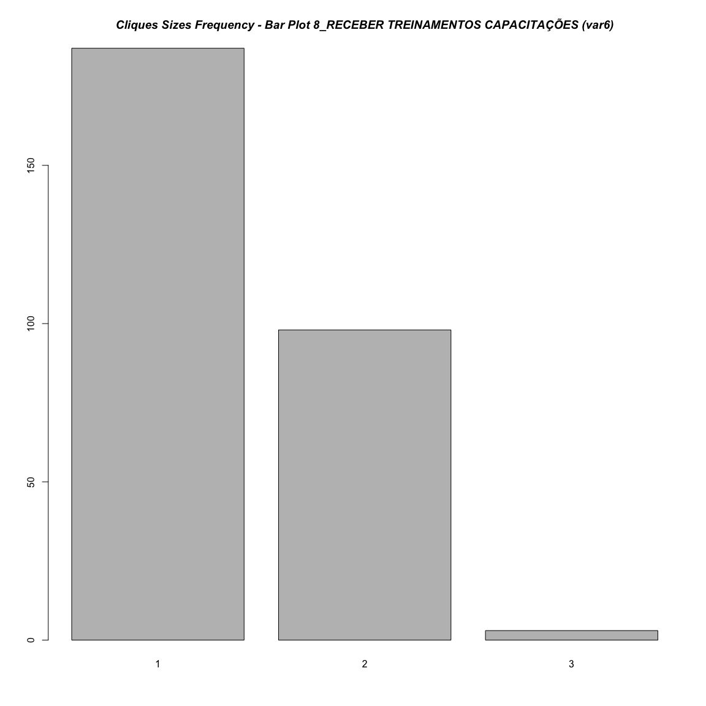

# SNA Cliques 8_RECEBER TREINAMENTOS CAPACITAÇÕES (var6)
Leonardo Martins  
17 de julho de 2016  
SNA Descritive Analysis from "Projeto Redes de Atenção às pessoas que consomem álcool e outras Drogas em Juiz de Fora-MG   Brazil"  - SNArRDJF

Here you can find a basic script to analysis data from SNArRDJF - this script was elaborated considering its use for orther matrix adjacency data from SNArRDJF - Here we are going to analyse:

# 8_RECEBER TREINAMENTOS CAPACITAÇÕES (var6)

`#########################
`# Basic Preparation #####
`#########################

#Loading objects generated with previous script 

```r
rm(list = ls()) # removing previous objects to be sure that we don't have objects conflicts name
load("~/SNArRDJF/Robject/10_distance_paths_var6.RData")
```
##Reload packages

```r
suppressMessages(library(RColorBrewer))
suppressMessages(library(car))
suppressMessages(library(xtable))
suppressMessages(library(igraph))
suppressMessages(library(miniCRAN))
suppressMessages(library(magrittr))
suppressMessages(library(keyplayer))
suppressMessages(library(dplyr))
suppressMessages(library(feather))
suppressMessages(library(visNetwork))
suppressMessages(library(knitr))
suppressMessages(library(DT))
```
##Adding phantom tools

```r
#In order to get dinamic javascript object install those ones. If you get problems installing go to Stackoverflow.com and type your error to discover what to do. In some cases the libraries need to be intalled in outside R libs.
#devtools::install_github("wch/webshot")
#webshot::install_phantomjs()
```
##Setting a random seed - this is a good strategy to keep the same graph pattern layout in a new report generation

```r
set.seed(123)
```

##Simplify Graph - removing loops and duble edges 

```r
var6_u<-simplify(var6) #Simplify
```

#Find cliques (complete subgraphs of an undirected graph)
Graph clique is a subset of vertices of a graph such that every two vertices in the clique are adjacent. - ***To check****

##Number of cliques - subgraphs

```r
cliques_var6_u<-cliques(var6_u) # list of cliques 
length(cliques_var6_u)
```

```
## [1] 288
```
##Number of cliques by cliques size

```r
cliques_var6_u_size<-sapply(cliques(var6_u), length) 
cliques_var6_u_size_t<-table(cliques_var6_u_size)
cliques_var6_u_size_t
```

```
## cliques_var6_u_size
##   1   2   3 
## 187  98   3
```

##Cliques Bar Plot Sizes Frequency

```r
barplot(cliques_var6_u_size_t)
title(main = "Cliques Sizes Frequency - Bar Plot 8_RECEBER TREINAMENTOS CAPACITAÇÕES (var6)", font.main = 4)
```

<!-- -->

##Size of largest clique 
A maximum clique is a clique that cannot be extended by including one more adjacent vertex (not included in larger one). 

```r
clique_num(var6_u)
```

```
## [1] 3
```
##Number of maximal cliques

```r
count_max_cliques(var6_u)
```

```
## [1] 191
```
##Finding of largest cliques

```r
largest_cliques<-largest_cliques(var6_u) # cliques with max number of nodes
length(largest_cliques)
```

```
## [1] 3
```

##Plotting the largest cliques - important to consider connectivite 

```r
#Generating undirected graph
as.undirected_var6_u<-as.undirected(var6_u)

#Coloring largest clique as gold and others one as gray
vcol <- rep("grey80", vcount(var6_u))
vcol[unlist(largest_cliques(var6_u))] <- "gold"

#Saving gray and gold as igraph attribute
V(as.undirected_var6_u)$vcol<-vcol

#Saving labels to display as legend
V(as.undirected_var6_u)$vcollabel[V(as.undirected_var6_u)$vcol=="gold"]<-"Largets Clique"
V(as.undirected_var6_u)$vcollabel [V(as.undirected_var6_u)$vcol=="grey80"]<-"Others"
```

##Plotting based only on degree measures 

```r
plot(as.undirected(var6_u), 
     layout=layout.kamada.kawai(as.undirected(var6_u)), 
     vertex.label=get.vertex.attribute(as.undirected(var6_u),"LABEL_COR"),
     vertex.color=vcol,
     vertex.frame.color="#ffffff",
     vertex.label.color="black",
     vertex.size=sqrt(degree(as.undirected(var6_u))),
     edge.arrow.size=0.1,
     vertex.label.cex=log(degree(as.undirected(var6_u))+1)/10,
     edge.width=log(edge.betweenness(as.undirected(var6_u), weights =E(as.undirected(var6_u))$var6))/50,
     edge.curved = TRUE
     )

#Solving Problems with legend rendering 
a<-V(as.undirected_var6_u)$vcollabel
b<-V(as.undirected_var6_u)$vcol
c<-table(a,b)
d<-as.data.frame(c)
e<-subset(d, d$Freq>0)
f<-t(e$a)
g<-t(e$b)

#Adding Legend
legend(x=1, y=1.25,
       legend=as.character(f),
       pch=21,
       col = "#777777", 
       pt.bg=as.character(g),
       pt.cex=4,
       bty="n", 
       ncol=1,
       lty=1,
       cex = .8)

#Adding Title
  title("Network Vertex Degree Sized - classfied by largest clique vs. others", sub = "Source: from authors ")
  text(x = -1, y = -1.2, labels = 
   sprintf("Size of largest clique: %.1f\nNumber of maximal cliques: %.1f",
     clique_num(var6_u), 
     count_max_cliques(var6_u)
   ))
```

<!-- -->

#Saving objects with new variables and changes

```r
save.image("~/SNArRDJF/Robject/12_cliques_var6.RData") 
```


