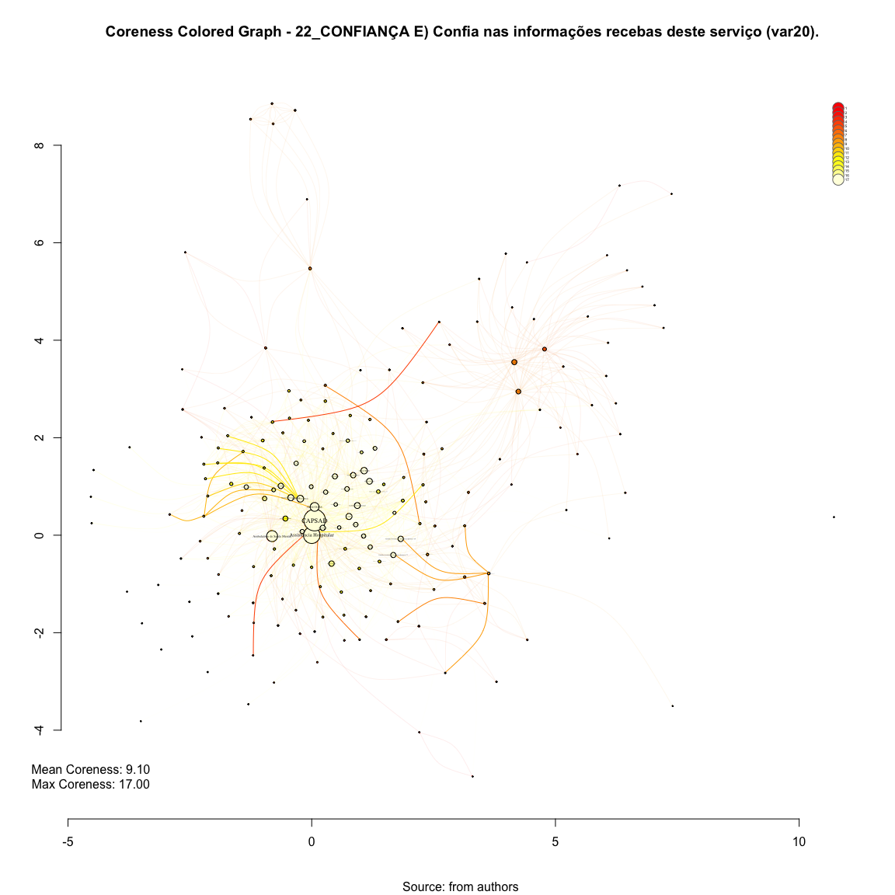

# SNA K-Core 22_CONFIANÇA E) Confia nas informações recebas deste serviço (var20).
Leonardo Martins  
17 de julho de 2016  
SNA Descritive Analysis from "Projeto Redes de Atenção às pessoas que consomem álcool e outras Drogas em Juiz de Fora-MG   Brazil"  - SNArRDJF

Here you can find a basic script to analysis data from SNArRDJF - this script was elaborated considering its use for orther matrix adjacency data from SNArRDJF - Here we are going to analyse:

# 22_CONFIANÇA E) Confia nas informações recebas deste serviço (var20).

`#########################
`# Basic Preparation #####
`#########################

#Loading objects generated with previous script 

```r
rm(list = ls()) # removing previous objects to be sure that we don't have objects conflicts name
load("~/SNArRDJF/Robject/12_cliques_var20.RData")
```
##Reload packages

```r
suppressMessages(library(RColorBrewer))
suppressMessages(library(car))
suppressMessages(library(xtable))
suppressMessages(library(igraph))
suppressMessages(library(miniCRAN))
suppressMessages(library(magrittr))
suppressMessages(library(keyplayer))
suppressMessages(library(dplyr))
suppressMessages(library(feather))
suppressMessages(library(visNetwork))
suppressMessages(library(knitr))
suppressMessages(library(DT))
```
##Adding phantom tools

```r
#In order to get dinamic javascript object install those ones. If you get problems installing go to Stackoverflow.com and type your error to discover what to do. In some cases the libraries need to be intalled in outside R libs.
#devtools::install_github("wch/webshot")
#webshot::install_phantomjs()
```
##Setting a random seed - this is a good strategy to keep the same graph pattern layout in a new report generation

```r
set.seed(123)
```

##Simplify Graph - removing loops and duble edges 

```r
#var20<-simplify(var20) #Simplify
```


#K-core
k-core is a maximal subset of vertices such that each is connected to at least k others in the subset.R has a function wich calculates the coreness for each vertex.The coreness of a vertex is k if it belongs to the k-core but not to the (k+1)-core.

##Finding maximum k-core and pick out it on graph

```r
coreness <- graph.coreness(var20)
V(var20)$coreness<-graph.coreness(var20)
max_cor <- max(coreness)
max_cor <- max(coreness)
```
##Max Coreness

```r
max_cor
```

```
## [1] 17
```
##Heat map for coreness

```r
#Defining Heat Color
color_bar <- heat.colors(max_cor) 
V(var20)$color_bar<-color_bar[coreness]

set.seed(123)
#Plotting based only on degree measures 
edge.start <- ends(var20, es=E(var20), names=F)[,1]

# Fixing ego
minC <- rep(-Inf, vcount(var20))
maxC <- rep(Inf, vcount(var20))
minC[1] <- maxC[1] <- 0
co <- layout_with_fr(var20, niter=10^4, minx=minC, maxx=maxC,miny=minC, maxy=maxC, weights = E(var20)$weight)

#Plotting
plot(var20, 
     layout=co,
     edge.color=V(var20)$color_bar[edge.start],
     edge.arrow.size=degree(var20)/10000,
     edge.width=E(var20)$weight/10*mean(E(var20)$weight),
     edge.curved = TRUE,
     vertex.color = color_bar[coreness],
     vertex.size=(degree(var20)+10)/5,
     vertex.frame.color="black",
     vertex.label.color="black",
     vertex.label=get.vertex.attribute(var20,"LABEL_COR"),
     vertex.label.cex=(degree(var20)+0.01)/400,
     vertex.label.dist=0,
     rescale=F,
     xlim=range(co[,1]), 
     ylim=range(co[,2])
     )
axis(1)
axis(2)

#Solving Problems with legend rendering 
a<-V(var20)$coreness
b<-V(var20)$color_bar
c<-table(a,b)
d<-as.data.frame(c)
e<-subset(d, d$Freq>0)
f<-t(e$a)
g<-t(e$b)

#Adding Legend
legend(x=range(co[,1])[2], 
       y=range(co[,2])[2],
       legend=as.character(f),
       pch=21,
       col = "#777777", 
       pt.bg=as.character(g),
       pt.cex=2,
       bty="n", 
       ncol=1,
       lty=1,
       cex = .3)

#Adding Title
  title("Coreness Colored Graph - 22_CONFIANÇA E) Confia nas informações recebas deste serviço (var20).", sub = "Source: from authors ", cex = .5)
  text( 
    x=range(co[,1])[1],
    y=range(co[,2])[1], 
      labels =     sprintf("Mean Coreness: %.2f\nMax Coreness: %.2f",
     mean(graph.coreness(var20)), 
     max(graph.coreness(var20))
             )
       )
```

<!-- -->

#Saving objects with new variables and changes

```r
save.image("~/SNArRDJF/Robject/14_kcore_var20.RData") 
```
