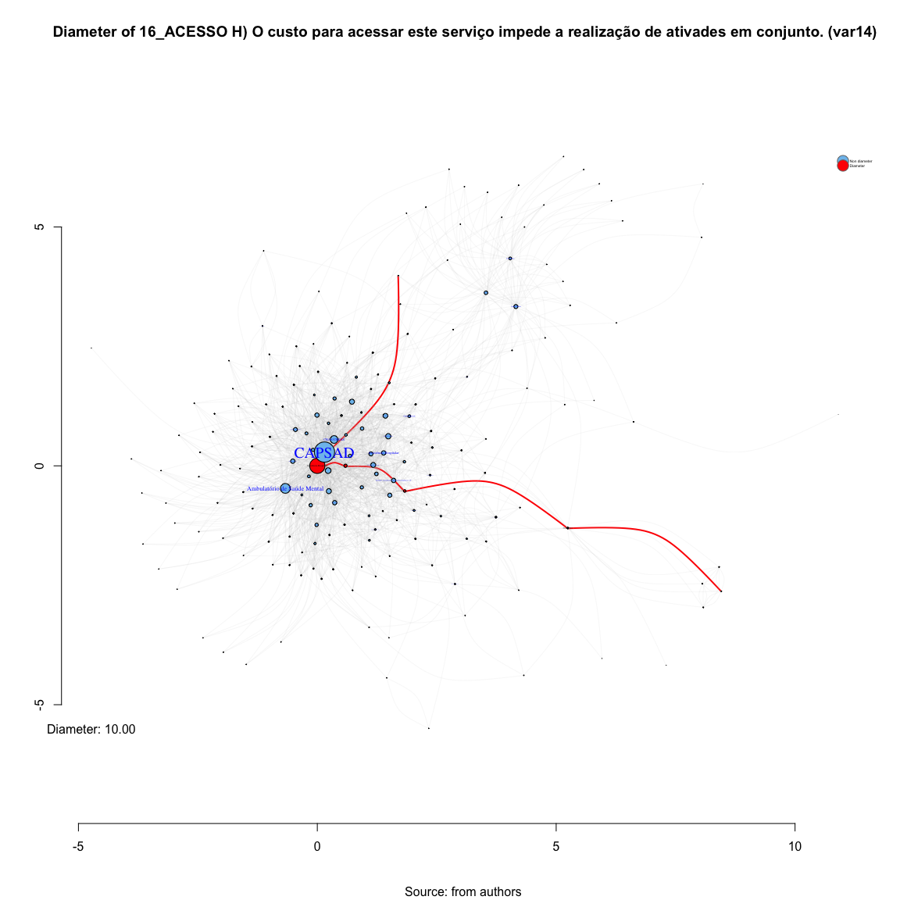

# SNA Diameter 16_ACESSO H) O custo para acessar este serviço impede a realização de ativades em conjunto. (var14)
Leonardo Martins  
17 de julho de 2016  
SNA Descritive Analysis from "Projeto Redes de Atenção às pessoas que consomem álcool e outras Drogas em Juiz de Fora-MG   Brazil"  - SNArRDJF

Here you can find a basic script to analysis data from SNArRDJF - this script was elaborated considering its use for orther matrix adjacency data from SNArRDJF - Here we are going to analyse:

# 16_ACESSO H) O custo para acessar este serviço impede a realização de ativades em conjunto. (var14)

`#########################
`# Basic Preparation #####
`#########################

#Loading objects generated with previous script 

```r
rm(list = ls()) # removing previous objects to be sure that we don't have objects conflicts name
load("~/SNArRDJF/Robject/14_kcore_var14.RData")
```
##Reload packages

```r
suppressMessages(library(RColorBrewer))
suppressMessages(library(car))
suppressMessages(library(xtable))
suppressMessages(library(igraph))
suppressMessages(library(miniCRAN))
suppressMessages(library(magrittr))
suppressMessages(library(keyplayer))
suppressMessages(library(dplyr))
suppressMessages(library(feather))
suppressMessages(library(visNetwork))
suppressMessages(library(knitr))
suppressMessages(library(DT))
```
##Adding phantom tools

```r
#In order to get dinamic javascript object install those ones. If you get problems installing go to Stackoverflow.com and type your error to discover what to do. In some cases the libraries need to be intalled in outside R libs.
#devtools::install_github("wch/webshot")
#webshot::install_phantomjs()
```
##Setting a random seed - this is a good strategy to keep the same graph pattern layout in a new report generation

```r
set.seed(123)
```

##Simplify Graph - removing loops and duble edges 

```r
#var14<-simplify(var14) #Simplify
```


#Diameter - length of the longest geodesic.

##Diameter Non-weigthed 

```
## [1] 6
```

```
## + 7/187 vertices, named:
## [1] EA_DQCT_ Centro Terapêutico Reconstruir (escritório)                          
## [2] EA_DQCT_ Centro Terapêutico Reconstruir (fazenda)                             
## [3] ASS_HOS_ Hospital de Pronto Socorro – HPS                                     
## [4] CRAS_AS_ CRAS Sudeste Costa Carvalho                                          
## [5] AJU_MUT_ Grupo A.A. Reunidos                                                  
## [6] AJU_MUT_ Escritório de Serviços Locais dos Álcoólicos Anônimos de Juiz de Fora
## [7] AJU_MUT_ ALANON Grupo Libertação
```
##Diameter Weigthed 

```
## [1] 10
```

```
## + 6/187 vertices, named:
## [1] AJU_MUT_ ALANON Grupo Só Por Hoje                           
## [2] ASS_HOS_ Hospital de Pronto Socorro – HPS                   
## [3] CRAS_AS_ CRAS Norte Benfica                                 
## [4] ENT_SOC_ Território Aliança pela Vida  Zona Norte           
## [5] AJU_MUT_ Grupo de Apoio São Pedro do Amor Exigente (GASPAE) 
## [6] AJU_MUT_ Grupo de Apoio São Mateus de Amor Exigente (GASMAE)
```
##Plotting Diameter
##Plotting Betweenness Centrality - (Vertex)

```r
set.seed(123)
d <- get.diameter(var14, weights =E(var14)$var14 )
E(var14)$color_d <- "grey"
E(var14)$width_d <- 0.1
E(var14, path=d)$color_d <- "red"
E(var14, path=d)$width_d <- 2
V(var14)$label.color_d <- "blue"
V(var14)$color_d  <- "SkyBlue2"
V(var14)$color_label  <- "Non diameter"
V(var14)[d]$label.color_d <- "black"
V(var14)[d]$color_d <- "red"
V(var14)[d]$color_label <- "Diameter"

#Plotting based only on degree measures 
edge.start <- ends(var14, es=E(var14), names=F)[,1]

# Fixing ego
minC <- rep(-Inf, vcount(var14))
maxC <- rep(Inf, vcount(var14))
minC[1] <- maxC[1] <- 0
co <- layout_with_fr(var14, niter=10^4, minx=minC, maxx=maxC,miny=minC, maxy=maxC, weights = E(var14)$var14)

#Plotting
plot(var14, 
     layout=co,
     edge.color=E(var14)$color_d,
     edge.arrow.size=(betweenness(var14, weights = E(var14)$var14)+1)/100000,
     edge.width=E(var14)$width_d,
     edge.curved = TRUE,
     vertex.color=V(var14)$color_d,
     vertex.size=degree(var14)/5,
     vertex.frame.color="black",
     vertex.label.color=V(var14)$label.color_d,
     vertex.label=get.vertex.attribute(var14,"LABEL_COR"),
     vertex.label.cex=(betweenness(var14, weights = E(var14)$var14)+1)/10000,
     vertex.label.dist=0,
     rescale=F,
     xlim=range(co[,1]), 
     ylim=range(co[,2])
     )
axis(1)
axis(2)

#Solving Problems with legend rendering 
a<-V(var14)$color_label 
b<-V(var14)$color_d
c<-table(a,b)
d<-as.data.frame(c)
e<-subset(d, d$Freq>0)
e<-e[order(e$a,decreasing=T),] 
f<-t(e$a)
g<-t(e$b)

#Adding Legend
legend(x=range(co[,1])[2], 
       y=range(co[,2])[2],
       legend=as.character(f),
       pch=21,
       col = "#777777", 
       pt.bg=as.character(g),
       pt.cex=2,
       bty="n", 
       ncol=1,
       lty=1,
       cex = .3)

#Adding Title
  title("Diameter of 16_ACESSO H) O custo para acessar este serviço impede a realização de ativades em conjunto. (var14)", sub = "Source: from authors ")
  text( 
    x=range(co[,1])[1],
    y=range(co[,2])[1], 
      labels =    sprintf("Diameter: %.2f",diameter(var14, weights = E(var14)$var14))
             )
```

<!-- -->
#Saving objects with new variables and changes

```r
save.image("~/SNArRDJF/Robject/15_diameter_var14.RData") 
```


