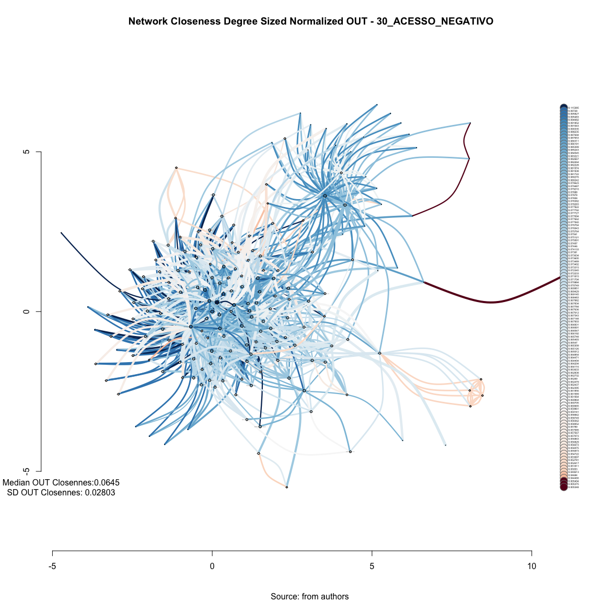

# SNA Closeness 30_ACESSO_NEGATIVO
Leonardo Martins  
17 de julho de 2016  
SNA Descritive Analysis from "Projeto Redes de Atenção às pessoas que consomem álcool e outras Drogas em Juiz de Fora-MG   Brazil"  - SNArRDJF

Here you can find a basic script to analysis data from SNArRDJF - this script was elaborated considering its use for orther matrix adjacency data from SNArRDJF - Here we are going to analyse:

# 30_ACESSO_NEGATIVO

`#########################
`# Basic Preparation #####
`#########################

#Loading objects generated with previous script 

```r
rm(list = ls()) # removing previous objects to be sure that we don't have objects conflicts name
load("~/SNArRDJF/Robject/acesso_negativo_data.RData")
```
##Reload packages

```r
suppressMessages(library(RColorBrewer))
#suppressMessages(library(car))
#suppressMessages(library(xtable))
suppressMessages(library(igraph))
#suppressMessages(library(miniCRAN))
#suppressMessages(library(magrittr))
#suppressMessages(library(keyplayer))
suppressMessages(library(dplyr))
#suppressMessages(library(feather))
#suppressMessages(library(visNetwork))
#suppressMessages(library(knitr))
suppressMessages(library(DT))
```
##Adding phantom tools

```r
#In order to get dinamic javascript object install those ones. If you get problems installing go to Stackoverflow.com and type your error to discover what to do. In some cases the libraries need to be intalled in outside R libs.
#devtools::install_github("wch/webshot")
#webshot::install_phantomjs()
```
##Setting a random seed - this is a good strategy to keep the same graph pattern layout in a new report generation

```r
set.seed(123)
```

##Simplify Graph - removing loops and duble edges 

```r
#acesso_negativo<-simplify(acesso_negativo) #Simplify
```

#Closeness - centrality based on distance to others in the graph 

*How close an actor to all the other actors in network?*

High closeness centrality - short communication path to others, minimal number of steps to reach others.

Answers the “Kevin Bacon” question:

*How many steps are required to access every other vertex from a given vertex?*

One practical implication of this metric: it helps you gauge how information might spread within your network, and who might be the best people to leverage if you need to make sure information gets around. Link here: <http://www.tc.umn.edu/~alink/R-social-network-analysis.html>

Closeness centrality can be defined as a measure of how far other nodes are from the node in question. Nodes with high closeness centrality are likely to be relatively efficient in receiving or transmitting information to/from distant parts of the social network.

Scores may be interpreted as arising from a reciprocal process in which the centrality of each actor is proportional to the sum of the centralities of those actors to whom he or she is connected. 

In general, vertices with high eigenvector centralities are those which are connected to many other vertices which are, in turn, connected to many others (and so on). (The perceptive may realize that this implies that the largest values will be obtained by individuals in large cliques (or high-density substructures)

##Closeness Non-normalized

###Saving to Igraph object

```r
V(acesso_negativo)$incloseness <- closeness(acesso_negativo, mode = "in", weights = E(acesso_negativo)$acesso_negativo) %>% round(6)
V(acesso_negativo)$outcloseness <- closeness(acesso_negativo, mode = "out", weights = E(acesso_negativo)$acesso_negativo) %>% round(6)
V(acesso_negativo)$totalcloseness <- closeness(acesso_negativo, mode = "total", weights = E(acesso_negativo)$acesso_negativo) %>% round(4)
```

###Saving to Environment

```r
acesso_negativo_incloseness<- closeness(acesso_negativo, mode = "in", weights = E(acesso_negativo)$acesso_negativo) %>% round(6)
acesso_negativo_outcloseness<- closeness(acesso_negativo, mode = "out", weights = E(acesso_negativo)$acesso_negativo) %>% round(6)
acesso_negativo_totalcloseness<- closeness(acesso_negativo, mode = "total", weights = E(acesso_negativo)$acesso_negativo) %>% round(6)
```

##Closeness Non-normalized - IN

```r
summary(acesso_negativo_incloseness)
```

```
##      Min.   1st Qu.    Median      Mean   3rd Qu.      Max. 
## 0.0000290 0.0001070 0.0001120 0.0001094 0.0001130 0.0001210
```

```r
sd(acesso_negativo_incloseness)
```

```
## [1] 7.691731e-06
```

###Network Plotting Based On Non-normalized Closeness - IN

```r
V(acesso_negativo)$incloseness<-closeness(acesso_negativo, weights = E(acesso_negativo)$acesso_negativo, mode="in")

#Get Variable
V(acesso_negativo)$acesso_negativo_color_degree<-round(V(acesso_negativo)$incloseness,6)

#Creating brewer pallette
vertex_acesso_negativo_color_degree<-
  colorRampPalette(brewer.pal(length(unique(
          V(acesso_negativo)$acesso_negativo_color_degree)), "RdBu"))(
            length(unique(V(acesso_negativo)$acesso_negativo_color_degree)))

#Saving as Vertex properties 
V(acesso_negativo)$vertex_acesso_negativo_color_degree<-
  vertex_acesso_negativo_color_degree[as.numeric(
  cut(V(acesso_negativo)$acesso_negativo_color_degree,
      breaks=length(unique(V(acesso_negativo)$acesso_negativo_color_degree))))]

set.seed(123)
#Plotting based only on degree measures 
edge.start <- ends(acesso_negativo, es=E(acesso_negativo), names=F)[,1]

# Fixing ego
minC <- rep(-Inf, vcount(acesso_negativo))
maxC <- rep(Inf, vcount(acesso_negativo))
minC[1] <- maxC[1] <- 0
co <- layout_with_fr(acesso_negativo, niter=10^4, minx=minC, maxx=maxC,miny=minC, maxy=maxC, weights = E(acesso_negativo)$weight)


#PLotting
plot(acesso_negativo, 
     layout=co,
     edge.color=V(acesso_negativo)$vertex_acesso_negativo_color_degree[edge.start],
     edge.arrow.size=closeness(acesso_negativo, weights = E(acesso_negativo)$acesso_negativo, mode="in"),
     edge.width=E(acesso_negativo)$weight/mean(E(acesso_negativo)$weight),
     edge.curved = TRUE,
     vertex.color=V(acesso_negativo)$vertex_acesso_negativo_color_degree,
     vertex.size=closeness(acesso_negativo, weights = E(acesso_negativo)$acesso_negativo, mode="in")*10^5,
     vertex.frame.color="black",
     vertex.label.color="black",
     vertex.label=get.vertex.attribute(acesso_negativo,"LABEL_COR"),
     vertex.label.cex=(closeness(acesso_negativo, weights = E(acesso_negativo)$acesso_negativo, mode="in")+10^-5)*2000,
     vertex.label.dist=0,
     rescale=F,
     xlim=range(co[,1]), 
     ylim=range(co[,2])
     )
axis(1)
axis(2)


#Solving Problems with legend rendering 
a<-V(acesso_negativo)$acesso_negativo_color_degree
b<-V(acesso_negativo)$vertex_acesso_negativo_color_degree
c<-table(a,b)
d<-as.data.frame(c)
e<-subset(d, d$Freq>0)
e<-e[order(e$a,decreasing=T),] 
f<-t(e$a)
g<-t(e$b)

#Adding Legend
legend(x=range(co[,1])[2], 
       y=range(co[,2])[2],
       legend=as.character(f),
       pch=21,
       col = "#777777", 
       pt.bg=as.character(g),
       pt.cex=2,
       bty="n", 
       ncol=1,
       lty=1,
       cex = .3)

#Adding Title
  title("Network Closeness Degree Sized and Colored In - 30_ACESSO_NEGATIVO", sub = "Source: from authors ")
  text( 
    x=range(co[,1])[1],
    y=range(co[,2])[1], 
      labels = sprintf(
             "Median In Closennes:%.4f\nSD In Closennes: %.5f",
             median(closeness(acesso_negativo, mode="in", weights = E(acesso_negativo)$acesso_negativo)), 
             sd(closeness(acesso_negativo, mode="in", weights = E(acesso_negativo)$acesso_negativo))
             )
       )
```

<!-- -->

##Closeness Non-normalized - OUT

```r
summary(acesso_negativo_outcloseness)
```

```
##      Min.   1st Qu.    Median      Mean   3rd Qu.      Max. 
## 0.0000290 0.0002835 0.0003470 0.0003042 0.0004035 0.0006200
```

```r
sd(acesso_negativo_outcloseness)
```

```
## [1] 0.0001506092
```


###Network Plotting Based On Non-normalized Closeness - OUT

```r
V(acesso_negativo)$outcloseness<-closeness(acesso_negativo, weights = E(acesso_negativo)$acesso_negativo, mode="out")

#Get Variable
V(acesso_negativo)$acesso_negativo_color_degree<-round(V(acesso_negativo)$outcloseness,6)

#Creating brewer pallette
vertex_acesso_negativo_color_degree<-
  colorRampPalette(brewer.pal(length(unique(
          V(acesso_negativo)$acesso_negativo_color_degree)), "RdBu"))(
            length(unique(V(acesso_negativo)$acesso_negativo_color_degree)))

#Saving as Vertex properties 
V(acesso_negativo)$vertex_acesso_negativo_color_degree<-
  vertex_acesso_negativo_color_degree[as.numeric(
  cut(V(acesso_negativo)$acesso_negativo_color_degree,
      breaks=length(unique(V(acesso_negativo)$acesso_negativo_color_degree))))]

set.seed(123)
#Plotting based only on degree measures 
edge.start <- ends(acesso_negativo, es=E(acesso_negativo), names=F)[,1]

# Fixing ego
minC <- rep(-Inf, vcount(acesso_negativo))
maxC <- rep(Inf, vcount(acesso_negativo))
minC[1] <- maxC[1] <- 0
co <- layout_with_fr(acesso_negativo, niter=10^4, minx=minC, maxx=maxC,miny=minC, maxy=maxC, weights = E(acesso_negativo)$weight)


#PLotting
plot(acesso_negativo, 
     layout=co,
     edge.color=V(acesso_negativo)$vertex_acesso_negativo_color_degree[edge.start],
     edge.arrow.size=closeness(acesso_negativo, weights = E(acesso_negativo)$acesso_negativo, mode="out"),
     edge.width=E(acesso_negativo)$weight/2*mean(E(acesso_negativo)$weight),
     edge.curved = TRUE,
     vertex.color=V(acesso_negativo)$vertex_acesso_negativo_color_degree,
     vertex.size=closeness(acesso_negativo, weights = E(acesso_negativo)$acesso_negativo, mode="out")*10^4,
     vertex.frame.color="white",
     vertex.label.color="black",
     vertex.label=get.vertex.attribute(acesso_negativo,"LABEL_COR"),
     vertex.label.cex=closeness(acesso_negativo, weights = E(acesso_negativo)$acesso_negativo, mode="out")*200,
     vertex.label.dist=0,
     rescale=F,
     xlim=range(co[,1]), 
     ylim=range(co[,2])
     )
axis(1)
axis(2)


#Solving Problems with legend rendering 
a<-V(acesso_negativo)$acesso_negativo_color_degree
b<-V(acesso_negativo)$vertex_acesso_negativo_color_degree
c<-table(a,b)
d<-as.data.frame(c)
e<-subset(d, d$Freq>0)
e<-e[order(e$a,decreasing=T),] 
f<-t(e$a)
g<-t(e$b)

#Adding Legend
legend(x=range(co[,1])[2], 
       y=range(co[,2])[2],
       legend=as.character(f),
       pch=21,
       col = "#777777", 
       pt.bg=as.character(g),
       pt.cex=2,
       bty="n", 
       ncol=1,
       lty=1,
       cex = .3)

#Adding Title
  title("Network Closeness Degree Sized and Colored OUT - 30_ACESSO_NEGATIVO", sub = "Source: from authors ")
  text( 
    x=range(co[,1])[1],
    y=range(co[,2])[1], 
      labels = sprintf(
             "Median OUT Closennes:%.4f\nSD OUT Closennes: %.5f",
             median(closeness(acesso_negativo, mode="out", weights = E(acesso_negativo)$acesso_negativo)), 
             sd(closeness(acesso_negativo, mode="out", weights = E(acesso_negativo)$acesso_negativo))
             )
       )
```

<!-- -->

##Closeness Non-normalized - ALL

```r
summary(acesso_negativo_totalcloseness)
```

```
##      Min.   1st Qu.    Median      Mean   3rd Qu.      Max. 
## 0.0002590 0.0004365 0.0004700 0.0004758 0.0005200 0.0007930
```

```r
sd(acesso_negativo_totalcloseness)
```

```
## [1] 7.339279e-05
```

###Network Plotting Based On Non-normalized Closeness - ALL

```r
V(acesso_negativo)$allcloseness<-closeness(acesso_negativo, weights = E(acesso_negativo)$acesso_negativo, mode="all")

#Get Variable
V(acesso_negativo)$acesso_negativo_color_degree<-round(V(acesso_negativo)$allcloseness,6)

#Creating brewer pallette
vertex_acesso_negativo_color_degree<-
  colorRampPalette(brewer.pal(length(unique(
          V(acesso_negativo)$acesso_negativo_color_degree)), "RdBu"))(
            length(unique(V(acesso_negativo)$acesso_negativo_color_degree)))

#Saving as Vertex properties 
V(acesso_negativo)$vertex_acesso_negativo_color_degree<-
  vertex_acesso_negativo_color_degree[as.numeric(
  cut(V(acesso_negativo)$acesso_negativo_color_degree,
      breaks=length(unique(V(acesso_negativo)$acesso_negativo_color_degree))))]

set.seed(123)
#Plotting based only on degree measures 
edge.start <- ends(acesso_negativo, es=E(acesso_negativo), names=F)[,1]

# Fixing ego
minC <- rep(-Inf, vcount(acesso_negativo))
maxC <- rep(Inf, vcount(acesso_negativo))
minC[1] <- maxC[1] <- 0
co <- layout_with_fr(acesso_negativo, niter=10^4, minx=minC, maxx=maxC,miny=minC, maxy=maxC, weights = E(acesso_negativo)$weight)


#PLotting
plot(acesso_negativo, 
     layout=co,
     edge.color=V(acesso_negativo)$vertex_acesso_negativo_color_degree[edge.start],
     edge.arrow.size=closeness(acesso_negativo, weights = E(acesso_negativo)$acesso_negativo, mode="all"),
     edge.width=E(acesso_negativo)$weight/2*mean(E(acesso_negativo)$weight),
     edge.curved = TRUE,
     vertex.color=V(acesso_negativo)$vertex_acesso_negativo_color_degree,
     vertex.size=closeness(acesso_negativo, weights = E(acesso_negativo)$acesso_negativo, mode="all")*10^4,
     vertex.frame.color="white",
     vertex.label.color="black",
     vertex.label=get.vertex.attribute(acesso_negativo,"LABEL_COR"),
     vertex.label.cex=(closeness(acesso_negativo, weights = E(acesso_negativo)$acesso_negativo, mode="all")+0.00001)*200,
     vertex.label.dist=0,
     rescale=F,
     xlim=range(co[,1]), 
     ylim=range(co[,2])
     )
axis(1)
axis(2)


#Solving Problems with legend rendering 
a<-V(acesso_negativo)$acesso_negativo_color_degree
b<-V(acesso_negativo)$vertex_acesso_negativo_color_degree
c<-table(a,b)
d<-as.data.frame(c)
e<-subset(d, d$Freq>0)
e<-e[order(e$a,decreasing=T),] 
f<-t(e$a)
g<-t(e$b)

#Adding Legend
legend(x=range(co[,1])[2], 
       y=range(co[,2])[2],
       legend=as.character(f),
       pch=21,
       col = "#777777", 
       pt.bg=as.character(g),
       pt.cex=2,
       bty="n", 
       ncol=1,
       lty=1,
       cex = .3)

#Adding Title
  title("Network Closeness Degree Sized and Colored all - 30_ACESSO_NEGATIVO", sub = "Source: from authors ")
  text( 
    x=range(co[,1])[1],
    y=range(co[,2])[1], 
      labels = sprintf(
             "Median all Closennes:%.4f\nSD all Closennes: %.5f",
             median(closeness(acesso_negativo, mode="all", weights = E(acesso_negativo)$acesso_negativo)), 
             sd(closeness(acesso_negativo, mode="all", weights = E(acesso_negativo)$acesso_negativo))
             )
       )
```

<!-- -->

##Closeness Normalized 

###Saving to Igraph object

```r
V(acesso_negativo)$incloseness_n <- closeness(acesso_negativo, mode = "in",, weights = E(acesso_negativo)$acesso_negativo, normalized = T) %>% round(10)
V(acesso_negativo)$outcloseness_n <- closeness(acesso_negativo, mode = "out", normalized = T, weights = E(acesso_negativo)$acesso_negativo) %>% round(6)
V(acesso_negativo)$totalcloseness_n <- closeness(acesso_negativo, mode = "total", normalized = T, weights = E(acesso_negativo)$acesso_negativo) %>% round(6)
```

###Saving to Environment

```r
acesso_negativo_incloseness_n<- closeness(acesso_negativo, mode = "in", normalized = T, weights = E(acesso_negativo)$acesso_negativo) %>% round(6)
acesso_negativo_outcloseness_n<- closeness(acesso_negativo, mode = "out", normalized = T, weights = E(acesso_negativo)$acesso_negativo) %>% round(6)
acesso_negativo_totalcloseness_n<- closeness(acesso_negativo, mode = "total", normalized = T, weights = E(acesso_negativo)$acesso_negativo) %>% round(6)
```

###Closeness Normalized  - IN

```r
summary(acesso_negativo_incloseness_n)
```

```
##     Min.  1st Qu.   Median     Mean  3rd Qu.     Max. 
## 0.005348 0.019860 0.020750 0.020360 0.021000 0.022510
```

```r
sd(acesso_negativo_incloseness_n)
```

```
## [1] 0.001430766
```

##Network Plotting Based On Normalized Closeness - IN

```r
V(acesso_negativo)$incloseness_n<-closeness(acesso_negativo, weights = E(acesso_negativo)$acesso_negativo, mode="in", normalized = T)

#Get Variable
V(acesso_negativo)$acesso_negativo_color_degree<-round(V(acesso_negativo)$incloseness_n,6)

#Creating brewer pallette
vertex_acesso_negativo_color_degree<-
  colorRampPalette(brewer.pal(length(unique(
          V(acesso_negativo)$acesso_negativo_color_degree)), "RdBu"))(
            length(unique(V(acesso_negativo)$acesso_negativo_color_degree)))

#Saving as Vertex properties 
V(acesso_negativo)$vertex_acesso_negativo_color_degree<-
  vertex_acesso_negativo_color_degree[as.numeric(
  cut(V(acesso_negativo)$acesso_negativo_color_degree,
      breaks=length(unique(V(acesso_negativo)$acesso_negativo_color_degree))))]

set.seed(123)
#Plotting based only on degree measures 
edge.start <- ends(acesso_negativo, es=E(acesso_negativo), names=F)[,1]

# Fixing ego
minC <- rep(-Inf, vcount(acesso_negativo))
maxC <- rep(Inf, vcount(acesso_negativo))
minC[1] <- maxC[1] <- 0
co <- layout_with_fr(acesso_negativo, niter=10^4, minx=minC, maxx=maxC,miny=minC, maxy=maxC, weights = E(acesso_negativo)$weight)


#PLotting
plot(acesso_negativo, 
     layout=co,
     edge.color=V(acesso_negativo)$vertex_acesso_negativo_color_degree[edge.start],
     edge.arrow.size=closeness(acesso_negativo, weights = E(acesso_negativo)$acesso_negativo, mode="in",normalized = T),
     edge.width=E(acesso_negativo)$weight/10*mean(E(acesso_negativo)$weight),
     edge.curved = TRUE,
     vertex.color=V(acesso_negativo)$vertex_acesso_negativo_color_degree,
     vertex.size=(closeness(acesso_negativo, weights = E(acesso_negativo)$acesso_negativo, mode="in",normalized = T))*1000,
     vertex.frame.color="black",
     vertex.label.color="black",
     vertex.label=get.vertex.attribute(acesso_negativo,"LABEL_COR"),
     vertex.label.cex=closeness(acesso_negativo, weights = E(acesso_negativo)$acesso_negativo, mode="in",normalized = T)*10,
     vertex.label.dist=0,
     rescale=F,
     xlim=range(co[,1]), 
     ylim=range(co[,2])
     )
axis(1)
axis(2)


#Solving Problems with legend rendering 
a<-V(acesso_negativo)$acesso_negativo_color_degree
b<-V(acesso_negativo)$vertex_acesso_negativo_color_degree
c<-table(a,b)
d<-as.data.frame(c)
e<-subset(d, d$Freq>0)
e<-e[order(e$a,decreasing=T),] 
f<-t(e$a)
g<-t(e$b)

#Adding Legend
legend(x=range(co[,1])[2], 
       y=range(co[,2])[2],
       legend=as.character(f),
       pch=21,
       col = "#777777", 
       pt.bg=as.character(g),
       pt.cex=2,
       bty="n", 
       ncol=1,
       lty=1,
       cex = .3)

#Adding Title
  title("Network Closeness Degree Sized Normalized In - 30_ACESSO_NEGATIVO", sub = "Source: from authors ")
  text( 
    x=range(co[,1])[1],
    y=range(co[,2])[1], 
      labels = sprintf(
             "Median In Closennes:%.4f\nSD In Closennes: %.5f",
             median(closeness(acesso_negativo, mode="in", weights = E(acesso_negativo)$acesso_negativo, normalized = T)), 
             sd(closeness(acesso_negativo, mode="in", weights = E(acesso_negativo)$acesso_negativo, normalized = T))
             )
       )
```

<!-- -->
###Closeness Normalized  - OUT

```r
summary(acesso_negativo_outcloseness_n)
```

```
##     Min.  1st Qu.   Median     Mean  3rd Qu.     Max. 
## 0.005348 0.052700 0.064470 0.056570 0.075030 0.115400
```

```r
sd(acesso_negativo_outcloseness_n)
```

```
## [1] 0.02803187
```

##Network Plotting Based On Normalized Closeness - OUT


```r
V(acesso_negativo)$outcloseness_n<-closeness(acesso_negativo, weights = E(acesso_negativo)$acesso_negativo, mode="out", normalized = T)

#Get Variable
V(acesso_negativo)$acesso_negativo_color_degree<-round(V(acesso_negativo)$outcloseness_n,6)

#Creating brewer pallette
vertex_acesso_negativo_color_degree<-
  colorRampPalette(brewer.pal(length(unique(
          V(acesso_negativo)$acesso_negativo_color_degree)), "RdBu"))(
            length(unique(V(acesso_negativo)$acesso_negativo_color_degree)))

#Saving as Vertex properties 
V(acesso_negativo)$vertex_acesso_negativo_color_degree<-
  vertex_acesso_negativo_color_degree[as.numeric(
  cut(V(acesso_negativo)$acesso_negativo_color_degree,
      breaks=length(unique(V(acesso_negativo)$acesso_negativo_color_degree))))]

set.seed(123)
#Plotting based only on degree measures 
edge.start <- ends(acesso_negativo, es=E(acesso_negativo), names=F)[,1]

# Fixing ego
minC <- rep(-Inf, vcount(acesso_negativo))
maxC <- rep(Inf, vcount(acesso_negativo))
minC[1] <- maxC[1] <- 0
co <- layout_with_fr(acesso_negativo, niter=10^4, minx=minC, maxx=maxC,miny=minC, maxy=maxC, weights = E(acesso_negativo)$weight)


#PLotting
plot(acesso_negativo, 
     layout=co,
     edge.color=V(acesso_negativo)$vertex_acesso_negativo_color_degree[edge.start],
     edge.arrow.size=closeness(acesso_negativo, weights = E(acesso_negativo)$acesso_negativo, mode="out",normalized = T),
     edge.width=E(acesso_negativo)$weight/10*mean(E(acesso_negativo)$weight),
     edge.curved = TRUE,
     vertex.color=V(acesso_negativo)$vertex_acesso_negativo_color_degree,
     vertex.size=(closeness(acesso_negativo, weights = E(acesso_negativo)$acesso_negativo, mode="out",normalized = T))*100,
     vertex.frame.color="black",
     vertex.label.color="black",
     vertex.label=get.vertex.attribute(acesso_negativo,"LABEL_COR"),
     vertex.label.cex=closeness(acesso_negativo, weights = E(acesso_negativo)$acesso_negativo, mode="out",normalized = T)*1.5,
     vertex.label.dist=0,
     rescale=F,
     xlim=range(co[,1]), 
     ylim=range(co[,2])
     )
axis(1)
axis(2)


#Solving Problems with legend rendering 
a<-V(acesso_negativo)$acesso_negativo_color_degree
b<-V(acesso_negativo)$vertex_acesso_negativo_color_degree
c<-table(a,b)
d<-as.data.frame(c)
e<-subset(d, d$Freq>0)
e<-e[order(e$a,decreasing=T),] 
f<-t(e$a)
g<-t(e$b)

#Adding Legend
legend(x=range(co[,1])[2], 
       y=range(co[,2])[2],
       legend=as.character(f),
       pch=21,
       col = "#777777", 
       pt.bg=as.character(g),
       pt.cex=2,
       bty="n", 
       ncol=1,
       lty=1,
       cex = .3)

#Adding Title
  title("Network Closeness Degree Sized Normalized OUT - 30_ACESSO_NEGATIVO", sub = "Source: from authors ")
  text( 
    x=range(co[,1])[1],
    y=range(co[,2])[1], 
      labels = sprintf(
             "Median OUT Closennes:%.4f\nSD OUT Closennes: %.5f",
             median(closeness(acesso_negativo, mode="out", weights = E(acesso_negativo)$acesso_negativo, normalized = T)), 
             sd(closeness(acesso_negativo, mode="out", weights = E(acesso_negativo)$acesso_negativo, normalized = T))
             )
       )
```

<!-- -->

###Closeness Normalized - ALL

```r
summary(acesso_negativo_totalcloseness_n)
```

```
##    Min. 1st Qu.  Median    Mean 3rd Qu.    Max. 
## 0.04814 0.08124 0.08741 0.08851 0.09667 0.14750
```

```r
sd(acesso_negativo_totalcloseness_n)
```

```
## [1] 0.01365091
```

##Network Plotting Based On Normalized Closeness - ALL

```r
V(acesso_negativo)$allcloseness_n<-closeness(acesso_negativo, weights = E(acesso_negativo)$acesso_negativo, mode="all", normalized = T)

#Get Variable
V(acesso_negativo)$acesso_negativo_color_degree<-round(V(acesso_negativo)$allcloseness_n,6)

#Creating brewer pallette
vertex_acesso_negativo_color_degree<-
  colorRampPalette(brewer.pal(length(unique(
          V(acesso_negativo)$acesso_negativo_color_degree)), "RdBu"))(
            length(unique(V(acesso_negativo)$acesso_negativo_color_degree)))

#Saving as Vertex properties 
V(acesso_negativo)$vertex_acesso_negativo_color_degree<-
  vertex_acesso_negativo_color_degree[as.numeric(
  cut(V(acesso_negativo)$acesso_negativo_color_degree,
      breaks=length(unique(V(acesso_negativo)$acesso_negativo_color_degree))))]

set.seed(123)
#Plotting based only on degree measures 
edge.start <- ends(acesso_negativo, es=E(acesso_negativo), names=F)[,1]

# Fixing ego
minC <- rep(-Inf, vcount(acesso_negativo))
maxC <- rep(Inf, vcount(acesso_negativo))
minC[1] <- maxC[1] <- 0
co <- layout_with_fr(acesso_negativo, niter=10^4, minx=minC, maxx=maxC,miny=minC, maxy=maxC, weights = E(acesso_negativo)$weight)


#PLotting
plot(acesso_negativo, 
     layout=co,
     edge.color=V(acesso_negativo)$vertex_acesso_negativo_color_degree[edge.start],
     edge.arrow.size=closeness(acesso_negativo, weights = E(acesso_negativo)$acesso_negativo, mode="all",normalized = T),
     edge.width=E(acesso_negativo)$weight/10*mean(E(acesso_negativo)$weight),
     edge.curved = TRUE,
     vertex.color=V(acesso_negativo)$vertex_acesso_negativo_color_degree,
     vertex.size=(closeness(acesso_negativo, weights = E(acesso_negativo)$acesso_negativo, mode="all",normalized = T))*100,
     vertex.frame.color="black",
     vertex.label.color="black",
     vertex.label=get.vertex.attribute(acesso_negativo,"LABEL_COR"),
     vertex.label.cex=closeness(acesso_negativo, weights = E(acesso_negativo)$acesso_negativo, mode="all",normalized = T)*1.5,
     vertex.label.dist=0,
     rescale=F,
     xlim=range(co[,1]), 
     ylim=range(co[,2])
     )
axis(1)
axis(2)


#Solving Problems with legend rendering 
a<-V(acesso_negativo)$acesso_negativo_color_degree
b<-V(acesso_negativo)$vertex_acesso_negativo_color_degree
c<-table(a,b)
d<-as.data.frame(c)
e<-subset(d, d$Freq>0)
e<-e[order(e$a,decreasing=T),] 
f<-t(e$a)
g<-t(e$b)

#Adding Legend
legend(x=range(co[,1])[2], 
       y=range(co[,2])[2],
       legend=as.character(f),
       pch=21,
       col = "#777777", 
       pt.bg=as.character(g),
       pt.cex=2,
       bty="n", 
       ncol=1,
       lty=1,
       cex = .3)

#Adding Title
  title("Network Closeness Degree Sized Normalized ALL - 30_ACESSO_NEGATIVO", sub = "Source: from authors ")
  text( 
    x=range(co[,1])[1],
    y=range(co[,2])[1], 
      labels = sprintf(
             "Median ALL Closennes:%.4f\nSD ALL Closennes: %.5f",
             median(closeness(acesso_negativo, mode="all", weights = E(acesso_negativo)$acesso_negativo, normalized = T)), 
             sd(closeness(acesso_negativo, mode="all", weights = E(acesso_negativo)$acesso_negativo, normalized = T))
             )
       )
```

<!-- -->

##Closeness Normalized 

###Saving to Igraph object

```r
V(acesso_negativo)$incloseness_n <- closeness(acesso_negativo, weights = E(acesso_negativo)$acesso_negativo, mode = "in", normalized = T) %>% round(6)
V(acesso_negativo)$outcloseness_n <- closeness(acesso_negativo, weights = E(acesso_negativo)$acesso_negativo, mode = "out", normalized = T) %>% round(6)
V(acesso_negativo)$totalcloseness_n <- closeness(acesso_negativo, weights = E(acesso_negativo)$acesso_negativo, mode = "total", normalized = T) %>% round(6)
```

##Centralization Closseness

```r
V(acesso_negativo)$acesso_negativo_centr_closeness<- centralization.closeness(acesso_negativo)$res
acesso_negativo_centr_closeness<- centralization.closeness(acesso_negativo)$res
acesso_negativo_centr_closeness_all<- centralization.closeness(acesso_negativo)
```

###Centralization

```r
acesso_negativo_centr_closeness_all$centralization
```

```
## [1] 0.1625197
```

###Theoretical Max

```r
acesso_negativo_centr_closeness_all$theoretical_max
```

```
## [1] 185.0053
```

##Network Plotting Based On Centralization Closeness

```r
V(acesso_negativo)$acesso_negativo_centr_closeness<- centralization.closeness(acesso_negativo)$res

#Get Variable
V(acesso_negativo)$acesso_negativo_color_degree<-round(V(acesso_negativo)$acesso_negativo_centr_closeness,6)

#Creating brewer pallette
vertex_acesso_negativo_color_degree<-
  colorRampPalette(brewer.pal(length(unique(
          V(acesso_negativo)$acesso_negativo_color_degree)), "Spectral"))(
            length(unique(V(acesso_negativo)$acesso_negativo_color_degree)))

#Saving as Vertex properties 
V(acesso_negativo)$vertex_acesso_negativo_color_degree<-
  vertex_acesso_negativo_color_degree[as.numeric(
  cut(V(acesso_negativo)$acesso_negativo_color_degree,
      breaks=length(unique(V(acesso_negativo)$acesso_negativo_color_degree))))]

set.seed(123)
#Plotting based only on degree measures 
edge.start <- ends(acesso_negativo, es=E(acesso_negativo), names=F)[,1]

# Fixing ego
minC <- rep(-Inf, vcount(acesso_negativo))
maxC <- rep(Inf, vcount(acesso_negativo))
minC[1] <- maxC[1] <- 0
co <- layout_with_fr(acesso_negativo, niter=10^4, minx=minC, maxx=maxC,miny=minC, maxy=maxC, weights = E(acesso_negativo)$weight)


#PLotting
plot(acesso_negativo, 
     layout=co,
     edge.color=V(acesso_negativo)$vertex_acesso_negativo_color_degree[edge.start],
     edge.arrow.size=centralization.closeness(acesso_negativo)$res,
     edge.width=E(acesso_negativo)$weight/10*mean(E(acesso_negativo)$weight),
     edge.curved = TRUE,
     vertex.color=V(acesso_negativo)$vertex_acesso_negativo_color_degree,
     vertex.size=centralization.closeness(acesso_negativo)$res*100,
     vertex.frame.color="black",
     vertex.label.color="black",
     vertex.label=get.vertex.attribute(acesso_negativo,"LABEL_COR"),
     vertex.label.cex=centralization.closeness(acesso_negativo)$res,
     vertex.label.dist=0,
     rescale=F,
     xlim=range(co[,1]), 
     ylim=range(co[,2])
     )
axis(1)
axis(2)


#Solving Problems with legend rendering 
a<-V(acesso_negativo)$acesso_negativo_color_degree
b<-V(acesso_negativo)$vertex_acesso_negativo_color_degree
c<-table(a,b)
d<-as.data.frame(c)
e<-subset(d, d$Freq>0)
e<-e[order(e$a,decreasing=T),] 
f<-t(e$a)
g<-t(e$b)

#Adding Legend
legend(x=range(co[,1])[2], 
       y=range(co[,2])[2],
       legend=as.character(f),
       pch=21,
       col = "#777777", 
       pt.bg=as.character(g),
       pt.cex=2,
       bty="n", 
       ncol=1,
       lty=1,
       cex = .3)

#Adding Title
  title("Network Centralization Closeness - 30_ACESSO_NEGATIVO", sub = "Source: from authors ")
  text( 
    x=range(co[,1])[1],
    y=range(co[,2])[1], 
      labels = sprintf(
             "Median Centralization Closeness:%.4f\nSD Centralization Closeness: %.5f",
             median(centralization.closeness(acesso_negativo)$res), 
             sd(centralization.closeness(acesso_negativo)$res)
             )
       )
```

<!-- -->

#Closeness Dinamic Table
##Getting Closeness Measures

```r
acesso_negativo_incloseness<- closeness(acesso_negativo, weights = E(acesso_negativo)$acesso_negativo, mode = "in") %>% round(6)
acesso_negativo_outcloseness<- closeness(acesso_negativo, weights = E(acesso_negativo)$acesso_negativo, mode = "out") %>% round(6)
acesso_negativo_totalcloseness<- closeness(acesso_negativo, weights = E(acesso_negativo)$acesso_negativo, mode = "total") %>% round(6)
acesso_negativo_incloseness_n<- closeness(acesso_negativo,weights = E(acesso_negativo)$acesso_negativo, mode = "in", normalized = T) %>% round(6)
acesso_negativo_outcloseness_n<- closeness(acesso_negativo,weights = E(acesso_negativo)$acesso_negativo, mode = "out", normalized = T) %>% round(6)
acesso_negativo_totalcloseness_n<- closeness(acesso_negativo,weights = E(acesso_negativo)$acesso_negativo, mode = "total", normalized = T) %>% round(6)
acesso_negativo_centr_closeness <- centralization.closeness(acesso_negativo)$res %>% round(6)
```

##Creating a datagrame of measures

```r
acesso_negativo_df_closseness <- data.frame(
acesso_negativo_incloseness,
acesso_negativo_outcloseness,
acesso_negativo_totalcloseness,
acesso_negativo_incloseness_n,
acesso_negativo_outcloseness_n,
acesso_negativo_totalcloseness_n,
acesso_negativo_centr_closeness) %>% round(6)

#Adding type
acesso_negativo_df_closseness <-cbind(acesso_negativo_df_closseness, V(acesso_negativo)$LABEL_COR)

#Adding names
names(acesso_negativo_df_closseness) <- c("In Closeness", "Out Closeness", "Total Closeness","In Closeness Normalized", "Out Closeness Normalized", "Total Closeness Normalized","Centralization Closeness","Type")

#Ordering Variables
acesso_negativo_df_closseness<-acesso_negativo_df_closseness[c("Type","In Closeness", "Out Closeness", "Total Closeness","In Closeness Normalized", "Out Closeness Normalized","Total Closeness Normalized", "Centralization Closeness")]
```

##General tabel - DT

```r
datatable(acesso_negativo_df_closseness, filter = 'top')
```

<!--html_preserve--><div id="htmlwidget-99c518ba2df4490a2058" style="width:100%;height:auto;" class="datatables html-widget"></div>
<script type="application/json" data-for="htmlwidget-99c518ba2df4490a2058">{"x":{"filter":"top","filterHTML":"<tr>\n  <td>\u003c/td>\n  <td data-type=\"factor\" style=\"vertical-align: top;\">\n    <div class=\"form-group has-feedback\" style=\"margin-bottom: auto;\">\n      <input type=\"search\" placeholder=\"All\" class=\"form-control\" style=\"width: 100%;\"/>\n      <span class=\"glyphicon glyphicon-remove-circle form-control-feedback\">\u003c/span>\n    \u003c/div>\n    <div style=\"width: 100%; display: none;\">\n      <select multiple=\"multiple\" style=\"width: 100%;\" data-options=\"[&quot;Acolhimento Institucional&quot;,&quot;Ajuda Mútua&quot;,&quot;Ambulatório AD&quot;,&quot;Ambulatório de Saúde Mental&quot;,&quot;Ambulatório Tabagismo&quot;,&quot;Assistência Hospitalar&quot;,&quot;CAPS&quot;,&quot;CAPSAD&quot;,&quot;CAPSi&quot;,&quot;Centro de Convivência&quot;,&quot;Centro POP&quot;,&quot;Clínicas e CT&quot;,&quot;Consultório na Rua&quot;,&quot;CRAS&quot;,&quot;CREAS&quot;,&quot;Entidades Socioassistenciais&quot;,&quot;Hospital Judiciário&quot;,&quot;Hospital Psiquiátrico&quot;,&quot;Pronto Socorro&quot;,&quot;Residência Terapeutica&quot;,&quot;SAMU&quot;,&quot;UAPS RURAL&quot;,&quot;UAPS URBANA&quot;]\">\u003c/select>\n    \u003c/div>\n  \u003c/td>\n  <td data-type=\"number\" style=\"vertical-align: top;\">\n    <div class=\"form-group has-feedback\" style=\"margin-bottom: auto;\">\n      <input type=\"search\" placeholder=\"All\" class=\"form-control\" style=\"width: 100%;\"/>\n      <span class=\"glyphicon glyphicon-remove-circle form-control-feedback\">\u003c/span>\n    \u003c/div>\n    <div style=\"display: none; position: absolute; width: 200px;\">\n      <div data-min=\"2.9e-05\" data-max=\"0.000121\" data-scale=\"6\">\u003c/div>\n      <span style=\"float: left;\">\u003c/span>\n      <span style=\"float: right;\">\u003c/span>\n    \u003c/div>\n  \u003c/td>\n  <td data-type=\"number\" style=\"vertical-align: top;\">\n    <div class=\"form-group has-feedback\" style=\"margin-bottom: auto;\">\n      <input type=\"search\" placeholder=\"All\" class=\"form-control\" style=\"width: 100%;\"/>\n      <span class=\"glyphicon glyphicon-remove-circle form-control-feedback\">\u003c/span>\n    \u003c/div>\n    <div style=\"display: none; position: absolute; width: 200px;\">\n      <div data-min=\"2.9e-05\" data-max=\"0.00062\" data-scale=\"6\">\u003c/div>\n      <span style=\"float: left;\">\u003c/span>\n      <span style=\"float: right;\">\u003c/span>\n    \u003c/div>\n  \u003c/td>\n  <td data-type=\"number\" style=\"vertical-align: top;\">\n    <div class=\"form-group has-feedback\" style=\"margin-bottom: auto;\">\n      <input type=\"search\" placeholder=\"All\" class=\"form-control\" style=\"width: 100%;\"/>\n      <span class=\"glyphicon glyphicon-remove-circle form-control-feedback\">\u003c/span>\n    \u003c/div>\n    <div style=\"display: none; position: absolute; width: 200px;\">\n      <div data-min=\"0.000259\" data-max=\"0.000793\" data-scale=\"6\">\u003c/div>\n      <span style=\"float: left;\">\u003c/span>\n      <span style=\"float: right;\">\u003c/span>\n    \u003c/div>\n  \u003c/td>\n  <td data-type=\"number\" style=\"vertical-align: top;\">\n    <div class=\"form-group has-feedback\" style=\"margin-bottom: auto;\">\n      <input type=\"search\" placeholder=\"All\" class=\"form-control\" style=\"width: 100%;\"/>\n      <span class=\"glyphicon glyphicon-remove-circle form-control-feedback\">\u003c/span>\n    \u003c/div>\n    <div style=\"display: none; position: absolute; width: 200px;\">\n      <div data-min=\"0.005348\" data-max=\"0.02251\" data-scale=\"6\">\u003c/div>\n      <span style=\"float: left;\">\u003c/span>\n      <span style=\"float: right;\">\u003c/span>\n    \u003c/div>\n  \u003c/td>\n  <td data-type=\"number\" style=\"vertical-align: top;\">\n    <div class=\"form-group has-feedback\" style=\"margin-bottom: auto;\">\n      <input type=\"search\" placeholder=\"All\" class=\"form-control\" style=\"width: 100%;\"/>\n      <span class=\"glyphicon glyphicon-remove-circle form-control-feedback\">\u003c/span>\n    \u003c/div>\n    <div style=\"display: none; position: absolute; width: 200px;\">\n      <div data-min=\"0.005348\" data-max=\"0.115385\" data-scale=\"6\">\u003c/div>\n      <span style=\"float: left;\">\u003c/span>\n      <span style=\"float: right;\">\u003c/span>\n    \u003c/div>\n  \u003c/td>\n  <td data-type=\"number\" style=\"vertical-align: top;\">\n    <div class=\"form-group has-feedback\" style=\"margin-bottom: auto;\">\n      <input type=\"search\" placeholder=\"All\" class=\"form-control\" style=\"width: 100%;\"/>\n      <span class=\"glyphicon glyphicon-remove-circle form-control-feedback\">\u003c/span>\n    \u003c/div>\n    <div style=\"display: none; position: absolute; width: 200px;\">\n      <div data-min=\"0.048137\" data-max=\"0.147502\" data-scale=\"6\">\u003c/div>\n      <span style=\"float: left;\">\u003c/span>\n      <span style=\"float: right;\">\u003c/span>\n    \u003c/div>\n  \u003c/td>\n  <td data-type=\"number\" style=\"vertical-align: top;\">\n    <div class=\"form-group has-feedback\" style=\"margin-bottom: auto;\">\n      <input type=\"search\" placeholder=\"All\" class=\"form-control\" style=\"width: 100%;\"/>\n      <span class=\"glyphicon glyphicon-remove-circle form-control-feedback\">\u003c/span>\n    \u003c/div>\n    <div style=\"display: none; position: absolute; width: 200px;\">\n      <div data-min=\"0.005348\" data-max=\"0.391579\" data-scale=\"6\">\u003c/div>\n      <span style=\"float: left;\">\u003c/span>\n      <span style=\"float: right;\">\u003c/span>\n    \u003c/div>\n  \u003c/td>\n\u003c/tr>","data":[["ASS_HOS_ Hospital de Pronto Socorro – HPS","AMB_SAM_ Centro de Atenção à Saúde Mental (CASM)","CAPS_AD","CRAS_AS_ CRAS Sudeste Costa Carvalho","CRE_SOC_ CREAS Infância e Juventude","CRE_SOC_ CREAS Norte","ASS_HOS_ Serviço de Controle e Prevenção e Tratamento do Tabagismo (SECOPTT)","EA_DQCT_ Centro de Recuperação Resgatando Vidas (Escritório)","EA_DQCT_ Comunidade Terapêutica Geração de Adoradores – CTGA","EA_DQCT_ Centro de Recuperação Resgatando Vidas","CRAS_AS_ CRAS Norte Benfica","CRAS_AS_ CRAS Centro","EA_DQCT_ Associação Beneficente Cristã Restituir","ENT_SOC_ Território Aliança pela Vida  Zona Norte","UAP_URB_ Santa Cecília","RES_TER_ Casa V1","CRE_SOC_ CREAS Idoso e Mulher","URG_EME_ Serviço de Atendimento Móvel de Urgência (SAMU)","ENT_SOC_ Associação Beneficente e Cultural Amigos do Noivo (ABAN) (Matriz)","ASS_HOS_ Centro de Referência em Álcool e Drogas (RADCAS)  Hospital Universitário","CAPS_CO_ CAPS HU","EA_DQCT_ Grupo de Apoio à Família e aos Dependentes Químicos – GAFADEQUI.1","CAPS_CO_ CAPS IJ","AJU_MUT_ Escritório de Serviços Locais dos Álcoólicos Anônimos de Juiz de Fora","ENT_SOC_ Associação Beneficente e Cultural Amigos do Noivo (ABAN) Dom Bosco","AJU_MUT_ ALANON Grupo Harmonia","AJU_MUT_ ALANON Grupo Só Por Hoje","CAPS_CO_ CAPS Leste","CRAS_AS_ CRAS Leste São Benedito","CRAS_AS_ CRAS Nordeste Grama","CRAS_AS_ CRAS Leste Linhares","UAP_URB_ Parque Guarani","ACO_INS_ Casa da Cidadania","AJU_MUT_ Grupo A.A. Vinte e Cinco de Abril","CRAS_AS_ CRAS Sudeste Olavo Costa","EA_DQCT_ Grupo de Apoio à Família e aos Dependentes Químicos – GAFADEQUI","EA_DQCT_ Centro de Recuperação Juiz de Fora Contra as Drogas","RES_TER_ Casa 1","RES_TER_ Casa 7","ENT_SOC_ Associação Casa Viva","ACO_INS_ Núcleo Cidadão de Rua Hebert de Souza","CON_RUA_ Equipe de Consultório na Rua (UAPS de referência Vila Ideal)","CON_RUA_ Equipe de Consultório na Rua (Associação Casa Viva)","EA_DQCT_ Associação Projeto Amor e Restauração – APAR","ENT_SOC_ Casa São Camilo de Lelis","CRA_SOC_ CRAS Sul Ipiranga","AJU_MUT_ Grupo A.A. Ipiranga","RES_TER_ Casa V2","RES_TER_ Casa V3","RES_TER_ Casa V4","RES_TER_ Casa V5","RES_TER_ Casa V6","EA_DQCT_ Comunidade Terapêutica Família em Cristo","UAP_URB_ São Pedro","AJU_MUT_ Grupo A.A Primeiro Passo","CRAS_AS_ CRAS Oeste São Pedro","UAP_URB_ Alto Grajaú","AJU_MUT_ Pastoral da Sobriedade","AJU_MUT_ Grupo A.A Juiz de Fora (Sala de abordagem)","ASS_HOS_ Hospital Ana Nery","AJU_MUT_ Grupo A.A. Central","EA_DQCT_ Vila Verde (Unidade Bromélias)","UAP_URB_ Santo Antônio","UAP_URB_ Grama","EA_DQCT_ Centro de Recuperação SOS Vida","EA_DQCT_ Centro de Tratamento Deville","AJU_MUT_ NARANON Grupo Parque Halfeld","ENT_SOC_ Fundação Maria Mãe","ENT_SOC_ Grupo Espírita de Ajuda aos Enfermos (GEDAE)","UAP_URB_ Cidade do Sol","UAP_URB_ Bairro Industrial","UAP_URB_ Milho Branco","UAP_URB_ Nova Era","UAP_URB_ Santa Cruz","UAP_URB_ São Judas Tadeu","UAP_URB_ Marumbí","UAP_URB_ Progresso","CRE_SOC_ CREAS População de Rua (CentroPop)","AJU_MUT_ Grupo de Apoio Benfica de Amor Exigente (GABENAE)","AJU_MUT_ Grupo de Apoio São Mateus de Amor Exigente (GASMAE)","AJU_MUT_ Grupo de Amor Exigente Linhares","AJU_MUT_ Grupo de Amor Exigente Santa Terezinha","UAP_URB_ Furtado de Menezes","AJU_MUT_ Grupo A.A. Reunidos","AJU_MUT_ Grupo de Apoio São Pedro do Amor Exigente (GASPAE)","UAP_URB_ Jóquei Clube II","EA_DQCT_ Centro Metodista de Assistência aos Toxicômanos – CEMAT","EA_DQCT_ Centro Terapêutico Reconstruir (fazenda)","UAP_URB_ Bairro de Lourdes","UAP_URB_ Vila Olavo Costa","UAP_URB_ Cruzeiro do Sul","AJU_MUT_ Igreja Batista Resplandecente Estrela do Amanhã  IBREM","EA_DQCT_ Vila Verde (Unidade Borboleta)","ASS_HOS_ Clínica Vila Verde (Hospital Dia)","UAP_URB_ Ipiranga","EA_DQCT_ Centro Metodista de Assistência aos Toxicômanos – CEMAT (Escritório)","EA_DQCT_ Centro Terapêutico Reconstruir (escritório)","EA_DQCT_ Grupo de Apoio à Família e aos Dependentes Químicos – GAFADEQUI (Administração, triagem e apoio aos familiares)","UAP_URB_ Barreira do Triunfo","ASS_HOS_ Casa de Saúde Esperança","ENT_SOC_ Associação Beneficente e Cultural Amigos do Noivo (ABAN)","ENT_SOC_ Casa de Acolhimento à Infância e Adolescente (CAIA)","RES_TER_ Casa 3","RES_TER_ Casa 4","UAP_URB_ Filgueiras","UAP_URB_ Jardim da Lua","UAP_URB_ Granjas Betânea","RES_TER_ Casa 5","RES_TER_ Casa 6","UAP_URB_ Borboleta","UAP_URB_ Santos Dumont","UAP_RUR_ Igrejinha","UAP_URB_ Dom Bosco","UAP_URB_ Benfica","UAP_URB_ Jóquei Clube I","UAP_URB_ Nossa Senhora Aparecida","UAP_URB_ Santa Cândida/São Sebastião","UAP_URB_ São Benedito","UAP_URB_ Santa Efigênia","UAP_URB_ Santa Luzia","UAP_URB_ Bandeirantes","ENT_SOC_ Instituto Veredas (Projeto, Assessoria e Prática em Saúde Mental) // Serviço de Referência para Adolescentes do Instituto Veredas","UAP_RUR_ Monte Verde","UAP_RUR_ Pirapetinga","UAP_RUR_ Torreões","UAP_RUR_ Caeté","UAP_RUR_ Chapéu D'Uvas","UAP_RUR_ Humaitá","UAP_RUR_ Rosário de Minas","UAP_RUR_ Sarandira","UAP_RUR_ Toledos","UAP_RUR_ Valadares","UAP_URB_ Esplanada","UAP_URB_ Jardim Natal","UAP_URB_ Monte Castelo","UAP_URB_ Vila Esperança","UAP_URB_ Linhares","UAP_URB_ Santa Rita","UAP_URB_ Jardim Esperança","UAP_URB_ Retiro","UAP_URB_ Vila Ideal","UAP_URB_ Teixeiras","UAP_URB_ Vale Verde","UAP_URB_ Nossa Senhora das Graças","ENT_SOC_ ONG Saída","CAPS_CO_ CAPS Casa Viva","CEN_CON_ Associação TRABALHARTE","UAP_URB_ Centro Sul","ACO_INS_ Sociedade São Vicente de Paulo","UAP_RUR_ Buiéié","UAP_RUR_ Jacutinga","UAP_RUR_ Palmital","UAP_RUR_ Pires","UAP_RUR_ Privilégio","AJU_MUT_ Grupo N.A. Glória","AJU_MUT_ Grupo A.A. 29 de Junho","UAP_RUR_ Dias Tavares","UAP_RUR_ Paula Lima","UAP_RUR_ Penido","AJU_MUT_ ALANON Grupo Libertação","AJU_MUT_ GEVE","AJU_MUT_ Grupo A.A. Libertação","AJU_MUT_ Grupo N.A. Libertação","AJU_MUT_ NARANON Grupo Glória","AJU_MUT_ Grupo A.A. Azul e Branco","AJU_MUT_ NARANON Grupo Renascer","AJU_MUT_ Grupo A.A. Cidade do Sol","AJU_MUT_ Grupo A.A. Caminho Da Salvação","AJU_MUT_ Grupo A.A. Dois de Março","AJU_MUT_ Grupo A.A. Corrente da Sobriedade","AJU_MUT_ Grupo A.A. Milho Branco","AJU_MUT_ Grupo A.A. Luz Divina","AJU_MUT_ Grupo A.A. Nova Era","AJU_MUT_ Grupo A.A União","AJU_MUT_ Grupo A.A. Bairu","AJU_MUT_ Grupo N.A. Caminho Verdade","AJU_MUT_ Grupo A.A. Bonfim","AJU_MUT_ Grupo A.A. Linhares","AJU_MUT_ Grupo A.A Redenção Abolição","AJU_MUT_ Grupo A.A. Progresso","AJU_MUT_ Grupo A.A. Estrela D´Alva","AJU_MUT_ Grupo A.A. Primeira Tradição","AJU_MUT_ Grupo A.A. Estrela do Oriente","AJU_MUT_ Grupo A.A Duas Vidas","AJU_MUT_ Grupo A.A. Liberdade","AJU_MUT_ Grupo N.A Rendição","ASS_HOS_ Hospital de Toxicômanos"],["Pronto Socorro","Ambulatório de Saúde Mental","CAPSAD","CRAS","CREAS","CREAS","Ambulatório Tabagismo","Clínicas e CT","Clínicas e CT","Clínicas e CT","CRAS","CRAS","Clínicas e CT","Consultório na Rua","UAPS URBANA","Residência Terapeutica","CREAS","SAMU","Entidades Socioassistenciais","Ambulatório AD","CAPS","Clínicas e CT","CAPSi","Ajuda Mútua","Entidades Socioassistenciais","Ajuda Mútua","Ajuda Mútua","CAPS","CRAS","CRAS","CRAS","UAPS URBANA","Acolhimento Institucional","Ajuda Mútua","CRAS","Clínicas e CT","Clínicas e CT","Residência Terapeutica","Residência Terapeutica","Entidades Socioassistenciais","Acolhimento Institucional","Consultório na Rua","Entidades Socioassistenciais","Clínicas e CT","Entidades Socioassistenciais","CRAS","Ajuda Mútua","Residência Terapeutica","Residência Terapeutica","Residência Terapeutica","Residência Terapeutica","Residência Terapeutica","Clínicas e CT","UAPS URBANA","Ajuda Mútua","CRAS","UAPS URBANA","Ajuda Mútua","Ajuda Mútua","Assistência Hospitalar","Ajuda Mútua","Clínicas e CT","UAPS URBANA","UAPS URBANA","Clínicas e CT","Clínicas e CT","Ajuda Mútua","Entidades Socioassistenciais","Entidades Socioassistenciais","UAPS URBANA","UAPS URBANA","UAPS URBANA","UAPS URBANA","UAPS URBANA","UAPS URBANA","UAPS URBANA","UAPS URBANA","Centro POP","Ajuda Mútua","Ajuda Mútua","Ajuda Mútua","Ajuda Mútua","UAPS URBANA","Ajuda Mútua","Ajuda Mútua","UAPS URBANA","Clínicas e CT","Clínicas e CT","UAPS URBANA","UAPS URBANA","UAPS URBANA","Ajuda Mútua","Clínicas e CT","Clínicas e CT","UAPS URBANA","Clínicas e CT","Clínicas e CT","Clínicas e CT","UAPS URBANA","Hospital Psiquiátrico","Entidades Socioassistenciais","Entidades Socioassistenciais","Residência Terapeutica","Residência Terapeutica","UAPS URBANA","UAPS URBANA","UAPS URBANA","Residência Terapeutica","Residência Terapeutica","UAPS URBANA","UAPS URBANA","UAPS RURAL","UAPS URBANA","UAPS URBANA","UAPS URBANA","UAPS URBANA","UAPS URBANA","UAPS URBANA","UAPS URBANA","UAPS URBANA","UAPS URBANA","Entidades Socioassistenciais","UAPS RURAL","UAPS RURAL","UAPS RURAL","UAPS RURAL","UAPS RURAL","UAPS RURAL","UAPS RURAL","UAPS RURAL","UAPS RURAL","UAPS RURAL","UAPS URBANA","UAPS URBANA","UAPS URBANA","UAPS URBANA","UAPS URBANA","UAPS URBANA","UAPS URBANA","UAPS URBANA","UAPS URBANA","UAPS URBANA","UAPS URBANA","UAPS URBANA","Entidades Socioassistenciais","CAPS","Centro de Convivência","UAPS URBANA","Acolhimento Institucional","UAPS RURAL","UAPS RURAL","UAPS RURAL","UAPS RURAL","UAPS RURAL","Ajuda Mútua","Ajuda Mútua","UAPS RURAL","UAPS RURAL","UAPS RURAL","Ajuda Mútua","Ajuda Mútua","Ajuda Mútua","Ajuda Mútua","Ajuda Mútua","Ajuda Mútua","Ajuda Mútua","Ajuda Mútua","Ajuda Mútua","Ajuda Mútua","Ajuda Mútua","Ajuda Mútua","Ajuda Mútua","Ajuda Mútua","Ajuda Mútua","Ajuda Mútua","Ajuda Mútua","Ajuda Mútua","Ajuda Mútua","Ajuda Mútua","Ajuda Mútua","Ajuda Mútua","Ajuda Mútua","Ajuda Mútua","Ajuda Mútua","Ajuda Mútua","Ajuda Mútua","Hospital Judiciário"],[0.000119,0.000116,0.000121,0.000115,0.000116,0.000115,0.000114,0.000114,0.000104,0.000114,0.000115,0.000116,0.000106,0.000109,0.000111,0.000114,0.000115,0.000117,0.000107,0.000114,0.000115,0.000105,0.000115,0.000102,0.0001,0.000113,0.0001,0.000116,0.000115,0.000115,0.000115,0.000111,0.000116,0.000104,0.000115,0.000105,0.000114,0.000109,0.000109,0.000115,0.000115,0.000114,0.000114,0.000114,0.000113,0.000115,0.0001,0.000109,0.000109,0.000109,0.000109,0.000109,9.8e-05,0.000111,0.000106,0.000115,0.000113,0.000106,0.000104,0.000116,0.000117,0.000102,0.000112,0.000112,0.000109,2.9e-05,0.0001,0.000114,0.000107,0.000111,0.000112,0.000112,0.000112,0.000112,0.000112,0.000112,0.000112,0.000116,0.000101,0.000101,0.000101,0.000101,0.000112,0.00011,0.000109,0.000112,0.000111,9.6e-05,0.000112,0.000111,0.000112,0.000101,0.000102,0.000114,0.000112,0.000108,9.6e-05,0.000105,0.000112,0.000115,0.000102,0.000109,0.000111,0.000111,0.000111,0.000112,0.000112,0.000111,0.000111,0.000112,0.000112,0.000112,0.000112,0.000112,0.000112,0.000112,0.000112,0.000112,0.000112,0.000113,0.000111,0.000114,0.000112,0.000112,0.000112,0.000112,0.000112,0.000112,0.000112,0.00011,0.000112,0.000112,0.000112,0.000112,0.000112,0.000112,0.000112,0.000112,0.000112,0.000111,0.000112,0.000112,0.000112,0.000111,0.000113,0.000116,0.000115,0.000112,0.000108,0.00011,0.000112,0.00011,0.000112,0.00011,0.000114,0.000102,0.000112,0.000114,0.000114,9.9e-05,0.000103,0.000108,0.000109,0.000109,0.000102,0.000102,0.000106,0.000102,0.000102,0.000106,0.000106,0.000102,0.000106,0.000107,0.000106,0.000106,0.000103,0.000102,0.000103,0.000102,0.000107,0.000107,0.00011,0.000107,0.000104,9.7e-05,0.000115],[0.000513,0.000515,0.00062,0.000471,0.000403,0.000427,0.000441,0.000418,0.000431,0.000381,0.000362,0.000404,0.000419,0.000459,0.000442,0.00036,0.000523,0.000442,0.000444,0.000388,0.000463,0.000394,0.000494,0.000486,0.000361,0.000279,0.000294,0.000347,0.000464,0.000418,0.000471,0.000396,0.000441,0.0003,0.000301,0.000421,0.000336,0.000337,0.000422,0.000489,0.000474,0.000506,0.000506,0.0004,0.000395,0.000418,0.000252,0.000399,0.000399,0.000399,0.000399,0.00036,0.000365,0.000326,0.000432,0.000447,0.000327,0.00035,0.000333,0.000407,2.9e-05,0.000283,0.000424,0.000314,0.000356,2.9e-05,2.9e-05,0.000396,0.00038,0.000397,0.000346,0.000418,0.000364,0.000326,0.000316,0.000352,0.000316,0.000428,0.000272,0.000272,0.000272,0.000272,0.000386,0.000336,0.00036,0.000342,0.000404,0.000353,0.000439,0.000352,0.000389,0.000424,0.000376,0.000285,0.000337,0.000372,0.000267,0.000305,0.00031,0.000458,0.000322,0.000364,2.9e-05,2.9e-05,0.000311,0.000431,0.00031,2.9e-05,2.9e-05,0.000331,0.000365,0.000358,0.000373,0.000326,0.000359,0.000351,0.000364,0.000421,0.000328,0.000312,0.000417,0.000455,0.00035,0.00035,0.00035,0.000338,0.000306,0.000409,0.000306,0.000318,0.000336,0.000336,0.000407,0.000395,0.000368,0.000386,0.000307,0.000395,0.000368,0.000316,0.000345,0.000345,0.000349,0.000345,0.000426,0.000306,0.000413,0.000239,0.000335,0.00031,0.00031,0.00031,0.00031,0.00031,0.000284,0.000338,2.9e-05,2.9e-05,2.9e-05,2.9e-05,2.9e-05,2.9e-05,2.9e-05,2.9e-05,2.9e-05,2.9e-05,2.9e-05,2.9e-05,2.9e-05,2.9e-05,2.9e-05,2.9e-05,2.9e-05,2.9e-05,2.9e-05,2.9e-05,2.9e-05,2.9e-05,2.9e-05,2.9e-05,2.9e-05,2.9e-05,2.9e-05,2.9e-05,2.9e-05,2.9e-05,2.9e-05],[0.000709,0.000651,0.000793,0.000573,0.000563,0.00056,0.000558,0.000579,0.000498,0.000524,0.000543,0.000551,0.000465,0.000531,0.000521,0.000522,0.000631,0.000585,0.000528,0.000543,0.000563,0.000505,0.000607,0.000559,0.000439,0.000532,0.000417,0.000539,0.000562,0.000544,0.000577,0.000472,0.000576,0.000412,0.000525,0.000545,0.000518,0.00046,0.000499,0.000596,0.000569,0.000591,0.000595,0.000544,0.000521,0.000548,0.000395,0.000493,0.000493,0.000493,0.000493,0.000462,0.000436,0.000476,0.000517,0.000576,0.000483,0.000453,0.000451,0.000591,0.000567,0.000378,0.000513,0.000458,0.000455,0.000265,0.000356,0.000528,0.000454,0.000478,0.00047,0.000491,0.000504,0.000504,0.000486,0.000468,0.0005,0.000562,0.000336,0.000336,0.000336,0.000336,0.000487,0.000505,0.000484,0.000461,0.000519,0.000432,0.000526,0.000454,0.000489,0.000496,0.000437,0.00051,0.000468,0.000502,0.000319,0.000387,0.000467,0.00058,0.000385,0.00045,0.000441,0.000441,0.000455,0.000507,0.000457,0.000441,0.000445,0.000495,0.000474,0.000473,0.000476,0.000468,0.000462,0.000471,0.000472,0.0005,0.000467,0.000476,0.0005,0.000548,0.000469,0.000465,0.000469,0.000468,0.000459,0.000507,0.000466,0.000447,0.000458,0.000467,0.000489,0.000484,0.000469,0.000468,0.000466,0.000482,0.000474,0.00046,0.000474,0.000464,0.000457,0.000457,0.000505,0.000549,0.000538,0.000463,0.000405,0.000433,0.000458,0.000433,0.000458,0.000433,0.000562,0.00047,0.000435,0.000459,0.000458,0.000374,0.00038,0.000415,0.000404,0.0004,0.000382,0.000351,0.000389,0.000382,0.000382,0.000395,0.000397,0.000382,0.000396,0.000399,0.000391,0.000378,0.000385,0.000382,0.000385,0.000382,0.000403,0.000403,0.000432,0.000422,0.000391,0.000259,0.0005],[0.022124,0.021628,0.02251,0.021369,0.021493,0.021409,0.021177,0.021267,0.019413,0.021156,0.021473,0.021488,0.019733,0.020211,0.020736,0.021132,0.021478,0.021714,0.019979,0.021192,0.021461,0.019501,0.021478,0.018916,0.018652,0.02106,0.01863,0.021495,0.021347,0.021377,0.021431,0.02072,0.021488,0.019373,0.021357,0.019565,0.021201,0.020279,0.020259,0.021343,0.021406,0.02123,0.021209,0.021238,0.021076,0.021473,0.018606,0.020264,0.020264,0.020264,0.020264,0.020268,0.018282,0.020562,0.019781,0.021355,0.020941,0.019685,0.019434,0.021646,0.021754,0.018962,0.020764,0.020771,0.020343,0.005348,0.018673,0.021163,0.019848,0.020632,0.020817,0.02085,0.020875,0.020894,0.020922,0.020773,0.020826,0.021578,0.018845,0.018845,0.018845,0.018845,0.020843,0.020444,0.020328,0.020854,0.020589,0.017859,0.02081,0.020683,0.020784,0.018725,0.01903,0.021163,0.020908,0.020126,0.017859,0.019452,0.020885,0.021411,0.01903,0.020211,0.020657,0.020657,0.020729,0.020754,0.020743,0.020657,0.020722,0.020831,0.020803,0.020918,0.020852,0.020873,0.020847,0.020791,0.020773,0.020768,0.02084,0.02097,0.020724,0.021233,0.02085,0.020789,0.02085,0.020812,0.020808,0.020831,0.020857,0.020498,0.020754,0.020836,0.020833,0.020812,0.020868,0.020887,0.02088,0.020773,0.020829,0.020736,0.020887,0.020791,0.020747,0.020731,0.021031,0.021646,0.021377,0.020836,0.019996,0.020431,0.020752,0.020431,0.020752,0.020431,0.021228,0.018978,0.020901,0.021216,0.021165,0.018358,0.019193,0.020128,0.020295,0.020248,0.018906,0.019022,0.019629,0.018906,0.018906,0.01976,0.019791,0.018906,0.019783,0.019868,0.019737,0.019741,0.019241,0.018906,0.019241,0.018993,0.019876,0.019876,0.020453,0.019983,0.019424,0.018064,0.021448],[0.095483,0.095827,0.115385,0.087653,0.07497,0.079487,0.081974,0.077792,0.080242,0.070884,0.067343,0.075121,0.077922,0.085399,0.082228,0.066931,0.09728,0.082264,0.082667,0.072233,0.086191,0.073315,0.091852,0.090335,0.067148,0.051811,0.054722,0.064471,0.086311,0.077727,0.087694,0.073634,0.081938,0.055873,0.056075,0.078382,0.062437,0.062732,0.07858,0.091043,0.088235,0.094082,0.094082,0.07446,0.073402,0.077662,0.04684,0.074133,0.074133,0.074133,0.074133,0.067003,0.067834,0.060705,0.080276,0.083221,0.060864,0.065126,0.061856,0.075764,0.005348,0.052617,0.07878,0.058362,0.066192,0.005375,0.005404,0.073605,0.070749,0.07381,0.064404,0.077694,0.067612,0.060665,0.058749,0.06547,0.058842,0.079623,0.05053,0.05053,0.05053,0.05053,0.071704,0.062437,0.067003,0.063633,0.075091,0.065748,0.081722,0.065493,0.072345,0.07888,0.069951,0.053097,0.06269,0.069145,0.049613,0.056673,0.057585,0.085243,0.059961,0.067784,0.005348,0.005348,0.05789,0.080242,0.057585,0.005348,0.005348,0.061589,0.067982,0.066547,0.069429,0.060705,0.066691,0.065309,0.067636,0.078283,0.061064,0.058052,0.077565,0.084545,0.065012,0.065012,0.065012,0.062838,0.056863,0.076043,0.056863,0.059141,0.062479,0.062479,0.07561,0.073489,0.068483,0.071815,0.057073,0.073489,0.068483,0.058842,0.064204,0.064116,0.064854,0.064116,0.079216,0.056829,0.076764,0.044466,0.062395,0.057567,0.057567,0.057567,0.057567,0.057567,0.052781,0.062838,0.005348,0.005348,0.005348,0.005348,0.005348,0.005348,0.005348,0.005348,0.005348,0.005348,0.005348,0.005348,0.005348,0.005348,0.005348,0.005348,0.005348,0.005348,0.005348,0.005348,0.005348,0.005348,0.005348,0.005348,0.005348,0.005348,0.005348,0.005348,0.005348,0.005348,0.005348],[0.131821,0.121094,0.147502,0.106651,0.104789,0.104143,0.103737,0.107639,0.092629,0.097433,0.100977,0.102536,0.086471,0.098674,0.096976,0.097128,0.11735,0.108772,0.098153,0.101032,0.104789,0.093892,0.112933,0.103911,0.081579,0.098936,0.077565,0.100324,0.104612,0.101142,0.107328,0.087777,0.107143,0.076701,0.097638,0.101307,0.096373,0.085635,0.092722,0.110846,0.105802,0.109994,0.110583,0.101142,0.096875,0.101862,0.073431,0.091761,0.091761,0.091761,0.091761,0.085873,0.081152,0.088529,0.096074,0.107143,0.089768,0.084239,0.083859,0.109929,0.105502,0.070295,0.095336,0.085165,0.084584,0.049324,0.066239,0.098205,0.084469,0.088868,0.087488,0.091311,0.093797,0.093797,0.090423,0.087079,0.092954,0.104553,0.062521,0.062521,0.062521,0.062521,0.090599,0.093939,0.090073,0.085833,0.096473,0.080346,0.097895,0.08443,0.091043,0.092216,0.081329,0.09485,0.086957,0.093327,0.059255,0.071981,0.086835,0.107951,0.071594,0.083633,0.081974,0.081974,0.084661,0.094368,0.085048,0.081974,0.082851,0.092034,0.088235,0.088068,0.088529,0.087038,0.085952,0.087529,0.087819,0.093,0.086794,0.088529,0.092907,0.101918,0.08716,0.086552,0.08716,0.086997,0.085439,0.094368,0.086673,0.083073,0.085126,0.086875,0.090954,0.090116,0.087283,0.087079,0.086673,0.089682,0.088193,0.085517,0.088235,0.086231,0.084932,0.08497,0.093987,0.102198,0.100108,0.086111,0.075395,0.080519,0.085126,0.080519,0.085126,0.080519,0.104494,0.087406,0.08094,0.085439,0.085126,0.069637,0.070749,0.07721,0.075121,0.07437,0.070965,0.065263,0.07243,0.070965,0.070965,0.073518,0.073897,0.070965,0.073576,0.074251,0.072798,0.070375,0.071621,0.070965,0.071621,0.071074,0.07503,0.07503,0.080415,0.078415,0.072741,0.048137,0.092954],[0.371257,0.343173,0.391579,0.333333,0.303426,0.296178,0.303922,0.317949,0.310518,0.287926,0.293375,0.285714,0.333333,0.322357,0.287037,0.290172,0.350943,0.314189,0.292913,0.286154,0.301948,0.285276,0.295238,0.332737,0.285714,0.24031,0.276786,0.318493,0.332737,0.315789,0.31,0.297125,0.315789,0.223289,0.224096,0.285276,0.306425,0.267241,0.298077,0.319039,0.333932,0.316865,0.316865,0.293375,0.292453,0.298555,0.229913,0.290625,0.290625,0.290625,0.290625,0.290625,0.282246,0.297125,0.331551,0.317406,0.303922,0.287926,0.261236,0.323478,0.005348,0.227662,0.296651,0.290172,0.299035,0.005376,0.005405,0.306931,0.298555,0.283105,0.283105,0.293375,0.295707,0.295707,0.288372,0.28972,0.287481,0.313659,0.229346,0.229346,0.229346,0.229346,0.286595,0.250336,0.295238,0.298555,0.291994,0.274336,0.301948,0.285276,0.290625,0.301948,0.288372,0.248663,0.294304,0.287926,0.215777,0.223022,0.285276,0.306425,0.234552,0.312605,0.005348,0.005348,0.290172,0.298077,0.284839,0.005348,0.005348,0.295238,0.295707,0.28882,0.286595,0.285276,0.286154,0.291536,0.294304,0.29477,0.289269,0.289269,0.294304,0.31,0.283105,0.283105,0.283105,0.291536,0.282246,0.285276,0.282246,0.291536,0.29108,0.29108,0.291994,0.282246,0.282246,0.2976,0.284404,0.282246,0.282246,0.29108,0.282675,0.282246,0.285276,0.282246,0.282246,0.282246,0.29108,0.220903,0.252033,0.256198,0.256198,0.256198,0.256198,0.256198,0.226277,0.226829,0.005348,0.005348,0.005348,0.005348,0.005348,0.005348,0.005348,0.005348,0.005348,0.005348,0.005348,0.005348,0.005348,0.005348,0.005348,0.005348,0.005348,0.005348,0.005348,0.005348,0.005348,0.005348,0.005348,0.005348,0.005348,0.005348,0.005348,0.005348,0.005348,0.005348,0.005348]],"container":"<table class=\"display\">\n  <thead>\n    <tr>\n      <th> \u003c/th>\n      <th>Type\u003c/th>\n      <th>In Closeness\u003c/th>\n      <th>Out Closeness\u003c/th>\n      <th>Total Closeness\u003c/th>\n      <th>In Closeness Normalized\u003c/th>\n      <th>Out Closeness Normalized\u003c/th>\n      <th>Total Closeness Normalized\u003c/th>\n      <th>Centralization Closeness\u003c/th>\n    \u003c/tr>\n  \u003c/thead>\n\u003c/table>","options":{"columnDefs":[{"className":"dt-right","targets":[2,3,4,5,6,7,8]},{"orderable":false,"targets":0}],"order":[],"autoWidth":false,"orderClasses":false,"orderCellsTop":true}},"evals":[],"jsHooks":[]}</script><!--/html_preserve-->

##Aggregating data from previous table - mean

```r
aggdata_mean <-aggregate(acesso_negativo_df_closseness, by=list(acesso_negativo_df_closseness$Type), FUN=mean, na.rm=TRUE)

names(aggdata_mean) <- c("Group","Type","In Closeness(M)", "Out Closeness(M)", "Total Closeness(M)","In Closeness Normalized(M)", "Out Closeness Normalized(M)", "Total Closeness Normalized(M)","Centralization Closeness(M)")
  
#Removing Type variable
aggdata_mean<-aggdata_mean[,-c(2)]
```

##Aggregating data from previous table - sd

```r
aggdata_sd <-aggregate(acesso_negativo_df_closseness, by=list(acesso_negativo_df_closseness$Type), FUN=sd, na.rm=TRUE) 

names(aggdata_sd) <- c("Group","Type","In Closeness(SD)", "Out Closeness(SD)", "Total Closeness(SD)","In Closeness Normalized(SD)", "Out Closeness Normalized(SD)", "Total Closeness Normalized(SD)", "Centralization Closeness(SD)")

#Removing Type variable
aggdata_sd<-aggdata_sd[,-c(2)]

#Merging mean and standart deviation
total_table <- merge(aggdata_mean,aggdata_sd,by="Group")

#Rounding
Group<-total_table[,c(1)] #Keeping group
total_table<-total_table[,-c(1)] %>% round(6) #Rouding
total_table<-cbind(Group,total_table) #Binding toghter

#Organizing Variabels
total_table<-total_table[c("Group","In Closeness(M)", "In Closeness(SD)", "Out Closeness(M)", "Out Closeness(SD)", "Total Closeness(M)","Total Closeness(SD)","In Closeness Normalized(M)", "In Closeness Normalized(SD)", "Out Closeness Normalized(M)", "Out Closeness Normalized(SD)", "Total Closeness Normalized(M)","Total Closeness Normalized(SD)", "Centralization Closeness(M)","Centralization Closeness(SD)")]
```

##Plotting final table with round for Closseness

```r
datatable(total_table, filter = 'top')
```

<!--html_preserve--><div id="htmlwidget-ba6363ad551139badfa5" style="width:100%;height:auto;" class="datatables html-widget"></div>
<script type="application/json" data-for="htmlwidget-ba6363ad551139badfa5">{"x":{"filter":"top","filterHTML":"<tr>\n  <td>\u003c/td>\n  <td data-type=\"factor\" style=\"vertical-align: top;\">\n    <div class=\"form-group has-feedback\" style=\"margin-bottom: auto;\">\n      <input type=\"search\" placeholder=\"All\" class=\"form-control\" style=\"width: 100%;\"/>\n      <span class=\"glyphicon glyphicon-remove-circle form-control-feedback\">\u003c/span>\n    \u003c/div>\n    <div style=\"width: 100%; display: none;\">\n      <select multiple=\"multiple\" style=\"width: 100%;\" data-options=\"[&quot;Acolhimento Institucional&quot;,&quot;Ajuda Mútua&quot;,&quot;Ambulatório AD&quot;,&quot;Ambulatório de Saúde Mental&quot;,&quot;Ambulatório Tabagismo&quot;,&quot;Assistência Hospitalar&quot;,&quot;CAPS&quot;,&quot;CAPSAD&quot;,&quot;CAPSi&quot;,&quot;Centro de Convivência&quot;,&quot;Centro POP&quot;,&quot;Clínicas e CT&quot;,&quot;Consultório na Rua&quot;,&quot;CRAS&quot;,&quot;CREAS&quot;,&quot;Entidades Socioassistenciais&quot;,&quot;Hospital Judiciário&quot;,&quot;Hospital Psiquiátrico&quot;,&quot;Pronto Socorro&quot;,&quot;Residência Terapeutica&quot;,&quot;SAMU&quot;,&quot;UAPS RURAL&quot;,&quot;UAPS URBANA&quot;]\">\u003c/select>\n    \u003c/div>\n  \u003c/td>\n  <td data-type=\"number\" style=\"vertical-align: top;\">\n    <div class=\"form-group has-feedback\" style=\"margin-bottom: auto;\">\n      <input type=\"search\" placeholder=\"All\" class=\"form-control\" style=\"width: 100%;\"/>\n      <span class=\"glyphicon glyphicon-remove-circle form-control-feedback\">\u003c/span>\n    \u003c/div>\n    <div style=\"display: none; position: absolute; width: 200px;\">\n      <div data-min=\"0.000102\" data-max=\"0.000121\" data-scale=\"6\">\u003c/div>\n      <span style=\"float: left;\">\u003c/span>\n      <span style=\"float: right;\">\u003c/span>\n    \u003c/div>\n  \u003c/td>\n  <td data-type=\"number\" style=\"vertical-align: top;\">\n    <div class=\"form-group has-feedback\" style=\"margin-bottom: auto;\">\n      <input type=\"search\" placeholder=\"All\" class=\"form-control\" style=\"width: 100%;\"/>\n      <span class=\"glyphicon glyphicon-remove-circle form-control-feedback\">\u003c/span>\n    \u003c/div>\n    <div style=\"display: none; position: absolute; width: 200px;\">\n      <div data-min=\"0\" data-max=\"1.9e-05\" data-scale=\"6\">\u003c/div>\n      <span style=\"float: left;\">\u003c/span>\n      <span style=\"float: right;\">\u003c/span>\n    \u003c/div>\n  \u003c/td>\n  <td data-type=\"number\" style=\"vertical-align: top;\">\n    <div class=\"form-group has-feedback\" style=\"margin-bottom: auto;\">\n      <input type=\"search\" placeholder=\"All\" class=\"form-control\" style=\"width: 100%;\"/>\n      <span class=\"glyphicon glyphicon-remove-circle form-control-feedback\">\u003c/span>\n    \u003c/div>\n    <div style=\"display: none; position: absolute; width: 200px;\">\n      <div data-min=\"2.9e-05\" data-max=\"0.00062\" data-scale=\"6\">\u003c/div>\n      <span style=\"float: left;\">\u003c/span>\n      <span style=\"float: right;\">\u003c/span>\n    \u003c/div>\n  \u003c/td>\n  <td data-type=\"number\" style=\"vertical-align: top;\">\n    <div class=\"form-group has-feedback\" style=\"margin-bottom: auto;\">\n      <input type=\"search\" placeholder=\"All\" class=\"form-control\" style=\"width: 100%;\"/>\n      <span class=\"glyphicon glyphicon-remove-circle form-control-feedback\">\u003c/span>\n    \u003c/div>\n    <div style=\"display: none; position: absolute; width: 200px;\">\n      <div data-min=\"3.3e-05\" data-max=\"0.000176\" data-scale=\"6\">\u003c/div>\n      <span style=\"float: left;\">\u003c/span>\n      <span style=\"float: right;\">\u003c/span>\n    \u003c/div>\n  \u003c/td>\n  <td data-type=\"number\" style=\"vertical-align: top;\">\n    <div class=\"form-group has-feedback\" style=\"margin-bottom: auto;\">\n      <input type=\"search\" placeholder=\"All\" class=\"form-control\" style=\"width: 100%;\"/>\n      <span class=\"glyphicon glyphicon-remove-circle form-control-feedback\">\u003c/span>\n    \u003c/div>\n    <div style=\"display: none; position: absolute; width: 200px;\">\n      <div data-min=\"0.000412\" data-max=\"0.000793\" data-scale=\"6\">\u003c/div>\n      <span style=\"float: left;\">\u003c/span>\n      <span style=\"float: right;\">\u003c/span>\n    \u003c/div>\n  \u003c/td>\n  <td data-type=\"number\" style=\"vertical-align: top;\">\n    <div class=\"form-group has-feedback\" style=\"margin-bottom: auto;\">\n      <input type=\"search\" placeholder=\"All\" class=\"form-control\" style=\"width: 100%;\"/>\n      <span class=\"glyphicon glyphicon-remove-circle form-control-feedback\">\u003c/span>\n    \u003c/div>\n    <div style=\"display: none; position: absolute; width: 200px;\">\n      <div data-min=\"1.2e-05\" data-max=\"9.7e-05\" data-scale=\"6\">\u003c/div>\n      <span style=\"float: left;\">\u003c/span>\n      <span style=\"float: right;\">\u003c/span>\n    \u003c/div>\n  \u003c/td>\n  <td data-type=\"number\" style=\"vertical-align: top;\">\n    <div class=\"form-group has-feedback\" style=\"margin-bottom: auto;\">\n      <input type=\"search\" placeholder=\"All\" class=\"form-control\" style=\"width: 100%;\"/>\n      <span class=\"glyphicon glyphicon-remove-circle form-control-feedback\">\u003c/span>\n    \u003c/div>\n    <div style=\"display: none; position: absolute; width: 200px;\">\n      <div data-min=\"0.019057\" data-max=\"0.02251\" data-scale=\"6\">\u003c/div>\n      <span style=\"float: left;\">\u003c/span>\n      <span style=\"float: right;\">\u003c/span>\n    \u003c/div>\n  \u003c/td>\n  <td data-type=\"number\" style=\"vertical-align: top;\">\n    <div class=\"form-group has-feedback\" style=\"margin-bottom: auto;\">\n      <input type=\"search\" placeholder=\"All\" class=\"form-control\" style=\"width: 100%;\"/>\n      <span class=\"glyphicon glyphicon-remove-circle form-control-feedback\">\u003c/span>\n    \u003c/div>\n    <div style=\"display: none; position: absolute; width: 200px;\">\n      <div data-min=\"4.5e-05\" data-max=\"0.003503\" data-scale=\"6\">\u003c/div>\n      <span style=\"float: left;\">\u003c/span>\n      <span style=\"float: right;\">\u003c/span>\n    \u003c/div>\n  \u003c/td>\n  <td data-type=\"number\" style=\"vertical-align: top;\">\n    <div class=\"form-group has-feedback\" style=\"margin-bottom: auto;\">\n      <input type=\"search\" placeholder=\"All\" class=\"form-control\" style=\"width: 100%;\"/>\n      <span class=\"glyphicon glyphicon-remove-circle form-control-feedback\">\u003c/span>\n    \u003c/div>\n    <div style=\"display: none; position: absolute; width: 200px;\">\n      <div data-min=\"0.005348\" data-max=\"0.115385\" data-scale=\"6\">\u003c/div>\n      <span style=\"float: left;\">\u003c/span>\n      <span style=\"float: right;\">\u003c/span>\n    \u003c/div>\n  \u003c/td>\n  <td data-type=\"number\" style=\"vertical-align: top;\">\n    <div class=\"form-group has-feedback\" style=\"margin-bottom: auto;\">\n      <input type=\"search\" placeholder=\"All\" class=\"form-control\" style=\"width: 100%;\"/>\n      <span class=\"glyphicon glyphicon-remove-circle form-control-feedback\">\u003c/span>\n    \u003c/div>\n    <div style=\"display: none; position: absolute; width: 200px;\">\n      <div data-min=\"0.00614\" data-max=\"0.03283\" data-scale=\"6\">\u003c/div>\n      <span style=\"float: left;\">\u003c/span>\n      <span style=\"float: right;\">\u003c/span>\n    \u003c/div>\n  \u003c/td>\n  <td data-type=\"number\" style=\"vertical-align: top;\">\n    <div class=\"form-group has-feedback\" style=\"margin-bottom: auto;\">\n      <input type=\"search\" placeholder=\"All\" class=\"form-control\" style=\"width: 100%;\"/>\n      <span class=\"glyphicon glyphicon-remove-circle form-control-feedback\">\u003c/span>\n    \u003c/div>\n    <div style=\"display: none; position: absolute; width: 200px;\">\n      <div data-min=\"0.076669\" data-max=\"0.147502\" data-scale=\"6\">\u003c/div>\n      <span style=\"float: left;\">\u003c/span>\n      <span style=\"float: right;\">\u003c/span>\n    \u003c/div>\n  \u003c/td>\n  <td data-type=\"number\" style=\"vertical-align: top;\">\n    <div class=\"form-group has-feedback\" style=\"margin-bottom: auto;\">\n      <input type=\"search\" placeholder=\"All\" class=\"form-control\" style=\"width: 100%;\"/>\n      <span class=\"glyphicon glyphicon-remove-circle form-control-feedback\">\u003c/span>\n    \u003c/div>\n    <div style=\"display: none; position: absolute; width: 200px;\">\n      <div data-min=\"0.002242\" data-max=\"0.017955\" data-scale=\"6\">\u003c/div>\n      <span style=\"float: left;\">\u003c/span>\n      <span style=\"float: right;\">\u003c/span>\n    \u003c/div>\n  \u003c/td>\n  <td data-type=\"number\" style=\"vertical-align: top;\">\n    <div class=\"form-group has-feedback\" style=\"margin-bottom: auto;\">\n      <input type=\"search\" placeholder=\"All\" class=\"form-control\" style=\"width: 100%;\"/>\n      <span class=\"glyphicon glyphicon-remove-circle form-control-feedback\">\u003c/span>\n    \u003c/div>\n    <div style=\"display: none; position: absolute; width: 200px;\">\n      <div data-min=\"0.005348\" data-max=\"0.391579\" data-scale=\"6\">\u003c/div>\n      <span style=\"float: left;\">\u003c/span>\n      <span style=\"float: right;\">\u003c/span>\n    \u003c/div>\n  \u003c/td>\n  <td data-type=\"number\" style=\"vertical-align: top;\">\n    <div class=\"form-group has-feedback\" style=\"margin-bottom: auto;\">\n      <input type=\"search\" placeholder=\"All\" class=\"form-control\" style=\"width: 100%;\"/>\n      <span class=\"glyphicon glyphicon-remove-circle form-control-feedback\">\u003c/span>\n    \u003c/div>\n    <div style=\"display: none; position: absolute; width: 200px;\">\n      <div data-min=\"0.003883\" data-max=\"0.139638\" data-scale=\"6\">\u003c/div>\n      <span style=\"float: left;\">\u003c/span>\n      <span style=\"float: right;\">\u003c/span>\n    \u003c/div>\n  \u003c/td>\n\u003c/tr>","data":[["1","2","3","4","5","6","7","8","9","10","11","12","13","14","15","16","17","18","19","20","21","22","23"],["Acolhimento Institucional","Ajuda Mútua","Ambulatório AD","Ambulatório de Saúde Mental","Ambulatório Tabagismo","Assistência Hospitalar","CAPS","CAPSAD","CAPSi","Centro de Convivência","Centro POP","Clínicas e CT","Consultório na Rua","CRAS","CREAS","Entidades Socioassistenciais","Hospital Judiciário","Hospital Psiquiátrico","Pronto Socorro","Residência Terapeutica","SAMU","UAPS RURAL","UAPS URBANA"],[0.000113,0.000105,0.000114,0.000116,0.000114,0.000116,0.000116,0.000121,0.000115,0.000115,0.000116,0.000102,0.000112,0.000115,0.000115,0.00011,0.000115,0.000115,0.000119,0.00011,0.000117,0.000112,0.000112],[4e-06,4e-06,null,null,null,null,1e-06,null,null,null,null,1.9e-05,4e-06,0,1e-06,5e-06,null,null,null,2e-06,null,1e-06,0],[0.000417,0.000139,0.000388,0.000515,0.000441,0.000407,0.000372,0.00062,0.000494,0.000413,0.000428,0.000347,0.000482,0.000417,0.000451,0.000413,2.9e-05,0.000458,0.000513,0.000266,0.000442,0.000284,0.000358],[7.3e-05,0.000151,null,null,null,null,8.1e-05,null,null,null,null,9.2e-05,3.3e-05,5.7e-05,6.3e-05,5.7e-05,null,null,null,0.000176,null,0.000116,4.3e-05],[0.000517,0.000412,0.000543,0.000651,0.000558,0.000591,0.00055,0.000793,0.000607,0.000538,0.000562,0.000464,0.000561,0.000555,0.000585,0.000504,0.0005,0.00058,0.000709,0.000474,0.000585,0.000459,0.000478],[9.7e-05,6.5e-05,null,null,null,null,1.2e-05,null,null,null,null,8.1e-05,4.2e-05,1.8e-05,4e-05,6.6e-05,null,null,null,2.8e-05,null,1.8e-05,1.8e-05],[0.020963,0.019483,0.021192,0.021628,0.021177,0.021646,0.021534,0.02251,0.021478,0.021377,0.021578,0.019057,0.02072,0.021408,0.02146,0.020434,0.021448,0.021411,0.022124,0.020474,0.021714,0.020783,0.020807],[0.000839,0.000771,null,null,null,null,9.8e-05,null,null,null,null,0.003503,0.000721,5.8e-05,4.5e-05,0.000955,null,null,null,0.000286,null,0.000216,7.8e-05],[0.077523,0.025827,0.072233,0.095827,0.081974,0.075764,0.069164,0.115385,0.091852,0.076764,0.079623,0.064567,0.08974,0.077645,0.083912,0.076746,0.005348,0.085243,0.095483,0.049431,0.082264,0.052746,0.066584],[0.013474,0.028036,null,null,null,null,0.015233,null,null,null,null,0.017075,0.00614,0.010518,0.011795,0.010574,null,null,null,0.03283,null,0.021611,0.007936],[0.096113,0.076669,0.101032,0.121094,0.103737,0.109929,0.102437,0.147502,0.112933,0.100108,0.104553,0.086305,0.104334,0.103321,0.108761,0.093804,0.092954,0.107951,0.131821,0.088098,0.108772,0.085306,0.088985],[0.017955,0.012028,null,null,null,null,0.002242,null,null,null,null,0.015091,0.008004,0.00333,0.007446,0.012324,null,null,null,0.005289,null,0.003319,0.00335],[0.300585,0.099063,0.286154,0.343173,0.303922,0.323478,0.300896,0.391579,0.295238,0.29108,0.313659,0.266552,0.319611,0.301223,0.316849,0.295625,0.005348,0.306425,0.371257,0.194167,0.314189,0.234219,0.288627],[0.043014,0.125815,null,null,null,null,0.018146,null,null,null,null,0.070696,0.003883,0.033229,0.029748,0.023781,null,null,null,0.139638,null,0.102732,0.011577]],"container":"<table class=\"display\">\n  <thead>\n    <tr>\n      <th> \u003c/th>\n      <th>Group\u003c/th>\n      <th>In Closeness(M)\u003c/th>\n      <th>In Closeness(SD)\u003c/th>\n      <th>Out Closeness(M)\u003c/th>\n      <th>Out Closeness(SD)\u003c/th>\n      <th>Total Closeness(M)\u003c/th>\n      <th>Total Closeness(SD)\u003c/th>\n      <th>In Closeness Normalized(M)\u003c/th>\n      <th>In Closeness Normalized(SD)\u003c/th>\n      <th>Out Closeness Normalized(M)\u003c/th>\n      <th>Out Closeness Normalized(SD)\u003c/th>\n      <th>Total Closeness Normalized(M)\u003c/th>\n      <th>Total Closeness Normalized(SD)\u003c/th>\n      <th>Centralization Closeness(M)\u003c/th>\n      <th>Centralization Closeness(SD)\u003c/th>\n    \u003c/tr>\n  \u003c/thead>\n\u003c/table>","options":{"columnDefs":[{"className":"dt-right","targets":[2,3,4,5,6,7,8,9,10,11,12,13,14,15]},{"orderable":false,"targets":0}],"order":[],"autoWidth":false,"orderClasses":false,"orderCellsTop":true}},"evals":[],"jsHooks":[]}</script><!--/html_preserve-->

##Creating a datagrame of measures (Natureza Governamental)

```r
acesso_negativo_df_closseness <- data.frame(
acesso_negativo_incloseness,
acesso_negativo_outcloseness,
acesso_negativo_totalcloseness,
acesso_negativo_incloseness_n,
acesso_negativo_outcloseness_n,
acesso_negativo_totalcloseness_n,
acesso_negativo_centr_closeness) %>% round(6)

#Adding type
acesso_negativo_df_closseness <-cbind(acesso_negativo_df_closseness, V(acesso_negativo)$TIPO1)

#Adding names
names(acesso_negativo_df_closseness) <- c("In Closeness", "Out Closeness", "Total Closeness","In Closeness Normalized", "Out Closeness Normalized", "Total Closeness Normalized","Centralization Closeness","Type")

#Ordering Variables
acesso_negativo_df_closseness<-acesso_negativo_df_closseness[c("Type","In Closeness", "Out Closeness", "Total Closeness","In Closeness Normalized", "Out Closeness Normalized","Total Closeness Normalized", "Centralization Closeness")]
```

##General tabel - DT

```r
datatable(acesso_negativo_df_closseness, filter = 'top')
```

<!--html_preserve--><div id="htmlwidget-a7f029f052138619ea8b" style="width:100%;height:auto;" class="datatables html-widget"></div>
<script type="application/json" data-for="htmlwidget-a7f029f052138619ea8b">{"x":{"filter":"top","filterHTML":"<tr>\n  <td>\u003c/td>\n  <td data-type=\"factor\" style=\"vertical-align: top;\">\n    <div class=\"form-group has-feedback\" style=\"margin-bottom: auto;\">\n      <input type=\"search\" placeholder=\"All\" class=\"form-control\" style=\"width: 100%;\"/>\n      <span class=\"glyphicon glyphicon-remove-circle form-control-feedback\">\u003c/span>\n    \u003c/div>\n    <div style=\"width: 100%; display: none;\">\n      <select multiple=\"multiple\" style=\"width: 100%;\" data-options=\"[&quot;Governamental&quot;,&quot;Não Governamental&quot;]\">\u003c/select>\n    \u003c/div>\n  \u003c/td>\n  <td data-type=\"number\" style=\"vertical-align: top;\">\n    <div class=\"form-group has-feedback\" style=\"margin-bottom: auto;\">\n      <input type=\"search\" placeholder=\"All\" class=\"form-control\" style=\"width: 100%;\"/>\n      <span class=\"glyphicon glyphicon-remove-circle form-control-feedback\">\u003c/span>\n    \u003c/div>\n    <div style=\"display: none; position: absolute; width: 200px;\">\n      <div data-min=\"2.9e-05\" data-max=\"0.000121\" data-scale=\"6\">\u003c/div>\n      <span style=\"float: left;\">\u003c/span>\n      <span style=\"float: right;\">\u003c/span>\n    \u003c/div>\n  \u003c/td>\n  <td data-type=\"number\" style=\"vertical-align: top;\">\n    <div class=\"form-group has-feedback\" style=\"margin-bottom: auto;\">\n      <input type=\"search\" placeholder=\"All\" class=\"form-control\" style=\"width: 100%;\"/>\n      <span class=\"glyphicon glyphicon-remove-circle form-control-feedback\">\u003c/span>\n    \u003c/div>\n    <div style=\"display: none; position: absolute; width: 200px;\">\n      <div data-min=\"2.9e-05\" data-max=\"0.00062\" data-scale=\"6\">\u003c/div>\n      <span style=\"float: left;\">\u003c/span>\n      <span style=\"float: right;\">\u003c/span>\n    \u003c/div>\n  \u003c/td>\n  <td data-type=\"number\" style=\"vertical-align: top;\">\n    <div class=\"form-group has-feedback\" style=\"margin-bottom: auto;\">\n      <input type=\"search\" placeholder=\"All\" class=\"form-control\" style=\"width: 100%;\"/>\n      <span class=\"glyphicon glyphicon-remove-circle form-control-feedback\">\u003c/span>\n    \u003c/div>\n    <div style=\"display: none; position: absolute; width: 200px;\">\n      <div data-min=\"0.000259\" data-max=\"0.000793\" data-scale=\"6\">\u003c/div>\n      <span style=\"float: left;\">\u003c/span>\n      <span style=\"float: right;\">\u003c/span>\n    \u003c/div>\n  \u003c/td>\n  <td data-type=\"number\" style=\"vertical-align: top;\">\n    <div class=\"form-group has-feedback\" style=\"margin-bottom: auto;\">\n      <input type=\"search\" placeholder=\"All\" class=\"form-control\" style=\"width: 100%;\"/>\n      <span class=\"glyphicon glyphicon-remove-circle form-control-feedback\">\u003c/span>\n    \u003c/div>\n    <div style=\"display: none; position: absolute; width: 200px;\">\n      <div data-min=\"0.005348\" data-max=\"0.02251\" data-scale=\"6\">\u003c/div>\n      <span style=\"float: left;\">\u003c/span>\n      <span style=\"float: right;\">\u003c/span>\n    \u003c/div>\n  \u003c/td>\n  <td data-type=\"number\" style=\"vertical-align: top;\">\n    <div class=\"form-group has-feedback\" style=\"margin-bottom: auto;\">\n      <input type=\"search\" placeholder=\"All\" class=\"form-control\" style=\"width: 100%;\"/>\n      <span class=\"glyphicon glyphicon-remove-circle form-control-feedback\">\u003c/span>\n    \u003c/div>\n    <div style=\"display: none; position: absolute; width: 200px;\">\n      <div data-min=\"0.005348\" data-max=\"0.115385\" data-scale=\"6\">\u003c/div>\n      <span style=\"float: left;\">\u003c/span>\n      <span style=\"float: right;\">\u003c/span>\n    \u003c/div>\n  \u003c/td>\n  <td data-type=\"number\" style=\"vertical-align: top;\">\n    <div class=\"form-group has-feedback\" style=\"margin-bottom: auto;\">\n      <input type=\"search\" placeholder=\"All\" class=\"form-control\" style=\"width: 100%;\"/>\n      <span class=\"glyphicon glyphicon-remove-circle form-control-feedback\">\u003c/span>\n    \u003c/div>\n    <div style=\"display: none; position: absolute; width: 200px;\">\n      <div data-min=\"0.048137\" data-max=\"0.147502\" data-scale=\"6\">\u003c/div>\n      <span style=\"float: left;\">\u003c/span>\n      <span style=\"float: right;\">\u003c/span>\n    \u003c/div>\n  \u003c/td>\n  <td data-type=\"number\" style=\"vertical-align: top;\">\n    <div class=\"form-group has-feedback\" style=\"margin-bottom: auto;\">\n      <input type=\"search\" placeholder=\"All\" class=\"form-control\" style=\"width: 100%;\"/>\n      <span class=\"glyphicon glyphicon-remove-circle form-control-feedback\">\u003c/span>\n    \u003c/div>\n    <div style=\"display: none; position: absolute; width: 200px;\">\n      <div data-min=\"0.005348\" data-max=\"0.391579\" data-scale=\"6\">\u003c/div>\n      <span style=\"float: left;\">\u003c/span>\n      <span style=\"float: right;\">\u003c/span>\n    \u003c/div>\n  \u003c/td>\n\u003c/tr>","data":[["ASS_HOS_ Hospital de Pronto Socorro – HPS","AMB_SAM_ Centro de Atenção à Saúde Mental (CASM)","CAPS_AD","CRAS_AS_ CRAS Sudeste Costa Carvalho","CRE_SOC_ CREAS Infância e Juventude","CRE_SOC_ CREAS Norte","ASS_HOS_ Serviço de Controle e Prevenção e Tratamento do Tabagismo (SECOPTT)","EA_DQCT_ Centro de Recuperação Resgatando Vidas (Escritório)","EA_DQCT_ Comunidade Terapêutica Geração de Adoradores – CTGA","EA_DQCT_ Centro de Recuperação Resgatando Vidas","CRAS_AS_ CRAS Norte Benfica","CRAS_AS_ CRAS Centro","EA_DQCT_ Associação Beneficente Cristã Restituir","ENT_SOC_ Território Aliança pela Vida  Zona Norte","UAP_URB_ Santa Cecília","RES_TER_ Casa V1","CRE_SOC_ CREAS Idoso e Mulher","URG_EME_ Serviço de Atendimento Móvel de Urgência (SAMU)","ENT_SOC_ Associação Beneficente e Cultural Amigos do Noivo (ABAN) (Matriz)","ASS_HOS_ Centro de Referência em Álcool e Drogas (RADCAS)  Hospital Universitário","CAPS_CO_ CAPS HU","EA_DQCT_ Grupo de Apoio à Família e aos Dependentes Químicos – GAFADEQUI.1","CAPS_CO_ CAPS IJ","AJU_MUT_ Escritório de Serviços Locais dos Álcoólicos Anônimos de Juiz de Fora","ENT_SOC_ Associação Beneficente e Cultural Amigos do Noivo (ABAN) Dom Bosco","AJU_MUT_ ALANON Grupo Harmonia","AJU_MUT_ ALANON Grupo Só Por Hoje","CAPS_CO_ CAPS Leste","CRAS_AS_ CRAS Leste São Benedito","CRAS_AS_ CRAS Nordeste Grama","CRAS_AS_ CRAS Leste Linhares","UAP_URB_ Parque Guarani","ACO_INS_ Casa da Cidadania","AJU_MUT_ Grupo A.A. Vinte e Cinco de Abril","CRAS_AS_ CRAS Sudeste Olavo Costa","EA_DQCT_ Grupo de Apoio à Família e aos Dependentes Químicos – GAFADEQUI","EA_DQCT_ Centro de Recuperação Juiz de Fora Contra as Drogas","RES_TER_ Casa 1","RES_TER_ Casa 7","ENT_SOC_ Associação Casa Viva","ACO_INS_ Núcleo Cidadão de Rua Hebert de Souza","CON_RUA_ Equipe de Consultório na Rua (UAPS de referência Vila Ideal)","CON_RUA_ Equipe de Consultório na Rua (Associação Casa Viva)","EA_DQCT_ Associação Projeto Amor e Restauração – APAR","ENT_SOC_ Casa São Camilo de Lelis","CRA_SOC_ CRAS Sul Ipiranga","AJU_MUT_ Grupo A.A. Ipiranga","RES_TER_ Casa V2","RES_TER_ Casa V3","RES_TER_ Casa V4","RES_TER_ Casa V5","RES_TER_ Casa V6","EA_DQCT_ Comunidade Terapêutica Família em Cristo","UAP_URB_ São Pedro","AJU_MUT_ Grupo A.A Primeiro Passo","CRAS_AS_ CRAS Oeste São Pedro","UAP_URB_ Alto Grajaú","AJU_MUT_ Pastoral da Sobriedade","AJU_MUT_ Grupo A.A Juiz de Fora (Sala de abordagem)","ASS_HOS_ Hospital Ana Nery","AJU_MUT_ Grupo A.A. Central","EA_DQCT_ Vila Verde (Unidade Bromélias)","UAP_URB_ Santo Antônio","UAP_URB_ Grama","EA_DQCT_ Centro de Recuperação SOS Vida","EA_DQCT_ Centro de Tratamento Deville","AJU_MUT_ NARANON Grupo Parque Halfeld","ENT_SOC_ Fundação Maria Mãe","ENT_SOC_ Grupo Espírita de Ajuda aos Enfermos (GEDAE)","UAP_URB_ Cidade do Sol","UAP_URB_ Bairro Industrial","UAP_URB_ Milho Branco","UAP_URB_ Nova Era","UAP_URB_ Santa Cruz","UAP_URB_ São Judas Tadeu","UAP_URB_ Marumbí","UAP_URB_ Progresso","CRE_SOC_ CREAS População de Rua (CentroPop)","AJU_MUT_ Grupo de Apoio Benfica de Amor Exigente (GABENAE)","AJU_MUT_ Grupo de Apoio São Mateus de Amor Exigente (GASMAE)","AJU_MUT_ Grupo de Amor Exigente Linhares","AJU_MUT_ Grupo de Amor Exigente Santa Terezinha","UAP_URB_ Furtado de Menezes","AJU_MUT_ Grupo A.A. Reunidos","AJU_MUT_ Grupo de Apoio São Pedro do Amor Exigente (GASPAE)","UAP_URB_ Jóquei Clube II","EA_DQCT_ Centro Metodista de Assistência aos Toxicômanos – CEMAT","EA_DQCT_ Centro Terapêutico Reconstruir (fazenda)","UAP_URB_ Bairro de Lourdes","UAP_URB_ Vila Olavo Costa","UAP_URB_ Cruzeiro do Sul","AJU_MUT_ Igreja Batista Resplandecente Estrela do Amanhã  IBREM","EA_DQCT_ Vila Verde (Unidade Borboleta)","ASS_HOS_ Clínica Vila Verde (Hospital Dia)","UAP_URB_ Ipiranga","EA_DQCT_ Centro Metodista de Assistência aos Toxicômanos – CEMAT (Escritório)","EA_DQCT_ Centro Terapêutico Reconstruir (escritório)","EA_DQCT_ Grupo de Apoio à Família e aos Dependentes Químicos – GAFADEQUI (Administração, triagem e apoio aos familiares)","UAP_URB_ Barreira do Triunfo","ASS_HOS_ Casa de Saúde Esperança","ENT_SOC_ Associação Beneficente e Cultural Amigos do Noivo (ABAN)","ENT_SOC_ Casa de Acolhimento à Infância e Adolescente (CAIA)","RES_TER_ Casa 3","RES_TER_ Casa 4","UAP_URB_ Filgueiras","UAP_URB_ Jardim da Lua","UAP_URB_ Granjas Betânea","RES_TER_ Casa 5","RES_TER_ Casa 6","UAP_URB_ Borboleta","UAP_URB_ Santos Dumont","UAP_RUR_ Igrejinha","UAP_URB_ Dom Bosco","UAP_URB_ Benfica","UAP_URB_ Jóquei Clube I","UAP_URB_ Nossa Senhora Aparecida","UAP_URB_ Santa Cândida/São Sebastião","UAP_URB_ São Benedito","UAP_URB_ Santa Efigênia","UAP_URB_ Santa Luzia","UAP_URB_ Bandeirantes","ENT_SOC_ Instituto Veredas (Projeto, Assessoria e Prática em Saúde Mental) // Serviço de Referência para Adolescentes do Instituto Veredas","UAP_RUR_ Monte Verde","UAP_RUR_ Pirapetinga","UAP_RUR_ Torreões","UAP_RUR_ Caeté","UAP_RUR_ Chapéu D'Uvas","UAP_RUR_ Humaitá","UAP_RUR_ Rosário de Minas","UAP_RUR_ Sarandira","UAP_RUR_ Toledos","UAP_RUR_ Valadares","UAP_URB_ Esplanada","UAP_URB_ Jardim Natal","UAP_URB_ Monte Castelo","UAP_URB_ Vila Esperança","UAP_URB_ Linhares","UAP_URB_ Santa Rita","UAP_URB_ Jardim Esperança","UAP_URB_ Retiro","UAP_URB_ Vila Ideal","UAP_URB_ Teixeiras","UAP_URB_ Vale Verde","UAP_URB_ Nossa Senhora das Graças","ENT_SOC_ ONG Saída","CAPS_CO_ CAPS Casa Viva","CEN_CON_ Associação TRABALHARTE","UAP_URB_ Centro Sul","ACO_INS_ Sociedade São Vicente de Paulo","UAP_RUR_ Buiéié","UAP_RUR_ Jacutinga","UAP_RUR_ Palmital","UAP_RUR_ Pires","UAP_RUR_ Privilégio","AJU_MUT_ Grupo N.A. Glória","AJU_MUT_ Grupo A.A. 29 de Junho","UAP_RUR_ Dias Tavares","UAP_RUR_ Paula Lima","UAP_RUR_ Penido","AJU_MUT_ ALANON Grupo Libertação","AJU_MUT_ GEVE","AJU_MUT_ Grupo A.A. Libertação","AJU_MUT_ Grupo N.A. Libertação","AJU_MUT_ NARANON Grupo Glória","AJU_MUT_ Grupo A.A. Azul e Branco","AJU_MUT_ NARANON Grupo Renascer","AJU_MUT_ Grupo A.A. Cidade do Sol","AJU_MUT_ Grupo A.A. Caminho Da Salvação","AJU_MUT_ Grupo A.A. Dois de Março","AJU_MUT_ Grupo A.A. Corrente da Sobriedade","AJU_MUT_ Grupo A.A. Milho Branco","AJU_MUT_ Grupo A.A. Luz Divina","AJU_MUT_ Grupo A.A. Nova Era","AJU_MUT_ Grupo A.A União","AJU_MUT_ Grupo A.A. Bairu","AJU_MUT_ Grupo N.A. Caminho Verdade","AJU_MUT_ Grupo A.A. Bonfim","AJU_MUT_ Grupo A.A. Linhares","AJU_MUT_ Grupo A.A Redenção Abolição","AJU_MUT_ Grupo A.A. Progresso","AJU_MUT_ Grupo A.A. Estrela D´Alva","AJU_MUT_ Grupo A.A. Primeira Tradição","AJU_MUT_ Grupo A.A. Estrela do Oriente","AJU_MUT_ Grupo A.A Duas Vidas","AJU_MUT_ Grupo A.A. Liberdade","AJU_MUT_ Grupo N.A Rendição","ASS_HOS_ Hospital de Toxicômanos"],["Governamental","Governamental","Governamental","Governamental","Governamental","Governamental","Governamental","Não Governamental","Não Governamental","Não Governamental","Governamental","Governamental","Não Governamental","Não Governamental","Governamental","Governamental","Governamental","Governamental","Não Governamental","Governamental","Governamental","Não Governamental","Governamental","Não Governamental","Não Governamental","Não Governamental","Não Governamental","Governamental","Governamental","Governamental","Governamental","Governamental","Governamental","Não Governamental","Governamental","Não Governamental","Não Governamental","Governamental","Governamental","Não Governamental","Governamental","Governamental","Governamental","Não Governamental","Não Governamental","Governamental","Não Governamental","Governamental","Governamental","Governamental","Governamental","Governamental","Não Governamental","Governamental","Não Governamental","Governamental","Governamental","Não Governamental","Não Governamental","Governamental","Não Governamental","Não Governamental","Governamental","Governamental","Não Governamental","Não Governamental","Não Governamental","Não Governamental","Não Governamental","Governamental","Governamental","Governamental","Governamental","Governamental","Governamental","Governamental","Governamental","Governamental","Não Governamental","Não Governamental","Não Governamental","Não Governamental","Governamental","Não Governamental","Não Governamental","Governamental","Não Governamental","Não Governamental","Governamental","Governamental","Governamental","Não Governamental","Não Governamental","Não Governamental","Governamental","Não Governamental","Não Governamental","Não Governamental","Governamental","Não Governamental","Não Governamental","Não Governamental","Governamental","Governamental","Governamental","Governamental","Governamental","Governamental","Governamental","Governamental","Governamental","Governamental","Governamental","Governamental","Governamental","Governamental","Governamental","Governamental","Governamental","Governamental","Governamental","Não Governamental","Governamental","Governamental","Governamental","Governamental","Governamental","Governamental","Governamental","Governamental","Governamental","Governamental","Governamental","Governamental","Governamental","Governamental","Governamental","Governamental","Governamental","Governamental","Governamental","Governamental","Governamental","Governamental","Não Governamental","Governamental","Não Governamental","Governamental","Não Governamental","Governamental","Governamental","Governamental","Governamental","Governamental","Não Governamental","Não Governamental","Governamental","Governamental","Governamental","Não Governamental","Não Governamental","Não Governamental","Não Governamental","Não Governamental","Não Governamental","Não Governamental","Não Governamental","Não Governamental","Não Governamental","Não Governamental","Não Governamental","Não Governamental","Não Governamental","Não Governamental","Não Governamental","Não Governamental","Não Governamental","Não Governamental","Não Governamental","Não Governamental","Não Governamental","Não Governamental","Não Governamental","Não Governamental","Não Governamental","Não Governamental","Governamental"],[0.000119,0.000116,0.000121,0.000115,0.000116,0.000115,0.000114,0.000114,0.000104,0.000114,0.000115,0.000116,0.000106,0.000109,0.000111,0.000114,0.000115,0.000117,0.000107,0.000114,0.000115,0.000105,0.000115,0.000102,0.0001,0.000113,0.0001,0.000116,0.000115,0.000115,0.000115,0.000111,0.000116,0.000104,0.000115,0.000105,0.000114,0.000109,0.000109,0.000115,0.000115,0.000114,0.000114,0.000114,0.000113,0.000115,0.0001,0.000109,0.000109,0.000109,0.000109,0.000109,9.8e-05,0.000111,0.000106,0.000115,0.000113,0.000106,0.000104,0.000116,0.000117,0.000102,0.000112,0.000112,0.000109,2.9e-05,0.0001,0.000114,0.000107,0.000111,0.000112,0.000112,0.000112,0.000112,0.000112,0.000112,0.000112,0.000116,0.000101,0.000101,0.000101,0.000101,0.000112,0.00011,0.000109,0.000112,0.000111,9.6e-05,0.000112,0.000111,0.000112,0.000101,0.000102,0.000114,0.000112,0.000108,9.6e-05,0.000105,0.000112,0.000115,0.000102,0.000109,0.000111,0.000111,0.000111,0.000112,0.000112,0.000111,0.000111,0.000112,0.000112,0.000112,0.000112,0.000112,0.000112,0.000112,0.000112,0.000112,0.000112,0.000113,0.000111,0.000114,0.000112,0.000112,0.000112,0.000112,0.000112,0.000112,0.000112,0.00011,0.000112,0.000112,0.000112,0.000112,0.000112,0.000112,0.000112,0.000112,0.000112,0.000111,0.000112,0.000112,0.000112,0.000111,0.000113,0.000116,0.000115,0.000112,0.000108,0.00011,0.000112,0.00011,0.000112,0.00011,0.000114,0.000102,0.000112,0.000114,0.000114,9.9e-05,0.000103,0.000108,0.000109,0.000109,0.000102,0.000102,0.000106,0.000102,0.000102,0.000106,0.000106,0.000102,0.000106,0.000107,0.000106,0.000106,0.000103,0.000102,0.000103,0.000102,0.000107,0.000107,0.00011,0.000107,0.000104,9.7e-05,0.000115],[0.000513,0.000515,0.00062,0.000471,0.000403,0.000427,0.000441,0.000418,0.000431,0.000381,0.000362,0.000404,0.000419,0.000459,0.000442,0.00036,0.000523,0.000442,0.000444,0.000388,0.000463,0.000394,0.000494,0.000486,0.000361,0.000279,0.000294,0.000347,0.000464,0.000418,0.000471,0.000396,0.000441,0.0003,0.000301,0.000421,0.000336,0.000337,0.000422,0.000489,0.000474,0.000506,0.000506,0.0004,0.000395,0.000418,0.000252,0.000399,0.000399,0.000399,0.000399,0.00036,0.000365,0.000326,0.000432,0.000447,0.000327,0.00035,0.000333,0.000407,2.9e-05,0.000283,0.000424,0.000314,0.000356,2.9e-05,2.9e-05,0.000396,0.00038,0.000397,0.000346,0.000418,0.000364,0.000326,0.000316,0.000352,0.000316,0.000428,0.000272,0.000272,0.000272,0.000272,0.000386,0.000336,0.00036,0.000342,0.000404,0.000353,0.000439,0.000352,0.000389,0.000424,0.000376,0.000285,0.000337,0.000372,0.000267,0.000305,0.00031,0.000458,0.000322,0.000364,2.9e-05,2.9e-05,0.000311,0.000431,0.00031,2.9e-05,2.9e-05,0.000331,0.000365,0.000358,0.000373,0.000326,0.000359,0.000351,0.000364,0.000421,0.000328,0.000312,0.000417,0.000455,0.00035,0.00035,0.00035,0.000338,0.000306,0.000409,0.000306,0.000318,0.000336,0.000336,0.000407,0.000395,0.000368,0.000386,0.000307,0.000395,0.000368,0.000316,0.000345,0.000345,0.000349,0.000345,0.000426,0.000306,0.000413,0.000239,0.000335,0.00031,0.00031,0.00031,0.00031,0.00031,0.000284,0.000338,2.9e-05,2.9e-05,2.9e-05,2.9e-05,2.9e-05,2.9e-05,2.9e-05,2.9e-05,2.9e-05,2.9e-05,2.9e-05,2.9e-05,2.9e-05,2.9e-05,2.9e-05,2.9e-05,2.9e-05,2.9e-05,2.9e-05,2.9e-05,2.9e-05,2.9e-05,2.9e-05,2.9e-05,2.9e-05,2.9e-05,2.9e-05,2.9e-05,2.9e-05,2.9e-05,2.9e-05],[0.000709,0.000651,0.000793,0.000573,0.000563,0.00056,0.000558,0.000579,0.000498,0.000524,0.000543,0.000551,0.000465,0.000531,0.000521,0.000522,0.000631,0.000585,0.000528,0.000543,0.000563,0.000505,0.000607,0.000559,0.000439,0.000532,0.000417,0.000539,0.000562,0.000544,0.000577,0.000472,0.000576,0.000412,0.000525,0.000545,0.000518,0.00046,0.000499,0.000596,0.000569,0.000591,0.000595,0.000544,0.000521,0.000548,0.000395,0.000493,0.000493,0.000493,0.000493,0.000462,0.000436,0.000476,0.000517,0.000576,0.000483,0.000453,0.000451,0.000591,0.000567,0.000378,0.000513,0.000458,0.000455,0.000265,0.000356,0.000528,0.000454,0.000478,0.00047,0.000491,0.000504,0.000504,0.000486,0.000468,0.0005,0.000562,0.000336,0.000336,0.000336,0.000336,0.000487,0.000505,0.000484,0.000461,0.000519,0.000432,0.000526,0.000454,0.000489,0.000496,0.000437,0.00051,0.000468,0.000502,0.000319,0.000387,0.000467,0.00058,0.000385,0.00045,0.000441,0.000441,0.000455,0.000507,0.000457,0.000441,0.000445,0.000495,0.000474,0.000473,0.000476,0.000468,0.000462,0.000471,0.000472,0.0005,0.000467,0.000476,0.0005,0.000548,0.000469,0.000465,0.000469,0.000468,0.000459,0.000507,0.000466,0.000447,0.000458,0.000467,0.000489,0.000484,0.000469,0.000468,0.000466,0.000482,0.000474,0.00046,0.000474,0.000464,0.000457,0.000457,0.000505,0.000549,0.000538,0.000463,0.000405,0.000433,0.000458,0.000433,0.000458,0.000433,0.000562,0.00047,0.000435,0.000459,0.000458,0.000374,0.00038,0.000415,0.000404,0.0004,0.000382,0.000351,0.000389,0.000382,0.000382,0.000395,0.000397,0.000382,0.000396,0.000399,0.000391,0.000378,0.000385,0.000382,0.000385,0.000382,0.000403,0.000403,0.000432,0.000422,0.000391,0.000259,0.0005],[0.022124,0.021628,0.02251,0.021369,0.021493,0.021409,0.021177,0.021267,0.019413,0.021156,0.021473,0.021488,0.019733,0.020211,0.020736,0.021132,0.021478,0.021714,0.019979,0.021192,0.021461,0.019501,0.021478,0.018916,0.018652,0.02106,0.01863,0.021495,0.021347,0.021377,0.021431,0.02072,0.021488,0.019373,0.021357,0.019565,0.021201,0.020279,0.020259,0.021343,0.021406,0.02123,0.021209,0.021238,0.021076,0.021473,0.018606,0.020264,0.020264,0.020264,0.020264,0.020268,0.018282,0.020562,0.019781,0.021355,0.020941,0.019685,0.019434,0.021646,0.021754,0.018962,0.020764,0.020771,0.020343,0.005348,0.018673,0.021163,0.019848,0.020632,0.020817,0.02085,0.020875,0.020894,0.020922,0.020773,0.020826,0.021578,0.018845,0.018845,0.018845,0.018845,0.020843,0.020444,0.020328,0.020854,0.020589,0.017859,0.02081,0.020683,0.020784,0.018725,0.01903,0.021163,0.020908,0.020126,0.017859,0.019452,0.020885,0.021411,0.01903,0.020211,0.020657,0.020657,0.020729,0.020754,0.020743,0.020657,0.020722,0.020831,0.020803,0.020918,0.020852,0.020873,0.020847,0.020791,0.020773,0.020768,0.02084,0.02097,0.020724,0.021233,0.02085,0.020789,0.02085,0.020812,0.020808,0.020831,0.020857,0.020498,0.020754,0.020836,0.020833,0.020812,0.020868,0.020887,0.02088,0.020773,0.020829,0.020736,0.020887,0.020791,0.020747,0.020731,0.021031,0.021646,0.021377,0.020836,0.019996,0.020431,0.020752,0.020431,0.020752,0.020431,0.021228,0.018978,0.020901,0.021216,0.021165,0.018358,0.019193,0.020128,0.020295,0.020248,0.018906,0.019022,0.019629,0.018906,0.018906,0.01976,0.019791,0.018906,0.019783,0.019868,0.019737,0.019741,0.019241,0.018906,0.019241,0.018993,0.019876,0.019876,0.020453,0.019983,0.019424,0.018064,0.021448],[0.095483,0.095827,0.115385,0.087653,0.07497,0.079487,0.081974,0.077792,0.080242,0.070884,0.067343,0.075121,0.077922,0.085399,0.082228,0.066931,0.09728,0.082264,0.082667,0.072233,0.086191,0.073315,0.091852,0.090335,0.067148,0.051811,0.054722,0.064471,0.086311,0.077727,0.087694,0.073634,0.081938,0.055873,0.056075,0.078382,0.062437,0.062732,0.07858,0.091043,0.088235,0.094082,0.094082,0.07446,0.073402,0.077662,0.04684,0.074133,0.074133,0.074133,0.074133,0.067003,0.067834,0.060705,0.080276,0.083221,0.060864,0.065126,0.061856,0.075764,0.005348,0.052617,0.07878,0.058362,0.066192,0.005375,0.005404,0.073605,0.070749,0.07381,0.064404,0.077694,0.067612,0.060665,0.058749,0.06547,0.058842,0.079623,0.05053,0.05053,0.05053,0.05053,0.071704,0.062437,0.067003,0.063633,0.075091,0.065748,0.081722,0.065493,0.072345,0.07888,0.069951,0.053097,0.06269,0.069145,0.049613,0.056673,0.057585,0.085243,0.059961,0.067784,0.005348,0.005348,0.05789,0.080242,0.057585,0.005348,0.005348,0.061589,0.067982,0.066547,0.069429,0.060705,0.066691,0.065309,0.067636,0.078283,0.061064,0.058052,0.077565,0.084545,0.065012,0.065012,0.065012,0.062838,0.056863,0.076043,0.056863,0.059141,0.062479,0.062479,0.07561,0.073489,0.068483,0.071815,0.057073,0.073489,0.068483,0.058842,0.064204,0.064116,0.064854,0.064116,0.079216,0.056829,0.076764,0.044466,0.062395,0.057567,0.057567,0.057567,0.057567,0.057567,0.052781,0.062838,0.005348,0.005348,0.005348,0.005348,0.005348,0.005348,0.005348,0.005348,0.005348,0.005348,0.005348,0.005348,0.005348,0.005348,0.005348,0.005348,0.005348,0.005348,0.005348,0.005348,0.005348,0.005348,0.005348,0.005348,0.005348,0.005348,0.005348,0.005348,0.005348,0.005348,0.005348],[0.131821,0.121094,0.147502,0.106651,0.104789,0.104143,0.103737,0.107639,0.092629,0.097433,0.100977,0.102536,0.086471,0.098674,0.096976,0.097128,0.11735,0.108772,0.098153,0.101032,0.104789,0.093892,0.112933,0.103911,0.081579,0.098936,0.077565,0.100324,0.104612,0.101142,0.107328,0.087777,0.107143,0.076701,0.097638,0.101307,0.096373,0.085635,0.092722,0.110846,0.105802,0.109994,0.110583,0.101142,0.096875,0.101862,0.073431,0.091761,0.091761,0.091761,0.091761,0.085873,0.081152,0.088529,0.096074,0.107143,0.089768,0.084239,0.083859,0.109929,0.105502,0.070295,0.095336,0.085165,0.084584,0.049324,0.066239,0.098205,0.084469,0.088868,0.087488,0.091311,0.093797,0.093797,0.090423,0.087079,0.092954,0.104553,0.062521,0.062521,0.062521,0.062521,0.090599,0.093939,0.090073,0.085833,0.096473,0.080346,0.097895,0.08443,0.091043,0.092216,0.081329,0.09485,0.086957,0.093327,0.059255,0.071981,0.086835,0.107951,0.071594,0.083633,0.081974,0.081974,0.084661,0.094368,0.085048,0.081974,0.082851,0.092034,0.088235,0.088068,0.088529,0.087038,0.085952,0.087529,0.087819,0.093,0.086794,0.088529,0.092907,0.101918,0.08716,0.086552,0.08716,0.086997,0.085439,0.094368,0.086673,0.083073,0.085126,0.086875,0.090954,0.090116,0.087283,0.087079,0.086673,0.089682,0.088193,0.085517,0.088235,0.086231,0.084932,0.08497,0.093987,0.102198,0.100108,0.086111,0.075395,0.080519,0.085126,0.080519,0.085126,0.080519,0.104494,0.087406,0.08094,0.085439,0.085126,0.069637,0.070749,0.07721,0.075121,0.07437,0.070965,0.065263,0.07243,0.070965,0.070965,0.073518,0.073897,0.070965,0.073576,0.074251,0.072798,0.070375,0.071621,0.070965,0.071621,0.071074,0.07503,0.07503,0.080415,0.078415,0.072741,0.048137,0.092954],[0.371257,0.343173,0.391579,0.333333,0.303426,0.296178,0.303922,0.317949,0.310518,0.287926,0.293375,0.285714,0.333333,0.322357,0.287037,0.290172,0.350943,0.314189,0.292913,0.286154,0.301948,0.285276,0.295238,0.332737,0.285714,0.24031,0.276786,0.318493,0.332737,0.315789,0.31,0.297125,0.315789,0.223289,0.224096,0.285276,0.306425,0.267241,0.298077,0.319039,0.333932,0.316865,0.316865,0.293375,0.292453,0.298555,0.229913,0.290625,0.290625,0.290625,0.290625,0.290625,0.282246,0.297125,0.331551,0.317406,0.303922,0.287926,0.261236,0.323478,0.005348,0.227662,0.296651,0.290172,0.299035,0.005376,0.005405,0.306931,0.298555,0.283105,0.283105,0.293375,0.295707,0.295707,0.288372,0.28972,0.287481,0.313659,0.229346,0.229346,0.229346,0.229346,0.286595,0.250336,0.295238,0.298555,0.291994,0.274336,0.301948,0.285276,0.290625,0.301948,0.288372,0.248663,0.294304,0.287926,0.215777,0.223022,0.285276,0.306425,0.234552,0.312605,0.005348,0.005348,0.290172,0.298077,0.284839,0.005348,0.005348,0.295238,0.295707,0.28882,0.286595,0.285276,0.286154,0.291536,0.294304,0.29477,0.289269,0.289269,0.294304,0.31,0.283105,0.283105,0.283105,0.291536,0.282246,0.285276,0.282246,0.291536,0.29108,0.29108,0.291994,0.282246,0.282246,0.2976,0.284404,0.282246,0.282246,0.29108,0.282675,0.282246,0.285276,0.282246,0.282246,0.282246,0.29108,0.220903,0.252033,0.256198,0.256198,0.256198,0.256198,0.256198,0.226277,0.226829,0.005348,0.005348,0.005348,0.005348,0.005348,0.005348,0.005348,0.005348,0.005348,0.005348,0.005348,0.005348,0.005348,0.005348,0.005348,0.005348,0.005348,0.005348,0.005348,0.005348,0.005348,0.005348,0.005348,0.005348,0.005348,0.005348,0.005348,0.005348,0.005348,0.005348,0.005348]],"container":"<table class=\"display\">\n  <thead>\n    <tr>\n      <th> \u003c/th>\n      <th>Type\u003c/th>\n      <th>In Closeness\u003c/th>\n      <th>Out Closeness\u003c/th>\n      <th>Total Closeness\u003c/th>\n      <th>In Closeness Normalized\u003c/th>\n      <th>Out Closeness Normalized\u003c/th>\n      <th>Total Closeness Normalized\u003c/th>\n      <th>Centralization Closeness\u003c/th>\n    \u003c/tr>\n  \u003c/thead>\n\u003c/table>","options":{"columnDefs":[{"className":"dt-right","targets":[2,3,4,5,6,7,8]},{"orderable":false,"targets":0}],"order":[],"autoWidth":false,"orderClasses":false,"orderCellsTop":true}},"evals":[],"jsHooks":[]}</script><!--/html_preserve-->

##Aggregating data from previous table - mean

```r
aggdata_mean <-aggregate(acesso_negativo_df_closseness, by=list(acesso_negativo_df_closseness$Type), FUN=mean, na.rm=TRUE)

names(aggdata_mean) <- c("Group","Type","In Closeness(M)", "Out Closeness(M)", "Total Closeness(M)","In Closeness Normalized(M)", "Out Closeness Normalized(M)", "Total Closeness Normalized(M)","Centralization Closeness(M)")
  
#Removing Type variable
aggdata_mean<-aggdata_mean[,-c(2)]
```

##Aggregating data from previous table - sd

```r
aggdata_sd <-aggregate(acesso_negativo_df_closseness, by=list(acesso_negativo_df_closseness$Type), FUN=sd, na.rm=TRUE) 

names(aggdata_sd) <- c("Group","Type","In Closeness(SD)", "Out Closeness(SD)", "Total Closeness(SD)","In Closeness Normalized(SD)", "Out Closeness Normalized(SD)", "Total Closeness Normalized(SD)", "Centralization Closeness(SD)")

#Removing Type variable
aggdata_sd<-aggdata_sd[,-c(2)]

#Merging mean and standart deviation
total_table <- merge(aggdata_mean,aggdata_sd,by="Group")

#Rounding
Group<-total_table[,c(1)] #Keeping group
total_table<-total_table[,-c(1)] %>% round(6) #Rouding
total_table<-cbind(Group,total_table) #Binding toghter

#Organizing Variabels
total_table<-total_table[c("Group","In Closeness(M)", "In Closeness(SD)", "Out Closeness(M)", "Out Closeness(SD)", "Total Closeness(M)","Total Closeness(SD)","In Closeness Normalized(M)", "In Closeness Normalized(SD)", "Out Closeness Normalized(M)", "Out Closeness Normalized(SD)", "Total Closeness Normalized(M)","Total Closeness Normalized(SD)", "Centralization Closeness(M)","Centralization Closeness(SD)")]
```

##Plotting final table with round for Closseness

```r
datatable(total_table, filter = 'top')
```

<!--html_preserve--><div id="htmlwidget-6f902d0bf603dc37c4ae" style="width:100%;height:auto;" class="datatables html-widget"></div>
<script type="application/json" data-for="htmlwidget-6f902d0bf603dc37c4ae">{"x":{"filter":"top","filterHTML":"<tr>\n  <td>\u003c/td>\n  <td data-type=\"factor\" style=\"vertical-align: top;\">\n    <div class=\"form-group has-feedback\" style=\"margin-bottom: auto;\">\n      <input type=\"search\" placeholder=\"All\" class=\"form-control\" style=\"width: 100%;\"/>\n      <span class=\"glyphicon glyphicon-remove-circle form-control-feedback\">\u003c/span>\n    \u003c/div>\n    <div style=\"width: 100%; display: none;\">\n      <select multiple=\"multiple\" style=\"width: 100%;\" data-options=\"[&quot;Governamental&quot;,&quot;Não Governamental&quot;]\">\u003c/select>\n    \u003c/div>\n  \u003c/td>\n  <td data-type=\"number\" style=\"vertical-align: top;\">\n    <div class=\"form-group has-feedback\" style=\"margin-bottom: auto;\">\n      <input type=\"search\" placeholder=\"All\" class=\"form-control\" style=\"width: 100%;\"/>\n      <span class=\"glyphicon glyphicon-remove-circle form-control-feedback\">\u003c/span>\n    \u003c/div>\n    <div style=\"display: none; position: absolute; width: 200px;\">\n      <div data-min=\"0.000105\" data-max=\"0.000113\" data-scale=\"6\">\u003c/div>\n      <span style=\"float: left;\">\u003c/span>\n      <span style=\"float: right;\">\u003c/span>\n    \u003c/div>\n  \u003c/td>\n  <td data-type=\"number\" style=\"vertical-align: top;\">\n    <div class=\"form-group has-feedback\" style=\"margin-bottom: auto;\">\n      <input type=\"search\" placeholder=\"All\" class=\"form-control\" style=\"width: 100%;\"/>\n      <span class=\"glyphicon glyphicon-remove-circle form-control-feedback\">\u003c/span>\n    \u003c/div>\n    <div style=\"display: none; position: absolute; width: 200px;\">\n      <div data-min=\"2e-06\" data-max=\"1e-05\" data-scale=\"6\">\u003c/div>\n      <span style=\"float: left;\">\u003c/span>\n      <span style=\"float: right;\">\u003c/span>\n    \u003c/div>\n  \u003c/td>\n  <td data-type=\"number\" style=\"vertical-align: top;\">\n    <div class=\"form-group has-feedback\" style=\"margin-bottom: auto;\">\n      <input type=\"search\" placeholder=\"All\" class=\"form-control\" style=\"width: 100%;\"/>\n      <span class=\"glyphicon glyphicon-remove-circle form-control-feedback\">\u003c/span>\n    \u003c/div>\n    <div style=\"display: none; position: absolute; width: 200px;\">\n      <div data-min=\"0.000237\" data-max=\"0.000354\" data-scale=\"6\">\u003c/div>\n      <span style=\"float: left;\">\u003c/span>\n      <span style=\"float: right;\">\u003c/span>\n    \u003c/div>\n  \u003c/td>\n  <td data-type=\"number\" style=\"vertical-align: top;\">\n    <div class=\"form-group has-feedback\" style=\"margin-bottom: auto;\">\n      <input type=\"search\" placeholder=\"All\" class=\"form-control\" style=\"width: 100%;\"/>\n      <span class=\"glyphicon glyphicon-remove-circle form-control-feedback\">\u003c/span>\n    \u003c/div>\n    <div style=\"display: none; position: absolute; width: 200px;\">\n      <div data-min=\"0.000111\" data-max=\"0.000171\" data-scale=\"6\">\u003c/div>\n      <span style=\"float: left;\">\u003c/span>\n      <span style=\"float: right;\">\u003c/span>\n    \u003c/div>\n  \u003c/td>\n  <td data-type=\"number\" style=\"vertical-align: top;\">\n    <div class=\"form-group has-feedback\" style=\"margin-bottom: auto;\">\n      <input type=\"search\" placeholder=\"All\" class=\"form-control\" style=\"width: 100%;\"/>\n      <span class=\"glyphicon glyphicon-remove-circle form-control-feedback\">\u003c/span>\n    \u003c/div>\n    <div style=\"display: none; position: absolute; width: 200px;\">\n      <div data-min=\"0.00044\" data-max=\"0.000502\" data-scale=\"6\">\u003c/div>\n      <span style=\"float: left;\">\u003c/span>\n      <span style=\"float: right;\">\u003c/span>\n    \u003c/div>\n  \u003c/td>\n  <td data-type=\"number\" style=\"vertical-align: top;\">\n    <div class=\"form-group has-feedback\" style=\"margin-bottom: auto;\">\n      <input type=\"search\" placeholder=\"All\" class=\"form-control\" style=\"width: 100%;\"/>\n      <span class=\"glyphicon glyphicon-remove-circle form-control-feedback\">\u003c/span>\n    \u003c/div>\n    <div style=\"display: none; position: absolute; width: 200px;\">\n      <div data-min=\"5.9e-05\" data-max=\"7.7e-05\" data-scale=\"6\">\u003c/div>\n      <span style=\"float: left;\">\u003c/span>\n      <span style=\"float: right;\">\u003c/span>\n    \u003c/div>\n  \u003c/td>\n  <td data-type=\"number\" style=\"vertical-align: top;\">\n    <div class=\"form-group has-feedback\" style=\"margin-bottom: auto;\">\n      <input type=\"search\" placeholder=\"All\" class=\"form-control\" style=\"width: 100%;\"/>\n      <span class=\"glyphicon glyphicon-remove-circle form-control-feedback\">\u003c/span>\n    \u003c/div>\n    <div style=\"display: none; position: absolute; width: 200px;\">\n      <div data-min=\"0.019555\" data-max=\"0.020952\" data-scale=\"6\">\u003c/div>\n      <span style=\"float: left;\">\u003c/span>\n      <span style=\"float: right;\">\u003c/span>\n    \u003c/div>\n  \u003c/td>\n  <td data-type=\"number\" style=\"vertical-align: top;\">\n    <div class=\"form-group has-feedback\" style=\"margin-bottom: auto;\">\n      <input type=\"search\" placeholder=\"All\" class=\"form-control\" style=\"width: 100%;\"/>\n      <span class=\"glyphicon glyphicon-remove-circle form-control-feedback\">\u003c/span>\n    \u003c/div>\n    <div style=\"display: none; position: absolute; width: 200px;\">\n      <div data-min=\"0.000399\" data-max=\"0.001877\" data-scale=\"6\">\u003c/div>\n      <span style=\"float: left;\">\u003c/span>\n      <span style=\"float: right;\">\u003c/span>\n    \u003c/div>\n  \u003c/td>\n  <td data-type=\"number\" style=\"vertical-align: top;\">\n    <div class=\"form-group has-feedback\" style=\"margin-bottom: auto;\">\n      <input type=\"search\" placeholder=\"All\" class=\"form-control\" style=\"width: 100%;\"/>\n      <span class=\"glyphicon glyphicon-remove-circle form-control-feedback\">\u003c/span>\n    \u003c/div>\n    <div style=\"display: none; position: absolute; width: 200px;\">\n      <div data-min=\"0.043984\" data-max=\"0.065773\" data-scale=\"6\">\u003c/div>\n      <span style=\"float: left;\">\u003c/span>\n      <span style=\"float: right;\">\u003c/span>\n    \u003c/div>\n  \u003c/td>\n  <td data-type=\"number\" style=\"vertical-align: top;\">\n    <div class=\"form-group has-feedback\" style=\"margin-bottom: auto;\">\n      <input type=\"search\" placeholder=\"All\" class=\"form-control\" style=\"width: 100%;\"/>\n      <span class=\"glyphicon glyphicon-remove-circle form-control-feedback\">\u003c/span>\n    \u003c/div>\n    <div style=\"display: none; position: absolute; width: 200px;\">\n      <div data-min=\"0.020602\" data-max=\"0.031841\" data-scale=\"6\">\u003c/div>\n      <span style=\"float: left;\">\u003c/span>\n      <span style=\"float: right;\">\u003c/span>\n    \u003c/div>\n  \u003c/td>\n  <td data-type=\"number\" style=\"vertical-align: top;\">\n    <div class=\"form-group has-feedback\" style=\"margin-bottom: auto;\">\n      <input type=\"search\" placeholder=\"All\" class=\"form-control\" style=\"width: 100%;\"/>\n      <span class=\"glyphicon glyphicon-remove-circle form-control-feedback\">\u003c/span>\n    \u003c/div>\n    <div style=\"display: none; position: absolute; width: 200px;\">\n      <div data-min=\"0.081898\" data-max=\"0.093339\" data-scale=\"6\">\u003c/div>\n      <span style=\"float: left;\">\u003c/span>\n      <span style=\"float: right;\">\u003c/span>\n    \u003c/div>\n  \u003c/td>\n  <td data-type=\"number\" style=\"vertical-align: top;\">\n    <div class=\"form-group has-feedback\" style=\"margin-bottom: auto;\">\n      <input type=\"search\" placeholder=\"All\" class=\"form-control\" style=\"width: 100%;\"/>\n      <span class=\"glyphicon glyphicon-remove-circle form-control-feedback\">\u003c/span>\n    \u003c/div>\n    <div style=\"display: none; position: absolute; width: 200px;\">\n      <div data-min=\"0.010964\" data-max=\"0.014244\" data-scale=\"6\">\u003c/div>\n      <span style=\"float: left;\">\u003c/span>\n      <span style=\"float: right;\">\u003c/span>\n    \u003c/div>\n  \u003c/td>\n  <td data-type=\"number\" style=\"vertical-align: top;\">\n    <div class=\"form-group has-feedback\" style=\"margin-bottom: auto;\">\n      <input type=\"search\" placeholder=\"All\" class=\"form-control\" style=\"width: 100%;\"/>\n      <span class=\"glyphicon glyphicon-remove-circle form-control-feedback\">\u003c/span>\n    \u003c/div>\n    <div style=\"display: none; position: absolute; width: 200px;\">\n      <div data-min=\"0.173776\" data-max=\"0.2725\" data-scale=\"6\">\u003c/div>\n      <span style=\"float: left;\">\u003c/span>\n      <span style=\"float: right;\">\u003c/span>\n    \u003c/div>\n  \u003c/td>\n  <td data-type=\"number\" style=\"vertical-align: top;\">\n    <div class=\"form-group has-feedback\" style=\"margin-bottom: auto;\">\n      <input type=\"search\" placeholder=\"All\" class=\"form-control\" style=\"width: 100%;\"/>\n      <span class=\"glyphicon glyphicon-remove-circle form-control-feedback\">\u003c/span>\n    \u003c/div>\n    <div style=\"display: none; position: absolute; width: 200px;\">\n      <div data-min=\"0.079091\" data-max=\"0.135432\" data-scale=\"6\">\u003c/div>\n      <span style=\"float: left;\">\u003c/span>\n      <span style=\"float: right;\">\u003c/span>\n    \u003c/div>\n  \u003c/td>\n\u003c/tr>","data":[["1","2"],["Governamental","Não Governamental"],[0.000113,0.000105],[2e-06,1e-05],[0.000354,0.000237],[0.000111,0.000171],[0.000502,0.00044],[5.9e-05,7.7e-05],[0.020952,0.019555],[0.000399,0.001877],[0.065773,0.043984],[0.020602,0.031841],[0.093339,0.081898],[0.010964,0.014244],[0.2725,0.173776],[0.079091,0.135432]],"container":"<table class=\"display\">\n  <thead>\n    <tr>\n      <th> \u003c/th>\n      <th>Group\u003c/th>\n      <th>In Closeness(M)\u003c/th>\n      <th>In Closeness(SD)\u003c/th>\n      <th>Out Closeness(M)\u003c/th>\n      <th>Out Closeness(SD)\u003c/th>\n      <th>Total Closeness(M)\u003c/th>\n      <th>Total Closeness(SD)\u003c/th>\n      <th>In Closeness Normalized(M)\u003c/th>\n      <th>In Closeness Normalized(SD)\u003c/th>\n      <th>Out Closeness Normalized(M)\u003c/th>\n      <th>Out Closeness Normalized(SD)\u003c/th>\n      <th>Total Closeness Normalized(M)\u003c/th>\n      <th>Total Closeness Normalized(SD)\u003c/th>\n      <th>Centralization Closeness(M)\u003c/th>\n      <th>Centralization Closeness(SD)\u003c/th>\n    \u003c/tr>\n  \u003c/thead>\n\u003c/table>","options":{"columnDefs":[{"className":"dt-right","targets":[2,3,4,5,6,7,8,9,10,11,12,13,14,15]},{"orderable":false,"targets":0}],"order":[],"autoWidth":false,"orderClasses":false,"orderCellsTop":true}},"evals":[],"jsHooks":[]}</script><!--/html_preserve-->

##Creating a datagrame of measures (Setores)

```r
acesso_negativo_df_closseness <- data.frame(
acesso_negativo_incloseness,
acesso_negativo_outcloseness,
acesso_negativo_totalcloseness,
acesso_negativo_incloseness_n,
acesso_negativo_outcloseness_n,
acesso_negativo_totalcloseness_n,
acesso_negativo_centr_closeness) %>% round(6)

#Adding type
acesso_negativo_df_closseness <-cbind(acesso_negativo_df_closseness, V(acesso_negativo)$TIPO2)

#Adding names
names(acesso_negativo_df_closseness) <- c("In Closeness", "Out Closeness", "Total Closeness","In Closeness Normalized", "Out Closeness Normalized", "Total Closeness Normalized","Centralization Closeness","Type")

#Ordering Variables
acesso_negativo_df_closseness<-acesso_negativo_df_closseness[c("Type","In Closeness", "Out Closeness", "Total Closeness","In Closeness Normalized", "Out Closeness Normalized","Total Closeness Normalized", "Centralization Closeness")]
```

##General tabel - DT

```r
datatable(acesso_negativo_df_closseness, filter = 'top')
```

<!--html_preserve--><div id="htmlwidget-031ad9a3875582b280f0" style="width:100%;height:auto;" class="datatables html-widget"></div>
<script type="application/json" data-for="htmlwidget-031ad9a3875582b280f0">{"x":{"filter":"top","filterHTML":"<tr>\n  <td>\u003c/td>\n  <td data-type=\"factor\" style=\"vertical-align: top;\">\n    <div class=\"form-group has-feedback\" style=\"margin-bottom: auto;\">\n      <input type=\"search\" placeholder=\"All\" class=\"form-control\" style=\"width: 100%;\"/>\n      <span class=\"glyphicon glyphicon-remove-circle form-control-feedback\">\u003c/span>\n    \u003c/div>\n    <div style=\"width: 100%; display: none;\">\n      <select multiple=\"multiple\" style=\"width: 100%;\" data-options=\"[&quot;Assistência Social&quot;,&quot;Saúde&quot;,&quot;Terceiro Setor&quot;]\">\u003c/select>\n    \u003c/div>\n  \u003c/td>\n  <td data-type=\"number\" style=\"vertical-align: top;\">\n    <div class=\"form-group has-feedback\" style=\"margin-bottom: auto;\">\n      <input type=\"search\" placeholder=\"All\" class=\"form-control\" style=\"width: 100%;\"/>\n      <span class=\"glyphicon glyphicon-remove-circle form-control-feedback\">\u003c/span>\n    \u003c/div>\n    <div style=\"display: none; position: absolute; width: 200px;\">\n      <div data-min=\"2.9e-05\" data-max=\"0.000121\" data-scale=\"6\">\u003c/div>\n      <span style=\"float: left;\">\u003c/span>\n      <span style=\"float: right;\">\u003c/span>\n    \u003c/div>\n  \u003c/td>\n  <td data-type=\"number\" style=\"vertical-align: top;\">\n    <div class=\"form-group has-feedback\" style=\"margin-bottom: auto;\">\n      <input type=\"search\" placeholder=\"All\" class=\"form-control\" style=\"width: 100%;\"/>\n      <span class=\"glyphicon glyphicon-remove-circle form-control-feedback\">\u003c/span>\n    \u003c/div>\n    <div style=\"display: none; position: absolute; width: 200px;\">\n      <div data-min=\"2.9e-05\" data-max=\"0.00062\" data-scale=\"6\">\u003c/div>\n      <span style=\"float: left;\">\u003c/span>\n      <span style=\"float: right;\">\u003c/span>\n    \u003c/div>\n  \u003c/td>\n  <td data-type=\"number\" style=\"vertical-align: top;\">\n    <div class=\"form-group has-feedback\" style=\"margin-bottom: auto;\">\n      <input type=\"search\" placeholder=\"All\" class=\"form-control\" style=\"width: 100%;\"/>\n      <span class=\"glyphicon glyphicon-remove-circle form-control-feedback\">\u003c/span>\n    \u003c/div>\n    <div style=\"display: none; position: absolute; width: 200px;\">\n      <div data-min=\"0.000259\" data-max=\"0.000793\" data-scale=\"6\">\u003c/div>\n      <span style=\"float: left;\">\u003c/span>\n      <span style=\"float: right;\">\u003c/span>\n    \u003c/div>\n  \u003c/td>\n  <td data-type=\"number\" style=\"vertical-align: top;\">\n    <div class=\"form-group has-feedback\" style=\"margin-bottom: auto;\">\n      <input type=\"search\" placeholder=\"All\" class=\"form-control\" style=\"width: 100%;\"/>\n      <span class=\"glyphicon glyphicon-remove-circle form-control-feedback\">\u003c/span>\n    \u003c/div>\n    <div style=\"display: none; position: absolute; width: 200px;\">\n      <div data-min=\"0.005348\" data-max=\"0.02251\" data-scale=\"6\">\u003c/div>\n      <span style=\"float: left;\">\u003c/span>\n      <span style=\"float: right;\">\u003c/span>\n    \u003c/div>\n  \u003c/td>\n  <td data-type=\"number\" style=\"vertical-align: top;\">\n    <div class=\"form-group has-feedback\" style=\"margin-bottom: auto;\">\n      <input type=\"search\" placeholder=\"All\" class=\"form-control\" style=\"width: 100%;\"/>\n      <span class=\"glyphicon glyphicon-remove-circle form-control-feedback\">\u003c/span>\n    \u003c/div>\n    <div style=\"display: none; position: absolute; width: 200px;\">\n      <div data-min=\"0.005348\" data-max=\"0.115385\" data-scale=\"6\">\u003c/div>\n      <span style=\"float: left;\">\u003c/span>\n      <span style=\"float: right;\">\u003c/span>\n    \u003c/div>\n  \u003c/td>\n  <td data-type=\"number\" style=\"vertical-align: top;\">\n    <div class=\"form-group has-feedback\" style=\"margin-bottom: auto;\">\n      <input type=\"search\" placeholder=\"All\" class=\"form-control\" style=\"width: 100%;\"/>\n      <span class=\"glyphicon glyphicon-remove-circle form-control-feedback\">\u003c/span>\n    \u003c/div>\n    <div style=\"display: none; position: absolute; width: 200px;\">\n      <div data-min=\"0.048137\" data-max=\"0.147502\" data-scale=\"6\">\u003c/div>\n      <span style=\"float: left;\">\u003c/span>\n      <span style=\"float: right;\">\u003c/span>\n    \u003c/div>\n  \u003c/td>\n  <td data-type=\"number\" style=\"vertical-align: top;\">\n    <div class=\"form-group has-feedback\" style=\"margin-bottom: auto;\">\n      <input type=\"search\" placeholder=\"All\" class=\"form-control\" style=\"width: 100%;\"/>\n      <span class=\"glyphicon glyphicon-remove-circle form-control-feedback\">\u003c/span>\n    \u003c/div>\n    <div style=\"display: none; position: absolute; width: 200px;\">\n      <div data-min=\"0.005348\" data-max=\"0.391579\" data-scale=\"6\">\u003c/div>\n      <span style=\"float: left;\">\u003c/span>\n      <span style=\"float: right;\">\u003c/span>\n    \u003c/div>\n  \u003c/td>\n\u003c/tr>","data":[["ASS_HOS_ Hospital de Pronto Socorro – HPS","AMB_SAM_ Centro de Atenção à Saúde Mental (CASM)","CAPS_AD","CRAS_AS_ CRAS Sudeste Costa Carvalho","CRE_SOC_ CREAS Infância e Juventude","CRE_SOC_ CREAS Norte","ASS_HOS_ Serviço de Controle e Prevenção e Tratamento do Tabagismo (SECOPTT)","EA_DQCT_ Centro de Recuperação Resgatando Vidas (Escritório)","EA_DQCT_ Comunidade Terapêutica Geração de Adoradores – CTGA","EA_DQCT_ Centro de Recuperação Resgatando Vidas","CRAS_AS_ CRAS Norte Benfica","CRAS_AS_ CRAS Centro","EA_DQCT_ Associação Beneficente Cristã Restituir","ENT_SOC_ Território Aliança pela Vida  Zona Norte","UAP_URB_ Santa Cecília","RES_TER_ Casa V1","CRE_SOC_ CREAS Idoso e Mulher","URG_EME_ Serviço de Atendimento Móvel de Urgência (SAMU)","ENT_SOC_ Associação Beneficente e Cultural Amigos do Noivo (ABAN) (Matriz)","ASS_HOS_ Centro de Referência em Álcool e Drogas (RADCAS)  Hospital Universitário","CAPS_CO_ CAPS HU","EA_DQCT_ Grupo de Apoio à Família e aos Dependentes Químicos – GAFADEQUI.1","CAPS_CO_ CAPS IJ","AJU_MUT_ Escritório de Serviços Locais dos Álcoólicos Anônimos de Juiz de Fora","ENT_SOC_ Associação Beneficente e Cultural Amigos do Noivo (ABAN) Dom Bosco","AJU_MUT_ ALANON Grupo Harmonia","AJU_MUT_ ALANON Grupo Só Por Hoje","CAPS_CO_ CAPS Leste","CRAS_AS_ CRAS Leste São Benedito","CRAS_AS_ CRAS Nordeste Grama","CRAS_AS_ CRAS Leste Linhares","UAP_URB_ Parque Guarani","ACO_INS_ Casa da Cidadania","AJU_MUT_ Grupo A.A. Vinte e Cinco de Abril","CRAS_AS_ CRAS Sudeste Olavo Costa","EA_DQCT_ Grupo de Apoio à Família e aos Dependentes Químicos – GAFADEQUI","EA_DQCT_ Centro de Recuperação Juiz de Fora Contra as Drogas","RES_TER_ Casa 1","RES_TER_ Casa 7","ENT_SOC_ Associação Casa Viva","ACO_INS_ Núcleo Cidadão de Rua Hebert de Souza","CON_RUA_ Equipe de Consultório na Rua (UAPS de referência Vila Ideal)","CON_RUA_ Equipe de Consultório na Rua (Associação Casa Viva)","EA_DQCT_ Associação Projeto Amor e Restauração – APAR","ENT_SOC_ Casa São Camilo de Lelis","CRA_SOC_ CRAS Sul Ipiranga","AJU_MUT_ Grupo A.A. Ipiranga","RES_TER_ Casa V2","RES_TER_ Casa V3","RES_TER_ Casa V4","RES_TER_ Casa V5","RES_TER_ Casa V6","EA_DQCT_ Comunidade Terapêutica Família em Cristo","UAP_URB_ São Pedro","AJU_MUT_ Grupo A.A Primeiro Passo","CRAS_AS_ CRAS Oeste São Pedro","UAP_URB_ Alto Grajaú","AJU_MUT_ Pastoral da Sobriedade","AJU_MUT_ Grupo A.A Juiz de Fora (Sala de abordagem)","ASS_HOS_ Hospital Ana Nery","AJU_MUT_ Grupo A.A. Central","EA_DQCT_ Vila Verde (Unidade Bromélias)","UAP_URB_ Santo Antônio","UAP_URB_ Grama","EA_DQCT_ Centro de Recuperação SOS Vida","EA_DQCT_ Centro de Tratamento Deville","AJU_MUT_ NARANON Grupo Parque Halfeld","ENT_SOC_ Fundação Maria Mãe","ENT_SOC_ Grupo Espírita de Ajuda aos Enfermos (GEDAE)","UAP_URB_ Cidade do Sol","UAP_URB_ Bairro Industrial","UAP_URB_ Milho Branco","UAP_URB_ Nova Era","UAP_URB_ Santa Cruz","UAP_URB_ São Judas Tadeu","UAP_URB_ Marumbí","UAP_URB_ Progresso","CRE_SOC_ CREAS População de Rua (CentroPop)","AJU_MUT_ Grupo de Apoio Benfica de Amor Exigente (GABENAE)","AJU_MUT_ Grupo de Apoio São Mateus de Amor Exigente (GASMAE)","AJU_MUT_ Grupo de Amor Exigente Linhares","AJU_MUT_ Grupo de Amor Exigente Santa Terezinha","UAP_URB_ Furtado de Menezes","AJU_MUT_ Grupo A.A. Reunidos","AJU_MUT_ Grupo de Apoio São Pedro do Amor Exigente (GASPAE)","UAP_URB_ Jóquei Clube II","EA_DQCT_ Centro Metodista de Assistência aos Toxicômanos – CEMAT","EA_DQCT_ Centro Terapêutico Reconstruir (fazenda)","UAP_URB_ Bairro de Lourdes","UAP_URB_ Vila Olavo Costa","UAP_URB_ Cruzeiro do Sul","AJU_MUT_ Igreja Batista Resplandecente Estrela do Amanhã  IBREM","EA_DQCT_ Vila Verde (Unidade Borboleta)","ASS_HOS_ Clínica Vila Verde (Hospital Dia)","UAP_URB_ Ipiranga","EA_DQCT_ Centro Metodista de Assistência aos Toxicômanos – CEMAT (Escritório)","EA_DQCT_ Centro Terapêutico Reconstruir (escritório)","EA_DQCT_ Grupo de Apoio à Família e aos Dependentes Químicos – GAFADEQUI (Administração, triagem e apoio aos familiares)","UAP_URB_ Barreira do Triunfo","ASS_HOS_ Casa de Saúde Esperança","ENT_SOC_ Associação Beneficente e Cultural Amigos do Noivo (ABAN)","ENT_SOC_ Casa de Acolhimento à Infância e Adolescente (CAIA)","RES_TER_ Casa 3","RES_TER_ Casa 4","UAP_URB_ Filgueiras","UAP_URB_ Jardim da Lua","UAP_URB_ Granjas Betânea","RES_TER_ Casa 5","RES_TER_ Casa 6","UAP_URB_ Borboleta","UAP_URB_ Santos Dumont","UAP_RUR_ Igrejinha","UAP_URB_ Dom Bosco","UAP_URB_ Benfica","UAP_URB_ Jóquei Clube I","UAP_URB_ Nossa Senhora Aparecida","UAP_URB_ Santa Cândida/São Sebastião","UAP_URB_ São Benedito","UAP_URB_ Santa Efigênia","UAP_URB_ Santa Luzia","UAP_URB_ Bandeirantes","ENT_SOC_ Instituto Veredas (Projeto, Assessoria e Prática em Saúde Mental) // Serviço de Referência para Adolescentes do Instituto Veredas","UAP_RUR_ Monte Verde","UAP_RUR_ Pirapetinga","UAP_RUR_ Torreões","UAP_RUR_ Caeté","UAP_RUR_ Chapéu D'Uvas","UAP_RUR_ Humaitá","UAP_RUR_ Rosário de Minas","UAP_RUR_ Sarandira","UAP_RUR_ Toledos","UAP_RUR_ Valadares","UAP_URB_ Esplanada","UAP_URB_ Jardim Natal","UAP_URB_ Monte Castelo","UAP_URB_ Vila Esperança","UAP_URB_ Linhares","UAP_URB_ Santa Rita","UAP_URB_ Jardim Esperança","UAP_URB_ Retiro","UAP_URB_ Vila Ideal","UAP_URB_ Teixeiras","UAP_URB_ Vale Verde","UAP_URB_ Nossa Senhora das Graças","ENT_SOC_ ONG Saída","CAPS_CO_ CAPS Casa Viva","CEN_CON_ Associação TRABALHARTE","UAP_URB_ Centro Sul","ACO_INS_ Sociedade São Vicente de Paulo","UAP_RUR_ Buiéié","UAP_RUR_ Jacutinga","UAP_RUR_ Palmital","UAP_RUR_ Pires","UAP_RUR_ Privilégio","AJU_MUT_ Grupo N.A. Glória","AJU_MUT_ Grupo A.A. 29 de Junho","UAP_RUR_ Dias Tavares","UAP_RUR_ Paula Lima","UAP_RUR_ Penido","AJU_MUT_ ALANON Grupo Libertação","AJU_MUT_ GEVE","AJU_MUT_ Grupo A.A. Libertação","AJU_MUT_ Grupo N.A. Libertação","AJU_MUT_ NARANON Grupo Glória","AJU_MUT_ Grupo A.A. Azul e Branco","AJU_MUT_ NARANON Grupo Renascer","AJU_MUT_ Grupo A.A. Cidade do Sol","AJU_MUT_ Grupo A.A. Caminho Da Salvação","AJU_MUT_ Grupo A.A. Dois de Março","AJU_MUT_ Grupo A.A. Corrente da Sobriedade","AJU_MUT_ Grupo A.A. Milho Branco","AJU_MUT_ Grupo A.A. Luz Divina","AJU_MUT_ Grupo A.A. Nova Era","AJU_MUT_ Grupo A.A União","AJU_MUT_ Grupo A.A. Bairu","AJU_MUT_ Grupo N.A. Caminho Verdade","AJU_MUT_ Grupo A.A. Bonfim","AJU_MUT_ Grupo A.A. Linhares","AJU_MUT_ Grupo A.A Redenção Abolição","AJU_MUT_ Grupo A.A. Progresso","AJU_MUT_ Grupo A.A. Estrela D´Alva","AJU_MUT_ Grupo A.A. Primeira Tradição","AJU_MUT_ Grupo A.A. Estrela do Oriente","AJU_MUT_ Grupo A.A Duas Vidas","AJU_MUT_ Grupo A.A. Liberdade","AJU_MUT_ Grupo N.A Rendição","ASS_HOS_ Hospital de Toxicômanos"],["Saúde","Saúde","Saúde","Assistência Social","Assistência Social","Assistência Social","Saúde","Terceiro Setor","Terceiro Setor","Terceiro Setor","Assistência Social","Assistência Social","Terceiro Setor","Terceiro Setor","Saúde","Saúde","Assistência Social","Saúde","Terceiro Setor","Saúde","Saúde","Terceiro Setor","Saúde","Terceiro Setor","Terceiro Setor","Terceiro Setor","Terceiro Setor","Saúde","Assistência Social","Assistência Social","Assistência Social","Saúde","Assistência Social","Terceiro Setor","Assistência Social","Terceiro Setor","Terceiro Setor","Saúde","Saúde","Terceiro Setor","Assistência Social","Saúde","Terceiro Setor","Terceiro Setor","Terceiro Setor","Assistência Social","Terceiro Setor","Saúde","Saúde","Saúde","Saúde","Saúde","Terceiro Setor","Saúde","Terceiro Setor","Assistência Social","Saúde","Terceiro Setor","Terceiro Setor","Saúde","Terceiro Setor","Terceiro Setor","Saúde","Saúde","Terceiro Setor","Terceiro Setor","Terceiro Setor","Terceiro Setor","Terceiro Setor","Saúde","Saúde","Saúde","Saúde","Saúde","Saúde","Saúde","Saúde","Assistência Social","Terceiro Setor","Terceiro Setor","Terceiro Setor","Terceiro Setor","Saúde","Terceiro Setor","Terceiro Setor","Saúde","Terceiro Setor","Terceiro Setor","Saúde","Saúde","Saúde","Terceiro Setor","Terceiro Setor","Terceiro Setor","Saúde","Terceiro Setor","Terceiro Setor","Terceiro Setor","Saúde","Saúde","Terceiro Setor","Terceiro Setor","Saúde","Saúde","Saúde","Saúde","Saúde","Saúde","Saúde","Saúde","Saúde","Saúde","Saúde","Saúde","Saúde","Saúde","Saúde","Saúde","Saúde","Saúde","Saúde","Terceiro Setor","Saúde","Saúde","Saúde","Saúde","Saúde","Saúde","Saúde","Saúde","Saúde","Saúde","Saúde","Saúde","Saúde","Saúde","Saúde","Saúde","Saúde","Saúde","Saúde","Saúde","Saúde","Saúde","Terceiro Setor","Saúde","Saúde","Saúde","Terceiro Setor","Saúde","Saúde","Saúde","Saúde","Saúde","Terceiro Setor","Terceiro Setor","Saúde","Saúde","Saúde","Terceiro Setor","Terceiro Setor","Terceiro Setor","Terceiro Setor","Terceiro Setor","Terceiro Setor","Terceiro Setor","Terceiro Setor","Terceiro Setor","Terceiro Setor","Terceiro Setor","Terceiro Setor","Terceiro Setor","Terceiro Setor","Terceiro Setor","Terceiro Setor","Terceiro Setor","Terceiro Setor","Terceiro Setor","Terceiro Setor","Terceiro Setor","Terceiro Setor","Terceiro Setor","Terceiro Setor","Terceiro Setor","Terceiro Setor","Terceiro Setor","Saúde"],[0.000119,0.000116,0.000121,0.000115,0.000116,0.000115,0.000114,0.000114,0.000104,0.000114,0.000115,0.000116,0.000106,0.000109,0.000111,0.000114,0.000115,0.000117,0.000107,0.000114,0.000115,0.000105,0.000115,0.000102,0.0001,0.000113,0.0001,0.000116,0.000115,0.000115,0.000115,0.000111,0.000116,0.000104,0.000115,0.000105,0.000114,0.000109,0.000109,0.000115,0.000115,0.000114,0.000114,0.000114,0.000113,0.000115,0.0001,0.000109,0.000109,0.000109,0.000109,0.000109,9.8e-05,0.000111,0.000106,0.000115,0.000113,0.000106,0.000104,0.000116,0.000117,0.000102,0.000112,0.000112,0.000109,2.9e-05,0.0001,0.000114,0.000107,0.000111,0.000112,0.000112,0.000112,0.000112,0.000112,0.000112,0.000112,0.000116,0.000101,0.000101,0.000101,0.000101,0.000112,0.00011,0.000109,0.000112,0.000111,9.6e-05,0.000112,0.000111,0.000112,0.000101,0.000102,0.000114,0.000112,0.000108,9.6e-05,0.000105,0.000112,0.000115,0.000102,0.000109,0.000111,0.000111,0.000111,0.000112,0.000112,0.000111,0.000111,0.000112,0.000112,0.000112,0.000112,0.000112,0.000112,0.000112,0.000112,0.000112,0.000112,0.000113,0.000111,0.000114,0.000112,0.000112,0.000112,0.000112,0.000112,0.000112,0.000112,0.00011,0.000112,0.000112,0.000112,0.000112,0.000112,0.000112,0.000112,0.000112,0.000112,0.000111,0.000112,0.000112,0.000112,0.000111,0.000113,0.000116,0.000115,0.000112,0.000108,0.00011,0.000112,0.00011,0.000112,0.00011,0.000114,0.000102,0.000112,0.000114,0.000114,9.9e-05,0.000103,0.000108,0.000109,0.000109,0.000102,0.000102,0.000106,0.000102,0.000102,0.000106,0.000106,0.000102,0.000106,0.000107,0.000106,0.000106,0.000103,0.000102,0.000103,0.000102,0.000107,0.000107,0.00011,0.000107,0.000104,9.7e-05,0.000115],[0.000513,0.000515,0.00062,0.000471,0.000403,0.000427,0.000441,0.000418,0.000431,0.000381,0.000362,0.000404,0.000419,0.000459,0.000442,0.00036,0.000523,0.000442,0.000444,0.000388,0.000463,0.000394,0.000494,0.000486,0.000361,0.000279,0.000294,0.000347,0.000464,0.000418,0.000471,0.000396,0.000441,0.0003,0.000301,0.000421,0.000336,0.000337,0.000422,0.000489,0.000474,0.000506,0.000506,0.0004,0.000395,0.000418,0.000252,0.000399,0.000399,0.000399,0.000399,0.00036,0.000365,0.000326,0.000432,0.000447,0.000327,0.00035,0.000333,0.000407,2.9e-05,0.000283,0.000424,0.000314,0.000356,2.9e-05,2.9e-05,0.000396,0.00038,0.000397,0.000346,0.000418,0.000364,0.000326,0.000316,0.000352,0.000316,0.000428,0.000272,0.000272,0.000272,0.000272,0.000386,0.000336,0.00036,0.000342,0.000404,0.000353,0.000439,0.000352,0.000389,0.000424,0.000376,0.000285,0.000337,0.000372,0.000267,0.000305,0.00031,0.000458,0.000322,0.000364,2.9e-05,2.9e-05,0.000311,0.000431,0.00031,2.9e-05,2.9e-05,0.000331,0.000365,0.000358,0.000373,0.000326,0.000359,0.000351,0.000364,0.000421,0.000328,0.000312,0.000417,0.000455,0.00035,0.00035,0.00035,0.000338,0.000306,0.000409,0.000306,0.000318,0.000336,0.000336,0.000407,0.000395,0.000368,0.000386,0.000307,0.000395,0.000368,0.000316,0.000345,0.000345,0.000349,0.000345,0.000426,0.000306,0.000413,0.000239,0.000335,0.00031,0.00031,0.00031,0.00031,0.00031,0.000284,0.000338,2.9e-05,2.9e-05,2.9e-05,2.9e-05,2.9e-05,2.9e-05,2.9e-05,2.9e-05,2.9e-05,2.9e-05,2.9e-05,2.9e-05,2.9e-05,2.9e-05,2.9e-05,2.9e-05,2.9e-05,2.9e-05,2.9e-05,2.9e-05,2.9e-05,2.9e-05,2.9e-05,2.9e-05,2.9e-05,2.9e-05,2.9e-05,2.9e-05,2.9e-05,2.9e-05,2.9e-05],[0.000709,0.000651,0.000793,0.000573,0.000563,0.00056,0.000558,0.000579,0.000498,0.000524,0.000543,0.000551,0.000465,0.000531,0.000521,0.000522,0.000631,0.000585,0.000528,0.000543,0.000563,0.000505,0.000607,0.000559,0.000439,0.000532,0.000417,0.000539,0.000562,0.000544,0.000577,0.000472,0.000576,0.000412,0.000525,0.000545,0.000518,0.00046,0.000499,0.000596,0.000569,0.000591,0.000595,0.000544,0.000521,0.000548,0.000395,0.000493,0.000493,0.000493,0.000493,0.000462,0.000436,0.000476,0.000517,0.000576,0.000483,0.000453,0.000451,0.000591,0.000567,0.000378,0.000513,0.000458,0.000455,0.000265,0.000356,0.000528,0.000454,0.000478,0.00047,0.000491,0.000504,0.000504,0.000486,0.000468,0.0005,0.000562,0.000336,0.000336,0.000336,0.000336,0.000487,0.000505,0.000484,0.000461,0.000519,0.000432,0.000526,0.000454,0.000489,0.000496,0.000437,0.00051,0.000468,0.000502,0.000319,0.000387,0.000467,0.00058,0.000385,0.00045,0.000441,0.000441,0.000455,0.000507,0.000457,0.000441,0.000445,0.000495,0.000474,0.000473,0.000476,0.000468,0.000462,0.000471,0.000472,0.0005,0.000467,0.000476,0.0005,0.000548,0.000469,0.000465,0.000469,0.000468,0.000459,0.000507,0.000466,0.000447,0.000458,0.000467,0.000489,0.000484,0.000469,0.000468,0.000466,0.000482,0.000474,0.00046,0.000474,0.000464,0.000457,0.000457,0.000505,0.000549,0.000538,0.000463,0.000405,0.000433,0.000458,0.000433,0.000458,0.000433,0.000562,0.00047,0.000435,0.000459,0.000458,0.000374,0.00038,0.000415,0.000404,0.0004,0.000382,0.000351,0.000389,0.000382,0.000382,0.000395,0.000397,0.000382,0.000396,0.000399,0.000391,0.000378,0.000385,0.000382,0.000385,0.000382,0.000403,0.000403,0.000432,0.000422,0.000391,0.000259,0.0005],[0.022124,0.021628,0.02251,0.021369,0.021493,0.021409,0.021177,0.021267,0.019413,0.021156,0.021473,0.021488,0.019733,0.020211,0.020736,0.021132,0.021478,0.021714,0.019979,0.021192,0.021461,0.019501,0.021478,0.018916,0.018652,0.02106,0.01863,0.021495,0.021347,0.021377,0.021431,0.02072,0.021488,0.019373,0.021357,0.019565,0.021201,0.020279,0.020259,0.021343,0.021406,0.02123,0.021209,0.021238,0.021076,0.021473,0.018606,0.020264,0.020264,0.020264,0.020264,0.020268,0.018282,0.020562,0.019781,0.021355,0.020941,0.019685,0.019434,0.021646,0.021754,0.018962,0.020764,0.020771,0.020343,0.005348,0.018673,0.021163,0.019848,0.020632,0.020817,0.02085,0.020875,0.020894,0.020922,0.020773,0.020826,0.021578,0.018845,0.018845,0.018845,0.018845,0.020843,0.020444,0.020328,0.020854,0.020589,0.017859,0.02081,0.020683,0.020784,0.018725,0.01903,0.021163,0.020908,0.020126,0.017859,0.019452,0.020885,0.021411,0.01903,0.020211,0.020657,0.020657,0.020729,0.020754,0.020743,0.020657,0.020722,0.020831,0.020803,0.020918,0.020852,0.020873,0.020847,0.020791,0.020773,0.020768,0.02084,0.02097,0.020724,0.021233,0.02085,0.020789,0.02085,0.020812,0.020808,0.020831,0.020857,0.020498,0.020754,0.020836,0.020833,0.020812,0.020868,0.020887,0.02088,0.020773,0.020829,0.020736,0.020887,0.020791,0.020747,0.020731,0.021031,0.021646,0.021377,0.020836,0.019996,0.020431,0.020752,0.020431,0.020752,0.020431,0.021228,0.018978,0.020901,0.021216,0.021165,0.018358,0.019193,0.020128,0.020295,0.020248,0.018906,0.019022,0.019629,0.018906,0.018906,0.01976,0.019791,0.018906,0.019783,0.019868,0.019737,0.019741,0.019241,0.018906,0.019241,0.018993,0.019876,0.019876,0.020453,0.019983,0.019424,0.018064,0.021448],[0.095483,0.095827,0.115385,0.087653,0.07497,0.079487,0.081974,0.077792,0.080242,0.070884,0.067343,0.075121,0.077922,0.085399,0.082228,0.066931,0.09728,0.082264,0.082667,0.072233,0.086191,0.073315,0.091852,0.090335,0.067148,0.051811,0.054722,0.064471,0.086311,0.077727,0.087694,0.073634,0.081938,0.055873,0.056075,0.078382,0.062437,0.062732,0.07858,0.091043,0.088235,0.094082,0.094082,0.07446,0.073402,0.077662,0.04684,0.074133,0.074133,0.074133,0.074133,0.067003,0.067834,0.060705,0.080276,0.083221,0.060864,0.065126,0.061856,0.075764,0.005348,0.052617,0.07878,0.058362,0.066192,0.005375,0.005404,0.073605,0.070749,0.07381,0.064404,0.077694,0.067612,0.060665,0.058749,0.06547,0.058842,0.079623,0.05053,0.05053,0.05053,0.05053,0.071704,0.062437,0.067003,0.063633,0.075091,0.065748,0.081722,0.065493,0.072345,0.07888,0.069951,0.053097,0.06269,0.069145,0.049613,0.056673,0.057585,0.085243,0.059961,0.067784,0.005348,0.005348,0.05789,0.080242,0.057585,0.005348,0.005348,0.061589,0.067982,0.066547,0.069429,0.060705,0.066691,0.065309,0.067636,0.078283,0.061064,0.058052,0.077565,0.084545,0.065012,0.065012,0.065012,0.062838,0.056863,0.076043,0.056863,0.059141,0.062479,0.062479,0.07561,0.073489,0.068483,0.071815,0.057073,0.073489,0.068483,0.058842,0.064204,0.064116,0.064854,0.064116,0.079216,0.056829,0.076764,0.044466,0.062395,0.057567,0.057567,0.057567,0.057567,0.057567,0.052781,0.062838,0.005348,0.005348,0.005348,0.005348,0.005348,0.005348,0.005348,0.005348,0.005348,0.005348,0.005348,0.005348,0.005348,0.005348,0.005348,0.005348,0.005348,0.005348,0.005348,0.005348,0.005348,0.005348,0.005348,0.005348,0.005348,0.005348,0.005348,0.005348,0.005348,0.005348,0.005348],[0.131821,0.121094,0.147502,0.106651,0.104789,0.104143,0.103737,0.107639,0.092629,0.097433,0.100977,0.102536,0.086471,0.098674,0.096976,0.097128,0.11735,0.108772,0.098153,0.101032,0.104789,0.093892,0.112933,0.103911,0.081579,0.098936,0.077565,0.100324,0.104612,0.101142,0.107328,0.087777,0.107143,0.076701,0.097638,0.101307,0.096373,0.085635,0.092722,0.110846,0.105802,0.109994,0.110583,0.101142,0.096875,0.101862,0.073431,0.091761,0.091761,0.091761,0.091761,0.085873,0.081152,0.088529,0.096074,0.107143,0.089768,0.084239,0.083859,0.109929,0.105502,0.070295,0.095336,0.085165,0.084584,0.049324,0.066239,0.098205,0.084469,0.088868,0.087488,0.091311,0.093797,0.093797,0.090423,0.087079,0.092954,0.104553,0.062521,0.062521,0.062521,0.062521,0.090599,0.093939,0.090073,0.085833,0.096473,0.080346,0.097895,0.08443,0.091043,0.092216,0.081329,0.09485,0.086957,0.093327,0.059255,0.071981,0.086835,0.107951,0.071594,0.083633,0.081974,0.081974,0.084661,0.094368,0.085048,0.081974,0.082851,0.092034,0.088235,0.088068,0.088529,0.087038,0.085952,0.087529,0.087819,0.093,0.086794,0.088529,0.092907,0.101918,0.08716,0.086552,0.08716,0.086997,0.085439,0.094368,0.086673,0.083073,0.085126,0.086875,0.090954,0.090116,0.087283,0.087079,0.086673,0.089682,0.088193,0.085517,0.088235,0.086231,0.084932,0.08497,0.093987,0.102198,0.100108,0.086111,0.075395,0.080519,0.085126,0.080519,0.085126,0.080519,0.104494,0.087406,0.08094,0.085439,0.085126,0.069637,0.070749,0.07721,0.075121,0.07437,0.070965,0.065263,0.07243,0.070965,0.070965,0.073518,0.073897,0.070965,0.073576,0.074251,0.072798,0.070375,0.071621,0.070965,0.071621,0.071074,0.07503,0.07503,0.080415,0.078415,0.072741,0.048137,0.092954],[0.371257,0.343173,0.391579,0.333333,0.303426,0.296178,0.303922,0.317949,0.310518,0.287926,0.293375,0.285714,0.333333,0.322357,0.287037,0.290172,0.350943,0.314189,0.292913,0.286154,0.301948,0.285276,0.295238,0.332737,0.285714,0.24031,0.276786,0.318493,0.332737,0.315789,0.31,0.297125,0.315789,0.223289,0.224096,0.285276,0.306425,0.267241,0.298077,0.319039,0.333932,0.316865,0.316865,0.293375,0.292453,0.298555,0.229913,0.290625,0.290625,0.290625,0.290625,0.290625,0.282246,0.297125,0.331551,0.317406,0.303922,0.287926,0.261236,0.323478,0.005348,0.227662,0.296651,0.290172,0.299035,0.005376,0.005405,0.306931,0.298555,0.283105,0.283105,0.293375,0.295707,0.295707,0.288372,0.28972,0.287481,0.313659,0.229346,0.229346,0.229346,0.229346,0.286595,0.250336,0.295238,0.298555,0.291994,0.274336,0.301948,0.285276,0.290625,0.301948,0.288372,0.248663,0.294304,0.287926,0.215777,0.223022,0.285276,0.306425,0.234552,0.312605,0.005348,0.005348,0.290172,0.298077,0.284839,0.005348,0.005348,0.295238,0.295707,0.28882,0.286595,0.285276,0.286154,0.291536,0.294304,0.29477,0.289269,0.289269,0.294304,0.31,0.283105,0.283105,0.283105,0.291536,0.282246,0.285276,0.282246,0.291536,0.29108,0.29108,0.291994,0.282246,0.282246,0.2976,0.284404,0.282246,0.282246,0.29108,0.282675,0.282246,0.285276,0.282246,0.282246,0.282246,0.29108,0.220903,0.252033,0.256198,0.256198,0.256198,0.256198,0.256198,0.226277,0.226829,0.005348,0.005348,0.005348,0.005348,0.005348,0.005348,0.005348,0.005348,0.005348,0.005348,0.005348,0.005348,0.005348,0.005348,0.005348,0.005348,0.005348,0.005348,0.005348,0.005348,0.005348,0.005348,0.005348,0.005348,0.005348,0.005348,0.005348,0.005348,0.005348,0.005348,0.005348]],"container":"<table class=\"display\">\n  <thead>\n    <tr>\n      <th> \u003c/th>\n      <th>Type\u003c/th>\n      <th>In Closeness\u003c/th>\n      <th>Out Closeness\u003c/th>\n      <th>Total Closeness\u003c/th>\n      <th>In Closeness Normalized\u003c/th>\n      <th>Out Closeness Normalized\u003c/th>\n      <th>Total Closeness Normalized\u003c/th>\n      <th>Centralization Closeness\u003c/th>\n    \u003c/tr>\n  \u003c/thead>\n\u003c/table>","options":{"columnDefs":[{"className":"dt-right","targets":[2,3,4,5,6,7,8]},{"orderable":false,"targets":0}],"order":[],"autoWidth":false,"orderClasses":false,"orderCellsTop":true}},"evals":[],"jsHooks":[]}</script><!--/html_preserve-->

##Aggregating data from previous table - mean

```r
aggdata_mean <-aggregate(acesso_negativo_df_closseness, by=list(acesso_negativo_df_closseness$Type), FUN=mean, na.rm=TRUE)

names(aggdata_mean) <- c("Group","Type","In Closeness(M)", "Out Closeness(M)", "Total Closeness(M)","In Closeness Normalized(M)", "Out Closeness Normalized(M)", "Total Closeness Normalized(M)","Centralization Closeness(M)")
  
#Removing Type variable
aggdata_mean<-aggdata_mean[,-c(2)]
```

##Aggregating data from previous table - sd

```r
aggdata_sd <-aggregate(acesso_negativo_df_closseness, by=list(acesso_negativo_df_closseness$Type), FUN=sd, na.rm=TRUE) 

names(aggdata_sd) <- c("Group","Type","In Closeness(SD)", "Out Closeness(SD)", "Total Closeness(SD)","In Closeness Normalized(SD)", "Out Closeness Normalized(SD)", "Total Closeness Normalized(SD)", "Centralization Closeness(SD)")

#Removing Type variable
aggdata_sd<-aggdata_sd[,-c(2)]

#Merging mean and standart deviation
total_table <- merge(aggdata_mean,aggdata_sd,by="Group")

#Rounding
Group<-total_table[,c(1)] #Keeping group
total_table<-total_table[,-c(1)] %>% round(6) #Rouding
total_table<-cbind(Group,total_table) #Binding toghter

#Organizing Variabels
total_table<-total_table[c("Group","In Closeness(M)", "In Closeness(SD)", "Out Closeness(M)", "Out Closeness(SD)", "Total Closeness(M)","Total Closeness(SD)","In Closeness Normalized(M)", "In Closeness Normalized(SD)", "Out Closeness Normalized(M)", "Out Closeness Normalized(SD)", "Total Closeness Normalized(M)","Total Closeness Normalized(SD)", "Centralization Closeness(M)","Centralization Closeness(SD)")]
```

##Plotting final table with round for Closseness

```r
datatable(total_table, filter = 'top')
```

<!--html_preserve--><div id="htmlwidget-d1e6ad5a8b09ea7082a5" style="width:100%;height:auto;" class="datatables html-widget"></div>
<script type="application/json" data-for="htmlwidget-d1e6ad5a8b09ea7082a5">{"x":{"filter":"top","filterHTML":"<tr>\n  <td>\u003c/td>\n  <td data-type=\"factor\" style=\"vertical-align: top;\">\n    <div class=\"form-group has-feedback\" style=\"margin-bottom: auto;\">\n      <input type=\"search\" placeholder=\"All\" class=\"form-control\" style=\"width: 100%;\"/>\n      <span class=\"glyphicon glyphicon-remove-circle form-control-feedback\">\u003c/span>\n    \u003c/div>\n    <div style=\"width: 100%; display: none;\">\n      <select multiple=\"multiple\" style=\"width: 100%;\" data-options=\"[&quot;Assistência Social&quot;,&quot;Saúde&quot;,&quot;Terceiro Setor&quot;]\">\u003c/select>\n    \u003c/div>\n  \u003c/td>\n  <td data-type=\"number\" style=\"vertical-align: top;\">\n    <div class=\"form-group has-feedback\" style=\"margin-bottom: auto;\">\n      <input type=\"search\" placeholder=\"All\" class=\"form-control\" style=\"width: 100%;\"/>\n      <span class=\"glyphicon glyphicon-remove-circle form-control-feedback\">\u003c/span>\n    \u003c/div>\n    <div style=\"display: none; position: absolute; width: 200px;\">\n      <div data-min=\"0.000105\" data-max=\"0.000115\" data-scale=\"6\">\u003c/div>\n      <span style=\"float: left;\">\u003c/span>\n      <span style=\"float: right;\">\u003c/span>\n    \u003c/div>\n  \u003c/td>\n  <td data-type=\"number\" style=\"vertical-align: top;\">\n    <div class=\"form-group has-feedback\" style=\"margin-bottom: auto;\">\n      <input type=\"search\" placeholder=\"All\" class=\"form-control\" style=\"width: 100%;\"/>\n      <span class=\"glyphicon glyphicon-remove-circle form-control-feedback\">\u003c/span>\n    \u003c/div>\n    <div style=\"display: none; position: absolute; width: 200px;\">\n      <div data-min=\"0\" data-max=\"1e-05\" data-scale=\"6\">\u003c/div>\n      <span style=\"float: left;\">\u003c/span>\n      <span style=\"float: right;\">\u003c/span>\n    \u003c/div>\n  \u003c/td>\n  <td data-type=\"number\" style=\"vertical-align: top;\">\n    <div class=\"form-group has-feedback\" style=\"margin-bottom: auto;\">\n      <input type=\"search\" placeholder=\"All\" class=\"form-control\" style=\"width: 100%;\"/>\n      <span class=\"glyphicon glyphicon-remove-circle form-control-feedback\">\u003c/span>\n    \u003c/div>\n    <div style=\"display: none; position: absolute; width: 200px;\">\n      <div data-min=\"0.000235\" data-max=\"0.00043\" data-scale=\"6\">\u003c/div>\n      <span style=\"float: left;\">\u003c/span>\n      <span style=\"float: right;\">\u003c/span>\n    \u003c/div>\n  \u003c/td>\n  <td data-type=\"number\" style=\"vertical-align: top;\">\n    <div class=\"form-group has-feedback\" style=\"margin-bottom: auto;\">\n      <input type=\"search\" placeholder=\"All\" class=\"form-control\" style=\"width: 100%;\"/>\n      <span class=\"glyphicon glyphicon-remove-circle form-control-feedback\">\u003c/span>\n    \u003c/div>\n    <div style=\"display: none; position: absolute; width: 200px;\">\n      <div data-min=\"5.2e-05\" data-max=\"0.000172\" data-scale=\"6\">\u003c/div>\n      <span style=\"float: left;\">\u003c/span>\n      <span style=\"float: right;\">\u003c/span>\n    \u003c/div>\n  \u003c/td>\n  <td data-type=\"number\" style=\"vertical-align: top;\">\n    <div class=\"form-group has-feedback\" style=\"margin-bottom: auto;\">\n      <input type=\"search\" placeholder=\"All\" class=\"form-control\" style=\"width: 100%;\"/>\n      <span class=\"glyphicon glyphicon-remove-circle form-control-feedback\">\u003c/span>\n    \u003c/div>\n    <div style=\"display: none; position: absolute; width: 200px;\">\n      <div data-min=\"0.000439\" data-max=\"0.000564\" data-scale=\"6\">\u003c/div>\n      <span style=\"float: left;\">\u003c/span>\n      <span style=\"float: right;\">\u003c/span>\n    \u003c/div>\n  \u003c/td>\n  <td data-type=\"number\" style=\"vertical-align: top;\">\n    <div class=\"form-group has-feedback\" style=\"margin-bottom: auto;\">\n      <input type=\"search\" placeholder=\"All\" class=\"form-control\" style=\"width: 100%;\"/>\n      <span class=\"glyphicon glyphicon-remove-circle form-control-feedback\">\u003c/span>\n    \u003c/div>\n    <div style=\"display: none; position: absolute; width: 200px;\">\n      <div data-min=\"2.4e-05\" data-max=\"7.7e-05\" data-scale=\"6\">\u003c/div>\n      <span style=\"float: left;\">\u003c/span>\n      <span style=\"float: right;\">\u003c/span>\n    \u003c/div>\n  \u003c/td>\n  <td data-type=\"number\" style=\"vertical-align: top;\">\n    <div class=\"form-group has-feedback\" style=\"margin-bottom: auto;\">\n      <input type=\"search\" placeholder=\"All\" class=\"form-control\" style=\"width: 100%;\"/>\n      <span class=\"glyphicon glyphicon-remove-circle form-control-feedback\">\u003c/span>\n    \u003c/div>\n    <div style=\"display: none; position: absolute; width: 200px;\">\n      <div data-min=\"0.019529\" data-max=\"0.021435\" data-scale=\"6\">\u003c/div>\n      <span style=\"float: left;\">\u003c/span>\n      <span style=\"float: right;\">\u003c/span>\n    \u003c/div>\n  \u003c/td>\n  <td data-type=\"number\" style=\"vertical-align: top;\">\n    <div class=\"form-group has-feedback\" style=\"margin-bottom: auto;\">\n      <input type=\"search\" placeholder=\"All\" class=\"form-control\" style=\"width: 100%;\"/>\n      <span class=\"glyphicon glyphicon-remove-circle form-control-feedback\">\u003c/span>\n    \u003c/div>\n    <div style=\"display: none; position: absolute; width: 200px;\">\n      <div data-min=\"6.7e-05\" data-max=\"0.001875\" data-scale=\"6\">\u003c/div>\n      <span style=\"float: left;\">\u003c/span>\n      <span style=\"float: right;\">\u003c/span>\n    \u003c/div>\n  \u003c/td>\n  <td data-type=\"number\" style=\"vertical-align: top;\">\n    <div class=\"form-group has-feedback\" style=\"margin-bottom: auto;\">\n      <input type=\"search\" placeholder=\"All\" class=\"form-control\" style=\"width: 100%;\"/>\n      <span class=\"glyphicon glyphicon-remove-circle form-control-feedback\">\u003c/span>\n    \u003c/div>\n    <div style=\"display: none; position: absolute; width: 200px;\">\n      <div data-min=\"0.043677\" data-max=\"0.080023\" data-scale=\"6\">\u003c/div>\n      <span style=\"float: left;\">\u003c/span>\n      <span style=\"float: right;\">\u003c/span>\n    \u003c/div>\n  \u003c/td>\n  <td data-type=\"number\" style=\"vertical-align: top;\">\n    <div class=\"form-group has-feedback\" style=\"margin-bottom: auto;\">\n      <input type=\"search\" placeholder=\"All\" class=\"form-control\" style=\"width: 100%;\"/>\n      <span class=\"glyphicon glyphicon-remove-circle form-control-feedback\">\u003c/span>\n    \u003c/div>\n    <div style=\"display: none; position: absolute; width: 200px;\">\n      <div data-min=\"0.00975\" data-max=\"0.031991\" data-scale=\"6\">\u003c/div>\n      <span style=\"float: left;\">\u003c/span>\n      <span style=\"float: right;\">\u003c/span>\n    \u003c/div>\n  \u003c/td>\n  <td data-type=\"number\" style=\"vertical-align: top;\">\n    <div class=\"form-group has-feedback\" style=\"margin-bottom: auto;\">\n      <input type=\"search\" placeholder=\"All\" class=\"form-control\" style=\"width: 100%;\"/>\n      <span class=\"glyphicon glyphicon-remove-circle form-control-feedback\">\u003c/span>\n    \u003c/div>\n    <div style=\"display: none; position: absolute; width: 200px;\">\n      <div data-min=\"0.081699\" data-max=\"0.104911\" data-scale=\"6\">\u003c/div>\n      <span style=\"float: left;\">\u003c/span>\n      <span style=\"float: right;\">\u003c/span>\n    \u003c/div>\n  \u003c/td>\n  <td data-type=\"number\" style=\"vertical-align: top;\">\n    <div class=\"form-group has-feedback\" style=\"margin-bottom: auto;\">\n      <input type=\"search\" placeholder=\"All\" class=\"form-control\" style=\"width: 100%;\"/>\n      <span class=\"glyphicon glyphicon-remove-circle form-control-feedback\">\u003c/span>\n    \u003c/div>\n    <div style=\"display: none; position: absolute; width: 200px;\">\n      <div data-min=\"0.004413\" data-max=\"0.01425\" data-scale=\"6\">\u003c/div>\n      <span style=\"float: left;\">\u003c/span>\n      <span style=\"float: right;\">\u003c/span>\n    \u003c/div>\n  \u003c/td>\n  <td data-type=\"number\" style=\"vertical-align: top;\">\n    <div class=\"form-group has-feedback\" style=\"margin-bottom: auto;\">\n      <input type=\"search\" placeholder=\"All\" class=\"form-control\" style=\"width: 100%;\"/>\n      <span class=\"glyphicon glyphicon-remove-circle form-control-feedback\">\u003c/span>\n    \u003c/div>\n    <div style=\"display: none; position: absolute; width: 200px;\">\n      <div data-min=\"0.172406\" data-max=\"0.308329\" data-scale=\"6\">\u003c/div>\n      <span style=\"float: left;\">\u003c/span>\n      <span style=\"float: right;\">\u003c/span>\n    \u003c/div>\n  \u003c/td>\n  <td data-type=\"number\" style=\"vertical-align: top;\">\n    <div class=\"form-group has-feedback\" style=\"margin-bottom: auto;\">\n      <input type=\"search\" placeholder=\"All\" class=\"form-control\" style=\"width: 100%;\"/>\n      <span class=\"glyphicon glyphicon-remove-circle form-control-feedback\">\u003c/span>\n    \u003c/div>\n    <div style=\"display: none; position: absolute; width: 200px;\">\n      <div data-min=\"0.029295\" data-max=\"0.135782\" data-scale=\"6\">\u003c/div>\n      <span style=\"float: left;\">\u003c/span>\n      <span style=\"float: right;\">\u003c/span>\n    \u003c/div>\n  \u003c/td>\n\u003c/tr>","data":[["1","2","3"],["Assistência Social","Saúde","Terceiro Setor"],[0.000115,0.000112,0.000105],[0,2e-06,1e-05],[0.00043,0.000342,0.000235],[5.2e-05,0.000112,0.000172],[0.000564,0.000492,0.000439],[2.4e-05,5.6e-05,7.7e-05],[0.021435,0.020882,0.019529],[6.7e-05,0.000378,0.001875],[0.080023,0.063522,0.043677],[0.00975,0.020807,0.031991],[0.104911,0.091536,0.081699],[0.004413,0.010492,0.01425],[0.308329,0.266869,0.172406],[0.029295,0.082605,0.135782]],"container":"<table class=\"display\">\n  <thead>\n    <tr>\n      <th> \u003c/th>\n      <th>Group\u003c/th>\n      <th>In Closeness(M)\u003c/th>\n      <th>In Closeness(SD)\u003c/th>\n      <th>Out Closeness(M)\u003c/th>\n      <th>Out Closeness(SD)\u003c/th>\n      <th>Total Closeness(M)\u003c/th>\n      <th>Total Closeness(SD)\u003c/th>\n      <th>In Closeness Normalized(M)\u003c/th>\n      <th>In Closeness Normalized(SD)\u003c/th>\n      <th>Out Closeness Normalized(M)\u003c/th>\n      <th>Out Closeness Normalized(SD)\u003c/th>\n      <th>Total Closeness Normalized(M)\u003c/th>\n      <th>Total Closeness Normalized(SD)\u003c/th>\n      <th>Centralization Closeness(M)\u003c/th>\n      <th>Centralization Closeness(SD)\u003c/th>\n    \u003c/tr>\n  \u003c/thead>\n\u003c/table>","options":{"columnDefs":[{"className":"dt-right","targets":[2,3,4,5,6,7,8,9,10,11,12,13,14,15]},{"orderable":false,"targets":0}],"order":[],"autoWidth":false,"orderClasses":false,"orderCellsTop":true}},"evals":[],"jsHooks":[]}</script><!--/html_preserve-->


#Saving objects with new variables and changes

```r
save.image("~/SNArRDJF/Robject/acesso_negativo_data.RData")
```

