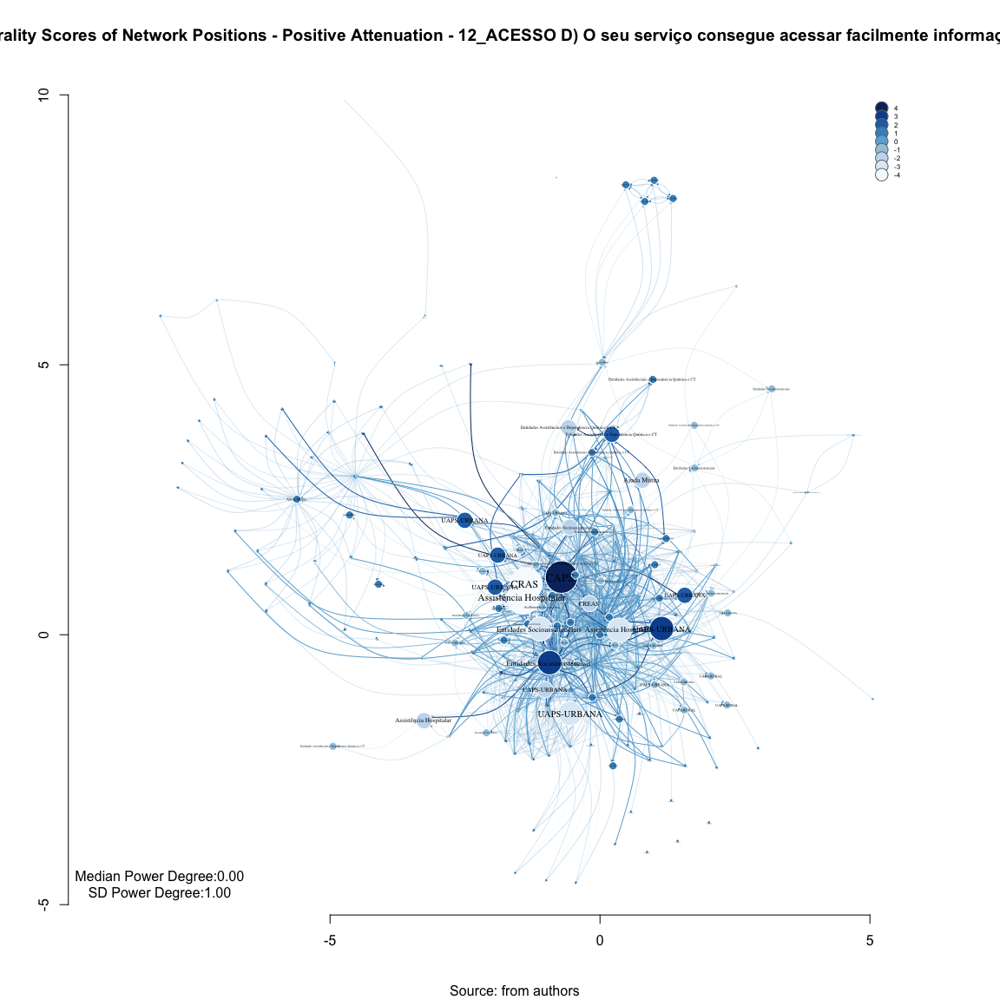
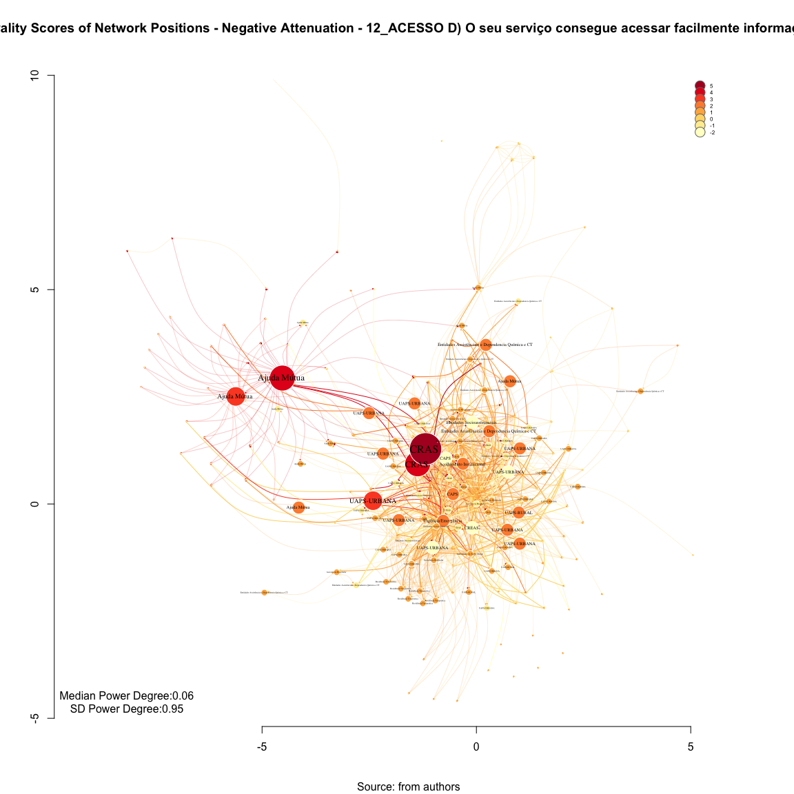
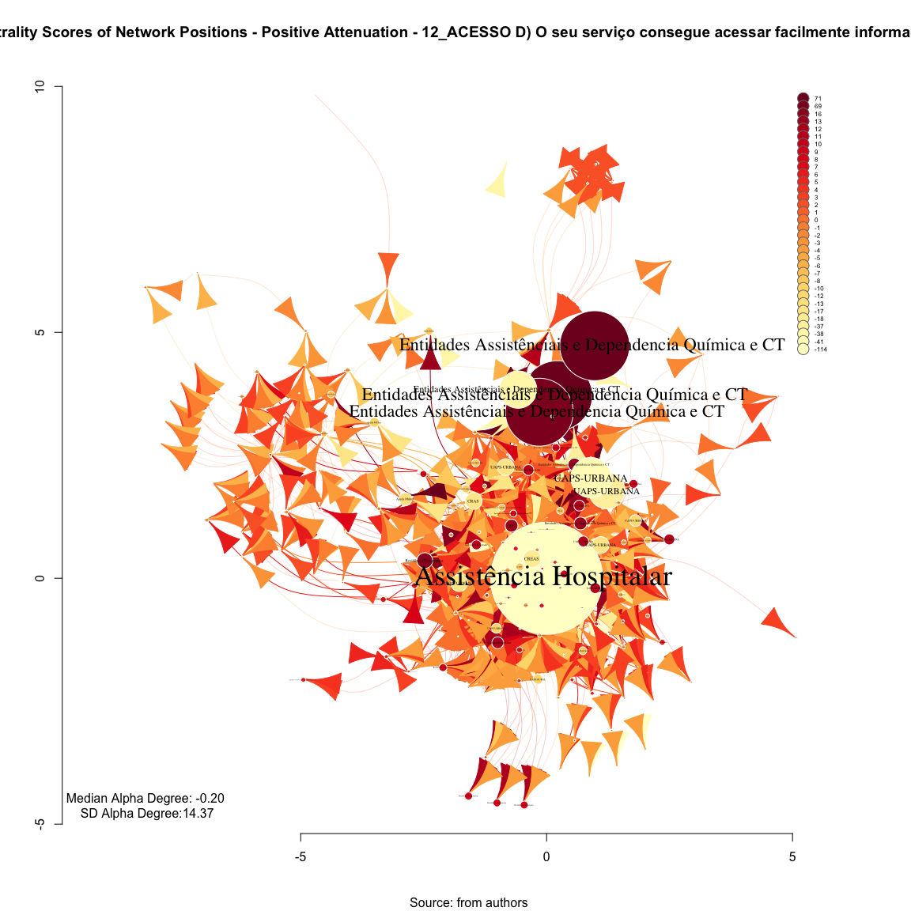
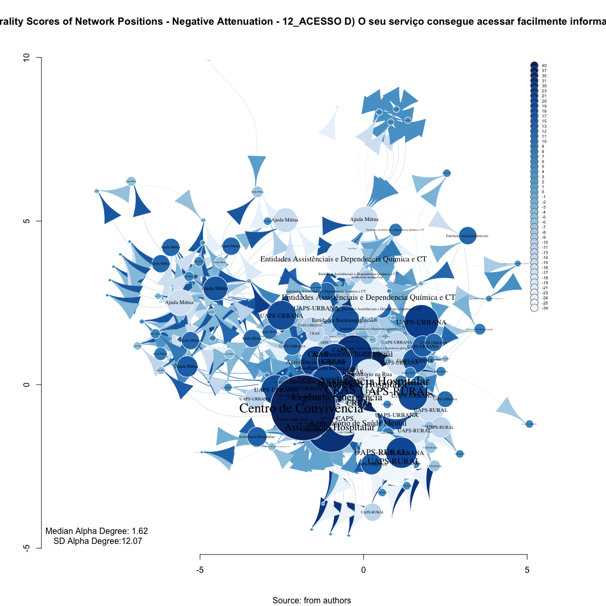

# SNA Bonacich's 12_ACESSO D) O seu serviço consegue acessar facilmente informações deste serviço. (var10)
Leonardo Martins  
17 de julho de 2016  
SNA Descritive Analysis from "Projeto Redes de Atenção às pessoas que consomem álcool e outras Drogas em Juiz de Fora-MG   Brazil"  - SNArRDJF

Here you can find a basic script to analysis data from SNArRDJF - this script was elaborated considering its use for orther matrix adjacency data from SNArRDJF - Here we are going to analyse:

# 12_ACESSO D) O seu serviço consegue acessar facilmente informações deste serviço. (var10)

`#########################
`# Basic Preparation #####
`#########################

#Loading objects generated with previous script 

```r
rm(list = ls()) # removing previous objects to be sure that we don't have objects conflicts name
load("~/SNArRDJF/Robject/5_betwenness_vertex_var10.RData")
```
##Reload packages

```r
suppressMessages(library(RColorBrewer))
suppressMessages(library(car))
suppressMessages(library(xtable))
suppressMessages(library(igraph))
suppressMessages(library(miniCRAN))
suppressMessages(library(magrittr))
suppressMessages(library(keyplayer))
suppressMessages(library(dplyr))
suppressMessages(library(feather))
suppressMessages(library(visNetwork))
suppressMessages(library(knitr))
suppressMessages(library(DT))
```
##Adding phantom tools

```r
#In order to get dinamic javascript object install those ones. If you get problems installing go to Stackoverflow.com and type your error to discover what to do. In some cases the libraries need to be intalled in outside R libs.
#devtools::install_github("wch/webshot")
#webshot::install_phantomjs()
```
##Setting a random seed - this is a good strategy to keep the same graph pattern layout in a new report generation

```r
set.seed(123)
```

##Simplify Graph - removing loops and duble edges 

```r
#var10<-simplify(var10) #Simplify
```

#Bonacich's Power Centrality Scores of Network Positions

Each node's centrality score depends both on how many connections it has and how many connections its connections have.

It doesn't only matter how many friends you have. It matters how many friends your friends have.”<http://www.leonidzhukov.net/hse/2014/socialnetworks/papers/Bonacich-Centrality.pdf>

Phillip Bonacich proposed a modification of the degree centrality approach that has been widely accepted as superior to the original measure. Bonacich's idea, like most good ones, is pretty simple. The original degree centrality approach argues that actors who have more connections are more likely to be powerful because they can directly affect more other actors. This makes sense, but having the same degree does not necessarily make actors equally important.

Suppose that Bill and Fred each have five close friends. Bill's friends, however, happen to be pretty isolated folks, and don't have many other friends, save Bill. In contrast, Fred's friends each also have lots of friends, who have lots of friends, and so on. Who is more central? We would probably agree that Fred is, because the people he is connected to are better connected than Bill's people. Bonacich argued that one's centrality is a function of how many connections one has, and how many the connections the actors in the neighborhood had.

While we have argued that more central actors are more likely to be more powerful actors, Bonacich questioned this idea. Compare Bill and Fred again. Fred is clearly more central, but is he more powerful? One argument would be that one is likely to be more influential if one is connected to central others -- because one can quickly reach a lot of other actors with one's message. But if the actors that you are connected to are, themselves, well connected, they are not highly dependent on you -- they have many contacts, just as you do. If, on the other hand, the people to whom you are connected are not, themselves, well connected, then they are dependent on you. Bonacich argued that being connected to connected others makes an actor central, but not powerful. Somewhat ironically, being connected to others that are not well connected makes one powerful, because these other actors are dependent on you -- whereas well connected actors are not.

Bonacich proposed that both centrality and power were a function of the connections of the actors in one's neighborhood. The more connections the actors in your neighborhood have, the more central you are. The fewer the connections the actors in your neighborhood, the more powerful you are. There would seem to be a problem with building an algorithms to capture these ideas. Suppose A and B are connected. Actor A's power and centrality are functions of her own connections, and also the connections of actor B. Similarly, actor B's power and centrality depend on actor A's. So, each actor's power and centrality depends on each other actor's power simultaneously.

There is a way out of this chicken-and-egg type of problem. Bonacich showed that, for symmetric systems, an iterative estimation approach to solving this simultaneous equations problem would eventually converge to a single answer. One begins by giving each actor an estimated centrality equal to their own degree, plus a weighted function of the degrees of the actors to whom they were connected. Then, we do this again, using the first estimates (i.e. we again give each actor an estimated centrality equal to their own first score plus the first scores of those to whom they are connected). As we do this numerous times, the relative sizes (not the absolute sizes) of all actors scores will come to be the same. The scores can then be re-expressed by scaling by constants.


#Power (beta) Centrality Stats - (positive attenuation factor). 

##Are you more powerful if you're connected to powerful people?


```r
#Saving power as an object
var10_power_centrality_stats <- power_centrality(var10, nodes = V(var10), loops = FALSE, exponent = 0.5, rescale = FALSE, tol = 1e-07, sparse = TRUE)

#Saving power as an igraph attributte
V(var10)$var10_power_centrality_stats <-power_centrality(var10, nodes = V(var10), loops = FALSE, exponent = 0.5, rescale = FALSE, tol = 1e-07, sparse = TRUE) 

#Descriptive 
summary(var10_power_centrality_stats)
```

    Min.  1st Qu.   Median     Mean  3rd Qu.     Max. 
-3.81700 -0.15290  0.00000 -0.05152  0.35840  4.10400 

```r
sd(var10_power_centrality_stats)
```

[1] 1.001353

##Power (beta) Centrality Stats - (positive attenuation factor). 

```r
d=as.data.frame(cbind(V(var10)$LABEL_COR,round(var10_power_centrality_stats,2)))
names(d)<-c("Type", "Power(beta)")
datatable(d, filter ="top")
```

<!--html_preserve--><div id="htmlwidget-0d9096a09f1513afd425" style="width:100%;height:auto;" class="datatables html-widget"></div>
<script type="application/json" data-for="htmlwidget-0d9096a09f1513afd425">{"x":{"filter":"top","filterHTML":"<tr>\n  <td>\u003c/td>\n  <td data-type=\"factor\" style=\"vertical-align: top;\">\n    <div class=\"form-group has-feedback\" style=\"margin-bottom: auto;\">\n      <input type=\"search\" placeholder=\"All\" class=\"form-control\" style=\"width: 100%;\"/>\n      <span class=\"glyphicon glyphicon-remove-circle form-control-feedback\">\u003c/span>\n    \u003c/div>\n    <div style=\"width: 100%; display: none;\">\n      <select multiple=\"multiple\" style=\"width: 100%;\" data-options=\"[&quot;Acolhimento Institucional&quot;,&quot;Ajuda Mútua&quot;,&quot;Ambulatório de Saúde Mental&quot;,&quot;Assistência Hospitalar&quot;,&quot;CAPS&quot;,&quot;CAPSAD&quot;,&quot;Consultório na Rua&quot;,&quot;CRAS/CREAS&quot;,&quot;Entidades Assistênciais e Dependencia Química e CT&quot;,&quot;Entidades Socioassistenciais&quot;,&quot;Residência Terapeutica&quot;,&quot;UAPS&quot;,&quot;Urgência/Emergência&quot;]\">\u003c/select>\n    \u003c/div>\n  \u003c/td>\n  <td data-type=\"factor\" style=\"vertical-align: top;\">\n    <div class=\"form-group has-feedback\" style=\"margin-bottom: auto;\">\n      <input type=\"search\" placeholder=\"All\" class=\"form-control\" style=\"width: 100%;\"/>\n      <span class=\"glyphicon glyphicon-remove-circle form-control-feedback\">\u003c/span>\n    \u003c/div>\n    <div style=\"width: 100%; display: none;\">\n      <select multiple=\"multiple\" style=\"width: 100%;\" data-options=\"[&quot;-0.01&quot;,&quot;-0.02&quot;,&quot;-0.04&quot;,&quot;-0.07&quot;,&quot;-0.08&quot;,&quot;-0.09&quot;,&quot;-0.13&quot;,&quot;-0.15&quot;,&quot;-0.22&quot;,&quot;-0.31&quot;,&quot;-0.34&quot;,&quot;-0.35&quot;,&quot;-0.38&quot;,&quot;-0.45&quot;,&quot;-0.46&quot;,&quot;-0.49&quot;,&quot;-0.56&quot;,&quot;-0.63&quot;,&quot;-0.66&quot;,&quot;-0.85&quot;,&quot;-0.88&quot;,&quot;-0.94&quot;,&quot;-1.02&quot;,&quot;-1.03&quot;,&quot;-1.05&quot;,&quot;-1.06&quot;,&quot;-1.08&quot;,&quot;-1.13&quot;,&quot;-1.14&quot;,&quot;-1.15&quot;,&quot;-1.17&quot;,&quot;-1.18&quot;,&quot;-1.23&quot;,&quot;-1.27&quot;,&quot;-1.31&quot;,&quot;-1.32&quot;,&quot;-1.47&quot;,&quot;-1.55&quot;,&quot;-1.58&quot;,&quot;-2.25&quot;,&quot;-2.27&quot;,&quot;-2.3&quot;,&quot;-2.44&quot;,&quot;-2.68&quot;,&quot;-3.28&quot;,&quot;-3.52&quot;,&quot;-3.82&quot;,&quot;0&quot;,&quot;0.01&quot;,&quot;0.02&quot;,&quot;0.03&quot;,&quot;0.04&quot;,&quot;0.05&quot;,&quot;0.06&quot;,&quot;0.08&quot;,&quot;0.13&quot;,&quot;0.18&quot;,&quot;0.2&quot;,&quot;0.22&quot;,&quot;0.24&quot;,&quot;0.26&quot;,&quot;0.29&quot;,&quot;0.31&quot;,&quot;0.35&quot;,&quot;0.36&quot;,&quot;0.37&quot;,&quot;0.4&quot;,&quot;0.42&quot;,&quot;0.43&quot;,&quot;0.45&quot;,&quot;0.46&quot;,&quot;0.48&quot;,&quot;0.49&quot;,&quot;0.51&quot;,&quot;0.54&quot;,&quot;0.56&quot;,&quot;0.58&quot;,&quot;0.64&quot;,&quot;0.65&quot;,&quot;0.66&quot;,&quot;0.67&quot;,&quot;0.69&quot;,&quot;0.71&quot;,&quot;0.72&quot;,&quot;0.79&quot;,&quot;0.85&quot;,&quot;0.86&quot;,&quot;1.23&quot;,&quot;1.27&quot;,&quot;1.37&quot;,&quot;1.46&quot;,&quot;1.53&quot;,&quot;1.99&quot;,&quot;2.07&quot;,&quot;2.36&quot;,&quot;2.38&quot;,&quot;2.66&quot;,&quot;2.93&quot;,&quot;4.1&quot;]\">\u003c/select>\n    \u003c/div>\n  \u003c/td>\n\u003c/tr>","data":[["ASS_HOS_ Hospital de Pronto Socorro – HPS","AMB_SAM_ Centro de Atenção à Saúde Mental (CASM)","CAPS_AD","CRAS_AS_ CRAS Sudeste Costa Carvalho","CRE_SOC_ CREAS Infância e Juventude","CRE_SOC_ CREAS Norte","ASS_HOS_ Serviço de Controle e Prevenção e Tratamento do Tabagismo (SECOPTT)","EA_DQCT_ Centro de Recuperação Resgatando Vidas (Escritório)","EA_DQCT_ Comunidade Terapêutica Geração de Adoradores – CTGA","EA_DQCT_ Centro de Recuperação Resgatando Vidas","CRAS_AS_ CRAS Norte Benfica","CRAS_AS_ CRAS Centro","EA_DQCT_ Associação Beneficente Cristã Restituir","ENT_SOC_ Território Aliança pela Vida  Zona Norte","UAP_URB_ Santa Cecília","RES_TER_ Casa V1","CRE_SOC_ CREAS Idoso e Mulher","URG_EME_ Serviço de Atendimento Móvel de Urgência (SAMU)","ENT_SOC_ Associação Beneficente e Cultural Amigos do Noivo (ABAN) (Matriz)","ASS_HOS_ Centro de Referência em Álcool e Drogas (RADCAS)  Hospital Universitário","CAPS_CO_ CAPS HU","EA_DQCT_ Grupo de Apoio à Família e aos Dependentes Químicos – GAFADEQUI.1","CAPS_CO_ CAPS IJ","AJU_MUT_ Escritório de Serviços Locais dos Álcoólicos Anônimos de Juiz de Fora","ENT_SOC_ Associação Beneficente e Cultural Amigos do Noivo (ABAN) Dom Bosco","AJU_MUT_ ALANON Grupo Harmonia","AJU_MUT_ ALANON Grupo Só Por Hoje","CAPS_CO_ CAPS Leste","CRAS_AS_ CRAS Leste São Benedito","CRAS_AS_ CRAS Nordeste Grama","CRAS_AS_ CRAS Leste Linhares","UAP_URB_ Parque Guarani","ACO_INS_ Casa da Cidadania","AJU_MUT_ Grupo A.A. Vinte e Cinco de Abril","CRAS_AS_ CRAS Sudeste Olavo Costa","EA_DQCT_ Grupo de Apoio à Família e aos Dependentes Químicos – GAFADEQUI","EA_DQCT_ Centro de Recuperação Juiz de Fora Contra as Drogas","RES_TER_ Casa 1","RES_TER_ Casa 7","ENT_SOC_ Associação Casa Viva","ACO_INS_ Núcleo Cidadão de Rua Hebert de Souza","CON_RUA_ Equipe de Consultório na Rua (UAPS de referência Vila Ideal)","CON_RUA_ Equipe de Consultório na Rua (Associação Casa Viva)","EA_DQCT_ Associação Projeto Amor e Restauração – APAR","ENT_SOC_ Casa São Camilo de Lelis","CRA_SOC_ CRAS Sul Ipiranga","AJU_MUT_ Grupo A.A. Ipiranga","RES_TER_ Casa V2","RES_TER_ Casa V3","RES_TER_ Casa V4","RES_TER_ Casa V5","RES_TER_ Casa V6","EA_DQCT_ Comunidade Terapêutica Família em Cristo","UAP_URB_ São Pedro","AJU_MUT_ Grupo A.A Primeiro Passo","CRAS_AS_ CRAS Oeste São Pedro","UAP_URB_ Alto Grajaú","AJU_MUT_ Pastoral da Sobriedade","AJU_MUT_ Grupo A.A Juiz de Fora (Sala de abordagem)","ASS_HOS_ Hospital Ana Nery","AJU_MUT_ Grupo A.A. Central","EA_DQCT_ Vila Verde (Unidade Bromélias)","UAP_URB_ Santo Antônio","UAP_URB_ Grama","EA_DQCT_ Centro de Recuperação SOS Vida","EA_DQCT_ Centro de Tratamento Deville","AJU_MUT_ NARANON Grupo Parque Halfeld","ENT_SOC_ Fundação Maria Mãe","ENT_SOC_ Grupo Espírita de Ajuda aos Enfermos (GEDAE)","UAP_URB_ Cidade do Sol","UAP_URB_ Bairro Industrial","UAP_URB_ Milho Branco","UAP_URB_ Nova Era","UAP_URB_ Santa Cruz","UAP_URB_ São Judas Tadeu","UAP_URB_ Marumbí","UAP_URB_ Progresso","CRE_SOC_ CREAS População de Rua (CentroPop)","AJU_MUT_ Grupo de Apoio Benfica de Amor Exigente (GABENAE)","AJU_MUT_ Grupo de Apoio São Mateus de Amor Exigente (GASMAE)","AJU_MUT_ Grupo de Amor Exigente Linhares","AJU_MUT_ Grupo de Amor Exigente Santa Terezinha","UAP_URB_ Furtado de Menezes","AJU_MUT_ Grupo A.A. Reunidos","AJU_MUT_ Grupo de Apoio São Pedro do Amor Exigente (GASPAE)","UAP_URB_ Jóquei Clube II","EA_DQCT_ Centro Metodista de Assistência aos Toxicômanos – CEMAT","EA_DQCT_ Centro Terapêutico Reconstruir (fazenda)","UAP_URB_ Bairro de Lourdes","UAP_URB_ Vila Olavo Costa","UAP_URB_ Cruzeiro do Sul","AJU_MUT_ Igreja Batista Resplandecente Estrela do Amanhã  IBREM","EA_DQCT_ Vila Verde (Unidade Borboleta)","ASS_HOS_ Clínica Vila Verde (Hospital Dia)","UAP_URB_ Ipiranga","EA_DQCT_ Centro Metodista de Assistência aos Toxicômanos – CEMAT (Escritório)","EA_DQCT_ Centro Terapêutico Reconstruir (escritório)","EA_DQCT_ Grupo de Apoio à Família e aos Dependentes Químicos – GAFADEQUI (Administração, triagem e apoio aos familiares)","UAP_URB_ Barreira do Triunfo","ASS_HOS_ Casa de Saúde Esperança","ENT_SOC_ Associação Beneficente e Cultural Amigos do Noivo (ABAN)","ENT_SOC_ Casa de Acolhimento à Infância e Adolescente (CAIA)","RES_TER_ Casa 3","RES_TER_ Casa 4","UAP_URB_ Filgueiras","UAP_URB_ Jardim da Lua","UAP_URB_ Granjas Betânea","RES_TER_ Casa 5","RES_TER_ Casa 6","UAP_URB_ Borboleta","UAP_URB_ Santos Dumont","UAP_RUR_ Igrejinha","UAP_URB_ Dom Bosco","UAP_URB_ Benfica","UAP_URB_ Jóquei Clube I","UAP_URB_ Nossa Senhora Aparecida","UAP_URB_ Santa Cândida/São Sebastião","UAP_URB_ São Benedito","UAP_URB_ Santa Efigênia","UAP_URB_ Santa Luzia","UAP_URB_ Bandeirantes","ENT_SOC_ Instituto Veredas (Projeto, Assessoria e Prática em Saúde Mental) // Serviço de Referência para Adolescentes do Instituto Veredas","UAP_RUR_ Monte Verde","UAP_RUR_ Pirapetinga","UAP_RUR_ Torreões","UAP_RUR_ Caeté","UAP_RUR_ Chapéu D'Uvas","UAP_RUR_ Humaitá","UAP_RUR_ Rosário de Minas","UAP_RUR_ Sarandira","UAP_RUR_ Toledos","UAP_RUR_ Valadares","UAP_URB_ Esplanada","UAP_URB_ Jardim Natal","UAP_URB_ Monte Castelo","UAP_URB_ Vila Esperança","UAP_URB_ Linhares","UAP_URB_ Santa Rita","UAP_URB_ Jardim Esperança","UAP_URB_ Retiro","UAP_URB_ Vila Ideal","UAP_URB_ Teixeiras","UAP_URB_ Vale Verde","UAP_URB_ Nossa Senhora das Graças","ENT_SOC_ ONG Saída","CAPS_CO_ CAPS Casa Viva","CEN_CON_ Associação TRABALHARTE","UAP_URB_ Centro Sul","ACO_INS_ Sociedade São Vicente de Paulo","UAP_RUR_ Buiéié","UAP_RUR_ Jacutinga","UAP_RUR_ Palmital","UAP_RUR_ Pires","UAP_RUR_ Privilégio","AJU_MUT_ Grupo N.A. Glória","AJU_MUT_ Grupo A.A. 29 de Junho","UAP_RUR_ Dias Tavares","UAP_RUR_ Paula Lima","UAP_RUR_ Penido","AJU_MUT_ ALANON Grupo Libertação","AJU_MUT_ GEVE","AJU_MUT_ Grupo A.A. Libertação","AJU_MUT_ Grupo N.A. Libertação","AJU_MUT_ NARANON Grupo Glória","AJU_MUT_ Grupo A.A. Azul e Branco","AJU_MUT_ NARANON Grupo Renascer","AJU_MUT_ Grupo A.A. Cidade do Sol","AJU_MUT_ Grupo A.A. Caminho Da Salvação","AJU_MUT_ Grupo A.A. Dois de Março","AJU_MUT_ Grupo A.A. Corrente da Sobriedade","AJU_MUT_ Grupo A.A. Milho Branco","AJU_MUT_ Grupo A.A. Luz Divina","AJU_MUT_ Grupo A.A. Nova Era","AJU_MUT_ Grupo A.A União","AJU_MUT_ Grupo A.A. Bairu","AJU_MUT_ Grupo N.A. Caminho Verdade","AJU_MUT_ Grupo A.A. Bonfim","AJU_MUT_ Grupo A.A. Linhares","AJU_MUT_ Grupo A.A Redenção Abolição","AJU_MUT_ Grupo A.A. Progresso","AJU_MUT_ Grupo A.A. Estrela D´Alva","AJU_MUT_ Grupo A.A. Primeira Tradição","AJU_MUT_ Grupo A.A. Estrela do Oriente","AJU_MUT_ Grupo A.A Duas Vidas","AJU_MUT_ Grupo A.A. Liberdade","AJU_MUT_ Grupo N.A Rendição","ASS_HOS_ Hospital de Toxicômanos"],["Assistência Hospitalar","Ambulatório de Saúde Mental","CAPSAD","CRAS/CREAS","CRAS/CREAS","CRAS/CREAS","Assistência Hospitalar","Entidades Assistênciais e Dependencia Química e CT","Entidades Assistênciais e Dependencia Química e CT","Entidades Assistênciais e Dependencia Química e CT","CRAS/CREAS","CRAS/CREAS","Entidades Assistênciais e Dependencia Química e CT","Entidades Assistênciais e Dependencia Química e CT","UAPS","Residência Terapeutica","CRAS/CREAS","Urgência/Emergência","Entidades Socioassistenciais","Assistência Hospitalar","CAPS","Entidades Assistênciais e Dependencia Química e CT","CAPS","Ajuda Mútua","Entidades Socioassistenciais","Ajuda Mútua","Ajuda Mútua","CAPS","CRAS/CREAS","CRAS/CREAS","CRAS/CREAS","UAPS","Acolhimento Institucional","Ajuda Mútua","CRAS/CREAS","Entidades Assistênciais e Dependencia Química e CT","Entidades Assistênciais e Dependencia Química e CT","Residência Terapeutica","Residência Terapeutica","Entidades Socioassistenciais","Acolhimento Institucional","Consultório na Rua","Consultório na Rua","Entidades Assistênciais e Dependencia Química e CT","Entidades Socioassistenciais","CRAS/CREAS","Ajuda Mútua","Residência Terapeutica","Residência Terapeutica","Residência Terapeutica","Residência Terapeutica","Residência Terapeutica","Entidades Assistênciais e Dependencia Química e CT","UAPS","Ajuda Mútua","CRAS/CREAS","UAPS","Ajuda Mútua","Ajuda Mútua","Assistência Hospitalar","Ajuda Mútua","Entidades Assistênciais e Dependencia Química e CT","UAPS","UAPS","Entidades Assistênciais e Dependencia Química e CT","Entidades Assistênciais e Dependencia Química e CT","Ajuda Mútua","Entidades Socioassistenciais","Entidades Socioassistenciais","UAPS","UAPS","UAPS","UAPS","UAPS","UAPS","UAPS","UAPS","CRAS/CREAS","Ajuda Mútua","Ajuda Mútua","Ajuda Mútua","Ajuda Mútua","UAPS","Ajuda Mútua","Ajuda Mútua","UAPS","Entidades Assistênciais e Dependencia Química e CT","Entidades Assistênciais e Dependencia Química e CT","UAPS","UAPS","UAPS","Ajuda Mútua","Entidades Assistênciais e Dependencia Química e CT","Assistência Hospitalar","UAPS","Entidades Assistênciais e Dependencia Química e CT","Entidades Assistênciais e Dependencia Química e CT","Entidades Assistênciais e Dependencia Química e CT","UAPS","Assistência Hospitalar","Entidades Socioassistenciais","Entidades Socioassistenciais","Residência Terapeutica","Residência Terapeutica","UAPS","UAPS","UAPS","Residência Terapeutica","Residência Terapeutica","UAPS","UAPS","UAPS","UAPS","UAPS","UAPS","UAPS","UAPS","UAPS","UAPS","UAPS","UAPS","Entidades Socioassistenciais","UAPS","UAPS","UAPS","UAPS","UAPS","UAPS","UAPS","UAPS","UAPS","UAPS","UAPS","UAPS","UAPS","UAPS","UAPS","UAPS","UAPS","UAPS","UAPS","UAPS","UAPS","UAPS","Entidades Socioassistenciais","CAPS","Entidades Socioassistenciais","UAPS","Acolhimento Institucional","UAPS","UAPS","UAPS","UAPS","UAPS","Ajuda Mútua","Ajuda Mútua","UAPS","UAPS","UAPS","Ajuda Mútua","Ajuda Mútua","Ajuda Mútua","Ajuda Mútua","Ajuda Mútua","Ajuda Mútua","Ajuda Mútua","Ajuda Mútua","Ajuda Mútua","Ajuda Mútua","Ajuda Mútua","Ajuda Mútua","Ajuda Mútua","Ajuda Mútua","Ajuda Mútua","Ajuda Mútua","Ajuda Mútua","Ajuda Mútua","Ajuda Mútua","Ajuda Mútua","Ajuda Mútua","Ajuda Mútua","Ajuda Mútua","Ajuda Mútua","Ajuda Mútua","Ajuda Mútua","Ajuda Mútua","Assistência Hospitalar"],["0.54","0.66","-0.07","-3.82","0.35","0.4","-2.68","-0.34","-0.66","-0.94","-1.06","-0.94","-0.02","-1.18","-1.05","-0.09","-2.3","0.26","-1.31","0.22","0.66","1.53","-0.22","0.86","-1.13","-0.08","0.69","4.1","-0.56","0.56","0.22","0.05","-1.23","0.24","-0.08","1.27","0.18","-1.03","-0.85","2.66","0.06","0.71","0.71","-0.04","-0.31","-1.03","0.36","-0.15","-0.15","-0.15","-0.15","-0.15","-0.85","-1.27","0","-1.15","0.72","-0.13","1.37","-3.52","0","-1.08","-1.02","2.36","-1.58","0.03","0.06","1.23","-1.55","0.02","0.02","0.08","0.4","0.42","0.05","2.38","-0.63","0.79","0.65","0.65","0.65","0.65","0.43","0.46","-0.88","0.01","-0.38","0.45","-3.28","-0.94","-1.47","-2.44","-0.08","-2.25","0.58","0.13","0.26","1.46","0.79","0.43","-1.17","0.85","0","0","-0.46","-2.27","1.99","0","0","0.04","0.24","-1.14","0.85","0.29","0.67","0.64","0.04","0.31","-0.01","-0.01","2.93","-2.68","-1.32","-1.32","-1.32","0.49","-0.01","-0.35","-0.01","0.49","0.35","0.35","0.51","-0.01","-0.01","-0.45","2.07","-0.01","-0.01","0.35","0.37","-0.01","-0.49","-0.01","-0.01","-0.01","0.35","0.02","0.48","0.36","0.36","0.36","0.36","0.36","0.2","0.2","0","0","0","0","0","0","0","0","0","0","0","0","0","0","0","0","0","0","0","0","0","0","0","0","0","0","0","0","0","0","0"]],"container":"<table class=\"display\">\n  <thead>\n    <tr>\n      <th> \u003c/th>\n      <th>Type\u003c/th>\n      <th>Power(beta)\u003c/th>\n    \u003c/tr>\n  \u003c/thead>\n\u003c/table>","options":{"order":[],"autoWidth":false,"orderClasses":false,"columnDefs":[{"orderable":false,"targets":0}],"orderCellsTop":true}},"evals":[],"jsHooks":[]}</script><!--/html_preserve-->

###Plotting Power Centrality Degree - (positive attenuation factor). 
<!-- -->


#Power (beta) Centrality Stats - (negative attenuation factor).

##Or are you more powerful if you're connected to weak, dependent people?


```r
#Saving power as an object
var10_power_centrality_stats_n <- power_centrality(var10, nodes = V(var10), loops = FALSE, exponent = -0.5, rescale = FALSE, tol = 1e-07, sparse = TRUE)

#Saving power as an igraph attributte
V(var10)$var10_power_centrality_stats_n <-power_centrality(var10, nodes = V(var10), loops = FALSE, exponent = -0.5, rescale = FALSE, tol = 1e-07, sparse = TRUE) 
```

##Power (beta) Centrality Stats - (negative attenuation factor).

```r
d=as.data.frame(cbind(V(var10)$LABEL_COR,round(var10_power_centrality_stats_n,2)))
names(d)<-c("Type", "Power(beta)")
datatable(d, filter ="top")
```

<!--html_preserve--><div id="htmlwidget-c87cfd7f8f60841389f6" style="width:100%;height:auto;" class="datatables html-widget"></div>
<script type="application/json" data-for="htmlwidget-c87cfd7f8f60841389f6">{"x":{"filter":"top","filterHTML":"<tr>\n  <td>\u003c/td>\n  <td data-type=\"factor\" style=\"vertical-align: top;\">\n    <div class=\"form-group has-feedback\" style=\"margin-bottom: auto;\">\n      <input type=\"search\" placeholder=\"All\" class=\"form-control\" style=\"width: 100%;\"/>\n      <span class=\"glyphicon glyphicon-remove-circle form-control-feedback\">\u003c/span>\n    \u003c/div>\n    <div style=\"width: 100%; display: none;\">\n      <select multiple=\"multiple\" style=\"width: 100%;\" data-options=\"[&quot;Acolhimento Institucional&quot;,&quot;Ajuda Mútua&quot;,&quot;Ambulatório de Saúde Mental&quot;,&quot;Assistência Hospitalar&quot;,&quot;CAPS&quot;,&quot;CAPSAD&quot;,&quot;Consultório na Rua&quot;,&quot;CRAS/CREAS&quot;,&quot;Entidades Assistênciais e Dependencia Química e CT&quot;,&quot;Entidades Socioassistenciais&quot;,&quot;Residência Terapeutica&quot;,&quot;UAPS&quot;,&quot;Urgência/Emergência&quot;]\">\u003c/select>\n    \u003c/div>\n  \u003c/td>\n  <td data-type=\"factor\" style=\"vertical-align: top;\">\n    <div class=\"form-group has-feedback\" style=\"margin-bottom: auto;\">\n      <input type=\"search\" placeholder=\"All\" class=\"form-control\" style=\"width: 100%;\"/>\n      <span class=\"glyphicon glyphicon-remove-circle form-control-feedback\">\u003c/span>\n    \u003c/div>\n    <div style=\"width: 100%; display: none;\">\n      <select multiple=\"multiple\" style=\"width: 100%;\" data-options=\"[&quot;-0.02&quot;,&quot;-0.04&quot;,&quot;-0.07&quot;,&quot;-0.09&quot;,&quot;-0.11&quot;,&quot;-0.12&quot;,&quot;-0.21&quot;,&quot;-0.25&quot;,&quot;-0.26&quot;,&quot;-0.27&quot;,&quot;-0.29&quot;,&quot;-0.33&quot;,&quot;-0.42&quot;,&quot;-0.45&quot;,&quot;-0.46&quot;,&quot;-0.48&quot;,&quot;-0.5&quot;,&quot;-0.52&quot;,&quot;-0.6&quot;,&quot;-0.63&quot;,&quot;-0.64&quot;,&quot;-0.66&quot;,&quot;-0.84&quot;,&quot;-0.85&quot;,&quot;-0.86&quot;,&quot;-0.87&quot;,&quot;-1.02&quot;,&quot;-1.21&quot;,&quot;-1.26&quot;,&quot;-1.27&quot;,&quot;-1.37&quot;,&quot;-1.46&quot;,&quot;-1.47&quot;,&quot;-1.51&quot;,&quot;-1.54&quot;,&quot;-1.6&quot;,&quot;-2.14&quot;,&quot;-2.23&quot;,&quot;0&quot;,&quot;0.04&quot;,&quot;0.05&quot;,&quot;0.06&quot;,&quot;0.07&quot;,&quot;0.09&quot;,&quot;0.1&quot;,&quot;0.14&quot;,&quot;0.15&quot;,&quot;0.18&quot;,&quot;0.19&quot;,&quot;0.23&quot;,&quot;0.25&quot;,&quot;0.27&quot;,&quot;0.3&quot;,&quot;0.33&quot;,&quot;0.36&quot;,&quot;0.46&quot;,&quot;0.48&quot;,&quot;0.5&quot;,&quot;0.54&quot;,&quot;0.55&quot;,&quot;0.56&quot;,&quot;0.65&quot;,&quot;0.66&quot;,&quot;0.67&quot;,&quot;0.7&quot;,&quot;0.74&quot;,&quot;0.78&quot;,&quot;0.81&quot;,&quot;0.85&quot;,&quot;0.91&quot;,&quot;0.92&quot;,&quot;0.95&quot;,&quot;0.96&quot;,&quot;0.97&quot;,&quot;0.98&quot;,&quot;1&quot;,&quot;1.03&quot;,&quot;1.06&quot;,&quot;1.09&quot;,&quot;1.11&quot;,&quot;1.16&quot;,&quot;1.19&quot;,&quot;1.21&quot;,&quot;1.22&quot;,&quot;1.27&quot;,&quot;1.3&quot;,&quot;1.37&quot;,&quot;1.54&quot;,&quot;1.6&quot;,&quot;1.63&quot;,&quot;1.67&quot;,&quot;1.68&quot;,&quot;1.71&quot;,&quot;1.74&quot;,&quot;1.75&quot;,&quot;1.85&quot;,&quot;1.98&quot;,&quot;1.99&quot;,&quot;2.03&quot;,&quot;2.27&quot;,&quot;2.63&quot;,&quot;2.79&quot;,&quot;3.76&quot;,&quot;4.1&quot;,&quot;4.5&quot;]\">\u003c/select>\n    \u003c/div>\n  \u003c/td>\n\u003c/tr>","data":[["ASS_HOS_ Hospital de Pronto Socorro – HPS","AMB_SAM_ Centro de Atenção à Saúde Mental (CASM)","CAPS_AD","CRAS_AS_ CRAS Sudeste Costa Carvalho","CRE_SOC_ CREAS Infância e Juventude","CRE_SOC_ CREAS Norte","ASS_HOS_ Serviço de Controle e Prevenção e Tratamento do Tabagismo (SECOPTT)","EA_DQCT_ Centro de Recuperação Resgatando Vidas (Escritório)","EA_DQCT_ Comunidade Terapêutica Geração de Adoradores – CTGA","EA_DQCT_ Centro de Recuperação Resgatando Vidas","CRAS_AS_ CRAS Norte Benfica","CRAS_AS_ CRAS Centro","EA_DQCT_ Associação Beneficente Cristã Restituir","ENT_SOC_ Território Aliança pela Vida  Zona Norte","UAP_URB_ Santa Cecília","RES_TER_ Casa V1","CRE_SOC_ CREAS Idoso e Mulher","URG_EME_ Serviço de Atendimento Móvel de Urgência (SAMU)","ENT_SOC_ Associação Beneficente e Cultural Amigos do Noivo (ABAN) (Matriz)","ASS_HOS_ Centro de Referência em Álcool e Drogas (RADCAS)  Hospital Universitário","CAPS_CO_ CAPS HU","EA_DQCT_ Grupo de Apoio à Família e aos Dependentes Químicos – GAFADEQUI.1","CAPS_CO_ CAPS IJ","AJU_MUT_ Escritório de Serviços Locais dos Álcoólicos Anônimos de Juiz de Fora","ENT_SOC_ Associação Beneficente e Cultural Amigos do Noivo (ABAN) Dom Bosco","AJU_MUT_ ALANON Grupo Harmonia","AJU_MUT_ ALANON Grupo Só Por Hoje","CAPS_CO_ CAPS Leste","CRAS_AS_ CRAS Leste São Benedito","CRAS_AS_ CRAS Nordeste Grama","CRAS_AS_ CRAS Leste Linhares","UAP_URB_ Parque Guarani","ACO_INS_ Casa da Cidadania","AJU_MUT_ Grupo A.A. Vinte e Cinco de Abril","CRAS_AS_ CRAS Sudeste Olavo Costa","EA_DQCT_ Grupo de Apoio à Família e aos Dependentes Químicos – GAFADEQUI","EA_DQCT_ Centro de Recuperação Juiz de Fora Contra as Drogas","RES_TER_ Casa 1","RES_TER_ Casa 7","ENT_SOC_ Associação Casa Viva","ACO_INS_ Núcleo Cidadão de Rua Hebert de Souza","CON_RUA_ Equipe de Consultório na Rua (UAPS de referência Vila Ideal)","CON_RUA_ Equipe de Consultório na Rua (Associação Casa Viva)","EA_DQCT_ Associação Projeto Amor e Restauração – APAR","ENT_SOC_ Casa São Camilo de Lelis","CRA_SOC_ CRAS Sul Ipiranga","AJU_MUT_ Grupo A.A. Ipiranga","RES_TER_ Casa V2","RES_TER_ Casa V3","RES_TER_ Casa V4","RES_TER_ Casa V5","RES_TER_ Casa V6","EA_DQCT_ Comunidade Terapêutica Família em Cristo","UAP_URB_ São Pedro","AJU_MUT_ Grupo A.A Primeiro Passo","CRAS_AS_ CRAS Oeste São Pedro","UAP_URB_ Alto Grajaú","AJU_MUT_ Pastoral da Sobriedade","AJU_MUT_ Grupo A.A Juiz de Fora (Sala de abordagem)","ASS_HOS_ Hospital Ana Nery","AJU_MUT_ Grupo A.A. Central","EA_DQCT_ Vila Verde (Unidade Bromélias)","UAP_URB_ Santo Antônio","UAP_URB_ Grama","EA_DQCT_ Centro de Recuperação SOS Vida","EA_DQCT_ Centro de Tratamento Deville","AJU_MUT_ NARANON Grupo Parque Halfeld","ENT_SOC_ Fundação Maria Mãe","ENT_SOC_ Grupo Espírita de Ajuda aos Enfermos (GEDAE)","UAP_URB_ Cidade do Sol","UAP_URB_ Bairro Industrial","UAP_URB_ Milho Branco","UAP_URB_ Nova Era","UAP_URB_ Santa Cruz","UAP_URB_ São Judas Tadeu","UAP_URB_ Marumbí","UAP_URB_ Progresso","CRE_SOC_ CREAS População de Rua (CentroPop)","AJU_MUT_ Grupo de Apoio Benfica de Amor Exigente (GABENAE)","AJU_MUT_ Grupo de Apoio São Mateus de Amor Exigente (GASMAE)","AJU_MUT_ Grupo de Amor Exigente Linhares","AJU_MUT_ Grupo de Amor Exigente Santa Terezinha","UAP_URB_ Furtado de Menezes","AJU_MUT_ Grupo A.A. Reunidos","AJU_MUT_ Grupo de Apoio São Pedro do Amor Exigente (GASPAE)","UAP_URB_ Jóquei Clube II","EA_DQCT_ Centro Metodista de Assistência aos Toxicômanos – CEMAT","EA_DQCT_ Centro Terapêutico Reconstruir (fazenda)","UAP_URB_ Bairro de Lourdes","UAP_URB_ Vila Olavo Costa","UAP_URB_ Cruzeiro do Sul","AJU_MUT_ Igreja Batista Resplandecente Estrela do Amanhã  IBREM","EA_DQCT_ Vila Verde (Unidade Borboleta)","ASS_HOS_ Clínica Vila Verde (Hospital Dia)","UAP_URB_ Ipiranga","EA_DQCT_ Centro Metodista de Assistência aos Toxicômanos – CEMAT (Escritório)","EA_DQCT_ Centro Terapêutico Reconstruir (escritório)","EA_DQCT_ Grupo de Apoio à Família e aos Dependentes Químicos – GAFADEQUI (Administração, triagem e apoio aos familiares)","UAP_URB_ Barreira do Triunfo","ASS_HOS_ Casa de Saúde Esperança","ENT_SOC_ Associação Beneficente e Cultural Amigos do Noivo (ABAN)","ENT_SOC_ Casa de Acolhimento à Infância e Adolescente (CAIA)","RES_TER_ Casa 3","RES_TER_ Casa 4","UAP_URB_ Filgueiras","UAP_URB_ Jardim da Lua","UAP_URB_ Granjas Betânea","RES_TER_ Casa 5","RES_TER_ Casa 6","UAP_URB_ Borboleta","UAP_URB_ Santos Dumont","UAP_RUR_ Igrejinha","UAP_URB_ Dom Bosco","UAP_URB_ Benfica","UAP_URB_ Jóquei Clube I","UAP_URB_ Nossa Senhora Aparecida","UAP_URB_ Santa Cândida/São Sebastião","UAP_URB_ São Benedito","UAP_URB_ Santa Efigênia","UAP_URB_ Santa Luzia","UAP_URB_ Bandeirantes","ENT_SOC_ Instituto Veredas (Projeto, Assessoria e Prática em Saúde Mental) // Serviço de Referência para Adolescentes do Instituto Veredas","UAP_RUR_ Monte Verde","UAP_RUR_ Pirapetinga","UAP_RUR_ Torreões","UAP_RUR_ Caeté","UAP_RUR_ Chapéu D'Uvas","UAP_RUR_ Humaitá","UAP_RUR_ Rosário de Minas","UAP_RUR_ Sarandira","UAP_RUR_ Toledos","UAP_RUR_ Valadares","UAP_URB_ Esplanada","UAP_URB_ Jardim Natal","UAP_URB_ Monte Castelo","UAP_URB_ Vila Esperança","UAP_URB_ Linhares","UAP_URB_ Santa Rita","UAP_URB_ Jardim Esperança","UAP_URB_ Retiro","UAP_URB_ Vila Ideal","UAP_URB_ Teixeiras","UAP_URB_ Vale Verde","UAP_URB_ Nossa Senhora das Graças","ENT_SOC_ ONG Saída","CAPS_CO_ CAPS Casa Viva","CEN_CON_ Associação TRABALHARTE","UAP_URB_ Centro Sul","ACO_INS_ Sociedade São Vicente de Paulo","UAP_RUR_ Buiéié","UAP_RUR_ Jacutinga","UAP_RUR_ Palmital","UAP_RUR_ Pires","UAP_RUR_ Privilégio","AJU_MUT_ Grupo N.A. Glória","AJU_MUT_ Grupo A.A. 29 de Junho","UAP_RUR_ Dias Tavares","UAP_RUR_ Paula Lima","UAP_RUR_ Penido","AJU_MUT_ ALANON Grupo Libertação","AJU_MUT_ GEVE","AJU_MUT_ Grupo A.A. Libertação","AJU_MUT_ Grupo N.A. Libertação","AJU_MUT_ NARANON Grupo Glória","AJU_MUT_ Grupo A.A. Azul e Branco","AJU_MUT_ NARANON Grupo Renascer","AJU_MUT_ Grupo A.A. Cidade do Sol","AJU_MUT_ Grupo A.A. Caminho Da Salvação","AJU_MUT_ Grupo A.A. Dois de Março","AJU_MUT_ Grupo A.A. Corrente da Sobriedade","AJU_MUT_ Grupo A.A. Milho Branco","AJU_MUT_ Grupo A.A. Luz Divina","AJU_MUT_ Grupo A.A. Nova Era","AJU_MUT_ Grupo A.A União","AJU_MUT_ Grupo A.A. Bairu","AJU_MUT_ Grupo N.A. Caminho Verdade","AJU_MUT_ Grupo A.A. Bonfim","AJU_MUT_ Grupo A.A. Linhares","AJU_MUT_ Grupo A.A Redenção Abolição","AJU_MUT_ Grupo A.A. Progresso","AJU_MUT_ Grupo A.A. Estrela D´Alva","AJU_MUT_ Grupo A.A. Primeira Tradição","AJU_MUT_ Grupo A.A. Estrela do Oriente","AJU_MUT_ Grupo A.A Duas Vidas","AJU_MUT_ Grupo A.A. Liberdade","AJU_MUT_ Grupo N.A Rendição","ASS_HOS_ Hospital de Toxicômanos"],["Assistência Hospitalar","Ambulatório de Saúde Mental","CAPSAD","CRAS/CREAS","CRAS/CREAS","CRAS/CREAS","Assistência Hospitalar","Entidades Assistênciais e Dependencia Química e CT","Entidades Assistênciais e Dependencia Química e CT","Entidades Assistênciais e Dependencia Química e CT","CRAS/CREAS","CRAS/CREAS","Entidades Assistênciais e Dependencia Química e CT","Entidades Assistênciais e Dependencia Química e CT","UAPS","Residência Terapeutica","CRAS/CREAS","Urgência/Emergência","Entidades Socioassistenciais","Assistência Hospitalar","CAPS","Entidades Assistênciais e Dependencia Química e CT","CAPS","Ajuda Mútua","Entidades Socioassistenciais","Ajuda Mútua","Ajuda Mútua","CAPS","CRAS/CREAS","CRAS/CREAS","CRAS/CREAS","UAPS","Acolhimento Institucional","Ajuda Mútua","CRAS/CREAS","Entidades Assistênciais e Dependencia Química e CT","Entidades Assistênciais e Dependencia Química e CT","Residência Terapeutica","Residência Terapeutica","Entidades Socioassistenciais","Acolhimento Institucional","Consultório na Rua","Consultório na Rua","Entidades Assistênciais e Dependencia Química e CT","Entidades Socioassistenciais","CRAS/CREAS","Ajuda Mútua","Residência Terapeutica","Residência Terapeutica","Residência Terapeutica","Residência Terapeutica","Residência Terapeutica","Entidades Assistênciais e Dependencia Química e CT","UAPS","Ajuda Mútua","CRAS/CREAS","UAPS","Ajuda Mútua","Ajuda Mútua","Assistência Hospitalar","Ajuda Mútua","Entidades Assistênciais e Dependencia Química e CT","UAPS","UAPS","Entidades Assistênciais e Dependencia Química e CT","Entidades Assistênciais e Dependencia Química e CT","Ajuda Mútua","Entidades Socioassistenciais","Entidades Socioassistenciais","UAPS","UAPS","UAPS","UAPS","UAPS","UAPS","UAPS","UAPS","CRAS/CREAS","Ajuda Mútua","Ajuda Mútua","Ajuda Mútua","Ajuda Mútua","UAPS","Ajuda Mútua","Ajuda Mútua","UAPS","Entidades Assistênciais e Dependencia Química e CT","Entidades Assistênciais e Dependencia Química e CT","UAPS","UAPS","UAPS","Ajuda Mútua","Entidades Assistênciais e Dependencia Química e CT","Assistência Hospitalar","UAPS","Entidades Assistênciais e Dependencia Química e CT","Entidades Assistênciais e Dependencia Química e CT","Entidades Assistênciais e Dependencia Química e CT","UAPS","Assistência Hospitalar","Entidades Socioassistenciais","Entidades Socioassistenciais","Residência Terapeutica","Residência Terapeutica","UAPS","UAPS","UAPS","Residência Terapeutica","Residência Terapeutica","UAPS","UAPS","UAPS","UAPS","UAPS","UAPS","UAPS","UAPS","UAPS","UAPS","UAPS","UAPS","Entidades Socioassistenciais","UAPS","UAPS","UAPS","UAPS","UAPS","UAPS","UAPS","UAPS","UAPS","UAPS","UAPS","UAPS","UAPS","UAPS","UAPS","UAPS","UAPS","UAPS","UAPS","UAPS","UAPS","UAPS","Entidades Socioassistenciais","CAPS","Entidades Socioassistenciais","UAPS","Acolhimento Institucional","UAPS","UAPS","UAPS","UAPS","UAPS","Ajuda Mútua","Ajuda Mútua","UAPS","UAPS","UAPS","Ajuda Mútua","Ajuda Mútua","Ajuda Mútua","Ajuda Mútua","Ajuda Mútua","Ajuda Mútua","Ajuda Mútua","Ajuda Mútua","Ajuda Mútua","Ajuda Mútua","Ajuda Mútua","Ajuda Mútua","Ajuda Mútua","Ajuda Mútua","Ajuda Mútua","Ajuda Mútua","Ajuda Mútua","Ajuda Mútua","Ajuda Mútua","Ajuda Mútua","Ajuda Mútua","Ajuda Mútua","Ajuda Mútua","Ajuda Mútua","Ajuda Mútua","Ajuda Mútua","Ajuda Mútua","Assistência Hospitalar"],["-0.64","0.54","0.05","3.76","0.74","-2.14","1.19","0.56","0.15","0.19","-1.26","1.22","1.85","-0.48","0.25","-0.25","-0.02","1.74","-0.12","0.91","1.68","1.71","0.54","-1.27","0.23","1.6","1.11","-1.51","4.5","0.85","-0.86","-0.84","0.1","-0.66","-0.66","1.03","0.48","0.05","0.98","1.16","1.75","-0.33","-0.33","-1.21","-0.85","-1.46","-0.42","0.66","0.66","0.66","0.66","0.66","0.09","-0.11","4.1","0.3","-0.87","0.92","2.63","-0.45","0","0.66","-1.47","0.95","0.07","0.18","0.36","-1.54","0.56","0.33","0.33","0.96","2.79","0.7","1.74","1.98","2.27","-0.46","0.04","0.04","0.04","0.04","1.67","0.81","1.21","1.27","0.74","0.78","-0.27","1.37","2.03","1.63","-1.37","1.11","-0.04","0.46","-0.21","-1.02","-0.52","0.66","0.3","-0.6","0","0","0.55","-2.23","1","0","0","-0.29","-0.26","1.6","0.14","0.65","1.21","1.99","-1.6","-0.5","0.97","0.97","1.3","-0.07","-0.26","-0.26","-0.26","0.67","0.15","0.27","0.15","0.67","0.06","0.06","-0.63","0.15","0.15","1.54","1.09","0.15","0.15","0.06","0.5","0.15","1.06","0.15","0.15","0.15","0.06","0.1","-0.29","-0.09","-0.09","-0.09","-0.09","-0.09","0.15","0.15","0","0","0","0","0","0","0","0","0","0","0","0","0","0","0","0","0","0","0","0","0","0","0","0","0","0","0","0","0","0","0"]],"container":"<table class=\"display\">\n  <thead>\n    <tr>\n      <th> \u003c/th>\n      <th>Type\u003c/th>\n      <th>Power(beta)\u003c/th>\n    \u003c/tr>\n  \u003c/thead>\n\u003c/table>","options":{"order":[],"autoWidth":false,"orderClasses":false,"columnDefs":[{"orderable":false,"targets":0}],"orderCellsTop":true}},"evals":[],"jsHooks":[]}</script><!--/html_preserve-->

###Plotting Power Centrality Degree - (negative attenuation factor).
<!-- -->


#Alpha Bonacich's centrality scores of network positions - positive attenuation factor

##Are you more powerful if you're connected to powerful people?


```r
#Saving power as an object
var10_alpha_centrality_stats <- try(alpha_centrality(var10, loops = FALSE, alpha = 0.5, exo = 1, weights=E(var10)$weight, tol = 1e-07, sparse = TRUE))

#Saving power as an igraph attributte
V(var10)$var10_alpha_centrality_stats<-try(alpha_centrality(var10, loops = FALSE, alpha = 0.5, exo = 1, weights=E(var10)$weight, tol = 1e-07, sparse = TRUE))

#Descriptive 
summary(var10_alpha_centrality_stats)
```

     Min.   1st Qu.    Median      Mean   3rd Qu.      Max. 
-114.1000   -3.5770   -0.2029   -0.3112    2.8030   71.3500 

```r
sd(var10_alpha_centrality_stats)
```

[1] 14.37441

##Alpha Bonacich's Table - positive attenuation factor
<!--html_preserve--><div id="htmlwidget-876f08090c2978ce47c1" style="width:100%;height:auto;" class="datatables html-widget"></div>
<script type="application/json" data-for="htmlwidget-876f08090c2978ce47c1">{"x":{"filter":"top","filterHTML":"<tr>\n  <td>\u003c/td>\n  <td data-type=\"factor\" style=\"vertical-align: top;\">\n    <div class=\"form-group has-feedback\" style=\"margin-bottom: auto;\">\n      <input type=\"search\" placeholder=\"All\" class=\"form-control\" style=\"width: 100%;\"/>\n      <span class=\"glyphicon glyphicon-remove-circle form-control-feedback\">\u003c/span>\n    \u003c/div>\n    <div style=\"width: 100%; display: none;\">\n      <select multiple=\"multiple\" style=\"width: 100%;\" data-options=\"[&quot;Acolhimento Institucional&quot;,&quot;Ajuda Mútua&quot;,&quot;Ambulatório de Saúde Mental&quot;,&quot;Assistência Hospitalar&quot;,&quot;CAPS&quot;,&quot;CAPSAD&quot;,&quot;Consultório na Rua&quot;,&quot;CRAS/CREAS&quot;,&quot;Entidades Assistênciais e Dependencia Química e CT&quot;,&quot;Entidades Socioassistenciais&quot;,&quot;Residência Terapeutica&quot;,&quot;UAPS&quot;,&quot;Urgência/Emergência&quot;]\">\u003c/select>\n    \u003c/div>\n  \u003c/td>\n  <td data-type=\"factor\" style=\"vertical-align: top;\">\n    <div class=\"form-group has-feedback\" style=\"margin-bottom: auto;\">\n      <input type=\"search\" placeholder=\"All\" class=\"form-control\" style=\"width: 100%;\"/>\n      <span class=\"glyphicon glyphicon-remove-circle form-control-feedback\">\u003c/span>\n    \u003c/div>\n    <div style=\"width: 100%; display: none;\">\n      <select multiple=\"multiple\" style=\"width: 100%;\" data-options=\"[&quot;-0.1&quot;,&quot;-0.18&quot;,&quot;-0.2&quot;,&quot;-0.34&quot;,&quot;-0.45&quot;,&quot;-0.47&quot;,&quot;-0.69&quot;,&quot;-0.77&quot;,&quot;-0.79&quot;,&quot;-1&quot;,&quot;-1.02&quot;,&quot;-1.05&quot;,&quot;-1.28&quot;,&quot;-1.3&quot;,&quot;-1.46&quot;,&quot;-1.71&quot;,&quot;-1.89&quot;,&quot;-1.9&quot;,&quot;-1.96&quot;,&quot;-10.16&quot;,&quot;-10.46&quot;,&quot;-11.89&quot;,&quot;-114.14&quot;,&quot;-13.05&quot;,&quot;-16.72&quot;,&quot;-16.85&quot;,&quot;-16.97&quot;,&quot;-17.29&quot;,&quot;-18.45&quot;,&quot;-2.1&quot;,&quot;-2.15&quot;,&quot;-2.19&quot;,&quot;-2.36&quot;,&quot;-2.47&quot;,&quot;-2.51&quot;,&quot;-2.53&quot;,&quot;-2.6&quot;,&quot;-2.75&quot;,&quot;-2.82&quot;,&quot;-2.95&quot;,&quot;-3.13&quot;,&quot;-3.43&quot;,&quot;-3.45&quot;,&quot;-3.55&quot;,&quot;-3.6&quot;,&quot;-3.7&quot;,&quot;-3.99&quot;,&quot;-37.38&quot;,&quot;-37.54&quot;,&quot;-4.09&quot;,&quot;-4.1&quot;,&quot;-4.11&quot;,&quot;-4.14&quot;,&quot;-4.22&quot;,&quot;-4.29&quot;,&quot;-4.33&quot;,&quot;-4.45&quot;,&quot;-4.7&quot;,&quot;-4.71&quot;,&quot;-4.94&quot;,&quot;-40.51&quot;,&quot;-5.34&quot;,&quot;-5.46&quot;,&quot;-5.93&quot;,&quot;-5.98&quot;,&quot;-6.78&quot;,&quot;-6.87&quot;,&quot;-7.27&quot;,&quot;-7.42&quot;,&quot;-8.28&quot;,&quot;-8.3&quot;,&quot;-8.38&quot;,&quot;-8.41&quot;,&quot;-8.45&quot;,&quot;-9.77&quot;,&quot;-9.79&quot;,&quot;0.01&quot;,&quot;0.04&quot;,&quot;0.09&quot;,&quot;0.15&quot;,&quot;0.33&quot;,&quot;0.38&quot;,&quot;0.45&quot;,&quot;0.64&quot;,&quot;0.67&quot;,&quot;0.91&quot;,&quot;1&quot;,&quot;1.05&quot;,&quot;1.13&quot;,&quot;1.3&quot;,&quot;1.33&quot;,&quot;1.4&quot;,&quot;1.48&quot;,&quot;1.62&quot;,&quot;1.66&quot;,&quot;1.82&quot;,&quot;1.92&quot;,&quot;10.53&quot;,&quot;10.59&quot;,&quot;10.68&quot;,&quot;11.8&quot;,&quot;12.58&quot;,&quot;12.63&quot;,&quot;12.73&quot;,&quot;15.52&quot;,&quot;2.11&quot;,&quot;2.22&quot;,&quot;2.32&quot;,&quot;2.38&quot;,&quot;2.77&quot;,&quot;2.84&quot;,&quot;2.99&quot;,&quot;3.04&quot;,&quot;3.21&quot;,&quot;3.28&quot;,&quot;3.45&quot;,&quot;3.51&quot;,&quot;3.59&quot;,&quot;3.68&quot;,&quot;3.91&quot;,&quot;3.95&quot;,&quot;3.97&quot;,&quot;4.08&quot;,&quot;4.45&quot;,&quot;4.56&quot;,&quot;4.59&quot;,&quot;4.68&quot;,&quot;5.36&quot;,&quot;5.77&quot;,&quot;6.16&quot;,&quot;6.26&quot;,&quot;68.71&quot;,&quot;7.33&quot;,&quot;7.36&quot;,&quot;7.43&quot;,&quot;7.64&quot;,&quot;7.76&quot;,&quot;71.29&quot;,&quot;71.35&quot;,&quot;8.29&quot;,&quot;9.23&quot;,&quot;9.9&quot;]\">\u003c/select>\n    \u003c/div>\n  \u003c/td>\n\u003c/tr>","data":[["ASS_HOS_ Hospital de Pronto Socorro – HPS","AMB_SAM_ Centro de Atenção à Saúde Mental (CASM)","CAPS_AD","CRAS_AS_ CRAS Sudeste Costa Carvalho","CRE_SOC_ CREAS Infância e Juventude","CRE_SOC_ CREAS Norte","ASS_HOS_ Serviço de Controle e Prevenção e Tratamento do Tabagismo (SECOPTT)","EA_DQCT_ Centro de Recuperação Resgatando Vidas (Escritório)","EA_DQCT_ Comunidade Terapêutica Geração de Adoradores – CTGA","EA_DQCT_ Centro de Recuperação Resgatando Vidas","CRAS_AS_ CRAS Norte Benfica","CRAS_AS_ CRAS Centro","EA_DQCT_ Associação Beneficente Cristã Restituir","ENT_SOC_ Território Aliança pela Vida  Zona Norte","UAP_URB_ Santa Cecília","RES_TER_ Casa V1","CRE_SOC_ CREAS Idoso e Mulher","URG_EME_ Serviço de Atendimento Móvel de Urgência (SAMU)","ENT_SOC_ Associação Beneficente e Cultural Amigos do Noivo (ABAN) (Matriz)","ASS_HOS_ Centro de Referência em Álcool e Drogas (RADCAS)  Hospital Universitário","CAPS_CO_ CAPS HU","EA_DQCT_ Grupo de Apoio à Família e aos Dependentes Químicos – GAFADEQUI.1","CAPS_CO_ CAPS IJ","AJU_MUT_ Escritório de Serviços Locais dos Álcoólicos Anônimos de Juiz de Fora","ENT_SOC_ Associação Beneficente e Cultural Amigos do Noivo (ABAN) Dom Bosco","AJU_MUT_ ALANON Grupo Harmonia","AJU_MUT_ ALANON Grupo Só Por Hoje","CAPS_CO_ CAPS Leste","CRAS_AS_ CRAS Leste São Benedito","CRAS_AS_ CRAS Nordeste Grama","CRAS_AS_ CRAS Leste Linhares","UAP_URB_ Parque Guarani","ACO_INS_ Casa da Cidadania","AJU_MUT_ Grupo A.A. Vinte e Cinco de Abril","CRAS_AS_ CRAS Sudeste Olavo Costa","EA_DQCT_ Grupo de Apoio à Família e aos Dependentes Químicos – GAFADEQUI","EA_DQCT_ Centro de Recuperação Juiz de Fora Contra as Drogas","RES_TER_ Casa 1","RES_TER_ Casa 7","ENT_SOC_ Associação Casa Viva","ACO_INS_ Núcleo Cidadão de Rua Hebert de Souza","CON_RUA_ Equipe de Consultório na Rua (UAPS de referência Vila Ideal)","CON_RUA_ Equipe de Consultório na Rua (Associação Casa Viva)","EA_DQCT_ Associação Projeto Amor e Restauração – APAR","ENT_SOC_ Casa São Camilo de Lelis","CRA_SOC_ CRAS Sul Ipiranga","AJU_MUT_ Grupo A.A. Ipiranga","RES_TER_ Casa V2","RES_TER_ Casa V3","RES_TER_ Casa V4","RES_TER_ Casa V5","RES_TER_ Casa V6","EA_DQCT_ Comunidade Terapêutica Família em Cristo","UAP_URB_ São Pedro","AJU_MUT_ Grupo A.A Primeiro Passo","CRAS_AS_ CRAS Oeste São Pedro","UAP_URB_ Alto Grajaú","AJU_MUT_ Pastoral da Sobriedade","AJU_MUT_ Grupo A.A Juiz de Fora (Sala de abordagem)","ASS_HOS_ Hospital Ana Nery","AJU_MUT_ Grupo A.A. Central","EA_DQCT_ Vila Verde (Unidade Bromélias)","UAP_URB_ Santo Antônio","UAP_URB_ Grama","EA_DQCT_ Centro de Recuperação SOS Vida","EA_DQCT_ Centro de Tratamento Deville","AJU_MUT_ NARANON Grupo Parque Halfeld","ENT_SOC_ Fundação Maria Mãe","ENT_SOC_ Grupo Espírita de Ajuda aos Enfermos (GEDAE)","UAP_URB_ Cidade do Sol","UAP_URB_ Bairro Industrial","UAP_URB_ Milho Branco","UAP_URB_ Nova Era","UAP_URB_ Santa Cruz","UAP_URB_ São Judas Tadeu","UAP_URB_ Marumbí","UAP_URB_ Progresso","CRE_SOC_ CREAS População de Rua (CentroPop)","AJU_MUT_ Grupo de Apoio Benfica de Amor Exigente (GABENAE)","AJU_MUT_ Grupo de Apoio São Mateus de Amor Exigente (GASMAE)","AJU_MUT_ Grupo de Amor Exigente Linhares","AJU_MUT_ Grupo de Amor Exigente Santa Terezinha","UAP_URB_ Furtado de Menezes","AJU_MUT_ Grupo A.A. Reunidos","AJU_MUT_ Grupo de Apoio São Pedro do Amor Exigente (GASPAE)","UAP_URB_ Jóquei Clube II","EA_DQCT_ Centro Metodista de Assistência aos Toxicômanos – CEMAT","EA_DQCT_ Centro Terapêutico Reconstruir (fazenda)","UAP_URB_ Bairro de Lourdes","UAP_URB_ Vila Olavo Costa","UAP_URB_ Cruzeiro do Sul","AJU_MUT_ Igreja Batista Resplandecente Estrela do Amanhã  IBREM","EA_DQCT_ Vila Verde (Unidade Borboleta)","ASS_HOS_ Clínica Vila Verde (Hospital Dia)","UAP_URB_ Ipiranga","EA_DQCT_ Centro Metodista de Assistência aos Toxicômanos – CEMAT (Escritório)","EA_DQCT_ Centro Terapêutico Reconstruir (escritório)","EA_DQCT_ Grupo de Apoio à Família e aos Dependentes Químicos – GAFADEQUI (Administração, triagem e apoio aos familiares)","UAP_URB_ Barreira do Triunfo","ASS_HOS_ Casa de Saúde Esperança","ENT_SOC_ Associação Beneficente e Cultural Amigos do Noivo (ABAN)","ENT_SOC_ Casa de Acolhimento à Infância e Adolescente (CAIA)","RES_TER_ Casa 3","RES_TER_ Casa 4","UAP_URB_ Filgueiras","UAP_URB_ Jardim da Lua","UAP_URB_ Granjas Betânea","RES_TER_ Casa 5","RES_TER_ Casa 6","UAP_URB_ Borboleta","UAP_URB_ Santos Dumont","UAP_RUR_ Igrejinha","UAP_URB_ Dom Bosco","UAP_URB_ Benfica","UAP_URB_ Jóquei Clube I","UAP_URB_ Nossa Senhora Aparecida","UAP_URB_ Santa Cândida/São Sebastião","UAP_URB_ São Benedito","UAP_URB_ Santa Efigênia","UAP_URB_ Santa Luzia","UAP_URB_ Bandeirantes","ENT_SOC_ Instituto Veredas (Projeto, Assessoria e Prática em Saúde Mental) // Serviço de Referência para Adolescentes do Instituto Veredas","UAP_RUR_ Monte Verde","UAP_RUR_ Pirapetinga","UAP_RUR_ Torreões","UAP_RUR_ Caeté","UAP_RUR_ Chapéu D'Uvas","UAP_RUR_ Humaitá","UAP_RUR_ Rosário de Minas","UAP_RUR_ Sarandira","UAP_RUR_ Toledos","UAP_RUR_ Valadares","UAP_URB_ Esplanada","UAP_URB_ Jardim Natal","UAP_URB_ Monte Castelo","UAP_URB_ Vila Esperança","UAP_URB_ Linhares","UAP_URB_ Santa Rita","UAP_URB_ Jardim Esperança","UAP_URB_ Retiro","UAP_URB_ Vila Ideal","UAP_URB_ Teixeiras","UAP_URB_ Vale Verde","UAP_URB_ Nossa Senhora das Graças","ENT_SOC_ ONG Saída","CAPS_CO_ CAPS Casa Viva","CEN_CON_ Associação TRABALHARTE","UAP_URB_ Centro Sul","ACO_INS_ Sociedade São Vicente de Paulo","UAP_RUR_ Buiéié","UAP_RUR_ Jacutinga","UAP_RUR_ Palmital","UAP_RUR_ Pires","UAP_RUR_ Privilégio","AJU_MUT_ Grupo N.A. Glória","AJU_MUT_ Grupo A.A. 29 de Junho","UAP_RUR_ Dias Tavares","UAP_RUR_ Paula Lima","UAP_RUR_ Penido","AJU_MUT_ ALANON Grupo Libertação","AJU_MUT_ GEVE","AJU_MUT_ Grupo A.A. Libertação","AJU_MUT_ Grupo N.A. Libertação","AJU_MUT_ NARANON Grupo Glória","AJU_MUT_ Grupo A.A. Azul e Branco","AJU_MUT_ NARANON Grupo Renascer","AJU_MUT_ Grupo A.A. Cidade do Sol","AJU_MUT_ Grupo A.A. Caminho Da Salvação","AJU_MUT_ Grupo A.A. Dois de Março","AJU_MUT_ Grupo A.A. Corrente da Sobriedade","AJU_MUT_ Grupo A.A. Milho Branco","AJU_MUT_ Grupo A.A. Luz Divina","AJU_MUT_ Grupo A.A. Nova Era","AJU_MUT_ Grupo A.A União","AJU_MUT_ Grupo A.A. Bairu","AJU_MUT_ Grupo N.A. Caminho Verdade","AJU_MUT_ Grupo A.A. Bonfim","AJU_MUT_ Grupo A.A. Linhares","AJU_MUT_ Grupo A.A Redenção Abolição","AJU_MUT_ Grupo A.A. Progresso","AJU_MUT_ Grupo A.A. Estrela D´Alva","AJU_MUT_ Grupo A.A. Primeira Tradição","AJU_MUT_ Grupo A.A. Estrela do Oriente","AJU_MUT_ Grupo A.A Duas Vidas","AJU_MUT_ Grupo A.A. Liberdade","AJU_MUT_ Grupo N.A Rendição","ASS_HOS_ Hospital de Toxicômanos"],["Assistência Hospitalar","Ambulatório de Saúde Mental","CAPSAD","CRAS/CREAS","CRAS/CREAS","CRAS/CREAS","Assistência Hospitalar","Entidades Assistênciais e Dependencia Química e CT","Entidades Assistênciais e Dependencia Química e CT","Entidades Assistênciais e Dependencia Química e CT","CRAS/CREAS","CRAS/CREAS","Entidades Assistênciais e Dependencia Química e CT","Entidades Assistênciais e Dependencia Química e CT","UAPS","Residência Terapeutica","CRAS/CREAS","Urgência/Emergência","Entidades Socioassistenciais","Assistência Hospitalar","CAPS","Entidades Assistênciais e Dependencia Química e CT","CAPS","Ajuda Mútua","Entidades Socioassistenciais","Ajuda Mútua","Ajuda Mútua","CAPS","CRAS/CREAS","CRAS/CREAS","CRAS/CREAS","UAPS","Acolhimento Institucional","Ajuda Mútua","CRAS/CREAS","Entidades Assistênciais e Dependencia Química e CT","Entidades Assistênciais e Dependencia Química e CT","Residência Terapeutica","Residência Terapeutica","Entidades Socioassistenciais","Acolhimento Institucional","Consultório na Rua","Consultório na Rua","Entidades Assistênciais e Dependencia Química e CT","Entidades Socioassistenciais","CRAS/CREAS","Ajuda Mútua","Residência Terapeutica","Residência Terapeutica","Residência Terapeutica","Residência Terapeutica","Residência Terapeutica","Entidades Assistênciais e Dependencia Química e CT","UAPS","Ajuda Mútua","CRAS/CREAS","UAPS","Ajuda Mútua","Ajuda Mútua","Assistência Hospitalar","Ajuda Mútua","Entidades Assistênciais e Dependencia Química e CT","UAPS","UAPS","Entidades Assistênciais e Dependencia Química e CT","Entidades Assistênciais e Dependencia Química e CT","Ajuda Mútua","Entidades Socioassistenciais","Entidades Socioassistenciais","UAPS","UAPS","UAPS","UAPS","UAPS","UAPS","UAPS","UAPS","CRAS/CREAS","Ajuda Mútua","Ajuda Mútua","Ajuda Mútua","Ajuda Mútua","UAPS","Ajuda Mútua","Ajuda Mútua","UAPS","Entidades Assistênciais e Dependencia Química e CT","Entidades Assistênciais e Dependencia Química e CT","UAPS","UAPS","UAPS","Ajuda Mútua","Entidades Assistênciais e Dependencia Química e CT","Assistência Hospitalar","UAPS","Entidades Assistênciais e Dependencia Química e CT","Entidades Assistênciais e Dependencia Química e CT","Entidades Assistênciais e Dependencia Química e CT","UAPS","Assistência Hospitalar","Entidades Socioassistenciais","Entidades Socioassistenciais","Residência Terapeutica","Residência Terapeutica","UAPS","UAPS","UAPS","Residência Terapeutica","Residência Terapeutica","UAPS","UAPS","UAPS","UAPS","UAPS","UAPS","UAPS","UAPS","UAPS","UAPS","UAPS","UAPS","Entidades Socioassistenciais","UAPS","UAPS","UAPS","UAPS","UAPS","UAPS","UAPS","UAPS","UAPS","UAPS","UAPS","UAPS","UAPS","UAPS","UAPS","UAPS","UAPS","UAPS","UAPS","UAPS","UAPS","UAPS","Entidades Socioassistenciais","CAPS","Entidades Socioassistenciais","UAPS","Acolhimento Institucional","UAPS","UAPS","UAPS","UAPS","UAPS","Ajuda Mútua","Ajuda Mútua","UAPS","UAPS","UAPS","Ajuda Mútua","Ajuda Mútua","Ajuda Mútua","Ajuda Mútua","Ajuda Mútua","Ajuda Mútua","Ajuda Mútua","Ajuda Mútua","Ajuda Mútua","Ajuda Mútua","Ajuda Mútua","Ajuda Mútua","Ajuda Mútua","Ajuda Mútua","Ajuda Mútua","Ajuda Mútua","Ajuda Mútua","Ajuda Mútua","Ajuda Mútua","Ajuda Mútua","Ajuda Mútua","Ajuda Mútua","Ajuda Mútua","Ajuda Mútua","Ajuda Mútua","Ajuda Mútua","Ajuda Mútua","Assistência Hospitalar"],["-114.14","-4.29","2.77","-3.13","-18.45","4.59","7.76","-0.69","-2.6","12.73","7.43","-2.75","-0.18","7.36","2.84","3.91","-4.1","3.28","-2.1","10.59","-8.38","71.35","3.59","-1.05","-7.27","2.38","-1.96","12.63","2.22","-2.82","5.36","-3.99","-1.02","-4.7","-6.87","68.71","-7.42","15.52","7.64","-4.45","-2.51","3.51","-4.71","12.58","1.13","-5.46","-0.47","-0.2","-0.2","-0.2","-0.2","-0.2","1","-16.72","-5.93","-16.85","-0.34","-1.89","2.99","9.9","-13.05","4.56","6.16","-3.99","-37.54","1","-1.96","0.15","0.04","6.26","-1.71","-3.43","1.62","1.62","1.66","7.33","0.01","-2.53","2.11","2.11","2.11","2.11","-8.45","-4.09","-4.11","-1.71","8.29","1.82","5.77","0.33","4.45","4.68","3.04","4.08","-16.97","3.95","1.82","71.29","-37.38","11.8","-2.1","1.4","7.64","7.64","-3.99","-10.46","-5.98","7.64","3.45","-8.3","-5.34","10.68","-17.29","0.67","-1.71","1.3","10.53","10.53","1.48","-0.1","1.05","-9.77","-4.33","6.26","-4.33","-8.41","0.09","3.97","3.68","-9.79","2.38","3.97","-3.43","-2.15","0.45","1.92","-4.94","9.23","-40.51","-4.94","-0.79","-11.89","-1.9","10.53","1.33","2.32","-4.22","-0.77","-3.45","1","2.38","1","2.38","1","-3.7","3.21","-1.3","0.09","2.38","0.91","-1","-2.36","-1.46","-2.95","-0.47","-2.95","-3.6","-0.47","-0.47","0.38","-2.19","-0.47","-1.28","-0.45","-6.78","-8.28","-4.14","-0.47","-4.14","-0.47","0.64","0.64","-10.16","-3.55","-2.47","1","2.38"]],"container":"<table class=\"display\">\n  <thead>\n    <tr>\n      <th> \u003c/th>\n      <th>Type\u003c/th>\n      <th>Alpha Bonacich\u003c/th>\n    \u003c/tr>\n  \u003c/thead>\n\u003c/table>","options":{"order":[],"autoWidth":false,"orderClasses":false,"columnDefs":[{"orderable":false,"targets":0}],"orderCellsTop":true}},"evals":[],"jsHooks":[]}</script><!--/html_preserve-->

##Plotting Alpha Centrality Degree - positive attenuation factor
<!-- -->

#Alpha Bonacich's centrality scores of network positions - negative attenuation factor

##Or are you more powerful if you're connected to weak, dependent people?


```r
#Saving power as an object
var10_alpha_centrality_stats_n <- try(alpha_centrality(var10, loops = FALSE, alpha = -0.5, exo = 1, weights=E(var10)$weight, tol = 1e-07, sparse = TRUE))

#Saving power as an igraph attributte
V(var10)$var10_alpha_centrality_stats_n<-try(alpha_centrality(var10, loops = FALSE, alpha = -0.5, exo = 1, weights=E(var10)$weight, tol = 1e-07, sparse = TRUE))

#Descriptive 
summary(var10_alpha_centrality_stats_n)
```

   Min. 1st Qu.  Median    Mean 3rd Qu.    Max. 
-33.660  -5.295   1.620   1.365   7.850  39.500 

```r
sd(var10_alpha_centrality_stats_n)
```

[1] 12.0692

##Alpha Bonacich's Table - negative attenuation factor
<!--html_preserve--><div id="htmlwidget-854904ab11d622a7d641" style="width:100%;height:auto;" class="datatables html-widget"></div>
<script type="application/json" data-for="htmlwidget-854904ab11d622a7d641">{"x":{"filter":"top","filterHTML":"<tr>\n  <td>\u003c/td>\n  <td data-type=\"factor\" style=\"vertical-align: top;\">\n    <div class=\"form-group has-feedback\" style=\"margin-bottom: auto;\">\n      <input type=\"search\" placeholder=\"All\" class=\"form-control\" style=\"width: 100%;\"/>\n      <span class=\"glyphicon glyphicon-remove-circle form-control-feedback\">\u003c/span>\n    \u003c/div>\n    <div style=\"width: 100%; display: none;\">\n      <select multiple=\"multiple\" style=\"width: 100%;\" data-options=\"[&quot;Acolhimento Institucional&quot;,&quot;Ajuda Mútua&quot;,&quot;Ambulatório de Saúde Mental&quot;,&quot;Assistência Hospitalar&quot;,&quot;CAPS&quot;,&quot;CAPSAD&quot;,&quot;Consultório na Rua&quot;,&quot;CRAS/CREAS&quot;,&quot;Entidades Assistênciais e Dependencia Química e CT&quot;,&quot;Entidades Socioassistenciais&quot;,&quot;Residência Terapeutica&quot;,&quot;UAPS&quot;,&quot;Urgência/Emergência&quot;]\">\u003c/select>\n    \u003c/div>\n  \u003c/td>\n  <td data-type=\"factor\" style=\"vertical-align: top;\">\n    <div class=\"form-group has-feedback\" style=\"margin-bottom: auto;\">\n      <input type=\"search\" placeholder=\"All\" class=\"form-control\" style=\"width: 100%;\"/>\n      <span class=\"glyphicon glyphicon-remove-circle form-control-feedback\">\u003c/span>\n    \u003c/div>\n    <div style=\"width: 100%; display: none;\">\n      <select multiple=\"multiple\" style=\"width: 100%;\" data-options=\"[&quot;-0.06&quot;,&quot;-0.32&quot;,&quot;-0.36&quot;,&quot;-0.74&quot;,&quot;-1.18&quot;,&quot;-1.27&quot;,&quot;-10.76&quot;,&quot;-11.22&quot;,&quot;-11.48&quot;,&quot;-13.44&quot;,&quot;-13.46&quot;,&quot;-13.72&quot;,&quot;-14.35&quot;,&quot;-15.03&quot;,&quot;-16&quot;,&quot;-16.09&quot;,&quot;-16.3&quot;,&quot;-16.49&quot;,&quot;-17.3&quot;,&quot;-18.27&quot;,&quot;-19.4&quot;,&quot;-2.17&quot;,&quot;-2.36&quot;,&quot;-2.43&quot;,&quot;-2.98&quot;,&quot;-21.03&quot;,&quot;-23.08&quot;,&quot;-23.19&quot;,&quot;-23.53&quot;,&quot;-23.87&quot;,&quot;-24.25&quot;,&quot;-25.23&quot;,&quot;-3.03&quot;,&quot;-3.18&quot;,&quot;-3.19&quot;,&quot;-3.38&quot;,&quot;-3.55&quot;,&quot;-3.72&quot;,&quot;-3.93&quot;,&quot;-33.66&quot;,&quot;-4.29&quot;,&quot;-4.58&quot;,&quot;-4.6&quot;,&quot;-4.85&quot;,&quot;-4.87&quot;,&quot;-4.96&quot;,&quot;-5.2&quot;,&quot;-5.39&quot;,&quot;-5.71&quot;,&quot;-5.93&quot;,&quot;-6.15&quot;,&quot;-6.38&quot;,&quot;-6.56&quot;,&quot;-6.88&quot;,&quot;-7.14&quot;,&quot;-7.41&quot;,&quot;-7.5&quot;,&quot;-7.83&quot;,&quot;-8.4&quot;,&quot;-8.5&quot;,&quot;-8.84&quot;,&quot;-9.01&quot;,&quot;-9.53&quot;,&quot;-9.76&quot;,&quot;-9.81&quot;,&quot;0.1&quot;,&quot;0.14&quot;,&quot;0.91&quot;,&quot;1&quot;,&quot;1.57&quot;,&quot;1.62&quot;,&quot;1.77&quot;,&quot;1.91&quot;,&quot;10.57&quot;,&quot;10.58&quot;,&quot;10.67&quot;,&quot;10.72&quot;,&quot;10.93&quot;,&quot;11.07&quot;,&quot;11.08&quot;,&quot;11.1&quot;,&quot;11.15&quot;,&quot;11.41&quot;,&quot;11.47&quot;,&quot;11.7&quot;,&quot;12.56&quot;,&quot;12.6&quot;,&quot;12.74&quot;,&quot;14.76&quot;,&quot;14.77&quot;,&quot;15.15&quot;,&quot;16.67&quot;,&quot;16.97&quot;,&quot;17.4&quot;,&quot;17.6&quot;,&quot;17.89&quot;,&quot;17.99&quot;,&quot;18.16&quot;,&quot;19.19&quot;,&quot;19.41&quot;,&quot;19.44&quot;,&quot;19.84&quot;,&quot;2.53&quot;,&quot;2.71&quot;,&quot;2.82&quot;,&quot;2.95&quot;,&quot;2.96&quot;,&quot;20.73&quot;,&quot;21.13&quot;,&quot;22.7&quot;,&quot;3.12&quot;,&quot;3.29&quot;,&quot;3.61&quot;,&quot;3.7&quot;,&quot;30.15&quot;,&quot;30.36&quot;,&quot;30.71&quot;,&quot;35.14&quot;,&quot;37.33&quot;,&quot;39.5&quot;,&quot;4.06&quot;,&quot;4.8&quot;,&quot;5.11&quot;,&quot;5.12&quot;,&quot;5.2&quot;,&quot;5.42&quot;,&quot;5.7&quot;,&quot;5.82&quot;,&quot;5.98&quot;,&quot;6.02&quot;,&quot;6.29&quot;,&quot;6.78&quot;,&quot;6.89&quot;,&quot;7.02&quot;,&quot;7.31&quot;,&quot;7.36&quot;,&quot;7.85&quot;,&quot;7.97&quot;,&quot;8.11&quot;,&quot;8.48&quot;,&quot;8.6&quot;,&quot;8.7&quot;,&quot;9.98&quot;]\">\u003c/select>\n    \u003c/div>\n  \u003c/td>\n\u003c/tr>","data":[["ASS_HOS_ Hospital de Pronto Socorro – HPS","AMB_SAM_ Centro de Atenção à Saúde Mental (CASM)","CAPS_AD","CRAS_AS_ CRAS Sudeste Costa Carvalho","CRE_SOC_ CREAS Infância e Juventude","CRE_SOC_ CREAS Norte","ASS_HOS_ Serviço de Controle e Prevenção e Tratamento do Tabagismo (SECOPTT)","EA_DQCT_ Centro de Recuperação Resgatando Vidas (Escritório)","EA_DQCT_ Comunidade Terapêutica Geração de Adoradores – CTGA","EA_DQCT_ Centro de Recuperação Resgatando Vidas","CRAS_AS_ CRAS Norte Benfica","CRAS_AS_ CRAS Centro","EA_DQCT_ Associação Beneficente Cristã Restituir","ENT_SOC_ Território Aliança pela Vida  Zona Norte","UAP_URB_ Santa Cecília","RES_TER_ Casa V1","CRE_SOC_ CREAS Idoso e Mulher","URG_EME_ Serviço de Atendimento Móvel de Urgência (SAMU)","ENT_SOC_ Associação Beneficente e Cultural Amigos do Noivo (ABAN) (Matriz)","ASS_HOS_ Centro de Referência em Álcool e Drogas (RADCAS)  Hospital Universitário","CAPS_CO_ CAPS HU","EA_DQCT_ Grupo de Apoio à Família e aos Dependentes Químicos – GAFADEQUI.1","CAPS_CO_ CAPS IJ","AJU_MUT_ Escritório de Serviços Locais dos Álcoólicos Anônimos de Juiz de Fora","ENT_SOC_ Associação Beneficente e Cultural Amigos do Noivo (ABAN) Dom Bosco","AJU_MUT_ ALANON Grupo Harmonia","AJU_MUT_ ALANON Grupo Só Por Hoje","CAPS_CO_ CAPS Leste","CRAS_AS_ CRAS Leste São Benedito","CRAS_AS_ CRAS Nordeste Grama","CRAS_AS_ CRAS Leste Linhares","UAP_URB_ Parque Guarani","ACO_INS_ Casa da Cidadania","AJU_MUT_ Grupo A.A. Vinte e Cinco de Abril","CRAS_AS_ CRAS Sudeste Olavo Costa","EA_DQCT_ Grupo de Apoio à Família e aos Dependentes Químicos – GAFADEQUI","EA_DQCT_ Centro de Recuperação Juiz de Fora Contra as Drogas","RES_TER_ Casa 1","RES_TER_ Casa 7","ENT_SOC_ Associação Casa Viva","ACO_INS_ Núcleo Cidadão de Rua Hebert de Souza","CON_RUA_ Equipe de Consultório na Rua (UAPS de referência Vila Ideal)","CON_RUA_ Equipe de Consultório na Rua (Associação Casa Viva)","EA_DQCT_ Associação Projeto Amor e Restauração – APAR","ENT_SOC_ Casa São Camilo de Lelis","CRA_SOC_ CRAS Sul Ipiranga","AJU_MUT_ Grupo A.A. Ipiranga","RES_TER_ Casa V2","RES_TER_ Casa V3","RES_TER_ Casa V4","RES_TER_ Casa V5","RES_TER_ Casa V6","EA_DQCT_ Comunidade Terapêutica Família em Cristo","UAP_URB_ São Pedro","AJU_MUT_ Grupo A.A Primeiro Passo","CRAS_AS_ CRAS Oeste São Pedro","UAP_URB_ Alto Grajaú","AJU_MUT_ Pastoral da Sobriedade","AJU_MUT_ Grupo A.A Juiz de Fora (Sala de abordagem)","ASS_HOS_ Hospital Ana Nery","AJU_MUT_ Grupo A.A. Central","EA_DQCT_ Vila Verde (Unidade Bromélias)","UAP_URB_ Santo Antônio","UAP_URB_ Grama","EA_DQCT_ Centro de Recuperação SOS Vida","EA_DQCT_ Centro de Tratamento Deville","AJU_MUT_ NARANON Grupo Parque Halfeld","ENT_SOC_ Fundação Maria Mãe","ENT_SOC_ Grupo Espírita de Ajuda aos Enfermos (GEDAE)","UAP_URB_ Cidade do Sol","UAP_URB_ Bairro Industrial","UAP_URB_ Milho Branco","UAP_URB_ Nova Era","UAP_URB_ Santa Cruz","UAP_URB_ São Judas Tadeu","UAP_URB_ Marumbí","UAP_URB_ Progresso","CRE_SOC_ CREAS População de Rua (CentroPop)","AJU_MUT_ Grupo de Apoio Benfica de Amor Exigente (GABENAE)","AJU_MUT_ Grupo de Apoio São Mateus de Amor Exigente (GASMAE)","AJU_MUT_ Grupo de Amor Exigente Linhares","AJU_MUT_ Grupo de Amor Exigente Santa Terezinha","UAP_URB_ Furtado de Menezes","AJU_MUT_ Grupo A.A. Reunidos","AJU_MUT_ Grupo de Apoio São Pedro do Amor Exigente (GASPAE)","UAP_URB_ Jóquei Clube II","EA_DQCT_ Centro Metodista de Assistência aos Toxicômanos – CEMAT","EA_DQCT_ Centro Terapêutico Reconstruir (fazenda)","UAP_URB_ Bairro de Lourdes","UAP_URB_ Vila Olavo Costa","UAP_URB_ Cruzeiro do Sul","AJU_MUT_ Igreja Batista Resplandecente Estrela do Amanhã  IBREM","EA_DQCT_ Vila Verde (Unidade Borboleta)","ASS_HOS_ Clínica Vila Verde (Hospital Dia)","UAP_URB_ Ipiranga","EA_DQCT_ Centro Metodista de Assistência aos Toxicômanos – CEMAT (Escritório)","EA_DQCT_ Centro Terapêutico Reconstruir (escritório)","EA_DQCT_ Grupo de Apoio à Família e aos Dependentes Químicos – GAFADEQUI (Administração, triagem e apoio aos familiares)","UAP_URB_ Barreira do Triunfo","ASS_HOS_ Casa de Saúde Esperança","ENT_SOC_ Associação Beneficente e Cultural Amigos do Noivo (ABAN)","ENT_SOC_ Casa de Acolhimento à Infância e Adolescente (CAIA)","RES_TER_ Casa 3","RES_TER_ Casa 4","UAP_URB_ Filgueiras","UAP_URB_ Jardim da Lua","UAP_URB_ Granjas Betânea","RES_TER_ Casa 5","RES_TER_ Casa 6","UAP_URB_ Borboleta","UAP_URB_ Santos Dumont","UAP_RUR_ Igrejinha","UAP_URB_ Dom Bosco","UAP_URB_ Benfica","UAP_URB_ Jóquei Clube I","UAP_URB_ Nossa Senhora Aparecida","UAP_URB_ Santa Cândida/São Sebastião","UAP_URB_ São Benedito","UAP_URB_ Santa Efigênia","UAP_URB_ Santa Luzia","UAP_URB_ Bandeirantes","ENT_SOC_ Instituto Veredas (Projeto, Assessoria e Prática em Saúde Mental) // Serviço de Referência para Adolescentes do Instituto Veredas","UAP_RUR_ Monte Verde","UAP_RUR_ Pirapetinga","UAP_RUR_ Torreões","UAP_RUR_ Caeté","UAP_RUR_ Chapéu D'Uvas","UAP_RUR_ Humaitá","UAP_RUR_ Rosário de Minas","UAP_RUR_ Sarandira","UAP_RUR_ Toledos","UAP_RUR_ Valadares","UAP_URB_ Esplanada","UAP_URB_ Jardim Natal","UAP_URB_ Monte Castelo","UAP_URB_ Vila Esperança","UAP_URB_ Linhares","UAP_URB_ Santa Rita","UAP_URB_ Jardim Esperança","UAP_URB_ Retiro","UAP_URB_ Vila Ideal","UAP_URB_ Teixeiras","UAP_URB_ Vale Verde","UAP_URB_ Nossa Senhora das Graças","ENT_SOC_ ONG Saída","CAPS_CO_ CAPS Casa Viva","CEN_CON_ Associação TRABALHARTE","UAP_URB_ Centro Sul","ACO_INS_ Sociedade São Vicente de Paulo","UAP_RUR_ Buiéié","UAP_RUR_ Jacutinga","UAP_RUR_ Palmital","UAP_RUR_ Pires","UAP_RUR_ Privilégio","AJU_MUT_ Grupo N.A. Glória","AJU_MUT_ Grupo A.A. 29 de Junho","UAP_RUR_ Dias Tavares","UAP_RUR_ Paula Lima","UAP_RUR_ Penido","AJU_MUT_ ALANON Grupo Libertação","AJU_MUT_ GEVE","AJU_MUT_ Grupo A.A. Libertação","AJU_MUT_ Grupo N.A. Libertação","AJU_MUT_ NARANON Grupo Glória","AJU_MUT_ Grupo A.A. Azul e Branco","AJU_MUT_ NARANON Grupo Renascer","AJU_MUT_ Grupo A.A. Cidade do Sol","AJU_MUT_ Grupo A.A. Caminho Da Salvação","AJU_MUT_ Grupo A.A. Dois de Março","AJU_MUT_ Grupo A.A. Corrente da Sobriedade","AJU_MUT_ Grupo A.A. Milho Branco","AJU_MUT_ Grupo A.A. Luz Divina","AJU_MUT_ Grupo A.A. Nova Era","AJU_MUT_ Grupo A.A União","AJU_MUT_ Grupo A.A. Bairu","AJU_MUT_ Grupo N.A. Caminho Verdade","AJU_MUT_ Grupo A.A. Bonfim","AJU_MUT_ Grupo A.A. Linhares","AJU_MUT_ Grupo A.A Redenção Abolição","AJU_MUT_ Grupo A.A. Progresso","AJU_MUT_ Grupo A.A. Estrela D´Alva","AJU_MUT_ Grupo A.A. Primeira Tradição","AJU_MUT_ Grupo A.A. Estrela do Oriente","AJU_MUT_ Grupo A.A Duas Vidas","AJU_MUT_ Grupo A.A. Liberdade","AJU_MUT_ Grupo N.A Rendição","ASS_HOS_ Hospital de Toxicômanos"],["Assistência Hospitalar","Ambulatório de Saúde Mental","CAPSAD","CRAS/CREAS","CRAS/CREAS","CRAS/CREAS","Assistência Hospitalar","Entidades Assistênciais e Dependencia Química e CT","Entidades Assistênciais e Dependencia Química e CT","Entidades Assistênciais e Dependencia Química e CT","CRAS/CREAS","CRAS/CREAS","Entidades Assistênciais e Dependencia Química e CT","Entidades Assistênciais e Dependencia Química e CT","UAPS","Residência Terapeutica","CRAS/CREAS","Urgência/Emergência","Entidades Socioassistenciais","Assistência Hospitalar","CAPS","Entidades Assistênciais e Dependencia Química e CT","CAPS","Ajuda Mútua","Entidades Socioassistenciais","Ajuda Mútua","Ajuda Mútua","CAPS","CRAS/CREAS","CRAS/CREAS","CRAS/CREAS","UAPS","Acolhimento Institucional","Ajuda Mútua","CRAS/CREAS","Entidades Assistênciais e Dependencia Química e CT","Entidades Assistênciais e Dependencia Química e CT","Residência Terapeutica","Residência Terapeutica","Entidades Socioassistenciais","Acolhimento Institucional","Consultório na Rua","Consultório na Rua","Entidades Assistênciais e Dependencia Química e CT","Entidades Socioassistenciais","CRAS/CREAS","Ajuda Mútua","Residência Terapeutica","Residência Terapeutica","Residência Terapeutica","Residência Terapeutica","Residência Terapeutica","Entidades Assistênciais e Dependencia Química e CT","UAPS","Ajuda Mútua","CRAS/CREAS","UAPS","Ajuda Mútua","Ajuda Mútua","Assistência Hospitalar","Ajuda Mútua","Entidades Assistênciais e Dependencia Química e CT","UAPS","UAPS","Entidades Assistênciais e Dependencia Química e CT","Entidades Assistênciais e Dependencia Química e CT","Ajuda Mútua","Entidades Socioassistenciais","Entidades Socioassistenciais","UAPS","UAPS","UAPS","UAPS","UAPS","UAPS","UAPS","UAPS","CRAS/CREAS","Ajuda Mútua","Ajuda Mútua","Ajuda Mútua","Ajuda Mútua","UAPS","Ajuda Mútua","Ajuda Mútua","UAPS","Entidades Assistênciais e Dependencia Química e CT","Entidades Assistênciais e Dependencia Química e CT","UAPS","UAPS","UAPS","Ajuda Mútua","Entidades Assistênciais e Dependencia Química e CT","Assistência Hospitalar","UAPS","Entidades Assistênciais e Dependencia Química e CT","Entidades Assistênciais e Dependencia Química e CT","Entidades Assistênciais e Dependencia Química e CT","UAPS","Assistência Hospitalar","Entidades Socioassistenciais","Entidades Socioassistenciais","Residência Terapeutica","Residência Terapeutica","UAPS","UAPS","UAPS","Residência Terapeutica","Residência Terapeutica","UAPS","UAPS","UAPS","UAPS","UAPS","UAPS","UAPS","UAPS","UAPS","UAPS","UAPS","UAPS","Entidades Socioassistenciais","UAPS","UAPS","UAPS","UAPS","UAPS","UAPS","UAPS","UAPS","UAPS","UAPS","UAPS","UAPS","UAPS","UAPS","UAPS","UAPS","UAPS","UAPS","UAPS","UAPS","UAPS","UAPS","Entidades Socioassistenciais","CAPS","Entidades Socioassistenciais","UAPS","Acolhimento Institucional","UAPS","UAPS","UAPS","UAPS","UAPS","Ajuda Mútua","Ajuda Mútua","UAPS","UAPS","UAPS","Ajuda Mútua","Ajuda Mútua","Ajuda Mútua","Ajuda Mútua","Ajuda Mútua","Ajuda Mútua","Ajuda Mútua","Ajuda Mútua","Ajuda Mútua","Ajuda Mútua","Ajuda Mútua","Ajuda Mútua","Ajuda Mútua","Ajuda Mútua","Ajuda Mútua","Ajuda Mútua","Ajuda Mútua","Ajuda Mútua","Ajuda Mútua","Ajuda Mútua","Ajuda Mútua","Ajuda Mútua","Ajuda Mútua","Ajuda Mútua","Ajuda Mútua","Ajuda Mútua","Ajuda Mútua","Assistência Hospitalar"],["30.36","-24.25","-8.4","-23.08","19.44","-23.53","37.33","-5.71","-7.41","11.15","35.14","-14.35","-8.84","-4.58","-5.2","-0.74","-2.17","30.71","-3.38","2.96","0.1","-0.36","-9.53","-4.29","4.8","5.2","-6.38","-17.3","-8.5","15.15","-3.55","-2.36","17.4","11.47","-5.39","-11.48","-0.32","-1.27","1.62","5.98","22.7","-18.27","0.91","-7.83","-6.15","-9.76","1.77","-0.06","-0.06","-0.06","-0.06","-0.06","1","5.82","14.76","-11.22","1.91","-4.87","-16.3","19.84","8.6","-2.43","17.6","-2.36","-23.19","1","-6.38","-3.03","16.67","-13.46","2.71","12.74","7.85","7.85","-13.72","17.89","11.41","20.73","3.7","3.7","3.7","3.7","-19.4","10.58","-16.49","2.71","-23.87","3.61","-7.14","6.29","18.16","3.29","-4.85","11.7","16.97","11.1","3.61","8.48","2.53","30.15","10.93","11.07","1.62","1.62","-2.36","8.11","-1.18","1.62","1.57","-9.81","-2.43","-33.66","-16.09","8.7","2.71","-13.44","-3.72","-3.72","-7.5","11.08","7.31","19.19","-16","-13.46","-16","7.02","-6.56","-25.23","0.14","2.82","5.2","-25.23","12.74","9.98","-5.93","5.11","14.77","21.13","-3.18","17.99","7.36","12.6","10.67","-3.72","6.89","-21.03","39.5","19.41","-9.01","1","5.2","1","5.2","1","6.78","4.06","-10.76","-6.56","5.2","5.42","5.12","7.97","-6.88","-3.19","1.77","-3.19","-4.96","1.77","1.77","3.12","-4.6","1.77","5.7","12.56","-6.88","-15.03","10.72","1.77","10.72","-3.93","6.02","6.02","-2.98","10.57","2.95","1","5.2"]],"container":"<table class=\"display\">\n  <thead>\n    <tr>\n      <th> \u003c/th>\n      <th>Type\u003c/th>\n      <th>Alpha Bonacich\u003c/th>\n    \u003c/tr>\n  \u003c/thead>\n\u003c/table>","options":{"order":[],"autoWidth":false,"orderClasses":false,"columnDefs":[{"orderable":false,"targets":0}],"orderCellsTop":true}},"evals":[],"jsHooks":[]}</script><!--/html_preserve-->

##Plotting Alpha Centrality Degree - negative attenuation factor
<!-- -->


#Saving objects with new variables and changes

```r
save.image("~/SNArRDJF/Robject/6_bonacichs_var10.RData") 
```

