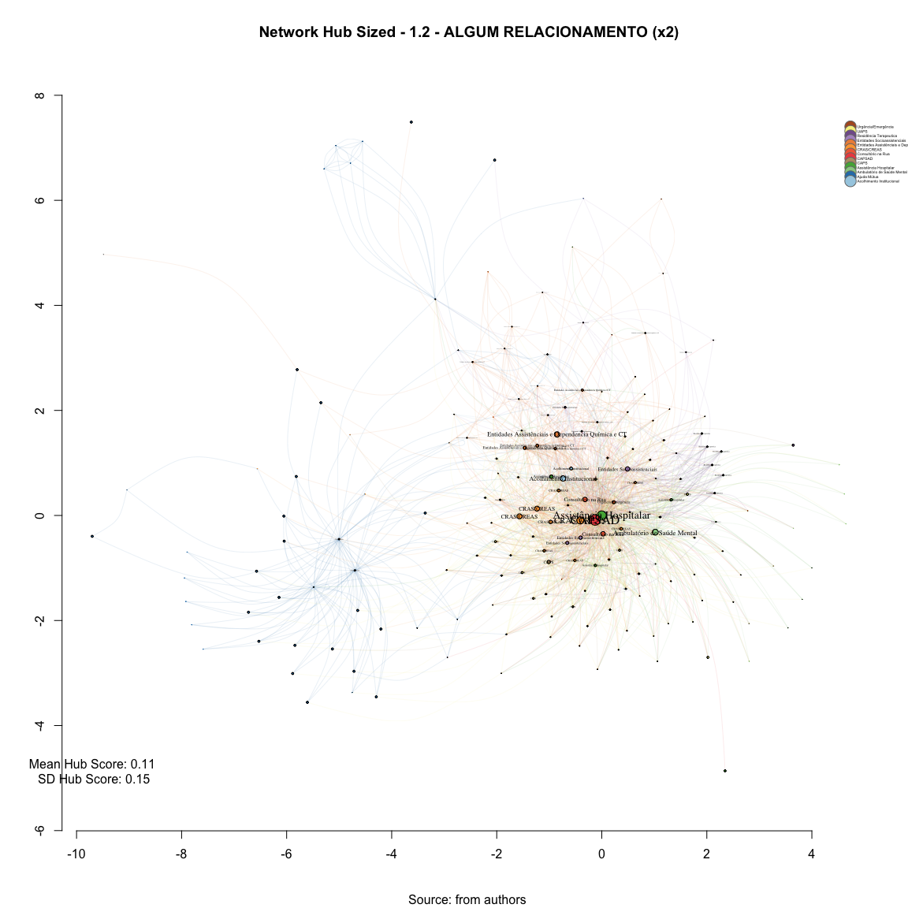
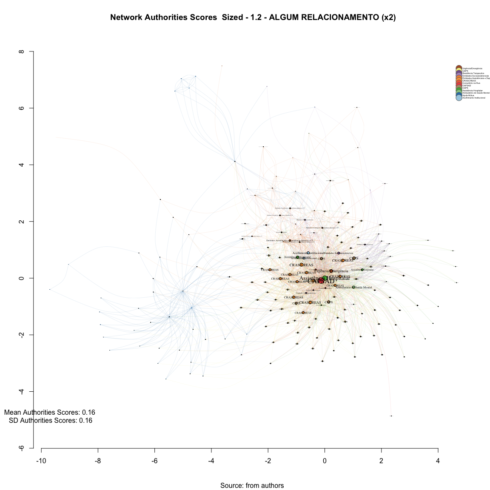
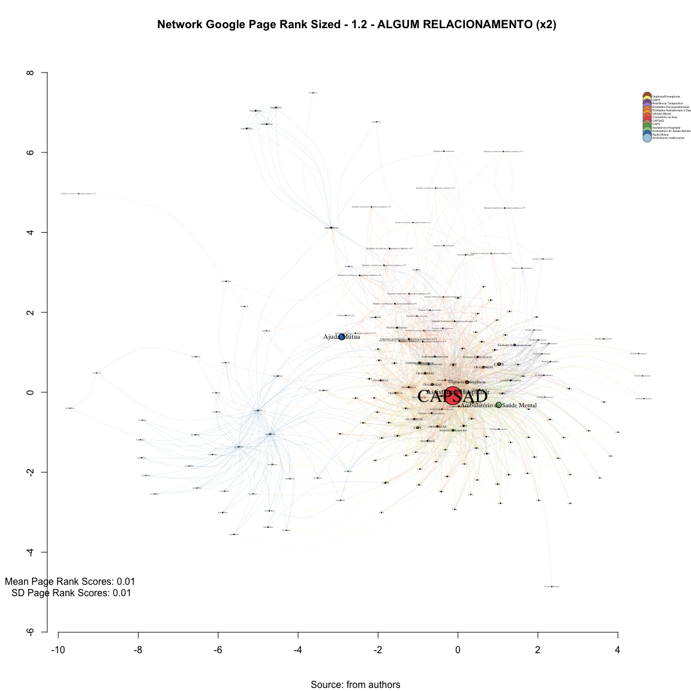
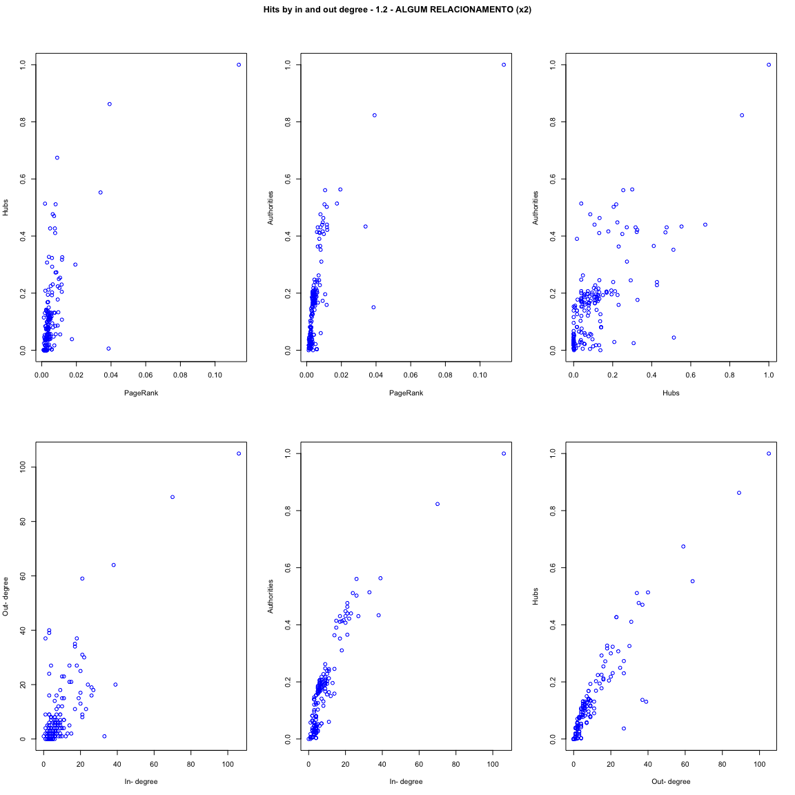

# SNA HITS 1.2 - ALGUM RELACIONAMENTO (x2)
Leonardo Martins  
17 de julho de 2016  
SNA Descritive Analysis from "Projeto Redes de Atenção às pessoas que consomem álcool e outras Drogas em Juiz de Fora-MG   Brazil"  - SNArRDJF

Here you can find a basic script to analysis data from SNArRDJF - this script was elaborated considering its use for orther matrix adjacency data from SNArRDJF - Here we are going to analyse:

# 1.2 - ALGUM RELACIONAMENTO (x2)

`#########################
`# Basic Preparation #####
`#########################

#Loading objects generated with previous script 

```r
rm(list = ls()) # removing previous objects to be sure that we don't have objects conflicts name
load("~/SNArRDJF/Robject/6_bonacichs_x2.RData")
```
##Reload packages

```r
suppressMessages(library(RColorBrewer))
suppressMessages(library(car))
suppressMessages(library(xtable))
suppressMessages(library(igraph))
suppressMessages(library(miniCRAN))
suppressMessages(library(magrittr))
suppressMessages(library(keyplayer))
suppressMessages(library(dplyr))
suppressMessages(library(feather))
suppressMessages(library(visNetwork))
suppressMessages(library(knitr))
suppressMessages(library(DT))
```
##Adding phantom tools

```r
#In order to get dinamic javascript object install those ones. If you get problems installing go to Stackoverflow.com and type your error to discover what to do. In some cases the libraries need to be intalled in outside R libs.
#devtools::install_github("wch/webshot")
#webshot::install_phantomjs()
```
##Setting a random seed - this is a good strategy to keep the same graph pattern layout in a new report generation

```r
set.seed(123)
```

##Simplify Graph - removing loops and duble edges 

```r
#x2<-simplify(x2) #Simplify
```


#Hubs and Authorities (HITS)
Hyperlink-Induced Topic Search (HITS; also known as hubs and authorities) is a link analysis algorithm that rates Web pages, developed by Jon Kleinberg. 

The idea behind Hubs and Authorities stemmed from a particular insight into the creation of web pages when the Internet was originally forming; that is, certain web pages, known as hubs, served as large directories that were not actually authoritative in the information that they held, but were used as compilations of a broad catalog of information that led users direct to other authoritative pages. In other words, a good hub represented a page that pointed to many other pages, and a good authority represented a page that was linked by many different hubs.(from dirty wikipedia)

The scheme therefore assigns two scores for each page: its authority, which estimates the value of the content of the page, and its hub value, which estimates the value of its links to other pages.


We can use the same analogy for citation networks like reviews (hubs) vs original research (authoritative) papers

• Authorities, contain useful information

• Hubs, contains links to authorities

• Good authorities referred by good hubs

• Good hubs point to good authorities

It is possibile to apply this kind of analysis for social network relationships.  

##Hubs - are expected to contain catalogs with a large number of outgoing links; 

```r
#Kleinberg’s hub scores
V(x2)$hub <- hub.score(x2)$vector
x2_hub<- hub.score(x2)$vector %>% round(4)
```
##Hubs Table

```r
d=as.data.frame(cbind(V(x2)$LABEL_COR, x2_hub))
names(d)<-c("Type", "Hub Score")
datatable(d, filter ="top")
```

<!--html_preserve--><div id="htmlwidget-cde1e3023d9b5cb50aa8" style="width:100%;height:auto;" class="datatables html-widget"></div>
<script type="application/json" data-for="htmlwidget-cde1e3023d9b5cb50aa8">{"x":{"filter":"top","filterHTML":"<tr>\n  <td>\u003c/td>\n  <td data-type=\"factor\" style=\"vertical-align: top;\">\n    <div class=\"form-group has-feedback\" style=\"margin-bottom: auto;\">\n      <input type=\"search\" placeholder=\"All\" class=\"form-control\" style=\"width: 100%;\"/>\n      <span class=\"glyphicon glyphicon-remove-circle form-control-feedback\">\u003c/span>\n    \u003c/div>\n    <div style=\"width: 100%; display: none;\">\n      <select multiple=\"multiple\" style=\"width: 100%;\" data-options=\"[&quot;Acolhimento Institucional&quot;,&quot;Ajuda Mútua&quot;,&quot;Ambulatório de Saúde Mental&quot;,&quot;Assistência Hospitalar&quot;,&quot;CAPS&quot;,&quot;CAPSAD&quot;,&quot;Consultório na Rua&quot;,&quot;CRAS/CREAS&quot;,&quot;Entidades Assistênciais e Dependencia Química e CT&quot;,&quot;Entidades Socioassistenciais&quot;,&quot;Residência Terapeutica&quot;,&quot;UAPS&quot;,&quot;Urgência/Emergência&quot;]\">\u003c/select>\n    \u003c/div>\n  \u003c/td>\n  <td data-type=\"factor\" style=\"vertical-align: top;\">\n    <div class=\"form-group has-feedback\" style=\"margin-bottom: auto;\">\n      <input type=\"search\" placeholder=\"All\" class=\"form-control\" style=\"width: 100%;\"/>\n      <span class=\"glyphicon glyphicon-remove-circle form-control-feedback\">\u003c/span>\n    \u003c/div>\n    <div style=\"width: 100%; display: none;\">\n      <select multiple=\"multiple\" style=\"width: 100%;\" data-options=\"[&quot;0&quot;,&quot;0.0011&quot;,&quot;0.0015&quot;,&quot;0.0016&quot;,&quot;0.0021&quot;,&quot;0.0028&quot;,&quot;0.0029&quot;,&quot;0.0058&quot;,&quot;0.0067&quot;,&quot;0.0076&quot;,&quot;0.0112&quot;,&quot;0.0168&quot;,&quot;0.0174&quot;,&quot;0.0199&quot;,&quot;0.0246&quot;,&quot;0.0273&quot;,&quot;0.0331&quot;,&quot;0.0353&quot;,&quot;0.0367&quot;,&quot;0.0387&quot;,&quot;0.0394&quot;,&quot;0.0395&quot;,&quot;0.0411&quot;,&quot;0.0448&quot;,&quot;0.0465&quot;,&quot;0.0475&quot;,&quot;0.0527&quot;,&quot;0.0535&quot;,&quot;0.055&quot;,&quot;0.0554&quot;,&quot;0.0562&quot;,&quot;0.0568&quot;,&quot;0.0581&quot;,&quot;0.0582&quot;,&quot;0.0705&quot;,&quot;0.072&quot;,&quot;0.0728&quot;,&quot;0.0729&quot;,&quot;0.0764&quot;,&quot;0.0769&quot;,&quot;0.0772&quot;,&quot;0.0775&quot;,&quot;0.0777&quot;,&quot;0.0799&quot;,&quot;0.0815&quot;,&quot;0.0837&quot;,&quot;0.0842&quot;,&quot;0.0851&quot;,&quot;0.0865&quot;,&quot;0.0901&quot;,&quot;0.093&quot;,&quot;0.0942&quot;,&quot;0.0964&quot;,&quot;0.0996&quot;,&quot;0.1035&quot;,&quot;0.1047&quot;,&quot;0.107&quot;,&quot;0.108&quot;,&quot;0.1084&quot;,&quot;0.1086&quot;,&quot;0.1089&quot;,&quot;0.1106&quot;,&quot;0.1142&quot;,&quot;0.1144&quot;,&quot;0.1146&quot;,&quot;0.1163&quot;,&quot;0.1174&quot;,&quot;0.1185&quot;,&quot;0.121&quot;,&quot;0.1233&quot;,&quot;0.1242&quot;,&quot;0.1265&quot;,&quot;0.128&quot;,&quot;0.1305&quot;,&quot;0.1309&quot;,&quot;0.1312&quot;,&quot;0.1316&quot;,&quot;0.133&quot;,&quot;0.1357&quot;,&quot;0.137&quot;,&quot;0.1371&quot;,&quot;0.1408&quot;,&quot;0.1498&quot;,&quot;0.1681&quot;,&quot;0.1682&quot;,&quot;0.169&quot;,&quot;0.1777&quot;,&quot;0.1928&quot;,&quot;0.1943&quot;,&quot;0.2025&quot;,&quot;0.2047&quot;,&quot;0.2083&quot;,&quot;0.212&quot;,&quot;0.2182&quot;,&quot;0.2239&quot;,&quot;0.2248&quot;,&quot;0.2302&quot;,&quot;0.2307&quot;,&quot;0.2494&quot;,&quot;0.2541&quot;,&quot;0.2722&quot;,&quot;0.273&quot;,&quot;0.2925&quot;,&quot;0.3&quot;,&quot;0.3072&quot;,&quot;0.3172&quot;,&quot;0.3231&quot;,&quot;0.3257&quot;,&quot;0.327&quot;,&quot;0.4105&quot;,&quot;0.4268&quot;,&quot;0.4702&quot;,&quot;0.4765&quot;,&quot;0.5113&quot;,&quot;0.5135&quot;,&quot;0.5527&quot;,&quot;0.6743&quot;,&quot;0.8624&quot;,&quot;1&quot;]\">\u003c/select>\n    \u003c/div>\n  \u003c/td>\n\u003c/tr>","data":[["ASS_HOS_ Hospital de Pronto Socorro – HPS","AMB_SAM_ Centro de Atenção à Saúde Mental (CASM)","CAPS_AD","CRAS_AS_ CRAS Sudeste Costa Carvalho","CRE_SOC_ CREAS Infância e Juventude","CRE_SOC_ CREAS Norte","ASS_HOS_ Serviço de Controle e Prevenção e Tratamento do Tabagismo (SECOPTT)","EA_DQCT_ Centro de Recuperação Resgatando Vidas (Escritório)","EA_DQCT_ Comunidade Terapêutica Geração de Adoradores – CTGA","EA_DQCT_ Centro de Recuperação Resgatando Vidas","CRAS_AS_ CRAS Norte Benfica","CRAS_AS_ CRAS Centro","EA_DQCT_ Associação Beneficente Cristã Restituir","ENT_SOC_ Território Aliança pela Vida  Zona Norte","UAP_URB_ Santa Cecília","RES_TER_ Casa V1","CRE_SOC_ CREAS Idoso e Mulher","URG_EME_ Serviço de Atendimento Móvel de Urgência (SAMU)","ENT_SOC_ Associação Beneficente e Cultural Amigos do Noivo (ABAN) (Matriz)","ASS_HOS_ Centro de Referência em Álcool e Drogas (RADCAS)  Hospital Universitário","CAPS_CO_ CAPS HU","EA_DQCT_ Grupo de Apoio à Família e aos Dependentes Químicos – GAFADEQUI.1","CAPS_CO_ CAPS IJ","AJU_MUT_ Escritório de Serviços Locais dos Álcoólicos Anônimos de Juiz de Fora","ENT_SOC_ Associação Beneficente e Cultural Amigos do Noivo (ABAN) Dom Bosco","AJU_MUT_ ALANON Grupo Harmonia","AJU_MUT_ ALANON Grupo Só Por Hoje","CAPS_CO_ CAPS Leste","CRAS_AS_ CRAS Leste São Benedito","CRAS_AS_ CRAS Nordeste Grama","CRAS_AS_ CRAS Leste Linhares","UAP_URB_ Parque Guarani","ACO_INS_ Casa da Cidadania","AJU_MUT_ Grupo A.A. Vinte e Cinco de Abril","CRAS_AS_ CRAS Sudeste Olavo Costa","EA_DQCT_ Grupo de Apoio à Família e aos Dependentes Químicos – GAFADEQUI","EA_DQCT_ Centro de Recuperação Juiz de Fora Contra as Drogas","RES_TER_ Casa 1","RES_TER_ Casa 7","ENT_SOC_ Associação Casa Viva","ACO_INS_ Núcleo Cidadão de Rua Hebert de Souza","CON_RUA_ Equipe de Consultório na Rua (UAPS de referência Vila Ideal)","CON_RUA_ Equipe de Consultório na Rua (Associação Casa Viva)","EA_DQCT_ Associação Projeto Amor e Restauração – APAR","ENT_SOC_ Casa São Camilo de Lelis","CRA_SOC_ CRAS Sul Ipiranga","AJU_MUT_ Grupo A.A. Ipiranga","RES_TER_ Casa V2","RES_TER_ Casa V3","RES_TER_ Casa V4","RES_TER_ Casa V5","RES_TER_ Casa V6","EA_DQCT_ Comunidade Terapêutica Família em Cristo","UAP_URB_ São Pedro","AJU_MUT_ Grupo A.A Primeiro Passo","CRAS_AS_ CRAS Oeste São Pedro","UAP_URB_ Alto Grajaú","AJU_MUT_ Pastoral da Sobriedade","AJU_MUT_ Grupo A.A Juiz de Fora (Sala de abordagem)","ASS_HOS_ Hospital Ana Nery","AJU_MUT_ Grupo A.A. Central","EA_DQCT_ Vila Verde (Unidade Bromélias)","UAP_URB_ Santo Antônio","UAP_URB_ Grama","EA_DQCT_ Centro de Recuperação SOS Vida","EA_DQCT_ Centro de Tratamento Deville","AJU_MUT_ NARANON Grupo Parque Halfeld","ENT_SOC_ Fundação Maria Mãe","ENT_SOC_ Grupo Espírita de Ajuda aos Enfermos (GEDAE)","UAP_URB_ Cidade do Sol","UAP_URB_ Bairro Industrial","UAP_URB_ Milho Branco","UAP_URB_ Nova Era","UAP_URB_ Santa Cruz","UAP_URB_ São Judas Tadeu","UAP_URB_ Marumbí","UAP_URB_ Progresso","CRE_SOC_ CREAS População de Rua (CentroPop)","AJU_MUT_ Grupo de Apoio Benfica de Amor Exigente (GABENAE)","AJU_MUT_ Grupo de Apoio São Mateus de Amor Exigente (GASMAE)","AJU_MUT_ Grupo de Amor Exigente Linhares","AJU_MUT_ Grupo de Amor Exigente Santa Terezinha","UAP_URB_ Furtado de Menezes","AJU_MUT_ Grupo A.A. Reunidos","AJU_MUT_ Grupo de Apoio São Pedro do Amor Exigente (GASPAE)","UAP_URB_ Jóquei Clube II","EA_DQCT_ Centro Metodista de Assistência aos Toxicômanos – CEMAT","EA_DQCT_ Centro Terapêutico Reconstruir (fazenda)","UAP_URB_ Bairro de Lourdes","UAP_URB_ Vila Olavo Costa","UAP_URB_ Cruzeiro do Sul","AJU_MUT_ Igreja Batista Resplandecente Estrela do Amanhã  IBREM","EA_DQCT_ Vila Verde (Unidade Borboleta)","ASS_HOS_ Clínica Vila Verde (Hospital Dia)","UAP_URB_ Ipiranga","EA_DQCT_ Centro Metodista de Assistência aos Toxicômanos – CEMAT (Escritório)","EA_DQCT_ Centro Terapêutico Reconstruir (escritório)","EA_DQCT_ Grupo de Apoio à Família e aos Dependentes Químicos – GAFADEQUI (Administração, triagem e apoio aos familiares)","UAP_URB_ Barreira do Triunfo","ASS_HOS_ Casa de Saúde Esperança","ENT_SOC_ Associação Beneficente e Cultural Amigos do Noivo (ABAN)","ENT_SOC_ Casa de Acolhimento à Infância e Adolescente (CAIA)","RES_TER_ Casa 3","RES_TER_ Casa 4","UAP_URB_ Filgueiras","UAP_URB_ Jardim da Lua","UAP_URB_ Granjas Betânea","RES_TER_ Casa 5","RES_TER_ Casa 6","UAP_URB_ Borboleta","UAP_URB_ Santos Dumont","UAP_RUR_ Igrejinha","UAP_URB_ Dom Bosco","UAP_URB_ Benfica","UAP_URB_ Jóquei Clube I","UAP_URB_ Nossa Senhora Aparecida","UAP_URB_ Santa Cândida/São Sebastião","UAP_URB_ São Benedito","UAP_URB_ Santa Efigênia","UAP_URB_ Santa Luzia","UAP_URB_ Bandeirantes","ENT_SOC_ Instituto Veredas (Projeto, Assessoria e Prática em Saúde Mental) // Serviço de Referência para Adolescentes do Instituto Veredas","UAP_RUR_ Monte Verde","UAP_RUR_ Pirapetinga","UAP_RUR_ Torreões","UAP_RUR_ Caeté","UAP_RUR_ Chapéu D'Uvas","UAP_RUR_ Humaitá","UAP_RUR_ Rosário de Minas","UAP_RUR_ Sarandira","UAP_RUR_ Toledos","UAP_RUR_ Valadares","UAP_URB_ Esplanada","UAP_URB_ Jardim Natal","UAP_URB_ Monte Castelo","UAP_URB_ Vila Esperança","UAP_URB_ Linhares","UAP_URB_ Santa Rita","UAP_URB_ Jardim Esperança","UAP_URB_ Retiro","UAP_URB_ Vila Ideal","UAP_URB_ Teixeiras","UAP_URB_ Vale Verde","UAP_URB_ Nossa Senhora das Graças","ENT_SOC_ ONG Saída","CAPS_CO_ CAPS Casa Viva","CEN_CON_ Associação TRABALHARTE","UAP_URB_ Centro Sul","ACO_INS_ Sociedade São Vicente de Paulo","UAP_RUR_ Buiéié","UAP_RUR_ Jacutinga","UAP_RUR_ Palmital","UAP_RUR_ Pires","UAP_RUR_ Privilégio","AJU_MUT_ Grupo N.A. Glória","AJU_MUT_ Grupo A.A. 29 de Junho","UAP_RUR_ Dias Tavares","UAP_RUR_ Paula Lima","UAP_RUR_ Penido","AJU_MUT_ ALANON Grupo Libertação","AJU_MUT_ GEVE","AJU_MUT_ Grupo A.A. Libertação","AJU_MUT_ Grupo N.A. Libertação","AJU_MUT_ NARANON Grupo Glória","AJU_MUT_ Grupo A.A. Azul e Branco","AJU_MUT_ NARANON Grupo Renascer","AJU_MUT_ Grupo A.A. Cidade do Sol","AJU_MUT_ Grupo A.A. Caminho Da Salvação","AJU_MUT_ Grupo A.A. Dois de Março","AJU_MUT_ Grupo A.A. Corrente da Sobriedade","AJU_MUT_ Grupo A.A. Milho Branco","AJU_MUT_ Grupo A.A. Luz Divina","AJU_MUT_ Grupo A.A. Nova Era","AJU_MUT_ Grupo A.A União","AJU_MUT_ Grupo A.A. Bairu","AJU_MUT_ Grupo N.A. Caminho Verdade","AJU_MUT_ Grupo A.A. Bonfim","AJU_MUT_ Grupo A.A. Linhares","AJU_MUT_ Grupo A.A Redenção Abolição","AJU_MUT_ Grupo A.A. Progresso","AJU_MUT_ Grupo A.A. Estrela D´Alva","AJU_MUT_ Grupo A.A. Primeira Tradição","AJU_MUT_ Grupo A.A. Estrela do Oriente","AJU_MUT_ Grupo A.A Duas Vidas","AJU_MUT_ Grupo A.A. Liberdade","AJU_MUT_ Grupo N.A Rendição","ASS_HOS_ Hospital de Toxicômanos"],["Assistência Hospitalar","Ambulatório de Saúde Mental","CAPSAD","CRAS/CREAS","CRAS/CREAS","CRAS/CREAS","Assistência Hospitalar","Entidades Assistênciais e Dependencia Química e CT","Entidades Assistênciais e Dependencia Química e CT","Entidades Assistênciais e Dependencia Química e CT","CRAS/CREAS","CRAS/CREAS","Entidades Assistênciais e Dependencia Química e CT","Entidades Assistênciais e Dependencia Química e CT","UAPS","Residência Terapeutica","CRAS/CREAS","Urgência/Emergência","Entidades Socioassistenciais","Assistência Hospitalar","CAPS","Entidades Assistênciais e Dependencia Química e CT","CAPS","Ajuda Mútua","Entidades Socioassistenciais","Ajuda Mútua","Ajuda Mútua","CAPS","CRAS/CREAS","CRAS/CREAS","CRAS/CREAS","UAPS","Acolhimento Institucional","Ajuda Mútua","CRAS/CREAS","Entidades Assistênciais e Dependencia Química e CT","Entidades Assistênciais e Dependencia Química e CT","Residência Terapeutica","Residência Terapeutica","Entidades Socioassistenciais","Acolhimento Institucional","Consultório na Rua","Consultório na Rua","Entidades Assistênciais e Dependencia Química e CT","Entidades Socioassistenciais","CRAS/CREAS","Ajuda Mútua","Residência Terapeutica","Residência Terapeutica","Residência Terapeutica","Residência Terapeutica","Residência Terapeutica","Entidades Assistênciais e Dependencia Química e CT","UAPS","Ajuda Mútua","CRAS/CREAS","UAPS","Ajuda Mútua","Ajuda Mútua","Assistência Hospitalar","Ajuda Mútua","Entidades Assistênciais e Dependencia Química e CT","UAPS","UAPS","Entidades Assistênciais e Dependencia Química e CT","Entidades Assistênciais e Dependencia Química e CT","Ajuda Mútua","Entidades Socioassistenciais","Entidades Socioassistenciais","UAPS","UAPS","UAPS","UAPS","UAPS","UAPS","UAPS","UAPS","CRAS/CREAS","Ajuda Mútua","Ajuda Mútua","Ajuda Mútua","Ajuda Mútua","UAPS","Ajuda Mútua","Ajuda Mútua","UAPS","Entidades Assistênciais e Dependencia Química e CT","Entidades Assistênciais e Dependencia Química e CT","UAPS","UAPS","UAPS","Ajuda Mútua","Entidades Assistênciais e Dependencia Química e CT","Assistência Hospitalar","UAPS","Entidades Assistênciais e Dependencia Química e CT","Entidades Assistênciais e Dependencia Química e CT","Entidades Assistênciais e Dependencia Química e CT","UAPS","Assistência Hospitalar","Entidades Socioassistenciais","Entidades Socioassistenciais","Residência Terapeutica","Residência Terapeutica","UAPS","UAPS","UAPS","Residência Terapeutica","Residência Terapeutica","UAPS","UAPS","UAPS","UAPS","UAPS","UAPS","UAPS","UAPS","UAPS","UAPS","UAPS","UAPS","Entidades Socioassistenciais","UAPS","UAPS","UAPS","UAPS","UAPS","UAPS","UAPS","UAPS","UAPS","UAPS","UAPS","UAPS","UAPS","UAPS","UAPS","UAPS","UAPS","UAPS","UAPS","UAPS","UAPS","UAPS","Entidades Socioassistenciais","CAPS","Entidades Socioassistenciais","UAPS","Acolhimento Institucional","UAPS","UAPS","UAPS","UAPS","UAPS","Ajuda Mútua","Ajuda Mútua","UAPS","UAPS","UAPS","Ajuda Mútua","Ajuda Mútua","Ajuda Mútua","Ajuda Mútua","Ajuda Mútua","Ajuda Mútua","Ajuda Mútua","Ajuda Mútua","Ajuda Mútua","Ajuda Mútua","Ajuda Mútua","Ajuda Mútua","Ajuda Mútua","Ajuda Mútua","Ajuda Mútua","Ajuda Mútua","Ajuda Mútua","Ajuda Mútua","Ajuda Mútua","Ajuda Mútua","Ajuda Mútua","Ajuda Mútua","Ajuda Mútua","Ajuda Mútua","Ajuda Mútua","Ajuda Mútua","Ajuda Mútua","Assistência Hospitalar"],["0.8624","0.5527","1","0.4702","0.2182","0.2494","0.2302","0.273","0.2083","0.0527","0.107","0.0851","0.5135","0.3072","0.1086","0.1371","0.6743","0.3","0.0764","0.0799","0.1777","0.0568","0.133","0.137","0.0837","0.0273","0.0411","0.3257","0.4765","0.3231","0.2239","0.1943","0.2722","0.0067","0.0168","0.0582","0.2248","0.0411","0.0842","0.4105","0.5113","0.4268","0.4268","0.1142","0.1357","0.2047","0.0246","0.1408","0.1408","0.1408","0.1408","0.1408","0.0465","0.1174","0.1305","0.1309","0.2025","0.0535","0.0367","0.3172","0.0058","0.0112","0.128","0.093","0.0901","0.0015","0.0016","0.169","0.0964","0.0394","0.0394","0.1084","0.121","0.1047","0.1265","0.0815","0.1106","0.2541","0.0028","0.0028","0.0028","0.0028","0.0865","0","0.0562","0.1163","0.0777","0.0331","0.212","0.0769","0.1242","0.1144","0.0996","0.0174","0.1928","0.0769","0.0011","0.0029","0.0395","0.2307","0.0021","0.327","0","0","0.072","0.1498","0.0729","0","0","0.1146","0.1089","0.1312","0.0942","0.0705","0.108","0.1035","0.1682","0.1681","0.1316","0.1316","0.1233","0.2925","0.0448","0.0448","0.0448","0.0728","0.0387","0.0775","0.0387","0.0728","0.0554","0.0554","0.0772","0.0387","0.0387","0.1185","0.055","0.0387","0.0387","0.0554","0.0475","0.0387","0.0581","0.0387","0.0387","0.0387","0.0554","0.0199","0.0353","0.0168","0.0168","0.0168","0.0168","0.0168","0.0076","0","0","0","0","0","0","0","0","0","0","0","0","0","0","0","0","0","0","0","0","0","0","0","0","0","0","0","0","0","0","0","0"]],"container":"<table class=\"display\">\n  <thead>\n    <tr>\n      <th> \u003c/th>\n      <th>Type\u003c/th>\n      <th>Hub Score\u003c/th>\n    \u003c/tr>\n  \u003c/thead>\n\u003c/table>","options":{"order":[],"autoWidth":false,"orderClasses":false,"columnDefs":[{"orderable":false,"targets":0}],"orderCellsTop":true}},"evals":[],"jsHooks":[]}</script><!--/html_preserve-->
##Hubs Stats

```r
summary(x2_hub)
```

```
##    Min. 1st Qu.  Median    Mean 3rd Qu.    Max. 
## 0.00000 0.00625 0.05820 0.10910 0.13230 1.00000
```

```r
sd(x2_hub)
```

```
## [1] 0.1488662
```
##Plotting based on Hub Scores 

```r
set.seed(123)
#Plotting based only on degree measures 
edge.start <- ends(x2, es=E(x2), names=F)[,1]

# Fixing ego
minC <- rep(-Inf, vcount(x2))
maxC <- rep(Inf, vcount(x2))
minC[1] <- maxC[1] <- 0
co <- layout_with_fr(x2, niter=10^4, minx=minC, maxx=maxC,miny=minC, maxy=maxC, weights = E(x2)$weight)

#Plotting
plot(x2, 
     layout=co,
     edge.color=V(total)$color[edge.start],
     edge.arrow.size=(hub.score(x2)$vector+0.001)/100,
     edge.width=E(x2)$weight/10*mean(E(x2)$weight),
     edge.curved = TRUE,
     vertex.color=V(x2)$color,
     vertex.size=20*hub.score(x2)$vector,
     vertex.frame.color="black",
     vertex.label.color="black",
     vertex.label=get.vertex.attribute(x2,"LABEL_COR"),
     vertex.label.cex=(hub.score(x2)$vector+0.001),
     vertex.label.dist=0,
     rescale=F,
     xlim=range(co[,1]), 
     ylim=range(co[,2])
     )
axis(1)
axis(2)


#Solving Problems with legend rendering 
a<-V(total)$LABEL_COR
b<-V(total)$color
c<-table(a,b)
d<-as.data.frame(c)
e<-subset(d, d$Freq>0)
e<-e[order(e$a,decreasing=T),] 
f<-t(e$a)
g<-t(e$b)

#Adding Legend
legend(x=range(co[,1])[2], 
       y=range(co[,2])[2],
       legend=as.character(f),
       pch=21,
       col = "#777777", 
       pt.bg=as.character(g),
       pt.cex=2,
       bty="n", 
       ncol=1,
       lty=1,
       cex = .3)

#Adding Title
  title("Network Hub Sized - 1.2 - ALGUM RELACIONAMENTO (x2)", sub = "Source: from authors ")
  text( 
    x=range(co[,1])[1],
    y=range(co[,2])[1], 
      labels =    sprintf("Mean Hub Score: %.2f\n SD Hub Score: %.2f",
     mean(x2_hub),
     sd(x2_hub)
             )
       )
```

<!-- -->

#Authorities - would get many incoming links from hubs, presumably because of their high-quality relevant information.

```r
#Kleinberg’s authority scores
V(x2)$authority.score<- authority.score(x2)$vector
x2_auth <- authority.score(x2)$vector %>% round(4)
```
##Authorities Table

```r
d=as.data.frame(cbind(V(x2)$LABEL_COR, x2_auth))
names(d)<-c("Type", "Authorities Score")
datatable(d, filter ="top")
```

<!--html_preserve--><div id="htmlwidget-3b45bb2d62af6a8a7420" style="width:100%;height:auto;" class="datatables html-widget"></div>
<script type="application/json" data-for="htmlwidget-3b45bb2d62af6a8a7420">{"x":{"filter":"top","filterHTML":"<tr>\n  <td>\u003c/td>\n  <td data-type=\"factor\" style=\"vertical-align: top;\">\n    <div class=\"form-group has-feedback\" style=\"margin-bottom: auto;\">\n      <input type=\"search\" placeholder=\"All\" class=\"form-control\" style=\"width: 100%;\"/>\n      <span class=\"glyphicon glyphicon-remove-circle form-control-feedback\">\u003c/span>\n    \u003c/div>\n    <div style=\"width: 100%; display: none;\">\n      <select multiple=\"multiple\" style=\"width: 100%;\" data-options=\"[&quot;Acolhimento Institucional&quot;,&quot;Ajuda Mútua&quot;,&quot;Ambulatório de Saúde Mental&quot;,&quot;Assistência Hospitalar&quot;,&quot;CAPS&quot;,&quot;CAPSAD&quot;,&quot;Consultório na Rua&quot;,&quot;CRAS/CREAS&quot;,&quot;Entidades Assistênciais e Dependencia Química e CT&quot;,&quot;Entidades Socioassistenciais&quot;,&quot;Residência Terapeutica&quot;,&quot;UAPS&quot;,&quot;Urgência/Emergência&quot;]\">\u003c/select>\n    \u003c/div>\n  \u003c/td>\n  <td data-type=\"factor\" style=\"vertical-align: top;\">\n    <div class=\"form-group has-feedback\" style=\"margin-bottom: auto;\">\n      <input type=\"search\" placeholder=\"All\" class=\"form-control\" style=\"width: 100%;\"/>\n      <span class=\"glyphicon glyphicon-remove-circle form-control-feedback\">\u003c/span>\n    \u003c/div>\n    <div style=\"width: 100%; display: none;\">\n      <select multiple=\"multiple\" style=\"width: 100%;\" data-options=\"[&quot;0&quot;,&quot;0.0037&quot;,&quot;0.0045&quot;,&quot;0.0052&quot;,&quot;0.0067&quot;,&quot;0.0075&quot;,&quot;0.0076&quot;,&quot;0.0136&quot;,&quot;0.0175&quot;,&quot;0.0177&quot;,&quot;0.0198&quot;,&quot;0.0215&quot;,&quot;0.0222&quot;,&quot;0.0225&quot;,&quot;0.0228&quot;,&quot;0.0237&quot;,&quot;0.0239&quot;,&quot;0.0244&quot;,&quot;0.0249&quot;,&quot;0.0264&quot;,&quot;0.027&quot;,&quot;0.0287&quot;,&quot;0.0288&quot;,&quot;0.0296&quot;,&quot;0.0308&quot;,&quot;0.0314&quot;,&quot;0.0346&quot;,&quot;0.0352&quot;,&quot;0.0357&quot;,&quot;0.0362&quot;,&quot;0.0374&quot;,&quot;0.0384&quot;,&quot;0.0398&quot;,&quot;0.0443&quot;,&quot;0.0449&quot;,&quot;0.0464&quot;,&quot;0.0486&quot;,&quot;0.0518&quot;,&quot;0.0519&quot;,&quot;0.054&quot;,&quot;0.0546&quot;,&quot;0.0572&quot;,&quot;0.0575&quot;,&quot;0.06&quot;,&quot;0.0619&quot;,&quot;0.0654&quot;,&quot;0.0675&quot;,&quot;0.076&quot;,&quot;0.0804&quot;,&quot;0.0814&quot;,&quot;0.0957&quot;,&quot;0.1015&quot;,&quot;0.103&quot;,&quot;0.1161&quot;,&quot;0.1203&quot;,&quot;0.121&quot;,&quot;0.1262&quot;,&quot;0.1263&quot;,&quot;0.1315&quot;,&quot;0.1389&quot;,&quot;0.1412&quot;,&quot;0.1459&quot;,&quot;0.1505&quot;,&quot;0.1521&quot;,&quot;0.1532&quot;,&quot;0.156&quot;,&quot;0.1581&quot;,&quot;0.1589&quot;,&quot;0.1603&quot;,&quot;0.164&quot;,&quot;0.1658&quot;,&quot;0.1665&quot;,&quot;0.1667&quot;,&quot;0.1689&quot;,&quot;0.1696&quot;,&quot;0.1713&quot;,&quot;0.172&quot;,&quot;0.1724&quot;,&quot;0.173&quot;,&quot;0.1751&quot;,&quot;0.1763&quot;,&quot;0.1773&quot;,&quot;0.1778&quot;,&quot;0.1783&quot;,&quot;0.1785&quot;,&quot;0.1788&quot;,&quot;0.1799&quot;,&quot;0.1827&quot;,&quot;0.1849&quot;,&quot;0.1858&quot;,&quot;0.1875&quot;,&quot;0.1882&quot;,&quot;0.1886&quot;,&quot;0.1901&quot;,&quot;0.1903&quot;,&quot;0.1931&quot;,&quot;0.1934&quot;,&quot;0.1935&quot;,&quot;0.1947&quot;,&quot;0.1957&quot;,&quot;0.196&quot;,&quot;0.1986&quot;,&quot;0.2004&quot;,&quot;0.2016&quot;,&quot;0.202&quot;,&quot;0.2033&quot;,&quot;0.2052&quot;,&quot;0.2066&quot;,&quot;0.2069&quot;,&quot;0.207&quot;,&quot;0.2094&quot;,&quot;0.2126&quot;,&quot;0.2162&quot;,&quot;0.2178&quot;,&quot;0.2274&quot;,&quot;0.228&quot;,&quot;0.2389&quot;,&quot;0.239&quot;,&quot;0.2449&quot;,&quot;0.2455&quot;,&quot;0.2472&quot;,&quot;0.2622&quot;,&quot;0.3104&quot;,&quot;0.3519&quot;,&quot;0.3633&quot;,&quot;0.3653&quot;,&quot;0.3902&quot;,&quot;0.4071&quot;,&quot;0.4106&quot;,&quot;0.4128&quot;,&quot;0.4142&quot;,&quot;0.4163&quot;,&quot;0.4216&quot;,&quot;0.4305&quot;,&quot;0.4306&quot;,&quot;0.4334&quot;,&quot;0.4398&quot;,&quot;0.4399&quot;,&quot;0.4478&quot;,&quot;0.4631&quot;,&quot;0.4762&quot;,&quot;0.5023&quot;,&quot;0.5111&quot;,&quot;0.5139&quot;,&quot;0.5606&quot;,&quot;0.5632&quot;,&quot;0.8232&quot;,&quot;1&quot;]\">\u003c/select>\n    \u003c/div>\n  \u003c/td>\n\u003c/tr>","data":[["ASS_HOS_ Hospital de Pronto Socorro – HPS","AMB_SAM_ Centro de Atenção à Saúde Mental (CASM)","CAPS_AD","CRAS_AS_ CRAS Sudeste Costa Carvalho","CRE_SOC_ CREAS Infância e Juventude","CRE_SOC_ CREAS Norte","ASS_HOS_ Serviço de Controle e Prevenção e Tratamento do Tabagismo (SECOPTT)","EA_DQCT_ Centro de Recuperação Resgatando Vidas (Escritório)","EA_DQCT_ Comunidade Terapêutica Geração de Adoradores – CTGA","EA_DQCT_ Centro de Recuperação Resgatando Vidas","CRAS_AS_ CRAS Norte Benfica","CRAS_AS_ CRAS Centro","EA_DQCT_ Associação Beneficente Cristã Restituir","ENT_SOC_ Território Aliança pela Vida  Zona Norte","UAP_URB_ Santa Cecília","RES_TER_ Casa V1","CRE_SOC_ CREAS Idoso e Mulher","URG_EME_ Serviço de Atendimento Móvel de Urgência (SAMU)","ENT_SOC_ Associação Beneficente e Cultural Amigos do Noivo (ABAN) (Matriz)","ASS_HOS_ Centro de Referência em Álcool e Drogas (RADCAS)  Hospital Universitário","CAPS_CO_ CAPS HU","EA_DQCT_ Grupo de Apoio à Família e aos Dependentes Químicos – GAFADEQUI.1","CAPS_CO_ CAPS IJ","AJU_MUT_ Escritório de Serviços Locais dos Álcoólicos Anônimos de Juiz de Fora","ENT_SOC_ Associação Beneficente e Cultural Amigos do Noivo (ABAN) Dom Bosco","AJU_MUT_ ALANON Grupo Harmonia","AJU_MUT_ ALANON Grupo Só Por Hoje","CAPS_CO_ CAPS Leste","CRAS_AS_ CRAS Leste São Benedito","CRAS_AS_ CRAS Nordeste Grama","CRAS_AS_ CRAS Leste Linhares","UAP_URB_ Parque Guarani","ACO_INS_ Casa da Cidadania","AJU_MUT_ Grupo A.A. Vinte e Cinco de Abril","CRAS_AS_ CRAS Sudeste Olavo Costa","EA_DQCT_ Grupo de Apoio à Família e aos Dependentes Químicos – GAFADEQUI","EA_DQCT_ Centro de Recuperação Juiz de Fora Contra as Drogas","RES_TER_ Casa 1","RES_TER_ Casa 7","ENT_SOC_ Associação Casa Viva","ACO_INS_ Núcleo Cidadão de Rua Hebert de Souza","CON_RUA_ Equipe de Consultório na Rua (UAPS de referência Vila Ideal)","CON_RUA_ Equipe de Consultório na Rua (Associação Casa Viva)","EA_DQCT_ Associação Projeto Amor e Restauração – APAR","ENT_SOC_ Casa São Camilo de Lelis","CRA_SOC_ CRAS Sul Ipiranga","AJU_MUT_ Grupo A.A. Ipiranga","RES_TER_ Casa V2","RES_TER_ Casa V3","RES_TER_ Casa V4","RES_TER_ Casa V5","RES_TER_ Casa V6","EA_DQCT_ Comunidade Terapêutica Família em Cristo","UAP_URB_ São Pedro","AJU_MUT_ Grupo A.A Primeiro Passo","CRAS_AS_ CRAS Oeste São Pedro","UAP_URB_ Alto Grajaú","AJU_MUT_ Pastoral da Sobriedade","AJU_MUT_ Grupo A.A Juiz de Fora (Sala de abordagem)","ASS_HOS_ Hospital Ana Nery","AJU_MUT_ Grupo A.A. Central","EA_DQCT_ Vila Verde (Unidade Bromélias)","UAP_URB_ Santo Antônio","UAP_URB_ Grama","EA_DQCT_ Centro de Recuperação SOS Vida","EA_DQCT_ Centro de Tratamento Deville","AJU_MUT_ NARANON Grupo Parque Halfeld","ENT_SOC_ Fundação Maria Mãe","ENT_SOC_ Grupo Espírita de Ajuda aos Enfermos (GEDAE)","UAP_URB_ Cidade do Sol","UAP_URB_ Bairro Industrial","UAP_URB_ Milho Branco","UAP_URB_ Nova Era","UAP_URB_ Santa Cruz","UAP_URB_ São Judas Tadeu","UAP_URB_ Marumbí","UAP_URB_ Progresso","CRE_SOC_ CREAS População de Rua (CentroPop)","AJU_MUT_ Grupo de Apoio Benfica de Amor Exigente (GABENAE)","AJU_MUT_ Grupo de Apoio São Mateus de Amor Exigente (GASMAE)","AJU_MUT_ Grupo de Amor Exigente Linhares","AJU_MUT_ Grupo de Amor Exigente Santa Terezinha","UAP_URB_ Furtado de Menezes","AJU_MUT_ Grupo A.A. Reunidos","AJU_MUT_ Grupo de Apoio São Pedro do Amor Exigente (GASPAE)","UAP_URB_ Jóquei Clube II","EA_DQCT_ Centro Metodista de Assistência aos Toxicômanos – CEMAT","EA_DQCT_ Centro Terapêutico Reconstruir (fazenda)","UAP_URB_ Bairro de Lourdes","UAP_URB_ Vila Olavo Costa","UAP_URB_ Cruzeiro do Sul","AJU_MUT_ Igreja Batista Resplandecente Estrela do Amanhã  IBREM","EA_DQCT_ Vila Verde (Unidade Borboleta)","ASS_HOS_ Clínica Vila Verde (Hospital Dia)","UAP_URB_ Ipiranga","EA_DQCT_ Centro Metodista de Assistência aos Toxicômanos – CEMAT (Escritório)","EA_DQCT_ Centro Terapêutico Reconstruir (escritório)","EA_DQCT_ Grupo de Apoio à Família e aos Dependentes Químicos – GAFADEQUI (Administração, triagem e apoio aos familiares)","UAP_URB_ Barreira do Triunfo","ASS_HOS_ Casa de Saúde Esperança","ENT_SOC_ Associação Beneficente e Cultural Amigos do Noivo (ABAN)","ENT_SOC_ Casa de Acolhimento à Infância e Adolescente (CAIA)","RES_TER_ Casa 3","RES_TER_ Casa 4","UAP_URB_ Filgueiras","UAP_URB_ Jardim da Lua","UAP_URB_ Granjas Betânea","RES_TER_ Casa 5","RES_TER_ Casa 6","UAP_URB_ Borboleta","UAP_URB_ Santos Dumont","UAP_RUR_ Igrejinha","UAP_URB_ Dom Bosco","UAP_URB_ Benfica","UAP_URB_ Jóquei Clube I","UAP_URB_ Nossa Senhora Aparecida","UAP_URB_ Santa Cândida/São Sebastião","UAP_URB_ São Benedito","UAP_URB_ Santa Efigênia","UAP_URB_ Santa Luzia","UAP_URB_ Bandeirantes","ENT_SOC_ Instituto Veredas (Projeto, Assessoria e Prática em Saúde Mental) // Serviço de Referência para Adolescentes do Instituto Veredas","UAP_RUR_ Monte Verde","UAP_RUR_ Pirapetinga","UAP_RUR_ Torreões","UAP_RUR_ Caeté","UAP_RUR_ Chapéu D'Uvas","UAP_RUR_ Humaitá","UAP_RUR_ Rosário de Minas","UAP_RUR_ Sarandira","UAP_RUR_ Toledos","UAP_RUR_ Valadares","UAP_URB_ Esplanada","UAP_URB_ Jardim Natal","UAP_URB_ Monte Castelo","UAP_URB_ Vila Esperança","UAP_URB_ Linhares","UAP_URB_ Santa Rita","UAP_URB_ Jardim Esperança","UAP_URB_ Retiro","UAP_URB_ Vila Ideal","UAP_URB_ Teixeiras","UAP_URB_ Vale Verde","UAP_URB_ Nossa Senhora das Graças","ENT_SOC_ ONG Saída","CAPS_CO_ CAPS Casa Viva","CEN_CON_ Associação TRABALHARTE","UAP_URB_ Centro Sul","ACO_INS_ Sociedade São Vicente de Paulo","UAP_RUR_ Buiéié","UAP_RUR_ Jacutinga","UAP_RUR_ Palmital","UAP_RUR_ Pires","UAP_RUR_ Privilégio","AJU_MUT_ Grupo N.A. Glória","AJU_MUT_ Grupo A.A. 29 de Junho","UAP_RUR_ Dias Tavares","UAP_RUR_ Paula Lima","UAP_RUR_ Penido","AJU_MUT_ ALANON Grupo Libertação","AJU_MUT_ GEVE","AJU_MUT_ Grupo A.A. Libertação","AJU_MUT_ Grupo N.A. Libertação","AJU_MUT_ NARANON Grupo Glória","AJU_MUT_ Grupo A.A. Azul e Branco","AJU_MUT_ NARANON Grupo Renascer","AJU_MUT_ Grupo A.A. Cidade do Sol","AJU_MUT_ Grupo A.A. Caminho Da Salvação","AJU_MUT_ Grupo A.A. Dois de Março","AJU_MUT_ Grupo A.A. Corrente da Sobriedade","AJU_MUT_ Grupo A.A. Milho Branco","AJU_MUT_ Grupo A.A. Luz Divina","AJU_MUT_ Grupo A.A. Nova Era","AJU_MUT_ Grupo A.A União","AJU_MUT_ Grupo A.A. Bairu","AJU_MUT_ Grupo N.A. Caminho Verdade","AJU_MUT_ Grupo A.A. Bonfim","AJU_MUT_ Grupo A.A. Linhares","AJU_MUT_ Grupo A.A Redenção Abolição","AJU_MUT_ Grupo A.A. Progresso","AJU_MUT_ Grupo A.A. Estrela D´Alva","AJU_MUT_ Grupo A.A. Primeira Tradição","AJU_MUT_ Grupo A.A. Estrela do Oriente","AJU_MUT_ Grupo A.A Duas Vidas","AJU_MUT_ Grupo A.A. Liberdade","AJU_MUT_ Grupo N.A Rendição","ASS_HOS_ Hospital de Toxicômanos"],["Assistência Hospitalar","Ambulatório de Saúde Mental","CAPSAD","CRAS/CREAS","CRAS/CREAS","CRAS/CREAS","Assistência Hospitalar","Entidades Assistênciais e Dependencia Química e CT","Entidades Assistênciais e Dependencia Química e CT","Entidades Assistênciais e Dependencia Química e CT","CRAS/CREAS","CRAS/CREAS","Entidades Assistênciais e Dependencia Química e CT","Entidades Assistênciais e Dependencia Química e CT","UAPS","Residência Terapeutica","CRAS/CREAS","Urgência/Emergência","Entidades Socioassistenciais","Assistência Hospitalar","CAPS","Entidades Assistênciais e Dependencia Química e CT","CAPS","Ajuda Mútua","Entidades Socioassistenciais","Ajuda Mútua","Ajuda Mútua","CAPS","CRAS/CREAS","CRAS/CREAS","CRAS/CREAS","UAPS","Acolhimento Institucional","Ajuda Mútua","CRAS/CREAS","Entidades Assistênciais e Dependencia Química e CT","Entidades Assistênciais e Dependencia Química e CT","Residência Terapeutica","Residência Terapeutica","Entidades Socioassistenciais","Acolhimento Institucional","Consultório na Rua","Consultório na Rua","Entidades Assistênciais e Dependencia Química e CT","Entidades Socioassistenciais","CRAS/CREAS","Ajuda Mútua","Residência Terapeutica","Residência Terapeutica","Residência Terapeutica","Residência Terapeutica","Residência Terapeutica","Entidades Assistênciais e Dependencia Química e CT","UAPS","Ajuda Mútua","CRAS/CREAS","UAPS","Ajuda Mútua","Ajuda Mútua","Assistência Hospitalar","Ajuda Mútua","Entidades Assistênciais e Dependencia Química e CT","UAPS","UAPS","Entidades Assistênciais e Dependencia Química e CT","Entidades Assistênciais e Dependencia Química e CT","Ajuda Mútua","Entidades Socioassistenciais","Entidades Socioassistenciais","UAPS","UAPS","UAPS","UAPS","UAPS","UAPS","UAPS","UAPS","CRAS/CREAS","Ajuda Mútua","Ajuda Mútua","Ajuda Mútua","Ajuda Mútua","UAPS","Ajuda Mútua","Ajuda Mútua","UAPS","Entidades Assistênciais e Dependencia Química e CT","Entidades Assistênciais e Dependencia Química e CT","UAPS","UAPS","UAPS","Ajuda Mútua","Entidades Assistênciais e Dependencia Química e CT","Assistência Hospitalar","UAPS","Entidades Assistênciais e Dependencia Química e CT","Entidades Assistênciais e Dependencia Química e CT","Entidades Assistênciais e Dependencia Química e CT","UAPS","Assistência Hospitalar","Entidades Socioassistenciais","Entidades Socioassistenciais","Residência Terapeutica","Residência Terapeutica","UAPS","UAPS","UAPS","Residência Terapeutica","Residência Terapeutica","UAPS","UAPS","UAPS","UAPS","UAPS","UAPS","UAPS","UAPS","UAPS","UAPS","UAPS","UAPS","Entidades Socioassistenciais","UAPS","UAPS","UAPS","UAPS","UAPS","UAPS","UAPS","UAPS","UAPS","UAPS","UAPS","UAPS","UAPS","UAPS","UAPS","UAPS","UAPS","UAPS","UAPS","UAPS","UAPS","UAPS","Entidades Socioassistenciais","CAPS","Entidades Socioassistenciais","UAPS","Acolhimento Institucional","UAPS","UAPS","UAPS","UAPS","UAPS","Ajuda Mútua","Ajuda Mútua","UAPS","UAPS","UAPS","Ajuda Mútua","Ajuda Mútua","Ajuda Mútua","Ajuda Mútua","Ajuda Mútua","Ajuda Mútua","Ajuda Mútua","Ajuda Mútua","Ajuda Mútua","Ajuda Mútua","Ajuda Mútua","Ajuda Mútua","Ajuda Mútua","Ajuda Mútua","Ajuda Mútua","Ajuda Mútua","Ajuda Mútua","Ajuda Mútua","Ajuda Mútua","Ajuda Mútua","Ajuda Mútua","Ajuda Mútua","Ajuda Mútua","Ajuda Mútua","Ajuda Mútua","Ajuda Mútua","Ajuda Mútua","Assistência Hospitalar"],["0.8232","0.4334","1","0.4128","0.5111","0.4071","0.1589","0.3104","0.0288","0.1901","0.4399","0.4762","0.0443","0.0249","0.164","0.1262","0.4398","0.5632","0.0486","0.1667","0.4163","0.0215","0.4631","0","0.0045","0.0654","0.027","0.4216","0.4305","0.4142","0.4478","0.1957","0.4306","0.0225","0.3902","0.054","0.1935","0.076","0.0572","0.3653","0.3519","0.228","0.2389","0.2126","0.1015","0.5023","0.0175","0.0804","0.0804","0.0804","0.0804","0.0804","0.0052","0.1412","0.0175","0.4106","0.239","0.0228","0.0357","0.4305","0.1505","0.0067","0.1903","0.1957","0.0546","0","0.0075","0.2016","0.0384","0.1203","0.1689","0.1658","0.1788","0.1849","0.2162","0.1886","0.2274","0.5606","0.0037","0.0037","0.0037","0.0037","0.173","0.1161","0.06","0.1751","0.164","0.0296","0.2066","0.1459","0.172","0.0177","0.0136","0.1263","0.2094","0.1315","0.0314","0.0518","0.1783","0.3633","0.0076","0.1763","0.0572","0.0572","0.1957","0.1931","0.2069","0.0572","0.0675","0.1957","0.1882","0.2033","0.202","0.1986","0.1751","0.2178","0.2052","0.2052","0.1799","0.2455","0.1934","0.2449","0.1696","0.1521","0.1696","0.1785","0.1532","0.1665","0.2004","0.121","0.1389","0.1665","0.1581","0.1827","0.1713","0.1875","0.1947","0.207","0.2472","0.1858","0.2622","0.1724","0.1603","0.1778","0.0619","0.5139","0.196","0.1773","0.103","0.0814","0.1389","0.0814","0.1389","0.0814","0.156","0.0352","0.0957","0.1532","0.1389","0.0374","0.0075","0.0264","0.0398","0.0346","0.0175","0.0076","0.0198","0.0175","0.0175","0.0198","0.0237","0.0175","0.0244","0.0308","0.0362","0.0314","0.0222","0.0175","0.0222","0.0239","0.0449","0.0449","0.0464","0.0519","0.0287","0.0052","0.0575"]],"container":"<table class=\"display\">\n  <thead>\n    <tr>\n      <th> \u003c/th>\n      <th>Type\u003c/th>\n      <th>Authorities Score\u003c/th>\n    \u003c/tr>\n  \u003c/thead>\n\u003c/table>","options":{"order":[],"autoWidth":false,"orderClasses":false,"columnDefs":[{"orderable":false,"targets":0}],"orderCellsTop":true}},"evals":[],"jsHooks":[]}</script><!--/html_preserve-->
##Authorities Stats

```r
summary(x2_auth)
```

```
##    Min. 1st Qu.  Median    Mean 3rd Qu.    Max. 
##  0.0000  0.0379  0.1532  0.1625  0.2010  1.0000
```

```r
sd(x2_auth)
```

```
## [1] 0.1555232
```
##Plotting based only on Authorities Scores

```r
set.seed(123)
#Plotting based only on degree measures 
edge.start <- ends(x2, es=E(x2), names=F)[,1]

# Fixing ego
minC <- rep(-Inf, vcount(x2))
maxC <- rep(Inf, vcount(x2))
minC[1] <- maxC[1] <- 0
co <- layout_with_fr(x2, niter=10^4, minx=minC, maxx=maxC,miny=minC, maxy=maxC, weights = E(x2)$weight)

#Plotting
plot(x2, 
     layout=co,
     edge.color=V(total)$color[edge.start],
     edge.arrow.size=(authority.score(x2)$vector+0.01)/100,
     edge.width=E(x2)$weight/10*mean(E(x2)$weight),
     edge.curved = TRUE,
     vertex.color=V(x2)$color,
     vertex.size=20*authority.score(x2)$vector,
     vertex.frame.color="black",
     vertex.label.color="black",
     vertex.label=get.vertex.attribute(x2,"LABEL_COR"),
     vertex.label.cex=(authority.score(x2)$vector+0.01),
     vertex.label.dist=0,
     rescale=F,
     xlim=range(co[,1]), 
     ylim=range(co[,2])
     )
axis(1)
axis(2)

#Solving Problems with legend rendering 
a<-V(total)$LABEL_COR
b<-V(total)$color
c<-table(a,b)
d<-as.data.frame(c)
e<-subset(d, d$Freq>0)
e<-e[order(e$a,decreasing=T),] 
f<-t(e$a)
g<-t(e$b)

#Adding Legend
legend(x=range(co[,1])[2], 
       y=range(co[,2])[2],
       legend=as.character(f),
       pch=21,
       col = "#777777", 
       pt.bg=as.character(g),
       pt.cex=2,
       bty="n", 
       ncol=1,
       lty=1,
       cex = .3)

#Adding Title
  title("Network Authorities Scores  Sized - 1.2 - ALGUM RELACIONAMENTO (x2)", sub = "Source: from authors ")
  text( 
    x=range(co[,1])[1],
    y=range(co[,2])[1], 
      labels =    sprintf("Mean Authorities Scores: %.2f\n SD Authorities Scores: %.2f",
     mean(x2_auth),
     sd(x2_auth)
             )
       )
```

<!-- -->

#Google PageRank - it is what it is

```r
#PageRank
V(x2)$page.rank<-page.rank(x2)$vector
x2_pr<-page.rank(x2)$vector %>% round(4)
```

##PageRank Table

```r
d=as.data.frame(cbind(V(x2)$LABEL_COR, x2_pr))
names(d)<-c("Type", "Page Rank")
datatable(d, filter ="top")
```

<!--html_preserve--><div id="htmlwidget-072acc2413076ada5471" style="width:100%;height:auto;" class="datatables html-widget"></div>
<script type="application/json" data-for="htmlwidget-072acc2413076ada5471">{"x":{"filter":"top","filterHTML":"<tr>\n  <td>\u003c/td>\n  <td data-type=\"factor\" style=\"vertical-align: top;\">\n    <div class=\"form-group has-feedback\" style=\"margin-bottom: auto;\">\n      <input type=\"search\" placeholder=\"All\" class=\"form-control\" style=\"width: 100%;\"/>\n      <span class=\"glyphicon glyphicon-remove-circle form-control-feedback\">\u003c/span>\n    \u003c/div>\n    <div style=\"width: 100%; display: none;\">\n      <select multiple=\"multiple\" style=\"width: 100%;\" data-options=\"[&quot;Acolhimento Institucional&quot;,&quot;Ajuda Mútua&quot;,&quot;Ambulatório de Saúde Mental&quot;,&quot;Assistência Hospitalar&quot;,&quot;CAPS&quot;,&quot;CAPSAD&quot;,&quot;Consultório na Rua&quot;,&quot;CRAS/CREAS&quot;,&quot;Entidades Assistênciais e Dependencia Química e CT&quot;,&quot;Entidades Socioassistenciais&quot;,&quot;Residência Terapeutica&quot;,&quot;UAPS&quot;,&quot;Urgência/Emergência&quot;]\">\u003c/select>\n    \u003c/div>\n  \u003c/td>\n  <td data-type=\"factor\" style=\"vertical-align: top;\">\n    <div class=\"form-group has-feedback\" style=\"margin-bottom: auto;\">\n      <input type=\"search\" placeholder=\"All\" class=\"form-control\" style=\"width: 100%;\"/>\n      <span class=\"glyphicon glyphicon-remove-circle form-control-feedback\">\u003c/span>\n    \u003c/div>\n    <div style=\"width: 100%; display: none;\">\n      <select multiple=\"multiple\" style=\"width: 100%;\" data-options=\"[&quot;0.0011&quot;,&quot;0.0012&quot;,&quot;0.0013&quot;,&quot;0.0014&quot;,&quot;0.0015&quot;,&quot;0.0016&quot;,&quot;0.0017&quot;,&quot;0.0018&quot;,&quot;0.0019&quot;,&quot;0.002&quot;,&quot;0.0021&quot;,&quot;0.0023&quot;,&quot;0.0024&quot;,&quot;0.0025&quot;,&quot;0.0026&quot;,&quot;0.0028&quot;,&quot;0.0029&quot;,&quot;0.003&quot;,&quot;0.0031&quot;,&quot;0.0032&quot;,&quot;0.0033&quot;,&quot;0.0034&quot;,&quot;0.0035&quot;,&quot;0.0036&quot;,&quot;0.0037&quot;,&quot;0.0038&quot;,&quot;0.0039&quot;,&quot;0.004&quot;,&quot;0.0041&quot;,&quot;0.0042&quot;,&quot;0.0043&quot;,&quot;0.0044&quot;,&quot;0.0045&quot;,&quot;0.0047&quot;,&quot;0.0048&quot;,&quot;0.0049&quot;,&quot;0.005&quot;,&quot;0.0051&quot;,&quot;0.0052&quot;,&quot;0.0054&quot;,&quot;0.0056&quot;,&quot;0.0057&quot;,&quot;0.0058&quot;,&quot;0.0059&quot;,&quot;0.006&quot;,&quot;0.0061&quot;,&quot;0.0064&quot;,&quot;0.0069&quot;,&quot;0.0071&quot;,&quot;0.0073&quot;,&quot;0.0076&quot;,&quot;0.0077&quot;,&quot;0.0079&quot;,&quot;0.008&quot;,&quot;0.0081&quot;,&quot;0.0084&quot;,&quot;0.0089&quot;,&quot;0.0092&quot;,&quot;0.0093&quot;,&quot;0.0096&quot;,&quot;0.0099&quot;,&quot;0.0102&quot;,&quot;0.0106&quot;,&quot;0.0115&quot;,&quot;0.0116&quot;,&quot;0.0117&quot;,&quot;0.0118&quot;,&quot;0.0174&quot;,&quot;0.0194&quot;,&quot;0.0339&quot;,&quot;0.0386&quot;,&quot;0.0392&quot;,&quot;0.1137&quot;]\">\u003c/select>\n    \u003c/div>\n  \u003c/td>\n\u003c/tr>","data":[["ASS_HOS_ Hospital de Pronto Socorro – HPS","AMB_SAM_ Centro de Atenção à Saúde Mental (CASM)","CAPS_AD","CRAS_AS_ CRAS Sudeste Costa Carvalho","CRE_SOC_ CREAS Infância e Juventude","CRE_SOC_ CREAS Norte","ASS_HOS_ Serviço de Controle e Prevenção e Tratamento do Tabagismo (SECOPTT)","EA_DQCT_ Centro de Recuperação Resgatando Vidas (Escritório)","EA_DQCT_ Comunidade Terapêutica Geração de Adoradores – CTGA","EA_DQCT_ Centro de Recuperação Resgatando Vidas","CRAS_AS_ CRAS Norte Benfica","CRAS_AS_ CRAS Centro","EA_DQCT_ Associação Beneficente Cristã Restituir","ENT_SOC_ Território Aliança pela Vida  Zona Norte","UAP_URB_ Santa Cecília","RES_TER_ Casa V1","CRE_SOC_ CREAS Idoso e Mulher","URG_EME_ Serviço de Atendimento Móvel de Urgência (SAMU)","ENT_SOC_ Associação Beneficente e Cultural Amigos do Noivo (ABAN) (Matriz)","ASS_HOS_ Centro de Referência em Álcool e Drogas (RADCAS)  Hospital Universitário","CAPS_CO_ CAPS HU","EA_DQCT_ Grupo de Apoio à Família e aos Dependentes Químicos – GAFADEQUI.1","CAPS_CO_ CAPS IJ","AJU_MUT_ Escritório de Serviços Locais dos Álcoólicos Anônimos de Juiz de Fora","ENT_SOC_ Associação Beneficente e Cultural Amigos do Noivo (ABAN) Dom Bosco","AJU_MUT_ ALANON Grupo Harmonia","AJU_MUT_ ALANON Grupo Só Por Hoje","CAPS_CO_ CAPS Leste","CRAS_AS_ CRAS Leste São Benedito","CRAS_AS_ CRAS Nordeste Grama","CRAS_AS_ CRAS Leste Linhares","UAP_URB_ Parque Guarani","ACO_INS_ Casa da Cidadania","AJU_MUT_ Grupo A.A. Vinte e Cinco de Abril","CRAS_AS_ CRAS Sudeste Olavo Costa","EA_DQCT_ Grupo de Apoio à Família e aos Dependentes Químicos – GAFADEQUI","EA_DQCT_ Centro de Recuperação Juiz de Fora Contra as Drogas","RES_TER_ Casa 1","RES_TER_ Casa 7","ENT_SOC_ Associação Casa Viva","ACO_INS_ Núcleo Cidadão de Rua Hebert de Souza","CON_RUA_ Equipe de Consultório na Rua (UAPS de referência Vila Ideal)","CON_RUA_ Equipe de Consultório na Rua (Associação Casa Viva)","EA_DQCT_ Associação Projeto Amor e Restauração – APAR","ENT_SOC_ Casa São Camilo de Lelis","CRA_SOC_ CRAS Sul Ipiranga","AJU_MUT_ Grupo A.A. Ipiranga","RES_TER_ Casa V2","RES_TER_ Casa V3","RES_TER_ Casa V4","RES_TER_ Casa V5","RES_TER_ Casa V6","EA_DQCT_ Comunidade Terapêutica Família em Cristo","UAP_URB_ São Pedro","AJU_MUT_ Grupo A.A Primeiro Passo","CRAS_AS_ CRAS Oeste São Pedro","UAP_URB_ Alto Grajaú","AJU_MUT_ Pastoral da Sobriedade","AJU_MUT_ Grupo A.A Juiz de Fora (Sala de abordagem)","ASS_HOS_ Hospital Ana Nery","AJU_MUT_ Grupo A.A. Central","EA_DQCT_ Vila Verde (Unidade Bromélias)","UAP_URB_ Santo Antônio","UAP_URB_ Grama","EA_DQCT_ Centro de Recuperação SOS Vida","EA_DQCT_ Centro de Tratamento Deville","AJU_MUT_ NARANON Grupo Parque Halfeld","ENT_SOC_ Fundação Maria Mãe","ENT_SOC_ Grupo Espírita de Ajuda aos Enfermos (GEDAE)","UAP_URB_ Cidade do Sol","UAP_URB_ Bairro Industrial","UAP_URB_ Milho Branco","UAP_URB_ Nova Era","UAP_URB_ Santa Cruz","UAP_URB_ São Judas Tadeu","UAP_URB_ Marumbí","UAP_URB_ Progresso","CRE_SOC_ CREAS População de Rua (CentroPop)","AJU_MUT_ Grupo de Apoio Benfica de Amor Exigente (GABENAE)","AJU_MUT_ Grupo de Apoio São Mateus de Amor Exigente (GASMAE)","AJU_MUT_ Grupo de Amor Exigente Linhares","AJU_MUT_ Grupo de Amor Exigente Santa Terezinha","UAP_URB_ Furtado de Menezes","AJU_MUT_ Grupo A.A. Reunidos","AJU_MUT_ Grupo de Apoio São Pedro do Amor Exigente (GASPAE)","UAP_URB_ Jóquei Clube II","EA_DQCT_ Centro Metodista de Assistência aos Toxicômanos – CEMAT","EA_DQCT_ Centro Terapêutico Reconstruir (fazenda)","UAP_URB_ Bairro de Lourdes","UAP_URB_ Vila Olavo Costa","UAP_URB_ Cruzeiro do Sul","AJU_MUT_ Igreja Batista Resplandecente Estrela do Amanhã  IBREM","EA_DQCT_ Vila Verde (Unidade Borboleta)","ASS_HOS_ Clínica Vila Verde (Hospital Dia)","UAP_URB_ Ipiranga","EA_DQCT_ Centro Metodista de Assistência aos Toxicômanos – CEMAT (Escritório)","EA_DQCT_ Centro Terapêutico Reconstruir (escritório)","EA_DQCT_ Grupo de Apoio à Família e aos Dependentes Químicos – GAFADEQUI (Administração, triagem e apoio aos familiares)","UAP_URB_ Barreira do Triunfo","ASS_HOS_ Casa de Saúde Esperança","ENT_SOC_ Associação Beneficente e Cultural Amigos do Noivo (ABAN)","ENT_SOC_ Casa de Acolhimento à Infância e Adolescente (CAIA)","RES_TER_ Casa 3","RES_TER_ Casa 4","UAP_URB_ Filgueiras","UAP_URB_ Jardim da Lua","UAP_URB_ Granjas Betânea","RES_TER_ Casa 5","RES_TER_ Casa 6","UAP_URB_ Borboleta","UAP_URB_ Santos Dumont","UAP_RUR_ Igrejinha","UAP_URB_ Dom Bosco","UAP_URB_ Benfica","UAP_URB_ Jóquei Clube I","UAP_URB_ Nossa Senhora Aparecida","UAP_URB_ Santa Cândida/São Sebastião","UAP_URB_ São Benedito","UAP_URB_ Santa Efigênia","UAP_URB_ Santa Luzia","UAP_URB_ Bandeirantes","ENT_SOC_ Instituto Veredas (Projeto, Assessoria e Prática em Saúde Mental) // Serviço de Referência para Adolescentes do Instituto Veredas","UAP_RUR_ Monte Verde","UAP_RUR_ Pirapetinga","UAP_RUR_ Torreões","UAP_RUR_ Caeté","UAP_RUR_ Chapéu D'Uvas","UAP_RUR_ Humaitá","UAP_RUR_ Rosário de Minas","UAP_RUR_ Sarandira","UAP_RUR_ Toledos","UAP_RUR_ Valadares","UAP_URB_ Esplanada","UAP_URB_ Jardim Natal","UAP_URB_ Monte Castelo","UAP_URB_ Vila Esperança","UAP_URB_ Linhares","UAP_URB_ Santa Rita","UAP_URB_ Jardim Esperança","UAP_URB_ Retiro","UAP_URB_ Vila Ideal","UAP_URB_ Teixeiras","UAP_URB_ Vale Verde","UAP_URB_ Nossa Senhora das Graças","ENT_SOC_ ONG Saída","CAPS_CO_ CAPS Casa Viva","CEN_CON_ Associação TRABALHARTE","UAP_URB_ Centro Sul","ACO_INS_ Sociedade São Vicente de Paulo","UAP_RUR_ Buiéié","UAP_RUR_ Jacutinga","UAP_RUR_ Palmital","UAP_RUR_ Pires","UAP_RUR_ Privilégio","AJU_MUT_ Grupo N.A. Glória","AJU_MUT_ Grupo A.A. 29 de Junho","UAP_RUR_ Dias Tavares","UAP_RUR_ Paula Lima","UAP_RUR_ Penido","AJU_MUT_ ALANON Grupo Libertação","AJU_MUT_ GEVE","AJU_MUT_ Grupo A.A. Libertação","AJU_MUT_ Grupo N.A. Libertação","AJU_MUT_ NARANON Grupo Glória","AJU_MUT_ Grupo A.A. Azul e Branco","AJU_MUT_ NARANON Grupo Renascer","AJU_MUT_ Grupo A.A. Cidade do Sol","AJU_MUT_ Grupo A.A. Caminho Da Salvação","AJU_MUT_ Grupo A.A. Dois de Março","AJU_MUT_ Grupo A.A. Corrente da Sobriedade","AJU_MUT_ Grupo A.A. Milho Branco","AJU_MUT_ Grupo A.A. Luz Divina","AJU_MUT_ Grupo A.A. Nova Era","AJU_MUT_ Grupo A.A União","AJU_MUT_ Grupo A.A. Bairu","AJU_MUT_ Grupo N.A. Caminho Verdade","AJU_MUT_ Grupo A.A. Bonfim","AJU_MUT_ Grupo A.A. Linhares","AJU_MUT_ Grupo A.A Redenção Abolição","AJU_MUT_ Grupo A.A. Progresso","AJU_MUT_ Grupo A.A. Estrela D´Alva","AJU_MUT_ Grupo A.A. Primeira Tradição","AJU_MUT_ Grupo A.A. Estrela do Oriente","AJU_MUT_ Grupo A.A Duas Vidas","AJU_MUT_ Grupo A.A. Liberdade","AJU_MUT_ Grupo N.A Rendição","ASS_HOS_ Hospital de Toxicômanos"],["Assistência Hospitalar","Ambulatório de Saúde Mental","CAPSAD","CRAS/CREAS","CRAS/CREAS","CRAS/CREAS","Assistência Hospitalar","Entidades Assistênciais e Dependencia Química e CT","Entidades Assistênciais e Dependencia Química e CT","Entidades Assistênciais e Dependencia Química e CT","CRAS/CREAS","CRAS/CREAS","Entidades Assistênciais e Dependencia Química e CT","Entidades Assistênciais e Dependencia Química e CT","UAPS","Residência Terapeutica","CRAS/CREAS","Urgência/Emergência","Entidades Socioassistenciais","Assistência Hospitalar","CAPS","Entidades Assistênciais e Dependencia Química e CT","CAPS","Ajuda Mútua","Entidades Socioassistenciais","Ajuda Mútua","Ajuda Mútua","CAPS","CRAS/CREAS","CRAS/CREAS","CRAS/CREAS","UAPS","Acolhimento Institucional","Ajuda Mútua","CRAS/CREAS","Entidades Assistênciais e Dependencia Química e CT","Entidades Assistênciais e Dependencia Química e CT","Residência Terapeutica","Residência Terapeutica","Entidades Socioassistenciais","Acolhimento Institucional","Consultório na Rua","Consultório na Rua","Entidades Assistênciais e Dependencia Química e CT","Entidades Socioassistenciais","CRAS/CREAS","Ajuda Mútua","Residência Terapeutica","Residência Terapeutica","Residência Terapeutica","Residência Terapeutica","Residência Terapeutica","Entidades Assistênciais e Dependencia Química e CT","UAPS","Ajuda Mútua","CRAS/CREAS","UAPS","Ajuda Mútua","Ajuda Mútua","Assistência Hospitalar","Ajuda Mútua","Entidades Assistênciais e Dependencia Química e CT","UAPS","UAPS","Entidades Assistênciais e Dependencia Química e CT","Entidades Assistênciais e Dependencia Química e CT","Ajuda Mútua","Entidades Socioassistenciais","Entidades Socioassistenciais","UAPS","UAPS","UAPS","UAPS","UAPS","UAPS","UAPS","UAPS","CRAS/CREAS","Ajuda Mútua","Ajuda Mútua","Ajuda Mútua","Ajuda Mútua","UAPS","Ajuda Mútua","Ajuda Mútua","UAPS","Entidades Assistênciais e Dependencia Química e CT","Entidades Assistênciais e Dependencia Química e CT","UAPS","UAPS","UAPS","Ajuda Mútua","Entidades Assistênciais e Dependencia Química e CT","Assistência Hospitalar","UAPS","Entidades Assistênciais e Dependencia Química e CT","Entidades Assistênciais e Dependencia Química e CT","Entidades Assistênciais e Dependencia Química e CT","UAPS","Assistência Hospitalar","Entidades Socioassistenciais","Entidades Socioassistenciais","Residência Terapeutica","Residência Terapeutica","UAPS","UAPS","UAPS","Residência Terapeutica","Residência Terapeutica","UAPS","UAPS","UAPS","UAPS","UAPS","UAPS","UAPS","UAPS","UAPS","UAPS","UAPS","UAPS","Entidades Socioassistenciais","UAPS","UAPS","UAPS","UAPS","UAPS","UAPS","UAPS","UAPS","UAPS","UAPS","UAPS","UAPS","UAPS","UAPS","UAPS","UAPS","UAPS","UAPS","UAPS","UAPS","UAPS","UAPS","Entidades Socioassistenciais","CAPS","Entidades Socioassistenciais","UAPS","Acolhimento Institucional","UAPS","UAPS","UAPS","UAPS","UAPS","Ajuda Mútua","Ajuda Mútua","UAPS","UAPS","UAPS","Ajuda Mútua","Ajuda Mútua","Ajuda Mútua","Ajuda Mútua","Ajuda Mútua","Ajuda Mútua","Ajuda Mútua","Ajuda Mútua","Ajuda Mútua","Ajuda Mútua","Ajuda Mútua","Ajuda Mútua","Ajuda Mútua","Ajuda Mútua","Ajuda Mútua","Ajuda Mútua","Ajuda Mútua","Ajuda Mútua","Ajuda Mútua","Ajuda Mútua","Ajuda Mútua","Ajuda Mútua","Ajuda Mútua","Ajuda Mútua","Ajuda Mútua","Ajuda Mútua","Ajuda Mútua","Assistência Hospitalar"],["0.0392","0.0339","0.1137","0.0071","0.0102","0.0099","0.0115","0.0084","0.0021","0.0037","0.0117","0.0079","0.0019","0.0031","0.0037","0.003","0.0089","0.0194","0.0025","0.0064","0.0092","0.0051","0.0096","0.0036","0.0023","0.0021","0.0017","0.0118","0.0064","0.0059","0.0093","0.0036","0.0079","0.0033","0.0073","0.0041","0.0052","0.0024","0.002","0.0077","0.008","0.0076","0.0048","0.0047","0.0028","0.0116","0.0013","0.0026","0.0026","0.0026","0.0026","0.0026","0.0014","0.0045","0.0018","0.0076","0.006","0.0018","0.0019","0.0117","0.0386","0.0025","0.0041","0.0036","0.0041","0.0011","0.0012","0.0037","0.0031","0.0028","0.0035","0.0049","0.0034","0.0043","0.0054","0.0037","0.004","0.0106","0.0058","0.0058","0.0058","0.0058","0.0092","0.0029","0.0081","0.0044","0.0042","0.0034","0.0039","0.0025","0.0039","0.0012","0.0029","0.0035","0.0059","0.0032","0.0026","0.0025","0.005","0.0064","0.0023","0.0042","0.002","0.002","0.0036","0.004","0.0038","0.002","0.0026","0.0051","0.005","0.0056","0.0061","0.0037","0.0044","0.0038","0.0034","0.0034","0.0047","0.0071","0.0036","0.006","0.0045","0.0032","0.0045","0.0035","0.0032","0.0036","0.0033","0.0025","0.0029","0.0036","0.004","0.0032","0.0044","0.0057","0.0043","0.0035","0.0044","0.003","0.0069","0.0042","0.0034","0.0032","0.0023","0.0174","0.0106","0.0042","0.0021","0.0019","0.0029","0.0019","0.0029","0.0019","0.0049","0.0014","0.0023","0.0032","0.0029","0.0012","0.0017","0.0024","0.0026","0.0018","0.0013","0.0017","0.0025","0.0013","0.0013","0.0028","0.002","0.0013","0.0018","0.0026","0.0016","0.0018","0.0018","0.0013","0.0018","0.0019","0.0015","0.0015","0.0029","0.002","0.0015","0.0014","0.002"]],"container":"<table class=\"display\">\n  <thead>\n    <tr>\n      <th> \u003c/th>\n      <th>Type\u003c/th>\n      <th>Page Rank\u003c/th>\n    \u003c/tr>\n  \u003c/thead>\n\u003c/table>","options":{"order":[],"autoWidth":false,"orderClasses":false,"columnDefs":[{"orderable":false,"targets":0}],"orderCellsTop":true}},"evals":[],"jsHooks":[]}</script><!--/html_preserve-->

##PageRank Stats

```r
summary(x2_pr)
```

```
##     Min.  1st Qu.   Median     Mean  3rd Qu.     Max. 
## 0.001100 0.002350 0.003500 0.005349 0.005300 0.113700
```

```r
sd(x2_pr)
```

```
## [1] 0.00943857
```
##Plotting based only on PageRank Scores 

```r
set.seed(123)
#Plotting based only on degree measures 
edge.start <- ends(x2, es=E(x2), names=F)[,1]

# Fixing ego
minC <- rep(-Inf, vcount(x2))
maxC <- rep(Inf, vcount(x2))
minC[1] <- maxC[1] <- 0
co <- layout_with_fr(x2, niter=10^4, minx=minC, maxx=maxC,miny=minC, maxy=maxC, weights = E(x2)$weight)

#Plotting
plot(x2, 
     layout=co,
     edge.color=V(total)$color[edge.start],
     edge.arrow.size=(page.rank(x2)$vector+0.01)/100,
     edge.width=E(x2)$weight/10*mean(E(x2)$weight),
     edge.curved = TRUE,
     vertex.color=V(x2)$color,
     vertex.size=400*page.rank(x2)$vector,
     vertex.frame.color="black",
     vertex.label.color="black",
     vertex.label=get.vertex.attribute(x2,"LABEL_COR"),
     vertex.label.cex=15*(page.rank(x2)$vector+0.01),
     vertex.label.dist=0,
     rescale=F,
     xlim=range(co[,1]), 
     ylim=range(co[,2])
     )
axis(1)
axis(2)


#Solving Problems with legend rendering 
a<-V(total)$LABEL_COR
b<-V(total)$color
c<-table(a,b)
d<-as.data.frame(c)
e<-subset(d, d$Freq>0)
e<-e[order(e$a,decreasing=T),] 
f<-t(e$a)
g<-t(e$b)

#Adding Legend
legend(x=range(co[,1])[2], 
       y=range(co[,2])[2],
       legend=as.character(f),
       pch=21,
       col = "#777777", 
       pt.bg=as.character(g),
       pt.cex=2,
       bty="n", 
       ncol=1,
       lty=1,
       cex = .3)

#Adding Title
  title("Network Google Page Rank Sized - 1.2 - ALGUM RELACIONAMENTO (x2)", sub = "Source: from authors ")
  text( 
    x=range(co[,1])[1],
    y=range(co[,2])[1], 
      labels =    sprintf("Mean Page Rank Scores: %.2f\n SD Page Rank Scores: %.2f",
     mean(x2_pr),
     sd(x2_pr)
             ))
```

<!-- -->

#Saving HITS and  Degree

```r
# We will plot 6 graphs in 2 rows and 3 columns:
prPB<-page_rank(x2)$vector
hPB<-hub.score(x2)$vector
authPB<-authority.score(x2)$vector
indegPB<-degree(x2, mode="in")
outdegPB<-degree(x2, mode="out")
```
##Plotting all together 

```r
op <- par(mfrow = c(2, 3),oma=c(0,0,2,0))
plot(prPB, hPB, xlab="PageRank", ylab="Hubs", col="blue")
plot(prPB, authPB, xlab="PageRank", ylab="Authorities", col="blue") 
plot(hPB, authPB, xlab="Hubs", ylab="Authorities", col="blue") 
plot(indegPB, outdegPB, xlab="In- degree", ylab="Out- degree", col="blue") 
plot(indegPB, authPB, xlab="In- degree", ylab="Authorities", col="blue")
plot(outdegPB, hPB, xlab="Out- degree", ylab="Hubs", col="blue")
title("Hits by in and out degree - 1.2 - ALGUM RELACIONAMENTO (x2)", outer=TRUE)
```

<!-- -->

```r
par(op)
```

##Top HITs

```r
##Create a matrix to output:
topnamesPB=as.data.frame(cbind(prPB,hPB,authPB,indegPB,outdegPB)) %>% round(4)
names(topnamesPB) <- c("PageRank","Hubs","Authorities","In- degree","Out- degree")
```
##HITS Table

```r
datatable(topnamesPB, filter = "top")
```

<!--html_preserve--><div id="htmlwidget-695aedee47ba37f010fd" style="width:100%;height:auto;" class="datatables html-widget"></div>
<script type="application/json" data-for="htmlwidget-695aedee47ba37f010fd">{"x":{"filter":"top","filterHTML":"<tr>\n  <td>\u003c/td>\n  <td data-type=\"number\" style=\"vertical-align: top;\">\n    <div class=\"form-group has-feedback\" style=\"margin-bottom: auto;\">\n      <input type=\"search\" placeholder=\"All\" class=\"form-control\" style=\"width: 100%;\"/>\n      <span class=\"glyphicon glyphicon-remove-circle form-control-feedback\">\u003c/span>\n    \u003c/div>\n    <div style=\"display: none; position: absolute; width: 200px;\">\n      <div data-min=\"0.0011\" data-max=\"0.1137\" data-scale=\"4\">\u003c/div>\n      <span style=\"float: left;\">\u003c/span>\n      <span style=\"float: right;\">\u003c/span>\n    \u003c/div>\n  \u003c/td>\n  <td data-type=\"number\" style=\"vertical-align: top;\">\n    <div class=\"form-group has-feedback\" style=\"margin-bottom: auto;\">\n      <input type=\"search\" placeholder=\"All\" class=\"form-control\" style=\"width: 100%;\"/>\n      <span class=\"glyphicon glyphicon-remove-circle form-control-feedback\">\u003c/span>\n    \u003c/div>\n    <div style=\"display: none; position: absolute; width: 200px;\">\n      <div data-min=\"0\" data-max=\"1\" data-scale=\"4\">\u003c/div>\n      <span style=\"float: left;\">\u003c/span>\n      <span style=\"float: right;\">\u003c/span>\n    \u003c/div>\n  \u003c/td>\n  <td data-type=\"number\" style=\"vertical-align: top;\">\n    <div class=\"form-group has-feedback\" style=\"margin-bottom: auto;\">\n      <input type=\"search\" placeholder=\"All\" class=\"form-control\" style=\"width: 100%;\"/>\n      <span class=\"glyphicon glyphicon-remove-circle form-control-feedback\">\u003c/span>\n    \u003c/div>\n    <div style=\"display: none; position: absolute; width: 200px;\">\n      <div data-min=\"0\" data-max=\"1\" data-scale=\"4\">\u003c/div>\n      <span style=\"float: left;\">\u003c/span>\n      <span style=\"float: right;\">\u003c/span>\n    \u003c/div>\n  \u003c/td>\n  <td data-type=\"number\" style=\"vertical-align: top;\">\n    <div class=\"form-group has-feedback\" style=\"margin-bottom: auto;\">\n      <input type=\"search\" placeholder=\"All\" class=\"form-control\" style=\"width: 100%;\"/>\n      <span class=\"glyphicon glyphicon-remove-circle form-control-feedback\">\u003c/span>\n    \u003c/div>\n    <div style=\"display: none; position: absolute; width: 200px;\">\n      <div data-min=\"0\" data-max=\"106\">\u003c/div>\n      <span style=\"float: left;\">\u003c/span>\n      <span style=\"float: right;\">\u003c/span>\n    \u003c/div>\n  \u003c/td>\n  <td data-type=\"number\" style=\"vertical-align: top;\">\n    <div class=\"form-group has-feedback\" style=\"margin-bottom: auto;\">\n      <input type=\"search\" placeholder=\"All\" class=\"form-control\" style=\"width: 100%;\"/>\n      <span class=\"glyphicon glyphicon-remove-circle form-control-feedback\">\u003c/span>\n    \u003c/div>\n    <div style=\"display: none; position: absolute; width: 200px;\">\n      <div data-min=\"0\" data-max=\"105\">\u003c/div>\n      <span style=\"float: left;\">\u003c/span>\n      <span style=\"float: right;\">\u003c/span>\n    \u003c/div>\n  \u003c/td>\n\u003c/tr>","data":[["ASS_HOS_ Hospital de Pronto Socorro – HPS","AMB_SAM_ Centro de Atenção à Saúde Mental (CASM)","CAPS_AD","CRAS_AS_ CRAS Sudeste Costa Carvalho","CRE_SOC_ CREAS Infância e Juventude","CRE_SOC_ CREAS Norte","ASS_HOS_ Serviço de Controle e Prevenção e Tratamento do Tabagismo (SECOPTT)","EA_DQCT_ Centro de Recuperação Resgatando Vidas (Escritório)","EA_DQCT_ Comunidade Terapêutica Geração de Adoradores – CTGA","EA_DQCT_ Centro de Recuperação Resgatando Vidas","CRAS_AS_ CRAS Norte Benfica","CRAS_AS_ CRAS Centro","EA_DQCT_ Associação Beneficente Cristã Restituir","ENT_SOC_ Território Aliança pela Vida  Zona Norte","UAP_URB_ Santa Cecília","RES_TER_ Casa V1","CRE_SOC_ CREAS Idoso e Mulher","URG_EME_ Serviço de Atendimento Móvel de Urgência (SAMU)","ENT_SOC_ Associação Beneficente e Cultural Amigos do Noivo (ABAN) (Matriz)","ASS_HOS_ Centro de Referência em Álcool e Drogas (RADCAS)  Hospital Universitário","CAPS_CO_ CAPS HU","EA_DQCT_ Grupo de Apoio à Família e aos Dependentes Químicos – GAFADEQUI.1","CAPS_CO_ CAPS IJ","AJU_MUT_ Escritório de Serviços Locais dos Álcoólicos Anônimos de Juiz de Fora","ENT_SOC_ Associação Beneficente e Cultural Amigos do Noivo (ABAN) Dom Bosco","AJU_MUT_ ALANON Grupo Harmonia","AJU_MUT_ ALANON Grupo Só Por Hoje","CAPS_CO_ CAPS Leste","CRAS_AS_ CRAS Leste São Benedito","CRAS_AS_ CRAS Nordeste Grama","CRAS_AS_ CRAS Leste Linhares","UAP_URB_ Parque Guarani","ACO_INS_ Casa da Cidadania","AJU_MUT_ Grupo A.A. Vinte e Cinco de Abril","CRAS_AS_ CRAS Sudeste Olavo Costa","EA_DQCT_ Grupo de Apoio à Família e aos Dependentes Químicos – GAFADEQUI","EA_DQCT_ Centro de Recuperação Juiz de Fora Contra as Drogas","RES_TER_ Casa 1","RES_TER_ Casa 7","ENT_SOC_ Associação Casa Viva","ACO_INS_ Núcleo Cidadão de Rua Hebert de Souza","CON_RUA_ Equipe de Consultório na Rua (UAPS de referência Vila Ideal)","CON_RUA_ Equipe de Consultório na Rua (Associação Casa Viva)","EA_DQCT_ Associação Projeto Amor e Restauração – APAR","ENT_SOC_ Casa São Camilo de Lelis","CRA_SOC_ CRAS Sul Ipiranga","AJU_MUT_ Grupo A.A. Ipiranga","RES_TER_ Casa V2","RES_TER_ Casa V3","RES_TER_ Casa V4","RES_TER_ Casa V5","RES_TER_ Casa V6","EA_DQCT_ Comunidade Terapêutica Família em Cristo","UAP_URB_ São Pedro","AJU_MUT_ Grupo A.A Primeiro Passo","CRAS_AS_ CRAS Oeste São Pedro","UAP_URB_ Alto Grajaú","AJU_MUT_ Pastoral da Sobriedade","AJU_MUT_ Grupo A.A Juiz de Fora (Sala de abordagem)","ASS_HOS_ Hospital Ana Nery","AJU_MUT_ Grupo A.A. Central","EA_DQCT_ Vila Verde (Unidade Bromélias)","UAP_URB_ Santo Antônio","UAP_URB_ Grama","EA_DQCT_ Centro de Recuperação SOS Vida","EA_DQCT_ Centro de Tratamento Deville","AJU_MUT_ NARANON Grupo Parque Halfeld","ENT_SOC_ Fundação Maria Mãe","ENT_SOC_ Grupo Espírita de Ajuda aos Enfermos (GEDAE)","UAP_URB_ Cidade do Sol","UAP_URB_ Bairro Industrial","UAP_URB_ Milho Branco","UAP_URB_ Nova Era","UAP_URB_ Santa Cruz","UAP_URB_ São Judas Tadeu","UAP_URB_ Marumbí","UAP_URB_ Progresso","CRE_SOC_ CREAS População de Rua (CentroPop)","AJU_MUT_ Grupo de Apoio Benfica de Amor Exigente (GABENAE)","AJU_MUT_ Grupo de Apoio São Mateus de Amor Exigente (GASMAE)","AJU_MUT_ Grupo de Amor Exigente Linhares","AJU_MUT_ Grupo de Amor Exigente Santa Terezinha","UAP_URB_ Furtado de Menezes","AJU_MUT_ Grupo A.A. Reunidos","AJU_MUT_ Grupo de Apoio São Pedro do Amor Exigente (GASPAE)","UAP_URB_ Jóquei Clube II","EA_DQCT_ Centro Metodista de Assistência aos Toxicômanos – CEMAT","EA_DQCT_ Centro Terapêutico Reconstruir (fazenda)","UAP_URB_ Bairro de Lourdes","UAP_URB_ Vila Olavo Costa","UAP_URB_ Cruzeiro do Sul","AJU_MUT_ Igreja Batista Resplandecente Estrela do Amanhã  IBREM","EA_DQCT_ Vila Verde (Unidade Borboleta)","ASS_HOS_ Clínica Vila Verde (Hospital Dia)","UAP_URB_ Ipiranga","EA_DQCT_ Centro Metodista de Assistência aos Toxicômanos – CEMAT (Escritório)","EA_DQCT_ Centro Terapêutico Reconstruir (escritório)","EA_DQCT_ Grupo de Apoio à Família e aos Dependentes Químicos – GAFADEQUI (Administração, triagem e apoio aos familiares)","UAP_URB_ Barreira do Triunfo","ASS_HOS_ Casa de Saúde Esperança","ENT_SOC_ Associação Beneficente e Cultural Amigos do Noivo (ABAN)","ENT_SOC_ Casa de Acolhimento à Infância e Adolescente (CAIA)","RES_TER_ Casa 3","RES_TER_ Casa 4","UAP_URB_ Filgueiras","UAP_URB_ Jardim da Lua","UAP_URB_ Granjas Betânea","RES_TER_ Casa 5","RES_TER_ Casa 6","UAP_URB_ Borboleta","UAP_URB_ Santos Dumont","UAP_RUR_ Igrejinha","UAP_URB_ Dom Bosco","UAP_URB_ Benfica","UAP_URB_ Jóquei Clube I","UAP_URB_ Nossa Senhora Aparecida","UAP_URB_ Santa Cândida/São Sebastião","UAP_URB_ São Benedito","UAP_URB_ Santa Efigênia","UAP_URB_ Santa Luzia","UAP_URB_ Bandeirantes","ENT_SOC_ Instituto Veredas (Projeto, Assessoria e Prática em Saúde Mental) // Serviço de Referência para Adolescentes do Instituto Veredas","UAP_RUR_ Monte Verde","UAP_RUR_ Pirapetinga","UAP_RUR_ Torreões","UAP_RUR_ Caeté","UAP_RUR_ Chapéu D'Uvas","UAP_RUR_ Humaitá","UAP_RUR_ Rosário de Minas","UAP_RUR_ Sarandira","UAP_RUR_ Toledos","UAP_RUR_ Valadares","UAP_URB_ Esplanada","UAP_URB_ Jardim Natal","UAP_URB_ Monte Castelo","UAP_URB_ Vila Esperança","UAP_URB_ Linhares","UAP_URB_ Santa Rita","UAP_URB_ Jardim Esperança","UAP_URB_ Retiro","UAP_URB_ Vila Ideal","UAP_URB_ Teixeiras","UAP_URB_ Vale Verde","UAP_URB_ Nossa Senhora das Graças","ENT_SOC_ ONG Saída","CAPS_CO_ CAPS Casa Viva","CEN_CON_ Associação TRABALHARTE","UAP_URB_ Centro Sul","ACO_INS_ Sociedade São Vicente de Paulo","UAP_RUR_ Buiéié","UAP_RUR_ Jacutinga","UAP_RUR_ Palmital","UAP_RUR_ Pires","UAP_RUR_ Privilégio","AJU_MUT_ Grupo N.A. Glória","AJU_MUT_ Grupo A.A. 29 de Junho","UAP_RUR_ Dias Tavares","UAP_RUR_ Paula Lima","UAP_RUR_ Penido","AJU_MUT_ ALANON Grupo Libertação","AJU_MUT_ GEVE","AJU_MUT_ Grupo A.A. Libertação","AJU_MUT_ Grupo N.A. Libertação","AJU_MUT_ NARANON Grupo Glória","AJU_MUT_ Grupo A.A. Azul e Branco","AJU_MUT_ NARANON Grupo Renascer","AJU_MUT_ Grupo A.A. Cidade do Sol","AJU_MUT_ Grupo A.A. Caminho Da Salvação","AJU_MUT_ Grupo A.A. Dois de Março","AJU_MUT_ Grupo A.A. Corrente da Sobriedade","AJU_MUT_ Grupo A.A. Milho Branco","AJU_MUT_ Grupo A.A. Luz Divina","AJU_MUT_ Grupo A.A. Nova Era","AJU_MUT_ Grupo A.A União","AJU_MUT_ Grupo A.A. Bairu","AJU_MUT_ Grupo N.A. Caminho Verdade","AJU_MUT_ Grupo A.A. Bonfim","AJU_MUT_ Grupo A.A. Linhares","AJU_MUT_ Grupo A.A Redenção Abolição","AJU_MUT_ Grupo A.A. Progresso","AJU_MUT_ Grupo A.A. Estrela D´Alva","AJU_MUT_ Grupo A.A. Primeira Tradição","AJU_MUT_ Grupo A.A. Estrela do Oriente","AJU_MUT_ Grupo A.A Duas Vidas","AJU_MUT_ Grupo A.A. Liberdade","AJU_MUT_ Grupo N.A Rendição","ASS_HOS_ Hospital de Toxicômanos"],[0.0392,0.0339,0.1137,0.0071,0.0102,0.0099,0.0115,0.0084,0.0021,0.0037,0.0117,0.0079,0.0019,0.0031,0.0037,0.003,0.0089,0.0194,0.0025,0.0064,0.0092,0.0051,0.0096,0.0036,0.0023,0.0021,0.0017,0.0118,0.0064,0.0059,0.0093,0.0036,0.0079,0.0033,0.0073,0.0041,0.0052,0.0024,0.002,0.0077,0.008,0.0076,0.0048,0.0047,0.0028,0.0116,0.0013,0.0026,0.0026,0.0026,0.0026,0.0026,0.0014,0.0045,0.0018,0.0076,0.006,0.0018,0.0019,0.0117,0.0386,0.0025,0.0041,0.0036,0.0041,0.0011,0.0012,0.0037,0.0031,0.0028,0.0035,0.0049,0.0034,0.0043,0.0054,0.0037,0.004,0.0106,0.0058,0.0058,0.0058,0.0058,0.0092,0.0029,0.0081,0.0044,0.0042,0.0034,0.0039,0.0025,0.0039,0.0012,0.0029,0.0035,0.0059,0.0032,0.0026,0.0025,0.005,0.0064,0.0023,0.0042,0.002,0.002,0.0036,0.004,0.0038,0.002,0.0026,0.0051,0.005,0.0056,0.0061,0.0037,0.0044,0.0038,0.0034,0.0034,0.0047,0.0071,0.0036,0.006,0.0045,0.0032,0.0045,0.0035,0.0032,0.0036,0.0033,0.0025,0.0029,0.0036,0.004,0.0032,0.0044,0.0057,0.0043,0.0035,0.0044,0.003,0.0069,0.0042,0.0034,0.0032,0.0023,0.0174,0.0106,0.0042,0.0021,0.0019,0.0029,0.0019,0.0029,0.0019,0.0049,0.0014,0.0023,0.0032,0.0029,0.0012,0.0017,0.0024,0.0026,0.0018,0.0013,0.0017,0.0025,0.0013,0.0013,0.0028,0.002,0.0013,0.0018,0.0026,0.0016,0.0018,0.0018,0.0013,0.0018,0.0019,0.0015,0.0015,0.0029,0.002,0.0015,0.0014,0.002],[0.8624,0.5527,1,0.4702,0.2182,0.2494,0.2302,0.273,0.2083,0.0527,0.107,0.0851,0.5135,0.3072,0.1086,0.1371,0.6743,0.3,0.0764,0.0799,0.1777,0.0568,0.133,0.137,0.0837,0.0273,0.0411,0.3257,0.4765,0.3231,0.2239,0.1943,0.2722,0.0067,0.0168,0.0582,0.2248,0.0411,0.0842,0.4105,0.5113,0.4268,0.4268,0.1142,0.1357,0.2047,0.0246,0.1408,0.1408,0.1408,0.1408,0.1408,0.0465,0.1174,0.1305,0.1309,0.2025,0.0535,0.0367,0.3172,0.0058,0.0112,0.128,0.093,0.0901,0.0015,0.0016,0.169,0.0964,0.0394,0.0394,0.1084,0.121,0.1047,0.1265,0.0815,0.1106,0.2541,0.0028,0.0028,0.0028,0.0028,0.0865,0,0.0562,0.1163,0.0777,0.0331,0.212,0.0769,0.1242,0.1144,0.0996,0.0174,0.1928,0.0769,0.0011,0.0029,0.0395,0.2307,0.0021,0.327,0,0,0.072,0.1498,0.0729,0,0,0.1146,0.1089,0.1312,0.0942,0.0705,0.108,0.1035,0.1682,0.1681,0.1316,0.1316,0.1233,0.2925,0.0448,0.0448,0.0448,0.0728,0.0387,0.0775,0.0387,0.0728,0.0554,0.0554,0.0772,0.0387,0.0387,0.1185,0.055,0.0387,0.0387,0.0554,0.0475,0.0387,0.0581,0.0387,0.0387,0.0387,0.0554,0.0199,0.0353,0.0168,0.0168,0.0168,0.0168,0.0168,0.0076,0,0,0,0,0,0,0,0,0,0,0,0,0,0,0,0,0,0,0,0,0,0,0,0,0,0,0,0,0,0,0,0],[0.8232,0.4334,1,0.4128,0.5111,0.4071,0.1589,0.3104,0.0288,0.1901,0.4399,0.4762,0.0443,0.0249,0.164,0.1262,0.4398,0.5632,0.0486,0.1667,0.4163,0.0215,0.4631,0,0.0045,0.0654,0.027,0.4216,0.4305,0.4142,0.4478,0.1957,0.4306,0.0225,0.3902,0.054,0.1935,0.076,0.0572,0.3653,0.3519,0.228,0.2389,0.2126,0.1015,0.5023,0.0175,0.0804,0.0804,0.0804,0.0804,0.0804,0.0052,0.1412,0.0175,0.4106,0.239,0.0228,0.0357,0.4305,0.1505,0.0067,0.1903,0.1957,0.0546,0,0.0075,0.2016,0.0384,0.1203,0.1689,0.1658,0.1788,0.1849,0.2162,0.1886,0.2274,0.5606,0.0037,0.0037,0.0037,0.0037,0.173,0.1161,0.06,0.1751,0.164,0.0296,0.2066,0.1459,0.172,0.0177,0.0136,0.1263,0.2094,0.1315,0.0314,0.0518,0.1783,0.3633,0.0076,0.1763,0.0572,0.0572,0.1957,0.1931,0.2069,0.0572,0.0675,0.1957,0.1882,0.2033,0.202,0.1986,0.1751,0.2178,0.2052,0.2052,0.1799,0.2455,0.1934,0.2449,0.1696,0.1521,0.1696,0.1785,0.1532,0.1665,0.2004,0.121,0.1389,0.1665,0.1581,0.1827,0.1713,0.1875,0.1947,0.207,0.2472,0.1858,0.2622,0.1724,0.1603,0.1778,0.0619,0.5139,0.196,0.1773,0.103,0.0814,0.1389,0.0814,0.1389,0.0814,0.156,0.0352,0.0957,0.1532,0.1389,0.0374,0.0075,0.0264,0.0398,0.0346,0.0175,0.0076,0.0198,0.0175,0.0175,0.0198,0.0237,0.0175,0.0244,0.0308,0.0362,0.0314,0.0222,0.0175,0.0222,0.0239,0.0449,0.0449,0.0464,0.0519,0.0287,0.0052,0.0575],[70,38,106,18,24,20,14,18,3,9,23,21,3,3,5,4,21,39,3,9,19,4,21,1,2,2,3,22,17,15,20,6,20,4,15,7,10,4,3,21,17,10,11,11,3,26,3,4,4,4,4,4,1,7,3,17,10,3,4,27,12,2,7,6,7,0,1,8,4,3,5,6,6,7,9,6,8,26,4,4,4,4,7,8,11,6,11,2,7,3,6,1,3,5,9,8,2,4,7,14,2,9,3,3,6,6,7,3,4,9,8,9,10,7,6,7,6,6,7,14,6,11,6,4,6,5,4,5,6,4,3,5,5,5,6,8,6,6,9,5,9,6,5,5,2,33,13,6,5,2,3,2,3,2,10,4,3,4,3,2,2,5,4,3,3,2,4,3,3,4,4,3,4,5,4,3,4,3,4,4,4,4,6,5,4,1,1],[89,64,105,37,20,25,27,27,16,4,11,8,40,24,6,8,59,20,9,9,15,7,9,37,5,3,2,30,35,21,13,14,17,1,2,7,15,4,5,31,34,23,23,7,9,19,3,8,8,8,8,8,4,9,39,11,12,4,27,18,1,3,7,5,11,1,2,12,8,2,2,6,6,6,7,6,6,16,4,4,4,4,4,1,7,5,4,2,16,5,6,9,6,3,9,3,1,2,2,21,2,18,0,0,3,7,3,0,0,5,5,6,4,2,4,4,8,8,5,5,5,15,2,2,2,3,1,3,1,3,2,2,3,1,1,6,2,1,1,2,2,1,2,1,1,1,2,1,2,1,1,1,1,1,1,0,0,0,0,0,0,0,0,0,0,0,0,0,0,0,0,0,0,0,0,0,0,0,0,0,0,0,0,0,0,0,0]],"container":"<table class=\"display\">\n  <thead>\n    <tr>\n      <th> \u003c/th>\n      <th>PageRank\u003c/th>\n      <th>Hubs\u003c/th>\n      <th>Authorities\u003c/th>\n      <th>In- degree\u003c/th>\n      <th>Out- degree\u003c/th>\n    \u003c/tr>\n  \u003c/thead>\n\u003c/table>","options":{"columnDefs":[{"className":"dt-right","targets":[1,2,3,4,5]},{"orderable":false,"targets":0}],"order":[],"autoWidth":false,"orderClasses":false,"orderCellsTop":true}},"evals":[],"jsHooks":[]}</script><!--/html_preserve-->

#Saving objects with new variables and changes

```r
save.image("~/SNArRDJF/Robject/7_hits_x2.RData") 
```


