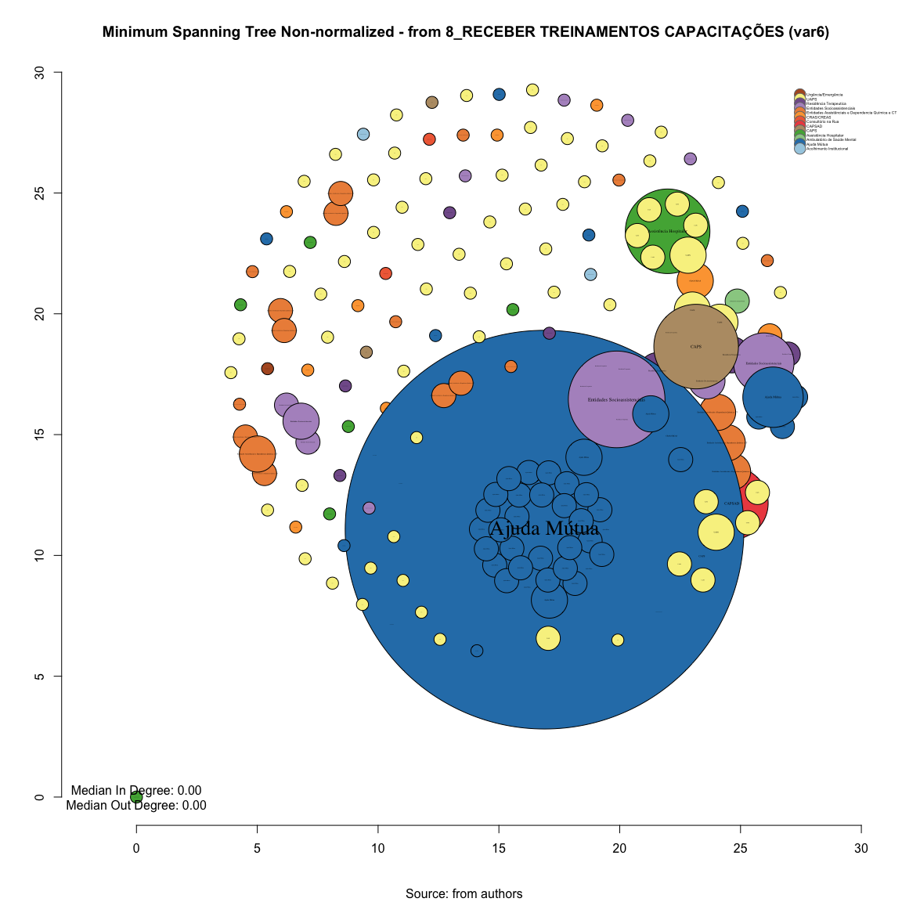
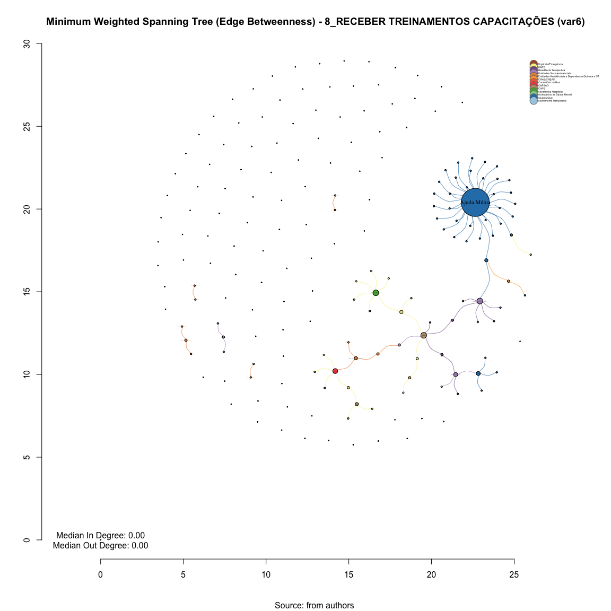

# SNA Minimum Spanning Tree 8_RECEBER TREINAMENTOS CAPACITAÇÕES (var6)
Leonardo Martins  
17 de julho de 2016  
SNA Descritive Analysis from "Projeto Redes de Atenção às pessoas que consomem álcool e outras Drogas em Juiz de Fora-MG   Brazil"  - SNArRDJF

Here you can find a basic script to analysis data from SNArRDJF - this script was elaborated considering its use for orther matrix adjacency data from SNArRDJF - Here we are going to analyse:

# 8_RECEBER TREINAMENTOS CAPACITAÇÕES (var6)

`#########################
`# Basic Preparation #####
`#########################

#Loading objects generated with previous script 

```r
rm(list = ls()) # removing previous objects to be sure that we don't have objects conflicts name
load("~/SNArRDJF/Robject/7_hits_var6.RData")
```
##Reload packages

```r
suppressMessages(library(RColorBrewer))
suppressMessages(library(car))
suppressMessages(library(xtable))
suppressMessages(library(igraph))
suppressMessages(library(miniCRAN))
suppressMessages(library(magrittr))
suppressMessages(library(keyplayer))
suppressMessages(library(dplyr))
suppressMessages(library(feather))
suppressMessages(library(visNetwork))
suppressMessages(library(knitr))
suppressMessages(library(DT))
```
##Adding phantom tools

```r
#In order to get dinamic javascript object install those ones. If you get problems installing go to Stackoverflow.com and type your error to discover what to do. In some cases the libraries need to be intalled in outside R libs.
#devtools::install_github("wch/webshot")
#webshot::install_phantomjs()
```
##Setting a random seed - this is a good strategy to keep the same graph pattern layout in a new report generation

```r
set.seed(123)
```

##Simplify Graph - removing loops and duble edges 

```r
#var6<-simplify(var6) #Simplify
```

#Minimum spanning tree non-normalized that connects all the vertices together with the minimal total edges

```r
set.seed(123)
#Creating Minimum spanning tree
msp_var6<-mst(var6)

#Plotting based only on degree measures 
edge.start <- ends(msp_var6, es=E(msp_var6), names=F)[,1]

# Fixing ego
minC <- rep(-Inf, vcount(msp_var6))
maxC <- rep(Inf, vcount(msp_var6))
minC[1] <- maxC[1] <- 0
co <- layout_with_fr(msp_var6, niter=10^4, minx=minC, maxx=maxC,miny=minC, maxy=maxC, weights=E(msp_var6)$var6)

#Plotting
plot(msp_var6, 
     layout=co,
     edge.color=V(msp_var6)$color[edge.start],
     edge.arrow.size=(degree(msp_var6)+1)/500,
     edge.width=E(msp_var6)$var6/10*mean(E(msp_var6)$var6),
     edge.curved = TRUE,
     vertex.color=V(msp_var6)$color,
     vertex.size=(degree(msp_var6)+1)*50,
     vertex.frame.color="black",
     vertex.label.color="black",
     vertex.label=get.vertex.attribute(msp_var6,"LABEL_COR"),
     vertex.label.cex=(degree(msp_var6)+1)/20,
     vertex.label.dist=0,
     rescale=F,
     xlim=range(co[,1]), 
     ylim=range(co[,2])
     )
axis(1)
axis(2)

#Solving Problems with legend rendering 
a<-V(msp_var6)$LABEL_COR
b<-V(msp_var6)$color
c<-table(a,b)
d<-as.data.frame(c)
e<-subset(d, d$Freq>0)
e<-e[order(e$a,decreasing=T),] 
f<-t(e$a)
g<-t(e$b)

#Adding Legend
legend(x=range(co[,1])[2], 
       y=range(co[,2])[2],
       legend=as.character(f),
       pch=21,
       col = "#777777", 
       pt.bg=as.character(g),
       pt.cex=2,
       bty="n", 
       ncol=1,
       lty=1,
       cex = .3)

#Adding Title
  title("Minimum Spanning Tree Non-normalized - from 8_RECEBER TREINAMENTOS CAPACITAÇÕES (var6)", sub = "Source: from authors ")
  text( 
    x=range(co[,1])[1],
    y=range(co[,2])[1], 
      labels =    sprintf("Median In Degree: %.2f\nMedian Out Degree: %.2f",
     median(degree(msp_var6, mode="in")), 
     median(degree(msp_var6, mode="out"))
             )
       )
```

<!-- -->
#Minimum weighted spanning tree that connects all the vertices together with the minimal total weighting for its edges. 

Atention: Weighted edges are considered here as barries as we are trying to find the easiest path with minimal weight - so here we are considering the inverse of weight (1/weight) as a proxy of "unacess" and/or "untrust" - I'm not sure if it will work but it would be cool to think in something like this  

```r
set.seed(123)
#Creating Minimum weighted spanning tree
msp_var6_w<-minimum.spanning.tree(var6, weights=1/(edge_betweenness(var6, weights=E(var6)$var6)+1))

#Plotting based only on degree measures 
edge.start <- ends(msp_var6_w, es=E(msp_var6_w), names=F)[,1]

# Fixing ego
minC <- rep(-Inf, vcount(msp_var6_w))
maxC <- rep(Inf, vcount(msp_var6_w))
minC[1] <- maxC[1] <- 0
co <- layout_with_fr(msp_var6_w, niter=10^4, minx=minC, maxx=maxC,miny=minC, maxy=maxC, weights =E(msp_var6_w)$var6)

#Plotting based only on degree measures 
plot(msp_var6_w, 
     layout=co,
     edge.color=V(msp_var6_w)$color[edge.start],
     edge.arrow.size=(degree(msp_var6_w)+1)/500,
     edge.width=0.2+1/(E(msp_var6_w)$var6+1),
     edge.curved = TRUE,
     vertex.color=V(msp_var6_w)$color,
     vertex.size=(degree(msp_var6_w)+1)*5,
     vertex.frame.color="black",
     vertex.label.color="black",
     vertex.label=get.vertex.attribute(msp_var6_w,"LABEL_COR"),
     vertex.label.cex=(degree(msp_var6_w)+1)/50,
     vertex.label.dist=0,
     rescale=F,
     xlim=range(co[,1]), 
     ylim=range(co[,2])
     )
axis(1)
axis(2)

#Solving Problems with legend rendering 
a<-V(msp_var6_w)$LABEL_COR
b<-V(msp_var6_w)$color
c<-table(a,b)
d<-as.data.frame(c)
e<-subset(d, d$Freq>0)
e<-e[order(e$a,decreasing=T),] 
f<-t(e$a)
g<-t(e$b)

#Adding Legend
legend(x=range(co[,1])[2], 
       y=range(co[,2])[2],
       legend=as.character(f),
       pch=21,
       col = "#777777", 
       pt.bg=as.character(g),
       pt.cex=2,
       bty="n", 
       ncol=1,
       lty=1,
       cex = .3)

#Adding Title
  title("Minimum Weighted Spanning Tree (Edge Betweenness) - 8_RECEBER TREINAMENTOS CAPACITAÇÕES (var6)", sub = "Source: from authors ")
  text( 
    x=range(co[,1])[1],
    y=range(co[,2])[1], 
   sprintf("Median In Degree: %.2f\nMedian Out Degree: %.2f",
     median(degree(msp_var6_w, mode="in")), 
     median(degree(msp_var6_w, mode="out"))
             ))
```

<!-- -->


#Saving objects with new variables and changes

```r
save.image("~/SNArRDJF/Robject/8_spanning_tree_var6.RData") 
```

