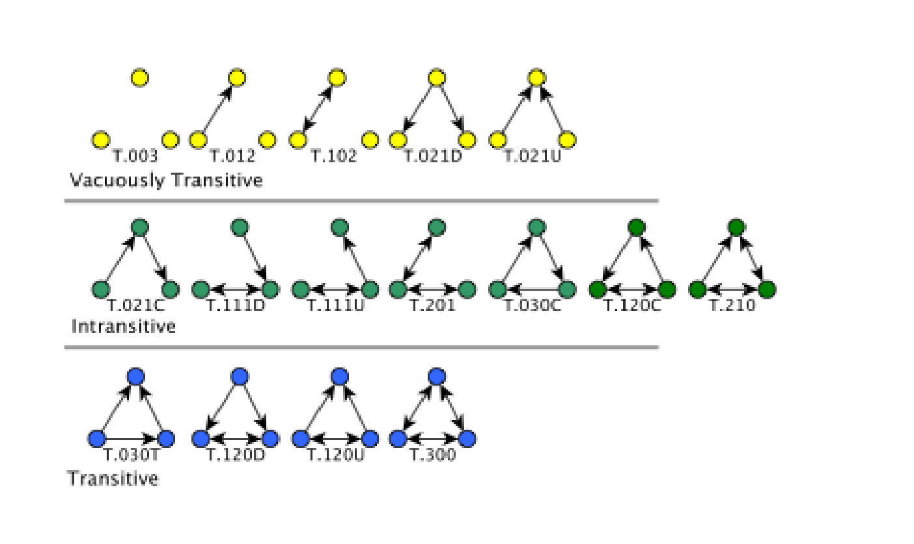

SNA Descritive Analysis from "Projeto Redes de Atenção às pessoas que consomem álcool e outras Drogas em Juiz de Fora-MG   Brazil"  - SNArRDJF

Here you can find a basic script to analysis data from SNArRDJF - this script was elaborated considering its use for orther matrix adjacency data from SNArRDJF - Here we are going to analyse:

# 9_ACESSO A) Este serviço mostra-se disponível para realização de ativades em conjunto. (var7)

`#########################
`# Basic Preparation #####
`#########################

#Loading objects generated with previous script 
```{r, echo=TRUE, fig.height=12, fig.width=12, message=FALSE, warning=FALSE}
rm(list = ls()) # removing previous objects to be sure that we don't have objects conflicts name
load("~/SNArRDJF/Robject/8_spanning_tree_var7.RData")
```
##Reload packages
```{r, message=TRUE, warning=TRUE}
suppressMessages(library(RColorBrewer))
suppressMessages(library(car))
suppressMessages(library(xtable))
suppressMessages(library(igraph))
suppressMessages(library(miniCRAN))
suppressMessages(library(magrittr))
suppressMessages(library(keyplayer))
suppressMessages(library(dplyr))
suppressMessages(library(feather))
suppressMessages(library(visNetwork))
suppressMessages(library(knitr))
suppressMessages(library(DT))
```
##Adding phantom tools
```{r, message=TRUE, warning=TRUE}
#In order to get dinamic javascript object install those ones. If you get problems installing go to Stackoverflow.com and type your error to discover what to do. In some cases the libraries need to be intalled in outside R libs.
#devtools::install_github("wch/webshot")
#webshot::install_phantomjs()
```
##Setting a random seed - this is a good strategy to keep the same graph pattern layout in a new report generation
```{r, message=TRUE, warning=TRUE}
set.seed(123)
```

##Simplify Graph - removing loops and duble edges 
```{r, echo=T, message=FALSE, warning=FALSE}
#var7<-simplify(var7) #Simplify
```

#Reciprocity Default
Reciprocity Default - Proportion of mutual connections - probability that hte opposite counterpart of a directed graph is also included
```{r, echo=TRUE, fig.height=12, fig.width=12, message=FALSE, warning=FALSE}
reciprocity(var7, mode="default")
```

#Reciprocity Ratio
Reciprocity Ratio - Probability  of mutual connections between a vertex pair - if we know - probability that hte opposite counterpart of a directed graph is also included in the 
```{r, echo=TRUE, fig.height=12, fig.width=12, message=FALSE, warning=FALSE}
reciprocity(var7, mode="ratio")
```

#Dyad Census
A dyad consists of an unordered pair of actors and links that exist between two actors of the pair classified by mutal non-mutual and no connection in a directed graphs

Dyads are 2-subgraphs where a subgraph is a subset of actors taken from the complete set of network actors and all links
between them. See more here <http://file.scirp.org/pdf/SN_2013012915270187.pdf>

##Dyad Census 
Number of pairs with mutual connections "mut" and number of pairs with non-mutual connections "asym"
```{r, echo=TRUE, fig.height=12, fig.width=12, message=FALSE, warning=FALSE}
dyad.census_var7<-dyad.census(var7)
```
##Mutual connections.
```{r, echo=TRUE, fig.height=12, fig.width=12, message=FALSE, warning=FALSE}
dyad.census_var7_mut<-dyad.census_var7$mut
dyad.census_var7_mut
```
##Non-mutual connections.
```{r, echo=TRUE, fig.height=12, fig.width=12, message=FALSE, warning=FALSE}
dyad.census_var7_asym<-dyad.census_var7$asym
dyad.census_var7_asym
```
##No connection between them.
```{r, echo=TRUE, fig.height=12, fig.width=12, message=FALSE, warning=FALSE}
dyad.census_var7_null<-dyad.census_var7$null
dyad.census_var7_null
```
#Triad Census - Check this out in order to understand triad lables

The studies about transitivity in social networks led Holland and Leinhardt (1975) to propose that the local structure in social networks can be expressed by the triad census or triad count, the numbers of triads of any kinds.

You can see more here:
<http://www.stats.ox.ac.uk/~snijders/Trans_Triads_ha.pdf>

```{r, echo=TRUE, fig.height=12, fig.width=12, message=FALSE, warning=FALSE}
#Triad Census 
tc_var7 <- triad.census(var7)

#Triad Census Label 
census_labels = c('T.003',
                  'T.012',
                  'T.102',
                  'T.021D',
                  'T.021U',
                  'T.021C',
                  'T.111D',
                  'T.111U',
                  'T.030T',
                  'T.030C',
                  'T.201',
                  'T.120D',
                  'T.120U',
                  'T.120C',
                  'T.210',
                  'T.300')

ordering = c('1',
                  '2',
                  '3',
                  '4',
                  '5',
                  '6',
                  '7',
                  '8',
                  '13',
                  '10',
                  '9',
                  '14',
                  '15',
                  '11',
                  '12',
                  '16')

#Saving in a dataframe for further studies
triad_df_var7 <- data.frame(census_labels,tc_var7)
write.csv(triad_df_var7, "~/SNArRDJF/Banco Redes R/var7_complet_triads.csv")
```
##Triad Census Types 
The following labels gives the 16 different triads for directed graphs. The coding refers to the numbers of mutual, asymmetric, and null dyads, with a further identifying letter: Up, Down, Cyclical, Transitive.

E.g., 1-2-0-D has *1* mutual, *2* asymmetric, *0* null dyads, and the *Down* orientation.

###Describing triads

```{r, echo=TRUE, fig.height=12, fig.width=12, message=FALSE, warning=FALSE}
triad_df_var7
```

###Triads Tables Recoding
```{r}
#Recoding different types of triads 
triad_df_var7$type[triad_df_var7$census_labels=="T.003"]<-"Vacuously Transitive"
triad_df_var7$type[triad_df_var7$census_labels=="T.012"]<-"Vacuously Transitive"
triad_df_var7$type[triad_df_var7$census_labels=="T.102"]<-"Vacuously Transitive"
triad_df_var7$type[triad_df_var7$census_labels=="T.021D"]<-"Vacuously Transitive"
triad_df_var7$type[triad_df_var7$census_labels=="T.021U"]<-"Vacuously Transitive"
triad_df_var7$type[triad_df_var7$census_labels=="T.021C"]<-"Intransitive"
triad_df_var7$type[triad_df_var7$census_labels=="T.111D"]<-"Intransitive"
triad_df_var7$type[triad_df_var7$census_labels=="T.111U"]<-"Intransitive"
triad_df_var7$type[triad_df_var7$census_labels=="T.030T"]<-"Transitive"
triad_df_var7$type[triad_df_var7$census_labels=="T.030C"]<-"Intransitive"
triad_df_var7$type[triad_df_var7$census_labels=="T.201"]<-"Intransitive"
triad_df_var7$type[triad_df_var7$census_labels=="T.120D"]<-"Transitive"
triad_df_var7$type[triad_df_var7$census_labels=="T.120U"]<-"Transitive"
triad_df_var7$type[triad_df_var7$census_labels=="T.120C"]<-"Intransitive"
triad_df_var7$type[triad_df_var7$census_labels=="T.210"]<-"Intransitive"
triad_df_var7$type[triad_df_var7$census_labels=="T.300"]<-"Transitive"
```

Graphical Ilustration 



###Triads Tables
```{r}
datatable(triad_df_var7)
```

#Transitivity - clustering coefficient

##Transitivity Global
Socialnetwork is treated as an undirected network global - ratio of triangles (direction disregarded) to connected triples.

```{r, echo=TRUE, fig.height=12, fig.width=12, message=FALSE, warning=FALSE}
transitivity(var7, type="global")
```

# Transitivity Local
Ratio of triangles to connected triples each vertex is part of.
```{r, echo=TRUE, fig.height=12, fig.width=12, message=FALSE, warning=FALSE}
V(var7)$transitivity_local<-transitivity(var7, type="local") 
var7_transitivity_local<-transitivity(var7, type="local") #local - ratio of triangles to connected triples each vertex is part of.
```
#Descriptive Statistics for Local Transitivity by Vertex 
```{r, echo=TRUE, fig.height=12, fig.width=12, message=FALSE, warning=FALSE}
summary(var7_transitivity_local[which(var7_transitivity_local != Inf)])
sd(var7_transitivity_local[which(var7_transitivity_local != Inf)])
```

#Barrat's Weighted Transitivity by Edges (Barrat's)
```{r, echo=TRUE, fig.height=12, fig.width=12, message=FALSE, warning=FALSE}
V(var7)$transitivity_barrat<-transitivity(var7, weights=E(var7)$weight, type="barrat")

var7_transitivity_barrat<-transitivity(var7, weights=E(var7)$weight, type="barrat")
```

#Descriptive Statistics for Barrat Weighted Transitivity by Vertex 
```{r, echo=TRUE, fig.height=12, fig.width=12, message=FALSE, warning=FALSE}
summary(var7_transitivity_barrat[which(var7_transitivity_barrat != Inf)])
sd(var7_transitivity_barrat[which(var7_transitivity_barrat != Inf)])
```

#Transitivity  Measures Dinamic Table
```{r, echo=T, fig.height=12, fig.width=12, message=FALSE, warning=FALSE}
#Getting  Measures

var7_transitivity_local<-transitivity(var7, type="local") %>% round(3)

var7_transitivity_barrat<-transitivity(var7, weights=E(var7)$weight, type="barrat") %>% round(3)

#Creating a datagrame of measures
var7_transitivity_df <- data.frame(var7_transitivity_local,var7_transitivity_barrat) %>% round(3)

#Adding type
var7_transitivity_df <-cbind(var7_transitivity_df, V(var7)$LABEL_COR)

#Adding names
names(var7_transitivity_df) <- c("Local", "Barrat's Weighted","Type")

#Ordering Variables
var7_transitivity_df<-var7_transitivity_df[c("Type", "Local", "Barrat's Weighted")]
```
## General tabel - DT 
```{r, echo=T, fig.height=12, fig.width=12, message=FALSE, warning=FALSE}
datatable(var7_transitivity_df, filter = 'top')
```

##Aggregating data from previous table - mean
```{r, echo=T, fig.height=12, fig.width=12, message=FALSE, warning=FALSE}
aggdata_mean <-aggregate(var7_transitivity_df, by=list(var7_transitivity_df$Type), FUN=mean, na.rm=TRUE)

names(aggdata_mean) <- c("Group","Type","Local(M)", "Barrat's Weighted(M)")
  
#Removing Type variable
aggdata_mean<-aggdata_mean[,-c(2)]
```
##Aggregating data from previous table - sd
```{r, echo=T, fig.height=12, fig.width=12, message=FALSE, warning=FALSE}
aggdata_sd <-aggregate(var7_transitivity_df, by=list(var7_transitivity_df$Type), FUN=sd, na.rm=TRUE) 

names(aggdata_sd) <- c("Group","Type","Local(SD)", "Barrat's Weighted(SD)")

#Removing Type variable
aggdata_sd<-aggdata_sd[,-c(2)]
```
##Merging mean and standart deviation
```{r, echo=T, fig.height=12, fig.width=12, message=FALSE, warning=FALSE}
total_table <- merge(aggdata_mean,aggdata_sd,by="Group")

#Rounding
Group<-total_table[,c(1)] #Keeping group
total_table<-total_table[,-c(1)] %>% round(3) #Rouding
total_table<-cbind(Group,total_table) #Binding toghter

#Organizing Variabels
total_table<-total_table[c("Group","Local(M)","Local(SD)", "Barrat's Weighted(M)","Barrat's Weighted(SD)")]
```
##Final table with round - Transitivity
```{r, echo=T, fig.height=12, fig.width=12, message=FALSE, warning=FALSE}
datatable(total_table, filter = 'top')
```

#Saving objects with new variables and changes
```{r, echo=T, fig.height=12, fig.width=12, message=FALSE, warning=FALSE}
save.image("~/SNArRDJF/Robject/9_dyad_triad_var7.RData") 
```


