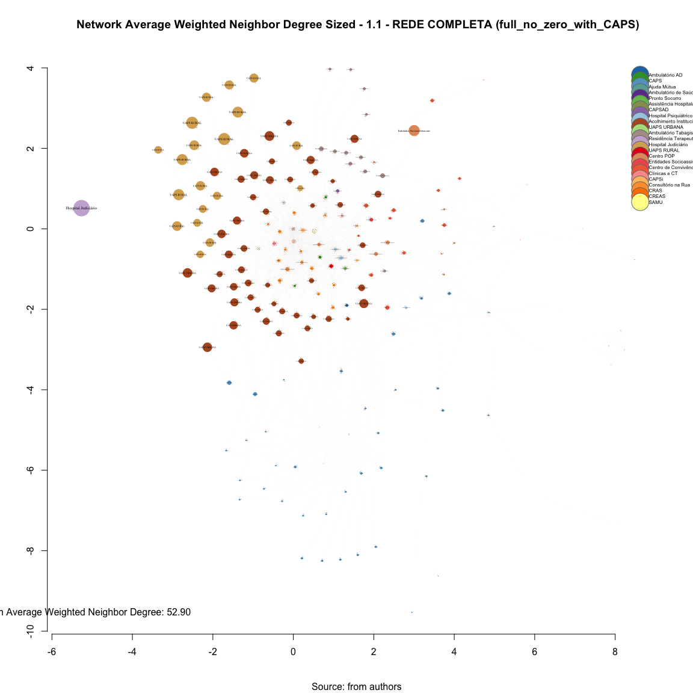
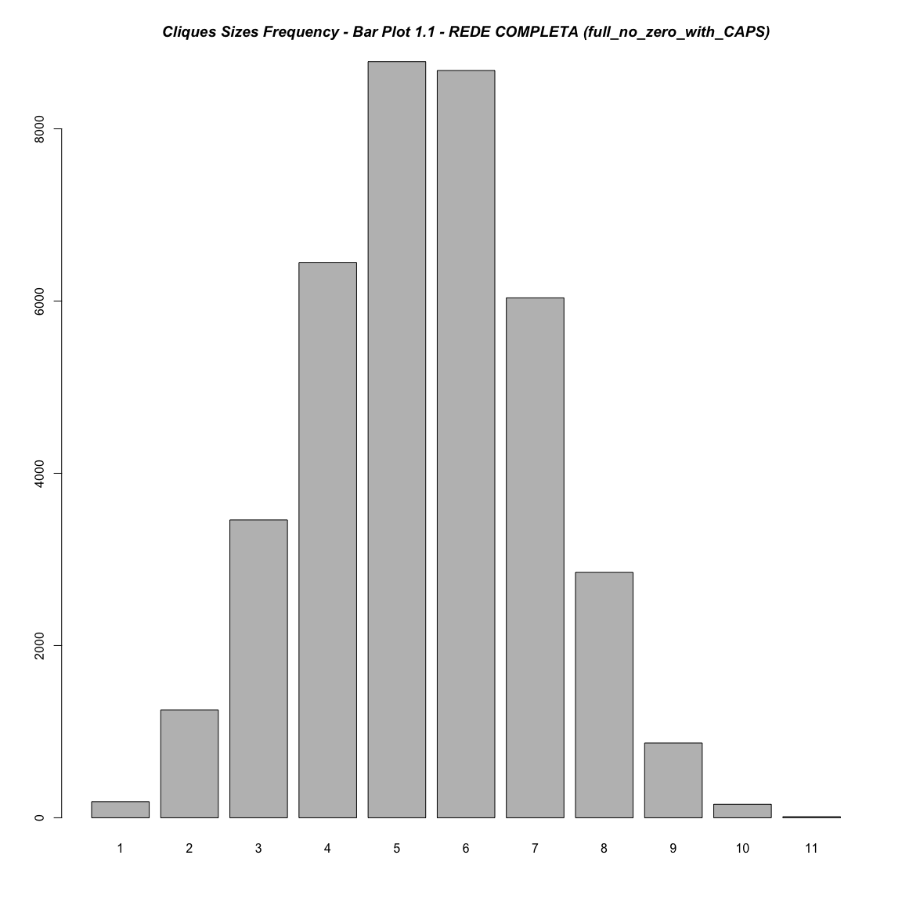

# SNA Interactive Plotting 1.1 - REDE COMPLETA (full_no_zero_with_CAPS)
Leonardo Martins  
17 de julho de 2016  
SNA Descritive Analysis from "Projeto Redes de Atenção às pessoas que consomem álcool e outras Drogas em Juiz de Fora-MG   Brazil"  - SNArRDJF

Here you can find a basic script to analysis data from SNArRDJF - this script was elaborated considering its use for orther matrix adjacency data from SNArRDJF - Here we are going to analyse:

# 1.1 - REDE COMPLETA (full_no_zero_with_CAPS)

`#########################
`# Basic Preparation #####
`#########################

##Loading objects generated with 1.Principal.Rmd Script - Please run this script only after run 1.Principal.Rmd

##Reload packages

```r
suppressMessages(library(RColorBrewer))
suppressMessages(library(car))
suppressMessages(library(xtable))
suppressMessages(library(igraph))
suppressMessages(library(magrittr))
suppressMessages(library(keyplayer))
suppressMessages(library(dplyr))
suppressMessages(library(visNetwork))
suppressMessages(library(knitr))
suppressMessages(library(DT))
```
##Adding phantom tools

```r
#In order to get dinamic javascript object install those ones. If you get problems installing go to Stackoverflow.com and type your error to discover what to do. In some cases the libraries need to be intalled in outside R libs.
#devtools::install_github("wch/webshot")
#webshot::install_phantomjs()
```
##Setting a random seed - this is a good strategy to keep the same graph pattern layout in a new report generation

```r
set.seed(123)
```


#Removing CAPS AD - not here

```r
#full_no_zero_without_CAPS<-delete_vertices(full_no_zero,V(full_no_zero)[V2_LABEL_ID=="q170_CAPS...CAPS.AD"])
full_no_zero_with_CAPS<-full_no_zero
```

##Vertices and Edges Number

```r
#1. Vertices and Edges
full_no_zero_with_CAPS_vcount<-vcount(full_no_zero_with_CAPS)
full_no_zero_with_CAPS_ecount<-ecount(full_no_zero_with_CAPS)
```
##Vertice Number
Each vertice represents a service - named as an actor in our network

```r
vcount(full_no_zero_with_CAPS)
```

```
## [1] 187
```
##Edge Number
Each edge represents a connection between two services named as a tie

```r
ecount(full_no_zero_with_CAPS)
```

```
## [1] 1580
```

#Density - The proportion of present edges from all possible edges in the network.
The density of a binary network is simply the proportion of all possible ties that are actually present.

For a valued network, density is defined as the sum of the ties divided by the number of possible ties (i.e. the ratio of all tie strength that is actually present to the number of possible ties).  

The density of a network may give us insights into such phenomena as the speed at which information diffuses among the nodes, and the extent to which actors have high levels of social capital and/or social constraint.


##Edge Density
The density of a graph is the ratio of the number of edges and the number of possible edges.

```r
edge_density_full_no_zero_with_CAPS<-edge_density(full_no_zero_with_CAPS) #The proportion of present edges from all possible edges in the network.
edge_density_full_no_zero_with_CAPS
```

```
## [1] 0.04542579
```
##Edge connectivity - Adhesion
The edge connectivity of a graph or two vertices, this is recently also called group adhesion.

```r
edge_connectivity(full_no_zero_with_CAPS, source =NULL, target =NULL, checks = T) #source and target can be replaced - their are here just as default
```

```
## [1] 0
```
###Adhesion example
In order to use this we need to call source and target using the number of each vertex instead of the name - type in R to get numbers


```r
#Names and numbers

# list all if you have no idea about services id
# V(full_no_zero_with_CAPS)$name 

# list all three first (you can use c(1:3))
V(full_no_zero_with_CAPS)$name[1]  # just as an example
```

```
## [1] "ASS_HOS_ Hospital de Pronto Socorro – HPS"
```

```r
V(full_no_zero_with_CAPS)$name[2]  # just as an example
```

```
## [1] "AMB_SAM_ Centro de Atenção à Saúde Mental (CASM)"
```

```r
V(full_no_zero_with_CAPS)$name[3]  # just as an example
```

```
## [1] "CAPS_AD"
```

```r
# list by others id's
V(full_no_zero_with_CAPS)$name[6]  # just as an example
```

```
## [1] "CRE_SOC_ CREAS Norte"
```

```r
V(full_no_zero_with_CAPS)$name[150]  # just as an example
```

```
## [1] "UAP_RUR_ Buiéié"
```

```r
V(full_no_zero_with_CAPS)$name[185]  # just as an example
```

```
## [1] "AJU_MUT_ Grupo A.A. Liberdade"
```
##Edge Connectivity - "CAPS_AD"==3 and "UAPS RURAL Buiéié"==150
Point connection calculates the number of nodes that would have to be removed in order for one actor to no longer be able to reach another.  If there are many different pathways that connect two actors, they have high "connectivity" in the sense that there are multiple ways for a signal to reach from one to the other - lower number - worse resilience 


```r
edge_connectivity(full_no_zero_with_CAPS, source =150, target =3, checks = T) 
```

```
## [1] 1
```

#Vertex Connectivity - Group Cohesion

It is the minimum number of vertices needed to remove to make the graph not strongly connected. (If the graph is not strongly connected then this is zero.). The cohesion of a graph (as defined by White and Harary, see references), is the vertex connectivity of the graph. This is calculated by cohesion.

These three functions essentially calculate the same measure(s), more precisely vertex_connectivity is the most general, the other two are included only for the ease of using more descriptive function names.


```r
vertex_connectivity(full_no_zero_with_CAPS, source = NULL, target = NULL, checks = TRUE)
```

```
## [1] 0
```

##Cohesion example

In order to use this we need to call source and target using the number of each vertex instead of the name - type in R to get numbers - see example above for more details 

##Vertex Connectivity - "CRE_SOC_ CREAS Norte"==6 and "AJU_MUT_ Grupo A.A. Liberdade" ==185
Minimum number of vertices needed to remove to make the vertex not connected by any vertex - it leads an error in case of using two connected vertex 

```r
vertex_connectivity(full_no_zero_with_CAPS, source =6, target =185, checks = T) 
```

```
## [1] 4
```

#Centrality Measures

• For undirected graphs:

– Actor centrality - involvement (connections) with other actors

• For directed graphs:

– Actor centrality - source of the ties (outgoing edges)

– Actor prestige - recipient of many ties (incoming edges)

In general - high centrality degree means direct contact with many other actors

##Centrality Degree (number of ties/nearest neighbors).

##Saving in igrpah object

```r
V(full_no_zero_with_CAPS)$full_no_zero_indegree<-degree(full_no_zero_with_CAPS, mode = "in") # Actor prestige - recipient of many ties (incoming edges)
V(full_no_zero_with_CAPS)$full_no_zero_outdegree <- degree(full_no_zero_with_CAPS, mode = "out") # Actor centrality - source of the ties (outgoing edges)
V(full_no_zero_with_CAPS)$full_no_zero_totaldegree <- degree(full_no_zero_with_CAPS, mode = "total")
```
##Saving in Global Environment as an object

```r
full_no_zero_with_CAPS_indegree<-degree(full_no_zero_with_CAPS, mode = "in")
full_no_zero_with_CAPS_outdegree<-degree(full_no_zero_with_CAPS, mode = "out")
full_no_zero_with_CAPS_totaldegree<-degree(full_no_zero_with_CAPS, mode = "total")
```

#Centrality Degree Descriptive Statistics - non-normalized

##Centrality Degree Descriptive Statistics - In

```r
##in
summary(full_no_zero_with_CAPS_indegree)
```

```
##    Min. 1st Qu.  Median    Mean 3rd Qu.    Max. 
##   0.000   4.000   5.000   8.449   9.000 106.000
```

```r
sd(full_no_zero_with_CAPS_indegree)
```

```
## [1] 10.84105
```
##Histogram full_no_zero_with_CAPS degree - In

```r
hist(degree(full_no_zero_with_CAPS, mode = "in", normalized = F), ylab="Frequency", xlab="Degree",  breaks=vcount(full_no_zero_with_CAPS)/10, main="Histogram of Indegree Nodes - 1.1 - REDE COMPLETA (full_no_zero_with_CAPS)")
```

<!-- -->

##Centrality Degree Descriptive Statistics - Out

```r
##out
summary(full_no_zero_with_CAPS_outdegree)
```

```
##    Min. 1st Qu.  Median    Mean 3rd Qu.    Max. 
##   0.000   1.000   4.000   8.449   8.500 105.000
```

```r
sd(full_no_zero_with_CAPS_outdegree)
```

```
## [1] 13.98391
```

##Histogram full_no_zero_with_CAPS degree - Out

```r
hist(degree(full_no_zero_with_CAPS, mode = "out", normalized = F), ylab="Frequency", xlab="Degree",  breaks=vcount(full_no_zero_with_CAPS)/10, main="Histogram of Outdegree Nodes - 1.1 - REDE COMPLETA (full_no_zero_with_CAPS)")
```

<!-- -->

##Centrality Degree Descriptive Statistics - All

```r
##all
summary(full_no_zero_with_CAPS_totaldegree)
```

```
##    Min. 1st Qu.  Median    Mean 3rd Qu.    Max. 
##     1.0     5.0    10.0    16.9    18.0   211.0
```

```r
sd(full_no_zero_with_CAPS_totaldegree)
```

```
## [1] 23.45518
```
##Histogram full_no_zero_with_CAPS degree - All

```r
hist(degree(full_no_zero_with_CAPS, mode = "all", normalized = F), ylab="Frequency", xlab="Degree",  breaks=vcount(full_no_zero_with_CAPS)/10, main="Histogram of All Degree Nodes - 1.1 - REDE COMPLETA (full_no_zero_with_CAPS)")
```

<!-- -->

#Compute strength - weighted

A slightly more nuanced metric is “strength centrality”, which is defined as the sum of the weights of all the connections for a given node. This is also sometimes called “weighted degree centrality”

```r
V(full_no_zero_with_CAPS)$full_no_zero_strength<- strength(full_no_zero_with_CAPS, weights=E(full_no_zero_with_CAPS)$weight)
full_no_zero_strength<- strength(full_no_zero_with_CAPS, weights=E(full_no_zero_with_CAPS)$weight)
```
##Strength Stats

```r
summary(full_no_zero_strength)
```

```
##    Min. 1st Qu.  Median    Mean 3rd Qu.    Max. 
##     1.0     5.0    10.0    16.9    18.0   211.0
```

```r
sd(full_no_zero_strength)
```

```
## [1] 23.45518
```
##Histogram full_no_zero_with_CAPS degree - All

```r
hist(strength(full_no_zero_with_CAPS, weights=E(full_no_zero_with_CAPS)$weight), ylab="Frequency", xlab="Degree",  breaks=vcount(full_no_zero_with_CAPS)/10, main="Histogram of Strength Degree Nodes - 1.1 - REDE COMPLETA (full_no_zero_with_CAPS)")
```

<!-- -->

#Centrality Degree Normalized

##Centrality Degree Normalized saving igraph object

```r
V(full_no_zero_with_CAPS)$full_no_zero_indegree_n<-degree(full_no_zero_with_CAPS, mode = "in", normalized = T)
V(full_no_zero_with_CAPS)$full_no_zero_outdegree_n<- degree(full_no_zero_with_CAPS, mode = "out", normalized = T)
V(full_no_zero_with_CAPS)$full_no_zero_totaldegree_n<- degree(full_no_zero_with_CAPS, mode = "total", normalized = T)
```
##Saving in Global Environment as an object

```r
full_no_zero_with_CAPS_indegree_n<-degree(full_no_zero_with_CAPS, mode = "in", normalized = T)
full_no_zero_with_CAPS_outdegree_n<-degree(full_no_zero_with_CAPS, mode = "out", normalized = T)
full_no_zero_with_CAPS_totaldegree_n<-degree(full_no_zero_with_CAPS, mode = "total", normalized = T)
```
##Centrality Degree Normalized Descriptive Statistics - in

```r
summary(full_no_zero_with_CAPS_indegree_n)
```

```
##    Min. 1st Qu.  Median    Mean 3rd Qu.    Max. 
## 0.00000 0.02151 0.02688 0.04543 0.04839 0.56990
```

```r
sd(full_no_zero_with_CAPS_indegree_n)
```

```
## [1] 0.0582852
```
##Histogram full_no_zero_with_CAPS degree normalized - in

```r
hist(degree(full_no_zero_with_CAPS, mode = "in", normalized = T), ylab="Frequency", xlab="Normalized Degree",  breaks=vcount(full_no_zero_with_CAPS)/10, main="Histogram of Normalized Indegree Nodes - 1.1 - REDE COMPLETA (full_no_zero_with_CAPS)")
```

<!-- -->

##Centrality Degree Normalized Descriptive Statistics - out

```r
summary(full_no_zero_with_CAPS_outdegree_n)
```

```
##     Min.  1st Qu.   Median     Mean  3rd Qu.     Max. 
## 0.000000 0.005376 0.021510 0.045430 0.045700 0.564500
```

```r
sd(full_no_zero_with_CAPS_outdegree_n)
```

```
## [1] 0.07518233
```

##Histogram full_no_zero_with_CAPS degree normalized - out

```r
hist(degree(full_no_zero_with_CAPS, mode = "out", normalized = T), ylab="Frequency", xlab="Normalized Degree",  breaks=vcount(full_no_zero_with_CAPS)/10, main="Histogram of Normalized Outdegree Nodes - 1.1 - REDE COMPLETA (full_no_zero_with_CAPS)")
```

<!-- -->

##Centrality Degree Normalized Descriptive Statistics - all

```r
summary(full_no_zero_with_CAPS_totaldegree_n)
```

```
##     Min.  1st Qu.   Median     Mean  3rd Qu.     Max. 
## 0.005376 0.026880 0.053760 0.090850 0.096770 1.134000
```

```r
sd(full_no_zero_with_CAPS_totaldegree_n)
```

```
## [1] 0.1261031
```

##Histogram full_no_zero_with_CAPS degree normalized - all

```r
hist(degree(full_no_zero_with_CAPS, mode = "all", normalized = T), ylab="Frequency", xlab="Normalized Degree",  breaks=vcount(full_no_zero_with_CAPS)/10, main="Histogram of Normalized All Degree Nodes - 1.1 - REDE COMPLETA (full_no_zero_with_CAPS)")
```

<!-- -->

#Centralization Degree

```r
V(full_no_zero_with_CAPS)$full_no_zero_centr_degree <- centralization.degree(full_no_zero_with_CAPS)$res
full_no_zero_centr_degree <- centralization.degree(full_no_zero_with_CAPS)
```

##Centralization

```r
full_no_zero_centr_degree$centralization
```

```
## [1] 0.5245838
```
##Theoretical Max

```r
full_no_zero_centr_degree$theoretical_max
```

```
## [1] 69192
```

#Degree distribution considering total equal one

```r
full_no_zero_with_CAPS_degree.distribution<-degree.distribution(full_no_zero_with_CAPS)
```

##Degree distribution Descriptive Stats

```r
summary(full_no_zero_with_CAPS_degree.distribution)
```

```
##     Min.  1st Qu.   Median     Mean  3rd Qu.     Max. 
## 0.000000 0.000000 0.000000 0.004717 0.000000 0.107000
```

```r
sd(full_no_zero_with_CAPS_degree.distribution)
```

```
## [1] 0.01451276
```

##Histogram full_no_zero_with_CAPS distribution degree

```r
hist(degree.distribution(full_no_zero_with_CAPS), breaks=vcount(full_no_zero_with_CAPS)/10, ylab="Frequency", xlab="Degree Distribuition", main="Histogram of Degree Distribuition - 1.1 - REDE COMPLETA (full_no_zero_with_CAPS)")
```

<!-- -->

##Degree Probability Distribution

```r
dd <- degree.distribution(full_no_zero_with_CAPS, cumulative=T, mode="all")
```

##Degree Probability Distribution - Plot Cumulative Frequency

```r
plot(dd, pch=19, cex=1, col="orange", xlab="Degree", ylab="Cumulative Frequency", main= "Cumulative Frequency of 1.1 - REDE COMPLETA (full_no_zero_with_CAPS) ")
```

<!-- -->

#Log-Log Degree Distribution - Scale Free Network - Does it fit to power law ?

```r
dd.full_no_zero_with_CAPS <- degree.distribution(full_no_zero_with_CAPS)
d <- 1:max(degree(full_no_zero_with_CAPS))-1
ind <- (dd.full_no_zero_with_CAPS != 0)
```

##Plot Log-Log Degree Distribution

```r
plot(d[ind], 
     dd.full_no_zero_with_CAPS[ind], 
     log="xy", 
     col="blue",
     xlab=c("Log-Degree"), 
     ylab=c("Log-Intensity"),
     main="Log-Log Degree Distribution For 1.1 - REDE COMPLETA (full_no_zero_with_CAPS)"
     )
```

<!-- -->

#Average Neighbor Degree versus Vertex Degree (log-log scale for 1.1 - REDE COMPLETA (full_no_zero_with_CAPS))

The neighborhood of a given order y of a vertex v includes all vertices which are closer to v than the order. Ie. order y=0 is always v itself, order 1 is v plus its immediate neighbors, order 2 is order 1 plus the immediate neighbors of the vertices in order 1, etc.

##Simplify graph first 

```r
full_no_zero_with_CAPS_simplified<-simplify(full_no_zero_with_CAPS)
```

##Average Neighbor Degree versus vertex degree (log-log scale for full_no_zero_with_CAPS)

```r
full_no_zero_with_CAPS_a.nn.deg <- graph.knn(full_no_zero_with_CAPS_simplified, weights =E(full_no_zero_with_CAPS_simplified)$weight)$knn %>% round(1)
```

##Saving to igraph object

```r
V(full_no_zero_with_CAPS_simplified)$full_no_zero_with_CAPS_a.nn.deg <- graph.knn(full_no_zero_with_CAPS_simplified, weights=E(full_no_zero_with_CAPS_simplified)$weight)$knn
```

##Table Average Neighbor Degree

```r
d<-cbind(V(full_no_zero_with_CAPS_simplified)$LABEL_COR,full_no_zero_with_CAPS_a.nn.deg)
datatable(d)
```

<!--html_preserve--><div id="htmlwidget-49c968e2f00b87e48d74" style="width:100%;height:auto;" class="datatables html-widget"></div>
<script type="application/json" data-for="htmlwidget-49c968e2f00b87e48d74">{"x":{"filter":"none","data":[["ASS_HOS_ Hospital de Pronto Socorro – HPS","AMB_SAM_ Centro de Atenção à Saúde Mental (CASM)","CAPS_AD","CRAS_AS_ CRAS Sudeste Costa Carvalho","CRE_SOC_ CREAS Infância e Juventude","CRE_SOC_ CREAS Norte","ASS_HOS_ Serviço de Controle e Prevenção e Tratamento do Tabagismo (SECOPTT)","EA_DQCT_ Centro de Recuperação Resgatando Vidas (Escritório)","EA_DQCT_ Comunidade Terapêutica Geração de Adoradores – CTGA","EA_DQCT_ Centro de Recuperação Resgatando Vidas","CRAS_AS_ CRAS Norte Benfica","CRAS_AS_ CRAS Centro","EA_DQCT_ Associação Beneficente Cristã Restituir","ENT_SOC_ Território Aliança pela Vida  Zona Norte","UAP_URB_ Santa Cecília","RES_TER_ Casa V1","CRE_SOC_ CREAS Idoso e Mulher","URG_EME_ Serviço de Atendimento Móvel de Urgência (SAMU)","ENT_SOC_ Associação Beneficente e Cultural Amigos do Noivo (ABAN) (Matriz)","ASS_HOS_ Centro de Referência em Álcool e Drogas (RADCAS)  Hospital Universitário","CAPS_CO_ CAPS HU","EA_DQCT_ Grupo de Apoio à Família e aos Dependentes Químicos – GAFADEQUI.1","CAPS_CO_ CAPS IJ","AJU_MUT_ Escritório de Serviços Locais dos Álcoólicos Anônimos de Juiz de Fora","ENT_SOC_ Associação Beneficente e Cultural Amigos do Noivo (ABAN) Dom Bosco","AJU_MUT_ ALANON Grupo Harmonia","AJU_MUT_ ALANON Grupo Só Por Hoje","CAPS_CO_ CAPS Leste","CRAS_AS_ CRAS Leste São Benedito","CRAS_AS_ CRAS Nordeste Grama","CRAS_AS_ CRAS Leste Linhares","UAP_URB_ Parque Guarani","ACO_INS_ Casa da Cidadania","AJU_MUT_ Grupo A.A. Vinte e Cinco de Abril","CRAS_AS_ CRAS Sudeste Olavo Costa","EA_DQCT_ Grupo de Apoio à Família e aos Dependentes Químicos – GAFADEQUI","EA_DQCT_ Centro de Recuperação Juiz de Fora Contra as Drogas","RES_TER_ Casa 1","RES_TER_ Casa 7","ENT_SOC_ Associação Casa Viva","ACO_INS_ Núcleo Cidadão de Rua Hebert de Souza","CON_RUA_ Equipe de Consultório na Rua (UAPS de referência Vila Ideal)","CON_RUA_ Equipe de Consultório na Rua (Associação Casa Viva)","EA_DQCT_ Associação Projeto Amor e Restauração – APAR","ENT_SOC_ Casa São Camilo de Lelis","CRA_SOC_ CRAS Sul Ipiranga","AJU_MUT_ Grupo A.A. Ipiranga","RES_TER_ Casa V2","RES_TER_ Casa V3","RES_TER_ Casa V4","RES_TER_ Casa V5","RES_TER_ Casa V6","EA_DQCT_ Comunidade Terapêutica Família em Cristo","UAP_URB_ São Pedro","AJU_MUT_ Grupo A.A Primeiro Passo","CRAS_AS_ CRAS Oeste São Pedro","UAP_URB_ Alto Grajaú","AJU_MUT_ Pastoral da Sobriedade","AJU_MUT_ Grupo A.A Juiz de Fora (Sala de abordagem)","ASS_HOS_ Hospital Ana Nery","AJU_MUT_ Grupo A.A. Central","EA_DQCT_ Vila Verde (Unidade Bromélias)","UAP_URB_ Santo Antônio","UAP_URB_ Grama","EA_DQCT_ Centro de Recuperação SOS Vida","EA_DQCT_ Centro de Tratamento Deville","AJU_MUT_ NARANON Grupo Parque Halfeld","ENT_SOC_ Fundação Maria Mãe","ENT_SOC_ Grupo Espírita de Ajuda aos Enfermos (GEDAE)","UAP_URB_ Cidade do Sol","UAP_URB_ Bairro Industrial","UAP_URB_ Milho Branco","UAP_URB_ Nova Era","UAP_URB_ Santa Cruz","UAP_URB_ São Judas Tadeu","UAP_URB_ Marumbí","UAP_URB_ Progresso","CRE_SOC_ CREAS População de Rua (CentroPop)","AJU_MUT_ Grupo de Apoio Benfica de Amor Exigente (GABENAE)","AJU_MUT_ Grupo de Apoio São Mateus de Amor Exigente (GASMAE)","AJU_MUT_ Grupo de Amor Exigente Linhares","AJU_MUT_ Grupo de Amor Exigente Santa Terezinha","UAP_URB_ Furtado de Menezes","AJU_MUT_ Grupo A.A. Reunidos","AJU_MUT_ Grupo de Apoio São Pedro do Amor Exigente (GASPAE)","UAP_URB_ Jóquei Clube II","EA_DQCT_ Centro Metodista de Assistência aos Toxicômanos – CEMAT","EA_DQCT_ Centro Terapêutico Reconstruir (fazenda)","UAP_URB_ Bairro de Lourdes","UAP_URB_ Vila Olavo Costa","UAP_URB_ Cruzeiro do Sul","AJU_MUT_ Igreja Batista Resplandecente Estrela do Amanhã  IBREM","EA_DQCT_ Vila Verde (Unidade Borboleta)","ASS_HOS_ Clínica Vila Verde (Hospital Dia)","UAP_URB_ Ipiranga","EA_DQCT_ Centro Metodista de Assistência aos Toxicômanos – CEMAT (Escritório)","EA_DQCT_ Centro Terapêutico Reconstruir (escritório)","EA_DQCT_ Grupo de Apoio à Família e aos Dependentes Químicos – GAFADEQUI (Administração, triagem e apoio aos familiares)","UAP_URB_ Barreira do Triunfo","ASS_HOS_ Casa de Saúde Esperança","ENT_SOC_ Associação Beneficente e Cultural Amigos do Noivo (ABAN)","ENT_SOC_ Casa de Acolhimento à Infância e Adolescente (CAIA)","RES_TER_ Casa 3","RES_TER_ Casa 4","UAP_URB_ Filgueiras","UAP_URB_ Jardim da Lua","UAP_URB_ Granjas Betânea","RES_TER_ Casa 5","RES_TER_ Casa 6","UAP_URB_ Borboleta","UAP_URB_ Santos Dumont","UAP_RUR_ Igrejinha","UAP_URB_ Dom Bosco","UAP_URB_ Benfica","UAP_URB_ Jóquei Clube I","UAP_URB_ Nossa Senhora Aparecida","UAP_URB_ Santa Cândida/São Sebastião","UAP_URB_ São Benedito","UAP_URB_ Santa Efigênia","UAP_URB_ Santa Luzia","UAP_URB_ Bandeirantes","ENT_SOC_ Instituto Veredas (Projeto, Assessoria e Prática em Saúde Mental) // Serviço de Referência para Adolescentes do Instituto Veredas","UAP_RUR_ Monte Verde","UAP_RUR_ Pirapetinga","UAP_RUR_ Torreões","UAP_RUR_ Caeté","UAP_RUR_ Chapéu D'Uvas","UAP_RUR_ Humaitá","UAP_RUR_ Rosário de Minas","UAP_RUR_ Sarandira","UAP_RUR_ Toledos","UAP_RUR_ Valadares","UAP_URB_ Esplanada","UAP_URB_ Jardim Natal","UAP_URB_ Monte Castelo","UAP_URB_ Vila Esperança","UAP_URB_ Linhares","UAP_URB_ Santa Rita","UAP_URB_ Jardim Esperança","UAP_URB_ Retiro","UAP_URB_ Vila Ideal","UAP_URB_ Teixeiras","UAP_URB_ Vale Verde","UAP_URB_ Nossa Senhora das Graças","ENT_SOC_ ONG Saída","CAPS_CO_ CAPS Casa Viva","CEN_CON_ Associação TRABALHARTE","UAP_URB_ Centro Sul","ACO_INS_ Sociedade São Vicente de Paulo","UAP_RUR_ Buiéié","UAP_RUR_ Jacutinga","UAP_RUR_ Palmital","UAP_RUR_ Pires","UAP_RUR_ Privilégio","AJU_MUT_ Grupo N.A. Glória","AJU_MUT_ Grupo A.A. 29 de Junho","UAP_RUR_ Dias Tavares","UAP_RUR_ Paula Lima","UAP_RUR_ Penido","AJU_MUT_ ALANON Grupo Libertação","AJU_MUT_ GEVE","AJU_MUT_ Grupo A.A. Libertação","AJU_MUT_ Grupo N.A. Libertação","AJU_MUT_ NARANON Grupo Glória","AJU_MUT_ Grupo A.A. Azul e Branco","AJU_MUT_ NARANON Grupo Renascer","AJU_MUT_ Grupo A.A. Cidade do Sol","AJU_MUT_ Grupo A.A. Caminho Da Salvação","AJU_MUT_ Grupo A.A. Dois de Março","AJU_MUT_ Grupo A.A. Corrente da Sobriedade","AJU_MUT_ Grupo A.A. Milho Branco","AJU_MUT_ Grupo A.A. Luz Divina","AJU_MUT_ Grupo A.A. Nova Era","AJU_MUT_ Grupo A.A União","AJU_MUT_ Grupo A.A. Bairu","AJU_MUT_ Grupo N.A. Caminho Verdade","AJU_MUT_ Grupo A.A. Bonfim","AJU_MUT_ Grupo A.A. Linhares","AJU_MUT_ Grupo A.A Redenção Abolição","AJU_MUT_ Grupo A.A. Progresso","AJU_MUT_ Grupo A.A. Estrela D´Alva","AJU_MUT_ Grupo A.A. Primeira Tradição","AJU_MUT_ Grupo A.A. Estrela do Oriente","AJU_MUT_ Grupo A.A Duas Vidas","AJU_MUT_ Grupo A.A. Liberdade","AJU_MUT_ Grupo N.A Rendição","ASS_HOS_ Hospital de Toxicômanos"],["Pronto Socorro","Ambulatório de Saúde Mental","CAPSAD","CRAS","CREAS","CREAS","Ambulatório Tabagismo","Clínicas e CT","Clínicas e CT","Clínicas e CT","CRAS","CRAS","Clínicas e CT","Consultório na Rua","UAPS URBANA","Residência Terapeutica","CREAS","SAMU","Entidades Socioassistenciais","Ambulatório AD","CAPS","Clínicas e CT","CAPSi","Ajuda Mútua","Entidades Socioassistenciais","Ajuda Mútua","Ajuda Mútua","CAPS","CRAS","CRAS","CRAS","UAPS URBANA","Acolhimento Institucional","Ajuda Mútua","CRAS","Clínicas e CT","Clínicas e CT","Residência Terapeutica","Residência Terapeutica","Entidades Socioassistenciais","Acolhimento Institucional","Consultório na Rua","Entidades Socioassistenciais","Clínicas e CT","Entidades Socioassistenciais","CRAS","Ajuda Mútua","Residência Terapeutica","Residência Terapeutica","Residência Terapeutica","Residência Terapeutica","Residência Terapeutica","Clínicas e CT","UAPS URBANA","Ajuda Mútua","CRAS","UAPS URBANA","Ajuda Mútua","Ajuda Mútua","Assistência Hospitalar","Ajuda Mútua","Clínicas e CT","UAPS URBANA","UAPS URBANA","Clínicas e CT","Clínicas e CT","Ajuda Mútua","Entidades Socioassistenciais","Entidades Socioassistenciais","UAPS URBANA","UAPS URBANA","UAPS URBANA","UAPS URBANA","UAPS URBANA","UAPS URBANA","UAPS URBANA","UAPS URBANA","Centro POP","Ajuda Mútua","Ajuda Mútua","Ajuda Mútua","Ajuda Mútua","UAPS URBANA","Ajuda Mútua","Ajuda Mútua","UAPS URBANA","Clínicas e CT","Clínicas e CT","UAPS URBANA","UAPS URBANA","UAPS URBANA","Ajuda Mútua","Clínicas e CT","Clínicas e CT","UAPS URBANA","Clínicas e CT","Clínicas e CT","Clínicas e CT","UAPS URBANA","Hospital Psiquiátrico","Entidades Socioassistenciais","Entidades Socioassistenciais","Residência Terapeutica","Residência Terapeutica","UAPS URBANA","UAPS URBANA","UAPS URBANA","Residência Terapeutica","Residência Terapeutica","UAPS URBANA","UAPS URBANA","UAPS RURAL","UAPS URBANA","UAPS URBANA","UAPS URBANA","UAPS URBANA","UAPS URBANA","UAPS URBANA","UAPS URBANA","UAPS URBANA","UAPS URBANA","Entidades Socioassistenciais","UAPS RURAL","UAPS RURAL","UAPS RURAL","UAPS RURAL","UAPS RURAL","UAPS RURAL","UAPS RURAL","UAPS RURAL","UAPS RURAL","UAPS RURAL","UAPS URBANA","UAPS URBANA","UAPS URBANA","UAPS URBANA","UAPS URBANA","UAPS URBANA","UAPS URBANA","UAPS URBANA","UAPS URBANA","UAPS URBANA","UAPS URBANA","UAPS URBANA","Entidades Socioassistenciais","CAPS","Centro de Convivência","UAPS URBANA","Acolhimento Institucional","UAPS RURAL","UAPS RURAL","UAPS RURAL","UAPS RURAL","UAPS RURAL","Ajuda Mútua","Ajuda Mútua","UAPS RURAL","UAPS RURAL","UAPS RURAL","Ajuda Mútua","Ajuda Mútua","Ajuda Mútua","Ajuda Mútua","Ajuda Mútua","Ajuda Mútua","Ajuda Mútua","Ajuda Mútua","Ajuda Mútua","Ajuda Mútua","Ajuda Mútua","Ajuda Mútua","Ajuda Mútua","Ajuda Mútua","Ajuda Mútua","Ajuda Mútua","Ajuda Mútua","Ajuda Mútua","Ajuda Mútua","Ajuda Mútua","Ajuda Mútua","Ajuda Mútua","Ajuda Mútua","Ajuda Mútua","Ajuda Mútua","Ajuda Mútua","Ajuda Mútua","Hospital Judiciário"],["22.8","23.2","21.9","41.8","41.9","32","23.2","36.9","42.3","55.6","40.6","47.5","36.7","40.2","81.5","66.9","33.2","37.6","34.2","45.3","46.7","27.5","55.3","14.7","34.2","62","56.6","37.7","45.6","51","55.4","66","56.9","26.6","50.6","25.4","51.9","44.5","68","38.8","48.6","55.6","53","59.2","56.6","39.3","26.5","55.6","55.6","55.6","55.6","55.6","43.4","51.8","14.4","48.1","68.5","47.3","9.8","48.4","49.5","9","82.7","78","28.6","4","15.7","58.8","34.3","125.2","111.1","83.2","95.1","81.8","68.4","73.8","82.6","55","10.5","10.5","10.5","10.5","80.5","42.8","27.1","104.4","49.4","52","60.6","96.5","86.4","54.1","44.7","52.2","69.9","60.4","17","23","92.2","50.5","13.8","49.2","43.2","43.2","108.6","85.4","83.6","45.8","43.4","78.9","79.8","81.3","75.6","109","107.2","100.5","92.3","91.1","90.2","63.9","103.8","61.7","104.9","127.5","104.9","115","145.8","107.9","114.4","101.3","157","124.6","114.9","128.7","114.1","80.1","107.2","112.9","89.9","120.9","84.1","108.3","108.4","125.8","144.7","41.2","54.2","81","40","121","143.5","121","143.5","121","41.9","30.8","102.3","129.5","157.3","40.5","9.5","25.6","29.5","34","36.3","22.5","28.5","36.3","36.3","29","30.2","36.3","30.2","27.6","40.2","37.3","30.2","36.3","30.2","30.8","39.8","39.8","32.8","36","32.2","18","211"]],"container":"<table class=\"display\">\n  <thead>\n    <tr>\n      <th> \u003c/th>\n      <th>V1\u003c/th>\n      <th>full_no_zero_with_CAPS_a.nn.deg\u003c/th>\n    \u003c/tr>\n  \u003c/thead>\n\u003c/table>","options":{"order":[],"autoWidth":false,"orderClasses":false,"columnDefs":[{"orderable":false,"targets":0}]}},"evals":[],"jsHooks":[]}</script><!--/html_preserve-->

##Plotting Average Neighbor Degree versus vertex degree

```r
plot(degree(full_no_zero_with_CAPS_simplified), 
     full_no_zero_with_CAPS_a.nn.deg, 
     log="xy", 
     col="goldenrod", 
     xlab=c("Log Vertex Degree"),
     ylab=c("Log Average Neighbor Degree"),
     main="Average Neighbor Degree vs Vertex Degree - Log-Log Scale for 1.1 - REDE COMPLETA (full_no_zero_with_CAPS)"
     )
```

<!-- -->

#Average Weighted Neighbor Degree versus vertex degree (log-log scale for weighted 1.1 - REDE COMPLETA (full_no_zero_with_CAPS))

```r
full_no_zero_with_CAPS_a.nn.deg_w <- graph.knn(full_no_zero_with_CAPS_simplified, weights=E(full_no_zero_with_CAPS_simplified)$weight)$knn %>% round(1)
```

##Saving to igraph object

```r
V(full_no_zero_with_CAPS_simplified)$full_no_zero_with_CAPS_a.nn.deg_w <-full_no_zero_with_CAPS_a.nn.deg <- graph.knn(full_no_zero_with_CAPS_simplified, weights=E(full_no_zero_with_CAPS_simplified)$weight)$knn
```

##Average Weighted Neighbor Descriptive

```r
summary(full_no_zero_with_CAPS_a.nn.deg_w)
```

```
##    Min. 1st Qu.  Median    Mean 3rd Qu.    Max. 
##    4.00   36.30   51.90   62.04   83.85  211.00
```

```r
sd(full_no_zero_with_CAPS_a.nn.deg_w, na.rm = T)
```

```
## [1] 36.88108
```

##Table Average Neighbor Degree Weighted

```r
d<-cbind(V(full_no_zero_with_CAPS_simplified)$LABEL_COR,full_no_zero_with_CAPS_a.nn.deg_w)
datatable(d)
```

<!--html_preserve--><div id="htmlwidget-f474ad921ae63e0a53f4" style="width:100%;height:auto;" class="datatables html-widget"></div>
<script type="application/json" data-for="htmlwidget-f474ad921ae63e0a53f4">{"x":{"filter":"none","data":[["ASS_HOS_ Hospital de Pronto Socorro – HPS","AMB_SAM_ Centro de Atenção à Saúde Mental (CASM)","CAPS_AD","CRAS_AS_ CRAS Sudeste Costa Carvalho","CRE_SOC_ CREAS Infância e Juventude","CRE_SOC_ CREAS Norte","ASS_HOS_ Serviço de Controle e Prevenção e Tratamento do Tabagismo (SECOPTT)","EA_DQCT_ Centro de Recuperação Resgatando Vidas (Escritório)","EA_DQCT_ Comunidade Terapêutica Geração de Adoradores – CTGA","EA_DQCT_ Centro de Recuperação Resgatando Vidas","CRAS_AS_ CRAS Norte Benfica","CRAS_AS_ CRAS Centro","EA_DQCT_ Associação Beneficente Cristã Restituir","ENT_SOC_ Território Aliança pela Vida  Zona Norte","UAP_URB_ Santa Cecília","RES_TER_ Casa V1","CRE_SOC_ CREAS Idoso e Mulher","URG_EME_ Serviço de Atendimento Móvel de Urgência (SAMU)","ENT_SOC_ Associação Beneficente e Cultural Amigos do Noivo (ABAN) (Matriz)","ASS_HOS_ Centro de Referência em Álcool e Drogas (RADCAS)  Hospital Universitário","CAPS_CO_ CAPS HU","EA_DQCT_ Grupo de Apoio à Família e aos Dependentes Químicos – GAFADEQUI.1","CAPS_CO_ CAPS IJ","AJU_MUT_ Escritório de Serviços Locais dos Álcoólicos Anônimos de Juiz de Fora","ENT_SOC_ Associação Beneficente e Cultural Amigos do Noivo (ABAN) Dom Bosco","AJU_MUT_ ALANON Grupo Harmonia","AJU_MUT_ ALANON Grupo Só Por Hoje","CAPS_CO_ CAPS Leste","CRAS_AS_ CRAS Leste São Benedito","CRAS_AS_ CRAS Nordeste Grama","CRAS_AS_ CRAS Leste Linhares","UAP_URB_ Parque Guarani","ACO_INS_ Casa da Cidadania","AJU_MUT_ Grupo A.A. Vinte e Cinco de Abril","CRAS_AS_ CRAS Sudeste Olavo Costa","EA_DQCT_ Grupo de Apoio à Família e aos Dependentes Químicos – GAFADEQUI","EA_DQCT_ Centro de Recuperação Juiz de Fora Contra as Drogas","RES_TER_ Casa 1","RES_TER_ Casa 7","ENT_SOC_ Associação Casa Viva","ACO_INS_ Núcleo Cidadão de Rua Hebert de Souza","CON_RUA_ Equipe de Consultório na Rua (UAPS de referência Vila Ideal)","CON_RUA_ Equipe de Consultório na Rua (Associação Casa Viva)","EA_DQCT_ Associação Projeto Amor e Restauração – APAR","ENT_SOC_ Casa São Camilo de Lelis","CRA_SOC_ CRAS Sul Ipiranga","AJU_MUT_ Grupo A.A. Ipiranga","RES_TER_ Casa V2","RES_TER_ Casa V3","RES_TER_ Casa V4","RES_TER_ Casa V5","RES_TER_ Casa V6","EA_DQCT_ Comunidade Terapêutica Família em Cristo","UAP_URB_ São Pedro","AJU_MUT_ Grupo A.A Primeiro Passo","CRAS_AS_ CRAS Oeste São Pedro","UAP_URB_ Alto Grajaú","AJU_MUT_ Pastoral da Sobriedade","AJU_MUT_ Grupo A.A Juiz de Fora (Sala de abordagem)","ASS_HOS_ Hospital Ana Nery","AJU_MUT_ Grupo A.A. Central","EA_DQCT_ Vila Verde (Unidade Bromélias)","UAP_URB_ Santo Antônio","UAP_URB_ Grama","EA_DQCT_ Centro de Recuperação SOS Vida","EA_DQCT_ Centro de Tratamento Deville","AJU_MUT_ NARANON Grupo Parque Halfeld","ENT_SOC_ Fundação Maria Mãe","ENT_SOC_ Grupo Espírita de Ajuda aos Enfermos (GEDAE)","UAP_URB_ Cidade do Sol","UAP_URB_ Bairro Industrial","UAP_URB_ Milho Branco","UAP_URB_ Nova Era","UAP_URB_ Santa Cruz","UAP_URB_ São Judas Tadeu","UAP_URB_ Marumbí","UAP_URB_ Progresso","CRE_SOC_ CREAS População de Rua (CentroPop)","AJU_MUT_ Grupo de Apoio Benfica de Amor Exigente (GABENAE)","AJU_MUT_ Grupo de Apoio São Mateus de Amor Exigente (GASMAE)","AJU_MUT_ Grupo de Amor Exigente Linhares","AJU_MUT_ Grupo de Amor Exigente Santa Terezinha","UAP_URB_ Furtado de Menezes","AJU_MUT_ Grupo A.A. Reunidos","AJU_MUT_ Grupo de Apoio São Pedro do Amor Exigente (GASPAE)","UAP_URB_ Jóquei Clube II","EA_DQCT_ Centro Metodista de Assistência aos Toxicômanos – CEMAT","EA_DQCT_ Centro Terapêutico Reconstruir (fazenda)","UAP_URB_ Bairro de Lourdes","UAP_URB_ Vila Olavo Costa","UAP_URB_ Cruzeiro do Sul","AJU_MUT_ Igreja Batista Resplandecente Estrela do Amanhã  IBREM","EA_DQCT_ Vila Verde (Unidade Borboleta)","ASS_HOS_ Clínica Vila Verde (Hospital Dia)","UAP_URB_ Ipiranga","EA_DQCT_ Centro Metodista de Assistência aos Toxicômanos – CEMAT (Escritório)","EA_DQCT_ Centro Terapêutico Reconstruir (escritório)","EA_DQCT_ Grupo de Apoio à Família e aos Dependentes Químicos – GAFADEQUI (Administração, triagem e apoio aos familiares)","UAP_URB_ Barreira do Triunfo","ASS_HOS_ Casa de Saúde Esperança","ENT_SOC_ Associação Beneficente e Cultural Amigos do Noivo (ABAN)","ENT_SOC_ Casa de Acolhimento à Infância e Adolescente (CAIA)","RES_TER_ Casa 3","RES_TER_ Casa 4","UAP_URB_ Filgueiras","UAP_URB_ Jardim da Lua","UAP_URB_ Granjas Betânea","RES_TER_ Casa 5","RES_TER_ Casa 6","UAP_URB_ Borboleta","UAP_URB_ Santos Dumont","UAP_RUR_ Igrejinha","UAP_URB_ Dom Bosco","UAP_URB_ Benfica","UAP_URB_ Jóquei Clube I","UAP_URB_ Nossa Senhora Aparecida","UAP_URB_ Santa Cândida/São Sebastião","UAP_URB_ São Benedito","UAP_URB_ Santa Efigênia","UAP_URB_ Santa Luzia","UAP_URB_ Bandeirantes","ENT_SOC_ Instituto Veredas (Projeto, Assessoria e Prática em Saúde Mental) // Serviço de Referência para Adolescentes do Instituto Veredas","UAP_RUR_ Monte Verde","UAP_RUR_ Pirapetinga","UAP_RUR_ Torreões","UAP_RUR_ Caeté","UAP_RUR_ Chapéu D'Uvas","UAP_RUR_ Humaitá","UAP_RUR_ Rosário de Minas","UAP_RUR_ Sarandira","UAP_RUR_ Toledos","UAP_RUR_ Valadares","UAP_URB_ Esplanada","UAP_URB_ Jardim Natal","UAP_URB_ Monte Castelo","UAP_URB_ Vila Esperança","UAP_URB_ Linhares","UAP_URB_ Santa Rita","UAP_URB_ Jardim Esperança","UAP_URB_ Retiro","UAP_URB_ Vila Ideal","UAP_URB_ Teixeiras","UAP_URB_ Vale Verde","UAP_URB_ Nossa Senhora das Graças","ENT_SOC_ ONG Saída","CAPS_CO_ CAPS Casa Viva","CEN_CON_ Associação TRABALHARTE","UAP_URB_ Centro Sul","ACO_INS_ Sociedade São Vicente de Paulo","UAP_RUR_ Buiéié","UAP_RUR_ Jacutinga","UAP_RUR_ Palmital","UAP_RUR_ Pires","UAP_RUR_ Privilégio","AJU_MUT_ Grupo N.A. Glória","AJU_MUT_ Grupo A.A. 29 de Junho","UAP_RUR_ Dias Tavares","UAP_RUR_ Paula Lima","UAP_RUR_ Penido","AJU_MUT_ ALANON Grupo Libertação","AJU_MUT_ GEVE","AJU_MUT_ Grupo A.A. Libertação","AJU_MUT_ Grupo N.A. Libertação","AJU_MUT_ NARANON Grupo Glória","AJU_MUT_ Grupo A.A. Azul e Branco","AJU_MUT_ NARANON Grupo Renascer","AJU_MUT_ Grupo A.A. Cidade do Sol","AJU_MUT_ Grupo A.A. Caminho Da Salvação","AJU_MUT_ Grupo A.A. Dois de Março","AJU_MUT_ Grupo A.A. Corrente da Sobriedade","AJU_MUT_ Grupo A.A. Milho Branco","AJU_MUT_ Grupo A.A. Luz Divina","AJU_MUT_ Grupo A.A. Nova Era","AJU_MUT_ Grupo A.A União","AJU_MUT_ Grupo A.A. Bairu","AJU_MUT_ Grupo N.A. Caminho Verdade","AJU_MUT_ Grupo A.A. Bonfim","AJU_MUT_ Grupo A.A. Linhares","AJU_MUT_ Grupo A.A Redenção Abolição","AJU_MUT_ Grupo A.A. Progresso","AJU_MUT_ Grupo A.A. Estrela D´Alva","AJU_MUT_ Grupo A.A. Primeira Tradição","AJU_MUT_ Grupo A.A. Estrela do Oriente","AJU_MUT_ Grupo A.A Duas Vidas","AJU_MUT_ Grupo A.A. Liberdade","AJU_MUT_ Grupo N.A Rendição","ASS_HOS_ Hospital de Toxicômanos"],["Pronto Socorro","Ambulatório de Saúde Mental","CAPSAD","CRAS","CREAS","CREAS","Ambulatório Tabagismo","Clínicas e CT","Clínicas e CT","Clínicas e CT","CRAS","CRAS","Clínicas e CT","Consultório na Rua","UAPS URBANA","Residência Terapeutica","CREAS","SAMU","Entidades Socioassistenciais","Ambulatório AD","CAPS","Clínicas e CT","CAPSi","Ajuda Mútua","Entidades Socioassistenciais","Ajuda Mútua","Ajuda Mútua","CAPS","CRAS","CRAS","CRAS","UAPS URBANA","Acolhimento Institucional","Ajuda Mútua","CRAS","Clínicas e CT","Clínicas e CT","Residência Terapeutica","Residência Terapeutica","Entidades Socioassistenciais","Acolhimento Institucional","Consultório na Rua","Entidades Socioassistenciais","Clínicas e CT","Entidades Socioassistenciais","CRAS","Ajuda Mútua","Residência Terapeutica","Residência Terapeutica","Residência Terapeutica","Residência Terapeutica","Residência Terapeutica","Clínicas e CT","UAPS URBANA","Ajuda Mútua","CRAS","UAPS URBANA","Ajuda Mútua","Ajuda Mútua","Assistência Hospitalar","Ajuda Mútua","Clínicas e CT","UAPS URBANA","UAPS URBANA","Clínicas e CT","Clínicas e CT","Ajuda Mútua","Entidades Socioassistenciais","Entidades Socioassistenciais","UAPS URBANA","UAPS URBANA","UAPS URBANA","UAPS URBANA","UAPS URBANA","UAPS URBANA","UAPS URBANA","UAPS URBANA","Centro POP","Ajuda Mútua","Ajuda Mútua","Ajuda Mútua","Ajuda Mútua","UAPS URBANA","Ajuda Mútua","Ajuda Mútua","UAPS URBANA","Clínicas e CT","Clínicas e CT","UAPS URBANA","UAPS URBANA","UAPS URBANA","Ajuda Mútua","Clínicas e CT","Clínicas e CT","UAPS URBANA","Clínicas e CT","Clínicas e CT","Clínicas e CT","UAPS URBANA","Hospital Psiquiátrico","Entidades Socioassistenciais","Entidades Socioassistenciais","Residência Terapeutica","Residência Terapeutica","UAPS URBANA","UAPS URBANA","UAPS URBANA","Residência Terapeutica","Residência Terapeutica","UAPS URBANA","UAPS URBANA","UAPS RURAL","UAPS URBANA","UAPS URBANA","UAPS URBANA","UAPS URBANA","UAPS URBANA","UAPS URBANA","UAPS URBANA","UAPS URBANA","UAPS URBANA","Entidades Socioassistenciais","UAPS RURAL","UAPS RURAL","UAPS RURAL","UAPS RURAL","UAPS RURAL","UAPS RURAL","UAPS RURAL","UAPS RURAL","UAPS RURAL","UAPS RURAL","UAPS URBANA","UAPS URBANA","UAPS URBANA","UAPS URBANA","UAPS URBANA","UAPS URBANA","UAPS URBANA","UAPS URBANA","UAPS URBANA","UAPS URBANA","UAPS URBANA","UAPS URBANA","Entidades Socioassistenciais","CAPS","Centro de Convivência","UAPS URBANA","Acolhimento Institucional","UAPS RURAL","UAPS RURAL","UAPS RURAL","UAPS RURAL","UAPS RURAL","Ajuda Mútua","Ajuda Mútua","UAPS RURAL","UAPS RURAL","UAPS RURAL","Ajuda Mútua","Ajuda Mútua","Ajuda Mútua","Ajuda Mútua","Ajuda Mútua","Ajuda Mútua","Ajuda Mútua","Ajuda Mútua","Ajuda Mútua","Ajuda Mútua","Ajuda Mútua","Ajuda Mútua","Ajuda Mútua","Ajuda Mútua","Ajuda Mútua","Ajuda Mútua","Ajuda Mútua","Ajuda Mútua","Ajuda Mútua","Ajuda Mútua","Ajuda Mútua","Ajuda Mútua","Ajuda Mútua","Ajuda Mútua","Ajuda Mútua","Ajuda Mútua","Ajuda Mútua","Hospital Judiciário"],["22.8","23.2","21.9","41.8","41.9","32","23.2","36.9","42.3","55.6","40.6","47.5","36.7","40.2","81.5","66.9","33.2","37.6","34.2","45.3","46.7","27.5","55.3","14.7","34.2","62","56.6","37.7","45.6","51","55.4","66","56.9","26.6","50.6","25.4","51.9","44.5","68","38.8","48.6","55.6","53","59.2","56.6","39.3","26.5","55.6","55.6","55.6","55.6","55.6","43.4","51.8","14.4","48.1","68.5","47.3","9.8","48.4","49.5","9","82.7","78","28.6","4","15.7","58.8","34.3","125.2","111.1","83.2","95.1","81.8","68.4","73.8","82.6","55","10.5","10.5","10.5","10.5","80.5","42.8","27.1","104.4","49.4","52","60.6","96.5","86.4","54.1","44.7","52.2","69.9","60.4","17","23","92.2","50.5","13.8","49.2","43.2","43.2","108.6","85.4","83.6","45.8","43.4","78.9","79.8","81.3","75.6","109","107.2","100.5","92.3","91.1","90.2","63.9","103.8","61.7","104.9","127.5","104.9","115","145.8","107.9","114.4","101.3","157","124.6","114.9","128.7","114.1","80.1","107.2","112.9","89.9","120.9","84.1","108.3","108.4","125.8","144.7","41.2","54.2","81","40","121","143.5","121","143.5","121","41.9","30.8","102.3","129.5","157.3","40.5","9.5","25.6","29.5","34","36.3","22.5","28.5","36.3","36.3","29","30.2","36.3","30.2","27.6","40.2","37.3","30.2","36.3","30.2","30.8","39.8","39.8","32.8","36","32.2","18","211"]],"container":"<table class=\"display\">\n  <thead>\n    <tr>\n      <th> \u003c/th>\n      <th>V1\u003c/th>\n      <th>full_no_zero_with_CAPS_a.nn.deg_w\u003c/th>\n    \u003c/tr>\n  \u003c/thead>\n\u003c/table>","options":{"order":[],"autoWidth":false,"orderClasses":false,"columnDefs":[{"orderable":false,"targets":0}]}},"evals":[],"jsHooks":[]}</script><!--/html_preserve-->

##Plotting Average Neighbor Degree versus vertex degree

```r
plot(degree(full_no_zero_with_CAPS_simplified), 
     full_no_zero_with_CAPS_a.nn.deg, 
     log="xy", 
     col="goldenrod", 
     xlab=c("Log Vertex Degree"),
     ylab=c("Log Average Neighbor Degree"),
     main="Average Weighted Neighbor Degree vs Vertex Degree - Log-Log Scale For Weighted 1.1 - REDE COMPLETA (full_no_zero_with_CAPS)"
     )
```

<!-- -->

#Degree Centralities Dinamic Table

##Getting Degree Measures

```r
full_no_zero_with_CAPS_indegree<-degree(full_no_zero_with_CAPS, mode = "in")
full_no_zero_with_CAPS_outdegree<-degree(full_no_zero_with_CAPS, mode = "out")
full_no_zero_with_CAPS_totaldegree<-degree(full_no_zero_with_CAPS, mode = "total")
full_no_zero_strength<- strength(full_no_zero_with_CAPS, weights=E(full_no_zero_with_CAPS)$weight)
full_no_zero_with_CAPS_indegree_n<-degree(full_no_zero_with_CAPS, mode = "in", normalized = T) %>% round(3)
full_no_zero_with_CAPS_outdegree_n<-degree(full_no_zero_with_CAPS, mode = "out", normalized = T) %>% round(3)
full_no_zero_with_CAPS_totaldegree_n<-degree(full_no_zero_with_CAPS, mode = "total", normalized = T) %>% round(3)
full_no_zero_centr_degree <- centralization.degree(full_no_zero_with_CAPS)$res
full_no_zero_with_CAPS_a.nn.deg <- graph.knn(full_no_zero_with_CAPS_simplified)$knn %>% round(1)
full_no_zero_with_CAPS_a.nn.deg_w <- graph.knn(full_no_zero_with_CAPS_simplified, weights=E(full_no_zero_with_CAPS_simplified)$weight)$knn %>% round(1)
```

##Creating a dataframe of measures

```r
full_no_zero_with_CAPS_df_degree <- data.frame(full_no_zero_with_CAPS_indegree,
full_no_zero_with_CAPS_outdegree, 
full_no_zero_with_CAPS_totaldegree,
full_no_zero_with_CAPS_indegree_n, 
full_no_zero_with_CAPS_outdegree_n,
full_no_zero_with_CAPS_totaldegree_n,
full_no_zero_strength,
full_no_zero_centr_degree,
full_no_zero_with_CAPS_a.nn.deg,
full_no_zero_with_CAPS_a.nn.deg_w) %>% round(3)

#Adding type
full_no_zero_with_CAPS_df_degree <-cbind(full_no_zero_with_CAPS_df_degree, V(full_no_zero_with_CAPS)$LABEL_COR)

#Adding names
names(full_no_zero_with_CAPS_df_degree) <- c("In Degree", "Out Degree", "Total Degree","In Degree Normalized", "Out Degree Normalized", "Total Degree Normalized", "Strength","Centralization Degree","Average Neighbor Degree","Average Weighted Neighbor Degree","Type")

#Ordering Variables
full_no_zero_with_CAPS_df_degree<-full_no_zero_with_CAPS_df_degree[c("Type","In Degree", "Out Degree", "Total Degree","In Degree Normalized", "Out Degree Normalized", "Total Degree Normalized", "Strength","Centralization Degree","Average Neighbor Degree","Average Weighted Neighbor Degree")]
```

##General tabel - DT

```r
datatable(full_no_zero_with_CAPS_df_degree, filter = 'top')
```

<!--html_preserve--><div id="htmlwidget-e3b1a3fea7b58b984a25" style="width:100%;height:auto;" class="datatables html-widget"></div>
<script type="application/json" data-for="htmlwidget-e3b1a3fea7b58b984a25">{"x":{"filter":"top","filterHTML":"<tr>\n  <td>\u003c/td>\n  <td data-type=\"factor\" style=\"vertical-align: top;\">\n    <div class=\"form-group has-feedback\" style=\"margin-bottom: auto;\">\n      <input type=\"search\" placeholder=\"All\" class=\"form-control\" style=\"width: 100%;\"/>\n      <span class=\"glyphicon glyphicon-remove-circle form-control-feedback\">\u003c/span>\n    \u003c/div>\n    <div style=\"width: 100%; display: none;\">\n      <select multiple=\"multiple\" style=\"width: 100%;\" data-options=\"[&quot;Acolhimento Institucional&quot;,&quot;Ajuda Mútua&quot;,&quot;Ambulatório AD&quot;,&quot;Ambulatório de Saúde Mental&quot;,&quot;Ambulatório Tabagismo&quot;,&quot;Assistência Hospitalar&quot;,&quot;CAPS&quot;,&quot;CAPSAD&quot;,&quot;CAPSi&quot;,&quot;Centro de Convivência&quot;,&quot;Centro POP&quot;,&quot;Clínicas e CT&quot;,&quot;Consultório na Rua&quot;,&quot;CRAS&quot;,&quot;CREAS&quot;,&quot;Entidades Socioassistenciais&quot;,&quot;Hospital Judiciário&quot;,&quot;Hospital Psiquiátrico&quot;,&quot;Pronto Socorro&quot;,&quot;Residência Terapeutica&quot;,&quot;SAMU&quot;,&quot;UAPS RURAL&quot;,&quot;UAPS URBANA&quot;]\">\u003c/select>\n    \u003c/div>\n  \u003c/td>\n  <td data-type=\"number\" style=\"vertical-align: top;\">\n    <div class=\"form-group has-feedback\" style=\"margin-bottom: auto;\">\n      <input type=\"search\" placeholder=\"All\" class=\"form-control\" style=\"width: 100%;\"/>\n      <span class=\"glyphicon glyphicon-remove-circle form-control-feedback\">\u003c/span>\n    \u003c/div>\n    <div style=\"display: none; position: absolute; width: 200px;\">\n      <div data-min=\"0\" data-max=\"106\">\u003c/div>\n      <span style=\"float: left;\">\u003c/span>\n      <span style=\"float: right;\">\u003c/span>\n    \u003c/div>\n  \u003c/td>\n  <td data-type=\"number\" style=\"vertical-align: top;\">\n    <div class=\"form-group has-feedback\" style=\"margin-bottom: auto;\">\n      <input type=\"search\" placeholder=\"All\" class=\"form-control\" style=\"width: 100%;\"/>\n      <span class=\"glyphicon glyphicon-remove-circle form-control-feedback\">\u003c/span>\n    \u003c/div>\n    <div style=\"display: none; position: absolute; width: 200px;\">\n      <div data-min=\"0\" data-max=\"105\">\u003c/div>\n      <span style=\"float: left;\">\u003c/span>\n      <span style=\"float: right;\">\u003c/span>\n    \u003c/div>\n  \u003c/td>\n  <td data-type=\"number\" style=\"vertical-align: top;\">\n    <div class=\"form-group has-feedback\" style=\"margin-bottom: auto;\">\n      <input type=\"search\" placeholder=\"All\" class=\"form-control\" style=\"width: 100%;\"/>\n      <span class=\"glyphicon glyphicon-remove-circle form-control-feedback\">\u003c/span>\n    \u003c/div>\n    <div style=\"display: none; position: absolute; width: 200px;\">\n      <div data-min=\"1\" data-max=\"211\">\u003c/div>\n      <span style=\"float: left;\">\u003c/span>\n      <span style=\"float: right;\">\u003c/span>\n    \u003c/div>\n  \u003c/td>\n  <td data-type=\"number\" style=\"vertical-align: top;\">\n    <div class=\"form-group has-feedback\" style=\"margin-bottom: auto;\">\n      <input type=\"search\" placeholder=\"All\" class=\"form-control\" style=\"width: 100%;\"/>\n      <span class=\"glyphicon glyphicon-remove-circle form-control-feedback\">\u003c/span>\n    \u003c/div>\n    <div style=\"display: none; position: absolute; width: 200px;\">\n      <div data-min=\"0\" data-max=\"0.57\" data-scale=\"3\">\u003c/div>\n      <span style=\"float: left;\">\u003c/span>\n      <span style=\"float: right;\">\u003c/span>\n    \u003c/div>\n  \u003c/td>\n  <td data-type=\"number\" style=\"vertical-align: top;\">\n    <div class=\"form-group has-feedback\" style=\"margin-bottom: auto;\">\n      <input type=\"search\" placeholder=\"All\" class=\"form-control\" style=\"width: 100%;\"/>\n      <span class=\"glyphicon glyphicon-remove-circle form-control-feedback\">\u003c/span>\n    \u003c/div>\n    <div style=\"display: none; position: absolute; width: 200px;\">\n      <div data-min=\"0\" data-max=\"0.565\" data-scale=\"3\">\u003c/div>\n      <span style=\"float: left;\">\u003c/span>\n      <span style=\"float: right;\">\u003c/span>\n    \u003c/div>\n  \u003c/td>\n  <td data-type=\"number\" style=\"vertical-align: top;\">\n    <div class=\"form-group has-feedback\" style=\"margin-bottom: auto;\">\n      <input type=\"search\" placeholder=\"All\" class=\"form-control\" style=\"width: 100%;\"/>\n      <span class=\"glyphicon glyphicon-remove-circle form-control-feedback\">\u003c/span>\n    \u003c/div>\n    <div style=\"display: none; position: absolute; width: 200px;\">\n      <div data-min=\"0.005\" data-max=\"1.134\" data-scale=\"3\">\u003c/div>\n      <span style=\"float: left;\">\u003c/span>\n      <span style=\"float: right;\">\u003c/span>\n    \u003c/div>\n  \u003c/td>\n  <td data-type=\"number\" style=\"vertical-align: top;\">\n    <div class=\"form-group has-feedback\" style=\"margin-bottom: auto;\">\n      <input type=\"search\" placeholder=\"All\" class=\"form-control\" style=\"width: 100%;\"/>\n      <span class=\"glyphicon glyphicon-remove-circle form-control-feedback\">\u003c/span>\n    \u003c/div>\n    <div style=\"display: none; position: absolute; width: 200px;\">\n      <div data-min=\"1\" data-max=\"211\">\u003c/div>\n      <span style=\"float: left;\">\u003c/span>\n      <span style=\"float: right;\">\u003c/span>\n    \u003c/div>\n  \u003c/td>\n  <td data-type=\"number\" style=\"vertical-align: top;\">\n    <div class=\"form-group has-feedback\" style=\"margin-bottom: auto;\">\n      <input type=\"search\" placeholder=\"All\" class=\"form-control\" style=\"width: 100%;\"/>\n      <span class=\"glyphicon glyphicon-remove-circle form-control-feedback\">\u003c/span>\n    \u003c/div>\n    <div style=\"display: none; position: absolute; width: 200px;\">\n      <div data-min=\"1\" data-max=\"211\">\u003c/div>\n      <span style=\"float: left;\">\u003c/span>\n      <span style=\"float: right;\">\u003c/span>\n    \u003c/div>\n  \u003c/td>\n  <td data-type=\"number\" style=\"vertical-align: top;\">\n    <div class=\"form-group has-feedback\" style=\"margin-bottom: auto;\">\n      <input type=\"search\" placeholder=\"All\" class=\"form-control\" style=\"width: 100%;\"/>\n      <span class=\"glyphicon glyphicon-remove-circle form-control-feedback\">\u003c/span>\n    \u003c/div>\n    <div style=\"display: none; position: absolute; width: 200px;\">\n      <div data-min=\"4\" data-max=\"211\" data-scale=\"1\">\u003c/div>\n      <span style=\"float: left;\">\u003c/span>\n      <span style=\"float: right;\">\u003c/span>\n    \u003c/div>\n  \u003c/td>\n  <td data-type=\"number\" style=\"vertical-align: top;\">\n    <div class=\"form-group has-feedback\" style=\"margin-bottom: auto;\">\n      <input type=\"search\" placeholder=\"All\" class=\"form-control\" style=\"width: 100%;\"/>\n      <span class=\"glyphicon glyphicon-remove-circle form-control-feedback\">\u003c/span>\n    \u003c/div>\n    <div style=\"display: none; position: absolute; width: 200px;\">\n      <div data-min=\"4\" data-max=\"211\" data-scale=\"1\">\u003c/div>\n      <span style=\"float: left;\">\u003c/span>\n      <span style=\"float: right;\">\u003c/span>\n    \u003c/div>\n  \u003c/td>\n\u003c/tr>","data":[["ASS_HOS_ Hospital de Pronto Socorro – HPS","AMB_SAM_ Centro de Atenção à Saúde Mental (CASM)","CAPS_AD","CRAS_AS_ CRAS Sudeste Costa Carvalho","CRE_SOC_ CREAS Infância e Juventude","CRE_SOC_ CREAS Norte","ASS_HOS_ Serviço de Controle e Prevenção e Tratamento do Tabagismo (SECOPTT)","EA_DQCT_ Centro de Recuperação Resgatando Vidas (Escritório)","EA_DQCT_ Comunidade Terapêutica Geração de Adoradores – CTGA","EA_DQCT_ Centro de Recuperação Resgatando Vidas","CRAS_AS_ CRAS Norte Benfica","CRAS_AS_ CRAS Centro","EA_DQCT_ Associação Beneficente Cristã Restituir","ENT_SOC_ Território Aliança pela Vida  Zona Norte","UAP_URB_ Santa Cecília","RES_TER_ Casa V1","CRE_SOC_ CREAS Idoso e Mulher","URG_EME_ Serviço de Atendimento Móvel de Urgência (SAMU)","ENT_SOC_ Associação Beneficente e Cultural Amigos do Noivo (ABAN) (Matriz)","ASS_HOS_ Centro de Referência em Álcool e Drogas (RADCAS)  Hospital Universitário","CAPS_CO_ CAPS HU","EA_DQCT_ Grupo de Apoio à Família e aos Dependentes Químicos – GAFADEQUI.1","CAPS_CO_ CAPS IJ","AJU_MUT_ Escritório de Serviços Locais dos Álcoólicos Anônimos de Juiz de Fora","ENT_SOC_ Associação Beneficente e Cultural Amigos do Noivo (ABAN) Dom Bosco","AJU_MUT_ ALANON Grupo Harmonia","AJU_MUT_ ALANON Grupo Só Por Hoje","CAPS_CO_ CAPS Leste","CRAS_AS_ CRAS Leste São Benedito","CRAS_AS_ CRAS Nordeste Grama","CRAS_AS_ CRAS Leste Linhares","UAP_URB_ Parque Guarani","ACO_INS_ Casa da Cidadania","AJU_MUT_ Grupo A.A. Vinte e Cinco de Abril","CRAS_AS_ CRAS Sudeste Olavo Costa","EA_DQCT_ Grupo de Apoio à Família e aos Dependentes Químicos – GAFADEQUI","EA_DQCT_ Centro de Recuperação Juiz de Fora Contra as Drogas","RES_TER_ Casa 1","RES_TER_ Casa 7","ENT_SOC_ Associação Casa Viva","ACO_INS_ Núcleo Cidadão de Rua Hebert de Souza","CON_RUA_ Equipe de Consultório na Rua (UAPS de referência Vila Ideal)","CON_RUA_ Equipe de Consultório na Rua (Associação Casa Viva)","EA_DQCT_ Associação Projeto Amor e Restauração – APAR","ENT_SOC_ Casa São Camilo de Lelis","CRA_SOC_ CRAS Sul Ipiranga","AJU_MUT_ Grupo A.A. Ipiranga","RES_TER_ Casa V2","RES_TER_ Casa V3","RES_TER_ Casa V4","RES_TER_ Casa V5","RES_TER_ Casa V6","EA_DQCT_ Comunidade Terapêutica Família em Cristo","UAP_URB_ São Pedro","AJU_MUT_ Grupo A.A Primeiro Passo","CRAS_AS_ CRAS Oeste São Pedro","UAP_URB_ Alto Grajaú","AJU_MUT_ Pastoral da Sobriedade","AJU_MUT_ Grupo A.A Juiz de Fora (Sala de abordagem)","ASS_HOS_ Hospital Ana Nery","AJU_MUT_ Grupo A.A. Central","EA_DQCT_ Vila Verde (Unidade Bromélias)","UAP_URB_ Santo Antônio","UAP_URB_ Grama","EA_DQCT_ Centro de Recuperação SOS Vida","EA_DQCT_ Centro de Tratamento Deville","AJU_MUT_ NARANON Grupo Parque Halfeld","ENT_SOC_ Fundação Maria Mãe","ENT_SOC_ Grupo Espírita de Ajuda aos Enfermos (GEDAE)","UAP_URB_ Cidade do Sol","UAP_URB_ Bairro Industrial","UAP_URB_ Milho Branco","UAP_URB_ Nova Era","UAP_URB_ Santa Cruz","UAP_URB_ São Judas Tadeu","UAP_URB_ Marumbí","UAP_URB_ Progresso","CRE_SOC_ CREAS População de Rua (CentroPop)","AJU_MUT_ Grupo de Apoio Benfica de Amor Exigente (GABENAE)","AJU_MUT_ Grupo de Apoio São Mateus de Amor Exigente (GASMAE)","AJU_MUT_ Grupo de Amor Exigente Linhares","AJU_MUT_ Grupo de Amor Exigente Santa Terezinha","UAP_URB_ Furtado de Menezes","AJU_MUT_ Grupo A.A. Reunidos","AJU_MUT_ Grupo de Apoio São Pedro do Amor Exigente (GASPAE)","UAP_URB_ Jóquei Clube II","EA_DQCT_ Centro Metodista de Assistência aos Toxicômanos – CEMAT","EA_DQCT_ Centro Terapêutico Reconstruir (fazenda)","UAP_URB_ Bairro de Lourdes","UAP_URB_ Vila Olavo Costa","UAP_URB_ Cruzeiro do Sul","AJU_MUT_ Igreja Batista Resplandecente Estrela do Amanhã  IBREM","EA_DQCT_ Vila Verde (Unidade Borboleta)","ASS_HOS_ Clínica Vila Verde (Hospital Dia)","UAP_URB_ Ipiranga","EA_DQCT_ Centro Metodista de Assistência aos Toxicômanos – CEMAT (Escritório)","EA_DQCT_ Centro Terapêutico Reconstruir (escritório)","EA_DQCT_ Grupo de Apoio à Família e aos Dependentes Químicos – GAFADEQUI (Administração, triagem e apoio aos familiares)","UAP_URB_ Barreira do Triunfo","ASS_HOS_ Casa de Saúde Esperança","ENT_SOC_ Associação Beneficente e Cultural Amigos do Noivo (ABAN)","ENT_SOC_ Casa de Acolhimento à Infância e Adolescente (CAIA)","RES_TER_ Casa 3","RES_TER_ Casa 4","UAP_URB_ Filgueiras","UAP_URB_ Jardim da Lua","UAP_URB_ Granjas Betânea","RES_TER_ Casa 5","RES_TER_ Casa 6","UAP_URB_ Borboleta","UAP_URB_ Santos Dumont","UAP_RUR_ Igrejinha","UAP_URB_ Dom Bosco","UAP_URB_ Benfica","UAP_URB_ Jóquei Clube I","UAP_URB_ Nossa Senhora Aparecida","UAP_URB_ Santa Cândida/São Sebastião","UAP_URB_ São Benedito","UAP_URB_ Santa Efigênia","UAP_URB_ Santa Luzia","UAP_URB_ Bandeirantes","ENT_SOC_ Instituto Veredas (Projeto, Assessoria e Prática em Saúde Mental) // Serviço de Referência para Adolescentes do Instituto Veredas","UAP_RUR_ Monte Verde","UAP_RUR_ Pirapetinga","UAP_RUR_ Torreões","UAP_RUR_ Caeté","UAP_RUR_ Chapéu D'Uvas","UAP_RUR_ Humaitá","UAP_RUR_ Rosário de Minas","UAP_RUR_ Sarandira","UAP_RUR_ Toledos","UAP_RUR_ Valadares","UAP_URB_ Esplanada","UAP_URB_ Jardim Natal","UAP_URB_ Monte Castelo","UAP_URB_ Vila Esperança","UAP_URB_ Linhares","UAP_URB_ Santa Rita","UAP_URB_ Jardim Esperança","UAP_URB_ Retiro","UAP_URB_ Vila Ideal","UAP_URB_ Teixeiras","UAP_URB_ Vale Verde","UAP_URB_ Nossa Senhora das Graças","ENT_SOC_ ONG Saída","CAPS_CO_ CAPS Casa Viva","CEN_CON_ Associação TRABALHARTE","UAP_URB_ Centro Sul","ACO_INS_ Sociedade São Vicente de Paulo","UAP_RUR_ Buiéié","UAP_RUR_ Jacutinga","UAP_RUR_ Palmital","UAP_RUR_ Pires","UAP_RUR_ Privilégio","AJU_MUT_ Grupo N.A. Glória","AJU_MUT_ Grupo A.A. 29 de Junho","UAP_RUR_ Dias Tavares","UAP_RUR_ Paula Lima","UAP_RUR_ Penido","AJU_MUT_ ALANON Grupo Libertação","AJU_MUT_ GEVE","AJU_MUT_ Grupo A.A. Libertação","AJU_MUT_ Grupo N.A. Libertação","AJU_MUT_ NARANON Grupo Glória","AJU_MUT_ Grupo A.A. Azul e Branco","AJU_MUT_ NARANON Grupo Renascer","AJU_MUT_ Grupo A.A. Cidade do Sol","AJU_MUT_ Grupo A.A. Caminho Da Salvação","AJU_MUT_ Grupo A.A. Dois de Março","AJU_MUT_ Grupo A.A. Corrente da Sobriedade","AJU_MUT_ Grupo A.A. Milho Branco","AJU_MUT_ Grupo A.A. Luz Divina","AJU_MUT_ Grupo A.A. Nova Era","AJU_MUT_ Grupo A.A União","AJU_MUT_ Grupo A.A. Bairu","AJU_MUT_ Grupo N.A. Caminho Verdade","AJU_MUT_ Grupo A.A. Bonfim","AJU_MUT_ Grupo A.A. Linhares","AJU_MUT_ Grupo A.A Redenção Abolição","AJU_MUT_ Grupo A.A. Progresso","AJU_MUT_ Grupo A.A. Estrela D´Alva","AJU_MUT_ Grupo A.A. Primeira Tradição","AJU_MUT_ Grupo A.A. Estrela do Oriente","AJU_MUT_ Grupo A.A Duas Vidas","AJU_MUT_ Grupo A.A. Liberdade","AJU_MUT_ Grupo N.A Rendição","ASS_HOS_ Hospital de Toxicômanos"],["Pronto Socorro","Ambulatório de Saúde Mental","CAPSAD","CRAS","CREAS","CREAS","Ambulatório Tabagismo","Clínicas e CT","Clínicas e CT","Clínicas e CT","CRAS","CRAS","Clínicas e CT","Consultório na Rua","UAPS URBANA","Residência Terapeutica","CREAS","SAMU","Entidades Socioassistenciais","Ambulatório AD","CAPS","Clínicas e CT","CAPSi","Ajuda Mútua","Entidades Socioassistenciais","Ajuda Mútua","Ajuda Mútua","CAPS","CRAS","CRAS","CRAS","UAPS URBANA","Acolhimento Institucional","Ajuda Mútua","CRAS","Clínicas e CT","Clínicas e CT","Residência Terapeutica","Residência Terapeutica","Entidades Socioassistenciais","Acolhimento Institucional","Consultório na Rua","Entidades Socioassistenciais","Clínicas e CT","Entidades Socioassistenciais","CRAS","Ajuda Mútua","Residência Terapeutica","Residência Terapeutica","Residência Terapeutica","Residência Terapeutica","Residência Terapeutica","Clínicas e CT","UAPS URBANA","Ajuda Mútua","CRAS","UAPS URBANA","Ajuda Mútua","Ajuda Mútua","Assistência Hospitalar","Ajuda Mútua","Clínicas e CT","UAPS URBANA","UAPS URBANA","Clínicas e CT","Clínicas e CT","Ajuda Mútua","Entidades Socioassistenciais","Entidades Socioassistenciais","UAPS URBANA","UAPS URBANA","UAPS URBANA","UAPS URBANA","UAPS URBANA","UAPS URBANA","UAPS URBANA","UAPS URBANA","Centro POP","Ajuda Mútua","Ajuda Mútua","Ajuda Mútua","Ajuda Mútua","UAPS URBANA","Ajuda Mútua","Ajuda Mútua","UAPS URBANA","Clínicas e CT","Clínicas e CT","UAPS URBANA","UAPS URBANA","UAPS URBANA","Ajuda Mútua","Clínicas e CT","Clínicas e CT","UAPS URBANA","Clínicas e CT","Clínicas e CT","Clínicas e CT","UAPS URBANA","Hospital Psiquiátrico","Entidades Socioassistenciais","Entidades Socioassistenciais","Residência Terapeutica","Residência Terapeutica","UAPS URBANA","UAPS URBANA","UAPS URBANA","Residência Terapeutica","Residência Terapeutica","UAPS URBANA","UAPS URBANA","UAPS RURAL","UAPS URBANA","UAPS URBANA","UAPS URBANA","UAPS URBANA","UAPS URBANA","UAPS URBANA","UAPS URBANA","UAPS URBANA","UAPS URBANA","Entidades Socioassistenciais","UAPS RURAL","UAPS RURAL","UAPS RURAL","UAPS RURAL","UAPS RURAL","UAPS RURAL","UAPS RURAL","UAPS RURAL","UAPS RURAL","UAPS RURAL","UAPS URBANA","UAPS URBANA","UAPS URBANA","UAPS URBANA","UAPS URBANA","UAPS URBANA","UAPS URBANA","UAPS URBANA","UAPS URBANA","UAPS URBANA","UAPS URBANA","UAPS URBANA","Entidades Socioassistenciais","CAPS","Centro de Convivência","UAPS URBANA","Acolhimento Institucional","UAPS RURAL","UAPS RURAL","UAPS RURAL","UAPS RURAL","UAPS RURAL","Ajuda Mútua","Ajuda Mútua","UAPS RURAL","UAPS RURAL","UAPS RURAL","Ajuda Mútua","Ajuda Mútua","Ajuda Mútua","Ajuda Mútua","Ajuda Mútua","Ajuda Mútua","Ajuda Mútua","Ajuda Mútua","Ajuda Mútua","Ajuda Mútua","Ajuda Mútua","Ajuda Mútua","Ajuda Mútua","Ajuda Mútua","Ajuda Mútua","Ajuda Mútua","Ajuda Mútua","Ajuda Mútua","Ajuda Mútua","Ajuda Mútua","Ajuda Mútua","Ajuda Mútua","Ajuda Mútua","Ajuda Mútua","Ajuda Mútua","Ajuda Mútua","Ajuda Mútua","Hospital Judiciário"],[70,38,106,18,24,20,14,18,3,9,23,21,3,5,5,4,21,39,3,9,19,4,21,1,8,2,3,22,17,15,20,6,20,4,15,7,10,6,3,21,17,10,11,11,3,26,3,4,4,4,4,4,1,7,3,17,10,3,4,27,12,2,7,6,7,0,1,8,15,3,5,6,6,7,9,6,8,26,4,4,4,4,7,8,11,6,11,2,7,3,6,1,3,5,9,8,2,4,7,14,2,9,3,3,6,6,7,3,4,9,8,9,10,7,6,7,6,6,7,14,6,11,6,4,6,5,4,5,6,4,3,5,5,5,6,8,6,6,9,5,9,6,5,5,2,33,14,6,5,2,3,2,3,2,10,4,3,4,3,2,2,5,4,3,3,2,4,3,3,4,4,3,4,5,4,3,4,3,4,4,4,4,6,5,4,1,1],[89,64,105,39,21,26,27,27,16,4,11,8,40,24,6,8,60,20,9,9,15,7,9,37,5,3,2,30,35,21,13,14,17,1,3,7,15,4,5,32,34,23,23,7,10,20,3,8,8,8,8,8,4,9,39,13,12,4,27,18,1,3,7,6,11,1,2,12,8,2,2,6,6,6,7,6,6,16,4,4,4,4,5,1,7,5,4,2,16,5,6,9,6,3,10,3,1,2,2,21,2,19,1,1,3,8,4,1,1,5,5,6,4,2,4,4,8,8,5,5,5,15,2,2,2,3,1,3,1,3,2,2,3,1,1,6,2,1,1,2,2,1,2,1,1,1,2,1,2,1,1,1,1,1,1,1,0,0,0,0,0,0,0,0,0,0,0,0,0,0,0,0,0,0,0,0,0,0,0,0,0,0,0,0,0,0,0],[159,102,211,57,45,46,41,45,19,13,34,29,43,29,11,12,81,59,12,18,34,11,30,38,13,5,5,52,52,36,33,20,37,5,18,14,25,10,8,53,51,33,34,18,13,46,6,12,12,12,12,12,5,16,42,30,22,7,31,45,13,5,14,12,18,1,3,20,23,5,7,12,12,13,16,12,14,42,8,8,8,8,12,9,18,11,15,4,23,8,12,10,9,8,19,11,3,6,9,35,4,28,4,4,9,14,11,4,5,14,13,15,14,9,10,11,14,14,12,19,11,26,8,6,8,8,5,8,7,7,5,7,8,6,7,14,8,7,10,7,11,7,7,6,3,34,16,7,7,3,4,3,4,3,11,5,3,4,3,2,2,5,4,3,3,2,4,3,3,4,4,3,4,5,4,3,4,3,4,4,4,4,6,5,4,1,1],[0.376,0.204,0.57,0.097,0.129,0.108,0.075,0.097,0.016,0.048,0.124,0.113,0.016,0.027,0.027,0.022,0.113,0.21,0.016,0.048,0.102,0.022,0.113,0.005,0.043,0.011,0.016,0.118,0.091,0.081,0.108,0.032,0.108,0.022,0.081,0.038,0.054,0.032,0.016,0.113,0.091,0.054,0.059,0.059,0.016,0.14,0.016,0.022,0.022,0.022,0.022,0.022,0.005,0.038,0.016,0.091,0.054,0.016,0.022,0.145,0.065,0.011,0.038,0.032,0.038,0,0.005,0.043,0.081,0.016,0.027,0.032,0.032,0.038,0.048,0.032,0.043,0.14,0.022,0.022,0.022,0.022,0.038,0.043,0.059,0.032,0.059,0.011,0.038,0.016,0.032,0.005,0.016,0.027,0.048,0.043,0.011,0.022,0.038,0.075,0.011,0.048,0.016,0.016,0.032,0.032,0.038,0.016,0.022,0.048,0.043,0.048,0.054,0.038,0.032,0.038,0.032,0.032,0.038,0.075,0.032,0.059,0.032,0.022,0.032,0.027,0.022,0.027,0.032,0.022,0.016,0.027,0.027,0.027,0.032,0.043,0.032,0.032,0.048,0.027,0.048,0.032,0.027,0.027,0.011,0.177,0.075,0.032,0.027,0.011,0.016,0.011,0.016,0.011,0.054,0.022,0.016,0.022,0.016,0.011,0.011,0.027,0.022,0.016,0.016,0.011,0.022,0.016,0.016,0.022,0.022,0.016,0.022,0.027,0.022,0.016,0.022,0.016,0.022,0.022,0.022,0.022,0.032,0.027,0.022,0.005,0.005],[0.478,0.344,0.565,0.21,0.113,0.14,0.145,0.145,0.086,0.022,0.059,0.043,0.215,0.129,0.032,0.043,0.323,0.108,0.048,0.048,0.081,0.038,0.048,0.199,0.027,0.016,0.011,0.161,0.188,0.113,0.07,0.075,0.091,0.005,0.016,0.038,0.081,0.022,0.027,0.172,0.183,0.124,0.124,0.038,0.054,0.108,0.016,0.043,0.043,0.043,0.043,0.043,0.022,0.048,0.21,0.07,0.065,0.022,0.145,0.097,0.005,0.016,0.038,0.032,0.059,0.005,0.011,0.065,0.043,0.011,0.011,0.032,0.032,0.032,0.038,0.032,0.032,0.086,0.022,0.022,0.022,0.022,0.027,0.005,0.038,0.027,0.022,0.011,0.086,0.027,0.032,0.048,0.032,0.016,0.054,0.016,0.005,0.011,0.011,0.113,0.011,0.102,0.005,0.005,0.016,0.043,0.022,0.005,0.005,0.027,0.027,0.032,0.022,0.011,0.022,0.022,0.043,0.043,0.027,0.027,0.027,0.081,0.011,0.011,0.011,0.016,0.005,0.016,0.005,0.016,0.011,0.011,0.016,0.005,0.005,0.032,0.011,0.005,0.005,0.011,0.011,0.005,0.011,0.005,0.005,0.005,0.011,0.005,0.011,0.005,0.005,0.005,0.005,0.005,0.005,0.005,0,0,0,0,0,0,0,0,0,0,0,0,0,0,0,0,0,0,0,0,0,0,0,0,0,0,0,0,0,0,0],[0.855,0.548,1.134,0.306,0.242,0.247,0.22,0.242,0.102,0.07,0.183,0.156,0.231,0.156,0.059,0.065,0.435,0.317,0.065,0.097,0.183,0.059,0.161,0.204,0.07,0.027,0.027,0.28,0.28,0.194,0.177,0.108,0.199,0.027,0.097,0.075,0.134,0.054,0.043,0.285,0.274,0.177,0.183,0.097,0.07,0.247,0.032,0.065,0.065,0.065,0.065,0.065,0.027,0.086,0.226,0.161,0.118,0.038,0.167,0.242,0.07,0.027,0.075,0.065,0.097,0.005,0.016,0.108,0.124,0.027,0.038,0.065,0.065,0.07,0.086,0.065,0.075,0.226,0.043,0.043,0.043,0.043,0.065,0.048,0.097,0.059,0.081,0.022,0.124,0.043,0.065,0.054,0.048,0.043,0.102,0.059,0.016,0.032,0.048,0.188,0.022,0.151,0.022,0.022,0.048,0.075,0.059,0.022,0.027,0.075,0.07,0.081,0.075,0.048,0.054,0.059,0.075,0.075,0.065,0.102,0.059,0.14,0.043,0.032,0.043,0.043,0.027,0.043,0.038,0.038,0.027,0.038,0.043,0.032,0.038,0.075,0.043,0.038,0.054,0.038,0.059,0.038,0.038,0.032,0.016,0.183,0.086,0.038,0.038,0.016,0.022,0.016,0.022,0.016,0.059,0.027,0.016,0.022,0.016,0.011,0.011,0.027,0.022,0.016,0.016,0.011,0.022,0.016,0.016,0.022,0.022,0.016,0.022,0.027,0.022,0.016,0.022,0.016,0.022,0.022,0.022,0.022,0.032,0.027,0.022,0.005,0.005],[159,102,211,57,45,46,41,45,19,13,34,29,43,29,11,12,81,59,12,18,34,11,30,38,13,5,5,52,52,36,33,20,37,5,18,14,25,10,8,53,51,33,34,18,13,46,6,12,12,12,12,12,5,16,42,30,22,7,31,45,13,5,14,12,18,1,3,20,23,5,7,12,12,13,16,12,14,42,8,8,8,8,12,9,18,11,15,4,23,8,12,10,9,8,19,11,3,6,9,35,4,28,4,4,9,14,11,4,5,14,13,15,14,9,10,11,14,14,12,19,11,26,8,6,8,8,5,8,7,7,5,7,8,6,7,14,8,7,10,7,11,7,7,6,3,34,16,7,7,3,4,3,4,3,11,5,3,4,3,2,2,5,4,3,3,2,4,3,3,4,4,3,4,5,4,3,4,3,4,4,4,4,6,5,4,1,1],[159,102,211,57,45,46,41,45,19,13,34,29,43,29,11,12,81,59,12,18,34,11,30,38,13,5,5,52,52,36,33,20,37,5,18,14,25,10,8,53,51,33,34,18,13,46,6,12,12,12,12,12,5,16,42,30,22,7,31,45,13,5,14,12,18,1,3,20,23,5,7,12,12,13,16,12,14,42,8,8,8,8,12,9,18,11,15,4,23,8,12,10,9,8,19,11,3,6,9,35,4,28,4,4,9,14,11,4,5,14,13,15,14,9,10,11,14,14,12,19,11,26,8,6,8,8,5,8,7,7,5,7,8,6,7,14,8,7,10,7,11,7,7,6,3,34,16,7,7,3,4,3,4,3,11,5,3,4,3,2,2,5,4,3,3,2,4,3,3,4,4,3,4,5,4,3,4,3,4,4,4,4,6,5,4,1,1],[22.8,23.2,21.9,41.8,41.9,32,23.2,36.9,42.3,55.6,40.6,47.5,36.7,40.2,81.5,66.9,33.2,37.6,34.2,45.3,46.7,27.5,55.3,14.7,34.2,62,56.6,37.7,45.6,51,55.4,66,56.9,26.6,50.6,25.4,51.9,44.5,68,38.8,48.6,55.6,53,59.2,56.6,39.3,26.5,55.6,55.6,55.6,55.6,55.6,43.4,51.8,14.4,48.1,68.5,47.3,9.8,48.4,49.5,9,82.7,78,28.6,4,15.7,58.8,34.3,125.2,111.1,83.2,95.1,81.8,68.4,73.8,82.6,55,10.5,10.5,10.5,10.5,80.5,42.8,27.1,104.4,49.4,52,60.6,96.5,86.4,54.1,44.7,52.2,69.9,60.4,17,23,92.2,50.5,13.8,49.2,43.2,43.2,108.6,85.4,83.6,45.8,43.4,78.9,79.8,81.3,75.6,109,107.2,100.5,92.3,91.1,90.2,63.9,103.8,61.7,104.9,127.5,104.9,115,145.8,107.9,114.4,101.3,157,124.6,114.9,128.7,114.1,80.1,107.2,112.9,89.9,120.9,84.1,108.3,108.4,125.8,144.7,41.2,54.2,81,40,121,143.5,121,143.5,121,41.9,30.8,102.3,129.5,157.3,40.5,9.5,25.6,29.5,34,36.3,22.5,28.5,36.3,36.3,29,30.2,36.3,30.2,27.6,40.2,37.3,30.2,36.3,30.2,30.8,39.8,39.8,32.8,36,32.2,18,211],[22.8,23.2,21.9,41.8,41.9,32,23.2,36.9,42.3,55.6,40.6,47.5,36.7,40.2,81.5,66.9,33.2,37.6,34.2,45.3,46.7,27.5,55.3,14.7,34.2,62,56.6,37.7,45.6,51,55.4,66,56.9,26.6,50.6,25.4,51.9,44.5,68,38.8,48.6,55.6,53,59.2,56.6,39.3,26.5,55.6,55.6,55.6,55.6,55.6,43.4,51.8,14.4,48.1,68.5,47.3,9.8,48.4,49.5,9,82.7,78,28.6,4,15.7,58.8,34.3,125.2,111.1,83.2,95.1,81.8,68.4,73.8,82.6,55,10.5,10.5,10.5,10.5,80.5,42.8,27.1,104.4,49.4,52,60.6,96.5,86.4,54.1,44.7,52.2,69.9,60.4,17,23,92.2,50.5,13.8,49.2,43.2,43.2,108.6,85.4,83.6,45.8,43.4,78.9,79.8,81.3,75.6,109,107.2,100.5,92.3,91.1,90.2,63.9,103.8,61.7,104.9,127.5,104.9,115,145.8,107.9,114.4,101.3,157,124.6,114.9,128.7,114.1,80.1,107.2,112.9,89.9,120.9,84.1,108.3,108.4,125.8,144.7,41.2,54.2,81,40,121,143.5,121,143.5,121,41.9,30.8,102.3,129.5,157.3,40.5,9.5,25.6,29.5,34,36.3,22.5,28.5,36.3,36.3,29,30.2,36.3,30.2,27.6,40.2,37.3,30.2,36.3,30.2,30.8,39.8,39.8,32.8,36,32.2,18,211]],"container":"<table class=\"display\">\n  <thead>\n    <tr>\n      <th> \u003c/th>\n      <th>Type\u003c/th>\n      <th>In Degree\u003c/th>\n      <th>Out Degree\u003c/th>\n      <th>Total Degree\u003c/th>\n      <th>In Degree Normalized\u003c/th>\n      <th>Out Degree Normalized\u003c/th>\n      <th>Total Degree Normalized\u003c/th>\n      <th>Strength\u003c/th>\n      <th>Centralization Degree\u003c/th>\n      <th>Average Neighbor Degree\u003c/th>\n      <th>Average Weighted Neighbor Degree\u003c/th>\n    \u003c/tr>\n  \u003c/thead>\n\u003c/table>","options":{"columnDefs":[{"className":"dt-right","targets":[2,3,4,5,6,7,8,9,10,11]},{"orderable":false,"targets":0}],"order":[],"autoWidth":false,"orderClasses":false,"orderCellsTop":true}},"evals":[],"jsHooks":[]}</script><!--/html_preserve-->

##Aggregating data from previous table - mean

```r
aggdata_mean <-aggregate(. ~ Type, full_no_zero_with_CAPS_df_degree, function(x) c(mean=mean(x)))

#Removing Type variable
names(aggdata_mean) <- c("Group", "In Degree(M)", "Out Degree(M)", "Total Degree(M)","In Degree Normalized(M)", "Out Degree Normalized(M)", "Total Degree Normalized(M)", "Strength(M)","Centralization Degree(M)","Average Neighbor Degree(M)","Average Weighted Neighbor Degree(M)")
```

##Aggregating data from previous table - median

```r
aggdata_median <-aggregate(. ~ Type, full_no_zero_with_CAPS_df_degree, function(x) c(median=median(x)))

#Removing Type variable
#aggdata_median<-aggdata_median[,-c(2)]
names(aggdata_median) <- c("Group", "In Degree(median)", "Out Degree(median)", "Total Degree(median)","In Degree Normalized(median)", "Out Degree Normalized(median)", "Total Degree Normalized(median)", "Strength(median)","Centralization Degree(median)","Average Neighbor Degree(median)","Average Weighted Neighbor Degree(median)")
```

##Merging mean and median

```r
total_table <- merge(aggdata_mean,aggdata_median,by="Group")

#Rounding
Group<-total_table[,c(1)] #Keeping group
total_table<-total_table[,-c(1)] %>% round(2) #Rouding
total_table<-cbind(Group,total_table) #Binding toghter

#Organizing Variabels
total_table<-total_table[c("Group","In Degree(M)","In Degree(median)", "Out Degree(M)", "Out Degree(median)","Total Degree(M)", "Total Degree(median)", "In Degree Normalized(M)", "In Degree Normalized(median)", "Out Degree Normalized(M)", "Out Degree Normalized(median)", "Total Degree Normalized(M)", "Total Degree Normalized(median)", "Strength(M)","Strength(median)", "Centralization Degree(M)","Centralization Degree(median)","Average Neighbor Degree(M)","Average Neighbor Degree(median)","Average Weighted Neighbor Degree(M)", "Average Weighted Neighbor Degree(median)")]
```

##Plotting final table with round

```r
datatable(total_table, filter = 'top')
```

<!--html_preserve--><div id="htmlwidget-f6e6b0cb067ac237513b" style="width:100%;height:auto;" class="datatables html-widget"></div>
<script type="application/json" data-for="htmlwidget-f6e6b0cb067ac237513b">{"x":{"filter":"top","filterHTML":"<tr>\n  <td>\u003c/td>\n  <td data-type=\"factor\" style=\"vertical-align: top;\">\n    <div class=\"form-group has-feedback\" style=\"margin-bottom: auto;\">\n      <input type=\"search\" placeholder=\"All\" class=\"form-control\" style=\"width: 100%;\"/>\n      <span class=\"glyphicon glyphicon-remove-circle form-control-feedback\">\u003c/span>\n    \u003c/div>\n    <div style=\"width: 100%; display: none;\">\n      <select multiple=\"multiple\" style=\"width: 100%;\" data-options=\"[&quot;Acolhimento Institucional&quot;,&quot;Ajuda Mútua&quot;,&quot;Ambulatório AD&quot;,&quot;Ambulatório de Saúde Mental&quot;,&quot;Ambulatório Tabagismo&quot;,&quot;Assistência Hospitalar&quot;,&quot;CAPS&quot;,&quot;CAPSAD&quot;,&quot;CAPSi&quot;,&quot;Centro de Convivência&quot;,&quot;Centro POP&quot;,&quot;Clínicas e CT&quot;,&quot;Consultório na Rua&quot;,&quot;CRAS&quot;,&quot;CREAS&quot;,&quot;Entidades Socioassistenciais&quot;,&quot;Hospital Judiciário&quot;,&quot;Hospital Psiquiátrico&quot;,&quot;Pronto Socorro&quot;,&quot;Residência Terapeutica&quot;,&quot;SAMU&quot;,&quot;UAPS RURAL&quot;,&quot;UAPS URBANA&quot;]\">\u003c/select>\n    \u003c/div>\n  \u003c/td>\n  <td data-type=\"number\" style=\"vertical-align: top;\">\n    <div class=\"form-group has-feedback\" style=\"margin-bottom: auto;\">\n      <input type=\"search\" placeholder=\"All\" class=\"form-control\" style=\"width: 100%;\"/>\n      <span class=\"glyphicon glyphicon-remove-circle form-control-feedback\">\u003c/span>\n    \u003c/div>\n    <div style=\"display: none; position: absolute; width: 200px;\">\n      <div data-min=\"1\" data-max=\"106\" data-scale=\"2\">\u003c/div>\n      <span style=\"float: left;\">\u003c/span>\n      <span style=\"float: right;\">\u003c/span>\n    \u003c/div>\n  \u003c/td>\n  <td data-type=\"number\" style=\"vertical-align: top;\">\n    <div class=\"form-group has-feedback\" style=\"margin-bottom: auto;\">\n      <input type=\"search\" placeholder=\"All\" class=\"form-control\" style=\"width: 100%;\"/>\n      <span class=\"glyphicon glyphicon-remove-circle form-control-feedback\">\u003c/span>\n    \u003c/div>\n    <div style=\"display: none; position: absolute; width: 200px;\">\n      <div data-min=\"1\" data-max=\"106\" data-scale=\"1\">\u003c/div>\n      <span style=\"float: left;\">\u003c/span>\n      <span style=\"float: right;\">\u003c/span>\n    \u003c/div>\n  \u003c/td>\n  <td data-type=\"number\" style=\"vertical-align: top;\">\n    <div class=\"form-group has-feedback\" style=\"margin-bottom: auto;\">\n      <input type=\"search\" placeholder=\"All\" class=\"form-control\" style=\"width: 100%;\"/>\n      <span class=\"glyphicon glyphicon-remove-circle form-control-feedback\">\u003c/span>\n    \u003c/div>\n    <div style=\"display: none; position: absolute; width: 200px;\">\n      <div data-min=\"0\" data-max=\"105\" data-scale=\"2\">\u003c/div>\n      <span style=\"float: left;\">\u003c/span>\n      <span style=\"float: right;\">\u003c/span>\n    \u003c/div>\n  \u003c/td>\n  <td data-type=\"number\" style=\"vertical-align: top;\">\n    <div class=\"form-group has-feedback\" style=\"margin-bottom: auto;\">\n      <input type=\"search\" placeholder=\"All\" class=\"form-control\" style=\"width: 100%;\"/>\n      <span class=\"glyphicon glyphicon-remove-circle form-control-feedback\">\u003c/span>\n    \u003c/div>\n    <div style=\"display: none; position: absolute; width: 200px;\">\n      <div data-min=\"0\" data-max=\"105\" data-scale=\"1\">\u003c/div>\n      <span style=\"float: left;\">\u003c/span>\n      <span style=\"float: right;\">\u003c/span>\n    \u003c/div>\n  \u003c/td>\n  <td data-type=\"number\" style=\"vertical-align: top;\">\n    <div class=\"form-group has-feedback\" style=\"margin-bottom: auto;\">\n      <input type=\"search\" placeholder=\"All\" class=\"form-control\" style=\"width: 100%;\"/>\n      <span class=\"glyphicon glyphicon-remove-circle form-control-feedback\">\u003c/span>\n    \u003c/div>\n    <div style=\"display: none; position: absolute; width: 200px;\">\n      <div data-min=\"1\" data-max=\"211\" data-scale=\"2\">\u003c/div>\n      <span style=\"float: left;\">\u003c/span>\n      <span style=\"float: right;\">\u003c/span>\n    \u003c/div>\n  \u003c/td>\n  <td data-type=\"number\" style=\"vertical-align: top;\">\n    <div class=\"form-group has-feedback\" style=\"margin-bottom: auto;\">\n      <input type=\"search\" placeholder=\"All\" class=\"form-control\" style=\"width: 100%;\"/>\n      <span class=\"glyphicon glyphicon-remove-circle form-control-feedback\">\u003c/span>\n    \u003c/div>\n    <div style=\"display: none; position: absolute; width: 200px;\">\n      <div data-min=\"1\" data-max=\"211\" data-scale=\"1\">\u003c/div>\n      <span style=\"float: left;\">\u003c/span>\n      <span style=\"float: right;\">\u003c/span>\n    \u003c/div>\n  \u003c/td>\n  <td data-type=\"number\" style=\"vertical-align: top;\">\n    <div class=\"form-group has-feedback\" style=\"margin-bottom: auto;\">\n      <input type=\"search\" placeholder=\"All\" class=\"form-control\" style=\"width: 100%;\"/>\n      <span class=\"glyphicon glyphicon-remove-circle form-control-feedback\">\u003c/span>\n    \u003c/div>\n    <div style=\"display: none; position: absolute; width: 200px;\">\n      <div data-min=\"0\" data-max=\"0.57\" data-scale=\"2\">\u003c/div>\n      <span style=\"float: left;\">\u003c/span>\n      <span style=\"float: right;\">\u003c/span>\n    \u003c/div>\n  \u003c/td>\n  <td data-type=\"number\" style=\"vertical-align: top;\">\n    <div class=\"form-group has-feedback\" style=\"margin-bottom: auto;\">\n      <input type=\"search\" placeholder=\"All\" class=\"form-control\" style=\"width: 100%;\"/>\n      <span class=\"glyphicon glyphicon-remove-circle form-control-feedback\">\u003c/span>\n    \u003c/div>\n    <div style=\"display: none; position: absolute; width: 200px;\">\n      <div data-min=\"0\" data-max=\"0.57\" data-scale=\"2\">\u003c/div>\n      <span style=\"float: left;\">\u003c/span>\n      <span style=\"float: right;\">\u003c/span>\n    \u003c/div>\n  \u003c/td>\n  <td data-type=\"number\" style=\"vertical-align: top;\">\n    <div class=\"form-group has-feedback\" style=\"margin-bottom: auto;\">\n      <input type=\"search\" placeholder=\"All\" class=\"form-control\" style=\"width: 100%;\"/>\n      <span class=\"glyphicon glyphicon-remove-circle form-control-feedback\">\u003c/span>\n    \u003c/div>\n    <div style=\"display: none; position: absolute; width: 200px;\">\n      <div data-min=\"0\" data-max=\"0.57\" data-scale=\"2\">\u003c/div>\n      <span style=\"float: left;\">\u003c/span>\n      <span style=\"float: right;\">\u003c/span>\n    \u003c/div>\n  \u003c/td>\n  <td data-type=\"number\" style=\"vertical-align: top;\">\n    <div class=\"form-group has-feedback\" style=\"margin-bottom: auto;\">\n      <input type=\"search\" placeholder=\"All\" class=\"form-control\" style=\"width: 100%;\"/>\n      <span class=\"glyphicon glyphicon-remove-circle form-control-feedback\">\u003c/span>\n    \u003c/div>\n    <div style=\"display: none; position: absolute; width: 200px;\">\n      <div data-min=\"0\" data-max=\"0.57\" data-scale=\"2\">\u003c/div>\n      <span style=\"float: left;\">\u003c/span>\n      <span style=\"float: right;\">\u003c/span>\n    \u003c/div>\n  \u003c/td>\n  <td data-type=\"number\" style=\"vertical-align: top;\">\n    <div class=\"form-group has-feedback\" style=\"margin-bottom: auto;\">\n      <input type=\"search\" placeholder=\"All\" class=\"form-control\" style=\"width: 100%;\"/>\n      <span class=\"glyphicon glyphicon-remove-circle form-control-feedback\">\u003c/span>\n    \u003c/div>\n    <div style=\"display: none; position: absolute; width: 200px;\">\n      <div data-min=\"0\" data-max=\"1.13\" data-scale=\"2\">\u003c/div>\n      <span style=\"float: left;\">\u003c/span>\n      <span style=\"float: right;\">\u003c/span>\n    \u003c/div>\n  \u003c/td>\n  <td data-type=\"number\" style=\"vertical-align: top;\">\n    <div class=\"form-group has-feedback\" style=\"margin-bottom: auto;\">\n      <input type=\"search\" placeholder=\"All\" class=\"form-control\" style=\"width: 100%;\"/>\n      <span class=\"glyphicon glyphicon-remove-circle form-control-feedback\">\u003c/span>\n    \u003c/div>\n    <div style=\"display: none; position: absolute; width: 200px;\">\n      <div data-min=\"0\" data-max=\"1.13\" data-scale=\"2\">\u003c/div>\n      <span style=\"float: left;\">\u003c/span>\n      <span style=\"float: right;\">\u003c/span>\n    \u003c/div>\n  \u003c/td>\n  <td data-type=\"number\" style=\"vertical-align: top;\">\n    <div class=\"form-group has-feedback\" style=\"margin-bottom: auto;\">\n      <input type=\"search\" placeholder=\"All\" class=\"form-control\" style=\"width: 100%;\"/>\n      <span class=\"glyphicon glyphicon-remove-circle form-control-feedback\">\u003c/span>\n    \u003c/div>\n    <div style=\"display: none; position: absolute; width: 200px;\">\n      <div data-min=\"1\" data-max=\"211\" data-scale=\"2\">\u003c/div>\n      <span style=\"float: left;\">\u003c/span>\n      <span style=\"float: right;\">\u003c/span>\n    \u003c/div>\n  \u003c/td>\n  <td data-type=\"number\" style=\"vertical-align: top;\">\n    <div class=\"form-group has-feedback\" style=\"margin-bottom: auto;\">\n      <input type=\"search\" placeholder=\"All\" class=\"form-control\" style=\"width: 100%;\"/>\n      <span class=\"glyphicon glyphicon-remove-circle form-control-feedback\">\u003c/span>\n    \u003c/div>\n    <div style=\"display: none; position: absolute; width: 200px;\">\n      <div data-min=\"1\" data-max=\"211\" data-scale=\"1\">\u003c/div>\n      <span style=\"float: left;\">\u003c/span>\n      <span style=\"float: right;\">\u003c/span>\n    \u003c/div>\n  \u003c/td>\n  <td data-type=\"number\" style=\"vertical-align: top;\">\n    <div class=\"form-group has-feedback\" style=\"margin-bottom: auto;\">\n      <input type=\"search\" placeholder=\"All\" class=\"form-control\" style=\"width: 100%;\"/>\n      <span class=\"glyphicon glyphicon-remove-circle form-control-feedback\">\u003c/span>\n    \u003c/div>\n    <div style=\"display: none; position: absolute; width: 200px;\">\n      <div data-min=\"1\" data-max=\"211\" data-scale=\"2\">\u003c/div>\n      <span style=\"float: left;\">\u003c/span>\n      <span style=\"float: right;\">\u003c/span>\n    \u003c/div>\n  \u003c/td>\n  <td data-type=\"number\" style=\"vertical-align: top;\">\n    <div class=\"form-group has-feedback\" style=\"margin-bottom: auto;\">\n      <input type=\"search\" placeholder=\"All\" class=\"form-control\" style=\"width: 100%;\"/>\n      <span class=\"glyphicon glyphicon-remove-circle form-control-feedback\">\u003c/span>\n    \u003c/div>\n    <div style=\"display: none; position: absolute; width: 200px;\">\n      <div data-min=\"1\" data-max=\"211\" data-scale=\"1\">\u003c/div>\n      <span style=\"float: left;\">\u003c/span>\n      <span style=\"float: right;\">\u003c/span>\n    \u003c/div>\n  \u003c/td>\n  <td data-type=\"number\" style=\"vertical-align: top;\">\n    <div class=\"form-group has-feedback\" style=\"margin-bottom: auto;\">\n      <input type=\"search\" placeholder=\"All\" class=\"form-control\" style=\"width: 100%;\"/>\n      <span class=\"glyphicon glyphicon-remove-circle form-control-feedback\">\u003c/span>\n    \u003c/div>\n    <div style=\"display: none; position: absolute; width: 200px;\">\n      <div data-min=\"21.9\" data-max=\"211\" data-scale=\"2\">\u003c/div>\n      <span style=\"float: left;\">\u003c/span>\n      <span style=\"float: right;\">\u003c/span>\n    \u003c/div>\n  \u003c/td>\n  <td data-type=\"number\" style=\"vertical-align: top;\">\n    <div class=\"form-group has-feedback\" style=\"margin-bottom: auto;\">\n      <input type=\"search\" placeholder=\"All\" class=\"form-control\" style=\"width: 100%;\"/>\n      <span class=\"glyphicon glyphicon-remove-circle form-control-feedback\">\u003c/span>\n    \u003c/div>\n    <div style=\"display: none; position: absolute; width: 200px;\">\n      <div data-min=\"21.9\" data-max=\"211\" data-scale=\"2\">\u003c/div>\n      <span style=\"float: left;\">\u003c/span>\n      <span style=\"float: right;\">\u003c/span>\n    \u003c/div>\n  \u003c/td>\n  <td data-type=\"number\" style=\"vertical-align: top;\">\n    <div class=\"form-group has-feedback\" style=\"margin-bottom: auto;\">\n      <input type=\"search\" placeholder=\"All\" class=\"form-control\" style=\"width: 100%;\"/>\n      <span class=\"glyphicon glyphicon-remove-circle form-control-feedback\">\u003c/span>\n    \u003c/div>\n    <div style=\"display: none; position: absolute; width: 200px;\">\n      <div data-min=\"21.9\" data-max=\"211\" data-scale=\"2\">\u003c/div>\n      <span style=\"float: left;\">\u003c/span>\n      <span style=\"float: right;\">\u003c/span>\n    \u003c/div>\n  \u003c/td>\n  <td data-type=\"number\" style=\"vertical-align: top;\">\n    <div class=\"form-group has-feedback\" style=\"margin-bottom: auto;\">\n      <input type=\"search\" placeholder=\"All\" class=\"form-control\" style=\"width: 100%;\"/>\n      <span class=\"glyphicon glyphicon-remove-circle form-control-feedback\">\u003c/span>\n    \u003c/div>\n    <div style=\"display: none; position: absolute; width: 200px;\">\n      <div data-min=\"21.9\" data-max=\"211\" data-scale=\"2\">\u003c/div>\n      <span style=\"float: left;\">\u003c/span>\n      <span style=\"float: right;\">\u003c/span>\n    \u003c/div>\n  \u003c/td>\n\u003c/tr>","data":[["1","2","3","4","5","6","7","8","9","10","11","12","13","14","15","16","17","18","19","20","21","22","23"],["Acolhimento Institucional","Ajuda Mútua","Ambulatório AD","Ambulatório de Saúde Mental","Ambulatório Tabagismo","Assistência Hospitalar","CAPS","CAPSAD","CAPSi","Centro de Convivência","Centro POP","Clínicas e CT","Consultório na Rua","CRAS","CREAS","Entidades Socioassistenciais","Hospital Judiciário","Hospital Psiquiátrico","Pronto Socorro","Residência Terapeutica","SAMU","UAPS RURAL","UAPS URBANA"],[14,3.98,9,38,14,27,24.67,106,21,14,26,5.79,7.5,19.11,21.67,8.45,1,14,70,3.83,39,4.16,6.71],[17,4,9,38,14,27,22,106,21,14,26,4,7.5,18,21,8,1,14,70,4,39,4,6],[17.67,3.35,9,64,27,18,15.33,105,9,2,16,8.58,23.5,18.11,35.67,12.36,0,21,89,5.08,20,1.68,4.96],[17,0,9,64,27,18,15,105,9,2,16,4,23.5,13,26,10,0,21,89,6.5,20,1,5],[31.67,7.33,18,102,41,45,40,211,30,16,42,14.37,31,37.22,57.33,20.82,1,35,159,8.92,59,5.84,11.67],[37,4,18,102,41,45,34,211,30,16,42,11,31,34,46,20,1,35,159,11,59,5,11.5],[0.08,0.02,0.05,0.2,0.08,0.14,0.13,0.57,0.11,0.08,0.14,0.03,0.04,0.1,0.12,0.05,0,0.08,0.38,0.02,0.21,0.02,0.04],[0.09,0.02,0.05,0.2,0.08,0.14,0.12,0.57,0.11,0.08,0.14,0.02,0.04,0.1,0.11,0.04,0,0.08,0.38,0.02,0.21,0.02,0.03],[0.1,0.02,0.05,0.34,0.14,0.1,0.08,0.56,0.05,0.01,0.09,0.05,0.13,0.1,0.19,0.07,0,0.11,0.48,0.03,0.11,0.01,0.03],[0.09,0,0.05,0.34,0.14,0.1,0.08,0.56,0.05,0.01,0.09,0.02,0.13,0.07,0.14,0.05,0,0.11,0.48,0.03,0.11,0,0.03],[0.17,0.04,0.1,0.55,0.22,0.24,0.22,1.13,0.16,0.09,0.23,0.08,0.17,0.2,0.31,0.11,0,0.19,0.86,0.05,0.32,0.03,0.06],[0.2,0.02,0.1,0.55,0.22,0.24,0.18,1.13,0.16,0.09,0.23,0.06,0.17,0.18,0.25,0.11,0,0.19,0.86,0.06,0.32,0.03,0.06],[31.67,7.33,18,102,41,45,40,211,30,16,42,14.37,31,37.22,57.33,20.82,1,35,159,8.92,59,5.84,11.67],[37,4,18,102,41,45,34,211,30,16,42,11,31,34,46,20,1,35,159,11,59,5,11.5],[31.67,7.33,18,102,41,45,40,211,30,16,42,14.37,31,37.22,57.33,20.82,1,35,159,8.92,59,5.84,11.67],[37,4,18,102,41,45,34,211,30,16,42,11,31,34,46,20,1,35,159,11,59,5,11.5],[48.5,30.82,45.3,23.2,23.2,48.4,41.87,21.9,55.3,54.2,55,37.85,47.9,46.66,35.7,52.66,211,50.5,22.8,52.75,37.6,122.3,91.38],[48.6,30.5,45.3,23.2,23.2,48.4,41.2,21.9,55.3,54.2,55,42.3,47.9,47.5,33.2,49.2,211,50.5,22.8,55.6,37.6,121,88.15],[48.5,30.82,45.3,23.2,23.2,48.4,41.87,21.9,55.3,54.2,55,37.85,47.9,46.66,35.7,52.66,211,50.5,22.8,52.75,37.6,122.3,91.38],[48.6,30.5,45.3,23.2,23.2,48.4,41.2,21.9,55.3,54.2,55,42.3,47.9,47.5,33.2,49.2,211,50.5,22.8,55.6,37.6,121,88.15]],"container":"<table class=\"display\">\n  <thead>\n    <tr>\n      <th> \u003c/th>\n      <th>Group\u003c/th>\n      <th>In Degree(M)\u003c/th>\n      <th>In Degree(median)\u003c/th>\n      <th>Out Degree(M)\u003c/th>\n      <th>Out Degree(median)\u003c/th>\n      <th>Total Degree(M)\u003c/th>\n      <th>Total Degree(median)\u003c/th>\n      <th>In Degree Normalized(M)\u003c/th>\n      <th>In Degree Normalized(median)\u003c/th>\n      <th>Out Degree Normalized(M)\u003c/th>\n      <th>Out Degree Normalized(median)\u003c/th>\n      <th>Total Degree Normalized(M)\u003c/th>\n      <th>Total Degree Normalized(median)\u003c/th>\n      <th>Strength(M)\u003c/th>\n      <th>Strength(median)\u003c/th>\n      <th>Centralization Degree(M)\u003c/th>\n      <th>Centralization Degree(median)\u003c/th>\n      <th>Average Neighbor Degree(M)\u003c/th>\n      <th>Average Neighbor Degree(median)\u003c/th>\n      <th>Average Weighted Neighbor Degree(M)\u003c/th>\n      <th>Average Weighted Neighbor Degree(median)\u003c/th>\n    \u003c/tr>\n  \u003c/thead>\n\u003c/table>","options":{"columnDefs":[{"className":"dt-right","targets":[2,3,4,5,6,7,8,9,10,11,12,13,14,15,16,17,18,19,20,21]},{"orderable":false,"targets":0}],"order":[],"autoWidth":false,"orderClasses":false,"orderCellsTop":true}},"evals":[],"jsHooks":[]}</script><!--/html_preserve-->

##Creating a dataframe of measures (Natureza Governamental)

```r
full_no_zero_with_CAPS_df_degree <- data.frame(full_no_zero_with_CAPS_indegree,
full_no_zero_with_CAPS_outdegree, 
full_no_zero_with_CAPS_totaldegree,
full_no_zero_with_CAPS_indegree_n, 
full_no_zero_with_CAPS_outdegree_n,
full_no_zero_with_CAPS_totaldegree_n,
full_no_zero_strength,
full_no_zero_centr_degree,
full_no_zero_with_CAPS_a.nn.deg,
full_no_zero_with_CAPS_a.nn.deg_w) %>% round(3)

#Adding type
full_no_zero_with_CAPS_df_degree <-cbind(full_no_zero_with_CAPS_df_degree, V(full_no_zero_with_CAPS)$TIPO1)

#Adding names
names(full_no_zero_with_CAPS_df_degree) <- c("In Degree", "Out Degree", "Total Degree","In Degree Normalized", "Out Degree Normalized", "Total Degree Normalized", "Strength","Centralization Degree","Average Neighbor Degree","Average Weighted Neighbor Degree","Type")

#Ordering Variables
full_no_zero_with_CAPS_df_degree<-full_no_zero_with_CAPS_df_degree[c("Type","In Degree", "Out Degree", "Total Degree","In Degree Normalized", "Out Degree Normalized", "Total Degree Normalized", "Strength","Centralization Degree","Average Neighbor Degree","Average Weighted Neighbor Degree")]
```

##General tabel - DT

```r
datatable(full_no_zero_with_CAPS_df_degree, filter = 'top')
```

<!--html_preserve--><div id="htmlwidget-246a695e27233b7744db" style="width:100%;height:auto;" class="datatables html-widget"></div>
<script type="application/json" data-for="htmlwidget-246a695e27233b7744db">{"x":{"filter":"top","filterHTML":"<tr>\n  <td>\u003c/td>\n  <td data-type=\"factor\" style=\"vertical-align: top;\">\n    <div class=\"form-group has-feedback\" style=\"margin-bottom: auto;\">\n      <input type=\"search\" placeholder=\"All\" class=\"form-control\" style=\"width: 100%;\"/>\n      <span class=\"glyphicon glyphicon-remove-circle form-control-feedback\">\u003c/span>\n    \u003c/div>\n    <div style=\"width: 100%; display: none;\">\n      <select multiple=\"multiple\" style=\"width: 100%;\" data-options=\"[&quot;Governamental&quot;,&quot;Não Governamental&quot;]\">\u003c/select>\n    \u003c/div>\n  \u003c/td>\n  <td data-type=\"number\" style=\"vertical-align: top;\">\n    <div class=\"form-group has-feedback\" style=\"margin-bottom: auto;\">\n      <input type=\"search\" placeholder=\"All\" class=\"form-control\" style=\"width: 100%;\"/>\n      <span class=\"glyphicon glyphicon-remove-circle form-control-feedback\">\u003c/span>\n    \u003c/div>\n    <div style=\"display: none; position: absolute; width: 200px;\">\n      <div data-min=\"0\" data-max=\"106\">\u003c/div>\n      <span style=\"float: left;\">\u003c/span>\n      <span style=\"float: right;\">\u003c/span>\n    \u003c/div>\n  \u003c/td>\n  <td data-type=\"number\" style=\"vertical-align: top;\">\n    <div class=\"form-group has-feedback\" style=\"margin-bottom: auto;\">\n      <input type=\"search\" placeholder=\"All\" class=\"form-control\" style=\"width: 100%;\"/>\n      <span class=\"glyphicon glyphicon-remove-circle form-control-feedback\">\u003c/span>\n    \u003c/div>\n    <div style=\"display: none; position: absolute; width: 200px;\">\n      <div data-min=\"0\" data-max=\"105\">\u003c/div>\n      <span style=\"float: left;\">\u003c/span>\n      <span style=\"float: right;\">\u003c/span>\n    \u003c/div>\n  \u003c/td>\n  <td data-type=\"number\" style=\"vertical-align: top;\">\n    <div class=\"form-group has-feedback\" style=\"margin-bottom: auto;\">\n      <input type=\"search\" placeholder=\"All\" class=\"form-control\" style=\"width: 100%;\"/>\n      <span class=\"glyphicon glyphicon-remove-circle form-control-feedback\">\u003c/span>\n    \u003c/div>\n    <div style=\"display: none; position: absolute; width: 200px;\">\n      <div data-min=\"1\" data-max=\"211\">\u003c/div>\n      <span style=\"float: left;\">\u003c/span>\n      <span style=\"float: right;\">\u003c/span>\n    \u003c/div>\n  \u003c/td>\n  <td data-type=\"number\" style=\"vertical-align: top;\">\n    <div class=\"form-group has-feedback\" style=\"margin-bottom: auto;\">\n      <input type=\"search\" placeholder=\"All\" class=\"form-control\" style=\"width: 100%;\"/>\n      <span class=\"glyphicon glyphicon-remove-circle form-control-feedback\">\u003c/span>\n    \u003c/div>\n    <div style=\"display: none; position: absolute; width: 200px;\">\n      <div data-min=\"0\" data-max=\"0.57\" data-scale=\"3\">\u003c/div>\n      <span style=\"float: left;\">\u003c/span>\n      <span style=\"float: right;\">\u003c/span>\n    \u003c/div>\n  \u003c/td>\n  <td data-type=\"number\" style=\"vertical-align: top;\">\n    <div class=\"form-group has-feedback\" style=\"margin-bottom: auto;\">\n      <input type=\"search\" placeholder=\"All\" class=\"form-control\" style=\"width: 100%;\"/>\n      <span class=\"glyphicon glyphicon-remove-circle form-control-feedback\">\u003c/span>\n    \u003c/div>\n    <div style=\"display: none; position: absolute; width: 200px;\">\n      <div data-min=\"0\" data-max=\"0.565\" data-scale=\"3\">\u003c/div>\n      <span style=\"float: left;\">\u003c/span>\n      <span style=\"float: right;\">\u003c/span>\n    \u003c/div>\n  \u003c/td>\n  <td data-type=\"number\" style=\"vertical-align: top;\">\n    <div class=\"form-group has-feedback\" style=\"margin-bottom: auto;\">\n      <input type=\"search\" placeholder=\"All\" class=\"form-control\" style=\"width: 100%;\"/>\n      <span class=\"glyphicon glyphicon-remove-circle form-control-feedback\">\u003c/span>\n    \u003c/div>\n    <div style=\"display: none; position: absolute; width: 200px;\">\n      <div data-min=\"0.005\" data-max=\"1.134\" data-scale=\"3\">\u003c/div>\n      <span style=\"float: left;\">\u003c/span>\n      <span style=\"float: right;\">\u003c/span>\n    \u003c/div>\n  \u003c/td>\n  <td data-type=\"number\" style=\"vertical-align: top;\">\n    <div class=\"form-group has-feedback\" style=\"margin-bottom: auto;\">\n      <input type=\"search\" placeholder=\"All\" class=\"form-control\" style=\"width: 100%;\"/>\n      <span class=\"glyphicon glyphicon-remove-circle form-control-feedback\">\u003c/span>\n    \u003c/div>\n    <div style=\"display: none; position: absolute; width: 200px;\">\n      <div data-min=\"1\" data-max=\"211\">\u003c/div>\n      <span style=\"float: left;\">\u003c/span>\n      <span style=\"float: right;\">\u003c/span>\n    \u003c/div>\n  \u003c/td>\n  <td data-type=\"number\" style=\"vertical-align: top;\">\n    <div class=\"form-group has-feedback\" style=\"margin-bottom: auto;\">\n      <input type=\"search\" placeholder=\"All\" class=\"form-control\" style=\"width: 100%;\"/>\n      <span class=\"glyphicon glyphicon-remove-circle form-control-feedback\">\u003c/span>\n    \u003c/div>\n    <div style=\"display: none; position: absolute; width: 200px;\">\n      <div data-min=\"1\" data-max=\"211\">\u003c/div>\n      <span style=\"float: left;\">\u003c/span>\n      <span style=\"float: right;\">\u003c/span>\n    \u003c/div>\n  \u003c/td>\n  <td data-type=\"number\" style=\"vertical-align: top;\">\n    <div class=\"form-group has-feedback\" style=\"margin-bottom: auto;\">\n      <input type=\"search\" placeholder=\"All\" class=\"form-control\" style=\"width: 100%;\"/>\n      <span class=\"glyphicon glyphicon-remove-circle form-control-feedback\">\u003c/span>\n    \u003c/div>\n    <div style=\"display: none; position: absolute; width: 200px;\">\n      <div data-min=\"4\" data-max=\"211\" data-scale=\"1\">\u003c/div>\n      <span style=\"float: left;\">\u003c/span>\n      <span style=\"float: right;\">\u003c/span>\n    \u003c/div>\n  \u003c/td>\n  <td data-type=\"number\" style=\"vertical-align: top;\">\n    <div class=\"form-group has-feedback\" style=\"margin-bottom: auto;\">\n      <input type=\"search\" placeholder=\"All\" class=\"form-control\" style=\"width: 100%;\"/>\n      <span class=\"glyphicon glyphicon-remove-circle form-control-feedback\">\u003c/span>\n    \u003c/div>\n    <div style=\"display: none; position: absolute; width: 200px;\">\n      <div data-min=\"4\" data-max=\"211\" data-scale=\"1\">\u003c/div>\n      <span style=\"float: left;\">\u003c/span>\n      <span style=\"float: right;\">\u003c/span>\n    \u003c/div>\n  \u003c/td>\n\u003c/tr>","data":[["ASS_HOS_ Hospital de Pronto Socorro – HPS","AMB_SAM_ Centro de Atenção à Saúde Mental (CASM)","CAPS_AD","CRAS_AS_ CRAS Sudeste Costa Carvalho","CRE_SOC_ CREAS Infância e Juventude","CRE_SOC_ CREAS Norte","ASS_HOS_ Serviço de Controle e Prevenção e Tratamento do Tabagismo (SECOPTT)","EA_DQCT_ Centro de Recuperação Resgatando Vidas (Escritório)","EA_DQCT_ Comunidade Terapêutica Geração de Adoradores – CTGA","EA_DQCT_ Centro de Recuperação Resgatando Vidas","CRAS_AS_ CRAS Norte Benfica","CRAS_AS_ CRAS Centro","EA_DQCT_ Associação Beneficente Cristã Restituir","ENT_SOC_ Território Aliança pela Vida  Zona Norte","UAP_URB_ Santa Cecília","RES_TER_ Casa V1","CRE_SOC_ CREAS Idoso e Mulher","URG_EME_ Serviço de Atendimento Móvel de Urgência (SAMU)","ENT_SOC_ Associação Beneficente e Cultural Amigos do Noivo (ABAN) (Matriz)","ASS_HOS_ Centro de Referência em Álcool e Drogas (RADCAS)  Hospital Universitário","CAPS_CO_ CAPS HU","EA_DQCT_ Grupo de Apoio à Família e aos Dependentes Químicos – GAFADEQUI.1","CAPS_CO_ CAPS IJ","AJU_MUT_ Escritório de Serviços Locais dos Álcoólicos Anônimos de Juiz de Fora","ENT_SOC_ Associação Beneficente e Cultural Amigos do Noivo (ABAN) Dom Bosco","AJU_MUT_ ALANON Grupo Harmonia","AJU_MUT_ ALANON Grupo Só Por Hoje","CAPS_CO_ CAPS Leste","CRAS_AS_ CRAS Leste São Benedito","CRAS_AS_ CRAS Nordeste Grama","CRAS_AS_ CRAS Leste Linhares","UAP_URB_ Parque Guarani","ACO_INS_ Casa da Cidadania","AJU_MUT_ Grupo A.A. Vinte e Cinco de Abril","CRAS_AS_ CRAS Sudeste Olavo Costa","EA_DQCT_ Grupo de Apoio à Família e aos Dependentes Químicos – GAFADEQUI","EA_DQCT_ Centro de Recuperação Juiz de Fora Contra as Drogas","RES_TER_ Casa 1","RES_TER_ Casa 7","ENT_SOC_ Associação Casa Viva","ACO_INS_ Núcleo Cidadão de Rua Hebert de Souza","CON_RUA_ Equipe de Consultório na Rua (UAPS de referência Vila Ideal)","CON_RUA_ Equipe de Consultório na Rua (Associação Casa Viva)","EA_DQCT_ Associação Projeto Amor e Restauração – APAR","ENT_SOC_ Casa São Camilo de Lelis","CRA_SOC_ CRAS Sul Ipiranga","AJU_MUT_ Grupo A.A. Ipiranga","RES_TER_ Casa V2","RES_TER_ Casa V3","RES_TER_ Casa V4","RES_TER_ Casa V5","RES_TER_ Casa V6","EA_DQCT_ Comunidade Terapêutica Família em Cristo","UAP_URB_ São Pedro","AJU_MUT_ Grupo A.A Primeiro Passo","CRAS_AS_ CRAS Oeste São Pedro","UAP_URB_ Alto Grajaú","AJU_MUT_ Pastoral da Sobriedade","AJU_MUT_ Grupo A.A Juiz de Fora (Sala de abordagem)","ASS_HOS_ Hospital Ana Nery","AJU_MUT_ Grupo A.A. Central","EA_DQCT_ Vila Verde (Unidade Bromélias)","UAP_URB_ Santo Antônio","UAP_URB_ Grama","EA_DQCT_ Centro de Recuperação SOS Vida","EA_DQCT_ Centro de Tratamento Deville","AJU_MUT_ NARANON Grupo Parque Halfeld","ENT_SOC_ Fundação Maria Mãe","ENT_SOC_ Grupo Espírita de Ajuda aos Enfermos (GEDAE)","UAP_URB_ Cidade do Sol","UAP_URB_ Bairro Industrial","UAP_URB_ Milho Branco","UAP_URB_ Nova Era","UAP_URB_ Santa Cruz","UAP_URB_ São Judas Tadeu","UAP_URB_ Marumbí","UAP_URB_ Progresso","CRE_SOC_ CREAS População de Rua (CentroPop)","AJU_MUT_ Grupo de Apoio Benfica de Amor Exigente (GABENAE)","AJU_MUT_ Grupo de Apoio São Mateus de Amor Exigente (GASMAE)","AJU_MUT_ Grupo de Amor Exigente Linhares","AJU_MUT_ Grupo de Amor Exigente Santa Terezinha","UAP_URB_ Furtado de Menezes","AJU_MUT_ Grupo A.A. Reunidos","AJU_MUT_ Grupo de Apoio São Pedro do Amor Exigente (GASPAE)","UAP_URB_ Jóquei Clube II","EA_DQCT_ Centro Metodista de Assistência aos Toxicômanos – CEMAT","EA_DQCT_ Centro Terapêutico Reconstruir (fazenda)","UAP_URB_ Bairro de Lourdes","UAP_URB_ Vila Olavo Costa","UAP_URB_ Cruzeiro do Sul","AJU_MUT_ Igreja Batista Resplandecente Estrela do Amanhã  IBREM","EA_DQCT_ Vila Verde (Unidade Borboleta)","ASS_HOS_ Clínica Vila Verde (Hospital Dia)","UAP_URB_ Ipiranga","EA_DQCT_ Centro Metodista de Assistência aos Toxicômanos – CEMAT (Escritório)","EA_DQCT_ Centro Terapêutico Reconstruir (escritório)","EA_DQCT_ Grupo de Apoio à Família e aos Dependentes Químicos – GAFADEQUI (Administração, triagem e apoio aos familiares)","UAP_URB_ Barreira do Triunfo","ASS_HOS_ Casa de Saúde Esperança","ENT_SOC_ Associação Beneficente e Cultural Amigos do Noivo (ABAN)","ENT_SOC_ Casa de Acolhimento à Infância e Adolescente (CAIA)","RES_TER_ Casa 3","RES_TER_ Casa 4","UAP_URB_ Filgueiras","UAP_URB_ Jardim da Lua","UAP_URB_ Granjas Betânea","RES_TER_ Casa 5","RES_TER_ Casa 6","UAP_URB_ Borboleta","UAP_URB_ Santos Dumont","UAP_RUR_ Igrejinha","UAP_URB_ Dom Bosco","UAP_URB_ Benfica","UAP_URB_ Jóquei Clube I","UAP_URB_ Nossa Senhora Aparecida","UAP_URB_ Santa Cândida/São Sebastião","UAP_URB_ São Benedito","UAP_URB_ Santa Efigênia","UAP_URB_ Santa Luzia","UAP_URB_ Bandeirantes","ENT_SOC_ Instituto Veredas (Projeto, Assessoria e Prática em Saúde Mental) // Serviço de Referência para Adolescentes do Instituto Veredas","UAP_RUR_ Monte Verde","UAP_RUR_ Pirapetinga","UAP_RUR_ Torreões","UAP_RUR_ Caeté","UAP_RUR_ Chapéu D'Uvas","UAP_RUR_ Humaitá","UAP_RUR_ Rosário de Minas","UAP_RUR_ Sarandira","UAP_RUR_ Toledos","UAP_RUR_ Valadares","UAP_URB_ Esplanada","UAP_URB_ Jardim Natal","UAP_URB_ Monte Castelo","UAP_URB_ Vila Esperança","UAP_URB_ Linhares","UAP_URB_ Santa Rita","UAP_URB_ Jardim Esperança","UAP_URB_ Retiro","UAP_URB_ Vila Ideal","UAP_URB_ Teixeiras","UAP_URB_ Vale Verde","UAP_URB_ Nossa Senhora das Graças","ENT_SOC_ ONG Saída","CAPS_CO_ CAPS Casa Viva","CEN_CON_ Associação TRABALHARTE","UAP_URB_ Centro Sul","ACO_INS_ Sociedade São Vicente de Paulo","UAP_RUR_ Buiéié","UAP_RUR_ Jacutinga","UAP_RUR_ Palmital","UAP_RUR_ Pires","UAP_RUR_ Privilégio","AJU_MUT_ Grupo N.A. Glória","AJU_MUT_ Grupo A.A. 29 de Junho","UAP_RUR_ Dias Tavares","UAP_RUR_ Paula Lima","UAP_RUR_ Penido","AJU_MUT_ ALANON Grupo Libertação","AJU_MUT_ GEVE","AJU_MUT_ Grupo A.A. Libertação","AJU_MUT_ Grupo N.A. Libertação","AJU_MUT_ NARANON Grupo Glória","AJU_MUT_ Grupo A.A. Azul e Branco","AJU_MUT_ NARANON Grupo Renascer","AJU_MUT_ Grupo A.A. Cidade do Sol","AJU_MUT_ Grupo A.A. Caminho Da Salvação","AJU_MUT_ Grupo A.A. Dois de Março","AJU_MUT_ Grupo A.A. Corrente da Sobriedade","AJU_MUT_ Grupo A.A. Milho Branco","AJU_MUT_ Grupo A.A. Luz Divina","AJU_MUT_ Grupo A.A. Nova Era","AJU_MUT_ Grupo A.A União","AJU_MUT_ Grupo A.A. Bairu","AJU_MUT_ Grupo N.A. Caminho Verdade","AJU_MUT_ Grupo A.A. Bonfim","AJU_MUT_ Grupo A.A. Linhares","AJU_MUT_ Grupo A.A Redenção Abolição","AJU_MUT_ Grupo A.A. Progresso","AJU_MUT_ Grupo A.A. Estrela D´Alva","AJU_MUT_ Grupo A.A. Primeira Tradição","AJU_MUT_ Grupo A.A. Estrela do Oriente","AJU_MUT_ Grupo A.A Duas Vidas","AJU_MUT_ Grupo A.A. Liberdade","AJU_MUT_ Grupo N.A Rendição","ASS_HOS_ Hospital de Toxicômanos"],["Governamental","Governamental","Governamental","Governamental","Governamental","Governamental","Governamental","Não Governamental","Não Governamental","Não Governamental","Governamental","Governamental","Não Governamental","Não Governamental","Governamental","Governamental","Governamental","Governamental","Não Governamental","Governamental","Governamental","Não Governamental","Governamental","Não Governamental","Não Governamental","Não Governamental","Não Governamental","Governamental","Governamental","Governamental","Governamental","Governamental","Governamental","Não Governamental","Governamental","Não Governamental","Não Governamental","Governamental","Governamental","Não Governamental","Governamental","Governamental","Governamental","Não Governamental","Não Governamental","Governamental","Não Governamental","Governamental","Governamental","Governamental","Governamental","Governamental","Não Governamental","Governamental","Não Governamental","Governamental","Governamental","Não Governamental","Não Governamental","Governamental","Não Governamental","Não Governamental","Governamental","Governamental","Não Governamental","Não Governamental","Não Governamental","Não Governamental","Não Governamental","Governamental","Governamental","Governamental","Governamental","Governamental","Governamental","Governamental","Governamental","Governamental","Não Governamental","Não Governamental","Não Governamental","Não Governamental","Governamental","Não Governamental","Não Governamental","Governamental","Não Governamental","Não Governamental","Governamental","Governamental","Governamental","Não Governamental","Não Governamental","Não Governamental","Governamental","Não Governamental","Não Governamental","Não Governamental","Governamental","Não Governamental","Não Governamental","Não Governamental","Governamental","Governamental","Governamental","Governamental","Governamental","Governamental","Governamental","Governamental","Governamental","Governamental","Governamental","Governamental","Governamental","Governamental","Governamental","Governamental","Governamental","Governamental","Governamental","Não Governamental","Governamental","Governamental","Governamental","Governamental","Governamental","Governamental","Governamental","Governamental","Governamental","Governamental","Governamental","Governamental","Governamental","Governamental","Governamental","Governamental","Governamental","Governamental","Governamental","Governamental","Governamental","Governamental","Não Governamental","Governamental","Não Governamental","Governamental","Não Governamental","Governamental","Governamental","Governamental","Governamental","Governamental","Não Governamental","Não Governamental","Governamental","Governamental","Governamental","Não Governamental","Não Governamental","Não Governamental","Não Governamental","Não Governamental","Não Governamental","Não Governamental","Não Governamental","Não Governamental","Não Governamental","Não Governamental","Não Governamental","Não Governamental","Não Governamental","Não Governamental","Não Governamental","Não Governamental","Não Governamental","Não Governamental","Não Governamental","Não Governamental","Não Governamental","Não Governamental","Não Governamental","Não Governamental","Não Governamental","Não Governamental","Governamental"],[70,38,106,18,24,20,14,18,3,9,23,21,3,5,5,4,21,39,3,9,19,4,21,1,8,2,3,22,17,15,20,6,20,4,15,7,10,6,3,21,17,10,11,11,3,26,3,4,4,4,4,4,1,7,3,17,10,3,4,27,12,2,7,6,7,0,1,8,15,3,5,6,6,7,9,6,8,26,4,4,4,4,7,8,11,6,11,2,7,3,6,1,3,5,9,8,2,4,7,14,2,9,3,3,6,6,7,3,4,9,8,9,10,7,6,7,6,6,7,14,6,11,6,4,6,5,4,5,6,4,3,5,5,5,6,8,6,6,9,5,9,6,5,5,2,33,14,6,5,2,3,2,3,2,10,4,3,4,3,2,2,5,4,3,3,2,4,3,3,4,4,3,4,5,4,3,4,3,4,4,4,4,6,5,4,1,1],[89,64,105,39,21,26,27,27,16,4,11,8,40,24,6,8,60,20,9,9,15,7,9,37,5,3,2,30,35,21,13,14,17,1,3,7,15,4,5,32,34,23,23,7,10,20,3,8,8,8,8,8,4,9,39,13,12,4,27,18,1,3,7,6,11,1,2,12,8,2,2,6,6,6,7,6,6,16,4,4,4,4,5,1,7,5,4,2,16,5,6,9,6,3,10,3,1,2,2,21,2,19,1,1,3,8,4,1,1,5,5,6,4,2,4,4,8,8,5,5,5,15,2,2,2,3,1,3,1,3,2,2,3,1,1,6,2,1,1,2,2,1,2,1,1,1,2,1,2,1,1,1,1,1,1,1,0,0,0,0,0,0,0,0,0,0,0,0,0,0,0,0,0,0,0,0,0,0,0,0,0,0,0,0,0,0,0],[159,102,211,57,45,46,41,45,19,13,34,29,43,29,11,12,81,59,12,18,34,11,30,38,13,5,5,52,52,36,33,20,37,5,18,14,25,10,8,53,51,33,34,18,13,46,6,12,12,12,12,12,5,16,42,30,22,7,31,45,13,5,14,12,18,1,3,20,23,5,7,12,12,13,16,12,14,42,8,8,8,8,12,9,18,11,15,4,23,8,12,10,9,8,19,11,3,6,9,35,4,28,4,4,9,14,11,4,5,14,13,15,14,9,10,11,14,14,12,19,11,26,8,6,8,8,5,8,7,7,5,7,8,6,7,14,8,7,10,7,11,7,7,6,3,34,16,7,7,3,4,3,4,3,11,5,3,4,3,2,2,5,4,3,3,2,4,3,3,4,4,3,4,5,4,3,4,3,4,4,4,4,6,5,4,1,1],[0.376,0.204,0.57,0.097,0.129,0.108,0.075,0.097,0.016,0.048,0.124,0.113,0.016,0.027,0.027,0.022,0.113,0.21,0.016,0.048,0.102,0.022,0.113,0.005,0.043,0.011,0.016,0.118,0.091,0.081,0.108,0.032,0.108,0.022,0.081,0.038,0.054,0.032,0.016,0.113,0.091,0.054,0.059,0.059,0.016,0.14,0.016,0.022,0.022,0.022,0.022,0.022,0.005,0.038,0.016,0.091,0.054,0.016,0.022,0.145,0.065,0.011,0.038,0.032,0.038,0,0.005,0.043,0.081,0.016,0.027,0.032,0.032,0.038,0.048,0.032,0.043,0.14,0.022,0.022,0.022,0.022,0.038,0.043,0.059,0.032,0.059,0.011,0.038,0.016,0.032,0.005,0.016,0.027,0.048,0.043,0.011,0.022,0.038,0.075,0.011,0.048,0.016,0.016,0.032,0.032,0.038,0.016,0.022,0.048,0.043,0.048,0.054,0.038,0.032,0.038,0.032,0.032,0.038,0.075,0.032,0.059,0.032,0.022,0.032,0.027,0.022,0.027,0.032,0.022,0.016,0.027,0.027,0.027,0.032,0.043,0.032,0.032,0.048,0.027,0.048,0.032,0.027,0.027,0.011,0.177,0.075,0.032,0.027,0.011,0.016,0.011,0.016,0.011,0.054,0.022,0.016,0.022,0.016,0.011,0.011,0.027,0.022,0.016,0.016,0.011,0.022,0.016,0.016,0.022,0.022,0.016,0.022,0.027,0.022,0.016,0.022,0.016,0.022,0.022,0.022,0.022,0.032,0.027,0.022,0.005,0.005],[0.478,0.344,0.565,0.21,0.113,0.14,0.145,0.145,0.086,0.022,0.059,0.043,0.215,0.129,0.032,0.043,0.323,0.108,0.048,0.048,0.081,0.038,0.048,0.199,0.027,0.016,0.011,0.161,0.188,0.113,0.07,0.075,0.091,0.005,0.016,0.038,0.081,0.022,0.027,0.172,0.183,0.124,0.124,0.038,0.054,0.108,0.016,0.043,0.043,0.043,0.043,0.043,0.022,0.048,0.21,0.07,0.065,0.022,0.145,0.097,0.005,0.016,0.038,0.032,0.059,0.005,0.011,0.065,0.043,0.011,0.011,0.032,0.032,0.032,0.038,0.032,0.032,0.086,0.022,0.022,0.022,0.022,0.027,0.005,0.038,0.027,0.022,0.011,0.086,0.027,0.032,0.048,0.032,0.016,0.054,0.016,0.005,0.011,0.011,0.113,0.011,0.102,0.005,0.005,0.016,0.043,0.022,0.005,0.005,0.027,0.027,0.032,0.022,0.011,0.022,0.022,0.043,0.043,0.027,0.027,0.027,0.081,0.011,0.011,0.011,0.016,0.005,0.016,0.005,0.016,0.011,0.011,0.016,0.005,0.005,0.032,0.011,0.005,0.005,0.011,0.011,0.005,0.011,0.005,0.005,0.005,0.011,0.005,0.011,0.005,0.005,0.005,0.005,0.005,0.005,0.005,0,0,0,0,0,0,0,0,0,0,0,0,0,0,0,0,0,0,0,0,0,0,0,0,0,0,0,0,0,0,0],[0.855,0.548,1.134,0.306,0.242,0.247,0.22,0.242,0.102,0.07,0.183,0.156,0.231,0.156,0.059,0.065,0.435,0.317,0.065,0.097,0.183,0.059,0.161,0.204,0.07,0.027,0.027,0.28,0.28,0.194,0.177,0.108,0.199,0.027,0.097,0.075,0.134,0.054,0.043,0.285,0.274,0.177,0.183,0.097,0.07,0.247,0.032,0.065,0.065,0.065,0.065,0.065,0.027,0.086,0.226,0.161,0.118,0.038,0.167,0.242,0.07,0.027,0.075,0.065,0.097,0.005,0.016,0.108,0.124,0.027,0.038,0.065,0.065,0.07,0.086,0.065,0.075,0.226,0.043,0.043,0.043,0.043,0.065,0.048,0.097,0.059,0.081,0.022,0.124,0.043,0.065,0.054,0.048,0.043,0.102,0.059,0.016,0.032,0.048,0.188,0.022,0.151,0.022,0.022,0.048,0.075,0.059,0.022,0.027,0.075,0.07,0.081,0.075,0.048,0.054,0.059,0.075,0.075,0.065,0.102,0.059,0.14,0.043,0.032,0.043,0.043,0.027,0.043,0.038,0.038,0.027,0.038,0.043,0.032,0.038,0.075,0.043,0.038,0.054,0.038,0.059,0.038,0.038,0.032,0.016,0.183,0.086,0.038,0.038,0.016,0.022,0.016,0.022,0.016,0.059,0.027,0.016,0.022,0.016,0.011,0.011,0.027,0.022,0.016,0.016,0.011,0.022,0.016,0.016,0.022,0.022,0.016,0.022,0.027,0.022,0.016,0.022,0.016,0.022,0.022,0.022,0.022,0.032,0.027,0.022,0.005,0.005],[159,102,211,57,45,46,41,45,19,13,34,29,43,29,11,12,81,59,12,18,34,11,30,38,13,5,5,52,52,36,33,20,37,5,18,14,25,10,8,53,51,33,34,18,13,46,6,12,12,12,12,12,5,16,42,30,22,7,31,45,13,5,14,12,18,1,3,20,23,5,7,12,12,13,16,12,14,42,8,8,8,8,12,9,18,11,15,4,23,8,12,10,9,8,19,11,3,6,9,35,4,28,4,4,9,14,11,4,5,14,13,15,14,9,10,11,14,14,12,19,11,26,8,6,8,8,5,8,7,7,5,7,8,6,7,14,8,7,10,7,11,7,7,6,3,34,16,7,7,3,4,3,4,3,11,5,3,4,3,2,2,5,4,3,3,2,4,3,3,4,4,3,4,5,4,3,4,3,4,4,4,4,6,5,4,1,1],[159,102,211,57,45,46,41,45,19,13,34,29,43,29,11,12,81,59,12,18,34,11,30,38,13,5,5,52,52,36,33,20,37,5,18,14,25,10,8,53,51,33,34,18,13,46,6,12,12,12,12,12,5,16,42,30,22,7,31,45,13,5,14,12,18,1,3,20,23,5,7,12,12,13,16,12,14,42,8,8,8,8,12,9,18,11,15,4,23,8,12,10,9,8,19,11,3,6,9,35,4,28,4,4,9,14,11,4,5,14,13,15,14,9,10,11,14,14,12,19,11,26,8,6,8,8,5,8,7,7,5,7,8,6,7,14,8,7,10,7,11,7,7,6,3,34,16,7,7,3,4,3,4,3,11,5,3,4,3,2,2,5,4,3,3,2,4,3,3,4,4,3,4,5,4,3,4,3,4,4,4,4,6,5,4,1,1],[22.8,23.2,21.9,41.8,41.9,32,23.2,36.9,42.3,55.6,40.6,47.5,36.7,40.2,81.5,66.9,33.2,37.6,34.2,45.3,46.7,27.5,55.3,14.7,34.2,62,56.6,37.7,45.6,51,55.4,66,56.9,26.6,50.6,25.4,51.9,44.5,68,38.8,48.6,55.6,53,59.2,56.6,39.3,26.5,55.6,55.6,55.6,55.6,55.6,43.4,51.8,14.4,48.1,68.5,47.3,9.8,48.4,49.5,9,82.7,78,28.6,4,15.7,58.8,34.3,125.2,111.1,83.2,95.1,81.8,68.4,73.8,82.6,55,10.5,10.5,10.5,10.5,80.5,42.8,27.1,104.4,49.4,52,60.6,96.5,86.4,54.1,44.7,52.2,69.9,60.4,17,23,92.2,50.5,13.8,49.2,43.2,43.2,108.6,85.4,83.6,45.8,43.4,78.9,79.8,81.3,75.6,109,107.2,100.5,92.3,91.1,90.2,63.9,103.8,61.7,104.9,127.5,104.9,115,145.8,107.9,114.4,101.3,157,124.6,114.9,128.7,114.1,80.1,107.2,112.9,89.9,120.9,84.1,108.3,108.4,125.8,144.7,41.2,54.2,81,40,121,143.5,121,143.5,121,41.9,30.8,102.3,129.5,157.3,40.5,9.5,25.6,29.5,34,36.3,22.5,28.5,36.3,36.3,29,30.2,36.3,30.2,27.6,40.2,37.3,30.2,36.3,30.2,30.8,39.8,39.8,32.8,36,32.2,18,211],[22.8,23.2,21.9,41.8,41.9,32,23.2,36.9,42.3,55.6,40.6,47.5,36.7,40.2,81.5,66.9,33.2,37.6,34.2,45.3,46.7,27.5,55.3,14.7,34.2,62,56.6,37.7,45.6,51,55.4,66,56.9,26.6,50.6,25.4,51.9,44.5,68,38.8,48.6,55.6,53,59.2,56.6,39.3,26.5,55.6,55.6,55.6,55.6,55.6,43.4,51.8,14.4,48.1,68.5,47.3,9.8,48.4,49.5,9,82.7,78,28.6,4,15.7,58.8,34.3,125.2,111.1,83.2,95.1,81.8,68.4,73.8,82.6,55,10.5,10.5,10.5,10.5,80.5,42.8,27.1,104.4,49.4,52,60.6,96.5,86.4,54.1,44.7,52.2,69.9,60.4,17,23,92.2,50.5,13.8,49.2,43.2,43.2,108.6,85.4,83.6,45.8,43.4,78.9,79.8,81.3,75.6,109,107.2,100.5,92.3,91.1,90.2,63.9,103.8,61.7,104.9,127.5,104.9,115,145.8,107.9,114.4,101.3,157,124.6,114.9,128.7,114.1,80.1,107.2,112.9,89.9,120.9,84.1,108.3,108.4,125.8,144.7,41.2,54.2,81,40,121,143.5,121,143.5,121,41.9,30.8,102.3,129.5,157.3,40.5,9.5,25.6,29.5,34,36.3,22.5,28.5,36.3,36.3,29,30.2,36.3,30.2,27.6,40.2,37.3,30.2,36.3,30.2,30.8,39.8,39.8,32.8,36,32.2,18,211]],"container":"<table class=\"display\">\n  <thead>\n    <tr>\n      <th> \u003c/th>\n      <th>Type\u003c/th>\n      <th>In Degree\u003c/th>\n      <th>Out Degree\u003c/th>\n      <th>Total Degree\u003c/th>\n      <th>In Degree Normalized\u003c/th>\n      <th>Out Degree Normalized\u003c/th>\n      <th>Total Degree Normalized\u003c/th>\n      <th>Strength\u003c/th>\n      <th>Centralization Degree\u003c/th>\n      <th>Average Neighbor Degree\u003c/th>\n      <th>Average Weighted Neighbor Degree\u003c/th>\n    \u003c/tr>\n  \u003c/thead>\n\u003c/table>","options":{"columnDefs":[{"className":"dt-right","targets":[2,3,4,5,6,7,8,9,10,11]},{"orderable":false,"targets":0}],"order":[],"autoWidth":false,"orderClasses":false,"orderCellsTop":true}},"evals":[],"jsHooks":[]}</script><!--/html_preserve-->

##Aggregating data from previous table - mean

```r
aggdata_mean <-aggregate(full_no_zero_with_CAPS_df_degree, by=list(full_no_zero_with_CAPS_df_degree$Type), FUN=mean, na.rm=TRUE)

#Removing Type variable
aggdata_mean<-aggdata_mean[,-c(2)]
names(aggdata_mean) <- c("Group", "In Degree(M)", "Out Degree(M)", "Total Degree(M)","In Degree Normalized(M)", "Out Degree Normalized(M)", "Total Degree Normalized(M)", "Strength(M)","Centralization Degree(M)","Average Neighbor Degree(M)","Average Weighted Neighbor Degree(M)")
```

##Aggregating data from previous table - median

```r
aggdata_median <-aggregate(. ~ Type, full_no_zero_with_CAPS_df_degree, function(x) c(median=median(x)))

#Removing Type variable
#aggdata_median<-aggdata_median[,-c(2)]
names(aggdata_median) <- c("Group", "In Degree(median)", "Out Degree(median)", "Total Degree(median)","In Degree Normalized(median)", "Out Degree Normalized(median)", "Total Degree Normalized(median)", "Strength(median)","Centralization Degree(median)","Average Neighbor Degree(median)","Average Weighted Neighbor Degree(median)")
```

##Merging mean and median

```r
total_table <- merge(aggdata_mean,aggdata_median,by="Group")

#Rounding
Group<-total_table[,c(1)] #Keeping group
total_table<-total_table[,-c(1)] %>% round(2) #Rouding
total_table<-cbind(Group,total_table) #Binding toghter

#Organizing Variabels
total_table<-total_table[c("Group","In Degree(M)","In Degree(median)", "Out Degree(M)", "Out Degree(median)","Total Degree(M)", "Total Degree(median)", "In Degree Normalized(M)", "In Degree Normalized(median)", "Out Degree Normalized(M)", "Out Degree Normalized(median)", "Total Degree Normalized(M)", "Total Degree Normalized(median)", "Strength(M)","Strength(median)", "Centralization Degree(M)","Centralization Degree(median)","Average Neighbor Degree(M)","Average Neighbor Degree(median)","Average Weighted Neighbor Degree(M)", "Average Weighted Neighbor Degree(median)")]
```

##Plotting final table with round

```r
datatable(total_table, filter = 'top')
```

<!--html_preserve--><div id="htmlwidget-0b71cc1f8f3420c0e55f" style="width:100%;height:auto;" class="datatables html-widget"></div>
<script type="application/json" data-for="htmlwidget-0b71cc1f8f3420c0e55f">{"x":{"filter":"top","filterHTML":"<tr>\n  <td>\u003c/td>\n  <td data-type=\"factor\" style=\"vertical-align: top;\">\n    <div class=\"form-group has-feedback\" style=\"margin-bottom: auto;\">\n      <input type=\"search\" placeholder=\"All\" class=\"form-control\" style=\"width: 100%;\"/>\n      <span class=\"glyphicon glyphicon-remove-circle form-control-feedback\">\u003c/span>\n    \u003c/div>\n    <div style=\"width: 100%; display: none;\">\n      <select multiple=\"multiple\" style=\"width: 100%;\" data-options=\"[&quot;Governamental&quot;,&quot;Não Governamental&quot;]\">\u003c/select>\n    \u003c/div>\n  \u003c/td>\n  <td data-type=\"number\" style=\"vertical-align: top;\">\n    <div class=\"form-group has-feedback\" style=\"margin-bottom: auto;\">\n      <input type=\"search\" placeholder=\"All\" class=\"form-control\" style=\"width: 100%;\"/>\n      <span class=\"glyphicon glyphicon-remove-circle form-control-feedback\">\u003c/span>\n    \u003c/div>\n    <div style=\"display: none; position: absolute; width: 200px;\">\n      <div data-min=\"5.23\" data-max=\"10.81\" data-scale=\"2\">\u003c/div>\n      <span style=\"float: left;\">\u003c/span>\n      <span style=\"float: right;\">\u003c/span>\n    \u003c/div>\n  \u003c/td>\n  <td data-type=\"number\" style=\"vertical-align: top;\">\n    <div class=\"form-group has-feedback\" style=\"margin-bottom: auto;\">\n      <input type=\"search\" placeholder=\"All\" class=\"form-control\" style=\"width: 100%;\"/>\n      <span class=\"glyphicon glyphicon-remove-circle form-control-feedback\">\u003c/span>\n    \u003c/div>\n    <div style=\"display: none; position: absolute; width: 200px;\">\n      <div data-min=\"4\" data-max=\"6\">\u003c/div>\n      <span style=\"float: left;\">\u003c/span>\n      <span style=\"float: right;\">\u003c/span>\n    \u003c/div>\n  \u003c/td>\n  <td data-type=\"number\" style=\"vertical-align: top;\">\n    <div class=\"form-group has-feedback\" style=\"margin-bottom: auto;\">\n      <input type=\"search\" placeholder=\"All\" class=\"form-control\" style=\"width: 100%;\"/>\n      <span class=\"glyphicon glyphicon-remove-circle form-control-feedback\">\u003c/span>\n    \u003c/div>\n    <div style=\"display: none; position: absolute; width: 200px;\">\n      <div data-min=\"6.06\" data-max=\"10.19\" data-scale=\"2\">\u003c/div>\n      <span style=\"float: left;\">\u003c/span>\n      <span style=\"float: right;\">\u003c/span>\n    \u003c/div>\n  \u003c/td>\n  <td data-type=\"number\" style=\"vertical-align: top;\">\n    <div class=\"form-group has-feedback\" style=\"margin-bottom: auto;\">\n      <input type=\"search\" placeholder=\"All\" class=\"form-control\" style=\"width: 100%;\"/>\n      <span class=\"glyphicon glyphicon-remove-circle form-control-feedback\">\u003c/span>\n    \u003c/div>\n    <div style=\"display: none; position: absolute; width: 200px;\">\n      <div data-min=\"2\" data-max=\"5\">\u003c/div>\n      <span style=\"float: left;\">\u003c/span>\n      <span style=\"float: right;\">\u003c/span>\n    \u003c/div>\n  \u003c/td>\n  <td data-type=\"number\" style=\"vertical-align: top;\">\n    <div class=\"form-group has-feedback\" style=\"margin-bottom: auto;\">\n      <input type=\"search\" placeholder=\"All\" class=\"form-control\" style=\"width: 100%;\"/>\n      <span class=\"glyphicon glyphicon-remove-circle form-control-feedback\">\u003c/span>\n    \u003c/div>\n    <div style=\"display: none; position: absolute; width: 200px;\">\n      <div data-min=\"11.29\" data-max=\"21\" data-scale=\"2\">\u003c/div>\n      <span style=\"float: left;\">\u003c/span>\n      <span style=\"float: right;\">\u003c/span>\n    \u003c/div>\n  \u003c/td>\n  <td data-type=\"number\" style=\"vertical-align: top;\">\n    <div class=\"form-group has-feedback\" style=\"margin-bottom: auto;\">\n      <input type=\"search\" placeholder=\"All\" class=\"form-control\" style=\"width: 100%;\"/>\n      <span class=\"glyphicon glyphicon-remove-circle form-control-feedback\">\u003c/span>\n    \u003c/div>\n    <div style=\"display: none; position: absolute; width: 200px;\">\n      <div data-min=\"6\" data-max=\"12\">\u003c/div>\n      <span style=\"float: left;\">\u003c/span>\n      <span style=\"float: right;\">\u003c/span>\n    \u003c/div>\n  \u003c/td>\n  <td data-type=\"number\" style=\"vertical-align: top;\">\n    <div class=\"form-group has-feedback\" style=\"margin-bottom: auto;\">\n      <input type=\"search\" placeholder=\"All\" class=\"form-control\" style=\"width: 100%;\"/>\n      <span class=\"glyphicon glyphicon-remove-circle form-control-feedback\">\u003c/span>\n    \u003c/div>\n    <div style=\"display: none; position: absolute; width: 200px;\">\n      <div data-min=\"0.03\" data-max=\"0.06\" data-scale=\"2\">\u003c/div>\n      <span style=\"float: left;\">\u003c/span>\n      <span style=\"float: right;\">\u003c/span>\n    \u003c/div>\n  \u003c/td>\n  <td data-type=\"number\" style=\"vertical-align: top;\">\n    <div class=\"form-group has-feedback\" style=\"margin-bottom: auto;\">\n      <input type=\"search\" placeholder=\"All\" class=\"form-control\" style=\"width: 100%;\"/>\n      <span class=\"glyphicon glyphicon-remove-circle form-control-feedback\">\u003c/span>\n    \u003c/div>\n    <div style=\"display: none; position: absolute; width: 200px;\">\n      <div data-min=\"0.02\" data-max=\"0.03\" data-scale=\"2\">\u003c/div>\n      <span style=\"float: left;\">\u003c/span>\n      <span style=\"float: right;\">\u003c/span>\n    \u003c/div>\n  \u003c/td>\n  <td data-type=\"number\" style=\"vertical-align: top;\">\n    <div class=\"form-group has-feedback\" style=\"margin-bottom: auto;\">\n      <input type=\"search\" placeholder=\"All\" class=\"form-control\" style=\"width: 100%;\"/>\n      <span class=\"glyphicon glyphicon-remove-circle form-control-feedback\">\u003c/span>\n    \u003c/div>\n    <div style=\"display: none; position: absolute; width: 200px;\">\n      <div data-min=\"0.03\" data-max=\"0.05\" data-scale=\"2\">\u003c/div>\n      <span style=\"float: left;\">\u003c/span>\n      <span style=\"float: right;\">\u003c/span>\n    \u003c/div>\n  \u003c/td>\n  <td data-type=\"number\" style=\"vertical-align: top;\">\n    <div class=\"form-group has-feedback\" style=\"margin-bottom: auto;\">\n      <input type=\"search\" placeholder=\"All\" class=\"form-control\" style=\"width: 100%;\"/>\n      <span class=\"glyphicon glyphicon-remove-circle form-control-feedback\">\u003c/span>\n    \u003c/div>\n    <div style=\"display: none; position: absolute; width: 200px;\">\n      <div data-min=\"0.01\" data-max=\"0.03\" data-scale=\"2\">\u003c/div>\n      <span style=\"float: left;\">\u003c/span>\n      <span style=\"float: right;\">\u003c/span>\n    \u003c/div>\n  \u003c/td>\n  <td data-type=\"number\" style=\"vertical-align: top;\">\n    <div class=\"form-group has-feedback\" style=\"margin-bottom: auto;\">\n      <input type=\"search\" placeholder=\"All\" class=\"form-control\" style=\"width: 100%;\"/>\n      <span class=\"glyphicon glyphicon-remove-circle form-control-feedback\">\u003c/span>\n    \u003c/div>\n    <div style=\"display: none; position: absolute; width: 200px;\">\n      <div data-min=\"0.06\" data-max=\"0.11\" data-scale=\"2\">\u003c/div>\n      <span style=\"float: left;\">\u003c/span>\n      <span style=\"float: right;\">\u003c/span>\n    \u003c/div>\n  \u003c/td>\n  <td data-type=\"number\" style=\"vertical-align: top;\">\n    <div class=\"form-group has-feedback\" style=\"margin-bottom: auto;\">\n      <input type=\"search\" placeholder=\"All\" class=\"form-control\" style=\"width: 100%;\"/>\n      <span class=\"glyphicon glyphicon-remove-circle form-control-feedback\">\u003c/span>\n    \u003c/div>\n    <div style=\"display: none; position: absolute; width: 200px;\">\n      <div data-min=\"0.03\" data-max=\"0.06\" data-scale=\"2\">\u003c/div>\n      <span style=\"float: left;\">\u003c/span>\n      <span style=\"float: right;\">\u003c/span>\n    \u003c/div>\n  \u003c/td>\n  <td data-type=\"number\" style=\"vertical-align: top;\">\n    <div class=\"form-group has-feedback\" style=\"margin-bottom: auto;\">\n      <input type=\"search\" placeholder=\"All\" class=\"form-control\" style=\"width: 100%;\"/>\n      <span class=\"glyphicon glyphicon-remove-circle form-control-feedback\">\u003c/span>\n    \u003c/div>\n    <div style=\"display: none; position: absolute; width: 200px;\">\n      <div data-min=\"11.29\" data-max=\"21\" data-scale=\"2\">\u003c/div>\n      <span style=\"float: left;\">\u003c/span>\n      <span style=\"float: right;\">\u003c/span>\n    \u003c/div>\n  \u003c/td>\n  <td data-type=\"number\" style=\"vertical-align: top;\">\n    <div class=\"form-group has-feedback\" style=\"margin-bottom: auto;\">\n      <input type=\"search\" placeholder=\"All\" class=\"form-control\" style=\"width: 100%;\"/>\n      <span class=\"glyphicon glyphicon-remove-circle form-control-feedback\">\u003c/span>\n    \u003c/div>\n    <div style=\"display: none; position: absolute; width: 200px;\">\n      <div data-min=\"6\" data-max=\"12\">\u003c/div>\n      <span style=\"float: left;\">\u003c/span>\n      <span style=\"float: right;\">\u003c/span>\n    \u003c/div>\n  \u003c/td>\n  <td data-type=\"number\" style=\"vertical-align: top;\">\n    <div class=\"form-group has-feedback\" style=\"margin-bottom: auto;\">\n      <input type=\"search\" placeholder=\"All\" class=\"form-control\" style=\"width: 100%;\"/>\n      <span class=\"glyphicon glyphicon-remove-circle form-control-feedback\">\u003c/span>\n    \u003c/div>\n    <div style=\"display: none; position: absolute; width: 200px;\">\n      <div data-min=\"11.29\" data-max=\"21\" data-scale=\"2\">\u003c/div>\n      <span style=\"float: left;\">\u003c/span>\n      <span style=\"float: right;\">\u003c/span>\n    \u003c/div>\n  \u003c/td>\n  <td data-type=\"number\" style=\"vertical-align: top;\">\n    <div class=\"form-group has-feedback\" style=\"margin-bottom: auto;\">\n      <input type=\"search\" placeholder=\"All\" class=\"form-control\" style=\"width: 100%;\"/>\n      <span class=\"glyphicon glyphicon-remove-circle form-control-feedback\">\u003c/span>\n    \u003c/div>\n    <div style=\"display: none; position: absolute; width: 200px;\">\n      <div data-min=\"6\" data-max=\"12\">\u003c/div>\n      <span style=\"float: left;\">\u003c/span>\n      <span style=\"float: right;\">\u003c/span>\n    \u003c/div>\n  \u003c/td>\n  <td data-type=\"number\" style=\"vertical-align: top;\">\n    <div class=\"form-group has-feedback\" style=\"margin-bottom: auto;\">\n      <input type=\"search\" placeholder=\"All\" class=\"form-control\" style=\"width: 100%;\"/>\n      <span class=\"glyphicon glyphicon-remove-circle form-control-feedback\">\u003c/span>\n    \u003c/div>\n    <div style=\"display: none; position: absolute; width: 200px;\">\n      <div data-min=\"36.04\" data-max=\"81.05\" data-scale=\"2\">\u003c/div>\n      <span style=\"float: left;\">\u003c/span>\n      <span style=\"float: right;\">\u003c/span>\n    \u003c/div>\n  \u003c/td>\n  <td data-type=\"number\" style=\"vertical-align: top;\">\n    <div class=\"form-group has-feedback\" style=\"margin-bottom: auto;\">\n      <input type=\"search\" placeholder=\"All\" class=\"form-control\" style=\"width: 100%;\"/>\n      <span class=\"glyphicon glyphicon-remove-circle form-control-feedback\">\u003c/span>\n    \u003c/div>\n    <div style=\"display: none; position: absolute; width: 200px;\">\n      <div data-min=\"36\" data-max=\"80.75\" data-scale=\"2\">\u003c/div>\n      <span style=\"float: left;\">\u003c/span>\n      <span style=\"float: right;\">\u003c/span>\n    \u003c/div>\n  \u003c/td>\n  <td data-type=\"number\" style=\"vertical-align: top;\">\n    <div class=\"form-group has-feedback\" style=\"margin-bottom: auto;\">\n      <input type=\"search\" placeholder=\"All\" class=\"form-control\" style=\"width: 100%;\"/>\n      <span class=\"glyphicon glyphicon-remove-circle form-control-feedback\">\u003c/span>\n    \u003c/div>\n    <div style=\"display: none; position: absolute; width: 200px;\">\n      <div data-min=\"36.04\" data-max=\"81.05\" data-scale=\"2\">\u003c/div>\n      <span style=\"float: left;\">\u003c/span>\n      <span style=\"float: right;\">\u003c/span>\n    \u003c/div>\n  \u003c/td>\n  <td data-type=\"number\" style=\"vertical-align: top;\">\n    <div class=\"form-group has-feedback\" style=\"margin-bottom: auto;\">\n      <input type=\"search\" placeholder=\"All\" class=\"form-control\" style=\"width: 100%;\"/>\n      <span class=\"glyphicon glyphicon-remove-circle form-control-feedback\">\u003c/span>\n    \u003c/div>\n    <div style=\"display: none; position: absolute; width: 200px;\">\n      <div data-min=\"36\" data-max=\"80.75\" data-scale=\"2\">\u003c/div>\n      <span style=\"float: left;\">\u003c/span>\n      <span style=\"float: right;\">\u003c/span>\n    \u003c/div>\n  \u003c/td>\n\u003c/tr>","data":[["1","2"],["Governamental","Não Governamental"],[10.81,5.23],[6,4],[10.19,6.06],[5,2],[21,11.29],[12,6],[0.06,0.03],[0.03,0.02],[0.05,0.03],[0.03,0.01],[0.11,0.06],[0.06,0.03],[21,11.29],[12,6],[21,11.29],[12,6],[81.05,36.05],[80.75,36],[81.05,36.05],[80.75,36]],"container":"<table class=\"display\">\n  <thead>\n    <tr>\n      <th> \u003c/th>\n      <th>Group\u003c/th>\n      <th>In Degree(M)\u003c/th>\n      <th>In Degree(median)\u003c/th>\n      <th>Out Degree(M)\u003c/th>\n      <th>Out Degree(median)\u003c/th>\n      <th>Total Degree(M)\u003c/th>\n      <th>Total Degree(median)\u003c/th>\n      <th>In Degree Normalized(M)\u003c/th>\n      <th>In Degree Normalized(median)\u003c/th>\n      <th>Out Degree Normalized(M)\u003c/th>\n      <th>Out Degree Normalized(median)\u003c/th>\n      <th>Total Degree Normalized(M)\u003c/th>\n      <th>Total Degree Normalized(median)\u003c/th>\n      <th>Strength(M)\u003c/th>\n      <th>Strength(median)\u003c/th>\n      <th>Centralization Degree(M)\u003c/th>\n      <th>Centralization Degree(median)\u003c/th>\n      <th>Average Neighbor Degree(M)\u003c/th>\n      <th>Average Neighbor Degree(median)\u003c/th>\n      <th>Average Weighted Neighbor Degree(M)\u003c/th>\n      <th>Average Weighted Neighbor Degree(median)\u003c/th>\n    \u003c/tr>\n  \u003c/thead>\n\u003c/table>","options":{"columnDefs":[{"className":"dt-right","targets":[2,3,4,5,6,7,8,9,10,11,12,13,14,15,16,17,18,19,20,21]},{"orderable":false,"targets":0}],"order":[],"autoWidth":false,"orderClasses":false,"orderCellsTop":true}},"evals":[],"jsHooks":[]}</script><!--/html_preserve-->

##Creating a dataframe of measures (Setores)

```r
full_no_zero_with_CAPS_df_degree <- data.frame(full_no_zero_with_CAPS_indegree,
full_no_zero_with_CAPS_outdegree, 
full_no_zero_with_CAPS_totaldegree,
full_no_zero_with_CAPS_indegree_n, 
full_no_zero_with_CAPS_outdegree_n,
full_no_zero_with_CAPS_totaldegree_n,
full_no_zero_strength,
full_no_zero_centr_degree,
full_no_zero_with_CAPS_a.nn.deg,
full_no_zero_with_CAPS_a.nn.deg_w) %>% round(3)

#Adding type
full_no_zero_with_CAPS_df_degree <-cbind(full_no_zero_with_CAPS_df_degree, V(full_no_zero_with_CAPS)$TIPO2)

#Adding names
names(full_no_zero_with_CAPS_df_degree) <- c("In Degree", "Out Degree", "Total Degree","In Degree Normalized", "Out Degree Normalized", "Total Degree Normalized", "Strength","Centralization Degree","Average Neighbor Degree","Average Weighted Neighbor Degree","Type")

#Ordering Variables
full_no_zero_with_CAPS_df_degree<-full_no_zero_with_CAPS_df_degree[c("Type","In Degree", "Out Degree", "Total Degree","In Degree Normalized", "Out Degree Normalized", "Total Degree Normalized", "Strength","Centralization Degree","Average Neighbor Degree","Average Weighted Neighbor Degree")]
```

##General tabel - DT

```r
datatable(full_no_zero_with_CAPS_df_degree, filter = 'top')
```

<!--html_preserve--><div id="htmlwidget-aa186246d072cfcfcb70" style="width:100%;height:auto;" class="datatables html-widget"></div>
<script type="application/json" data-for="htmlwidget-aa186246d072cfcfcb70">{"x":{"filter":"top","filterHTML":"<tr>\n  <td>\u003c/td>\n  <td data-type=\"factor\" style=\"vertical-align: top;\">\n    <div class=\"form-group has-feedback\" style=\"margin-bottom: auto;\">\n      <input type=\"search\" placeholder=\"All\" class=\"form-control\" style=\"width: 100%;\"/>\n      <span class=\"glyphicon glyphicon-remove-circle form-control-feedback\">\u003c/span>\n    \u003c/div>\n    <div style=\"width: 100%; display: none;\">\n      <select multiple=\"multiple\" style=\"width: 100%;\" data-options=\"[&quot;Assistência Social&quot;,&quot;Saúde&quot;,&quot;Terceiro Setor&quot;]\">\u003c/select>\n    \u003c/div>\n  \u003c/td>\n  <td data-type=\"number\" style=\"vertical-align: top;\">\n    <div class=\"form-group has-feedback\" style=\"margin-bottom: auto;\">\n      <input type=\"search\" placeholder=\"All\" class=\"form-control\" style=\"width: 100%;\"/>\n      <span class=\"glyphicon glyphicon-remove-circle form-control-feedback\">\u003c/span>\n    \u003c/div>\n    <div style=\"display: none; position: absolute; width: 200px;\">\n      <div data-min=\"0\" data-max=\"106\">\u003c/div>\n      <span style=\"float: left;\">\u003c/span>\n      <span style=\"float: right;\">\u003c/span>\n    \u003c/div>\n  \u003c/td>\n  <td data-type=\"number\" style=\"vertical-align: top;\">\n    <div class=\"form-group has-feedback\" style=\"margin-bottom: auto;\">\n      <input type=\"search\" placeholder=\"All\" class=\"form-control\" style=\"width: 100%;\"/>\n      <span class=\"glyphicon glyphicon-remove-circle form-control-feedback\">\u003c/span>\n    \u003c/div>\n    <div style=\"display: none; position: absolute; width: 200px;\">\n      <div data-min=\"0\" data-max=\"105\">\u003c/div>\n      <span style=\"float: left;\">\u003c/span>\n      <span style=\"float: right;\">\u003c/span>\n    \u003c/div>\n  \u003c/td>\n  <td data-type=\"number\" style=\"vertical-align: top;\">\n    <div class=\"form-group has-feedback\" style=\"margin-bottom: auto;\">\n      <input type=\"search\" placeholder=\"All\" class=\"form-control\" style=\"width: 100%;\"/>\n      <span class=\"glyphicon glyphicon-remove-circle form-control-feedback\">\u003c/span>\n    \u003c/div>\n    <div style=\"display: none; position: absolute; width: 200px;\">\n      <div data-min=\"1\" data-max=\"211\">\u003c/div>\n      <span style=\"float: left;\">\u003c/span>\n      <span style=\"float: right;\">\u003c/span>\n    \u003c/div>\n  \u003c/td>\n  <td data-type=\"number\" style=\"vertical-align: top;\">\n    <div class=\"form-group has-feedback\" style=\"margin-bottom: auto;\">\n      <input type=\"search\" placeholder=\"All\" class=\"form-control\" style=\"width: 100%;\"/>\n      <span class=\"glyphicon glyphicon-remove-circle form-control-feedback\">\u003c/span>\n    \u003c/div>\n    <div style=\"display: none; position: absolute; width: 200px;\">\n      <div data-min=\"0\" data-max=\"0.57\" data-scale=\"3\">\u003c/div>\n      <span style=\"float: left;\">\u003c/span>\n      <span style=\"float: right;\">\u003c/span>\n    \u003c/div>\n  \u003c/td>\n  <td data-type=\"number\" style=\"vertical-align: top;\">\n    <div class=\"form-group has-feedback\" style=\"margin-bottom: auto;\">\n      <input type=\"search\" placeholder=\"All\" class=\"form-control\" style=\"width: 100%;\"/>\n      <span class=\"glyphicon glyphicon-remove-circle form-control-feedback\">\u003c/span>\n    \u003c/div>\n    <div style=\"display: none; position: absolute; width: 200px;\">\n      <div data-min=\"0\" data-max=\"0.565\" data-scale=\"3\">\u003c/div>\n      <span style=\"float: left;\">\u003c/span>\n      <span style=\"float: right;\">\u003c/span>\n    \u003c/div>\n  \u003c/td>\n  <td data-type=\"number\" style=\"vertical-align: top;\">\n    <div class=\"form-group has-feedback\" style=\"margin-bottom: auto;\">\n      <input type=\"search\" placeholder=\"All\" class=\"form-control\" style=\"width: 100%;\"/>\n      <span class=\"glyphicon glyphicon-remove-circle form-control-feedback\">\u003c/span>\n    \u003c/div>\n    <div style=\"display: none; position: absolute; width: 200px;\">\n      <div data-min=\"0.005\" data-max=\"1.134\" data-scale=\"3\">\u003c/div>\n      <span style=\"float: left;\">\u003c/span>\n      <span style=\"float: right;\">\u003c/span>\n    \u003c/div>\n  \u003c/td>\n  <td data-type=\"number\" style=\"vertical-align: top;\">\n    <div class=\"form-group has-feedback\" style=\"margin-bottom: auto;\">\n      <input type=\"search\" placeholder=\"All\" class=\"form-control\" style=\"width: 100%;\"/>\n      <span class=\"glyphicon glyphicon-remove-circle form-control-feedback\">\u003c/span>\n    \u003c/div>\n    <div style=\"display: none; position: absolute; width: 200px;\">\n      <div data-min=\"1\" data-max=\"211\">\u003c/div>\n      <span style=\"float: left;\">\u003c/span>\n      <span style=\"float: right;\">\u003c/span>\n    \u003c/div>\n  \u003c/td>\n  <td data-type=\"number\" style=\"vertical-align: top;\">\n    <div class=\"form-group has-feedback\" style=\"margin-bottom: auto;\">\n      <input type=\"search\" placeholder=\"All\" class=\"form-control\" style=\"width: 100%;\"/>\n      <span class=\"glyphicon glyphicon-remove-circle form-control-feedback\">\u003c/span>\n    \u003c/div>\n    <div style=\"display: none; position: absolute; width: 200px;\">\n      <div data-min=\"1\" data-max=\"211\">\u003c/div>\n      <span style=\"float: left;\">\u003c/span>\n      <span style=\"float: right;\">\u003c/span>\n    \u003c/div>\n  \u003c/td>\n  <td data-type=\"number\" style=\"vertical-align: top;\">\n    <div class=\"form-group has-feedback\" style=\"margin-bottom: auto;\">\n      <input type=\"search\" placeholder=\"All\" class=\"form-control\" style=\"width: 100%;\"/>\n      <span class=\"glyphicon glyphicon-remove-circle form-control-feedback\">\u003c/span>\n    \u003c/div>\n    <div style=\"display: none; position: absolute; width: 200px;\">\n      <div data-min=\"4\" data-max=\"211\" data-scale=\"1\">\u003c/div>\n      <span style=\"float: left;\">\u003c/span>\n      <span style=\"float: right;\">\u003c/span>\n    \u003c/div>\n  \u003c/td>\n  <td data-type=\"number\" style=\"vertical-align: top;\">\n    <div class=\"form-group has-feedback\" style=\"margin-bottom: auto;\">\n      <input type=\"search\" placeholder=\"All\" class=\"form-control\" style=\"width: 100%;\"/>\n      <span class=\"glyphicon glyphicon-remove-circle form-control-feedback\">\u003c/span>\n    \u003c/div>\n    <div style=\"display: none; position: absolute; width: 200px;\">\n      <div data-min=\"4\" data-max=\"211\" data-scale=\"1\">\u003c/div>\n      <span style=\"float: left;\">\u003c/span>\n      <span style=\"float: right;\">\u003c/span>\n    \u003c/div>\n  \u003c/td>\n\u003c/tr>","data":[["ASS_HOS_ Hospital de Pronto Socorro – HPS","AMB_SAM_ Centro de Atenção à Saúde Mental (CASM)","CAPS_AD","CRAS_AS_ CRAS Sudeste Costa Carvalho","CRE_SOC_ CREAS Infância e Juventude","CRE_SOC_ CREAS Norte","ASS_HOS_ Serviço de Controle e Prevenção e Tratamento do Tabagismo (SECOPTT)","EA_DQCT_ Centro de Recuperação Resgatando Vidas (Escritório)","EA_DQCT_ Comunidade Terapêutica Geração de Adoradores – CTGA","EA_DQCT_ Centro de Recuperação Resgatando Vidas","CRAS_AS_ CRAS Norte Benfica","CRAS_AS_ CRAS Centro","EA_DQCT_ Associação Beneficente Cristã Restituir","ENT_SOC_ Território Aliança pela Vida  Zona Norte","UAP_URB_ Santa Cecília","RES_TER_ Casa V1","CRE_SOC_ CREAS Idoso e Mulher","URG_EME_ Serviço de Atendimento Móvel de Urgência (SAMU)","ENT_SOC_ Associação Beneficente e Cultural Amigos do Noivo (ABAN) (Matriz)","ASS_HOS_ Centro de Referência em Álcool e Drogas (RADCAS)  Hospital Universitário","CAPS_CO_ CAPS HU","EA_DQCT_ Grupo de Apoio à Família e aos Dependentes Químicos – GAFADEQUI.1","CAPS_CO_ CAPS IJ","AJU_MUT_ Escritório de Serviços Locais dos Álcoólicos Anônimos de Juiz de Fora","ENT_SOC_ Associação Beneficente e Cultural Amigos do Noivo (ABAN) Dom Bosco","AJU_MUT_ ALANON Grupo Harmonia","AJU_MUT_ ALANON Grupo Só Por Hoje","CAPS_CO_ CAPS Leste","CRAS_AS_ CRAS Leste São Benedito","CRAS_AS_ CRAS Nordeste Grama","CRAS_AS_ CRAS Leste Linhares","UAP_URB_ Parque Guarani","ACO_INS_ Casa da Cidadania","AJU_MUT_ Grupo A.A. Vinte e Cinco de Abril","CRAS_AS_ CRAS Sudeste Olavo Costa","EA_DQCT_ Grupo de Apoio à Família e aos Dependentes Químicos – GAFADEQUI","EA_DQCT_ Centro de Recuperação Juiz de Fora Contra as Drogas","RES_TER_ Casa 1","RES_TER_ Casa 7","ENT_SOC_ Associação Casa Viva","ACO_INS_ Núcleo Cidadão de Rua Hebert de Souza","CON_RUA_ Equipe de Consultório na Rua (UAPS de referência Vila Ideal)","CON_RUA_ Equipe de Consultório na Rua (Associação Casa Viva)","EA_DQCT_ Associação Projeto Amor e Restauração – APAR","ENT_SOC_ Casa São Camilo de Lelis","CRA_SOC_ CRAS Sul Ipiranga","AJU_MUT_ Grupo A.A. Ipiranga","RES_TER_ Casa V2","RES_TER_ Casa V3","RES_TER_ Casa V4","RES_TER_ Casa V5","RES_TER_ Casa V6","EA_DQCT_ Comunidade Terapêutica Família em Cristo","UAP_URB_ São Pedro","AJU_MUT_ Grupo A.A Primeiro Passo","CRAS_AS_ CRAS Oeste São Pedro","UAP_URB_ Alto Grajaú","AJU_MUT_ Pastoral da Sobriedade","AJU_MUT_ Grupo A.A Juiz de Fora (Sala de abordagem)","ASS_HOS_ Hospital Ana Nery","AJU_MUT_ Grupo A.A. Central","EA_DQCT_ Vila Verde (Unidade Bromélias)","UAP_URB_ Santo Antônio","UAP_URB_ Grama","EA_DQCT_ Centro de Recuperação SOS Vida","EA_DQCT_ Centro de Tratamento Deville","AJU_MUT_ NARANON Grupo Parque Halfeld","ENT_SOC_ Fundação Maria Mãe","ENT_SOC_ Grupo Espírita de Ajuda aos Enfermos (GEDAE)","UAP_URB_ Cidade do Sol","UAP_URB_ Bairro Industrial","UAP_URB_ Milho Branco","UAP_URB_ Nova Era","UAP_URB_ Santa Cruz","UAP_URB_ São Judas Tadeu","UAP_URB_ Marumbí","UAP_URB_ Progresso","CRE_SOC_ CREAS População de Rua (CentroPop)","AJU_MUT_ Grupo de Apoio Benfica de Amor Exigente (GABENAE)","AJU_MUT_ Grupo de Apoio São Mateus de Amor Exigente (GASMAE)","AJU_MUT_ Grupo de Amor Exigente Linhares","AJU_MUT_ Grupo de Amor Exigente Santa Terezinha","UAP_URB_ Furtado de Menezes","AJU_MUT_ Grupo A.A. Reunidos","AJU_MUT_ Grupo de Apoio São Pedro do Amor Exigente (GASPAE)","UAP_URB_ Jóquei Clube II","EA_DQCT_ Centro Metodista de Assistência aos Toxicômanos – CEMAT","EA_DQCT_ Centro Terapêutico Reconstruir (fazenda)","UAP_URB_ Bairro de Lourdes","UAP_URB_ Vila Olavo Costa","UAP_URB_ Cruzeiro do Sul","AJU_MUT_ Igreja Batista Resplandecente Estrela do Amanhã  IBREM","EA_DQCT_ Vila Verde (Unidade Borboleta)","ASS_HOS_ Clínica Vila Verde (Hospital Dia)","UAP_URB_ Ipiranga","EA_DQCT_ Centro Metodista de Assistência aos Toxicômanos – CEMAT (Escritório)","EA_DQCT_ Centro Terapêutico Reconstruir (escritório)","EA_DQCT_ Grupo de Apoio à Família e aos Dependentes Químicos – GAFADEQUI (Administração, triagem e apoio aos familiares)","UAP_URB_ Barreira do Triunfo","ASS_HOS_ Casa de Saúde Esperança","ENT_SOC_ Associação Beneficente e Cultural Amigos do Noivo (ABAN)","ENT_SOC_ Casa de Acolhimento à Infância e Adolescente (CAIA)","RES_TER_ Casa 3","RES_TER_ Casa 4","UAP_URB_ Filgueiras","UAP_URB_ Jardim da Lua","UAP_URB_ Granjas Betânea","RES_TER_ Casa 5","RES_TER_ Casa 6","UAP_URB_ Borboleta","UAP_URB_ Santos Dumont","UAP_RUR_ Igrejinha","UAP_URB_ Dom Bosco","UAP_URB_ Benfica","UAP_URB_ Jóquei Clube I","UAP_URB_ Nossa Senhora Aparecida","UAP_URB_ Santa Cândida/São Sebastião","UAP_URB_ São Benedito","UAP_URB_ Santa Efigênia","UAP_URB_ Santa Luzia","UAP_URB_ Bandeirantes","ENT_SOC_ Instituto Veredas (Projeto, Assessoria e Prática em Saúde Mental) // Serviço de Referência para Adolescentes do Instituto Veredas","UAP_RUR_ Monte Verde","UAP_RUR_ Pirapetinga","UAP_RUR_ Torreões","UAP_RUR_ Caeté","UAP_RUR_ Chapéu D'Uvas","UAP_RUR_ Humaitá","UAP_RUR_ Rosário de Minas","UAP_RUR_ Sarandira","UAP_RUR_ Toledos","UAP_RUR_ Valadares","UAP_URB_ Esplanada","UAP_URB_ Jardim Natal","UAP_URB_ Monte Castelo","UAP_URB_ Vila Esperança","UAP_URB_ Linhares","UAP_URB_ Santa Rita","UAP_URB_ Jardim Esperança","UAP_URB_ Retiro","UAP_URB_ Vila Ideal","UAP_URB_ Teixeiras","UAP_URB_ Vale Verde","UAP_URB_ Nossa Senhora das Graças","ENT_SOC_ ONG Saída","CAPS_CO_ CAPS Casa Viva","CEN_CON_ Associação TRABALHARTE","UAP_URB_ Centro Sul","ACO_INS_ Sociedade São Vicente de Paulo","UAP_RUR_ Buiéié","UAP_RUR_ Jacutinga","UAP_RUR_ Palmital","UAP_RUR_ Pires","UAP_RUR_ Privilégio","AJU_MUT_ Grupo N.A. Glória","AJU_MUT_ Grupo A.A. 29 de Junho","UAP_RUR_ Dias Tavares","UAP_RUR_ Paula Lima","UAP_RUR_ Penido","AJU_MUT_ ALANON Grupo Libertação","AJU_MUT_ GEVE","AJU_MUT_ Grupo A.A. Libertação","AJU_MUT_ Grupo N.A. Libertação","AJU_MUT_ NARANON Grupo Glória","AJU_MUT_ Grupo A.A. Azul e Branco","AJU_MUT_ NARANON Grupo Renascer","AJU_MUT_ Grupo A.A. Cidade do Sol","AJU_MUT_ Grupo A.A. Caminho Da Salvação","AJU_MUT_ Grupo A.A. Dois de Março","AJU_MUT_ Grupo A.A. Corrente da Sobriedade","AJU_MUT_ Grupo A.A. Milho Branco","AJU_MUT_ Grupo A.A. Luz Divina","AJU_MUT_ Grupo A.A. Nova Era","AJU_MUT_ Grupo A.A União","AJU_MUT_ Grupo A.A. Bairu","AJU_MUT_ Grupo N.A. Caminho Verdade","AJU_MUT_ Grupo A.A. Bonfim","AJU_MUT_ Grupo A.A. Linhares","AJU_MUT_ Grupo A.A Redenção Abolição","AJU_MUT_ Grupo A.A. Progresso","AJU_MUT_ Grupo A.A. Estrela D´Alva","AJU_MUT_ Grupo A.A. Primeira Tradição","AJU_MUT_ Grupo A.A. Estrela do Oriente","AJU_MUT_ Grupo A.A Duas Vidas","AJU_MUT_ Grupo A.A. Liberdade","AJU_MUT_ Grupo N.A Rendição","ASS_HOS_ Hospital de Toxicômanos"],["Saúde","Saúde","Saúde","Assistência Social","Assistência Social","Assistência Social","Saúde","Terceiro Setor","Terceiro Setor","Terceiro Setor","Assistência Social","Assistência Social","Terceiro Setor","Terceiro Setor","Saúde","Saúde","Assistência Social","Saúde","Terceiro Setor","Saúde","Saúde","Terceiro Setor","Saúde","Terceiro Setor","Terceiro Setor","Terceiro Setor","Terceiro Setor","Saúde","Assistência Social","Assistência Social","Assistência Social","Saúde","Assistência Social","Terceiro Setor","Assistência Social","Terceiro Setor","Terceiro Setor","Saúde","Saúde","Terceiro Setor","Assistência Social","Saúde","Terceiro Setor","Terceiro Setor","Terceiro Setor","Assistência Social","Terceiro Setor","Saúde","Saúde","Saúde","Saúde","Saúde","Terceiro Setor","Saúde","Terceiro Setor","Assistência Social","Saúde","Terceiro Setor","Terceiro Setor","Saúde","Terceiro Setor","Terceiro Setor","Saúde","Saúde","Terceiro Setor","Terceiro Setor","Terceiro Setor","Terceiro Setor","Terceiro Setor","Saúde","Saúde","Saúde","Saúde","Saúde","Saúde","Saúde","Saúde","Assistência Social","Terceiro Setor","Terceiro Setor","Terceiro Setor","Terceiro Setor","Saúde","Terceiro Setor","Terceiro Setor","Saúde","Terceiro Setor","Terceiro Setor","Saúde","Saúde","Saúde","Terceiro Setor","Terceiro Setor","Terceiro Setor","Saúde","Terceiro Setor","Terceiro Setor","Terceiro Setor","Saúde","Saúde","Terceiro Setor","Terceiro Setor","Saúde","Saúde","Saúde","Saúde","Saúde","Saúde","Saúde","Saúde","Saúde","Saúde","Saúde","Saúde","Saúde","Saúde","Saúde","Saúde","Saúde","Saúde","Saúde","Terceiro Setor","Saúde","Saúde","Saúde","Saúde","Saúde","Saúde","Saúde","Saúde","Saúde","Saúde","Saúde","Saúde","Saúde","Saúde","Saúde","Saúde","Saúde","Saúde","Saúde","Saúde","Saúde","Saúde","Terceiro Setor","Saúde","Saúde","Saúde","Terceiro Setor","Saúde","Saúde","Saúde","Saúde","Saúde","Terceiro Setor","Terceiro Setor","Saúde","Saúde","Saúde","Terceiro Setor","Terceiro Setor","Terceiro Setor","Terceiro Setor","Terceiro Setor","Terceiro Setor","Terceiro Setor","Terceiro Setor","Terceiro Setor","Terceiro Setor","Terceiro Setor","Terceiro Setor","Terceiro Setor","Terceiro Setor","Terceiro Setor","Terceiro Setor","Terceiro Setor","Terceiro Setor","Terceiro Setor","Terceiro Setor","Terceiro Setor","Terceiro Setor","Terceiro Setor","Terceiro Setor","Terceiro Setor","Terceiro Setor","Terceiro Setor","Saúde"],[70,38,106,18,24,20,14,18,3,9,23,21,3,5,5,4,21,39,3,9,19,4,21,1,8,2,3,22,17,15,20,6,20,4,15,7,10,6,3,21,17,10,11,11,3,26,3,4,4,4,4,4,1,7,3,17,10,3,4,27,12,2,7,6,7,0,1,8,15,3,5,6,6,7,9,6,8,26,4,4,4,4,7,8,11,6,11,2,7,3,6,1,3,5,9,8,2,4,7,14,2,9,3,3,6,6,7,3,4,9,8,9,10,7,6,7,6,6,7,14,6,11,6,4,6,5,4,5,6,4,3,5,5,5,6,8,6,6,9,5,9,6,5,5,2,33,14,6,5,2,3,2,3,2,10,4,3,4,3,2,2,5,4,3,3,2,4,3,3,4,4,3,4,5,4,3,4,3,4,4,4,4,6,5,4,1,1],[89,64,105,39,21,26,27,27,16,4,11,8,40,24,6,8,60,20,9,9,15,7,9,37,5,3,2,30,35,21,13,14,17,1,3,7,15,4,5,32,34,23,23,7,10,20,3,8,8,8,8,8,4,9,39,13,12,4,27,18,1,3,7,6,11,1,2,12,8,2,2,6,6,6,7,6,6,16,4,4,4,4,5,1,7,5,4,2,16,5,6,9,6,3,10,3,1,2,2,21,2,19,1,1,3,8,4,1,1,5,5,6,4,2,4,4,8,8,5,5,5,15,2,2,2,3,1,3,1,3,2,2,3,1,1,6,2,1,1,2,2,1,2,1,1,1,2,1,2,1,1,1,1,1,1,1,0,0,0,0,0,0,0,0,0,0,0,0,0,0,0,0,0,0,0,0,0,0,0,0,0,0,0,0,0,0,0],[159,102,211,57,45,46,41,45,19,13,34,29,43,29,11,12,81,59,12,18,34,11,30,38,13,5,5,52,52,36,33,20,37,5,18,14,25,10,8,53,51,33,34,18,13,46,6,12,12,12,12,12,5,16,42,30,22,7,31,45,13,5,14,12,18,1,3,20,23,5,7,12,12,13,16,12,14,42,8,8,8,8,12,9,18,11,15,4,23,8,12,10,9,8,19,11,3,6,9,35,4,28,4,4,9,14,11,4,5,14,13,15,14,9,10,11,14,14,12,19,11,26,8,6,8,8,5,8,7,7,5,7,8,6,7,14,8,7,10,7,11,7,7,6,3,34,16,7,7,3,4,3,4,3,11,5,3,4,3,2,2,5,4,3,3,2,4,3,3,4,4,3,4,5,4,3,4,3,4,4,4,4,6,5,4,1,1],[0.376,0.204,0.57,0.097,0.129,0.108,0.075,0.097,0.016,0.048,0.124,0.113,0.016,0.027,0.027,0.022,0.113,0.21,0.016,0.048,0.102,0.022,0.113,0.005,0.043,0.011,0.016,0.118,0.091,0.081,0.108,0.032,0.108,0.022,0.081,0.038,0.054,0.032,0.016,0.113,0.091,0.054,0.059,0.059,0.016,0.14,0.016,0.022,0.022,0.022,0.022,0.022,0.005,0.038,0.016,0.091,0.054,0.016,0.022,0.145,0.065,0.011,0.038,0.032,0.038,0,0.005,0.043,0.081,0.016,0.027,0.032,0.032,0.038,0.048,0.032,0.043,0.14,0.022,0.022,0.022,0.022,0.038,0.043,0.059,0.032,0.059,0.011,0.038,0.016,0.032,0.005,0.016,0.027,0.048,0.043,0.011,0.022,0.038,0.075,0.011,0.048,0.016,0.016,0.032,0.032,0.038,0.016,0.022,0.048,0.043,0.048,0.054,0.038,0.032,0.038,0.032,0.032,0.038,0.075,0.032,0.059,0.032,0.022,0.032,0.027,0.022,0.027,0.032,0.022,0.016,0.027,0.027,0.027,0.032,0.043,0.032,0.032,0.048,0.027,0.048,0.032,0.027,0.027,0.011,0.177,0.075,0.032,0.027,0.011,0.016,0.011,0.016,0.011,0.054,0.022,0.016,0.022,0.016,0.011,0.011,0.027,0.022,0.016,0.016,0.011,0.022,0.016,0.016,0.022,0.022,0.016,0.022,0.027,0.022,0.016,0.022,0.016,0.022,0.022,0.022,0.022,0.032,0.027,0.022,0.005,0.005],[0.478,0.344,0.565,0.21,0.113,0.14,0.145,0.145,0.086,0.022,0.059,0.043,0.215,0.129,0.032,0.043,0.323,0.108,0.048,0.048,0.081,0.038,0.048,0.199,0.027,0.016,0.011,0.161,0.188,0.113,0.07,0.075,0.091,0.005,0.016,0.038,0.081,0.022,0.027,0.172,0.183,0.124,0.124,0.038,0.054,0.108,0.016,0.043,0.043,0.043,0.043,0.043,0.022,0.048,0.21,0.07,0.065,0.022,0.145,0.097,0.005,0.016,0.038,0.032,0.059,0.005,0.011,0.065,0.043,0.011,0.011,0.032,0.032,0.032,0.038,0.032,0.032,0.086,0.022,0.022,0.022,0.022,0.027,0.005,0.038,0.027,0.022,0.011,0.086,0.027,0.032,0.048,0.032,0.016,0.054,0.016,0.005,0.011,0.011,0.113,0.011,0.102,0.005,0.005,0.016,0.043,0.022,0.005,0.005,0.027,0.027,0.032,0.022,0.011,0.022,0.022,0.043,0.043,0.027,0.027,0.027,0.081,0.011,0.011,0.011,0.016,0.005,0.016,0.005,0.016,0.011,0.011,0.016,0.005,0.005,0.032,0.011,0.005,0.005,0.011,0.011,0.005,0.011,0.005,0.005,0.005,0.011,0.005,0.011,0.005,0.005,0.005,0.005,0.005,0.005,0.005,0,0,0,0,0,0,0,0,0,0,0,0,0,0,0,0,0,0,0,0,0,0,0,0,0,0,0,0,0,0,0],[0.855,0.548,1.134,0.306,0.242,0.247,0.22,0.242,0.102,0.07,0.183,0.156,0.231,0.156,0.059,0.065,0.435,0.317,0.065,0.097,0.183,0.059,0.161,0.204,0.07,0.027,0.027,0.28,0.28,0.194,0.177,0.108,0.199,0.027,0.097,0.075,0.134,0.054,0.043,0.285,0.274,0.177,0.183,0.097,0.07,0.247,0.032,0.065,0.065,0.065,0.065,0.065,0.027,0.086,0.226,0.161,0.118,0.038,0.167,0.242,0.07,0.027,0.075,0.065,0.097,0.005,0.016,0.108,0.124,0.027,0.038,0.065,0.065,0.07,0.086,0.065,0.075,0.226,0.043,0.043,0.043,0.043,0.065,0.048,0.097,0.059,0.081,0.022,0.124,0.043,0.065,0.054,0.048,0.043,0.102,0.059,0.016,0.032,0.048,0.188,0.022,0.151,0.022,0.022,0.048,0.075,0.059,0.022,0.027,0.075,0.07,0.081,0.075,0.048,0.054,0.059,0.075,0.075,0.065,0.102,0.059,0.14,0.043,0.032,0.043,0.043,0.027,0.043,0.038,0.038,0.027,0.038,0.043,0.032,0.038,0.075,0.043,0.038,0.054,0.038,0.059,0.038,0.038,0.032,0.016,0.183,0.086,0.038,0.038,0.016,0.022,0.016,0.022,0.016,0.059,0.027,0.016,0.022,0.016,0.011,0.011,0.027,0.022,0.016,0.016,0.011,0.022,0.016,0.016,0.022,0.022,0.016,0.022,0.027,0.022,0.016,0.022,0.016,0.022,0.022,0.022,0.022,0.032,0.027,0.022,0.005,0.005],[159,102,211,57,45,46,41,45,19,13,34,29,43,29,11,12,81,59,12,18,34,11,30,38,13,5,5,52,52,36,33,20,37,5,18,14,25,10,8,53,51,33,34,18,13,46,6,12,12,12,12,12,5,16,42,30,22,7,31,45,13,5,14,12,18,1,3,20,23,5,7,12,12,13,16,12,14,42,8,8,8,8,12,9,18,11,15,4,23,8,12,10,9,8,19,11,3,6,9,35,4,28,4,4,9,14,11,4,5,14,13,15,14,9,10,11,14,14,12,19,11,26,8,6,8,8,5,8,7,7,5,7,8,6,7,14,8,7,10,7,11,7,7,6,3,34,16,7,7,3,4,3,4,3,11,5,3,4,3,2,2,5,4,3,3,2,4,3,3,4,4,3,4,5,4,3,4,3,4,4,4,4,6,5,4,1,1],[159,102,211,57,45,46,41,45,19,13,34,29,43,29,11,12,81,59,12,18,34,11,30,38,13,5,5,52,52,36,33,20,37,5,18,14,25,10,8,53,51,33,34,18,13,46,6,12,12,12,12,12,5,16,42,30,22,7,31,45,13,5,14,12,18,1,3,20,23,5,7,12,12,13,16,12,14,42,8,8,8,8,12,9,18,11,15,4,23,8,12,10,9,8,19,11,3,6,9,35,4,28,4,4,9,14,11,4,5,14,13,15,14,9,10,11,14,14,12,19,11,26,8,6,8,8,5,8,7,7,5,7,8,6,7,14,8,7,10,7,11,7,7,6,3,34,16,7,7,3,4,3,4,3,11,5,3,4,3,2,2,5,4,3,3,2,4,3,3,4,4,3,4,5,4,3,4,3,4,4,4,4,6,5,4,1,1],[22.8,23.2,21.9,41.8,41.9,32,23.2,36.9,42.3,55.6,40.6,47.5,36.7,40.2,81.5,66.9,33.2,37.6,34.2,45.3,46.7,27.5,55.3,14.7,34.2,62,56.6,37.7,45.6,51,55.4,66,56.9,26.6,50.6,25.4,51.9,44.5,68,38.8,48.6,55.6,53,59.2,56.6,39.3,26.5,55.6,55.6,55.6,55.6,55.6,43.4,51.8,14.4,48.1,68.5,47.3,9.8,48.4,49.5,9,82.7,78,28.6,4,15.7,58.8,34.3,125.2,111.1,83.2,95.1,81.8,68.4,73.8,82.6,55,10.5,10.5,10.5,10.5,80.5,42.8,27.1,104.4,49.4,52,60.6,96.5,86.4,54.1,44.7,52.2,69.9,60.4,17,23,92.2,50.5,13.8,49.2,43.2,43.2,108.6,85.4,83.6,45.8,43.4,78.9,79.8,81.3,75.6,109,107.2,100.5,92.3,91.1,90.2,63.9,103.8,61.7,104.9,127.5,104.9,115,145.8,107.9,114.4,101.3,157,124.6,114.9,128.7,114.1,80.1,107.2,112.9,89.9,120.9,84.1,108.3,108.4,125.8,144.7,41.2,54.2,81,40,121,143.5,121,143.5,121,41.9,30.8,102.3,129.5,157.3,40.5,9.5,25.6,29.5,34,36.3,22.5,28.5,36.3,36.3,29,30.2,36.3,30.2,27.6,40.2,37.3,30.2,36.3,30.2,30.8,39.8,39.8,32.8,36,32.2,18,211],[22.8,23.2,21.9,41.8,41.9,32,23.2,36.9,42.3,55.6,40.6,47.5,36.7,40.2,81.5,66.9,33.2,37.6,34.2,45.3,46.7,27.5,55.3,14.7,34.2,62,56.6,37.7,45.6,51,55.4,66,56.9,26.6,50.6,25.4,51.9,44.5,68,38.8,48.6,55.6,53,59.2,56.6,39.3,26.5,55.6,55.6,55.6,55.6,55.6,43.4,51.8,14.4,48.1,68.5,47.3,9.8,48.4,49.5,9,82.7,78,28.6,4,15.7,58.8,34.3,125.2,111.1,83.2,95.1,81.8,68.4,73.8,82.6,55,10.5,10.5,10.5,10.5,80.5,42.8,27.1,104.4,49.4,52,60.6,96.5,86.4,54.1,44.7,52.2,69.9,60.4,17,23,92.2,50.5,13.8,49.2,43.2,43.2,108.6,85.4,83.6,45.8,43.4,78.9,79.8,81.3,75.6,109,107.2,100.5,92.3,91.1,90.2,63.9,103.8,61.7,104.9,127.5,104.9,115,145.8,107.9,114.4,101.3,157,124.6,114.9,128.7,114.1,80.1,107.2,112.9,89.9,120.9,84.1,108.3,108.4,125.8,144.7,41.2,54.2,81,40,121,143.5,121,143.5,121,41.9,30.8,102.3,129.5,157.3,40.5,9.5,25.6,29.5,34,36.3,22.5,28.5,36.3,36.3,29,30.2,36.3,30.2,27.6,40.2,37.3,30.2,36.3,30.2,30.8,39.8,39.8,32.8,36,32.2,18,211]],"container":"<table class=\"display\">\n  <thead>\n    <tr>\n      <th> \u003c/th>\n      <th>Type\u003c/th>\n      <th>In Degree\u003c/th>\n      <th>Out Degree\u003c/th>\n      <th>Total Degree\u003c/th>\n      <th>In Degree Normalized\u003c/th>\n      <th>Out Degree Normalized\u003c/th>\n      <th>Total Degree Normalized\u003c/th>\n      <th>Strength\u003c/th>\n      <th>Centralization Degree\u003c/th>\n      <th>Average Neighbor Degree\u003c/th>\n      <th>Average Weighted Neighbor Degree\u003c/th>\n    \u003c/tr>\n  \u003c/thead>\n\u003c/table>","options":{"columnDefs":[{"className":"dt-right","targets":[2,3,4,5,6,7,8,9,10,11]},{"orderable":false,"targets":0}],"order":[],"autoWidth":false,"orderClasses":false,"orderCellsTop":true}},"evals":[],"jsHooks":[]}</script><!--/html_preserve-->

##Aggregating data from previous table - mean

```r
aggdata_mean <-aggregate(full_no_zero_with_CAPS_df_degree, by=list(full_no_zero_with_CAPS_df_degree$Type), FUN=mean, na.rm=TRUE)

#Removing Type variable
aggdata_mean<-aggdata_mean[,-c(2)]
names(aggdata_mean) <- c("Group", "In Degree(M)", "Out Degree(M)", "Total Degree(M)","In Degree Normalized(M)", "Out Degree Normalized(M)", "Total Degree Normalized(M)", "Strength(M)","Centralization Degree(M)","Average Neighbor Degree(M)","Average Weighted Neighbor Degree(M)")
```

##Aggregating data from previous table - median

```r
aggdata_median <-aggregate(. ~ Type, full_no_zero_with_CAPS_df_degree, function(x) c(median=median(x)))

#Removing Type variable
#aggdata_median<-aggdata_median[,-c(2)]
names(aggdata_median) <- c("Group", "In Degree(median)", "Out Degree(median)", "Total Degree(median)","In Degree Normalized(median)", "Out Degree Normalized(median)", "Total Degree Normalized(median)", "Strength(median)","Centralization Degree(median)","Average Neighbor Degree(median)","Average Weighted Neighbor Degree(median)")
```

##Merging mean and median

```r
total_table <- merge(aggdata_mean,aggdata_median,by="Group")

#Rounding
Group<-total_table[,c(1)] #Keeping group
total_table<-total_table[,-c(1)] %>% round(2) #Rouding
total_table<-cbind(Group,total_table) #Binding toghter

#Organizing Variabels
total_table<-total_table[c("Group","In Degree(M)","In Degree(median)", "Out Degree(M)", "Out Degree(median)","Total Degree(M)", "Total Degree(median)", "In Degree Normalized(M)", "In Degree Normalized(median)", "Out Degree Normalized(M)", "Out Degree Normalized(median)", "Total Degree Normalized(M)", "Total Degree Normalized(median)", "Strength(M)","Strength(median)", "Centralization Degree(M)","Centralization Degree(median)","Average Neighbor Degree(M)","Average Neighbor Degree(median)","Average Weighted Neighbor Degree(M)", "Average Weighted Neighbor Degree(median)")]
```

##Plotting final table with round

```r
datatable(total_table, filter = 'top')
```

<!--html_preserve--><div id="htmlwidget-c1a1b5007938619c5a1c" style="width:100%;height:auto;" class="datatables html-widget"></div>
<script type="application/json" data-for="htmlwidget-c1a1b5007938619c5a1c">{"x":{"filter":"top","filterHTML":"<tr>\n  <td>\u003c/td>\n  <td data-type=\"factor\" style=\"vertical-align: top;\">\n    <div class=\"form-group has-feedback\" style=\"margin-bottom: auto;\">\n      <input type=\"search\" placeholder=\"All\" class=\"form-control\" style=\"width: 100%;\"/>\n      <span class=\"glyphicon glyphicon-remove-circle form-control-feedback\">\u003c/span>\n    \u003c/div>\n    <div style=\"width: 100%; display: none;\">\n      <select multiple=\"multiple\" style=\"width: 100%;\" data-options=\"[&quot;Assistência Social&quot;,&quot;Saúde&quot;,&quot;Terceiro Setor&quot;]\">\u003c/select>\n    \u003c/div>\n  \u003c/td>\n  <td data-type=\"number\" style=\"vertical-align: top;\">\n    <div class=\"form-group has-feedback\" style=\"margin-bottom: auto;\">\n      <input type=\"search\" placeholder=\"All\" class=\"form-control\" style=\"width: 100%;\"/>\n      <span class=\"glyphicon glyphicon-remove-circle form-control-feedback\">\u003c/span>\n    \u003c/div>\n    <div style=\"display: none; position: absolute; width: 200px;\">\n      <div data-min=\"5.08\" data-max=\"20\" data-scale=\"2\">\u003c/div>\n      <span style=\"float: left;\">\u003c/span>\n      <span style=\"float: right;\">\u003c/span>\n    \u003c/div>\n  \u003c/td>\n  <td data-type=\"number\" style=\"vertical-align: top;\">\n    <div class=\"form-group has-feedback\" style=\"margin-bottom: auto;\">\n      <input type=\"search\" placeholder=\"All\" class=\"form-control\" style=\"width: 100%;\"/>\n      <span class=\"glyphicon glyphicon-remove-circle form-control-feedback\">\u003c/span>\n    \u003c/div>\n    <div style=\"display: none; position: absolute; width: 200px;\">\n      <div data-min=\"4\" data-max=\"20\">\u003c/div>\n      <span style=\"float: left;\">\u003c/span>\n      <span style=\"float: right;\">\u003c/span>\n    \u003c/div>\n  \u003c/td>\n  <td data-type=\"number\" style=\"vertical-align: top;\">\n    <div class=\"form-group has-feedback\" style=\"margin-bottom: auto;\">\n      <input type=\"search\" placeholder=\"All\" class=\"form-control\" style=\"width: 100%;\"/>\n      <span class=\"glyphicon glyphicon-remove-circle form-control-feedback\">\u003c/span>\n    \u003c/div>\n    <div style=\"display: none; position: absolute; width: 200px;\">\n      <div data-min=\"6.14\" data-max=\"22.47\" data-scale=\"2\">\u003c/div>\n      <span style=\"float: left;\">\u003c/span>\n      <span style=\"float: right;\">\u003c/span>\n    \u003c/div>\n  \u003c/td>\n  <td data-type=\"number\" style=\"vertical-align: top;\">\n    <div class=\"form-group has-feedback\" style=\"margin-bottom: auto;\">\n      <input type=\"search\" placeholder=\"All\" class=\"form-control\" style=\"width: 100%;\"/>\n      <span class=\"glyphicon glyphicon-remove-circle form-control-feedback\">\u003c/span>\n    \u003c/div>\n    <div style=\"display: none; position: absolute; width: 200px;\">\n      <div data-min=\"2\" data-max=\"20\" data-scale=\"1\">\u003c/div>\n      <span style=\"float: left;\">\u003c/span>\n      <span style=\"float: right;\">\u003c/span>\n    \u003c/div>\n  \u003c/td>\n  <td data-type=\"number\" style=\"vertical-align: top;\">\n    <div class=\"form-group has-feedback\" style=\"margin-bottom: auto;\">\n      <input type=\"search\" placeholder=\"All\" class=\"form-control\" style=\"width: 100%;\"/>\n      <span class=\"glyphicon glyphicon-remove-circle form-control-feedback\">\u003c/span>\n    \u003c/div>\n    <div style=\"display: none; position: absolute; width: 200px;\">\n      <div data-min=\"11.22\" data-max=\"42.47\" data-scale=\"2\">\u003c/div>\n      <span style=\"float: left;\">\u003c/span>\n      <span style=\"float: right;\">\u003c/span>\n    \u003c/div>\n  \u003c/td>\n  <td data-type=\"number\" style=\"vertical-align: top;\">\n    <div class=\"form-group has-feedback\" style=\"margin-bottom: auto;\">\n      <input type=\"search\" placeholder=\"All\" class=\"form-control\" style=\"width: 100%;\"/>\n      <span class=\"glyphicon glyphicon-remove-circle form-control-feedback\">\u003c/span>\n    \u003c/div>\n    <div style=\"display: none; position: absolute; width: 200px;\">\n      <div data-min=\"6\" data-max=\"42\">\u003c/div>\n      <span style=\"float: left;\">\u003c/span>\n      <span style=\"float: right;\">\u003c/span>\n    \u003c/div>\n  \u003c/td>\n  <td data-type=\"number\" style=\"vertical-align: top;\">\n    <div class=\"form-group has-feedback\" style=\"margin-bottom: auto;\">\n      <input type=\"search\" placeholder=\"All\" class=\"form-control\" style=\"width: 100%;\"/>\n      <span class=\"glyphicon glyphicon-remove-circle form-control-feedback\">\u003c/span>\n    \u003c/div>\n    <div style=\"display: none; position: absolute; width: 200px;\">\n      <div data-min=\"0.03\" data-max=\"0.11\" data-scale=\"2\">\u003c/div>\n      <span style=\"float: left;\">\u003c/span>\n      <span style=\"float: right;\">\u003c/span>\n    \u003c/div>\n  \u003c/td>\n  <td data-type=\"number\" style=\"vertical-align: top;\">\n    <div class=\"form-group has-feedback\" style=\"margin-bottom: auto;\">\n      <input type=\"search\" placeholder=\"All\" class=\"form-control\" style=\"width: 100%;\"/>\n      <span class=\"glyphicon glyphicon-remove-circle form-control-feedback\">\u003c/span>\n    \u003c/div>\n    <div style=\"display: none; position: absolute; width: 200px;\">\n      <div data-min=\"0.02\" data-max=\"0.11\" data-scale=\"2\">\u003c/div>\n      <span style=\"float: left;\">\u003c/span>\n      <span style=\"float: right;\">\u003c/span>\n    \u003c/div>\n  \u003c/td>\n  <td data-type=\"number\" style=\"vertical-align: top;\">\n    <div class=\"form-group has-feedback\" style=\"margin-bottom: auto;\">\n      <input type=\"search\" placeholder=\"All\" class=\"form-control\" style=\"width: 100%;\"/>\n      <span class=\"glyphicon glyphicon-remove-circle form-control-feedback\">\u003c/span>\n    \u003c/div>\n    <div style=\"display: none; position: absolute; width: 200px;\">\n      <div data-min=\"0.03\" data-max=\"0.12\" data-scale=\"2\">\u003c/div>\n      <span style=\"float: left;\">\u003c/span>\n      <span style=\"float: right;\">\u003c/span>\n    \u003c/div>\n  \u003c/td>\n  <td data-type=\"number\" style=\"vertical-align: top;\">\n    <div class=\"form-group has-feedback\" style=\"margin-bottom: auto;\">\n      <input type=\"search\" placeholder=\"All\" class=\"form-control\" style=\"width: 100%;\"/>\n      <span class=\"glyphicon glyphicon-remove-circle form-control-feedback\">\u003c/span>\n    \u003c/div>\n    <div style=\"display: none; position: absolute; width: 200px;\">\n      <div data-min=\"0.01\" data-max=\"0.11\" data-scale=\"2\">\u003c/div>\n      <span style=\"float: left;\">\u003c/span>\n      <span style=\"float: right;\">\u003c/span>\n    \u003c/div>\n  \u003c/td>\n  <td data-type=\"number\" style=\"vertical-align: top;\">\n    <div class=\"form-group has-feedback\" style=\"margin-bottom: auto;\">\n      <input type=\"search\" placeholder=\"All\" class=\"form-control\" style=\"width: 100%;\"/>\n      <span class=\"glyphicon glyphicon-remove-circle form-control-feedback\">\u003c/span>\n    \u003c/div>\n    <div style=\"display: none; position: absolute; width: 200px;\">\n      <div data-min=\"0.06\" data-max=\"0.23\" data-scale=\"2\">\u003c/div>\n      <span style=\"float: left;\">\u003c/span>\n      <span style=\"float: right;\">\u003c/span>\n    \u003c/div>\n  \u003c/td>\n  <td data-type=\"number\" style=\"vertical-align: top;\">\n    <div class=\"form-group has-feedback\" style=\"margin-bottom: auto;\">\n      <input type=\"search\" placeholder=\"All\" class=\"form-control\" style=\"width: 100%;\"/>\n      <span class=\"glyphicon glyphicon-remove-circle form-control-feedback\">\u003c/span>\n    \u003c/div>\n    <div style=\"display: none; position: absolute; width: 200px;\">\n      <div data-min=\"0.03\" data-max=\"0.23\" data-scale=\"2\">\u003c/div>\n      <span style=\"float: left;\">\u003c/span>\n      <span style=\"float: right;\">\u003c/span>\n    \u003c/div>\n  \u003c/td>\n  <td data-type=\"number\" style=\"vertical-align: top;\">\n    <div class=\"form-group has-feedback\" style=\"margin-bottom: auto;\">\n      <input type=\"search\" placeholder=\"All\" class=\"form-control\" style=\"width: 100%;\"/>\n      <span class=\"glyphicon glyphicon-remove-circle form-control-feedback\">\u003c/span>\n    \u003c/div>\n    <div style=\"display: none; position: absolute; width: 200px;\">\n      <div data-min=\"11.22\" data-max=\"42.47\" data-scale=\"2\">\u003c/div>\n      <span style=\"float: left;\">\u003c/span>\n      <span style=\"float: right;\">\u003c/span>\n    \u003c/div>\n  \u003c/td>\n  <td data-type=\"number\" style=\"vertical-align: top;\">\n    <div class=\"form-group has-feedback\" style=\"margin-bottom: auto;\">\n      <input type=\"search\" placeholder=\"All\" class=\"form-control\" style=\"width: 100%;\"/>\n      <span class=\"glyphicon glyphicon-remove-circle form-control-feedback\">\u003c/span>\n    \u003c/div>\n    <div style=\"display: none; position: absolute; width: 200px;\">\n      <div data-min=\"6\" data-max=\"42\">\u003c/div>\n      <span style=\"float: left;\">\u003c/span>\n      <span style=\"float: right;\">\u003c/span>\n    \u003c/div>\n  \u003c/td>\n  <td data-type=\"number\" style=\"vertical-align: top;\">\n    <div class=\"form-group has-feedback\" style=\"margin-bottom: auto;\">\n      <input type=\"search\" placeholder=\"All\" class=\"form-control\" style=\"width: 100%;\"/>\n      <span class=\"glyphicon glyphicon-remove-circle form-control-feedback\">\u003c/span>\n    \u003c/div>\n    <div style=\"display: none; position: absolute; width: 200px;\">\n      <div data-min=\"11.22\" data-max=\"42.47\" data-scale=\"2\">\u003c/div>\n      <span style=\"float: left;\">\u003c/span>\n      <span style=\"float: right;\">\u003c/span>\n    \u003c/div>\n  \u003c/td>\n  <td data-type=\"number\" style=\"vertical-align: top;\">\n    <div class=\"form-group has-feedback\" style=\"margin-bottom: auto;\">\n      <input type=\"search\" placeholder=\"All\" class=\"form-control\" style=\"width: 100%;\"/>\n      <span class=\"glyphicon glyphicon-remove-circle form-control-feedback\">\u003c/span>\n    \u003c/div>\n    <div style=\"display: none; position: absolute; width: 200px;\">\n      <div data-min=\"6\" data-max=\"42\">\u003c/div>\n      <span style=\"float: left;\">\u003c/span>\n      <span style=\"float: right;\">\u003c/span>\n    \u003c/div>\n  \u003c/td>\n  <td data-type=\"number\" style=\"vertical-align: top;\">\n    <div class=\"form-group has-feedback\" style=\"margin-bottom: auto;\">\n      <input type=\"search\" placeholder=\"All\" class=\"form-control\" style=\"width: 100%;\"/>\n      <span class=\"glyphicon glyphicon-remove-circle form-control-feedback\">\u003c/span>\n    \u003c/div>\n    <div style=\"display: none; position: absolute; width: 200px;\">\n      <div data-min=\"35.85\" data-max=\"86.36\" data-scale=\"2\">\u003c/div>\n      <span style=\"float: left;\">\u003c/span>\n      <span style=\"float: right;\">\u003c/span>\n    \u003c/div>\n  \u003c/td>\n  <td data-type=\"number\" style=\"vertical-align: top;\">\n    <div class=\"form-group has-feedback\" style=\"margin-bottom: auto;\">\n      <input type=\"search\" placeholder=\"All\" class=\"form-control\" style=\"width: 100%;\"/>\n      <span class=\"glyphicon glyphicon-remove-circle form-control-feedback\">\u003c/span>\n    \u003c/div>\n    <div style=\"display: none; position: absolute; width: 200px;\">\n      <div data-min=\"35.15\" data-max=\"83.4\" data-scale=\"2\">\u003c/div>\n      <span style=\"float: left;\">\u003c/span>\n      <span style=\"float: right;\">\u003c/span>\n    \u003c/div>\n  \u003c/td>\n  <td data-type=\"number\" style=\"vertical-align: top;\">\n    <div class=\"form-group has-feedback\" style=\"margin-bottom: auto;\">\n      <input type=\"search\" placeholder=\"All\" class=\"form-control\" style=\"width: 100%;\"/>\n      <span class=\"glyphicon glyphicon-remove-circle form-control-feedback\">\u003c/span>\n    \u003c/div>\n    <div style=\"display: none; position: absolute; width: 200px;\">\n      <div data-min=\"35.85\" data-max=\"86.36\" data-scale=\"2\">\u003c/div>\n      <span style=\"float: left;\">\u003c/span>\n      <span style=\"float: right;\">\u003c/span>\n    \u003c/div>\n  \u003c/td>\n  <td data-type=\"number\" style=\"vertical-align: top;\">\n    <div class=\"form-group has-feedback\" style=\"margin-bottom: auto;\">\n      <input type=\"search\" placeholder=\"All\" class=\"form-control\" style=\"width: 100%;\"/>\n      <span class=\"glyphicon glyphicon-remove-circle form-control-feedback\">\u003c/span>\n    \u003c/div>\n    <div style=\"display: none; position: absolute; width: 200px;\">\n      <div data-min=\"35.15\" data-max=\"83.4\" data-scale=\"2\">\u003c/div>\n      <span style=\"float: left;\">\u003c/span>\n      <span style=\"float: right;\">\u003c/span>\n    \u003c/div>\n  \u003c/td>\n\u003c/tr>","data":[["1","2","3"],["Assistência Social","Saúde","Terceiro Setor"],[20,9.4,5.08],[20,6,4],[22.47,8.13,6.14],[20,4.5,2],[42.47,17.53,11.22],[42,11,6],[0.11,0.05,0.03],[0.11,0.03,0.02],[0.12,0.04,0.03],[0.11,0.02,0.01],[0.23,0.09,0.06],[0.23,0.06,0.03],[42.47,17.53,11.22],[42,11,6],[42.47,17.53,11.22],[42,11,6],[45.83,86.36,35.85],[47.5,83.4,35.15],[45.83,86.36,35.85],[47.5,83.4,35.15]],"container":"<table class=\"display\">\n  <thead>\n    <tr>\n      <th> \u003c/th>\n      <th>Group\u003c/th>\n      <th>In Degree(M)\u003c/th>\n      <th>In Degree(median)\u003c/th>\n      <th>Out Degree(M)\u003c/th>\n      <th>Out Degree(median)\u003c/th>\n      <th>Total Degree(M)\u003c/th>\n      <th>Total Degree(median)\u003c/th>\n      <th>In Degree Normalized(M)\u003c/th>\n      <th>In Degree Normalized(median)\u003c/th>\n      <th>Out Degree Normalized(M)\u003c/th>\n      <th>Out Degree Normalized(median)\u003c/th>\n      <th>Total Degree Normalized(M)\u003c/th>\n      <th>Total Degree Normalized(median)\u003c/th>\n      <th>Strength(M)\u003c/th>\n      <th>Strength(median)\u003c/th>\n      <th>Centralization Degree(M)\u003c/th>\n      <th>Centralization Degree(median)\u003c/th>\n      <th>Average Neighbor Degree(M)\u003c/th>\n      <th>Average Neighbor Degree(median)\u003c/th>\n      <th>Average Weighted Neighbor Degree(M)\u003c/th>\n      <th>Average Weighted Neighbor Degree(median)\u003c/th>\n    \u003c/tr>\n  \u003c/thead>\n\u003c/table>","options":{"columnDefs":[{"className":"dt-right","targets":[2,3,4,5,6,7,8,9,10,11,12,13,14,15,16,17,18,19,20,21]},{"orderable":false,"targets":0}],"order":[],"autoWidth":false,"orderClasses":false,"orderCellsTop":true}},"evals":[],"jsHooks":[]}</script><!--/html_preserve-->


#Network plotting based only on degree measures 

```r
#Set Seed
set.seed(123)
#Plotting based only on degree measures 
edge.start <- ends(full_no_zero_with_CAPS, es=E(full_no_zero_with_CAPS), names=F)[,1]

# Fixing ego
minC <- rep(-Inf, vcount(full_no_zero_with_CAPS))
maxC <- rep(Inf, vcount(full_no_zero_with_CAPS))
minC[1] <- maxC[1] <- 0
co <- layout_with_fr(full_no_zero_with_CAPS, niter=10000, minx=minC, maxx=maxC,miny=minC, maxy=maxC, weights = E(full_no_zero_with_CAPS)$weight)

#PLotting
plot(full_no_zero_with_CAPS, 
     layout=co,
     edge.color=V(full_no_zero_with_CAPS)$color[edge.start],
     edge.arrow.size=(degree(full_no_zero_with_CAPS)+1)/(100*mean(degree(full_no_zero_with_CAPS))),
     edge.width=E(full_no_zero_with_CAPS)$weight/(10*mean(E(full_no_zero_with_CAPS)$weight)),
     edge.curved = TRUE,
     vertex.size=log((degree(full_no_zero_with_CAPS)+2))*(0.5*mean(degree(full_no_zero_with_CAPS))),
     vertex.frame.color="#ffffff",
     vertex.label.color="black",
     vertex.label=get.vertex.attribute(full_no_zero_with_CAPS,"LABEL_COR"),
     vertex.label.cex=log(degree(full_no_zero_with_CAPS)+2)/mean(degree(full_no_zero_with_CAPS)),
     vertex.label.dist=0,
     rescale=F,
     xlim=range(co[,1]), 
     ylim=range(co[,2]))
axis(1)
axis(2)


#Solving Problems with legend rendering 
a<-V(full_no_zero_with_CAPS)$LABEL_COR
b<-V(full_no_zero_with_CAPS)$color
c<-table(a,b)
d<-as.data.frame(c)
e<-subset(d, d$Freq>0)
f<-t(e$a)
g<-t(e$b)

#Adding Legend
legend(x=range(co[,1])[2], y=range(co[,2])[2],
       legend=as.character(f),
       pch=21,
       col = "#777777", 
       pt.bg=as.character(g),
       pt.cex=2,
       bty="n", 
       ncol=1,
       lty=1,
       cex = .5)

#Adding Title
  title("Network Vertex Degree Sized - 1.1 - REDE COMPLETA (full_no_zero_with_CAPS)", sub = "Source: from authors ", cex = .5)
  text(x=range(co[,1])[1], y=range(co[,2])[1], labels = 
   sprintf("Median In Degree: %.2f\n Median Out Degree: %.2f",
     median(degree(full_no_zero_with_CAPS, mode="in")), 
     median(degree(full_no_zero_with_CAPS, mode="out"))
   ))
```

<!-- -->

#Network plotting based only on degree measures 

```r
#Set Seed
set.seed(123)

#Get Variable
V(full_no_zero_with_CAPS)$full_no_zero_color_degree<-V(full_no_zero_with_CAPS)$full_no_zero_totaldegree %>% round(1)

#Creating brewer pallette
full_no_zero_vertex_color_degree<-
  colorRampPalette(brewer.pal(length(unique(
          V(full_no_zero_with_CAPS)$full_no_zero_color_degree)), "RdBu"))(
            length(unique(V(full_no_zero_with_CAPS)$full_no_zero_color_degree)))

#Saving as Vertex properties 
V(full_no_zero_with_CAPS)$full_no_zero_vertex_color_degree<- full_no_zero_vertex_color_degree[as.numeric(cut(degree(full_no_zero_with_CAPS),breaks =length(unique(V(full_no_zero_with_CAPS)$full_no_zero_color_degree))))]

set.seed(123)
#Plotting based only on degree measures 
edge.start <- ends(full_no_zero_with_CAPS, es=E(full_no_zero_with_CAPS), names=F)[,1]

# Fixing ego
minC <- rep(-Inf, vcount(full_no_zero_with_CAPS))
maxC <- rep(Inf, vcount(full_no_zero_with_CAPS))
minC[1] <- maxC[1] <- 0
co <- layout_with_fr(full_no_zero_with_CAPS, niter=10000, minx=minC, maxx=maxC,miny=minC, maxy=maxC, weights = E(full_no_zero_with_CAPS)$weight)

#PLotting
plot(full_no_zero_with_CAPS, 
     layout=co,
     #edge.color=V(full_no_zero_with_CAPS)$color[edge.start],
     edge.arrow.size=(degree(full_no_zero_with_CAPS)+1)/3000,
     edge.width=E(full_no_zero_with_CAPS)$weight/10,
     edge.curved = TRUE,
     vertex.color=V(full_no_zero_with_CAPS)$full_no_zero_vertex_color_degree,
     vertex.size=log((degree(full_no_zero_with_CAPS)+2))*10,
     vertex.size=20,
     vertex.frame.color="#ffffff",
     vertex.label.color="black",
     vertex.label=get.vertex.attribute(full_no_zero_with_CAPS,"LABEL_COR"),
     vertex.label.cex=log((degree(full_no_zero_with_CAPS)+2))/10,
     vertex.label.dist=0,
     rescale=F,
     xlim=range(co[,1]), 
     ylim=range(co[,2])
     )
axis(1)
axis(2)


#Solving Problems with legend rendering 
a<-V(full_no_zero_with_CAPS)$full_no_zero_color_degree
b<-V(full_no_zero_with_CAPS)$full_no_zero_vertex_color_degree
c<-table(a,b)
d<-as.data.frame(c)
e<-subset(d, d$Freq>0)
e<-e[order(e$a,decreasing=T),] 
f<-t(e$a)
g<-t(e$b)

#Adding Legend
legend(x=range(co[,1])[2], y=range(co[,2])[2],
       legend=as.character(f),
       pch=21,
       col = "#777777", 
       pt.bg=as.character(g),
       pt.cex=2,
       bty="n", 
       ncol=1,
       lty=1,
       cex = .3)

#Adding Title
  title("Network Vertex Degree Sized and Red to Blue - 1.1 - REDE COMPLETA (full_no_zero_with_CAPS)", sub = "Source: from authors ")
  text(x=range(co[,1])[1], y=range(co[,2])[1], labels = 
   sprintf("Median In Degree: %.2f\nMedian Out Degree: %.2f",
     median(degree(full_no_zero_with_CAPS, mode="in")), 
     median(degree(full_no_zero_with_CAPS, mode="out"))
   ))
```

<!-- -->

#Network Plotting Centralization - Degree Measures - Using Spectral Color as Distance Measure Representation

```r
#Set Seed
set.seed(123)

#Get Variable
V(full_no_zero_with_CAPS)$full_no_zero_color_degree<-V(full_no_zero_with_CAPS)$full_no_zero_centr_degree

#Creating brewer pallette
full_no_zero_vertex_color_degree<-
  colorRampPalette(brewer.pal(length(unique(
          V(full_no_zero_with_CAPS)$full_no_zero_color_degree)), "Spectral"))(
            length(unique(V(full_no_zero_with_CAPS)$full_no_zero_color_degree)))

#Saving as Vertex properties 
V(full_no_zero_with_CAPS)$full_no_zero_vertex_color_degree<- full_no_zero_vertex_color_degree[as.numeric(cut(V(full_no_zero_with_CAPS)$full_no_zero_color_degree,breaks =length(unique(V(full_no_zero_with_CAPS)$full_no_zero_color_degree))))]

#Plotting based only on degree measures 
edge.start <- ends(full_no_zero_with_CAPS, es=E(full_no_zero_with_CAPS), names=F)[,1]

# Fixing ego
minC <- rep(-Inf, vcount(full_no_zero_with_CAPS))
maxC <- rep(Inf, vcount(full_no_zero_with_CAPS))
minC[1] <- maxC[1] <- 0
co <- layout_with_fr(full_no_zero_with_CAPS, niter=10000, minx=minC, maxx=maxC,miny=minC, maxy=maxC, weights = E(full_no_zero_with_CAPS)$weight)

#PLotting
plot(full_no_zero_with_CAPS, 
     layout=co,
     edge.color=V(full_no_zero_with_CAPS)$full_no_zero_vertex_color_degree[edge.start],
     edge.arrow.size=(degree(full_no_zero_with_CAPS)+1)/10000,
     edge.width=E(full_no_zero_with_CAPS)$weight/10,
     edge.curved = TRUE,
     vertex.color=V(full_no_zero_with_CAPS)$full_no_zero_vertex_color_degree,
     vertex.size=log((V(full_no_zero_with_CAPS)$full_no_zero_centr_degree+2))*10,
     vertex.frame.color="#ffffff",
     vertex.label.color="black",
     vertex.label=get.vertex.attribute(full_no_zero_with_CAPS,"LABEL_COR"),
     vertex.label.cex=log((degree(full_no_zero_with_CAPS)+2))/10,
     vertex.label.dist=0,
     rescale=F,
     xlim=range(co[,1]), 
     ylim=range(co[,2]))
axis(1)
axis(2)


#Solving Problems with legend rendering 
a<-V(full_no_zero_with_CAPS)$full_no_zero_color_degree
b<-V(full_no_zero_with_CAPS)$full_no_zero_vertex_color_degree
c<-table(a,b)
d<-as.data.frame(c)
e<-subset(d, d$Freq>0)
e<-e[order(e$a,decreasing=T),] 
f<-t(e$a)
g<-t(e$b)

#Adding Legend
legend(x=range(co[,1])[2], y=range(co[,2])[2],
       legend=as.character(f),
       pch=21,
       col = "#777777", 
       pt.bg=as.character(g),
       pt.cex=2,
       bty="n", 
       ncol=1,
       lty=1,
       cex = .3)

#Adding Title
  title("Network Vertex Centralization Degree Sized Spectral Colored - 1.1 - REDE COMPLETA (full_no_zero_with_CAPS)", sub = "Source: from authors ")
  text(x=range(co[,1])[1], y=range(co[,2])[1], labels = 
   sprintf("Median In Degree: %.2f\nMedian Out Degree: %.2f",
     median(degree(full_no_zero_with_CAPS, mode="in")), 
     median(degree(full_no_zero_with_CAPS, mode="out"))
   ))
```

<!-- -->

#Alternative vizualization using degree in order to genarete sub-graphs - Higher than median degree network

```r
#Set Seed
set.seed(123)

# Network elements with lower than meadian degree
higherthanmedian.network_full_no_zero_with_CAPS<-V(full_no_zero_with_CAPS)[degree(full_no_zero_with_CAPS)<median(degree(full_no_zero_with_CAPS))] 

#Deleting vertices based in intersection betewenn full_no_zero_with_CAPS 
high_full_no_zero_with_CAPS<-delete.vertices(full_no_zero_with_CAPS, higherthanmedian.network_full_no_zero_with_CAPS)

#Plotting based only on degree measures 
edge.start <- ends(high_full_no_zero_with_CAPS, es=E(high_full_no_zero_with_CAPS), names=F)[,1]

# Fixing ego
minC <- rep(-Inf, vcount(high_full_no_zero_with_CAPS))
maxC <- rep(Inf, vcount(high_full_no_zero_with_CAPS))
minC[1] <- maxC[1] <- 0
co <- layout_with_fr(high_full_no_zero_with_CAPS, niter=10000, minx=minC, maxx=maxC,miny=minC, maxy=maxC, weights = E(high_full_no_zero_with_CAPS)$weight)

#PLotting
plot(high_full_no_zero_with_CAPS, 
     layout=co,
     edge.color=V(high_full_no_zero_with_CAPS)$color[edge.start],
     edge.arrow.size=(degree(high_full_no_zero_with_CAPS)+1)/1000,
     edge.width=E(high_full_no_zero_with_CAPS)$weight/10,
     edge.curved = TRUE,
     vertex.size=log((V(high_full_no_zero_with_CAPS)$full_no_zero_centr_degree+2))*10,
     vertex.frame.color="#ffffff",
     vertex.label.color="black",
     vertex.label=get.vertex.attribute(high_full_no_zero_with_CAPS,"LABEL_COR"),
     vertex.label.cex=log((degree(high_full_no_zero_with_CAPS)+2))/10,
     vertex.label.dist=0,
     rescale=F,
     xlim=range(co[,1]), 
     ylim=range(co[,2]))
axis(1)
axis(2)


#Solving Problems with legend rendering 
a<-V(high_full_no_zero_with_CAPS)$LABEL_COR
b<-V(high_full_no_zero_with_CAPS)$color
c<-table(a,b)
d<-as.data.frame(c)
e<-subset(d, d$Freq>0)
f<-t(e$a)
g<-t(e$b)

#Adding Legend
legend(x=range(co[,1])[2], y=range(co[,2])[2],
       legend=as.character(f),
       pch=21,
       col = "#777777", 
       pt.bg=as.character(g),
       pt.cex=3,
       bty="n", 
       ncol=1,
       lty=1,
       cex = .5)

#Adding Title
  title("Network Higher Than Median Degree - 1.1 - REDE COMPLETA (full_no_zero_with_CAPS)", sub = "Source: from authors ")
  text(x=range(co[,1])[1], y=range(co[,2])[1], labels = 
   sprintf("Mean In Degree: %.2f\n Mean Out Degree: %.2f",
     mean(degree(high_full_no_zero_with_CAPS, mode="in")), 
     mean(degree(high_full_no_zero_with_CAPS, mode="out"))
   )
  )
```

<!-- -->

#Alternative vizualization using degree in order to genarete sub-graphs - Lower than median degree network 

```r
#Set Seed
set.seed(123)

# Network elements with lower than meadian degree
lowerthanmedian.network_full_no_zero_with_CAPS<-V(full_no_zero_with_CAPS)[degree(full_no_zero_with_CAPS)>median(degree(full_no_zero_with_CAPS))] 

#Deleting vertices based in intersection betewenn full_no_zero_with_CAPS 
small_full_no_zero_with_CAPS<-delete.vertices(full_no_zero_with_CAPS, lowerthanmedian.network_full_no_zero_with_CAPS)

#Plotting based only on degree measures 
edge.start <- ends(small_full_no_zero_with_CAPS, es=E(small_full_no_zero_with_CAPS), names=F)[,1]

# Fixing ego
minC <- rep(-Inf, vcount(small_full_no_zero_with_CAPS))
maxC <- rep(Inf, vcount(small_full_no_zero_with_CAPS))
minC[1] <- maxC[1] <- 0
co <- layout_with_fr(small_full_no_zero_with_CAPS, niter=10000, minx=minC, maxx=maxC,miny=minC, maxy=maxC, weights = E(small_full_no_zero_with_CAPS)$weight)

#PLotting
plot(small_full_no_zero_with_CAPS, 
     layout=co,
     edge.color=V(small_full_no_zero_with_CAPS)$color[edge.start],
     edge.arrow.size=(degree(small_full_no_zero_with_CAPS)+1)/1000,
     edge.width=E(small_full_no_zero_with_CAPS)$weight/10,
     edge.curved = TRUE,
     vertex.size=log((V(small_full_no_zero_with_CAPS)$full_no_zero_centr_degree+2))*20,
     vertex.frame.color="#ffffff",
     vertex.label.color="black",
     vertex.label=get.vertex.attribute(small_full_no_zero_with_CAPS,"LABEL_COR"),
     vertex.label.cex=log((degree(small_full_no_zero_with_CAPS)+2))/3,
     vertex.label.dist=0,
     rescale=F,
     xlim=range(co[,1]), 
     ylim=range(co[,2]))
axis(1)
axis(2)

#Solving Problems with legend rendering 
a<-V(small_full_no_zero_with_CAPS)$LABEL_COR
b<-V(small_full_no_zero_with_CAPS)$color
c<-table(a,b)
d<-as.data.frame(c)
e<-subset(d, d$Freq>0)
f<-t(e$a)
g<-t(e$b)

#Adding Legend
legend(x=range(co[,1])[2], y=range(co[,2])[2],
       legend=as.character(f),
       pch=21,
       col = "#777777", 
       pt.bg=as.character(g),
       pt.cex=4,
       bty="n", 
       ncol=1,
       lty=1,
       cex = .5)

#Adding Title
  title("Network Smaller Than Median Degree - 1.1 - REDE COMPLETA (full_no_zero_with_CAPS)", sub = "Source: from authors ")
  text(x=range(co[,1])[1], y=range(co[,2])[1], labels = 
   sprintf("Mean In Degree: %.2f\nMean Out Degree: %.2f",
     mean(degree(small_full_no_zero_with_CAPS, mode="in")), 
     mean(degree(small_full_no_zero_with_CAPS, mode="out"))
   )
  )
```

<!-- -->

#Plotting using Average Neighbor Degree

```r
#Set Seed
set.seed(123)

#Plotting based only on degree measures 
edge.start <- ends(full_no_zero_with_CAPS_simplified, es=E(full_no_zero_with_CAPS_simplified), names=F)[,1]

# Fixing ego
minC <- rep(-Inf, vcount(full_no_zero_with_CAPS_simplified))
maxC <- rep(Inf, vcount(full_no_zero_with_CAPS_simplified))
minC[1] <- maxC[1] <- 0
co <- layout_with_fr(full_no_zero_with_CAPS_simplified, niter=10000, minx=minC, maxx=maxC,miny=minC, maxy=maxC, weights = E(full_no_zero_with_CAPS_simplified)$weight)

#Plotting based only on degree measures  #full_no_zero_with_CAPS_simplified_a.nn.deg
V(full_no_zero_with_CAPS_simplified)$full_no_zero_with_CAPS_a.nn.deg<-as.numeric(graph.knn(full_no_zero_with_CAPS_simplified)$knn)
V(full_no_zero_with_CAPS_simplified)$full_no_zero_with_CAPS_a.nn.deg[V(full_no_zero_with_CAPS_simplified)$full_no_zero_with_CAPS_a.nn.deg=="NaN"]<-0

#PLotting
plot(full_no_zero_with_CAPS_simplified, 
     layout=co,
     edge.color=V(full_no_zero_with_CAPS_simplified)$color[edge.start],
     edge.arrow.size=sqrt((V(full_no_zero_with_CAPS_simplified)$full_no_zero_with_CAPS_a.nn.deg)^2+1)/1000,
     edge.width=E(full_no_zero_with_CAPS_simplified)$weight/80,
     edge.curved = TRUE,
     vertex.color=V(full_no_zero_with_CAPS_simplified)$color,
     vertex.size=(sqrt((V(full_no_zero_with_CAPS_simplified)$full_no_zero_with_CAPS_a.nn.deg)^2))/1,
     vertex.frame.color="#ffffff",
     vertex.label.color="black",
     vertex.label=get.vertex.attribute(full_no_zero_with_CAPS_simplified,"LABEL_COR"),
     vertex.label.cex=(sqrt((V(full_no_zero_with_CAPS_simplified)$full_no_zero_with_CAPS_a.nn.deg)^2)+1)/250,
     vertex.label.dist=0,
     rescale=F,
     xlim=range(co[,1]), 
     ylim=range(co[,2]))
axis(1)
axis(2)


#Solving Problems with legend rendering 
a<-V(full_no_zero_with_CAPS_simplified)$LABEL_COR
b<-V(full_no_zero_with_CAPS_simplified)$color
c<-table(a,b)
d<-as.data.frame(c)
e<-subset(d, d$Freq>0)
f<-t(e$a)
g<-t(e$b)

#Adding Legend
legend(x=range(co[,1])[2], 
       y=range(co[,2])[2],
       legend=as.character(f),
       inset=2,
       pch=21,
       col = "#777777", 
       pt.bg=as.character(g),
       pt.cex=2,
       bty="n", 
       ncol=1,
       lty=3,
       lwd=2,
       x.intersp=2,
       y.intersp=4,
       cex = .3)

#Adding Title
  title("Network Average Neighbor Degree Sized - 1.1 - REDE COMPLETA (full_no_zero_with_CAPS)", sub = "Source: from authors ")
  text(x=range(co[,1])[1], y=range(co[,2])[1], labels = 
   sprintf("Median Average Neighbor Degree: %.2f",
     median((full_no_zero_with_CAPS_a.nn.deg+1))
   ))
```

<!-- -->

#Plotting using Average Neighbor Degree

```r
#Set Seed
set.seed(123)

#Plotting based only on degree measures 
edge.start <- ends(full_no_zero_with_CAPS_simplified, es=E(full_no_zero_with_CAPS_simplified), names=F)[,1]

# Fixing ego
minC <- rep(-Inf, vcount(full_no_zero_with_CAPS_simplified))
maxC <- rep(Inf, vcount(full_no_zero_with_CAPS_simplified))
minC[1] <- maxC[1] <- 0
co <- layout_with_fr(full_no_zero_with_CAPS_simplified, niter=10000, minx=minC, maxx=maxC,miny=minC, maxy=maxC, weights = E(full_no_zero_with_CAPS_simplified)$weight)


#Plotting based only on degree measures  #full_no_zero_with_CAPS_a.nn.deg
V(full_no_zero_with_CAPS_simplified)$full_no_zero_with_CAPS_a.nn.deg_w<-as.numeric(graph.knn(full_no_zero_with_CAPS_simplified, weights = E(full_no_zero_with_CAPS_simplified)$weight)$knn)
V(full_no_zero_with_CAPS_simplified)$full_no_zero_with_CAPS_a.nn.deg_w[V(full_no_zero_with_CAPS_simplified)$full_no_zero_with_CAPS_a.nn.deg_w=="NaN"]<-0

#PLotting
plot(full_no_zero_with_CAPS_simplified, 
     layout=co,
     edge.color=V(full_no_zero_with_CAPS_simplified)$color[edge.start],
     edge.arrow.size=sqrt((V(full_no_zero_with_CAPS_simplified)$full_no_zero_with_CAPS_a.nn.deg_w)^2+1)/1000,
     edge.width=E(full_no_zero_with_CAPS_simplified)$weight/100,
     edge.curved = TRUE,
     vertex.color=V(full_no_zero_with_CAPS_simplified)$color,
     vertex.size=(sqrt((V(full_no_zero_with_CAPS_simplified)$full_no_zero_with_CAPS_a.nn.deg_w)^2))/5,
     vertex.frame.color="#ffffff",
     vertex.label.color="black",
     vertex.label=get.vertex.attribute(full_no_zero_with_CAPS_simplified,"LABEL_COR"),
     vertex.label.cex=(sqrt((V(full_no_zero_with_CAPS_simplified)$full_no_zero_with_CAPS_a.nn.deg_w)^2)+1)/500,
     vertex.label.dist=0,
     rescale=F,
     xlim=range(co[,1]), 
     ylim=range(co[,2]))
axis(1)
axis(2)


#Solving Problems with legend rendering 
a<-V(full_no_zero_with_CAPS_simplified)$LABEL_COR
b<-V(full_no_zero_with_CAPS_simplified)$color
c<-table(a,b)
d<-as.data.frame(c)
e<-subset(d, d$Freq>0)
f<-t(e$a)
g<-t(e$b)

#Adding Legend
legend(x=range(co[,1])[2], y=range(co[,2])[2],
       legend=as.character(f),
       pch=21,
       col = "#777777", 
       pt.bg=as.character(g),
       pt.cex=4,
       bty="n", 
       ncol=1,
       lty=1,
       cex = .5)

#Adding Title
  title("Network Average Weighted Neighbor Degree Sized - 1.1 - REDE COMPLETA (full_no_zero_with_CAPS)", sub = "Source: from authors ")
  text(x=range(co[,1])[1], y=range(co[,2])[1], labels = 
   sprintf("Median Average Weighted Neighbor Degree: %.2f",
     median((full_no_zero_with_CAPS_a.nn.deg_w+1))
   ))
```

<!-- -->

#Circle Degree ***Too intensive computation*** #code

```r
#Circle Degree ***Too intense computation***
#A_full_no_zero_with_CAPS <- get.adjacency(full_no_zero_with_CAPS, sparse=FALSE)
#detach("package:igraph", unload=TRUE)
#library(network)
#g <- network::as.network.matrix(A_full_no_zero_with_CAPS)
#library(sna)
#gplot.target(g, degree(g), main="Circle Degree")
#library(igraph)
```

#Closeness - centrality based on distance to others in the graph 

*How close an actor to all the other actors in network?*

High closeness centrality - short communication path to others, minimal number of steps to reach others.

Answers the “Kevin Bacon” question:

*How many steps are required to access every other vertex from a given vertex?*

One practical implication of this metric: it helps you gauge how information might spread within your network, and who might be the best people to leverage if you need to make sure information gets around. Link here: <http://www.tc.umn.edu/~alink/R-social-network-analysis.html>

Closeness centrality can be defined as a measure of how far other nodes are from the node in question. Nodes with high closeness centrality are likely to be relatively efficient in receiving or transmitting information to/from distant parts of the social network.

Scores may be interpreted as arising from a reciprocal process in which the centrality of each actor is proportional to the sum of the centralities of those actors to whom he or she is connected. 

In general, vertices with high eigenvector centralities are those which are connected to many other vertices which are, in turn, connected to many others (and so on). (The perceptive may realize that this implies that the largest values will be obtained by individuals in large cliques (or high-density substructures)

##Closeness Non-normalized

###Saving to Igraph object

```r
V(full_no_zero_with_CAPS)$full_no_zero_incloseness <- closeness(full_no_zero_with_CAPS, mode = "in", weights = E(full_no_zero_with_CAPS)$full_no_zero) %>% round(6)
V(full_no_zero_with_CAPS)$full_no_zero_outcloseness <- closeness(full_no_zero_with_CAPS, mode = "out", weights = E(full_no_zero_with_CAPS)$full_no_zero) %>% round(6)
V(full_no_zero_with_CAPS)$full_no_zero_totalcloseness <- closeness(full_no_zero_with_CAPS, mode = "total", weights = E(full_no_zero_with_CAPS)$full_no_zero) %>% round(4)
```

###Saving to Environment

```r
full_no_zero_with_CAPS_incloseness<- closeness(full_no_zero_with_CAPS, mode = "in", weights = E(full_no_zero_with_CAPS)$full_no_zero) %>% round(6)
full_no_zero_with_CAPS_outcloseness<- closeness(full_no_zero_with_CAPS, mode = "out", weights = E(full_no_zero_with_CAPS)$full_no_zero) %>% round(6)
full_no_zero_with_CAPS_totalcloseness<- closeness(full_no_zero_with_CAPS, mode = "total", weights = E(full_no_zero_with_CAPS)$full_no_zero) %>% round(6)
```

##Closeness Non-normalized - IN

```r
summary(full_no_zero_with_CAPS_incloseness)
```

```
##      Min.   1st Qu.    Median      Mean   3rd Qu.      Max. 
## 0.0000290 0.0001480 0.0001500 0.0001486 0.0001500 0.0001550
```

```r
sd(full_no_zero_with_CAPS_incloseness)
```

```
## [1] 9.003136e-06
```

###Network Plotting Based On Non-normalized Closeness - IN

```r
V(full_no_zero_with_CAPS)$full_no_zero_incloseness<-closeness(full_no_zero_with_CAPS, weights = E(full_no_zero_with_CAPS)$full_no_zero, mode="in")

#Get Variable
V(full_no_zero_with_CAPS)$full_no_zero_color_degree<-round(V(full_no_zero_with_CAPS)$full_no_zero_incloseness,6)

#Creating brewer pallette
full_no_zero_vertex_color_degree<-
  colorRampPalette(brewer.pal(length(unique(
          V(full_no_zero_with_CAPS)$full_no_zero_color_degree)), "RdBu"))(
            length(unique(V(full_no_zero_with_CAPS)$full_no_zero_color_degree)))

#Saving as Vertex properties 
V(full_no_zero_with_CAPS)$full_no_zero_vertex_color_degree<-
  full_no_zero_vertex_color_degree[as.numeric(
  cut(V(full_no_zero_with_CAPS)$full_no_zero_color_degree,
      breaks=length(unique(V(full_no_zero_with_CAPS)$full_no_zero_color_degree))))]

set.seed(123)
#Plotting based only on degree measures 
edge.start <- ends(full_no_zero_with_CAPS, es=E(full_no_zero_with_CAPS), names=F)[,1]

# Fixing ego
minC <- rep(-Inf, vcount(full_no_zero_with_CAPS))
maxC <- rep(Inf, vcount(full_no_zero_with_CAPS))
minC[1] <- maxC[1] <- 0
co <- layout_with_fr(full_no_zero_with_CAPS, niter=10^4, minx=minC, maxx=maxC,miny=minC, maxy=maxC, weights = E(full_no_zero_with_CAPS)$weight)


#PLotting
plot(full_no_zero_with_CAPS, 
     layout=co,
     edge.color=V(full_no_zero_with_CAPS)$full_no_zero_vertex_color_degree[edge.start],
     edge.arrow.size=closeness(full_no_zero_with_CAPS, weights = E(full_no_zero_with_CAPS)$full_no_zero, mode="in"),
     edge.width=E(full_no_zero_with_CAPS)$weight/mean(E(full_no_zero_with_CAPS)$weight),
     edge.curved = TRUE,
     vertex.color=V(full_no_zero_with_CAPS)$full_no_zero_vertex_color_degree,
     vertex.size=closeness(full_no_zero_with_CAPS, weights = E(full_no_zero_with_CAPS)$full_no_zero, mode="in")*10^5,
     vertex.frame.color="black",
     vertex.label.color="black",
     vertex.label=get.vertex.attribute(full_no_zero_with_CAPS,"LABEL_COR"),
     vertex.label.cex=(closeness(full_no_zero_with_CAPS, weights = E(full_no_zero_with_CAPS)$full_no_zero, mode="in")+10^-5)*2000,
     vertex.label.dist=0,
     rescale=F,
     xlim=range(co[,1]), 
     ylim=range(co[,2])
     )
axis(1)
axis(2)


#Solving Problems with legend rendering 
a<-V(full_no_zero_with_CAPS)$full_no_zero_color_degree
b<-V(full_no_zero_with_CAPS)$full_no_zero_vertex_color_degree
c<-table(a,b)
d<-as.data.frame(c)
e<-subset(d, d$Freq>0)
e<-e[order(e$a,decreasing=T),] 
f<-t(e$a)
g<-t(e$b)

#Adding Legend
legend(x=range(co[,1])[2], 
       y=range(co[,2])[2],
       legend=as.character(f),
       pch=21,
       col = "#777777", 
       pt.bg=as.character(g),
       pt.cex=2,
       bty="n", 
       ncol=1,
       lty=1,
       cex = .3)

#Adding Title
  title("Network Closeness Degree Sized and Colored In - 1.1 - REDE COMPLETA (full_no_zero_with_CAPS)", sub = "Source: from authors ")
  text( 
    x=range(co[,1])[1],
    y=range(co[,2])[1], 
      labels = sprintf(
             "Median In Closennes:%.4f\nSD In Closennes: %.5f",
             median(closeness(full_no_zero_with_CAPS, mode="in", weights = E(full_no_zero_with_CAPS)$full_no_zero)), 
             sd(closeness(full_no_zero_with_CAPS, mode="in", weights = E(full_no_zero_with_CAPS)$full_no_zero))
             )
       )
```

<!-- -->

##Closeness Non-normalized - OUT

```r
summary(full_no_zero_with_CAPS_outcloseness)
```

```
##     Min.  1st Qu.   Median     Mean  3rd Qu.     Max. 
## 0.000029 0.001236 0.001543 0.001270 0.001600 0.002110
```

```r
sd(full_no_zero_with_CAPS_outcloseness)
```

```
## [1] 0.0006047786
```


###Network Plotting Based On Non-normalized Closeness - OUT

```r
V(full_no_zero_with_CAPS)$full_no_zero_outcloseness<-closeness(full_no_zero_with_CAPS, weights = E(full_no_zero_with_CAPS)$full_no_zero, mode="out")

#Get Variable
V(full_no_zero_with_CAPS)$full_no_zero_color_degree<-round(V(full_no_zero_with_CAPS)$full_no_zero_outcloseness,6)

#Creating brewer pallette
full_no_zero_vertex_color_degree<-
  colorRampPalette(brewer.pal(length(unique(
          V(full_no_zero_with_CAPS)$full_no_zero_color_degree)), "RdBu"))(
            length(unique(V(full_no_zero_with_CAPS)$full_no_zero_color_degree)))

#Saving as Vertex properties 
V(full_no_zero_with_CAPS)$full_no_zero_vertex_color_degree<-
  full_no_zero_vertex_color_degree[as.numeric(
  cut(V(full_no_zero_with_CAPS)$full_no_zero_color_degree,
      breaks=length(unique(V(full_no_zero_with_CAPS)$full_no_zero_color_degree))))]

set.seed(123)
#Plotting based only on degree measures 
edge.start <- ends(full_no_zero_with_CAPS, es=E(full_no_zero_with_CAPS), names=F)[,1]

# Fixing ego
minC <- rep(-Inf, vcount(full_no_zero_with_CAPS))
maxC <- rep(Inf, vcount(full_no_zero_with_CAPS))
minC[1] <- maxC[1] <- 0
co <- layout_with_fr(full_no_zero_with_CAPS, niter=10^4, minx=minC, maxx=maxC,miny=minC, maxy=maxC, weights = E(full_no_zero_with_CAPS)$weight)


#PLotting
plot(full_no_zero_with_CAPS, 
     layout=co,
     edge.color=V(full_no_zero_with_CAPS)$full_no_zero_vertex_color_degree[edge.start],
     edge.arrow.size=closeness(full_no_zero_with_CAPS, weights = E(full_no_zero_with_CAPS)$full_no_zero, mode="out"),
     edge.width=E(full_no_zero_with_CAPS)$weight/2*mean(E(full_no_zero_with_CAPS)$weight),
     edge.curved = TRUE,
     vertex.color=V(full_no_zero_with_CAPS)$full_no_zero_vertex_color_degree,
     vertex.size=closeness(full_no_zero_with_CAPS, weights = E(full_no_zero_with_CAPS)$full_no_zero, mode="out")*10^4,
     vertex.frame.color="white",
     vertex.label.color="black",
     vertex.label=get.vertex.attribute(full_no_zero_with_CAPS,"LABEL_COR"),
     vertex.label.cex=closeness(full_no_zero_with_CAPS, weights = E(full_no_zero_with_CAPS)$full_no_zero, mode="out")*200,
     vertex.label.dist=0,
     rescale=F,
     xlim=range(co[,1]), 
     ylim=range(co[,2])
     )
axis(1)
axis(2)


#Solving Problems with legend rendering 
a<-V(full_no_zero_with_CAPS)$full_no_zero_color_degree
b<-V(full_no_zero_with_CAPS)$full_no_zero_vertex_color_degree
c<-table(a,b)
d<-as.data.frame(c)
e<-subset(d, d$Freq>0)
e<-e[order(e$a,decreasing=T),] 
f<-t(e$a)
g<-t(e$b)

#Adding Legend
legend(x=range(co[,1])[2], 
       y=range(co[,2])[2],
       legend=as.character(f),
       pch=21,
       col = "#777777", 
       pt.bg=as.character(g),
       pt.cex=2,
       bty="n", 
       ncol=1,
       lty=1,
       cex = .3)

#Adding Title
  title("Network Closeness Degree Sized and Colored OUT - 1.1 - REDE COMPLETA (full_no_zero_with_CAPS)", sub = "Source: from authors ")
  text( 
    x=range(co[,1])[1],
    y=range(co[,2])[1], 
      labels = sprintf(
             "Median OUT Closennes:%.4f\nSD OUT Closennes: %.5f",
             median(closeness(full_no_zero_with_CAPS, mode="out", weights = E(full_no_zero_with_CAPS)$full_no_zero)), 
             sd(closeness(full_no_zero_with_CAPS, mode="out", weights = E(full_no_zero_with_CAPS)$full_no_zero))
             )
       )
```

<!-- -->

##Closeness Non-normalized - ALL

```r
summary(full_no_zero_with_CAPS_totalcloseness)
```

```
##     Min.  1st Qu.   Median     Mean  3rd Qu.     Max. 
## 0.001529 0.002278 0.002451 0.002411 0.002564 0.003968
```

```r
sd(full_no_zero_with_CAPS_totalcloseness)
```

```
## [1] 0.0003229738
```

###Network Plotting Based On Non-normalized Closeness - ALL

```r
V(full_no_zero_with_CAPS)$full_no_zero_allcloseness<-closeness(full_no_zero_with_CAPS, weights = E(full_no_zero_with_CAPS)$full_no_zero, mode="all")

#Get Variable
V(full_no_zero_with_CAPS)$full_no_zero_color_degree<-round(V(full_no_zero_with_CAPS)$full_no_zero_allcloseness,6)

#Creating brewer pallette
full_no_zero_vertex_color_degree<-
  colorRampPalette(brewer.pal(length(unique(
          V(full_no_zero_with_CAPS)$full_no_zero_color_degree)), "RdBu"))(
            length(unique(V(full_no_zero_with_CAPS)$full_no_zero_color_degree)))

#Saving as Vertex properties 
V(full_no_zero_with_CAPS)$full_no_zero_vertex_color_degree<-
  full_no_zero_vertex_color_degree[as.numeric(
  cut(V(full_no_zero_with_CAPS)$full_no_zero_color_degree,
      breaks=length(unique(V(full_no_zero_with_CAPS)$full_no_zero_color_degree))))]

set.seed(123)
#Plotting based only on degree measures 
edge.start <- ends(full_no_zero_with_CAPS, es=E(full_no_zero_with_CAPS), names=F)[,1]

# Fixing ego
minC <- rep(-Inf, vcount(full_no_zero_with_CAPS))
maxC <- rep(Inf, vcount(full_no_zero_with_CAPS))
minC[1] <- maxC[1] <- 0
co <- layout_with_fr(full_no_zero_with_CAPS, niter=10^4, minx=minC, maxx=maxC,miny=minC, maxy=maxC, weights = E(full_no_zero_with_CAPS)$weight)


#PLotting
plot(full_no_zero_with_CAPS, 
     layout=co,
     edge.color=V(full_no_zero_with_CAPS)$full_no_zero_vertex_color_degree[edge.start],
     edge.arrow.size=closeness(full_no_zero_with_CAPS, weights = E(full_no_zero_with_CAPS)$full_no_zero, mode="all"),
     edge.width=E(full_no_zero_with_CAPS)$weight/2*mean(E(full_no_zero_with_CAPS)$weight),
     edge.curved = TRUE,
     vertex.color=V(full_no_zero_with_CAPS)$full_no_zero_vertex_color_degree,
     vertex.size=closeness(full_no_zero_with_CAPS, weights = E(full_no_zero_with_CAPS)$full_no_zero, mode="all")*10^4,
     vertex.frame.color="white",
     vertex.label.color="black",
     vertex.label=get.vertex.attribute(full_no_zero_with_CAPS,"LABEL_COR"),
     vertex.label.cex=(closeness(full_no_zero_with_CAPS, weights = E(full_no_zero_with_CAPS)$full_no_zero, mode="all")+0.00001)*200,
     vertex.label.dist=0,
     rescale=F,
     xlim=range(co[,1]), 
     ylim=range(co[,2])
     )
axis(1)
axis(2)


#Solving Problems with legend rendering 
a<-V(full_no_zero_with_CAPS)$full_no_zero_color_degree
b<-V(full_no_zero_with_CAPS)$full_no_zero_vertex_color_degree
c<-table(a,b)
d<-as.data.frame(c)
e<-subset(d, d$Freq>0)
e<-e[order(e$a,decreasing=T),] 
f<-t(e$a)
g<-t(e$b)

#Adding Legend
legend(x=range(co[,1])[2], 
       y=range(co[,2])[2],
       legend=as.character(f),
       pch=21,
       col = "#777777", 
       pt.bg=as.character(g),
       pt.cex=2,
       bty="n", 
       ncol=1,
       lty=1,
       cex = .3)

#Adding Title
  title("Network Closeness Degree Sized and Colored all - 1.1 - REDE COMPLETA (full_no_zero_with_CAPS)", sub = "Source: from authors ")
  text( 
    x=range(co[,1])[1],
    y=range(co[,2])[1], 
      labels = sprintf(
             "Median all Closennes:%.4f\nSD all Closennes: %.5f",
             median(closeness(full_no_zero_with_CAPS, mode="all", weights = E(full_no_zero_with_CAPS)$full_no_zero)), 
             sd(closeness(full_no_zero_with_CAPS, mode="all", weights = E(full_no_zero_with_CAPS)$full_no_zero))
             )
       )
```

<!-- -->

##Closeness Normalized 

###Saving to Igraph object

```r
V(full_no_zero_with_CAPS)$full_no_zero_incloseness_n <- closeness(full_no_zero_with_CAPS, mode = "in",, weights = E(full_no_zero_with_CAPS)$full_no_zero, normalized = T) %>% round(10)
V(full_no_zero_with_CAPS)$full_no_zero_outcloseness_n <- closeness(full_no_zero_with_CAPS, mode = "out", normalized = T, weights = E(full_no_zero_with_CAPS)$full_no_zero) %>% round(6)
V(full_no_zero_with_CAPS)$full_no_zero_totalcloseness_n <- closeness(full_no_zero_with_CAPS, mode = "total", normalized = T, weights = E(full_no_zero_with_CAPS)$full_no_zero) %>% round(6)
```

###Saving to Environment

```r
full_no_zero_with_CAPS_incloseness_n<- closeness(full_no_zero_with_CAPS, mode = "in", normalized = T, weights = E(full_no_zero_with_CAPS)$full_no_zero) %>% round(6)
full_no_zero_with_CAPS_outcloseness_n<- closeness(full_no_zero_with_CAPS, mode = "out", normalized = T, weights = E(full_no_zero_with_CAPS)$full_no_zero) %>% round(6)
full_no_zero_with_CAPS_totalcloseness_n<- closeness(full_no_zero_with_CAPS, mode = "total", normalized = T, weights = E(full_no_zero_with_CAPS)$full_no_zero) %>% round(6)
```

###Closeness Normalized  - IN

```r
summary(full_no_zero_with_CAPS_incloseness_n)
```

```
##     Min.  1st Qu.   Median     Mean  3rd Qu.     Max. 
## 0.005348 0.027540 0.027830 0.027620 0.027880 0.028910
```

```r
sd(full_no_zero_with_CAPS_incloseness_n)
```

```
## [1] 0.001675712
```

##Network Plotting Based On Normalized Closeness - IN

```r
V(full_no_zero_with_CAPS)$full_no_zero_incloseness_n<-closeness(full_no_zero_with_CAPS, weights = E(full_no_zero_with_CAPS)$full_no_zero, mode="in", normalized = T)

#Get Variable
V(full_no_zero_with_CAPS)$full_no_zero_color_degree<-round(V(full_no_zero_with_CAPS)$full_no_zero_incloseness_n,6)

#Creating brewer pallette
full_no_zero_vertex_color_degree<-
  colorRampPalette(brewer.pal(length(unique(
          V(full_no_zero_with_CAPS)$full_no_zero_color_degree)), "RdBu"))(
            length(unique(V(full_no_zero_with_CAPS)$full_no_zero_color_degree)))

#Saving as Vertex properties 
V(full_no_zero_with_CAPS)$full_no_zero_vertex_color_degree<-
  full_no_zero_vertex_color_degree[as.numeric(
  cut(V(full_no_zero_with_CAPS)$full_no_zero_color_degree,
      breaks=length(unique(V(full_no_zero_with_CAPS)$full_no_zero_color_degree))))]

set.seed(123)
#Plotting based only on degree measures 
edge.start <- ends(full_no_zero_with_CAPS, es=E(full_no_zero_with_CAPS), names=F)[,1]

# Fixing ego
minC <- rep(-Inf, vcount(full_no_zero_with_CAPS))
maxC <- rep(Inf, vcount(full_no_zero_with_CAPS))
minC[1] <- maxC[1] <- 0
co <- layout_with_fr(full_no_zero_with_CAPS, niter=10^4, minx=minC, maxx=maxC,miny=minC, maxy=maxC, weights = E(full_no_zero_with_CAPS)$weight)


#PLotting
plot(full_no_zero_with_CAPS, 
     layout=co,
     edge.color=V(full_no_zero_with_CAPS)$full_no_zero_vertex_color_degree[edge.start],
     edge.arrow.size=closeness(full_no_zero_with_CAPS, weights = E(full_no_zero_with_CAPS)$full_no_zero, mode="in",normalized = T),
     edge.width=E(full_no_zero_with_CAPS)$weight/1000*mean(E(full_no_zero_with_CAPS)$weight),
     edge.curved = TRUE,
     vertex.color=V(full_no_zero_with_CAPS)$full_no_zero_vertex_color_degree,
     vertex.size=(closeness(full_no_zero_with_CAPS, weights = E(full_no_zero_with_CAPS)$full_no_zero, mode="in",normalized = T))*1000,
     vertex.frame.color="black",
     vertex.label.color="black",
     vertex.label=get.vertex.attribute(full_no_zero_with_CAPS,"LABEL_COR"),
     vertex.label.cex=closeness(full_no_zero_with_CAPS, weights = E(full_no_zero_with_CAPS)$full_no_zero, mode="in",normalized = T)*10,
     vertex.label.dist=0,
     rescale=F,
     xlim=range(co[,1]), 
     ylim=range(co[,2])
     )
axis(1)
axis(2)


#Solving Problems with legend rendering 
a<-V(full_no_zero_with_CAPS)$full_no_zero_color_degree
b<-V(full_no_zero_with_CAPS)$full_no_zero_vertex_color_degree
c<-table(a,b)
d<-as.data.frame(c)
e<-subset(d, d$Freq>0)
e<-e[order(e$a,decreasing=T),] 
f<-t(e$a)
g<-t(e$b)

#Adding Legend
legend(x=range(co[,1])[2], 
       y=range(co[,2])[2],
       legend=as.character(f),
       pch=21,
       col = "#777777", 
       pt.bg=as.character(g),
       pt.cex=2,
       bty="n", 
       ncol=1,
       lty=1,
       cex = .3)

#Adding Title
  title("Network Closeness Degree Sized Normalized In - 1.1 - REDE COMPLETA (full_no_zero_with_CAPS)", sub = "Source: from authors ")
  text( 
    x=range(co[,1])[1],
    y=range(co[,2])[1], 
      labels = sprintf(
             "Median In Closennes:%.4f\nSD In Closennes: %.5f",
             median(closeness(full_no_zero_with_CAPS, mode="in", weights = E(full_no_zero_with_CAPS)$full_no_zero, normalized = T)), 
             sd(closeness(full_no_zero_with_CAPS, mode="in", weights = E(full_no_zero_with_CAPS)$full_no_zero, normalized = T))
             )
       )
```

<!-- -->
###Closeness Normalized  - OUT

```r
summary(full_no_zero_with_CAPS_outcloseness_n)
```

```
##     Min.  1st Qu.   Median     Mean  3rd Qu.     Max. 
## 0.005348 0.229800 0.287000 0.236300 0.297600 0.392400
```

```r
sd(full_no_zero_with_CAPS_outcloseness_n)
```

```
## [1] 0.1125115
```

##Network Plotting Based On Normalized Closeness - OUT


```r
V(full_no_zero_with_CAPS)$full_no_zero_outcloseness_n<-closeness(full_no_zero_with_CAPS, weights = E(full_no_zero_with_CAPS)$full_no_zero, mode="out", normalized = T)

#Get Variable
V(full_no_zero_with_CAPS)$full_no_zero_color_degree<-round(V(full_no_zero_with_CAPS)$full_no_zero_outcloseness_n,6)

#Creating brewer pallette
full_no_zero_vertex_color_degree<-
  colorRampPalette(brewer.pal(length(unique(
          V(full_no_zero_with_CAPS)$full_no_zero_color_degree)), "RdBu"))(
            length(unique(V(full_no_zero_with_CAPS)$full_no_zero_color_degree)))

#Saving as Vertex properties 
V(full_no_zero_with_CAPS)$full_no_zero_vertex_color_degree<-
  full_no_zero_vertex_color_degree[as.numeric(
  cut(V(full_no_zero_with_CAPS)$full_no_zero_color_degree,
      breaks=length(unique(V(full_no_zero_with_CAPS)$full_no_zero_color_degree))))]

set.seed(123)
#Plotting based only on degree measures 
edge.start <- ends(full_no_zero_with_CAPS, es=E(full_no_zero_with_CAPS), names=F)[,1]

# Fixing ego
minC <- rep(-Inf, vcount(full_no_zero_with_CAPS))
maxC <- rep(Inf, vcount(full_no_zero_with_CAPS))
minC[1] <- maxC[1] <- 0
co <- layout_with_fr(full_no_zero_with_CAPS, niter=10^4, minx=minC, maxx=maxC,miny=minC, maxy=maxC, weights = E(full_no_zero_with_CAPS)$weight)


#PLotting
plot(full_no_zero_with_CAPS, 
     layout=co,
     edge.color=V(full_no_zero_with_CAPS)$full_no_zero_vertex_color_degree[edge.start],
     edge.arrow.size=closeness(full_no_zero_with_CAPS, weights = E(full_no_zero_with_CAPS)$full_no_zero, mode="out",normalized = T),
     edge.width=E(full_no_zero_with_CAPS)$weight/10*mean(E(full_no_zero_with_CAPS)$weight),
     edge.curved = TRUE,
     vertex.color=V(full_no_zero_with_CAPS)$full_no_zero_vertex_color_degree,
     vertex.size=(closeness(full_no_zero_with_CAPS, weights = E(full_no_zero_with_CAPS)$full_no_zero, mode="out",normalized = T))*100,
     vertex.frame.color="black",
     vertex.label.color="black",
     vertex.label=get.vertex.attribute(full_no_zero_with_CAPS,"LABEL_COR"),
     vertex.label.cex=closeness(full_no_zero_with_CAPS, weights = E(full_no_zero_with_CAPS)$full_no_zero, mode="out",normalized = T)*1.5,
     vertex.label.dist=0,
     rescale=F,
     xlim=range(co[,1]), 
     ylim=range(co[,2])
     )
axis(1)
axis(2)


#Solving Problems with legend rendering 
a<-V(full_no_zero_with_CAPS)$full_no_zero_color_degree
b<-V(full_no_zero_with_CAPS)$full_no_zero_vertex_color_degree
c<-table(a,b)
d<-as.data.frame(c)
e<-subset(d, d$Freq>0)
e<-e[order(e$a,decreasing=T),] 
f<-t(e$a)
g<-t(e$b)

#Adding Legend
legend(x=range(co[,1])[2], 
       y=range(co[,2])[2],
       legend=as.character(f),
       pch=21,
       col = "#777777", 
       pt.bg=as.character(g),
       pt.cex=2,
       bty="n", 
       ncol=1,
       lty=1,
       cex = .3)

#Adding Title
  title("Network Closeness Degree Sized Normalized OUT - 1.1 - REDE COMPLETA (full_no_zero_with_CAPS)", sub = "Source: from authors ")
  text( 
    x=range(co[,1])[1],
    y=range(co[,2])[1], 
      labels = sprintf(
             "Median OUT Closennes:%.4f\nSD OUT Closennes: %.5f",
             median(closeness(full_no_zero_with_CAPS, mode="out", weights = E(full_no_zero_with_CAPS)$full_no_zero, normalized = T)), 
             sd(closeness(full_no_zero_with_CAPS, mode="out", weights = E(full_no_zero_with_CAPS)$full_no_zero, normalized = T))
             )
       )
```

<!-- -->

###Closeness Normalized - ALL

```r
summary(full_no_zero_with_CAPS_totalcloseness_n)
```

```
##    Min. 1st Qu.  Median    Mean 3rd Qu.    Max. 
##  0.2844  0.4237  0.4559  0.4484  0.4769  0.7381
```

```r
sd(full_no_zero_with_CAPS_totalcloseness_n)
```

```
## [1] 0.06006723
```

##Network Plotting Based On Normalized Closeness - ALL

```r
V(full_no_zero_with_CAPS)$full_no_zero_allcloseness_n<-closeness(full_no_zero_with_CAPS, weights = E(full_no_zero_with_CAPS)$full_no_zero, mode="all", normalized = T)

#Get Variable
V(full_no_zero_with_CAPS)$full_no_zero_color_degree<-round(V(full_no_zero_with_CAPS)$full_no_zero_allcloseness_n,6)

#Creating brewer pallette
full_no_zero_vertex_color_degree<-
  colorRampPalette(brewer.pal(length(unique(
          V(full_no_zero_with_CAPS)$full_no_zero_color_degree)), "RdBu"))(
            length(unique(V(full_no_zero_with_CAPS)$full_no_zero_color_degree)))

#Saving as Vertex properties 
V(full_no_zero_with_CAPS)$full_no_zero_vertex_color_degree<-
  full_no_zero_vertex_color_degree[as.numeric(
  cut(V(full_no_zero_with_CAPS)$full_no_zero_color_degree,
      breaks=length(unique(V(full_no_zero_with_CAPS)$full_no_zero_color_degree))))]

set.seed(123)
#Plotting based only on degree measures 
edge.start <- ends(full_no_zero_with_CAPS, es=E(full_no_zero_with_CAPS), names=F)[,1]

# Fixing ego
minC <- rep(-Inf, vcount(full_no_zero_with_CAPS))
maxC <- rep(Inf, vcount(full_no_zero_with_CAPS))
minC[1] <- maxC[1] <- 0
co <- layout_with_fr(full_no_zero_with_CAPS, niter=10^4, minx=minC, maxx=maxC,miny=minC, maxy=maxC, weights = E(full_no_zero_with_CAPS)$weight)


#PLotting
plot(full_no_zero_with_CAPS, 
     layout=co,
     edge.color=V(full_no_zero_with_CAPS)$full_no_zero_vertex_color_degree[edge.start],
     edge.arrow.size=closeness(full_no_zero_with_CAPS, weights = E(full_no_zero_with_CAPS)$full_no_zero, mode="all",normalized = T),
     edge.width=E(full_no_zero_with_CAPS)$weight/10*mean(E(full_no_zero_with_CAPS)$weight),
     edge.curved = TRUE,
     vertex.color=V(full_no_zero_with_CAPS)$full_no_zero_vertex_color_degree,
     vertex.size=(closeness(full_no_zero_with_CAPS, weights = E(full_no_zero_with_CAPS)$full_no_zero, mode="all",normalized = T))*100,
     vertex.frame.color="black",
     vertex.label.color="black",
     vertex.label=get.vertex.attribute(full_no_zero_with_CAPS,"LABEL_COR"),
     vertex.label.cex=closeness(full_no_zero_with_CAPS, weights = E(full_no_zero_with_CAPS)$full_no_zero, mode="all",normalized = T)*1.5,
     vertex.label.dist=0,
     rescale=F,
     xlim=range(co[,1]), 
     ylim=range(co[,2])
     )
axis(1)
axis(2)


#Solving Problems with legend rendering 
a<-V(full_no_zero_with_CAPS)$full_no_zero_color_degree
b<-V(full_no_zero_with_CAPS)$full_no_zero_vertex_color_degree
c<-table(a,b)
d<-as.data.frame(c)
e<-subset(d, d$Freq>0)
e<-e[order(e$a,decreasing=T),] 
f<-t(e$a)
g<-t(e$b)

#Adding Legend
legend(x=range(co[,1])[2], 
       y=range(co[,2])[2],
       legend=as.character(f),
       pch=21,
       col = "#777777", 
       pt.bg=as.character(g),
       pt.cex=2,
       bty="n", 
       ncol=1,
       lty=1,
       cex = .3)

#Adding Title
  title("Network Closeness Degree Sized Normalized ALL - 1.1 - REDE COMPLETA (full_no_zero_with_CAPS)", sub = "Source: from authors ")
  text( 
    x=range(co[,1])[1],
    y=range(co[,2])[1], 
      labels = sprintf(
             "Median ALL Closennes:%.4f\nSD ALL Closennes: %.5f",
             median(closeness(full_no_zero_with_CAPS, mode="all", weights = E(full_no_zero_with_CAPS)$full_no_zero, normalized = T)), 
             sd(closeness(full_no_zero_with_CAPS, mode="all", weights = E(full_no_zero_with_CAPS)$full_no_zero, normalized = T))
             )
       )
```

<!-- -->

##Closeness Normalized 

###Saving to Igraph object

```r
V(full_no_zero_with_CAPS)$full_no_zero_incloseness_n <- closeness(full_no_zero_with_CAPS, weights = E(full_no_zero_with_CAPS)$full_no_zero, mode = "in", normalized = T) %>% round(6)
V(full_no_zero_with_CAPS)$full_no_zero_outcloseness_n <- closeness(full_no_zero_with_CAPS, weights = E(full_no_zero_with_CAPS)$full_no_zero, mode = "out", normalized = T) %>% round(6)
V(full_no_zero_with_CAPS)$full_no_zero_totalcloseness_n <- closeness(full_no_zero_with_CAPS, weights = E(full_no_zero_with_CAPS)$full_no_zero, mode = "total", normalized = T) %>% round(6)
```

##Centralization Closseness

```r
V(full_no_zero_with_CAPS)$full_no_zero_centr_closeness<- centralization.closeness(full_no_zero_with_CAPS)$res
full_no_zero_centr_closeness<- centralization.closeness(full_no_zero_with_CAPS)$res
full_no_zero_with_CAPS_centr_closeness_all<- centralization.closeness(full_no_zero_with_CAPS)
```

###Centralization

```r
full_no_zero_with_CAPS_centr_closeness_all$centralization
```

```
## [1] 0.15777
```

###Theoretical Max

```r
full_no_zero_with_CAPS_centr_closeness_all$theoretical_max
```

```
## [1] 185.0053
```

##Network Plotting Based On Centralization Closeness

```r
V(full_no_zero_with_CAPS)$full_no_zero_centr_closeness<- centralization.closeness(full_no_zero_with_CAPS)$res

#Get Variable
V(full_no_zero_with_CAPS)$full_no_zero_color_degree<-round(V(full_no_zero_with_CAPS)$full_no_zero_centr_closeness,6)

#Creating brewer pallette
full_no_zero_vertex_color_degree<-
  colorRampPalette(brewer.pal(length(unique(
          V(full_no_zero_with_CAPS)$full_no_zero_color_degree)), "Spectral"))(
            length(unique(V(full_no_zero_with_CAPS)$full_no_zero_color_degree)))

#Saving as Vertex properties 
V(full_no_zero_with_CAPS)$full_no_zero_vertex_color_degree<-
  full_no_zero_vertex_color_degree[as.numeric(
  cut(V(full_no_zero_with_CAPS)$full_no_zero_color_degree,
      breaks=length(unique(V(full_no_zero_with_CAPS)$full_no_zero_color_degree))))]

set.seed(123)
#Plotting based only on degree measures 
edge.start <- ends(full_no_zero_with_CAPS, es=E(full_no_zero_with_CAPS), names=F)[,1]

# Fixing ego
minC <- rep(-Inf, vcount(full_no_zero_with_CAPS))
maxC <- rep(Inf, vcount(full_no_zero_with_CAPS))
minC[1] <- maxC[1] <- 0
co <- layout_with_fr(full_no_zero_with_CAPS, niter=10^4, minx=minC, maxx=maxC,miny=minC, maxy=maxC, weights = E(full_no_zero_with_CAPS)$weight)


#PLotting
plot(full_no_zero_with_CAPS, 
     layout=co,
     edge.color=V(full_no_zero_with_CAPS)$full_no_zero_vertex_color_degree[edge.start],
     edge.arrow.size=centralization.closeness(full_no_zero_with_CAPS)$res,
     edge.width=E(full_no_zero_with_CAPS)$weight/10*mean(E(full_no_zero_with_CAPS)$weight),
     edge.curved = TRUE,
     vertex.color=V(full_no_zero_with_CAPS)$full_no_zero_vertex_color_degree,
     vertex.size=centralization.closeness(full_no_zero_with_CAPS)$res*100,
     vertex.frame.color="black",
     vertex.label.color="black",
     vertex.label=get.vertex.attribute(full_no_zero_with_CAPS,"LABEL_COR"),
     vertex.label.cex=centralization.closeness(full_no_zero_with_CAPS)$res,
     vertex.label.dist=0,
     rescale=F,
     xlim=range(co[,1]), 
     ylim=range(co[,2])
     )
axis(1)
axis(2)


#Solving Problems with legend rendering 
a<-V(full_no_zero_with_CAPS)$full_no_zero_color_degree
b<-V(full_no_zero_with_CAPS)$full_no_zero_vertex_color_degree
c<-table(a,b)
d<-as.data.frame(c)
e<-subset(d, d$Freq>0)
e<-e[order(e$a,decreasing=T),] 
f<-t(e$a)
g<-t(e$b)

#Adding Legend
legend(x=range(co[,1])[2], 
       y=range(co[,2])[2],
       legend=as.character(f),
       pch=21,
       col = "#777777", 
       pt.bg=as.character(g),
       pt.cex=2,
       bty="n", 
       ncol=1,
       lty=1,
       cex = .3)

#Adding Title
  title("Network Centralization Closeness - 1.1 - REDE COMPLETA (full_no_zero_with_CAPS)", sub = "Source: from authors ")
  text( 
    x=range(co[,1])[1],
    y=range(co[,2])[1], 
      labels = sprintf(
             "Median Centralization Closeness:%.4f\nSD Centralization Closeness: %.5f",
             median(centralization.closeness(full_no_zero_with_CAPS)$res), 
             sd(centralization.closeness(full_no_zero_with_CAPS)$res)
             )
       )
```

<!-- -->

#Closeness Dinamic Table
##Getting Closeness Measures

```r
full_no_zero_with_CAPS_incloseness<- closeness(full_no_zero_with_CAPS, weights = E(full_no_zero_with_CAPS)$full_no_zero, mode = "in") %>% round(6)
full_no_zero_with_CAPS_outcloseness<- closeness(full_no_zero_with_CAPS, weights = E(full_no_zero_with_CAPS)$full_no_zero, mode = "out") %>% round(6)
full_no_zero_with_CAPS_totalcloseness<- closeness(full_no_zero_with_CAPS, weights = E(full_no_zero_with_CAPS)$full_no_zero, mode = "total") %>% round(6)
full_no_zero_with_CAPS_incloseness_n<- closeness(full_no_zero_with_CAPS,weights = E(full_no_zero_with_CAPS)$full_no_zero, mode = "in", normalized = T) %>% round(6)
full_no_zero_with_CAPS_outcloseness_n<- closeness(full_no_zero_with_CAPS,weights = E(full_no_zero_with_CAPS)$full_no_zero, mode = "out", normalized = T) %>% round(6)
full_no_zero_with_CAPS_totalcloseness_n<- closeness(full_no_zero_with_CAPS,weights = E(full_no_zero_with_CAPS)$full_no_zero, mode = "total", normalized = T) %>% round(6)
full_no_zero_centr_closeness <- centralization.closeness(full_no_zero_with_CAPS)$res %>% round(6)
```

##Creating a datagrame of measures

```r
full_no_zero_with_CAPS_df_closseness <- data.frame(
full_no_zero_with_CAPS_incloseness,
full_no_zero_with_CAPS_outcloseness,
full_no_zero_with_CAPS_totalcloseness,
full_no_zero_with_CAPS_incloseness_n,
full_no_zero_with_CAPS_outcloseness_n,
full_no_zero_with_CAPS_totalcloseness_n,
full_no_zero_centr_closeness) %>% round(6)

#Adding type
full_no_zero_with_CAPS_df_closseness <-cbind(full_no_zero_with_CAPS_df_closseness, V(full_no_zero_with_CAPS)$LABEL_COR)

#Adding names
names(full_no_zero_with_CAPS_df_closseness) <- c("In Closeness", "Out Closeness", "Total Closeness","In Closeness Normalized", "Out Closeness Normalized", "Total Closeness Normalized","Centralization Closeness","Type")

#Ordering Variables
full_no_zero_with_CAPS_df_closseness<-full_no_zero_with_CAPS_df_closseness[c("Type","In Closeness", "Out Closeness", "Total Closeness","In Closeness Normalized", "Out Closeness Normalized","Total Closeness Normalized", "Centralization Closeness")]
```

##General tabel - DT

```r
datatable(full_no_zero_with_CAPS_df_closseness, filter = 'top')
```

<!--html_preserve--><div id="htmlwidget-3eab6ac91a6ffce4e22c" style="width:100%;height:auto;" class="datatables html-widget"></div>
<script type="application/json" data-for="htmlwidget-3eab6ac91a6ffce4e22c">{"x":{"filter":"top","filterHTML":"<tr>\n  <td>\u003c/td>\n  <td data-type=\"factor\" style=\"vertical-align: top;\">\n    <div class=\"form-group has-feedback\" style=\"margin-bottom: auto;\">\n      <input type=\"search\" placeholder=\"All\" class=\"form-control\" style=\"width: 100%;\"/>\n      <span class=\"glyphicon glyphicon-remove-circle form-control-feedback\">\u003c/span>\n    \u003c/div>\n    <div style=\"width: 100%; display: none;\">\n      <select multiple=\"multiple\" style=\"width: 100%;\" data-options=\"[&quot;Acolhimento Institucional&quot;,&quot;Ajuda Mútua&quot;,&quot;Ambulatório AD&quot;,&quot;Ambulatório de Saúde Mental&quot;,&quot;Ambulatório Tabagismo&quot;,&quot;Assistência Hospitalar&quot;,&quot;CAPS&quot;,&quot;CAPSAD&quot;,&quot;CAPSi&quot;,&quot;Centro de Convivência&quot;,&quot;Centro POP&quot;,&quot;Clínicas e CT&quot;,&quot;Consultório na Rua&quot;,&quot;CRAS&quot;,&quot;CREAS&quot;,&quot;Entidades Socioassistenciais&quot;,&quot;Hospital Judiciário&quot;,&quot;Hospital Psiquiátrico&quot;,&quot;Pronto Socorro&quot;,&quot;Residência Terapeutica&quot;,&quot;SAMU&quot;,&quot;UAPS RURAL&quot;,&quot;UAPS URBANA&quot;]\">\u003c/select>\n    \u003c/div>\n  \u003c/td>\n  <td data-type=\"number\" style=\"vertical-align: top;\">\n    <div class=\"form-group has-feedback\" style=\"margin-bottom: auto;\">\n      <input type=\"search\" placeholder=\"All\" class=\"form-control\" style=\"width: 100%;\"/>\n      <span class=\"glyphicon glyphicon-remove-circle form-control-feedback\">\u003c/span>\n    \u003c/div>\n    <div style=\"display: none; position: absolute; width: 200px;\">\n      <div data-min=\"2.9e-05\" data-max=\"0.000155\" data-scale=\"6\">\u003c/div>\n      <span style=\"float: left;\">\u003c/span>\n      <span style=\"float: right;\">\u003c/span>\n    \u003c/div>\n  \u003c/td>\n  <td data-type=\"number\" style=\"vertical-align: top;\">\n    <div class=\"form-group has-feedback\" style=\"margin-bottom: auto;\">\n      <input type=\"search\" placeholder=\"All\" class=\"form-control\" style=\"width: 100%;\"/>\n      <span class=\"glyphicon glyphicon-remove-circle form-control-feedback\">\u003c/span>\n    \u003c/div>\n    <div style=\"display: none; position: absolute; width: 200px;\">\n      <div data-min=\"2.9e-05\" data-max=\"0.00211\" data-scale=\"6\">\u003c/div>\n      <span style=\"float: left;\">\u003c/span>\n      <span style=\"float: right;\">\u003c/span>\n    \u003c/div>\n  \u003c/td>\n  <td data-type=\"number\" style=\"vertical-align: top;\">\n    <div class=\"form-group has-feedback\" style=\"margin-bottom: auto;\">\n      <input type=\"search\" placeholder=\"All\" class=\"form-control\" style=\"width: 100%;\"/>\n      <span class=\"glyphicon glyphicon-remove-circle form-control-feedback\">\u003c/span>\n    \u003c/div>\n    <div style=\"display: none; position: absolute; width: 200px;\">\n      <div data-min=\"0.001529\" data-max=\"0.003968\" data-scale=\"6\">\u003c/div>\n      <span style=\"float: left;\">\u003c/span>\n      <span style=\"float: right;\">\u003c/span>\n    \u003c/div>\n  \u003c/td>\n  <td data-type=\"number\" style=\"vertical-align: top;\">\n    <div class=\"form-group has-feedback\" style=\"margin-bottom: auto;\">\n      <input type=\"search\" placeholder=\"All\" class=\"form-control\" style=\"width: 100%;\"/>\n      <span class=\"glyphicon glyphicon-remove-circle form-control-feedback\">\u003c/span>\n    \u003c/div>\n    <div style=\"display: none; position: absolute; width: 200px;\">\n      <div data-min=\"0.005348\" data-max=\"0.028909\" data-scale=\"6\">\u003c/div>\n      <span style=\"float: left;\">\u003c/span>\n      <span style=\"float: right;\">\u003c/span>\n    \u003c/div>\n  \u003c/td>\n  <td data-type=\"number\" style=\"vertical-align: top;\">\n    <div class=\"form-group has-feedback\" style=\"margin-bottom: auto;\">\n      <input type=\"search\" placeholder=\"All\" class=\"form-control\" style=\"width: 100%;\"/>\n      <span class=\"glyphicon glyphicon-remove-circle form-control-feedback\">\u003c/span>\n    \u003c/div>\n    <div style=\"display: none; position: absolute; width: 200px;\">\n      <div data-min=\"0.005348\" data-max=\"0.392405\" data-scale=\"6\">\u003c/div>\n      <span style=\"float: left;\">\u003c/span>\n      <span style=\"float: right;\">\u003c/span>\n    \u003c/div>\n  \u003c/td>\n  <td data-type=\"number\" style=\"vertical-align: top;\">\n    <div class=\"form-group has-feedback\" style=\"margin-bottom: auto;\">\n      <input type=\"search\" placeholder=\"All\" class=\"form-control\" style=\"width: 100%;\"/>\n      <span class=\"glyphicon glyphicon-remove-circle form-control-feedback\">\u003c/span>\n    \u003c/div>\n    <div style=\"display: none; position: absolute; width: 200px;\">\n      <div data-min=\"0.284404\" data-max=\"0.738095\" data-scale=\"6\">\u003c/div>\n      <span style=\"float: left;\">\u003c/span>\n      <span style=\"float: right;\">\u003c/span>\n    \u003c/div>\n  \u003c/td>\n  <td data-type=\"number\" style=\"vertical-align: top;\">\n    <div class=\"form-group has-feedback\" style=\"margin-bottom: auto;\">\n      <input type=\"search\" placeholder=\"All\" class=\"form-control\" style=\"width: 100%;\"/>\n      <span class=\"glyphicon glyphicon-remove-circle form-control-feedback\">\u003c/span>\n    \u003c/div>\n    <div style=\"display: none; position: absolute; width: 200px;\">\n      <div data-min=\"0.005348\" data-max=\"0.392405\" data-scale=\"6\">\u003c/div>\n      <span style=\"float: left;\">\u003c/span>\n      <span style=\"float: right;\">\u003c/span>\n    \u003c/div>\n  \u003c/td>\n\u003c/tr>","data":[["ASS_HOS_ Hospital de Pronto Socorro – HPS","AMB_SAM_ Centro de Atenção à Saúde Mental (CASM)","CAPS_AD","CRAS_AS_ CRAS Sudeste Costa Carvalho","CRE_SOC_ CREAS Infância e Juventude","CRE_SOC_ CREAS Norte","ASS_HOS_ Serviço de Controle e Prevenção e Tratamento do Tabagismo (SECOPTT)","EA_DQCT_ Centro de Recuperação Resgatando Vidas (Escritório)","EA_DQCT_ Comunidade Terapêutica Geração de Adoradores – CTGA","EA_DQCT_ Centro de Recuperação Resgatando Vidas","CRAS_AS_ CRAS Norte Benfica","CRAS_AS_ CRAS Centro","EA_DQCT_ Associação Beneficente Cristã Restituir","ENT_SOC_ Território Aliança pela Vida  Zona Norte","UAP_URB_ Santa Cecília","RES_TER_ Casa V1","CRE_SOC_ CREAS Idoso e Mulher","URG_EME_ Serviço de Atendimento Móvel de Urgência (SAMU)","ENT_SOC_ Associação Beneficente e Cultural Amigos do Noivo (ABAN) (Matriz)","ASS_HOS_ Centro de Referência em Álcool e Drogas (RADCAS)  Hospital Universitário","CAPS_CO_ CAPS HU","EA_DQCT_ Grupo de Apoio à Família e aos Dependentes Químicos – GAFADEQUI.1","CAPS_CO_ CAPS IJ","AJU_MUT_ Escritório de Serviços Locais dos Álcoólicos Anônimos de Juiz de Fora","ENT_SOC_ Associação Beneficente e Cultural Amigos do Noivo (ABAN) Dom Bosco","AJU_MUT_ ALANON Grupo Harmonia","AJU_MUT_ ALANON Grupo Só Por Hoje","CAPS_CO_ CAPS Leste","CRAS_AS_ CRAS Leste São Benedito","CRAS_AS_ CRAS Nordeste Grama","CRAS_AS_ CRAS Leste Linhares","UAP_URB_ Parque Guarani","ACO_INS_ Casa da Cidadania","AJU_MUT_ Grupo A.A. Vinte e Cinco de Abril","CRAS_AS_ CRAS Sudeste Olavo Costa","EA_DQCT_ Grupo de Apoio à Família e aos Dependentes Químicos – GAFADEQUI","EA_DQCT_ Centro de Recuperação Juiz de Fora Contra as Drogas","RES_TER_ Casa 1","RES_TER_ Casa 7","ENT_SOC_ Associação Casa Viva","ACO_INS_ Núcleo Cidadão de Rua Hebert de Souza","CON_RUA_ Equipe de Consultório na Rua (UAPS de referência Vila Ideal)","CON_RUA_ Equipe de Consultório na Rua (Associação Casa Viva)","EA_DQCT_ Associação Projeto Amor e Restauração – APAR","ENT_SOC_ Casa São Camilo de Lelis","CRA_SOC_ CRAS Sul Ipiranga","AJU_MUT_ Grupo A.A. Ipiranga","RES_TER_ Casa V2","RES_TER_ Casa V3","RES_TER_ Casa V4","RES_TER_ Casa V5","RES_TER_ Casa V6","EA_DQCT_ Comunidade Terapêutica Família em Cristo","UAP_URB_ São Pedro","AJU_MUT_ Grupo A.A Primeiro Passo","CRAS_AS_ CRAS Oeste São Pedro","UAP_URB_ Alto Grajaú","AJU_MUT_ Pastoral da Sobriedade","AJU_MUT_ Grupo A.A Juiz de Fora (Sala de abordagem)","ASS_HOS_ Hospital Ana Nery","AJU_MUT_ Grupo A.A. Central","EA_DQCT_ Vila Verde (Unidade Bromélias)","UAP_URB_ Santo Antônio","UAP_URB_ Grama","EA_DQCT_ Centro de Recuperação SOS Vida","EA_DQCT_ Centro de Tratamento Deville","AJU_MUT_ NARANON Grupo Parque Halfeld","ENT_SOC_ Fundação Maria Mãe","ENT_SOC_ Grupo Espírita de Ajuda aos Enfermos (GEDAE)","UAP_URB_ Cidade do Sol","UAP_URB_ Bairro Industrial","UAP_URB_ Milho Branco","UAP_URB_ Nova Era","UAP_URB_ Santa Cruz","UAP_URB_ São Judas Tadeu","UAP_URB_ Marumbí","UAP_URB_ Progresso","CRE_SOC_ CREAS População de Rua (CentroPop)","AJU_MUT_ Grupo de Apoio Benfica de Amor Exigente (GABENAE)","AJU_MUT_ Grupo de Apoio São Mateus de Amor Exigente (GASMAE)","AJU_MUT_ Grupo de Amor Exigente Linhares","AJU_MUT_ Grupo de Amor Exigente Santa Terezinha","UAP_URB_ Furtado de Menezes","AJU_MUT_ Grupo A.A. Reunidos","AJU_MUT_ Grupo de Apoio São Pedro do Amor Exigente (GASPAE)","UAP_URB_ Jóquei Clube II","EA_DQCT_ Centro Metodista de Assistência aos Toxicômanos – CEMAT","EA_DQCT_ Centro Terapêutico Reconstruir (fazenda)","UAP_URB_ Bairro de Lourdes","UAP_URB_ Vila Olavo Costa","UAP_URB_ Cruzeiro do Sul","AJU_MUT_ Igreja Batista Resplandecente Estrela do Amanhã  IBREM","EA_DQCT_ Vila Verde (Unidade Borboleta)","ASS_HOS_ Clínica Vila Verde (Hospital Dia)","UAP_URB_ Ipiranga","EA_DQCT_ Centro Metodista de Assistência aos Toxicômanos – CEMAT (Escritório)","EA_DQCT_ Centro Terapêutico Reconstruir (escritório)","EA_DQCT_ Grupo de Apoio à Família e aos Dependentes Químicos – GAFADEQUI (Administração, triagem e apoio aos familiares)","UAP_URB_ Barreira do Triunfo","ASS_HOS_ Casa de Saúde Esperança","ENT_SOC_ Associação Beneficente e Cultural Amigos do Noivo (ABAN)","ENT_SOC_ Casa de Acolhimento à Infância e Adolescente (CAIA)","RES_TER_ Casa 3","RES_TER_ Casa 4","UAP_URB_ Filgueiras","UAP_URB_ Jardim da Lua","UAP_URB_ Granjas Betânea","RES_TER_ Casa 5","RES_TER_ Casa 6","UAP_URB_ Borboleta","UAP_URB_ Santos Dumont","UAP_RUR_ Igrejinha","UAP_URB_ Dom Bosco","UAP_URB_ Benfica","UAP_URB_ Jóquei Clube I","UAP_URB_ Nossa Senhora Aparecida","UAP_URB_ Santa Cândida/São Sebastião","UAP_URB_ São Benedito","UAP_URB_ Santa Efigênia","UAP_URB_ Santa Luzia","UAP_URB_ Bandeirantes","ENT_SOC_ Instituto Veredas (Projeto, Assessoria e Prática em Saúde Mental) // Serviço de Referência para Adolescentes do Instituto Veredas","UAP_RUR_ Monte Verde","UAP_RUR_ Pirapetinga","UAP_RUR_ Torreões","UAP_RUR_ Caeté","UAP_RUR_ Chapéu D'Uvas","UAP_RUR_ Humaitá","UAP_RUR_ Rosário de Minas","UAP_RUR_ Sarandira","UAP_RUR_ Toledos","UAP_RUR_ Valadares","UAP_URB_ Esplanada","UAP_URB_ Jardim Natal","UAP_URB_ Monte Castelo","UAP_URB_ Vila Esperança","UAP_URB_ Linhares","UAP_URB_ Santa Rita","UAP_URB_ Jardim Esperança","UAP_URB_ Retiro","UAP_URB_ Vila Ideal","UAP_URB_ Teixeiras","UAP_URB_ Vale Verde","UAP_URB_ Nossa Senhora das Graças","ENT_SOC_ ONG Saída","CAPS_CO_ CAPS Casa Viva","CEN_CON_ Associação TRABALHARTE","UAP_URB_ Centro Sul","ACO_INS_ Sociedade São Vicente de Paulo","UAP_RUR_ Buiéié","UAP_RUR_ Jacutinga","UAP_RUR_ Palmital","UAP_RUR_ Pires","UAP_RUR_ Privilégio","AJU_MUT_ Grupo N.A. Glória","AJU_MUT_ Grupo A.A. 29 de Junho","UAP_RUR_ Dias Tavares","UAP_RUR_ Paula Lima","UAP_RUR_ Penido","AJU_MUT_ ALANON Grupo Libertação","AJU_MUT_ GEVE","AJU_MUT_ Grupo A.A. Libertação","AJU_MUT_ Grupo N.A. Libertação","AJU_MUT_ NARANON Grupo Glória","AJU_MUT_ Grupo A.A. Azul e Branco","AJU_MUT_ NARANON Grupo Renascer","AJU_MUT_ Grupo A.A. Cidade do Sol","AJU_MUT_ Grupo A.A. Caminho Da Salvação","AJU_MUT_ Grupo A.A. Dois de Março","AJU_MUT_ Grupo A.A. Corrente da Sobriedade","AJU_MUT_ Grupo A.A. Milho Branco","AJU_MUT_ Grupo A.A. Luz Divina","AJU_MUT_ Grupo A.A. Nova Era","AJU_MUT_ Grupo A.A União","AJU_MUT_ Grupo A.A. Bairu","AJU_MUT_ Grupo N.A. Caminho Verdade","AJU_MUT_ Grupo A.A. Bonfim","AJU_MUT_ Grupo A.A. Linhares","AJU_MUT_ Grupo A.A Redenção Abolição","AJU_MUT_ Grupo A.A. Progresso","AJU_MUT_ Grupo A.A. Estrela D´Alva","AJU_MUT_ Grupo A.A. Primeira Tradição","AJU_MUT_ Grupo A.A. Estrela do Oriente","AJU_MUT_ Grupo A.A Duas Vidas","AJU_MUT_ Grupo A.A. Liberdade","AJU_MUT_ Grupo N.A Rendição","ASS_HOS_ Hospital de Toxicômanos"],["Pronto Socorro","Ambulatório de Saúde Mental","CAPSAD","CRAS","CREAS","CREAS","Ambulatório Tabagismo","Clínicas e CT","Clínicas e CT","Clínicas e CT","CRAS","CRAS","Clínicas e CT","Consultório na Rua","UAPS URBANA","Residência Terapeutica","CREAS","SAMU","Entidades Socioassistenciais","Ambulatório AD","CAPS","Clínicas e CT","CAPSi","Ajuda Mútua","Entidades Socioassistenciais","Ajuda Mútua","Ajuda Mútua","CAPS","CRAS","CRAS","CRAS","UAPS URBANA","Acolhimento Institucional","Ajuda Mútua","CRAS","Clínicas e CT","Clínicas e CT","Residência Terapeutica","Residência Terapeutica","Entidades Socioassistenciais","Acolhimento Institucional","Consultório na Rua","Entidades Socioassistenciais","Clínicas e CT","Entidades Socioassistenciais","CRAS","Ajuda Mútua","Residência Terapeutica","Residência Terapeutica","Residência Terapeutica","Residência Terapeutica","Residência Terapeutica","Clínicas e CT","UAPS URBANA","Ajuda Mútua","CRAS","UAPS URBANA","Ajuda Mútua","Ajuda Mútua","Assistência Hospitalar","Ajuda Mútua","Clínicas e CT","UAPS URBANA","UAPS URBANA","Clínicas e CT","Clínicas e CT","Ajuda Mútua","Entidades Socioassistenciais","Entidades Socioassistenciais","UAPS URBANA","UAPS URBANA","UAPS URBANA","UAPS URBANA","UAPS URBANA","UAPS URBANA","UAPS URBANA","UAPS URBANA","Centro POP","Ajuda Mútua","Ajuda Mútua","Ajuda Mútua","Ajuda Mútua","UAPS URBANA","Ajuda Mútua","Ajuda Mútua","UAPS URBANA","Clínicas e CT","Clínicas e CT","UAPS URBANA","UAPS URBANA","UAPS URBANA","Ajuda Mútua","Clínicas e CT","Clínicas e CT","UAPS URBANA","Clínicas e CT","Clínicas e CT","Clínicas e CT","UAPS URBANA","Hospital Psiquiátrico","Entidades Socioassistenciais","Entidades Socioassistenciais","Residência Terapeutica","Residência Terapeutica","UAPS URBANA","UAPS URBANA","UAPS URBANA","Residência Terapeutica","Residência Terapeutica","UAPS URBANA","UAPS URBANA","UAPS RURAL","UAPS URBANA","UAPS URBANA","UAPS URBANA","UAPS URBANA","UAPS URBANA","UAPS URBANA","UAPS URBANA","UAPS URBANA","UAPS URBANA","Entidades Socioassistenciais","UAPS RURAL","UAPS RURAL","UAPS RURAL","UAPS RURAL","UAPS RURAL","UAPS RURAL","UAPS RURAL","UAPS RURAL","UAPS RURAL","UAPS RURAL","UAPS URBANA","UAPS URBANA","UAPS URBANA","UAPS URBANA","UAPS URBANA","UAPS URBANA","UAPS URBANA","UAPS URBANA","UAPS URBANA","UAPS URBANA","UAPS URBANA","UAPS URBANA","Entidades Socioassistenciais","CAPS","Centro de Convivência","UAPS URBANA","Acolhimento Institucional","UAPS RURAL","UAPS RURAL","UAPS RURAL","UAPS RURAL","UAPS RURAL","Ajuda Mútua","Ajuda Mútua","UAPS RURAL","UAPS RURAL","UAPS RURAL","Ajuda Mútua","Ajuda Mútua","Ajuda Mútua","Ajuda Mútua","Ajuda Mútua","Ajuda Mútua","Ajuda Mútua","Ajuda Mútua","Ajuda Mútua","Ajuda Mútua","Ajuda Mútua","Ajuda Mútua","Ajuda Mútua","Ajuda Mútua","Ajuda Mútua","Ajuda Mútua","Ajuda Mútua","Ajuda Mútua","Ajuda Mútua","Ajuda Mútua","Ajuda Mútua","Ajuda Mútua","Ajuda Mútua","Ajuda Mútua","Ajuda Mútua","Ajuda Mútua","Ajuda Mútua","Hospital Judiciário"],[0.000151,0.00015,0.000152,0.00015,0.00015,0.00015,0.000149,0.00015,0.000147,0.000149,0.00015,0.00015,0.000147,0.000147,0.00015,0.000149,0.00015,0.000151,0.000147,0.000149,0.00015,0.000147,0.00015,0.000145,0.000148,0.000149,0.000147,0.00015,0.00015,0.00015,0.00015,0.00015,0.00015,0.000147,0.00015,0.000147,0.000149,0.000148,0.000147,0.00015,0.00015,0.00015,0.000149,0.00015,0.000149,0.00015,0.000144,0.000148,0.000148,0.000148,0.000148,0.000148,0.000144,0.000149,0.000147,0.00015,0.00015,0.000147,0.000147,0.00015,0.000154,0.000146,0.00015,0.00015,0.000147,2.9e-05,0.000147,0.000149,0.000148,0.00015,0.00015,0.00015,0.00015,0.00015,0.00015,0.00015,0.00015,0.00015,0.000145,0.000145,0.000145,0.000145,0.00015,0.000148,0.000148,0.00015,0.000148,0.000144,0.00015,0.00015,0.00015,0.000144,0.000146,0.000149,0.00015,0.000147,0.000144,0.000147,0.00015,0.00015,0.000145,0.000148,0.000148,0.000148,0.00015,0.00015,0.00015,0.000148,0.000148,0.00015,0.00015,0.00015,0.00015,0.00015,0.00015,0.00015,0.00015,0.00015,0.00015,0.00015,0.00015,0.000149,0.00015,0.00015,0.00015,0.00015,0.00015,0.00015,0.00015,0.000149,0.00015,0.00015,0.00015,0.00015,0.00015,0.00015,0.00015,0.00015,0.00015,0.00015,0.00015,0.00015,0.00015,0.00015,0.000149,0.000151,0.00015,0.00015,0.000147,0.000149,0.00015,0.000149,0.00015,0.000149,0.000149,0.000145,0.000153,0.000154,0.000154,0.000148,0.000148,0.000151,0.000155,0.000155,0.000148,0.000152,0.000151,0.000148,0.000148,0.000151,0.000151,0.000148,0.000151,0.000151,0.000151,0.000151,0.000151,0.000148,0.000151,0.000151,0.000151,0.000151,0.000151,0.000151,0.000151,0.000148,0.000153],[0.002,0.001848,0.00211,0.001808,0.001661,0.001623,0.001639,0.001715,0.001675,0.00155,0.001582,0.001538,0.001795,0.001736,0.001546,0.001565,0.001901,0.001695,0.001575,0.001538,0.001637,0.001536,0.001592,0.001792,0.001536,0.001294,0.00149,0.001715,0.001792,0.001701,0.001669,0.0016,0.001698,0.001205,0.001238,0.001536,0.001661,0.001445,0.001605,0.001724,0.001799,0.001706,0.001706,0.00158,0.001608,0.001616,0.001247,0.00157,0.00157,0.00157,0.00157,0.00157,0.00152,0.001605,0.001783,0.001724,0.001637,0.00155,0.001408,0.001745,2.9e-05,0.001227,0.001605,0.001567,0.00161,2.9e-05,2.9e-05,0.001653,0.001605,0.001524,0.001524,0.001582,0.001595,0.001592,0.001555,0.00156,0.00155,0.001692,0.001233,0.001233,0.001233,0.001233,0.001548,0.001348,0.001587,0.001608,0.001572,0.001477,0.001637,0.001538,0.001567,0.001626,0.001555,0.00134,0.0016,0.00155,0.001161,0.0012,0.001536,0.001653,0.001261,0.001712,0.001199,0.001199,0.001562,0.001631,0.00156,0.001242,0.001242,0.001597,0.0016,0.001558,0.001543,0.001536,0.001543,0.00157,0.001585,0.001587,0.00156,0.00156,0.001587,0.001672,0.001524,0.001524,0.001524,0.00157,0.00152,0.001536,0.00152,0.00157,0.001567,0.001567,0.001572,0.00152,0.00152,0.001605,0.001531,0.00152,0.00152,0.001567,0.001522,0.00152,0.001538,0.00152,0.00152,0.00152,0.001567,0.001189,0.001357,0.001379,0.001379,0.001379,0.001379,0.001379,0.001218,0.001221,2.9e-05,2.9e-05,2.9e-05,2.9e-05,2.9e-05,2.9e-05,2.9e-05,2.9e-05,2.9e-05,2.9e-05,2.9e-05,2.9e-05,2.9e-05,2.9e-05,2.9e-05,2.9e-05,2.9e-05,2.9e-05,2.9e-05,2.9e-05,2.9e-05,2.9e-05,2.9e-05,2.9e-05,2.9e-05,2.9e-05,2.9e-05,2.9e-05,2.9e-05,2.9e-05,2.9e-05],[0.003774,0.003175,0.003968,0.002809,0.002778,0.002725,0.002618,0.002857,0.002532,0.002513,0.002639,0.002667,0.002778,0.002681,0.002421,0.002488,0.003058,0.002849,0.002415,0.002532,0.002653,0.002375,0.002653,0.002801,0.002421,0.002463,0.002545,0.002717,0.002755,0.002688,0.002695,0.002513,0.002841,0.001984,0.002584,0.002421,0.002618,0.002342,0.002427,0.002747,0.00277,0.002674,0.002703,0.002564,0.0025,0.002674,0.002049,0.002451,0.002451,0.002451,0.002451,0.002451,0.002273,0.002519,0.00289,0.002793,0.002519,0.002564,0.002309,0.002976,0.002681,0.001825,0.002513,0.002481,0.002488,0.001529,0.001894,0.002538,0.002545,0.00241,0.002463,0.002463,0.002618,0.002632,0.002506,0.002475,0.002639,0.002717,0.001799,0.001799,0.001799,0.001799,0.002451,0.002463,0.002674,0.002451,0.002564,0.002257,0.002564,0.002415,0.002427,0.002475,0.002364,0.002364,0.002481,0.002646,0.001838,0.001984,0.002457,0.002653,0.001894,0.002591,0.002062,0.002062,0.002451,0.0025,0.002469,0.002105,0.002146,0.002646,0.002445,0.002475,0.002469,0.002463,0.002457,0.002469,0.002463,0.002469,0.002439,0.002481,0.002469,0.002591,0.002445,0.002433,0.002445,0.002469,0.002433,0.002451,0.002475,0.002469,0.002427,0.002439,0.002445,0.002463,0.002445,0.002488,0.002427,0.002451,0.002488,0.002469,0.002433,0.002421,0.002404,0.002421,0.002309,0.00266,0.0025,0.002415,0.002045,0.002283,0.002427,0.002283,0.002427,0.002283,0.002667,0.002092,0.002294,0.002433,0.002427,0.002045,0.001799,0.002012,0.002132,0.002083,0.001919,0.001887,0.001961,0.001919,0.001919,0.00198,0.001988,0.001919,0.001984,0.002016,0.002096,0.002119,0.00198,0.001919,0.00198,0.001988,0.002096,0.002096,0.002123,0.002128,0.002008,0.001704,0.002288],[0.028165,0.027974,0.028354,0.027886,0.027915,0.02789,0.027803,0.027869,0.027317,0.027807,0.027911,0.027932,0.027325,0.027409,0.027819,0.027786,0.027932,0.028008,0.027369,0.027782,0.027907,0.027353,0.027915,0.026925,0.027466,0.027728,0.027269,0.027924,0.027882,0.027874,0.027899,0.027828,0.027911,0.027269,0.027882,0.027377,0.027803,0.027519,0.027434,0.027857,0.02789,0.027836,0.027807,0.027811,0.02774,0.027924,0.026859,0.027519,0.027519,0.027519,0.027519,0.027519,0.026813,0.027642,0.027297,0.027882,0.027848,0.027281,0.027373,0.027974,0.028624,0.027165,0.027832,0.027828,0.027409,0.005348,0.027434,0.027794,0.02756,0.027811,0.02784,0.027844,0.027848,0.027857,0.027861,0.027828,0.02784,0.027941,0.026879,0.026879,0.026879,0.026879,0.02784,0.027527,0.027466,0.027848,0.027556,0.026763,0.027848,0.027811,0.027823,0.026817,0.027189,0.027769,0.027844,0.027434,0.026763,0.027293,0.027857,0.027886,0.02696,0.027543,0.027438,0.027438,0.027828,0.027828,0.027832,0.027442,0.027482,0.02784,0.027832,0.027861,0.027844,0.027848,0.027848,0.027832,0.027828,0.027828,0.027836,0.027865,0.027828,0.027803,0.027844,0.027836,0.027844,0.027844,0.027836,0.02784,0.027844,0.027642,0.027832,0.02784,0.02784,0.02784,0.027844,0.027874,0.027828,0.027828,0.027844,0.027823,0.027844,0.027823,0.027819,0.027823,0.027724,0.027995,0.027869,0.027828,0.027409,0.027625,0.027832,0.027625,0.027832,0.027625,0.027799,0.026964,0.028423,0.028629,0.028624,0.027511,0.027596,0.028037,0.028909,0.028869,0.027584,0.028207,0.028004,0.027584,0.027584,0.028033,0.028037,0.027584,0.028033,0.028063,0.028118,0.028135,0.02802,0.027584,0.02802,0.028025,0.028067,0.028067,0.02816,0.028084,0.02802,0.027547,0.028501],[0.372,0.343808,0.392405,0.336347,0.30897,0.301948,0.304918,0.319039,0.311558,0.288372,0.294304,0.286154,0.333932,0.322917,0.287481,0.29108,0.353612,0.315254,0.292913,0.286154,0.304419,0.285714,0.296178,0.333333,0.285714,0.240621,0.277198,0.319039,0.333333,0.316327,0.310518,0.2976,0.315789,0.224096,0.230198,0.285714,0.30897,0.268786,0.298555,0.32069,0.334532,0.317406,0.317406,0.293839,0.299035,0.300485,0.23192,0.291994,0.291994,0.291994,0.291994,0.291994,0.282675,0.298555,0.331551,0.32069,0.304419,0.288372,0.261972,0.324607,0.005348,0.228221,0.298555,0.291536,0.299517,0.005376,0.005405,0.307438,0.298555,0.283537,0.283537,0.294304,0.296651,0.296178,0.289269,0.290172,0.288372,0.314721,0.229346,0.229346,0.229346,0.229346,0.287926,0.250674,0.295238,0.299035,0.292453,0.274742,0.304419,0.286154,0.291536,0.302439,0.289269,0.24933,0.2976,0.288372,0.216028,0.223289,0.285714,0.307438,0.234552,0.318493,0.223022,0.223022,0.290625,0.303426,0.290172,0.231056,0.231056,0.297125,0.2976,0.28972,0.287037,0.285714,0.287037,0.291994,0.29477,0.295238,0.290172,0.290172,0.295238,0.311037,0.283537,0.283537,0.283537,0.291994,0.282675,0.285714,0.282675,0.291994,0.291536,0.291536,0.292453,0.282675,0.282675,0.298555,0.284839,0.282675,0.282675,0.291536,0.283105,0.282675,0.286154,0.282675,0.282675,0.282675,0.291536,0.221165,0.252374,0.256552,0.256552,0.256552,0.256552,0.256552,0.226553,0.227106,0.005348,0.005348,0.005348,0.005348,0.005348,0.005348,0.005348,0.005348,0.005348,0.005348,0.005348,0.005348,0.005348,0.005348,0.005348,0.005348,0.005348,0.005348,0.005348,0.005348,0.005348,0.005348,0.005348,0.005348,0.005348,0.005348,0.005348,0.005348,0.005348,0.005348,0.005348],[0.701887,0.590476,0.738095,0.522472,0.516667,0.506812,0.486911,0.531429,0.470886,0.467337,0.490765,0.496,0.516667,0.49866,0.450363,0.462687,0.568807,0.529915,0.449275,0.470886,0.493369,0.441805,0.493369,0.521008,0.450363,0.458128,0.473282,0.505435,0.512397,0.5,0.501348,0.467337,0.528409,0.369048,0.48062,0.450363,0.486911,0.435597,0.451456,0.510989,0.515235,0.497326,0.502703,0.476923,0.465,0.497326,0.381148,0.455882,0.455882,0.455882,0.455882,0.455882,0.422727,0.468514,0.537572,0.519553,0.468514,0.476923,0.429561,0.553571,0.49866,0.339416,0.467337,0.461538,0.462687,0.284404,0.352273,0.472081,0.473282,0.448193,0.458128,0.458128,0.486911,0.489474,0.466165,0.460396,0.490765,0.505435,0.334532,0.334532,0.334532,0.334532,0.455882,0.458128,0.497326,0.455882,0.476923,0.419865,0.476923,0.449275,0.451456,0.460396,0.439716,0.439716,0.461538,0.492063,0.341912,0.369048,0.457002,0.493369,0.352273,0.481865,0.383505,0.383505,0.455882,0.465,0.459259,0.391579,0.399142,0.492063,0.454768,0.460396,0.459259,0.458128,0.457002,0.459259,0.458128,0.459259,0.453659,0.461538,0.459259,0.481865,0.454768,0.452555,0.454768,0.459259,0.452555,0.455882,0.460396,0.459259,0.451456,0.453659,0.454768,0.458128,0.454768,0.462687,0.451456,0.455882,0.462687,0.459259,0.452555,0.450363,0.447115,0.450363,0.429561,0.494681,0.465,0.449275,0.380368,0.424658,0.451456,0.424658,0.451456,0.424658,0.496,0.389121,0.426606,0.452555,0.451456,0.380368,0.334532,0.374245,0.396588,0.3875,0.357006,0.350943,0.364706,0.357006,0.357006,0.368317,0.369781,0.357006,0.369048,0.375,0.389937,0.394068,0.368317,0.357006,0.368317,0.369781,0.389937,0.389937,0.394904,0.395745,0.373494,0.316865,0.425629],[0.372,0.343808,0.392405,0.336347,0.30897,0.301948,0.304918,0.319039,0.311558,0.288372,0.294304,0.286154,0.333932,0.322917,0.287481,0.29108,0.353612,0.315254,0.292913,0.286154,0.304419,0.285714,0.296178,0.333333,0.285714,0.240621,0.277198,0.319039,0.333333,0.316327,0.310518,0.2976,0.315789,0.224096,0.230198,0.285714,0.30897,0.268786,0.298555,0.32069,0.334532,0.317406,0.317406,0.293839,0.299035,0.300485,0.23192,0.291994,0.291994,0.291994,0.291994,0.291994,0.282675,0.298555,0.331551,0.32069,0.304419,0.288372,0.261972,0.324607,0.005348,0.228221,0.298555,0.291536,0.299517,0.005376,0.005405,0.307438,0.298555,0.283537,0.283537,0.294304,0.296651,0.296178,0.289269,0.290172,0.288372,0.314721,0.229346,0.229346,0.229346,0.229346,0.287926,0.250674,0.295238,0.299035,0.292453,0.274742,0.304419,0.286154,0.291536,0.302439,0.289269,0.24933,0.2976,0.288372,0.216028,0.223289,0.285714,0.307438,0.234552,0.318493,0.223022,0.223022,0.290625,0.303426,0.290172,0.231056,0.231056,0.297125,0.2976,0.28972,0.287037,0.285714,0.287037,0.291994,0.29477,0.295238,0.290172,0.290172,0.295238,0.311037,0.283537,0.283537,0.283537,0.291994,0.282675,0.285714,0.282675,0.291994,0.291536,0.291536,0.292453,0.282675,0.282675,0.298555,0.284839,0.282675,0.282675,0.291536,0.283105,0.282675,0.286154,0.282675,0.282675,0.282675,0.291536,0.221165,0.252374,0.256552,0.256552,0.256552,0.256552,0.256552,0.226553,0.227106,0.005348,0.005348,0.005348,0.005348,0.005348,0.005348,0.005348,0.005348,0.005348,0.005348,0.005348,0.005348,0.005348,0.005348,0.005348,0.005348,0.005348,0.005348,0.005348,0.005348,0.005348,0.005348,0.005348,0.005348,0.005348,0.005348,0.005348,0.005348,0.005348,0.005348,0.005348]],"container":"<table class=\"display\">\n  <thead>\n    <tr>\n      <th> \u003c/th>\n      <th>Type\u003c/th>\n      <th>In Closeness\u003c/th>\n      <th>Out Closeness\u003c/th>\n      <th>Total Closeness\u003c/th>\n      <th>In Closeness Normalized\u003c/th>\n      <th>Out Closeness Normalized\u003c/th>\n      <th>Total Closeness Normalized\u003c/th>\n      <th>Centralization Closeness\u003c/th>\n    \u003c/tr>\n  \u003c/thead>\n\u003c/table>","options":{"columnDefs":[{"className":"dt-right","targets":[2,3,4,5,6,7,8]},{"orderable":false,"targets":0}],"order":[],"autoWidth":false,"orderClasses":false,"orderCellsTop":true}},"evals":[],"jsHooks":[]}</script><!--/html_preserve-->

##Aggregating data from previous table - mean

```r
aggdata_mean <-aggregate(full_no_zero_with_CAPS_df_closseness, by=list(full_no_zero_with_CAPS_df_closseness$Type), FUN=mean, na.rm=TRUE)

names(aggdata_mean) <- c("Group","Type","In Closeness(M)", "Out Closeness(M)", "Total Closeness(M)","In Closeness Normalized(M)", "Out Closeness Normalized(M)", "Total Closeness Normalized(M)","Centralization Closeness(M)")
  
#Removing Type variable
aggdata_mean<-aggdata_mean[,-c(2)]
```

##Aggregating data from previous table - median

```r
aggdata_median <-aggregate(. ~ Type, full_no_zero_with_CAPS_df_closseness, function(x) c(median=median(x))) 


names(aggdata_median) <- c("Group","In Closeness(median)", "Out Closeness(median)", "Total Closeness(median)","In Closeness Normalized(median)", "Out Closeness Normalized(median)", "Total Closeness Normalized(median)", "Centralization Closeness(median)")

#Removing Type variable
#aggdata_median<-aggdata_median[,-c(2)]

#Merging mean and median
total_table <- merge(aggdata_mean,aggdata_median,by="Group")

#Rounding
Group<-total_table[,c(1)] #Keeping group
total_table<-total_table[,-c(1)] %>% round(6) #Rouding
total_table<-cbind(Group,total_table) #Binding toghter

#Organizing Variabels
total_table<-total_table[c("Group","In Closeness(M)", "In Closeness(median)", "Out Closeness(M)", "Out Closeness(median)", "Total Closeness(M)","Total Closeness(median)","In Closeness Normalized(M)", "In Closeness Normalized(median)", "Out Closeness Normalized(M)", "Out Closeness Normalized(median)", "Total Closeness Normalized(M)","Total Closeness Normalized(median)", "Centralization Closeness(M)","Centralization Closeness(median)")]
```

##Plotting final table with round for Closseness

```r
datatable(total_table, filter = 'top')
```

<!--html_preserve--><div id="htmlwidget-21a757a85230c8177782" style="width:100%;height:auto;" class="datatables html-widget"></div>
<script type="application/json" data-for="htmlwidget-21a757a85230c8177782">{"x":{"filter":"top","filterHTML":"<tr>\n  <td>\u003c/td>\n  <td data-type=\"factor\" style=\"vertical-align: top;\">\n    <div class=\"form-group has-feedback\" style=\"margin-bottom: auto;\">\n      <input type=\"search\" placeholder=\"All\" class=\"form-control\" style=\"width: 100%;\"/>\n      <span class=\"glyphicon glyphicon-remove-circle form-control-feedback\">\u003c/span>\n    \u003c/div>\n    <div style=\"width: 100%; display: none;\">\n      <select multiple=\"multiple\" style=\"width: 100%;\" data-options=\"[&quot;Acolhimento Institucional&quot;,&quot;Ajuda Mútua&quot;,&quot;Ambulatório AD&quot;,&quot;Ambulatório de Saúde Mental&quot;,&quot;Ambulatório Tabagismo&quot;,&quot;Assistência Hospitalar&quot;,&quot;CAPS&quot;,&quot;CAPSAD&quot;,&quot;CAPSi&quot;,&quot;Centro de Convivência&quot;,&quot;Centro POP&quot;,&quot;Clínicas e CT&quot;,&quot;Consultório na Rua&quot;,&quot;CRAS&quot;,&quot;CREAS&quot;,&quot;Entidades Socioassistenciais&quot;,&quot;Hospital Judiciário&quot;,&quot;Hospital Psiquiátrico&quot;,&quot;Pronto Socorro&quot;,&quot;Residência Terapeutica&quot;,&quot;SAMU&quot;,&quot;UAPS RURAL&quot;,&quot;UAPS URBANA&quot;]\">\u003c/select>\n    \u003c/div>\n  \u003c/td>\n  <td data-type=\"number\" style=\"vertical-align: top;\">\n    <div class=\"form-group has-feedback\" style=\"margin-bottom: auto;\">\n      <input type=\"search\" placeholder=\"All\" class=\"form-control\" style=\"width: 100%;\"/>\n      <span class=\"glyphicon glyphicon-remove-circle form-control-feedback\">\u003c/span>\n    \u003c/div>\n    <div style=\"display: none; position: absolute; width: 200px;\">\n      <div data-min=\"0.000141\" data-max=\"0.000153\" data-scale=\"6\">\u003c/div>\n      <span style=\"float: left;\">\u003c/span>\n      <span style=\"float: right;\">\u003c/span>\n    \u003c/div>\n  \u003c/td>\n  <td data-type=\"number\" style=\"vertical-align: top;\">\n    <div class=\"form-group has-feedback\" style=\"margin-bottom: auto;\">\n      <input type=\"search\" placeholder=\"All\" class=\"form-control\" style=\"width: 100%;\"/>\n      <span class=\"glyphicon glyphicon-remove-circle form-control-feedback\">\u003c/span>\n    \u003c/div>\n    <div style=\"display: none; position: absolute; width: 200px;\">\n      <div data-min=\"0.000147\" data-max=\"0.000153\" data-scale=\"6\">\u003c/div>\n      <span style=\"float: left;\">\u003c/span>\n      <span style=\"float: right;\">\u003c/span>\n    \u003c/div>\n  \u003c/td>\n  <td data-type=\"number\" style=\"vertical-align: top;\">\n    <div class=\"form-group has-feedback\" style=\"margin-bottom: auto;\">\n      <input type=\"search\" placeholder=\"All\" class=\"form-control\" style=\"width: 100%;\"/>\n      <span class=\"glyphicon glyphicon-remove-circle form-control-feedback\">\u003c/span>\n    \u003c/div>\n    <div style=\"display: none; position: absolute; width: 200px;\">\n      <div data-min=\"2.9e-05\" data-max=\"0.00211\" data-scale=\"6\">\u003c/div>\n      <span style=\"float: left;\">\u003c/span>\n      <span style=\"float: right;\">\u003c/span>\n    \u003c/div>\n  \u003c/td>\n  <td data-type=\"number\" style=\"vertical-align: top;\">\n    <div class=\"form-group has-feedback\" style=\"margin-bottom: auto;\">\n      <input type=\"search\" placeholder=\"All\" class=\"form-control\" style=\"width: 100%;\"/>\n      <span class=\"glyphicon glyphicon-remove-circle form-control-feedback\">\u003c/span>\n    \u003c/div>\n    <div style=\"display: none; position: absolute; width: 200px;\">\n      <div data-min=\"2.9e-05\" data-max=\"0.00211\" data-scale=\"6\">\u003c/div>\n      <span style=\"float: left;\">\u003c/span>\n      <span style=\"float: right;\">\u003c/span>\n    \u003c/div>\n  \u003c/td>\n  <td data-type=\"number\" style=\"vertical-align: top;\">\n    <div class=\"form-group has-feedback\" style=\"margin-bottom: auto;\">\n      <input type=\"search\" placeholder=\"All\" class=\"form-control\" style=\"width: 100%;\"/>\n      <span class=\"glyphicon glyphicon-remove-circle form-control-feedback\">\u003c/span>\n    \u003c/div>\n    <div style=\"display: none; position: absolute; width: 200px;\">\n      <div data-min=\"0.002121\" data-max=\"0.003968\" data-scale=\"6\">\u003c/div>\n      <span style=\"float: left;\">\u003c/span>\n      <span style=\"float: right;\">\u003c/span>\n    \u003c/div>\n  \u003c/td>\n  <td data-type=\"number\" style=\"vertical-align: top;\">\n    <div class=\"form-group has-feedback\" style=\"margin-bottom: auto;\">\n      <input type=\"search\" placeholder=\"All\" class=\"form-control\" style=\"width: 100%;\"/>\n      <span class=\"glyphicon glyphicon-remove-circle form-control-feedback\">\u003c/span>\n    \u003c/div>\n    <div style=\"display: none; position: absolute; width: 200px;\">\n      <div data-min=\"0.002014\" data-max=\"0.003968\" data-scale=\"6\">\u003c/div>\n      <span style=\"float: left;\">\u003c/span>\n      <span style=\"float: right;\">\u003c/span>\n    \u003c/div>\n  \u003c/td>\n  <td data-type=\"number\" style=\"vertical-align: top;\">\n    <div class=\"form-group has-feedback\" style=\"margin-bottom: auto;\">\n      <input type=\"search\" placeholder=\"All\" class=\"form-control\" style=\"width: 100%;\"/>\n      <span class=\"glyphicon glyphicon-remove-circle form-control-feedback\">\u003c/span>\n    \u003c/div>\n    <div style=\"display: none; position: absolute; width: 200px;\">\n      <div data-min=\"0.026219\" data-max=\"0.028501\" data-scale=\"6\">\u003c/div>\n      <span style=\"float: left;\">\u003c/span>\n      <span style=\"float: right;\">\u003c/span>\n    \u003c/div>\n  \u003c/td>\n  <td data-type=\"number\" style=\"vertical-align: top;\">\n    <div class=\"form-group has-feedback\" style=\"margin-bottom: auto;\">\n      <input type=\"search\" placeholder=\"All\" class=\"form-control\" style=\"width: 100%;\"/>\n      <span class=\"glyphicon glyphicon-remove-circle form-control-feedback\">\u003c/span>\n    \u003c/div>\n    <div style=\"display: none; position: absolute; width: 200px;\">\n      <div data-min=\"0.027353\" data-max=\"0.028501\" data-scale=\"6\">\u003c/div>\n      <span style=\"float: left;\">\u003c/span>\n      <span style=\"float: right;\">\u003c/span>\n    \u003c/div>\n  \u003c/td>\n  <td data-type=\"number\" style=\"vertical-align: top;\">\n    <div class=\"form-group has-feedback\" style=\"margin-bottom: auto;\">\n      <input type=\"search\" placeholder=\"All\" class=\"form-control\" style=\"width: 100%;\"/>\n      <span class=\"glyphicon glyphicon-remove-circle form-control-feedback\">\u003c/span>\n    \u003c/div>\n    <div style=\"display: none; position: absolute; width: 200px;\">\n      <div data-min=\"0.005348\" data-max=\"0.392405\" data-scale=\"6\">\u003c/div>\n      <span style=\"float: left;\">\u003c/span>\n      <span style=\"float: right;\">\u003c/span>\n    \u003c/div>\n  \u003c/td>\n  <td data-type=\"number\" style=\"vertical-align: top;\">\n    <div class=\"form-group has-feedback\" style=\"margin-bottom: auto;\">\n      <input type=\"search\" placeholder=\"All\" class=\"form-control\" style=\"width: 100%;\"/>\n      <span class=\"glyphicon glyphicon-remove-circle form-control-feedback\">\u003c/span>\n    \u003c/div>\n    <div style=\"display: none; position: absolute; width: 200px;\">\n      <div data-min=\"0.005348\" data-max=\"0.392405\" data-scale=\"6\">\u003c/div>\n      <span style=\"float: left;\">\u003c/span>\n      <span style=\"float: right;\">\u003c/span>\n    \u003c/div>\n  \u003c/td>\n  <td data-type=\"number\" style=\"vertical-align: top;\">\n    <div class=\"form-group has-feedback\" style=\"margin-bottom: auto;\">\n      <input type=\"search\" placeholder=\"All\" class=\"form-control\" style=\"width: 100%;\"/>\n      <span class=\"glyphicon glyphicon-remove-circle form-control-feedback\">\u003c/span>\n    \u003c/div>\n    <div style=\"display: none; position: absolute; width: 200px;\">\n      <div data-min=\"0.394436\" data-max=\"0.738095\" data-scale=\"6\">\u003c/div>\n      <span style=\"float: left;\">\u003c/span>\n      <span style=\"float: right;\">\u003c/span>\n    \u003c/div>\n  \u003c/td>\n  <td data-type=\"number\" style=\"vertical-align: top;\">\n    <div class=\"form-group has-feedback\" style=\"margin-bottom: auto;\">\n      <input type=\"search\" placeholder=\"All\" class=\"form-control\" style=\"width: 100%;\"/>\n      <span class=\"glyphicon glyphicon-remove-circle form-control-feedback\">\u003c/span>\n    \u003c/div>\n    <div style=\"display: none; position: absolute; width: 200px;\">\n      <div data-min=\"0.374622\" data-max=\"0.738095\" data-scale=\"6\">\u003c/div>\n      <span style=\"float: left;\">\u003c/span>\n      <span style=\"float: right;\">\u003c/span>\n    \u003c/div>\n  \u003c/td>\n  <td data-type=\"number\" style=\"vertical-align: top;\">\n    <div class=\"form-group has-feedback\" style=\"margin-bottom: auto;\">\n      <input type=\"search\" placeholder=\"All\" class=\"form-control\" style=\"width: 100%;\"/>\n      <span class=\"glyphicon glyphicon-remove-circle form-control-feedback\">\u003c/span>\n    \u003c/div>\n    <div style=\"display: none; position: absolute; width: 200px;\">\n      <div data-min=\"0.005348\" data-max=\"0.392405\" data-scale=\"6\">\u003c/div>\n      <span style=\"float: left;\">\u003c/span>\n      <span style=\"float: right;\">\u003c/span>\n    \u003c/div>\n  \u003c/td>\n  <td data-type=\"number\" style=\"vertical-align: top;\">\n    <div class=\"form-group has-feedback\" style=\"margin-bottom: auto;\">\n      <input type=\"search\" placeholder=\"All\" class=\"form-control\" style=\"width: 100%;\"/>\n      <span class=\"glyphicon glyphicon-remove-circle form-control-feedback\">\u003c/span>\n    \u003c/div>\n    <div style=\"display: none; position: absolute; width: 200px;\">\n      <div data-min=\"0.005348\" data-max=\"0.392405\" data-scale=\"6\">\u003c/div>\n      <span style=\"float: left;\">\u003c/span>\n      <span style=\"float: right;\">\u003c/span>\n    \u003c/div>\n  \u003c/td>\n\u003c/tr>","data":[["1","2","3","4","5","6","7","8","9","10","11","12","13","14","15","16","17","18","19","20","21","22","23"],["Acolhimento Institucional","Ajuda Mútua","Ambulatório AD","Ambulatório de Saúde Mental","Ambulatório Tabagismo","Assistência Hospitalar","CAPS","CAPSAD","CAPSi","Centro de Convivência","Centro POP","Clínicas e CT","Consultório na Rua","CRAS","CREAS","Entidades Socioassistenciais","Hospital Judiciário","Hospital Psiquiátrico","Pronto Socorro","Residência Terapeutica","SAMU","UAPS RURAL","UAPS URBANA"],[0.000149,0.000149,0.000149,0.00015,0.000149,0.00015,0.00015,0.000152,0.00015,0.00015,0.00015,0.000141,0.000148,0.00015,0.00015,0.000148,0.000153,0.00015,0.000151,0.000148,0.000151,0.00015,0.00015],[0.00015,0.000148,0.000149,0.00015,0.000149,0.00015,0.00015,0.000152,0.00015,0.00015,0.00015,0.000147,0.000148,0.00015,0.00015,0.000149,0.000153,0.00015,0.000151,0.000148,0.000151,0.00015,0.00015],[0.001618,0.000534,0.001538,0.001848,0.001639,0.001745,0.001624,0.00211,0.001592,0.001567,0.001692,0.001436,0.001721,0.00163,0.001728,0.001597,2.9e-05,0.001653,0.002,0.001446,0.001695,0.001261,0.001557],[0.001698,2.9e-05,0.001538,0.001848,0.001639,0.001745,0.001637,0.00211,0.001592,0.001567,0.001692,0.00155,0.001721,0.001669,0.001661,0.001608,2.9e-05,0.001653,0.002,0.001567,0.001695,0.00152,0.00156],[0.002552,0.002121,0.002532,0.003175,0.002618,0.002976,0.002677,0.003968,0.002653,0.0025,0.002717,0.002357,0.002678,0.0027,0.002854,0.002478,0.002288,0.002653,0.003774,0.002324,0.002849,0.002411,0.002477],[0.00277,0.002014,0.002532,0.003175,0.002618,0.002976,0.00266,0.003968,0.002653,0.0025,0.002717,0.002421,0.002678,0.002688,0.002778,0.002538,0.002288,0.002653,0.003774,0.002439,0.002849,0.002433,0.002463],[0.027737,0.027688,0.027782,0.027974,0.027803,0.027974,0.027942,0.028354,0.027915,0.027869,0.027941,0.026219,0.027622,0.027897,0.027912,0.027602,0.028501,0.027886,0.028165,0.027511,0.028008,0.027909,0.027833],[0.02789,0.02759,0.027782,0.027974,0.027803,0.027974,0.027924,0.028354,0.027915,0.027869,0.027941,0.027353,0.027622,0.027886,0.027915,0.027724,0.028501,0.027886,0.028165,0.027519,0.028008,0.02784,0.027834],[0.300898,0.099209,0.286154,0.343808,0.304918,0.324607,0.302044,0.392405,0.296178,0.291536,0.314721,0.267179,0.320162,0.303151,0.32151,0.297137,0.005348,0.307438,0.372,0.268879,0.315254,0.234593,0.28964],[0.315789,0.005348,0.286154,0.343808,0.304918,0.324607,0.304419,0.392405,0.296178,0.291536,0.314721,0.288372,0.320162,0.310518,0.30897,0.299035,0.005348,0.307438,0.372,0.291537,0.315254,0.282675,0.290172],[0.474671,0.394436,0.470886,0.590476,0.486911,0.553571,0.497828,0.738095,0.493369,0.465,0.505435,0.438463,0.497993,0.502276,0.530762,0.460842,0.425629,0.493369,0.701887,0.43224,0.529915,0.44855,0.460656],[0.515235,0.374622,0.470886,0.590476,0.486911,0.553571,0.494681,0.738095,0.493369,0.465,0.505435,0.450363,0.497993,0.5,0.516667,0.472081,0.425629,0.493369,0.701887,0.453669,0.529915,0.452555,0.458128],[0.300898,0.099209,0.286154,0.343808,0.304918,0.324607,0.302044,0.392405,0.296178,0.291536,0.314721,0.267179,0.320162,0.303151,0.32151,0.297137,0.005348,0.307438,0.372,0.268879,0.315254,0.234593,0.28964],[0.315789,0.005348,0.286154,0.343808,0.304918,0.324607,0.304419,0.392405,0.296178,0.291536,0.314721,0.288372,0.320162,0.310518,0.30897,0.299035,0.005348,0.307438,0.372,0.291537,0.315254,0.282675,0.290172]],"container":"<table class=\"display\">\n  <thead>\n    <tr>\n      <th> \u003c/th>\n      <th>Group\u003c/th>\n      <th>In Closeness(M)\u003c/th>\n      <th>In Closeness(median)\u003c/th>\n      <th>Out Closeness(M)\u003c/th>\n      <th>Out Closeness(median)\u003c/th>\n      <th>Total Closeness(M)\u003c/th>\n      <th>Total Closeness(median)\u003c/th>\n      <th>In Closeness Normalized(M)\u003c/th>\n      <th>In Closeness Normalized(median)\u003c/th>\n      <th>Out Closeness Normalized(M)\u003c/th>\n      <th>Out Closeness Normalized(median)\u003c/th>\n      <th>Total Closeness Normalized(M)\u003c/th>\n      <th>Total Closeness Normalized(median)\u003c/th>\n      <th>Centralization Closeness(M)\u003c/th>\n      <th>Centralization Closeness(median)\u003c/th>\n    \u003c/tr>\n  \u003c/thead>\n\u003c/table>","options":{"columnDefs":[{"className":"dt-right","targets":[2,3,4,5,6,7,8,9,10,11,12,13,14,15]},{"orderable":false,"targets":0}],"order":[],"autoWidth":false,"orderClasses":false,"orderCellsTop":true}},"evals":[],"jsHooks":[]}</script><!--/html_preserve-->

##Creating a datagrame of measures (Natureza Governamental)

```r
full_no_zero_with_CAPS_df_closseness <- data.frame(
full_no_zero_with_CAPS_incloseness,
full_no_zero_with_CAPS_outcloseness,
full_no_zero_with_CAPS_totalcloseness,
full_no_zero_with_CAPS_incloseness_n,
full_no_zero_with_CAPS_outcloseness_n,
full_no_zero_with_CAPS_totalcloseness_n,
full_no_zero_centr_closeness) %>% round(6)

#Adding type
full_no_zero_with_CAPS_df_closseness <-cbind(full_no_zero_with_CAPS_df_closseness, V(full_no_zero_with_CAPS)$TIPO1)

#Adding names
names(full_no_zero_with_CAPS_df_closseness) <- c("In Closeness", "Out Closeness", "Total Closeness","In Closeness Normalized", "Out Closeness Normalized", "Total Closeness Normalized","Centralization Closeness","Type")

#Ordering Variables
full_no_zero_with_CAPS_df_closseness<-full_no_zero_with_CAPS_df_closseness[c("Type","In Closeness", "Out Closeness", "Total Closeness","In Closeness Normalized", "Out Closeness Normalized","Total Closeness Normalized", "Centralization Closeness")]
```

##General tabel - DT

```r
datatable(full_no_zero_with_CAPS_df_closseness, filter = 'top')
```

<!--html_preserve--><div id="htmlwidget-99557df47be3ea9b6925" style="width:100%;height:auto;" class="datatables html-widget"></div>
<script type="application/json" data-for="htmlwidget-99557df47be3ea9b6925">{"x":{"filter":"top","filterHTML":"<tr>\n  <td>\u003c/td>\n  <td data-type=\"factor\" style=\"vertical-align: top;\">\n    <div class=\"form-group has-feedback\" style=\"margin-bottom: auto;\">\n      <input type=\"search\" placeholder=\"All\" class=\"form-control\" style=\"width: 100%;\"/>\n      <span class=\"glyphicon glyphicon-remove-circle form-control-feedback\">\u003c/span>\n    \u003c/div>\n    <div style=\"width: 100%; display: none;\">\n      <select multiple=\"multiple\" style=\"width: 100%;\" data-options=\"[&quot;Governamental&quot;,&quot;Não Governamental&quot;]\">\u003c/select>\n    \u003c/div>\n  \u003c/td>\n  <td data-type=\"number\" style=\"vertical-align: top;\">\n    <div class=\"form-group has-feedback\" style=\"margin-bottom: auto;\">\n      <input type=\"search\" placeholder=\"All\" class=\"form-control\" style=\"width: 100%;\"/>\n      <span class=\"glyphicon glyphicon-remove-circle form-control-feedback\">\u003c/span>\n    \u003c/div>\n    <div style=\"display: none; position: absolute; width: 200px;\">\n      <div data-min=\"2.9e-05\" data-max=\"0.000155\" data-scale=\"6\">\u003c/div>\n      <span style=\"float: left;\">\u003c/span>\n      <span style=\"float: right;\">\u003c/span>\n    \u003c/div>\n  \u003c/td>\n  <td data-type=\"number\" style=\"vertical-align: top;\">\n    <div class=\"form-group has-feedback\" style=\"margin-bottom: auto;\">\n      <input type=\"search\" placeholder=\"All\" class=\"form-control\" style=\"width: 100%;\"/>\n      <span class=\"glyphicon glyphicon-remove-circle form-control-feedback\">\u003c/span>\n    \u003c/div>\n    <div style=\"display: none; position: absolute; width: 200px;\">\n      <div data-min=\"2.9e-05\" data-max=\"0.00211\" data-scale=\"6\">\u003c/div>\n      <span style=\"float: left;\">\u003c/span>\n      <span style=\"float: right;\">\u003c/span>\n    \u003c/div>\n  \u003c/td>\n  <td data-type=\"number\" style=\"vertical-align: top;\">\n    <div class=\"form-group has-feedback\" style=\"margin-bottom: auto;\">\n      <input type=\"search\" placeholder=\"All\" class=\"form-control\" style=\"width: 100%;\"/>\n      <span class=\"glyphicon glyphicon-remove-circle form-control-feedback\">\u003c/span>\n    \u003c/div>\n    <div style=\"display: none; position: absolute; width: 200px;\">\n      <div data-min=\"0.001529\" data-max=\"0.003968\" data-scale=\"6\">\u003c/div>\n      <span style=\"float: left;\">\u003c/span>\n      <span style=\"float: right;\">\u003c/span>\n    \u003c/div>\n  \u003c/td>\n  <td data-type=\"number\" style=\"vertical-align: top;\">\n    <div class=\"form-group has-feedback\" style=\"margin-bottom: auto;\">\n      <input type=\"search\" placeholder=\"All\" class=\"form-control\" style=\"width: 100%;\"/>\n      <span class=\"glyphicon glyphicon-remove-circle form-control-feedback\">\u003c/span>\n    \u003c/div>\n    <div style=\"display: none; position: absolute; width: 200px;\">\n      <div data-min=\"0.005348\" data-max=\"0.028909\" data-scale=\"6\">\u003c/div>\n      <span style=\"float: left;\">\u003c/span>\n      <span style=\"float: right;\">\u003c/span>\n    \u003c/div>\n  \u003c/td>\n  <td data-type=\"number\" style=\"vertical-align: top;\">\n    <div class=\"form-group has-feedback\" style=\"margin-bottom: auto;\">\n      <input type=\"search\" placeholder=\"All\" class=\"form-control\" style=\"width: 100%;\"/>\n      <span class=\"glyphicon glyphicon-remove-circle form-control-feedback\">\u003c/span>\n    \u003c/div>\n    <div style=\"display: none; position: absolute; width: 200px;\">\n      <div data-min=\"0.005348\" data-max=\"0.392405\" data-scale=\"6\">\u003c/div>\n      <span style=\"float: left;\">\u003c/span>\n      <span style=\"float: right;\">\u003c/span>\n    \u003c/div>\n  \u003c/td>\n  <td data-type=\"number\" style=\"vertical-align: top;\">\n    <div class=\"form-group has-feedback\" style=\"margin-bottom: auto;\">\n      <input type=\"search\" placeholder=\"All\" class=\"form-control\" style=\"width: 100%;\"/>\n      <span class=\"glyphicon glyphicon-remove-circle form-control-feedback\">\u003c/span>\n    \u003c/div>\n    <div style=\"display: none; position: absolute; width: 200px;\">\n      <div data-min=\"0.284404\" data-max=\"0.738095\" data-scale=\"6\">\u003c/div>\n      <span style=\"float: left;\">\u003c/span>\n      <span style=\"float: right;\">\u003c/span>\n    \u003c/div>\n  \u003c/td>\n  <td data-type=\"number\" style=\"vertical-align: top;\">\n    <div class=\"form-group has-feedback\" style=\"margin-bottom: auto;\">\n      <input type=\"search\" placeholder=\"All\" class=\"form-control\" style=\"width: 100%;\"/>\n      <span class=\"glyphicon glyphicon-remove-circle form-control-feedback\">\u003c/span>\n    \u003c/div>\n    <div style=\"display: none; position: absolute; width: 200px;\">\n      <div data-min=\"0.005348\" data-max=\"0.392405\" data-scale=\"6\">\u003c/div>\n      <span style=\"float: left;\">\u003c/span>\n      <span style=\"float: right;\">\u003c/span>\n    \u003c/div>\n  \u003c/td>\n\u003c/tr>","data":[["ASS_HOS_ Hospital de Pronto Socorro – HPS","AMB_SAM_ Centro de Atenção à Saúde Mental (CASM)","CAPS_AD","CRAS_AS_ CRAS Sudeste Costa Carvalho","CRE_SOC_ CREAS Infância e Juventude","CRE_SOC_ CREAS Norte","ASS_HOS_ Serviço de Controle e Prevenção e Tratamento do Tabagismo (SECOPTT)","EA_DQCT_ Centro de Recuperação Resgatando Vidas (Escritório)","EA_DQCT_ Comunidade Terapêutica Geração de Adoradores – CTGA","EA_DQCT_ Centro de Recuperação Resgatando Vidas","CRAS_AS_ CRAS Norte Benfica","CRAS_AS_ CRAS Centro","EA_DQCT_ Associação Beneficente Cristã Restituir","ENT_SOC_ Território Aliança pela Vida  Zona Norte","UAP_URB_ Santa Cecília","RES_TER_ Casa V1","CRE_SOC_ CREAS Idoso e Mulher","URG_EME_ Serviço de Atendimento Móvel de Urgência (SAMU)","ENT_SOC_ Associação Beneficente e Cultural Amigos do Noivo (ABAN) (Matriz)","ASS_HOS_ Centro de Referência em Álcool e Drogas (RADCAS)  Hospital Universitário","CAPS_CO_ CAPS HU","EA_DQCT_ Grupo de Apoio à Família e aos Dependentes Químicos – GAFADEQUI.1","CAPS_CO_ CAPS IJ","AJU_MUT_ Escritório de Serviços Locais dos Álcoólicos Anônimos de Juiz de Fora","ENT_SOC_ Associação Beneficente e Cultural Amigos do Noivo (ABAN) Dom Bosco","AJU_MUT_ ALANON Grupo Harmonia","AJU_MUT_ ALANON Grupo Só Por Hoje","CAPS_CO_ CAPS Leste","CRAS_AS_ CRAS Leste São Benedito","CRAS_AS_ CRAS Nordeste Grama","CRAS_AS_ CRAS Leste Linhares","UAP_URB_ Parque Guarani","ACO_INS_ Casa da Cidadania","AJU_MUT_ Grupo A.A. Vinte e Cinco de Abril","CRAS_AS_ CRAS Sudeste Olavo Costa","EA_DQCT_ Grupo de Apoio à Família e aos Dependentes Químicos – GAFADEQUI","EA_DQCT_ Centro de Recuperação Juiz de Fora Contra as Drogas","RES_TER_ Casa 1","RES_TER_ Casa 7","ENT_SOC_ Associação Casa Viva","ACO_INS_ Núcleo Cidadão de Rua Hebert de Souza","CON_RUA_ Equipe de Consultório na Rua (UAPS de referência Vila Ideal)","CON_RUA_ Equipe de Consultório na Rua (Associação Casa Viva)","EA_DQCT_ Associação Projeto Amor e Restauração – APAR","ENT_SOC_ Casa São Camilo de Lelis","CRA_SOC_ CRAS Sul Ipiranga","AJU_MUT_ Grupo A.A. Ipiranga","RES_TER_ Casa V2","RES_TER_ Casa V3","RES_TER_ Casa V4","RES_TER_ Casa V5","RES_TER_ Casa V6","EA_DQCT_ Comunidade Terapêutica Família em Cristo","UAP_URB_ São Pedro","AJU_MUT_ Grupo A.A Primeiro Passo","CRAS_AS_ CRAS Oeste São Pedro","UAP_URB_ Alto Grajaú","AJU_MUT_ Pastoral da Sobriedade","AJU_MUT_ Grupo A.A Juiz de Fora (Sala de abordagem)","ASS_HOS_ Hospital Ana Nery","AJU_MUT_ Grupo A.A. Central","EA_DQCT_ Vila Verde (Unidade Bromélias)","UAP_URB_ Santo Antônio","UAP_URB_ Grama","EA_DQCT_ Centro de Recuperação SOS Vida","EA_DQCT_ Centro de Tratamento Deville","AJU_MUT_ NARANON Grupo Parque Halfeld","ENT_SOC_ Fundação Maria Mãe","ENT_SOC_ Grupo Espírita de Ajuda aos Enfermos (GEDAE)","UAP_URB_ Cidade do Sol","UAP_URB_ Bairro Industrial","UAP_URB_ Milho Branco","UAP_URB_ Nova Era","UAP_URB_ Santa Cruz","UAP_URB_ São Judas Tadeu","UAP_URB_ Marumbí","UAP_URB_ Progresso","CRE_SOC_ CREAS População de Rua (CentroPop)","AJU_MUT_ Grupo de Apoio Benfica de Amor Exigente (GABENAE)","AJU_MUT_ Grupo de Apoio São Mateus de Amor Exigente (GASMAE)","AJU_MUT_ Grupo de Amor Exigente Linhares","AJU_MUT_ Grupo de Amor Exigente Santa Terezinha","UAP_URB_ Furtado de Menezes","AJU_MUT_ Grupo A.A. Reunidos","AJU_MUT_ Grupo de Apoio São Pedro do Amor Exigente (GASPAE)","UAP_URB_ Jóquei Clube II","EA_DQCT_ Centro Metodista de Assistência aos Toxicômanos – CEMAT","EA_DQCT_ Centro Terapêutico Reconstruir (fazenda)","UAP_URB_ Bairro de Lourdes","UAP_URB_ Vila Olavo Costa","UAP_URB_ Cruzeiro do Sul","AJU_MUT_ Igreja Batista Resplandecente Estrela do Amanhã  IBREM","EA_DQCT_ Vila Verde (Unidade Borboleta)","ASS_HOS_ Clínica Vila Verde (Hospital Dia)","UAP_URB_ Ipiranga","EA_DQCT_ Centro Metodista de Assistência aos Toxicômanos – CEMAT (Escritório)","EA_DQCT_ Centro Terapêutico Reconstruir (escritório)","EA_DQCT_ Grupo de Apoio à Família e aos Dependentes Químicos – GAFADEQUI (Administração, triagem e apoio aos familiares)","UAP_URB_ Barreira do Triunfo","ASS_HOS_ Casa de Saúde Esperança","ENT_SOC_ Associação Beneficente e Cultural Amigos do Noivo (ABAN)","ENT_SOC_ Casa de Acolhimento à Infância e Adolescente (CAIA)","RES_TER_ Casa 3","RES_TER_ Casa 4","UAP_URB_ Filgueiras","UAP_URB_ Jardim da Lua","UAP_URB_ Granjas Betânea","RES_TER_ Casa 5","RES_TER_ Casa 6","UAP_URB_ Borboleta","UAP_URB_ Santos Dumont","UAP_RUR_ Igrejinha","UAP_URB_ Dom Bosco","UAP_URB_ Benfica","UAP_URB_ Jóquei Clube I","UAP_URB_ Nossa Senhora Aparecida","UAP_URB_ Santa Cândida/São Sebastião","UAP_URB_ São Benedito","UAP_URB_ Santa Efigênia","UAP_URB_ Santa Luzia","UAP_URB_ Bandeirantes","ENT_SOC_ Instituto Veredas (Projeto, Assessoria e Prática em Saúde Mental) // Serviço de Referência para Adolescentes do Instituto Veredas","UAP_RUR_ Monte Verde","UAP_RUR_ Pirapetinga","UAP_RUR_ Torreões","UAP_RUR_ Caeté","UAP_RUR_ Chapéu D'Uvas","UAP_RUR_ Humaitá","UAP_RUR_ Rosário de Minas","UAP_RUR_ Sarandira","UAP_RUR_ Toledos","UAP_RUR_ Valadares","UAP_URB_ Esplanada","UAP_URB_ Jardim Natal","UAP_URB_ Monte Castelo","UAP_URB_ Vila Esperança","UAP_URB_ Linhares","UAP_URB_ Santa Rita","UAP_URB_ Jardim Esperança","UAP_URB_ Retiro","UAP_URB_ Vila Ideal","UAP_URB_ Teixeiras","UAP_URB_ Vale Verde","UAP_URB_ Nossa Senhora das Graças","ENT_SOC_ ONG Saída","CAPS_CO_ CAPS Casa Viva","CEN_CON_ Associação TRABALHARTE","UAP_URB_ Centro Sul","ACO_INS_ Sociedade São Vicente de Paulo","UAP_RUR_ Buiéié","UAP_RUR_ Jacutinga","UAP_RUR_ Palmital","UAP_RUR_ Pires","UAP_RUR_ Privilégio","AJU_MUT_ Grupo N.A. Glória","AJU_MUT_ Grupo A.A. 29 de Junho","UAP_RUR_ Dias Tavares","UAP_RUR_ Paula Lima","UAP_RUR_ Penido","AJU_MUT_ ALANON Grupo Libertação","AJU_MUT_ GEVE","AJU_MUT_ Grupo A.A. Libertação","AJU_MUT_ Grupo N.A. Libertação","AJU_MUT_ NARANON Grupo Glória","AJU_MUT_ Grupo A.A. Azul e Branco","AJU_MUT_ NARANON Grupo Renascer","AJU_MUT_ Grupo A.A. Cidade do Sol","AJU_MUT_ Grupo A.A. Caminho Da Salvação","AJU_MUT_ Grupo A.A. Dois de Março","AJU_MUT_ Grupo A.A. Corrente da Sobriedade","AJU_MUT_ Grupo A.A. Milho Branco","AJU_MUT_ Grupo A.A. Luz Divina","AJU_MUT_ Grupo A.A. Nova Era","AJU_MUT_ Grupo A.A União","AJU_MUT_ Grupo A.A. Bairu","AJU_MUT_ Grupo N.A. Caminho Verdade","AJU_MUT_ Grupo A.A. Bonfim","AJU_MUT_ Grupo A.A. Linhares","AJU_MUT_ Grupo A.A Redenção Abolição","AJU_MUT_ Grupo A.A. Progresso","AJU_MUT_ Grupo A.A. Estrela D´Alva","AJU_MUT_ Grupo A.A. Primeira Tradição","AJU_MUT_ Grupo A.A. Estrela do Oriente","AJU_MUT_ Grupo A.A Duas Vidas","AJU_MUT_ Grupo A.A. Liberdade","AJU_MUT_ Grupo N.A Rendição","ASS_HOS_ Hospital de Toxicômanos"],["Governamental","Governamental","Governamental","Governamental","Governamental","Governamental","Governamental","Não Governamental","Não Governamental","Não Governamental","Governamental","Governamental","Não Governamental","Não Governamental","Governamental","Governamental","Governamental","Governamental","Não Governamental","Governamental","Governamental","Não Governamental","Governamental","Não Governamental","Não Governamental","Não Governamental","Não Governamental","Governamental","Governamental","Governamental","Governamental","Governamental","Governamental","Não Governamental","Governamental","Não Governamental","Não Governamental","Governamental","Governamental","Não Governamental","Governamental","Governamental","Governamental","Não Governamental","Não Governamental","Governamental","Não Governamental","Governamental","Governamental","Governamental","Governamental","Governamental","Não Governamental","Governamental","Não Governamental","Governamental","Governamental","Não Governamental","Não Governamental","Governamental","Não Governamental","Não Governamental","Governamental","Governamental","Não Governamental","Não Governamental","Não Governamental","Não Governamental","Não Governamental","Governamental","Governamental","Governamental","Governamental","Governamental","Governamental","Governamental","Governamental","Governamental","Não Governamental","Não Governamental","Não Governamental","Não Governamental","Governamental","Não Governamental","Não Governamental","Governamental","Não Governamental","Não Governamental","Governamental","Governamental","Governamental","Não Governamental","Não Governamental","Não Governamental","Governamental","Não Governamental","Não Governamental","Não Governamental","Governamental","Não Governamental","Não Governamental","Não Governamental","Governamental","Governamental","Governamental","Governamental","Governamental","Governamental","Governamental","Governamental","Governamental","Governamental","Governamental","Governamental","Governamental","Governamental","Governamental","Governamental","Governamental","Governamental","Governamental","Não Governamental","Governamental","Governamental","Governamental","Governamental","Governamental","Governamental","Governamental","Governamental","Governamental","Governamental","Governamental","Governamental","Governamental","Governamental","Governamental","Governamental","Governamental","Governamental","Governamental","Governamental","Governamental","Governamental","Não Governamental","Governamental","Não Governamental","Governamental","Não Governamental","Governamental","Governamental","Governamental","Governamental","Governamental","Não Governamental","Não Governamental","Governamental","Governamental","Governamental","Não Governamental","Não Governamental","Não Governamental","Não Governamental","Não Governamental","Não Governamental","Não Governamental","Não Governamental","Não Governamental","Não Governamental","Não Governamental","Não Governamental","Não Governamental","Não Governamental","Não Governamental","Não Governamental","Não Governamental","Não Governamental","Não Governamental","Não Governamental","Não Governamental","Não Governamental","Não Governamental","Não Governamental","Não Governamental","Não Governamental","Não Governamental","Governamental"],[0.000151,0.00015,0.000152,0.00015,0.00015,0.00015,0.000149,0.00015,0.000147,0.000149,0.00015,0.00015,0.000147,0.000147,0.00015,0.000149,0.00015,0.000151,0.000147,0.000149,0.00015,0.000147,0.00015,0.000145,0.000148,0.000149,0.000147,0.00015,0.00015,0.00015,0.00015,0.00015,0.00015,0.000147,0.00015,0.000147,0.000149,0.000148,0.000147,0.00015,0.00015,0.00015,0.000149,0.00015,0.000149,0.00015,0.000144,0.000148,0.000148,0.000148,0.000148,0.000148,0.000144,0.000149,0.000147,0.00015,0.00015,0.000147,0.000147,0.00015,0.000154,0.000146,0.00015,0.00015,0.000147,2.9e-05,0.000147,0.000149,0.000148,0.00015,0.00015,0.00015,0.00015,0.00015,0.00015,0.00015,0.00015,0.00015,0.000145,0.000145,0.000145,0.000145,0.00015,0.000148,0.000148,0.00015,0.000148,0.000144,0.00015,0.00015,0.00015,0.000144,0.000146,0.000149,0.00015,0.000147,0.000144,0.000147,0.00015,0.00015,0.000145,0.000148,0.000148,0.000148,0.00015,0.00015,0.00015,0.000148,0.000148,0.00015,0.00015,0.00015,0.00015,0.00015,0.00015,0.00015,0.00015,0.00015,0.00015,0.00015,0.00015,0.000149,0.00015,0.00015,0.00015,0.00015,0.00015,0.00015,0.00015,0.000149,0.00015,0.00015,0.00015,0.00015,0.00015,0.00015,0.00015,0.00015,0.00015,0.00015,0.00015,0.00015,0.00015,0.00015,0.000149,0.000151,0.00015,0.00015,0.000147,0.000149,0.00015,0.000149,0.00015,0.000149,0.000149,0.000145,0.000153,0.000154,0.000154,0.000148,0.000148,0.000151,0.000155,0.000155,0.000148,0.000152,0.000151,0.000148,0.000148,0.000151,0.000151,0.000148,0.000151,0.000151,0.000151,0.000151,0.000151,0.000148,0.000151,0.000151,0.000151,0.000151,0.000151,0.000151,0.000151,0.000148,0.000153],[0.002,0.001848,0.00211,0.001808,0.001661,0.001623,0.001639,0.001715,0.001675,0.00155,0.001582,0.001538,0.001795,0.001736,0.001546,0.001565,0.001901,0.001695,0.001575,0.001538,0.001637,0.001536,0.001592,0.001792,0.001536,0.001294,0.00149,0.001715,0.001792,0.001701,0.001669,0.0016,0.001698,0.001205,0.001238,0.001536,0.001661,0.001445,0.001605,0.001724,0.001799,0.001706,0.001706,0.00158,0.001608,0.001616,0.001247,0.00157,0.00157,0.00157,0.00157,0.00157,0.00152,0.001605,0.001783,0.001724,0.001637,0.00155,0.001408,0.001745,2.9e-05,0.001227,0.001605,0.001567,0.00161,2.9e-05,2.9e-05,0.001653,0.001605,0.001524,0.001524,0.001582,0.001595,0.001592,0.001555,0.00156,0.00155,0.001692,0.001233,0.001233,0.001233,0.001233,0.001548,0.001348,0.001587,0.001608,0.001572,0.001477,0.001637,0.001538,0.001567,0.001626,0.001555,0.00134,0.0016,0.00155,0.001161,0.0012,0.001536,0.001653,0.001261,0.001712,0.001199,0.001199,0.001562,0.001631,0.00156,0.001242,0.001242,0.001597,0.0016,0.001558,0.001543,0.001536,0.001543,0.00157,0.001585,0.001587,0.00156,0.00156,0.001587,0.001672,0.001524,0.001524,0.001524,0.00157,0.00152,0.001536,0.00152,0.00157,0.001567,0.001567,0.001572,0.00152,0.00152,0.001605,0.001531,0.00152,0.00152,0.001567,0.001522,0.00152,0.001538,0.00152,0.00152,0.00152,0.001567,0.001189,0.001357,0.001379,0.001379,0.001379,0.001379,0.001379,0.001218,0.001221,2.9e-05,2.9e-05,2.9e-05,2.9e-05,2.9e-05,2.9e-05,2.9e-05,2.9e-05,2.9e-05,2.9e-05,2.9e-05,2.9e-05,2.9e-05,2.9e-05,2.9e-05,2.9e-05,2.9e-05,2.9e-05,2.9e-05,2.9e-05,2.9e-05,2.9e-05,2.9e-05,2.9e-05,2.9e-05,2.9e-05,2.9e-05,2.9e-05,2.9e-05,2.9e-05,2.9e-05],[0.003774,0.003175,0.003968,0.002809,0.002778,0.002725,0.002618,0.002857,0.002532,0.002513,0.002639,0.002667,0.002778,0.002681,0.002421,0.002488,0.003058,0.002849,0.002415,0.002532,0.002653,0.002375,0.002653,0.002801,0.002421,0.002463,0.002545,0.002717,0.002755,0.002688,0.002695,0.002513,0.002841,0.001984,0.002584,0.002421,0.002618,0.002342,0.002427,0.002747,0.00277,0.002674,0.002703,0.002564,0.0025,0.002674,0.002049,0.002451,0.002451,0.002451,0.002451,0.002451,0.002273,0.002519,0.00289,0.002793,0.002519,0.002564,0.002309,0.002976,0.002681,0.001825,0.002513,0.002481,0.002488,0.001529,0.001894,0.002538,0.002545,0.00241,0.002463,0.002463,0.002618,0.002632,0.002506,0.002475,0.002639,0.002717,0.001799,0.001799,0.001799,0.001799,0.002451,0.002463,0.002674,0.002451,0.002564,0.002257,0.002564,0.002415,0.002427,0.002475,0.002364,0.002364,0.002481,0.002646,0.001838,0.001984,0.002457,0.002653,0.001894,0.002591,0.002062,0.002062,0.002451,0.0025,0.002469,0.002105,0.002146,0.002646,0.002445,0.002475,0.002469,0.002463,0.002457,0.002469,0.002463,0.002469,0.002439,0.002481,0.002469,0.002591,0.002445,0.002433,0.002445,0.002469,0.002433,0.002451,0.002475,0.002469,0.002427,0.002439,0.002445,0.002463,0.002445,0.002488,0.002427,0.002451,0.002488,0.002469,0.002433,0.002421,0.002404,0.002421,0.002309,0.00266,0.0025,0.002415,0.002045,0.002283,0.002427,0.002283,0.002427,0.002283,0.002667,0.002092,0.002294,0.002433,0.002427,0.002045,0.001799,0.002012,0.002132,0.002083,0.001919,0.001887,0.001961,0.001919,0.001919,0.00198,0.001988,0.001919,0.001984,0.002016,0.002096,0.002119,0.00198,0.001919,0.00198,0.001988,0.002096,0.002096,0.002123,0.002128,0.002008,0.001704,0.002288],[0.028165,0.027974,0.028354,0.027886,0.027915,0.02789,0.027803,0.027869,0.027317,0.027807,0.027911,0.027932,0.027325,0.027409,0.027819,0.027786,0.027932,0.028008,0.027369,0.027782,0.027907,0.027353,0.027915,0.026925,0.027466,0.027728,0.027269,0.027924,0.027882,0.027874,0.027899,0.027828,0.027911,0.027269,0.027882,0.027377,0.027803,0.027519,0.027434,0.027857,0.02789,0.027836,0.027807,0.027811,0.02774,0.027924,0.026859,0.027519,0.027519,0.027519,0.027519,0.027519,0.026813,0.027642,0.027297,0.027882,0.027848,0.027281,0.027373,0.027974,0.028624,0.027165,0.027832,0.027828,0.027409,0.005348,0.027434,0.027794,0.02756,0.027811,0.02784,0.027844,0.027848,0.027857,0.027861,0.027828,0.02784,0.027941,0.026879,0.026879,0.026879,0.026879,0.02784,0.027527,0.027466,0.027848,0.027556,0.026763,0.027848,0.027811,0.027823,0.026817,0.027189,0.027769,0.027844,0.027434,0.026763,0.027293,0.027857,0.027886,0.02696,0.027543,0.027438,0.027438,0.027828,0.027828,0.027832,0.027442,0.027482,0.02784,0.027832,0.027861,0.027844,0.027848,0.027848,0.027832,0.027828,0.027828,0.027836,0.027865,0.027828,0.027803,0.027844,0.027836,0.027844,0.027844,0.027836,0.02784,0.027844,0.027642,0.027832,0.02784,0.02784,0.02784,0.027844,0.027874,0.027828,0.027828,0.027844,0.027823,0.027844,0.027823,0.027819,0.027823,0.027724,0.027995,0.027869,0.027828,0.027409,0.027625,0.027832,0.027625,0.027832,0.027625,0.027799,0.026964,0.028423,0.028629,0.028624,0.027511,0.027596,0.028037,0.028909,0.028869,0.027584,0.028207,0.028004,0.027584,0.027584,0.028033,0.028037,0.027584,0.028033,0.028063,0.028118,0.028135,0.02802,0.027584,0.02802,0.028025,0.028067,0.028067,0.02816,0.028084,0.02802,0.027547,0.028501],[0.372,0.343808,0.392405,0.336347,0.30897,0.301948,0.304918,0.319039,0.311558,0.288372,0.294304,0.286154,0.333932,0.322917,0.287481,0.29108,0.353612,0.315254,0.292913,0.286154,0.304419,0.285714,0.296178,0.333333,0.285714,0.240621,0.277198,0.319039,0.333333,0.316327,0.310518,0.2976,0.315789,0.224096,0.230198,0.285714,0.30897,0.268786,0.298555,0.32069,0.334532,0.317406,0.317406,0.293839,0.299035,0.300485,0.23192,0.291994,0.291994,0.291994,0.291994,0.291994,0.282675,0.298555,0.331551,0.32069,0.304419,0.288372,0.261972,0.324607,0.005348,0.228221,0.298555,0.291536,0.299517,0.005376,0.005405,0.307438,0.298555,0.283537,0.283537,0.294304,0.296651,0.296178,0.289269,0.290172,0.288372,0.314721,0.229346,0.229346,0.229346,0.229346,0.287926,0.250674,0.295238,0.299035,0.292453,0.274742,0.304419,0.286154,0.291536,0.302439,0.289269,0.24933,0.2976,0.288372,0.216028,0.223289,0.285714,0.307438,0.234552,0.318493,0.223022,0.223022,0.290625,0.303426,0.290172,0.231056,0.231056,0.297125,0.2976,0.28972,0.287037,0.285714,0.287037,0.291994,0.29477,0.295238,0.290172,0.290172,0.295238,0.311037,0.283537,0.283537,0.283537,0.291994,0.282675,0.285714,0.282675,0.291994,0.291536,0.291536,0.292453,0.282675,0.282675,0.298555,0.284839,0.282675,0.282675,0.291536,0.283105,0.282675,0.286154,0.282675,0.282675,0.282675,0.291536,0.221165,0.252374,0.256552,0.256552,0.256552,0.256552,0.256552,0.226553,0.227106,0.005348,0.005348,0.005348,0.005348,0.005348,0.005348,0.005348,0.005348,0.005348,0.005348,0.005348,0.005348,0.005348,0.005348,0.005348,0.005348,0.005348,0.005348,0.005348,0.005348,0.005348,0.005348,0.005348,0.005348,0.005348,0.005348,0.005348,0.005348,0.005348,0.005348,0.005348],[0.701887,0.590476,0.738095,0.522472,0.516667,0.506812,0.486911,0.531429,0.470886,0.467337,0.490765,0.496,0.516667,0.49866,0.450363,0.462687,0.568807,0.529915,0.449275,0.470886,0.493369,0.441805,0.493369,0.521008,0.450363,0.458128,0.473282,0.505435,0.512397,0.5,0.501348,0.467337,0.528409,0.369048,0.48062,0.450363,0.486911,0.435597,0.451456,0.510989,0.515235,0.497326,0.502703,0.476923,0.465,0.497326,0.381148,0.455882,0.455882,0.455882,0.455882,0.455882,0.422727,0.468514,0.537572,0.519553,0.468514,0.476923,0.429561,0.553571,0.49866,0.339416,0.467337,0.461538,0.462687,0.284404,0.352273,0.472081,0.473282,0.448193,0.458128,0.458128,0.486911,0.489474,0.466165,0.460396,0.490765,0.505435,0.334532,0.334532,0.334532,0.334532,0.455882,0.458128,0.497326,0.455882,0.476923,0.419865,0.476923,0.449275,0.451456,0.460396,0.439716,0.439716,0.461538,0.492063,0.341912,0.369048,0.457002,0.493369,0.352273,0.481865,0.383505,0.383505,0.455882,0.465,0.459259,0.391579,0.399142,0.492063,0.454768,0.460396,0.459259,0.458128,0.457002,0.459259,0.458128,0.459259,0.453659,0.461538,0.459259,0.481865,0.454768,0.452555,0.454768,0.459259,0.452555,0.455882,0.460396,0.459259,0.451456,0.453659,0.454768,0.458128,0.454768,0.462687,0.451456,0.455882,0.462687,0.459259,0.452555,0.450363,0.447115,0.450363,0.429561,0.494681,0.465,0.449275,0.380368,0.424658,0.451456,0.424658,0.451456,0.424658,0.496,0.389121,0.426606,0.452555,0.451456,0.380368,0.334532,0.374245,0.396588,0.3875,0.357006,0.350943,0.364706,0.357006,0.357006,0.368317,0.369781,0.357006,0.369048,0.375,0.389937,0.394068,0.368317,0.357006,0.368317,0.369781,0.389937,0.389937,0.394904,0.395745,0.373494,0.316865,0.425629],[0.372,0.343808,0.392405,0.336347,0.30897,0.301948,0.304918,0.319039,0.311558,0.288372,0.294304,0.286154,0.333932,0.322917,0.287481,0.29108,0.353612,0.315254,0.292913,0.286154,0.304419,0.285714,0.296178,0.333333,0.285714,0.240621,0.277198,0.319039,0.333333,0.316327,0.310518,0.2976,0.315789,0.224096,0.230198,0.285714,0.30897,0.268786,0.298555,0.32069,0.334532,0.317406,0.317406,0.293839,0.299035,0.300485,0.23192,0.291994,0.291994,0.291994,0.291994,0.291994,0.282675,0.298555,0.331551,0.32069,0.304419,0.288372,0.261972,0.324607,0.005348,0.228221,0.298555,0.291536,0.299517,0.005376,0.005405,0.307438,0.298555,0.283537,0.283537,0.294304,0.296651,0.296178,0.289269,0.290172,0.288372,0.314721,0.229346,0.229346,0.229346,0.229346,0.287926,0.250674,0.295238,0.299035,0.292453,0.274742,0.304419,0.286154,0.291536,0.302439,0.289269,0.24933,0.2976,0.288372,0.216028,0.223289,0.285714,0.307438,0.234552,0.318493,0.223022,0.223022,0.290625,0.303426,0.290172,0.231056,0.231056,0.297125,0.2976,0.28972,0.287037,0.285714,0.287037,0.291994,0.29477,0.295238,0.290172,0.290172,0.295238,0.311037,0.283537,0.283537,0.283537,0.291994,0.282675,0.285714,0.282675,0.291994,0.291536,0.291536,0.292453,0.282675,0.282675,0.298555,0.284839,0.282675,0.282675,0.291536,0.283105,0.282675,0.286154,0.282675,0.282675,0.282675,0.291536,0.221165,0.252374,0.256552,0.256552,0.256552,0.256552,0.256552,0.226553,0.227106,0.005348,0.005348,0.005348,0.005348,0.005348,0.005348,0.005348,0.005348,0.005348,0.005348,0.005348,0.005348,0.005348,0.005348,0.005348,0.005348,0.005348,0.005348,0.005348,0.005348,0.005348,0.005348,0.005348,0.005348,0.005348,0.005348,0.005348,0.005348,0.005348,0.005348,0.005348]],"container":"<table class=\"display\">\n  <thead>\n    <tr>\n      <th> \u003c/th>\n      <th>Type\u003c/th>\n      <th>In Closeness\u003c/th>\n      <th>Out Closeness\u003c/th>\n      <th>Total Closeness\u003c/th>\n      <th>In Closeness Normalized\u003c/th>\n      <th>Out Closeness Normalized\u003c/th>\n      <th>Total Closeness Normalized\u003c/th>\n      <th>Centralization Closeness\u003c/th>\n    \u003c/tr>\n  \u003c/thead>\n\u003c/table>","options":{"columnDefs":[{"className":"dt-right","targets":[2,3,4,5,6,7,8]},{"orderable":false,"targets":0}],"order":[],"autoWidth":false,"orderClasses":false,"orderCellsTop":true}},"evals":[],"jsHooks":[]}</script><!--/html_preserve-->

##Aggregating data from previous table - mean

```r
aggdata_mean <-aggregate(full_no_zero_with_CAPS_df_closseness, by=list(full_no_zero_with_CAPS_df_closseness$Type), FUN=mean, na.rm=TRUE)

names(aggdata_mean) <- c("Group","Type","In Closeness(M)", "Out Closeness(M)", "Total Closeness(M)","In Closeness Normalized(M)", "Out Closeness Normalized(M)", "Total Closeness Normalized(M)","Centralization Closeness(M)")
  
#Removing Type variable
aggdata_mean<-aggdata_mean[,-c(2)]
```

##Aggregating data from previous table - median

```r
aggdata_median <-aggregate(. ~ Type, full_no_zero_with_CAPS_df_closseness, function(x) c(median=median(x))) 

names(aggdata_median) <- c("Group","In Closeness(median)", "Out Closeness(median)", "Total Closeness(median)","In Closeness Normalized(median)", "Out Closeness Normalized(median)", "Total Closeness Normalized(median)", "Centralization Closeness(median)")

#Removing Type variable
#aggdata_median<-aggdata_median[,-c(2)]

#Merging mean and median
total_table <- merge(aggdata_mean,aggdata_median,by="Group")

#Rounding
Group<-total_table[,c(1)] #Keeping group
total_table<-total_table[,-c(1)] %>% round(6) #Rouding
total_table<-cbind(Group,total_table) #Binding toghter

#Organizing Variabels
total_table<-total_table[c("Group","In Closeness(M)", "In Closeness(median)", "Out Closeness(M)", "Out Closeness(median)", "Total Closeness(M)","Total Closeness(median)","In Closeness Normalized(M)", "In Closeness Normalized(median)", "Out Closeness Normalized(M)", "Out Closeness Normalized(median)", "Total Closeness Normalized(M)","Total Closeness Normalized(median)", "Centralization Closeness(M)","Centralization Closeness(median)")]
```

##Plotting final table with round for Closseness

```r
datatable(total_table, filter = 'top')
```

<!--html_preserve--><div id="htmlwidget-ef4d0ff2b8248cf49567" style="width:100%;height:auto;" class="datatables html-widget"></div>
<script type="application/json" data-for="htmlwidget-ef4d0ff2b8248cf49567">{"x":{"filter":"top","filterHTML":"<tr>\n  <td>\u003c/td>\n  <td data-type=\"factor\" style=\"vertical-align: top;\">\n    <div class=\"form-group has-feedback\" style=\"margin-bottom: auto;\">\n      <input type=\"search\" placeholder=\"All\" class=\"form-control\" style=\"width: 100%;\"/>\n      <span class=\"glyphicon glyphicon-remove-circle form-control-feedback\">\u003c/span>\n    \u003c/div>\n    <div style=\"width: 100%; display: none;\">\n      <select multiple=\"multiple\" style=\"width: 100%;\" data-options=\"[&quot;Governamental&quot;,&quot;Não Governamental&quot;]\">\u003c/select>\n    \u003c/div>\n  \u003c/td>\n  <td data-type=\"number\" style=\"vertical-align: top;\">\n    <div class=\"form-group has-feedback\" style=\"margin-bottom: auto;\">\n      <input type=\"search\" placeholder=\"All\" class=\"form-control\" style=\"width: 100%;\"/>\n      <span class=\"glyphicon glyphicon-remove-circle form-control-feedback\">\u003c/span>\n    \u003c/div>\n    <div style=\"display: none; position: absolute; width: 200px;\">\n      <div data-min=\"0.000147\" data-max=\"0.00015\" data-scale=\"6\">\u003c/div>\n      <span style=\"float: left;\">\u003c/span>\n      <span style=\"float: right;\">\u003c/span>\n    \u003c/div>\n  \u003c/td>\n  <td data-type=\"number\" style=\"vertical-align: top;\">\n    <div class=\"form-group has-feedback\" style=\"margin-bottom: auto;\">\n      <input type=\"search\" placeholder=\"All\" class=\"form-control\" style=\"width: 100%;\"/>\n      <span class=\"glyphicon glyphicon-remove-circle form-control-feedback\">\u003c/span>\n    \u003c/div>\n    <div style=\"display: none; position: absolute; width: 200px;\">\n      <div data-min=\"0.000148\" data-max=\"0.00015\" data-scale=\"6\">\u003c/div>\n      <span style=\"float: left;\">\u003c/span>\n      <span style=\"float: right;\">\u003c/span>\n    \u003c/div>\n  \u003c/td>\n  <td data-type=\"number\" style=\"vertical-align: top;\">\n    <div class=\"form-group has-feedback\" style=\"margin-bottom: auto;\">\n      <input type=\"search\" placeholder=\"All\" class=\"form-control\" style=\"width: 100%;\"/>\n      <span class=\"glyphicon glyphicon-remove-circle form-control-feedback\">\u003c/span>\n    \u003c/div>\n    <div style=\"display: none; position: absolute; width: 200px;\">\n      <div data-min=\"0.000937\" data-max=\"0.001515\" data-scale=\"6\">\u003c/div>\n      <span style=\"float: left;\">\u003c/span>\n      <span style=\"float: right;\">\u003c/span>\n    \u003c/div>\n  \u003c/td>\n  <td data-type=\"number\" style=\"vertical-align: top;\">\n    <div class=\"form-group has-feedback\" style=\"margin-bottom: auto;\">\n      <input type=\"search\" placeholder=\"All\" class=\"form-control\" style=\"width: 100%;\"/>\n      <span class=\"glyphicon glyphicon-remove-circle form-control-feedback\">\u003c/span>\n    \u003c/div>\n    <div style=\"display: none; position: absolute; width: 200px;\">\n      <div data-min=\"0.001233\" data-max=\"0.001567\" data-scale=\"6\">\u003c/div>\n      <span style=\"float: left;\">\u003c/span>\n      <span style=\"float: right;\">\u003c/span>\n    \u003c/div>\n  \u003c/td>\n  <td data-type=\"number\" style=\"vertical-align: top;\">\n    <div class=\"form-group has-feedback\" style=\"margin-bottom: auto;\">\n      <input type=\"search\" placeholder=\"All\" class=\"form-control\" style=\"width: 100%;\"/>\n      <span class=\"glyphicon glyphicon-remove-circle form-control-feedback\">\u003c/span>\n    \u003c/div>\n    <div style=\"display: none; position: absolute; width: 200px;\">\n      <div data-min=\"0.002238\" data-max=\"0.002537\" data-scale=\"6\">\u003c/div>\n      <span style=\"float: left;\">\u003c/span>\n      <span style=\"float: right;\">\u003c/span>\n    \u003c/div>\n  \u003c/td>\n  <td data-type=\"number\" style=\"vertical-align: top;\">\n    <div class=\"form-group has-feedback\" style=\"margin-bottom: auto;\">\n      <input type=\"search\" placeholder=\"All\" class=\"form-control\" style=\"width: 100%;\"/>\n      <span class=\"glyphicon glyphicon-remove-circle form-control-feedback\">\u003c/span>\n    \u003c/div>\n    <div style=\"display: none; position: absolute; width: 200px;\">\n      <div data-min=\"0.002128\" data-max=\"0.002469\" data-scale=\"6\">\u003c/div>\n      <span style=\"float: left;\">\u003c/span>\n      <span style=\"float: right;\">\u003c/span>\n    \u003c/div>\n  \u003c/td>\n  <td data-type=\"number\" style=\"vertical-align: top;\">\n    <div class=\"form-group has-feedback\" style=\"margin-bottom: auto;\">\n      <input type=\"search\" placeholder=\"All\" class=\"form-control\" style=\"width: 100%;\"/>\n      <span class=\"glyphicon glyphicon-remove-circle form-control-feedback\">\u003c/span>\n    \u003c/div>\n    <div style=\"display: none; position: absolute; width: 200px;\">\n      <div data-min=\"0.027319\" data-max=\"0.027841\" data-scale=\"6\">\u003c/div>\n      <span style=\"float: left;\">\u003c/span>\n      <span style=\"float: right;\">\u003c/span>\n    \u003c/div>\n  \u003c/td>\n  <td data-type=\"number\" style=\"vertical-align: top;\">\n    <div class=\"form-group has-feedback\" style=\"margin-bottom: auto;\">\n      <input type=\"search\" placeholder=\"All\" class=\"form-control\" style=\"width: 100%;\"/>\n      <span class=\"glyphicon glyphicon-remove-circle form-control-feedback\">\u003c/span>\n    \u003c/div>\n    <div style=\"display: none; position: absolute; width: 200px;\">\n      <div data-min=\"0.027584\" data-max=\"0.02784\" data-scale=\"6\">\u003c/div>\n      <span style=\"float: left;\">\u003c/span>\n      <span style=\"float: right;\">\u003c/span>\n    \u003c/div>\n  \u003c/td>\n  <td data-type=\"number\" style=\"vertical-align: top;\">\n    <div class=\"form-group has-feedback\" style=\"margin-bottom: auto;\">\n      <input type=\"search\" placeholder=\"All\" class=\"form-control\" style=\"width: 100%;\"/>\n      <span class=\"glyphicon glyphicon-remove-circle form-control-feedback\">\u003c/span>\n    \u003c/div>\n    <div style=\"display: none; position: absolute; width: 200px;\">\n      <div data-min=\"0.174245\" data-max=\"0.281723\" data-scale=\"6\">\u003c/div>\n      <span style=\"float: left;\">\u003c/span>\n      <span style=\"float: right;\">\u003c/span>\n    \u003c/div>\n  \u003c/td>\n  <td data-type=\"number\" style=\"vertical-align: top;\">\n    <div class=\"form-group has-feedback\" style=\"margin-bottom: auto;\">\n      <input type=\"search\" placeholder=\"All\" class=\"form-control\" style=\"width: 100%;\"/>\n      <span class=\"glyphicon glyphicon-remove-circle form-control-feedback\">\u003c/span>\n    \u003c/div>\n    <div style=\"display: none; position: absolute; width: 200px;\">\n      <div data-min=\"0.229346\" data-max=\"0.291536\" data-scale=\"6\">\u003c/div>\n      <span style=\"float: left;\">\u003c/span>\n      <span style=\"float: right;\">\u003c/span>\n    \u003c/div>\n  \u003c/td>\n  <td data-type=\"number\" style=\"vertical-align: top;\">\n    <div class=\"form-group has-feedback\" style=\"margin-bottom: auto;\">\n      <input type=\"search\" placeholder=\"All\" class=\"form-control\" style=\"width: 100%;\"/>\n      <span class=\"glyphicon glyphicon-remove-circle form-control-feedback\">\u003c/span>\n    \u003c/div>\n    <div style=\"display: none; position: absolute; width: 200px;\">\n      <div data-min=\"0.416187\" data-max=\"0.471916\" data-scale=\"6\">\u003c/div>\n      <span style=\"float: left;\">\u003c/span>\n      <span style=\"float: right;\">\u003c/span>\n    \u003c/div>\n  \u003c/td>\n  <td data-type=\"number\" style=\"vertical-align: top;\">\n    <div class=\"form-group has-feedback\" style=\"margin-bottom: auto;\">\n      <input type=\"search\" placeholder=\"All\" class=\"form-control\" style=\"width: 100%;\"/>\n      <span class=\"glyphicon glyphicon-remove-circle form-control-feedback\">\u003c/span>\n    \u003c/div>\n    <div style=\"display: none; position: absolute; width: 200px;\">\n      <div data-min=\"0.395745\" data-max=\"0.459259\" data-scale=\"6\">\u003c/div>\n      <span style=\"float: left;\">\u003c/span>\n      <span style=\"float: right;\">\u003c/span>\n    \u003c/div>\n  \u003c/td>\n  <td data-type=\"number\" style=\"vertical-align: top;\">\n    <div class=\"form-group has-feedback\" style=\"margin-bottom: auto;\">\n      <input type=\"search\" placeholder=\"All\" class=\"form-control\" style=\"width: 100%;\"/>\n      <span class=\"glyphicon glyphicon-remove-circle form-control-feedback\">\u003c/span>\n    \u003c/div>\n    <div style=\"display: none; position: absolute; width: 200px;\">\n      <div data-min=\"0.174245\" data-max=\"0.281723\" data-scale=\"6\">\u003c/div>\n      <span style=\"float: left;\">\u003c/span>\n      <span style=\"float: right;\">\u003c/span>\n    \u003c/div>\n  \u003c/td>\n  <td data-type=\"number\" style=\"vertical-align: top;\">\n    <div class=\"form-group has-feedback\" style=\"margin-bottom: auto;\">\n      <input type=\"search\" placeholder=\"All\" class=\"form-control\" style=\"width: 100%;\"/>\n      <span class=\"glyphicon glyphicon-remove-circle form-control-feedback\">\u003c/span>\n    \u003c/div>\n    <div style=\"display: none; position: absolute; width: 200px;\">\n      <div data-min=\"0.229346\" data-max=\"0.291536\" data-scale=\"6\">\u003c/div>\n      <span style=\"float: left;\">\u003c/span>\n      <span style=\"float: right;\">\u003c/span>\n    \u003c/div>\n  \u003c/td>\n\u003c/tr>","data":[["1","2"],["Governamental","Não Governamental"],[0.00015,0.000147],[0.00015,0.000148],[0.001515,0.000937],[0.001567,0.001233],[0.002537,0.002238],[0.002469,0.002128],[0.027841,0.027319],[0.02784,0.027584],[0.281723,0.174245],[0.291536,0.229346],[0.471916,0.416187],[0.459259,0.395745],[0.281723,0.174245],[0.291536,0.229346]],"container":"<table class=\"display\">\n  <thead>\n    <tr>\n      <th> \u003c/th>\n      <th>Group\u003c/th>\n      <th>In Closeness(M)\u003c/th>\n      <th>In Closeness(median)\u003c/th>\n      <th>Out Closeness(M)\u003c/th>\n      <th>Out Closeness(median)\u003c/th>\n      <th>Total Closeness(M)\u003c/th>\n      <th>Total Closeness(median)\u003c/th>\n      <th>In Closeness Normalized(M)\u003c/th>\n      <th>In Closeness Normalized(median)\u003c/th>\n      <th>Out Closeness Normalized(M)\u003c/th>\n      <th>Out Closeness Normalized(median)\u003c/th>\n      <th>Total Closeness Normalized(M)\u003c/th>\n      <th>Total Closeness Normalized(median)\u003c/th>\n      <th>Centralization Closeness(M)\u003c/th>\n      <th>Centralization Closeness(median)\u003c/th>\n    \u003c/tr>\n  \u003c/thead>\n\u003c/table>","options":{"columnDefs":[{"className":"dt-right","targets":[2,3,4,5,6,7,8,9,10,11,12,13,14,15]},{"orderable":false,"targets":0}],"order":[],"autoWidth":false,"orderClasses":false,"orderCellsTop":true}},"evals":[],"jsHooks":[]}</script><!--/html_preserve-->

##Creating a datagrame of measures (Setores)

```r
full_no_zero_with_CAPS_df_closseness <- data.frame(
full_no_zero_with_CAPS_incloseness,
full_no_zero_with_CAPS_outcloseness,
full_no_zero_with_CAPS_totalcloseness,
full_no_zero_with_CAPS_incloseness_n,
full_no_zero_with_CAPS_outcloseness_n,
full_no_zero_with_CAPS_totalcloseness_n,
full_no_zero_centr_closeness) %>% round(6)

#Adding type
full_no_zero_with_CAPS_df_closseness <-cbind(full_no_zero_with_CAPS_df_closseness, V(full_no_zero_with_CAPS)$TIPO2)

#Adding names
names(full_no_zero_with_CAPS_df_closseness) <- c("In Closeness", "Out Closeness", "Total Closeness","In Closeness Normalized", "Out Closeness Normalized", "Total Closeness Normalized","Centralization Closeness","Type")

#Ordering Variables
full_no_zero_with_CAPS_df_closseness<-full_no_zero_with_CAPS_df_closseness[c("Type","In Closeness", "Out Closeness", "Total Closeness","In Closeness Normalized", "Out Closeness Normalized","Total Closeness Normalized", "Centralization Closeness")]
```

##General tabel - DT

```r
datatable(full_no_zero_with_CAPS_df_closseness, filter = 'top')
```

<!--html_preserve--><div id="htmlwidget-a5514e385efb271724b0" style="width:100%;height:auto;" class="datatables html-widget"></div>
<script type="application/json" data-for="htmlwidget-a5514e385efb271724b0">{"x":{"filter":"top","filterHTML":"<tr>\n  <td>\u003c/td>\n  <td data-type=\"factor\" style=\"vertical-align: top;\">\n    <div class=\"form-group has-feedback\" style=\"margin-bottom: auto;\">\n      <input type=\"search\" placeholder=\"All\" class=\"form-control\" style=\"width: 100%;\"/>\n      <span class=\"glyphicon glyphicon-remove-circle form-control-feedback\">\u003c/span>\n    \u003c/div>\n    <div style=\"width: 100%; display: none;\">\n      <select multiple=\"multiple\" style=\"width: 100%;\" data-options=\"[&quot;Assistência Social&quot;,&quot;Saúde&quot;,&quot;Terceiro Setor&quot;]\">\u003c/select>\n    \u003c/div>\n  \u003c/td>\n  <td data-type=\"number\" style=\"vertical-align: top;\">\n    <div class=\"form-group has-feedback\" style=\"margin-bottom: auto;\">\n      <input type=\"search\" placeholder=\"All\" class=\"form-control\" style=\"width: 100%;\"/>\n      <span class=\"glyphicon glyphicon-remove-circle form-control-feedback\">\u003c/span>\n    \u003c/div>\n    <div style=\"display: none; position: absolute; width: 200px;\">\n      <div data-min=\"2.9e-05\" data-max=\"0.000155\" data-scale=\"6\">\u003c/div>\n      <span style=\"float: left;\">\u003c/span>\n      <span style=\"float: right;\">\u003c/span>\n    \u003c/div>\n  \u003c/td>\n  <td data-type=\"number\" style=\"vertical-align: top;\">\n    <div class=\"form-group has-feedback\" style=\"margin-bottom: auto;\">\n      <input type=\"search\" placeholder=\"All\" class=\"form-control\" style=\"width: 100%;\"/>\n      <span class=\"glyphicon glyphicon-remove-circle form-control-feedback\">\u003c/span>\n    \u003c/div>\n    <div style=\"display: none; position: absolute; width: 200px;\">\n      <div data-min=\"2.9e-05\" data-max=\"0.00211\" data-scale=\"6\">\u003c/div>\n      <span style=\"float: left;\">\u003c/span>\n      <span style=\"float: right;\">\u003c/span>\n    \u003c/div>\n  \u003c/td>\n  <td data-type=\"number\" style=\"vertical-align: top;\">\n    <div class=\"form-group has-feedback\" style=\"margin-bottom: auto;\">\n      <input type=\"search\" placeholder=\"All\" class=\"form-control\" style=\"width: 100%;\"/>\n      <span class=\"glyphicon glyphicon-remove-circle form-control-feedback\">\u003c/span>\n    \u003c/div>\n    <div style=\"display: none; position: absolute; width: 200px;\">\n      <div data-min=\"0.001529\" data-max=\"0.003968\" data-scale=\"6\">\u003c/div>\n      <span style=\"float: left;\">\u003c/span>\n      <span style=\"float: right;\">\u003c/span>\n    \u003c/div>\n  \u003c/td>\n  <td data-type=\"number\" style=\"vertical-align: top;\">\n    <div class=\"form-group has-feedback\" style=\"margin-bottom: auto;\">\n      <input type=\"search\" placeholder=\"All\" class=\"form-control\" style=\"width: 100%;\"/>\n      <span class=\"glyphicon glyphicon-remove-circle form-control-feedback\">\u003c/span>\n    \u003c/div>\n    <div style=\"display: none; position: absolute; width: 200px;\">\n      <div data-min=\"0.005348\" data-max=\"0.028909\" data-scale=\"6\">\u003c/div>\n      <span style=\"float: left;\">\u003c/span>\n      <span style=\"float: right;\">\u003c/span>\n    \u003c/div>\n  \u003c/td>\n  <td data-type=\"number\" style=\"vertical-align: top;\">\n    <div class=\"form-group has-feedback\" style=\"margin-bottom: auto;\">\n      <input type=\"search\" placeholder=\"All\" class=\"form-control\" style=\"width: 100%;\"/>\n      <span class=\"glyphicon glyphicon-remove-circle form-control-feedback\">\u003c/span>\n    \u003c/div>\n    <div style=\"display: none; position: absolute; width: 200px;\">\n      <div data-min=\"0.005348\" data-max=\"0.392405\" data-scale=\"6\">\u003c/div>\n      <span style=\"float: left;\">\u003c/span>\n      <span style=\"float: right;\">\u003c/span>\n    \u003c/div>\n  \u003c/td>\n  <td data-type=\"number\" style=\"vertical-align: top;\">\n    <div class=\"form-group has-feedback\" style=\"margin-bottom: auto;\">\n      <input type=\"search\" placeholder=\"All\" class=\"form-control\" style=\"width: 100%;\"/>\n      <span class=\"glyphicon glyphicon-remove-circle form-control-feedback\">\u003c/span>\n    \u003c/div>\n    <div style=\"display: none; position: absolute; width: 200px;\">\n      <div data-min=\"0.284404\" data-max=\"0.738095\" data-scale=\"6\">\u003c/div>\n      <span style=\"float: left;\">\u003c/span>\n      <span style=\"float: right;\">\u003c/span>\n    \u003c/div>\n  \u003c/td>\n  <td data-type=\"number\" style=\"vertical-align: top;\">\n    <div class=\"form-group has-feedback\" style=\"margin-bottom: auto;\">\n      <input type=\"search\" placeholder=\"All\" class=\"form-control\" style=\"width: 100%;\"/>\n      <span class=\"glyphicon glyphicon-remove-circle form-control-feedback\">\u003c/span>\n    \u003c/div>\n    <div style=\"display: none; position: absolute; width: 200px;\">\n      <div data-min=\"0.005348\" data-max=\"0.392405\" data-scale=\"6\">\u003c/div>\n      <span style=\"float: left;\">\u003c/span>\n      <span style=\"float: right;\">\u003c/span>\n    \u003c/div>\n  \u003c/td>\n\u003c/tr>","data":[["ASS_HOS_ Hospital de Pronto Socorro – HPS","AMB_SAM_ Centro de Atenção à Saúde Mental (CASM)","CAPS_AD","CRAS_AS_ CRAS Sudeste Costa Carvalho","CRE_SOC_ CREAS Infância e Juventude","CRE_SOC_ CREAS Norte","ASS_HOS_ Serviço de Controle e Prevenção e Tratamento do Tabagismo (SECOPTT)","EA_DQCT_ Centro de Recuperação Resgatando Vidas (Escritório)","EA_DQCT_ Comunidade Terapêutica Geração de Adoradores – CTGA","EA_DQCT_ Centro de Recuperação Resgatando Vidas","CRAS_AS_ CRAS Norte Benfica","CRAS_AS_ CRAS Centro","EA_DQCT_ Associação Beneficente Cristã Restituir","ENT_SOC_ Território Aliança pela Vida  Zona Norte","UAP_URB_ Santa Cecília","RES_TER_ Casa V1","CRE_SOC_ CREAS Idoso e Mulher","URG_EME_ Serviço de Atendimento Móvel de Urgência (SAMU)","ENT_SOC_ Associação Beneficente e Cultural Amigos do Noivo (ABAN) (Matriz)","ASS_HOS_ Centro de Referência em Álcool e Drogas (RADCAS)  Hospital Universitário","CAPS_CO_ CAPS HU","EA_DQCT_ Grupo de Apoio à Família e aos Dependentes Químicos – GAFADEQUI.1","CAPS_CO_ CAPS IJ","AJU_MUT_ Escritório de Serviços Locais dos Álcoólicos Anônimos de Juiz de Fora","ENT_SOC_ Associação Beneficente e Cultural Amigos do Noivo (ABAN) Dom Bosco","AJU_MUT_ ALANON Grupo Harmonia","AJU_MUT_ ALANON Grupo Só Por Hoje","CAPS_CO_ CAPS Leste","CRAS_AS_ CRAS Leste São Benedito","CRAS_AS_ CRAS Nordeste Grama","CRAS_AS_ CRAS Leste Linhares","UAP_URB_ Parque Guarani","ACO_INS_ Casa da Cidadania","AJU_MUT_ Grupo A.A. Vinte e Cinco de Abril","CRAS_AS_ CRAS Sudeste Olavo Costa","EA_DQCT_ Grupo de Apoio à Família e aos Dependentes Químicos – GAFADEQUI","EA_DQCT_ Centro de Recuperação Juiz de Fora Contra as Drogas","RES_TER_ Casa 1","RES_TER_ Casa 7","ENT_SOC_ Associação Casa Viva","ACO_INS_ Núcleo Cidadão de Rua Hebert de Souza","CON_RUA_ Equipe de Consultório na Rua (UAPS de referência Vila Ideal)","CON_RUA_ Equipe de Consultório na Rua (Associação Casa Viva)","EA_DQCT_ Associação Projeto Amor e Restauração – APAR","ENT_SOC_ Casa São Camilo de Lelis","CRA_SOC_ CRAS Sul Ipiranga","AJU_MUT_ Grupo A.A. Ipiranga","RES_TER_ Casa V2","RES_TER_ Casa V3","RES_TER_ Casa V4","RES_TER_ Casa V5","RES_TER_ Casa V6","EA_DQCT_ Comunidade Terapêutica Família em Cristo","UAP_URB_ São Pedro","AJU_MUT_ Grupo A.A Primeiro Passo","CRAS_AS_ CRAS Oeste São Pedro","UAP_URB_ Alto Grajaú","AJU_MUT_ Pastoral da Sobriedade","AJU_MUT_ Grupo A.A Juiz de Fora (Sala de abordagem)","ASS_HOS_ Hospital Ana Nery","AJU_MUT_ Grupo A.A. Central","EA_DQCT_ Vila Verde (Unidade Bromélias)","UAP_URB_ Santo Antônio","UAP_URB_ Grama","EA_DQCT_ Centro de Recuperação SOS Vida","EA_DQCT_ Centro de Tratamento Deville","AJU_MUT_ NARANON Grupo Parque Halfeld","ENT_SOC_ Fundação Maria Mãe","ENT_SOC_ Grupo Espírita de Ajuda aos Enfermos (GEDAE)","UAP_URB_ Cidade do Sol","UAP_URB_ Bairro Industrial","UAP_URB_ Milho Branco","UAP_URB_ Nova Era","UAP_URB_ Santa Cruz","UAP_URB_ São Judas Tadeu","UAP_URB_ Marumbí","UAP_URB_ Progresso","CRE_SOC_ CREAS População de Rua (CentroPop)","AJU_MUT_ Grupo de Apoio Benfica de Amor Exigente (GABENAE)","AJU_MUT_ Grupo de Apoio São Mateus de Amor Exigente (GASMAE)","AJU_MUT_ Grupo de Amor Exigente Linhares","AJU_MUT_ Grupo de Amor Exigente Santa Terezinha","UAP_URB_ Furtado de Menezes","AJU_MUT_ Grupo A.A. Reunidos","AJU_MUT_ Grupo de Apoio São Pedro do Amor Exigente (GASPAE)","UAP_URB_ Jóquei Clube II","EA_DQCT_ Centro Metodista de Assistência aos Toxicômanos – CEMAT","EA_DQCT_ Centro Terapêutico Reconstruir (fazenda)","UAP_URB_ Bairro de Lourdes","UAP_URB_ Vila Olavo Costa","UAP_URB_ Cruzeiro do Sul","AJU_MUT_ Igreja Batista Resplandecente Estrela do Amanhã  IBREM","EA_DQCT_ Vila Verde (Unidade Borboleta)","ASS_HOS_ Clínica Vila Verde (Hospital Dia)","UAP_URB_ Ipiranga","EA_DQCT_ Centro Metodista de Assistência aos Toxicômanos – CEMAT (Escritório)","EA_DQCT_ Centro Terapêutico Reconstruir (escritório)","EA_DQCT_ Grupo de Apoio à Família e aos Dependentes Químicos – GAFADEQUI (Administração, triagem e apoio aos familiares)","UAP_URB_ Barreira do Triunfo","ASS_HOS_ Casa de Saúde Esperança","ENT_SOC_ Associação Beneficente e Cultural Amigos do Noivo (ABAN)","ENT_SOC_ Casa de Acolhimento à Infância e Adolescente (CAIA)","RES_TER_ Casa 3","RES_TER_ Casa 4","UAP_URB_ Filgueiras","UAP_URB_ Jardim da Lua","UAP_URB_ Granjas Betânea","RES_TER_ Casa 5","RES_TER_ Casa 6","UAP_URB_ Borboleta","UAP_URB_ Santos Dumont","UAP_RUR_ Igrejinha","UAP_URB_ Dom Bosco","UAP_URB_ Benfica","UAP_URB_ Jóquei Clube I","UAP_URB_ Nossa Senhora Aparecida","UAP_URB_ Santa Cândida/São Sebastião","UAP_URB_ São Benedito","UAP_URB_ Santa Efigênia","UAP_URB_ Santa Luzia","UAP_URB_ Bandeirantes","ENT_SOC_ Instituto Veredas (Projeto, Assessoria e Prática em Saúde Mental) // Serviço de Referência para Adolescentes do Instituto Veredas","UAP_RUR_ Monte Verde","UAP_RUR_ Pirapetinga","UAP_RUR_ Torreões","UAP_RUR_ Caeté","UAP_RUR_ Chapéu D'Uvas","UAP_RUR_ Humaitá","UAP_RUR_ Rosário de Minas","UAP_RUR_ Sarandira","UAP_RUR_ Toledos","UAP_RUR_ Valadares","UAP_URB_ Esplanada","UAP_URB_ Jardim Natal","UAP_URB_ Monte Castelo","UAP_URB_ Vila Esperança","UAP_URB_ Linhares","UAP_URB_ Santa Rita","UAP_URB_ Jardim Esperança","UAP_URB_ Retiro","UAP_URB_ Vila Ideal","UAP_URB_ Teixeiras","UAP_URB_ Vale Verde","UAP_URB_ Nossa Senhora das Graças","ENT_SOC_ ONG Saída","CAPS_CO_ CAPS Casa Viva","CEN_CON_ Associação TRABALHARTE","UAP_URB_ Centro Sul","ACO_INS_ Sociedade São Vicente de Paulo","UAP_RUR_ Buiéié","UAP_RUR_ Jacutinga","UAP_RUR_ Palmital","UAP_RUR_ Pires","UAP_RUR_ Privilégio","AJU_MUT_ Grupo N.A. Glória","AJU_MUT_ Grupo A.A. 29 de Junho","UAP_RUR_ Dias Tavares","UAP_RUR_ Paula Lima","UAP_RUR_ Penido","AJU_MUT_ ALANON Grupo Libertação","AJU_MUT_ GEVE","AJU_MUT_ Grupo A.A. Libertação","AJU_MUT_ Grupo N.A. Libertação","AJU_MUT_ NARANON Grupo Glória","AJU_MUT_ Grupo A.A. Azul e Branco","AJU_MUT_ NARANON Grupo Renascer","AJU_MUT_ Grupo A.A. Cidade do Sol","AJU_MUT_ Grupo A.A. Caminho Da Salvação","AJU_MUT_ Grupo A.A. Dois de Março","AJU_MUT_ Grupo A.A. Corrente da Sobriedade","AJU_MUT_ Grupo A.A. Milho Branco","AJU_MUT_ Grupo A.A. Luz Divina","AJU_MUT_ Grupo A.A. Nova Era","AJU_MUT_ Grupo A.A União","AJU_MUT_ Grupo A.A. Bairu","AJU_MUT_ Grupo N.A. Caminho Verdade","AJU_MUT_ Grupo A.A. Bonfim","AJU_MUT_ Grupo A.A. Linhares","AJU_MUT_ Grupo A.A Redenção Abolição","AJU_MUT_ Grupo A.A. Progresso","AJU_MUT_ Grupo A.A. Estrela D´Alva","AJU_MUT_ Grupo A.A. Primeira Tradição","AJU_MUT_ Grupo A.A. Estrela do Oriente","AJU_MUT_ Grupo A.A Duas Vidas","AJU_MUT_ Grupo A.A. Liberdade","AJU_MUT_ Grupo N.A Rendição","ASS_HOS_ Hospital de Toxicômanos"],["Saúde","Saúde","Saúde","Assistência Social","Assistência Social","Assistência Social","Saúde","Terceiro Setor","Terceiro Setor","Terceiro Setor","Assistência Social","Assistência Social","Terceiro Setor","Terceiro Setor","Saúde","Saúde","Assistência Social","Saúde","Terceiro Setor","Saúde","Saúde","Terceiro Setor","Saúde","Terceiro Setor","Terceiro Setor","Terceiro Setor","Terceiro Setor","Saúde","Assistência Social","Assistência Social","Assistência Social","Saúde","Assistência Social","Terceiro Setor","Assistência Social","Terceiro Setor","Terceiro Setor","Saúde","Saúde","Terceiro Setor","Assistência Social","Saúde","Terceiro Setor","Terceiro Setor","Terceiro Setor","Assistência Social","Terceiro Setor","Saúde","Saúde","Saúde","Saúde","Saúde","Terceiro Setor","Saúde","Terceiro Setor","Assistência Social","Saúde","Terceiro Setor","Terceiro Setor","Saúde","Terceiro Setor","Terceiro Setor","Saúde","Saúde","Terceiro Setor","Terceiro Setor","Terceiro Setor","Terceiro Setor","Terceiro Setor","Saúde","Saúde","Saúde","Saúde","Saúde","Saúde","Saúde","Saúde","Assistência Social","Terceiro Setor","Terceiro Setor","Terceiro Setor","Terceiro Setor","Saúde","Terceiro Setor","Terceiro Setor","Saúde","Terceiro Setor","Terceiro Setor","Saúde","Saúde","Saúde","Terceiro Setor","Terceiro Setor","Terceiro Setor","Saúde","Terceiro Setor","Terceiro Setor","Terceiro Setor","Saúde","Saúde","Terceiro Setor","Terceiro Setor","Saúde","Saúde","Saúde","Saúde","Saúde","Saúde","Saúde","Saúde","Saúde","Saúde","Saúde","Saúde","Saúde","Saúde","Saúde","Saúde","Saúde","Saúde","Saúde","Terceiro Setor","Saúde","Saúde","Saúde","Saúde","Saúde","Saúde","Saúde","Saúde","Saúde","Saúde","Saúde","Saúde","Saúde","Saúde","Saúde","Saúde","Saúde","Saúde","Saúde","Saúde","Saúde","Saúde","Terceiro Setor","Saúde","Saúde","Saúde","Terceiro Setor","Saúde","Saúde","Saúde","Saúde","Saúde","Terceiro Setor","Terceiro Setor","Saúde","Saúde","Saúde","Terceiro Setor","Terceiro Setor","Terceiro Setor","Terceiro Setor","Terceiro Setor","Terceiro Setor","Terceiro Setor","Terceiro Setor","Terceiro Setor","Terceiro Setor","Terceiro Setor","Terceiro Setor","Terceiro Setor","Terceiro Setor","Terceiro Setor","Terceiro Setor","Terceiro Setor","Terceiro Setor","Terceiro Setor","Terceiro Setor","Terceiro Setor","Terceiro Setor","Terceiro Setor","Terceiro Setor","Terceiro Setor","Terceiro Setor","Terceiro Setor","Saúde"],[0.000151,0.00015,0.000152,0.00015,0.00015,0.00015,0.000149,0.00015,0.000147,0.000149,0.00015,0.00015,0.000147,0.000147,0.00015,0.000149,0.00015,0.000151,0.000147,0.000149,0.00015,0.000147,0.00015,0.000145,0.000148,0.000149,0.000147,0.00015,0.00015,0.00015,0.00015,0.00015,0.00015,0.000147,0.00015,0.000147,0.000149,0.000148,0.000147,0.00015,0.00015,0.00015,0.000149,0.00015,0.000149,0.00015,0.000144,0.000148,0.000148,0.000148,0.000148,0.000148,0.000144,0.000149,0.000147,0.00015,0.00015,0.000147,0.000147,0.00015,0.000154,0.000146,0.00015,0.00015,0.000147,2.9e-05,0.000147,0.000149,0.000148,0.00015,0.00015,0.00015,0.00015,0.00015,0.00015,0.00015,0.00015,0.00015,0.000145,0.000145,0.000145,0.000145,0.00015,0.000148,0.000148,0.00015,0.000148,0.000144,0.00015,0.00015,0.00015,0.000144,0.000146,0.000149,0.00015,0.000147,0.000144,0.000147,0.00015,0.00015,0.000145,0.000148,0.000148,0.000148,0.00015,0.00015,0.00015,0.000148,0.000148,0.00015,0.00015,0.00015,0.00015,0.00015,0.00015,0.00015,0.00015,0.00015,0.00015,0.00015,0.00015,0.000149,0.00015,0.00015,0.00015,0.00015,0.00015,0.00015,0.00015,0.000149,0.00015,0.00015,0.00015,0.00015,0.00015,0.00015,0.00015,0.00015,0.00015,0.00015,0.00015,0.00015,0.00015,0.00015,0.000149,0.000151,0.00015,0.00015,0.000147,0.000149,0.00015,0.000149,0.00015,0.000149,0.000149,0.000145,0.000153,0.000154,0.000154,0.000148,0.000148,0.000151,0.000155,0.000155,0.000148,0.000152,0.000151,0.000148,0.000148,0.000151,0.000151,0.000148,0.000151,0.000151,0.000151,0.000151,0.000151,0.000148,0.000151,0.000151,0.000151,0.000151,0.000151,0.000151,0.000151,0.000148,0.000153],[0.002,0.001848,0.00211,0.001808,0.001661,0.001623,0.001639,0.001715,0.001675,0.00155,0.001582,0.001538,0.001795,0.001736,0.001546,0.001565,0.001901,0.001695,0.001575,0.001538,0.001637,0.001536,0.001592,0.001792,0.001536,0.001294,0.00149,0.001715,0.001792,0.001701,0.001669,0.0016,0.001698,0.001205,0.001238,0.001536,0.001661,0.001445,0.001605,0.001724,0.001799,0.001706,0.001706,0.00158,0.001608,0.001616,0.001247,0.00157,0.00157,0.00157,0.00157,0.00157,0.00152,0.001605,0.001783,0.001724,0.001637,0.00155,0.001408,0.001745,2.9e-05,0.001227,0.001605,0.001567,0.00161,2.9e-05,2.9e-05,0.001653,0.001605,0.001524,0.001524,0.001582,0.001595,0.001592,0.001555,0.00156,0.00155,0.001692,0.001233,0.001233,0.001233,0.001233,0.001548,0.001348,0.001587,0.001608,0.001572,0.001477,0.001637,0.001538,0.001567,0.001626,0.001555,0.00134,0.0016,0.00155,0.001161,0.0012,0.001536,0.001653,0.001261,0.001712,0.001199,0.001199,0.001562,0.001631,0.00156,0.001242,0.001242,0.001597,0.0016,0.001558,0.001543,0.001536,0.001543,0.00157,0.001585,0.001587,0.00156,0.00156,0.001587,0.001672,0.001524,0.001524,0.001524,0.00157,0.00152,0.001536,0.00152,0.00157,0.001567,0.001567,0.001572,0.00152,0.00152,0.001605,0.001531,0.00152,0.00152,0.001567,0.001522,0.00152,0.001538,0.00152,0.00152,0.00152,0.001567,0.001189,0.001357,0.001379,0.001379,0.001379,0.001379,0.001379,0.001218,0.001221,2.9e-05,2.9e-05,2.9e-05,2.9e-05,2.9e-05,2.9e-05,2.9e-05,2.9e-05,2.9e-05,2.9e-05,2.9e-05,2.9e-05,2.9e-05,2.9e-05,2.9e-05,2.9e-05,2.9e-05,2.9e-05,2.9e-05,2.9e-05,2.9e-05,2.9e-05,2.9e-05,2.9e-05,2.9e-05,2.9e-05,2.9e-05,2.9e-05,2.9e-05,2.9e-05,2.9e-05],[0.003774,0.003175,0.003968,0.002809,0.002778,0.002725,0.002618,0.002857,0.002532,0.002513,0.002639,0.002667,0.002778,0.002681,0.002421,0.002488,0.003058,0.002849,0.002415,0.002532,0.002653,0.002375,0.002653,0.002801,0.002421,0.002463,0.002545,0.002717,0.002755,0.002688,0.002695,0.002513,0.002841,0.001984,0.002584,0.002421,0.002618,0.002342,0.002427,0.002747,0.00277,0.002674,0.002703,0.002564,0.0025,0.002674,0.002049,0.002451,0.002451,0.002451,0.002451,0.002451,0.002273,0.002519,0.00289,0.002793,0.002519,0.002564,0.002309,0.002976,0.002681,0.001825,0.002513,0.002481,0.002488,0.001529,0.001894,0.002538,0.002545,0.00241,0.002463,0.002463,0.002618,0.002632,0.002506,0.002475,0.002639,0.002717,0.001799,0.001799,0.001799,0.001799,0.002451,0.002463,0.002674,0.002451,0.002564,0.002257,0.002564,0.002415,0.002427,0.002475,0.002364,0.002364,0.002481,0.002646,0.001838,0.001984,0.002457,0.002653,0.001894,0.002591,0.002062,0.002062,0.002451,0.0025,0.002469,0.002105,0.002146,0.002646,0.002445,0.002475,0.002469,0.002463,0.002457,0.002469,0.002463,0.002469,0.002439,0.002481,0.002469,0.002591,0.002445,0.002433,0.002445,0.002469,0.002433,0.002451,0.002475,0.002469,0.002427,0.002439,0.002445,0.002463,0.002445,0.002488,0.002427,0.002451,0.002488,0.002469,0.002433,0.002421,0.002404,0.002421,0.002309,0.00266,0.0025,0.002415,0.002045,0.002283,0.002427,0.002283,0.002427,0.002283,0.002667,0.002092,0.002294,0.002433,0.002427,0.002045,0.001799,0.002012,0.002132,0.002083,0.001919,0.001887,0.001961,0.001919,0.001919,0.00198,0.001988,0.001919,0.001984,0.002016,0.002096,0.002119,0.00198,0.001919,0.00198,0.001988,0.002096,0.002096,0.002123,0.002128,0.002008,0.001704,0.002288],[0.028165,0.027974,0.028354,0.027886,0.027915,0.02789,0.027803,0.027869,0.027317,0.027807,0.027911,0.027932,0.027325,0.027409,0.027819,0.027786,0.027932,0.028008,0.027369,0.027782,0.027907,0.027353,0.027915,0.026925,0.027466,0.027728,0.027269,0.027924,0.027882,0.027874,0.027899,0.027828,0.027911,0.027269,0.027882,0.027377,0.027803,0.027519,0.027434,0.027857,0.02789,0.027836,0.027807,0.027811,0.02774,0.027924,0.026859,0.027519,0.027519,0.027519,0.027519,0.027519,0.026813,0.027642,0.027297,0.027882,0.027848,0.027281,0.027373,0.027974,0.028624,0.027165,0.027832,0.027828,0.027409,0.005348,0.027434,0.027794,0.02756,0.027811,0.02784,0.027844,0.027848,0.027857,0.027861,0.027828,0.02784,0.027941,0.026879,0.026879,0.026879,0.026879,0.02784,0.027527,0.027466,0.027848,0.027556,0.026763,0.027848,0.027811,0.027823,0.026817,0.027189,0.027769,0.027844,0.027434,0.026763,0.027293,0.027857,0.027886,0.02696,0.027543,0.027438,0.027438,0.027828,0.027828,0.027832,0.027442,0.027482,0.02784,0.027832,0.027861,0.027844,0.027848,0.027848,0.027832,0.027828,0.027828,0.027836,0.027865,0.027828,0.027803,0.027844,0.027836,0.027844,0.027844,0.027836,0.02784,0.027844,0.027642,0.027832,0.02784,0.02784,0.02784,0.027844,0.027874,0.027828,0.027828,0.027844,0.027823,0.027844,0.027823,0.027819,0.027823,0.027724,0.027995,0.027869,0.027828,0.027409,0.027625,0.027832,0.027625,0.027832,0.027625,0.027799,0.026964,0.028423,0.028629,0.028624,0.027511,0.027596,0.028037,0.028909,0.028869,0.027584,0.028207,0.028004,0.027584,0.027584,0.028033,0.028037,0.027584,0.028033,0.028063,0.028118,0.028135,0.02802,0.027584,0.02802,0.028025,0.028067,0.028067,0.02816,0.028084,0.02802,0.027547,0.028501],[0.372,0.343808,0.392405,0.336347,0.30897,0.301948,0.304918,0.319039,0.311558,0.288372,0.294304,0.286154,0.333932,0.322917,0.287481,0.29108,0.353612,0.315254,0.292913,0.286154,0.304419,0.285714,0.296178,0.333333,0.285714,0.240621,0.277198,0.319039,0.333333,0.316327,0.310518,0.2976,0.315789,0.224096,0.230198,0.285714,0.30897,0.268786,0.298555,0.32069,0.334532,0.317406,0.317406,0.293839,0.299035,0.300485,0.23192,0.291994,0.291994,0.291994,0.291994,0.291994,0.282675,0.298555,0.331551,0.32069,0.304419,0.288372,0.261972,0.324607,0.005348,0.228221,0.298555,0.291536,0.299517,0.005376,0.005405,0.307438,0.298555,0.283537,0.283537,0.294304,0.296651,0.296178,0.289269,0.290172,0.288372,0.314721,0.229346,0.229346,0.229346,0.229346,0.287926,0.250674,0.295238,0.299035,0.292453,0.274742,0.304419,0.286154,0.291536,0.302439,0.289269,0.24933,0.2976,0.288372,0.216028,0.223289,0.285714,0.307438,0.234552,0.318493,0.223022,0.223022,0.290625,0.303426,0.290172,0.231056,0.231056,0.297125,0.2976,0.28972,0.287037,0.285714,0.287037,0.291994,0.29477,0.295238,0.290172,0.290172,0.295238,0.311037,0.283537,0.283537,0.283537,0.291994,0.282675,0.285714,0.282675,0.291994,0.291536,0.291536,0.292453,0.282675,0.282675,0.298555,0.284839,0.282675,0.282675,0.291536,0.283105,0.282675,0.286154,0.282675,0.282675,0.282675,0.291536,0.221165,0.252374,0.256552,0.256552,0.256552,0.256552,0.256552,0.226553,0.227106,0.005348,0.005348,0.005348,0.005348,0.005348,0.005348,0.005348,0.005348,0.005348,0.005348,0.005348,0.005348,0.005348,0.005348,0.005348,0.005348,0.005348,0.005348,0.005348,0.005348,0.005348,0.005348,0.005348,0.005348,0.005348,0.005348,0.005348,0.005348,0.005348,0.005348,0.005348],[0.701887,0.590476,0.738095,0.522472,0.516667,0.506812,0.486911,0.531429,0.470886,0.467337,0.490765,0.496,0.516667,0.49866,0.450363,0.462687,0.568807,0.529915,0.449275,0.470886,0.493369,0.441805,0.493369,0.521008,0.450363,0.458128,0.473282,0.505435,0.512397,0.5,0.501348,0.467337,0.528409,0.369048,0.48062,0.450363,0.486911,0.435597,0.451456,0.510989,0.515235,0.497326,0.502703,0.476923,0.465,0.497326,0.381148,0.455882,0.455882,0.455882,0.455882,0.455882,0.422727,0.468514,0.537572,0.519553,0.468514,0.476923,0.429561,0.553571,0.49866,0.339416,0.467337,0.461538,0.462687,0.284404,0.352273,0.472081,0.473282,0.448193,0.458128,0.458128,0.486911,0.489474,0.466165,0.460396,0.490765,0.505435,0.334532,0.334532,0.334532,0.334532,0.455882,0.458128,0.497326,0.455882,0.476923,0.419865,0.476923,0.449275,0.451456,0.460396,0.439716,0.439716,0.461538,0.492063,0.341912,0.369048,0.457002,0.493369,0.352273,0.481865,0.383505,0.383505,0.455882,0.465,0.459259,0.391579,0.399142,0.492063,0.454768,0.460396,0.459259,0.458128,0.457002,0.459259,0.458128,0.459259,0.453659,0.461538,0.459259,0.481865,0.454768,0.452555,0.454768,0.459259,0.452555,0.455882,0.460396,0.459259,0.451456,0.453659,0.454768,0.458128,0.454768,0.462687,0.451456,0.455882,0.462687,0.459259,0.452555,0.450363,0.447115,0.450363,0.429561,0.494681,0.465,0.449275,0.380368,0.424658,0.451456,0.424658,0.451456,0.424658,0.496,0.389121,0.426606,0.452555,0.451456,0.380368,0.334532,0.374245,0.396588,0.3875,0.357006,0.350943,0.364706,0.357006,0.357006,0.368317,0.369781,0.357006,0.369048,0.375,0.389937,0.394068,0.368317,0.357006,0.368317,0.369781,0.389937,0.389937,0.394904,0.395745,0.373494,0.316865,0.425629],[0.372,0.343808,0.392405,0.336347,0.30897,0.301948,0.304918,0.319039,0.311558,0.288372,0.294304,0.286154,0.333932,0.322917,0.287481,0.29108,0.353612,0.315254,0.292913,0.286154,0.304419,0.285714,0.296178,0.333333,0.285714,0.240621,0.277198,0.319039,0.333333,0.316327,0.310518,0.2976,0.315789,0.224096,0.230198,0.285714,0.30897,0.268786,0.298555,0.32069,0.334532,0.317406,0.317406,0.293839,0.299035,0.300485,0.23192,0.291994,0.291994,0.291994,0.291994,0.291994,0.282675,0.298555,0.331551,0.32069,0.304419,0.288372,0.261972,0.324607,0.005348,0.228221,0.298555,0.291536,0.299517,0.005376,0.005405,0.307438,0.298555,0.283537,0.283537,0.294304,0.296651,0.296178,0.289269,0.290172,0.288372,0.314721,0.229346,0.229346,0.229346,0.229346,0.287926,0.250674,0.295238,0.299035,0.292453,0.274742,0.304419,0.286154,0.291536,0.302439,0.289269,0.24933,0.2976,0.288372,0.216028,0.223289,0.285714,0.307438,0.234552,0.318493,0.223022,0.223022,0.290625,0.303426,0.290172,0.231056,0.231056,0.297125,0.2976,0.28972,0.287037,0.285714,0.287037,0.291994,0.29477,0.295238,0.290172,0.290172,0.295238,0.311037,0.283537,0.283537,0.283537,0.291994,0.282675,0.285714,0.282675,0.291994,0.291536,0.291536,0.292453,0.282675,0.282675,0.298555,0.284839,0.282675,0.282675,0.291536,0.283105,0.282675,0.286154,0.282675,0.282675,0.282675,0.291536,0.221165,0.252374,0.256552,0.256552,0.256552,0.256552,0.256552,0.226553,0.227106,0.005348,0.005348,0.005348,0.005348,0.005348,0.005348,0.005348,0.005348,0.005348,0.005348,0.005348,0.005348,0.005348,0.005348,0.005348,0.005348,0.005348,0.005348,0.005348,0.005348,0.005348,0.005348,0.005348,0.005348,0.005348,0.005348,0.005348,0.005348,0.005348,0.005348,0.005348]],"container":"<table class=\"display\">\n  <thead>\n    <tr>\n      <th> \u003c/th>\n      <th>Type\u003c/th>\n      <th>In Closeness\u003c/th>\n      <th>Out Closeness\u003c/th>\n      <th>Total Closeness\u003c/th>\n      <th>In Closeness Normalized\u003c/th>\n      <th>Out Closeness Normalized\u003c/th>\n      <th>Total Closeness Normalized\u003c/th>\n      <th>Centralization Closeness\u003c/th>\n    \u003c/tr>\n  \u003c/thead>\n\u003c/table>","options":{"columnDefs":[{"className":"dt-right","targets":[2,3,4,5,6,7,8]},{"orderable":false,"targets":0}],"order":[],"autoWidth":false,"orderClasses":false,"orderCellsTop":true}},"evals":[],"jsHooks":[]}</script><!--/html_preserve-->

##Aggregating data from previous table - mean

```r
aggdata_mean <-aggregate(full_no_zero_with_CAPS_df_closseness, by=list(full_no_zero_with_CAPS_df_closseness$Type), FUN=mean, na.rm=TRUE)

names(aggdata_mean) <- c("Group","Type","In Closeness(M)", "Out Closeness(M)", "Total Closeness(M)","In Closeness Normalized(M)", "Out Closeness Normalized(M)", "Total Closeness Normalized(M)","Centralization Closeness(M)")
  
#Removing Type variable
aggdata_mean<-aggdata_mean[,-c(2)]
```

##Aggregating data from previous table - median

```r
aggdata_median <-aggregate(. ~ Type, full_no_zero_with_CAPS_df_closseness, function(x) c(median=median(x))) 

names(aggdata_median) <- c("Group","In Closeness(median)", "Out Closeness(median)", "Total Closeness(median)","In Closeness Normalized(median)", "Out Closeness Normalized(median)", "Total Closeness Normalized(median)", "Centralization Closeness(median)")

#Removing Type variable
#aggdata_median<-aggdata_median[,-c(2)]

#Merging mean and median
total_table <- merge(aggdata_mean,aggdata_median,by="Group")

#Rounding
Group<-total_table[,c(1)] #Keeping group
total_table<-total_table[,-c(1)] %>% round(6) #Rouding
total_table<-cbind(Group,total_table) #Binding toghter

#Organizing Variabels
total_table<-total_table[c("Group","In Closeness(M)", "In Closeness(median)", "Out Closeness(M)", "Out Closeness(median)", "Total Closeness(M)","Total Closeness(median)","In Closeness Normalized(M)", "In Closeness Normalized(median)", "Out Closeness Normalized(M)", "Out Closeness Normalized(median)", "Total Closeness Normalized(M)","Total Closeness Normalized(median)", "Centralization Closeness(M)","Centralization Closeness(median)")]
```

##Plotting final table with round for Closseness

```r
datatable(total_table, filter = 'top')
```

<!--html_preserve--><div id="htmlwidget-9ee4acbc85a8d2c9fa70" style="width:100%;height:auto;" class="datatables html-widget"></div>
<script type="application/json" data-for="htmlwidget-9ee4acbc85a8d2c9fa70">{"x":{"filter":"top","filterHTML":"<tr>\n  <td>\u003c/td>\n  <td data-type=\"factor\" style=\"vertical-align: top;\">\n    <div class=\"form-group has-feedback\" style=\"margin-bottom: auto;\">\n      <input type=\"search\" placeholder=\"All\" class=\"form-control\" style=\"width: 100%;\"/>\n      <span class=\"glyphicon glyphicon-remove-circle form-control-feedback\">\u003c/span>\n    \u003c/div>\n    <div style=\"width: 100%; display: none;\">\n      <select multiple=\"multiple\" style=\"width: 100%;\" data-options=\"[&quot;Assistência Social&quot;,&quot;Saúde&quot;,&quot;Terceiro Setor&quot;]\">\u003c/select>\n    \u003c/div>\n  \u003c/td>\n  <td data-type=\"number\" style=\"vertical-align: top;\">\n    <div class=\"form-group has-feedback\" style=\"margin-bottom: auto;\">\n      <input type=\"search\" placeholder=\"All\" class=\"form-control\" style=\"width: 100%;\"/>\n      <span class=\"glyphicon glyphicon-remove-circle form-control-feedback\">\u003c/span>\n    \u003c/div>\n    <div style=\"display: none; position: absolute; width: 200px;\">\n      <div data-min=\"0.000147\" data-max=\"0.00015\" data-scale=\"6\">\u003c/div>\n      <span style=\"float: left;\">\u003c/span>\n      <span style=\"float: right;\">\u003c/span>\n    \u003c/div>\n  \u003c/td>\n  <td data-type=\"number\" style=\"vertical-align: top;\">\n    <div class=\"form-group has-feedback\" style=\"margin-bottom: auto;\">\n      <input type=\"search\" placeholder=\"All\" class=\"form-control\" style=\"width: 100%;\"/>\n      <span class=\"glyphicon glyphicon-remove-circle form-control-feedback\">\u003c/span>\n    \u003c/div>\n    <div style=\"display: none; position: absolute; width: 200px;\">\n      <div data-min=\"0.000148\" data-max=\"0.00015\" data-scale=\"6\">\u003c/div>\n      <span style=\"float: left;\">\u003c/span>\n      <span style=\"float: right;\">\u003c/span>\n    \u003c/div>\n  \u003c/td>\n  <td data-type=\"number\" style=\"vertical-align: top;\">\n    <div class=\"form-group has-feedback\" style=\"margin-bottom: auto;\">\n      <input type=\"search\" placeholder=\"All\" class=\"form-control\" style=\"width: 100%;\"/>\n      <span class=\"glyphicon glyphicon-remove-circle form-control-feedback\">\u003c/span>\n    \u003c/div>\n    <div style=\"display: none; position: absolute; width: 200px;\">\n      <div data-min=\"0.000929\" data-max=\"0.001669\" data-scale=\"6\">\u003c/div>\n      <span style=\"float: left;\">\u003c/span>\n      <span style=\"float: right;\">\u003c/span>\n    \u003c/div>\n  \u003c/td>\n  <td data-type=\"number\" style=\"vertical-align: top;\">\n    <div class=\"form-group has-feedback\" style=\"margin-bottom: auto;\">\n      <input type=\"search\" placeholder=\"All\" class=\"form-control\" style=\"width: 100%;\"/>\n      <span class=\"glyphicon glyphicon-remove-circle form-control-feedback\">\u003c/span>\n    \u003c/div>\n    <div style=\"display: none; position: absolute; width: 200px;\">\n      <div data-min=\"0.001233\" data-max=\"0.001692\" data-scale=\"6\">\u003c/div>\n      <span style=\"float: left;\">\u003c/span>\n      <span style=\"float: right;\">\u003c/span>\n    \u003c/div>\n  \u003c/td>\n  <td data-type=\"number\" style=\"vertical-align: top;\">\n    <div class=\"form-group has-feedback\" style=\"margin-bottom: auto;\">\n      <input type=\"search\" placeholder=\"All\" class=\"form-control\" style=\"width: 100%;\"/>\n      <span class=\"glyphicon glyphicon-remove-circle form-control-feedback\">\u003c/span>\n    \u003c/div>\n    <div style=\"display: none; position: absolute; width: 200px;\">\n      <div data-min=\"0.002235\" data-max=\"0.002746\" data-scale=\"6\">\u003c/div>\n      <span style=\"float: left;\">\u003c/span>\n      <span style=\"float: right;\">\u003c/span>\n    \u003c/div>\n  \u003c/td>\n  <td data-type=\"number\" style=\"vertical-align: top;\">\n    <div class=\"form-group has-feedback\" style=\"margin-bottom: auto;\">\n      <input type=\"search\" placeholder=\"All\" class=\"form-control\" style=\"width: 100%;\"/>\n      <span class=\"glyphicon glyphicon-remove-circle form-control-feedback\">\u003c/span>\n    \u003c/div>\n    <div style=\"display: none; position: absolute; width: 200px;\">\n      <div data-min=\"0.002126\" data-max=\"0.002725\" data-scale=\"6\">\u003c/div>\n      <span style=\"float: left;\">\u003c/span>\n      <span style=\"float: right;\">\u003c/span>\n    \u003c/div>\n  \u003c/td>\n  <td data-type=\"number\" style=\"vertical-align: top;\">\n    <div class=\"form-group has-feedback\" style=\"margin-bottom: auto;\">\n      <input type=\"search\" placeholder=\"All\" class=\"form-control\" style=\"width: 100%;\"/>\n      <span class=\"glyphicon glyphicon-remove-circle form-control-feedback\">\u003c/span>\n    \u003c/div>\n    <div style=\"display: none; position: absolute; width: 200px;\">\n      <div data-min=\"0.027311\" data-max=\"0.027903\" data-scale=\"6\">\u003c/div>\n      <span style=\"float: left;\">\u003c/span>\n      <span style=\"float: right;\">\u003c/span>\n    \u003c/div>\n  \u003c/td>\n  <td data-type=\"number\" style=\"vertical-align: top;\">\n    <div class=\"form-group has-feedback\" style=\"margin-bottom: auto;\">\n      <input type=\"search\" placeholder=\"All\" class=\"form-control\" style=\"width: 100%;\"/>\n      <span class=\"glyphicon glyphicon-remove-circle form-control-feedback\">\u003c/span>\n    \u003c/div>\n    <div style=\"display: none; position: absolute; width: 200px;\">\n      <div data-min=\"0.027572\" data-max=\"0.027899\" data-scale=\"6\">\u003c/div>\n      <span style=\"float: left;\">\u003c/span>\n      <span style=\"float: right;\">\u003c/span>\n    \u003c/div>\n  \u003c/td>\n  <td data-type=\"number\" style=\"vertical-align: top;\">\n    <div class=\"form-group has-feedback\" style=\"margin-bottom: auto;\">\n      <input type=\"search\" placeholder=\"All\" class=\"form-control\" style=\"width: 100%;\"/>\n      <span class=\"glyphicon glyphicon-remove-circle form-control-feedback\">\u003c/span>\n    \u003c/div>\n    <div style=\"display: none; position: absolute; width: 200px;\">\n      <div data-min=\"0.172869\" data-max=\"0.310529\" data-scale=\"6\">\u003c/div>\n      <span style=\"float: left;\">\u003c/span>\n      <span style=\"float: right;\">\u003c/span>\n    \u003c/div>\n  \u003c/td>\n  <td data-type=\"number\" style=\"vertical-align: top;\">\n    <div class=\"form-group has-feedback\" style=\"margin-bottom: auto;\">\n      <input type=\"search\" placeholder=\"All\" class=\"form-control\" style=\"width: 100%;\"/>\n      <span class=\"glyphicon glyphicon-remove-circle form-control-feedback\">\u003c/span>\n    \u003c/div>\n    <div style=\"display: none; position: absolute; width: 200px;\">\n      <div data-min=\"0.229346\" data-max=\"0.314721\" data-scale=\"6\">\u003c/div>\n      <span style=\"float: left;\">\u003c/span>\n      <span style=\"float: right;\">\u003c/span>\n    \u003c/div>\n  \u003c/td>\n  <td data-type=\"number\" style=\"vertical-align: top;\">\n    <div class=\"form-group has-feedback\" style=\"margin-bottom: auto;\">\n      <input type=\"search\" placeholder=\"All\" class=\"form-control\" style=\"width: 100%;\"/>\n      <span class=\"glyphicon glyphicon-remove-circle form-control-feedback\">\u003c/span>\n    \u003c/div>\n    <div style=\"display: none; position: absolute; width: 200px;\">\n      <div data-min=\"0.415681\" data-max=\"0.51079\" data-scale=\"6\">\u003c/div>\n      <span style=\"float: left;\">\u003c/span>\n      <span style=\"float: right;\">\u003c/span>\n    \u003c/div>\n  \u003c/td>\n  <td data-type=\"number\" style=\"vertical-align: top;\">\n    <div class=\"form-group has-feedback\" style=\"margin-bottom: auto;\">\n      <input type=\"search\" placeholder=\"All\" class=\"form-control\" style=\"width: 100%;\"/>\n      <span class=\"glyphicon glyphicon-remove-circle form-control-feedback\">\u003c/span>\n    \u003c/div>\n    <div style=\"display: none; position: absolute; width: 200px;\">\n      <div data-min=\"0.395324\" data-max=\"0.506813\" data-scale=\"6\">\u003c/div>\n      <span style=\"float: left;\">\u003c/span>\n      <span style=\"float: right;\">\u003c/span>\n    \u003c/div>\n  \u003c/td>\n  <td data-type=\"number\" style=\"vertical-align: top;\">\n    <div class=\"form-group has-feedback\" style=\"margin-bottom: auto;\">\n      <input type=\"search\" placeholder=\"All\" class=\"form-control\" style=\"width: 100%;\"/>\n      <span class=\"glyphicon glyphicon-remove-circle form-control-feedback\">\u003c/span>\n    \u003c/div>\n    <div style=\"display: none; position: absolute; width: 200px;\">\n      <div data-min=\"0.172869\" data-max=\"0.310529\" data-scale=\"6\">\u003c/div>\n      <span style=\"float: left;\">\u003c/span>\n      <span style=\"float: right;\">\u003c/span>\n    \u003c/div>\n  \u003c/td>\n  <td data-type=\"number\" style=\"vertical-align: top;\">\n    <div class=\"form-group has-feedback\" style=\"margin-bottom: auto;\">\n      <input type=\"search\" placeholder=\"All\" class=\"form-control\" style=\"width: 100%;\"/>\n      <span class=\"glyphicon glyphicon-remove-circle form-control-feedback\">\u003c/span>\n    \u003c/div>\n    <div style=\"display: none; position: absolute; width: 200px;\">\n      <div data-min=\"0.229346\" data-max=\"0.314721\" data-scale=\"6\">\u003c/div>\n      <span style=\"float: left;\">\u003c/span>\n      <span style=\"float: right;\">\u003c/span>\n    \u003c/div>\n  \u003c/td>\n\u003c/tr>","data":[["1","2","3"],["Assistência Social","Saúde","Terceiro Setor"],[0.00015,0.00015,0.000147],[0.00015,0.00015,0.000148],[0.001669,0.00149,0.000929],[0.001692,0.00156,0.001233],[0.002746,0.002503,0.002235],[0.002725,0.00246,0.002126],[0.027903,0.027833,0.027311],[0.027899,0.027836,0.027572],[0.310529,0.277125,0.172869],[0.314721,0.290172,0.229346],[0.51079,0.46554,0.415681],[0.506812,0.457565,0.395324],[0.310529,0.277125,0.172869],[0.314721,0.290172,0.229346]],"container":"<table class=\"display\">\n  <thead>\n    <tr>\n      <th> \u003c/th>\n      <th>Group\u003c/th>\n      <th>In Closeness(M)\u003c/th>\n      <th>In Closeness(median)\u003c/th>\n      <th>Out Closeness(M)\u003c/th>\n      <th>Out Closeness(median)\u003c/th>\n      <th>Total Closeness(M)\u003c/th>\n      <th>Total Closeness(median)\u003c/th>\n      <th>In Closeness Normalized(M)\u003c/th>\n      <th>In Closeness Normalized(median)\u003c/th>\n      <th>Out Closeness Normalized(M)\u003c/th>\n      <th>Out Closeness Normalized(median)\u003c/th>\n      <th>Total Closeness Normalized(M)\u003c/th>\n      <th>Total Closeness Normalized(median)\u003c/th>\n      <th>Centralization Closeness(M)\u003c/th>\n      <th>Centralization Closeness(median)\u003c/th>\n    \u003c/tr>\n  \u003c/thead>\n\u003c/table>","options":{"columnDefs":[{"className":"dt-right","targets":[2,3,4,5,6,7,8,9,10,11,12,13,14,15]},{"orderable":false,"targets":0}],"order":[],"autoWidth":false,"orderClasses":false,"orderCellsTop":true}},"evals":[],"jsHooks":[]}</script><!--/html_preserve-->

#Betweenness - Number of shortest paths going through the actor σst(i)

High betweenness centrality - vertex lies on many shortest paths. Probability that a communication from s
to t will go through i - considering σst(i).

Betweenness measures the number of shortest paths between nodes in the network that go through the node in question. Nodes with relatively high betweenness are likely to be key conduits of information flow across a network, and their removal may have a large impact on spreading phenomena.

##Betweenness Centrality -(Vertex)

Betweenness centrality based on a broker position connecting others or Number of geodesics that pass through the node or the edge. A higher number means an more important node.

#Adding weight equal one for all analysis 

```r
E(full_no_zero_with_CAPS)$equalone<-1
```

###Saving objects

```r
V(full_no_zero_with_CAPS)$full_no_zero_betweenness <- betweenness(full_no_zero_with_CAPS, weights = E(full_no_zero_with_CAPS)$equalone) %>% round(6)
full_no_zero_with_CAPS_betweenness <- betweenness(full_no_zero_with_CAPS, weights = E(full_no_zero_with_CAPS)$equalone) %>% round(6)

#Z Score 
V(full_no_zero_with_CAPS)$full_no_zero_with_CAPS_betweenness_zscore <- (V(full_no_zero_with_CAPS)$full_no_zero_betweenness - mean(V(full_no_zero_with_CAPS)$full_no_zero_betweenness))/sd(V(full_no_zero_with_CAPS)$full_no_zero_betweenness)

#Normalized
V(full_no_zero_with_CAPS)$full_no_zero_with_CAPS_betweenness_norm <- (V(full_no_zero_with_CAPS)$full_no_zero_betweenness - min(V(full_no_zero_with_CAPS)$full_no_zero_betweenness))/max(V(full_no_zero_with_CAPS)$full_no_zero_betweenness)-min(V(full_no_zero_with_CAPS)$full_no_zero_betweenness)
```
###Betweenness Centrality - all

```r
summary(full_no_zero_with_CAPS_betweenness)
```

```
##      Min.   1st Qu.    Median      Mean   3rd Qu.      Max. 
##     0.000     0.197     8.833   230.900   151.500 12500.000
```

```r
sd(full_no_zero_with_CAPS_betweenness)
```

```
## [1] 1020.18
```

##Betweenness Centrality Weighted - (Vertex)

```r
V(full_no_zero_with_CAPS)$full_no_zero_betweenness_w <- betweenness(full_no_zero_with_CAPS, weights=E(full_no_zero_with_CAPS)$full_no_zero) %>% round(6)
full_no_zero_betweenness_w <- betweenness(full_no_zero_with_CAPS, weights=E(full_no_zero_with_CAPS)$full_no_zero) %>% round(6)
```
### Descriptive Betweenness Centrality Weighted - (Vertex) - all

```r
summary(full_no_zero_betweenness_w)
```

```
##      Min.   1st Qu.    Median      Mean   3rd Qu.      Max. 
##     0.000     0.197     8.833   230.900   151.500 12500.000
```

```r
sd(full_no_zero_betweenness_w)
```

```
## [1] 1020.18
```
##Centralization Betweenness

```r
V(full_no_zero_with_CAPS)$full_no_zero_centr_betweenness <- centralization.betweenness(full_no_zero_with_CAPS)$res
full_no_zero_centr_betweenness <- centralization.betweenness(full_no_zero_with_CAPS)
```
###Centralization

```r
full_no_zero_centr_betweenness$centralization
```

```
## [1] 0.358571
```
###Theoretical Max

```r
full_no_zero_centr_betweenness$theoretical_max
```

```
## [1] 6400260
```
#Betweenness Vertex Centrality Dinamic Table

```r
#Betweenness Vertex Centrality Measures Dinamic Table
#Getting  Measures
full_no_zero_with_CAPS_betweenness <- betweenness(full_no_zero_with_CAPS, weights=E(full_no_zero_with_CAPS)$equalone) %>% round(6)
full_no_zero_betweenness_w <- betweenness(full_no_zero_with_CAPS, weights=E(full_no_zero_with_CAPS)$full_no_zero) %>% round(6)
full_no_zero_centr_betweenness <- centralization.betweenness(full_no_zero_with_CAPS)$res %>% round(6)

#Creating a dataframe of measures
full_no_zero_with_CAPS_df_betweenness <- data.frame(full_no_zero_with_CAPS_betweenness,
full_no_zero_betweenness_w,
full_no_zero_centr_betweenness) %>% round(6)

#Adding type
full_no_zero_with_CAPS_df_betweenness <-cbind(full_no_zero_with_CAPS_df_betweenness, V(full_no_zero_with_CAPS)$LABEL_COR)

#Adding names
names(full_no_zero_with_CAPS_df_betweenness) <- c("Betweenness", "Betweenness Weighted", "Centralization Betweenness","Type")

#Ordering Variables
full_no_zero_with_CAPS_df_betweenness<-full_no_zero_with_CAPS_df_betweenness[c("Type","Betweenness", "Betweenness Weighted", "Centralization Betweenness")]
```
## General tabel for Betweenness

```r
datatable(full_no_zero_with_CAPS_df_betweenness, filter = 'top')
```

<!--html_preserve--><div id="htmlwidget-4f68022fd73b3d133ebb" style="width:100%;height:auto;" class="datatables html-widget"></div>
<script type="application/json" data-for="htmlwidget-4f68022fd73b3d133ebb">{"x":{"filter":"top","filterHTML":"<tr>\n  <td>\u003c/td>\n  <td data-type=\"factor\" style=\"vertical-align: top;\">\n    <div class=\"form-group has-feedback\" style=\"margin-bottom: auto;\">\n      <input type=\"search\" placeholder=\"All\" class=\"form-control\" style=\"width: 100%;\"/>\n      <span class=\"glyphicon glyphicon-remove-circle form-control-feedback\">\u003c/span>\n    \u003c/div>\n    <div style=\"width: 100%; display: none;\">\n      <select multiple=\"multiple\" style=\"width: 100%;\" data-options=\"[&quot;Acolhimento Institucional&quot;,&quot;Ajuda Mútua&quot;,&quot;Ambulatório AD&quot;,&quot;Ambulatório de Saúde Mental&quot;,&quot;Ambulatório Tabagismo&quot;,&quot;Assistência Hospitalar&quot;,&quot;CAPS&quot;,&quot;CAPSAD&quot;,&quot;CAPSi&quot;,&quot;Centro de Convivência&quot;,&quot;Centro POP&quot;,&quot;Clínicas e CT&quot;,&quot;Consultório na Rua&quot;,&quot;CRAS&quot;,&quot;CREAS&quot;,&quot;Entidades Socioassistenciais&quot;,&quot;Hospital Judiciário&quot;,&quot;Hospital Psiquiátrico&quot;,&quot;Pronto Socorro&quot;,&quot;Residência Terapeutica&quot;,&quot;SAMU&quot;,&quot;UAPS RURAL&quot;,&quot;UAPS URBANA&quot;]\">\u003c/select>\n    \u003c/div>\n  \u003c/td>\n  <td data-type=\"number\" style=\"vertical-align: top;\">\n    <div class=\"form-group has-feedback\" style=\"margin-bottom: auto;\">\n      <input type=\"search\" placeholder=\"All\" class=\"form-control\" style=\"width: 100%;\"/>\n      <span class=\"glyphicon glyphicon-remove-circle form-control-feedback\">\u003c/span>\n    \u003c/div>\n    <div style=\"display: none; position: absolute; width: 200px;\">\n      <div data-min=\"0\" data-max=\"12503.335646\" data-scale=\"6\">\u003c/div>\n      <span style=\"float: left;\">\u003c/span>\n      <span style=\"float: right;\">\u003c/span>\n    \u003c/div>\n  \u003c/td>\n  <td data-type=\"number\" style=\"vertical-align: top;\">\n    <div class=\"form-group has-feedback\" style=\"margin-bottom: auto;\">\n      <input type=\"search\" placeholder=\"All\" class=\"form-control\" style=\"width: 100%;\"/>\n      <span class=\"glyphicon glyphicon-remove-circle form-control-feedback\">\u003c/span>\n    \u003c/div>\n    <div style=\"display: none; position: absolute; width: 200px;\">\n      <div data-min=\"0\" data-max=\"12503.335646\" data-scale=\"6\">\u003c/div>\n      <span style=\"float: left;\">\u003c/span>\n      <span style=\"float: right;\">\u003c/span>\n    \u003c/div>\n  \u003c/td>\n  <td data-type=\"number\" style=\"vertical-align: top;\">\n    <div class=\"form-group has-feedback\" style=\"margin-bottom: auto;\">\n      <input type=\"search\" placeholder=\"All\" class=\"form-control\" style=\"width: 100%;\"/>\n      <span class=\"glyphicon glyphicon-remove-circle form-control-feedback\">\u003c/span>\n    \u003c/div>\n    <div style=\"display: none; position: absolute; width: 200px;\">\n      <div data-min=\"0\" data-max=\"12503.335646\" data-scale=\"6\">\u003c/div>\n      <span style=\"float: left;\">\u003c/span>\n      <span style=\"float: right;\">\u003c/span>\n    \u003c/div>\n  \u003c/td>\n\u003c/tr>","data":[["ASS_HOS_ Hospital de Pronto Socorro – HPS","AMB_SAM_ Centro de Atenção à Saúde Mental (CASM)","CAPS_AD","CRAS_AS_ CRAS Sudeste Costa Carvalho","CRE_SOC_ CREAS Infância e Juventude","CRE_SOC_ CREAS Norte","ASS_HOS_ Serviço de Controle e Prevenção e Tratamento do Tabagismo (SECOPTT)","EA_DQCT_ Centro de Recuperação Resgatando Vidas (Escritório)","EA_DQCT_ Comunidade Terapêutica Geração de Adoradores – CTGA","EA_DQCT_ Centro de Recuperação Resgatando Vidas","CRAS_AS_ CRAS Norte Benfica","CRAS_AS_ CRAS Centro","EA_DQCT_ Associação Beneficente Cristã Restituir","ENT_SOC_ Território Aliança pela Vida  Zona Norte","UAP_URB_ Santa Cecília","RES_TER_ Casa V1","CRE_SOC_ CREAS Idoso e Mulher","URG_EME_ Serviço de Atendimento Móvel de Urgência (SAMU)","ENT_SOC_ Associação Beneficente e Cultural Amigos do Noivo (ABAN) (Matriz)","ASS_HOS_ Centro de Referência em Álcool e Drogas (RADCAS)  Hospital Universitário","CAPS_CO_ CAPS HU","EA_DQCT_ Grupo de Apoio à Família e aos Dependentes Químicos – GAFADEQUI.1","CAPS_CO_ CAPS IJ","AJU_MUT_ Escritório de Serviços Locais dos Álcoólicos Anônimos de Juiz de Fora","ENT_SOC_ Associação Beneficente e Cultural Amigos do Noivo (ABAN) Dom Bosco","AJU_MUT_ ALANON Grupo Harmonia","AJU_MUT_ ALANON Grupo Só Por Hoje","CAPS_CO_ CAPS Leste","CRAS_AS_ CRAS Leste São Benedito","CRAS_AS_ CRAS Nordeste Grama","CRAS_AS_ CRAS Leste Linhares","UAP_URB_ Parque Guarani","ACO_INS_ Casa da Cidadania","AJU_MUT_ Grupo A.A. Vinte e Cinco de Abril","CRAS_AS_ CRAS Sudeste Olavo Costa","EA_DQCT_ Grupo de Apoio à Família e aos Dependentes Químicos – GAFADEQUI","EA_DQCT_ Centro de Recuperação Juiz de Fora Contra as Drogas","RES_TER_ Casa 1","RES_TER_ Casa 7","ENT_SOC_ Associação Casa Viva","ACO_INS_ Núcleo Cidadão de Rua Hebert de Souza","CON_RUA_ Equipe de Consultório na Rua (UAPS de referência Vila Ideal)","CON_RUA_ Equipe de Consultório na Rua (Associação Casa Viva)","EA_DQCT_ Associação Projeto Amor e Restauração – APAR","ENT_SOC_ Casa São Camilo de Lelis","CRA_SOC_ CRAS Sul Ipiranga","AJU_MUT_ Grupo A.A. Ipiranga","RES_TER_ Casa V2","RES_TER_ Casa V3","RES_TER_ Casa V4","RES_TER_ Casa V5","RES_TER_ Casa V6","EA_DQCT_ Comunidade Terapêutica Família em Cristo","UAP_URB_ São Pedro","AJU_MUT_ Grupo A.A Primeiro Passo","CRAS_AS_ CRAS Oeste São Pedro","UAP_URB_ Alto Grajaú","AJU_MUT_ Pastoral da Sobriedade","AJU_MUT_ Grupo A.A Juiz de Fora (Sala de abordagem)","ASS_HOS_ Hospital Ana Nery","AJU_MUT_ Grupo A.A. Central","EA_DQCT_ Vila Verde (Unidade Bromélias)","UAP_URB_ Santo Antônio","UAP_URB_ Grama","EA_DQCT_ Centro de Recuperação SOS Vida","EA_DQCT_ Centro de Tratamento Deville","AJU_MUT_ NARANON Grupo Parque Halfeld","ENT_SOC_ Fundação Maria Mãe","ENT_SOC_ Grupo Espírita de Ajuda aos Enfermos (GEDAE)","UAP_URB_ Cidade do Sol","UAP_URB_ Bairro Industrial","UAP_URB_ Milho Branco","UAP_URB_ Nova Era","UAP_URB_ Santa Cruz","UAP_URB_ São Judas Tadeu","UAP_URB_ Marumbí","UAP_URB_ Progresso","CRE_SOC_ CREAS População de Rua (CentroPop)","AJU_MUT_ Grupo de Apoio Benfica de Amor Exigente (GABENAE)","AJU_MUT_ Grupo de Apoio São Mateus de Amor Exigente (GASMAE)","AJU_MUT_ Grupo de Amor Exigente Linhares","AJU_MUT_ Grupo de Amor Exigente Santa Terezinha","UAP_URB_ Furtado de Menezes","AJU_MUT_ Grupo A.A. Reunidos","AJU_MUT_ Grupo de Apoio São Pedro do Amor Exigente (GASPAE)","UAP_URB_ Jóquei Clube II","EA_DQCT_ Centro Metodista de Assistência aos Toxicômanos – CEMAT","EA_DQCT_ Centro Terapêutico Reconstruir (fazenda)","UAP_URB_ Bairro de Lourdes","UAP_URB_ Vila Olavo Costa","UAP_URB_ Cruzeiro do Sul","AJU_MUT_ Igreja Batista Resplandecente Estrela do Amanhã  IBREM","EA_DQCT_ Vila Verde (Unidade Borboleta)","ASS_HOS_ Clínica Vila Verde (Hospital Dia)","UAP_URB_ Ipiranga","EA_DQCT_ Centro Metodista de Assistência aos Toxicômanos – CEMAT (Escritório)","EA_DQCT_ Centro Terapêutico Reconstruir (escritório)","EA_DQCT_ Grupo de Apoio à Família e aos Dependentes Químicos – GAFADEQUI (Administração, triagem e apoio aos familiares)","UAP_URB_ Barreira do Triunfo","ASS_HOS_ Casa de Saúde Esperança","ENT_SOC_ Associação Beneficente e Cultural Amigos do Noivo (ABAN)","ENT_SOC_ Casa de Acolhimento à Infância e Adolescente (CAIA)","RES_TER_ Casa 3","RES_TER_ Casa 4","UAP_URB_ Filgueiras","UAP_URB_ Jardim da Lua","UAP_URB_ Granjas Betânea","RES_TER_ Casa 5","RES_TER_ Casa 6","UAP_URB_ Borboleta","UAP_URB_ Santos Dumont","UAP_RUR_ Igrejinha","UAP_URB_ Dom Bosco","UAP_URB_ Benfica","UAP_URB_ Jóquei Clube I","UAP_URB_ Nossa Senhora Aparecida","UAP_URB_ Santa Cândida/São Sebastião","UAP_URB_ São Benedito","UAP_URB_ Santa Efigênia","UAP_URB_ Santa Luzia","UAP_URB_ Bandeirantes","ENT_SOC_ Instituto Veredas (Projeto, Assessoria e Prática em Saúde Mental) // Serviço de Referência para Adolescentes do Instituto Veredas","UAP_RUR_ Monte Verde","UAP_RUR_ Pirapetinga","UAP_RUR_ Torreões","UAP_RUR_ Caeté","UAP_RUR_ Chapéu D'Uvas","UAP_RUR_ Humaitá","UAP_RUR_ Rosário de Minas","UAP_RUR_ Sarandira","UAP_RUR_ Toledos","UAP_RUR_ Valadares","UAP_URB_ Esplanada","UAP_URB_ Jardim Natal","UAP_URB_ Monte Castelo","UAP_URB_ Vila Esperança","UAP_URB_ Linhares","UAP_URB_ Santa Rita","UAP_URB_ Jardim Esperança","UAP_URB_ Retiro","UAP_URB_ Vila Ideal","UAP_URB_ Teixeiras","UAP_URB_ Vale Verde","UAP_URB_ Nossa Senhora das Graças","ENT_SOC_ ONG Saída","CAPS_CO_ CAPS Casa Viva","CEN_CON_ Associação TRABALHARTE","UAP_URB_ Centro Sul","ACO_INS_ Sociedade São Vicente de Paulo","UAP_RUR_ Buiéié","UAP_RUR_ Jacutinga","UAP_RUR_ Palmital","UAP_RUR_ Pires","UAP_RUR_ Privilégio","AJU_MUT_ Grupo N.A. Glória","AJU_MUT_ Grupo A.A. 29 de Junho","UAP_RUR_ Dias Tavares","UAP_RUR_ Paula Lima","UAP_RUR_ Penido","AJU_MUT_ ALANON Grupo Libertação","AJU_MUT_ GEVE","AJU_MUT_ Grupo A.A. Libertação","AJU_MUT_ Grupo N.A. Libertação","AJU_MUT_ NARANON Grupo Glória","AJU_MUT_ Grupo A.A. Azul e Branco","AJU_MUT_ NARANON Grupo Renascer","AJU_MUT_ Grupo A.A. Cidade do Sol","AJU_MUT_ Grupo A.A. Caminho Da Salvação","AJU_MUT_ Grupo A.A. Dois de Março","AJU_MUT_ Grupo A.A. Corrente da Sobriedade","AJU_MUT_ Grupo A.A. Milho Branco","AJU_MUT_ Grupo A.A. Luz Divina","AJU_MUT_ Grupo A.A. Nova Era","AJU_MUT_ Grupo A.A União","AJU_MUT_ Grupo A.A. Bairu","AJU_MUT_ Grupo N.A. Caminho Verdade","AJU_MUT_ Grupo A.A. Bonfim","AJU_MUT_ Grupo A.A. Linhares","AJU_MUT_ Grupo A.A Redenção Abolição","AJU_MUT_ Grupo A.A. Progresso","AJU_MUT_ Grupo A.A. Estrela D´Alva","AJU_MUT_ Grupo A.A. Primeira Tradição","AJU_MUT_ Grupo A.A. Estrela do Oriente","AJU_MUT_ Grupo A.A Duas Vidas","AJU_MUT_ Grupo A.A. Liberdade","AJU_MUT_ Grupo N.A Rendição","ASS_HOS_ Hospital de Toxicômanos"],["Pronto Socorro","Ambulatório de Saúde Mental","CAPSAD","CRAS","CREAS","CREAS","Ambulatório Tabagismo","Clínicas e CT","Clínicas e CT","Clínicas e CT","CRAS","CRAS","Clínicas e CT","Consultório na Rua","UAPS URBANA","Residência Terapeutica","CREAS","SAMU","Entidades Socioassistenciais","Ambulatório AD","CAPS","Clínicas e CT","CAPSi","Ajuda Mútua","Entidades Socioassistenciais","Ajuda Mútua","Ajuda Mútua","CAPS","CRAS","CRAS","CRAS","UAPS URBANA","Acolhimento Institucional","Ajuda Mútua","CRAS","Clínicas e CT","Clínicas e CT","Residência Terapeutica","Residência Terapeutica","Entidades Socioassistenciais","Acolhimento Institucional","Consultório na Rua","Entidades Socioassistenciais","Clínicas e CT","Entidades Socioassistenciais","CRAS","Ajuda Mútua","Residência Terapeutica","Residência Terapeutica","Residência Terapeutica","Residência Terapeutica","Residência Terapeutica","Clínicas e CT","UAPS URBANA","Ajuda Mútua","CRAS","UAPS URBANA","Ajuda Mútua","Ajuda Mútua","Assistência Hospitalar","Ajuda Mútua","Clínicas e CT","UAPS URBANA","UAPS URBANA","Clínicas e CT","Clínicas e CT","Ajuda Mútua","Entidades Socioassistenciais","Entidades Socioassistenciais","UAPS URBANA","UAPS URBANA","UAPS URBANA","UAPS URBANA","UAPS URBANA","UAPS URBANA","UAPS URBANA","UAPS URBANA","Centro POP","Ajuda Mútua","Ajuda Mútua","Ajuda Mútua","Ajuda Mútua","UAPS URBANA","Ajuda Mútua","Ajuda Mútua","UAPS URBANA","Clínicas e CT","Clínicas e CT","UAPS URBANA","UAPS URBANA","UAPS URBANA","Ajuda Mútua","Clínicas e CT","Clínicas e CT","UAPS URBANA","Clínicas e CT","Clínicas e CT","Clínicas e CT","UAPS URBANA","Hospital Psiquiátrico","Entidades Socioassistenciais","Entidades Socioassistenciais","Residência Terapeutica","Residência Terapeutica","UAPS URBANA","UAPS URBANA","UAPS URBANA","Residência Terapeutica","Residência Terapeutica","UAPS URBANA","UAPS URBANA","UAPS RURAL","UAPS URBANA","UAPS URBANA","UAPS URBANA","UAPS URBANA","UAPS URBANA","UAPS URBANA","UAPS URBANA","UAPS URBANA","UAPS URBANA","Entidades Socioassistenciais","UAPS RURAL","UAPS RURAL","UAPS RURAL","UAPS RURAL","UAPS RURAL","UAPS RURAL","UAPS RURAL","UAPS RURAL","UAPS RURAL","UAPS RURAL","UAPS URBANA","UAPS URBANA","UAPS URBANA","UAPS URBANA","UAPS URBANA","UAPS URBANA","UAPS URBANA","UAPS URBANA","UAPS URBANA","UAPS URBANA","UAPS URBANA","UAPS URBANA","Entidades Socioassistenciais","CAPS","Centro de Convivência","UAPS URBANA","Acolhimento Institucional","UAPS RURAL","UAPS RURAL","UAPS RURAL","UAPS RURAL","UAPS RURAL","Ajuda Mútua","Ajuda Mútua","UAPS RURAL","UAPS RURAL","UAPS RURAL","Ajuda Mútua","Ajuda Mútua","Ajuda Mútua","Ajuda Mútua","Ajuda Mútua","Ajuda Mútua","Ajuda Mútua","Ajuda Mútua","Ajuda Mútua","Ajuda Mútua","Ajuda Mútua","Ajuda Mútua","Ajuda Mútua","Ajuda Mútua","Ajuda Mútua","Ajuda Mútua","Ajuda Mútua","Ajuda Mútua","Ajuda Mútua","Ajuda Mútua","Ajuda Mútua","Ajuda Mútua","Ajuda Mútua","Ajuda Mútua","Ajuda Mútua","Ajuda Mútua","Ajuda Mútua","Hospital Judiciário"],[5162.038691,2752.49115,12503.335646,768.620066,153.656147,188.840528,180.62819,771.744494,34.409414,62.191666,224.499863,56.327683,478.458383,337.983524,4.261447,3.104274,847.487272,410.805926,266.170547,257.797348,149.317556,106.162634,53.910923,320.202338,551.537022,42.626465,4.558441,587.349662,538.803739,236.250841,82.327997,199.64261,144.389598,4.772143,37.760539,118.330213,252.465155,18.558569,10.020001,436.656437,708.359827,91.538785,55.81013,138.375594,29.374499,356.486517,15.808412,3.761961,3.761961,3.761961,3.761961,3.761961,1.2,190.324125,881.634265,999.331455,328.718501,62.344015,734.736202,1343.749461,0,1.5,170.7145,28.034012,433.204476,0,0,453.791989,607.038757,124.438095,130.250183,138.043186,140.666673,79.684366,80.300469,262.403074,136.313528,248.04173,0,0,0,0,404.470238,287.202338,1415.315763,12.558547,78.408121,184,236.988561,4.674413,10.906684,2.713889,186.331685,313.952436,102.403502,4.491991,0,0.75,81.261781,396.82458,17.799116,52.507479,6.987033,6.987033,9.136383,14.495486,10.929476,7.168811,8.833365,16.545107,11.351563,13.876775,15.074801,0.343051,2.176751,4.78484,4.503561,4.506485,55.804877,61.087452,3.459692,42.857539,2.486663,1.83474,2.486663,1.036574,0,1.854548,0,1.036574,0.293717,2.767601,5.725346,0,0,40.355457,0.799603,0,7.204886,0.94025,50.778191,2.607361,6.709124,0,0,195.105634,389.968347,0.1,3.279167,0.293717,0.293717,0.293717,0.293717,0.293717,6.298909,4.869085,0,0,0,0,0,0,0,0,0,0,0,0,0,0,0,0,0,0,0,0,0,0,0,0,0,0,0,0,0,0,0],[5162.038691,2752.49115,12503.335646,768.620066,153.656147,188.840528,180.62819,771.744494,34.409414,62.191666,224.499863,56.327683,478.458383,337.983524,4.261447,3.104274,847.487272,410.805926,266.170547,257.797348,149.317556,106.162634,53.910923,320.202338,551.537022,42.626465,4.558441,587.349662,538.803739,236.250841,82.327997,199.64261,144.389598,4.772143,37.760539,118.330213,252.465155,18.558569,10.020001,436.656437,708.359827,91.538785,55.81013,138.375594,29.374499,356.486517,15.808412,3.761961,3.761961,3.761961,3.761961,3.761961,1.2,190.324125,881.634265,999.331455,328.718501,62.344015,734.736202,1343.749461,0,1.5,170.7145,28.034012,433.204476,0,0,453.791989,607.038757,124.438095,130.250183,138.043186,140.666673,79.684366,80.300469,262.403074,136.313528,248.04173,0,0,0,0,404.470238,287.202338,1415.315763,12.558547,78.408121,184,236.988561,4.674413,10.906684,2.713889,186.331685,313.952436,102.403502,4.491991,0,0.75,81.261781,396.82458,17.799116,52.507479,6.987033,6.987033,9.136383,14.495486,10.929476,7.168811,8.833365,16.545107,11.351563,13.876775,15.074801,0.343051,2.176751,4.78484,4.503561,4.506485,55.804877,61.087452,3.459692,42.857539,2.486663,1.83474,2.486663,1.036574,0,1.854548,0,1.036574,0.293717,2.767601,5.725346,0,0,40.355457,0.799603,0,7.204886,0.94025,50.778191,2.607361,6.709124,0,0,195.105634,389.968347,0.1,3.279167,0.293717,0.293717,0.293717,0.293717,0.293717,6.298909,4.869085,0,0,0,0,0,0,0,0,0,0,0,0,0,0,0,0,0,0,0,0,0,0,0,0,0,0,0,0,0,0,0],[5162.038691,2752.49115,12503.335646,768.620066,153.656147,188.840528,180.62819,771.744494,34.409414,62.191666,224.499863,56.327683,478.458383,337.983524,4.261447,3.104274,847.487272,410.805926,266.170547,257.797348,149.317556,106.162634,53.910923,320.202338,551.537022,42.626465,4.558441,587.349662,538.803739,236.250841,82.327997,199.64261,144.389598,4.772143,37.760539,118.330213,252.465155,18.558569,10.020001,436.656437,708.359827,91.538785,55.81013,138.375594,29.374499,356.486517,15.808412,3.761961,3.761961,3.761961,3.761961,3.761961,1.2,190.324125,881.634265,999.331455,328.718501,62.344015,734.736202,1343.749461,0,1.5,170.7145,28.034012,433.204476,0,0,453.791989,607.038757,124.438095,130.250183,138.043186,140.666673,79.684366,80.300469,262.403074,136.313528,248.04173,0,0,0,0,404.470238,287.202338,1415.315763,12.558547,78.408121,184,236.988561,4.674413,10.906684,2.713889,186.331685,313.952436,102.403502,4.491991,0,0.75,81.261781,396.82458,17.799116,52.507479,6.987033,6.987033,9.136383,14.495486,10.929476,7.168811,8.833365,16.545107,11.351563,13.876775,15.074801,0.343051,2.176751,4.78484,4.503561,4.506485,55.804877,61.087452,3.459692,42.857539,2.486663,1.83474,2.486663,1.036574,0,1.854548,0,1.036574,0.293717,2.767601,5.725346,0,0,40.355457,0.799603,0,7.204886,0.94025,50.778191,2.607361,6.709124,0,0,195.105634,389.968347,0.1,3.279167,0.293717,0.293717,0.293717,0.293717,0.293717,6.298909,4.869085,0,0,0,0,0,0,0,0,0,0,0,0,0,0,0,0,0,0,0,0,0,0,0,0,0,0,0,0,0,0,0]],"container":"<table class=\"display\">\n  <thead>\n    <tr>\n      <th> \u003c/th>\n      <th>Type\u003c/th>\n      <th>Betweenness\u003c/th>\n      <th>Betweenness Weighted\u003c/th>\n      <th>Centralization Betweenness\u003c/th>\n    \u003c/tr>\n  \u003c/thead>\n\u003c/table>","options":{"columnDefs":[{"className":"dt-right","targets":[2,3,4]},{"orderable":false,"targets":0}],"order":[],"autoWidth":false,"orderClasses":false,"orderCellsTop":true}},"evals":[],"jsHooks":[]}</script><!--/html_preserve-->
##Aggregating data from previous table - mean

```r
aggdata_mean <-aggregate(full_no_zero_with_CAPS_df_betweenness, by=list(full_no_zero_with_CAPS_df_betweenness$Type), FUN=mean, na.rm=TRUE)

names(aggdata_mean) <- c("Group","Type","Betweenness(M)", "Betweenness Weighted(M)", "Centralization Betweenness(M)")
  
#Removing Type variable
aggdata_mean<-aggdata_mean[,-c(2)]
```
##Aggregating data from previous table - median

```r
aggdata_median <-aggregate(. ~ Type, full_no_zero_with_CAPS_df_betweenness, function(x) c(median=median(x)))  

names(aggdata_median) <- c("Group","Betweenness(median)", "Betweenness Weighted(median)", "Centralization Betweenness(median)")

#Removing Type variable
#aggdata_median<-aggdata_median[,-c(2)]
```
##Merging mean and median

```r
total_table<- merge(aggdata_mean,aggdata_median,by="Group")

#Rounding
Group<-total_table[,c(1)] #Keeping group
total_table<-total_table[,-c(1)] %>% round(1) #Rouding
total_table<-cbind(Group,total_table) #Binding toghter

#Organizing Variabels
total_table<-total_table[c("Group","Betweenness(M)","Betweenness(median)","Betweenness Weighted(M)", "Betweenness Weighted(median)", "Centralization Betweenness(M)","Centralization Betweenness(median)")]
```
##Plotting final table with round

```r
datatable(total_table, filter = 'top')
```

<!--html_preserve--><div id="htmlwidget-d87f633f1c6392377137" style="width:100%;height:auto;" class="datatables html-widget"></div>
<script type="application/json" data-for="htmlwidget-d87f633f1c6392377137">{"x":{"filter":"top","filterHTML":"<tr>\n  <td>\u003c/td>\n  <td data-type=\"factor\" style=\"vertical-align: top;\">\n    <div class=\"form-group has-feedback\" style=\"margin-bottom: auto;\">\n      <input type=\"search\" placeholder=\"All\" class=\"form-control\" style=\"width: 100%;\"/>\n      <span class=\"glyphicon glyphicon-remove-circle form-control-feedback\">\u003c/span>\n    \u003c/div>\n    <div style=\"width: 100%; display: none;\">\n      <select multiple=\"multiple\" style=\"width: 100%;\" data-options=\"[&quot;Acolhimento Institucional&quot;,&quot;Ajuda Mútua&quot;,&quot;Ambulatório AD&quot;,&quot;Ambulatório de Saúde Mental&quot;,&quot;Ambulatório Tabagismo&quot;,&quot;Assistência Hospitalar&quot;,&quot;CAPS&quot;,&quot;CAPSAD&quot;,&quot;CAPSi&quot;,&quot;Centro de Convivência&quot;,&quot;Centro POP&quot;,&quot;Clínicas e CT&quot;,&quot;Consultório na Rua&quot;,&quot;CRAS&quot;,&quot;CREAS&quot;,&quot;Entidades Socioassistenciais&quot;,&quot;Hospital Judiciário&quot;,&quot;Hospital Psiquiátrico&quot;,&quot;Pronto Socorro&quot;,&quot;Residência Terapeutica&quot;,&quot;SAMU&quot;,&quot;UAPS RURAL&quot;,&quot;UAPS URBANA&quot;]\">\u003c/select>\n    \u003c/div>\n  \u003c/td>\n  <td data-type=\"number\" style=\"vertical-align: top;\">\n    <div class=\"form-group has-feedback\" style=\"margin-bottom: auto;\">\n      <input type=\"search\" placeholder=\"All\" class=\"form-control\" style=\"width: 100%;\"/>\n      <span class=\"glyphicon glyphicon-remove-circle form-control-feedback\">\u003c/span>\n    \u003c/div>\n    <div style=\"display: none; position: absolute; width: 200px;\">\n      <div data-min=\"0\" data-max=\"12503.3\" data-scale=\"1\">\u003c/div>\n      <span style=\"float: left;\">\u003c/span>\n      <span style=\"float: right;\">\u003c/span>\n    \u003c/div>\n  \u003c/td>\n  <td data-type=\"number\" style=\"vertical-align: top;\">\n    <div class=\"form-group has-feedback\" style=\"margin-bottom: auto;\">\n      <input type=\"search\" placeholder=\"All\" class=\"form-control\" style=\"width: 100%;\"/>\n      <span class=\"glyphicon glyphicon-remove-circle form-control-feedback\">\u003c/span>\n    \u003c/div>\n    <div style=\"display: none; position: absolute; width: 200px;\">\n      <div data-min=\"0\" data-max=\"12503.3\" data-scale=\"1\">\u003c/div>\n      <span style=\"float: left;\">\u003c/span>\n      <span style=\"float: right;\">\u003c/span>\n    \u003c/div>\n  \u003c/td>\n  <td data-type=\"number\" style=\"vertical-align: top;\">\n    <div class=\"form-group has-feedback\" style=\"margin-bottom: auto;\">\n      <input type=\"search\" placeholder=\"All\" class=\"form-control\" style=\"width: 100%;\"/>\n      <span class=\"glyphicon glyphicon-remove-circle form-control-feedback\">\u003c/span>\n    \u003c/div>\n    <div style=\"display: none; position: absolute; width: 200px;\">\n      <div data-min=\"0\" data-max=\"12503.3\" data-scale=\"1\">\u003c/div>\n      <span style=\"float: left;\">\u003c/span>\n      <span style=\"float: right;\">\u003c/span>\n    \u003c/div>\n  \u003c/td>\n  <td data-type=\"number\" style=\"vertical-align: top;\">\n    <div class=\"form-group has-feedback\" style=\"margin-bottom: auto;\">\n      <input type=\"search\" placeholder=\"All\" class=\"form-control\" style=\"width: 100%;\"/>\n      <span class=\"glyphicon glyphicon-remove-circle form-control-feedback\">\u003c/span>\n    \u003c/div>\n    <div style=\"display: none; position: absolute; width: 200px;\">\n      <div data-min=\"0\" data-max=\"12503.3\" data-scale=\"1\">\u003c/div>\n      <span style=\"float: left;\">\u003c/span>\n      <span style=\"float: right;\">\u003c/span>\n    \u003c/div>\n  \u003c/td>\n  <td data-type=\"number\" style=\"vertical-align: top;\">\n    <div class=\"form-group has-feedback\" style=\"margin-bottom: auto;\">\n      <input type=\"search\" placeholder=\"All\" class=\"form-control\" style=\"width: 100%;\"/>\n      <span class=\"glyphicon glyphicon-remove-circle form-control-feedback\">\u003c/span>\n    \u003c/div>\n    <div style=\"display: none; position: absolute; width: 200px;\">\n      <div data-min=\"0\" data-max=\"12503.3\" data-scale=\"1\">\u003c/div>\n      <span style=\"float: left;\">\u003c/span>\n      <span style=\"float: right;\">\u003c/span>\n    \u003c/div>\n  \u003c/td>\n  <td data-type=\"number\" style=\"vertical-align: top;\">\n    <div class=\"form-group has-feedback\" style=\"margin-bottom: auto;\">\n      <input type=\"search\" placeholder=\"All\" class=\"form-control\" style=\"width: 100%;\"/>\n      <span class=\"glyphicon glyphicon-remove-circle form-control-feedback\">\u003c/span>\n    \u003c/div>\n    <div style=\"display: none; position: absolute; width: 200px;\">\n      <div data-min=\"0\" data-max=\"12503.3\" data-scale=\"1\">\u003c/div>\n      <span style=\"float: left;\">\u003c/span>\n      <span style=\"float: right;\">\u003c/span>\n    \u003c/div>\n  \u003c/td>\n\u003c/tr>","data":[["1","2","3","4","5","6","7","8","9","10","11","12","13","14","15","16","17","18","19","20","21","22","23"],["Acolhimento Institucional","Ajuda Mútua","Ambulatório AD","Ambulatório de Saúde Mental","Ambulatório Tabagismo","Assistência Hospitalar","CAPS","CAPSAD","CAPSi","Centro de Convivência","Centro POP","Clínicas e CT","Consultório na Rua","CRAS","CREAS","Entidades Socioassistenciais","Hospital Judiciário","Hospital Psiquiátrico","Pronto Socorro","Residência Terapeutica","SAMU","UAPS RURAL","UAPS URBANA"],[285.3,82.2,257.8,2752.5,180.6,1343.7,310.6,12503.3,53.9,390,248,166.6,214.8,366.7,396.7,228.5,0,396.8,5162,6.7,410.8,1.5,66.6],[144.4,0,257.8,2752.5,180.6,1343.7,195.1,12503.3,53.9,390,248,106.2,214.8,236.3,188.8,55.8,0,396.8,5162,5.4,410.8,0.3,13.5],[285.3,82.2,257.8,2752.5,180.6,1343.7,310.6,12503.3,53.9,390,248,166.6,214.8,366.7,396.7,228.5,0,396.8,5162,6.7,410.8,1.5,66.6],[144.4,0,257.8,2752.5,180.6,1343.7,195.1,12503.3,53.9,390,248,106.2,214.8,236.3,188.8,55.8,0,396.8,5162,5.4,410.8,0.3,13.5],[285.3,82.2,257.8,2752.5,180.6,1343.7,310.6,12503.3,53.9,390,248,166.6,214.8,366.7,396.7,228.5,0,396.8,5162,6.7,410.8,1.5,66.6],[144.4,0,257.8,2752.5,180.6,1343.7,195.1,12503.3,53.9,390,248,106.2,214.8,236.3,188.8,55.8,0,396.8,5162,5.4,410.8,0.3,13.5]],"container":"<table class=\"display\">\n  <thead>\n    <tr>\n      <th> \u003c/th>\n      <th>Group\u003c/th>\n      <th>Betweenness(M)\u003c/th>\n      <th>Betweenness(median)\u003c/th>\n      <th>Betweenness Weighted(M)\u003c/th>\n      <th>Betweenness Weighted(median)\u003c/th>\n      <th>Centralization Betweenness(M)\u003c/th>\n      <th>Centralization Betweenness(median)\u003c/th>\n    \u003c/tr>\n  \u003c/thead>\n\u003c/table>","options":{"columnDefs":[{"className":"dt-right","targets":[2,3,4,5,6,7]},{"orderable":false,"targets":0}],"order":[],"autoWidth":false,"orderClasses":false,"orderCellsTop":true}},"evals":[],"jsHooks":[]}</script><!--/html_preserve-->

#Betweenness Vertex Centrality Dinamic Table (Natureza Governamental)

```r
#Betweenness Vertex Centrality Measures Dinamic Table
#Getting  Measures
full_no_zero_with_CAPS_betweenness <- betweenness(full_no_zero_with_CAPS, weights=E(full_no_zero_with_CAPS)$equalone) %>% round(6)
full_no_zero_betweenness_w <- betweenness(full_no_zero_with_CAPS, weights=E(full_no_zero_with_CAPS)$full_no_zero) %>% round(6)
full_no_zero_centr_betweenness <- centralization.betweenness(full_no_zero_with_CAPS)$res %>% round(6)

#Creating a dataframe of measures
full_no_zero_with_CAPS_df_betweenness <- data.frame(full_no_zero_with_CAPS_betweenness,
full_no_zero_betweenness_w,
full_no_zero_centr_betweenness) %>% round(6)

#Adding type
full_no_zero_with_CAPS_df_betweenness <-cbind(full_no_zero_with_CAPS_df_betweenness, V(full_no_zero_with_CAPS)$TIPO1)

#Adding names
names(full_no_zero_with_CAPS_df_betweenness) <- c("Betweenness", "Betweenness Weighted", "Centralization Betweenness","Type")

#Ordering Variables
full_no_zero_with_CAPS_df_betweenness<-full_no_zero_with_CAPS_df_betweenness[c("Type","Betweenness", "Betweenness Weighted", "Centralization Betweenness")]
```
## General tabel for Betweenness

```r
datatable(full_no_zero_with_CAPS_df_betweenness, filter = 'top')
```

<!--html_preserve--><div id="htmlwidget-805aa65f5a88bd386944" style="width:100%;height:auto;" class="datatables html-widget"></div>
<script type="application/json" data-for="htmlwidget-805aa65f5a88bd386944">{"x":{"filter":"top","filterHTML":"<tr>\n  <td>\u003c/td>\n  <td data-type=\"factor\" style=\"vertical-align: top;\">\n    <div class=\"form-group has-feedback\" style=\"margin-bottom: auto;\">\n      <input type=\"search\" placeholder=\"All\" class=\"form-control\" style=\"width: 100%;\"/>\n      <span class=\"glyphicon glyphicon-remove-circle form-control-feedback\">\u003c/span>\n    \u003c/div>\n    <div style=\"width: 100%; display: none;\">\n      <select multiple=\"multiple\" style=\"width: 100%;\" data-options=\"[&quot;Governamental&quot;,&quot;Não Governamental&quot;]\">\u003c/select>\n    \u003c/div>\n  \u003c/td>\n  <td data-type=\"number\" style=\"vertical-align: top;\">\n    <div class=\"form-group has-feedback\" style=\"margin-bottom: auto;\">\n      <input type=\"search\" placeholder=\"All\" class=\"form-control\" style=\"width: 100%;\"/>\n      <span class=\"glyphicon glyphicon-remove-circle form-control-feedback\">\u003c/span>\n    \u003c/div>\n    <div style=\"display: none; position: absolute; width: 200px;\">\n      <div data-min=\"0\" data-max=\"12503.335646\" data-scale=\"6\">\u003c/div>\n      <span style=\"float: left;\">\u003c/span>\n      <span style=\"float: right;\">\u003c/span>\n    \u003c/div>\n  \u003c/td>\n  <td data-type=\"number\" style=\"vertical-align: top;\">\n    <div class=\"form-group has-feedback\" style=\"margin-bottom: auto;\">\n      <input type=\"search\" placeholder=\"All\" class=\"form-control\" style=\"width: 100%;\"/>\n      <span class=\"glyphicon glyphicon-remove-circle form-control-feedback\">\u003c/span>\n    \u003c/div>\n    <div style=\"display: none; position: absolute; width: 200px;\">\n      <div data-min=\"0\" data-max=\"12503.335646\" data-scale=\"6\">\u003c/div>\n      <span style=\"float: left;\">\u003c/span>\n      <span style=\"float: right;\">\u003c/span>\n    \u003c/div>\n  \u003c/td>\n  <td data-type=\"number\" style=\"vertical-align: top;\">\n    <div class=\"form-group has-feedback\" style=\"margin-bottom: auto;\">\n      <input type=\"search\" placeholder=\"All\" class=\"form-control\" style=\"width: 100%;\"/>\n      <span class=\"glyphicon glyphicon-remove-circle form-control-feedback\">\u003c/span>\n    \u003c/div>\n    <div style=\"display: none; position: absolute; width: 200px;\">\n      <div data-min=\"0\" data-max=\"12503.335646\" data-scale=\"6\">\u003c/div>\n      <span style=\"float: left;\">\u003c/span>\n      <span style=\"float: right;\">\u003c/span>\n    \u003c/div>\n  \u003c/td>\n\u003c/tr>","data":[["ASS_HOS_ Hospital de Pronto Socorro – HPS","AMB_SAM_ Centro de Atenção à Saúde Mental (CASM)","CAPS_AD","CRAS_AS_ CRAS Sudeste Costa Carvalho","CRE_SOC_ CREAS Infância e Juventude","CRE_SOC_ CREAS Norte","ASS_HOS_ Serviço de Controle e Prevenção e Tratamento do Tabagismo (SECOPTT)","EA_DQCT_ Centro de Recuperação Resgatando Vidas (Escritório)","EA_DQCT_ Comunidade Terapêutica Geração de Adoradores – CTGA","EA_DQCT_ Centro de Recuperação Resgatando Vidas","CRAS_AS_ CRAS Norte Benfica","CRAS_AS_ CRAS Centro","EA_DQCT_ Associação Beneficente Cristã Restituir","ENT_SOC_ Território Aliança pela Vida  Zona Norte","UAP_URB_ Santa Cecília","RES_TER_ Casa V1","CRE_SOC_ CREAS Idoso e Mulher","URG_EME_ Serviço de Atendimento Móvel de Urgência (SAMU)","ENT_SOC_ Associação Beneficente e Cultural Amigos do Noivo (ABAN) (Matriz)","ASS_HOS_ Centro de Referência em Álcool e Drogas (RADCAS)  Hospital Universitário","CAPS_CO_ CAPS HU","EA_DQCT_ Grupo de Apoio à Família e aos Dependentes Químicos – GAFADEQUI.1","CAPS_CO_ CAPS IJ","AJU_MUT_ Escritório de Serviços Locais dos Álcoólicos Anônimos de Juiz de Fora","ENT_SOC_ Associação Beneficente e Cultural Amigos do Noivo (ABAN) Dom Bosco","AJU_MUT_ ALANON Grupo Harmonia","AJU_MUT_ ALANON Grupo Só Por Hoje","CAPS_CO_ CAPS Leste","CRAS_AS_ CRAS Leste São Benedito","CRAS_AS_ CRAS Nordeste Grama","CRAS_AS_ CRAS Leste Linhares","UAP_URB_ Parque Guarani","ACO_INS_ Casa da Cidadania","AJU_MUT_ Grupo A.A. Vinte e Cinco de Abril","CRAS_AS_ CRAS Sudeste Olavo Costa","EA_DQCT_ Grupo de Apoio à Família e aos Dependentes Químicos – GAFADEQUI","EA_DQCT_ Centro de Recuperação Juiz de Fora Contra as Drogas","RES_TER_ Casa 1","RES_TER_ Casa 7","ENT_SOC_ Associação Casa Viva","ACO_INS_ Núcleo Cidadão de Rua Hebert de Souza","CON_RUA_ Equipe de Consultório na Rua (UAPS de referência Vila Ideal)","CON_RUA_ Equipe de Consultório na Rua (Associação Casa Viva)","EA_DQCT_ Associação Projeto Amor e Restauração – APAR","ENT_SOC_ Casa São Camilo de Lelis","CRA_SOC_ CRAS Sul Ipiranga","AJU_MUT_ Grupo A.A. Ipiranga","RES_TER_ Casa V2","RES_TER_ Casa V3","RES_TER_ Casa V4","RES_TER_ Casa V5","RES_TER_ Casa V6","EA_DQCT_ Comunidade Terapêutica Família em Cristo","UAP_URB_ São Pedro","AJU_MUT_ Grupo A.A Primeiro Passo","CRAS_AS_ CRAS Oeste São Pedro","UAP_URB_ Alto Grajaú","AJU_MUT_ Pastoral da Sobriedade","AJU_MUT_ Grupo A.A Juiz de Fora (Sala de abordagem)","ASS_HOS_ Hospital Ana Nery","AJU_MUT_ Grupo A.A. Central","EA_DQCT_ Vila Verde (Unidade Bromélias)","UAP_URB_ Santo Antônio","UAP_URB_ Grama","EA_DQCT_ Centro de Recuperação SOS Vida","EA_DQCT_ Centro de Tratamento Deville","AJU_MUT_ NARANON Grupo Parque Halfeld","ENT_SOC_ Fundação Maria Mãe","ENT_SOC_ Grupo Espírita de Ajuda aos Enfermos (GEDAE)","UAP_URB_ Cidade do Sol","UAP_URB_ Bairro Industrial","UAP_URB_ Milho Branco","UAP_URB_ Nova Era","UAP_URB_ Santa Cruz","UAP_URB_ São Judas Tadeu","UAP_URB_ Marumbí","UAP_URB_ Progresso","CRE_SOC_ CREAS População de Rua (CentroPop)","AJU_MUT_ Grupo de Apoio Benfica de Amor Exigente (GABENAE)","AJU_MUT_ Grupo de Apoio São Mateus de Amor Exigente (GASMAE)","AJU_MUT_ Grupo de Amor Exigente Linhares","AJU_MUT_ Grupo de Amor Exigente Santa Terezinha","UAP_URB_ Furtado de Menezes","AJU_MUT_ Grupo A.A. Reunidos","AJU_MUT_ Grupo de Apoio São Pedro do Amor Exigente (GASPAE)","UAP_URB_ Jóquei Clube II","EA_DQCT_ Centro Metodista de Assistência aos Toxicômanos – CEMAT","EA_DQCT_ Centro Terapêutico Reconstruir (fazenda)","UAP_URB_ Bairro de Lourdes","UAP_URB_ Vila Olavo Costa","UAP_URB_ Cruzeiro do Sul","AJU_MUT_ Igreja Batista Resplandecente Estrela do Amanhã  IBREM","EA_DQCT_ Vila Verde (Unidade Borboleta)","ASS_HOS_ Clínica Vila Verde (Hospital Dia)","UAP_URB_ Ipiranga","EA_DQCT_ Centro Metodista de Assistência aos Toxicômanos – CEMAT (Escritório)","EA_DQCT_ Centro Terapêutico Reconstruir (escritório)","EA_DQCT_ Grupo de Apoio à Família e aos Dependentes Químicos – GAFADEQUI (Administração, triagem e apoio aos familiares)","UAP_URB_ Barreira do Triunfo","ASS_HOS_ Casa de Saúde Esperança","ENT_SOC_ Associação Beneficente e Cultural Amigos do Noivo (ABAN)","ENT_SOC_ Casa de Acolhimento à Infância e Adolescente (CAIA)","RES_TER_ Casa 3","RES_TER_ Casa 4","UAP_URB_ Filgueiras","UAP_URB_ Jardim da Lua","UAP_URB_ Granjas Betânea","RES_TER_ Casa 5","RES_TER_ Casa 6","UAP_URB_ Borboleta","UAP_URB_ Santos Dumont","UAP_RUR_ Igrejinha","UAP_URB_ Dom Bosco","UAP_URB_ Benfica","UAP_URB_ Jóquei Clube I","UAP_URB_ Nossa Senhora Aparecida","UAP_URB_ Santa Cândida/São Sebastião","UAP_URB_ São Benedito","UAP_URB_ Santa Efigênia","UAP_URB_ Santa Luzia","UAP_URB_ Bandeirantes","ENT_SOC_ Instituto Veredas (Projeto, Assessoria e Prática em Saúde Mental) // Serviço de Referência para Adolescentes do Instituto Veredas","UAP_RUR_ Monte Verde","UAP_RUR_ Pirapetinga","UAP_RUR_ Torreões","UAP_RUR_ Caeté","UAP_RUR_ Chapéu D'Uvas","UAP_RUR_ Humaitá","UAP_RUR_ Rosário de Minas","UAP_RUR_ Sarandira","UAP_RUR_ Toledos","UAP_RUR_ Valadares","UAP_URB_ Esplanada","UAP_URB_ Jardim Natal","UAP_URB_ Monte Castelo","UAP_URB_ Vila Esperança","UAP_URB_ Linhares","UAP_URB_ Santa Rita","UAP_URB_ Jardim Esperança","UAP_URB_ Retiro","UAP_URB_ Vila Ideal","UAP_URB_ Teixeiras","UAP_URB_ Vale Verde","UAP_URB_ Nossa Senhora das Graças","ENT_SOC_ ONG Saída","CAPS_CO_ CAPS Casa Viva","CEN_CON_ Associação TRABALHARTE","UAP_URB_ Centro Sul","ACO_INS_ Sociedade São Vicente de Paulo","UAP_RUR_ Buiéié","UAP_RUR_ Jacutinga","UAP_RUR_ Palmital","UAP_RUR_ Pires","UAP_RUR_ Privilégio","AJU_MUT_ Grupo N.A. Glória","AJU_MUT_ Grupo A.A. 29 de Junho","UAP_RUR_ Dias Tavares","UAP_RUR_ Paula Lima","UAP_RUR_ Penido","AJU_MUT_ ALANON Grupo Libertação","AJU_MUT_ GEVE","AJU_MUT_ Grupo A.A. Libertação","AJU_MUT_ Grupo N.A. Libertação","AJU_MUT_ NARANON Grupo Glória","AJU_MUT_ Grupo A.A. Azul e Branco","AJU_MUT_ NARANON Grupo Renascer","AJU_MUT_ Grupo A.A. Cidade do Sol","AJU_MUT_ Grupo A.A. Caminho Da Salvação","AJU_MUT_ Grupo A.A. Dois de Março","AJU_MUT_ Grupo A.A. Corrente da Sobriedade","AJU_MUT_ Grupo A.A. Milho Branco","AJU_MUT_ Grupo A.A. Luz Divina","AJU_MUT_ Grupo A.A. Nova Era","AJU_MUT_ Grupo A.A União","AJU_MUT_ Grupo A.A. Bairu","AJU_MUT_ Grupo N.A. Caminho Verdade","AJU_MUT_ Grupo A.A. Bonfim","AJU_MUT_ Grupo A.A. Linhares","AJU_MUT_ Grupo A.A Redenção Abolição","AJU_MUT_ Grupo A.A. Progresso","AJU_MUT_ Grupo A.A. Estrela D´Alva","AJU_MUT_ Grupo A.A. Primeira Tradição","AJU_MUT_ Grupo A.A. Estrela do Oriente","AJU_MUT_ Grupo A.A Duas Vidas","AJU_MUT_ Grupo A.A. Liberdade","AJU_MUT_ Grupo N.A Rendição","ASS_HOS_ Hospital de Toxicômanos"],["Governamental","Governamental","Governamental","Governamental","Governamental","Governamental","Governamental","Não Governamental","Não Governamental","Não Governamental","Governamental","Governamental","Não Governamental","Não Governamental","Governamental","Governamental","Governamental","Governamental","Não Governamental","Governamental","Governamental","Não Governamental","Governamental","Não Governamental","Não Governamental","Não Governamental","Não Governamental","Governamental","Governamental","Governamental","Governamental","Governamental","Governamental","Não Governamental","Governamental","Não Governamental","Não Governamental","Governamental","Governamental","Não Governamental","Governamental","Governamental","Governamental","Não Governamental","Não Governamental","Governamental","Não Governamental","Governamental","Governamental","Governamental","Governamental","Governamental","Não Governamental","Governamental","Não Governamental","Governamental","Governamental","Não Governamental","Não Governamental","Governamental","Não Governamental","Não Governamental","Governamental","Governamental","Não Governamental","Não Governamental","Não Governamental","Não Governamental","Não Governamental","Governamental","Governamental","Governamental","Governamental","Governamental","Governamental","Governamental","Governamental","Governamental","Não Governamental","Não Governamental","Não Governamental","Não Governamental","Governamental","Não Governamental","Não Governamental","Governamental","Não Governamental","Não Governamental","Governamental","Governamental","Governamental","Não Governamental","Não Governamental","Não Governamental","Governamental","Não Governamental","Não Governamental","Não Governamental","Governamental","Não Governamental","Não Governamental","Não Governamental","Governamental","Governamental","Governamental","Governamental","Governamental","Governamental","Governamental","Governamental","Governamental","Governamental","Governamental","Governamental","Governamental","Governamental","Governamental","Governamental","Governamental","Governamental","Governamental","Não Governamental","Governamental","Governamental","Governamental","Governamental","Governamental","Governamental","Governamental","Governamental","Governamental","Governamental","Governamental","Governamental","Governamental","Governamental","Governamental","Governamental","Governamental","Governamental","Governamental","Governamental","Governamental","Governamental","Não Governamental","Governamental","Não Governamental","Governamental","Não Governamental","Governamental","Governamental","Governamental","Governamental","Governamental","Não Governamental","Não Governamental","Governamental","Governamental","Governamental","Não Governamental","Não Governamental","Não Governamental","Não Governamental","Não Governamental","Não Governamental","Não Governamental","Não Governamental","Não Governamental","Não Governamental","Não Governamental","Não Governamental","Não Governamental","Não Governamental","Não Governamental","Não Governamental","Não Governamental","Não Governamental","Não Governamental","Não Governamental","Não Governamental","Não Governamental","Não Governamental","Não Governamental","Não Governamental","Não Governamental","Não Governamental","Governamental"],[5162.038691,2752.49115,12503.335646,768.620066,153.656147,188.840528,180.62819,771.744494,34.409414,62.191666,224.499863,56.327683,478.458383,337.983524,4.261447,3.104274,847.487272,410.805926,266.170547,257.797348,149.317556,106.162634,53.910923,320.202338,551.537022,42.626465,4.558441,587.349662,538.803739,236.250841,82.327997,199.64261,144.389598,4.772143,37.760539,118.330213,252.465155,18.558569,10.020001,436.656437,708.359827,91.538785,55.81013,138.375594,29.374499,356.486517,15.808412,3.761961,3.761961,3.761961,3.761961,3.761961,1.2,190.324125,881.634265,999.331455,328.718501,62.344015,734.736202,1343.749461,0,1.5,170.7145,28.034012,433.204476,0,0,453.791989,607.038757,124.438095,130.250183,138.043186,140.666673,79.684366,80.300469,262.403074,136.313528,248.04173,0,0,0,0,404.470238,287.202338,1415.315763,12.558547,78.408121,184,236.988561,4.674413,10.906684,2.713889,186.331685,313.952436,102.403502,4.491991,0,0.75,81.261781,396.82458,17.799116,52.507479,6.987033,6.987033,9.136383,14.495486,10.929476,7.168811,8.833365,16.545107,11.351563,13.876775,15.074801,0.343051,2.176751,4.78484,4.503561,4.506485,55.804877,61.087452,3.459692,42.857539,2.486663,1.83474,2.486663,1.036574,0,1.854548,0,1.036574,0.293717,2.767601,5.725346,0,0,40.355457,0.799603,0,7.204886,0.94025,50.778191,2.607361,6.709124,0,0,195.105634,389.968347,0.1,3.279167,0.293717,0.293717,0.293717,0.293717,0.293717,6.298909,4.869085,0,0,0,0,0,0,0,0,0,0,0,0,0,0,0,0,0,0,0,0,0,0,0,0,0,0,0,0,0,0,0],[5162.038691,2752.49115,12503.335646,768.620066,153.656147,188.840528,180.62819,771.744494,34.409414,62.191666,224.499863,56.327683,478.458383,337.983524,4.261447,3.104274,847.487272,410.805926,266.170547,257.797348,149.317556,106.162634,53.910923,320.202338,551.537022,42.626465,4.558441,587.349662,538.803739,236.250841,82.327997,199.64261,144.389598,4.772143,37.760539,118.330213,252.465155,18.558569,10.020001,436.656437,708.359827,91.538785,55.81013,138.375594,29.374499,356.486517,15.808412,3.761961,3.761961,3.761961,3.761961,3.761961,1.2,190.324125,881.634265,999.331455,328.718501,62.344015,734.736202,1343.749461,0,1.5,170.7145,28.034012,433.204476,0,0,453.791989,607.038757,124.438095,130.250183,138.043186,140.666673,79.684366,80.300469,262.403074,136.313528,248.04173,0,0,0,0,404.470238,287.202338,1415.315763,12.558547,78.408121,184,236.988561,4.674413,10.906684,2.713889,186.331685,313.952436,102.403502,4.491991,0,0.75,81.261781,396.82458,17.799116,52.507479,6.987033,6.987033,9.136383,14.495486,10.929476,7.168811,8.833365,16.545107,11.351563,13.876775,15.074801,0.343051,2.176751,4.78484,4.503561,4.506485,55.804877,61.087452,3.459692,42.857539,2.486663,1.83474,2.486663,1.036574,0,1.854548,0,1.036574,0.293717,2.767601,5.725346,0,0,40.355457,0.799603,0,7.204886,0.94025,50.778191,2.607361,6.709124,0,0,195.105634,389.968347,0.1,3.279167,0.293717,0.293717,0.293717,0.293717,0.293717,6.298909,4.869085,0,0,0,0,0,0,0,0,0,0,0,0,0,0,0,0,0,0,0,0,0,0,0,0,0,0,0,0,0,0,0],[5162.038691,2752.49115,12503.335646,768.620066,153.656147,188.840528,180.62819,771.744494,34.409414,62.191666,224.499863,56.327683,478.458383,337.983524,4.261447,3.104274,847.487272,410.805926,266.170547,257.797348,149.317556,106.162634,53.910923,320.202338,551.537022,42.626465,4.558441,587.349662,538.803739,236.250841,82.327997,199.64261,144.389598,4.772143,37.760539,118.330213,252.465155,18.558569,10.020001,436.656437,708.359827,91.538785,55.81013,138.375594,29.374499,356.486517,15.808412,3.761961,3.761961,3.761961,3.761961,3.761961,1.2,190.324125,881.634265,999.331455,328.718501,62.344015,734.736202,1343.749461,0,1.5,170.7145,28.034012,433.204476,0,0,453.791989,607.038757,124.438095,130.250183,138.043186,140.666673,79.684366,80.300469,262.403074,136.313528,248.04173,0,0,0,0,404.470238,287.202338,1415.315763,12.558547,78.408121,184,236.988561,4.674413,10.906684,2.713889,186.331685,313.952436,102.403502,4.491991,0,0.75,81.261781,396.82458,17.799116,52.507479,6.987033,6.987033,9.136383,14.495486,10.929476,7.168811,8.833365,16.545107,11.351563,13.876775,15.074801,0.343051,2.176751,4.78484,4.503561,4.506485,55.804877,61.087452,3.459692,42.857539,2.486663,1.83474,2.486663,1.036574,0,1.854548,0,1.036574,0.293717,2.767601,5.725346,0,0,40.355457,0.799603,0,7.204886,0.94025,50.778191,2.607361,6.709124,0,0,195.105634,389.968347,0.1,3.279167,0.293717,0.293717,0.293717,0.293717,0.293717,6.298909,4.869085,0,0,0,0,0,0,0,0,0,0,0,0,0,0,0,0,0,0,0,0,0,0,0,0,0,0,0,0,0,0,0]],"container":"<table class=\"display\">\n  <thead>\n    <tr>\n      <th> \u003c/th>\n      <th>Type\u003c/th>\n      <th>Betweenness\u003c/th>\n      <th>Betweenness Weighted\u003c/th>\n      <th>Centralization Betweenness\u003c/th>\n    \u003c/tr>\n  \u003c/thead>\n\u003c/table>","options":{"columnDefs":[{"className":"dt-right","targets":[2,3,4]},{"orderable":false,"targets":0}],"order":[],"autoWidth":false,"orderClasses":false,"orderCellsTop":true}},"evals":[],"jsHooks":[]}</script><!--/html_preserve-->
##Aggregating data from previous table - mean

```r
aggdata_mean <-aggregate(full_no_zero_with_CAPS_df_betweenness, by=list(full_no_zero_with_CAPS_df_betweenness$Type), FUN=mean, na.rm=TRUE)

names(aggdata_mean) <- c("Group","Type","Betweenness(M)", "Betweenness Weighted(M)", "Centralization Betweenness(M)")
  
#Removing Type variable
aggdata_mean<-aggdata_mean[,-c(2)]
```
##Aggregating data from previous table - median

```r
aggdata_median <-aggregate(. ~ Type, full_no_zero_with_CAPS_df_betweenness, function(x) c(median=median(x)))  

names(aggdata_median) <- c("Group","Betweenness(median)", "Betweenness Weighted(median)", "Centralization Betweenness(median)")

#Removing Type variable
#aggdata_median<-aggdata_median[,-c(2)]
```
##Merging mean and median

```r
total_table<- merge(aggdata_mean,aggdata_median,by="Group")

#Rounding
Group<-total_table[,c(1)] #Keeping group
total_table<-total_table[,-c(1)] %>% round(6) #Rouding
total_table<-cbind(Group,total_table) #Binding toghter

#Organizing Variabels
total_table<-total_table[c("Group","Betweenness(M)","Betweenness(median)","Betweenness Weighted(M)", "Betweenness Weighted(median)", "Centralization Betweenness(M)","Centralization Betweenness(median)")]
```
##Plotting final table with round

```r
datatable(total_table, filter = 'top')
```

<!--html_preserve--><div id="htmlwidget-a12fddbfab9e5f87df94" style="width:100%;height:auto;" class="datatables html-widget"></div>
<script type="application/json" data-for="htmlwidget-a12fddbfab9e5f87df94">{"x":{"filter":"top","filterHTML":"<tr>\n  <td>\u003c/td>\n  <td data-type=\"factor\" style=\"vertical-align: top;\">\n    <div class=\"form-group has-feedback\" style=\"margin-bottom: auto;\">\n      <input type=\"search\" placeholder=\"All\" class=\"form-control\" style=\"width: 100%;\"/>\n      <span class=\"glyphicon glyphicon-remove-circle form-control-feedback\">\u003c/span>\n    \u003c/div>\n    <div style=\"width: 100%; display: none;\">\n      <select multiple=\"multiple\" style=\"width: 100%;\" data-options=\"[&quot;Governamental&quot;,&quot;Não Governamental&quot;]\">\u003c/select>\n    \u003c/div>\n  \u003c/td>\n  <td data-type=\"number\" style=\"vertical-align: top;\">\n    <div class=\"form-group has-feedback\" style=\"margin-bottom: auto;\">\n      <input type=\"search\" placeholder=\"All\" class=\"form-control\" style=\"width: 100%;\"/>\n      <span class=\"glyphicon glyphicon-remove-circle form-control-feedback\">\u003c/span>\n    \u003c/div>\n    <div style=\"display: none; position: absolute; width: 200px;\">\n      <div data-min=\"133.352499\" data-max=\"302.232893\" data-scale=\"6\">\u003c/div>\n      <span style=\"float: left;\">\u003c/span>\n      <span style=\"float: right;\">\u003c/span>\n    \u003c/div>\n  \u003c/td>\n  <td data-type=\"number\" style=\"vertical-align: top;\">\n    <div class=\"form-group has-feedback\" style=\"margin-bottom: auto;\">\n      <input type=\"search\" placeholder=\"All\" class=\"form-control\" style=\"width: 100%;\"/>\n      <span class=\"glyphicon glyphicon-remove-circle form-control-feedback\">\u003c/span>\n    \u003c/div>\n    <div style=\"display: none; position: absolute; width: 200px;\">\n      <div data-min=\"2.713889\" data-max=\"13.217661\" data-scale=\"6\">\u003c/div>\n      <span style=\"float: left;\">\u003c/span>\n      <span style=\"float: right;\">\u003c/span>\n    \u003c/div>\n  \u003c/td>\n  <td data-type=\"number\" style=\"vertical-align: top;\">\n    <div class=\"form-group has-feedback\" style=\"margin-bottom: auto;\">\n      <input type=\"search\" placeholder=\"All\" class=\"form-control\" style=\"width: 100%;\"/>\n      <span class=\"glyphicon glyphicon-remove-circle form-control-feedback\">\u003c/span>\n    \u003c/div>\n    <div style=\"display: none; position: absolute; width: 200px;\">\n      <div data-min=\"133.352499\" data-max=\"302.232893\" data-scale=\"6\">\u003c/div>\n      <span style=\"float: left;\">\u003c/span>\n      <span style=\"float: right;\">\u003c/span>\n    \u003c/div>\n  \u003c/td>\n  <td data-type=\"number\" style=\"vertical-align: top;\">\n    <div class=\"form-group has-feedback\" style=\"margin-bottom: auto;\">\n      <input type=\"search\" placeholder=\"All\" class=\"form-control\" style=\"width: 100%;\"/>\n      <span class=\"glyphicon glyphicon-remove-circle form-control-feedback\">\u003c/span>\n    \u003c/div>\n    <div style=\"display: none; position: absolute; width: 200px;\">\n      <div data-min=\"2.713889\" data-max=\"13.217661\" data-scale=\"6\">\u003c/div>\n      <span style=\"float: left;\">\u003c/span>\n      <span style=\"float: right;\">\u003c/span>\n    \u003c/div>\n  \u003c/td>\n  <td data-type=\"number\" style=\"vertical-align: top;\">\n    <div class=\"form-group has-feedback\" style=\"margin-bottom: auto;\">\n      <input type=\"search\" placeholder=\"All\" class=\"form-control\" style=\"width: 100%;\"/>\n      <span class=\"glyphicon glyphicon-remove-circle form-control-feedback\">\u003c/span>\n    \u003c/div>\n    <div style=\"display: none; position: absolute; width: 200px;\">\n      <div data-min=\"133.352499\" data-max=\"302.232893\" data-scale=\"6\">\u003c/div>\n      <span style=\"float: left;\">\u003c/span>\n      <span style=\"float: right;\">\u003c/span>\n    \u003c/div>\n  \u003c/td>\n  <td data-type=\"number\" style=\"vertical-align: top;\">\n    <div class=\"form-group has-feedback\" style=\"margin-bottom: auto;\">\n      <input type=\"search\" placeholder=\"All\" class=\"form-control\" style=\"width: 100%;\"/>\n      <span class=\"glyphicon glyphicon-remove-circle form-control-feedback\">\u003c/span>\n    \u003c/div>\n    <div style=\"display: none; position: absolute; width: 200px;\">\n      <div data-min=\"2.713889\" data-max=\"13.217661\" data-scale=\"6\">\u003c/div>\n      <span style=\"float: left;\">\u003c/span>\n      <span style=\"float: right;\">\u003c/span>\n    \u003c/div>\n  \u003c/td>\n\u003c/tr>","data":[["1","2"],["Governamental","Não Governamental"],[302.232893,133.3525],[13.217661,2.713889],[302.232893,133.3525],[13.217661,2.713889],[302.232893,133.3525],[13.217661,2.713889]],"container":"<table class=\"display\">\n  <thead>\n    <tr>\n      <th> \u003c/th>\n      <th>Group\u003c/th>\n      <th>Betweenness(M)\u003c/th>\n      <th>Betweenness(median)\u003c/th>\n      <th>Betweenness Weighted(M)\u003c/th>\n      <th>Betweenness Weighted(median)\u003c/th>\n      <th>Centralization Betweenness(M)\u003c/th>\n      <th>Centralization Betweenness(median)\u003c/th>\n    \u003c/tr>\n  \u003c/thead>\n\u003c/table>","options":{"columnDefs":[{"className":"dt-right","targets":[2,3,4,5,6,7]},{"orderable":false,"targets":0}],"order":[],"autoWidth":false,"orderClasses":false,"orderCellsTop":true}},"evals":[],"jsHooks":[]}</script><!--/html_preserve-->

#Betweenness Vertex Centrality Dinamic Table (Setores)

```r
#Betweenness Vertex Centrality Measures Dinamic Table
#Getting  Measures
full_no_zero_with_CAPS_betweenness <- betweenness(full_no_zero_with_CAPS, weights=E(full_no_zero_with_CAPS)$equalone) %>% round(6)
full_no_zero_betweenness_w <- betweenness(full_no_zero_with_CAPS, weights=E(full_no_zero_with_CAPS)$full_no_zero) %>% round(1)
full_no_zero_centr_betweenness <- centralization.betweenness(full_no_zero_with_CAPS)$res %>% round(6)

#Creating a dataframe of measures
full_no_zero_with_CAPS_df_betweenness <- data.frame(full_no_zero_with_CAPS_betweenness,
full_no_zero_betweenness_w,
full_no_zero_centr_betweenness) %>% round(6)

#Adding type
full_no_zero_with_CAPS_df_betweenness <-cbind(full_no_zero_with_CAPS_df_betweenness, V(full_no_zero_with_CAPS)$TIPO2)

#Adding names
names(full_no_zero_with_CAPS_df_betweenness) <- c("Betweenness", "Betweenness Weighted", "Centralization Betweenness","Type")

#Ordering Variables
full_no_zero_with_CAPS_df_betweenness<-full_no_zero_with_CAPS_df_betweenness[c("Type","Betweenness", "Betweenness Weighted", "Centralization Betweenness")]
```
## General tabel for Betweenness

```r
datatable(full_no_zero_with_CAPS_df_betweenness, filter = 'top')
```

<!--html_preserve--><div id="htmlwidget-d64fb543987b4390e9e6" style="width:100%;height:auto;" class="datatables html-widget"></div>
<script type="application/json" data-for="htmlwidget-d64fb543987b4390e9e6">{"x":{"filter":"top","filterHTML":"<tr>\n  <td>\u003c/td>\n  <td data-type=\"factor\" style=\"vertical-align: top;\">\n    <div class=\"form-group has-feedback\" style=\"margin-bottom: auto;\">\n      <input type=\"search\" placeholder=\"All\" class=\"form-control\" style=\"width: 100%;\"/>\n      <span class=\"glyphicon glyphicon-remove-circle form-control-feedback\">\u003c/span>\n    \u003c/div>\n    <div style=\"width: 100%; display: none;\">\n      <select multiple=\"multiple\" style=\"width: 100%;\" data-options=\"[&quot;Assistência Social&quot;,&quot;Saúde&quot;,&quot;Terceiro Setor&quot;]\">\u003c/select>\n    \u003c/div>\n  \u003c/td>\n  <td data-type=\"number\" style=\"vertical-align: top;\">\n    <div class=\"form-group has-feedback\" style=\"margin-bottom: auto;\">\n      <input type=\"search\" placeholder=\"All\" class=\"form-control\" style=\"width: 100%;\"/>\n      <span class=\"glyphicon glyphicon-remove-circle form-control-feedback\">\u003c/span>\n    \u003c/div>\n    <div style=\"display: none; position: absolute; width: 200px;\">\n      <div data-min=\"0\" data-max=\"12503.335646\" data-scale=\"6\">\u003c/div>\n      <span style=\"float: left;\">\u003c/span>\n      <span style=\"float: right;\">\u003c/span>\n    \u003c/div>\n  \u003c/td>\n  <td data-type=\"number\" style=\"vertical-align: top;\">\n    <div class=\"form-group has-feedback\" style=\"margin-bottom: auto;\">\n      <input type=\"search\" placeholder=\"All\" class=\"form-control\" style=\"width: 100%;\"/>\n      <span class=\"glyphicon glyphicon-remove-circle form-control-feedback\">\u003c/span>\n    \u003c/div>\n    <div style=\"display: none; position: absolute; width: 200px;\">\n      <div data-min=\"0\" data-max=\"12503.3\" data-scale=\"1\">\u003c/div>\n      <span style=\"float: left;\">\u003c/span>\n      <span style=\"float: right;\">\u003c/span>\n    \u003c/div>\n  \u003c/td>\n  <td data-type=\"number\" style=\"vertical-align: top;\">\n    <div class=\"form-group has-feedback\" style=\"margin-bottom: auto;\">\n      <input type=\"search\" placeholder=\"All\" class=\"form-control\" style=\"width: 100%;\"/>\n      <span class=\"glyphicon glyphicon-remove-circle form-control-feedback\">\u003c/span>\n    \u003c/div>\n    <div style=\"display: none; position: absolute; width: 200px;\">\n      <div data-min=\"0\" data-max=\"12503.335646\" data-scale=\"6\">\u003c/div>\n      <span style=\"float: left;\">\u003c/span>\n      <span style=\"float: right;\">\u003c/span>\n    \u003c/div>\n  \u003c/td>\n\u003c/tr>","data":[["ASS_HOS_ Hospital de Pronto Socorro – HPS","AMB_SAM_ Centro de Atenção à Saúde Mental (CASM)","CAPS_AD","CRAS_AS_ CRAS Sudeste Costa Carvalho","CRE_SOC_ CREAS Infância e Juventude","CRE_SOC_ CREAS Norte","ASS_HOS_ Serviço de Controle e Prevenção e Tratamento do Tabagismo (SECOPTT)","EA_DQCT_ Centro de Recuperação Resgatando Vidas (Escritório)","EA_DQCT_ Comunidade Terapêutica Geração de Adoradores – CTGA","EA_DQCT_ Centro de Recuperação Resgatando Vidas","CRAS_AS_ CRAS Norte Benfica","CRAS_AS_ CRAS Centro","EA_DQCT_ Associação Beneficente Cristã Restituir","ENT_SOC_ Território Aliança pela Vida  Zona Norte","UAP_URB_ Santa Cecília","RES_TER_ Casa V1","CRE_SOC_ CREAS Idoso e Mulher","URG_EME_ Serviço de Atendimento Móvel de Urgência (SAMU)","ENT_SOC_ Associação Beneficente e Cultural Amigos do Noivo (ABAN) (Matriz)","ASS_HOS_ Centro de Referência em Álcool e Drogas (RADCAS)  Hospital Universitário","CAPS_CO_ CAPS HU","EA_DQCT_ Grupo de Apoio à Família e aos Dependentes Químicos – GAFADEQUI.1","CAPS_CO_ CAPS IJ","AJU_MUT_ Escritório de Serviços Locais dos Álcoólicos Anônimos de Juiz de Fora","ENT_SOC_ Associação Beneficente e Cultural Amigos do Noivo (ABAN) Dom Bosco","AJU_MUT_ ALANON Grupo Harmonia","AJU_MUT_ ALANON Grupo Só Por Hoje","CAPS_CO_ CAPS Leste","CRAS_AS_ CRAS Leste São Benedito","CRAS_AS_ CRAS Nordeste Grama","CRAS_AS_ CRAS Leste Linhares","UAP_URB_ Parque Guarani","ACO_INS_ Casa da Cidadania","AJU_MUT_ Grupo A.A. Vinte e Cinco de Abril","CRAS_AS_ CRAS Sudeste Olavo Costa","EA_DQCT_ Grupo de Apoio à Família e aos Dependentes Químicos – GAFADEQUI","EA_DQCT_ Centro de Recuperação Juiz de Fora Contra as Drogas","RES_TER_ Casa 1","RES_TER_ Casa 7","ENT_SOC_ Associação Casa Viva","ACO_INS_ Núcleo Cidadão de Rua Hebert de Souza","CON_RUA_ Equipe de Consultório na Rua (UAPS de referência Vila Ideal)","CON_RUA_ Equipe de Consultório na Rua (Associação Casa Viva)","EA_DQCT_ Associação Projeto Amor e Restauração – APAR","ENT_SOC_ Casa São Camilo de Lelis","CRA_SOC_ CRAS Sul Ipiranga","AJU_MUT_ Grupo A.A. Ipiranga","RES_TER_ Casa V2","RES_TER_ Casa V3","RES_TER_ Casa V4","RES_TER_ Casa V5","RES_TER_ Casa V6","EA_DQCT_ Comunidade Terapêutica Família em Cristo","UAP_URB_ São Pedro","AJU_MUT_ Grupo A.A Primeiro Passo","CRAS_AS_ CRAS Oeste São Pedro","UAP_URB_ Alto Grajaú","AJU_MUT_ Pastoral da Sobriedade","AJU_MUT_ Grupo A.A Juiz de Fora (Sala de abordagem)","ASS_HOS_ Hospital Ana Nery","AJU_MUT_ Grupo A.A. Central","EA_DQCT_ Vila Verde (Unidade Bromélias)","UAP_URB_ Santo Antônio","UAP_URB_ Grama","EA_DQCT_ Centro de Recuperação SOS Vida","EA_DQCT_ Centro de Tratamento Deville","AJU_MUT_ NARANON Grupo Parque Halfeld","ENT_SOC_ Fundação Maria Mãe","ENT_SOC_ Grupo Espírita de Ajuda aos Enfermos (GEDAE)","UAP_URB_ Cidade do Sol","UAP_URB_ Bairro Industrial","UAP_URB_ Milho Branco","UAP_URB_ Nova Era","UAP_URB_ Santa Cruz","UAP_URB_ São Judas Tadeu","UAP_URB_ Marumbí","UAP_URB_ Progresso","CRE_SOC_ CREAS População de Rua (CentroPop)","AJU_MUT_ Grupo de Apoio Benfica de Amor Exigente (GABENAE)","AJU_MUT_ Grupo de Apoio São Mateus de Amor Exigente (GASMAE)","AJU_MUT_ Grupo de Amor Exigente Linhares","AJU_MUT_ Grupo de Amor Exigente Santa Terezinha","UAP_URB_ Furtado de Menezes","AJU_MUT_ Grupo A.A. Reunidos","AJU_MUT_ Grupo de Apoio São Pedro do Amor Exigente (GASPAE)","UAP_URB_ Jóquei Clube II","EA_DQCT_ Centro Metodista de Assistência aos Toxicômanos – CEMAT","EA_DQCT_ Centro Terapêutico Reconstruir (fazenda)","UAP_URB_ Bairro de Lourdes","UAP_URB_ Vila Olavo Costa","UAP_URB_ Cruzeiro do Sul","AJU_MUT_ Igreja Batista Resplandecente Estrela do Amanhã  IBREM","EA_DQCT_ Vila Verde (Unidade Borboleta)","ASS_HOS_ Clínica Vila Verde (Hospital Dia)","UAP_URB_ Ipiranga","EA_DQCT_ Centro Metodista de Assistência aos Toxicômanos – CEMAT (Escritório)","EA_DQCT_ Centro Terapêutico Reconstruir (escritório)","EA_DQCT_ Grupo de Apoio à Família e aos Dependentes Químicos – GAFADEQUI (Administração, triagem e apoio aos familiares)","UAP_URB_ Barreira do Triunfo","ASS_HOS_ Casa de Saúde Esperança","ENT_SOC_ Associação Beneficente e Cultural Amigos do Noivo (ABAN)","ENT_SOC_ Casa de Acolhimento à Infância e Adolescente (CAIA)","RES_TER_ Casa 3","RES_TER_ Casa 4","UAP_URB_ Filgueiras","UAP_URB_ Jardim da Lua","UAP_URB_ Granjas Betânea","RES_TER_ Casa 5","RES_TER_ Casa 6","UAP_URB_ Borboleta","UAP_URB_ Santos Dumont","UAP_RUR_ Igrejinha","UAP_URB_ Dom Bosco","UAP_URB_ Benfica","UAP_URB_ Jóquei Clube I","UAP_URB_ Nossa Senhora Aparecida","UAP_URB_ Santa Cândida/São Sebastião","UAP_URB_ São Benedito","UAP_URB_ Santa Efigênia","UAP_URB_ Santa Luzia","UAP_URB_ Bandeirantes","ENT_SOC_ Instituto Veredas (Projeto, Assessoria e Prática em Saúde Mental) // Serviço de Referência para Adolescentes do Instituto Veredas","UAP_RUR_ Monte Verde","UAP_RUR_ Pirapetinga","UAP_RUR_ Torreões","UAP_RUR_ Caeté","UAP_RUR_ Chapéu D'Uvas","UAP_RUR_ Humaitá","UAP_RUR_ Rosário de Minas","UAP_RUR_ Sarandira","UAP_RUR_ Toledos","UAP_RUR_ Valadares","UAP_URB_ Esplanada","UAP_URB_ Jardim Natal","UAP_URB_ Monte Castelo","UAP_URB_ Vila Esperança","UAP_URB_ Linhares","UAP_URB_ Santa Rita","UAP_URB_ Jardim Esperança","UAP_URB_ Retiro","UAP_URB_ Vila Ideal","UAP_URB_ Teixeiras","UAP_URB_ Vale Verde","UAP_URB_ Nossa Senhora das Graças","ENT_SOC_ ONG Saída","CAPS_CO_ CAPS Casa Viva","CEN_CON_ Associação TRABALHARTE","UAP_URB_ Centro Sul","ACO_INS_ Sociedade São Vicente de Paulo","UAP_RUR_ Buiéié","UAP_RUR_ Jacutinga","UAP_RUR_ Palmital","UAP_RUR_ Pires","UAP_RUR_ Privilégio","AJU_MUT_ Grupo N.A. Glória","AJU_MUT_ Grupo A.A. 29 de Junho","UAP_RUR_ Dias Tavares","UAP_RUR_ Paula Lima","UAP_RUR_ Penido","AJU_MUT_ ALANON Grupo Libertação","AJU_MUT_ GEVE","AJU_MUT_ Grupo A.A. Libertação","AJU_MUT_ Grupo N.A. Libertação","AJU_MUT_ NARANON Grupo Glória","AJU_MUT_ Grupo A.A. Azul e Branco","AJU_MUT_ NARANON Grupo Renascer","AJU_MUT_ Grupo A.A. Cidade do Sol","AJU_MUT_ Grupo A.A. Caminho Da Salvação","AJU_MUT_ Grupo A.A. Dois de Março","AJU_MUT_ Grupo A.A. Corrente da Sobriedade","AJU_MUT_ Grupo A.A. Milho Branco","AJU_MUT_ Grupo A.A. Luz Divina","AJU_MUT_ Grupo A.A. Nova Era","AJU_MUT_ Grupo A.A União","AJU_MUT_ Grupo A.A. Bairu","AJU_MUT_ Grupo N.A. Caminho Verdade","AJU_MUT_ Grupo A.A. Bonfim","AJU_MUT_ Grupo A.A. Linhares","AJU_MUT_ Grupo A.A Redenção Abolição","AJU_MUT_ Grupo A.A. Progresso","AJU_MUT_ Grupo A.A. Estrela D´Alva","AJU_MUT_ Grupo A.A. Primeira Tradição","AJU_MUT_ Grupo A.A. Estrela do Oriente","AJU_MUT_ Grupo A.A Duas Vidas","AJU_MUT_ Grupo A.A. Liberdade","AJU_MUT_ Grupo N.A Rendição","ASS_HOS_ Hospital de Toxicômanos"],["Saúde","Saúde","Saúde","Assistência Social","Assistência Social","Assistência Social","Saúde","Terceiro Setor","Terceiro Setor","Terceiro Setor","Assistência Social","Assistência Social","Terceiro Setor","Terceiro Setor","Saúde","Saúde","Assistência Social","Saúde","Terceiro Setor","Saúde","Saúde","Terceiro Setor","Saúde","Terceiro Setor","Terceiro Setor","Terceiro Setor","Terceiro Setor","Saúde","Assistência Social","Assistência Social","Assistência Social","Saúde","Assistência Social","Terceiro Setor","Assistência Social","Terceiro Setor","Terceiro Setor","Saúde","Saúde","Terceiro Setor","Assistência Social","Saúde","Terceiro Setor","Terceiro Setor","Terceiro Setor","Assistência Social","Terceiro Setor","Saúde","Saúde","Saúde","Saúde","Saúde","Terceiro Setor","Saúde","Terceiro Setor","Assistência Social","Saúde","Terceiro Setor","Terceiro Setor","Saúde","Terceiro Setor","Terceiro Setor","Saúde","Saúde","Terceiro Setor","Terceiro Setor","Terceiro Setor","Terceiro Setor","Terceiro Setor","Saúde","Saúde","Saúde","Saúde","Saúde","Saúde","Saúde","Saúde","Assistência Social","Terceiro Setor","Terceiro Setor","Terceiro Setor","Terceiro Setor","Saúde","Terceiro Setor","Terceiro Setor","Saúde","Terceiro Setor","Terceiro Setor","Saúde","Saúde","Saúde","Terceiro Setor","Terceiro Setor","Terceiro Setor","Saúde","Terceiro Setor","Terceiro Setor","Terceiro Setor","Saúde","Saúde","Terceiro Setor","Terceiro Setor","Saúde","Saúde","Saúde","Saúde","Saúde","Saúde","Saúde","Saúde","Saúde","Saúde","Saúde","Saúde","Saúde","Saúde","Saúde","Saúde","Saúde","Saúde","Saúde","Terceiro Setor","Saúde","Saúde","Saúde","Saúde","Saúde","Saúde","Saúde","Saúde","Saúde","Saúde","Saúde","Saúde","Saúde","Saúde","Saúde","Saúde","Saúde","Saúde","Saúde","Saúde","Saúde","Saúde","Terceiro Setor","Saúde","Saúde","Saúde","Terceiro Setor","Saúde","Saúde","Saúde","Saúde","Saúde","Terceiro Setor","Terceiro Setor","Saúde","Saúde","Saúde","Terceiro Setor","Terceiro Setor","Terceiro Setor","Terceiro Setor","Terceiro Setor","Terceiro Setor","Terceiro Setor","Terceiro Setor","Terceiro Setor","Terceiro Setor","Terceiro Setor","Terceiro Setor","Terceiro Setor","Terceiro Setor","Terceiro Setor","Terceiro Setor","Terceiro Setor","Terceiro Setor","Terceiro Setor","Terceiro Setor","Terceiro Setor","Terceiro Setor","Terceiro Setor","Terceiro Setor","Terceiro Setor","Terceiro Setor","Terceiro Setor","Saúde"],[5162.038691,2752.49115,12503.335646,768.620066,153.656147,188.840528,180.62819,771.744494,34.409414,62.191666,224.499863,56.327683,478.458383,337.983524,4.261447,3.104274,847.487272,410.805926,266.170547,257.797348,149.317556,106.162634,53.910923,320.202338,551.537022,42.626465,4.558441,587.349662,538.803739,236.250841,82.327997,199.64261,144.389598,4.772143,37.760539,118.330213,252.465155,18.558569,10.020001,436.656437,708.359827,91.538785,55.81013,138.375594,29.374499,356.486517,15.808412,3.761961,3.761961,3.761961,3.761961,3.761961,1.2,190.324125,881.634265,999.331455,328.718501,62.344015,734.736202,1343.749461,0,1.5,170.7145,28.034012,433.204476,0,0,453.791989,607.038757,124.438095,130.250183,138.043186,140.666673,79.684366,80.300469,262.403074,136.313528,248.04173,0,0,0,0,404.470238,287.202338,1415.315763,12.558547,78.408121,184,236.988561,4.674413,10.906684,2.713889,186.331685,313.952436,102.403502,4.491991,0,0.75,81.261781,396.82458,17.799116,52.507479,6.987033,6.987033,9.136383,14.495486,10.929476,7.168811,8.833365,16.545107,11.351563,13.876775,15.074801,0.343051,2.176751,4.78484,4.503561,4.506485,55.804877,61.087452,3.459692,42.857539,2.486663,1.83474,2.486663,1.036574,0,1.854548,0,1.036574,0.293717,2.767601,5.725346,0,0,40.355457,0.799603,0,7.204886,0.94025,50.778191,2.607361,6.709124,0,0,195.105634,389.968347,0.1,3.279167,0.293717,0.293717,0.293717,0.293717,0.293717,6.298909,4.869085,0,0,0,0,0,0,0,0,0,0,0,0,0,0,0,0,0,0,0,0,0,0,0,0,0,0,0,0,0,0,0],[5162,2752.5,12503.3,768.6,153.7,188.8,180.6,771.7,34.4,62.2,224.5,56.3,478.5,338,4.3,3.1,847.5,410.8,266.2,257.8,149.3,106.2,53.9,320.2,551.5,42.6,4.6,587.3,538.8,236.3,82.3,199.6,144.4,4.8,37.8,118.3,252.5,18.6,10,436.7,708.4,91.5,55.8,138.4,29.4,356.5,15.8,3.8,3.8,3.8,3.8,3.8,1.2,190.3,881.6,999.3,328.7,62.3,734.7,1343.7,0,1.5,170.7,28,433.2,0,0,453.8,607,124.4,130.3,138,140.7,79.7,80.3,262.4,136.3,248,0,0,0,0,404.5,287.2,1415.3,12.6,78.4,184,237,4.7,10.9,2.7,186.3,314,102.4,4.5,0,0.8,81.3,396.8,17.8,52.5,7,7,9.1,14.5,10.9,7.2,8.8,16.5,11.4,13.9,15.1,0.3,2.2,4.8,4.5,4.5,55.8,61.1,3.5,42.9,2.5,1.8,2.5,1,0,1.9,0,1,0.3,2.8,5.7,0,0,40.4,0.8,0,7.2,0.9,50.8,2.6,6.7,0,0,195.1,390,0.1,3.3,0.3,0.3,0.3,0.3,0.3,6.3,4.9,0,0,0,0,0,0,0,0,0,0,0,0,0,0,0,0,0,0,0,0,0,0,0,0,0,0,0,0,0,0,0],[5162.038691,2752.49115,12503.335646,768.620066,153.656147,188.840528,180.62819,771.744494,34.409414,62.191666,224.499863,56.327683,478.458383,337.983524,4.261447,3.104274,847.487272,410.805926,266.170547,257.797348,149.317556,106.162634,53.910923,320.202338,551.537022,42.626465,4.558441,587.349662,538.803739,236.250841,82.327997,199.64261,144.389598,4.772143,37.760539,118.330213,252.465155,18.558569,10.020001,436.656437,708.359827,91.538785,55.81013,138.375594,29.374499,356.486517,15.808412,3.761961,3.761961,3.761961,3.761961,3.761961,1.2,190.324125,881.634265,999.331455,328.718501,62.344015,734.736202,1343.749461,0,1.5,170.7145,28.034012,433.204476,0,0,453.791989,607.038757,124.438095,130.250183,138.043186,140.666673,79.684366,80.300469,262.403074,136.313528,248.04173,0,0,0,0,404.470238,287.202338,1415.315763,12.558547,78.408121,184,236.988561,4.674413,10.906684,2.713889,186.331685,313.952436,102.403502,4.491991,0,0.75,81.261781,396.82458,17.799116,52.507479,6.987033,6.987033,9.136383,14.495486,10.929476,7.168811,8.833365,16.545107,11.351563,13.876775,15.074801,0.343051,2.176751,4.78484,4.503561,4.506485,55.804877,61.087452,3.459692,42.857539,2.486663,1.83474,2.486663,1.036574,0,1.854548,0,1.036574,0.293717,2.767601,5.725346,0,0,40.355457,0.799603,0,7.204886,0.94025,50.778191,2.607361,6.709124,0,0,195.105634,389.968347,0.1,3.279167,0.293717,0.293717,0.293717,0.293717,0.293717,6.298909,4.869085,0,0,0,0,0,0,0,0,0,0,0,0,0,0,0,0,0,0,0,0,0,0,0,0,0,0,0,0,0,0,0]],"container":"<table class=\"display\">\n  <thead>\n    <tr>\n      <th> \u003c/th>\n      <th>Type\u003c/th>\n      <th>Betweenness\u003c/th>\n      <th>Betweenness Weighted\u003c/th>\n      <th>Centralization Betweenness\u003c/th>\n    \u003c/tr>\n  \u003c/thead>\n\u003c/table>","options":{"columnDefs":[{"className":"dt-right","targets":[2,3,4]},{"orderable":false,"targets":0}],"order":[],"autoWidth":false,"orderClasses":false,"orderCellsTop":true}},"evals":[],"jsHooks":[]}</script><!--/html_preserve-->

##Aggregating data from previous table - mean

```r
aggdata_mean <-aggregate(full_no_zero_with_CAPS_df_betweenness, by=list(full_no_zero_with_CAPS_df_betweenness$Type), FUN=mean, na.rm=TRUE)

names(aggdata_mean) <- c("Group","Type","Betweenness(M)", "Betweenness Weighted(M)", "Centralization Betweenness(M)")
  
#Removing Type variable
aggdata_mean<-aggdata_mean[,-c(2)]
```
##Aggregating data from previous table - median

```r
aggdata_median <-aggregate(. ~ Type, full_no_zero_with_CAPS_df_betweenness, function(x) c(median=median(x)))  

names(aggdata_median) <- c("Group","Betweenness(median)", "Betweenness Weighted(median)", "Centralization Betweenness(median)")

#Removing Type variable
#aggdata_median<-aggdata_median[,-c(2)]
```
##Merging mean and median

```r
total_table<- merge(aggdata_mean,aggdata_median,by="Group")

#Rounding
Group<-total_table[,c(1)] #Keeping group
total_table<-total_table[,-c(1)] %>% round(6) #Rouding
total_table<-cbind(Group,total_table) #Binding toghter

#Organizing Variabels
total_table<-total_table[c("Group","Betweenness(M)","Betweenness(median)","Betweenness Weighted(M)", "Betweenness Weighted(median)", "Centralization Betweenness(M)","Centralization Betweenness(median)")]
```
##Plotting final table with round

```r
datatable(total_table, filter = 'top')
```

<!--html_preserve--><div id="htmlwidget-4652fc9eef7768a82792" style="width:100%;height:auto;" class="datatables html-widget"></div>
<script type="application/json" data-for="htmlwidget-4652fc9eef7768a82792">{"x":{"filter":"top","filterHTML":"<tr>\n  <td>\u003c/td>\n  <td data-type=\"factor\" style=\"vertical-align: top;\">\n    <div class=\"form-group has-feedback\" style=\"margin-bottom: auto;\">\n      <input type=\"search\" placeholder=\"All\" class=\"form-control\" style=\"width: 100%;\"/>\n      <span class=\"glyphicon glyphicon-remove-circle form-control-feedback\">\u003c/span>\n    \u003c/div>\n    <div style=\"width: 100%; display: none;\">\n      <select multiple=\"multiple\" style=\"width: 100%;\" data-options=\"[&quot;Assistência Social&quot;,&quot;Saúde&quot;,&quot;Terceiro Setor&quot;]\">\u003c/select>\n    \u003c/div>\n  \u003c/td>\n  <td data-type=\"number\" style=\"vertical-align: top;\">\n    <div class=\"form-group has-feedback\" style=\"margin-bottom: auto;\">\n      <input type=\"search\" placeholder=\"All\" class=\"form-control\" style=\"width: 100%;\"/>\n      <span class=\"glyphicon glyphicon-remove-circle form-control-feedback\">\u003c/span>\n    \u003c/div>\n    <div style=\"display: none; position: absolute; width: 200px;\">\n      <div data-min=\"125.690573\" data-max=\"372.745587\" data-scale=\"6\">\u003c/div>\n      <span style=\"float: left;\">\u003c/span>\n      <span style=\"float: right;\">\u003c/span>\n    \u003c/div>\n  \u003c/td>\n  <td data-type=\"number\" style=\"vertical-align: top;\">\n    <div class=\"form-group has-feedback\" style=\"margin-bottom: auto;\">\n      <input type=\"search\" placeholder=\"All\" class=\"form-control\" style=\"width: 100%;\"/>\n      <span class=\"glyphicon glyphicon-remove-circle form-control-feedback\">\u003c/span>\n    \u003c/div>\n    <div style=\"display: none; position: absolute; width: 200px;\">\n      <div data-min=\"2.106944\" data-max=\"236.250841\" data-scale=\"6\">\u003c/div>\n      <span style=\"float: left;\">\u003c/span>\n      <span style=\"float: right;\">\u003c/span>\n    \u003c/div>\n  \u003c/td>\n  <td data-type=\"number\" style=\"vertical-align: top;\">\n    <div class=\"form-group has-feedback\" style=\"margin-bottom: auto;\">\n      <input type=\"search\" placeholder=\"All\" class=\"form-control\" style=\"width: 100%;\"/>\n      <span class=\"glyphicon glyphicon-remove-circle form-control-feedback\">\u003c/span>\n    \u003c/div>\n    <div style=\"display: none; position: absolute; width: 200px;\">\n      <div data-min=\"125.692308\" data-max=\"372.746667\" data-scale=\"6\">\u003c/div>\n      <span style=\"float: left;\">\u003c/span>\n      <span style=\"float: right;\">\u003c/span>\n    \u003c/div>\n  \u003c/td>\n  <td data-type=\"number\" style=\"vertical-align: top;\">\n    <div class=\"form-group has-feedback\" style=\"margin-bottom: auto;\">\n      <input type=\"search\" placeholder=\"All\" class=\"form-control\" style=\"width: 100%;\"/>\n      <span class=\"glyphicon glyphicon-remove-circle form-control-feedback\">\u003c/span>\n    \u003c/div>\n    <div style=\"display: none; position: absolute; width: 200px;\">\n      <div data-min=\"2.1\" data-max=\"236.3\" data-scale=\"1\">\u003c/div>\n      <span style=\"float: left;\">\u003c/span>\n      <span style=\"float: right;\">\u003c/span>\n    \u003c/div>\n  \u003c/td>\n  <td data-type=\"number\" style=\"vertical-align: top;\">\n    <div class=\"form-group has-feedback\" style=\"margin-bottom: auto;\">\n      <input type=\"search\" placeholder=\"All\" class=\"form-control\" style=\"width: 100%;\"/>\n      <span class=\"glyphicon glyphicon-remove-circle form-control-feedback\">\u003c/span>\n    \u003c/div>\n    <div style=\"display: none; position: absolute; width: 200px;\">\n      <div data-min=\"125.690573\" data-max=\"372.745587\" data-scale=\"6\">\u003c/div>\n      <span style=\"float: left;\">\u003c/span>\n      <span style=\"float: right;\">\u003c/span>\n    \u003c/div>\n  \u003c/td>\n  <td data-type=\"number\" style=\"vertical-align: top;\">\n    <div class=\"form-group has-feedback\" style=\"margin-bottom: auto;\">\n      <input type=\"search\" placeholder=\"All\" class=\"form-control\" style=\"width: 100%;\"/>\n      <span class=\"glyphicon glyphicon-remove-circle form-control-feedback\">\u003c/span>\n    \u003c/div>\n    <div style=\"display: none; position: absolute; width: 200px;\">\n      <div data-min=\"2.106944\" data-max=\"236.250841\" data-scale=\"6\">\u003c/div>\n      <span style=\"float: left;\">\u003c/span>\n      <span style=\"float: right;\">\u003c/span>\n    \u003c/div>\n  \u003c/td>\n\u003c/tr>","data":[["1","2","3"],["Assistência Social","Saúde","Terceiro Setor"],[372.745587,295.542037,125.690573],[236.250841,8.019126,2.106944],[372.746667,295.542553,125.692308],[236.3,8,2.1],[372.745587,295.542037,125.690573],[236.250841,8.019126,2.106944]],"container":"<table class=\"display\">\n  <thead>\n    <tr>\n      <th> \u003c/th>\n      <th>Group\u003c/th>\n      <th>Betweenness(M)\u003c/th>\n      <th>Betweenness(median)\u003c/th>\n      <th>Betweenness Weighted(M)\u003c/th>\n      <th>Betweenness Weighted(median)\u003c/th>\n      <th>Centralization Betweenness(M)\u003c/th>\n      <th>Centralization Betweenness(median)\u003c/th>\n    \u003c/tr>\n  \u003c/thead>\n\u003c/table>","options":{"columnDefs":[{"className":"dt-right","targets":[2,3,4,5,6,7]},{"orderable":false,"targets":0}],"order":[],"autoWidth":false,"orderClasses":false,"orderCellsTop":true}},"evals":[],"jsHooks":[]}</script><!--/html_preserve-->

##Plotting Betweenness Centrality - (Vertex)

```r
set.seed(123)
#Plotting based only on degree measures 
edge.start <- ends(full_no_zero_with_CAPS, es=E(full_no_zero_with_CAPS), names=F)[,1]

# Fixing ego
minC <- rep(-Inf, vcount(full_no_zero_with_CAPS))
maxC <- rep(Inf, vcount(full_no_zero_with_CAPS))
minC[1] <- maxC[1] <- 0
co <- layout_with_fr(full_no_zero_with_CAPS, niter=10^4, minx=minC, maxx=maxC,miny=minC, maxy=maxC, weights = E(full_no_zero_with_CAPS)$weight)

#Plotting
plot(full_no_zero_with_CAPS, 
     layout=co,
     edge.color=V(full_no_zero_with_CAPS)$color[edge.start],
     edge.arrow.size=(betweenness(full_no_zero_with_CAPS, weights = E(full_no_zero_with_CAPS)$full_no_zero)+1)/100000,
     edge.width=E(full_no_zero_with_CAPS)$weight/10*mean(E(full_no_zero_with_CAPS)$weight),
     edge.curved = TRUE,
     vertex.color=V(full_no_zero_with_CAPS)$color,
     vertex.size=betweenness(full_no_zero_with_CAPS, weights = E(full_no_zero_with_CAPS)$full_no_zero )/150,
     vertex.frame.color="black",
     vertex.label.color="black",
     vertex.label=get.vertex.attribute(full_no_zero_with_CAPS,"LABEL_COR"),
     vertex.label.cex=(betweenness(full_no_zero_with_CAPS, weights = E(full_no_zero_with_CAPS)$full_no_zero)+1)/10000,
     vertex.label.dist=0,
     rescale=F,
     xlim=range(co[,1]), 
     ylim=range(co[,2])
     )
axis(1)
axis(2)

#Solving Problems with legend rendering 
a<-V(full_no_zero_with_CAPS)$LABEL_COR
b<-V(full_no_zero_with_CAPS)$color
c<-table(a,b)
d<-as.data.frame(c)
e<-subset(d, d$Freq>0)
e<-e[order(e$a,decreasing=T),] 
f<-t(e$a)
g<-t(e$b)

#Adding Legend
legend(x=range(co[,1])[2], 
       y=range(co[,2])[2],
       legend=as.character(f),
       pch=21,
       col = "#777777", 
       pt.bg=as.character(g),
       pt.cex=2,
       bty="n", 
       ncol=1,
       lty=1,
       cex = .3)

#Adding Title
    title("Network Vertex Betweenness Sized - 1.1 - REDE COMPLETA (full_no_zero_with_CAPS)", sub = "Source: from authors ")
  text( 
    x=range(co[,1])[1],
    y=range(co[,2])[1], 
      labels =    sprintf("Median Betweenness: %.2f\nSD Betweenness: %.2f",
     median(betweenness(full_no_zero_with_CAPS, weights = E(full_no_zero_with_CAPS)$full_no_zero)), 
     sd(betweenness(full_no_zero_with_CAPS, weights = E(full_no_zero_with_CAPS)$full_no_zero))
             )
       )
```

<!-- -->

##Network Plotting Based On Centralization Betweenness

```r
#Get Variable
V(full_no_zero_with_CAPS)$full_no_zero_centr_betweenness<-(centralization.betweenness(full_no_zero_with_CAPS)$res)/100
V(full_no_zero_with_CAPS)$full_no_zero_color_degree<-round(V(full_no_zero_with_CAPS)$full_no_zero_centr_betweenness,6)

#Creating brewer pallette
full_no_zero_vertex_color_degree<-
  colorRampPalette(brewer.pal(length(unique(
          V(full_no_zero_with_CAPS)$full_no_zero_color_degree)), "Spectral"))(
            length(unique(V(full_no_zero_with_CAPS)$full_no_zero_color_degree)))

#Saving as Vertex properties 
V(full_no_zero_with_CAPS)$full_no_zero_vertex_color_degree<-
  full_no_zero_vertex_color_degree[as.numeric(
  cut(V(full_no_zero_with_CAPS)$full_no_zero_color_degree,
      breaks=length(unique(V(full_no_zero_with_CAPS)$full_no_zero_color_degree))))]

set.seed(123)
#Plotting based only on degree measures 
edge.start <- ends(full_no_zero_with_CAPS, es=E(full_no_zero_with_CAPS), names=F)[,1]

# Fixing ego
minC <- rep(-Inf, vcount(full_no_zero_with_CAPS))
maxC <- rep(Inf, vcount(full_no_zero_with_CAPS))
minC[1] <- maxC[1] <- 0
co <- layout_with_fr(full_no_zero_with_CAPS, niter=10^4, minx=minC, maxx=maxC,miny=minC, maxy=maxC, weights = E(full_no_zero_with_CAPS)$weight)


#PLotting
plot(full_no_zero_with_CAPS, 
     layout=co,
     edge.color=V(full_no_zero_with_CAPS)$full_no_zero_vertex_color_degree[edge.start],
     edge.arrow.size=closeness(full_no_zero_with_CAPS, weights = E(full_no_zero_with_CAPS)$full_no_zero, mode="out"),
     edge.width=E(full_no_zero_with_CAPS)$weight/10*mean(E(full_no_zero_with_CAPS)$weight),
     edge.curved = TRUE,
     vertex.color=V(full_no_zero_with_CAPS)$full_no_zero_vertex_color_degree,
     vertex.size=(centralization.betweenness(full_no_zero_with_CAPS)$res+1)/100,
     vertex.frame.color="white",
     vertex.label.color="black",
     vertex.label=get.vertex.attribute(full_no_zero_with_CAPS,"LABEL_COR"),
     vertex.label.cex=(centralization.betweenness(full_no_zero_with_CAPS)$res + 1)/10000,
     vertex.label.dist=0,
     rescale=F,
     xlim=range(co[,1]), 
     ylim=range(co[,2])
     )
axis(1)
axis(2)

#Solving Problems with legend rendering 
a<-V(full_no_zero_with_CAPS)$full_no_zero_color_degree
b<-V(full_no_zero_with_CAPS)$full_no_zero_vertex_color_degree
c<-table(a,b)
d<-as.data.frame(c)
e<-subset(d, d$Freq>0)
e<-e[order(e$a,decreasing=T),] 
f<-t(e$a)
g<-t(e$b)

#Adding Legend
legend(x=range(co[,1])[2], 
       y=range(co[,2])[2],
       legend=as.character(f),
       pch=21,
       col = "#777777", 
       pt.bg=as.character(g),
       pt.cex=2,
       bty="n", 
       ncol=1,
       lty=1,
       cex = .3)

  #Adding Title
  title("Network Centralization Betweenness - 1.1 - REDE COMPLETA (full_no_zero_with_CAPS)", sub = "Source: from authors ")
  text( 
    x=range(co[,1])[1],
    y=range(co[,2])[1], 
      labels = sprintf("Median Betweenness:%.0f\nSDBetweenness: %.0f",
     median(betweenness(full_no_zero_with_CAPS, weights = E(full_no_zero_with_CAPS)$full_no_zero)), 
     sd(betweenness(full_no_zero_with_CAPS, weights = E(full_no_zero_with_CAPS)$full_no_zero))
             )
       )
```

<!-- -->

#Reciprocity Default
Reciprocity Default - Proportion of mutual connections - probability that hte opposite counterpart of a directed graph is also included

```r
reciprocity(full_no_zero_with_CAPS, mode="default")
```

```
## [1] 0.4124365
```

#Reciprocity Ratio
Reciprocity Ratio - Probability  of mutual connections between a vertex pair - if we know - probability that hte opposite counterpart of a directed graph is also included in the 

```r
reciprocity(full_no_zero_with_CAPS, mode="ratio")
```

```
## [1] 0.2597922
```

#Dyad Census
A dyad consists of an unordered pair of actors and links that exist between two actors of the pair classified by mutal non-mutual and no connection in a directed graphs

Dyads are 2-subgraphs where a subgraph is a subset of actors taken from the complete set of network actors and all links
between them. See more here <http://file.scirp.org/pdf/SN_2013012915270187.pdf>

##Dyad Census 
Number of pairs with mutual connections "mut" and number of pairs with non-mutual connections "asym"

```r
dyad.census_full_no_zero_with_CAPS<-dyad.census(full_no_zero_with_CAPS)
```
##Mutual connections.

```r
dyad.census_full_no_zero_with_CAPS_mut<-dyad.census_full_no_zero_with_CAPS$mut
dyad.census_full_no_zero_with_CAPS_mut
```

```
## [1] 327
```
##Non-mutual connections.

```r
dyad.census_full_no_zero_with_CAPS_asym<-dyad.census_full_no_zero_with_CAPS$asym
dyad.census_full_no_zero_with_CAPS_asym
```

```
## [1] 926
```
##No connection between them.

```r
dyad.census_full_no_zero_with_CAPS_null<-dyad.census_full_no_zero_with_CAPS$null
dyad.census_full_no_zero_with_CAPS_null
```

```
## [1] 16138
```
#Triad Census - Check this out in order to understand triad lables

The studies about transitivity in social networks led Holland and Leinhardt (1975) to propose that the local structure in social networks can be expressed by the triad census or triad count, the numbers of triads of any kinds.

You can see more here:
<http://www.stats.ox.ac.uk/~snijders/Trans_Triads_ha.pdf>


```r
#Triad Census 
tc_full_no_zero_with_CAPS <- triad.census(full_no_zero_with_CAPS)

#Triad Census Label 
census_labels = c('T.003',
                  'T.012',
                  'T.102',
                  'T.021D',
                  'T.021U',
                  'T.021C',
                  'T.111D',
                  'T.111U',
                  'T.030T',
                  'T.030C',
                  'T.201',
                  'T.120D',
                  'T.120U',
                  'T.120C',
                  'T.210',
                  'T.300')

ordering = c('1',
                  '2',
                  '3',
                  '4',
                  '5',
                  '6',
                  '7',
                  '8',
                  '13',
                  '10',
                  '9',
                  '14',
                  '15',
                  '11',
                  '12',
                  '16')

#Saving in a dataframe for further studies
triad_df_full_no_zero_with_CAPS <- data.frame(census_labels,tc_full_no_zero_with_CAPS)
write.csv(triad_df_full_no_zero_with_CAPS, "~/SNArRDJF/Banco Redes R/full_no_zero_with_CAPS_complet_triads.csv")
```
##Triad Census Types 
The following labels gives the 16 different triads for directed graphs. The coding refers to the numbers of mutual, asymmetric, and null dyads, with a further identifying letter: Up, Down, Cyclical, Transitive.

E.g., 1-2-0-D has *1* mutual, *2* asymmetric, *0* null dyads, and the *Down* orientation.

###Describing triads


```r
triad_df_full_no_zero_with_CAPS
```

```
##    census_labels tc_full_no_zero_with_CAPS
## 1          T.003                    878877
## 2          T.012                    123065
## 3          T.102                     36095
## 4         T.021D                      7384
## 5         T.021U                      2749
## 6         T.021C                      5247
## 7         T.111D                      4187
## 8         T.111U                      6634
## 9         T.030T                      1000
## 10        T.030C                        85
## 11         T.201                      4748
## 12        T.120D                       380
## 13        T.120U                       524
## 14        T.120C                       392
## 15         T.210                       817
## 16         T.300                       261
```

###Triads Tables Recoding

```r
#Recoding different types of triads 
triad_df_full_no_zero_with_CAPS$type[triad_df_full_no_zero_with_CAPS$census_labels=="T.003"]<-"Vacuously Transitive"
triad_df_full_no_zero_with_CAPS$type[triad_df_full_no_zero_with_CAPS$census_labels=="T.012"]<-"Vacuously Transitive"
triad_df_full_no_zero_with_CAPS$type[triad_df_full_no_zero_with_CAPS$census_labels=="T.102"]<-"Vacuously Transitive"
triad_df_full_no_zero_with_CAPS$type[triad_df_full_no_zero_with_CAPS$census_labels=="T.021D"]<-"Vacuously Transitive"
triad_df_full_no_zero_with_CAPS$type[triad_df_full_no_zero_with_CAPS$census_labels=="T.021U"]<-"Vacuously Transitive"
triad_df_full_no_zero_with_CAPS$type[triad_df_full_no_zero_with_CAPS$census_labels=="T.021C"]<-"Intransitive"
triad_df_full_no_zero_with_CAPS$type[triad_df_full_no_zero_with_CAPS$census_labels=="T.111D"]<-"Intransitive"
triad_df_full_no_zero_with_CAPS$type[triad_df_full_no_zero_with_CAPS$census_labels=="T.111U"]<-"Intransitive"
triad_df_full_no_zero_with_CAPS$type[triad_df_full_no_zero_with_CAPS$census_labels=="T.030T"]<-"Transitive"
triad_df_full_no_zero_with_CAPS$type[triad_df_full_no_zero_with_CAPS$census_labels=="T.030C"]<-"Intransitive"
triad_df_full_no_zero_with_CAPS$type[triad_df_full_no_zero_with_CAPS$census_labels=="T.201"]<-"Intransitive"
triad_df_full_no_zero_with_CAPS$type[triad_df_full_no_zero_with_CAPS$census_labels=="T.120D"]<-"Transitive"
triad_df_full_no_zero_with_CAPS$type[triad_df_full_no_zero_with_CAPS$census_labels=="T.120U"]<-"Transitive"
triad_df_full_no_zero_with_CAPS$type[triad_df_full_no_zero_with_CAPS$census_labels=="T.120C"]<-"Intransitive"
triad_df_full_no_zero_with_CAPS$type[triad_df_full_no_zero_with_CAPS$census_labels=="T.210"]<-"Intransitive"
triad_df_full_no_zero_with_CAPS$type[triad_df_full_no_zero_with_CAPS$census_labels=="T.300"]<-"Transitive"
```

Graphical Ilustration 


###Triads Tables

```r
datatable(triad_df_full_no_zero_with_CAPS)
```

<!--html_preserve--><div id="htmlwidget-3df6998367e15d492b2c" style="width:100%;height:auto;" class="datatables html-widget"></div>
<script type="application/json" data-for="htmlwidget-3df6998367e15d492b2c">{"x":{"filter":"none","data":[["1","2","3","4","5","6","7","8","9","10","11","12","13","14","15","16"],["T.003","T.012","T.102","T.021D","T.021U","T.021C","T.111D","T.111U","T.030T","T.030C","T.201","T.120D","T.120U","T.120C","T.210","T.300"],[878877,123065,36095,7384,2749,5247,4187,6634,1000,85,4748,380,524,392,817,261],["Vacuously Transitive","Vacuously Transitive","Vacuously Transitive","Vacuously Transitive","Vacuously Transitive","Intransitive","Intransitive","Intransitive","Transitive","Intransitive","Intransitive","Transitive","Transitive","Intransitive","Intransitive","Transitive"]],"container":"<table class=\"display\">\n  <thead>\n    <tr>\n      <th> \u003c/th>\n      <th>census_labels\u003c/th>\n      <th>tc_full_no_zero_with_CAPS\u003c/th>\n      <th>type\u003c/th>\n    \u003c/tr>\n  \u003c/thead>\n\u003c/table>","options":{"columnDefs":[{"className":"dt-right","targets":2},{"orderable":false,"targets":0}],"order":[],"autoWidth":false,"orderClasses":false}},"evals":[],"jsHooks":[]}</script><!--/html_preserve-->

#Transitivity - clustering coefficient

##Transitivity Global
Socialnetwork is treated as an undirected network global - ratio of triangles (direction disregarded) to connected triples.


```r
transitivity(full_no_zero_with_CAPS, type="global")
```

```
## [1] 0.251101
```

# Transitivity Local
Ratio of triangles to connected triples each vertex is part of.

```r
V(full_no_zero_with_CAPS)$full_no_zero_transitivity_local<-transitivity(full_no_zero_with_CAPS, type="local") 
full_no_zero_with_CAPS_transitivity_local<-transitivity(full_no_zero_with_CAPS, type="local") #local - ratio of triangles to connected triples each vertex is part of.
```
#Descriptive Statistics for Local Transitivity by Vertex 

```r
summary(full_no_zero_with_CAPS_transitivity_local[which(full_no_zero_with_CAPS_transitivity_local != Inf)])
```

```
##    Min. 1st Qu.  Median    Mean 3rd Qu.    Max. 
##  0.0000  0.2308  0.3260  0.3596  0.4649  1.0000
```

```r
sd(full_no_zero_with_CAPS_transitivity_local[which(full_no_zero_with_CAPS_transitivity_local != Inf)])
```

```
## [1] 0.2022052
```

#Barrat's Weighted Transitivity by Edges (Barrat's)

```r
V(full_no_zero_with_CAPS)$full_no_zero_transitivity_barrat<-transitivity(full_no_zero_with_CAPS, weights=E(full_no_zero_with_CAPS)$weight, type="barrat")

full_no_zero_with_CAPS_transitivity_barrat<-transitivity(full_no_zero_with_CAPS, weights=E(full_no_zero_with_CAPS)$weight, type="barrat")
```

#Descriptive Statistics for Barrat Weighted Transitivity by Vertex 

```r
summary(full_no_zero_with_CAPS_transitivity_barrat[which(full_no_zero_with_CAPS_transitivity_barrat != Inf)])
```

```
##    Min. 1st Qu.  Median    Mean 3rd Qu.    Max. 
##  0.0000  0.4674  0.6238  0.6595  0.8333  1.6670
```

```r
sd(full_no_zero_with_CAPS_transitivity_barrat[which(full_no_zero_with_CAPS_transitivity_barrat != Inf)])
```

```
## [1] 0.325362
```

#Transitivity  Measures Dinamic Table

```r
#Getting  Measures

full_no_zero_with_CAPS_transitivity_local<-transitivity(full_no_zero_with_CAPS, type="local") %>% round(3)

full_no_zero_with_CAPS_transitivity_barrat<-transitivity(full_no_zero_with_CAPS, weights=E(full_no_zero_with_CAPS)$weight, type="barrat") %>% round(3)

#Creating a datagrame of measures
full_no_zero_with_CAPS_transitivity_df <- data.frame(full_no_zero_with_CAPS_transitivity_local,full_no_zero_with_CAPS_transitivity_barrat) %>% round(3)
```

#Transitivity  Measures Dinamic Table

```r
full_no_zero_with_CAPS_transitivity_df <-cbind(full_no_zero_with_CAPS_transitivity_df, V(full_no_zero_with_CAPS)$LABEL_COR)

#Adding names
names(full_no_zero_with_CAPS_transitivity_df) <- c("Local", "Barrat's Weighted","Type")

#Ordering Variables
full_no_zero_with_CAPS_transitivity_df<-full_no_zero_with_CAPS_transitivity_df[c("Type", "Local", "Barrat's Weighted")]
```
## General tabel - DT 

```r
datatable(full_no_zero_with_CAPS_transitivity_df, filter = 'top')
```

<!--html_preserve--><div id="htmlwidget-7b4037ac0cb35a68d2eb" style="width:100%;height:auto;" class="datatables html-widget"></div>
<script type="application/json" data-for="htmlwidget-7b4037ac0cb35a68d2eb">{"x":{"filter":"top","filterHTML":"<tr>\n  <td>\u003c/td>\n  <td data-type=\"factor\" style=\"vertical-align: top;\">\n    <div class=\"form-group has-feedback\" style=\"margin-bottom: auto;\">\n      <input type=\"search\" placeholder=\"All\" class=\"form-control\" style=\"width: 100%;\"/>\n      <span class=\"glyphicon glyphicon-remove-circle form-control-feedback\">\u003c/span>\n    \u003c/div>\n    <div style=\"width: 100%; display: none;\">\n      <select multiple=\"multiple\" style=\"width: 100%;\" data-options=\"[&quot;Acolhimento Institucional&quot;,&quot;Ajuda Mútua&quot;,&quot;Ambulatório AD&quot;,&quot;Ambulatório de Saúde Mental&quot;,&quot;Ambulatório Tabagismo&quot;,&quot;Assistência Hospitalar&quot;,&quot;CAPS&quot;,&quot;CAPSAD&quot;,&quot;CAPSi&quot;,&quot;Centro de Convivência&quot;,&quot;Centro POP&quot;,&quot;Clínicas e CT&quot;,&quot;Consultório na Rua&quot;,&quot;CRAS&quot;,&quot;CREAS&quot;,&quot;Entidades Socioassistenciais&quot;,&quot;Hospital Judiciário&quot;,&quot;Hospital Psiquiátrico&quot;,&quot;Pronto Socorro&quot;,&quot;Residência Terapeutica&quot;,&quot;SAMU&quot;,&quot;UAPS RURAL&quot;,&quot;UAPS URBANA&quot;]\">\u003c/select>\n    \u003c/div>\n  \u003c/td>\n  <td data-type=\"number\" style=\"vertical-align: top;\">\n    <div class=\"form-group has-feedback\" style=\"margin-bottom: auto;\">\n      <input type=\"search\" placeholder=\"All\" class=\"form-control\" style=\"width: 100%;\"/>\n      <span class=\"glyphicon glyphicon-remove-circle form-control-feedback\">\u003c/span>\n    \u003c/div>\n    <div style=\"display: none; position: absolute; width: 200px;\">\n      <div data-min=\"0\" data-max=\"1\" data-scale=\"3\">\u003c/div>\n      <span style=\"float: left;\">\u003c/span>\n      <span style=\"float: right;\">\u003c/span>\n    \u003c/div>\n  \u003c/td>\n  <td data-type=\"number\" style=\"vertical-align: top;\">\n    <div class=\"form-group has-feedback\" style=\"margin-bottom: auto;\">\n      <input type=\"search\" placeholder=\"All\" class=\"form-control\" style=\"width: 100%;\"/>\n      <span class=\"glyphicon glyphicon-remove-circle form-control-feedback\">\u003c/span>\n    \u003c/div>\n    <div style=\"display: none; position: absolute; width: 200px;\">\n      <div data-min=\"0\" data-max=\"1.667\" data-scale=\"3\">\u003c/div>\n      <span style=\"float: left;\">\u003c/span>\n      <span style=\"float: right;\">\u003c/span>\n    \u003c/div>\n  \u003c/td>\n\u003c/tr>","data":[["1","2","3","4","5","6","7","8","9","10","11","12","13","14","15","16","17","18","19","20","21","22","23","24","25","26","27","28","29","30","31","32","33","34","35","36","37","38","39","40","41","42","43","44","45","46","47","48","49","50","51","52","53","54","55","56","57","58","59","60","61","62","63","64","65","66","67","68","69","70","71","72","73","74","75","76","77","78","79","80","81","82","83","84","85","86","87","88","89","90","91","92","93","94","95","96","97","98","99","100","101","102","103","104","105","106","107","108","109","110","111","112","113","114","115","116","117","118","119","120","121","122","123","124","125","126","127","128","129","130","131","132","133","134","135","136","137","138","139","140","141","142","143","144","145","146","147","148","149","150","151","152","153","154","155","156","157","158","159","160","161","162","163","164","165","166","167","168","169","170","171","172","173","174","175","176","177","178","179","180","181","182","183","184","185","186","187"],["Pronto Socorro","Ambulatório de Saúde Mental","CAPSAD","CRAS","CREAS","CREAS","Ambulatório Tabagismo","Clínicas e CT","Clínicas e CT","Clínicas e CT","CRAS","CRAS","Clínicas e CT","Consultório na Rua","UAPS URBANA","Residência Terapeutica","CREAS","SAMU","Entidades Socioassistenciais","Ambulatório AD","CAPS","Clínicas e CT","CAPSi","Ajuda Mútua","Entidades Socioassistenciais","Ajuda Mútua","Ajuda Mútua","CAPS","CRAS","CRAS","CRAS","UAPS URBANA","Acolhimento Institucional","Ajuda Mútua","CRAS","Clínicas e CT","Clínicas e CT","Residência Terapeutica","Residência Terapeutica","Entidades Socioassistenciais","Acolhimento Institucional","Consultório na Rua","Entidades Socioassistenciais","Clínicas e CT","Entidades Socioassistenciais","CRAS","Ajuda Mútua","Residência Terapeutica","Residência Terapeutica","Residência Terapeutica","Residência Terapeutica","Residência Terapeutica","Clínicas e CT","UAPS URBANA","Ajuda Mútua","CRAS","UAPS URBANA","Ajuda Mútua","Ajuda Mútua","Assistência Hospitalar","Ajuda Mútua","Clínicas e CT","UAPS URBANA","UAPS URBANA","Clínicas e CT","Clínicas e CT","Ajuda Mútua","Entidades Socioassistenciais","Entidades Socioassistenciais","UAPS URBANA","UAPS URBANA","UAPS URBANA","UAPS URBANA","UAPS URBANA","UAPS URBANA","UAPS URBANA","UAPS URBANA","Centro POP","Ajuda Mútua","Ajuda Mútua","Ajuda Mútua","Ajuda Mútua","UAPS URBANA","Ajuda Mútua","Ajuda Mútua","UAPS URBANA","Clínicas e CT","Clínicas e CT","UAPS URBANA","UAPS URBANA","UAPS URBANA","Ajuda Mútua","Clínicas e CT","Clínicas e CT","UAPS URBANA","Clínicas e CT","Clínicas e CT","Clínicas e CT","UAPS URBANA","Hospital Psiquiátrico","Entidades Socioassistenciais","Entidades Socioassistenciais","Residência Terapeutica","Residência Terapeutica","UAPS URBANA","UAPS URBANA","UAPS URBANA","Residência Terapeutica","Residência Terapeutica","UAPS URBANA","UAPS URBANA","UAPS RURAL","UAPS URBANA","UAPS URBANA","UAPS URBANA","UAPS URBANA","UAPS URBANA","UAPS URBANA","UAPS URBANA","UAPS URBANA","UAPS URBANA","Entidades Socioassistenciais","UAPS RURAL","UAPS RURAL","UAPS RURAL","UAPS RURAL","UAPS RURAL","UAPS RURAL","UAPS RURAL","UAPS RURAL","UAPS RURAL","UAPS RURAL","UAPS URBANA","UAPS URBANA","UAPS URBANA","UAPS URBANA","UAPS URBANA","UAPS URBANA","UAPS URBANA","UAPS URBANA","UAPS URBANA","UAPS URBANA","UAPS URBANA","UAPS URBANA","Entidades Socioassistenciais","CAPS","Centro de Convivência","UAPS URBANA","Acolhimento Institucional","UAPS RURAL","UAPS RURAL","UAPS RURAL","UAPS RURAL","UAPS RURAL","Ajuda Mútua","Ajuda Mútua","UAPS RURAL","UAPS RURAL","UAPS RURAL","Ajuda Mútua","Ajuda Mútua","Ajuda Mútua","Ajuda Mútua","Ajuda Mútua","Ajuda Mútua","Ajuda Mútua","Ajuda Mútua","Ajuda Mútua","Ajuda Mútua","Ajuda Mútua","Ajuda Mútua","Ajuda Mútua","Ajuda Mútua","Ajuda Mútua","Ajuda Mútua","Ajuda Mútua","Ajuda Mútua","Ajuda Mútua","Ajuda Mútua","Ajuda Mútua","Ajuda Mútua","Ajuda Mútua","Ajuda Mútua","Ajuda Mútua","Ajuda Mútua","Ajuda Mútua","Hospital Judiciário"],[0.063,0.074,0.038,0.198,0.24,0.153,0.055,0.184,0.363,0.41,0.193,0.313,0.283,0.305,0.345,0.561,0.133,0.168,0.197,0.248,0.242,0.236,0.297,0.098,0.231,0.4,0.2,0.136,0.204,0.392,0.35,0.232,0.281,0.3,0.503,0.242,0.277,0.222,0.429,0.187,0.25,0.402,0.401,0.288,0.513,0.155,0.2,0.424,0.424,0.424,0.424,0.424,0.4,0.358,0.084,0.313,0.238,0.286,0.114,0.232,0.179,0.1,0.253,0.379,0.235,null,0.667,0.247,0.178,0.2,0.381,0.182,0.197,0.308,0.242,0.242,0.297,0.287,0.214,0.214,0.214,0.214,0.182,0.194,0.118,0.2,0.4,0.333,0.209,0.464,0.227,0.644,0.306,0.25,0.181,0.564,0.333,0.267,0.361,0.244,0.333,0.286,0.667,0.667,0.472,0.363,0.491,0.333,0.4,0.308,0.282,0.219,0.297,0.417,0.333,0.4,0.22,0.231,0.242,0.234,0.418,0.345,0.357,0.267,0.357,0.536,0.5,0.429,0.571,0.714,0.3,0.286,0.393,0.6,0.429,0.319,0.5,0.667,0.489,0.619,0.473,0.571,0.333,0.533,0.333,0.269,0.208,0.762,0.286,0.333,0.5,0.333,0.5,0.333,0.236,0.3,0.667,0.833,1,0,0,0.4,0,0.333,1,1,0.5,1,1,0.5,0.5,1,0.667,0.4,0.5,0,0.5,1,0.5,0.667,0.5,0.5,0.467,0.4,0.5,null,null],[0.121,0.131,0.086,0.368,0.43,0.259,0.149,0.337,0.532,0.679,0.361,0.517,0.399,0.484,0.727,0.879,0.262,0.326,0.288,0.627,0.445,0.4,0.547,0.112,0.308,0.6,0.4,0.301,0.466,0.652,0.633,0.518,0.553,0.5,0.758,0.352,0.558,0.456,0.768,0.344,0.468,0.652,0.631,0.5,0.859,0.314,0.333,0.705,0.705,0.705,0.705,0.705,0.5,0.667,0.109,0.528,0.578,0.381,0.247,0.404,0.506,0.5,0.588,0.765,0.314,null,0.667,0.555,0.283,0.6,0.762,0.523,0.447,0.571,0.517,0.621,0.626,0.56,0.857,0.857,0.857,0.857,0.432,0.361,0.261,0.545,0.557,0.417,0.429,0.875,0.583,0.756,0.528,0.536,0.488,0.827,0.5,0.533,0.667,0.436,0.5,0.495,0.833,0.833,1.014,0.808,1,0.5,0.5,0.698,0.724,0.49,0.648,0.819,0.756,1,0.698,0.72,0.644,0.503,0.955,0.66,0.786,0.733,0.786,1.107,1.1,0.893,0.905,1.238,0.85,0.738,0.875,1.033,0.905,0.692,1.161,1.262,0.878,1.286,0.9,1.167,0.833,1.2,0.5,0.41,0.417,1.143,0.619,0.5,1.083,0.5,1.083,0.5,0.345,0.5,0.667,1.333,1.667,0,0,0.6,0,0.333,1.667,1,0.833,1.667,1.667,0.833,0.833,1.667,1,0.6,0.833,0,0.833,1.667,0.833,1,1,1,0.667,0.7,0.833,null,null]],"container":"<table class=\"display\">\n  <thead>\n    <tr>\n      <th> \u003c/th>\n      <th>Type\u003c/th>\n      <th>Local\u003c/th>\n      <th>Barrat's Weighted\u003c/th>\n    \u003c/tr>\n  \u003c/thead>\n\u003c/table>","options":{"columnDefs":[{"className":"dt-right","targets":[2,3]},{"orderable":false,"targets":0}],"order":[],"autoWidth":false,"orderClasses":false,"orderCellsTop":true}},"evals":[],"jsHooks":[]}</script><!--/html_preserve-->

##Aggregating data from previous table - mean

```r
aggdata_mean <-aggregate(full_no_zero_with_CAPS_transitivity_df, by=list(full_no_zero_with_CAPS_transitivity_df$Type), FUN=mean, na.rm=TRUE)

names(aggdata_mean) <- c("Group","Type","Local(M)", "Barrat's Weighted(M)")
  
#Removing Type variable
aggdata_mean<-aggdata_mean[,-c(2)]
```
##Aggregating data from previous table - median

```r
aggdata_median <-aggregate(. ~ Type, full_no_zero_with_CAPS_transitivity_df, function(x) c(median=median(x))) 

names(aggdata_median) <- c("Group","Local(median)", "Barrat's Weighted(median)")

#Removing Type variable
#aggdata_median<-aggdata_median[,-c(2)]
```
##Merging mean and median

```r
total_table <- merge(aggdata_mean,aggdata_median,by="Group")

#Rounding
Group<-total_table[,c(1)] #Keeping group
total_table<-total_table[,-c(1)] %>% round(3) #Rouding
total_table<-cbind(Group,total_table) #Binding toghter

#Organizing Variabels
total_table<-total_table[c("Group","Local(M)","Local(median)", "Barrat's Weighted(M)","Barrat's Weighted(median)")]
```
##Final table with round - Transitivity

```r
datatable(total_table, filter = 'top')
```

<!--html_preserve--><div id="htmlwidget-48f6baaf0d657a8fb2ea" style="width:100%;height:auto;" class="datatables html-widget"></div>
<script type="application/json" data-for="htmlwidget-48f6baaf0d657a8fb2ea">{"x":{"filter":"top","filterHTML":"<tr>\n  <td>\u003c/td>\n  <td data-type=\"factor\" style=\"vertical-align: top;\">\n    <div class=\"form-group has-feedback\" style=\"margin-bottom: auto;\">\n      <input type=\"search\" placeholder=\"All\" class=\"form-control\" style=\"width: 100%;\"/>\n      <span class=\"glyphicon glyphicon-remove-circle form-control-feedback\">\u003c/span>\n    \u003c/div>\n    <div style=\"width: 100%; display: none;\">\n      <select multiple=\"multiple\" style=\"width: 100%;\" data-options=\"[&quot;Acolhimento Institucional&quot;,&quot;Ajuda Mútua&quot;,&quot;Ambulatório AD&quot;,&quot;Ambulatório de Saúde Mental&quot;,&quot;Ambulatório Tabagismo&quot;,&quot;Assistência Hospitalar&quot;,&quot;CAPS&quot;,&quot;CAPSAD&quot;,&quot;CAPSi&quot;,&quot;Centro de Convivência&quot;,&quot;Centro POP&quot;,&quot;Clínicas e CT&quot;,&quot;Consultório na Rua&quot;,&quot;CRAS&quot;,&quot;CREAS&quot;,&quot;Entidades Socioassistenciais&quot;,&quot;Hospital Psiquiátrico&quot;,&quot;Pronto Socorro&quot;,&quot;Residência Terapeutica&quot;,&quot;SAMU&quot;,&quot;UAPS RURAL&quot;,&quot;UAPS URBANA&quot;]\">\u003c/select>\n    \u003c/div>\n  \u003c/td>\n  <td data-type=\"number\" style=\"vertical-align: top;\">\n    <div class=\"form-group has-feedback\" style=\"margin-bottom: auto;\">\n      <input type=\"search\" placeholder=\"All\" class=\"form-control\" style=\"width: 100%;\"/>\n      <span class=\"glyphicon glyphicon-remove-circle form-control-feedback\">\u003c/span>\n    \u003c/div>\n    <div style=\"display: none; position: absolute; width: 200px;\">\n      <div data-min=\"0.038\" data-max=\"0.476\" data-scale=\"3\">\u003c/div>\n      <span style=\"float: left;\">\u003c/span>\n      <span style=\"float: right;\">\u003c/span>\n    \u003c/div>\n  \u003c/td>\n  <td data-type=\"number\" style=\"vertical-align: top;\">\n    <div class=\"form-group has-feedback\" style=\"margin-bottom: auto;\">\n      <input type=\"search\" placeholder=\"All\" class=\"form-control\" style=\"width: 100%;\"/>\n      <span class=\"glyphicon glyphicon-remove-circle form-control-feedback\">\u003c/span>\n    \u003c/div>\n    <div style=\"display: none; position: absolute; width: 200px;\">\n      <div data-min=\"0.038\" data-max=\"0.429\" data-scale=\"3\">\u003c/div>\n      <span style=\"float: left;\">\u003c/span>\n      <span style=\"float: right;\">\u003c/span>\n    \u003c/div>\n  \u003c/td>\n  <td data-type=\"number\" style=\"vertical-align: top;\">\n    <div class=\"form-group has-feedback\" style=\"margin-bottom: auto;\">\n      <input type=\"search\" placeholder=\"All\" class=\"form-control\" style=\"width: 100%;\"/>\n      <span class=\"glyphicon glyphicon-remove-circle form-control-feedback\">\u003c/span>\n    \u003c/div>\n    <div style=\"display: none; position: absolute; width: 200px;\">\n      <div data-min=\"0.086\" data-max=\"0.893\" data-scale=\"3\">\u003c/div>\n      <span style=\"float: left;\">\u003c/span>\n      <span style=\"float: right;\">\u003c/span>\n    \u003c/div>\n  \u003c/td>\n  <td data-type=\"number\" style=\"vertical-align: top;\">\n    <div class=\"form-group has-feedback\" style=\"margin-bottom: auto;\">\n      <input type=\"search\" placeholder=\"All\" class=\"form-control\" style=\"width: 100%;\"/>\n      <span class=\"glyphicon glyphicon-remove-circle form-control-feedback\">\u003c/span>\n    \u003c/div>\n    <div style=\"display: none; position: absolute; width: 200px;\">\n      <div data-min=\"0.086\" data-max=\"0.85\" data-scale=\"3\">\u003c/div>\n      <span style=\"float: left;\">\u003c/span>\n      <span style=\"float: right;\">\u003c/span>\n    \u003c/div>\n  \u003c/td>\n\u003c/tr>","data":[["1","2","3","4","5","6","7","8","9","10","11","12","13","14","15","16","17","18","19","20","21","22"],["Acolhimento Institucional","Ajuda Mútua","Ambulatório AD","Ambulatório de Saúde Mental","Ambulatório Tabagismo","Assistência Hospitalar","CAPS","CAPSAD","CAPSi","Centro de Convivência","Centro POP","Clínicas e CT","Consultório na Rua","CRAS","CREAS","Entidades Socioassistenciais","Hospital Psiquiátrico","Pronto Socorro","Residência Terapeutica","SAMU","UAPS RURAL","UAPS URBANA"],[0.272,0.416,0.248,0.074,0.055,0.232,0.216,0.038,0.297,0.208,0.287,0.304,0.354,0.291,0.175,0.296,0.244,0.063,0.45,0.168,0.476,0.356],[0.281,0.4,0.248,0.074,0.055,0.232,0.242,0.038,0.297,0.208,0.287,0.286,0.354,0.313,0.153,0.286,0.244,0.063,0.424,0.168,0.429,0.333],[0.547,0.702,0.627,0.131,0.149,0.404,0.385,0.086,0.547,0.417,0.56,0.498,0.568,0.511,0.317,0.493,0.436,0.121,0.691,0.326,0.893,0.768],[0.553,0.7,0.627,0.131,0.149,0.404,0.41,0.086,0.547,0.417,0.56,0.5,0.568,0.517,0.262,0.5,0.436,0.121,0.705,0.326,0.85,0.722]],"container":"<table class=\"display\">\n  <thead>\n    <tr>\n      <th> \u003c/th>\n      <th>Group\u003c/th>\n      <th>Local(M)\u003c/th>\n      <th>Local(median)\u003c/th>\n      <th>Barrat's Weighted(M)\u003c/th>\n      <th>Barrat's Weighted(median)\u003c/th>\n    \u003c/tr>\n  \u003c/thead>\n\u003c/table>","options":{"columnDefs":[{"className":"dt-right","targets":[2,3,4,5]},{"orderable":false,"targets":0}],"order":[],"autoWidth":false,"orderClasses":false,"orderCellsTop":true}},"evals":[],"jsHooks":[]}</script><!--/html_preserve-->

#Transitivity  Measures Dinamic Table

```r
#Getting  Measures

full_no_zero_with_CAPS_transitivity_local<-transitivity(full_no_zero_with_CAPS, type="local") %>% round(3)

full_no_zero_with_CAPS_transitivity_barrat<-transitivity(full_no_zero_with_CAPS, weights=E(full_no_zero_with_CAPS)$weight, type="barrat") %>% round(3)

#Creating a datagrame of measures
full_no_zero_with_CAPS_transitivity_df <- data.frame(full_no_zero_with_CAPS_transitivity_local,full_no_zero_with_CAPS_transitivity_barrat) %>% round(3)
```

#Transitivity  Measures Dinamic Table

```r
full_no_zero_with_CAPS_transitivity_df <-cbind(full_no_zero_with_CAPS_transitivity_df, V(full_no_zero_with_CAPS)$TIPO1)

#Adding names
names(full_no_zero_with_CAPS_transitivity_df) <- c("Local", "Barrat's Weighted","Type")

#Ordering Variables
full_no_zero_with_CAPS_transitivity_df<-full_no_zero_with_CAPS_transitivity_df[c("Type", "Local", "Barrat's Weighted")]
```
## General tabel - DT 

```r
datatable(full_no_zero_with_CAPS_transitivity_df, filter = 'top')
```

<!--html_preserve--><div id="htmlwidget-9e6d8a0e426532d427cd" style="width:100%;height:auto;" class="datatables html-widget"></div>
<script type="application/json" data-for="htmlwidget-9e6d8a0e426532d427cd">{"x":{"filter":"top","filterHTML":"<tr>\n  <td>\u003c/td>\n  <td data-type=\"factor\" style=\"vertical-align: top;\">\n    <div class=\"form-group has-feedback\" style=\"margin-bottom: auto;\">\n      <input type=\"search\" placeholder=\"All\" class=\"form-control\" style=\"width: 100%;\"/>\n      <span class=\"glyphicon glyphicon-remove-circle form-control-feedback\">\u003c/span>\n    \u003c/div>\n    <div style=\"width: 100%; display: none;\">\n      <select multiple=\"multiple\" style=\"width: 100%;\" data-options=\"[&quot;Governamental&quot;,&quot;Não Governamental&quot;]\">\u003c/select>\n    \u003c/div>\n  \u003c/td>\n  <td data-type=\"number\" style=\"vertical-align: top;\">\n    <div class=\"form-group has-feedback\" style=\"margin-bottom: auto;\">\n      <input type=\"search\" placeholder=\"All\" class=\"form-control\" style=\"width: 100%;\"/>\n      <span class=\"glyphicon glyphicon-remove-circle form-control-feedback\">\u003c/span>\n    \u003c/div>\n    <div style=\"display: none; position: absolute; width: 200px;\">\n      <div data-min=\"0\" data-max=\"1\" data-scale=\"3\">\u003c/div>\n      <span style=\"float: left;\">\u003c/span>\n      <span style=\"float: right;\">\u003c/span>\n    \u003c/div>\n  \u003c/td>\n  <td data-type=\"number\" style=\"vertical-align: top;\">\n    <div class=\"form-group has-feedback\" style=\"margin-bottom: auto;\">\n      <input type=\"search\" placeholder=\"All\" class=\"form-control\" style=\"width: 100%;\"/>\n      <span class=\"glyphicon glyphicon-remove-circle form-control-feedback\">\u003c/span>\n    \u003c/div>\n    <div style=\"display: none; position: absolute; width: 200px;\">\n      <div data-min=\"0\" data-max=\"1.667\" data-scale=\"3\">\u003c/div>\n      <span style=\"float: left;\">\u003c/span>\n      <span style=\"float: right;\">\u003c/span>\n    \u003c/div>\n  \u003c/td>\n\u003c/tr>","data":[["1","2","3","4","5","6","7","8","9","10","11","12","13","14","15","16","17","18","19","20","21","22","23","24","25","26","27","28","29","30","31","32","33","34","35","36","37","38","39","40","41","42","43","44","45","46","47","48","49","50","51","52","53","54","55","56","57","58","59","60","61","62","63","64","65","66","67","68","69","70","71","72","73","74","75","76","77","78","79","80","81","82","83","84","85","86","87","88","89","90","91","92","93","94","95","96","97","98","99","100","101","102","103","104","105","106","107","108","109","110","111","112","113","114","115","116","117","118","119","120","121","122","123","124","125","126","127","128","129","130","131","132","133","134","135","136","137","138","139","140","141","142","143","144","145","146","147","148","149","150","151","152","153","154","155","156","157","158","159","160","161","162","163","164","165","166","167","168","169","170","171","172","173","174","175","176","177","178","179","180","181","182","183","184","185","186","187"],["Governamental","Governamental","Governamental","Governamental","Governamental","Governamental","Governamental","Não Governamental","Não Governamental","Não Governamental","Governamental","Governamental","Não Governamental","Não Governamental","Governamental","Governamental","Governamental","Governamental","Não Governamental","Governamental","Governamental","Não Governamental","Governamental","Não Governamental","Não Governamental","Não Governamental","Não Governamental","Governamental","Governamental","Governamental","Governamental","Governamental","Governamental","Não Governamental","Governamental","Não Governamental","Não Governamental","Governamental","Governamental","Não Governamental","Governamental","Governamental","Governamental","Não Governamental","Não Governamental","Governamental","Não Governamental","Governamental","Governamental","Governamental","Governamental","Governamental","Não Governamental","Governamental","Não Governamental","Governamental","Governamental","Não Governamental","Não Governamental","Governamental","Não Governamental","Não Governamental","Governamental","Governamental","Não Governamental","Não Governamental","Não Governamental","Não Governamental","Não Governamental","Governamental","Governamental","Governamental","Governamental","Governamental","Governamental","Governamental","Governamental","Governamental","Não Governamental","Não Governamental","Não Governamental","Não Governamental","Governamental","Não Governamental","Não Governamental","Governamental","Não Governamental","Não Governamental","Governamental","Governamental","Governamental","Não Governamental","Não Governamental","Não Governamental","Governamental","Não Governamental","Não Governamental","Não Governamental","Governamental","Não Governamental","Não Governamental","Não Governamental","Governamental","Governamental","Governamental","Governamental","Governamental","Governamental","Governamental","Governamental","Governamental","Governamental","Governamental","Governamental","Governamental","Governamental","Governamental","Governamental","Governamental","Governamental","Governamental","Não Governamental","Governamental","Governamental","Governamental","Governamental","Governamental","Governamental","Governamental","Governamental","Governamental","Governamental","Governamental","Governamental","Governamental","Governamental","Governamental","Governamental","Governamental","Governamental","Governamental","Governamental","Governamental","Governamental","Não Governamental","Governamental","Não Governamental","Governamental","Não Governamental","Governamental","Governamental","Governamental","Governamental","Governamental","Não Governamental","Não Governamental","Governamental","Governamental","Governamental","Não Governamental","Não Governamental","Não Governamental","Não Governamental","Não Governamental","Não Governamental","Não Governamental","Não Governamental","Não Governamental","Não Governamental","Não Governamental","Não Governamental","Não Governamental","Não Governamental","Não Governamental","Não Governamental","Não Governamental","Não Governamental","Não Governamental","Não Governamental","Não Governamental","Não Governamental","Não Governamental","Não Governamental","Não Governamental","Não Governamental","Não Governamental","Governamental"],[0.063,0.074,0.038,0.198,0.24,0.153,0.055,0.184,0.363,0.41,0.193,0.313,0.283,0.305,0.345,0.561,0.133,0.168,0.197,0.248,0.242,0.236,0.297,0.098,0.231,0.4,0.2,0.136,0.204,0.392,0.35,0.232,0.281,0.3,0.503,0.242,0.277,0.222,0.429,0.187,0.25,0.402,0.401,0.288,0.513,0.155,0.2,0.424,0.424,0.424,0.424,0.424,0.4,0.358,0.084,0.313,0.238,0.286,0.114,0.232,0.179,0.1,0.253,0.379,0.235,null,0.667,0.247,0.178,0.2,0.381,0.182,0.197,0.308,0.242,0.242,0.297,0.287,0.214,0.214,0.214,0.214,0.182,0.194,0.118,0.2,0.4,0.333,0.209,0.464,0.227,0.644,0.306,0.25,0.181,0.564,0.333,0.267,0.361,0.244,0.333,0.286,0.667,0.667,0.472,0.363,0.491,0.333,0.4,0.308,0.282,0.219,0.297,0.417,0.333,0.4,0.22,0.231,0.242,0.234,0.418,0.345,0.357,0.267,0.357,0.536,0.5,0.429,0.571,0.714,0.3,0.286,0.393,0.6,0.429,0.319,0.5,0.667,0.489,0.619,0.473,0.571,0.333,0.533,0.333,0.269,0.208,0.762,0.286,0.333,0.5,0.333,0.5,0.333,0.236,0.3,0.667,0.833,1,0,0,0.4,0,0.333,1,1,0.5,1,1,0.5,0.5,1,0.667,0.4,0.5,0,0.5,1,0.5,0.667,0.5,0.5,0.467,0.4,0.5,null,null],[0.121,0.131,0.086,0.368,0.43,0.259,0.149,0.337,0.532,0.679,0.361,0.517,0.399,0.484,0.727,0.879,0.262,0.326,0.288,0.627,0.445,0.4,0.547,0.112,0.308,0.6,0.4,0.301,0.466,0.652,0.633,0.518,0.553,0.5,0.758,0.352,0.558,0.456,0.768,0.344,0.468,0.652,0.631,0.5,0.859,0.314,0.333,0.705,0.705,0.705,0.705,0.705,0.5,0.667,0.109,0.528,0.578,0.381,0.247,0.404,0.506,0.5,0.588,0.765,0.314,null,0.667,0.555,0.283,0.6,0.762,0.523,0.447,0.571,0.517,0.621,0.626,0.56,0.857,0.857,0.857,0.857,0.432,0.361,0.261,0.545,0.557,0.417,0.429,0.875,0.583,0.756,0.528,0.536,0.488,0.827,0.5,0.533,0.667,0.436,0.5,0.495,0.833,0.833,1.014,0.808,1,0.5,0.5,0.698,0.724,0.49,0.648,0.819,0.756,1,0.698,0.72,0.644,0.503,0.955,0.66,0.786,0.733,0.786,1.107,1.1,0.893,0.905,1.238,0.85,0.738,0.875,1.033,0.905,0.692,1.161,1.262,0.878,1.286,0.9,1.167,0.833,1.2,0.5,0.41,0.417,1.143,0.619,0.5,1.083,0.5,1.083,0.5,0.345,0.5,0.667,1.333,1.667,0,0,0.6,0,0.333,1.667,1,0.833,1.667,1.667,0.833,0.833,1.667,1,0.6,0.833,0,0.833,1.667,0.833,1,1,1,0.667,0.7,0.833,null,null]],"container":"<table class=\"display\">\n  <thead>\n    <tr>\n      <th> \u003c/th>\n      <th>Type\u003c/th>\n      <th>Local\u003c/th>\n      <th>Barrat's Weighted\u003c/th>\n    \u003c/tr>\n  \u003c/thead>\n\u003c/table>","options":{"columnDefs":[{"className":"dt-right","targets":[2,3]},{"orderable":false,"targets":0}],"order":[],"autoWidth":false,"orderClasses":false,"orderCellsTop":true}},"evals":[],"jsHooks":[]}</script><!--/html_preserve-->

##Aggregating data from previous table - mean

```r
aggdata_mean <-aggregate(full_no_zero_with_CAPS_transitivity_df, by=list(full_no_zero_with_CAPS_transitivity_df$Type), FUN=mean, na.rm=TRUE)

names(aggdata_mean) <- c("Group","Type","Local(M)", "Barrat's Weighted(M)")
  
#Removing Type variable
aggdata_mean<-aggdata_mean[,-c(2)]
```
##Aggregating data from previous table - median

```r
aggdata_median <-aggregate(. ~ Type, full_no_zero_with_CAPS_transitivity_df, function(x) c(median=median(x))) 

names(aggdata_median) <- c("Group","Local(median)", "Barrat's Weighted(median)")

#Removing Type variable
#aggdata_median<-aggdata_median[,-c(2)]
```
##Merging mean and median

```r
total_table <- merge(aggdata_mean,aggdata_median,by="Group")

#Rounding
Group<-total_table[,c(1)] #Keeping group
total_table<-total_table[,-c(1)] %>% round(3) #Rouding
total_table<-cbind(Group,total_table) #Binding toghter

#Organizing Variabels
total_table<-total_table[c("Group","Local(M)","Local(median)", "Barrat's Weighted(M)","Barrat's Weighted(median)")]
```
##Final table with round - Transitivity

```r
datatable(total_table, filter = 'top')
```

<!--html_preserve--><div id="htmlwidget-8ba92ba24fb966f8f7ba" style="width:100%;height:auto;" class="datatables html-widget"></div>
<script type="application/json" data-for="htmlwidget-8ba92ba24fb966f8f7ba">{"x":{"filter":"top","filterHTML":"<tr>\n  <td>\u003c/td>\n  <td data-type=\"factor\" style=\"vertical-align: top;\">\n    <div class=\"form-group has-feedback\" style=\"margin-bottom: auto;\">\n      <input type=\"search\" placeholder=\"All\" class=\"form-control\" style=\"width: 100%;\"/>\n      <span class=\"glyphicon glyphicon-remove-circle form-control-feedback\">\u003c/span>\n    \u003c/div>\n    <div style=\"width: 100%; display: none;\">\n      <select multiple=\"multiple\" style=\"width: 100%;\" data-options=\"[&quot;Governamental&quot;,&quot;Não Governamental&quot;]\">\u003c/select>\n    \u003c/div>\n  \u003c/td>\n  <td data-type=\"number\" style=\"vertical-align: top;\">\n    <div class=\"form-group has-feedback\" style=\"margin-bottom: auto;\">\n      <input type=\"search\" placeholder=\"All\" class=\"form-control\" style=\"width: 100%;\"/>\n      <span class=\"glyphicon glyphicon-remove-circle form-control-feedback\">\u003c/span>\n    \u003c/div>\n    <div style=\"display: none; position: absolute; width: 200px;\">\n      <div data-min=\"0.356\" data-max=\"0.365\" data-scale=\"3\">\u003c/div>\n      <span style=\"float: left;\">\u003c/span>\n      <span style=\"float: right;\">\u003c/span>\n    \u003c/div>\n  \u003c/td>\n  <td data-type=\"number\" style=\"vertical-align: top;\">\n    <div class=\"form-group has-feedback\" style=\"margin-bottom: auto;\">\n      <input type=\"search\" placeholder=\"All\" class=\"form-control\" style=\"width: 100%;\"/>\n      <span class=\"glyphicon glyphicon-remove-circle form-control-feedback\">\u003c/span>\n    \u003c/div>\n    <div style=\"display: none; position: absolute; width: 200px;\">\n      <div data-min=\"0.3\" data-max=\"0.333\" data-scale=\"3\">\u003c/div>\n      <span style=\"float: left;\">\u003c/span>\n      <span style=\"float: right;\">\u003c/span>\n    \u003c/div>\n  \u003c/td>\n  <td data-type=\"number\" style=\"vertical-align: top;\">\n    <div class=\"form-group has-feedback\" style=\"margin-bottom: auto;\">\n      <input type=\"search\" placeholder=\"All\" class=\"form-control\" style=\"width: 100%;\"/>\n      <span class=\"glyphicon glyphicon-remove-circle form-control-feedback\">\u003c/span>\n    \u003c/div>\n    <div style=\"display: none; position: absolute; width: 200px;\">\n      <div data-min=\"0.614\" data-max=\"0.692\" data-scale=\"3\">\u003c/div>\n      <span style=\"float: left;\">\u003c/span>\n      <span style=\"float: right;\">\u003c/span>\n    \u003c/div>\n  \u003c/td>\n  <td data-type=\"number\" style=\"vertical-align: top;\">\n    <div class=\"form-group has-feedback\" style=\"margin-bottom: auto;\">\n      <input type=\"search\" placeholder=\"All\" class=\"form-control\" style=\"width: 100%;\"/>\n      <span class=\"glyphicon glyphicon-remove-circle form-control-feedback\">\u003c/span>\n    \u003c/div>\n    <div style=\"display: none; position: absolute; width: 200px;\">\n      <div data-min=\"0.532\" data-max=\"0.667\" data-scale=\"3\">\u003c/div>\n      <span style=\"float: left;\">\u003c/span>\n      <span style=\"float: right;\">\u003c/span>\n    \u003c/div>\n  \u003c/td>\n\u003c/tr>","data":[["1","2"],["Governamental","Não Governamental"],[0.356,0.365],[0.333,0.3],[0.692,0.614],[0.667,0.532]],"container":"<table class=\"display\">\n  <thead>\n    <tr>\n      <th> \u003c/th>\n      <th>Group\u003c/th>\n      <th>Local(M)\u003c/th>\n      <th>Local(median)\u003c/th>\n      <th>Barrat's Weighted(M)\u003c/th>\n      <th>Barrat's Weighted(median)\u003c/th>\n    \u003c/tr>\n  \u003c/thead>\n\u003c/table>","options":{"columnDefs":[{"className":"dt-right","targets":[2,3,4,5]},{"orderable":false,"targets":0}],"order":[],"autoWidth":false,"orderClasses":false,"orderCellsTop":true}},"evals":[],"jsHooks":[]}</script><!--/html_preserve-->

#Transitivity  Measures Dinamic Table

```r
#Getting  Measures

full_no_zero_with_CAPS_transitivity_local<-transitivity(full_no_zero_with_CAPS, type="local") %>% round(3)

full_no_zero_with_CAPS_transitivity_barrat<-transitivity(full_no_zero_with_CAPS, weights=E(full_no_zero_with_CAPS)$weight, type="barrat") %>% round(3)

#Creating a datagrame of measures
full_no_zero_with_CAPS_transitivity_df <- data.frame(full_no_zero_with_CAPS_transitivity_local,full_no_zero_with_CAPS_transitivity_barrat) %>% round(3)
```

#Transitivity  Measures Dinamic Table

```r
full_no_zero_with_CAPS_transitivity_df <-cbind(full_no_zero_with_CAPS_transitivity_df, V(full_no_zero_with_CAPS)$TIPO2)

#Adding names
names(full_no_zero_with_CAPS_transitivity_df) <- c("Local", "Barrat's Weighted","Type")

#Ordering Variables
full_no_zero_with_CAPS_transitivity_df<-full_no_zero_with_CAPS_transitivity_df[c("Type", "Local", "Barrat's Weighted")]
```
## General tabel - DT 

```r
datatable(full_no_zero_with_CAPS_transitivity_df, filter = 'top')
```

<!--html_preserve--><div id="htmlwidget-4138974487c92b6778de" style="width:100%;height:auto;" class="datatables html-widget"></div>
<script type="application/json" data-for="htmlwidget-4138974487c92b6778de">{"x":{"filter":"top","filterHTML":"<tr>\n  <td>\u003c/td>\n  <td data-type=\"factor\" style=\"vertical-align: top;\">\n    <div class=\"form-group has-feedback\" style=\"margin-bottom: auto;\">\n      <input type=\"search\" placeholder=\"All\" class=\"form-control\" style=\"width: 100%;\"/>\n      <span class=\"glyphicon glyphicon-remove-circle form-control-feedback\">\u003c/span>\n    \u003c/div>\n    <div style=\"width: 100%; display: none;\">\n      <select multiple=\"multiple\" style=\"width: 100%;\" data-options=\"[&quot;Assistência Social&quot;,&quot;Saúde&quot;,&quot;Terceiro Setor&quot;]\">\u003c/select>\n    \u003c/div>\n  \u003c/td>\n  <td data-type=\"number\" style=\"vertical-align: top;\">\n    <div class=\"form-group has-feedback\" style=\"margin-bottom: auto;\">\n      <input type=\"search\" placeholder=\"All\" class=\"form-control\" style=\"width: 100%;\"/>\n      <span class=\"glyphicon glyphicon-remove-circle form-control-feedback\">\u003c/span>\n    \u003c/div>\n    <div style=\"display: none; position: absolute; width: 200px;\">\n      <div data-min=\"0\" data-max=\"1\" data-scale=\"3\">\u003c/div>\n      <span style=\"float: left;\">\u003c/span>\n      <span style=\"float: right;\">\u003c/span>\n    \u003c/div>\n  \u003c/td>\n  <td data-type=\"number\" style=\"vertical-align: top;\">\n    <div class=\"form-group has-feedback\" style=\"margin-bottom: auto;\">\n      <input type=\"search\" placeholder=\"All\" class=\"form-control\" style=\"width: 100%;\"/>\n      <span class=\"glyphicon glyphicon-remove-circle form-control-feedback\">\u003c/span>\n    \u003c/div>\n    <div style=\"display: none; position: absolute; width: 200px;\">\n      <div data-min=\"0\" data-max=\"1.667\" data-scale=\"3\">\u003c/div>\n      <span style=\"float: left;\">\u003c/span>\n      <span style=\"float: right;\">\u003c/span>\n    \u003c/div>\n  \u003c/td>\n\u003c/tr>","data":[["1","2","3","4","5","6","7","8","9","10","11","12","13","14","15","16","17","18","19","20","21","22","23","24","25","26","27","28","29","30","31","32","33","34","35","36","37","38","39","40","41","42","43","44","45","46","47","48","49","50","51","52","53","54","55","56","57","58","59","60","61","62","63","64","65","66","67","68","69","70","71","72","73","74","75","76","77","78","79","80","81","82","83","84","85","86","87","88","89","90","91","92","93","94","95","96","97","98","99","100","101","102","103","104","105","106","107","108","109","110","111","112","113","114","115","116","117","118","119","120","121","122","123","124","125","126","127","128","129","130","131","132","133","134","135","136","137","138","139","140","141","142","143","144","145","146","147","148","149","150","151","152","153","154","155","156","157","158","159","160","161","162","163","164","165","166","167","168","169","170","171","172","173","174","175","176","177","178","179","180","181","182","183","184","185","186","187"],["Saúde","Saúde","Saúde","Assistência Social","Assistência Social","Assistência Social","Saúde","Terceiro Setor","Terceiro Setor","Terceiro Setor","Assistência Social","Assistência Social","Terceiro Setor","Terceiro Setor","Saúde","Saúde","Assistência Social","Saúde","Terceiro Setor","Saúde","Saúde","Terceiro Setor","Saúde","Terceiro Setor","Terceiro Setor","Terceiro Setor","Terceiro Setor","Saúde","Assistência Social","Assistência Social","Assistência Social","Saúde","Assistência Social","Terceiro Setor","Assistência Social","Terceiro Setor","Terceiro Setor","Saúde","Saúde","Terceiro Setor","Assistência Social","Saúde","Terceiro Setor","Terceiro Setor","Terceiro Setor","Assistência Social","Terceiro Setor","Saúde","Saúde","Saúde","Saúde","Saúde","Terceiro Setor","Saúde","Terceiro Setor","Assistência Social","Saúde","Terceiro Setor","Terceiro Setor","Saúde","Terceiro Setor","Terceiro Setor","Saúde","Saúde","Terceiro Setor","Terceiro Setor","Terceiro Setor","Terceiro Setor","Terceiro Setor","Saúde","Saúde","Saúde","Saúde","Saúde","Saúde","Saúde","Saúde","Assistência Social","Terceiro Setor","Terceiro Setor","Terceiro Setor","Terceiro Setor","Saúde","Terceiro Setor","Terceiro Setor","Saúde","Terceiro Setor","Terceiro Setor","Saúde","Saúde","Saúde","Terceiro Setor","Terceiro Setor","Terceiro Setor","Saúde","Terceiro Setor","Terceiro Setor","Terceiro Setor","Saúde","Saúde","Terceiro Setor","Terceiro Setor","Saúde","Saúde","Saúde","Saúde","Saúde","Saúde","Saúde","Saúde","Saúde","Saúde","Saúde","Saúde","Saúde","Saúde","Saúde","Saúde","Saúde","Saúde","Saúde","Terceiro Setor","Saúde","Saúde","Saúde","Saúde","Saúde","Saúde","Saúde","Saúde","Saúde","Saúde","Saúde","Saúde","Saúde","Saúde","Saúde","Saúde","Saúde","Saúde","Saúde","Saúde","Saúde","Saúde","Terceiro Setor","Saúde","Saúde","Saúde","Terceiro Setor","Saúde","Saúde","Saúde","Saúde","Saúde","Terceiro Setor","Terceiro Setor","Saúde","Saúde","Saúde","Terceiro Setor","Terceiro Setor","Terceiro Setor","Terceiro Setor","Terceiro Setor","Terceiro Setor","Terceiro Setor","Terceiro Setor","Terceiro Setor","Terceiro Setor","Terceiro Setor","Terceiro Setor","Terceiro Setor","Terceiro Setor","Terceiro Setor","Terceiro Setor","Terceiro Setor","Terceiro Setor","Terceiro Setor","Terceiro Setor","Terceiro Setor","Terceiro Setor","Terceiro Setor","Terceiro Setor","Terceiro Setor","Terceiro Setor","Terceiro Setor","Saúde"],[0.063,0.074,0.038,0.198,0.24,0.153,0.055,0.184,0.363,0.41,0.193,0.313,0.283,0.305,0.345,0.561,0.133,0.168,0.197,0.248,0.242,0.236,0.297,0.098,0.231,0.4,0.2,0.136,0.204,0.392,0.35,0.232,0.281,0.3,0.503,0.242,0.277,0.222,0.429,0.187,0.25,0.402,0.401,0.288,0.513,0.155,0.2,0.424,0.424,0.424,0.424,0.424,0.4,0.358,0.084,0.313,0.238,0.286,0.114,0.232,0.179,0.1,0.253,0.379,0.235,null,0.667,0.247,0.178,0.2,0.381,0.182,0.197,0.308,0.242,0.242,0.297,0.287,0.214,0.214,0.214,0.214,0.182,0.194,0.118,0.2,0.4,0.333,0.209,0.464,0.227,0.644,0.306,0.25,0.181,0.564,0.333,0.267,0.361,0.244,0.333,0.286,0.667,0.667,0.472,0.363,0.491,0.333,0.4,0.308,0.282,0.219,0.297,0.417,0.333,0.4,0.22,0.231,0.242,0.234,0.418,0.345,0.357,0.267,0.357,0.536,0.5,0.429,0.571,0.714,0.3,0.286,0.393,0.6,0.429,0.319,0.5,0.667,0.489,0.619,0.473,0.571,0.333,0.533,0.333,0.269,0.208,0.762,0.286,0.333,0.5,0.333,0.5,0.333,0.236,0.3,0.667,0.833,1,0,0,0.4,0,0.333,1,1,0.5,1,1,0.5,0.5,1,0.667,0.4,0.5,0,0.5,1,0.5,0.667,0.5,0.5,0.467,0.4,0.5,null,null],[0.121,0.131,0.086,0.368,0.43,0.259,0.149,0.337,0.532,0.679,0.361,0.517,0.399,0.484,0.727,0.879,0.262,0.326,0.288,0.627,0.445,0.4,0.547,0.112,0.308,0.6,0.4,0.301,0.466,0.652,0.633,0.518,0.553,0.5,0.758,0.352,0.558,0.456,0.768,0.344,0.468,0.652,0.631,0.5,0.859,0.314,0.333,0.705,0.705,0.705,0.705,0.705,0.5,0.667,0.109,0.528,0.578,0.381,0.247,0.404,0.506,0.5,0.588,0.765,0.314,null,0.667,0.555,0.283,0.6,0.762,0.523,0.447,0.571,0.517,0.621,0.626,0.56,0.857,0.857,0.857,0.857,0.432,0.361,0.261,0.545,0.557,0.417,0.429,0.875,0.583,0.756,0.528,0.536,0.488,0.827,0.5,0.533,0.667,0.436,0.5,0.495,0.833,0.833,1.014,0.808,1,0.5,0.5,0.698,0.724,0.49,0.648,0.819,0.756,1,0.698,0.72,0.644,0.503,0.955,0.66,0.786,0.733,0.786,1.107,1.1,0.893,0.905,1.238,0.85,0.738,0.875,1.033,0.905,0.692,1.161,1.262,0.878,1.286,0.9,1.167,0.833,1.2,0.5,0.41,0.417,1.143,0.619,0.5,1.083,0.5,1.083,0.5,0.345,0.5,0.667,1.333,1.667,0,0,0.6,0,0.333,1.667,1,0.833,1.667,1.667,0.833,0.833,1.667,1,0.6,0.833,0,0.833,1.667,0.833,1,1,1,0.667,0.7,0.833,null,null]],"container":"<table class=\"display\">\n  <thead>\n    <tr>\n      <th> \u003c/th>\n      <th>Type\u003c/th>\n      <th>Local\u003c/th>\n      <th>Barrat's Weighted\u003c/th>\n    \u003c/tr>\n  \u003c/thead>\n\u003c/table>","options":{"columnDefs":[{"className":"dt-right","targets":[2,3]},{"orderable":false,"targets":0}],"order":[],"autoWidth":false,"orderClasses":false,"orderCellsTop":true}},"evals":[],"jsHooks":[]}</script><!--/html_preserve-->

##Aggregating data from previous table - mean

```r
aggdata_mean <-aggregate(full_no_zero_with_CAPS_transitivity_df, by=list(full_no_zero_with_CAPS_transitivity_df$Type), FUN=mean, na.rm=TRUE)

names(aggdata_mean) <- c("Group","Type","Local(M)", "Barrat's Weighted(M)")
  
#Removing Type variable
aggdata_mean<-aggdata_mean[,-c(2)]
```
##Aggregating data from previous table - median

```r
aggdata_median <-aggregate(. ~ Type, full_no_zero_with_CAPS_transitivity_df, function(x) c(median=median(x))) 

names(aggdata_median) <- c("Group","Local(median)", "Barrat's Weighted(median)")

#Removing Type variable
#aggdata_median<-aggdata_median[,-c(2)]
```
##Merging mean and median

```r
total_table <- merge(aggdata_mean,aggdata_median,by="Group")

#Rounding
Group<-total_table[,c(1)] #Keeping group
total_table<-total_table[,-c(1)] %>% round(3) #Rouding
total_table<-cbind(Group,total_table) #Binding toghter

#Organizing Variabels
total_table<-total_table[c("Group","Local(M)","Local(median)", "Barrat's Weighted(M)","Barrat's Weighted(median)")]
```
##Final table with round - Transitivity

```r
datatable(total_table, filter = 'top')
```

<!--html_preserve--><div id="htmlwidget-ece1acf3849356580580" style="width:100%;height:auto;" class="datatables html-widget"></div>
<script type="application/json" data-for="htmlwidget-ece1acf3849356580580">{"x":{"filter":"top","filterHTML":"<tr>\n  <td>\u003c/td>\n  <td data-type=\"factor\" style=\"vertical-align: top;\">\n    <div class=\"form-group has-feedback\" style=\"margin-bottom: auto;\">\n      <input type=\"search\" placeholder=\"All\" class=\"form-control\" style=\"width: 100%;\"/>\n      <span class=\"glyphicon glyphicon-remove-circle form-control-feedback\">\u003c/span>\n    \u003c/div>\n    <div style=\"width: 100%; display: none;\">\n      <select multiple=\"multiple\" style=\"width: 100%;\" data-options=\"[&quot;Assistência Social&quot;,&quot;Saúde&quot;,&quot;Terceiro Setor&quot;]\">\u003c/select>\n    \u003c/div>\n  \u003c/td>\n  <td data-type=\"number\" style=\"vertical-align: top;\">\n    <div class=\"form-group has-feedback\" style=\"margin-bottom: auto;\">\n      <input type=\"search\" placeholder=\"All\" class=\"form-control\" style=\"width: 100%;\"/>\n      <span class=\"glyphicon glyphicon-remove-circle form-control-feedback\">\u003c/span>\n    \u003c/div>\n    <div style=\"display: none; position: absolute; width: 200px;\">\n      <div data-min=\"0.264\" data-max=\"0.369\" data-scale=\"3\">\u003c/div>\n      <span style=\"float: left;\">\u003c/span>\n      <span style=\"float: right;\">\u003c/span>\n    \u003c/div>\n  \u003c/td>\n  <td data-type=\"number\" style=\"vertical-align: top;\">\n    <div class=\"form-group has-feedback\" style=\"margin-bottom: auto;\">\n      <input type=\"search\" placeholder=\"All\" class=\"form-control\" style=\"width: 100%;\"/>\n      <span class=\"glyphicon glyphicon-remove-circle form-control-feedback\">\u003c/span>\n    \u003c/div>\n    <div style=\"display: none; position: absolute; width: 200px;\">\n      <div data-min=\"0.25\" data-max=\"0.333\" data-scale=\"3\">\u003c/div>\n      <span style=\"float: left;\">\u003c/span>\n      <span style=\"float: right;\">\u003c/span>\n    \u003c/div>\n  \u003c/td>\n  <td data-type=\"number\" style=\"vertical-align: top;\">\n    <div class=\"form-group has-feedback\" style=\"margin-bottom: auto;\">\n      <input type=\"search\" placeholder=\"All\" class=\"form-control\" style=\"width: 100%;\"/>\n      <span class=\"glyphicon glyphicon-remove-circle form-control-feedback\">\u003c/span>\n    \u003c/div>\n    <div style=\"display: none; position: absolute; width: 200px;\">\n      <div data-min=\"0.475\" data-max=\"0.722\" data-scale=\"3\">\u003c/div>\n      <span style=\"float: left;\">\u003c/span>\n      <span style=\"float: right;\">\u003c/span>\n    \u003c/div>\n  \u003c/td>\n  <td data-type=\"number\" style=\"vertical-align: top;\">\n    <div class=\"form-group has-feedback\" style=\"margin-bottom: auto;\">\n      <input type=\"search\" placeholder=\"All\" class=\"form-control\" style=\"width: 100%;\"/>\n      <span class=\"glyphicon glyphicon-remove-circle form-control-feedback\">\u003c/span>\n    \u003c/div>\n    <div style=\"display: none; position: absolute; width: 200px;\">\n      <div data-min=\"0.468\" data-max=\"0.705\" data-scale=\"3\">\u003c/div>\n      <span style=\"float: left;\">\u003c/span>\n      <span style=\"float: right;\">\u003c/span>\n    \u003c/div>\n  \u003c/td>\n\u003c/tr>","data":[["1","2","3"],["Assistência Social","Saúde","Terceiro Setor"],[0.264,0.368,0.369],[0.25,0.333,0.306],[0.475,0.722,0.619],[0.468,0.705,0.534]],"container":"<table class=\"display\">\n  <thead>\n    <tr>\n      <th> \u003c/th>\n      <th>Group\u003c/th>\n      <th>Local(M)\u003c/th>\n      <th>Local(median)\u003c/th>\n      <th>Barrat's Weighted(M)\u003c/th>\n      <th>Barrat's Weighted(median)\u003c/th>\n    \u003c/tr>\n  \u003c/thead>\n\u003c/table>","options":{"columnDefs":[{"className":"dt-right","targets":[2,3,4,5]},{"orderable":false,"targets":0}],"order":[],"autoWidth":false,"orderClasses":false,"orderCellsTop":true}},"evals":[],"jsHooks":[]}</script><!--/html_preserve-->


#Distances and paths

Defined as the shortest distance between each pair of nodes in the network (in both directions for directed graphs).

##Average path length between any two given nodes

Calculates the average path length in a graph, by calculating the shortest paths between all pairs of vertices (both ways for directed graphs). 

This function does not consider edge weights currently and uses a breadth-first search.

```r
mean_distance(full_no_zero_with_CAPS, directed=T, unconnected = T)
```

```
## [1] 2.525223
```
##Shortest Paths

```r
#Shortest Paths
full_no_zero_with_CAPS_sp_in <- shortest.paths(full_no_zero_with_CAPS, mode='in', weights=E(full_no_zero_with_CAPS)$full_no_zero) #in

full_no_zero_with_CAPS_sp_out <- shortest.paths(full_no_zero_with_CAPS, mode='out', weights=E(full_no_zero_with_CAPS)$full_no_zero) # out

full_no_zero_with_CAPS_sp_all <- shortest.paths(full_no_zero_with_CAPS, mode='all', weights=E(full_no_zero_with_CAPS)$full_no_zero) # all
```
##Descriptive Shortest Paths - IN

```r
summary(full_no_zero_with_CAPS_sp_in[which(full_no_zero_with_CAPS_sp_in != Inf)])
```

```
##    Min. 1st Qu.  Median    Mean 3rd Qu.    Max. 
##   0.000   2.000   2.000   2.509   3.000   6.000
```

```r
sd(full_no_zero_with_CAPS_sp_in[which(full_no_zero_with_CAPS_sp_in != Inf)])
```

```
## [1] 0.8374109
```
##Descriptive  Shortest Paths - OUT

```r
summary(full_no_zero_with_CAPS_sp_out[which(full_no_zero_with_CAPS_sp_out != Inf)])
```

```
##    Min. 1st Qu.  Median    Mean 3rd Qu.    Max. 
##   0.000   2.000   2.000   2.509   3.000   6.000
```

```r
sd(full_no_zero_with_CAPS_sp_out[which(full_no_zero_with_CAPS_sp_out != Inf)])
```

```
## [1] 0.8374109
```

##Descriptive  Shortest Paths - ALL

```r
summary(full_no_zero_with_CAPS_sp_all[which(full_no_zero_with_CAPS_sp_all != Inf)])
```

```
##    Min. 1st Qu.  Median    Mean 3rd Qu.    Max. 
##   0.000   2.000   2.000   2.259   3.000   4.000
```

```r
sd(full_no_zero_with_CAPS_sp_all[which(full_no_zero_with_CAPS_sp_all != Inf)])
```

```
## [1] 0.6391504
```

#Length of all shortest paths in the graph:

```r
#All shortest paths 
distances_dist_all_full_no_zero_with_CAPS<-distances(full_no_zero_with_CAPS, mode="all", weights=E(full_no_zero_with_CAPS)$full_no_zero)
#distances_sp_all_full_no_zero_with_CAPS

distances_dist_all_full_no_zero_with_CAPS[distances_dist_all_full_no_zero_with_CAPS=="Inf"]<-NA

#Mean Reachbility by Vertex
distances_sp_all_full_no_zero_with_CAPS_vec <- vector()
for (i in 1:vcount(full_no_zero_with_CAPS)) {
    distances_sp_all_full_no_zero_with_CAPS_vec[i] <- 
    mean(distances_dist_all_full_no_zero_with_CAPS[i,],na.rm=T)
}
#Adding to igraph object
V(full_no_zero_with_CAPS)$full_no_zero_sp_all<-distances_sp_all_full_no_zero_with_CAPS_vec
```

#In shortest paths 

```r
distances_dist_in_full_no_zero_with_CAPS<-distances(full_no_zero_with_CAPS, mode="in",weights=E(full_no_zero_with_CAPS)$full_no_zero)
#distances_sp_in_full_no_zero_with_CAPS

distances_dist_in_full_no_zero_with_CAPS[distances_dist_in_full_no_zero_with_CAPS=="Inf"]<-NA

#Mean Reachbility by Vertex
distances_sp_in_full_no_zero_with_CAPS_vec <- vector()
for (i in 1:vcount(full_no_zero_with_CAPS)) {
    distances_sp_in_full_no_zero_with_CAPS_vec[i] <- mean(distances_dist_in_full_no_zero_with_CAPS[i,], na.rm=T)
}

#Adding to igraph object
V(full_no_zero_with_CAPS)$full_no_zero_sp_in<-distances_sp_in_full_no_zero_with_CAPS_vec
```

#Out shortest paths 

```r
distances_dist_out_full_no_zero_with_CAPS<-distances(full_no_zero_with_CAPS, mode="out", weights=E(full_no_zero_with_CAPS)$full_no_zero)

distances_dist_out_full_no_zero_with_CAPS[distances_dist_out_full_no_zero_with_CAPS=="Inf"]<-NA

#Mean Reachbility by Vertex
distances_sp_out_full_no_zero_with_CAPS_vec <- vector()
for (i in 1:vcount(full_no_zero_with_CAPS)) {
    distances_sp_out_full_no_zero_with_CAPS_vec[i] <- 
    mean(distances_dist_out_full_no_zero_with_CAPS[i,], na.rm = T)
}

#Adding to igraph object
V(full_no_zero_with_CAPS)$full_no_zero_sp_out<-distances_sp_out_full_no_zero_with_CAPS_vec
```

#Reachbility Measures Dinamic Table

```r
#Creating a datagrame of measures
full_no_zero_with_CAPS_shortpath_df <- data.frame(distances_sp_in_full_no_zero_with_CAPS_vec, distances_sp_out_full_no_zero_with_CAPS_vec, distances_sp_all_full_no_zero_with_CAPS_vec) %>% round(3)

#Adding type
full_no_zero_with_CAPS_shortpath_df <-cbind(full_no_zero_with_CAPS_shortpath_df, V(full_no_zero_with_CAPS)$LABEL_COR)

#Adding names
names(full_no_zero_with_CAPS_shortpath_df) <- c("Short Path IN", "Short Path OUT","Short Path ALL","Type") 

#Ordering Variables
full_no_zero_with_CAPS_shortpath_df<-full_no_zero_with_CAPS_shortpath_df[c("Type", "Short Path IN", "Short Path OUT","Short Path ALL")]
```
## General tabel - DT 

```r
datatable(full_no_zero_with_CAPS_shortpath_df, filter = 'top')
```

<!--html_preserve--><div id="htmlwidget-de01122ac5bcf87713a6" style="width:100%;height:auto;" class="datatables html-widget"></div>
<script type="application/json" data-for="htmlwidget-de01122ac5bcf87713a6">{"x":{"filter":"top","filterHTML":"<tr>\n  <td>\u003c/td>\n  <td data-type=\"factor\" style=\"vertical-align: top;\">\n    <div class=\"form-group has-feedback\" style=\"margin-bottom: auto;\">\n      <input type=\"search\" placeholder=\"All\" class=\"form-control\" style=\"width: 100%;\"/>\n      <span class=\"glyphicon glyphicon-remove-circle form-control-feedback\">\u003c/span>\n    \u003c/div>\n    <div style=\"width: 100%; display: none;\">\n      <select multiple=\"multiple\" style=\"width: 100%;\" data-options=\"[&quot;Acolhimento Institucional&quot;,&quot;Ajuda Mútua&quot;,&quot;Ambulatório AD&quot;,&quot;Ambulatório de Saúde Mental&quot;,&quot;Ambulatório Tabagismo&quot;,&quot;Assistência Hospitalar&quot;,&quot;CAPS&quot;,&quot;CAPSAD&quot;,&quot;CAPSi&quot;,&quot;Centro de Convivência&quot;,&quot;Centro POP&quot;,&quot;Clínicas e CT&quot;,&quot;Consultório na Rua&quot;,&quot;CRAS&quot;,&quot;CREAS&quot;,&quot;Entidades Socioassistenciais&quot;,&quot;Hospital Judiciário&quot;,&quot;Hospital Psiquiátrico&quot;,&quot;Pronto Socorro&quot;,&quot;Residência Terapeutica&quot;,&quot;SAMU&quot;,&quot;UAPS RURAL&quot;,&quot;UAPS URBANA&quot;]\">\u003c/select>\n    \u003c/div>\n  \u003c/td>\n  <td data-type=\"number\" style=\"vertical-align: top;\">\n    <div class=\"form-group has-feedback\" style=\"margin-bottom: auto;\">\n      <input type=\"search\" placeholder=\"All\" class=\"form-control\" style=\"width: 100%;\"/>\n      <span class=\"glyphicon glyphicon-remove-circle form-control-feedback\">\u003c/span>\n    \u003c/div>\n    <div style=\"display: none; position: absolute; width: 200px;\">\n      <div data-min=\"0\" data-max=\"3.955\" data-scale=\"3\">\u003c/div>\n      <span style=\"float: left;\">\u003c/span>\n      <span style=\"float: right;\">\u003c/span>\n    \u003c/div>\n  \u003c/td>\n  <td data-type=\"number\" style=\"vertical-align: top;\">\n    <div class=\"form-group has-feedback\" style=\"margin-bottom: auto;\">\n      <input type=\"search\" placeholder=\"All\" class=\"form-control\" style=\"width: 100%;\"/>\n      <span class=\"glyphicon glyphicon-remove-circle form-control-feedback\">\u003c/span>\n    \u003c/div>\n    <div style=\"display: none; position: absolute; width: 200px;\">\n      <div data-min=\"0\" data-max=\"3.624\" data-scale=\"3\">\u003c/div>\n      <span style=\"float: left;\">\u003c/span>\n      <span style=\"float: right;\">\u003c/span>\n    \u003c/div>\n  \u003c/td>\n  <td data-type=\"number\" style=\"vertical-align: top;\">\n    <div class=\"form-group has-feedback\" style=\"margin-bottom: auto;\">\n      <input type=\"search\" placeholder=\"All\" class=\"form-control\" style=\"width: 100%;\"/>\n      <span class=\"glyphicon glyphicon-remove-circle form-control-feedback\">\u003c/span>\n    \u003c/div>\n    <div style=\"display: none; position: absolute; width: 200px;\">\n      <div data-min=\"1.348\" data-max=\"3.497\" data-scale=\"3\">\u003c/div>\n      <span style=\"float: left;\">\u003c/span>\n      <span style=\"float: right;\">\u003c/span>\n    \u003c/div>\n  \u003c/td>\n\u003c/tr>","data":[["1","2","3","4","5","6","7","8","9","10","11","12","13","14","15","16","17","18","19","20","21","22","23","24","25","26","27","28","29","30","31","32","33","34","35","36","37","38","39","40","41","42","43","44","45","46","47","48","49","50","51","52","53","54","55","56","57","58","59","60","61","62","63","64","65","66","67","68","69","70","71","72","73","74","75","76","77","78","79","80","81","82","83","84","85","86","87","88","89","90","91","92","93","94","95","96","97","98","99","100","101","102","103","104","105","106","107","108","109","110","111","112","113","114","115","116","117","118","119","120","121","122","123","124","125","126","127","128","129","130","131","132","133","134","135","136","137","138","139","140","141","142","143","144","145","146","147","148","149","150","151","152","153","154","155","156","157","158","159","160","161","162","163","164","165","166","167","168","169","170","171","172","173","174","175","176","177","178","179","180","181","182","183","184","185","186","187"],["Pronto Socorro","Ambulatório de Saúde Mental","CAPSAD","CRAS","CREAS","CREAS","Ambulatório Tabagismo","Clínicas e CT","Clínicas e CT","Clínicas e CT","CRAS","CRAS","Clínicas e CT","Consultório na Rua","UAPS URBANA","Residência Terapeutica","CREAS","SAMU","Entidades Socioassistenciais","Ambulatório AD","CAPS","Clínicas e CT","CAPSi","Ajuda Mútua","Entidades Socioassistenciais","Ajuda Mútua","Ajuda Mútua","CAPS","CRAS","CRAS","CRAS","UAPS URBANA","Acolhimento Institucional","Ajuda Mútua","CRAS","Clínicas e CT","Clínicas e CT","Residência Terapeutica","Residência Terapeutica","Entidades Socioassistenciais","Acolhimento Institucional","Consultório na Rua","Entidades Socioassistenciais","Clínicas e CT","Entidades Socioassistenciais","CRAS","Ajuda Mútua","Residência Terapeutica","Residência Terapeutica","Residência Terapeutica","Residência Terapeutica","Residência Terapeutica","Clínicas e CT","UAPS URBANA","Ajuda Mútua","CRAS","UAPS URBANA","Ajuda Mútua","Ajuda Mútua","Assistência Hospitalar","Ajuda Mútua","Clínicas e CT","UAPS URBANA","UAPS URBANA","Clínicas e CT","Clínicas e CT","Ajuda Mútua","Entidades Socioassistenciais","Entidades Socioassistenciais","UAPS URBANA","UAPS URBANA","UAPS URBANA","UAPS URBANA","UAPS URBANA","UAPS URBANA","UAPS URBANA","UAPS URBANA","Centro POP","Ajuda Mútua","Ajuda Mútua","Ajuda Mútua","Ajuda Mútua","UAPS URBANA","Ajuda Mútua","Ajuda Mútua","UAPS URBANA","Clínicas e CT","Clínicas e CT","UAPS URBANA","UAPS URBANA","UAPS URBANA","Ajuda Mútua","Clínicas e CT","Clínicas e CT","UAPS URBANA","Clínicas e CT","Clínicas e CT","Clínicas e CT","UAPS URBANA","Hospital Psiquiátrico","Entidades Socioassistenciais","Entidades Socioassistenciais","Residência Terapeutica","Residência Terapeutica","UAPS URBANA","UAPS URBANA","UAPS URBANA","Residência Terapeutica","Residência Terapeutica","UAPS URBANA","UAPS URBANA","UAPS RURAL","UAPS URBANA","UAPS URBANA","UAPS URBANA","UAPS URBANA","UAPS URBANA","UAPS URBANA","UAPS URBANA","UAPS URBANA","UAPS URBANA","Entidades Socioassistenciais","UAPS RURAL","UAPS RURAL","UAPS RURAL","UAPS RURAL","UAPS RURAL","UAPS RURAL","UAPS RURAL","UAPS RURAL","UAPS RURAL","UAPS RURAL","UAPS URBANA","UAPS URBANA","UAPS URBANA","UAPS URBANA","UAPS URBANA","UAPS URBANA","UAPS URBANA","UAPS URBANA","UAPS URBANA","UAPS URBANA","UAPS URBANA","UAPS URBANA","Entidades Socioassistenciais","CAPS","Centro de Convivência","UAPS URBANA","Acolhimento Institucional","UAPS RURAL","UAPS RURAL","UAPS RURAL","UAPS RURAL","UAPS RURAL","Ajuda Mútua","Ajuda Mútua","UAPS RURAL","UAPS RURAL","UAPS RURAL","Ajuda Mútua","Ajuda Mútua","Ajuda Mútua","Ajuda Mútua","Ajuda Mútua","Ajuda Mútua","Ajuda Mútua","Ajuda Mútua","Ajuda Mútua","Ajuda Mútua","Ajuda Mútua","Ajuda Mútua","Ajuda Mútua","Ajuda Mútua","Ajuda Mútua","Ajuda Mútua","Ajuda Mútua","Ajuda Mútua","Ajuda Mútua","Ajuda Mútua","Ajuda Mútua","Ajuda Mútua","Ajuda Mútua","Ajuda Mútua","Ajuda Mútua","Ajuda Mútua","Ajuda Mútua","Hospital Judiciário"],[1.608,1.902,1.32,2.039,1.993,2.033,2.17,2.065,2.948,2.163,2,1.967,2.935,2.797,2.144,2.196,1.967,1.85,2.863,2.203,2.007,2.889,1.993,3.595,2.706,2.288,3.026,1.98,2.046,2.059,2.02,2.131,2,3.026,2.046,2.85,2.17,2.621,2.758,2.085,2.033,2.118,2.163,2.157,2.268,1.98,3.706,2.621,2.621,2.621,2.621,2.621,3.784,2.425,2.98,2.046,2.098,3.007,2.856,1.902,2.123,3.196,2.124,2.131,2.797,0,3.955,2.183,2.556,2.157,2.111,2.105,2.098,2.085,2.078,2.131,2.111,1.954,3.673,3.673,3.673,3.673,2.111,2.608,2.706,2.098,2.562,3.869,2.098,2.157,2.137,3.778,3.157,2.222,2.105,2.758,3.869,2.987,2.085,2.039,3.536,2.582,2.752,2.752,2.131,2.131,2.124,2.745,2.68,2.111,2.124,2.078,2.105,2.098,2.098,2.124,2.131,2.131,2.118,2.072,2.131,2.17,2.105,2.118,2.105,2.105,2.118,2.111,2.105,2.425,2.124,2.111,2.111,2.111,2.105,2.059,2.131,2.131,2.105,2.137,2.105,2.137,2.144,2.137,2.294,1.869,2.065,2.131,2.797,2.451,2.124,2.451,2.124,2.451,2.176,3.529,2.422,2.117,2.123,3.831,3.695,3.006,2.903,2.961,3.714,3.935,3.058,3.714,3.714,3.013,3.006,3.714,3.013,2.968,2.883,2.857,3.032,3.714,3.032,3.026,2.961,2.961,2.818,2.935,3.032,3.773,2.305],[1.683,1.903,1.543,1.968,2.231,2.306,2.274,2.129,2.204,2.462,2.392,2.489,1.989,2.091,2.473,2.43,1.823,2.167,2.409,2.489,2.28,2.495,2.371,1.995,2.495,3.151,2.602,2.129,1.995,2.156,2.215,2.355,2.161,3.457,3.339,2.495,2.231,2.715,2.344,2.113,1.984,2.145,2.145,2.398,2.339,2.323,3.306,2.419,2.419,2.419,2.419,2.419,2.532,2.344,2.011,2.113,2.28,2.462,2.812,2.075,0,3.376,2.344,2.425,2.333,0.5,0.667,2.247,2.344,2.522,2.522,2.392,2.366,2.371,2.452,2.441,2.462,2.172,3.355,3.355,3.355,3.355,2.468,2.984,2.382,2.339,2.414,2.634,2.28,2.489,2.425,2.301,2.452,3.005,2.355,2.462,3.624,3.473,2.495,2.247,3.258,2.134,3.478,3.478,2.435,2.29,2.441,3.323,3.323,2.36,2.355,2.446,2.478,2.495,2.478,2.419,2.387,2.382,2.441,2.441,2.382,2.21,2.522,2.522,2.522,2.419,2.532,2.495,2.532,2.419,2.425,2.425,2.414,2.532,2.532,2.344,2.505,2.532,2.532,2.425,2.527,2.532,2.489,2.532,2.532,2.532,2.425,3.516,2.957,2.892,2.892,2.892,2.892,2.892,3.409,3.398,0,0,0,0,0,0,0,0,0,0,0,0,0,0,0,0,0,0,0,0,0,0,0,0,0,0,0,0,0,0,0],[1.417,1.684,1.348,1.904,1.925,1.963,2.043,1.872,2.112,2.128,2.027,2.005,1.925,1.995,2.209,2.15,1.749,1.877,2.214,2.112,2.016,2.251,2.016,1.909,2.209,2.171,2.102,1.968,1.941,1.989,1.984,2.128,1.882,2.695,2.07,2.209,2.043,2.283,2.203,1.947,1.93,2,1.979,2.086,2.139,2,2.61,2.182,2.182,2.182,2.182,2.182,2.353,2.123,1.85,1.914,2.123,2.086,2.316,1.797,1.995,2.93,2.128,2.155,2.15,3.497,2.824,2.107,2.102,2.219,2.171,2.171,2.043,2.032,2.134,2.16,2.027,1.968,2.973,2.973,2.973,2.973,2.182,2.171,2,2.182,2.086,2.369,2.086,2.214,2.203,2.16,2.262,2.262,2.155,2.021,2.909,2.695,2.176,2.016,2.824,2.064,2.594,2.594,2.182,2.139,2.166,2.54,2.492,2.021,2.187,2.16,2.166,2.171,2.176,2.166,2.171,2.166,2.193,2.155,2.166,2.064,2.187,2.198,2.187,2.166,2.198,2.182,2.16,2.166,2.203,2.193,2.187,2.171,2.187,2.15,2.203,2.182,2.15,2.166,2.198,2.209,2.225,2.209,2.316,2.011,2.139,2.214,2.615,2.342,2.203,2.342,2.203,2.342,2.005,2.556,2.332,2.198,2.203,2.615,2.973,2.658,2.508,2.567,2.786,2.834,2.727,2.786,2.786,2.701,2.69,2.786,2.695,2.652,2.551,2.524,2.701,2.786,2.701,2.69,2.551,2.551,2.519,2.513,2.663,3.139,2.337]],"container":"<table class=\"display\">\n  <thead>\n    <tr>\n      <th> \u003c/th>\n      <th>Type\u003c/th>\n      <th>Short Path IN\u003c/th>\n      <th>Short Path OUT\u003c/th>\n      <th>Short Path ALL\u003c/th>\n    \u003c/tr>\n  \u003c/thead>\n\u003c/table>","options":{"columnDefs":[{"className":"dt-right","targets":[2,3,4]},{"orderable":false,"targets":0}],"order":[],"autoWidth":false,"orderClasses":false,"orderCellsTop":true}},"evals":[],"jsHooks":[]}</script><!--/html_preserve-->

##Aggregating data from previous table - mean

```r
aggdata_mean <-aggregate(full_no_zero_with_CAPS_shortpath_df, by=list(full_no_zero_with_CAPS_shortpath_df$Type), FUN=mean, na.rm=TRUE)

names(aggdata_mean) <- c("Group","Type","Short Path IN(M)", "Short Path OUT(M)","Short Path ALL(M)")
  
#Removing Type variable
aggdata_mean<-aggdata_mean[,-c(2)]
```
##Aggregating data from previous table - median

```r
aggdata_median <-aggregate(. ~ Type, full_no_zero_with_CAPS_shortpath_df, function(x) c(median=median(x)))

names(aggdata_median) <- c("Group", "Short Path IN(median)", "Short Path OUT(median)","Short Path ALL(median)")

#Removing Type variable
#aggdata_median<-aggdata_median[,-c(2)]
```
##Merging mean and median

```r
total_table <- merge(aggdata_mean,aggdata_median,by="Group")

#Rounding
Group<-total_table[,c(1)] #Keeping group
total_table<-total_table[,-c(1)] %>% round(3) #Rouding
total_table<-cbind(Group,total_table) #Binding toghter

#Organizing Variabels
total_table<-total_table[,c("Group","Short Path IN(M)","Short Path IN(median)","Short Path OUT(M)","Short Path OUT(median)","Short Path ALL(M)","Short Path ALL(median)")]
```
##Final table with round - Short Path

```r
datatable(total_table, filter = 'top')
```

<!--html_preserve--><div id="htmlwidget-c22365390e6510390dab" style="width:100%;height:auto;" class="datatables html-widget"></div>
<script type="application/json" data-for="htmlwidget-c22365390e6510390dab">{"x":{"filter":"top","filterHTML":"<tr>\n  <td>\u003c/td>\n  <td data-type=\"factor\" style=\"vertical-align: top;\">\n    <div class=\"form-group has-feedback\" style=\"margin-bottom: auto;\">\n      <input type=\"search\" placeholder=\"All\" class=\"form-control\" style=\"width: 100%;\"/>\n      <span class=\"glyphicon glyphicon-remove-circle form-control-feedback\">\u003c/span>\n    \u003c/div>\n    <div style=\"width: 100%; display: none;\">\n      <select multiple=\"multiple\" style=\"width: 100%;\" data-options=\"[&quot;Acolhimento Institucional&quot;,&quot;Ajuda Mútua&quot;,&quot;Ambulatório AD&quot;,&quot;Ambulatório de Saúde Mental&quot;,&quot;Ambulatório Tabagismo&quot;,&quot;Assistência Hospitalar&quot;,&quot;CAPS&quot;,&quot;CAPSAD&quot;,&quot;CAPSi&quot;,&quot;Centro de Convivência&quot;,&quot;Centro POP&quot;,&quot;Clínicas e CT&quot;,&quot;Consultório na Rua&quot;,&quot;CRAS&quot;,&quot;CREAS&quot;,&quot;Entidades Socioassistenciais&quot;,&quot;Hospital Judiciário&quot;,&quot;Hospital Psiquiátrico&quot;,&quot;Pronto Socorro&quot;,&quot;Residência Terapeutica&quot;,&quot;SAMU&quot;,&quot;UAPS RURAL&quot;,&quot;UAPS URBANA&quot;]\">\u003c/select>\n    \u003c/div>\n  \u003c/td>\n  <td data-type=\"number\" style=\"vertical-align: top;\">\n    <div class=\"form-group has-feedback\" style=\"margin-bottom: auto;\">\n      <input type=\"search\" placeholder=\"All\" class=\"form-control\" style=\"width: 100%;\"/>\n      <span class=\"glyphicon glyphicon-remove-circle form-control-feedback\">\u003c/span>\n    \u003c/div>\n    <div style=\"display: none; position: absolute; width: 200px;\">\n      <div data-min=\"1.32\" data-max=\"3.203\" data-scale=\"3\">\u003c/div>\n      <span style=\"float: left;\">\u003c/span>\n      <span style=\"float: right;\">\u003c/span>\n    \u003c/div>\n  \u003c/td>\n  <td data-type=\"number\" style=\"vertical-align: top;\">\n    <div class=\"form-group has-feedback\" style=\"margin-bottom: auto;\">\n      <input type=\"search\" placeholder=\"All\" class=\"form-control\" style=\"width: 100%;\"/>\n      <span class=\"glyphicon glyphicon-remove-circle form-control-feedback\">\u003c/span>\n    \u003c/div>\n    <div style=\"display: none; position: absolute; width: 200px;\">\n      <div data-min=\"1.32\" data-max=\"3.026\" data-scale=\"3\">\u003c/div>\n      <span style=\"float: left;\">\u003c/span>\n      <span style=\"float: right;\">\u003c/span>\n    \u003c/div>\n  \u003c/td>\n  <td data-type=\"number\" style=\"vertical-align: top;\">\n    <div class=\"form-group has-feedback\" style=\"margin-bottom: auto;\">\n      <input type=\"search\" placeholder=\"All\" class=\"form-control\" style=\"width: 100%;\"/>\n      <span class=\"glyphicon glyphicon-remove-circle form-control-feedback\">\u003c/span>\n    \u003c/div>\n    <div style=\"display: none; position: absolute; width: 200px;\">\n      <div data-min=\"0\" data-max=\"2.765\" data-scale=\"3\">\u003c/div>\n      <span style=\"float: left;\">\u003c/span>\n      <span style=\"float: right;\">\u003c/span>\n    \u003c/div>\n  \u003c/td>\n  <td data-type=\"number\" style=\"vertical-align: top;\">\n    <div class=\"form-group has-feedback\" style=\"margin-bottom: auto;\">\n      <input type=\"search\" placeholder=\"All\" class=\"form-control\" style=\"width: 100%;\"/>\n      <span class=\"glyphicon glyphicon-remove-circle form-control-feedback\">\u003c/span>\n    \u003c/div>\n    <div style=\"display: none; position: absolute; width: 200px;\">\n      <div data-min=\"0\" data-max=\"2.522\" data-scale=\"3\">\u003c/div>\n      <span style=\"float: left;\">\u003c/span>\n      <span style=\"float: right;\">\u003c/span>\n    \u003c/div>\n  \u003c/td>\n  <td data-type=\"number\" style=\"vertical-align: top;\">\n    <div class=\"form-group has-feedback\" style=\"margin-bottom: auto;\">\n      <input type=\"search\" placeholder=\"All\" class=\"form-control\" style=\"width: 100%;\"/>\n      <span class=\"glyphicon glyphicon-remove-circle form-control-feedback\">\u003c/span>\n    \u003c/div>\n    <div style=\"display: none; position: absolute; width: 200px;\">\n      <div data-min=\"1.348\" data-max=\"2.565\" data-scale=\"3\">\u003c/div>\n      <span style=\"float: left;\">\u003c/span>\n      <span style=\"float: right;\">\u003c/span>\n    \u003c/div>\n  \u003c/td>\n  <td data-type=\"number\" style=\"vertical-align: top;\">\n    <div class=\"form-group has-feedback\" style=\"margin-bottom: auto;\">\n      <input type=\"search\" placeholder=\"All\" class=\"form-control\" style=\"width: 100%;\"/>\n      <span class=\"glyphicon glyphicon-remove-circle form-control-feedback\">\u003c/span>\n    \u003c/div>\n    <div style=\"display: none; position: absolute; width: 200px;\">\n      <div data-min=\"1.348\" data-max=\"2.655\" data-scale=\"3\">\u003c/div>\n      <span style=\"float: left;\">\u003c/span>\n      <span style=\"float: right;\">\u003c/span>\n    \u003c/div>\n  \u003c/td>\n\u003c/tr>","data":[["1","2","3","4","5","6","7","8","9","10","11","12","13","14","15","16","17","18","19","20","21","22","23"],["Acolhimento Institucional","Ajuda Mútua","Ambulatório AD","Ambulatório de Saúde Mental","Ambulatório Tabagismo","Assistência Hospitalar","CAPS","CAPSAD","CAPSi","Centro de Convivência","Centro POP","Clínicas e CT","Consultório na Rua","CRAS","CREAS","Entidades Socioassistenciais","Hospital Judiciário","Hospital Psiquiátrico","Pronto Socorro","Residência Terapeutica","SAMU","UAPS RURAL","UAPS URBANA"],[2.277,3.203,2.203,1.902,2.17,1.902,1.952,1.32,1.993,2.065,1.954,2.704,2.458,2.023,1.998,2.491,2.305,2.039,1.608,2.634,1.85,2.198,2.123],[2.033,3.026,2.203,1.902,2.17,1.902,1.98,1.32,1.993,2.065,1.954,2.85,2.458,2.039,1.993,2.294,2.305,2.039,1.608,2.621,1.85,2.118,2.121],[2.367,1.095,2.489,1.903,2.274,2.075,2.314,1.543,2.371,2.425,2.172,2.485,2.118,2.332,2.12,2.384,0,2.247,1.683,2.765,2.167,2.196,2.454],[2.161,0,2.489,1.903,2.274,2.075,2.28,1.543,2.371,2.425,2.172,2.462,2.118,2.215,2.231,2.339,0,2.247,1.683,2.425,2.167,2.522,2.441],[2.142,2.565,2.112,1.684,2.043,1.797,1.998,1.348,2.016,2.139,1.968,2.324,1.998,1.982,1.879,2.179,2.337,2.016,1.417,2.314,1.877,2.219,2.16],[1.93,2.655,2.112,1.684,2.043,1.797,2.011,1.348,2.016,2.139,1.968,2.209,1.998,1.989,1.925,2.107,2.337,2.016,1.417,2.192,1.877,2.198,2.171]],"container":"<table class=\"display\">\n  <thead>\n    <tr>\n      <th> \u003c/th>\n      <th>Group\u003c/th>\n      <th>Short Path IN(M)\u003c/th>\n      <th>Short Path IN(median)\u003c/th>\n      <th>Short Path OUT(M)\u003c/th>\n      <th>Short Path OUT(median)\u003c/th>\n      <th>Short Path ALL(M)\u003c/th>\n      <th>Short Path ALL(median)\u003c/th>\n    \u003c/tr>\n  \u003c/thead>\n\u003c/table>","options":{"columnDefs":[{"className":"dt-right","targets":[2,3,4,5,6,7]},{"orderable":false,"targets":0}],"order":[],"autoWidth":false,"orderClasses":false,"orderCellsTop":true}},"evals":[],"jsHooks":[]}</script><!--/html_preserve-->

#Reachbility Measures Dinamic Table

```r
#Creating a datagrame of measures
full_no_zero_with_CAPS_shortpath_df <- data.frame(distances_sp_in_full_no_zero_with_CAPS_vec, distances_sp_out_full_no_zero_with_CAPS_vec, distances_sp_all_full_no_zero_with_CAPS_vec) %>% round(3)

#Adding type
full_no_zero_with_CAPS_shortpath_df <-cbind(full_no_zero_with_CAPS_shortpath_df, V(full_no_zero_with_CAPS)$TIPO1)

#Adding names
names(full_no_zero_with_CAPS_shortpath_df) <- c("Short Path IN", "Short Path OUT","Short Path ALL","Type") 

#Ordering Variables
full_no_zero_with_CAPS_shortpath_df<-full_no_zero_with_CAPS_shortpath_df[c("Type", "Short Path IN", "Short Path OUT","Short Path ALL")]
```
## General tabel - DT 

```r
datatable(full_no_zero_with_CAPS_shortpath_df, filter = 'top')
```

<!--html_preserve--><div id="htmlwidget-4c1912e1c1d1fb1a19cc" style="width:100%;height:auto;" class="datatables html-widget"></div>
<script type="application/json" data-for="htmlwidget-4c1912e1c1d1fb1a19cc">{"x":{"filter":"top","filterHTML":"<tr>\n  <td>\u003c/td>\n  <td data-type=\"factor\" style=\"vertical-align: top;\">\n    <div class=\"form-group has-feedback\" style=\"margin-bottom: auto;\">\n      <input type=\"search\" placeholder=\"All\" class=\"form-control\" style=\"width: 100%;\"/>\n      <span class=\"glyphicon glyphicon-remove-circle form-control-feedback\">\u003c/span>\n    \u003c/div>\n    <div style=\"width: 100%; display: none;\">\n      <select multiple=\"multiple\" style=\"width: 100%;\" data-options=\"[&quot;Governamental&quot;,&quot;Não Governamental&quot;]\">\u003c/select>\n    \u003c/div>\n  \u003c/td>\n  <td data-type=\"number\" style=\"vertical-align: top;\">\n    <div class=\"form-group has-feedback\" style=\"margin-bottom: auto;\">\n      <input type=\"search\" placeholder=\"All\" class=\"form-control\" style=\"width: 100%;\"/>\n      <span class=\"glyphicon glyphicon-remove-circle form-control-feedback\">\u003c/span>\n    \u003c/div>\n    <div style=\"display: none; position: absolute; width: 200px;\">\n      <div data-min=\"0\" data-max=\"3.955\" data-scale=\"3\">\u003c/div>\n      <span style=\"float: left;\">\u003c/span>\n      <span style=\"float: right;\">\u003c/span>\n    \u003c/div>\n  \u003c/td>\n  <td data-type=\"number\" style=\"vertical-align: top;\">\n    <div class=\"form-group has-feedback\" style=\"margin-bottom: auto;\">\n      <input type=\"search\" placeholder=\"All\" class=\"form-control\" style=\"width: 100%;\"/>\n      <span class=\"glyphicon glyphicon-remove-circle form-control-feedback\">\u003c/span>\n    \u003c/div>\n    <div style=\"display: none; position: absolute; width: 200px;\">\n      <div data-min=\"0\" data-max=\"3.624\" data-scale=\"3\">\u003c/div>\n      <span style=\"float: left;\">\u003c/span>\n      <span style=\"float: right;\">\u003c/span>\n    \u003c/div>\n  \u003c/td>\n  <td data-type=\"number\" style=\"vertical-align: top;\">\n    <div class=\"form-group has-feedback\" style=\"margin-bottom: auto;\">\n      <input type=\"search\" placeholder=\"All\" class=\"form-control\" style=\"width: 100%;\"/>\n      <span class=\"glyphicon glyphicon-remove-circle form-control-feedback\">\u003c/span>\n    \u003c/div>\n    <div style=\"display: none; position: absolute; width: 200px;\">\n      <div data-min=\"1.348\" data-max=\"3.497\" data-scale=\"3\">\u003c/div>\n      <span style=\"float: left;\">\u003c/span>\n      <span style=\"float: right;\">\u003c/span>\n    \u003c/div>\n  \u003c/td>\n\u003c/tr>","data":[["1","2","3","4","5","6","7","8","9","10","11","12","13","14","15","16","17","18","19","20","21","22","23","24","25","26","27","28","29","30","31","32","33","34","35","36","37","38","39","40","41","42","43","44","45","46","47","48","49","50","51","52","53","54","55","56","57","58","59","60","61","62","63","64","65","66","67","68","69","70","71","72","73","74","75","76","77","78","79","80","81","82","83","84","85","86","87","88","89","90","91","92","93","94","95","96","97","98","99","100","101","102","103","104","105","106","107","108","109","110","111","112","113","114","115","116","117","118","119","120","121","122","123","124","125","126","127","128","129","130","131","132","133","134","135","136","137","138","139","140","141","142","143","144","145","146","147","148","149","150","151","152","153","154","155","156","157","158","159","160","161","162","163","164","165","166","167","168","169","170","171","172","173","174","175","176","177","178","179","180","181","182","183","184","185","186","187"],["Governamental","Governamental","Governamental","Governamental","Governamental","Governamental","Governamental","Não Governamental","Não Governamental","Não Governamental","Governamental","Governamental","Não Governamental","Não Governamental","Governamental","Governamental","Governamental","Governamental","Não Governamental","Governamental","Governamental","Não Governamental","Governamental","Não Governamental","Não Governamental","Não Governamental","Não Governamental","Governamental","Governamental","Governamental","Governamental","Governamental","Governamental","Não Governamental","Governamental","Não Governamental","Não Governamental","Governamental","Governamental","Não Governamental","Governamental","Governamental","Governamental","Não Governamental","Não Governamental","Governamental","Não Governamental","Governamental","Governamental","Governamental","Governamental","Governamental","Não Governamental","Governamental","Não Governamental","Governamental","Governamental","Não Governamental","Não Governamental","Governamental","Não Governamental","Não Governamental","Governamental","Governamental","Não Governamental","Não Governamental","Não Governamental","Não Governamental","Não Governamental","Governamental","Governamental","Governamental","Governamental","Governamental","Governamental","Governamental","Governamental","Governamental","Não Governamental","Não Governamental","Não Governamental","Não Governamental","Governamental","Não Governamental","Não Governamental","Governamental","Não Governamental","Não Governamental","Governamental","Governamental","Governamental","Não Governamental","Não Governamental","Não Governamental","Governamental","Não Governamental","Não Governamental","Não Governamental","Governamental","Não Governamental","Não Governamental","Não Governamental","Governamental","Governamental","Governamental","Governamental","Governamental","Governamental","Governamental","Governamental","Governamental","Governamental","Governamental","Governamental","Governamental","Governamental","Governamental","Governamental","Governamental","Governamental","Governamental","Não Governamental","Governamental","Governamental","Governamental","Governamental","Governamental","Governamental","Governamental","Governamental","Governamental","Governamental","Governamental","Governamental","Governamental","Governamental","Governamental","Governamental","Governamental","Governamental","Governamental","Governamental","Governamental","Governamental","Não Governamental","Governamental","Não Governamental","Governamental","Não Governamental","Governamental","Governamental","Governamental","Governamental","Governamental","Não Governamental","Não Governamental","Governamental","Governamental","Governamental","Não Governamental","Não Governamental","Não Governamental","Não Governamental","Não Governamental","Não Governamental","Não Governamental","Não Governamental","Não Governamental","Não Governamental","Não Governamental","Não Governamental","Não Governamental","Não Governamental","Não Governamental","Não Governamental","Não Governamental","Não Governamental","Não Governamental","Não Governamental","Não Governamental","Não Governamental","Não Governamental","Não Governamental","Não Governamental","Não Governamental","Não Governamental","Governamental"],[1.608,1.902,1.32,2.039,1.993,2.033,2.17,2.065,2.948,2.163,2,1.967,2.935,2.797,2.144,2.196,1.967,1.85,2.863,2.203,2.007,2.889,1.993,3.595,2.706,2.288,3.026,1.98,2.046,2.059,2.02,2.131,2,3.026,2.046,2.85,2.17,2.621,2.758,2.085,2.033,2.118,2.163,2.157,2.268,1.98,3.706,2.621,2.621,2.621,2.621,2.621,3.784,2.425,2.98,2.046,2.098,3.007,2.856,1.902,2.123,3.196,2.124,2.131,2.797,0,3.955,2.183,2.556,2.157,2.111,2.105,2.098,2.085,2.078,2.131,2.111,1.954,3.673,3.673,3.673,3.673,2.111,2.608,2.706,2.098,2.562,3.869,2.098,2.157,2.137,3.778,3.157,2.222,2.105,2.758,3.869,2.987,2.085,2.039,3.536,2.582,2.752,2.752,2.131,2.131,2.124,2.745,2.68,2.111,2.124,2.078,2.105,2.098,2.098,2.124,2.131,2.131,2.118,2.072,2.131,2.17,2.105,2.118,2.105,2.105,2.118,2.111,2.105,2.425,2.124,2.111,2.111,2.111,2.105,2.059,2.131,2.131,2.105,2.137,2.105,2.137,2.144,2.137,2.294,1.869,2.065,2.131,2.797,2.451,2.124,2.451,2.124,2.451,2.176,3.529,2.422,2.117,2.123,3.831,3.695,3.006,2.903,2.961,3.714,3.935,3.058,3.714,3.714,3.013,3.006,3.714,3.013,2.968,2.883,2.857,3.032,3.714,3.032,3.026,2.961,2.961,2.818,2.935,3.032,3.773,2.305],[1.683,1.903,1.543,1.968,2.231,2.306,2.274,2.129,2.204,2.462,2.392,2.489,1.989,2.091,2.473,2.43,1.823,2.167,2.409,2.489,2.28,2.495,2.371,1.995,2.495,3.151,2.602,2.129,1.995,2.156,2.215,2.355,2.161,3.457,3.339,2.495,2.231,2.715,2.344,2.113,1.984,2.145,2.145,2.398,2.339,2.323,3.306,2.419,2.419,2.419,2.419,2.419,2.532,2.344,2.011,2.113,2.28,2.462,2.812,2.075,0,3.376,2.344,2.425,2.333,0.5,0.667,2.247,2.344,2.522,2.522,2.392,2.366,2.371,2.452,2.441,2.462,2.172,3.355,3.355,3.355,3.355,2.468,2.984,2.382,2.339,2.414,2.634,2.28,2.489,2.425,2.301,2.452,3.005,2.355,2.462,3.624,3.473,2.495,2.247,3.258,2.134,3.478,3.478,2.435,2.29,2.441,3.323,3.323,2.36,2.355,2.446,2.478,2.495,2.478,2.419,2.387,2.382,2.441,2.441,2.382,2.21,2.522,2.522,2.522,2.419,2.532,2.495,2.532,2.419,2.425,2.425,2.414,2.532,2.532,2.344,2.505,2.532,2.532,2.425,2.527,2.532,2.489,2.532,2.532,2.532,2.425,3.516,2.957,2.892,2.892,2.892,2.892,2.892,3.409,3.398,0,0,0,0,0,0,0,0,0,0,0,0,0,0,0,0,0,0,0,0,0,0,0,0,0,0,0,0,0,0,0],[1.417,1.684,1.348,1.904,1.925,1.963,2.043,1.872,2.112,2.128,2.027,2.005,1.925,1.995,2.209,2.15,1.749,1.877,2.214,2.112,2.016,2.251,2.016,1.909,2.209,2.171,2.102,1.968,1.941,1.989,1.984,2.128,1.882,2.695,2.07,2.209,2.043,2.283,2.203,1.947,1.93,2,1.979,2.086,2.139,2,2.61,2.182,2.182,2.182,2.182,2.182,2.353,2.123,1.85,1.914,2.123,2.086,2.316,1.797,1.995,2.93,2.128,2.155,2.15,3.497,2.824,2.107,2.102,2.219,2.171,2.171,2.043,2.032,2.134,2.16,2.027,1.968,2.973,2.973,2.973,2.973,2.182,2.171,2,2.182,2.086,2.369,2.086,2.214,2.203,2.16,2.262,2.262,2.155,2.021,2.909,2.695,2.176,2.016,2.824,2.064,2.594,2.594,2.182,2.139,2.166,2.54,2.492,2.021,2.187,2.16,2.166,2.171,2.176,2.166,2.171,2.166,2.193,2.155,2.166,2.064,2.187,2.198,2.187,2.166,2.198,2.182,2.16,2.166,2.203,2.193,2.187,2.171,2.187,2.15,2.203,2.182,2.15,2.166,2.198,2.209,2.225,2.209,2.316,2.011,2.139,2.214,2.615,2.342,2.203,2.342,2.203,2.342,2.005,2.556,2.332,2.198,2.203,2.615,2.973,2.658,2.508,2.567,2.786,2.834,2.727,2.786,2.786,2.701,2.69,2.786,2.695,2.652,2.551,2.524,2.701,2.786,2.701,2.69,2.551,2.551,2.519,2.513,2.663,3.139,2.337]],"container":"<table class=\"display\">\n  <thead>\n    <tr>\n      <th> \u003c/th>\n      <th>Type\u003c/th>\n      <th>Short Path IN\u003c/th>\n      <th>Short Path OUT\u003c/th>\n      <th>Short Path ALL\u003c/th>\n    \u003c/tr>\n  \u003c/thead>\n\u003c/table>","options":{"columnDefs":[{"className":"dt-right","targets":[2,3,4]},{"orderable":false,"targets":0}],"order":[],"autoWidth":false,"orderClasses":false,"orderCellsTop":true}},"evals":[],"jsHooks":[]}</script><!--/html_preserve-->

##Aggregating data from previous table - mean

```r
aggdata_mean <-aggregate(full_no_zero_with_CAPS_shortpath_df, by=list(full_no_zero_with_CAPS_shortpath_df$Type), FUN=mean, na.rm=TRUE)

names(aggdata_mean) <- c("Group","Type","Short Path IN(M)", "Short Path OUT(M)","Short Path ALL(M)")
  
#Removing Type variable
aggdata_mean<-aggdata_mean[,-c(2)]
```
##Aggregating data from previous table - median

```r
aggdata_median <-aggregate(. ~ Type, full_no_zero_with_CAPS_shortpath_df, function(x) c(median=median(x)))

names(aggdata_median) <- c("Group", "Short Path IN(median)", "Short Path OUT(median)","Short Path ALL(median)")

#Removing Type variable
#aggdata_median<-aggdata_median[,-c(2)]
```
##Merging mean and median

```r
total_table <- merge(aggdata_mean,aggdata_median,by="Group")

#Rounding
Group<-total_table[,c(1)] #Keeping group
total_table<-total_table[,-c(1)] %>% round(3) #Rouding
total_table<-cbind(Group,total_table) #Binding toghter

#Organizing Variabels
total_table<-total_table[,c("Group","Short Path IN(M)","Short Path IN(median)","Short Path OUT(M)","Short Path OUT(median)","Short Path ALL(M)","Short Path ALL(median)")]
```
##Final table with round - Short Path

```r
datatable(total_table, filter = 'top')
```

<!--html_preserve--><div id="htmlwidget-c802c7baa17b2802737e" style="width:100%;height:auto;" class="datatables html-widget"></div>
<script type="application/json" data-for="htmlwidget-c802c7baa17b2802737e">{"x":{"filter":"top","filterHTML":"<tr>\n  <td>\u003c/td>\n  <td data-type=\"factor\" style=\"vertical-align: top;\">\n    <div class=\"form-group has-feedback\" style=\"margin-bottom: auto;\">\n      <input type=\"search\" placeholder=\"All\" class=\"form-control\" style=\"width: 100%;\"/>\n      <span class=\"glyphicon glyphicon-remove-circle form-control-feedback\">\u003c/span>\n    \u003c/div>\n    <div style=\"width: 100%; display: none;\">\n      <select multiple=\"multiple\" style=\"width: 100%;\" data-options=\"[&quot;Governamental&quot;,&quot;Não Governamental&quot;]\">\u003c/select>\n    \u003c/div>\n  \u003c/td>\n  <td data-type=\"number\" style=\"vertical-align: top;\">\n    <div class=\"form-group has-feedback\" style=\"margin-bottom: auto;\">\n      <input type=\"search\" placeholder=\"All\" class=\"form-control\" style=\"width: 100%;\"/>\n      <span class=\"glyphicon glyphicon-remove-circle form-control-feedback\">\u003c/span>\n    \u003c/div>\n    <div style=\"display: none; position: absolute; width: 200px;\">\n      <div data-min=\"2.156\" data-max=\"2.957\" data-scale=\"3\">\u003c/div>\n      <span style=\"float: left;\">\u003c/span>\n      <span style=\"float: right;\">\u003c/span>\n    \u003c/div>\n  \u003c/td>\n  <td data-type=\"number\" style=\"vertical-align: top;\">\n    <div class=\"form-group has-feedback\" style=\"margin-bottom: auto;\">\n      <input type=\"search\" placeholder=\"All\" class=\"form-control\" style=\"width: 100%;\"/>\n      <span class=\"glyphicon glyphicon-remove-circle form-control-feedback\">\u003c/span>\n    \u003c/div>\n    <div style=\"display: none; position: absolute; width: 200px;\">\n      <div data-min=\"2.114\" data-max=\"2.961\" data-scale=\"3\">\u003c/div>\n      <span style=\"float: left;\">\u003c/span>\n      <span style=\"float: right;\">\u003c/span>\n    \u003c/div>\n  \u003c/td>\n  <td data-type=\"number\" style=\"vertical-align: top;\">\n    <div class=\"form-group has-feedback\" style=\"margin-bottom: auto;\">\n      <input type=\"search\" placeholder=\"All\" class=\"form-control\" style=\"width: 100%;\"/>\n      <span class=\"glyphicon glyphicon-remove-circle form-control-feedback\">\u003c/span>\n    \u003c/div>\n    <div style=\"display: none; position: absolute; width: 200px;\">\n      <div data-min=\"1.663\" data-max=\"2.353\" data-scale=\"3\">\u003c/div>\n      <span style=\"float: left;\">\u003c/span>\n      <span style=\"float: right;\">\u003c/span>\n    \u003c/div>\n  \u003c/td>\n  <td data-type=\"number\" style=\"vertical-align: top;\">\n    <div class=\"form-group has-feedback\" style=\"margin-bottom: auto;\">\n      <input type=\"search\" placeholder=\"All\" class=\"form-control\" style=\"width: 100%;\"/>\n      <span class=\"glyphicon glyphicon-remove-circle form-control-feedback\">\u003c/span>\n    \u003c/div>\n    <div style=\"display: none; position: absolute; width: 200px;\">\n      <div data-min=\"2.231\" data-max=\"2.419\" data-scale=\"3\">\u003c/div>\n      <span style=\"float: left;\">\u003c/span>\n      <span style=\"float: right;\">\u003c/span>\n    \u003c/div>\n  \u003c/td>\n  <td data-type=\"number\" style=\"vertical-align: top;\">\n    <div class=\"form-group has-feedback\" style=\"margin-bottom: auto;\">\n      <input type=\"search\" placeholder=\"All\" class=\"form-control\" style=\"width: 100%;\"/>\n      <span class=\"glyphicon glyphicon-remove-circle form-control-feedback\">\u003c/span>\n    \u003c/div>\n    <div style=\"display: none; position: absolute; width: 200px;\">\n      <div data-min=\"2.125\" data-max=\"2.442\" data-scale=\"3\">\u003c/div>\n      <span style=\"float: left;\">\u003c/span>\n      <span style=\"float: right;\">\u003c/span>\n    \u003c/div>\n  \u003c/td>\n  <td data-type=\"number\" style=\"vertical-align: top;\">\n    <div class=\"form-group has-feedback\" style=\"margin-bottom: auto;\">\n      <input type=\"search\" placeholder=\"All\" class=\"form-control\" style=\"width: 100%;\"/>\n      <span class=\"glyphicon glyphicon-remove-circle form-control-feedback\">\u003c/span>\n    \u003c/div>\n    <div style=\"display: none; position: absolute; width: 200px;\">\n      <div data-min=\"2.166\" data-max=\"2.513\" data-scale=\"3\">\u003c/div>\n      <span style=\"float: left;\">\u003c/span>\n      <span style=\"float: right;\">\u003c/span>\n    \u003c/div>\n  \u003c/td>\n\u003c/tr>","data":[["1","2"],["Governamental","Não Governamental"],[2.156,2.957],[2.114,2.961],[2.353,1.663],[2.419,2.231],[2.125,2.442],[2.166,2.513]],"container":"<table class=\"display\">\n  <thead>\n    <tr>\n      <th> \u003c/th>\n      <th>Group\u003c/th>\n      <th>Short Path IN(M)\u003c/th>\n      <th>Short Path IN(median)\u003c/th>\n      <th>Short Path OUT(M)\u003c/th>\n      <th>Short Path OUT(median)\u003c/th>\n      <th>Short Path ALL(M)\u003c/th>\n      <th>Short Path ALL(median)\u003c/th>\n    \u003c/tr>\n  \u003c/thead>\n\u003c/table>","options":{"columnDefs":[{"className":"dt-right","targets":[2,3,4,5,6,7]},{"orderable":false,"targets":0}],"order":[],"autoWidth":false,"orderClasses":false,"orderCellsTop":true}},"evals":[],"jsHooks":[]}</script><!--/html_preserve-->

#Reachbility Measures Dinamic Table

```r
#Creating a datagrame of measures
full_no_zero_with_CAPS_shortpath_df <- data.frame(distances_sp_in_full_no_zero_with_CAPS_vec, distances_sp_out_full_no_zero_with_CAPS_vec, distances_sp_all_full_no_zero_with_CAPS_vec) %>% round(3)

#Adding type
full_no_zero_with_CAPS_shortpath_df <-cbind(full_no_zero_with_CAPS_shortpath_df, V(full_no_zero_with_CAPS)$TIPO2)

#Adding names
names(full_no_zero_with_CAPS_shortpath_df) <- c("Short Path IN", "Short Path OUT","Short Path ALL","Type") 

#Ordering Variables
full_no_zero_with_CAPS_shortpath_df<-full_no_zero_with_CAPS_shortpath_df[c("Type", "Short Path IN", "Short Path OUT","Short Path ALL")]
```
## General tabel - DT 

```r
datatable(full_no_zero_with_CAPS_shortpath_df, filter = 'top')
```

<!--html_preserve--><div id="htmlwidget-6376b60e5acdd53c5adb" style="width:100%;height:auto;" class="datatables html-widget"></div>
<script type="application/json" data-for="htmlwidget-6376b60e5acdd53c5adb">{"x":{"filter":"top","filterHTML":"<tr>\n  <td>\u003c/td>\n  <td data-type=\"factor\" style=\"vertical-align: top;\">\n    <div class=\"form-group has-feedback\" style=\"margin-bottom: auto;\">\n      <input type=\"search\" placeholder=\"All\" class=\"form-control\" style=\"width: 100%;\"/>\n      <span class=\"glyphicon glyphicon-remove-circle form-control-feedback\">\u003c/span>\n    \u003c/div>\n    <div style=\"width: 100%; display: none;\">\n      <select multiple=\"multiple\" style=\"width: 100%;\" data-options=\"[&quot;Assistência Social&quot;,&quot;Saúde&quot;,&quot;Terceiro Setor&quot;]\">\u003c/select>\n    \u003c/div>\n  \u003c/td>\n  <td data-type=\"number\" style=\"vertical-align: top;\">\n    <div class=\"form-group has-feedback\" style=\"margin-bottom: auto;\">\n      <input type=\"search\" placeholder=\"All\" class=\"form-control\" style=\"width: 100%;\"/>\n      <span class=\"glyphicon glyphicon-remove-circle form-control-feedback\">\u003c/span>\n    \u003c/div>\n    <div style=\"display: none; position: absolute; width: 200px;\">\n      <div data-min=\"0\" data-max=\"3.955\" data-scale=\"3\">\u003c/div>\n      <span style=\"float: left;\">\u003c/span>\n      <span style=\"float: right;\">\u003c/span>\n    \u003c/div>\n  \u003c/td>\n  <td data-type=\"number\" style=\"vertical-align: top;\">\n    <div class=\"form-group has-feedback\" style=\"margin-bottom: auto;\">\n      <input type=\"search\" placeholder=\"All\" class=\"form-control\" style=\"width: 100%;\"/>\n      <span class=\"glyphicon glyphicon-remove-circle form-control-feedback\">\u003c/span>\n    \u003c/div>\n    <div style=\"display: none; position: absolute; width: 200px;\">\n      <div data-min=\"0\" data-max=\"3.624\" data-scale=\"3\">\u003c/div>\n      <span style=\"float: left;\">\u003c/span>\n      <span style=\"float: right;\">\u003c/span>\n    \u003c/div>\n  \u003c/td>\n  <td data-type=\"number\" style=\"vertical-align: top;\">\n    <div class=\"form-group has-feedback\" style=\"margin-bottom: auto;\">\n      <input type=\"search\" placeholder=\"All\" class=\"form-control\" style=\"width: 100%;\"/>\n      <span class=\"glyphicon glyphicon-remove-circle form-control-feedback\">\u003c/span>\n    \u003c/div>\n    <div style=\"display: none; position: absolute; width: 200px;\">\n      <div data-min=\"1.348\" data-max=\"3.497\" data-scale=\"3\">\u003c/div>\n      <span style=\"float: left;\">\u003c/span>\n      <span style=\"float: right;\">\u003c/span>\n    \u003c/div>\n  \u003c/td>\n\u003c/tr>","data":[["1","2","3","4","5","6","7","8","9","10","11","12","13","14","15","16","17","18","19","20","21","22","23","24","25","26","27","28","29","30","31","32","33","34","35","36","37","38","39","40","41","42","43","44","45","46","47","48","49","50","51","52","53","54","55","56","57","58","59","60","61","62","63","64","65","66","67","68","69","70","71","72","73","74","75","76","77","78","79","80","81","82","83","84","85","86","87","88","89","90","91","92","93","94","95","96","97","98","99","100","101","102","103","104","105","106","107","108","109","110","111","112","113","114","115","116","117","118","119","120","121","122","123","124","125","126","127","128","129","130","131","132","133","134","135","136","137","138","139","140","141","142","143","144","145","146","147","148","149","150","151","152","153","154","155","156","157","158","159","160","161","162","163","164","165","166","167","168","169","170","171","172","173","174","175","176","177","178","179","180","181","182","183","184","185","186","187"],["Saúde","Saúde","Saúde","Assistência Social","Assistência Social","Assistência Social","Saúde","Terceiro Setor","Terceiro Setor","Terceiro Setor","Assistência Social","Assistência Social","Terceiro Setor","Terceiro Setor","Saúde","Saúde","Assistência Social","Saúde","Terceiro Setor","Saúde","Saúde","Terceiro Setor","Saúde","Terceiro Setor","Terceiro Setor","Terceiro Setor","Terceiro Setor","Saúde","Assistência Social","Assistência Social","Assistência Social","Saúde","Assistência Social","Terceiro Setor","Assistência Social","Terceiro Setor","Terceiro Setor","Saúde","Saúde","Terceiro Setor","Assistência Social","Saúde","Terceiro Setor","Terceiro Setor","Terceiro Setor","Assistência Social","Terceiro Setor","Saúde","Saúde","Saúde","Saúde","Saúde","Terceiro Setor","Saúde","Terceiro Setor","Assistência Social","Saúde","Terceiro Setor","Terceiro Setor","Saúde","Terceiro Setor","Terceiro Setor","Saúde","Saúde","Terceiro Setor","Terceiro Setor","Terceiro Setor","Terceiro Setor","Terceiro Setor","Saúde","Saúde","Saúde","Saúde","Saúde","Saúde","Saúde","Saúde","Assistência Social","Terceiro Setor","Terceiro Setor","Terceiro Setor","Terceiro Setor","Saúde","Terceiro Setor","Terceiro Setor","Saúde","Terceiro Setor","Terceiro Setor","Saúde","Saúde","Saúde","Terceiro Setor","Terceiro Setor","Terceiro Setor","Saúde","Terceiro Setor","Terceiro Setor","Terceiro Setor","Saúde","Saúde","Terceiro Setor","Terceiro Setor","Saúde","Saúde","Saúde","Saúde","Saúde","Saúde","Saúde","Saúde","Saúde","Saúde","Saúde","Saúde","Saúde","Saúde","Saúde","Saúde","Saúde","Saúde","Saúde","Terceiro Setor","Saúde","Saúde","Saúde","Saúde","Saúde","Saúde","Saúde","Saúde","Saúde","Saúde","Saúde","Saúde","Saúde","Saúde","Saúde","Saúde","Saúde","Saúde","Saúde","Saúde","Saúde","Saúde","Terceiro Setor","Saúde","Saúde","Saúde","Terceiro Setor","Saúde","Saúde","Saúde","Saúde","Saúde","Terceiro Setor","Terceiro Setor","Saúde","Saúde","Saúde","Terceiro Setor","Terceiro Setor","Terceiro Setor","Terceiro Setor","Terceiro Setor","Terceiro Setor","Terceiro Setor","Terceiro Setor","Terceiro Setor","Terceiro Setor","Terceiro Setor","Terceiro Setor","Terceiro Setor","Terceiro Setor","Terceiro Setor","Terceiro Setor","Terceiro Setor","Terceiro Setor","Terceiro Setor","Terceiro Setor","Terceiro Setor","Terceiro Setor","Terceiro Setor","Terceiro Setor","Terceiro Setor","Terceiro Setor","Terceiro Setor","Saúde"],[1.608,1.902,1.32,2.039,1.993,2.033,2.17,2.065,2.948,2.163,2,1.967,2.935,2.797,2.144,2.196,1.967,1.85,2.863,2.203,2.007,2.889,1.993,3.595,2.706,2.288,3.026,1.98,2.046,2.059,2.02,2.131,2,3.026,2.046,2.85,2.17,2.621,2.758,2.085,2.033,2.118,2.163,2.157,2.268,1.98,3.706,2.621,2.621,2.621,2.621,2.621,3.784,2.425,2.98,2.046,2.098,3.007,2.856,1.902,2.123,3.196,2.124,2.131,2.797,0,3.955,2.183,2.556,2.157,2.111,2.105,2.098,2.085,2.078,2.131,2.111,1.954,3.673,3.673,3.673,3.673,2.111,2.608,2.706,2.098,2.562,3.869,2.098,2.157,2.137,3.778,3.157,2.222,2.105,2.758,3.869,2.987,2.085,2.039,3.536,2.582,2.752,2.752,2.131,2.131,2.124,2.745,2.68,2.111,2.124,2.078,2.105,2.098,2.098,2.124,2.131,2.131,2.118,2.072,2.131,2.17,2.105,2.118,2.105,2.105,2.118,2.111,2.105,2.425,2.124,2.111,2.111,2.111,2.105,2.059,2.131,2.131,2.105,2.137,2.105,2.137,2.144,2.137,2.294,1.869,2.065,2.131,2.797,2.451,2.124,2.451,2.124,2.451,2.176,3.529,2.422,2.117,2.123,3.831,3.695,3.006,2.903,2.961,3.714,3.935,3.058,3.714,3.714,3.013,3.006,3.714,3.013,2.968,2.883,2.857,3.032,3.714,3.032,3.026,2.961,2.961,2.818,2.935,3.032,3.773,2.305],[1.683,1.903,1.543,1.968,2.231,2.306,2.274,2.129,2.204,2.462,2.392,2.489,1.989,2.091,2.473,2.43,1.823,2.167,2.409,2.489,2.28,2.495,2.371,1.995,2.495,3.151,2.602,2.129,1.995,2.156,2.215,2.355,2.161,3.457,3.339,2.495,2.231,2.715,2.344,2.113,1.984,2.145,2.145,2.398,2.339,2.323,3.306,2.419,2.419,2.419,2.419,2.419,2.532,2.344,2.011,2.113,2.28,2.462,2.812,2.075,0,3.376,2.344,2.425,2.333,0.5,0.667,2.247,2.344,2.522,2.522,2.392,2.366,2.371,2.452,2.441,2.462,2.172,3.355,3.355,3.355,3.355,2.468,2.984,2.382,2.339,2.414,2.634,2.28,2.489,2.425,2.301,2.452,3.005,2.355,2.462,3.624,3.473,2.495,2.247,3.258,2.134,3.478,3.478,2.435,2.29,2.441,3.323,3.323,2.36,2.355,2.446,2.478,2.495,2.478,2.419,2.387,2.382,2.441,2.441,2.382,2.21,2.522,2.522,2.522,2.419,2.532,2.495,2.532,2.419,2.425,2.425,2.414,2.532,2.532,2.344,2.505,2.532,2.532,2.425,2.527,2.532,2.489,2.532,2.532,2.532,2.425,3.516,2.957,2.892,2.892,2.892,2.892,2.892,3.409,3.398,0,0,0,0,0,0,0,0,0,0,0,0,0,0,0,0,0,0,0,0,0,0,0,0,0,0,0,0,0,0,0],[1.417,1.684,1.348,1.904,1.925,1.963,2.043,1.872,2.112,2.128,2.027,2.005,1.925,1.995,2.209,2.15,1.749,1.877,2.214,2.112,2.016,2.251,2.016,1.909,2.209,2.171,2.102,1.968,1.941,1.989,1.984,2.128,1.882,2.695,2.07,2.209,2.043,2.283,2.203,1.947,1.93,2,1.979,2.086,2.139,2,2.61,2.182,2.182,2.182,2.182,2.182,2.353,2.123,1.85,1.914,2.123,2.086,2.316,1.797,1.995,2.93,2.128,2.155,2.15,3.497,2.824,2.107,2.102,2.219,2.171,2.171,2.043,2.032,2.134,2.16,2.027,1.968,2.973,2.973,2.973,2.973,2.182,2.171,2,2.182,2.086,2.369,2.086,2.214,2.203,2.16,2.262,2.262,2.155,2.021,2.909,2.695,2.176,2.016,2.824,2.064,2.594,2.594,2.182,2.139,2.166,2.54,2.492,2.021,2.187,2.16,2.166,2.171,2.176,2.166,2.171,2.166,2.193,2.155,2.166,2.064,2.187,2.198,2.187,2.166,2.198,2.182,2.16,2.166,2.203,2.193,2.187,2.171,2.187,2.15,2.203,2.182,2.15,2.166,2.198,2.209,2.225,2.209,2.316,2.011,2.139,2.214,2.615,2.342,2.203,2.342,2.203,2.342,2.005,2.556,2.332,2.198,2.203,2.615,2.973,2.658,2.508,2.567,2.786,2.834,2.727,2.786,2.786,2.701,2.69,2.786,2.695,2.652,2.551,2.524,2.701,2.786,2.701,2.69,2.551,2.551,2.519,2.513,2.663,3.139,2.337]],"container":"<table class=\"display\">\n  <thead>\n    <tr>\n      <th> \u003c/th>\n      <th>Type\u003c/th>\n      <th>Short Path IN\u003c/th>\n      <th>Short Path OUT\u003c/th>\n      <th>Short Path ALL\u003c/th>\n    \u003c/tr>\n  \u003c/thead>\n\u003c/table>","options":{"columnDefs":[{"className":"dt-right","targets":[2,3,4]},{"orderable":false,"targets":0}],"order":[],"autoWidth":false,"orderClasses":false,"orderCellsTop":true}},"evals":[],"jsHooks":[]}</script><!--/html_preserve-->

##Aggregating data from previous table - mean

```r
aggdata_mean <-aggregate(full_no_zero_with_CAPS_shortpath_df, by=list(full_no_zero_with_CAPS_shortpath_df$Type), FUN=mean, na.rm=TRUE)

names(aggdata_mean) <- c("Group","Type","Short Path IN(M)", "Short Path OUT(M)","Short Path ALL(M)")
  
#Removing Type variable
aggdata_mean<-aggdata_mean[,-c(2)]
```
##Aggregating data from previous table - median

```r
aggdata_median <-aggregate(. ~ Type, full_no_zero_with_CAPS_shortpath_df, function(x) c(median=median(x)))

names(aggdata_median) <- c("Group", "Short Path IN(median)", "Short Path OUT(median)","Short Path ALL(median)")

#Removing Type variable
#aggdata_median<-aggdata_median[,-c(2)]
```
##Merging mean and median

```r
total_table <- merge(aggdata_mean,aggdata_median,by="Group")

#Rounding
Group<-total_table[,c(1)] #Keeping group
total_table<-total_table[,-c(1)] %>% round(3) #Rouding
total_table<-cbind(Group,total_table) #Binding toghter

#Organizing Variabels
total_table<-total_table[,c("Group","Short Path IN(M)","Short Path IN(median)","Short Path OUT(M)","Short Path OUT(median)","Short Path ALL(M)","Short Path ALL(median)")]
```
##Final table with round - Short Path

```r
datatable(total_table, filter = 'top')
```

<!--html_preserve--><div id="htmlwidget-da4b25b41a08ff0856ea" style="width:100%;height:auto;" class="datatables html-widget"></div>
<script type="application/json" data-for="htmlwidget-da4b25b41a08ff0856ea">{"x":{"filter":"top","filterHTML":"<tr>\n  <td>\u003c/td>\n  <td data-type=\"factor\" style=\"vertical-align: top;\">\n    <div class=\"form-group has-feedback\" style=\"margin-bottom: auto;\">\n      <input type=\"search\" placeholder=\"All\" class=\"form-control\" style=\"width: 100%;\"/>\n      <span class=\"glyphicon glyphicon-remove-circle form-control-feedback\">\u003c/span>\n    \u003c/div>\n    <div style=\"width: 100%; display: none;\">\n      <select multiple=\"multiple\" style=\"width: 100%;\" data-options=\"[&quot;Assistência Social&quot;,&quot;Saúde&quot;,&quot;Terceiro Setor&quot;]\">\u003c/select>\n    \u003c/div>\n  \u003c/td>\n  <td data-type=\"number\" style=\"vertical-align: top;\">\n    <div class=\"form-group has-feedback\" style=\"margin-bottom: auto;\">\n      <input type=\"search\" placeholder=\"All\" class=\"form-control\" style=\"width: 100%;\"/>\n      <span class=\"glyphicon glyphicon-remove-circle form-control-feedback\">\u003c/span>\n    \u003c/div>\n    <div style=\"display: none; position: absolute; width: 200px;\">\n      <div data-min=\"2.012\" data-max=\"2.97\" data-scale=\"3\">\u003c/div>\n      <span style=\"float: left;\">\u003c/span>\n      <span style=\"float: right;\">\u003c/span>\n    \u003c/div>\n  \u003c/td>\n  <td data-type=\"number\" style=\"vertical-align: top;\">\n    <div class=\"form-group has-feedback\" style=\"margin-bottom: auto;\">\n      <input type=\"search\" placeholder=\"All\" class=\"form-control\" style=\"width: 100%;\"/>\n      <span class=\"glyphicon glyphicon-remove-circle form-control-feedback\">\u003c/span>\n    \u003c/div>\n    <div style=\"display: none; position: absolute; width: 200px;\">\n      <div data-min=\"2.02\" data-max=\"2.965\" data-scale=\"3\">\u003c/div>\n      <span style=\"float: left;\">\u003c/span>\n      <span style=\"float: right;\">\u003c/span>\n    \u003c/div>\n  \u003c/td>\n  <td data-type=\"number\" style=\"vertical-align: top;\">\n    <div class=\"form-group has-feedback\" style=\"margin-bottom: auto;\">\n      <input type=\"search\" placeholder=\"All\" class=\"form-control\" style=\"width: 100%;\"/>\n      <span class=\"glyphicon glyphicon-remove-circle form-control-feedback\">\u003c/span>\n    \u003c/div>\n    <div style=\"display: none; position: absolute; width: 200px;\">\n      <div data-min=\"1.652\" data-max=\"2.372\" data-scale=\"3\">\u003c/div>\n      <span style=\"float: left;\">\u003c/span>\n      <span style=\"float: right;\">\u003c/span>\n    \u003c/div>\n  \u003c/td>\n  <td data-type=\"number\" style=\"vertical-align: top;\">\n    <div class=\"form-group has-feedback\" style=\"margin-bottom: auto;\">\n      <input type=\"search\" placeholder=\"All\" class=\"form-control\" style=\"width: 100%;\"/>\n      <span class=\"glyphicon glyphicon-remove-circle form-control-feedback\">\u003c/span>\n    \u003c/div>\n    <div style=\"display: none; position: absolute; width: 200px;\">\n      <div data-min=\"2.172\" data-max=\"2.425\" data-scale=\"3\">\u003c/div>\n      <span style=\"float: left;\">\u003c/span>\n      <span style=\"float: right;\">\u003c/span>\n    \u003c/div>\n  \u003c/td>\n  <td data-type=\"number\" style=\"vertical-align: top;\">\n    <div class=\"form-group has-feedback\" style=\"margin-bottom: auto;\">\n      <input type=\"search\" placeholder=\"All\" class=\"form-control\" style=\"width: 100%;\"/>\n      <span class=\"glyphicon glyphicon-remove-circle form-control-feedback\">\u003c/span>\n    \u003c/div>\n    <div style=\"display: none; position: absolute; width: 200px;\">\n      <div data-min=\"1.95\" data-max=\"2.445\" data-scale=\"3\">\u003c/div>\n      <span style=\"float: left;\">\u003c/span>\n      <span style=\"float: right;\">\u003c/span>\n    \u003c/div>\n  \u003c/td>\n  <td data-type=\"number\" style=\"vertical-align: top;\">\n    <div class=\"form-group has-feedback\" style=\"margin-bottom: auto;\">\n      <input type=\"search\" placeholder=\"All\" class=\"form-control\" style=\"width: 100%;\"/>\n      <span class=\"glyphicon glyphicon-remove-circle form-control-feedback\">\u003c/span>\n    \u003c/div>\n    <div style=\"display: none; position: absolute; width: 200px;\">\n      <div data-min=\"1.963\" data-max=\"2.516\" data-scale=\"3\">\u003c/div>\n      <span style=\"float: left;\">\u003c/span>\n      <span style=\"float: right;\">\u003c/span>\n    \u003c/div>\n  \u003c/td>\n\u003c/tr>","data":[["1","2","3"],["Assistência Social","Saúde","Terceiro Setor"],[2.012,2.177,2.97],[2.02,2.123,2.965],[2.244,2.372,1.652],[2.172,2.425,2.207],[1.95,2.153,2.445],[1.963,2.173,2.516]],"container":"<table class=\"display\">\n  <thead>\n    <tr>\n      <th> \u003c/th>\n      <th>Group\u003c/th>\n      <th>Short Path IN(M)\u003c/th>\n      <th>Short Path IN(median)\u003c/th>\n      <th>Short Path OUT(M)\u003c/th>\n      <th>Short Path OUT(median)\u003c/th>\n      <th>Short Path ALL(M)\u003c/th>\n      <th>Short Path ALL(median)\u003c/th>\n    \u003c/tr>\n  \u003c/thead>\n\u003c/table>","options":{"columnDefs":[{"className":"dt-right","targets":[2,3,4,5,6,7]},{"orderable":false,"targets":0}],"order":[],"autoWidth":false,"orderClasses":false,"orderCellsTop":true}},"evals":[],"jsHooks":[]}</script><!--/html_preserve-->

##Histogram from shortest path length between each pair of vertices. 

```r
sp<-distance_table(full_no_zero_with_CAPS, directed = TRUE)
short_paths<-c(sp$unconnected, sp$res)
labels<-c("unconnected", "one", "two","three", "four", "five", "six")
sphist<-as.data.frame(cbind(labels, short_paths))
names(sphist)<-c("Short Paths Length - Vertex Pairs","Count")
datatable(sphist)
```

<!--html_preserve--><div id="htmlwidget-9e49bcd5507eb2a4a4fa" style="width:100%;height:auto;" class="datatables html-widget"></div>
<script type="application/json" data-for="htmlwidget-9e49bcd5507eb2a4a4fa">{"x":{"filter":"none","data":[["1","2","3","4","5","6","7"],["unconnected","one","two","three","four","five","six"],["6474","1576","14213","8961","3192","365","1"]],"container":"<table class=\"display\">\n  <thead>\n    <tr>\n      <th> \u003c/th>\n      <th>Short Paths Length - Vertex Pairs\u003c/th>\n      <th>Count\u003c/th>\n    \u003c/tr>\n  \u003c/thead>\n\u003c/table>","options":{"order":[],"autoWidth":false,"orderClasses":false,"columnDefs":[{"orderable":false,"targets":0}]}},"evals":[],"jsHooks":[]}</script><!--/html_preserve-->


##Simplify Graph - removing loops and duble edges 

```r
#full_no_zero_with_CAPS_u<-simplify(full_no_zero_with_CAPS) #Simplify

full_no_zero_with_CAPS_u<-as.undirected(full_no_zero_with_CAPS, mode="collapse",edge.attr.comb=list(weight="mean","ignore"))
```

#Find cliques (complete subgraphs of an undirected graph)
Graph clique is a subset of vertices of a graph such that every two vertices in the clique are adjacent. - ***To check****

##Number of cliques - subgraphs

```r
cliques_full_no_zero_with_CAPS_u<-cliques(full_no_zero_with_CAPS_u) # list of cliques 
length(cliques_full_no_zero_with_CAPS_u)
```

```
## [1] 38722
```
##Number of cliques by cliques size

```r
cliques_full_no_zero_with_CAPS_u_size<-sapply(cliques(full_no_zero_with_CAPS_u), length) 
cliques_full_no_zero_with_CAPS_u_size_t<-table(cliques_full_no_zero_with_CAPS_u_size)
cliques_full_no_zero_with_CAPS_u_size_t
```

```
## cliques_full_no_zero_with_CAPS_u_size
##    1    2    3    4    5    6    7    8    9   10   11 
##  187 1251 3459 6445 8780 8677 6037 2849  868  156   13
```

##Cliques Bar Plot Sizes Frequency

```r
barplot(cliques_full_no_zero_with_CAPS_u_size_t)
title(main = "Cliques Sizes Frequency - Bar Plot 1.1 - REDE COMPLETA (full_no_zero_with_CAPS)", font.main = 4)
```

<!-- -->

##Size of largest clique 
A maximum clique is a clique that cannot be extended by including one more adjacent vertex (not included in larger one). 

```r
clique_num(full_no_zero_with_CAPS_u)
```

```
## [1] 11
```
##Number of maximal cliques

```r
count_max_cliques(full_no_zero_with_CAPS_u)
```

```
## [1] 670
```
##Finding of largest cliques

```r
largest_cliques<-largest_cliques(full_no_zero_with_CAPS_u) # cliques with max number of nodes
length(largest_cliques)
```

```
## [1] 13
```

##Plotting the largest cliques - important to consider connectivite 

```r
#Coloring largest clique as gold and others one as gray
vcol <- rep("grey80", vcount(full_no_zero_with_CAPS_u))
vcol[unlist(largest_cliques(full_no_zero_with_CAPS_u))] <- "gold"

#Saving gray and gold as igraph attribute
V(full_no_zero_with_CAPS_u)$vcol<-vcol

#Saving labels to display as legend
V(full_no_zero_with_CAPS_u)$vcollabel[V(full_no_zero_with_CAPS_u)$vcol=="gold"]<-"Largets Clique"
V(full_no_zero_with_CAPS_u)$vcollabel [V(full_no_zero_with_CAPS_u)$vcol=="grey80"]<-"Others"
```
##Plotting Clique Size

```r
set.seed(123)
#Plotting based only on degree measures 
edge.start <- ends(full_no_zero_with_CAPS_u, es=E(full_no_zero_with_CAPS_u), names=F)[,1]

# Fixing ego
minC <- rep(-Inf, vcount(full_no_zero_with_CAPS_u))
maxC <- rep(Inf, vcount(full_no_zero_with_CAPS_u))
minC[1] <- maxC[1] <- 0
co <- layout_with_fr(full_no_zero_with_CAPS_u, niter=10^4, minx=minC, maxx=maxC,miny=minC, maxy=maxC, weights=E(full_no_zero_with_CAPS_u)$full_no_zero_with_CAPS)

#Plotting
plot(full_no_zero_with_CAPS_u, 
     layout=co,
     edge.color=V(full_no_zero_with_CAPS_u)$vcol[edge.start],
     #edge.arrow.size=E(full_no_zero_with_CAPS_u)$full_no_zero_with_CAPS/2000*mean(E(full_no_zero_with_CAPS_u)$full_no_zero_with_CAPS),
     #edge.width=E(full_no_zero_with_CAPS_u)$full_no_zero_with_CAPS/20*mean(E(full_no_zero_with_CAPS_u)$full_no_zero_with_CAPS),
     edge.curved = TRUE,
     vertex.color=vcol,
     vertex.size=log(degree(full_no_zero_with_CAPS_u)+2)*10,
     vertex.frame.color="black",
     vertex.label.color="black",
     vertex.label=get.vertex.attribute(full_no_zero_with_CAPS_u,"LABEL_COR"),
     vertex.label.cex=log(degree(full_no_zero_with_CAPS_u)+2)/10,
     vertex.label.dist=0,
     rescale=F,
     xlim=range(co[,1]), 
     ylim=range(co[,2])
     )
axis(1)
axis(2)

#Solving Problems with legend rendering 
a<-V(full_no_zero_with_CAPS_u)$vcollabel
b<-V(full_no_zero_with_CAPS_u)$vcol
c<-table(a,b)
d<-as.data.frame(c)
e<-subset(d, d$Freq>0)
f<-t(e$a)
g<-t(e$b)

#Adding Legend
legend(x=range(co[,1])[2], 
       y=range(co[,2])[2],
       legend=as.character(f),
       pch=21,
       col = "#777777", 
       pt.bg=as.character(g),
       pt.cex=2,
       bty="n", 
       ncol=1,
       lty=1,
       cex = .3)


#Adding Title
  title("Network Vertex Degree Sized - classfied by largest clique vs. others", sub = "Source: from authors ")  
  text( 
    x=range(co[,1])[1],
    y=range(co[,2])[1], 
      labels =       sprintf("Size of largest clique: %.1f\nNumber of maximal cliques: %.1f",
     clique_num(full_no_zero_with_CAPS_u), 
     count_max_cliques(full_no_zero_with_CAPS_u)
             )
       )
```

<!-- -->


```r
# Re-generate dataframes for both nodes and edges, now containing
# calculated network attributes
full_no_zero_with_CAPS_node_list <- get.data.frame(full_no_zero_with_CAPS, what = "vertices")

#Write Node List
write.csv(full_no_zero_with_CAPS_node_list, "~/SNArRDJF/Tese_Pedro/Completa/Banco/full_no_zero_with_CAPS_node_list_df.csv")

# Determine a community for each edge. If two nodes belong to the
# same community, label the edge with that community. If not,
# the edge community value is 'NA'
full_no_zero_with_CAPS_edge_list <- get.data.frame(full_no_zero_with_CAPS, what = "edges")

#Write Node List
write.csv(full_no_zero_with_CAPS_edge_list, "~/SNArRDJF/Tese_Pedro/Completa/Banco/full_no_zero_with_CAPS_edge_list.csv")

#Write Node List
write.csv(full_no_zero_with_CAPS_edge_list, "~/SNArRDJF/Tese_Pedro/Completa/Banco/full_no_zero_with_CAPS_edge_list.csv")
```


#Saving objects with new variables and changes

```r
save.image("~/SNArRDJF/Robject/full_no_zero_with_CAPS_dataframe.RData")  
```
